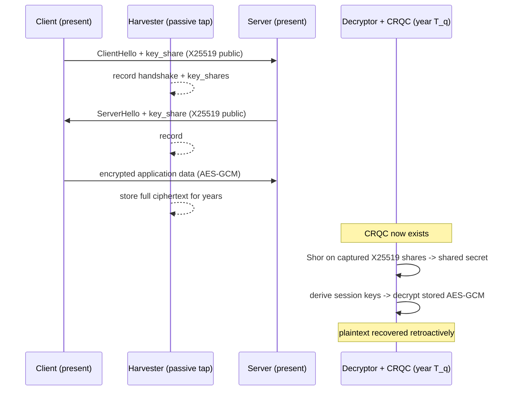
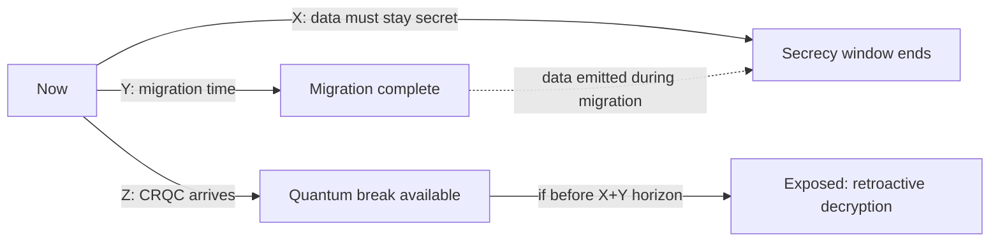
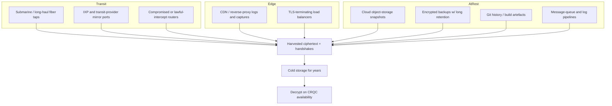
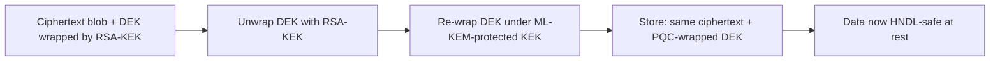
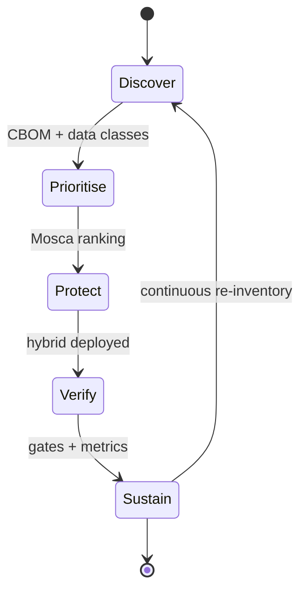

**Level:** Advanced · **Track:** Quantum Security · **Read time:** 330 min

This is Chapter 3 of the Quantum Security notebook. Chapter 1 built the machine — qubits, gates, interference, logical-versus-physical qubits — and Chapter 2 spent that machine on the two algorithms that matter, showing that Shor's algorithm collapses every public-key primitive in production while Grover barely dents symmetric cryptography. Both chapters ended on the same uncomfortable observation: the cryptographically relevant quantum computer (CRQC) does not exist yet, and yet the risk is already here. This chapter is about *why* the risk is already here, and what you do about it before the hardware arrives.

The mechanism is **harvest-now-decrypt-later** (HNDL, also written "store-now-decrypt-later" or "retrospective decryption"). An adversary who cannot break your RSA or ECDH key exchange today can still record your encrypted traffic today, sit on it for a decade, and decrypt it the moment a CRQC becomes available. Nothing about that attack requires a quantum computer to *exist now* — it requires only cheap storage now and patience. That single asymmetry is what turns "quantum is twenty years away" from a reason to relax into a reason to act.

The second half of the chapter is about the defensive property that makes migration survivable: **crypto-agility** — the ability to swap cryptographic primitives without re-architecting the system around them. Most systems fail this test badly, in ways that are invisible until the day you actually need to move. By the end you will be able to state your organisation's exposure as a number, inventory where the vulnerable crypto lives, and stand up the concrete fix (hybrid post-quantum key exchange) on the wire.

## Why This Matters

Every other chapter in this notebook describes a threat that becomes real when the hardware becomes real. HNDL is different: it is the one quantum risk whose *attack window is open now*. If any of your data has a confidentiality lifetime that stretches past the arrival of a CRQC, that data is exposed the moment it leaves your network encrypted with a classical key exchange, regardless of how strong that key exchange is against a classical attacker.

Consider what actually has a long shelf life:

- **Government and defense material** classified for 25, 50, or 75 years. A cable encrypted with X25519 and captured now is readable the day a CRQC runs Shor against that ephemeral key.
- **Health records**, which are protected for a patient's lifetime plus, in many jurisdictions, decades after.
- **Genomic data**, which is not just long-lived but *implicates relatives who never consented* and never changes — you cannot rotate someone's DNA.
- **Trade secrets, source code, and M&A material** whose value persists for the life of a product line or a patent.
- **Long-term credentials and root keys** — a CA root, a code-signing key, a firmware-update signing key — whose compromise years from now still forges trust that already-deployed devices honour.

None of these can be protected retroactively. Once the ciphertext is captured, your only defensive move — re-encrypting with a quantum-safe scheme — protects *future* sessions, not the recording already sitting on someone's disk. That is the property that makes HNDL uniquely unforgiving: **for long-lived secrets, the deadline to act passed the moment the data first crossed the wire.** The rest of this chapter turns that uncomfortable fact into a model you can compute with and a migration you can actually execute.

## Part 1: The Harvest-Now-Decrypt-Later Threat Model, Stated Precisely

Vague threat models produce vague defences. Let us state HNDL as an actual model with actors, capabilities, and assumptions, the way you would for a formal review.

**Actors.**

- *Defender.* Operates systems that encrypt data in transit and at rest using, at present, classical asymmetric primitives (RSA, ECDH/X25519, ECDSA/Ed25519) for key establishment and authentication, and symmetric primitives (AES-GCM, ChaCha20-Poly1305) for bulk encryption.
- *Harvester.* A passive adversary with the ability to *observe and store* ciphertext but not (yet) to break it. This is a strictly weaker adversary than one who can break the crypto — which is exactly why the attack is available now.
- *Future decryptor.* The same adversary (or a successor with access to the stored data) at a later time `T_q`, now equipped with a CRQC capable of running Shor against the captured key-exchange material.

**Capabilities and assumptions.**

1. The harvester can record encrypted sessions in full: the handshake (including the key-exchange messages) *and* the subsequent bulk ciphertext. This matters — recording only the bulk ciphertext without the handshake is far less useful, because the session keys are derived during the handshake.
2. Storage is effectively free at the relevant scale. Recording all TLS handshakes crossing a major transit link and the associated flows is an engineering problem, not an economic one.
3. The classical asymmetric key exchange in use is *recoverable* by Shor once a CRQC exists. For (finite-field) Diffie-Hellman, RSA key transport, and every elliptic-curve exchange (ECDH, X25519), the captured public values plus Shor yield the shared secret, hence the session keys, hence the plaintext.
4. The symmetric layer is *not* the weak point. AES-256-GCM protecting the bulk data is fine against Grover (Chapter 2); the break comes entirely through the asymmetric key establishment.

The crucial structural point: **the security of a recorded session is not the security of your crypto at capture time — it is the security of your crypto at the moment the adversary chooses to decrypt.** Forward secrecy, which normally saves you when a long-term key leaks, does *not* save you here, because Shor recovers the ephemeral key-exchange secret directly from the recorded handshake. Ephemeral ECDH gives you forward secrecy against a *classical* future key compromise; it gives you nothing against a *quantum* attack on the ephemeral exchange itself.



**What the harvester actually keeps.** It helps to be concrete about the bytes. For a TLS 1.3 session the harvester wants: the `ClientHello` and `ServerHello` (containing the `key_share` extensions — the ephemeral public values), enough of the record layer to identify the flow, and the encrypted application-data records. The ephemeral X25519 public value is 32 bytes; that 32-byte value, plus Shor, is what unlocks the entire session. The harvester does not need your server's long-term certificate private key at all — that is the counter-intuitive part people miss. Certificate-based authentication protects against a live man-in-the-middle; it does nothing to protect the *confidentiality* of a recorded session whose key agreement was ephemeral ECDH. The recorded 32 bytes are the whole ballgame.

**What is NOT in scope of HNDL.** HNDL is a *confidentiality* attack on recorded data. It does not, by itself, let the adversary forge signatures on live traffic, impersonate a server in real time, or tamper with data in flight — those require an *online* CRQC attacking a live handshake, which is a later and different threat (breaking authentication). The reason HNDL leads the migration conversation anyway is timing: authentication only needs to be quantum-safe *by the time a CRQC exists*, whereas confidentiality of long-lived data needs to be quantum-safe *now*, because the recording happens now. This distinction — **"encrypt now, sign later"** — drives the whole prioritisation of PQC rollout, and we return to it in Part 9.

## Part 2: Mosca's Inequality — Computing Your Exposure Window

You cannot manage HNDL risk with adjectives. Michele Mosca's inequality turns it into three numbers you estimate and compare. Define:

- **X — security shelf-life.** How many years your data must stay confidential *from the moment it is transmitted*. For a TLS session carrying a password reset, `X` might be minutes. For a diplomatic cable or a genome, `X` might be 50 years.
- **Y — migration time.** How many years it will take *your organisation* to fully migrate its systems to quantum-safe cryptography — discover every use of vulnerable crypto, test replacements, roll them out, and retire the old primitives. For a large enterprise with embedded devices and third-party dependencies, `Y` is measured in years, not months.
- **Z — collapse time (time to CRQC).** How many years until a quantum computer capable of breaking your current public-key crypto exists and is available to your adversary. This is the genuinely uncertain number.

**Mosca's inequality:** if

```
X + Y > Z
```

then you have a problem — specifically, data you transmit now will still need protection (`X` years) at a point after you have finished migrating (`Y` years from now), *but* the CRQC arrives (`Z` years from now) before that combined horizon closes. The intuition: you must *start* migrating at least `X + Y` years before `Z`, or some of the data you emit in the interim is decryptable within its required-secrecy window.



Work an example. Suppose your most sensitive long-lived data must stay secret for `X = 15` years. Your organisation, honestly assessed, needs `Y = 7` years to migrate everything (legacy HSMs, embedded fleet, vendor SDKs, a mainframe). You believe `Z ≈ 12` years to a relevant CRQC. Then `X + Y = 22 > 12 = Z`. You are already ten years *late* to start, in the sense that data emitted now with a 15-year secrecy requirement can be harvested and later broken well inside that window. The output of Mosca's inequality is not "panic" — it is a *prioritisation*: the data whose `X` is largest is the data that must move to quantum-safe protection first, even before you have finished the tooling to move everything.

| Parameter | What it measures | Who controls it | Typical range |
|---|---|---|---|
| X (shelf-life) | Years data must remain confidential from transmission | Data classification / regulation | Minutes → 75+ years |
| Y (migration time) | Years to fully deploy PQC across the estate | Your engineering + supply chain | 3 → 10+ years |
| Z (collapse time) | Years until an adversary has a CRQC | Physics + funding (uncertain) | Estimates cluster ~10–20 yrs |
| Verdict | X + Y vs Z | — | If X+Y > Z: act now on high-X data |

The honest engineering move is to treat `Z` as a *distribution*, not a point. You do not know when a CRQC arrives; you know it is not zero-probability within the lifetime of your long-lived data. Risk is `P(break within X) × impact`, and for anything with a large `X` and a catastrophic impact (national security, root keys, genomes), even a modest probability drives the expected loss high enough to justify moving now. **This is why NSA's CNSA 2.0 timeline mandates quantum-resistant algorithms for national-security systems on a fixed schedule regardless of whether a CRQC has appeared — the `X` for that data is so large that waiting for confirmation of `Z` is itself the failure mode.**

**A tiny model you can actually run.** Because `Z` is uncertain, express it as a probability that a CRQC exists by a given year and compute the expected exposure per data class. A short Python model (fully built in the lab, Part 14.2) makes the argument to a sceptical executive concrete: feed it your data classes and their `X` values, a curve for `P(CRQC by year)`, and it prints which classes are already past their "must-have-started" date. The point of turning this into code is that "we have time" becomes a falsifiable claim about specific numbers rather than a vibe.

## Part 3: Data Shelf-Life — The Variable That Decides Who Moves First

Because HNDL exposure is driven by `X`, the single most useful thing a defender can do early is *classify data by confidentiality lifetime*. Not everything needs to move at once; the recording only hurts you if the data is still sensitive when the CRQC arrives. A session cookie with a 30-minute lifetime is essentially immune to HNDL — even if the handshake is recorded and broken in ten years, the recovered plaintext is a cookie that expired a decade earlier. A 50-year defense secret is the opposite extreme.

| Data class | Typical secrecy lifetime (X) | HNDL exposure | Priority to move |
|---|---|---|---|
| Ephemeral session tokens, OTPs | Minutes–hours | Negligible | Low |
| Ordinary web session data | Days–weeks | Low | Low–medium |
| Personal data under privacy law (PII) | Years–decades | High | Medium–high |
| Health / medical records | Patient lifetime+ | High | High |
| Genomic data | Effectively permanent, implicates kin | Very high | Highest |
| Financial account/credential data | Until rotated (often years) | High | High |
| Trade secrets, source code, M&A | Product/patent lifetime | High | High |
| Long-term signing/root keys | Device/PKI lifetime | Catastrophic (forges trust) | Highest |
| Government classified (NSI) | 25/50/75 years | Catastrophic | Highest (mandated) |

Two subtleties that trip people up:

- **"At-rest" data still counts, and often counts more.** HNDL is usually explained with TLS-in-transit, but the same logic applies to any long-lived ciphertext: encrypted backups, encrypted database snapshots, encrypted object storage, full-disk images. If the *data-encryption key* (DEK) is wrapped by an RSA or ECC *key-encryption key* (KEK), then capturing the encrypted blob plus the wrapped key is enough — Shor recovers the KEK, unwraps the DEK, decrypts everything. Encrypted backups with a decade-long retention are a textbook HNDL target and are frequently overlooked because "it's already encrypted."
- **Keys have shelf-life too, and it is the worst kind.** A root CA key or a firmware-signing key does not just protect data — its compromise lets an attacker *mint new trust*. If a CRQC recovers the private key behind a long-lived code-signing certificate that thousands of deployed devices still trust, the attacker can sign malware those devices accept as genuine. This is why *authentication keys with long validity* are a first-class HNDL concern even though authentication is usually framed as a "later" problem: the key you sign with now may still be trusted the day it becomes forgeable.

**Bug-bounty / red-team relevance:** in an engagement, the crypto-lifetime lens is a *findings multiplier*. A report that says "this endpoint negotiates only classical X25519 key exchange" is low-severity on its own. The same finding attached to *"this endpoint carries lifetime-sensitive health records with a 30-year regulatory retention, over a link that transits three untrusted networks"* is a real risk narrative a CISO acts on. The skill is not just spotting the missing PQC — it is mapping it onto the data's `X`.

## Part 4: Exactly Which Primitives Are Exposed, and by What Mechanism

"Quantum breaks crypto" is too coarse to act on. HNDL exposure is entirely determined by *which primitive establishes or protects the key*, and each falls (or survives) for a specific reason established in Chapter 2. Internalise this table; it is the technical core of every migration decision.

| Primitive | Role | Quantum attack | Result | HNDL-relevant? |
|---|---|---|---|---|
| RSA (encryption / KEM / signatures) | Key transport, signatures | Shor (factoring) | Fully broken in poly time | Yes — recorded key transport recoverable |
| Finite-field Diffie-Hellman | Key exchange | Shor (discrete log) | Fully broken | Yes |
| ECDH / X25519 | Ephemeral key exchange | Shor (elliptic-curve discrete log) | Fully broken | **Yes — the main TLS exposure** |
| ECDSA / Ed25519 | Signatures | Shor (EC discrete log) | Fully broken | Long-validity keys: yes |
| DSA | Signatures | Shor (discrete log) | Fully broken | Long-validity keys: yes |
| AES-128 | Bulk encryption | Grover (√ speedup) | Effective ~2^64 *sequential*; far better than headlines (Ch. 2) | Marginal — prefer AES-256 |
| AES-256 | Bulk encryption | Grover | ~2^128 effective; safe | No |
| ChaCha20 | Bulk encryption | Grover | 256-bit key; safe | No |
| SHA-256 / SHA-384 / SHA-512 | Hashing / KDF / HMAC | Grover / BHT | Preimage/collision only mildly reduced; SHA-384+ safe | No |
| HMAC | Integrity/auth | — | Safe (symmetric) | No |

The single most important row for HNDL is **ECDH / X25519**, because it is the default key exchange in essentially every modern TLS 1.3, QUIC, WireGuard, and Signal session. Its ephemeral nature is what gives *classical* forward secrecy — and precisely what a CRQC undoes, because the ephemeral secret is derivable from the recorded public value by Shor. There is no "bigger curve" fix: P-521 or X448 buy you nothing against Shor, whose cost against elliptic-curve discrete log scales polynomially in the key size. Doubling the curve size roughly doubles the qubit budget; it does not restore hardness. The only real fix is a *different mathematical problem* — which is what ML-KEM provides (module-lattice learning-with-errors), and why the migration is an algorithm change, not a parameter change.

**Why AES is fine and you should say so out loud in meetings.** The reflexive response "let's move everything to a quantum-safe algorithm" wastes effort re-plumbing symmetric crypto that is already fine. Grover's speedup is √, it does not parallelise the way brute force does, and under any realistic depth limit AES-256 stays comfortably out of reach (Chapter 2 worked the exact numbers). Spend the migration budget on the asymmetric key exchange and on long-validity signatures, not on swapping AES.

**Why lattices resist Shor (the one-paragraph version).** Shor's power comes from reducing factoring and discrete log to the *hidden subgroup problem* over a finite *abelian* group, which the quantum Fourier transform solves efficiently (Chapter 2). RSA, DH, and every elliptic-curve scheme are abelian-hidden-subgroup problems in disguise, which is why they all fall to the same algorithm. Lattice problems — the Shortest Vector Problem and Learning With Errors underlying ML-KEM and ML-DSA — are *not* known to reduce to an abelian hidden subgroup, so the QFT trick does not apply, and no efficient quantum algorithm is known for them. That is the entire basis of the migration: you are not making the *same* problem harder, you are switching to a problem quantum computers are not known to solve. It is also why the hedge matters — "not known to be solvable" is a weaker guarantee than a proof, hence hybrid (Part 9).

## Part 5: Where Harvesting Actually Happens

To defend against harvesting you have to know where a passive adversary can stand. HNDL is not hypothetical plumbing; it maps onto real interception points that already carry the world's traffic.



The important categories:

1. **Bulk transit interception.** Fiber taps, transit-provider mirror ports, and internet-exchange collection points let a resourced adversary record enormous volumes of traffic passively. The handshakes and flows can be filtered and archived. Because the adversary is *passive*, there is no anomaly to detect on your side — no extra latency, no dropped packets, no unusual connections. This invisibility is exactly why HNDL is under-defended.
2. **Edge and CDN.** Traffic that terminates TLS at a CDN or reverse proxy is decrypted *there*; but the *client-to-edge* leg is still a classically protected session that can be harvested upstream, and the edge's own captures/logs are a target if the edge is compromised or subpoenaed.
3. **At-rest harvesting.** Anything with long retention is a static, patient target: encrypted backups, database snapshots, object-storage buckets, and — very commonly overlooked — **secrets and ciphertext committed to git history**. A private key or an encrypted blob deleted from `HEAD` still lives in the repo's history and in every clone and fork. **CTF angle:** "recover the flag from an old commit / encrypted backup" is a staple crypto/forensics category — the same primitive as at-rest HNDL, just compressed to a single challenge.
4. **Internal pipelines.** Log shippers, message queues, and analytics pipelines often move sensitive data between services over links assumed "internal and therefore safe." An adversary with a foothold can harvest there without breaking anything visibly.

The defensive takeaway is not "assume every fiber is tapped" — it is: **model where your long-`X` data crosses a boundary you do not control, and treat every such crossing as a potential harvest point.** For those specific flows, classical-only key exchange is the exposure.

## Part 6: Is Harvesting Real, or Theoretical?

A fair challenge from a skeptical architect: *is anyone actually storing exabytes of encrypted traffic on the bet that a CRQC arrives?* Answer this honestly, because overselling it destroys credibility.

What is *documented*:

- **Bulk collection of internet traffic exists and is operated at national scale.** Public disclosures over the past decade established that large intelligence programs perform mass collection of communications, including retention of encrypted content that could not be read at the time of collection, explicitly on the rationale that it *might* become readable later. Retention of undecipherable encrypted material for future analysis is a stated practice, not a hypothesis.
- **Storage economics support it.** The cost of storing a year of a major link's TLS handshakes and flows is trivial relative to the value of the plaintext for the highest-`X` classes. You do not need to store *everything*; targeted collection of specific high-value endpoints, networks, or organisations is cheap and precise.
- **Standards bodies and governments treat it as operative, not speculative.** The U.S. moved HNDL from "concern" to "policy": NSM-10 directs federal agencies to inventory cryptographic systems and prepare migration; NIST published the FIPS 203/204/205 PQC standards in 2024; NSA's CNSA 2.0 sets mandatory timelines. Governments do not issue binding migration mandates for threats they consider fictional.

What is *honest to concede*: we cannot point at a public receipt proving "adversary A stored organisation B's traffic in year N to break it in year M." The case for acting does not rest on that proof. It rests on: (a) the capability to harvest is demonstrably present and cheap; (b) the incentive is enormous for high-`X` data; (c) the defence must be in place *before* the harvest, and the harvest can be happening now, unobservably. Under those three conditions, waiting for confirmation is equivalent to accepting the loss, because confirmation arrives — if ever — only when your plaintext does. **Blue-team framing:** this is a classic "absence of evidence is not evidence of absence, and the control must precede the incident" situation, the same logic that justifies encrypting laptops before one is stolen.

## Part 7: Building a Crypto Inventory and a CBOM

You cannot migrate what you cannot see. Every credible PQC-readiness program starts with the same unglamorous step the standards all demand first: **discover every place your systems use cryptography.** The artefact you produce is a *cryptographic inventory*, increasingly formalised as a **CBOM — Cryptographic Bill of Materials** (an extension of the CycloneDX SBOM format that enumerates cryptographic assets: algorithms, key lengths, certificates, protocols, and their locations and dependencies).

What a crypto inventory must capture per asset:

| Field | Why it matters for PQC migration |
|---|---|
| Algorithm + parameters (e.g. `ECDH X25519`, `RSA-2048`, `AES-256-GCM`) | Determines whether it's quantum-vulnerable (asymmetric) or fine (AES-256) |
| Purpose (key exchange / signature / encryption / hashing) | Sets migration priority: confidentiality (now) vs authentication (later) |
| Location (host, service, file, library, HSM slot, cert) | You must be able to *find* it to change it |
| Data class it protects (its X) | Prioritisation via shelf-life |
| Owner / dependency chain | Who can change it; what breaks if you do |
| Agility (config-driven vs hardcoded vs in silicon) | How hard the swap is (see Part 8) |

Where the crypto actually hides — and why inventory is hard:

- **Application code and dependencies:** direct calls to crypto libraries, plus *transitive* dependencies you never chose (a logging library that pins an old TLS stack, an SDK that hardcodes RSA).
- **TLS/network config:** which cipher suites and key-exchange groups each endpoint actually negotiates, across every listener, load balancer, and service-mesh sidecar.
- **PKI:** every certificate, its signature algorithm and key type, its validity period, and the chain up to the root — long-validity certs with classical keys are high-priority.
- **Secrets management / KMS / HSM:** the KEKs wrapping your DEKs, and whether the HSM firmware can even *do* PQC.
- **Embedded / IoT / firmware:** crypto burned into devices with 10–20 year field lifetimes and no update path — often the hardest and highest-`X` category.
- **Protocols beyond TLS:** SSH, IPsec/IKE, S/MIME, code signing, VPNs, database TLS, mTLS between microservices (Part 11).

**A concrete CBOM entry.** CycloneDX 1.6 added `cryptographicAsset` components. A single inventory row for the "classical-only TLS endpoint" finding looks like this:

```json
{
  "components": [
    {
      "type": "cryptographic-asset",
      "name": "TLS key exchange - X25519",
      "bom-ref": "crypto/tls/web01/x25519",
      "cryptoProperties": {
        "assetType": "protocol",
        "protocolProperties": {
          "type": "tls",
          "version": "1.3",
          "cipherSuites": [{ "name": "TLS_AES_256_GCM_SHA384" }],
          "cryptoRefArray": ["crypto/kex/x25519"]
        }
      }
    },
    {
      "type": "cryptographic-asset",
      "name": "X25519 ECDH",
      "bom-ref": "crypto/kex/x25519",
      "cryptoProperties": {
        "assetType": "algorithm",
        "algorithmProperties": {
          "primitive": "key-agree",
          "parameterSetIdentifier": "Curve25519",
          "classicalSecurityLevel": 128,
          "nistQuantumSecurityLevel": 0,
          "cryptoFunctions": ["keygen", "encapsulate"]
        }
      }
    }
  ]
}
```

The field that makes this an HNDL inventory rather than a generic SBOM is `nistQuantumSecurityLevel: 0` — it flags the asset as quantum-vulnerable. Tag it further (out of band or via `properties`) with the data class `X` it protects, and you can sort your whole estate by "quantum-vulnerable AND high-X" — that sorted list *is* your migration backlog.

**Red-team / pentest relevance:** a cryptographic inventory *is* an attack-surface map. The same scanning that feeds a CBOM (enumerate every TLS endpoint, extract negotiated groups and cert algorithms) is reconnaissance you already do — you are just tagging findings with "quantum-vulnerable key exchange, protecting data of class X." The hands-on lab in Part 14 builds exactly this pipeline.

## Part 8: Crypto-Agility as an Architectural Property

"Crypto-agility" is thrown around as a slogan; treat it as a concrete, testable property: **can you change a cryptographic primitive — algorithm, key size, or parameter set — without re-architecting the system, and ideally without redeploying it?** Most systems fail, and they fail in predictable places.

A useful way to grade agility is by *where the algorithm choice lives*:

| Agility tier | Where the algorithm is decided | Time to swap | Example |
|---|---|---|---|
| Tier 0 — In silicon | Fixed-function hardware / ASIC / burned firmware | Years or never (replace device) | IoT sensor with RSA in ROM |
| Tier 1 — Hardcoded | Constant in source, recompiled to change | Weeks–months (rebuild, retest, redeploy) | `cipher = "AES-256-CBC"` in code |
| Tier 2 — Config-driven | Named in config / policy, restart to change | Days | TLS cipher list in a config file |
| Tier 3 — Negotiated / abstracted | Chosen at runtime via a crypto-provider abstraction or protocol negotiation | Minutes–hours (policy push) | TLS group negotiation; a provider interface |

The goal of a crypto-agility program is to *raise everything that protects long-`X` data toward Tier 2/3*. Concrete engineering patterns that get you there:

1. **Algorithm indirection.** Never call `RSA_encrypt()` directly across your codebase. Call an interface — `KeyEncapsulation.encapsulate()` — whose concrete implementation is selected by configuration. Swapping RSA→ML-KEM becomes a config change plus a new provider, not a code hunt.
2. **Cryptographic identifiers carried in the data.** Store algorithm identifiers *alongside* ciphertext and keys (as protocols like TLS, JOSE/JWT `alg`, and JWK already do). If a ciphertext blob records "this was wrapped with alg=X," you can support old and new simultaneously and decrypt legacy data while writing new data with the new algorithm. **Security caveat, learned the hard way from JWT:** an attacker-controlled algorithm field is a vulnerability (the classic `alg:none` and RS256→HS256 confusion attacks — see the JWT chapter). Agility means *you* can choose the algorithm, not that the *attacker* can. Constrain the accepted set server-side.
3. **Versioned key and ciphertext formats.** A one-byte version/format prefix on every stored ciphertext lets you introduce new schemes and migrate lazily (decrypt-with-old, re-encrypt-with-new on next write) — this is exactly the primitive the at-rest rewrap workflow in Part 12 depends on.
4. **Centralised crypto policy.** A single place (a service, a policy engine, an HSM policy) decides allowed algorithms, so you can tighten policy across the fleet without touching every service.
5. **Hybrid-capable interfaces.** Design the KEM/signature interface to allow *combining* two algorithms (classical + PQC) so you can run hybrid during the transition (Part 9) — an interface that only holds one algorithm makes hybrid painful.

**Why agility is the real deliverable, not "PQC deployed."** PQC standards are new; parameter sets and even algorithm choices may shift as cryptanalysis matures (the SIKE isogeny scheme, a former PQC candidate, was broken *classically* in 2022 after years as a finalist — a permanent reminder that today's PQC pick is not guaranteed permanent). If your systems are agile, a future "swap ML-KEM-768 for whatever replaces it" is a controlled change. If they are not, you will do this whole painful migration *again*. Agility is what converts a one-time crisis into routine maintenance.

## Part 9: Hybrid Key Exchange and How Migration Works on the Wire

The migration primitive the industry converged on is **hybrid key exchange**: run a classical key exchange (X25519) *and* a post-quantum KEM (ML-KEM) in the same handshake, and derive the session key from *both* shared secrets combined. The session is secure as long as *at least one* of the two is unbroken.

Why hybrid rather than "just switch to PQC"? Because the PQC schemes are newer and less battle-tested than 25 years of ECDH cryptanalysis. Hybrid hedges: if ML-KEM turns out to have a flaw, X25519 still protects you against a classical attacker; if X25519 falls to a CRQC, ML-KEM still protects you against the quantum attacker. You only lose if *both* break. This is the responsible default for the transition, and it is what TLS 1.3 deployments have been shipping.

The concrete, standardised construction in TLS 1.3 is the named group **`X25519MLKEM768`** (IANA codepoint `0x11EC`), which combines X25519 with ML-KEM-768. On the wire:

```mermaid
sequenceDiagram
    participant C as Client
    participant S as Server
    C->>S: ClientHello, key_share = X25519 pubkey || ML-KEM-768 encaps key
    S->>S: X25519: derive ss1 ; ML-KEM: encapsulate -> ss2 + ciphertext
    S->>C: ServerHello, key_share = X25519 pubkey || ML-KEM-768 ciphertext
    C->>C: X25519: derive ss1 ; ML-KEM: decapsulate -> ss2
    Note over C,S: shared secret = KDF(ss1 || ss2)  (both must break to lose)
    C->>S: Finished (encrypted with keys from combined secret)
    S->>C: Finished
```

**How the two secrets are actually combined matters.** "Derive from both" is not "XOR them and hope." The TLS 1.3 hybrid design *concatenates* the two shared secrets (`ss1 || ss2`) and feeds the concatenation into the normal HKDF key schedule. This concatenate-then-KDF construction is a *combiner*, and it is chosen so that the result is secure as long as at least one input secret is unpredictable — even if an attacker fully controls or knows the other. That property is exactly what "you only lose if both break" means cryptographically, and it is why you cannot get sloppy and, say, use only one secret when the other is "probably fine." A naive combiner (plain XOR of raw secrets, or dropping one secret under some condition) can silently destroy the hedge. When you evaluate a vendor's "hybrid" claim, ask *how* the secrets are combined; the answer should be a KDF over the concatenation (or an equivalent proven combiner), applied unconditionally.

Two further engineering realities you will actually hit:

- **The handshake gets bigger.** ML-KEM-768 keys and ciphertexts are ~1.1 KB each, versus 32 bytes for an X25519 public value. The ClientHello can now exceed a single packet, which surfaces long-dormant bugs in middleboxes and servers that assumed a small ClientHello. Early hybrid-TLS rollouts hit exactly this ("ClientHello too large" / fragmentation intolerance in old load balancers) — a real-world config quirk worth testing for.
- **"Encrypt now, sign later" prioritisation.** Notice hybrid *key exchange* protects confidentiality — the thing HNDL attacks — so it is deployed *first and now*. Post-quantum *signatures* (authentication) protect against an *online* CRQC forging handshakes, a threat only once a CRQC exists; so PQC signatures, while necessary, are less urgent than PQC key exchange. This is why `X25519MLKEM768` ships in browsers and servers now while PQC certificate signatures lag — the deployment order follows the threat timing derived in Part 1.

## Part 10: The Standards Landscape and the Numbers You Migrate Toward

The migration target is no longer a moving research question; NIST finalised the first standards in August 2024. Know these by name, because your tooling, vendors, and auditors will use them:

| Standard | Algorithm (old candidate name) | Purpose | Security categories / parameter sets |
|---|---|---|---|
| **FIPS 203** | **ML-KEM** (CRYSTALS-Kyber) | Key encapsulation (key exchange) | ML-KEM-512 / -768 / -1024 |
| **FIPS 204** | **ML-DSA** (CRYSTALS-Dilithium) | Digital signatures (general purpose) | ML-DSA-44 / -65 / -87 |
| **FIPS 205** | **SLH-DSA** (SPHINCS+) | Hash-based signatures (stateless, conservative) | Several (SHA2/SHAKE, s/f variants) |
| **FIPS 206 (draft)** | **FN-DSA** (FALCON) | Compact lattice signatures | To be finalised |

Guidance for choosing:

- **Key exchange / confidentiality:** ML-KEM (usually ML-KEM-768 as the balanced default), deployed *hybrid* with X25519 during transition. This is your HNDL fix.
- **Signatures:** ML-DSA as the general default. **SLH-DSA** (hash-based) when you want maximum conservatism — its security rests only on hash-function assumptions, no lattice math — at the cost of large signatures; ideal for *rarely-signed, long-lived* things like firmware roots. FN-DSA/FALCON when signature *size* is critical.
- **Symmetric / hashing:** no new standard needed — stay on **AES-256** and **SHA-384/SHA-512**, which Grover does not meaningfully threaten (Chapter 2). Do *not* let a vendor sell you a "quantum-safe symmetric cipher"; AES-256 already is one.

**The sizes matter — this is why migration is not free.** PQC keys and signatures are much larger than the classical primitives they replace, which is exactly what breaks middleboxes, bloats certificates, and stresses constrained devices. Rough public numbers:

| Scheme | Public key | Ciphertext / signature | Vs. classical |
|---|---|---|---|
| X25519 (classical KEX) | 32 B | 32 B | baseline |
| ML-KEM-768 | ~1,184 B | ~1,088 B (ciphertext) | ~35× larger |
| RSA-3072 signature | 384 B (sig) | — | baseline |
| Ed25519 signature | 32 B key / 64 B sig | — | baseline |
| ML-DSA-65 | ~1,952 B key | ~3,309 B sig | ~50× larger sig |
| SLH-DSA (128s) | 32 B key | ~7,856 B sig | ~120× larger sig |
| FN-DSA-512 (FALCON) | ~897 B key | ~666 B sig | smaller than ML-DSA |

Read this table as a *deployment risk map*: the ML-KEM ciphertext size is why the hybrid ClientHello overflows a packet; the SLH-DSA signature size is why you reserve it for rarely-signed roots rather than per-request TLS handshakes; FN-DSA's small signatures are why size-constrained ecosystems eye it despite implementation complexity.

Complementary policy anchors: **NSA CNSA 2.0** (mandatory PQC for U.S. national-security systems, on a schedule reaching exclusive PQC use around 2030–2033 depending on category), **NSM-10** (federal inventory + migration), and the growing set of protocol integrations covered next.

## Part 11: PQC Beyond TLS — SSH, IPsec, S/MIME, and Code Signing

TLS gets the headlines, but your long-`X` data flows through other protocols that each need their own hybrid story. A migration that fixes only HTTPS and declares victory leaves large exposures.

- **SSH.** OpenSSH added hybrid post-quantum key exchange years ago (`sntrup761x25519-sha512`, later ML-KEM hybrids such as `mlkem768x25519-sha256`) and now defaults to a PQC hybrid on modern versions. Any SSH session carrying long-`X` material (an admin transferring source, a `git` push over SSH to a repo full of trade secrets) is HNDL-exposed if it negotiates classical-only KEX. Check with `ssh -Q kex` and pin the hybrid group in `KexAlgorithms`.
  ```bash
  ssh -Q kex | grep -Ei 'mlkem|sntrup'          # is a PQC hybrid available?
  ssh -o KexAlgorithms=mlkem768x25519-sha256 host  # force it
  ```
- **IPsec / IKEv2 (VPNs).** Site-to-site and remote-access VPNs are prime HNDL targets — they aggregate an organisation's traffic over a single tunnel that transits the public internet. IKEv2 supports additional post-quantum key exchanges via the "multiple/additional key exchanges" mechanism, letting you layer an ML-KEM exchange on top of the classical DH. If your VPN concentrator predates that support, the tunnel's confidentiality has a hard classical ceiling.
- **S/MIME and encrypted email.** Email is stored for years by design — the archetypal at-rest long-`X` corpus. S/MIME encryption to an RSA/ECC recipient key is decryptable retroactively once that key falls. PQC S/MIME is still maturing; in the interim, treat long-retention encrypted mail as high-priority for re-protection.
- **Code signing and firmware.** Here the concern is authentication-with-long-validity (Part 3): a firmware-signing key trusted by a fleet for 10–20 years must move to a PQC signature (often SLH-DSA for conservatism) *before* a CRQC can forge it, or an attacker mints signed malware the fleet accepts. This is the one authentication case that is urgent now, precisely because the *validity window* is so long.

The unifying rule: **enumerate every protocol that establishes keys or verifies signatures over a boundary you do not control, and apply the same "hybrid KEX now, PQC signatures for long-validity keys" logic to each.** TLS is the first, not the only.

## Part 12: Re-Encrypting Data at Rest — The Rewrap Workflow

Deploying hybrid TLS protects *future* sessions. It does nothing for the encrypted blob already sitting in a backup, an S3 bucket, or a database with the DEK wrapped under an RSA KEK. Shrinking an *existing* at-rest exposure requires actively re-protecting the data before it is harvested — the **rewrap** workflow. The standard envelope-encryption pattern makes this cheap: you re-wrap the small DEK under a new PQC-protected KEK; you do not re-encrypt the (large) data itself.



Concretely, the steps and where they hurt:

1. **Inventory wrapped DEKs** (the Part 7 CBOM finds the RSA-KEK-wrapped ones).
2. **Stand up a PQC-capable KEK** in your KMS/HSM — this is the gating dependency: many HSMs cannot yet do ML-KEM in firmware, and you may need a software KEM provider or a hybrid wrap (encrypt the DEK to *both* an RSA KEK and an ML-KEM KEK, mirroring hybrid TLS).
3. **Rewrap lazily or in a campaign.** The versioned-ciphertext-format pattern from Part 8 lets you rewrap on next access; a compliance deadline may force a bulk campaign instead.
4. **Rotate and retire the old KEK** once everything is rewrapped, so the classical KEK is no longer a single point of quantum failure.

A minimal illustration of the *hybrid wrap* (encrypt the DEK under both, so an attacker must break both to unwrap):

```python
# Conceptual: hybrid DEK wrap = classical wrap XOR-composed with PQC wrap.
# The DEK is recoverable only by someone who can unwrap BOTH.
dek = os.urandom(32)                          # data-encryption key (protects the big blob)
wrap_rsa   = rsa_kek.encrypt(dek, OAEP(...))  # classical arm (today)
ss, ct     = mlkem_kek.encapsulate()          # PQC arm: shared secret + ciphertext
wrap_pqc   = aes_gcm(key=ss).encrypt(dek)     # wrap DEK under ML-KEM-derived key
store(blob_ciphertext, wrap_rsa, wrap_pqc, ct, alg_version=2)  # carry alg id (agility)
```

**Crypto-shredding — the cheaper cousin.** If a body of at-rest data has reached the end of its useful life but must remain *encrypted-and-inaccessible* rather than deleted, you do not have to rewrap it — you can **crypto-shred**: destroy the KEK so the DEK can never be unwrapped again, rendering the ciphertext permanently opaque. Against HNDL this is a blunt but effective control for data you no longer need to read: no key, no future decryption, even by a CRQC. The caveat is symmetric with rewrap — shredding *your* KEK does nothing about a copy of the DEK an adversary already harvested; it only guarantees that *you* (and anyone who must go through your KMS) cannot recover it. Use crypto-shredding to enforce retention limits (Part 16, control 5) and rewrap for data you must keep readable.

**The catch to state plainly:** rewrap only helps for data an adversary has **not yet harvested**. If the blob and its RSA-wrapped DEK were already copied to an adversary's cold storage last year, rewrapping your copy changes nothing about theirs. That is why at-rest rewrap is urgent for *long-retention, high-`X`* stores and why the honest framing is "shrink the window," not "undo the exposure."

## Part 13: Real Production Deployments (You Are Not First)

A useful counter to "this is all theoretical" is that major systems already shipped post-quantum protection for exactly the HNDL reason. Reference these when you need to show a migration is proven, not experimental.

- **Signal — PQXDH.** Signal upgraded its X3DH key-agreement to **PQXDH**, adding an ML-KEM (Kyber) shared secret alongside the classical X25519 secrets, precisely to defend against harvest-now-decrypt-later on the initial key agreement. It is hybrid, for the same "only lose if both break" reason as TLS.
- **Apple — iMessage PQ3.** Apple introduced **PQ3**, a protocol level it describes as post-quantum for both initial key establishment *and* ongoing rekeying (not just the first message), again hybrid with classical ECC. The explicit motivation in Apple's write-up is HNDL against a future quantum adversary.
- **Chrome / Cloudflare / TLS at scale.** Browsers and large CDNs enabled hybrid `X25519MLKEM768` (and its predecessor `X25519Kyber768`) for a large fraction of TLS connections. This is the deployment that surfaced the "ClientHello too large" middlebox intolerance in the wild and drove fixes across the ecosystem — real operational evidence of the Part 9 size pitfall.
- **AWS / cloud KMS and transit.** Cloud providers added PQ-hybrid TLS options for service endpoints and SDK traffic, so customers can opt long-`X` API traffic into hybrid key exchange today.

The pattern across all four: **hybrid (classical + ML-KEM), key exchange first, confidentiality as the driver.** That is the same prioritisation this chapter derives from first principles — you are following a paved road, not blazing one.

## Part 14: Hands-On Lab — Inventory, Model Risk, Scan, and Stand Up Hybrid PQC

This lab builds the practical skeleton of an HNDL-readiness workflow: (1) inventory crypto in a codebase, (2) turn Mosca's inequality into a runnable risk model, (3) scan live TLS endpoints for quantum-vulnerable key exchange and emit a CBOM row, (4) stand up a hybrid-PQC TLS server and confirm `X25519MLKEM768` on the wire. Everything runs on a normal Linux workstation (examples on Kali/Ubuntu). All targets are your own hosts — only test systems you are authorised to test.

### 14.1 Tooling from scratch

Four tools; each introduced before use.

- **`grep`/`ripgrep` (`rg`)** — fast recursive text search; here, to find crypto usage in source. `rg` is grep with sane defaults (recursive, respects `.gitignore`, fast). Install: `sudo apt install ripgrep`.
- **`testssl.sh`** — a single Bash script that connects to a TLS service and reports every protocol, cipher suite, key-exchange group, and certificate detail it negotiates. No agent, pure client-side probing; the workhorse for TLS crypto inventory. Install: `git clone --depth 1 https://github.com/testssl/testssl.sh.git`.
- **`nmap` with the `ssl-enum-ciphers` script** — network scanner; the NSE script enumerates supported TLS ciphers per port. Good for sweeping *many* hosts. Install: `sudo apt install nmap`.
- **OpenSSL 3.5+** — the crypto toolkit and a TLS test server/client. OpenSSL 3.5 (2025) ships native ML-KEM and the `X25519MLKEM768` hybrid group, so no external provider is needed. Verify: `openssl version`.

### 14.2 Model your exposure with Mosca's inequality

Turn the Part 2 abstraction into a script leadership can argue with. It computes, per data class, whether you are already past the "must have started migrating" date given a probability that a CRQC exists by a year.

```python
#!/usr/bin/env python3
# mosca.py - compute HNDL exposure per data class
import datetime

NOW = datetime.date.today().year
Y_migration = 7          # honest years to fully migrate the estate

# P(CRQC exists by year) - a deliberately conservative guess you can defend
def p_crqc_by(year):
    # linear ramp: ~0 by 2030, ~1.0 by 2045
    return max(0.0, min(1.0, (year - 2030) / 15.0))

# data classes: (name, shelf_life_X_years)
classes = [
    ("Session tokens",       0.02),   # ~1 week
    ("PII (privacy law)",    10),
    ("Health records",       40),
    ("Genomic data",         80),
    ("Firmware signing key",  15),
    ("Classified (NSI)",     50),
]

print(f"{'class':22} {'X':>4} {'X+Y':>5} {'must-start-by':>13} {'P(broken in X)':>14}")
for name, X in classes:
    must_start_by = NOW  # data emitted now; break can occur at NOW+? 
    horizon = NOW + X            # last year this data must stay secret
    p_broken = p_crqc_by(horizon)  # prob a CRQC exists before secrecy ends
    verdict = "ACT NOW" if (X + Y_migration) > (2043 - NOW) else "monitor"
    print(f"{name:22} {X:>4} {X+Y_migration:>5} {NOW:>13} {p_broken:>13.0%}  {verdict}")
```

Realistic output:

```
class                    X   X+Y must-start-by P(broken in X)
Session tokens        0.02  7.02          2026            0%   monitor
PII (privacy law)       10    17          2026           40%   ACT NOW
Health records          40    47          2026          100%   ACT NOW
Genomic data            80    87          2026          100%   ACT NOW
Firmware signing key    15    22          2026           73%   ACT NOW
Classified (NSI)        50    57          2026          100%   ACT NOW
```

The value is the shape: session tokens are safe, everything with a decade-plus `X` is already in "act now." That is a defensible, numbers-first case for sequencing the migration — and it is exactly what a board wants instead of "quantum is scary."

### 14.3 Inventory crypto in a codebase

Search for the fingerprints of quantum-vulnerable and hardcoded crypto. The point is to *find and tag*, not to judge each hit yet.

```bash
# Find asymmetric algorithm usage (the quantum-vulnerable class)
rg -n -i --stats \
  -e 'RSA' -e 'ECDSA' -e 'ECDH' -e 'X25519' -e 'Ed25519' \
  -e 'DiffieHellman' -e 'secp256|prime256|NIST P-256' \
  --glob '!**/node_modules/**' --glob '!**/.git/**' .

# Find hardcoded cipher/curve choices (agility Tier 1 smells)
rg -n -i -e 'AES-?(128|256)-(CBC|GCM)' -e '"RSA' -e 'MGF1' \
  -e 'setAlgorithm|Cipher\.getInstance|crypto\.createCipher' .

# Find certificate and key files to feed cert inventory
find . -type f \( -name '*.pem' -o -name '*.crt' -o -name '*.key' \
  -o -name '*.p12' -o -name '*.pfx' \) 2>/dev/null
```

Realistic output (trimmed) from the first command:

```
services/auth/jwt.go
  41:    priv, err := rsa.GenerateKey(rand.Reader, 2048)   // RSA-2048 signing key
  88:    token.SignedString(priv)                          // classical signature

lib/kms/wrap.py
  17:    kek = load_pem_public_key(RSA_KEK_PEM)             // RSA key-encryption key
  23:    wrapped = kek.encrypt(dek, padding.OAEP(...))      // DEK wrapped w/ RSA -> HNDL at rest

frontend/tls.conf
  9:    ssl_ecdh_curve X25519;                              // classical-only key exchange

341 matches
227 files searched
```

Each hit becomes a CBOM row. The `lib/kms/wrap.py` line is the highest-priority finding here: an **RSA-wrapped DEK protecting data at rest** is a direct at-rest HNDL exposure — capture the encrypted blobs plus the wrapped key now, recover the RSA KEK with Shor later, unwrap everything. This is precisely the case the Part 12 rewrap workflow fixes. Tag it with the data class it protects to set priority.

### 14.4 Scan live endpoints and emit CBOM rows

Point `testssl.sh` at an endpoint and pull out the key-exchange groups:

```bash
./testssl.sh --quiet --color 0 -E -f https://target.example.internal:443
```

Trimmed output:

```
 Testing key exchange (KEX) groups

  X25519 (256 bit)        offered (OK)
  secp256r1 (256 bit)     offered (OK)
  secp384r1 (384 bit)     offered
  X25519MLKEM768          not offered
```

Interpretation: the server offers only *classical* groups (X25519, secp256r1/384r1) and **does not offer the hybrid PQC group** — so every session it negotiates is HNDL-exposed. That single line, `X25519MLKEM768 not offered`, is the finding.

Sweep many hosts with nmap and grep for the KEX line:

```bash
nmap -Pn -p 443 --script ssl-enum-ciphers -oN tls-inventory.txt 10.0.0.0/24
grep -E 'X25519MLKEM768|not offered|kex' tls-inventory.txt
```

Build a tiny CBOM-style CSV from a host list (the one field that matters most: is hybrid PQC offered?):

```bash
for host in $(cat hosts.txt); do
  kex=$(./testssl.sh --quiet --color 0 -E -f "https://$host:443" 2>/dev/null \
        | grep -Eo 'X25519MLKEM768|X25519|secp256r1' | paste -sd';' -)
  hybrid=$( [[ "$kex" == *X25519MLKEM768* ]] && echo yes || echo NO )
  echo "$host,\"$kex\",$hybrid"
done | tee cbom-kex.csv
```

```
web01.example.internal,"X25519;secp256r1",NO
api.example.internal,"X25519MLKEM768;X25519;secp256r1",yes
legacy.example.internal,"secp256r1",NO
```

Every `NO` row is a system emitting HNDL-exposed sessions. Prioritise by the `X` of the data each carries — join this CSV against your Part 14.2 data-class model.

### 14.5 Stand up a hybrid-PQC TLS server and prove it on the wire

With OpenSSL 3.5+, confirm ML-KEM and the hybrid group are available, then run a test server that requires the hybrid group and capture the handshake.

```bash
openssl version                      # expect OpenSSL 3.5.x or newer
openssl list -kem-algorithms | grep -i mlkem
openssl list -tls-groups  | grep -i mlkem
```

```
  ML-KEM-512 @ default
  ML-KEM-768 @ default
  ML-KEM-1024 @ default
  X25519MLKEM768
  SecP256r1MLKEM768
```

Generate a throwaway cert and start a TLS 1.3 server pinned to the hybrid group:

```bash
openssl req -x509 -newkey rsa:2048 -keyout key.pem -out cert.pem \
  -days 1 -nodes -subj "/CN=pqc-lab.local"

openssl s_server -accept 4443 -cert cert.pem -key key.pem \
  -tls1_3 -groups X25519MLKEM768 -www
```

From another terminal, connect and force the hybrid group, then read the negotiated group back:

```bash
openssl s_client -connect localhost:4443 -groups X25519MLKEM768 \
  -tls1_3 </dev/null 2>/dev/null | grep -Ei 'Negotiated|group|Cipher'
```

```
Negotiated TLS1.3 group: X25519MLKEM768
New, TLSv1.3, Cipher is TLS_AES_256_GCM_SHA384
```

`Negotiated TLS1.3 group: X25519MLKEM768` is the win condition — the session key is now derived from both X25519 *and* ML-KEM-768, so a future CRQC that breaks the X25519 half still cannot recover the key without also breaking ML-KEM.

Optionally, watch the enlarged ClientHello on the wire — this is where you would catch the "ClientHello too large" middlebox bug from Part 9:

```bash
sudo tcpdump -i lo -s 0 -A 'tcp port 4443' -c 20 | \
  grep -aiE 'key_share|client hello'
```

For a cleaner view, decode the handshake with Wireshark's `tshark` and compare the `key_share` group and size between a classical and a hybrid ClientHello:

```bash
# Classical connection
tshark -i lo -f 'tcp port 4443' -Y 'tls.handshake.type == 1' \
  -T fields -e tls.handshake.extensions_key_share_group \
           -e tls.record.length &
openssl s_client -connect localhost:4443 -groups X25519 -tls1_3 </dev/null

# Hybrid connection (same capture)
openssl s_client -connect localhost:4443 -groups X25519MLKEM768 -tls1_3 </dev/null
```

Annotated result:

```
# classical X25519 ClientHello
key_share group: 0x001d (x25519)          record length: 231     <- fits one segment

# hybrid X25519MLKEM768 ClientHello
key_share group: 0x11ec (X25519MLKEM768)  record length: 1387    <- ~6x larger
```

The jump from a 231-byte to a ~1,387-byte handshake record — driven almost entirely by the ML-KEM-768 encapsulation key riding alongside X25519's 32 bytes — is the concrete size cost, and exactly the thing to regression-test against your real load balancers, WAFs, and legacy TLS terminators before rolling hybrid to production. A middlebox that silently drops or mangles a ClientHello above ~1 KB is the number-one cause of "hybrid broke some clients" in real rollouts (Part 13).

### 14.6 Emit a machine-readable CBOM from the scan

The CSV is fine for humans; auditors and CI want structured CBOM. This script turns the scan into CycloneDX `cryptographic-asset` components (the format from Part 7), one per endpoint, flagging the quantum-vulnerable ones:

```python
#!/usr/bin/env python3
# cbom.py - turn a hybrid-offered scan into CycloneDX cryptographic-asset CBOM
import csv, json, sys

components = []
for host, kex, hybrid in csv.reader(open(sys.argv[1])):     # cbom-kex.csv
    quantum_level = 1 if hybrid.strip() == "yes" else 0     # 0 = vulnerable
    components.append({
        "type": "cryptographic-asset",
        "name": f"TLS KEX - {host}",
        "bom-ref": f"crypto/tls/{host}",
        "cryptoProperties": {
            "assetType": "protocol",
            "protocolProperties": {"type": "tls", "version": "1.3"},
            "algorithmProperties": {
                "primitive": "key-agree",
                "parameterSetIdentifier": kex,
                "nistQuantumSecurityLevel": quantum_level,
            },
        },
    })

bom = {
    "bomFormat": "CycloneDX", "specVersion": "1.6", "version": 1,
    "metadata": {"component": {"type": "application", "name": "tls-estate"}},
    "components": components,
}
json.dump(bom, sys.stdout, indent=2)
```

```bash
python3 cbom.py cbom-kex.csv > cbom.json
jq '[.components[] | select(.cryptoProperties.algorithmProperties.nistQuantumSecurityLevel==0) | .name]' cbom.json
```

```json
[
  "TLS KEX - web01.example.internal",
  "TLS KEX - legacy.example.internal"
]
```

That `jq` filter — "give me every asset at quantum security level 0" — is your migration backlog as a query. Wire the same check into CI to *fail a build* that introduces a new level-0 asset on a high-`X` path, and agility becomes an enforced guardrail (Part 16).

### 14.7 What you produced

At the end you have: (a) a defensible per-data-class risk model from `mosca.py`, (b) a code-level crypto inventory with the RSA-KEK-at-rest finding flagged, (c) a `cbom-kex.csv` and a machine-readable `cbom.json` mapping endpoints to quantum-vulnerability, and (d) a working hybrid-PQC TLS endpoint proving the fix negotiates end to end. That is the minimum viable HNDL-readiness loop: *model → inventory → prioritise by X → deploy hybrid → verify on the wire.*

## Part 15: Common Misconfigurations and Pitfalls

Migration goes wrong in repeatable ways. Watch for these:

- **"We use AES-256, so we're quantum-safe."** AES-256 protects the *bulk*, but if the *key exchange* is classical, the bulk key is recoverable via the handshake. Symmetric strength does not save a classically negotiated session. The weak link is asymmetric (Part 4).
- **Forward secrecy misread as quantum-safety.** Ephemeral ECDH gives forward secrecy against future *classical* long-term-key compromise. It gives *zero* protection against a quantum break of the *ephemeral* exchange itself, which is precisely what Shor does. People conflate "PFS" with "safe from HNDL" — it is not.
- **Only fixing in-transit, ignoring at-rest.** Teams flip on hybrid TLS and declare victory while decade-retention encrypted backups still wrap their DEKs with RSA. At-rest is often the *larger* HNDL surface because the ciphertext sits still for years by design (Part 12).
- **Fixing only TLS and forgetting SSH/IPsec/S-MIME/code signing.** Long-`X` data flows through VPNs, admin SSH, and email too (Part 11). A TLS-only migration leaves those exposed.
- **Hardcoded algorithms discovered too late.** A Tier-1 (hardcoded) or Tier-0 (in-silicon) crypto choice found only during migration turns a config change into a firmware campaign or a hardware refresh. Inventory *early* so agility gaps surface while you still have runway.
- **Downgrade and negotiation gaps.** If a server offers hybrid *and* classical groups and does not prefer/require hybrid where policy demands it, an active attacker can force the classical group — or a passive one simply records the sessions where classical was negotiated. Preference order and policy enforcement matter, not just capability.
- **Attacker-chosen algorithm fields.** Agility mechanisms that carry an algorithm identifier in data (JWT `alg`, ciphertext headers) must constrain the accepted set server-side. The JWT `alg:none` / RS256→HS256 attacks are the canonical warning: agility must not become attacker-controlled algorithm downgrade.
- **ClientHello size / middlebox intolerance.** The larger hybrid ClientHello breaks brittle middleboxes and old TLS stacks that assumed it fits one packet. Test the *whole path*, not just the endpoints, before flipping hybrid on in production (Part 9, Part 13).
- **Trusting vendor "quantum-safe" claims without checking the primitive.** Ask exactly which FIPS 203/204/205 algorithm and parameter set, deployed hybrid or standalone, and whether the HSM/firmware can actually run it. "Quantum-safe" with no named standard behind it is marketing.

## Part 16: Detection & Defense Angle

HNDL's defining property is that the *harvesting* is passive and undetectable — there is no packet you can catch, no alert that fires when a fiber is mirrored. That reshapes the defensive posture: **you cannot detect the attack, so the entire defence is preventive and inventory-driven.** Concretely, a defender's program is:

1. **Inventory continuously (CBOM).** Maintain a living cryptographic inventory (Part 7) as code and infrastructure change. Automated CBOM generation in CI (fail the build if a service introduces classical-only key exchange for a high-`X` data path) turns agility into a guardrail rather than a one-time project.
2. **Prioritise by shelf-life (Mosca).** Move the largest-`X` data first: long-retention backups, PKI roots, health/genomic/classified data, long-validity signing keys. Compute `X + Y` against a conservative `Z` and let it drive sequencing (Part 14.2).
3. **Deploy hybrid key exchange now** on every path — TLS, SSH, IPsec — carrying long-`X` data across a boundary you do not control. This is the actual HNDL fix; it protects *future* sessions, so the sooner it ships, the smaller the exposed window.
4. **Re-encrypt at-rest data** whose secrecy window outlives the CRQC horizon: rewrap DEKs under PQC-protected KEKs, re-encrypt long-retention backups (Part 12). This is the only way to shrink an *already-existing* at-rest exposure — and only if you do it before the corresponding ciphertext is harvested.
5. **Shorten `X` where you can.** Data you do not retain cannot be harvested from you; data with a shorter mandated secrecy lifetime is less exposed. Aggressive data minimisation and retention limits are an underrated HNDL control.
6. **Instrument the migration.** Track "% of high-`X` flows on hybrid PQC" and "% of long-validity certs on PQC signatures" as real metrics. What you *can* detect is your own coverage gaps.

**Blue-team monitoring you *can* do:** while you cannot see passive taps, you can (a) detect *active* downgrade attempts against hybrid-capable endpoints (a client/attacker forcing classical groups where hybrid should be preferred), (b) alert on new services appearing with classical-only crypto via the CI CBOM gate, and (c) monitor certificate issuance for long-validity classical-key certs that should now be PQC. **Threat-intel framing:** track the CRQC-progress signal (vendor qubit/error-rate milestones, resource-estimate improvements) as an input to your `Z` estimate, the way you'd track any capability trend that moves a risk.

## Part 17: Myths and Bad Arguments

- **"Quantum is 20 years away, so this is a 2040s problem."** HNDL decouples the *attack window* from the *hardware date*. The harvest happens now; the break happens later. For any data with `X` reaching into the CRQC era, the deadline is now. Mosca's inequality is the rebuttal in one line: `X + Y > Z` can be true even when `Z` is large.
- **"Nobody is really storing encrypted traffic on spec."** Bulk collection and retention of undecipherable material is documented practice, storage is cheap, and governments have issued binding migration mandates — which they do not do for fictions (Part 6).
- **"AES-256 makes us quantum-safe."** Only for the symmetric layer. The asymmetric key exchange is the break; fixing symmetric strength changes nothing about HNDL (Part 4, Part 15).
- **"We have perfect forward secrecy, so recorded sessions are safe."** PFS protects against future *classical* long-term-key compromise, not against Shor recovering the *ephemeral* exchange. HNDL defeats classical PFS directly (Part 1, Part 15).
- **"Just switch straight to PQC and skip hybrid."** PQC schemes are young; SIKE's classical break in 2022 shows a "finalist" can still fall. Hybrid is the responsible transition because you only lose if *both* algorithms break (Part 9). Signal, Apple, and the browsers all chose hybrid (Part 13).
- **"We'll be agile when the time comes."** Agility is an architectural property you must build *before* you need it. Hardcoded and in-silicon crypto cannot be made agile in a crisis; that is why inventory-and-agility comes first, not the algorithm swap (Part 8).
- **"There's no standard yet, so we can't start."** FIPS 203/204/205 have been final since 2024, TLS ships `X25519MLKEM768`, OpenSSL 3.5 implements it, and Signal/Apple/Chrome/AWS already deployed hybrid in production. The standards excuse expired (Part 10, Part 13, Part 14).

## Part 18: A Phased Migration Roadmap

Everything above assembles into a program with a natural order. The phases are not arbitrary — each unlocks the next, and the sequence is driven by the "confidentiality-first, high-`X`-first" logic established throughout.



| Phase | Goal | Key deliverables | Exit criterion |
|---|---|---|---|
| 1. Discover | See all crypto | CBOM from code + live scans (Part 7, 14); protocol coverage beyond TLS (Part 11) | Inventory covers TLS, SSH, IPsec, PKI, KMS, at-rest wraps |
| 2. Prioritise | Rank by risk | Data-class × shelf-life map; Mosca model (Part 2, 14.2); "quantum-vulnerable AND high-X" backlog | Ranked backlog signed off by data owners |
| 3. Protect | Deploy the fix | Hybrid KEX on high-`X` flows; rewrap high-`X` at-rest DEKs (Part 12); PQC signatures on long-validity keys | Top backlog items on hybrid / rewrapped |
| 4. Verify | Prove it on the wire | Negotiation checks (Part 14.5), middlebox/size regression tests, coverage metrics | Measured % of high-`X` flows on hybrid |
| 5. Sustain | Keep it agile | CI CBOM gate; centralised crypto policy; monitor CRQC-progress signal to update `Z` | New level-0 assets on high-`X` paths blocked in CI |

Two sequencing rules worth stating explicitly. First, **you do not need Phase 1 fully complete to start Phase 3 on your worst exposure** — the moment discovery surfaces a genome store or a firmware-signing key on classical crypto, protect it; do not wait for the estate-wide inventory. Second, **agility (Phase 5 patterns) should be built into Phase 3 work, not bolted on later** — every hybrid rollout is an opportunity to route the primitive choice through config/negotiation (Tier 2/3) so the *next* algorithm change is cheap.

## Final Revision / Summary

- **HNDL is the live quantum risk.** A passive adversary records encrypted traffic and long-lived ciphertext now and decrypts it once a CRQC exists. No quantum computer is needed to *start* the attack — only storage and patience.
- **The break is through the asymmetric key exchange, not the symmetric layer.** Shor recovers the shared secret from the recorded handshake (RSA, DH, ECDH, X25519 all fall). AES-256 bulk encryption is fine (Grover, Chapter 2). Forward secrecy does *not* help — Shor breaks the ephemeral exchange itself. The recorded 32-byte X25519 public value is the whole exposure.
- **Mosca's inequality (`X + Y > Z`) is the decision tool.** Shelf-life `X` + migration time `Y` versus time-to-CRQC `Z`. If the sum exceeds `Z`, data you emit now is exposed within its secrecy window. Prioritise by `X` (and model it in code — Part 14.2).
- **Data shelf-life decides who moves first.** Ephemeral tokens are near-immune; genomes, health records, root/signing keys, and classified data are the highest-priority, some mandated to migrate on a fixed schedule.
- **Know exactly what breaks:** every asymmetric primitive (RSA, DH, ECDH/X25519, ECDSA/Ed25519) falls to Shor; AES-256 and SHA-384+ survive Grover. Bigger curves do not help — you need a different problem (lattices → ML-KEM).
- **Harvesting is real and cheap** at transit taps, edges, and — often overlooked — at rest (backups, snapshots, git history, RSA-wrapped DEKs).
- **You cannot migrate what you cannot see:** build a crypto inventory / CBOM first (CycloneDX `cryptographic-asset`, `nistQuantumSecurityLevel: 0` flags the vulnerable ones), tagging each asset with the `X` of the data it protects.
- **Crypto-agility is the real deliverable** — the architectural ability to swap primitives via config/negotiation (Tier 2/3), not hardcoded (Tier 1) or in silicon (Tier 0). It survives future algorithm changes (remember SIKE).
- **Hybrid key exchange (`X25519MLKEM768`) is the concrete fix, deployed now**, secure if *either* half holds — and it applies beyond TLS to SSH, IPsec, and messaging (Signal PQXDH, Apple PQ3). "Encrypt now, sign later": PQC key exchange is urgent; PQC signatures matter most for long-validity keys (firmware/code signing).
- **Data at rest needs the rewrap workflow** (re-wrap DEKs under PQC-protected KEKs) — but only helps for data not yet harvested.
- **The target standards are FIPS 203 (ML-KEM), 204 (ML-DSA), 205 (SLH-DSA)**; AES-256 and SHA-384/512 stay put. Mind the sizes — PQC keys/sigs are ~35–120× larger and that breaks middleboxes.
- **HNDL cannot be detected — only prevented.** The whole defence is inventory, prioritisation by shelf-life, deploying hybrid, re-encrypting at-rest, and minimising retention.

## Cheat Sheet / Quick Reference

**Mosca's inequality**

```
X = years data must stay secret (shelf-life)
Y = years to migrate your estate to PQC
Z = years until adversary has a CRQC
If  X + Y > Z  ->  act now, highest-X data first
```

**What breaks vs what survives (recap)**

| Primitive | Fate under CRQC | Action |
|---|---|---|
| RSA (any size) | Broken (Shor) | Replace: ML-KEM / ML-DSA |
| DH / ECDH / X25519 | Broken (Shor) | Replace: ML-KEM (hybrid now) |
| ECDSA / Ed25519 | Broken (Shor) | Replace: ML-DSA / SLH-DSA |
| AES-128 | Weakened (Grover, limited) | Prefer AES-256 |
| AES-256 | Safe | Keep |
| SHA-256/384/512 | Safe | Keep (SHA-384+) |

**PQC standards + rough sizes**

| FIPS | Algorithm | Use | Size note |
|---|---|---|---|
| 203 | ML-KEM (Kyber) | Key exchange | ~1.1 KB key/ct (hybrid w/ X25519) |
| 204 | ML-DSA (Dilithium) | Signatures | ~3.3 KB sig |
| 205 | SLH-DSA (SPHINCS+) | Conservative sigs | ~8 KB sig; firmware/root, long-lived |

**Fast HNDL checks**

```bash
# TLS: does an endpoint offer hybrid PQC key exchange?
openssl s_client -connect HOST:443 -groups X25519MLKEM768 -tls1_3 \
  </dev/null 2>/dev/null | grep -i 'Negotiated'
# "X25519MLKEM768" -> protected ; classical / handshake fail -> HNDL-exposed

# TLS: inventory KEX groups on an endpoint
./testssl.sh -E -f https://HOST:443

# SSH: is a PQC hybrid KEX available / forced?
ssh -Q kex | grep -Ei 'mlkem|sntrup'
ssh -o KexAlgorithms=mlkem768x25519-sha256 HOST
```

**Stand up hybrid PQC (OpenSSL 3.5+)**

```bash
openssl s_server -accept 4443 -cert cert.pem -key key.pem \
  -tls1_3 -groups X25519MLKEM768 -www
```

**Crypto-agility tiers**

```
Tier 0 in silicon    -> swap = replace device (worst)
Tier 1 hardcoded     -> swap = rebuild+redeploy
Tier 2 config-driven -> swap = restart
Tier 3 negotiated    -> swap = policy push (best)  <- move high-X data here
```

**Migration loop:** model (Mosca) → inventory (CBOM) → prioritise by X → deploy hybrid (TLS/SSH/IPsec) → rewrap at-rest → verify on the wire → gate in CI.

## Key Terms & Acronyms

| Term | Meaning |
|---|---|
| HNDL | Harvest-Now-Decrypt-Later: record encrypted data now, decrypt once a CRQC exists |
| CRQC | Cryptographically Relevant Quantum Computer: large/error-corrected enough to run Shor against real keys |
| Mosca's inequality | `X + Y > Z` → act now; shelf-life + migration time vs time-to-CRQC |
| X (shelf-life) | Years data must stay confidential from the moment of transmission |
| Y (migration time) | Years to fully deploy PQC across the estate |
| Z (collapse time) | Years until an adversary has a CRQC |
| PQC | Post-Quantum Cryptography: algorithms believed secure against quantum attack |
| ML-KEM | FIPS 203 lattice key-encapsulation mechanism (formerly CRYSTALS-Kyber) |
| ML-DSA | FIPS 204 lattice signature scheme (formerly CRYSTALS-Dilithium) |
| SLH-DSA | FIPS 205 stateless hash-based signature scheme (formerly SPHINCS+) |
| FN-DSA | Draft FIPS 206 compact lattice signature scheme (FALCON) |
| Hybrid KEX | Key exchange combining classical (X25519) + PQC (ML-KEM); secure if either holds |
| `X25519MLKEM768` | TLS 1.3 hybrid group (IANA `0x11EC`) combining X25519 and ML-KEM-768 |
| KEM | Key Encapsulation Mechanism: establishes a shared secret via encapsulate/decapsulate |
| DEK / KEK | Data-Encryption Key / Key-Encryption Key (envelope encryption) |
| Rewrap | Re-encrypting a DEK under a new (PQC-protected) KEK without re-encrypting the data |
| Crypto-shredding | Destroying a KEK so wrapped data can never be decrypted again |
| CBOM | Cryptographic Bill of Materials: structured inventory of cryptographic assets |
| Crypto-agility | Architectural ability to swap primitives without re-architecting the system |
| PFS | Perfect/Forward Secrecy: past sessions stay safe if a long-term key later leaks (classical only) |
| CNSA 2.0 | NSA's mandatory PQC suite/timeline for U.S. national-security systems |
| NSM-10 | U.S. national security memorandum directing crypto inventory + PQC migration |

## Practice Labs & Resources

- **NIST PQC project & FIPS 203/204/205** — read the finalised standards and the migration project (NCCoE "Migration to Post-Quantum Cryptography") to see the inventory-first methodology used in practice.
- **Open Quantum Safe (OQS) — `liboqs` and `oqs-provider`** — build a hybrid-PQC OpenSSL/TLS lab end to end; run a PQC-enabled client against a PQC-enabled server and inspect the handshake. Excellent for hands-on crypto-agility experimentation.
- **OpenSSL 3.5+ hybrid group lab** — reproduce Part 14.5: negotiate `X25519MLKEM768`, then capture and measure the enlarged ClientHello with `tcpdump`/Wireshark; deliberately front it with a brittle proxy to reproduce the "ClientHello too large" failure.
- **OpenSSH PQC KEX** — on a modern OpenSSH, force `mlkem768x25519-sha256` and confirm with `-v`; compare against an old server that only offers classical KEX to see the exposure (Part 11).
- **Signal PQXDH & Apple PQ3 write-ups** — read both protocol specifications to see production hybrid key agreement designed explicitly against HNDL; map their choices onto this chapter's "hybrid, KEX first" rule (Part 13).
- **CryptoHack** (cryptohack.org) — the "RSA," "Diffie-Hellman," and "Elliptic Curves" sections build the intuition for *why* Shor's target primitives are the exposure; the ECB/padding-oracle sets reinforce that the asymmetric layer, not AES, is the HNDL weak point.
- **testssl.sh / sslscan / nmap `ssl-enum-ciphers`** — sweep your own lab endpoints and build a CBOM-style spreadsheet of "hybrid offered? yes/NO" per host (Part 14.4).
- **CycloneDX CBOM** — generate a Cryptographic Bill of Materials for a sample repository and reconcile it against the live TLS scan; practise tagging each asset with the data class (`X`) it protects.
- **TryHackMe / HackTheBox crypto & forensics rooms** — "recover the flag from an old commit / encrypted backup" style challenges are HNDL-at-rest in miniature: they train the exact instinct that deleted-but-retained ciphertext is still a target.
- **Envelope-encryption rewrap drill (cloud KMS)** — in a lab account, wrap a DEK under one KEK, then rewrap it under a second KEK without re-encrypting the payload, and finally crypto-shred the first KEK; this makes the Part 12 workflow muscle memory and exposes which of your KMS/HSM primitives can and cannot do PQC KEKs yet.
- **CycloneDX + CI gate exercise** — generate `cbom.json` (Part 14.6), then write a CI check that fails the build when a `cryptographic-asset` has `nistQuantumSecurityLevel: 0` on a path tagged high-`X`; this converts crypto-agility from a document into an enforced control.

## Practice Questions

Test yourself before moving on. Answers below.

1. A server negotiates TLS 1.3 with `TLS_AES_256_GCM_SHA384` and ephemeral X25519, and enforces strict forward secrecy. A colleague says "AES-256 plus PFS means we're safe from harvest-now-decrypt-later." Give the two-part rebuttal.
2. Your organisation's most sensitive data has a shelf-life of `X = 30` years. Honest migration time is `Y = 6` years. You estimate `Z = 14` years to a CRQC. Compute `X + Y` versus `Z` and state, in one sentence, what the result means for data emitted today.
3. During a code review you find `dek` wrapped by an RSA-2048 KEK and stored with a 10-year-retention backup. Explain why this single line is a higher-priority HNDL finding than a TLS endpoint offering only classical key exchange, and name the workflow that fixes it.
4. Why does moving from X25519 to the larger P-521 curve provide *no* meaningful protection against a CRQC, while moving to ML-KEM-768 does?
5. You enable `X25519MLKEM768` on your load balancers and a fraction of clients suddenly fail to connect. What is the most likely cause, and what would you capture to confirm it?
6. Explain why deploying hybrid TLS across your whole fleet does *nothing* for a genome database whose ciphertext was copied to an adversary's cold storage a year ago, and name the two at-rest controls that could have helped and when each must be applied.
7. A vendor advertises "hybrid post-quantum key exchange." Name the single most important implementation detail to interrogate, and describe an implementation choice that would silently void the hybrid guarantee.

**Answers.**

1. (a) AES-256 protects only the *bulk* symmetric layer; the session key is established by the *ephemeral X25519 key exchange*, which Shor recovers from the recorded 32-byte public value — so the AES key is derivable and the bulk decryptable. (b) Forward secrecy protects against a future *classical* compromise of a long-term key; it does nothing against a *quantum* break of the ephemeral exchange itself, which is exactly what HNDL exploits.
2. `X + Y = 36`, which is greater than `Z = 14`. It means data emitted today with a 30-year secrecy requirement can be harvested now and decrypted well within its required-secrecy window — you are already past the point where you should have started migrating that data.
3. Because at-rest ciphertext is a *static* target that sits still for the full 10-year retention by design, and Shor recovers the RSA KEK → unwraps the DEK → decrypts the entire backup; a TLS endpoint only exposes live sessions, many of which are short-`X`. The fix is the **rewrap workflow**: re-wrap the DEK under an ML-KEM-protected (or hybrid) KEK before the blob is harvested.
4. Shor's cost against elliptic-curve discrete log scales *polynomially* in key size — a bigger curve roughly doubles the qubit budget but does not restore hardness, so P-521 falls just like X25519. ML-KEM-768 rests on a *different* mathematical problem (module-lattice learning-with-errors) that Shor does not solve, so it changes the assumption rather than the parameter.
5. The larger hybrid ClientHello (ML-KEM-768 adds ~1.1 KB) now exceeds what a brittle middlebox or old TLS stack tolerates in a single packet ("ClientHello too large" / fragmentation intolerance). Confirm by capturing the handshake with `tcpdump`/Wireshark and comparing ClientHello size and TCP segmentation on failing versus succeeding paths.
6. Hybrid TLS only protects *future* sessions; it cannot touch a copy of the ciphertext already in the adversary's storage — that plaintext is recoverable the moment a CRQC can break the KEK/key exchange that protected it. The two at-rest controls are **rewrap** (re-wrap the DEK under a PQC-protected KEK — must be done *before* the blob is harvested) and **crypto-shredding** (destroy the KEK if the data no longer needs to be readable — also only prevents *your* future decryption, useless against an already-harvested copy). Both must precede the harvest, which for a year-old copy is already too late.
7. Interrogate **how the two shared secrets are combined**: it should be a KDF over the concatenation of both secrets (or an equivalent proven combiner), applied unconditionally. A choice that voids the guarantee is combining them in a way that lets one secret dominate — e.g. plain XOR of raw secrets, or logic that falls back to using only the classical secret when the PQC arm "seems fine" — because then breaking that one arm breaks the session, defeating the "only lose if both break" property.

The next chapter moves from the confidentiality problem (HNDL) to the authentication problem — the post-quantum migration of signatures and PKI, where "sign later" finally comes due and the mechanics of ML-DSA, SLH-DSA, and post-quantum certificates take centre stage.

---

*Also on [Praneeth's portfolio](https://ping-praneeth.vercel.app/notebook/quantum-security/03-harvest-now-decrypt-later-and-crypto-agility-risk), with comments and the latest edits.*
