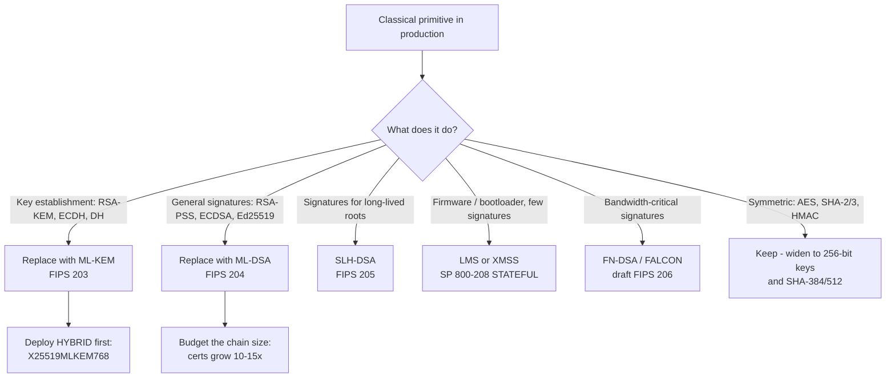
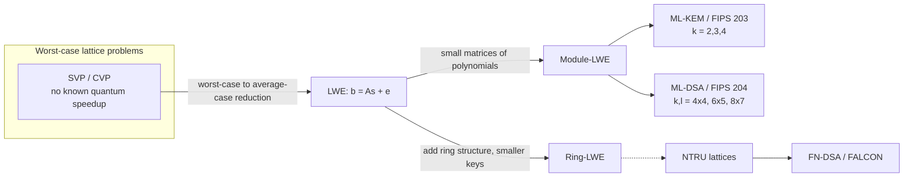
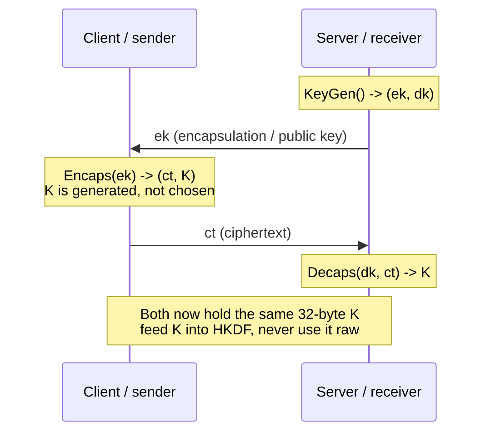
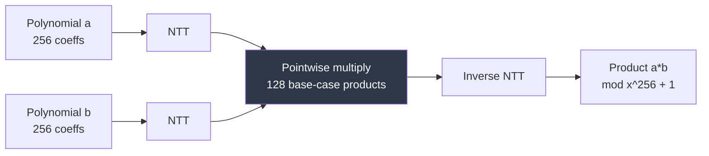
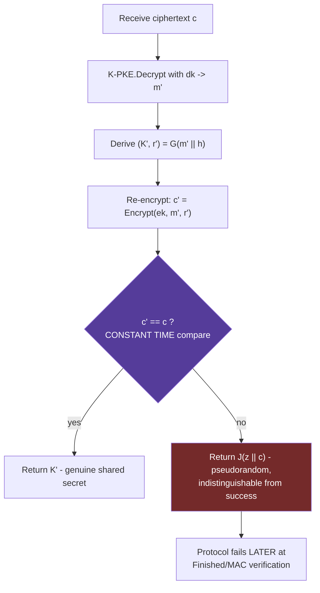
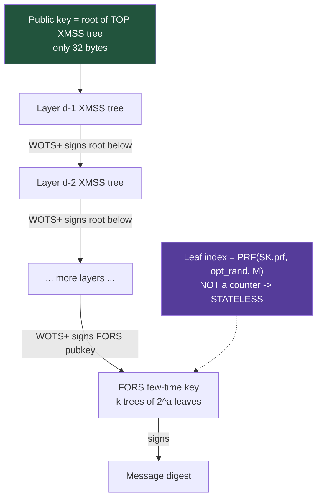
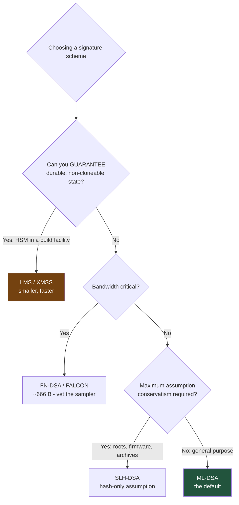
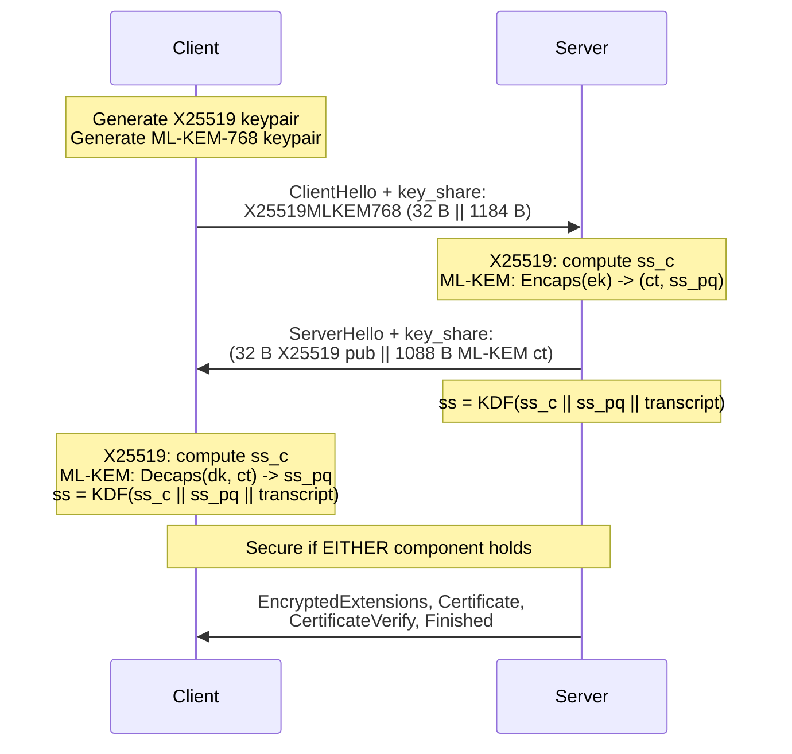

**Level:** Expert · **Track:** Quantum Security · **Read time:** 345 min

This is Chapter 4 of the Quantum Security notebook. Chapter 2 established *what breaks* — Shor's algorithm dissolving RSA, finite-field Diffie-Hellman, and every elliptic curve in production — and Chapter 3 established *why the clock is already running*, through harvest-now-decrypt-later and Mosca's inequality. Both chapters ended by pointing at the same replacement set without opening it up. This chapter opens it up.

The goal here is not to admire the mathematics from a distance. It is to make you the person on the team who can read FIPS 203, argue about whether ML-KEM-768 or ML-KEM-1024 belongs on your load balancers, explain to a firmware team why they want LMS instead of ML-DSA, spot a decapsulation oracle in a code review, and reproduce every claim in a lab. By the end you will have generated real post-quantum keys, signed and verified with three different signature families, issued a post-quantum certificate, completed a hybrid TLS 1.3 handshake, and measured the byte cost of all of it.

## Why This Matters

The migration is not a future exercise. The standards are final, the code is in mainline OpenSSL and OpenSSH, browsers already negotiate hybrid key exchange by default, and procurement questionnaires already ask which parameter sets you implement. The failure mode for a security engineer over the next few years is not "did not know quantum computing exists" — it is "deployed a post-quantum algorithm incorrectly and got the worst of both worlds": bigger handshakes, broken middleboxes, a timing side channel in the decapsulation path, and no actual security gain because the hybrid combiner was implemented as a plain XOR.

There is a second, subtler reason this chapter matters. Post-quantum cryptography changes the *shape* of cryptography, not just the algorithm names:

- **Key exchange becomes a KEM, not a Diffie-Hellman.** You lose the algebraic symmetry that let you build non-interactive key agreement, static-static DH, and a dozen protocol tricks that quietly assume a group. Anything in your stack that depends on "two public keys can be combined" needs redesign, not substitution.
- **Signatures get large, and their costs get asymmetric.** A certificate chain that was 800 bytes becomes 10-15 KB. Some schemes verify fast and sign slowly; one scheme (SLH-DSA) has 32-byte public keys and 8-50 KB signatures. Choosing wrongly can double your handshake or blow a firmware image budget.
- **Some schemes are stateful.** LMS and XMSS are *catastrophically* broken by reusing a one-time key index. That is a class of operational failure classical cryptography simply did not have.
- **Decapsulation can fail.** ML-KEM has a nonzero (astronomically small, but nonzero) probability of decapsulation failure, and the design must handle it without leaking anything — which is exactly where several real attacks live.

Every one of those bullets is an implementation-security topic, not a mathematics topic. That is where this chapter spends most of its time.



---

## Part 1: What "Post-Quantum" Actually Means

Post-quantum cryptography (PQC) is **classical cryptography that runs on ordinary computers and is believed to resist attack by both classical and quantum adversaries**. Two misconceptions need killing immediately:

1. **PQC is not quantum cryptography.** Quantum key distribution (QKD) uses quantum hardware — photons, dedicated fibre, trusted relays — to distribute keys. PQC is software running on the same x86 and ARM cores you already own. QKD is a niche with severe deployment constraints and no authentication story of its own; PQC is the thing that actually ships. Any vendor that blurs these two is either confused or selling something.
2. **PQC is not "proven secure against quantum computers."** It is *believed* secure because the underlying problems have no known efficient quantum algorithm. That belief is a research consensus, not a theorem — and as Part 13 shows, two prominent NIST candidates were destroyed mid-competition by *classical* attacks. This is precisely why hybrids exist.

### 1.1 The five families

Essentially all serious PQC proposals rest on one of five mathematical foundations. Knowing which family a scheme belongs to tells you most of what you need in order to predict its size, speed, and risk profile.

| Family | Hard problem | Representative schemes | Typical profile | Status after NIST |
|---|---|---|---|---|
| **Lattice-based** | Learning With Errors (LWE), Module-LWE, NTRU, SIS | ML-KEM (Kyber), ML-DSA (Dilithium), FN-DSA (FALCON) | Small-ish keys, fast, balanced | **Won.** 3 of 4 standards |
| **Hash-based** | Second-preimage / collision resistance of a hash only | SLH-DSA (SPHINCS+), LMS, XMSS | Tiny public keys, huge signatures, slow signing | **Won** (signatures only) |
| **Code-based** | Decoding a random linear code (syndrome decoding) | Classic McEliece, BIKE, **HQC** | Enormous public keys (McEliece: ~256 KB-1 MB), tiny ciphertexts | HQC selected as **backup KEM** |
| **Multivariate** | Solving systems of multivariate quadratics (MQ) | Rainbow, GeMSS, UOV | Small signatures, large public keys | **Rainbow broken** (2022) |
| **Isogeny-based** | Finding isogenies between supersingular elliptic curves | SIDH, **SIKE**, CSIDH | Smallest keys of any family | **SIKE broken** (2022) |

Two structural observations to carry forward:

- **Lattices win on balance, not on any single metric.** Code-based McEliece has smaller ciphertexts and a security record going back to 1978, but a public key measured in hundreds of kilobytes is unusable in TLS. Hash-based signatures rest on the most conservative assumption in all of cryptography, but a 17 KB signature cannot live in a routine handshake. Lattices are the only family where key, ciphertext, *and* signature are all small enough to be boring.
- **The two families that got broken were the two with the most extra algebraic structure.** Structure is what makes keys small; it is also what gives cryptanalysts something to grab. That is a permanent, generalisable lesson — see Part 13.

### 1.2 What NIST actually standardised

The NIST Post-Quantum Cryptography project ran as an open competition from 2016. The finalised standards, published in 2024, are:

| Standard | Algorithm name | Competition name | Purpose | Family |
|---|---|---|---|---|
| **FIPS 203** | **ML-KEM** (Module-Lattice-Based Key-Encapsulation Mechanism) | CRYSTALS-Kyber | Key establishment | Module lattice |
| **FIPS 204** | **ML-DSA** (Module-Lattice-Based Digital Signature Algorithm) | CRYSTALS-Dilithium | General-purpose signatures | Module lattice |
| **FIPS 205** | **SLH-DSA** (Stateless Hash-Based Digital Signature Algorithm) | SPHINCS+ | Conservative / backup signatures | Hash |
| **FIPS 206** (draft) | **FN-DSA** (FFT over NTRU-Lattice-Based DSA) | FALCON | Compact signatures | NTRU lattice |
| **SP 800-208** | **LMS / HSS**, **XMSS / XMSS^MT** | — | Stateful signatures, firmware signing | Hash |
| Fourth-round selection | **HQC** | HQC | Backup KEM (different math from ML-KEM) | Code |

**Naming discipline matters in practice.** "Kyber" and "ML-KEM" are *not* interchangeable in a compliance conversation: the final FIPS 203 version differs from the round-3 Kyber submission in concrete ways — most visibly, final ML-KEM derives the shared secret without hashing the ciphertext into it, and the domain separation changed. Code that advertises "Kyber768" may well be implementing a draft. When you see an identifier like `X25519Kyber768Draft00` on the wire, that is a *pre-standard* codepoint and it does not interoperate with the final `X25519MLKEM768`.

**Red team usage:** that distinction is a live fingerprinting primitive. A server that offers only `X25519Kyber768Draft00` (`0x6399`) is running a TLS stack frozen in the draft era — which narrows the plausible version range of everything else in that stack considerably. Recording which hybrid groups a host offers is now a legitimate part of a service-fingerprinting workflow, and it costs one handshake.

### 1.3 Security categories

NIST expressed target strength in five categories, each defined by reference to a *concrete* symmetric problem rather than an abstract bit count. This is the vocabulary every parameter table uses.

| Category | "At least as hard as..." | Rough classical equivalent |
|---|---|---|
| **1** | Key search on AES-128 | 128-bit |
| **2** | Collision search on SHA-256 | ~128-bit collision |
| **3** | Key search on AES-192 | 192-bit |
| **4** | Collision search on SHA-384 | ~192-bit collision |
| **5** | Key search on AES-256 | 256-bit |

Mapping this to what you deploy: **Category 3 (ML-KEM-768, ML-DSA-65) is the sane default for general internet traffic**, and it is what the widely deployed `X25519MLKEM768` hybrid group uses. **Category 5 (ML-KEM-1024, ML-DSA-87) is what CNSA 2.0 mandates for U.S. national-security systems**, and it is the right choice when data shelf-life `X` (Chapter 3) runs to decades. Category 1 (ML-KEM-512) exists for constrained environments and is the parameter set most sensitive to future improvements in lattice cryptanalysis — it is the one that gets argued about, and the one you should not pick by default just because it is smallest.

---

## Part 2: The Lattice Foundation — LWE, Ring-LWE, and Module-LWE

Three of the four standards are lattice schemes. You cannot reason about their sizes, their failure modes, or their side channels without a working mental model of the underlying problem. This part builds that model from zero; no prior abstract algebra is assumed.

### 2.1 A lattice, concretely

A **lattice** is the set of all integer combinations of a set of basis vectors. In two dimensions, take `b1 = (2, 0)` and `b2 = (1, 3)`; the lattice is every point reachable as `a*b1 + b*b2` for integers `a, b` — an infinite regular grid of points, generally skewed.

Two problems on lattices are believed hard in high dimension:

- **SVP (Shortest Vector Problem):** find the shortest nonzero vector in the lattice.
- **CVP (Closest Vector Problem):** given an arbitrary point in space, find the lattice point nearest to it.

In two dimensions both are easy — you can see the answer. In dimension 500-1000, with a *bad* (long, nearly parallel) basis, the best known algorithms — BKZ lattice reduction driven by a sieve — take exponential time. Crucially, **no quantum algorithm is known that meaningfully helps.** Shor's algorithm works because factoring and discrete log reduce to *period finding* in an abelian group, which the quantum Fourier transform solves. Lattice problems have no such hidden periodic structure to extract. Grover gives at most a square-root speedup on the underlying search, which parameter selection already accounts for.

That single sentence — *no known period to find* — is the entire reason lattices are the post-quantum favourite. It is worth being able to say out loud in a design review.

### 2.2 Learning With Errors (LWE)

LWE is the workhorse. Start with an easy problem and break it deliberately.

**The easy problem.** Given a matrix `A` and a vector `b = A*s` over a finite field, solve for the secret `s`. This is Gaussian elimination. Trivial.

**The hard problem.** Now add a small random error to every equation:

```
b = A*s + e   (mod q)
```

where `e` is a vector of *small* random values (say, each in the range -2 to +2). Given `(A, b)`, recover `s`. Gaussian elimination now amplifies those errors catastrophically and produces garbage. In high dimension this is **Learning With Errors**, and it comes with a *worst-case to average-case* reduction: breaking random LWE instances is as hard as solving worst-case lattice problems. That reduction is why lattice cryptography is taken seriously rather than treated as a hopeful heuristic.

Here is LWE small enough to compute by hand, which is the fastest way to internalise it:

```python
#!/usr/bin/env python3
"""Toy LWE - dimension 4, q = 97. Educational only: real ML-KEM uses a
   module lattice of dimension 256*k over q = 3329 with a centred binomial
   noise distribution. Never use this for anything."""
import random

q, n = 97, 4

def small():                       # tiny "error" term
    return random.randint(-2, 2)

s = [random.randint(0, q - 1) for _ in range(n)]        # the SECRET

samples = []
for _ in range(6):
    a = [random.randint(0, q - 1) for _ in range(n)]    # public random vector
    e = small()                                         # the noise
    b = (sum(ai * si for ai, si in zip(a, s)) + e) % q  # b = <a,s> + e
    samples.append((a, b))

print("secret s   =", s)
for a, b in samples:
    print(f"a={a}  b={b}")
```

Running it produces something like:

```
secret s   = [61, 14, 88, 3]
a=[70, 32, 5, 41]  b=15
a=[9, 66, 77, 12]  b=52
a=[54, 21, 39, 90]  b=71
a=[3, 84, 60, 28]  b=44
a=[45, 11, 92, 7]  b=30
a=[77, 50, 18, 66]  b=88
```

With `n = 4` you can brute-force `s` in `97^4` (about 8.8 x 10^7) guesses — seconds of work. With the module-lattice dimension ML-KEM actually uses (`256 * k`, i.e. 512/768/1024), the same brute force is beyond any conceivable machine, and the best structural attacks (BKZ with a sieve) are what parameters are tuned against.

### 2.3 From LWE to Ring-LWE to Module-LWE

Plain LWE works but is fat: the public key contains an `n x n` matrix of random values. For `n = 700` that is hundreds of kilobytes. Two refinements shrink it.

**Ring-LWE.** Replace vectors of integers with *polynomials* modulo `x^n + 1`, with coefficients mod `q`. A single polynomial of `n` coefficients now stands in for an entire structured `n x n` matrix, because multiplication by a polynomial is a negacyclic convolution — the whole matrix is generated from one row. Public keys collapse to about `n * log2(q)` bits. The cost is extra algebraic structure, which some cryptanalysts regard as an unnecessary risk surface.

**Module-LWE.** The middle ground, and what ML-KEM and ML-DSA actually use. Fix a *small* polynomial ring (ML-KEM: degree `n = 256`, modulus `q = 3329`) and build a `k x k` **matrix of polynomials**, where `k` is the module rank. Security scales by changing `k`, not by changing the ring.

This is the single most useful implementation fact in the whole chapter:

> **ML-KEM's three security levels are the same code with `k = 2, 3, 4`.** The polynomial arithmetic, the NTT, the modulus `q = 3329`, the hash functions — all identical. Only the rank changes. That is why a hardware NTT unit built for ML-KEM-512 also serves ML-KEM-1024, and why "upgrading" from Category 1 to Category 5 is a parameter change rather than a re-implementation.

| Variant | Object | Structure risk | Size | Used by |
|---|---|---|---|---|
| Plain LWE | Matrices of integers | Lowest | Largest (100s of KB) | FrodoKEM (conservative alternative) |
| Ring-LWE | Single polynomials | Highest | Smallest | NewHope (historical) |
| **Module-LWE** | Small matrices of polynomials | **Middle** | **Middle** | **ML-KEM, ML-DSA** |



### 2.4 Why "noise" is both the security and the failure mode

The error term `e` is what makes LWE hard. It is *also* what makes ML-KEM able to fail. Decryption works by computing a value that lands *near* a known point and rounding to the nearest one; if accumulated noise ever exceeds the rounding threshold, you round to the wrong point and decapsulation produces the wrong shared secret.

ML-KEM's parameters are chosen so this happens with probability on the order of `2^-139` for ML-KEM-768 — it will never be observed by accident. But "never by accident" is not "never by an attacker": **an adversary who can submit crafted ciphertexts and learn whether decapsulation succeeded can drive the failure rate up deliberately and use the failures as an oracle to recover the secret key.** That attack class is exactly what the Fujisaki-Okamoto transform (Part 4) exists to prevent, and it is why *any* observable difference between "good ciphertext" and "bad ciphertext" — a timing difference, a distinct error message, a log line, a connection reset at a different point — is a genuine key-recovery vulnerability rather than a theoretical nit. Hold that thought for Part 11.

---

## Part 3: ML-KEM (FIPS 203) — The KEM That Replaces Your Key Exchange

### 3.1 First, what a KEM even is

A **Key Encapsulation Mechanism** is three algorithms:

| Algorithm | Input | Output | Who runs it |
|---|---|---|---|
| `KeyGen()` | randomness | `(ek, dk)` — encapsulation key (public), decapsulation key (private) | Receiver |
| `Encaps(ek)` | public key | `(c, K)` — ciphertext and a **freshly generated** shared secret | Sender |
| `Decaps(dk, c)` | private key, ciphertext | `K` — the same shared secret | Receiver |

Note what a KEM does *not* do: it does not transport a value you chose. `Encaps` **generates** the shared secret; you do not get to pick it. This is the mental shift from RSA key transport, where the client chose a premaster secret and encrypted it. It also differs from Diffie-Hellman, where both parties contribute symmetric halves of a group element.



**Three protocol consequences that bite real systems:**

1. **No static-static agreement.** With ECDH, two long-term public keys alone determine a shared secret with no interaction. A KEM always needs a fresh ciphertext from the sender, so any protocol that relied on non-interactive agreement (some messaging pre-key designs, some IoT provisioning schemes, Noise patterns like `NK` used in a one-shot way) needs redesign.
2. **Asymmetric roles.** In DH both sides run the same code. In a KEM, one side is the encapsulator and one side is the decapsulator. Mutual authentication and bidirectional key establishment need two KEM operations or a KEM plus signatures.
3. **The shared secret is always 32 bytes**, for every ML-KEM parameter set. Security level changes key and ciphertext sizes, not the output length. Feed it into a KDF; never use it as a raw key.

### 3.2 The core: a public-key encryption scheme (K-PKE)

ML-KEM is built in two layers. The inner layer, called **K-PKE** in FIPS 203, is a module-LWE public-key encryption scheme that is only IND-CPA secure — safe against passive eavesdroppers, *not* against an attacker who can submit chosen ciphertexts. The outer layer (Part 4) upgrades it to IND-CCA2.

Here is K-PKE with the algebra stripped to essentials. All arithmetic is over polynomials of degree 256 with coefficients mod `q = 3329`; `k` is the module rank (2, 3, or 4).

**KeyGen:**
```
rho, sigma      <- expand a 32-byte seed d through SHA3-512
A (k x k)       <- deterministically expanded from rho via SHAKE128   # PUBLIC, not stored
s (k x 1)       <- small noise polynomials sampled from rho/sigma via SHAKE256
e (k x 1)       <- small noise polynomials
t = A*s + e                                                            # the LWE instance

ek = (encode(t), rho)        # public: t plus the SEED for A, not A itself
dk = encode(s)               # private
```

The reason ML-KEM public keys are 1184 bytes and not 300 KB is that **`A` is never transmitted**. Only the 32-byte seed `rho` is sent; both sides regenerate the full matrix with SHAKE128. That regeneration is a meaningful fraction of the runtime cost, which is why implementations cache `A` when a key is reused.

**Encrypt(ek, m, r):** for a 32-byte message `m`:
```
A       <- re-expand from rho
r, e1, e2 <- small noise sampled from the caller-supplied randomness r
u = A^T * r + e1                       # k polynomials
v = t^T * r + e2 + Decompress(m, 1)    # 1 polynomial; m becomes q/2 per bit
c = (Compress(u, du), Compress(v, dv))
```
The message bits are scaled to `q/2` — bit `0` maps to `0`, bit `1` maps to roughly `1664`. They are then buried under noise.

**Decrypt(dk, c):**
```
u, v <- Decompress(c)
w = v - s^T * u
m   = Compress(w, 1)     # round each coefficient to 0 or q/2, take the nearest
```

Why this works: expand `w` and the `A*s` terms cancel, leaving `m*(q/2)` plus a sum of small noise products. As long as that noise stays below `q/4`, rounding recovers each message bit exactly. When it does not, you get a decapsulation failure — the `2^-139` event from Part 2.4.

### 3.3 Compression: where the size savings come from

`Compress(x, d)` throws away all but the top `d` bits of each coefficient:

```
Compress(x, d) = round( (2^d / q) * x )  mod 2^d
Decompress(y, d) = round( (q / 2^d) * y )
```

Full coefficients need 12 bits (`q = 3329 < 2^12`). ML-KEM-768 compresses `u` to `du = 10` bits and `v` to `dv = 4` bits. That is where the ciphertext shrinks from a naive `(3*256*12 + 256*12)/8 = 1536` bytes down to the actual **1088 bytes**.

Compression is lossy — it *adds* noise. The parameters are chosen so the added noise still fits under the `q/4` budget. Two practical consequences:

- **`Compress` involves a division by `q`.** If implemented with a variable-time integer division on secret data, you have a timing side channel. This is literally the KyberSlash vulnerability class — see Part 11.1.
- **Ciphertexts are not malleable in a useful way**, because the FO transform re-encrypts and compares. But that comparison must be constant-time, which is Part 11.2.

### 3.4 The NTT: why ML-KEM is fast

Multiplying two degree-256 polynomials naively costs `256^2 = 65,536` coefficient multiplications. The **Number Theoretic Transform** — a discrete Fourier transform over the integers mod `q` instead of over complex numbers — turns convolution into pointwise multiplication, reducing the cost to `O(n log n)`.

`q = 3329` is not an arbitrary prime. It was chosen because `3329 = 13 * 256 + 1`, so `q - 1` is divisible by 256, which guarantees the roots of unity the NTT needs exist mod `q`. It is also small enough that coefficients fit in 16 bits, enabling wide SIMD (AVX2 processes 16 coefficients per instruction; NEON, 8).

A detail that trips people reading FIPS 203 for the first time: **ML-KEM keys are stored in the NTT domain.** The `t` in the encapsulation key and the `s` in the decapsulation key are already transformed. Implementations do not transform on every use — they transform once at key generation. If you are writing a test vector comparison and your bytes do not match a reference implementation, "am I in the NTT domain?" is the first thing to check.



### 3.5 ML-KEM sizes — the numbers you will be asked for

| Parameter set | Category | `k` | Encaps key (public) | Decaps key (private) | Ciphertext | Shared secret |
|---|---|---|---|---|---|---|
| **ML-KEM-512** | 1 | 2 | 800 B | 1,632 B | 768 B | 32 B |
| **ML-KEM-768** | 3 | 3 | 1,184 B | 2,400 B | 1,088 B | 32 B |
| **ML-KEM-1024** | 5 | 4 | 1,568 B | 3,168 B | 1,568 B | 32 B |

For contrast: an X25519 public key is **32 bytes** and its "ciphertext" (the peer's ephemeral public key) is also **32 bytes**. So ML-KEM-768 costs roughly `1184 + 1088 = 2,272` bytes on the wire versus X25519's 64 — about **35x**, or roughly 2.2 KB of extra handshake. In a hybrid, you pay for both. That 2.2 KB is the number behind every "ClientHello too large" incident in Chapter 3 and Part 11.5.

**Memory hook:** ML-KEM-768's three key numbers are **1184 / 1088 / 32** — public key, ciphertext, shared secret. If you memorise one PQC triple, memorise that one; it is the parameter set you will meet most often.

### 3.6 The other ML-KEM sizing question: private keys

The 2,400-byte ML-KEM-768 decapsulation key is *expanded* form: it contains `s` in NTT domain, a copy of the full encapsulation key, a hash of the encapsulation key, and the 32-byte implicit-rejection value `z`. It is fully reconstructible from a **64-byte seed** `(d, z)`.

**Storage guidance:** store the 64-byte seed in your HSM/KMS and expand on load, rather than storing 2,400 bytes. This matters more than it sounds — many KMS products have per-object size limits and per-byte pricing, and seed storage also makes key backup and escrow dramatically simpler. FIPS 203 supports both forms; interop bugs between "seed format" and "expanded format" private keys are a common early-migration papercut.

---

## Part 4: The Fujisaki-Okamoto Transform — Where ML-KEM's Real Security Lives

K-PKE alone is IND-CPA. Real protocols need IND-CCA2: security even when the attacker can feed you arbitrary ciphertexts and observe what happens. ML-KEM gets there with a variant of the **Fujisaki-Okamoto (FO) transform**. This is the part of FIPS 203 that most directly determines whether your implementation is exploitable, so it is worth understanding line by line.

### 4.1 Encapsulation

```
Encaps(ek):
    m      <- 32 random bytes                    # MUST come from a CSPRNG
    (K, r) <- G(m || H(ek))                      # G = SHA3-512, H = SHA3-256
    c      <- K-PKE.Encrypt(ek, m, r)            # r is the encryption randomness
    return (c, K)
```

Two design points that are easy to miss and important:

- **The encryption randomness `r` is derived deterministically from `m`.** Anyone who knows `m` can recompute `c` exactly. That is the property the whole transform is built on.
- **`H(ek)` is bound into the derivation.** This is what prevents an attacker from taking a ciphertext produced for one public key and re-contextualising it under another — the "multi-target" and key-substitution class of attack. In protocol terms, the shared secret is bound to *which* public key it was made for.

### 4.2 Decapsulation, with implicit rejection

```
Decaps(dk, c):
    m'      <- K-PKE.Decrypt(dk_pke, c)
    (K', r') <- G(m' || h)                       # h = H(ek), stored in dk
    c'      <- K-PKE.Encrypt(ek, m', r')         # RE-ENCRYPT with derived randomness
    if c' == c:      return K'                   # valid
    else:            return J(z || c)            # IMPLICIT REJECTION
```

The receiver decrypts, then **re-encrypts and checks the result byte-for-byte**. If a single bit differs, the ciphertext was not honestly produced.

Here is the crucial engineering choice: on failure, ML-KEM does **not** return an error. It returns a pseudorandom value derived from a secret `z` (stored inside `dk`) and the ciphertext, via `J = SHAKE256`. This is **implicit rejection**. The attacker receives a perfectly normal-looking 32-byte shared secret — one that just does not match theirs. From the outside, valid and invalid ciphertexts are indistinguishable.

> **This is the single most important thing to protect in an ML-KEM deployment.** Every chosen-ciphertext key-recovery attack on a lattice KEM needs a way to distinguish "decapsulation succeeded" from "decapsulation failed". Implicit rejection removes the direct signal. Your job is to not re-introduce it — via timing, via error handling, via logging, or via protocol-level behaviour.



### 4.3 Why the protocol must not help the attacker

Implicit rejection only works if the *rest of the stack* cooperates. Consider TLS 1.3: the derived secret feeds HKDF, and the mismatch surfaces as a `Finished` message that fails to verify — after the handshake transcript is committed, with a generic `decrypt_error` alert. Good. Now consider these three anti-patterns, all of which have appeared in real code:

| Anti-pattern | Why it is fatal | Fix |
|---|---|---|
| `if (decaps_failed) log.warn("bad KEM ciphertext from %s", peer)` | The log is an oracle; anyone who can read logs or measure the logging latency can count failures | Do not branch on decapsulation outcome at all — there is no "failed" to branch on |
| Distinct alert / error code for KEM failure vs MAC failure | Direct remote oracle, no side channel needed | One generic failure path, identical timing |
| Early return on ciphertext-length or format check *inside* decaps | Leaks partial structural information about attacker-chosen ciphertexts | Validate length once, before decaps, with a constant response |

**Blue team usage:** the flip side is that a burst of connections from one source that all fail at the `Finished` stage is a strong signal. Under implicit rejection, an attacker probing the KEM *must* generate many handshakes that complete key exchange and then fail MAC verification. That pattern — high volume, successful `ClientHello`/`ServerHello`, consistent post-key-exchange failure — is anomalous for benign clients and is the single most useful ML-KEM detection you can build. Part 14 turns this into a concrete rule.

### 4.4 Decapsulation failure probability, quantified

| Parameter set | Failure probability (approx.) | Interpretation |
|---|---|---|
| ML-KEM-512 | ~2^-139 | Never observed by accident |
| ML-KEM-768 | ~2^-164 | Never observed by accident |
| ML-KEM-1024 | ~2^-174 | Never observed by accident |

These figures are for *honestly generated* ciphertexts. An attacker crafting ciphertexts with maximal noise can raise the rate enormously — that is the point of a chosen-ciphertext attack and precisely what the FO transform blocks. If you ever see a decapsulation failure in production telemetry, the correct conclusion is **not** "rare event"; it is "someone is attacking us, or a component is corrupting bytes in transit". Alert on it.

---

## Part 5: ML-DSA (FIPS 204) — Fiat-Shamir With Aborts

ML-DSA is the general-purpose replacement for ECDSA, Ed25519, and RSA-PSS. It is a lattice scheme like ML-KEM, over the same kind of module structure but with different parameters: degree `n = 256`, modulus **`q = 8380417`** (which equals `2^23 - 2^13 + 1`), and a rectangular matrix of dimensions `k x l`.

### 5.1 The identification-scheme intuition

Almost every practical signature scheme is a zero-knowledge identification protocol collapsed into one message by the **Fiat-Shamir transform**: instead of the verifier sending a random challenge, you compute the challenge as a hash of your own commitment plus the message. ECDSA and Schnorr work this way; so does ML-DSA.

The lattice version has a complication with no classical analogue. The natural response `z = y + c*s` (where `s` is the secret and `y` a random mask) **leaks information about `s`** if `z` is transmitted as-is, because the distribution of `z` depends on `s`. Two known repairs exist: *Gaussian sampling* (used by FALCON, hard to implement in constant time) and **rejection sampling** — the "aborts" in Fiat-Shamir with Aborts. ML-DSA takes rejection sampling, and that choice explains most of its behaviour.

### 5.2 Signing

```
Sign(sk, M):
    mu = H(tr || M)                      # tr binds the public key into the message hash
    kappa = 0
    loop:
        y  <- sample mask vector, coefficients in (-gamma1, gamma1]
        w  = A * y
        w1 = HighBits(w, 2*gamma2)       # coarse "commitment"
        c~ = H(mu || w1)                 # challenge hash
        c  = SampleInBall(c~)            # sparse polynomial: tau coeffs of +-1, rest 0
        z  = y + c * s1                  # the response

        # --- the rejection conditions ---
        if ||z||_inf >= gamma1 - beta:            continue   # z would leak s1
        r0 = LowBits(w - c*s2, 2*gamma2)
        if ||r0||_inf >= gamma2 - beta:           continue   # verifier could not recover w1
        h = MakeHint(-c*t0, w - c*s2 + c*t0)
        if too many hints set:                    continue

        return sigma = (c~, z, h)
```

Three things make this scheme what it is:

- **The loop really loops.** Expected iterations are roughly 4-7 depending on parameter set. **ML-DSA signing has variable runtime by design.** This is not a bug and it is not a side channel *provided* the timing depends only on the mask `y` and not on the secret — but it does mean you cannot assume a fixed signing latency, and any system with hard real-time signing deadlines needs to size for the tail, not the mean.
- **`SampleInBall` produces a very sparse challenge.** `c` has only `tau` nonzero coefficients (39, 49, or 60), each `+1` or `-1`. Sparsity keeps `c*s1` small, which keeps `z` small, which keeps signatures small.
- **The hint vector `h`.** The public key stores only the high bits of `t` (`t1`), to save space; `t0` is secret-ish and kept in the signing key. The hint is a handful of bits that let the verifier reconstruct what it needs without the full `t`. This is a pure size optimisation, and it is why the ML-DSA public key is 1,952 bytes instead of well over 3,000.

### 5.3 Verification

```
Verify(pk, M, sigma = (c~, z, h)):
    if ||z||_inf >= gamma1 - beta:  return REJECT
    mu  = H(tr || M)
    c   = SampleInBall(c~)
    w1' = UseHint(h, A*z - c*t1*2^d)
    return  c~ == H(mu || w1')
```

Verification is a single pass — no loop, no rejection. **ML-DSA verification is fast and constant-cost; signing is slow and variable-cost.** That asymmetry is the opposite of what many engineers expect from RSA (where signing/decryption is the expensive private-key operation and verification is cheap because `e = 65537`), and it is favourable for TLS, where a server signs once per handshake but every client verifies a chain.

### 5.4 Hedged vs deterministic signing — a decision with a real attack behind it

FIPS 204 defines two modes:

| Mode | Mask derivation | Reproducible? | Fault-attack exposure |
|---|---|---|---|
| **Hedged (default)** | `y` derived from secret key, message, **and fresh randomness `rnd`** | No | Resistant — repeated signing gives different signatures |
| **Deterministic** | `y` derived from secret key and message only | Yes, byte-identical | **Vulnerable** to differential fault attacks |

Deterministic signing is attractive: it removes RNG dependence (recall how many ECDSA disasters — Sony PS3, various Bitcoin wallets — came from bad or reused nonces), and it makes signatures reproducible for build-verification purposes. But determinism enables a specific and demonstrated attack: sign the same message twice, inject a fault (voltage glitch, clock glitch, laser) during the second signing, and difference the two outputs. Because everything except the faulted computation is identical, the difference isolates secret-dependent values and can lead to key recovery. This attack class was demonstrated against deterministic lattice signatures well before standardisation, which is why FIPS 204 makes hedged mode the default.

**Guidance:** use **hedged** mode. Use deterministic mode only where you have a specific reproducibility requirement *and* physical access to the signer is not part of your threat model (e.g. an HSM in a guarded rack). Never use deterministic mode on a smartcard, TPM, IoT device, or anything an attacker can hold. The hedged mode's security does not collapse if the RNG is weak — the randomness is mixed *in addition to* the secret key and message, so a broken RNG degrades you to deterministic mode rather than to catastrophe. That is a deliberate belt-and-braces design and worth knowing when someone asks "what if our entropy source is bad?"

### 5.5 ML-DSA parameters and sizes

| Parameter set | Category | `(k, l)` | `tau` | Public key | Private key | **Signature** |
|---|---|---|---|---|---|---|
| **ML-DSA-44** | 2 | (4, 4) | 39 | 1,312 B | 2,560 B | **2,420 B** |
| **ML-DSA-65** | 3 | (6, 5) | 49 | 1,952 B | 4,032 B | **3,309 B** |
| **ML-DSA-87** | 5 | (8, 7) | 60 | 2,592 B | 4,896 B | **4,627 B** |

Compare with what you are replacing:

| Scheme | Public key | Signature | Ratio vs Ed25519 sig |
|---|---|---|---|
| Ed25519 | 32 B | 64 B | 1x |
| ECDSA P-256 | 64 B | ~71 B (DER) | ~1.1x |
| RSA-2048 (PSS) | 256 B | 256 B | 4x |
| **ML-DSA-44** | 1,312 B | 2,420 B | **38x** |
| **ML-DSA-65** | 1,952 B | 3,309 B | **52x** |
| **ML-DSA-87** | 2,592 B | 4,627 B | **72x** |

**Do this arithmetic before you plan a migration**, because it is where the pain lands. A TLS 1.3 handshake carries, at minimum: the leaf certificate (containing a public key + a signature from the issuer), the intermediate certificate (same), and a `CertificateVerify` signature. Moving a leaf + intermediate + CertificateVerify from ECDSA P-256 to ML-DSA-65:

```
Classical (P-256):
  leaf pubkey 64 + leaf sig 71 + int pubkey 64 + int sig 71 + CertVerify 71   = ~341 B

ML-DSA-65:
  leaf pubkey 1952 + leaf sig 3309 + int pubkey 1952 + int sig 3309
  + CertVerify 3309                                                          = ~13,831 B
```

That is roughly **+13.5 KB per handshake**, on top of the ~2.2 KB from hybrid ML-KEM. A handshake that fitted in two or three packets now needs ten or more. For a high-volume CDN that is a measurable bandwidth line item; for a constrained IoT link it can be a hard failure. This size problem — not the cryptography — is the main reason PQ *authentication* is rolling out years behind PQ *key exchange*, and it is the subject of Part 10.4.

### 5.6 Pre-hash variants (HashML-DSA)

FIPS 204 also defines **HashML-DSA**, where the message is hashed with an approved hash function first and the OID of that hash is bound into the signature. Use it when the signer cannot stream the whole message (large files, hardware tokens with small buffers, or a protocol where the message is hashed by a different component than the one holding the key). Do not mix the two: a signature produced with pure ML-DSA will not verify as HashML-DSA and vice versa — the domain separator differs. Interop failures between "ML-DSA" and "HashML-DSA" implementations are a predictable early-migration bug, and the symptom is a clean, total verification failure rather than anything subtle.

---

## Part 6: SLH-DSA (FIPS 205) — Signatures From Hashes Alone

SLH-DSA (formerly SPHINCS+) is the insurance policy of the standard set. Its security rests on **nothing but the properties of a hash function**. No lattices, no number theory, no new assumptions. If every lattice scheme fell tomorrow to some unforeseen cryptanalysis, SLH-DSA would stand, because breaking it means breaking SHA-2 or SHAKE.

The price is size and speed: signatures from 7,856 bytes to 49,856 bytes, and signing that is orders of magnitude slower than ML-DSA. You use it where those costs are acceptable and conservatism is paramount: root CA keys, firmware signing where the verifier must be tiny, code-signing roots with 20-year lifetimes.

### 6.1 Building block 1: one-time signatures (WOTS+)

Start from the simplest hash-based signature, Lamport's scheme, then improve it.

**Lamport (1979):** to sign one bit, generate two random secret values `s0, s1`; publish `H(s0), H(s1)`. To sign bit `b`, reveal `sb`. The verifier hashes it and checks against the published value. Unforgeable, because inverting `H` is hard. Catastrophically single-use: sign two different bits with the same key and you have revealed both preimages.

**WOTS+ (Winternitz)** generalises this by trading time for space. Instead of one hash per bit, use a *hash chain* of length `w` (typically 16) and encode `log2(w)` bits per chain. To sign the value `v` for a chain, publish `H^v(sk)` — the secret iterated `v` times. The verifier continues the chain the remaining `w-1-v` times and compares against the public key.

The obvious forgery — advance a chain further to sign a *larger* value — is blocked by a **checksum**: extra chains sign a checksum of the message digits, constructed so that increasing any message digit necessarily *decreases* a checksum digit, which the attacker cannot produce without going backwards through the hash. Elegant, and worth understanding because it is the same idea that makes the whole tower above it work.

WOTS+ is still strictly one-time.

### 6.2 Building block 2: Merkle trees turn one-time into many-time

Generate `2^h` WOTS+ key pairs, hash each public key into a leaf, and build a binary Merkle tree. The **root** is your single, permanent public key — 32 bytes for the 128-bit parameter sets.

To sign, use leaf `i` and include the **authentication path**: the `h` sibling hashes needed to recompute the root. The verifier recomputes the leaf from the WOTS+ signature, walks up using the auth path, and checks the root. This is XMSS, and it converts `2^h` one-time keys into one reusable public key.

But it is **stateful**: you must remember which leaves you have used. That is the property SLH-DSA is specifically designed to remove.

### 6.3 Building block 3: FORS and the hypertree — going stateless

Two more pieces make it stateless:

**FORS (Forest Of Random Subsets)** is a *few-time* signature. It uses `k` Merkle trees of `2^a` leaves each; the message hash selects one leaf index per tree, and you reveal those secret values plus auth paths. Because FORS tolerates a limited number of reuses, an index does not have to be unique — it only has to be *unlikely* to repeat too often.

**The hypertree** is a tree of trees, `d` layers deep. Each layer's XMSS tree signs the root of the tree below it. The bottom layer signs a FORS public key; FORS signs the actual message.

And the stateless trick: **the leaf index is derived pseudorandomly from the message and a per-key secret**, not from a counter. With a tree address space of `2^60`+ and FORS's few-time tolerance, the probability of enough collisions to enable forgery is pushed below the security target. No state, ever.



### 6.4 SLH-DSA parameters: the `s`/`f` trade-off

Every parameter set comes in `s` (small signature, slow signing) and `f` (fast signing, larger signature) flavours, and in SHA2 and SHAKE variants. That gives 12 parameter sets in total.

| Parameter set | Category | Public key | Private key | **Signature** | Relative signing speed |
|---|---|---|---|---|---|
| SLH-DSA-128s | 1 | 32 B | 64 B | **7,856 B** | Slow |
| SLH-DSA-128f | 1 | 32 B | 64 B | **17,088 B** | Fast |
| SLH-DSA-192s | 3 | 48 B | 96 B | **16,224 B** | Slow |
| SLH-DSA-192f | 3 | 48 B | 96 B | **35,664 B** | Fast |
| SLH-DSA-256s | 5 | 64 B | 128 B | **29,792 B** | Slow |
| SLH-DSA-256f | 5 | 64 B | 128 B | **49,856 B** | Fast |

Read those numbers carefully. **A 128-bit-security SLH-DSA signature is 7.8 KB — larger than the entire ML-DSA-87 signature at Category 5.** And the `f` variants roughly double it again. SLH-DSA in a TLS handshake is generally a non-starter; SLH-DSA on a firmware image signed twice a year, verified by a 3 KB bootloader that already contains a SHA-256 implementation, is close to ideal.

**Choosing `s` vs `f`:** `s` when you sign rarely and distribute widely (firmware, releases, CA roots) — you pay signing time once and save bytes on every verification. `f` when signing throughput matters and the transport is cheap. For most security-engineering purposes the answer is `s`.

### 6.5 Where SLH-DSA genuinely belongs

| Use case | SLH-DSA? | Reasoning |
|---|---|---|
| TLS `CertificateVerify` | No | 7.8-49 KB per handshake is prohibitive |
| Root CA / trust anchor | **Yes** | Signs rarely, 20+ year lifetime, conservatism dominates |
| Firmware / secure boot | **Yes**, or LMS | Verifier is tiny; only a hash primitive is needed in ROM |
| Software release signing | **Yes** | A few KB on a 200 MB artifact is nothing |
| Per-request API signing | No | Signing latency and size both wrong |
| Long-lived document / archive signatures | **Yes** | The assumption must survive decades |

**Bug bounty note:** hash-based signature verification code is a rewarding target for memory-safety review precisely because it is often a bespoke, minimal implementation living in a bootloader or firmware updater rather than a battle-tested library. Signature sizes are attacker-influenced within limits, auth-path parsing is index-driven, and the parsing code frequently predates any fuzzing effort. Malformed-signature parsing in embedded verifiers is a real, recurring bug class — check bounds on every index derived from signature bytes.

---

## Part 7: FN-DSA, LMS/XMSS, and HQC — The Rest of the Toolbox

### 7.1 FN-DSA (FALCON, draft FIPS 206)

FALCON is the compact-signature lattice scheme, built on **NTRU lattices** with **GPV trapdoor sampling**. Its selling point is size:

| Parameter set | Category | Public key | Signature |
|---|---|---|---|
| FN-DSA-512 | 1 | 897 B | ~666 B |
| FN-DSA-1024 | 5 | 1,793 B | ~1,280 B |

A 666-byte signature versus ML-DSA-44's 2,420 is a 3.6x saving — exactly what you want for certificate chains, where every byte is multiplied by the number of certificates and the number of handshakes. This is why FALCON keeps being proposed for PKI even though it is the last of the four to be standardised.

The catch, and the reason it is behind: **FALCON signing requires sampling from a discrete Gaussian distribution over a lattice, using floating-point arithmetic.** That is genuinely difficult to implement in constant time. Floating-point operations can have data-dependent timing on some hardware; different platforms round differently, causing interoperability and correctness headaches; and the sampler is the exact component that leaks the secret basis if it leaks anything at all. Side-channel attacks on Gaussian samplers in NTRU-lattice signatures are a well-populated research area.

**Practical guidance:** FN-DSA signatures have a real place where bandwidth dominates, but treat any FN-DSA implementation as requiring far more scrutiny than an ML-DSA one — specifically, ask what the sampler does about floating point and whether it has been evaluated for constant-time behaviour on your target hardware. If in doubt, ML-DSA. Verification, incidentally, is fine — it is only signing that carries the sampler risk, so a *verify-only* deployment (e.g. an embedded device that only checks signatures) is much less fraught.

### 7.2 LMS and XMSS (SP 800-208) — stateful, and dangerous if mishandled

Before SLH-DSA existed, NIST standardised the **stateful** hash-based schemes in SP 800-208: **LMS** (with its multi-tree form **HSS**) and **XMSS** (with **XMSS^MT**). These are the Part 6.2 construction without the statelessness machinery: a Merkle tree of one-time keys, plus a counter for which leaf you have used.

They are smaller and faster than SLH-DSA because they skip FORS and the pseudorandom index. LMS signatures land in the 1-5 KB range depending on tree parameters.

The condition is absolute:

> **Reusing a one-time key index in LMS/XMSS destroys the security of the scheme.** Not "weakens" — an attacker who obtains two signatures under the same leaf index can, in general, forge. And "state" here means state that survives crashes, restores, snapshots, and cloning.

This is why SP 800-208 is unusually prescriptive about key management, and why LMS/XMSS deployment is restricted to environments where state can be guaranteed:

| Threat to state | Concrete scenario | Mitigation |
|---|---|---|
| VM snapshot / restore | Signing service snapshotted, rolled back, resumes at an old index | Do not run stateful signing in snapshot-capable VMs; use an HSM |
| Backup restore | Key + state restored from last night's backup, indices replay | Never back up the state; back up nothing, or reserve index ranges |
| Cloning for HA | Two replicas share a key, both start at the same index | One signer only, or partition the index space by replica |
| Crash mid-signature | Index incremented but signature not emitted, or vice versa | Increment and durably persist *before* signing, never after |
| Concurrency | Two threads grab the same index | Serialise; the index allocator must be atomic and durable |

The correct pattern is **reserve-then-sign**: atomically allocate and durably commit the index *before* producing the signature, and accept that a crash may burn indices. Burning indices is free; reusing one is fatal.

**Where LMS/XMSS is nonetheless the right answer:** firmware and secure boot. CNSA 2.0 specifically calls for LMS or XMSS for software and firmware signing. The verifier needs only a hash function, the signature is smaller than SLH-DSA's, and the signing environment is a controlled, single-instance HSM in a build facility — exactly where state can be managed.



### 7.3 HQC — the backup KEM

NIST selected **HQC** (Hamming Quasi-Cyclic) as a backup key-encapsulation mechanism to sit alongside ML-KEM. The rationale is straightforward and worth repeating in your own migration documents: **ML-KEM and any other lattice KEM share a mathematical foundation, so a breakthrough against structured lattices would take them all at once.** HQC is code-based — its security rests on the hardness of decoding random quasi-cyclic codes, an entirely different problem. Diversity of assumption is the product being purchased.

HQC's cost is size: public keys and ciphertexts run several kilobytes, considerably larger than ML-KEM's. It is not a drop-in replacement for general TLS traffic today; it is an insurance policy that a crypto-agile system (Chapter 3) can switch to if lattices ever falter. When the draft standard lands, the deployment question will be "can my stack negotiate it?" — which is a crypto-agility question, not a cryptography one.

| KEM | Family | Public key | Ciphertext | Role |
|---|---|---|---|---|
| **ML-KEM-768** | Module lattice | 1,184 B | 1,088 B | Primary standard |
| **HQC** (Cat 3) | Code (quasi-cyclic) | several KB | several KB | Backup, different assumption |
| **Classic McEliece** | Code (Goppa) | ~256 KB-1 MB | ~100-200 B | Niche: long-lived static keys, tiny ciphertexts |
| **FrodoKEM** | Plain LWE | ~15 KB | ~15 KB | Conservative, unstructured; favoured by some European agencies |

**Design note:** Classic McEliece's profile — enormous public key, tiny ciphertext — is not useless, it is just *differently* shaped. If a public key is provisioned once into a device at manufacture and then used for years, the key size is a one-off cost and the per-message cost is lower than ML-KEM's. That is a real architecture, and it is why McEliece retains supporters despite being obviously unsuited to TLS.

---

## Part 8: Sizes, Speeds, and the Numbers That Decide Deployments

Everything in Parts 3-7 collapses, for planning purposes, into a handful of tables. This part is the one to bookmark.

### 8.1 Master size table

| Algorithm | Category | Public key | Private key | Ciphertext / Signature |
|---|---|---|---|---|
| X25519 (classical) | — | 32 B | 32 B | 32 B |
| ECDSA P-256 (classical) | — | 64 B | 32 B | ~71 B |
| RSA-2048 (classical) | — | 256 B | 1,192 B | 256 B |
| **ML-KEM-512** | 1 | 800 B | 1,632 B | 768 B |
| **ML-KEM-768** | 3 | 1,184 B | 2,400 B | 1,088 B |
| **ML-KEM-1024** | 5 | 1,568 B | 3,168 B | 1,568 B |
| **ML-DSA-44** | 2 | 1,312 B | 2,560 B | 2,420 B |
| **ML-DSA-65** | 3 | 1,952 B | 4,032 B | 3,309 B |
| **ML-DSA-87** | 5 | 2,592 B | 4,896 B | 4,627 B |
| **SLH-DSA-128s** | 1 | 32 B | 64 B | 7,856 B |
| **SLH-DSA-128f** | 1 | 32 B | 64 B | 17,088 B |
| **SLH-DSA-192s** | 3 | 48 B | 96 B | 16,224 B |
| **SLH-DSA-256s** | 5 | 64 B | 128 B | 29,792 B |
| **SLH-DSA-256f** | 5 | 64 B | 128 B | 49,856 B |
| **FN-DSA-512** (draft) | 1 | 897 B | ~1,281 B | ~666 B |
| **FN-DSA-1024** (draft) | 5 | 1,793 B | ~2,305 B | ~1,280 B |

### 8.2 Relative performance

Absolute cycle counts depend heavily on CPU, SIMD availability, and implementation, so what follows is *relative* and intended for architecture decisions, not benchmarking claims. Measure your own stack with the lab in Part 12.7.

| Operation | Relative cost | Notes |
|---|---|---|
| ML-KEM keygen / encaps / decaps | **Very fast** | Comparable to, often faster than, X25519 per operation; the cost is bytes, not cycles |
| ML-DSA keygen | Fast | One-off |
| ML-DSA sign | Moderate, **variable** | Rejection loop: expect ~4-7 iterations, with a tail |
| ML-DSA verify | **Fast**, constant work | Single pass; good for verify-heavy workloads |
| SLH-DSA keygen | Fast | Just the top tree |
| SLH-DSA sign | **Very slow** | Orders of magnitude slower than ML-DSA; `s` variants slower still |
| SLH-DSA verify | Moderate | Thousands of hash calls, but no big-number math |
| FN-DSA sign | Moderate, **delicate** | Gaussian sampler, floating point, constant-time risk |
| FN-DSA verify | Fast | Verify-only deployments are much lower risk |

The headline that surprises people: **ML-KEM is computationally cheap.** Lattice arithmetic with a 16-bit modulus and an NTT vectorises beautifully; a single ML-KEM-768 encapsulation is in the same ballpark as, or faster than, an X25519 scalar multiplication. The migration cost for key exchange is almost entirely **bandwidth and packet count**, not CPU. State that clearly when someone objects that "post-quantum will slow down our servers" — for key exchange, it generally will not.

### 8.3 The handshake budget, worked

| Handshake configuration | Key exchange bytes | Auth bytes (2-cert chain + CertVerify) | Total |
|---|---|---|---|
| X25519 + ECDSA P-256 | ~64 | ~341 | **~0.4 KB** |
| X25519MLKEM768 hybrid + ECDSA P-256 | ~2,336 | ~341 | **~2.7 KB** |
| X25519MLKEM768 hybrid + ML-DSA-65 | ~2,336 | ~13,831 | **~16.2 KB** |
| ML-KEM-1024 + ML-DSA-87 (CNSA 2.0 style) | ~3,136 | ~19,000+ | **~22 KB** |

The middle row is what most of the internet is doing right now: **hybrid key exchange with classical authentication.** That is not laziness — it is a correct reading of the threat model. Key exchange must go post-quantum immediately because of harvest-now-decrypt-later (Chapter 3); *authentication* only has to be post-quantum before a CRQC exists, because you cannot retroactively forge a signature on a handshake that already completed. Signatures are not subject to HNDL.

> **The one-line version, worth memorising:** *encryption has a retroactive threat; authentication does not.* Key exchange first, signatures later. This single asymmetry explains the entire shape of the global migration and is the best answer to "why is my browser doing PQ key exchange but still using an ECDSA certificate?"

The exception is any signature whose *verification* happens far in the future: a firmware signature, a long-lived trust anchor, a timestamping authority, an archived document signature. Those need post-quantum signatures on the same urgency footing as key exchange, because the verifier that must not be fooled runs in ten or twenty years.

---

## Part 9: Hybrids — Combining Classical and Post-Quantum Correctly

A **hybrid** key exchange runs a classical algorithm and a post-quantum algorithm in the same handshake and combines both shared secrets. The security goal is precise:

> The session is secure **as long as at least one** of the two components is unbroken.

That property is what makes migration safe. ML-KEM is roughly a decade old as a design and has had far less cryptanalytic attention than X25519, which has had fifteen years of everyone in the world trying. Hybrid means an undiscovered lattice break does not immediately cost you the session, and a quantum computer does not either.

### 9.1 How the combination must work

The naive implementation is wrong in an instructive way:

```
# WRONG - do not do this
shared_secret = ss_classical XOR ss_pqc
```

XOR of raw secrets can be acceptable in a restricted formal setting, but it is fragile in practice: it gives no transcript binding, it interacts badly with malleability in one component, and it is the kind of construction that quietly breaks when someone later changes a length. The standardised approach is a KDF over the **concatenation of both secrets plus the transcript context**:

```
# RIGHT - concatenation into the protocol's own KDF
shared_secret = KDF( ss_classical || ss_pqc || transcript_context )
```

In TLS 1.3 this is achieved by feeding the concatenated secret into the existing key schedule as the (EC)DHE input, so the handshake transcript is already bound. For `X25519MLKEM768` the concatenation order is fixed by the specification — implementations that guess the order simply fail to interoperate, which is a mercifully loud failure mode.

**The property to interrogate in a vendor review** (Chapter 3's practice question 7, now answerable in full): *how are the two secrets combined, and is the combination unconditional?* Two ways vendors have got this wrong:

1. **Conditional fallback.** Logic that uses only the classical secret when the PQ component "is not available" or "seems fine" — a downgrade the attacker can often trigger, which reduces you to classical security while the marketing still says hybrid.
2. **One secret dominating.** Any combiner where breaking a single component yields the output — including some naive XOR and truncation schemes — voids the "secure if either holds" guarantee that is the entire point.



### 9.2 The hybrid groups you will actually see

| Group name | IANA codepoint | Components | Status |
|---|---|---|---|
| `X25519MLKEM768` | `0x11EC` | X25519 + ML-KEM-768 | **Standard, widely deployed** |
| `SecP256r1MLKEM768` | `0x11EB` | P-256 + ML-KEM-768 | Standard; for FIPS/NIST-curve estates |
| `SecP384r1MLKEM1024` | `0x11ED` | P-384 + ML-KEM-1024 | Category 5 / CNSA-aligned |
| `X25519Kyber768Draft00` | `0x6399` | X25519 + draft Kyber-768 | **Pre-standard, deprecated** |

If your scanner reports `0x6399` on a production endpoint, that endpoint is running pre-standard cryptography that final clients will not negotiate. It is not insecure in an exploitable sense, but it is a migration defect: those clients will silently fall back to classical-only key exchange, which is exactly the HNDL exposure you were trying to close. Treat it as a finding.

### 9.3 When to stop using hybrids

Eventually pure ML-KEM will be enough, and hybrids will be dead weight — extra bytes and extra code. The transition condition is a judgement call, not a date:

- Lattice cryptanalysis has had many more years of scrutiny with no meaningful erosion of margins.
- Your ecosystem's implementations are mature, widely reviewed, and side-channel hardened.
- Regulator and customer requirements permit it.

Some national guidance (notably CNSA 2.0) is explicit that pure PQC is the destination and hybrids are a transitional convenience rather than a permanent requirement; other national bodies in Europe have pushed harder for hybrids to remain mandatory for longer. Both positions are defensible and you may have to satisfy both. **Build the capability to negotiate hybrid or pure, and make it configuration, not code.** That is crypto-agility (Chapter 3) applied to exactly the decision it was invented for.

---

## Part 10: Protocol Integration — TLS, SSH, X.509, IKEv2

Algorithms are the easy part. Getting them through real protocols, with real intermediaries, is where migrations stall.

### 10.1 TLS 1.3

Post-quantum key exchange fits TLS 1.3 with almost no protocol surgery, which is the main reason it deployed first. A hybrid group is just another entry in `supported_groups`, and its `key_share` is the concatenation of the two components' shares. The key schedule is unchanged; the concatenated secret enters where the (EC)DHE secret used to.

What breaks is not the protocol but the **packet layout**:

- A classical `ClientHello` fits comfortably in one TCP segment (well under 1,500 bytes).
- A `ClientHello` carrying an `X25519MLKEM768` key share is roughly **1.2-1.6 KB larger**, pushing it past a typical MTU and forcing it across multiple segments.

A depressing number of middleboxes, load balancers, and embedded TLS stacks assumed the `ClientHello` arrives in exactly one segment. When it does not, they drop, reset, or hang. This is *the* signature failure of PQC rollouts and it is covered as a debugging exercise in Part 11.5.

Post-quantum *authentication* in TLS is the harder, later problem: the `signature_algorithms` extension gains ML-DSA codepoints, certificates carry ML-DSA public keys, and the chain grows by the ~13.5 KB computed in Part 5.5.

### 10.2 SSH

OpenSSH deployed post-quantum key exchange early and by default. The relevant method names:

| KEX method | Composition |
|---|---|
| `sntrup761x25519-sha512@openssh.com` | Streamlined NTRU Prime + X25519 (OpenSSH's earlier choice) |
| `mlkem768x25519-sha256` | ML-KEM-768 + X25519 (the standards-aligned option) |

Check what a server offers, and force one:

```bash
# What does this server support?
ssh -Q kex

# Force ML-KEM hybrid and confirm on the wire
ssh -o KexAlgorithms=mlkem768x25519-sha256 -v user@target 2>&1 | grep -i "kex:"
```

Expected output on a modern server:

```
debug1: kex: algorithm: mlkem768x25519-sha256
debug1: kex: host key algorithm: ssh-ed25519
debug1: kex: server->client cipher: chacha20-poly1305@openssh.com MAC: <implicit> compression: none
```

If the connection fails with `Unable to negotiate ... no matching key exchange method found`, the server is classical-only — a real HNDL exposure for any long-lived session content, and a legitimate audit finding. **SSH host authentication remains classical** (`ssh-ed25519`) in most deployments, which per Part 8.3 is the correct priority ordering.

### 10.3 IKEv2 / IPsec

IKEv2 gained a mechanism for **multiple key exchanges** in one negotiation, which is exactly the hook a hybrid needs: run the classical Diffie-Hellman as `IKE_SA_INIT` always has, then perform one or more additional key exchanges (an ML-KEM encapsulation) in follow-up exchanges, mixing each result into the SA keys. The design deliberately allows more than one additional exchange, so an estate can stack a classical DH plus a PQC KEM, or even two different PQC KEMs from different families.

Practical notes for a VPN estate: IKE payloads carrying an ML-KEM public key or ciphertext are large enough to trigger **IP fragmentation** on the UDP transport, which many firewalls drop. IKEv2 fragmentation must be enabled on both ends; if it is not, the symptom is a tunnel that negotiates classically but times out the moment PQC is enabled — and the packet capture shows fragments leaving and nothing coming back.

### 10.4 X.509 and PKI — the hardest part

Certificates are where post-quantum migration gets genuinely painful, for reasons that are structural rather than cryptographic.

**The size cascade.** Every certificate contains a public key *and* a signature. Both grow. Chains multiply the growth. And several protocols embed certificates in places with hard limits — DNS records, smart-card storage, TPM NV space, embedded trust stores burned into ROM.

**The trust-store problem.** A new root must be distributed to every client before any leaf chaining to it can be validated. Root distribution takes years, and devices that never update never get it. This is why post-quantum PKI runs on a much slower clock than post-quantum key exchange: the algorithm is ready, the *ecosystem* is not.

**The transition mechanisms** under discussion each have a distinct cost, and this table is worth having in your head before a PKI design meeting:

| Approach | How it works | Cost |
|---|---|---|
| **Composite certificates** | One certificate carries both a classical and a PQ key/signature | Simple mental model; unavoidable size increase; every relying party must understand the composite encoding |
| **Dual certificates** | Issue two parallel chains, negotiate which to use | No new encoding; doubles issuance and lifecycle management |
| **Chameleon / hybrid extensions** | PQ material carried in an extension that legacy verifiers ignore | Backward compatible; the classical part still validates, so the PQ part can be stripped by an attacker |
| **Pure PQ chains** | Everything ML-DSA (or FN-DSA) | Cleanest end state; requires the whole ecosystem to have moved |

**Certificate-size mitigations that actually help:**

- **Suppress intermediates.** If the client already has the intermediate, do not send it. Mechanisms for this (certificate compression, cached-info style extensions) go from "nice optimisation" to "load-bearing" at PQ sizes.
- **TLS certificate compression.** Compressing the `Certificate` message helps less than you might hope — ML-DSA keys and signatures are essentially random bytes and do not compress — but the ASN.1 structure, names, and extensions around them do.
- **Use FN-DSA where it is available and vetted.** A 3.6x signature reduction is enormous when multiplied across a chain.
- **Shorten chains.** Every intermediate removed saves a public key plus a signature — nearly 5.3 KB with ML-DSA-65.

```mermaid
flowchart TD
    subgraph Now["Deployed today"]
        A[Hybrid KEX: X25519MLKEM768] --> B[Classical certs: ECDSA/RSA]
    end
    subgraph Next["Next phase"]
        C[Hybrid or pure ML-KEM] --> D[PQ roots distributed<br/>composite or dual chains]
    end
    subgraph Final["End state"]
        E[ML-KEM only] --> F[ML-DSA / FN-DSA chains<br/>SLH-DSA or LMS at the root]
    end
    Now -->|years: root distribution| Next
    Next -->|when trust stores have moved| Final
    style Now fill:#22543d,color:#fff
    style Final fill:#553c9a,color:#fff
```



---

## Part 11: Implementation Security — Where PQC Actually Gets Broken

No one is going to break ML-KEM's mathematics this decade. They are going to break your *implementation* of it. This part is the most operationally valuable in the chapter: it is the review checklist.

### 11.1 KyberSlash — division timing in the decapsulation path

Recall from Part 3.3 that ML-KEM's `Compress` function divides by `q = 3329`. In the reference implementation, part of the ciphertext-to-message conversion (`poly_tomsg`) and part of the compression used a **C `/` operator on secret-dependent data**.

On most 64-bit x86 that compiles to a multiply-and-shift, which is constant time. But on platforms where the compiler emits an actual integer division instruction — notably several ARM Cortex-M and some RISC-V cores — **division latency depends on the operand values**. The result is a timing side channel on secret data inside decapsulation. Feeding many crafted ciphertexts and measuring decapsulation time recovers the secret key. This vulnerability class, disclosed in late 2023 and early 2024, is known as **KyberSlash** (two related variants), and it affected the reference implementation and a large number of libraries that had copied it.

What makes it exemplary rather than merely embarrassing:

- The *algorithm* was fine. The *code* was not.
- The bug was portable-looking C that was constant-time on the maintainers' machines and variable-time on embedded targets.
- It was in the reference implementation, so it propagated everywhere by copy-paste.

**The fix** is to replace division with a multiply-shift sequence that is constant time on every target:

```c
/* VULNERABLE: variable-time division on some targets */
t = (((uint32_t)a[i] << 1) + KYBER_Q/2) / KYBER_Q;

/* HARDENED: multiply-and-shift, no division instruction emitted */
t  = ((uint32_t)a[i] << 1) + KYBER_Q/2;
t  = ((uint64_t)t * 80635) >> 28;      /* precomputed reciprocal for q = 3329 */
t &= 1;
```

**Review rule you can apply immediately:** in any lattice-crypto codebase, grep for `/` and `%` applied to secret-derived values. There should be none in the hot path. `git log` on that same path will tell you whether the project has already been through this.

```bash
# Quick triage on a vendored PQC implementation
grep -rn --include=*.c --include=*.h -E '/[ ]*(KYBER_Q|Q|q)\b|%[ ]*(KYBER_Q|Q|q)\b' ./crypto/
grep -rni 'kyberslash\|constant.time\|ct_' ./SECURITY.md ./CHANGELOG* 2>/dev/null
```

### 11.2 Non-constant-time ciphertext comparison

The FO transform (Part 4.2) ends with `if (c' == c)`. If that comparison is `memcmp`, you have handed the attacker a byte-by-byte oracle: `memcmp` typically returns as soon as it finds a difference, so the timing reveals *how many leading bytes matched*. That converts a "was this ciphertext valid?" oracle — the exact thing implicit rejection was designed to remove — into something even more useful.

```c
/* WRONG - early exit leaks the position of the first differing byte */
if (memcmp(ct_recomputed, ct_received, CIPHERTEXTBYTES) == 0) { ... }

/* RIGHT - fixed-time accumulate, then a branchless select */
uint8_t diff = 0;
for (size_t i = 0; i < CIPHERTEXTBYTES; i++)
    diff |= ct_recomputed[i] ^ ct_received[i];
/* diff == 0 iff equal; convert to an all-ones/all-zeros mask, never branch */
uint8_t mask = (uint8_t)((-(int32_t)((diff | -diff) >> 7)) ^ 0xFF); /* 0xFF if equal */
for (size_t i = 0; i < 32; i++)
    ss[i] = (mask & K_prime[i]) | (~mask & K_reject[i]);
```

Note the second half: even the *selection* between the real secret and the rejection value must be branchless. An `if` there reintroduces the oracle at the branch predictor level.

### 11.3 RNG failures

Every one of these algorithms leans on a cryptographically secure random source:

| Where randomness is used | Consequence of failure |
|---|---|
| ML-KEM `KeyGen` seed `d` | Predictable key pair; total compromise |
| ML-KEM `Encaps` message `m` | Predictable shared secret; total session compromise |
| ML-DSA hedged signing `rnd` | Degrades to deterministic mode (Part 5.4) — not fatal, but loses fault resistance |
| SLH-DSA `opt_rand` | Degrades to deterministic index derivation; reduces margin against index collisions |

Note the difference in blast radius. A broken RNG in **ML-KEM `Encaps`** is catastrophic and immediate — the entire session key is predictable. A broken RNG in **ML-DSA signing** is a degradation, because the mask also depends on the secret key and message. That asymmetry is deliberate and is a reasonable thing to explain when someone asks why hedged signing is "safe" with a suspect entropy source.

The classic environments where this bites: containers cloned from a golden image before seeding, VMs restored from snapshots, embedded devices with no entropy source at boot, and CI runners that share a base image. All of these have produced real classical-crypto key-collision incidents; nothing about PQC changes the exposure.

### 11.4 Fault attacks and physical access

Covered for ML-DSA in Part 5.4 (deterministic signing + fault = key recovery). Two more:

- **Skipping the FO re-encryption check.** A single instruction skip that bypasses the `c' == c` comparison turns IND-CCA ML-KEM back into IND-CPA K-PKE, immediately enabling chosen-ciphertext key recovery. Implementations on fault-exposed hardware should perform the check redundantly and use fault-detecting control flow.
- **Corrupting the NTT.** Faulting a specific coefficient during the transform can leak structured information about the secret polynomial. Standard countermeasures — redundant computation, verification of the inverse, masking — apply.

If your threat model includes an attacker who can hold the device, the PQC implementation needs the same class of countermeasures as your existing ECC implementation, and you should be asking your silicon vendor for a side-channel evaluation report, not just a FIPS certificate number.

### 11.5 Debugging the classic PQC deployment failure: oversized ClientHello

This is the failure you will most likely meet in the field, so here is the full diagnostic loop.

**Symptom:** after enabling hybrid key exchange, a small percentage of clients cannot connect. Failures are not uniformly distributed — they cluster by network, ISP, or corporate proxy. Logs show connections opening and then timing out or resetting before the handshake completes.

**Hypothesis:** the `ClientHello` now spans multiple TCP segments and something in the path cannot cope.

**Step 1 — confirm the size difference.**

```bash
# Classical baseline
sudo tcpdump -i any -s0 -w classical.pcap 'tcp port 443' &
openssl s_client -connect target.example:443 -groups X25519 </dev/null >/dev/null 2>&1
sudo pkill tcpdump

# Hybrid
sudo tcpdump -i any -s0 -w hybrid.pcap 'tcp port 443' &
openssl s_client -connect target.example:443 -groups X25519MLKEM768 </dev/null >/dev/null 2>&1
sudo pkill tcpdump

# Compare ClientHello sizes (handshake type 1)
for f in classical.pcap hybrid.pcap; do
  echo -n "$f ClientHello bytes: "
  tshark -r "$f" -Y 'tls.handshake.type == 1' -T fields -e tls.record.length 2>/dev/null | head -1
done
```

Representative output:

```
classical.pcap ClientHello bytes: 512
hybrid.pcap ClientHello bytes: 1704
```

**Step 2 — check segmentation on the failing path.**

```bash
tshark -r hybrid.pcap -Y 'tcp.port==443' -T fields -e frame.number -e tcp.len -e tcp.flags.str | head
```

```
1   0   ·······S·      <- SYN
2   0   ·······S··A·   <- SYN-ACK
3   0   ·······A       <- ACK
4   1448 ·······A      <- ClientHello, segment 1 of 2
5   256  ·······AP     <- ClientHello, segment 2 of 2
                          (nothing follows - server never responds)
```

Two segments out, nothing back. That is the diagnosis: something between you and the server is dropping or mishandling a segmented `ClientHello`.

**Step 3 — isolate the offending hop.** Test from inside and outside the affected network, and against a known-good reference endpoint that definitely supports hybrid groups. If the failure follows the network rather than the server, the middlebox is yours (or your customer's).

**Step 4 — remediate.** In order of preference: fix or update the middlebox; lower the path MTU so the client fragments more gracefully; as a last resort, disable hybrid for the affected population *with an explicit expiry date and a tracked ticket*, because that population is back to full HNDL exposure.

**Blue team usage:** this same measurement is a useful passive inventory. Sampling `ClientHello` sizes at your egress tells you what fraction of your outbound TLS is already post-quantum protected — a metric that is otherwise surprisingly hard to obtain, and a good one to put on a migration dashboard.

### 11.6 The review checklist

| # | Check | Why |
|---|---|---|
| 1 | No `/` or `%` on secret-derived values | KyberSlash class (11.1) |
| 2 | FO comparison and selection are branchless | Decapsulation oracle (11.2) |
| 3 | No branch, log, metric, or distinct error on decapsulation outcome | Implicit rejection must stay implicit (4.3) |
| 4 | ML-DSA in **hedged** mode unless justified | Fault attacks (5.4) |
| 5 | CSPRNG verified at every use, especially in cloned images | RNG failures (11.3) |
| 6 | Hybrid combiner is a KDF over concatenation, applied unconditionally | Hybrid guarantee (9.1) |
| 7 | LMS/XMSS state is durable, single-instance, non-cloneable | Index reuse is fatal (7.2) |
| 8 | Parameter set matches data shelf-life `X`, not convenience | Chapter 3, Mosca |
| 9 | Certificate/handshake size budget measured, not assumed | Oversized ClientHello (11.5) |
| 10 | Test vectors from the FIPS document pass, including the seed/expanded key forms | Interop (3.6, 5.6) |

---

## Part 12: Hands-On Lab — Build, Generate, Sign, Handshake, Benchmark

Everything below runs on a normal Kali/Debian/Ubuntu VM with no special hardware. Exact byte counts and version strings will vary with your build; the *sizes* of keys, ciphertexts, and signatures will match the tables in Part 8 exactly, and that is the point of the exercise.

**Scope and ethics:** every command here targets `localhost` or a server you stand up yourself. The scanning section (12.6) is for hosts you own or are explicitly authorised to test. TLS scanning is low-impact but it is still unauthorised interaction with someone else's infrastructure if you have no permission.

### 12.0 The tools, from scratch

Three pieces of software carry this lab. If you have not met them, here is what each is and why it exists.

**OpenSSL** is the ubiquitous TLS and general-purpose cryptography toolkit — a library plus a command-line multi-tool (`openssl`) that can generate keys, sign, verify, run TLS clients and servers, and benchmark primitives. Since the 3.x series it has a **provider** architecture: cryptographic algorithms live in loadable modules (`default`, `fips`, `legacy`, and third-party ones), and the core dispatches to whichever provider offers the algorithm you asked for. That architecture is the reason you can add post-quantum algorithms without patching OpenSSL itself. **OpenSSL 3.5 and later ship native ML-KEM, ML-DSA, and SLH-DSA and enable hybrid groups by default**, so on a recent system you may not need anything else.

**liboqs** is the Open Quantum Safe project's C library of post-quantum algorithm implementations. It exposes a uniform API (`OQS_KEM_*`, `OQS_SIG_*`) across dozens of schemes — including ones NIST did not standardise — which makes it the right tool for experimentation and benchmarking rather than for production.

**oqs-provider** is the glue: an OpenSSL 3.x provider that exposes liboqs algorithms to the OpenSSL command line and to any application linked against OpenSSL. Load it and `openssl` suddenly speaks `mldsa65`, `mlkem768`, hybrid TLS groups, and PQ certificates.

### 12.1 Check what you already have

```bash
openssl version
```

```
OpenSSL 3.5.0 8 Apr 2025 (Library: OpenSSL 3.5.0 8 Apr 2025)
```

If you are on 3.5+, native PQC is present. Confirm:

```bash
openssl list -key-exchange-algorithms | grep -i mlkem
openssl list -signature-algorithms   | grep -iE 'mldsa|slhdsa'
```

```
  ML-KEM-512 @ default
  ML-KEM-768 @ default
  ML-KEM-1024 @ default
  ML-DSA-44 @ default
  ML-DSA-65 @ default
  ML-DSA-87 @ default
  SLH-DSA-SHA2-128s @ default
  SLH-DSA-SHAKE-128s @ default
  ...
```

If your OpenSSL is older (3.0-3.4), continue to 12.2 and build oqs-provider. If it is 3.5+, you can skip to 12.3 — but building liboqs is still worth doing for the benchmarking in 12.7 and for access to non-standardised schemes.

### 12.2 Build liboqs and oqs-provider

```bash
sudo apt update
sudo apt install -y build-essential cmake ninja-build git libssl-dev python3-pytest
```

Flag notes, because "run these commands" is not teaching:

- `build-essential` — gcc, make, and the C headers.
- `cmake` / `ninja-build` — liboqs uses CMake; Ninja is a faster backend than Make for its many small targets.
- `libssl-dev` — OpenSSL headers, needed to build a provider against your installed OpenSSL.

**Build liboqs:**

```bash
git clone --depth 1 https://github.com/open-quantum-safe/liboqs.git
cd liboqs
cmake -GNinja -B build \
      -DCMAKE_INSTALL_PREFIX=/opt/oqs \
      -DBUILD_SHARED_LIBS=ON \
      -DOQS_BUILD_ONLY_LIB=OFF
ninja -C build
sudo ninja -C build install
```

- `-GNinja` — use the Ninja generator.
- `-B build` — out-of-tree build directory, so the source stays clean.
- `-DCMAKE_INSTALL_PREFIX=/opt/oqs` — install somewhere isolated rather than over `/usr/local`, so you can delete it cleanly.
- `-DBUILD_SHARED_LIBS=ON` — produce `.so` files; the provider needs to link against them dynamically.
- `-DOQS_BUILD_ONLY_LIB=OFF` — also build `speed_kem` and `speed_sig`, the benchmark binaries used in 12.7.

**Build oqs-provider:**

```bash
cd ..
git clone --depth 1 https://github.com/open-quantum-safe/oqs-provider.git
cd oqs-provider
cmake -GNinja -B build \
      -DOPENSSL_ROOT_DIR=/usr \
      -Dliboqs_DIR=/opt/oqs/lib/cmake/liboqs \
      -DCMAKE_INSTALL_PREFIX=/opt/oqs
ninja -C build
sudo ninja -C build install
```

**Register the provider.** Rather than editing the system `openssl.cnf`, use a scoped config file — safer, and trivially reversible:

```bash
cat > /tmp/oqs.cnf <<'EOF'
openssl_conf = openssl_init

[openssl_init]
providers = provider_sect

[provider_sect]
default = default_sect
oqsprovider = oqsprovider_sect

[default_sect]
activate = 1

[oqsprovider_sect]
activate = 1
EOF

export OPENSSL_CONF=/tmp/oqs.cnf
export OPENSSL_MODULES=/opt/oqs/lib/ossl-modules
export LD_LIBRARY_PATH=/opt/oqs/lib:$LD_LIBRARY_PATH

openssl list -providers
```

```
Providers:
  default
    name: OpenSSL Default Provider
    version: 3.5.0
    status: active
  oqsprovider
    name: OpenSSL OQS Provider
    version: 0.9.0
    status: active
```

Both active. If `oqsprovider` is missing, the usual cause is `OPENSSL_MODULES` pointing at the wrong directory — check that `oqsprovider.so` actually lives there.

### 12.3 Generate ML-KEM keys and measure them

```bash
mkdir -p ~/pqc-lab && cd ~/pqc-lab

for lvl in 512 768 1024; do
  openssl genpkey -algorithm ML-KEM-$lvl -out mlkem$lvl.key
  openssl pkey -in mlkem$lvl.key -pubout -out mlkem$lvl.pub
done

ls -l mlkem*.key mlkem*.pub
```

```
-rw------- 1 user user 1704 mlkem1024.key
-rw-rw-r-- 1 user user 1102 mlkem1024.pub
-rw------- 1 user user  894 mlkem512.key
-rw-rw-r-- 1 user user  580 mlkem512.pub
-rw------- 1 user user 1310 mlkem768.key
-rw-rw-r-- 1 user user  834 mlkem768.pub
```

Those are PEM files — base64 plus ASN.1 wrapping — so they are larger than the raw key sizes in Part 8.5. Strip the wrapping to see the real numbers:

```bash
for lvl in 512 768 1024; do
  raw=$(openssl pkey -in mlkem$lvl.pub -pubin -outform DER 2>/dev/null | wc -c)
  echo "ML-KEM-$lvl DER public key: $raw bytes"
done
```

```
ML-KEM-512 DER public key: 826 bytes
ML-KEM-768 DER public key: 1210 bytes
ML-KEM-1024 DER public key: 1594 bytes
```

Subtract the ~26-byte `SubjectPublicKeyInfo` header and you land on **800 / 1184 / 1568** — exactly the Part 8.1 table. That reconciliation is the point: you have now verified the standard's numbers on your own machine.

Inspect one:

```bash
openssl pkey -in mlkem768.key -text -noout | head -8
```

```
ML-KEM-768 Private-Key:
seed:
    5b:1a:c4:9e:...:d7
priv:
    a1:33:0f:7c:...:8e
pub:
    9c:04:e1:2b:...:41
```

Note the **`seed`** field — that is the 64-byte `(d, z)` from Part 3.6. Storing only that is what lets you keep a 64-byte object in a KMS instead of a 2,400-byte one.

### 12.4 Sign and verify with ML-DSA and SLH-DSA

```bash
echo "Post-quantum signatures over a real message." > msg.txt

# ML-DSA at all three levels
for lvl in 44 65 87; do
  openssl genpkey -algorithm ML-DSA-$lvl -out mldsa$lvl.key
  openssl pkey -in mldsa$lvl.key -pubout -out mldsa$lvl.pub
  openssl pkeyutl -sign -rawin -inkey mldsa$lvl.key -in msg.txt -out msg.mldsa$lvl.sig
done

# SLH-DSA - note how much longer this takes
time openssl genpkey -algorithm SLH-DSA-SHA2-128s -out slhdsa128s.key
openssl pkey -in slhdsa128s.key -pubout -out slhdsa128s.pub
time openssl pkeyutl -sign -rawin -inkey slhdsa128s.key -in msg.txt -out msg.slhdsa128s.sig

ls -l msg.*.sig
```

```
-rw-rw-r-- 1 user user  2420 msg.mldsa44.sig
-rw-rw-r-- 1 user user  3309 msg.mldsa65.sig
-rw-rw-r-- 1 user user  4627 msg.mldsa87.sig
-rw-rw-r-- 1 user user  7856 msg.slhdsa128s.sig
```

**Every one of those matches Part 8.1 to the byte.** Note also the timing difference you just measured: ML-DSA signing is milliseconds; SLH-DSA-128s signing is typically hundreds of milliseconds to seconds depending on the machine. That single `time` comparison is the most persuasive argument you will ever make about why SLH-DSA does not belong in a TLS handshake.

Verify, then verify tampering fails:

```bash
openssl pkeyutl -verify -rawin -pubin -inkey mldsa65.pub \
                -in msg.txt -sigfile msg.mldsa65.sig
```

```
Signature Verified Successfully
```

```bash
printf 'x' >> msg.txt
openssl pkeyutl -verify -rawin -pubin -inkey mldsa65.pub \
                -in msg.txt -sigfile msg.mldsa65.sig
```

```
Signature Verification Failure
```

Flag notes: `-rawin` tells `pkeyutl` the input is the message itself (the provider hashes it internally per FIPS 204's pure ML-DSA mode) rather than a pre-computed digest — get this wrong and you are silently doing HashML-DSA-style signing over the wrong bytes, and it will not verify against a conformant implementation.

Now demonstrate the **hedged-signing** property from Part 5.4 directly:

```bash
git checkout msg.txt 2>/dev/null || echo "Post-quantum signatures over a real message." > msg.txt
openssl pkeyutl -sign -rawin -inkey mldsa65.key -in msg.txt -out sig1.bin
openssl pkeyutl -sign -rawin -inkey mldsa65.key -in msg.txt -out sig2.bin
cmp sig1.bin sig2.bin && echo "IDENTICAL (deterministic)" || echo "DIFFERENT (hedged - correct default)"
```

```
sig1.bin sig2.bin differ: byte 3, line 1
DIFFERENT (hedged - correct default)
```

Two signatures over the identical message differ. That is hedged mode working, and it is what denies a fault attacker the identical-execution baseline they need.

### 12.5 Issue a post-quantum certificate and run a hybrid TLS handshake

**Create an ML-DSA-65 self-signed certificate:**

```bash
openssl req -x509 -new -newkey ML-DSA-65 -keyout server-pq.key -out server-pq.crt \
        -nodes -days 365 -subj "/CN=pqc-lab.local" \
        -addext "subjectAltName=DNS:localhost,IP:127.0.0.1"

openssl x509 -in server-pq.crt -noout -text | head -12
ls -l server-pq.crt
```

```
Certificate:
    Data:
        Version: 3 (0x2)
        Serial Number: 4d:0a:...:c1
        Signature Algorithm: ML-DSA-65
        Issuer: CN = pqc-lab.local
        Validity
            Not Before: ...
            Not After : ...
        Subject: CN = pqc-lab.local
        Subject Public Key Info:
            Public Key Algorithm: ML-DSA-65
                ML-DSA-65 Public-Key:
-rw-rw-r-- 1 user user 7431 server-pq.crt
```

A **7.4 KB single self-signed certificate**. Generate the ECDSA equivalent for contrast:

```bash
openssl req -x509 -new -newkey ec -pkeyopt ec_paramgen_curve:P-256 \
        -keyout server-ec.key -out server-ec.crt -nodes -days 365 \
        -subj "/CN=pqc-lab.local" >/dev/null 2>&1
ls -l server-ec.crt
```

```
-rw-rw-r-- 1 user user 704 server-ec.crt
```

704 bytes versus 7,431. **Roughly 10x, for one certificate.** Multiply by chain depth for the real number.

**Start a TLS server with hybrid key exchange:**

```bash
openssl s_server -cert server-pq.crt -key server-pq.key \
        -accept 4433 -groups X25519MLKEM768 -www &
sleep 1
```

**Connect and inspect the negotiated groups:**

```bash
openssl s_client -connect 127.0.0.1:4433 -groups X25519MLKEM768 \
        </dev/null 2>&1 | grep -E "Negotiated|Peer signature|Server Temp|Protocol|Cipher"
```

```
Protocol  : TLSv1.3
Cipher    : TLS_AES_256_GCM_SHA384
Negotiated TLS1.3 group: X25519MLKEM768
Server Temp Key: X25519MLKEM768, 1216 bits
Peer signature type: ML-DSA-65
```

That single output block is the whole chapter in miniature: **TLS 1.3, hybrid post-quantum key exchange, post-quantum authentication.** Nothing classical is load-bearing except the X25519 half of the hybrid, which is deliberately there as insurance.

**Now capture the handshake and see the size cost:**

```bash
sudo tcpdump -i lo -s0 -w pq-handshake.pcap 'tcp port 4433' &
sleep 1
openssl s_client -connect 127.0.0.1:4433 -groups X25519MLKEM768 </dev/null >/dev/null 2>&1
sleep 1; sudo pkill tcpdump

tshark -r pq-handshake.pcap -Y 'tls.handshake.type' \
       -T fields -e frame.number -e tls.handshake.type -e tls.record.length
```

```
4    1     1461      <- ClientHello (hybrid key_share)
6    2     1155      <- ServerHello (ML-KEM ciphertext)
6    8     24
6    11    7489      <- Certificate (ML-DSA-65)
6    15    3325      <- CertificateVerify (ML-DSA-65 signature)
6    20    52        <- Finished
```

Total handshake bytes are now well over 13 KB against roughly 1.5 KB for a classical equivalent. Every number there traces back to a row in Part 8.1: 1,088-byte ML-KEM ciphertext, ~7.4 KB certificate, 3,309-byte ML-DSA-65 signature.

Clean up:

```bash
kill %1 2>/dev/null
```

### 12.6 Scan for post-quantum readiness

For your own endpoints, or endpoints you are authorised to test:

```bash
#!/usr/bin/env bash
# pq-scan.sh - report whether each host offers hybrid PQ key exchange
# AUTHORISED TARGETS ONLY.
for host in "$@"; do
  out=$(timeout 10 openssl s_client -connect "$host:443" \
        -groups X25519MLKEM768 </dev/null 2>&1)
  if grep -q "Negotiated TLS1.3 group: X25519MLKEM768" <<<"$out"; then
    printf '%-40s HYBRID-PQ OK\n' "$host"
  elif grep -q "Negotiated TLS1.3 group" <<<"$out"; then
    grp=$(grep -o 'Negotiated TLS1.3 group: .*' <<<"$out")
    printf '%-40s CLASSICAL ONLY  (%s)\n' "$host" "$grp"
  else
    printf '%-40s NO TLS1.3 / UNREACHABLE\n' "$host"
  fi
done
```

```bash
chmod +x pq-scan.sh
./pq-scan.sh internal-api.example.com legacy-lb.example.com 127.0.0.1
```

```
internal-api.example.com                 HYBRID-PQ OK
legacy-lb.example.com                    CLASSICAL ONLY  (Negotiated TLS1.3 group: x25519)
127.0.0.1                                NO TLS1.3 / UNREACHABLE
```

Feed that output straight into the CBOM from Chapter 3: every `CLASSICAL ONLY` row is a cryptographic asset with `nistQuantumSecurityLevel: 0`, and it should be tagged with the shelf-life `X` of the data flowing over it. That is how a scan becomes a prioritised backlog rather than a wall of hostnames.

### 12.7 Benchmark everything

liboqs ships `speed_kem` and `speed_sig` (built because you passed `-DOQS_BUILD_ONLY_LIB=OFF`):

```bash
/opt/oqs/bin/speed_kem ML-KEM-768
```

```
Speed test
  ML-KEM-768
Operation      | Iterations | Total time (s) | Time (us): mean | pop. stdev
keygen         |    120000  |     3.000      |      24.9       |    1.1
encaps         |     98000  |     3.000      |      30.5       |    1.4
decaps         |     85000  |     3.000      |      35.2       |    1.6
```

```bash
/opt/oqs/bin/speed_sig ML-DSA-65
/opt/oqs/bin/speed_sig SPHINCS+-SHA2-128s-simple
```

```
  ML-DSA-65
keygen         |     52000  |     3.000      |      57.6       |    2.3
sign           |     18000  |     3.000      |     166.4       |   88.7   <- note the stdev
verify         |     48000  |     3.000      |      62.1       |    2.0

  SPHINCS+-SHA2-128s-simple
keygen         |       160  |     3.010      |   18800.0       |  310.0
sign           |         9  |     3.180      |  353000.0       | 4100.0   <- ~0.35 s per signature
verify         |      6200  |     3.000      |     483.0       |   12.0
```

Three things to read out of that table, all of which you were told earlier and have now measured:

1. **ML-DSA signing has a large standard deviation** (88.7 us against a 166.4 us mean) — that is the rejection loop of Part 5.2 visible in the data. Verification's stdev is tiny, because verification does not loop.
2. **SLH-DSA signing is roughly 2,000x slower than ML-DSA signing** on the same machine. Nine signatures in three seconds.
3. **ML-KEM operations are tens of microseconds** — genuinely cheap. Compare against your local `openssl speed ecdh` figures and you will find ML-KEM competitive. The cost of post-quantum key exchange is bytes, not cycles, exactly as Part 8.2 claimed.

Run `openssl speed ecdhx25519 ecdsap256` for the classical baseline on your own hardware and put the two tables side by side. That comparison is the single most useful artifact to bring to a capacity-planning meeting.

---

## Part 13: What Got Broken, and Real-World Deployments

### 13.1 SIKE — a fourth-round candidate destroyed in an afternoon

SIKE (Supersingular Isogeny Key Encapsulation) was the most elegant candidate in the competition. Its public keys were the smallest of any family by a wide margin — a few hundred bytes, comparable to classical ECC — and it had survived a decade of scrutiny. It reached NIST's fourth round as an alternate KEM.

In 2022, Castryck and Decru published a key-recovery attack on SIDH, the scheme underlying SIKE. The attack exploited auxiliary torsion-point information that the protocol publishes by design, using a theorem about gluing abelian surfaces that had nothing obviously to do with cryptography. It was **classical**, not quantum. It ran on **a single core**. Reported running times for the highest SIKE parameter sets were on the order of hours to a day.

Read that again: a decade-old scheme, in a NIST round, at its highest security level, broken on one CPU core.

Follow-up work reduced the time further. SIKE was withdrawn.

### 13.2 Rainbow — the multivariate scheme that was a finalist

Rainbow was a round-3 *finalist* for signatures, with attractively small signatures. In 2022 Beullens published a key-recovery attack that broke the Category 1 parameter set using a laptop over roughly a weekend, exploiting structure in the oil-and-vinegar layers. Rainbow did not advance.

### 13.3 The lessons, which are the actual deliverable

| Lesson | Practical consequence |
|---|---|
| **New math breaks fast, and classically.** Neither break needed a quantum computer. | Never deploy a new primitive as your only line of defence. **Hybrids are not paranoia; they are the empirical response to observed events.** |
| **Structure is the enemy of longevity.** The two broken families were the two most algebraically structured. | Prefer conservative parameter choices; keep an unstructured or differently-structured fallback (HQC, FrodoKEM, hash-based) in your agility plan. |
| **Elegance is not security.** SIKE was the prettiest scheme in the competition. | Weight cryptanalytic *effort-years* over aesthetics when choosing. |
| **Competitions work — but only while they run.** Both breaks came from the open scrutiny the competition created. | Keep watching the literature after standardisation; the scrutiny does not stop and neither should your monitoring. |

**This is why crypto-agility (Chapter 3) is the load-bearing control, not the choice of algorithm.** If ML-KEM were broken tomorrow, the organisations that survive gracefully will be the ones that can switch to HQC by changing configuration, not the ones that picked "correctly" in advance.

### 13.4 Production deployments worth knowing

| Deployment | What it uses | Why it matters |
|---|---|---|
| **Signal PQXDH** | Extended X3DH with an ML-KEM component alongside the classical X25519 agreement | First large-scale messaging deployment of hybrid PQ key agreement; a clean design to read |
| **Apple iMessage PQ3** | Hybrid PQ key establishment plus *periodic PQ rekeying* during a conversation | Goes beyond initial key agreement: ongoing rekeying limits the value of any single compromise |
| **Chrome / Cloudflare / major CDNs** | `X25519MLKEM768` hybrid key exchange, on by default | Made hybrid PQ key exchange a majority of internet TLS traffic; also where the middlebox breakage was discovered at scale |
| **OpenSSH** | `sntrup761x25519-sha512@openssh.com`, then `mlkem768x25519-sha256` | Shipped PQ KEX by default years before TLS did; a good precedent for "just turn it on" |
| **AWS / cloud KMS and TLS endpoints** | Hybrid PQ TLS on service endpoints; PQ options in transfer and key services | Shows the enterprise pattern: KEX first, signatures later |
| **CNSA 2.0 (NSA)** | ML-KEM-1024, ML-DSA-87, LMS/XMSS for firmware, AES-256, SHA-384/512 | The most concrete public *mandate* with a timeline; often inherited by defence supply chains |

The common thread across every one of these: **key exchange went post-quantum first, authentication came later, and everyone used hybrids.** If your migration plan does anything different, be able to explain why.

### 13.5 The PQ3 idea worth stealing

Apple's PQ3 does something most designs do not: it *re-establishes* post-quantum key material periodically over the life of a conversation, rather than only at session start. The reasoning generalises well beyond messaging — if an attacker compromises key material at time `T`, periodic PQ rekeying bounds how much past and future traffic that compromise yields.

For your own systems, the transferable question is: **how long does one key exchange protect data in this protocol?** A TLS session that lives for milliseconds is a small target. A VPN tunnel or a message-queue connection that stays up for weeks, protecting everything that flows through it under one key exchange, is a much larger one. Long-lived connections are where periodic rekeying earns its complexity.

---

## Part 14: Detection & Defense Angle

Everything so far has been about deploying PQC correctly. This part is about defending and monitoring it once deployed — the consolidated blue-team section.

### 14.1 Inventory is the first control

You cannot defend what you have not enumerated. Chapter 3 built the CBOM; this chapter gives you the algorithm-level detail to fill it in properly. Each cryptographic asset should carry:

| Field | Example | Why |
|---|---|---|
| Algorithm + parameter set | `ML-KEM-768` (not "Kyber") | Draft-vs-final distinction matters (Part 1.2) |
| Role | key exchange / signature / KEK | Determines migration urgency (Part 8.3) |
| Data shelf-life `X` | 25 years | Mosca's inequality input |
| Quantum security level | Category 3 | Compliance mapping |
| Implementation + version | `openssl 3.5.0`, `liboqs 0.9.0` | KyberSlash-class patch tracking |
| Hybrid? combiner? | `X25519MLKEM768`, KDF-concat | Part 9.1 verification |

### 14.2 Detection rules that are actually specific to PQC

**Rule 1 — decapsulation-failure bursts.** From Part 4.3: under implicit rejection, an attacker probing ML-KEM must generate many handshakes that complete key exchange and then fail at `Finished`/MAC verification. Benign clients essentially never do this repeatedly.

```
# Pseudo-SIEM logic
source_ip WHERE
    tls_handshake_reached_key_exchange = true
  AND tls_handshake_completed = false
  AND failure_stage = "finished_mac"
  COUNT > 50 WITHIN 5m
-> ALERT "possible KEM chosen-ciphertext probing"
```

Tune the threshold to your environment; the shape matters more than the number. A client with a broken clock or a corrupted session cache produces a handful; a chosen-ciphertext attack produces thousands.

**Rule 2 — pre-standard codepoints in production.** Any endpoint negotiating `0x6399` (`X25519Kyber768Draft00`) is running pre-standard cryptography (Part 9.2). Flag as a migration defect.

**Rule 3 — hybrid downgrade.** A client that offers `X25519MLKEM768` but ends up negotiating plain `x25519` should be logged. Occasionally that is honest server capability; sometimes it is a middlebox stripping the group, which is functionally an HNDL downgrade attack whether or not anyone intended it.

**Rule 4 — stateful-signature index anomalies.** For LMS/XMSS signers, monitor the index counter. It must be **strictly monotonic and never repeat**. An index that goes backwards means a snapshot restore or a cloned signer, and per Part 7.2 that is a key-compromise event, not a warning.

```
ALERT IF lms_leaf_index <= previous_lms_leaf_index
-> SEVERITY CRITICAL: possible state rollback, treat key as compromised
```

**Rule 5 — algorithm-usage drift.** Alert when a service begins negotiating an algorithm or parameter set outside its approved profile. A service that quietly falls back to classical-only after a library downgrade is exactly the kind of silent regression that inventory alone will not catch.

### 14.3 What to measure on a migration dashboard

| Metric | Target | Source |
|---|---|---|
| % of inbound TLS sessions using hybrid PQ KEX | Rising toward 100% | Server-side handshake logs |
| % of outbound TLS using hybrid PQ KEX | Rising | Egress `ClientHello` sampling (Part 11.5) |
| Endpoints offering only classical groups | Falling to 0 | `pq-scan.sh` (Part 12.6) |
| Assets with `X + Y > Z` still unmigrated | Falling to 0 | CBOM + Mosca (Chapter 3) |
| PQC library versions behind current | 0 | Dependency scanning |
| Handshake size p50/p99 | Monitored, not minimised | Telemetry |

That last row deserves emphasis. **Handshake size is now a reliability metric, not just a performance one** — Part 11.5 showed it is the direct cause of connectivity failures. Track it and alert on unexpected jumps.

### 14.4 Defensive configuration baseline

```bash
# TLS server: offer hybrid first, keep classical for compatibility, TLS 1.3 only
#   - hybrid group listed first so it is preferred
#   - classical retained so old clients still connect (and get logged, per Rule 3)
openssl s_server -groups X25519MLKEM768:X25519:P-256 -tls1_3 ...

# SSH server (/etc/ssh/sshd_config): PQ KEX first
KexAlgorithms mlkem768x25519-sha256,sntrup761x25519-sha512@openssh.com,curve25519-sha256

# Verify after any change - do not assume config took effect
ssh -Q kex | grep -E 'mlkem|sntrup'
```

**Always verify after configuring.** A surprising fraction of "we enabled PQC" claims fail a one-line check, usually because the binary predates the algorithm or a load balancer terminates TLS upstream of the box you configured.

---

## Part 15: Common Pitfalls and Myths

### 15.1 Pitfalls

| # | Pitfall | Why it hurts | Fix |
|---|---|---|---|
| 1 | Deploying pure PQC with no classical component | If ML-KEM has a SIKE moment, you have nothing (Part 13) | Hybrid until the ecosystem matures |
| 2 | Combining hybrid secrets with XOR, or falling back conditionally | Voids the "secure if either holds" guarantee | KDF over concatenation, unconditional (Part 9.1) |
| 3 | Picking ML-KEM-512 because it is smallest | Category 1 has the least cryptanalytic margin | Default to ML-KEM-768; ML-KEM-1024 for long `X` |
| 4 | Using draft `Kyber768` codepoints in production | Does not interoperate with final ML-KEM | Migrate to `X25519MLKEM768` (`0x11EC`) |
| 5 | Copying reference C into production without side-channel review | KyberSlash (Part 11.1) propagated exactly this way | Use vetted libraries; grep for division on secrets |
| 6 | Logging or branching on decapsulation failure | Re-creates the oracle implicit rejection removed | No branch, no log, no distinct error |
| 7 | Deterministic ML-DSA signing on physically accessible hardware | Enables differential fault attacks | Hedged mode (the default) |
| 8 | LMS/XMSS in a snapshot-capable VM or an HA pair | Index reuse is catastrophic | HSM, single instance, reserve-then-sign |
| 9 | Putting SLH-DSA in a TLS handshake | 7.8-49 KB signatures | ML-DSA for handshakes; SLH-DSA for roots/firmware |
| 10 | Not budgeting handshake size before enabling | Oversized `ClientHello` breaks middleboxes | Measure first (Part 12.5), then roll out gradually |
| 11 | Migrating signatures before key exchange | Wrong priority — only KEX has a retroactive threat | KEX first (Part 8.3) |
| 12 | Assuming symmetric crypto needs replacing | Grover only halves the effective key length | AES-256, SHA-384/512; no new algorithms needed |
| 13 | Storing expanded private keys in a KMS | Wastes 2,400 bytes where 64 would do; complicates escrow | Store the seed, expand on load (Part 3.6) |
| 14 | Mixing pure ML-DSA and HashML-DSA implementations | Different domain separation; total verification failure | Pin the variant explicitly in your profile |

### 15.2 Myths

**"Post-quantum cryptography needs quantum hardware."** No. It runs on the CPU you already own. That is QKD you are thinking of, and QKD is a different (and far more constrained) technology.

**"PQC is proven secure against quantum computers."** No. It is *believed* secure. SIKE and Rainbow are the counter-examples that keep this honest.

**"We should wait until the standards settle."** They are settled. FIPS 203, 204, and 205 are final; the code is in mainline OpenSSL and OpenSSH; browsers negotiate hybrid by default. Waiting means accumulating HNDL exposure for no benefit.

**"AES-256 is quantum-broken, we need something new."** No. Grover's algorithm gives a square-root speedup at best, so AES-256 retains a ~128-bit security level against a quantum attacker — and Grover parallelises poorly, which makes even that a pessimistic bound. Symmetric cryptography needs *wider keys*, not *new algorithms*.

**"Our TLS uses forward secrecy, so HNDL does not apply."** Forward secrecy protects against a future *classical* compromise of a long-term key. It does nothing against a quantum break of the ephemeral key exchange itself, which is exactly what HNDL exploits. (Chapter 3 covered this at length; it remains the most common misconception in the room.)

**"PQC will slow our servers down."** For key exchange, almost certainly not — ML-KEM is computationally cheap (Part 12.7). The cost is bytes and packets. For *signatures*, the story is different and you should measure.

**"We can just swap the algorithm names in our config."** For key exchange in TLS and SSH, nearly. For anything involving certificates, protocol design, static-static agreement, or embedded verifiers, no — Parts 3.1 and 10.4 are the reasons.

---

## Final Revision / Summary

Read this section as the compressed form of the whole chapter.

**The standards.** FIPS 203 is **ML-KEM** (Kyber) for key establishment. FIPS 204 is **ML-DSA** (Dilithium) for general signatures. FIPS 205 is **SLH-DSA** (SPHINCS+) for conservative, hash-only signatures. Draft FIPS 206 is **FN-DSA** (FALCON) for compact signatures. SP 800-208 covers the **stateful** hash schemes **LMS/XMSS**, for firmware. **HQC** is the code-based backup KEM, chosen for assumption diversity.

**The math.** Three of the four standards are **module lattices**, whose security rests on **Learning With Errors** — `b = A*s + e`, where the small error `e` destroys Gaussian elimination. No known quantum algorithm helps, because there is no hidden period for a quantum Fourier transform to find. ML-KEM's three levels are literally the same code with module rank `k = 2, 3, 4` over `q = 3329`. Hash-based schemes assume nothing but hash security, which is why they are the insurance policy.

**ML-KEM mechanics.** A KEM *generates* a shared secret rather than transporting one; there is no static-static agreement. The inner K-PKE is IND-CPA; the **Fujisaki-Okamoto transform** — decrypt, re-derive randomness, **re-encrypt, compare** — makes it IND-CCA2. Failure returns a pseudorandom value derived from the secret `z` (**implicit rejection**), so valid and invalid ciphertexts are indistinguishable. Protecting that indistinguishability is the whole implementation-security game.

**ML-DSA mechanics.** Fiat-Shamir **with aborts**: the response `z = y + c*s1` is rejected and resampled whenever it would leak the secret, so signing loops (roughly 4-7 times) and has variable runtime, while verification is single-pass and fast. Use **hedged** signing; deterministic signing enables differential fault attacks.

**The numbers to remember.** ML-KEM-768: **1184 / 1088 / 32** (public key / ciphertext / shared secret). ML-DSA-65: **1952 / 3309** (public key / signature). SLH-DSA-128s: **32 / 7856**. Hybrid `X25519MLKEM768` adds about **2.2 KB** to a handshake; ML-DSA-65 certificates add about **13.5 KB** to a two-certificate chain.

**The priority.** **Key exchange first, signatures later** — because encryption faces a retroactive threat (harvest-now-decrypt-later) and authentication does not. The exception is any signature whose *verification* happens years from now: firmware, trust anchors, timestamps, archives.

**Hybrids.** Combine classical and post-quantum with a **KDF over the concatenation**, unconditionally, so the session is secure if *either* component holds. SIKE and Rainbow — both broken classically, one at its highest parameter set on a single core — are the empirical justification, not a hypothetical one.

**Where it actually breaks.** Not the math. **KyberSlash** (variable-time division on secret data), non-constant-time ciphertext comparison, branching or logging on decapsulation outcome, deterministic signing under fault injection, RNG failures in cloned images, LMS/XMSS state rollback, and oversized `ClientHello` messages killed by middleboxes.

**The control that matters most is not an algorithm.** It is **crypto-agility**: the ability to switch primitives by configuration. Given the history in Part 13, the organisation that can move quickly beats the organisation that guessed correctly.

---

## Cheat Sheet / Quick Reference

### Standards at a glance

| Need | Use | Standard |
|---|---|---|
| Key exchange (TLS, SSH, VPN) | **ML-KEM-768**, hybrid `X25519MLKEM768` | FIPS 203 |
| Key exchange, long shelf-life / CNSA 2.0 | **ML-KEM-1024** | FIPS 203 |
| General signatures | **ML-DSA-65** | FIPS 204 |
| Signatures, Category 5 | **ML-DSA-87** | FIPS 204 |
| Root CA, archives, maximum conservatism | **SLH-DSA-128s / 256s** | FIPS 205 |
| Firmware / secure boot | **LMS or XMSS** (stateful!) or SLH-DSA | SP 800-208 |
| Bandwidth-critical signatures | **FN-DSA** (vet the sampler) | draft FIPS 206 |
| Assumption diversity backup KEM | **HQC** | 4th-round selection |
| Symmetric | AES-256, SHA-384/512 — **unchanged** | — |

### Size quick reference

```
ML-KEM-512    pk  800   ct  768    ML-DSA-44   pk 1312  sig  2420
ML-KEM-768    pk 1184   ct 1088    ML-DSA-65   pk 1952  sig  3309
ML-KEM-1024   pk 1568   ct 1568    ML-DSA-87   pk 2592  sig  4627
shared secret  32 (all)            SLH-DSA-128s pk  32  sig  7856
                                   SLH-DSA-256f pk  64  sig 49856
X25519        pk   32   ct   32    Ed25519     pk   32  sig    64
```

### Commands

```bash
# What PQC does my OpenSSL have?
openssl list -key-exchange-algorithms | grep -i mlkem
openssl list -signature-algorithms   | grep -iE 'mldsa|slhdsa'

# Generate keys
openssl genpkey -algorithm ML-KEM-768 -out kem.key
openssl genpkey -algorithm ML-DSA-65  -out sig.key
openssl genpkey -algorithm SLH-DSA-SHA2-128s -out slh.key

# Sign / verify (note -rawin for pure ML-DSA)
openssl pkeyutl -sign   -rawin -inkey sig.key -in msg -out msg.sig
openssl pkeyutl -verify -rawin -pubin -inkey sig.pub -in msg -sigfile msg.sig

# PQ certificate
openssl req -x509 -new -newkey ML-DSA-65 -keyout s.key -out s.crt -nodes -days 365

# Hybrid TLS server / client
openssl s_server -cert s.crt -key s.key -accept 4433 -groups X25519MLKEM768 -www
openssl s_client -connect host:443 -groups X25519MLKEM768 | grep "Negotiated TLS1.3 group"

# SSH
ssh -Q kex | grep -E 'mlkem|sntrup'
ssh -o KexAlgorithms=mlkem768x25519-sha256 -v user@host 2>&1 | grep 'kex:'

# Benchmarks
/opt/oqs/bin/speed_kem ML-KEM-768
/opt/oqs/bin/speed_sig ML-DSA-65
openssl speed ecdhx25519 ecdsap256      # classical baseline
```

### TLS hybrid group codepoints

```
0x11EC  X25519MLKEM768          <- the default you want
0x11EB  SecP256r1MLKEM768       <- NIST-curve estates
0x11ED  SecP384r1MLKEM1024      <- Category 5 / CNSA-aligned
0x6399  X25519Kyber768Draft00   <- PRE-STANDARD, treat as a finding
```

### Review checklist (short form)

```
[ ] No division/modulo on secret-derived values          (KyberSlash)
[ ] FO compare + select are branchless                   (decap oracle)
[ ] No branch/log/metric/error on decapsulation outcome  (implicit rejection)
[ ] ML-DSA hedged mode                                   (fault attacks)
[ ] CSPRNG verified, especially in cloned images         (RNG)
[ ] Hybrid = KDF(concat), unconditional                  (hybrid guarantee)
[ ] LMS/XMSS state durable, single-instance              (index reuse)
[ ] Parameter set matches data shelf-life X              (Mosca)
[ ] Handshake size measured before rollout               (middleboxes)
[ ] FIPS test vectors pass, both key encodings           (interop)
```

### Glossary

| Term | Meaning |
|---|---|
| **ML-KEM** | FIPS 203 module-lattice KEM; formerly CRYSTALS-Kyber |
| **ML-DSA** | FIPS 204 module-lattice signature scheme; formerly CRYSTALS-Dilithium |
| **SLH-DSA** | FIPS 205 stateless hash-based signature scheme; formerly SPHINCS+ |
| **FN-DSA** | Draft FIPS 206 NTRU-lattice signature scheme; formerly FALCON |
| **LMS / XMSS** | SP 800-208 **stateful** hash-based signatures; index reuse is fatal |
| **HQC** | Code-based backup KEM, selected for assumption diversity |
| **KEM** | Key Encapsulation Mechanism: KeyGen / Encaps / Decaps |
| **LWE** | Learning With Errors: recover `s` from `b = A*s + e` with small `e` |
| **Module-LWE** | LWE over small matrices of polynomials; ML-KEM and ML-DSA's foundation |
| **NTT** | Number Theoretic Transform: FFT over integers mod `q`, makes lattice math fast |
| **FO transform** | Fujisaki-Okamoto: turns IND-CPA encryption into an IND-CCA2 KEM by re-encrypting and comparing |
| **Implicit rejection** | Returning a pseudorandom secret (not an error) on invalid ciphertext |
| **Fiat-Shamir with aborts** | ML-DSA's rejection-sampling signing loop that prevents secret leakage via `z` |
| **Hedged signing** | Deriving the ML-DSA mask from key + message + fresh randomness (the default) |
| **WOTS+ / FORS** | Winternitz one-time and FORS few-time signatures; SLH-DSA's building blocks |
| **Hypertree** | SLH-DSA's tree-of-trees; each layer signs the root below |
| **Hybrid KEX** | Classical + PQC combined through a KDF; secure if either holds |
| **Security category 1-5** | NIST strength targets pegged to AES-128/192/256 and SHA-256/384 |
| **CNSA 2.0** | NSA suite: ML-KEM-1024, ML-DSA-87, LMS/XMSS, AES-256, SHA-384/512 |
| **KyberSlash** | Timing side channel from variable-time division on secret data in ML-KEM code |

---

## Practice Labs & Resources

- **FIPS 203, 204, and 205 themselves.** Read FIPS 203 end to end — it is about 40 pages and is the most direct route to understanding `Encaps`/`Decaps`. Implement `Compress`/`Decompress` in Python from the spec and check against the official test vectors; nothing else builds the same intuition for where the noise budget goes.
- **Open Quantum Safe: `liboqs` + `oqs-provider`.** Reproduce Part 12 in full, then go further — enable a non-standardised scheme (FrodoKEM, Classic McEliece, BIKE), generate keys, and compare sizes against ML-KEM to feel the design trade-offs in Part 7.3 concretely.
- **PQClean** (github.com/PQClean/PQClean). Clean, portable reference implementations of the standardised schemes. Read `crypto_kem/ml-kem-768/clean/` alongside FIPS 203 and match every function to a step in Part 3-4. Then diff it against the AVX2 variant to see what optimisation actually changes.
- **KyberSlash reproduction.** Fetch a pre-patch ML-KEM implementation, build it for an ARM Cortex-M target (QEMU is fine), and instrument decapsulation timing across crafted ciphertexts. Then apply the multiply-shift fix from Part 11.1 and watch the correlation disappear. This is the single most instructive PQC side-channel exercise available.
- **Hybrid TLS middlebox lab.** Stand up the Part 12.5 server, put a deliberately naive TCP proxy in front of it that only reads one segment before forwarding, and reproduce the oversized-`ClientHello` failure. Then debug it from scratch with `tcpdump` and `tshark`, following Part 11.5.
- **CryptoHack** (cryptohack.org) — the "Lattices" section works through LWE, lattice reduction, and small-basis attacks hands-on. The "RSA" and "Elliptic Curves" sections reinforce *why* Shor's targets are the exposed primitives.
- **PortSwigger Web Security Academy / general TLS labs** — not PQC-specific, but the certificate and TLS labs are where you build the protocol fluency that Part 10 assumes.
- **OpenSSH PQ KEX drill.** On two VMs, force `mlkem768x25519-sha256` on one and classical-only on the other; observe the negotiation failure, then capture both handshakes and compare byte counts.
- **LMS state-rollback simulation.** Implement or configure an LMS signer, snapshot the VM mid-run, produce signatures, restore the snapshot, and produce more. Confirm that indices repeat, then reason through exactly what an attacker could do with those two signatures. Doing this once makes the Part 7.2 warning permanent.
- **NCCoE "Migration to Post-Quantum Cryptography" project.** Read the practice guides for the inventory-first methodology and the interoperability testing results — the closest thing to a field manual for an enterprise rollout.
- **Signal PQXDH and Apple PQ3 specifications.** Both are readable protocol documents describing production hybrid designs. Map each one onto Part 9.1's combiner rule and Part 13.5's rekeying idea.
- **CBOM extension exercise.** Extend the Chapter 3 CycloneDX CBOM with the algorithm-level fields from Part 14.1, then write a CI check that fails when an asset's parameter set is below the category its data shelf-life demands.

---

## Practice Questions

Test yourself before moving on. Answers below.

1. A colleague proposes replacing your protocol's static-static ECDH (where two long-term public keys alone derive a shared secret, with no messages exchanged) with ML-KEM. Explain why this is not a drop-in substitution, and describe what would have to change.
2. During a code review of an embedded ML-KEM implementation you find, inside `decapsulate()`, a call to `memcmp()` comparing the re-encrypted ciphertext against the received one, followed by `if (rc != 0) { syslog(LOG_WARNING, "KEM decap failed from %s", peer); return -1; }`. Identify every distinct vulnerability in those two lines and give the corrected design.
3. Your firmware team needs to sign roughly 50 firmware images per year. The bootloader has 4 KB of ROM for verification code and already contains a SHA-256 implementation. The signing key lives in an HSM in a controlled build facility. Which signature scheme do you recommend, what is the single biggest operational risk, and what control eliminates it?
4. Explain, in terms a non-cryptographer executive would follow, why the internet moved to post-quantum *key exchange* years before post-quantum *certificates* — and name the one category of signature that is an exception to that priority ordering.
5. A vendor's datasheet says "hybrid post-quantum TLS with ML-KEM-768 and X25519." What is the single most important implementation question to ask, and describe two distinct answers that would silently void the hybrid security guarantee.
6. You enable ML-DSA-65 certificates on an internal service and a subset of embedded clients begin failing. Handshake logs show the connection surviving key exchange and then dying. Give three plausible root causes and the specific measurement that distinguishes them.
7. Why does deterministic ML-DSA signing — which eliminates the RNG dependency that has historically destroyed ECDSA implementations — nevertheless make the *default* mode less safe on a smartcard? What does hedged mode do when the RNG is broken?

**Answers.**

1. A KEM is not a group. `Encaps` **generates** a fresh shared secret and produces a ciphertext that must be *transmitted*, so there is no way for two static public keys alone to determine a shared secret without interaction. The protocol must change to carry an extra message (the KEM ciphertext) from the encapsulating party to the decapsulating party, roles must be assigned asymmetrically (one encapsulator, one decapsulator), and any feature that depended on non-interactive agreement — offline pre-key derivation, one-shot provisioning, implicit authentication from key ownership alone — needs to be redesigned, typically by adding a signature for authentication and an explicit round trip.
2. Three distinct problems. (a) **`memcmp` is not constant time**: it returns early at the first differing byte, leaking how many leading bytes matched, which is a stronger oracle than a plain valid/invalid signal. (b) **Branching on the comparison result at all** defeats implicit rejection — ML-KEM is specified to return `J(z || c)`, a pseudorandom secret, never an error. (c) **The syslog call is a remote oracle**, readable by anyone with log access and measurable via logging latency even without it; it also logs attacker-controlled peer data. Corrected design: accumulate `diff |= a[i] ^ b[i]` over the full ciphertext, convert `diff` to an all-ones/all-zeros mask with no branch, use the mask to select between `K'` and `J(z || c)`, return the 32-byte result unconditionally with no logging and no distinct return code. The protocol layer discovers the failure later, generically, at MAC verification.
3. **LMS (or XMSS)**, per SP 800-208 and CNSA 2.0 — the verifier needs only SHA-256, which is already present, so it fits the 4 KB budget; signatures are smaller than SLH-DSA's; and 50 signatures a year is far within a tree's capacity. The biggest operational risk is **state management: reusing a leaf index is catastrophic and unrecoverable**, and it can happen through a VM snapshot restore, a backup restore, a cloned HA replica, or a crash between index increment and signature emission. The control that eliminates it is keeping the key and its index counter inside a **single, non-cloneable HSM** using a **reserve-then-sign** pattern: atomically allocate and durably persist the index *before* signing, never back the state up, never replicate it, and accept burned indices after a crash. (SLH-DSA is the acceptable alternative if state cannot be guaranteed; you pay ~7.8 KB per signature and much slower signing for statelessness.)
4. Encrypted data can be **recorded today and decrypted later** — so every day you delay post-quantum key exchange, you add to a permanent pile of traffic that a future quantum computer opens. That threat is retroactive and the clock is already running. A **signature**, by contrast, can only be forged *after* a quantum computer exists; forging one in ten years does nothing to a handshake that already completed today, so authentication can wait. Key exchange was also far easier to deploy: it is a configuration change, whereas post-quantum certificates require new trust anchors distributed to every client, which takes years. **The exception is any signature whose verification happens in the distant future** — firmware and secure-boot signatures, long-lived trust anchors, timestamping, and archival document signatures — because the verifier that must not be fooled is running years from now, so those need post-quantum signatures on the same urgency footing as key exchange.
5. Ask: **how are the two shared secrets combined, and is the combination unconditional?** The correct answer is a KDF over the concatenation of both secrets bound to the handshake transcript. Two answers that void the guarantee: (a) a **conditional fallback** — logic that uses only the classical secret when the PQ component is unavailable, fails, or is deemed unnecessary, which an attacker can often trigger and which silently reduces the session to classical-only security; and (b) a **dominating-component combiner** — a naive XOR of raw secrets, a truncation that discards one component's contribution, or any construction where breaking one arm yields the output, which destroys the "secure if either holds" property that is the entire reason to run a hybrid.
6. Plausible causes: (a) **certificate chain size** — the ~13.5 KB chain exceeds a buffer or record limit in the embedded TLS stack; (b) **missing algorithm support** — the client does not advertise or implement ML-DSA-65 and cannot verify the signature; (c) **variant mismatch** — the server signs with pure ML-DSA while the client expects HashML-DSA (or vice versa), so verification fails cleanly. The distinguishing measurement is a **packet capture of a failing handshake**: if the client sends a `handshake_failure`/`unsupported_certificate` alert before the `Certificate` message completes, it is a capability or `signature_algorithms` problem (b); if the connection dies mid-`Certificate` transmission or the client never reads the full message, it is a size/buffer problem (a); if the full chain arrives and the client then sends `decrypt_error`/`bad_certificate` after processing it, it is a verification failure pointing at (c) — confirm by verifying the same signature offline with a known-good implementation.
7. Determinism means signing the same message twice produces byte-identical execution. That gives a physical attacker the ideal baseline for a **differential fault attack**: sign once cleanly, sign again while injecting a voltage or clock glitch, and difference the outputs — because everything except the faulted computation is identical, the difference isolates secret-dependent intermediates and can yield key recovery. A smartcard is exactly the environment where an attacker holds the device and can glitch it. **Hedged mode** mixes fresh randomness into the mask derivation *in addition to* the secret key and the message, so repeated signatures differ and the attacker has no identical baseline. Critically, if the RNG is broken or returns constants, hedged mode degrades gracefully to deterministic behaviour rather than failing catastrophically — the mask still depends on the secret key and message, so a weak RNG costs you fault resistance but not key confidentiality. That is why hedged is both the safer default and the safe choice under entropy uncertainty.

The next chapter takes everything here and turns it into a programme: how to sequence a real post-quantum migration across an estate — inventory to pilot to rollout — with the vendor management, testing strategy, timelines, and failure modes that decide whether it lands.

---

*Also on [Praneeth's portfolio](https://ping-praneeth.vercel.app/notebook/quantum-security/04-post-quantum-cryptography-kyber-dilithium-and-nist-standards), with comments and the latest edits.*
