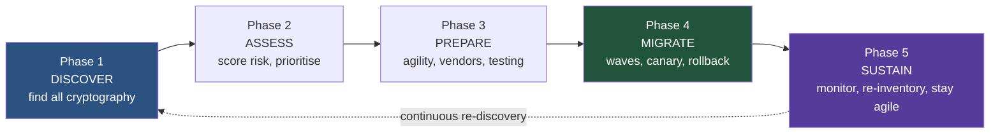
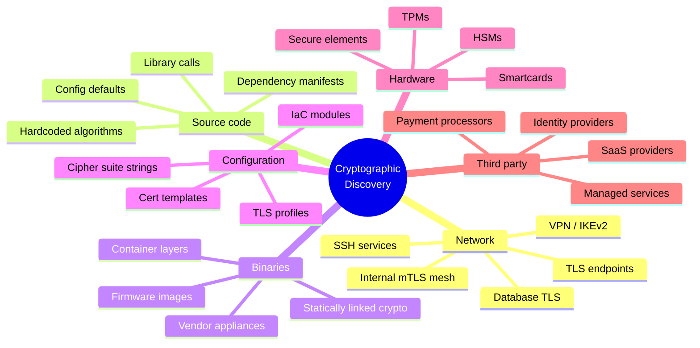
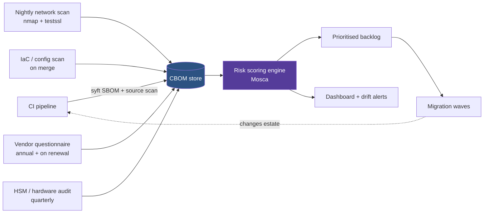
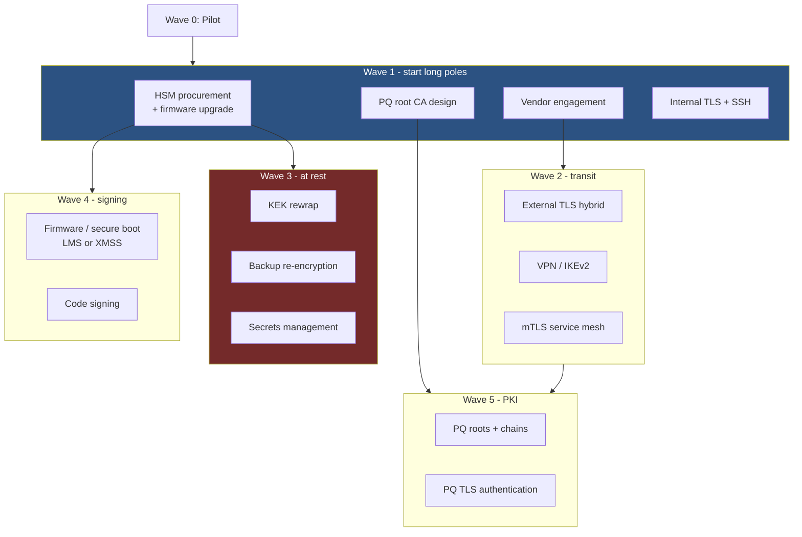
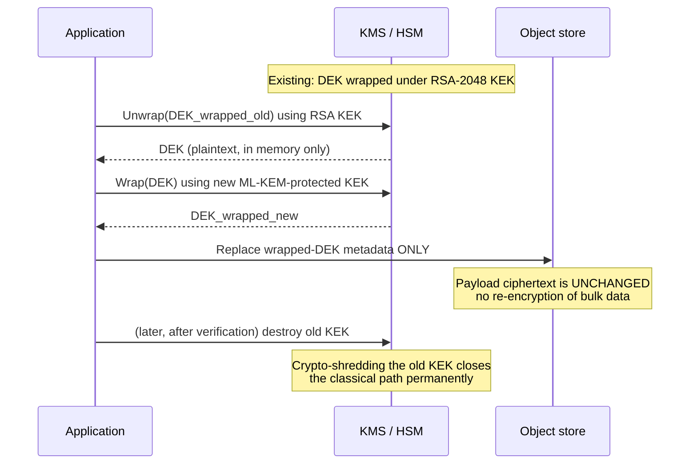
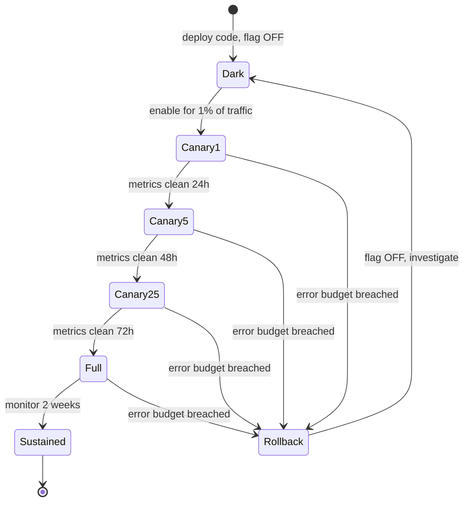

This is Chapter 5 of the Quantum Security notebook, and the last one. Chapter 2 showed what quantum computing breaks, Chapter 3 showed why the risk is already live through harvest-now-decrypt-later, and Chapter 4 went deep on the algorithms that replace what breaks. All three left the same question unanswered: *how do you actually move an organisation?*

That is not a cryptography problem. Every algorithm you need is standardised, implemented, and shipping in mainline OpenSSL and OpenSSH. The blockers are discovery, prioritisation, vendor dependency, testing, sequencing, budget, and the unglamorous work of finding the RSA-2048 key wrapping a decade of backups in a system nobody owns. This chapter is about that work.

## Why This Matters

Cryptographic migrations have a bad track record. SHA-1 deprecation took roughly a decade from "known weak" to "actually removed", and stragglers persisted for years past every deadline. TLS 1.0 removal took years and broke payment terminals, medical devices, and internal tooling on the way. MD5 is *still* found in production certificate chains and in bespoke internal protocols. None of those migrations required new algorithms to be invented, new hardware, or new standards — they were pure "swap A for B" exercises, and they still took ten years.

The post-quantum migration is harder than all of them, on five specific dimensions:

| Dimension | SHA-1 / TLS 1.0 migration | Post-quantum migration |
|---|---|---|
| **Scope** | One primitive, mostly in TLS and certificates | Every asymmetric primitive: key exchange, signatures, key wrapping, PKI, code signing, secure boot, secrets management |
| **Size impact** | Negligible | Handshakes grow 5-40x; certificates grow ~10x; some systems break on size alone |
| **Deadline** | Set by browser vendors, visible and negotiable | Set by an adversary's undisclosed capability, invisible and non-negotiable |
| **Retroactive risk** | None — old SHA-1 signatures were not newly forgeable in bulk | **Yes** — data encrypted today is decryptable later (Chapter 3) |
| **Hardware coupling** | Little | HSMs, TPMs, smartcards, secure elements, and silicon roots of trust may need replacement, not reconfiguration |

The retroactive-risk row is the one that changes the management conversation. In every previous migration, being late cost you a browser warning. Here, being late costs you data that was already exfiltrated in ciphertext form and becomes readable later. There is no way to un-send it.

The realistic honest framing to give leadership: **this is a multi-year programme with a hardware component, not a patching exercise, and the parts of it that protect long-lived data cannot be deferred without accepting permanent loss.**



---

## Part 1: The Five-Phase Model

Every credible migration guidance — NIST's NCCoE practice guides, national cyber-agency roadmaps, and the internal programmes that are actually running — reduces to the same five phases. The names differ; the substance does not.

| Phase | Question it answers | Primary output | Typical duration |
|---|---|---|---|
| **1. Discover** | Where is cryptography in my estate? | Cryptographic Bill of Materials (CBOM) | 6-18 months, then continuous |
| **2. Assess** | What do I fix first? | Risk-scored, ordered backlog | 2-4 months, then continuous |
| **3. Prepare** | Can I actually change it? | Crypto-agility, vendor commitments, test harness | 6-12 months |
| **4. Migrate** | Roll it out without breaking production | Wave-by-wave deployment with telemetry | Multi-year |
| **5. Sustain** | Stay migrated and stay agile | Monitoring, drift detection, re-inventory | Permanent |

Three things about this model are worth stating explicitly because they are where programmes go wrong:

- **Phase 1 never finishes.** Treating discovery as a project with an end date guarantees that the inventory is stale before the first migration wave lands. Discovery must become a pipeline that runs continuously, like vulnerability scanning.
- **Phase 3 is the phase everyone skips**, and skipping it is why Phase 4 stalls. If you cannot change an algorithm without a code change and a release cycle, you do not have a migration plan; you have a series of one-off projects.
- **Phases overlap heavily.** You will be migrating your TLS estate (Phase 4) while still discovering cryptography in an acquired subsidiary (Phase 1). That is normal and correct. A strictly sequential reading of this model produces a programme that delivers nothing for three years.

### 1.1 What "done" means

Define success criteria before Phase 1, or you will never be able to declare victory. A workable definition:

> Every cryptographic asset protecting data whose shelf-life `X` extends past the estimated CRQC arrival `Z` (Chapter 3's Mosca inequality) uses a post-quantum or hybrid algorithm at an appropriate NIST security category, and the organisation can change any cryptographic primitive by configuration within one release cycle.

Note that the second clause — agility — is part of the definition of done. A migration that lands on ML-KEM but leaves you unable to move to HQC is a migration you will have to do again.

---

## Part 2: Phase 1 — Cryptographic Discovery

You cannot migrate what you cannot see. Discovery is the single largest, least glamorous, and most consistently underestimated part of the programme. Budget accordingly: in most real programmes, discovery consumes more effort than the actual algorithm changes.

Cryptography hides in six distinct places, and each needs a different technique.



### 2.1 Network discovery

The easiest and highest-yield starting point, because it is externally observable and needs no code access.

The tool to learn first here is **`nmap`** — the network mapper. It is the standard port and service scanner: it sends crafted probes to discover open ports, identify the service behind them, and (through the Nmap Scripting Engine, NSE) run purpose-built scripts against those services. For cryptographic discovery the relevant script is `ssl-enum-ciphers`, which negotiates repeatedly with a TLS endpoint to enumerate every protocol version, cipher suite, and key exchange group it supports.

```bash
# Sweep an internal range for TLS services and enumerate their crypto
nmap -Pn -p 443,8443,993,995,465,587,5671,6379,9200 \
     --script ssl-enum-ciphers \
     -oA tls-inventory 10.0.0.0/16
```

Flag by flag:

- `-Pn` — skip host discovery (ping). Many internal hosts drop ICMP; without this you silently miss them.
- `-p 443,8443,...` — the port list. Do not scan only 443. Message queues (5671), Elasticsearch (9200), Redis with TLS (6379), and mail submission (465/587) all carry long-lived sensitive data and are routinely missed.
- `--script ssl-enum-ciphers` — the NSE script that does the actual enumeration.
- `-oA tls-inventory` — write output in all three formats (normal, greppable, XML) with that basename. The XML is what you parse programmatically.

Representative output for one host:

```
Nmap scan report for db-replica-03.internal (10.0.14.22)
PORT     STATE SERVICE
5432/tcp open  postgresql
| ssl-enum-ciphers:
|   TLSv1.2:
|     ciphers:
|       TLS_ECDHE_RSA_WITH_AES_256_GCM_SHA384 (secp256r1) - A
|       TLS_RSA_WITH_AES_256_CBC_SHA256 (rsa 2048) - A
|     cipher preference: server
|_  least strength: A
```

Two findings in four lines. `TLS_RSA_WITH_AES_256_CBC_SHA256` is **RSA key transport with no forward secrecy at all** — every session under that suite is decryptable from the server's long-term RSA key alone, which makes it a first-tier harvest-now-decrypt-later target. And `secp256r1` is a classical curve with no hybrid option offered. Both go straight into the CBOM.

For deeper TLS analysis, **`testssl.sh`** is the specialist tool: a shell script that performs an exhaustive assessment of a single endpoint — protocols, ciphers, key exchange groups, certificate details, and known vulnerabilities — and can emit machine-readable JSON.

```bash
git clone --depth 1 https://github.com/drwetter/testssl.sh.git
cd testssl.sh
./testssl.sh --jsonfile results.json --quiet --color 0 api.internal.example:443
```

- `--jsonfile results.json` — structured output for the CBOM pipeline.
- `--quiet` — suppress the banner.
- `--color 0` — no ANSI codes, so the output parses cleanly.

Combine that with the PQ-readiness scanner from Chapter 4 (Part 12.6) and you have your network layer covered.

**Scope and ethics reminder:** everything in this section is active interaction with live services. Scan only ranges you own or have written authorisation to test, and coordinate with the network team — an aggressive `ssl-enum-ciphers` sweep opens a great many connections and has been known to trip IDS and exhaust connection pools on fragile appliances.

### 2.2 Source-code discovery

Network scanning finds what is *listening*. It does not find the RSA key wrapping your backups, the ECDSA verification in your update client, or the hardcoded curve in a batch job. For that you need the source.

```bash
# High-signal grep across a monorepo - algorithm names and key sizes
grep -rniE \
  'RSA|ECDSA|ECDH|DSA|DiffieHellman|secp256|secp384|prime256|X25519|Ed25519|\bP-256\b' \
  --include=*.{java,py,go,js,ts,c,cpp,cs,rb,rs,kt,swift,php} \
  --exclude-dir={node_modules,vendor,.git,target,dist,build} \
  . | tee crypto-hits.txt

wc -l crypto-hits.txt
```

- `-r` recursive, `-n` line numbers (you need them for the CBOM), `-i` case-insensitive, `-E` extended regex.
- `--include` restricts to source files so you are not drowning in minified bundles and lock files.
- `--exclude-dir` removes dependency trees — you handle those separately through the dependency manifest, which is more accurate than grepping vendored code.

Language-specific patterns are worth having ready, because each ecosystem hides cryptography in its own idiom:

| Language | High-value patterns | What you are looking for |
|---|---|---|
| Java | `KeyPairGenerator.getInstance`, `Signature.getInstance`, `Cipher.getInstance`, `KeyFactory` | Algorithm strings like `"RSA"`, `"SHA256withECDSA"` |
| Python | `cryptography.hazmat`, `Crypto.PublicKey`, `rsa.generate_private_key`, `ec.generate_private_key` | Curve and key-size arguments |
| Go | `crypto/rsa`, `crypto/ecdsa`, `crypto/ed25519`, `tls.Config{CurvePreferences}` | Explicit curve preferences pinned in code |
| JavaScript/Node | `crypto.generateKeyPair`, `subtle.generateKey`, `namedCurve` | WebCrypto algorithm objects |
| C/C++ | `EVP_PKEY_CTX_new_id`, `RSA_generate_key_ex`, `EC_KEY_new_by_curve_name` | OpenSSL API calls with NID constants |
| Rust | `rsa::RsaPrivateKey`, `p256::`, `ring::signature` | Crate-level algorithm selection |

**A pattern worth flagging as a finding on sight:** any hardcoded key size or curve name that is not read from configuration. `rsa.generate_private_key(key_size=2048)` with a literal is an agility defect regardless of whether 2048 is currently adequate — it means changing the algorithm requires a code change, a review, and a release. That is Phase 3's problem, and finding it during Phase 1 is exactly why discovery and preparation overlap.

### 2.3 Dependency and binary discovery

Most cryptography in a modern application is not written by you. It arrives through dependencies.

```bash
# Generate a software bill of materials, then filter for crypto components
syft dir:. -o cyclonedx-json=sbom.json
jq -r '.components[] | select(.name | test("crypto|ssl|tls|bouncy|nacl|sodium|openssl|boring|wolf";"i"))
       | "\(.name)\t\(.version)"' sbom.json | sort -u
```

`syft` is a software-composition-analysis tool that inspects a directory, container image, or archive and produces an SBOM listing every component and version it can identify. Piping through `jq` — the standard command-line JSON processor — filters that to cryptographic libraries.

```
bcprov-jdk18on	1.77
libcrypto3	3.0.11
libssl3	3.0.11
openssl	3.0.11
tink-java	1.12.0
```

That output tells you something important immediately: **OpenSSL 3.0.11 has no native ML-KEM support** (that arrived in the 3.5 series, per Chapter 4). Every service on that base image needs either a library upgrade or an oqs-provider before it can do post-quantum anything. One `jq` command just produced a concrete, actionable dependency-upgrade backlog.

For statically linked or vendor binaries where you have no source and no SBOM, string extraction gets you surprisingly far:

```bash
strings -n 8 ./vendor-appliance-agent \
  | grep -iE 'rsa-|ecdsa|secp[0-9]|x25519|sha-?1|md5|TLSv1\.[01]|kyber|mlkem' \
  | sort -u | head -30
```

```
ECDSA-SHA256
RSA-PSS
TLSv1.2
prime256v1
secp384r1
sha1WithRSAEncryption
```

Not authoritative — strings can be dead code — but it produces a prioritised list of questions for the vendor, which is the actual deliverable of Part 5.

### 2.4 Configuration and infrastructure-as-code discovery

Cryptographic decisions increasingly live in configuration rather than code, which is good news for agility and bad news for discovery, because the configuration is scattered.

```bash
# Cipher suites and TLS settings across config and IaC
grep -rniE 'ssl_ciphers|cipher_suites|ssl_protocols|tls_version|minimum_tls|CipherSuites|ssl_ecdh_curve' \
  --include=*.{conf,cnf,yaml,yml,tf,json,toml,ini,properties} \
  --exclude-dir={.git,node_modules} . 
```

Places this consistently finds forgotten cryptography:

- **Terraform modules** defining load balancer TLS policies, often pinned to a named policy from years ago.
- **Kubernetes ingress annotations** setting cipher suites per-service, overriding the cluster default nobody knows about.
- **Nginx/Apache** `ssl_ciphers` strings copy-pasted from a blog post in a previous decade.
- **Database configuration** (`postgresql.conf`, `my.cnf`) with independent TLS settings that no one audits.
- **Java** `java.security` files and `jdk.tls.disabledAlgorithms` properties.

### 2.5 Hardware discovery

The hardest category, because it may not be fixable by software at all.

| Hardware | What to check | Failure mode if it cannot do PQC |
|---|---|---|
| **HSM** | Firmware version, vendor PQC roadmap, whether ML-KEM/ML-DSA are supported in firmware or only in a newer model | Root keys cannot move to PQC without hardware replacement and a key ceremony |
| **TPM** | Spec version, supported algorithms | Platform attestation and sealed storage stay classical |
| **Smartcards / PIV** | Applet capability, key slot algorithm support | Workforce credentials need reissue, possibly new cards |
| **Secure elements / IoT** | Silicon crypto accelerators, ROM-resident verification | Devices in the field may be permanently classical |
| **Network appliances** | Vendor firmware roadmap | Bump-in-the-wire crypto stays classical until the box is replaced |

**Start here, not last.** Hardware has procurement lead times, capital budget cycles, and in the HSM case a key-ceremony requirement that needs scheduling months in advance. If a hardware root of trust cannot be made post-quantum, that constraint shapes the entire architecture and you want to know in month two, not year three.

### 2.6 Third-party and SaaS discovery

Everything above covers what you control. A modern estate's cryptography is at least half someone else's. For every provider that handles data with a long shelf-life, you need answers to a fixed set of questions — Part 5 turns these into contract language:

1. Do your public endpoints support hybrid post-quantum key exchange today? Which groups?
2. What is your committed timeline for post-quantum key establishment, and for post-quantum authentication?
3. Which parameter sets and security categories do you implement?
4. How is data encrypted at rest, and what algorithm protects the key-encryption key?
5. What is your crypto-agility story — can you change primitives without a major version release?
6. Do you subcontract cryptographic processing, and what are *their* answers to 1-5?

Question 6 is the one people forget, and it is where the real exposure hides.

---

## Part 3: Building a CBOM That Stays Alive

Chapter 3 introduced the **Cryptographic Bill of Materials**. This part turns it from a document into a pipeline.

### 3.1 The schema that actually works

CycloneDX defines a `cryptographic-asset` component type, and using the standard rather than a bespoke spreadsheet buys you tooling compatibility. But the standard fields alone do not carry the information you need to *prioritise*. Add these:

| Field | Standard? | Why you need it |
|---|---|---|
| `algorithm` + `parameterSet` | Yes | `ML-KEM-768`, not "Kyber" (Chapter 4, Part 1.2) |
| `primitive` | Yes | `key-agree`, `signature`, `kem`, `block-cipher` |
| `nistQuantumSecurityLevel` | Yes | 0 for classical asymmetric; 1-5 for PQC |
| `assetOwner` | **No — add it** | Without a named owner, nothing gets fixed |
| `dataShelfLifeYears` (`X`) | **No — add it** | The Mosca input; drives all prioritisation |
| `migrationEffortYears` (`Y`) | **No — add it** | Honest per-asset estimate, not a global guess |
| `discoverySource` | **No — add it** | `nmap` / `grep` / `sbom` / `vendor-questionnaire`; tells you confidence |
| `lastVerified` | **No — add it** | Inventory decays; untouched entries need re-verification |
| `agilityTier` | **No — add it** | Can this be changed by config (1), redeploy (2), code change (3), or hardware (4)? |

The `agilityTier` field is the one that most changes behaviour. Two assets with identical risk scores but tiers 1 and 4 need completely different plans — one is a config push, the other is a procurement cycle.

### 3.2 A working CBOM fragment

```json
{
  "bomFormat": "CycloneDX",
  "specVersion": "1.6",
  "version": 1,
  "metadata": {
    "timestamp": "2027-01-14T09:00:00Z",
    "component": { "type": "application", "name": "payments-gateway" }
  },
  "components": [
    {
      "type": "cryptographic-asset",
      "bom-ref": "crypto/payments-gw/tls-kex",
      "name": "TLS key exchange - payments gateway edge",
      "cryptoProperties": {
        "assetType": "algorithm",
        "algorithmProperties": {
          "primitive": "key-agree",
          "parameterSetIdentifier": "secp256r1",
          "executionEnvironment": "software-plain-ram",
          "nistQuantumSecurityLevel": 0
        }
      },
      "properties": [
        { "name": "assetOwner",           "value": "payments-platform-team" },
        { "name": "dataShelfLifeYears",   "value": "7" },
        { "name": "migrationEffortYears", "value": "0.5" },
        { "name": "agilityTier",          "value": "1" },
        { "name": "discoverySource",      "value": "nmap ssl-enum-ciphers" },
        { "name": "lastVerified",         "value": "2027-01-14" }
      ]
    },
    {
      "type": "cryptographic-asset",
      "bom-ref": "crypto/archive/kek-wrap",
      "name": "Backup archive KEK - RSA-2048 envelope wrap",
      "cryptoProperties": {
        "assetType": "algorithm",
        "algorithmProperties": {
          "primitive": "pke",
          "parameterSetIdentifier": "RSA-2048",
          "executionEnvironment": "hardware",
          "nistQuantumSecurityLevel": 0
        }
      },
      "properties": [
        { "name": "assetOwner",           "value": "data-platform-team" },
        { "name": "dataShelfLifeYears",   "value": "25" },
        { "name": "migrationEffortYears", "value": "2" },
        { "name": "agilityTier",          "value": "4" },
        { "name": "discoverySource",      "value": "source-grep + HSM audit" },
        { "name": "lastVerified",         "value": "2027-01-09" }
      ]
    }
  ]
}
```

Look at the two entries side by side. The first is a TLS endpoint: 7-year shelf-life, half a year to migrate, agility tier 1 — a configuration change. The second is an RSA-2048 key-encryption key inside an HSM protecting 25-year archives, tier 4 — hardware. **The second one is vastly more urgent and vastly slower to fix**, which is exactly the combination that kills programmes that prioritise by ease rather than by risk.

### 3.3 Keeping it alive

A CBOM generated once is a snapshot of a moving target. Wire it into the systems that already run continuously:



Two automation rules that pay for themselves:

- **Fail CI when a new classical asymmetric asset appears on a high-shelf-life path.** New code should not be adding to the backlog. This is the single highest-leverage control in the whole programme, because it converts the problem from "growing" to "shrinking".
- **Alert on CBOM entries whose `lastVerified` is older than 90 days.** Stale inventory is worse than no inventory, because it produces false confidence.

---

## Part 4: Phase 2 — Risk Scoring and Prioritisation

You will discover thousands of cryptographic assets. You can migrate a handful per quarter. Prioritisation is the entire game.

### 4.1 Mosca's inequality, operationalised

Chapter 3 gave the inequality: if `X + Y > Z`, you are already too late. That is a yes/no test. For a backlog you need an *ordering*, so convert it to a continuous score:

```
urgency = (X + Y) - Z
```

- `urgency > 0` — already exposed. The larger the number, the deeper the exposure.
- `urgency <= 0` — currently on track, but re-evaluate whenever `Z` moves.

Then weight by blast radius, because a 25-year-shelf-life asset protecting one internal wiki is not the same as one protecting the customer database:

```
priority = urgency * impact_weight * (1 + harvest_exposure) * agility_penalty
```

| Factor | Range | Meaning |
|---|---|---|
| `urgency` | `(X + Y) - Z` | Mosca gap in years |
| `impact_weight` | 1-5 | Data classification: public(1), internal(2), confidential(3), restricted(4), regulated/secret(5) |
| `harvest_exposure` | 0-1 | How reachable is the ciphertext? Internet-facing transit or third-party-held at-rest = 1.0; internal-only, physically controlled = 0.1 |
| `agility_penalty` | 1-3 | Tier 1 config = 1.0, tier 2 redeploy = 1.3, tier 3 code = 1.8, tier 4 hardware = 3.0 |

The `agility_penalty` is deliberately a *multiplier on priority*, not a deduction. Hard things must start earlier precisely because they are hard. The most common prioritisation mistake is sorting the backlog by ease and shipping fifty tier-1 config changes while the tier-4 HSM problem — which needs three years — sits untouched.

### 4.2 The scoring engine

```python
#!/usr/bin/env python3
"""cbom_score.py - rank cryptographic assets by post-quantum migration priority.

Usage:  python3 cbom_score.py cbom.json --crqc-years 12
"""
import argparse, json, sys

IMPACT = {"public": 1, "internal": 2, "confidential": 3,
          "restricted": 4, "regulated": 5}

AGILITY_PENALTY = {"1": 1.0, "2": 1.3, "3": 1.8, "4": 3.0}

PQ_SAFE = {"ML-KEM-512", "ML-KEM-768", "ML-KEM-1024",
           "ML-DSA-44", "ML-DSA-65", "ML-DSA-87",
           "SLH-DSA-128s", "SLH-DSA-192s", "SLH-DSA-256s",
           "LMS", "XMSS", "HQC",
           "X25519MLKEM768", "SecP256r1MLKEM768", "SecP384r1MLKEM1024"}


def props(component):
    return {p["name"]: p["value"] for p in component.get("properties", [])}


def score(component, crqc_years):
    algo = (component.get("cryptoProperties", {})
                     .get("algorithmProperties", {})
                     .get("parameterSetIdentifier", "unknown"))
    p = props(component)

    if algo in PQ_SAFE:
        return None                                   # already migrated

    X = float(p.get("dataShelfLifeYears", 5))
    Y = float(p.get("migrationEffortYears", 1))
    Z = float(crqc_years)
    urgency = (X + Y) - Z

    impact = IMPACT.get(p.get("dataClass", "internal"), 2)
    harvest = float(p.get("harvestExposure", 0.5))
    penalty = AGILITY_PENALTY.get(p.get("agilityTier", "2"), 1.3)

    priority = urgency * impact * (1 + harvest) * penalty

    return {
        "ref":      component.get("bom-ref", component.get("name", "?")),
        "name":     component.get("name", "?"),
        "algorithm": algo,
        "owner":    p.get("assetOwner", "UNOWNED"),
        "X": X, "Y": Y, "Z": Z,
        "urgency":  round(urgency, 1),
        "tier":     p.get("agilityTier", "2"),
        "priority": round(priority, 1),
        "exposed":  urgency > 0,
    }


def main():
    ap = argparse.ArgumentParser()
    ap.add_argument("cbom")
    ap.add_argument("--crqc-years", type=float, default=12,
                    help="estimated years until a cryptographically relevant quantum computer")
    args = ap.parse_args()

    bom = json.load(open(args.cbom))
    rows = [r for r in (score(c, args.crqc_years)
                        for c in bom.get("components", [])
                        if c.get("type") == "cryptographic-asset") if r]

    rows.sort(key=lambda r: r["priority"], reverse=True)

    print(f"{'PRI':>7}  {'URG':>5}  {'TIER':>4}  {'ALGORITHM':<14} {'OWNER':<24} NAME")
    print("-" * 110)
    for r in rows:
        flag = "!!" if r["exposed"] else "  "
        print(f"{r['priority']:>7.1f}  {r['urgency']:>5.1f}  {r['tier']:>4}  "
              f"{r['algorithm']:<14} {r['owner']:<24} {flag} {r['name']}")

    exposed = sum(1 for r in rows if r["exposed"])
    unowned = sum(1 for r in rows if r["owner"] == "UNOWNED")
    print("-" * 110)
    print(f"{len(rows)} classical assets | {exposed} already exposed (X+Y>Z) | {unowned} UNOWNED")
    if unowned:
        print("WARNING: unowned assets cannot be migrated. Assign owners before planning waves.",
              file=sys.stderr)


if __name__ == "__main__":
    main()
```

Running it against a realistic estate:

```bash
python3 cbom_score.py cbom.json --crqc-years 12
```

```
    PRI    URG  TIER  ALGORITHM      OWNER                    NAME
--------------------------------------------------------------------------------
  675.0   15.0     4  RSA-2048       data-platform-team       !! Backup archive KEK - RSA-2048 envelope wrap
  432.0   12.0     4  RSA-4096       pki-team                 !! Offline root CA signing key
  198.0   11.0     3  ECDSA-P256     firmware-team            !! Device firmware update signing key
   93.6    6.0     2  RSA-2048       identity-team            !! SAML IdP token signing key
   36.0    5.0     1  secp256r1      payments-platform-team   !! TLS key exchange - payments gateway edge
   14.4    2.0     1  X25519         web-team                 !! TLS key exchange - marketing site
  -10.8   -3.0     1  secp256r1      internal-tools           internal wiki TLS
--------------------------------------------------------------------------------
7 classical assets | 6 already exposed (X+Y>Z) | 0 UNOWNED
```

Read the ordering carefully, because it is counter-intuitive and correct:

- **The top three are not TLS endpoints.** They are a backup KEK, a root CA key, and a firmware signing key — all tier 3 or 4, all with shelf-lives measured in decades. These are the things you start now, in parallel, because they take years.
- **The payments gateway TLS endpoint scores lower** despite being internet-facing and business-critical, because it is a tier-1 config change with a 7-year shelf-life. It is *urgent to schedule* but it is a week of work, not a programme.
- **The marketing site scores lowest among exposed assets** and the internal wiki is not exposed at all. Both are still worth doing — they are nearly free — but they should never displace the top three in a planning conversation.

**The single most valuable output of this script is the `UNOWNED` count.** An asset with no named owner will not be migrated, no matter how high it scores. Resolving ownership is Phase 2's real deliverable.

### 4.3 Choosing `Z`, honestly

`Z` — years until a cryptographically relevant quantum computer — is unknowable, and everyone wants a number. Handle it as a **sensitivity analysis** rather than a prediction:

```bash
for z in 8 12 20; do
  echo "=== CRQC in $z years ==="
  python3 cbom_score.py cbom.json --crqc-years $z | tail -3
done
```

```
=== CRQC in 8 years ===
7 classical assets | 7 already exposed (X+Y>Z) | 0 UNOWNED
=== CRQC in 12 years ===
7 classical assets | 6 already exposed (X+Y>Z) | 0 UNOWNED
=== CRQC in 20 years ===
7 classical assets | 3 already exposed (X+Y>Z) | 0 UNOWNED
```

That table is the right artifact to bring to a steering committee. It says: *under the most optimistic public estimate we take seriously, three assets are already past the point of no return; under a pessimistic estimate, all seven are.* Nobody has to agree on `Z` to agree that the top three assets must start now. **Framing the decision so it does not depend on the unknowable number is the single most useful move available to you in that meeting.**

---

## Part 5: Phase 3a — Crypto-Agility as Engineering Practice

Chapter 3 defined crypto-agility as an architectural property. This part is the code.

### 5.1 The anti-pattern

```python
# ANTI-PATTERN: algorithm decisions scattered through business logic
from cryptography.hazmat.primitives.asymmetric import rsa, padding
from cryptography.hazmat.primitives import hashes

def create_customer_token(payload):
    key = rsa.generate_private_key(public_exponent=65537, key_size=2048)
    signature = key.sign(
        payload,
        padding.PSS(mgf=padding.MGF1(hashes.SHA256()), salt_length=32),
        hashes.SHA256(),
    )
    return signature
```

Everything about the cryptography — algorithm, key size, padding, hash, salt length — is welded into a business function. To change any of it you edit business logic, re-review it, and ship a release. Now imagine that pattern repeated in 300 places by 40 teams. **That is the actual state of most estates, and it is why migrations take a decade.**

### 5.2 The pattern

```python
# PATTERN: one cryptographic service, configuration-driven, versioned
from dataclasses import dataclass
from typing import Protocol
import os, json


class Signer(Protocol):
    def sign(self, payload: bytes) -> bytes: ...
    def verify(self, payload: bytes, signature: bytes) -> bool: ...
    @property
    def algorithm_id(self) -> str: ...


@dataclass(frozen=True)
class CryptoPolicy:
    """Loaded from config, not compiled in."""
    signature_algorithm: str      # e.g. "ML-DSA-65" or "ECDSA-P256"
    kem_algorithm: str            # e.g. "X25519MLKEM768"
    hash_algorithm: str           # e.g. "SHA-384"
    policy_version: int           # bumped on every change, emitted in telemetry

    @classmethod
    def load(cls) -> "CryptoPolicy":
        raw = json.loads(os.environ.get("CRYPTO_POLICY", "{}"))
        return cls(
            signature_algorithm=raw.get("signature_algorithm", "ECDSA-P256"),
            kem_algorithm=raw.get("kem_algorithm", "X25519MLKEM768"),
            hash_algorithm=raw.get("hash_algorithm", "SHA-384"),
            policy_version=int(raw.get("policy_version", 1)),
        )


class CryptoService:
    """The ONLY place in the codebase that names an algorithm."""

    def __init__(self, policy: CryptoPolicy, registry: dict[str, type[Signer]]):
        self._policy = policy
        self._registry = registry

    def signer(self) -> Signer:
        algo = self._policy.signature_algorithm
        if algo not in self._registry:
            raise ValueError(f"unsupported signature algorithm: {algo}")
        return self._registry[algo]()

    def sign(self, payload: bytes) -> dict:
        s = self._signer_cached()
        return {
            "alg": s.algorithm_id,                    # ALWAYS record which algorithm
            "policy_version": self._policy.policy_version,
            "sig": s.sign(payload),
        }

    def _signer_cached(self) -> Signer:
        if not hasattr(self, "_cached"):
            self._cached = self.signer()
        return self._cached


# Business logic now knows nothing about cryptography:
def create_customer_token(payload: bytes, crypto: CryptoService) -> dict:
    return crypto.sign(payload)
```

Four properties make this agile, and all four matter:

1. **One place names algorithms.** Changing `ML-DSA-65` to `ML-DSA-87` is an environment-variable change, not a code review.
2. **The algorithm identifier travels with the output.** Every signature records `alg`. Without this you cannot tell which artifacts need re-signing after a migration — and "re-sign everything" is often impossible.
3. **`policy_version` is emitted in telemetry.** You can see, in a dashboard, exactly what fraction of your fleet is running which cryptographic policy. That is what makes canary rollouts (Part 8) measurable.
4. **Unknown algorithms fail loudly.** No silent fallback to a default — a misconfiguration should stop the service, not quietly downgrade it. Silent downgrade is how you end up believing you migrated.

### 5.3 The agility tiers, defined precisely

| Tier | Definition | Time to change an algorithm | Examples |
|---|---|---|---|
| **1** | Configuration change, no deploy | Minutes to hours | Load balancer TLS policy, nginx `ssl_ciphers`, feature-flagged crypto policy |
| **2** | Config change requiring redeploy/restart | Hours to days | Container env var, Java security properties, app config baked into an image |
| **3** | Code change, review, release cycle | Weeks to months | Hardcoded algorithms, bespoke protocol implementations, signed data formats without an `alg` field |
| **4** | Hardware, firmware, or contract change | Months to years | HSM firmware, TPM, smartcards, deployed IoT, third-party SaaS |

**The goal of Phase 3 is to move assets up this table before you try to migrate them.** Converting a tier-3 asset to tier 1 by extracting a crypto service is often cheaper *and* faster than migrating it in place — and it means the *next* migration is free. Given the SIKE and Rainbow history from Chapter 4, assume there will be a next migration.

### 5.4 Formats that block agility

Some data formats make agility structurally impossible, and finding these early saves enormous pain:

| Problem | Why it blocks migration | Fix |
|---|---|---|
| Signature stored without an algorithm identifier | You cannot tell which key/algorithm verifies it, so you can never retire the old one | Add an `alg` field; version the format |
| Fixed-width binary field sized for a 64-byte signature | ML-DSA-65 needs 3,309 bytes; the format physically cannot hold it | Length-prefixed or TLV encoding |
| Hardcoded key size in a database column (`CHAR(64)`) | Same problem, in the schema | Variable-length column, migrate schema first |
| Protocol with no version negotiation | No way to introduce a new algorithm without a flag day | Add version negotiation *before* you need it |
| Certificate pinning to a specific key | Rotating to a PQ key breaks every pinned client | Pin to a CA or use a pin set with backup pins |

That last row is worth dwelling on. **Certificate pinning and post-quantum migration are in direct tension.** Any mobile app or IoT device that pins a specific leaf key cannot have that key replaced with an ML-DSA key without an app update reaching 100% of the fleet first. Inventory your pins during Phase 1 and treat each one as a tier-4 asset regardless of how easy the server-side change looks.

---

## Part 6: Phase 3b — Vendors, Contracts, and the Supply Chain

Roughly half your cryptographic exposure is in software and services you did not write. You cannot patch it; you can only influence it, and influence has to be exercised early because vendor roadmaps are set years ahead.

### 6.1 The vendor assessment matrix

Score every vendor that touches long-shelf-life data:

| Dimension | Green | Amber | Red |
|---|---|---|---|
| **PQ key exchange today** | Hybrid live in production | Committed date within 12 months | No plan, or "we're monitoring the space" |
| **PQ authentication plan** | Public roadmap with dates | Acknowledged, no date | Not on roadmap |
| **Parameter sets** | Category 3+ named explicitly | "NIST-approved algorithms" | Cannot say |
| **Crypto-agility** | Algorithm changeable by config | Changeable in a minor release | Requires major version / re-platform |
| **Subprocessors** | Full disclosure with their answers | Disclosed, answers unknown | Undisclosed |
| **At-rest KEK** | PQ or hybrid KEK available | Roadmapped | RSA-wrapped, no plan |

"We're monitoring the space" is a red, not an amber. It is the phrase vendors use when there is no engineering work happening, and treating it as amber is how programmes discover in year three that a critical dependency has not started.

### 6.2 Contract language that actually helps

Most vendor security addenda are useless here because they reference "industry standard encryption", which classical RSA satisfies. Specific language you can adapt:

> **Cryptographic Agility and Post-Quantum Readiness.**
> (a) Supplier shall maintain the ability to change cryptographic algorithms used to protect Customer Data without requiring a major version upgrade or re-implementation by Customer.
> (b) For all Customer Data in transit, Supplier shall support hybrid post-quantum key establishment using NIST-standardised algorithms at security category 3 or above no later than [DATE].
> (c) For all Customer Data at rest with a retention period exceeding [N] years, Supplier shall ensure the key-encryption key is protected by a NIST-standardised post-quantum or hybrid mechanism no later than [DATE].
> (d) Supplier shall, on request and no less than annually, provide a Cryptographic Bill of Materials covering all cryptographic algorithms used to protect Customer Data, including those employed by subprocessors.
> (e) Supplier shall notify Customer within [30] days of any change to the algorithms or parameter sets identified under (d).

Clause (d) is the one to fight for. **A vendor CBOM converts an unknown into a managed item**, and it is a reasonable ask now that the format is standardised. Clause (e) is what stops your inventory going stale silently.

### 6.3 When the vendor will not move

Sometimes the answer is no, and you need compensating controls rather than a migration:

| Situation | Compensating control |
|---|---|
| SaaS provider has no PQ roadmap, holds long-lived data | Encrypt client-side with your own PQ-protected KEK before upload; the provider holds only ciphertext |
| Vendor appliance terminates TLS classically | Tunnel PQ-protected transport to the appliance edge; shrink the classical segment to a physically controlled span |
| Legacy device cannot be updated | Network isolation plus a PQ-protected gateway in front; treat the device segment as untrusted |
| Third-party API with classical-only TLS | Assess `X` for the data actually crossing that link; minimise, tokenise, or move the sensitive fields out of it |

The pattern in every row: **shrink the exposed segment until the classical span is short, physically controlled, or carries only short-shelf-life data.** You cannot always eliminate classical cryptography; you can almost always reduce what it protects.

---

## Part 7: Phase 4a — Wave Planning and Sequencing

With a scored backlog and an agility baseline, you can plan waves. Sequencing is driven by three rules:

1. **Retroactive risk first.** Key exchange and key wrapping before signatures (Chapter 4, Part 8.3) — except for signatures verified in the far future.
2. **Long lead times first.** Hardware and vendor items start in wave 1 even if they finish in wave 5.
3. **Learn where it is cheap.** Put a low-stakes, high-agility system in wave 1 to shake out tooling, telemetry, and rollback before you touch payments.

### 7.1 A realistic wave structure

| Wave | Focus | Why here | Typical duration |
|---|---|---|---|
| **0** | Pilot: one non-critical internal service, full cycle | Prove the toolchain, telemetry, and rollback end to end | 1-2 months |
| **1** | Start long-lead items: HSM procurement, vendor engagement, PQ root CA design; migrate internal TLS/SSH | Long poles start now; internal traffic is low-risk practice | 6-12 months |
| **2** | External TLS hybrid KEX; VPN/IKEv2; internal mTLS mesh | The bulk of harvest-now-decrypt-later transit exposure | 6-12 months |
| **3** | Data at rest: KEK rewrap, backup re-encryption, secrets management | Highest-scoring items; needs wave-1 HSM work complete | 12-18 months |
| **4** | Code signing, firmware signing, secure boot | Signatures verified far in the future; needs LMS/XMSS state design | 12-18 months |
| **5** | PKI: PQ roots, composite/dual chains, PQ authentication in TLS | Depends on ecosystem trust-store distribution | Multi-year |
| **6** | Long tail: legacy, acquired estates, embedded, exceptions | Whatever is left, plus everything discovery found late | Continuous |

Notice that **wave 3 (data at rest) contains the highest-priority items from the Part 4.2 scoring but sits third.** That is not a contradiction — its *preparation* (HSM procurement, KEK architecture) starts in wave 1. The scored priority tells you when to *start*, not when to finish.

### 7.2 The dependency graph



The critical path runs **HSM procurement → KEK rewrap → backup re-encryption**, and it is measured in years. Every week of delay on HSM procurement is a week added to the end of the programme. That is the sentence to put on the first slide of the funding request.

### 7.3 The at-rest rewrap workflow

Chapter 3 introduced envelope-encryption rewrap. Here is the operational version, because wave 3 lives or dies on it.



The essential property: **you rewrap the key, not the data.** A petabyte archive is rewrapped by rewriting a few kilobytes of key metadata per object. That is what makes wave 3 feasible at all. Two operational cautions:

- **Verify before destroying.** Confirm the new wrap unwraps correctly, on a sample and then in bulk, before crypto-shredding the old KEK. There is no recovery from getting this order wrong.
- **The window matters.** Rewrapping protects only objects not yet harvested. Anything already copied by an adversary is beyond help (Chapter 3). This is why wave 3 preparation starts in wave 1.

---

## Part 8: Phase 4b — Rollout Mechanics

Wave plans are strategy. This part is the mechanics of shipping a cryptographic change without an outage.

### 8.1 The canary pattern for cryptography

Cryptographic changes are unusually dangerous to roll out because failures are **all-or-nothing per connection** and often **client-population-specific** — the middlebox problem from Chapter 4 (Part 11.5) does not show up in your staging environment or your own office network. It shows up for 0.4% of users behind one corporate proxy.

That specific failure shape dictates the rollout design:



**Percentages must be by client population, not by request.** Rolling out to "1% of requests" gives an inconsistent experience — a client that succeeds then fails then succeeds — and makes the failure signal much harder to read. Bucket by client identity, source network, or session so a given client gets a consistent answer.

### 8.2 The flag, with a kill switch

```python
# pq_rollout.py - cryptographic policy selection with a canary and a kill switch
import hashlib, os, time
from dataclasses import dataclass

CLASSICAL_GROUPS = "X25519:P-256"
HYBRID_GROUPS    = "X25519MLKEM768:X25519:P-256"   # hybrid preferred, classical retained


@dataclass
class RolloutConfig:
    enabled: bool          # master kill switch
    percent: int           # 0-100, by client bucket
    excluded_networks: set # CIDRs known to break, e.g. a customer proxy
    policy_version: int


def bucket(client_id: str) -> int:
    """Stable 0-99 bucket. Same client always lands in the same bucket, so a
    client's experience is consistent across requests and across restarts."""
    h = hashlib.sha256(client_id.encode()).digest()
    return int.from_bytes(h[:4], "big") % 100


def groups_for(client_id: str, client_net: str, cfg: RolloutConfig) -> tuple[str, str]:
    if not cfg.enabled:
        return CLASSICAL_GROUPS, "killswitch"
    if client_net in cfg.excluded_networks:
        return CLASSICAL_GROUPS, "excluded"
    if bucket(client_id) < cfg.percent:
        return HYBRID_GROUPS, "canary"
    return CLASSICAL_GROUPS, "control"


def emit_metrics(client_id, reason, groups, negotiated, handshake_ms, ok):
    """Every handshake is labelled. Without this you cannot compare canary
    against control, and without that comparison a canary is theatre."""
    print(f"pq_handshake reason={reason} offered={groups} "
          f"negotiated={negotiated} ms={handshake_ms:.1f} ok={ok} "
          f"bucket={bucket(client_id)} ts={time.time():.0f}")
```

The two lines that matter most are the ones people leave out:

- **`reason`** — you must be able to tell a control-group failure from a canary failure from an excluded-network connection. Without the label, a rise in errors is unattributable and you will roll back changes that were fine.
- **`negotiated`** — what actually got used, not what you offered. Offering hybrid and negotiating classical is a *silent downgrade*, and it is the most common way a migration reports success while achieving nothing.

### 8.3 The metrics that decide go/no-go

| Metric | Compare | Rollback trigger |
|---|---|---|
| Handshake failure rate | Canary vs control | Canary exceeds control by > 0.1 percentage points |
| Handshake p99 latency | Canary vs control | Canary > control + 50 ms sustained 15 min |
| Connection reset rate | Canary vs control | Any statistically significant increase |
| Negotiated-hybrid rate | Within canary | < 95% of canary negotiating hybrid means silent downgrade |
| Downstream error rate | Canary vs control | Any increase (catches client-side failures you cannot see directly) |

**The comparison must be canary-versus-control, never canary-versus-yesterday.** Traffic patterns, client mixes, and unrelated incidents move baselines constantly. A control group running the old configuration concurrently is the only reliable reference, and it is cheap.

### 8.4 The rollback drill

Rehearse the rollback before you need it. A rollback that has never been executed is a hypothesis.

```bash
#!/usr/bin/env bash
# pq-rollback.sh - flip the kill switch and verify the fleet actually reverted
set -euo pipefail

REASON="${1:?usage: pq-rollback.sh <reason>}"

echo "[$(date -u +%FT%TZ)] ROLLBACK initiated: $REASON"

# 1. Kill switch off, everywhere, immediately
config-cli set --key crypto.pq.enabled --value false --scope global
config-cli set --key crypto.pq.percent --value 0     --scope global

# 2. Confirm propagation - do not assume, verify
sleep 15
for host in $(fleet-cli list --role edge); do
  actual=$(fleet-cli get "$host" --key crypto.pq.enabled)
  [[ "$actual" == "false" ]] || { echo "FAIL: $host still $actual"; exit 1; }
done

# 3. Verify on the wire from an external vantage point
neg=$(openssl s_client -connect edge.example.com:443 -groups X25519MLKEM768 \
        </dev/null 2>&1 | grep -o 'Negotiated TLS1.3 group: .*')
echo "post-rollback negotiation: $neg"

# 4. Record it - rollbacks are findings, not failures
incident-cli create --title "PQ rollout rollback: $REASON" \
                    --severity 3 --tag pqc-migration

echo "[$(date -u +%FT%TZ)] ROLLBACK complete and verified"
```

Expected output during a drill:

```
[2027-03-02T14:22:07Z] ROLLBACK initiated: drill
post-rollback negotiation: Negotiated TLS1.3 group: x25519
[2027-03-02T14:22:41Z] ROLLBACK complete and verified
```

Under a minute, verified on the wire from outside. That number — time from decision to verified revert — is the one to report. If it is measured in hours, your canary percentages should be much smaller.

### 8.5 Testing strategy

| Test type | What it catches | How |
|---|---|---|
| **Unit** | Wrong algorithm selected for a policy | Assert `alg` field in output matches configured policy |
| **Known-answer (KAT)** | Implementation bugs | FIPS 203/204/205 test vectors; must pass before anything ships |
| **Interop matrix** | Cross-implementation failures | Every client library version × every server version you support |
| **Size/limit** | Buffer and record-size failures | Synthetic max-size chains and handshakes |
| **Middlebox** | The Chapter 4 Part 11.5 failure | Proxies, corporate networks, mobile carriers, satellite links |
| **Performance** | Latency and CPU regressions | Load test at expected peak with hybrid enabled |
| **Chaos / negative** | Downgrade handling, malformed input | Strip the PQ group in flight; assert the connection fails or falls back *loudly* |
| **Rollback** | The drill above | Scheduled, timed, and reported |

The **interop matrix** is the one that consistently gets under-invested and consistently causes the outages. Build it as a real matrix, not a checklist:

```bash
#!/usr/bin/env bash
# interop-matrix.sh - every client against every server config
SERVERS=("openssl-3.5" "openssl-3.2-oqs" "boringssl" "gnutls")
CLIENTS=("openssl-3.5" "openssl-3.0" "curl-8" "java-21" "go-1.22" "python-3.11")
GROUPS=("X25519MLKEM768" "X25519")

printf '%-16s' "CLIENT\\SERVER"; printf '%-18s' "${SERVERS[@]}"; echo
for c in "${CLIENTS[@]}"; do
  printf '%-16s' "$c"
  for s in "${SERVERS[@]}"; do
    if run-interop "$c" "$s" "${GROUPS[0]}" >/dev/null 2>&1; then
      printf '%-18s' "OK"
    else
      printf '%-18s' "FAIL"
    fi
  done
  echo
done
```

```
CLIENT\SERVER   openssl-3.5       openssl-3.2-oqs   boringssl         gnutls
openssl-3.5     OK                OK                OK                OK
openssl-3.0     FAIL              FAIL              FAIL              FAIL
curl-8          OK                OK                OK                OK
java-21         FAIL              FAIL              FAIL              FAIL
go-1.22         OK                OK                OK                FAIL
python-3.11     OK                OK                OK                OK
```

Two whole client rows failing is a finding you want in week one of wave 0, not in the middle of wave 2. Each `FAIL` row becomes either a dependency upgrade ticket or an exclusion in the rollout config from Part 8.2.

---

## Part 9: Hands-On Lab — Discover, Score, Roll Out, Roll Back

This lab builds a miniature version of the whole programme against a sample estate you create locally. Everything runs on a single Linux VM. Nothing here touches a system you do not own.

**Prerequisites:** Chapter 4's lab environment (OpenSSL 3.5+ or oqs-provider), plus `jq`, `nmap`, and Python 3.

```bash
sudo apt update && sudo apt install -y jq nmap python3 python3-pip
mkdir -p ~/pq-migration-lab && cd ~/pq-migration-lab
```

### 9.1 Build a sample estate

```bash
mkdir -p estate/{payments,archive,firmware,wiki}

# A service with a hardcoded classical curve (agility tier 3)
cat > estate/payments/tls_client.py <<'EOF'
from cryptography.hazmat.primitives.asymmetric import ec
def make_key():
    # hardcoded curve - no configuration path
    return ec.generate_private_key(ec.SECP256R1())
EOF

# A backup tool wrapping DEKs under RSA-2048 (the high scorer)
cat > estate/archive/wrap.py <<'EOF'
from cryptography.hazmat.primitives.asymmetric import rsa, padding
from cryptography.hazmat.primitives import hashes
KEK_BITS = 2048   # hardcoded key size
def wrap_dek(dek, kek_pub):
    return kek_pub.encrypt(dek, padding.OAEP(
        mgf=padding.MGF1(hashes.SHA256()), algorithm=hashes.SHA256(), label=None))
EOF

# Firmware signing with ECDSA (verified years in the future)
cat > estate/firmware/sign.go <<'EOF'
package main
import ("crypto/ecdsa"; "crypto/elliptic"; "crypto/rand")
func newSigningKey() (*ecdsa.PrivateKey, error) {
    return ecdsa.GenerateKey(elliptic.P256(), rand.Reader)
}
EOF

# An already-agile service (tier 1) for contrast
cat > estate/wiki/crypto.conf <<'EOF'
signature_algorithm = ECDSA-P256
kem_algorithm       = X25519
policy_version      = 1
EOF

find estate -type f | sort
```

```
estate/archive/wrap.py
estate/firmware/sign.go
estate/payments/tls_client.py
estate/wiki/crypto.conf
```

### 9.2 Run source discovery

```bash
grep -rniE 'RSA|ECDSA|ECDH|SECP256R1|P256|X25519|Ed25519|KEK_BITS|key_size' estate/ \
  | tee discovery-raw.txt
```

```
estate/archive/wrap.py:1:from cryptography.hazmat.primitives.asymmetric import rsa, padding
estate/archive/wrap.py:3:KEK_BITS = 2048   # hardcoded key size
estate/firmware/sign.go:2:import ("crypto/ecdsa"; "crypto/elliptic"; "crypto/rand")
estate/firmware/sign.go:5:    return ecdsa.GenerateKey(elliptic.P256(), rand.Reader)
estate/payments/tls_client.py:1:from cryptography.hazmat.primitives.asymmetric import ec
estate/payments/tls_client.py:4:    return ec.generate_private_key(ec.SECP256R1())
estate/wiki/crypto.conf:1:signature_algorithm = ECDSA-P256
estate/wiki/crypto.conf:2:kem_algorithm       = X25519
```

Note what the raw output already tells you: three of the four hits are **in source files** (tier 3) and one is **in a config file** (tier 1). Discovery source predicts agility tier remarkably well, and you can encode that heuristic in your tooling.

### 9.3 Turn discovery into a CBOM

```python
#!/usr/bin/env python3
"""build_cbom.py - convert raw discovery output into a scored CBOM.
Real pipelines merge nmap XML, syft SBOMs, and vendor answers here too."""
import json, re, datetime, sys

# Discovered facts, enriched with data-owner and shelf-life metadata that
# comes from your data classification programme, not from the scanner.
ASSETS = [
    dict(ref="crypto/archive/kek",  name="Backup archive KEK wrap",
         algo="RSA-2048",   primitive="pke",       owner="data-platform",
         X=25, Y=2.0, cls="regulated",    harvest=1.0, tier="4",
         src="source-grep + HSM audit"),
    dict(ref="crypto/firmware/sign", name="Device firmware signing key",
         algo="ECDSA-P256", primitive="signature", owner="firmware-team",
         X=15, Y=1.5, cls="restricted",   harvest=0.3, tier="3",
         src="source-grep"),
    dict(ref="crypto/payments/tls", name="Payments gateway TLS key exchange",
         algo="secp256r1",  primitive="key-agree", owner="payments-platform",
         X=7,  Y=0.5, cls="regulated",    harvest=1.0, tier="3",
         src="source-grep"),
    dict(ref="crypto/wiki/tls",     name="Internal wiki TLS key exchange",
         algo="X25519",     primitive="key-agree", owner="internal-tools",
         X=2,  Y=0.2, cls="internal",     harvest=0.1, tier="1",
         src="config-scan"),
]

def component(a):
    return {
        "type": "cryptographic-asset",
        "bom-ref": a["ref"],
        "name": a["name"],
        "cryptoProperties": {
            "assetType": "algorithm",
            "algorithmProperties": {
                "primitive": a["primitive"],
                "parameterSetIdentifier": a["algo"],
                "nistQuantumSecurityLevel": 0,
            },
        },
        "properties": [
            {"name": "assetOwner",           "value": a["owner"]},
            {"name": "dataShelfLifeYears",   "value": str(a["X"])},
            {"name": "migrationEffortYears", "value": str(a["Y"])},
            {"name": "dataClass",            "value": a["cls"]},
            {"name": "harvestExposure",      "value": str(a["harvest"])},
            {"name": "agilityTier",          "value": a["tier"]},
            {"name": "discoverySource",      "value": a["src"]},
            {"name": "lastVerified",
             "value": datetime.date.today().isoformat()},
        ],
    }

bom = {
    "bomFormat": "CycloneDX", "specVersion": "1.6", "version": 1,
    "metadata": {"component": {"type": "application", "name": "sample-estate"}},
    "components": [component(a) for a in ASSETS],
}
json.dump(bom, open("cbom.json", "w"), indent=2)
print(f"wrote cbom.json with {len(ASSETS)} cryptographic assets")
```

```bash
python3 build_cbom.py
jq '.components | length' cbom.json
```

```
wrote cbom.json with 4 cryptographic assets
4
```

### 9.4 Score and prioritise

Save the `cbom_score.py` from Part 4.2, then run the sensitivity analysis:

```bash
python3 cbom_score.py cbom.json --crqc-years 12
```

```
    PRI    URG  TIER  ALGORITHM      OWNER                    NAME
--------------------------------------------------------------------------------
  450.0   15.0     4  RSA-2048       data-platform            !! Backup archive KEK wrap
   32.8    4.5     3  ECDSA-P256     firmware-team            !! Device firmware signing key
  -16.2   -4.5     3  secp256r1      payments-platform           Payments gateway TLS key exchange
   -9.7   -8.8     1  X25519         internal-tools              Internal wiki TLS key exchange
--------------------------------------------------------------------------------
4 classical assets | 2 already exposed (X+Y>Z) | 0 UNOWNED
```

```bash
for z in 8 12 20; do
  echo "=== Z = $z ==="
  python3 cbom_score.py cbom.json --crqc-years $z | tail -2
done
```

```
=== Z = 8 ===
4 classical assets | 3 already exposed (X+Y>Z) | 0 UNOWNED
=== Z = 12 ===
4 classical assets | 2 already exposed (X+Y>Z) | 0 UNOWNED
=== Z = 20 ===
4 classical assets | 1 already exposed (X+Y>Z) | 0 UNOWNED
```

**The archive KEK is exposed under every assumption**, including the most optimistic. That is the finding that does not require agreement about `Z`, and it is what goes on the first slide.

### 9.5 Stand up a canary rollout

Two servers — one hybrid, one classical — and a client bucketing script that routes between them:

```bash
# Reuse the Chapter 4 lab certificate, or make a fresh one
openssl req -x509 -new -newkey ML-DSA-65 -keyout s.key -out s.crt \
        -nodes -days 30 -subj "/CN=localhost" \
        -addext "subjectAltName=DNS:localhost,IP:127.0.0.1" 2>/dev/null

# Canary server: hybrid preferred
openssl s_server -cert s.crt -key s.key -accept 4443 \
        -groups X25519MLKEM768:X25519 -www -quiet &
# Control server: classical only
openssl s_server -cert s.crt -key s.key -accept 4444 \
        -groups X25519 -www -quiet &
sleep 1
```

```bash
#!/usr/bin/env bash
# canary-run.sh - route simulated clients by stable bucket, record outcomes
PERCENT="${1:-10}"
> canary-metrics.log

for i in $(seq 1 200); do
  client="client-$i"
  bucket=$(( 0x$(printf '%s' "$client" | sha256sum | cut -c1-4) % 100 ))
  if (( bucket < PERCENT )); then port=4443; arm=canary; else port=4444; arm=control; fi

  start=$(date +%s%N)
  out=$(timeout 5 openssl s_client -connect 127.0.0.1:$port \
        -groups X25519MLKEM768:X25519 </dev/null 2>&1)
  rc=$?
  ms=$(( ($(date +%s%N) - start) / 1000000 ))

  neg=$(grep -o 'Negotiated TLS1.3 group: .*' <<<"$out" | awk '{print $NF}')
  ok=$([[ $rc -eq 0 ]] && echo true || echo false)
  echo "arm=$arm bucket=$bucket negotiated=${neg:-none} ms=$ms ok=$ok" >> canary-metrics.log
done

echo "--- results at ${PERCENT}% canary ---"
awk '{split($1,a,"="); arm=a[2]; split($4,m,"="); split($5,o,"=");
      n[arm]++; t[arm]+=m[2]; if(o[2]=="true") ok[arm]++}
     END{for(x in n) printf "%-8s n=%-4d success=%5.1f%%  mean=%5.1fms\n",
         x, n[x], 100*ok[x]/n[x], t[x]/n[x]}' canary-metrics.log

echo "--- negotiated groups within canary arm ---"
grep 'arm=canary' canary-metrics.log | grep -o 'negotiated=[^ ]*' | sort | uniq -c
```

```bash
chmod +x canary-run.sh && ./canary-run.sh 10
```

```
--- results at 10% canary ---
canary   n=22   success=100.0%  mean= 12.4ms
control  n=178  success=100.0%  mean= 11.8ms
--- negotiated groups within canary arm ---
     22 negotiated=X25519MLKEM768
```

Read that as a go/no-go decision against the Part 8.3 table: success rates equal, latency delta 0.6 ms (well inside budget), and **100% of the canary arm negotiated the hybrid group** — no silent downgrade. This is a clean promote to 25%.

Now inject the failure you expect in production:

```bash
# Simulate a middlebox that mangles anything over 1200 bytes:
# restart the canary server behind a proxy that truncates large first segments
kill %1 2>/dev/null
python3 - <<'EOF' &
import socket, threading
def pipe(a, b, first=False):
    try:
        while True:
            d = a.recv(65535)
            if not d: break
            if first and len(d) > 1200:      # the "broken middlebox"
                d = d[:1200]
                first = False
            b.sendall(d)
    except Exception:
        pass
    finally:
        try: a.close()
        except Exception: pass
        try: b.close()
        except Exception: pass

srv = socket.socket(); srv.setsockopt(socket.SOL_SOCKET, socket.SO_REUSEADDR, 1)
srv.bind(("127.0.0.1", 4443)); srv.listen(64)
print("broken-middlebox proxy on 4443 -> 4445")
while True:
    c, _ = srv.accept()
    u = socket.create_connection(("127.0.0.1", 4445))
    threading.Thread(target=pipe, args=(c, u, True), daemon=True).start()
    threading.Thread(target=pipe, args=(u, c), daemon=True).start()
EOF
openssl s_server -cert s.crt -key s.key -accept 4445 \
        -groups X25519MLKEM768:X25519 -www -quiet &
sleep 2
./canary-run.sh 10
```

```
--- results at 10% canary ---
canary   n=22   success=  0.0%  mean=5002.1ms
control  n=178  success=100.0%  mean= 11.9ms
--- negotiated groups within canary arm ---
     22 negotiated=none
```

**That is the rollback trigger firing.** Canary failure rate 100% against a control at 0%, latency pinned at the 5-second timeout. Because the arms ran concurrently, the attribution is unambiguous — this is not a general outage, it is the canary configuration meeting a path that cannot carry a large `ClientHello`. Run the Part 8.4 rollback, then debug with the Chapter 4 Part 11.5 packet-capture procedure.

Clean up:

```bash
kill %1 %2 %3 2>/dev/null; wait 2>/dev/null; true
```

### 9.6 Wire a CI gate

The control that stops the backlog growing:

```python
#!/usr/bin/env python3
"""ci_crypto_gate.py - fail the build when new classical asymmetric crypto
appears on a path tagged as high-shelf-life. Run in CI on every merge."""
import json, subprocess, sys, re

HIGH_SHELF_PATHS = ("estate/archive/", "estate/firmware/", "src/vault/")
CLASSICAL = re.compile(
    r'\b(RSA|rsa\.generate|SECP256R1|SECP384R1|P256|P384|ecdsa\.GenerateKey|'
    r'DSA|DiffieHellman|prime256v1)\b')

def changed_files():
    out = subprocess.run(["git", "diff", "--name-only", "origin/main...HEAD"],
                         capture_output=True, text=True).stdout
    return [f for f in out.splitlines() if f.strip()]

violations = []
for f in changed_files():
    if not any(f.startswith(p) for p in HIGH_SHELF_PATHS):
        continue
    try:
        for n, line in enumerate(open(f), 1):
            if CLASSICAL.search(line) and "pq-exempt" not in line:
                violations.append((f, n, line.strip()))
    except OSError:
        continue

if violations:
    print("CRYPTO GATE FAILED - classical asymmetric cryptography added on a "
          "high-shelf-life path:\n")
    for f, n, line in violations:
        print(f"  {f}:{n}: {line}")
    print("\nUse the crypto service abstraction, or add '# pq-exempt <ticket>' "
          "with an approved exception.")
    sys.exit(1)

print("crypto gate passed")
```

```bash
python3 ci_crypto_gate.py
```

```
CRYPTO GATE FAILED - classical asymmetric cryptography added on a high-shelf-life path:

  estate/archive/wrap.py:1: from cryptography.hazmat.primitives.asymmetric import rsa, padding
  estate/archive/wrap.py:3: KEK_BITS = 2048   # hardcoded key size

Use the crypto service abstraction, or add '# pq-exempt <ticket>' with an approved exception.
```

The exemption mechanism matters as much as the gate. A gate with no escape hatch gets disabled within a month; a gate whose escape hatch requires a ticket reference produces a tracked, reviewable list of accepted debt.

---

## Part 10: The Organisational Layer

Technically perfect migrations still fail when the organisation around them is not built to carry a multi-year cryptographic programme.

### 10.1 Framing it for a board

Do not lead with quantum computers. Lead with the asymmetry:

> "Data we transmit and store today, protected with today's encryption, can be recorded now and decrypted later by an adversary who eventually acquires a quantum computer. For data with a confidentiality requirement measured in decades — customer records, archives, intellectual property — that risk is already realised, whether or not the machine exists yet. The remediation takes years because it includes hardware replacement. We are asking to start the long-lead items now."

Three properties make that framing work: it is accurate, it does not depend on predicting `Z`, and it names the constraint (hardware lead time) that justifies starting before the threat is visible.

**Do not** claim quantum computers will break RSA by a specific year. You will be wrong, and being wrong on a date is how programmes lose credibility and funding mid-flight.

### 10.2 Budget structure

| Category | Typical share | Notes |
|---|---|---|
| Discovery tooling and effort | 20-30% | Largest single line in years 1-2; mostly people |
| Hardware (HSM, TPM, tokens) | 15-30% | Capital; long lead times; drives the critical path |
| Engineering (agility refactors + migration) | 30-40% | Spread across product teams, not a central team |
| Vendor management and legal | 5-10% | Contract renegotiation, questionnaires, assessments |
| Testing and interop infrastructure | 10-15% | The interop matrix is infrastructure, not a script |
| Programme management | 5% | Real; do not pretend it is free |

The most common budgeting error is funding a central "PQC team" to do the migration. **A central team cannot migrate 300 services.** Fund a small central team to build tooling, standards, and the CBOM pipeline, and fund *product teams* to do the changes — with the CI gate and the CBOM providing the accountability.

### 10.3 Regulatory and compliance mapping

| Driver | Requirement shape | Practical effect |
|---|---|---|
| **CNSA 2.0** (NSA) | Mandated algorithms and timelines for national-security systems | Flows down through defence supply chains via contract |
| **National cyber-agency roadmaps** | Inventory and transition planning expectations for critical infrastructure | Inventory deadlines often precede migration deadlines |
| **Sector regulators (finance, health)** | "Appropriate technical measures", increasingly interpreted to include PQ planning | Ask examiners early what evidence they expect |
| **Data protection law** | Long retention plus a confidentiality duty | The `X` in Mosca is often set by law, not by preference |
| **Customer contracts** | Your own clause (Part 6.2), inbound | You will be asked these questions; be able to answer them |

**Inventory deadlines usually land before migration deadlines**, which is one more reason Phase 1 cannot be deferred: the first compliance artifact you will be asked for is the CBOM, not a migrated system.

### 10.4 Reporting that survives a multi-year programme

Five numbers, reported monthly, unchanged in definition for the life of the programme:

1. **Exposed assets** (`X + Y > Z` at your stated `Z`) — the headline; should fall monotonically.
2. **Unowned assets** — should be zero; anything above zero blocks progress by definition.
3. **Percentage of transit protected by hybrid PQ key exchange** — inbound and outbound separately.
4. **Critical-path status** — the single longest-lead item and its date. Usually HSM procurement.
5. **Agility tier distribution** — how many assets are tier 1 versus tier 4. This is the metric that predicts the cost of the *next* migration.

Changing the definitions mid-programme destroys the trend line, which is the only thing that makes a multi-year effort legible to people who are not in it daily. Pick the definitions carefully, then leave them alone.

---

## Part 11: Six Failure Modes and Their Postmortems

Each of these is a composite of patterns that recur across real migration programmes. Read them as pre-mortems: which one is your programme drifting toward?

### 11.1 The inventory that was never finished

**What happened.** Discovery was scoped as a nine-month project with a defined end. It ran eighteen months, produced a 4,000-row spreadsheet, and was declared complete. Migration planning began against that spreadsheet. By the time wave 2 started, roughly a third of the entries were wrong — services decommissioned, new services added, libraries upgraded — and two systems that had never been discovered at all caused outages.

**Root cause.** Discovery treated as a project rather than a pipeline.

**Fix.** Automate discovery into CI and nightly scans (Part 3.3). Enforce `lastVerified` freshness. Accept that the CBOM is a living system with an operating cost, not a deliverable.

### 11.2 The migration that measured the wrong thing

**What happened.** The programme reported "78% of endpoints support hybrid post-quantum key exchange" for two quarters. An external assessment found that only 31% of actual *sessions* were negotiating hybrid — a large fraction of clients did not support it, and several load balancers offered the group but preferred a classical one.

**Root cause.** Measuring configured capability instead of negotiated reality.

**Fix.** The `negotiated` field from Part 8.2. **Capability is not protection.** Report the fraction of sessions that actually used hybrid, measured server-side, and reconcile it against the client population.

### 11.3 The rollout that broke a customer segment

**What happened.** Hybrid key exchange was enabled fleet-wide in one change. Ninety-nine point six percent of traffic was unaffected. The remaining 0.4% — all behind one large customer's TLS-inspecting proxy — failed completely for eleven hours until the change was identified and reverted.

**Root cause.** No canary, no control arm, no rehearsed rollback. The failure was invisible in aggregate error rates because it was small in percentage terms and concentrated in one segment.

**Fix.** Part 8's canary state machine, bucketed by client population so segment-concentrated failures surface at 1% rather than 100%; alerting on per-segment rather than only aggregate error rates.

### 11.4 The HSM that could not be upgraded

**What happened.** Wave 3 (data at rest) was planned to start in year two. In month twenty-two the team discovered that the HSM model holding the root KEK had no post-quantum firmware path and required hardware replacement, procurement, and a key ceremony. The critical path extended by roughly two years.

**Root cause.** Hardware assessed last because it was assumed to be a firmware update.

**Fix.** Hardware discovery in wave 1 (Part 2.5), procurement started before it is needed, and vendor roadmaps confirmed in writing rather than assumed.

### 11.5 The silent downgrade

**What happened.** A service was migrated to hybrid key exchange successfully. Six months later a dependency downgrade during an unrelated incident reverted the TLS library to a version without ML-KEM support. The service kept working — it negotiated classical — and nobody noticed for four months.

**Root cause.** No drift detection. The migration was verified once, at rollout, and never again.

**Fix.** Continuous verification (Part 12.2). Alert when a service that previously negotiated hybrid stops doing so. **Migration is a state to be maintained, not an event to be completed.**

### 11.6 The agility that was never built

**What happened.** The programme migrated 200 services to ML-KEM-768 on schedule, by editing each service's code. Two years later a new requirement — a regulator mandating category 5 for a data class — required changing to ML-KEM-1024. The team discovered it was a second full migration, at nearly the same cost as the first.

**Root cause.** Phase 3 skipped. Migration performed as 200 point changes rather than by introducing a configuration-driven crypto layer.

**Fix.** Part 5. Refactor to a crypto service *as part of* the migration, not after it. The marginal cost of doing it during the change is small; the cost of doing it later is another whole migration. Given the SIKE and Rainbow history from Chapter 4, plan on there being a next time.

---

## Part 12: Detection & Defense Angle

Migration creates its own security considerations — a period of mixed cryptography, changed configurations, and new failure modes is exactly when things slip.

### 12.1 Migration-period threats

| Threat | Mechanism | Control |
|---|---|---|
| **Downgrade attack** | Attacker strips PQ groups from `ClientHello` to force classical, restoring HNDL exposure | Log every negotiated group; alert when a client that offered hybrid negotiated classical |
| **Configuration drift** | A rollback, dependency downgrade, or config push silently reverts a migrated service | Continuous verification (12.2) |
| **Exception sprawl** | Temporary exclusions from the canary config become permanent | Every exclusion carries an expiry date and a ticket; expired exclusions fail CI |
| **Fake compliance** | A vendor or team claims migration without verification | Verify on the wire; never accept a claim as evidence |
| **New-asset backslide** | New services ship with classical crypto while the old estate is migrated | CI gate (Part 9.6) |
| **Key-ceremony compromise** | New PQ root keys generated under weaker process than the originals | Apply the same ceremony rigour as the classical roots; PQ does not lower the bar |

### 12.2 Continuous verification

```bash
#!/usr/bin/env bash
# pq-drift-check.sh - verify migrated services still negotiate PQ. Run hourly.
# Reads a baseline of services expected to be hybrid; alerts on regressions.
set -uo pipefail
BASELINE="${1:-pq-baseline.txt}"    # lines: host:port expected_group
FAILED=0

while read -r target expected; do
  [[ -z "${target:-}" || "$target" == \#* ]] && continue
  neg=$(timeout 10 openssl s_client -connect "$target" \
          -groups X25519MLKEM768:X25519 </dev/null 2>&1 \
        | grep -o 'Negotiated TLS1.3 group: .*' | awk '{print $NF}')

  if [[ "$neg" != "$expected" ]]; then
    echo "DRIFT  $target expected=$expected actual=${neg:-UNREACHABLE}"
    FAILED=1
  else
    echo "ok     $target $neg"
  fi
done < "$BASELINE"

exit $FAILED
```

```bash
cat > pq-baseline.txt <<'EOF'
api.internal.example:443    X25519MLKEM768
edge.example.com:443        X25519MLKEM768
legacy.internal:443         x25519
EOF
./pq-drift-check.sh pq-baseline.txt
```

```
ok     api.internal.example:443 X25519MLKEM768
DRIFT  edge.example.com:443 expected=X25519MLKEM768 actual=x25519
ok     legacy.internal:443 x25519
```

One line of output just caught failure mode 11.5. Wire the non-zero exit into your alerting.

### 12.3 Downgrade detection

The server-side signal is the useful one, because only the server sees both what was offered and what was chosen:

```
# Pseudo-SIEM: client offered hybrid but session negotiated classical
WHERE tls.client_supported_groups CONTAINS "X25519MLKEM768"
  AND tls.negotiated_group NOT IN ("X25519MLKEM768","SecP256r1MLKEM768","SecP384r1MLKEM1024")
GROUP BY tls.negotiated_group, client_network
-> ALERT "possible PQ downgrade" WHEN count > baseline
```

Most hits will be benign — your own load balancer preference order, or an excluded network from the rollout config. That is fine: the value is that the benign explanations are *enumerable*, so anything outside them is worth investigating. A sudden cluster from one network that previously negotiated hybrid is a genuine downgrade signal.

### 12.4 Migration-period logging baseline

| Log this | At | Why |
|---|---|---|
| Offered groups + negotiated group | Every TLS session | Downgrade detection, real migration percentage |
| `policy_version` | Every crypto operation via the service layer | Fleet-wide policy visibility (Part 5.2) |
| `alg` identifier on every signature/ciphertext | Data creation | Tells you what needs re-signing or rewrapping |
| Canary arm + reason | Every rollout-affected session | Attribution during canary (Part 8.2) |
| KEK identifier per wrapped DEK | Every wrap/unwrap | Rewrap progress tracking (Part 7.3) |
| Rollback events | Every occurrence | Rollbacks are findings; trend them |

---

## Part 13: Common Pitfalls and Myths

### 13.1 Pitfalls

| # | Pitfall | Consequence | Fix |
|---|---|---|---|
| 1 | Treating discovery as a project with an end date | Stale inventory, surprise systems | Continuous pipeline (Part 3.3) |
| 2 | Prioritising by ease instead of risk | Fifty config changes shipped, HSM problem untouched | `agility_penalty` as a *multiplier* (Part 4.1) |
| 3 | Skipping Phase 3 (agility) | The next migration costs the same as this one | Refactor during migration (Part 5) |
| 4 | Measuring capability, not negotiated sessions | Reported progress that is not real | Log `negotiated` (Part 8.2) |
| 5 | Fleet-wide cryptographic changes | Segment-concentrated outages | Canary by client population (Part 8.1) |
| 6 | Rollback never rehearsed | Hours of outage during the incident | Timed rollback drill (Part 8.4) |
| 7 | Hardware assessed last | Multi-year critical-path extension | Hardware discovery in wave 1 (Part 2.5) |
| 8 | Central team doing all migration work | Bottleneck; nothing scales | Central tooling, distributed execution (Part 10.2) |
| 9 | Accepting vendor claims without verification | Believed-migrated systems that are not | Verify on the wire (Part 12.2) |
| 10 | Destroying old KEKs before verifying new wraps | Unrecoverable data loss | Verify, sample, then shred (Part 7.3) |
| 11 | Exceptions with no expiry | Permanent classical islands | Expiring exclusions enforced in CI |
| 12 | Predicting a date for `Z` in board material | Credibility loss when wrong | Sensitivity analysis (Part 4.3) |
| 13 | Ignoring certificate pinning | Server-side migration blocked by pinned clients | Inventory pins as tier-4 assets (Part 5.4) |
| 14 | No `alg` field on stored signatures/ciphertext | Cannot ever retire the old algorithm | Version formats before migrating (Part 5.4) |

### 13.2 Myths

**"We'll start when the standards are final."** They are final. FIPS 203/204/205 are published, the code is in mainline OpenSSL and OpenSSH, and browsers negotiate hybrid by default. Waiting adds HNDL exposure and buys nothing.

**"Our vendor says they're quantum-safe, so we're covered."** Verify it on the wire (Part 12.2), ask which parameter sets (Part 6.1), and ask about subprocessors. "Quantum-safe" with no algorithm names attached is marketing.

**"We can do this in a year if we throw people at it."** Discovery alone typically takes a year in a large estate, and HSM procurement plus a key ceremony cannot be parallelised away. Some of the critical path is calendar time, not effort.

**"Migrating TLS is the migration."** TLS is the visible part and often the easiest. The scoring in Part 4.2 consistently puts data-at-rest KEKs, root CAs, and firmware signing above TLS endpoints, and those are the tier-3 and tier-4 items.

**"We migrated, so we're done."** Migration is a state that drifts (11.5). And given SIKE and Rainbow (Chapter 4, Part 13), there will very likely be another migration. The durable deliverable is agility, not ML-KEM.

**"Post-quantum will slow everything down."** For key exchange, ML-KEM is computationally cheap (Chapter 4, Part 12.7); the cost is bytes and packet count. For signatures, size is the real constraint. Measure before you assume, and measure the right thing.

**"We can defer this until a quantum computer exists."** For data with a long confidentiality requirement, deferral means accepting that today's traffic is readable later. That is the entire content of Chapter 3 and it does not become less true with repetition.

---

## Final Revision / Summary

**The shape of the problem.** Post-quantum migration is harder than SHA-1 or TLS 1.0 deprecation on five dimensions: scope (every asymmetric primitive), size (handshakes and certificates grow multiples), deadline (set by an invisible adversary capability), retroactive risk (HNDL), and hardware coupling (HSMs, TPMs, smartcards). SHA-1 took a decade; this is bigger.

**Five phases.** **Discover** (find all cryptography — network, source, binaries, config, hardware, vendors), **Assess** (score and order), **Prepare** (agility, vendors, testing), **Migrate** (waves, canary, rollback), **Sustain** (monitor, re-inventory). Discovery never finishes; Phase 3 is the one people skip and the reason Phase 4 stalls.

**The CBOM.** CycloneDX `cryptographic-asset` components, extended with the fields that let you prioritise: `assetOwner`, `dataShelfLifeYears` (`X`), `migrationEffortYears` (`Y`), `agilityTier`, `discoverySource`, `lastVerified`. Fed continuously by CI, nightly scans, and vendor questionnaires. **An asset with no owner will not be migrated.**

**Prioritisation.** `urgency = (X + Y) - Z`, then `priority = urgency × impact × (1 + harvest_exposure) × agility_penalty`. Agility penalty is a **multiplier**, so hard things start earlier. Handle `Z` as a sensitivity analysis across optimistic and pessimistic values — the assets that are exposed under *every* value are the ones that need no argument.

**Agility.** One crypto service names algorithms; everything else calls it. Algorithms come from configuration. Every output records its `alg`. `policy_version` is emitted in telemetry. Unknown algorithms fail loudly rather than falling back. Tiers 1-4 (config / redeploy / code / hardware) predict effort better than any other single attribute — and moving assets *up* the tiers is often cheaper than migrating them in place.

**Sequencing.** Retroactive risk first (key exchange and key wrapping before signatures), long lead times first (hardware and vendors start in wave 1 even if they finish in wave 5), learn where it is cheap (a low-stakes pilot before payments). The critical path is usually **HSM procurement → KEK rewrap → backup re-encryption**.

**Rollout.** Canary bucketed by *client population*, with a concurrent control arm, a labelled `reason`, the actually-`negotiated` group, defined rollback triggers, and a rehearsed and timed kill switch. Compare canary against control, never against yesterday.

**Organisation.** Frame for the board on the asymmetry, not on a predicted date. Fund a small central team for tooling and product teams for execution. Report five stable numbers monthly: exposed assets, unowned assets, negotiated hybrid percentage, critical-path status, agility tier distribution.

**The durable deliverable is not ML-KEM.** It is the ability to change cryptographic primitives by configuration within one release cycle — because SIKE and Rainbow say there will be a next time.

---

## Cheat Sheet / Quick Reference

### The five phases

```
1 DISCOVER  network + source + binaries + config + hardware + vendors -> CBOM
2 ASSESS    urgency = (X+Y) - Z ;  priority = urgency x impact x (1+harvest) x agility
3 PREPARE   crypto service abstraction, vendor commitments, interop matrix
4 MIGRATE   waves, canary by client population, control arm, rehearsed rollback
5 SUSTAIN   drift detection, re-inventory, CI gate, keep agility
```

### Discovery commands

```bash
# Network
nmap -Pn -p 443,8443,5432,5671,6379,9200 --script ssl-enum-ciphers -oA inv 10.0.0.0/16
./testssl.sh --jsonfile r.json --quiet --color 0 host:443

# Source
grep -rniE 'RSA|ECDSA|ECDH|secp256|prime256|X25519|Ed25519' \
  --include=*.{java,py,go,js,ts,c,cpp,cs,rb,rs} --exclude-dir={node_modules,vendor,.git} .

# Dependencies
syft dir:. -o cyclonedx-json=sbom.json
jq -r '.components[] | select(.name|test("crypto|ssl|tls|bouncy|nacl";"i")) | "\(.name)\t\(.version)"' sbom.json

# Binaries
strings -n 8 ./binary | grep -iE 'rsa-|ecdsa|secp[0-9]|x25519|kyber|mlkem' | sort -u

# Config / IaC
grep -rniE 'ssl_ciphers|cipher_suites|ssl_protocols|minimum_tls|ssl_ecdh_curve' \
  --include=*.{conf,cnf,yaml,yml,tf,json,toml} .

# Verify reality (never trust a claim)
openssl s_client -connect host:443 -groups X25519MLKEM768 | grep "Negotiated TLS1.3 group"
ssh -Q kex | grep -E 'mlkem|sntrup'
```

### Agility tiers

```
Tier 1  config change, no deploy        minutes-hours    LB TLS policy, nginx ssl_ciphers
Tier 2  config + redeploy               hours-days       container env, java.security
Tier 3  code change + release           weeks-months     hardcoded algorithms, bespoke formats
Tier 4  hardware / firmware / contract  months-years     HSM, TPM, smartcards, SaaS, pinned clients
```

### Wave order

```
0  pilot (one low-stakes service, full cycle incl. rollback)
1  START LONG POLES: HSM procurement, vendor engagement, PQ root design + internal TLS/SSH
2  external TLS hybrid KEX, VPN/IKEv2, mTLS mesh
3  data at rest: KEK rewrap, backups, secrets
4  code signing, firmware, secure boot (LMS/XMSS state design)
5  PKI: PQ roots, composite/dual chains, PQ authentication
6  long tail: legacy, acquisitions, embedded, exceptions
```

### Rollback triggers

```
handshake failure rate    canary > control + 0.1 pp
p99 handshake latency     canary > control + 50 ms sustained 15 min
connection resets         any significant increase over control
negotiated-hybrid rate    < 95% within canary arm  -> silent downgrade
downstream error rate     any increase over control
```

### Monthly report (five numbers, definitions never change)

```
1  exposed assets (X+Y>Z)          -> must trend down
2  unowned assets                  -> must be 0
3  % sessions negotiating hybrid   -> inbound and outbound separately
4  critical-path item + date       -> usually HSM procurement
5  agility tier distribution       -> predicts cost of the NEXT migration
```

### Glossary

| Term | Meaning |
|---|---|
| **CBOM** | Cryptographic Bill of Materials; structured inventory of cryptographic assets |
| **`X` / `Y` / `Z`** | Data shelf-life / migration time / years to a CRQC (Mosca's inequality) |
| **Urgency** | `(X + Y) - Z`; positive means already exposed |
| **Agility tier** | 1 config, 2 redeploy, 3 code, 4 hardware/contract |
| **Rewrap** | Re-encrypting a DEK under a new KEK without re-encrypting bulk data |
| **Crypto-shredding** | Destroying a KEK so wrapped data can never be decrypted again |
| **Canary arm / control arm** | Population running the new / old cryptographic policy concurrently |
| **Silent downgrade** | Offering a PQ group but negotiating classical, without anyone noticing |
| **Drift** | A previously migrated service reverting to classical cryptography |
| **Kill switch** | Global flag that reverts cryptographic policy fleet-wide in one action |
| **CI crypto gate** | Build check that blocks new classical asymmetric crypto on high-`X` paths |
| **Composite / dual certificates** | Transition mechanisms carrying classical and PQ material (Chapter 4, Part 10.4) |
| **CNSA 2.0** | NSA suite and timeline: ML-KEM-1024, ML-DSA-87, LMS/XMSS, AES-256, SHA-384/512 |

---

## Practice Labs & Resources

- **NCCoE "Migration to Post-Quantum Cryptography" practice guides.** The closest thing to an official field manual. Read the discovery-tooling volume and the interoperability testing results, then map their methodology onto the five phases here.
- **Reproduce Part 9 end to end.** Build the sample estate, run discovery, generate a CBOM, score it across three `Z` values, run the canary at 10% and 50%, break it with the middlebox proxy, and execute the rollback script. Time the rollback — that number is the point of the exercise.
- **Extend `cbom_score.py`.** Add a `--wave` planner that groups assets into waves subject to a capacity constraint (say, three tier-3 migrations per quarter) while respecting the "long lead times first" rule. This is the scheduling problem the programme actually has.
- **CycloneDX CBOM tooling.** Generate a real CBOM for an open-source project of moderate size, then reconcile it against a live `nmap ssl-enum-ciphers` scan of that project's demo deployment. The gaps between the two are exactly the gaps every real programme has.
- **Build the interop matrix (Part 8.5) for real.** Containerise four TLS servers and six clients at different versions, script the matrix, and publish the result. This artifact is directly reusable at work.
- **CI crypto gate.** Add `ci_crypto_gate.py` to a personal repository, with the exemption mechanism, and live with it for a month. You will learn more about the exemption design than the detection design.
- **Vendor questionnaire drill.** Take three SaaS products you actually use, find their public security documentation, and try to answer the six questions in Part 2.6. Note how many you cannot answer — that is the real state of third-party cryptographic visibility.
- **HSM lab with SoftHSM.** Install SoftHSM2, create a key hierarchy, and practise the rewrap workflow from Part 7.3: wrap a DEK under KEK-1, rewrap under KEK-2 without touching the payload, verify, then destroy KEK-1. Do it once with the verification step deliberately skipped, on throwaway data, to feel why the ordering is non-negotiable.
- **Chaos drill.** In a lab, strip the PQ group from a `ClientHello` in flight with a proxy and confirm your detection rule (Part 12.3) fires. If it does not, your downgrade detection is decorative.
- **TryHackMe / HackTheBox networking and TLS rooms.** Not PQC-specific, but the packet-analysis fluency that Part 9.5 and Chapter 4's Part 11.5 assume is built there.
- **Read a real migration postmortem.** Public write-ups of the Chrome/Cloudflare hybrid rollout document the middlebox breakage at internet scale. Map what they found onto the six failure modes in Part 11 and identify which one your own environment is most exposed to.

---

## Practice Questions

Test yourself before moving on. Answers below.

1. Your CBOM contains two assets. Asset A: internet-facing TLS key exchange on `secp256r1`, `X = 5`, `Y = 0.5`, agility tier 1, data class regulated, harvest exposure 1.0. Asset B: an RSA-2048 KEK inside an HSM wrapping backups, `X = 20`, `Y = 2`, agility tier 4, data class regulated, harvest exposure 0.6. Using `Z = 12`, compute both priority scores and explain which you *start* first and why that differs from which you *finish* first.
2. A team reports that 85% of their services "support post-quantum key exchange." What single follow-up question exposes whether that number means anything, and what would a correct version of the metric measure?
3. You are three months from enabling hybrid TLS across a consumer-facing fleet of 4,000 servers serving 60 million users. Describe the rollout design, naming the bucketing strategy, the arms, at least three metrics with rollback triggers, and the one rehearsal you must complete before starting.
4. During discovery you find a mobile app that pins the leaf certificate's public key. The server-side migration to an ML-DSA certificate is a one-day change. Why is this actually a tier-4 asset, and what is the sequence that unblocks it?
5. Your CFO asks for a single date by which the organisation will be "quantum safe," and wants the quantum-computer arrival year in the board pack. Explain what you would present instead and why, in a way that still supports a funding decision.
6. A service was verified as negotiating `X25519MLKEM768` at rollout in wave 2. Eight months later an audit finds it negotiating `x25519`. Name the failure mode, the control that should have caught it within an hour, and the two most likely proximate causes.
7. Your programme has migrated 200 services to ML-KEM-768 by editing each service's TLS configuration in code. A regulator now mandates category 5 for one data class. Estimate the relative cost of this second change under your current architecture versus one where Phase 3 had been done, and state precisely what artefact would have made the difference.

**Answers.**

1. Asset A: `urgency = (5 + 0.5) - 12 = -6.5`; `priority = -6.5 × 5 × (1 + 1.0) × 1.0 = -65`. Asset B: `urgency = (20 + 2) - 12 = +10`; `priority = 10 × 5 × (1 + 0.6) × 3.0 = +240`. **Asset B scores far higher and is already exposed** (`X + Y > Z`), while Asset A is not yet exposed at `Z = 12`. You **start B first** — it is tier 4, meaning HSM procurement, possibly hardware replacement and a key ceremony, all with lead times measured in quarters. But you will very likely **finish A first**, because it is a tier-1 configuration change that takes a week. The scoring tells you when to *start*, not when to complete; that distinction is exactly what the `agility_penalty` multiplier encodes, and it is why prioritising by ease produces a programme that ships many cheap changes while the genuinely urgent item never begins.
2. Ask: **"Is that 85% measured as configured capability, or as the fraction of actual sessions that negotiated a hybrid group?"** Configured capability is almost always much higher than negotiated reality, because clients may not support the group and load balancers may offer it while preferring a classical one. The correct metric is **the percentage of completed TLS sessions whose negotiated group was a hybrid PQ group**, measured server-side from the `negotiated` field, reported separately for inbound and outbound traffic, and reconciled against the client population so you know how much of the shortfall is client capability versus your own preference ordering.
3. **Bucketing:** by stable client identity (or source network), not per request, so each client gets a consistent experience and segment-concentrated failures are visible at small percentages. **Arms:** a canary arm running hybrid-preferred groups and a concurrent control arm on classical, so comparisons are canary-versus-control rather than versus yesterday's baseline; every session labelled with `reason` (canary/control/excluded/killswitch) and the actually-`negotiated` group. **Progression:** dark deploy with the flag off, then 1% → 5% → 25% → 100%, holding 24/48/72 hours at each step. **Metrics and triggers:** handshake failure rate (roll back if canary exceeds control by more than 0.1 percentage points), p99 handshake latency (canary > control + 50 ms sustained 15 minutes), connection reset rate (any statistically significant increase), negotiated-hybrid rate within the canary arm (below 95% indicates silent downgrade), and downstream application error rate (any increase, since it catches client-side failures you cannot observe directly). Alert per client segment, not only in aggregate. **The mandatory rehearsal:** a timed, verified rollback drill — flip the kill switch, confirm propagation across the fleet, and verify on the wire from an external vantage point — with the decision-to-verified-revert time recorded. If that time is measured in hours rather than minutes, start at a much smaller canary percentage.
4. Because the constraint is not on the server, it is in the **deployed client population**. Replacing the pinned leaf key with an ML-DSA key breaks every installed app that pins the old key, and you cannot fix those devices remotely — you must wait for an app update to reach effectively the entire fleet, which is a months-to-years timeline governed by app-store adoption curves and users who never update. That is the definition of tier 4. **Unblocking sequence:** (1) ship an app release that pins to a *set* including backup pins, or pins to the CA rather than the leaf, or removes pinning in favour of certificate transparency plus standard validation; (2) wait for adoption to cross a threshold you decide in advance, measured from real telemetry; (3) force-upgrade or hard-fail the residual population on a published date; (4) only then rotate the server key to ML-DSA. Inventory every pin during Phase 1 so this clock starts as early as possible.
5. Present a **sensitivity analysis instead of a prediction**. Run the risk scoring across a range of `Z` values — for example an optimistic 20 years, a central 12, and a pessimistic 8 — and show how many assets are already exposed (`X + Y > Z`) under each. The powerful result is the set of assets exposed under *every* value: those need no agreement about quantum timelines to justify starting. Pair it with the critical-path fact — that the longest item (typically HSM procurement, KEK rewrap, and backup re-encryption) takes several years of largely calendar time that cannot be compressed with headcount. That framing supports a funding decision without committing you to a date you will be wrong about, and it protects the programme's credibility, which is the asset most easily lost mid-flight. If pressed for a target, commit to *programme milestones* you control (inventory complete, long-lead procurement placed, transit migrated) rather than to the adversary's timeline.
6. The failure mode is **drift** (Part 11.5) — migration treated as an event rather than a maintained state. The control that should have caught it within an hour is **continuous verification**: an hourly drift check that connects to each service in a baseline and alerts when the negotiated group differs from the expected value, exactly as in Part 12.2. The two most likely proximate causes are (a) a **dependency or image downgrade** — a rollback during an unrelated incident, or a base-image change, reverting the TLS library to a version without ML-KEM support — and (b) a **configuration overwrite**, where an infrastructure-as-code apply, a load balancer policy reset, or a competing config source restored an older cipher/group policy. Both are silent precisely because the service keeps working; classical negotiation is a successful handshake, not an error.
7. Under the current architecture the second change costs **approximately the same as the first** — 200 separate code changes, 200 reviews, 200 release cycles — because the algorithm is named in each service's code. Under a completed Phase 3 it would be **a configuration change plus a canary rollout**, perhaps two orders of magnitude cheaper, and measured in days rather than quarters. The artefact that makes the difference is **a single configuration-driven crypto service or policy layer that is the only place in the codebase naming an algorithm**, with the algorithm supplied by configuration, a `policy_version` emitted in telemetry so you can see fleet state, an `alg` identifier recorded on every output so you know what needs re-signing or rewrapping, and loud failure on unknown algorithms rather than a silent fallback. Building that during the first migration adds a small marginal cost; skipping it means paying for the whole migration twice — and given the SIKE and Rainbow breaks from Chapter 4, a third time is not unlikely.

This completes the Quantum Security notebook. Across five chapters it moved from the physics of qubits, through the algorithms that break classical cryptography and the harvest-now-decrypt-later risk that makes the threat present rather than future, to the standardised replacements and finally to the programme that deploys them. The next notebook shifts from a single threat domain to the practice of testing defences against offence directly.
