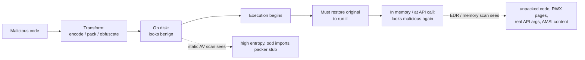
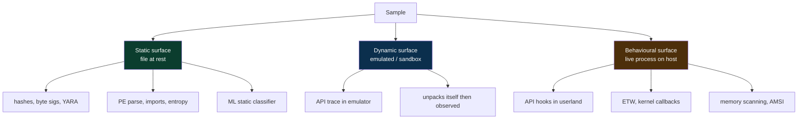
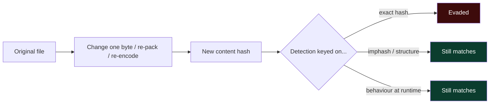
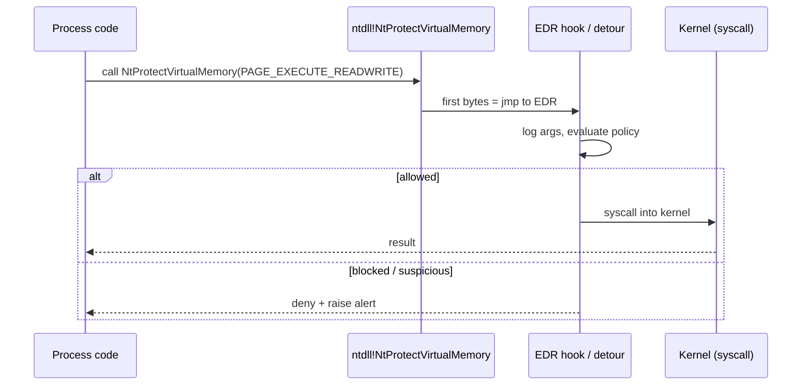
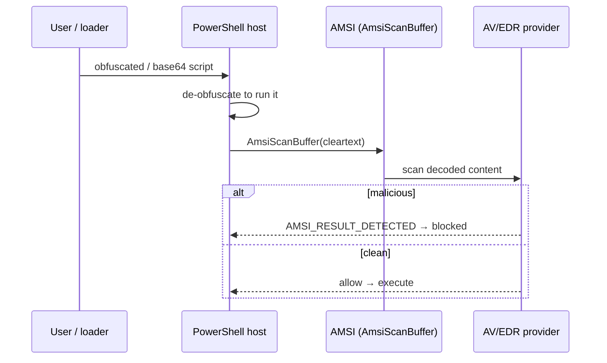
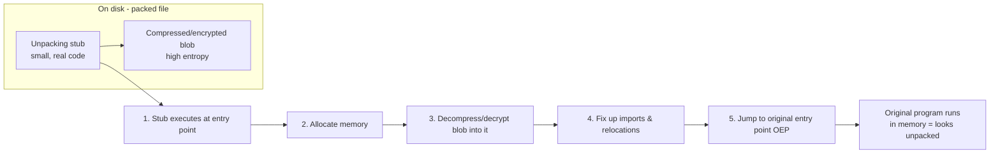
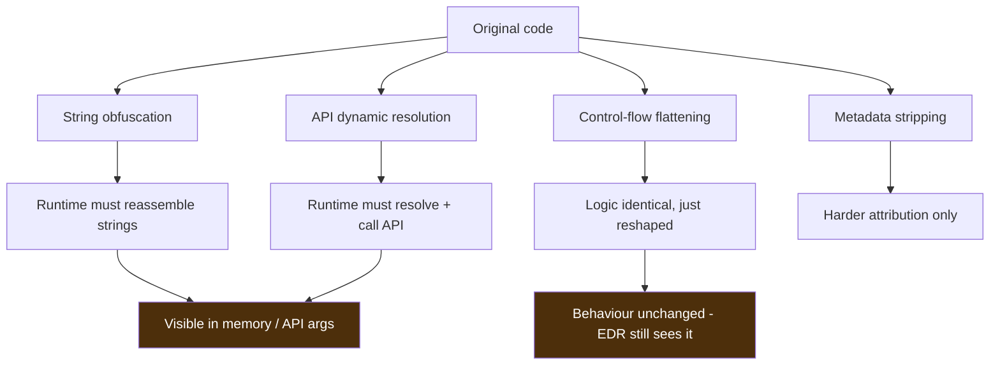
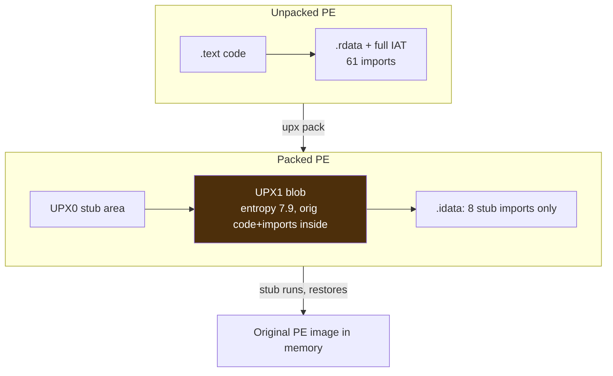
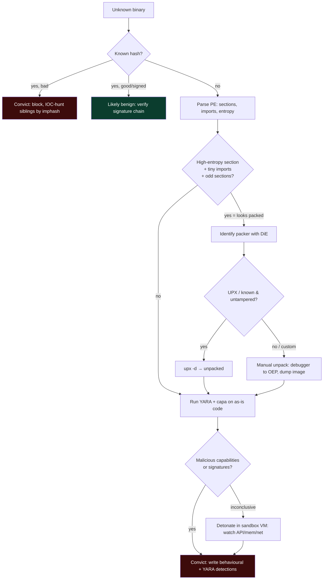

**Level:** Advanced · **Track:** Red Team · **Read time:** 205 min

This is Chapter 3 of the Malware & Evasion notebook. Chapter 1 gave you the taxonomy — trojans, RATs, ransomware, rootkits, loaders, droppers, stagers — and Chapter 2 walked the earliest offensive stages of the kill chain: how a payload is built and how a dropper gets it running, and exactly what telemetry each construction choice leaves behind. This chapter takes the natural next step. Once a payload and a dropper exist, they still have to survive contact with the defender's software: the antivirus engine scanning the file, and the endpoint detection and response (EDR) agent watching the process behave. Evasion is the collective name for the techniques that try to make malicious code *look* benign to those systems. The three most fundamental building blocks of that effort — and the subject of this chapter — are **obfuscation, packing, and encoding**.

A word on framing that governs the whole chapter, continuing the discipline of Chapters 1 and 2. Everything here is written for **authorized red-team work, malware analysis, and defense**. It is deliberately **conceptual, lab-scoped, and defanged**. Every hands-on illustration uses a benign artifact — the industry-standard **EICAR** test string, a **UPX-packed "hello world"** you compile yourself, a toy **XOR-encoded** string, or annotated output from analysis tools. There is **no working AV or EDR bypass in this chapter**, and no copy-paste weaponization. The reason to understand *how* evasion works is so you can recognise it in EDR telemetry, unpack it on an analysis bench, write detections that survive contact with a real intrusion, and — if you carry an offensive mandate — reason about your own artifacts' detectability without shipping harm. Building, deploying, or distributing real malware, or bypassing security controls on systems you do not own or lack **written authorization** to test, is a serious crime in every jurisdiction. Learn this to defend and to conduct sanctioned assessments — nothing else.

We move from first principles — what "detection" even means and what an AV/EDR stack actually inspects — through the precise vocabulary that separates **encoding**, **encryption** and **obfuscation** (three words routinely and wrongly used as synonyms), then into how packers compress-and-restore code at runtime and why entropy and import tables give them away, how obfuscation reshapes strings and control flow, and the in-memory/AMSI story at a conceptual level. Then a fully worked **analysis** lab on benign samples, a consolidated Detection & Defense part, and a cheat sheet with topic-specific practice resources.

## Why This Matters

Detection and evasion are a co-evolving arms race, and you cannot competently sit on either side of it without understanding the other. If you defend, every alert you triage and every rule you write is implicitly a bet about what attackers can and cannot change cheaply. If you conduct authorized offensive work, your artifacts' survival depends entirely on knowing which surfaces the defender inspects and which transformations actually move the needle versus which are folklore. Getting this wrong is expensive in both directions: defenders burn weeks writing brittle signatures that a one-byte change defeats, and operators burn a client engagement (and sometimes their reputation) by shipping a "FUD" tool that a modern EDR flags in the first second because they confused *encoding* with *evasion*.

The single most important idea in this chapter is that **obfuscation, packing and encoding do not make code do anything different — they change how it looks to an inspector, and only at specific moments.** A packed executable is byte-for-byte unrecognisable on disk, but the instant it runs it must restore the original code into memory, and at that instant it looks exactly like the original again. An XOR-"encrypted" string defeats a naive `strings` scan, but the process must decode it before use, so it appears in cleartext in memory and in API arguments. This asymmetry — *hidden on one surface, exposed on another* — is the entire game. Defenders win by moving inspection to the surface where the payload cannot stay hidden; evaders win by finding a surface the defender is not watching, or a moment before the defender looks.



**Blue-team framing up front:** as you read each technique, keep asking the Chapter 2 question — *"what would this look like in my telemetry, and on which surface does the disguise fail?"* That question, not the offensive mechanics for their own sake, is the point. By the Detection & Defense part you should be able to map every technique here to a concrete data source (static file scan, YARA, entropy, PE anomalies, AMSI, ETW, Sysmon, EDR process/memory events) and a hunt hypothesis.

A note on the **bug-bounty angle**, honestly: classic web/app bug bounty has little direct overlap with binary evasion, so this chapter does not force a "Bug Bounty Angle" box. Where it *does* connect is malware-analysis and detection-engineering work, EDR-bypass research programs, and the reversing/PWN side of CTFs — those threads are woven in inline where they are genuine, and the practice section points at real reversing and malware-analysis labs rather than web rooms.

## Part 1: What "Detection" Actually Means — The Three Surfaces

Before you can reason about evasion you must be precise about what a defender's product inspects, because "AV caught it" is meaningless until you know *which surface* caught it. There are three fundamentally different surfaces, and every detection technique lives on one of them.

- **Static surface — the file at rest.** Bytes on disk, never executed. This is where classic antivirus lives: hash the file, scan it for byte signatures, parse its structure (PE/ELF/Mach-O headers, sections, imports), measure statistical properties (entropy), and run machine-learning classifiers over features extracted from all of the above. The defining property: **nothing runs**, so the inspector only sees what the author left visible on disk.
- **Dynamic / emulated surface — the file executed in a sandbox.** The engine runs the sample in an instrumented, isolated environment (a lightweight CPU emulator inside the AV, or a full sandbox VM) and watches what it *does*: files it writes, registry keys it touches, network it reaches, APIs it calls. The defining property: transformations that only hide static bytes (encoding, packing) are **defeated automatically**, because the emulator lets the code unpack itself and then observes the result.
- **Behavioural / runtime surface — the real process on the real host.** This is EDR territory. The agent instruments the live process: hooks sensitive API calls, subscribes to kernel event streams (ETW on Windows, eBPF/auditd on Linux), registers kernel callbacks for process/thread/image-load events, and scans process memory. The defining property: it watches the **actual behaviour on the actual endpoint**, in context (who is the parent, is this normal for this host), which is why it is the hardest surface to fool with cosmetic file-level tricks.



The reason this taxonomy matters is that **each evasion technique targets exactly one surface and is largely useless against the others.** Encoding and packing target the static surface: they scramble the bytes on disk. They do essentially nothing against the dynamic or behavioural surfaces, because both of those let the code run and then observe the un-scrambled result. This is the number-one conceptual mistake newcomers make — they pack a payload, watch a static-only scanner go quiet, and conclude they are "undetectable," when in reality any behaviour-based EDR will flag the moment the unpacked payload injects a thread or beacons out.

| Surface | What it inspects | Example tech | Weakened by | NOT weakened by |
|---|---|---|---|---|
| Static (file at rest) | bytes, structure, entropy | AV signatures, YARA, ML file classifier | encoding, packing, string obfuscation | changing runtime behaviour |
| Dynamic (emulated) | actions in a sandbox | AV emulator, detonation sandbox | anti-analysis, long sleeps, environment keying | pure static packing |
| Behavioural (live host) | real API calls, kernel events, memory | EDR hooks, ETW, kernel callbacks, memory scan | direct syscalls, unhooking, in-memory-only (all high-effort) | cosmetic file-level obfuscation |

**Red-team relevance:** a mature operator picks transformations per surface deliberately — packing to soften a static upload scan, sandbox-awareness for the dynamic surface, and behavioural discipline (living off the land, avoiding RWX memory) for the EDR surface. **Blue-team relevance:** if your product only covers the static surface, you have a structural gap the size of the entire behavioural surface, and packing alone will blind you. The correct architectural response is defence-in-depth *across surfaces*, which is precisely why EDR exists on top of AV rather than replacing it.

## Part 2: How Antivirus Works Inside — Signatures, YARA, Emulation, ML

To understand what evasion is evading, you have to open up the antivirus engine. Modern AV is not one algorithm; it is a layered pipeline, and each layer is defeated (or not) by different transformations. We will teach the moving parts from scratch.

### 2.1 Hash-based detection (the crudest layer)

The simplest possible detection is an exact match: compute a cryptographic hash of the file (MD5, SHA-1, SHA-256) and compare it against a blocklist of known-bad hashes. It is fast, zero-false-positive, and utterly brittle: **changing a single byte changes the hash**, so any recompilation, any packing, any appended null byte defeats it entirely. This is why hash blocklists are a *coarse* first filter, not a real defence. Threat-intel feeds (VirusTotal, MalwareBazaar, MISP) trade in hashes precisely because they are unambiguous identifiers — but as a *detection* mechanism they only catch samples that have been seen before, byte-for-byte.

To reduce the brittleness, the industry also uses **fuzzy hashing** — algorithms like **ssdeep** (context-triggered piecewise hashing), **TLSH**, and **imphash** (a hash of the *import table* rather than the whole file). Imphash is especially instructive: two samples compiled from the same source with the same imports in the same order produce the same imphash even if other bytes differ, so it clusters variants of a family. **Analyst use:** pivoting on imphash in VirusTotal is a standard way to find siblings of a sample you are triaging.

### 2.2 Byte signatures and YARA

The workhorse of classic AV is the **byte signature**: a short, distinctive sequence of bytes (or a pattern with wildcards) that appears in a known-bad file and, ideally, nowhere benign. When the scanner finds the pattern, it flags the file. The open, industry-standard language for expressing these patterns is **YARA**, and because YARA is the lingua franca of both AV vendors and every malware analyst, we teach it from scratch here — it reappears in the lab.

**What YARA is:** a pattern-matching engine and rule language ("the pattern-matching swiss knife for malware researchers"). A YARA *rule* declares strings (byte sequences, text, or regex) and a boolean *condition* over them. You run it against files or process memory. It ships on Kali (`apt install yara`) or via `pip install yara-python`.

A minimal rule that would match the benign EICAR test file:

```yara
rule EICAR_Test_File
{
    meta:
        author = "notebook-lab"
        description = "Detects the benign EICAR antivirus test string"
        reference = "https://www.eicar.org/download-anti-malware-testfile/"
    strings:
        $eicar = "X5O!P%@AP[4\\PZX54(P^)7CC)7}$EICAR-STANDARD-ANTIVIRUS-TEST-FILE!$H+H*"
    condition:
        $eicar
}
```

Run it:

```bash
# Create the benign EICAR test file (harmless — every AV flags it by agreement, it is NOT malware)
printf 'X5O!P%%@AP[4\\PZX54(P^)7CC)7}$EICAR-STANDARD-ANTIVIRUS-TEST-FILE!$H+H*' > eicar.com

# Scan it with our rule
yara eicar_rule.yar eicar.com
```

Realistic output:

```
EICAR_Test_File eicar.com
```

The rule fired because the literal string is present. Now notice the fragility that motivates the *entire rest of this chapter*: if the file were XOR-encoded, base64-encoded, or compressed, that literal string would not appear on disk, and this rule would go silent — even though the file's *meaning* is unchanged. That is exactly what encoding and packing exploit against the static surface.

A slightly richer rule shows the real structure analysts use — multiple strings, hex patterns with wildcards, and a condition that requires several to co-occur, which is how you keep false positives down:

```yara
rule Suspicious_Loader_Concept
{
    meta:
        description = "CONCEPTUAL example — teaching structure only, matches benign markers"
        tlp = "white"
    strings:
        $s1 = "This program cannot be run in DOS mode"   // present in every PE
        $s2 = { 4D 5A }                                  // 'MZ' DOS header magic
        $api1 = "VirtualAlloc" ascii
        $api2 = "CreateThread" ascii
    condition:
        $s2 at 0 and $s1 and 1 of ($api*)
}
```

The `{ 4D 5A }` is a **hex string** — raw bytes — and `at 0` anchors it to file offset 0 (the `MZ` magic of a Windows PE). Wildcards (`??`) and jumps (`[4-8]`) let a single hex pattern tolerate variation, which is how vendors write signatures that survive minor variant changes. **Blue-team use:** you will write rules exactly like this for hunting; the discipline is to require enough co-occurring, high-signal strings that benign software does not trip it.

### 2.3 Heuristics and static structural analysis

Above raw signatures sits **heuristics**: the engine parses the file's *structure* and scores suspicious properties without needing a known signature. For a Windows PE, that includes: sections marked both writable and executable, an entry point that sits in the last section, a tiny import table (a hallmark of packing — see Part 5), a mismatch between the section's raw size and virtual size, an abnormally high-entropy section, appended data past the last section (overlay), a bogus or missing rich header, and dozens more. Each anomaly adds to a suspicion score; past a threshold, the file is flagged or sent for deeper analysis.

**This is the first layer that packing actually struggles against.** A packed file cannot easily hide the fact that it is packed — the structural fingerprints (few imports, high entropy, a small unpacking stub at the entry point) are themselves suspicious, even before any signature matches. This is a crucial point that we return to in Part 5: *packing does not make a file look benign; it makes a file look packed*, and "packed" is itself a heuristic red flag.

### 2.4 Emulation / dynamic unpacking inside the AV

The cleverest classic-AV layer is the **emulator**: a miniature CPU + OS environment inside the scanner that *runs the file's entry-point code for a few thousand instructions* in complete isolation, precisely so that a packed or encoded sample **unpacks itself**, at which point the engine scans the freshly-revealed memory image with its signatures. This is why "just pack it" has not defeated AV since roughly the mid-2000s: the emulator lets the packer do the analyst's work.

Evaders respond with **anti-emulation** tricks (all of which the emulator's authors then counter): call an obscure API the emulator does not implement and bail if it fails; sleep for a long time (emulators fast-forward or cap sleeps, so detect the fast-forward); check CPU features, timing, or the number of running processes; look for sandbox artifacts (specific usernames, MAC prefixes, small disk). This is a distinct discipline — **anti-analysis / sandbox evasion** — that targets the *dynamic* surface, and it is largely orthogonal to the packing/encoding/obfuscation triad that targets the *static* surface. We flag it here for completeness and to keep the surfaces straight; it deserves its own chapter.

### 2.5 Machine-learning static classifiers

Modern "next-gen AV" adds an **ML model** that consumes hundreds of static features (byte histograms, entropy per section, import names, string statistics, header fields) and outputs a maliciousness probability. ML classifiers are robust to trivial changes that defeat exact signatures, but they have their own weakness: they learn statistical patterns of "what malicious files look like," so **highly-packed, high-entropy, low-import files score suspicious by default** — because that profile correlates with malware in the training data. Ironically, aggressive packing can *raise* an ML score rather than lower it. Adversarial-ML research on evading these classifiers is active, but it is a specialised niche, not a commodity technique.

### 2.6 Benign demonstration — one byte defeats a hash, but not a heuristic

The brittleness of hash detection versus the resilience of structural heuristics is easy to *show* rather than assert, safely, using our benign `hello.exe`. Appending a single null byte changes the file's content hash completely while changing nothing about how it looks structurally:

```bash
cp hello.exe a.exe
cp hello.exe b.exe
printf '\x00' >> b.exe            # append one harmless byte
sha256sum a.exe b.exe
```

Realistic output:

```
9f2c1d...e1  a.exe
4b7a30...c9  b.exe          <-- completely different hash from a one-byte change
```

Two files, functionally identical, with unrelated SHA-256 values. A hash blocklist that knew `a.exe` learns nothing about `b.exe`. But run either through the *heuristic* and *imphash* layers and they are indistinguishable — same imports, same imphash, same section layout, same entropy, same ML feature vector. This is the concrete reason the industry moved up the stack from hashes to structural/behavioural detection: **the cheapest possible evasion (change one byte) defeats the cheapest possible detection (exact hash), so real detection must key on properties that survive cosmetic change.** Packing and obfuscation are just the industrial-scale version of "change bytes without changing meaning," and the same logic explains why they defeat *literal* signatures but not *structural* or *behavioural* ones.



## Part 3: How EDR Works Inside — Hooks, ETW, Kernel Callbacks, AMSI

Antivirus asks "is this file bad?" EDR asks a different, harder question: **"is this process behaving badly, right now, on this host?"** Because it watches behaviour rather than bytes, EDR is the surface that cosmetic file transformations cannot touch — and understanding its instrumentation is what lets a defender reason about coverage and an authorized operator reason about detectability. We teach the core mechanisms conceptually; none of this section is a bypass recipe.

### 3.1 Userland API hooking

The most common EDR sensor is the **userland hook**. Sensitive Windows functionality funnels through a small set of APIs in `ntdll.dll` (the lowest userland layer before the kernel), such as `NtAllocateVirtualMemory`, `NtProtectVirtualMemory`, `NtWriteVirtualMemory`, `NtCreateThreadEx`, `NtMapViewOfSection`. An EDR injects its own DLL into every process and **overwrites the first few bytes of these functions with a jump** to its inspection routine (an inline "trampoline" hook). When the monitored process calls, say, `NtProtectVirtualMemory` to flip a memory page to executable, control detours through the EDR first, which logs the call, inspects the arguments, and decides whether to allow, block, or alert — then continues into the real function.



**Why this matters for the triad:** hooking watches *behaviour and arguments*, not file bytes. Packing your loader changes nothing here — the unpacked loader still has to call `NtProtectVirtualMemory` to make its shellcode executable, and the hook sees that call regardless of how the file looked on disk. This is the concrete reason the static-surface triad is *not* an EDR bypass. Countering hooks is a separate, advanced discipline (direct/indirect syscalls, unhooking by restoring `ntdll` from a clean copy, call-stack spoofing) — conceptually important to name so you understand the arms race, but out of scope to weaponize here.

### 3.2 Event Tracing for Windows (ETW) and kernel callbacks

Hooks can be tampered with from userland, so EDRs also draw from sources the monitored process cannot easily touch. **ETW** is a high-performance, OS-built-in telemetry bus: components across Windows emit structured events (process start, image load, DNS queries, .NET assembly loads, PowerShell script blocks) to providers that an EDR subscribes to. The **Microsoft-Windows-Threat-Intelligence** ETW provider, in particular, surfaces sensitive memory and syscall events from the kernel and is a favourite EDR sensor. **Kernel callbacks** are the sturdiest of all: an EDR's kernel driver registers with documented kernel notification routines — `PsSetCreateProcessNotifyRoutineEx` (process creation), `PsSetCreateThreadNotifyRoutine` (thread creation, which catches remote-thread injection), `PsSetLoadImageNotifyRoutine` (DLL/driver loads), and `CmRegisterCallbackEx` (registry) — so the kernel itself notifies the driver every time these events occur, below anything userland malware can hook away.

| Sensor | Layer | Sees | Evaded (high-effort) by |
|---|---|---|---|
| Inline API hooks | userland (ntdll) | API calls + arguments | direct syscalls, unhooking |
| ETW (incl. TI provider) | userland/kernel bus | .NET loads, script blocks, mem events | ETW patching (in-process), which is itself detectable |
| Kernel callbacks | kernel driver | process/thread/image/registry events | requires kernel-level compromise (rare, loud) |
| Memory scanning | userland/kernel | unpacked code, injected regions | sleep-obfuscation/encryption of beacon memory |
| AMSI | userland (COM) | script & in-memory .NET content pre-exec | AMSI tampering, which EDR watches for |

### 3.3 AMSI — the Antimalware Scan Interface

**AMSI** deserves special attention because it is the bridge that lets script content be scanned *after* it is de-obfuscated but *before* it runs — directly attacking the weakness of every encoding/obfuscation trick applied to scripts. When PowerShell, JScript, VBScript, VBA macros, or .NET in-memory assemblies are about to execute a chunk of code, the host calls `AmsiScanBuffer`, handing the *already-decoded, about-to-run* content to whichever AV/EDR registered as an AMSI provider. So even if a PowerShell payload arrives base64-encoded, string-reversed, and split into a dozen concatenated fragments, PowerShell must reassemble the real script to run it, and AMSI sees that reassembled cleartext.



This single mechanism is why "just base64 your PowerShell" stopped working years ago, and it is the cleanest possible demonstration of the chapter's core asymmetry: **obfuscation hides content on the static surface, but the runtime must reveal it, and AMSI inspects exactly at the reveal.** The existence of AMSI is also why an entire sub-genre of offensive research targets AMSI itself — again, a real arms race we name but do not weaponize.

### 3.4 The Linux detection surface — eBPF, auditd, and memory scanning

The three-surface model is Windows-centric in its vocabulary (AMSI, ETW, `ntdll` hooks) but applies identically to Linux, and you will meet packed/obfuscated ELF malware on servers and in cloud workloads. The behavioural surface on Linux is built from different sensors:

- **eBPF** — the modern, in-kernel, safe-by-verifier instrumentation layer that Linux EDRs (Falco, Tetragon, and commercial agents) use to observe syscalls, process execution (`execve`), file, and network events with low overhead. It is the closest Linux analogue to kernel callbacks, and it is where server-side behavioural detection now lives.
- **auditd** — the classic userspace audit daemon reading kernel audit events; rules like `-S execve` log every process execution with its arguments, catching the same "decoded command line" tells as Sysmon Event ID 1 on Windows.
- **`/proc` and memory scanning** — because ELF packers (UPX for ELF is common) also restore code into memory, YARA can scan a live process (`yara rules.yar <pid>`) or a memory dump for the unpacked payload — the same "inspect memory, where the disguise fails" move.

**Analyst tell on Linux:** a UPX-packed ELF shows the same fingerprints — `readelf -S` reveals collapsed sections, `strings` is empty of meaningful content, and entropy is ~7.9; `upx -d` restores it just as on Windows. A frequent server-malware pattern is a UPX-packed coinminer or Mirai variant, and the triage is identical to Part 9: detect packing → unpack → analyze. The universal lesson holds across OSes: **static disguises are OS-agnostic, and so is the fact that memory is where they fail.**

## Part 4: Encoding vs Encryption vs Obfuscation — Getting the Words Right

These three words are used interchangeably in casual conversation and it causes real analytical errors. They are different mechanisms with different reversibility, different key requirements, and different detection implications. Nail the definitions and much of the confusion around "how do I make this undetectable" dissolves.

- **Encoding** transforms data into another representation using a **public, keyless, reversible** scheme, for compatibility or transport — Base64, hex, URL-encoding, gzip. Anyone can decode it with no secret. It provides **zero confidentiality**. Its only anti-detection value is defeating a *literal-string* scan, and only until the data is decoded.
- **Encryption** transforms data with an algorithm **and a key** so that only a holder of the key can recover it — XOR-with-key (weak), RC4, AES. Without the key the ciphertext is unreadable. But — crucially for malware — the process must carry the key and the decryption routine *with it*, so the plaintext is always recoverable by an analyst who runs or reverses the sample. Encryption of a payload buys you a static-surface disguise, nothing on the runtime surface.
- **Obfuscation** makes code or data **harder for a human or tool to understand** while keeping it functionally identical, with no clean decode step — renaming variables to gibberish, inserting junk/dead code, flattening control flow, splitting and reassembling strings, encoding API names, adding opaque predicates. There is no single "key"; you defeat it by analysis, not by decryption.

| Property | Encoding | Encryption | Obfuscation |
|---|---|---|---|
| Needs a key? | No | Yes | No |
| Reversible without secret? | Yes (public scheme) | No (need key) | Yes, but only via effort/analysis |
| Primary purpose (legit) | transport/compatibility | confidentiality | protect IP / anti-tamper |
| Malware purpose | defeat literal string scan | hide payload/config on disk | slow reversing, break signatures |
| Defeated by | decode step | run it / recover key from sample | dynamic analysis, deobfuscation tooling |
| Surface it targets | static | static | mainly static; some anti-analysis |
| Value vs EDR/behaviour | ~none | ~none | ~none |

The recurring lesson: **all three target the static surface and none of them changes runtime behaviour**, which is why none of them, alone, evades a behaviour-based EDR. They raise the cost of *static* analysis and defeat *literal* signatures — genuinely useful to an attacker against a static-only scanner, and genuinely important for a defender to recognise — but they are not magic, and treating them as an EDR bypass is the classic category error.

## Part 5: Encoding Concepts — and Why Encoding Is Not Evasion

Let's make encoding concrete with the toy example the whole industry uses to teach it: **XOR**. XOR (exclusive-or) is a bitwise operation with a property that makes it the "hello world" of payload obfuscation: `A XOR K XOR K = A`. Apply a key once to encode; apply the same key again to decode. It is trivially reversible, keyless-in-practice for single-byte keys (256 possibilities, brute-forced instantly), and yet it appears in a huge fraction of real malware to hide strings and shellcode on disk. Here is a completely benign demonstration — encoding the harmless string `notebook-lab` with a one-byte key, in Python, purely to show the mechanism:

```python
#!/usr/bin/env python3
# BENIGN teaching example: XOR-encode/decode a harmless string. No payload involved.
data = b"notebook-lab"
key  = 0x2A

def xor(buf, k):
    return bytes(b ^ k for b in buf)

enc = xor(data, key)
print("plaintext :", data)
print("encoded   :", enc.hex())          # what a 'strings' scan would see on disk
print("decoded   :", xor(enc, key))      # what the process reconstructs at runtime
```

Realistic output:

```
plaintext : b'notebook-lab'
encoded   : 44455e45425f45410760464f
decoded   : b'notebook-lab'
```

Two teaching points fall straight out of this benign toy:

1. **On disk (static surface), the string is gone.** A `strings sample` scan sees `44455e...` (or raw bytes), not `notebook-lab`. A YARA rule keyed on the literal string goes silent. *That* is the entire anti-detection value of encoding — and it is real, but narrow.
2. **At runtime the plaintext is reconstructed and must exist in memory.** The `xor(enc, key)` step produces `notebook-lab` in a buffer, so a memory scan, or an API hook logging the argument the program later passes to some function, sees the cleartext. The disguise evaporates the instant the data is used.

**Base64** is the other ubiquitous encoding, and it is *even weaker* than XOR because it needs no key at all and its output has an unmistakable signature: a restricted alphabet (`A–Z a–z 0–9 + /`), `=` padding, and a length that is a multiple of 4. Defenders detect base64 blobs trivially and *decode-and-rescan* them; AMSI decodes script-level base64 before scanning. **Analyst tip:** a long base64 string inside a script is not "hidden," it is a flashing sign that says "decode me" — analysts and detection rules both do exactly that. The presence of base64/gzip layers is itself a detection *feature*, not a defence.

The blue-team corollary is important and non-obvious: **you detect encoding by its statistical and structural fingerprints, not by decoding everything.** High-entropy regions, base64 alphabets, `FromBase64String`/`[Convert]::` in scripts, `-enc`/`-EncodedCommand` on PowerShell command lines — these are all cheap, high-signal indicators that *something* is being decoded at runtime, and they are among the most productive hunts in a SOC precisely because attackers over-rely on encoding believing it hides them.

## Part 6: Packing Concepts — Compress, Ship, Restore, Run

A **packer** is a program that takes an executable and produces a new, smaller (or just transformed) executable that, when run, **decompresses/decrypts the original code back into memory and jumps to it.** Packers were invented for legitimate reasons — reducing binary size and lightly protecting intellectual property — and legitimate software still uses them. But because packing scrambles the original code on disk into an opaque blob, it also defeats literal static signatures, which is why it became a malware staple. **The key mental model: a packed file contains a small "stub" (the unpacking routine) plus a compressed/encrypted blob (your original program). The stub runs first, restores the original into memory, and transfers control to it.**



### 6.1 What packing changes — and what it cannot hide

Here is the paradox that makes packing a *weak* stand-alone evasion against modern defences: **packing does not make a file look benign; it makes a file look packed, and "packed" is itself suspicious.** The structural fingerprints are loud:

- **High entropy.** Compressed/encrypted data is statistically random, pushing section entropy toward the theoretical max of ~8.0 bits/byte. Benign code sections sit around 6.0–6.5. An executable with a 7.9-entropy section is screaming "I am packed."
- **A tiny import table.** The packed program's real imports are hidden inside the blob and resolved at runtime, so the *file's* import table shrinks to a handful of functions the stub needs (`LoadLibrary`, `GetProcAddress`, `VirtualAlloc`, `VirtualProtect`). A "real" application with two imports is an anomaly.
- **Odd section names and layout.** Packers rename sections (`UPX0`, `UPX1`, `.aspack`, `.petite`) or create writable+executable sections; the entry point often lands in the last section rather than `.text`.
- **Raw size vs virtual size mismatch.** The packed section is small on disk but expands hugely in memory once decompressed.

All of these are exactly what the AV *heuristics* layer (Part 2.3) scores on, and what an ML classifier (Part 2.5) has learned to associate with malware. So packing trades one detection risk (literal signatures) for another (packing heuristics). Against a static-only scanner with weak heuristics it helps; against next-gen AV it can *hurt*.

### 6.2 UPX — the reference packer, taught from scratch

**UPX** (the Ultimate Packer for eXecutables) is the world's most common packer: open-source, cross-platform, and used by legitimate software *and* by a lot of low-effort malware. We teach it because it is benign, reversible, and perfect for demonstrating the whole compress-ship-restore-run loop safely. Install on Kali: `sudo apt install upx-ucl`. Its defining, defender-friendly property is that **UPX can unpack what it packs** (`upx -d`), because it is a compressor, not a protector — which is exactly why real adversaries who want to slow analysts down modify the UPX headers so the stock `upx -d` refuses, forcing manual unpacking.

We will pack a benign hello-world in the lab (Part 9). The conceptual point for now: after `upx hello`, the binary's `.text` disappears into a `UPX1` section at ~7.9 entropy with two imports; after `upx -d hello`, it is restored to the original. **Analyst reality:** most packed malware is *not* UPX-clean; you will meet custom packers, and the skill that transfers is recognising *that* a sample is packed (entropy + imports + section names) and finding the moment it unpacks itself in a debugger — the **OEP (Original Entry Point)** — to dump the restored image.

### 6.3 Crypters, protectors, and the family tree

Terminology in the wild is loose; here is the map. A **packer** primarily compresses (UPX). A **crypter** primarily encrypts the payload and is marketed (in criminal forums) for AV evasion — often split into a "stub" (the decryptor) and the encrypted payload, sometimes advertised as "FUD" (Fully UnDetectable, a claim with a shelf life measured in days). A **protector** (Themida, VMProtect, Enigma) adds heavy anti-debug, anti-VM, and code virtualization on top, aimed at stopping reversing entirely; legitimate commercial software uses these, which is what gives them cover. **Runtime packers** unpack in memory (all of the above); **installers/self-extractors** (NSIS, Inno) are a benign cousin that also "unpacks" but to disk.

| Category | Primary goal | Example | Reversible by tool? | Legit users? |
|---|---|---|---|---|
| Packer | size + light obfuscation | UPX, MPRESS | often yes (`upx -d`) | yes |
| Crypter | AV evasion | (criminal-market stubs) | no — manual | rarely |
| Protector | anti-reversing | Themida, VMProtect, Enigma | very hard | yes (commercial) |
| Self-extractor | packaging | NSIS, Inno Setup, SFX | yes (extract) | yes |

## Part 7: Obfuscation Concepts — Reshaping Code Without Changing It

Obfuscation is the broadest of the three, because it applies at the source, bytecode, or binary level and comes in many flavours. Its goal is to keep the program *functionally identical* while making it expensive for a human or a signature to recognise. The main families:

- **String obfuscation.** The most common and highest-value. Strings — URLs, filenames, registry keys, API names, C2 domains — are the juiciest signature and IOC material, so malware hides them: XOR/Base64 them (Part 5), split them into concatenated fragments (`"Vir"+"tual"+"Alloc"`), build them character-by-character, or stack-string them (push bytes onto the stack at runtime). **The runtime must reassemble them**, so — the refrain again — they are visible in memory and in the arguments to the APIs that consume them.
- **API obfuscation / dynamic resolution.** Rather than importing `VirtualAlloc` (which lands in the static import table and is a heuristic flag), malware resolves it at runtime: `GetProcAddress(GetModuleHandle("kernel32"), "VirtualAlloc")`, or hashes the API name and walks the export table comparing hashes (so even the string `"VirtualAlloc"` never appears). This shrinks and de-signatures the import table — but the *call itself* still hits the EDR hook at runtime.
- **Control-flow obfuscation.** Rearrange the program's logic so its shape no longer matches signatures or is hard to follow: **control-flow flattening** (turn structured code into one giant dispatch loop driven by a state variable), **opaque predicates** (branches whose outcome is constant but not obvious to a static analyzer), **junk/dead-code insertion**, and **instruction substitution** (replace `x+1` with equivalent longer sequences). These break byte signatures and frustrate disassemblers.
- **Metadata / symbol obfuscation.** Strip or rename symbols, remove debug info, randomize the compiler's rich header, so clustering and attribution are harder.
- **Script-level obfuscation.** In PowerShell/JS/VBA: random casing, backtick escapes, string reversal, `IEX`/`Invoke-Expression` of a rebuilt string, member access via reflection. Tools like the (well-known, defensively-studied) *Invoke-Obfuscation* framework catalogue these. **This is precisely the layer AMSI neutralises** — the script must de-obfuscate to run, and AMSI scans the de-obfuscated buffer.



**Legitimate context matters for the defender:** obfuscation is not inherently malicious. Commercial software obfuscates to protect IP; JavaScript is minified/obfuscated for size and IP; DRM uses code virtualization. This is what makes "is it obfuscated?" a *weak* verdict on its own — you need obfuscation *plus* suspicious behaviour or context to call something malicious, which is exactly why the behavioural surface is decisive.

## Part 8: In-Memory Execution and the AMSI Story (Conceptual)

The logical endpoint of "hide it on disk" is **don't put it on disk at all** — fileless / in-memory execution. If the payload only ever exists as bytes in a running process's memory, the entire static surface (the file scanner) has nothing to scan. This is why in-memory techniques are the natural companion to obfuscation and why they are the bridge to the next two chapters (AMSI bypass & in-memory execution in Chapter 4; process injection in Chapter 5). We keep this conceptual.

The defender's counter is equally logical: **if the payload avoids disk, inspect memory and inspect at the moment of execution.** That is what AMSI does for scripts and in-memory .NET (Part 3.3), what EDR memory scanning does for injected code (looking for RWX regions, private executable memory with no backing file, PE headers floating in a heap allocation), and what ETW's script-block and assembly-load providers do. So fileless does not mean invisible; it moves the fight from the file scanner to the memory scanner and the runtime hooks. The recurring asymmetry holds one more time: **memory is the surface where every static disguise finally fails, because the CPU has to see real instructions to execute them.**

### 8.1 Sleep obfuscation and beacon memory (conceptual bridge to C2)

There is one more move in the in-memory arms race worth naming because it directly connects packing/encoding ideas to the C2 material in the next notebook. EDR **memory scanning** periodically walks process memory looking for the unpacked payload — a floating PE header, known-bad byte patterns, an implant's config. An implant that sits in memory for hours between C2 check-ins is exposed to every scan pass during that idle time. The conceptual counter, **sleep obfuscation**, applies exactly the encoding/encryption idea from Parts 5–6 but to *live memory over time*: while the implant is idle ("sleeping" between beacons), it **encrypts its own memory region and marks it non-executable**, then decrypts and re-marks it executable only for the brief moment it runs, so a scan that lands during the sleep window sees a high-entropy blob rather than recognisable code.

Notice this is the whole chapter's asymmetry projected onto the time axis: the payload is *disguised while idle* and *exposed while active*, so the defender's counter is to scan **at the transitions** — the very `NtProtectVirtualMemory` calls that flip the region executable are hooked events (Part 3.1), and repeated encrypt/decrypt cycles on the same region are themselves an anomaly. We keep this conceptual and do not implement it; the point is that "encode on one surface, reveal on another" is a pattern you will now recognise everywhere, including in the beaconing behaviour Chapter 2 of the Red Team Operations notebook covers.

## Part 9: Hands-On Lab — Fingerprinting a Packed & Encoded Benign Sample

This lab is 100% benign and reproducible on a Kali VM. We build a harmless "hello world," pack it with UPX, and then wear the **analyst's** hat: measure entropy, read the PE structure, detect the packer, and unpack it — the exact triage workflow you use on real (malicious) packed samples, practised safely. Nothing here produces or handles malware.

### Step 0 — Tools (install from scratch)

```bash
# Compiler + the analysis toolkit used below
sudo apt update
sudo apt install -y gcc mingw-w64 upx-ucl yara python3-pip binutils
pip install --break-system-packages pefile capa
# 'Detect It Easy' (die) is the standard packer identifier; CLI is 'diec'
sudo apt install -y detect-it-easy 2>/dev/null || echo "install DiE from github.com/horsicq/Detect-It-Easy if not packaged"
```

**What each tool is (tool-from-scratch):**
- `gcc` / `mingw-w64` — C compilers; mingw cross-compiles a Windows PE from Linux so we can inspect PE structure.
- `upx` — the packer/unpacker from Part 6.2.
- `yara` — the signature engine from Part 2.2.
- `pefile` — a Python library to parse PE headers, sections, imports, entropy.
- `capa` — Mandiant's tool that identifies *capabilities* in a binary by matching rules to disassembled behaviour (e.g. "allocate RWX memory", "resolve API by hash"). Teaches you what a binary can *do*, which survives packing only after you unpack.
- `diec` (Detect It Easy) — identifies compiler/packer/protector by signatures.

### Step 1 — Build a benign PE and record its baseline

```bash
cat > hello.c <<'EOF'
#include <stdio.h>
int main(void){ puts("hello from a benign lab binary"); return 0; }
EOF
x86_64-w64-mingw32-gcc hello.c -o hello.exe
ls -l hello.exe
sha256sum hello.exe
```

Realistic output:

```
-rwxr-xr-x 1 kali kali 178685 hello.exe
9f2c...e1  hello.exe
```

### Step 2 — Baseline entropy and imports (unpacked)

```python
# entropy_imports.py — inspect any PE's section entropy and import count
import sys, pefile
pe = pefile.PE(sys.argv[1])
print(f"{'section':10} {'raw':>8} {'virt':>8} {'entropy':>8}")
for s in pe.sections:
    name = s.Name.rstrip(b'\x00').decode('latin1')
    print(f"{name:10} {s.SizeOfRawData:8d} {s.Misc_VirtualSize:8d} {s.get_entropy():8.2f}")
imp = sum(len(d.imports) for d in getattr(pe,'DIRECTORY_ENTRY_IMPORT',[]))
print("total imported functions:", imp)
```

```bash
python3 entropy_imports.py hello.exe
```

Realistic output (unpacked — note the *normal* entropy and *many* imports):

```
section         raw     virt  entropy
.text         62976    62884     6.31
.data          2560     2436     3.02
.rdata        19968    19860     4.77
.bss              0     6208     0.00
.idata         2048     1996     4.19
...
total imported functions: 61
```

### Step 3 — Pack it with UPX and re-measure

```bash
upx --best hello.exe -o hello_packed.exe
```

Realistic output:

```
                       Ultimate Packer for eXecutables
File size         Ratio      Format      Name
--------------------   ------   -----------   -----------
178685 ->     72704   40.69%    win64/pe     hello_packed.exe
Packed 1 file.
```

Now re-inspect the packed file:

```bash
python3 entropy_imports.py hello_packed.exe
```

Realistic output (note the transformation — high entropy, collapsed imports, UPX sections):

```
section         raw     virt  entropy
UPX0              0    69632     0.00
UPX1          71680    72704     7.91
.rsrc          1024     1024     3.10
total imported functions: 8
```

**Read what just happened against Part 6.1:** the real code is gone from a normal `.text` into `UPX1` at **7.91 entropy** (near-maximal randomness), the import table collapsed from **61 to 8**, and the section names are `UPX0/UPX1`. Every one of those is a heuristic red flag — the file now "looks packed," which is itself suspicious. This is the concrete, measurable version of the paradox in Part 6.1.

### Step 4 — Identify the packer with Detect It Easy

```bash
diec hello_packed.exe
```

Realistic output:

```
PE64
    Packer: UPX(4.24)[NRV,best]
    Linker: GNU linker ld (GNU Binutils)
```

**Analyst note:** DiE read the `UPX!` magic and section signatures. On real samples with tampered UPX headers, DiE may only say "high entropy / possibly packed," and `upx -d` will fail — that is your cue to unpack manually in a debugger by running to the OEP and dumping.

### Step 5 — A YARA rule that flags "packed with UPX"

```yara
rule Packed_With_UPX_Concept
{
    meta:
        description = "Heuristic: presence of UPX section markers (benign OR malicious)"
    strings:
        $upx0 = "UPX0"
        $upx1 = "UPX1"
        $upxmagic = "UPX!"
    condition:
        uint16(0) == 0x5A4D and 2 of them   // MZ header + 2 UPX markers
}
```

```bash
yara packed_upx.yar hello_packed.exe hello.exe
```

Realistic output (fires on the packed one only):

```
Packed_With_UPX_Concept hello_packed.exe
```

**Key teaching moment:** this rule detects *the packer*, not *maliciousness* — it fires on our benign binary too. That is the correct mental model for packing detection: "packed" is a **suspicion signal to triage**, never a conviction. Real detection engineering combines "is packed" with reputation, signing, behaviour, and context.

### Step 6 — Unpack and confirm restoration

```bash
upx -d hello_packed.exe -o hello_unpacked.exe
python3 entropy_imports.py hello_unpacked.exe
sha256sum hello.exe hello_unpacked.exe
```

Realistic output:

```
section         raw     virt  entropy
.text         62976    62884     6.31
...
total imported functions: 61
```

The entropy and imports are back to baseline — proof that packing was a reversible transform of the *same* program. On real malware this is the moment the true code, strings, and IOCs become visible to your signatures and to `capa`.

### Step 7 — Capability analysis with capa (behaviour survives, static disguise doesn't)

```bash
capa hello_unpacked.exe
```

Realistic (abbreviated) output:

```
+------------------------+------------------------------------------------------------+
| CAPABILITY             | NAMESPACE                                                  |
+------------------------+------------------------------------------------------------+
| write to console       | host-interaction/console                                   |
| link function at runtime (imports)                                                  |
+------------------------+------------------------------------------------------------+
```

Our benign binary only "writes to console" — reassuringly boring. The point of running `capa` on the **unpacked** file is the lesson: capability analysis needs the real code, so on a packed sample you unpack *first*, then `capa` reveals what it can do (allocate RWX, inject, resolve APIs by hash). **This is the whole triage arc: detect packing → unpack → analyze capabilities → write behavioural detections.**

## Part 10: Detection & Defense Angle (Consolidated)

Everything above converges here. Because obfuscation/packing/encoding target the static surface and evaporate at runtime, robust defence is about **inspecting the surfaces where the disguise fails and combining weak signals into strong verdicts.** Concrete, prioritised guidance:

**Static-surface hunting (cheap, high-volume):**
- **Entropy triage.** Flag executables with any section above ~7.2 entropy for review, especially combined with a tiny import table. High entropy alone is not malicious (legit packers, encrypted resources) — it is a *triage* filter.
- **Packer/section fingerprints.** Alert on `UPX0/UPX1`, known packer section names, entry point outside `.text`, and W+X sections. Use DiE/YARA packer rules to *label*, not convict.
- **Encoding tells.** Hunt base64 alphabets and `-EncodedCommand`/`-enc`/`FromBase64String`/`[Convert]::` in command lines and scripts; decode-and-rescan. These are among the most productive SOC hunts because attackers over-trust encoding.
- **Imphash & fuzzy-hash clustering** to find variants of known-bad even after cosmetic changes.

**Runtime/behavioural surface (decisive):**
- **AMSI** for all script and in-memory .NET content — it scans the de-obfuscated buffer, defeating script obfuscation and encoding wholesale. Keep it enabled and monitored; alert on AMSI-tampering patterns.
- **Script-block logging + PowerShell module logging** (ETW) capture de-obfuscated script even when AMSI is bypassed.
- **EDR memory scanning** for RWX regions, private executable memory with no file backing, and floating PE headers — this catches unpacked/injected code regardless of how the file looked.
- **API-hook + kernel-callback telemetry** for the behaviours the payload cannot avoid: `VirtualAlloc`+`VirtualProtect`→RWX, `CreateRemoteThread`, `WriteProcessMemory`, unusual parent/child chains (`winword.exe`→`powershell.exe`).
- **Sysmon** as a free baseline: Event ID 1 (process create, with command line + hashes), 7 (image load), 8 (CreateRemoteThread), 10 (process access), 25 (process tampering) give you most of the behavioural signal without a commercial EDR.

**Architectural:** defence-in-depth *across surfaces*. Never rely on a static-only scanner; the entire behavioural surface is invisible to it. Map your coverage to MITRE ATT&CK — the relevant techniques are **T1027** (Obfuscated Files or Information) and its sub-techniques, **T1027.002** (Software Packing), **T1140** (Deobfuscate/Decode Files or Information), **T1562.001** (Impair Defenses: Disable or Modify Tools, incl. AMSI/ETW tampering), and **T1055** (Process Injection, next chapters).

| Technique | Static tell | Runtime tell | ATT&CK |
|---|---|---|---|
| Base64/hex encoding | base64 alphabet, `-enc` | AMSI decoded buffer, decoded string in mem | T1027, T1140 |
| XOR/RC4/AES payload | high-entropy blob + decoder stub | plaintext in memory, key in sample | T1027 |
| Packing (UPX/custom) | entropy 7.9, few imports, packer sections | unpacked code in memory, RWX pages | T1027.002 |
| String obfuscation | absent literal strings, stack strings | reassembled strings in mem/args | T1027 |
| API hashing / dynamic resolution | small import table, hash constants | GetProcAddress bursts, hooked API call | T1027 |
| Fileless / in-memory | nothing on disk | RWX private memory, AMSI, injection events | T1055, T1620 |

## Part 11: Real-World Cases & Pitfalls

**Real-world grounding.** Packing and obfuscation are not academic: the vast majority of commodity malware is packed, and named crypter/loader ecosystems (the kind tracked publicly, e.g. loaders and "FUD crypter" services sold on criminal markets) exist entirely to re-skin the *same* payloads faster than static signatures can keep up — which is precisely why the industry shifted weight to behavioural detection and EDR. On the defensive-research side, the well-documented *Invoke-Obfuscation* PowerShell framework is what motivated Microsoft to build AMSI and script-block logging; studying it defensively teaches you every script-obfuscation trick and its detection. The lesson from history is consistent: **each static-surface evasion prompted a runtime-surface counter, and the runtime surface won for detection.**

**Common pitfalls (attacker and defender):**
- *Confusing encoding with encryption with obfuscation.* Base64 is not encryption; it hides nothing from a decoder. This error leads people to believe they have confidentiality they do not have.
- *Believing packing = FUD.* Packing makes a file look *packed*, which modern heuristics and ML score as suspicious. "FUD" claims decay in days.
- *Assuming static evasion evades EDR.* It does not — behaviour is unchanged. This is the single most expensive misconception in offensive tooling.
- *Defenders convicting on "packed" alone.* Legit software is packed/obfuscated; you will drown in false positives. Combine signals.
- *Forgetting the sample carries its own key.* Any XOR/RC4/AES malware ships its decryptor and key; analysts always recover the plaintext by running or reversing it.
- *Over-trusting `upx -d`.* Real adversaries tamper UPX headers so stock unpacking fails; learn manual OEP-finding.
- *High entropy false positives.* Encrypted resources, compressed installers, and DRM-protected commercial apps are all high-entropy and benign.

## Part 11a: PE Anatomy — Why Imports and Sections Betray a Packer

To read the lab output like an analyst instead of memorising numbers, you need a working model of the **Portable Executable (PE)** format — the container for every Windows `.exe`/`.dll`. Packing is fundamentally a *transformation of PE structure*, so the structure is where it shows.

A PE, from offset 0, is roughly:

- **DOS header** — starts with the two magic bytes `MZ` (`0x4D5A`), and contains the classic "This program cannot be run in DOS mode" stub. `e_lfanew` at offset 0x3C points to the real header.
- **NT headers** — the `PE\0\0` signature, a **File Header** (machine type, number of sections, timestamp), and an **Optional Header** (which is mandatory despite the name) holding the **AddressOfEntryPoint** (where execution begins, as an RVA), image base, section alignment, and the **data directories**.
- **Data directories** — pointers to the **Import Table** (which DLLs/functions the file needs), Export Table, Resources, Relocations, TLS, and more. The **Import Address Table (IAT)** is filled in by the loader at load time so calls to `VirtualAlloc` etc. reach the right addresses.
- **Section table + sections** — named blocks (`.text` code, `.data` mutable data, `.rdata` read-only data/imports, `.rsrc` resources, `.reloc` relocations) each with a **raw size** (on disk) and **virtual size** (in memory) and **characteristics** flags (readable/writable/executable).

Now map that onto what a packer does, and every lab observation becomes obvious:

- The packer **compresses/encrypts the original `.text`/`.data`/`.rdata`** into a blob → those normal sections vanish, replaced by `UPX0`/`UPX1`; the blob's high entropy is the compressed code.
- The **original imports move inside the blob** and are resolved at runtime by the stub → the *file's* IAT collapses to the few functions the stub itself needs (`LoadLibraryA`, `GetProcAddress`, `VirtualAlloc`, `VirtualProtect`, `ExitProcess`). That is why our packed `hello.exe` dropped from 61 imports to 8.
- The **entry point moves** from inside `.text` to the stub's section → "entry point not in the first/code section" is a packer heuristic.
- The blob is small on disk but expands in memory → **raw size ≪ virtual size**, another heuristic.



**Analyst tooling for PE anatomy (all benign):** `pefile` (scripted, used in the lab), **PE-bear** and **pestudio** (GUI, colour-code anomalies and flag suspicious imports), and `objdump -x` / `readpe` on Linux. **Blue-team habit:** when triaging, read the import table *first* — a file that imports only `LoadLibrary`+`GetProcAddress`+`VirtualAlloc`+`VirtualProtect` is telling you "I intend to resolve my real APIs at runtime and allocate executable memory," which is the import signature of a packer/loader and worth escalating regardless of entropy.

## Part 11b: Shannon Entropy — the Math a Defender Should Actually Understand

Entropy is invoked constantly in evasion discussions ("high entropy = packed") but rarely explained, and the hand-waving leads to bad detections. Let's make it precise, because entropy is your single cheapest packing/encryption triage signal and you should know exactly what it does and does not tell you.

**Shannon entropy** measures the average information content — the unpredictability — of a byte stream, in *bits per byte*. For a stream where every byte value 0–255 is equally likely, entropy is maximal at **8.0 bits/byte** (you need a full 8 bits to describe each byte because nothing is predictable). For a stream that is all one value, entropy is **0.0** (perfectly predictable). The formula, over the probability `p(i)` of each byte value `i`:

```
H = - Σ  p(i) · log2( p(i) )      for i in 0..255
```

Here is a benign, self-contained calculator you can run on any file or buffer:

```python
#!/usr/bin/env python3
# entropy.py — Shannon entropy in bits/byte for a file. Fully benign.
import sys, math, collections
data = open(sys.argv[1], "rb").read()
if not data:
    sys.exit("empty file")
counts = collections.Counter(data)
n = len(data)
H = -sum((c/n) * math.log2(c/n) for c in counts.values())
print(f"{sys.argv[1]}: {H:.3f} bits/byte over {n} bytes")
```

```bash
# Compare plain text, a normal binary section, and compressed data
echo -n "aaaaaaaaaaaaaaaaaaaaaaaa" > low.bin      # very predictable
head -c 4096 /usr/bin/ls        > code.bin        # real machine code
head -c 4096 /dev/urandom       > rand.bin        # maximal randomness
gzip -c code.bin                > comp.bin         # compressed
for f in low.bin code.bin comp.bin rand.bin; do python3 entropy.py "$f"; done
```

Realistic output:

```
low.bin: 0.000 bits/byte over 24 bytes
code.bin: 6.106 bits/byte over 4096 bytes
comp.bin: 7.981 bits/byte over 1663 bytes
rand.bin: 7.998 bits/byte over 4096 bytes
```

Read the numbers against the packing story:

| Data kind | Typical entropy | Meaning for triage |
|---|---|---|
| English text | 3.5 – 5.0 | very predictable, never packed |
| Normal x86/x64 code section | 5.8 – 6.5 | baseline for `.text` |
| Compressed (gzip/zlib) | 7.7 – 8.0 | packer blob territory |
| Encrypted (AES/RC4/strong XOR) | ~7.99 – 8.0 | indistinguishable from random |
| CSPRNG output | ~8.0 | ceiling |

The defender's takeaways are sharper than "high = bad":
- **Compressed and encrypted data are statistically identical** at ~8.0 — entropy alone cannot tell a packed section from an encrypted resource. That is why entropy is a *triage filter*, combined with imports and section layout, not a verdict.
- **Legitimate high-entropy is everywhere:** installer archives, DRM, embedded certificates, media, and any binary with a compressed resource. Convicting on entropy alone floods you with false positives.
- **The useful composite signal is "high-entropy executable section + tiny import table + entry point outside `.text`."** Any one is weak; together they are a strong "packed" hypothesis worth an unpack.

**CTF/analyst tie-in:** in reversing CTFs, an entropy spike in a specific section or resource is the classic "the flag/payload is here, compressed or XORed" tell; `binwalk -E` plots entropy across a file so you can *see* where the high-entropy blob starts and ends — exactly how you locate an embedded packed stage.

## Part 11c: A Defender's Triage Decision Tree for an Unknown Binary

Putting the whole chapter into one repeatable workflow: when an unknown executable lands (upload, email attachment, EDR quarantine), this is the order of operations that gets you from "no idea" to "detection + verdict" fastest, using only the benign-safe steps we practised. Never detonate outside an isolated analysis VM.



The discipline this encodes: **static triage first (free, fast, no execution), unpack to defeat static disguises, capability/signature analysis on the restored code, and only then detonation to observe behaviour.** Notice the tree spends most of its nodes on the static surface precisely because that is where cheap wins live — but every path ends by producing *behavioural* detections, because those are the ones packing and obfuscation cannot evade. This is the operational embodiment of the three-surface model from Part 1.

## Part 11d: A Second Worked Micro-Lab — Base64 as a Detection *Feature*, Not a Disguise

To hammer home that encoding is a defender's friend as often as an attacker's, here is a tiny benign lab showing how a SOC turns "the attacker base64'd it" into a detection rather than a blind spot.

```bash
# A defender-side one-liner: decode any base64 blob you find in a script/command line
BLOB='bm90ZWJvb2stbGFiOiBiZW5pZ24gZGVtbyBzdHJpbmc='
echo "$BLOB" | base64 -d ; echo
```

Realistic output:

```
notebook-lab: benign demo string
```

Now the detection-engineering point. A PowerShell command using `-EncodedCommand` carries UTF-16LE base64; defenders decode it automatically. A benign illustration of what that decode looks like:

```bash
# PowerShell -enc uses UTF-16LE. Decode chain a SOC uses on the command line:
ENC='bgBvAHQAZQBiAG8AbwBrAC0AbABhAGIA'
echo "$ENC" | base64 -d | iconv -f UTF-16LE -t UTF-8 ; echo
```

Realistic output:

```
notebook-lab
```

**The lesson:** the presence of `-EncodedCommand`/`-enc` on a PowerShell command line is one of the highest-fidelity hunt signals in Windows telemetry — not because encoding is sophisticated, but because it is *loud and mechanically decodable*. A Sysmon Event ID 1 (process create) capturing `powershell.exe -enc <blob>` is trivially decoded and rescanned, and AMSI would have seen the decoded script anyway. Attackers who lean on base64 for "stealth" are handing the defender a labelled, decode-me flag. This is the encoding half of the chapter's thesis, demonstrated: **encoding hides literal strings from a naive scan and simultaneously creates a conspicuous, decodable artifact for anyone inspecting the right surface.**

## Part 11e: Legitimate vs Malicious — Why Context Is the Deciding Vote

A recurring trap in this whole domain is that **every single technique in this chapter has legitimate users**, so no technique is malicious on its own. Getting this right is what separates a mature detection program from an alert cannon.

- **Packing:** game anti-cheat, commercial software licensing, size reduction — all pack. UPX ships in Linux distro packages.
- **Obfuscation:** minified/obfuscated JavaScript is the norm on the web; commercial apps obfuscate to protect IP; DRM uses code virtualization (VMProtect/Themida) on entirely legitimate products.
- **Encoding:** base64 is everywhere legitimately — email attachments (MIME), data URLs, JWTs, config blobs, certificates.
- **Encryption:** every HTTPS connection, password manager, and signed update uses strong crypto.

The consequence for detection engineering is decisive: **you must combine the technique with context to reach a verdict.** "Is packed" + "unsigned" + "spawned by Word" + "made an outbound connection to a new domain" is a conviction; "is packed" alone on a code-signed vendor installer is noise. This is the final and most practical statement of the three-surface model — the static surface tells you *how something is built*, but only the behavioural surface, plus reputation and context, tells you *what it is doing and whether it should be*. Build detections that fuse signals across surfaces, and you get both low false positives and resilience to the cosmetic transformations this entire chapter is about.

## Part 12: Final Revision / Summary

- **Three surfaces, not one.** Static (file at rest), dynamic (emulated/sandbox), behavioural (live host/EDR). Every evasion technique targets exactly one surface and is near-useless against the others.
- **The core asymmetry.** Obfuscation, packing and encoding hide code on the *static* surface but must restore it to run, so it reappears in memory and at API calls. Defenders win by inspecting the surface where the disguise fails.
- **Encoding ≠ encryption ≠ obfuscation.** Encoding is keyless/public (Base64, hex, XOR-with-known-key); encryption needs a key but the sample carries it; obfuscation reshapes code without a clean decode. All three target the static surface; none changes behaviour.
- **Packing is compress-ship-restore-run.** A stub + a high-entropy blob. It defeats literal signatures but *creates* packing heuristics (entropy ~7.9, tiny imports, packer sections), which modern AV/ML score as suspicious. Packing is not an EDR bypass.
- **AV internals:** hashes (brittle) → byte signatures/YARA → heuristics/structural → emulation (auto-unpacks) → ML static classifier.
- **EDR internals:** userland API hooks, ETW (incl. Threat-Intelligence provider), kernel callbacks, memory scanning, and AMSI — the last scans de-obfuscated script/.NET *at the moment of execution*, defeating script obfuscation wholesale.
- **Detection strategy:** cheap static triage (entropy, packer/section fingerprints, encoding tells, imphash) to prioritise, then decisive behavioural inspection (AMSI, script-block logging, memory scanning, hook/kernel telemetry, Sysmon) to convict. Combine weak signals; never convict on "packed" alone.
- **ATT&CK anchors:** T1027 (+ .002 Software Packing), T1140, T1562.001, T1055.

## Part 13: Cheat Sheet / Quick Reference

**Surfaces & what beats them**

| Want to inspect | Use | Beaten by (high-effort) |
|---|---|---|
| File at rest | hashes, YARA, entropy, PE parse, ML | packing/encoding (static only) |
| Emulated behaviour | AV emulator, sandbox | anti-analysis / sandbox evasion |
| Live behaviour | EDR hooks, ETW, kernel cb, mem scan, AMSI | syscalls, unhooking, in-mem (specialised) |

**Analyst triage commands (benign lab)**

```bash
sha256sum sample.exe                 # identity; pivot on VT/MalwareBazaar
python3 entropy_imports.py sample    # entropy per section + import count
diec sample.exe                      # identify packer/compiler/protector
yara rules.yar sample.exe            # signature + packer heuristics
upx -d sample.exe -o out.exe         # unpack UPX (if not tampered)
capa out.exe                         # capabilities of the UNPACKED code
strings -n 8 out.exe | sort -u       # recover IOCs after unpacking
```

**Red flags of a packed/obfuscated file**
- section entropy > ~7.2 (blob) with import count in single digits
- packer section names (`UPX0/1`, `.aspack`, `.petite`, `.themida`)
- entry point outside `.text`; W+X sections; raw≪virtual size
- base64 alphabets / `-EncodedCommand` / `FromBase64String` in scripts
- API resolved via `GetProcAddress`/hashing; stack-built strings

**Definitions in one line each**
- *Encoding* — public, keyless, reversible representation (Base64/hex/XOR-known-key). Hides literal strings only.
- *Encryption* — key-based confidentiality; malware ships its own key/decryptor.
- *Obfuscation* — functionally-identical code made hard to read; no clean decode.
- *Packer* — compresses+restores at runtime (UPX). *Crypter* — encrypts for evasion. *Protector* — anti-reversing (Themida/VMProtect).
- *AMSI* — scans de-obfuscated script/.NET at execution time.
- *OEP* — Original Entry Point; where you dump the unpacked image.

**Sysmon events for evasion hunting:** 1 (proc create + cmdline/hash), 7 (image load), 8 (CreateRemoteThread), 10 (process access), 25 (process tampering).

**Analyst tool reference (one line each)**

| Tool | Purpose | Surface |
|---|---|---|
| `yara` | byte/string signatures + heuristics, on files or memory | static + memory |
| `pefile` / PE-bear / pestudio | parse PE, imports, entropy, anomalies | static |
| Detect It Easy (`diec`) | identify compiler/packer/protector | static |
| `capa` | identify capabilities from disassembly | static (post-unpack) |
| `floss` | auto-recover stack/obfuscated strings | static |
| `upx -d` | unpack UPX (if untampered) | static |
| x64dbg + Scylla | manual unpack to OEP, dump image | dynamic |
| `binwalk -E` | plot entropy to locate embedded blobs | static |
| Sysmon + SIEM | behavioural telemetry (proc/thread/mem) | behavioural |
| AMSI + script-block logs | de-obfuscated script at execution | behavioural |

## Part 13b: Memory Hooks — Locking the Concepts In

A few mnemonics to make the model stick, because under time pressure (an exam, an incident, an engagement) you want these reflexive:

- **"Hidden on disk, exposed in memory."** The one sentence that explains packing, encoding, obfuscation, fileless, and sleep-obfuscation all at once. If you remember nothing else, remember this — it tells you *where to look* every time.
- **"Packing makes it look packed, not benign."** Kills the "just UPX it and it's FUD" myth. Packed = high entropy + tiny imports + packer sections = a triage flag, not a disguise.
- **"Encode → Encrypt → Obfuscate = keyless → keyed → no-clean-decode."** The three definitions in the order of increasing analyst effort to reverse, distinguished by the key question.
- **"AMSI scans the reveal."** Any script/.NET obfuscation must de-obfuscate to run, and AMSI reads the buffer at exactly that instant. Explains why base64 PowerShell died.
- **"Three surfaces: rest, sandbox, host."** Static / dynamic / behavioural. Ask which surface a technique attacks and which one it ignores — the ignored one is where you catch it.
- **"Convict on behaviour + context, triage on structure."** Every technique here has legit users; entropy or packing alone is noise. Fuse signals across surfaces.

Committing these six lines to memory gives you a compression of the whole chapter you can unpack (fittingly) on demand.

## Part 14: Practice Labs & Resources

Topic-specific, hands-on, and mostly free — these train the exact skills in this chapter (packer detection, unpacking, obfuscation analysis, AMSI/behaviour detection). Everything malicious below is handled only in isolated analysis VMs.

- **TryHackMe — "Obfuscation Principles," "MAL: Malware Introductory," "Aster (packing/entropy)," and the "Sysmon" / "Windows Event Logs" rooms** for the detection side. Start here if the concepts are new.
- **TryHackMe — "Runtime Detection Evasion" and "AV Evasion: Shellcode"** (defender-framed) to see the static-vs-runtime surface split in practice.
- **HackTheBox Academy — "Intro to Malware Analysis" and "Reversing/Packing" modules**, plus retired reversing challenges that ship packed binaries to unpack.
- **practicalmalwareanalysis.com labs** (from the book *Practical Malware Analysis*): the canonical exercises for packing, string obfuscation, and API-resolution analysis — safe, benign-to-run in a VM, with detailed walkthroughs.
- **MalwareBazaar / abuse.ch** for *studying* real packed samples' static features (hashes, imphash, DiE tags) without detonation; **VirusTotal** for imphash/behaviour pivoting.
- **Flare-On Challenge (Mandiant)** — the premier annual reversing CTF; its packing/obfuscation/anti-analysis challenges are the gold standard for building unpacking muscle.
- **picoCTF — Reverse Engineering category** and **crackmes.one** for graduated obfuscation/unpacking practice from beginner up.
- **CyberDefenders & Blue Team Labs Online** — for the *detection* half: write YARA, hunt entropy/packers, and triage in real telemetry.
- **Tooling to master:** YARA, `pefile`/`pestudio`/PE-bear, Detect It Easy, `capa`, `floss` (FireEye's string deobfuscator — recovers stack/obfuscated strings automatically), x64dbg + Scylla (manual unpacking to OEP), and Sysmon + a SIEM for the blue side.
- **A structured self-study path** if you want to go from zero to competent at this specific skill: (1) do the *Practical Malware Analysis* packing/obfuscation labs to build the static-analysis muscle; (2) work three or four Flare-On reversing challenges to force manual unpacking; (3) stand up a Sysmon + free SIEM (e.g. an ELK or Wazuh box) and replay benign packed samples to author entropy/packer/encoding detections; (4) enable and read AMSI + script-block logs on a lab Windows VM and watch how obfuscated-then-run scripts appear in cleartext. That loop — reverse it, then detect it — is how detection engineers and red teamers both build real intuition for the arms race, and it maps one-to-one onto the three-surface model this chapter is built around.
- **Reading to anchor the theory:** the MITRE ATT&CK pages for T1027 (Obfuscated Files or Information) and its sub-techniques, T1140 (Deobfuscate/Decode), and T1562.001 (Impair Defenses) — each links to real, attributed campaigns using exactly these techniques, which turns the abstractions here into named, studied intrusions.

Master these and you will be able to look at any packed, encoded, or obfuscated sample and answer the only questions that matter: *what surface is it hiding on, where does the disguise fail, and how do I inspect there?* Chapter 4 continues into **AMSI bypass and in-memory execution concepts** — the runtime surface this chapter kept pointing at — and Chapter 5 into **process injection**, where the unpacked-in-memory code of this chapter goes to actually run.

---

*Also on [Praneeth's portfolio](https://ping-praneeth.vercel.app/notebook/redteam-malware-evasion/03-antivirus-and-edr-evasion-obfuscation-packing-and-encoding-concepts), with comments and the latest edits.*
