This is Chapter 5 of the Malware & Evasion notebook, and it collects a debt the previous two chapters kept deferring. Chapter 3 said static disguises fail once code is restored in memory; Chapter 4 said the same about scripts once they reach the engine, and repeatedly mentioned "injected shellcode" and "inject into a living process" as the native-code endpoint. This chapter is that endpoint: **process injection** — the family of techniques for making one process run code that belongs to another, so the malicious logic executes under the identity, memory space, and often the trust of a legitimate process. It is one of the most important technique families in all of offensive tradecraft (MITRE ATT&CK **T1055**), and consequently one of the most important for defenders to understand deeply.

The framing discipline of Chapters 1–4 holds, and this chapter leans on it hardest. Everything here is **conceptual, lab-scoped, and defanged**. There is **no working injector, no shellcode, and no copy-paste weaponization** anywhere in this chapter. Where a technique needs illustration, we use a **benign C snippet that shows the API *structure* and control flow** — never a functional payload — and every technique section ends with its **detection**. The reason to understand injection in this much detail is to recognise it in EDR telemetry, to find it in a memory image, to build detections that survive real intrusions, and — if you carry an offensive mandate — to reason honestly about what your tradecraft will trip. Injecting code into processes you do not own, or on systems you lack **written authorization** to test, is a crime in every jurisdiction. Learn this to defend and to conduct sanctioned assessments — nothing else.

We build from the motive (why inject at all), through the Windows memory and process primitives you must know, the canonical injection chain step by step, DLL injection and the loader, reflective/manual mapping, process hollowing and its stealthier descendants, the execution-trigger techniques (remote thread, APC, thread hijacking, early-bird), module stomping, a fully worked **defensive** memory-forensics lab, a consolidated Detection & Defense part, and a cheat sheet with topic-specific practice.

## Why This Matters

Process injection sits at the centre of modern intrusions because it solves several attacker problems at once, and each of those problems maps to a reason a defender must care.

- **Evasion / masquerading.** Code running inside `explorer.exe` or `svchost.exe` inherits that process's identity in casual inspection — the malicious network connection appears to come from a trusted process, the malicious thread runs under a signed image. This is why "the traffic came from `explorer.exe`" is not reassuring on its own.
- **Defeating application control.** If `powershell.exe` is blocked but `notepad.exe` is allowed, injecting into `notepad.exe` runs your code under an allowed image. Application control that only checks *which binary launched* is blind to what got injected into it afterwards.
- **Privilege and context.** Injecting into a process running as another user or with a useful token can give access to that context (a theme that connects to credential and token material in later notebooks).
- **Persistence of access without a file.** As Chapter 4 established, code that lives only in another process's memory leaves no malicious file — injection is *the* native-code fileless primitive.

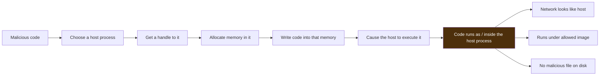

The single unifying defensive insight — the one this chapter is built to teach — is that **injection is a sequence of observable operations on another process's memory and threads, and Windows exposes every one of those operations to sensors.** Getting a handle to another process, allocating executable memory in it, writing to it, and starting a thread in it are all funnelled through a small set of APIs and kernel transitions that EDR hooks, ETW surfaces, and memory scanning catch. The attacker's whole game is to make those operations look normal or to use lesser-watched variants; the defender's whole game is to watch the operations that cannot be avoided. **Blue-team framing up front:** for each technique ask *"which cross-process operation does this require, and which sensor sees it?"* — that question is the chapter.

There is a further reason injection matters that connects this chapter to the next notebook: **injection is how a modern implant achieves stealth and stability at the same time.** An implant that runs as its own process is trivially killed and trivially spotted; an implant injected into a long-lived, trusted process (a browser, `explorer.exe`, a service host) survives longer, blends its network traffic into that process's normal egress, and inherits its working set. This is why command-and-control frameworks (the subject of Red Team Operations Chapter 2) almost always pair a stager with an injection step — the beacon lives *inside* something benign. Understanding injection is therefore a prerequisite for understanding both how C2 hides and how defenders find beaconing implants by correlating "this trusted process is doing something it never normally does" with the memory tells in this chapter.

**A note on bug bounty, honestly:** there is no direct web-bounty angle to process injection; the genuine adjacent arenas are malware analysis, EDR detection engineering, memory forensics, and the reversing/Windows-internals side of CTFs. Those are where the inline notes and the practice section point — no forced bounty box.

To keep the whole chapter oriented, here is the map of technique → the tell it removes → the tell it cannot remove, which is the single most useful summary to carry:

| Technique | Removes tell | Cannot remove |
|---|---|---|
| Classic shellcode injection | (baseline) | Sysmon 8/10, unbacked exec memory |
| RW→RX flip | the RWX instant | protect-change op + unbacked exec memory |
| APC / thread hijack | CreateRemoteThread (Sysmon 8) | APC/context op + unbacked exec memory |
| Section mapping | cross-process write | cross-proc NtMapViewOfSection + memory |
| DLL injection (LoadLibrary) | unbacked memory (image-backed) | disk file + Sysmon 7 image-load |
| Reflective/manual map | disk file + image-load | unbacked exec memory |
| Process hollowing | unbacked memory (looks like real proc) | in-mem ≠ on-disk + Sysmon 25 + parent/path |
| Doppel/herp/ghost | the memory-vs-disk comparison | section/image provenance at creation |
| Module stomping | unbacked memory (image-backed) | in-mem ≠ on-disk integrity |
| Direct syscalls / unhooking | userland ntdll hooks | kernel TI ETW + memory scan |

Every row leaves *something*, and that something is what the Detection & Defense part instruments.

## Part 1: The Primitives You Must Know First

Injection is applied Windows internals, so a handful of concepts have to be solid before the techniques make sense. We teach each from scratch.

**Virtual memory and page protections.** Every process has its own private virtual address space. Regions of that space carry **protection flags**: readable (R), writable (W), executable (X), and combinations. The security-relevant ones:
- **RX** — normal for code: executable but not writable (so it cannot be modified while running).
- **RW** — normal for data: writable but not executable.
- **RWX** — writable *and* executable simultaneously. Legitimate code almost never needs this; injectors love it because they can write code and then run it without a second step. **RWX private memory is one of the loudest injection tells.**
- Memory is either **image-backed** (mapped from a DLL/EXE file on disk, the normal case) or **private/mapped** (not backed by an image file). Executable *private* memory is abnormal — normal executable code comes from image files.

**Handles and access rights.** To operate on another process you need a **handle** to it, obtained via `OpenProcess` (or by creating it), and the handle must carry the right **access rights** — e.g. `PROCESS_VM_OPERATION` (change its memory), `PROCESS_VM_WRITE` (write its memory), `PROCESS_CREATE_THREAD` (start a thread in it). Requesting a handle to another process *with these powerful rights* is itself a signal (Sysmon Event ID 10, `ProcessAccess`).

**The ntdll funnel.** As Chapter 3 (Part 3.1) noted, sensitive operations bottom out in a few `ntdll.dll` functions just before the kernel: `NtOpenProcess`, `NtAllocateVirtualMemory`, `NtProtectVirtualMemory`, `NtWriteVirtualMemory`, `NtCreateThreadEx`, `NtQueueApcThread`, `NtMapViewOfSection`. Every injection technique is some ordering of these. EDR userland hooks and the kernel Threat-Intelligence ETW provider watch them.

**Threads and execution.** Code does not run until a thread executes it. So every injection has two halves: **place the code**, then **cause a thread to run it**. The "cause a thread" half is where the techniques most differ (remote thread, APC, hijack), and it is often the most detectable half.

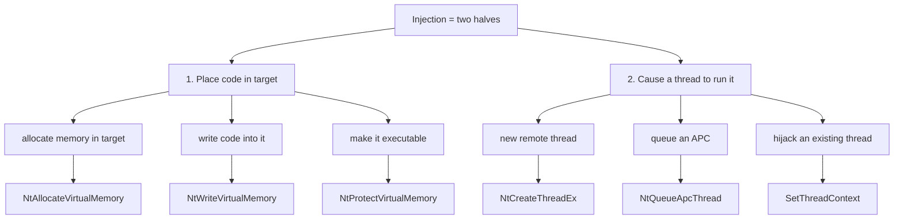

**Blue-team relevance:** memorise the two-halves model — it tells you that even a novel technique must (a) get code into the target and (b) trigger it, and each half has a small, watched set of primitives. **Red-team relevance (named, not weaponized):** technique "innovation" is mostly novel *combinations* of these primitives chosen to avoid the most-watched ones (e.g. avoid `CreateRemoteThread` by using an APC), which is exactly why defenders instrument the whole set rather than any single API.

### 1.1 A Closer Look at Page Protections and Why RWX Is Loud

Because so many detections key on memory protection, it is worth being exact about the states memory can be in and which are normal. Windows page protection is a combination flag on each region:

| Protection | Read | Write | Execute | Normal use | Injection signal |
|---|---|---|---|---|---|
| `PAGE_READONLY` | ✓ | | | constants, read-only data | none |
| `PAGE_READWRITE` | ✓ | ✓ | | heap, stack, data | none |
| `PAGE_EXECUTE_READ` | ✓ | | ✓ | **loaded code (normal)** | none if image-backed |
| `PAGE_EXECUTE_READWRITE` | ✓ | ✓ | ✓ | JIT engines only | **loud — writable+executable** |
| `PAGE_EXECUTE_WRITECOPY` | ✓ | (cow) | ✓ | image code pages | none |

The key insight: **legitimate code ends up `PAGE_EXECUTE_READ` (RX) and image-backed.** The moment you see `PAGE_EXECUTE_READWRITE` (RWX) *or* executable memory with no backing image, you are looking at something that had to be *written and then executed in the same region* — which is what an injector does and what benign compiled code never needs. The only major benign source of RWX is a **JIT** compiler (.NET, Java, JavaScript engines), which generates machine code at runtime and therefore legitimately needs writable-executable pages. That JIT exception is the single biggest false-positive source in injection hunting, and it is why every rule in this chapter says "correlate with process identity" — RWX in `w3wp.exe` running .NET is expected; RWX in `notepad.exe` is not.

A subtlety attackers exploit: you can allocate **RW**, write your code, then call `VirtualProtect` to flip the region to **RX** before running it — never being RWX at any observed instant, defeating a naive "find RWX" scan. **Detection:** the `VirtualProtect`/`NtProtectVirtualMemory` call that changes a *private, non-image* region from RW to RX is itself the tell (ETW TI captures protect-changes), and the region is still **unbacked-executable** afterwards, which `pe-sieve`/`malfind` catch regardless of the RWX-vs-RX distinction. So the RW→RX dance beats one specific check and leaves two others intact — the recurring "move the tell, don't remove it" pattern.

### 1.2 What a Normal Process Looks Like (So You Can Spot Abnormal)

You cannot recognise a hollowed or injected process without a mental baseline of a healthy one, so internalise the canonical Windows processes — this is the single most practical anti-hollowing skill:

- **`smss.exe`** — Session Manager; one master under `System`, children exit. Path `System32`.
- **`csrss.exe`** — one per session; parentless (its parent `smss` exits). `System32`.
- **`wininit.exe`** → parents `services.exe`, `lsass.exe`. One instance, session 0.
- **`services.exe`** → parent of most `svchost.exe`. One instance.
- **`svchost.exe`** — **many** instances, but **always** parented by `services.exe`, path `System32`, and (modern Windows) launched with a `-k <group>` command line. A `svchost.exe` parented by `explorer.exe`, or with no `-k`, or from the wrong path, is a screaming hollowing/masquerade tell.
- **`lsass.exe`** — **one** instance, parent `wininit.exe`, `System32`. Any second `lsass`, or `lsass` with an odd parent, is critical.
- **`explorer.exe`** — parent is `userinit.exe` (which then exits); runs in the user's session.

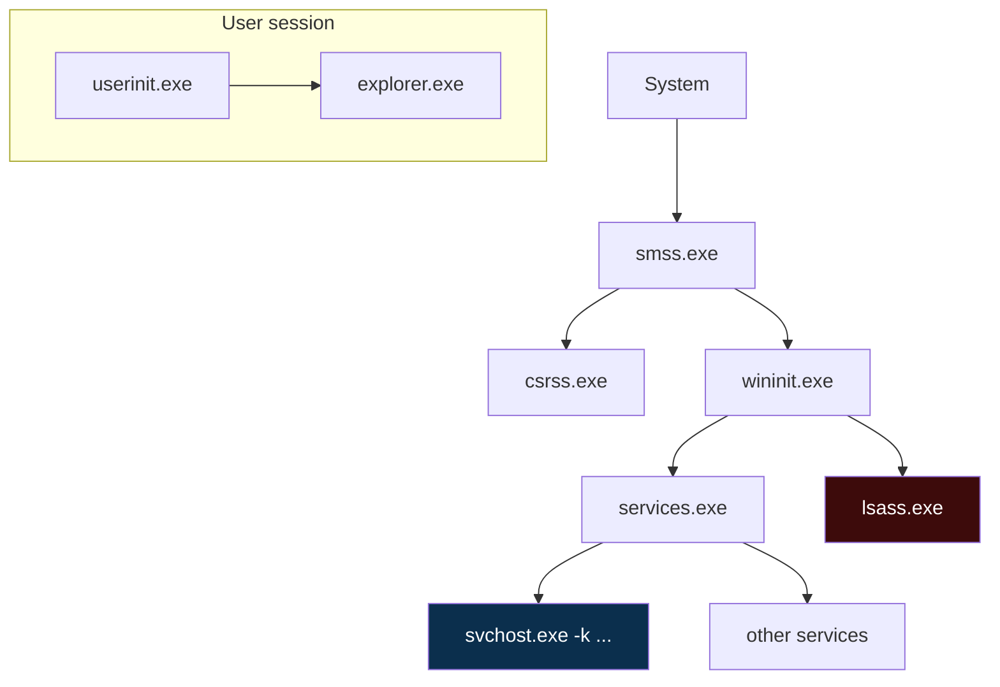

**Blue-team habit:** when triaging a suspicious process, check the trio *parent, path, command line* against this baseline first — most masquerading and hollowing is caught here before you ever open a memory scanner, because attackers frequently get the process name right but the parent or path wrong. Tools like Sysinternals **Process Explorer** (with signature verification) and the THM "Core Windows Processes" room drill exactly this.

### 1.3 The Windows API Layers — Win32, Native, and Syscalls

One more piece of internals makes the detection discussion precise: the **layered API stack** a call passes through, because EDR sensors sit at specific layers and evasions target specific layers.

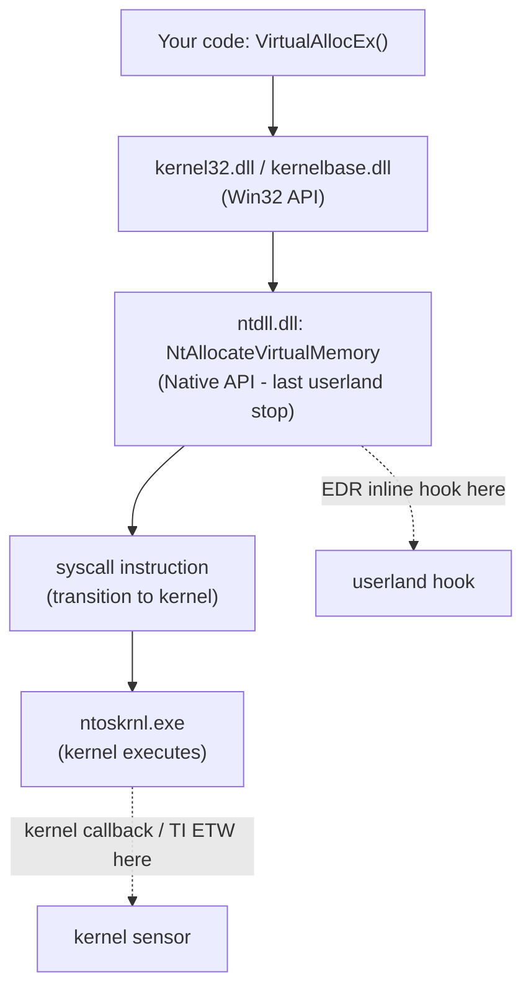

- **Win32 layer** (`kernel32`/`kernelbase`) — the documented API most code calls (`VirtualAllocEx`, `CreateRemoteThread`).
- **Native layer** (`ntdll`) — thin wrappers (`Nt*`/`Zw*`) that issue the actual **syscall**. This is the **last userland instruction** before the kernel, which is exactly why EDRs place inline hooks here (Chapter 3, Part 3.1) — hook `ntdll` and you see the call no matter which Win32 wrapper (or none) was used.
- **Syscall / kernel** — the `syscall` instruction transitions to the kernel, where **kernel callbacks** and the **Threat-Intelligence ETW provider** observe events that no userland hook can be tricked out of.

This layering explains the two most important EDR-evasion concepts by name (defensively):
- **Direct syscalls** — an injector invokes the `syscall` instruction itself, skipping the hooked `ntdll` function, so the userland hook never sees it. **Detection:** the syscall originates from *outside* `ntdll`'s memory (a `syscall` in private/injected memory rather than in the `ntdll` module) — a strong anomaly — and the *kernel* TI ETW sensor still fires because it sits below userland entirely.
- **Unhooking** — the injector overwrites the EDR's hooks in `ntdll` with a clean copy read from disk, restoring the original bytes so calls flow un-inspected. **Detection:** modifying `ntdll`'s code section is itself a memory-integrity anomaly, and the kernel sensors are unaffected.

**The decisive defensive point:** userland-only EDR (hooks in `ntdll`) can be evaded from userland, but **kernel-level sensors (callbacks + TI ETW) cannot be reached by userland code**, which is why "does your EDR have a kernel component?" is the single most important question about its injection coverage. Naming direct syscalls and unhooking here is detection literacy — neither is implemented.

## Part 2: The Canonical Injection Chain (Shellcode Injection)

The textbook technique — sometimes called *classic* or *remote shellcode injection* — is the reference every other technique varies from. Here is the chain, with the Win32 API and the underlying `ntdll` call for each step. The C snippet is **benign and structural**: it shows the API sequence with a harmless placeholder, not real shellcode, and will not do anything useful.

```c
/* CONCEPTUAL / STRUCTURAL ONLY — shows the classic injection API sequence.
   'payload' is a harmless placeholder (NOPs). This is NOT a working injector
   and does nothing useful; it exists to name the API chain a detection targets. */
unsigned char payload[] = { 0x90, 0x90, 0x90 };   /* NOPs — benign placeholder */

HANDLE h = OpenProcess(PROCESS_ALL_ACCESS, FALSE, targetPid);   /* 1: handle */
LPVOID mem = VirtualAllocEx(h, NULL, sizeof(payload),
                            MEM_COMMIT|MEM_RESERVE, PAGE_EXECUTE_READWRITE); /* 2: RWX alloc */
WriteProcessMemory(h, mem, payload, sizeof(payload), NULL);     /* 3: write */
CreateRemoteThread(h, NULL, 0, (LPTHREAD_START_ROUTINE)mem, NULL, 0, NULL); /* 4: run */
```

Step by step, with what each step *is* and how it is seen:

1. **`OpenProcess(PROCESS_ALL_ACCESS, ...)`** → `NtOpenProcess`. Get a handle to the target with rights to manipulate its memory and threads. Requesting `PROCESS_ALL_ACCESS` (or the specific `VM_WRITE|VM_OPERATION|CREATE_THREAD` rights) to a process you did not create is captured by **Sysmon Event ID 10 (ProcessAccess)** with the granted-access mask — a mask like `0x1FFFFF` (all access) to `lsass` or a browser is a classic red flag.
2. **`VirtualAllocEx(..., PAGE_EXECUTE_READWRITE)`** → `NtAllocateVirtualMemory`. Allocate memory *in the target* and mark it **RWX**. RWX allocation in a remote process is one of the highest-signal events EDR watches, via the Threat-Intelligence ETW provider and userland hooks.
3. **`WriteProcessMemory(...)`** → `NtWriteVirtualMemory`. Copy the code into that memory. Cross-process writes are inherently suspicious — one process editing another's memory is rare in benign software.
4. **`CreateRemoteThread(..., mem, ...)`** → `NtCreateThreadEx`. Start a thread in the target whose entry point is the memory you just wrote. This is captured by **Sysmon Event ID 8 (CreateRemoteThread)** — one of the single most valuable injection detections, because the source process, target process, and start address are all logged.

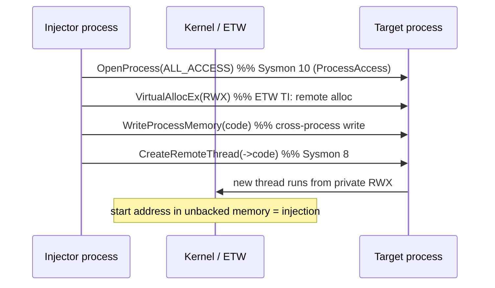

**The detection summary for the canonical chain:** it lights up Sysmon 10 (suspicious handle), an ETW remote RWX allocation, a cross-process write, and Sysmon 8 (remote thread whose start address is *private, unbacked, executable* memory). That last property — a thread starting in memory not backed by any image file — is the near-canonical signature of injection, and memory scanners (`pe-sieve`, Volatility `malfind`) key on exactly it. This is why the classic technique, while foundational, is also the *most* detected; everything after this is an attempt to remove one of these tells.

## Part 3: Avoiding the Loud Steps — Where Techniques Diverge

Every subsequent technique is a variation that removes or disguises one of the four canonical tells. Organising the whole family this way makes it memorable:

| To avoid... | ...attackers use | ...and defenders watch |
|---|---|---|
| RWX allocation | allocate RW, write, then flip to RX (`VirtualProtect`) | the RW→RX protect change on private memory |
| `CreateRemoteThread` (Sysmon 8) | APC injection, thread hijacking, early-bird | APC queue to alertable thread; `SetThreadContext` |
| cross-process write | map a shared **section** into both processes | `NtMapViewOfSection` cross-process |
| unbacked executable memory | **module stomping** (overwrite a real DLL's code) | in-memory ≠ on-disk module (hollowed module) |
| a suspicious target handle | inject at process **creation** (hollowing/doppel) | process created suspended; image/section mismatch |

Keep this table in mind as we walk the techniques — each one is a cell in it. The meta-lesson is that the primitives are finite, so **defenders instrument the primitives, not the named techniques**, and a "new" technique usually just recombines watched primitives to dodge the single most-watched one.

## Part 4: DLL Injection and the Loader

A distinct and very common branch is **DLL injection**: instead of raw shellcode, get the target to load a whole **DLL** (which then runs its `DllMain`). The classic form reuses the canonical chain but with a twist that makes it *quieter in one way and louder in another*.

**`LoadLibrary` DLL injection.** The trick: you do not write the DLL's code into the target; you write only the **path string** to the DLL, then create a remote thread whose start routine is `LoadLibraryA` itself (a well-known address in `kernel32`), passing the path. The Windows loader then maps the DLL normally.

```c
/* STRUCTURAL ONLY — LoadLibrary injection shape. dllPath points to a benign DLL. */
HANDLE h = OpenProcess(PROCESS_ALL_ACCESS, FALSE, targetPid);
LPVOID p = VirtualAllocEx(h, NULL, strlen(dllPath)+1, MEM_COMMIT, PAGE_READWRITE); /* RW, not RWX */
WriteProcessMemory(h, p, dllPath, strlen(dllPath)+1, NULL);            /* write the PATH */
HMODULE k = GetModuleHandleA("kernel32");
LPTHREAD_START_ROUTINE ll = (LPTHREAD_START_ROUTINE)GetProcAddress(k, "LoadLibraryA");
CreateRemoteThread(h, NULL, 0, ll, p, 0, NULL);   /* remote thread = LoadLibraryA(path) */
```

- **Quieter:** the memory written is only a *string*, and it is **RW, not RWX** — no suspicious executable allocation. The DLL, once loaded, is a normal **image-backed** module, so it does *not* look like injected shellcode in memory.
- **Louder:** the DLL must exist **on disk** (defeating "fileless"), and its load generates a normal **image-load event (Sysmon Event ID 7)** — so you see a module load into a process that had no reason to load it, from a suspicious path. Also, the remote thread's start address is `LoadLibraryA` in `kernel32`, a known and detectable tell.

**Detection:** Sysmon 7 (image load) of an unsigned/odd-path DLL into an unexpected process; Sysmon 8 with a start address equal to `LoadLibraryA`; and the on-disk DLL itself is a forensic artifact. **This is the trade the whole chapter keeps surfacing:** using the real loader makes the code look legitimate in memory (image-backed) at the cost of a disk file and an image-load event. Attackers who want to avoid the disk file move to *manual mapping*.

### 4.1 Other Classic DLL-Injection Vectors

`LoadLibrary`-via-remote-thread is the textbook DLL injection, but several other classic vectors get a DLL loaded into a target without an obvious `CreateRemoteThread`, and each has a matching detection worth knowing:

- **`SetWindowsHookEx`** — registers a hook procedure that lives in a DLL; Windows then loads that DLL into **every process that receives the hooked message type** (keyboard, mouse, window events). Historically a stealthy way to get a DLL loaded broadly. **Detection:** the hook registration is observable, and the DLL still generates image-load (Sysmon 7) events across processes from a common (often odd) path.
- **AppInit_DLLs** — a legacy registry value (`HKLM\...\Windows\AppInit_DLLs`) whose DLLs load into nearly every GUI process. **Detection:** it is a well-known persistence/injection key — audit it (Sysmon 13), and modern Windows disables it under Secure Boot.
- **`AppCertDLLs`, IFEO, and image-hijack keys** — registry mechanisms that cause a DLL to load or a debugger to launch for target images. **Detection:** registry auditing of these specific keys; Autoruns surfaces all of them.
- **COM hijacking** — point a COM CLSID's `InprocServer32` at a malicious DLL so it loads when that COM object is instantiated. **Detection:** registry writes to user-writable COM CLSID keys, and the DLL load into the host that instantiates the object.
- **DLL search-order hijacking / sideloading** — drop a malicious DLL where a legitimate signed EXE will find it *first* along its search path, so the trusted EXE loads your DLL. **Detection:** a signed EXE loading an unsigned DLL from a user-writable directory (Sysmon 7 with signature + path).

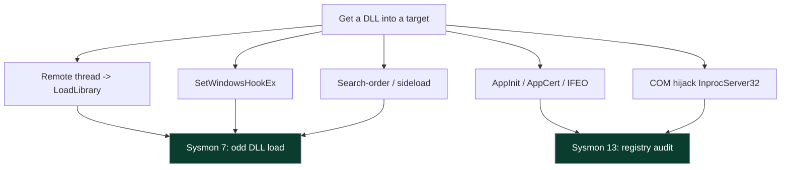

Notice that almost all of these converge on **two detections**: a Sysmon 7 image-load of an unexpected/unsigned DLL, and a Sysmon 12/13 registry write to a known injection/persistence key. **The takeaway mirrors the shellcode side:** there are many *named* DLL-injection vectors, but they funnel into a small set of observable outcomes (a module loaded where it should not be, or a registry key that forces such a load), so instrumenting those outcomes covers the whole class — including sideloading, which is one of the most common real-world initial-access and persistence techniques precisely because it runs under a trusted, signed EXE.

## Part 5: Manual Mapping and Reflective DLL Injection

To get a DLL's functionality **without a file on disk and without an image-load event**, attackers implement the loader themselves — **manual mapping** (a.k.a. **reflective DLL injection** when the DLL maps itself). Instead of calling `LoadLibrary` (which asks the OS loader to map a file), the injector:

1. Reads the DLL bytes (from memory, network, or a resource — no file needed).
2. Allocates memory in the target and copies the DLL's sections into it at the right offsets.
3. Applies **base relocations** (fixes addresses for where it actually landed).
4. Resolves the **import table** (loads dependencies, fills the IAT).
5. Calls the DLL's entry point (`DllMain`) itself.

Because the OS loader never mapped a file, there is **no image-load event and no on-disk file** — the DLL lives in **private, executable, unbacked memory**, exactly like injected shellcode.

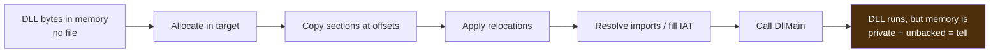

**The detection is precisely the memory anomaly from Chapter 4, Part 7d:** private, executable memory with a PE header floating in it and no `MODULE`/image backing. That is what `pe-sieve` reports as `Implanted PE`, what Volatility's `malfind` and `ldrmodules` surface (a module in memory that is not in the loader's module list), and what the ETW Threat-Intelligence provider can flag via the RWX/protect operations. So manual mapping trades the image-load event and the disk file for a **memory-scanning tell** — you cannot make executable code invisible to a memory scanner, because the CPU must be able to execute it. The recurring asymmetry, one more time.

## Part 6: Process Hollowing (RunPE)

**Process hollowing** — also called **RunPE** — is the marquee technique: start a *legitimate* process in a **suspended** state, **carve out (hollow)** its original code from memory, write your own executable image in its place, fix it up, and resume it — so a process that *looks* like `svchost.exe` in the process list is actually running your code. It is beloved by malware because the masquerade is strong: correct image name, correct path, correct parent in many variants.

The conceptual sequence:

1. `CreateProcess(..., CREATE_SUSPENDED, ...)` — launch the legitimate host (e.g. `svchost.exe`) suspended, so it exists but its main thread has not run.
2. `NtUnmapViewOfSection` (or `ZwUnmapViewOfSection`) — **unmap the original image** from the host's memory, "hollowing" it out.
3. `VirtualAllocEx` + `WriteProcessMemory` — allocate and write **your** PE image into the host, often at the original image base.
4. Fix the entry point: `SetThreadContext` to point the suspended thread's start at your image (or patch the entry point).
5. `ResumeThread` — let it run. The process is now your code wearing the host's name.

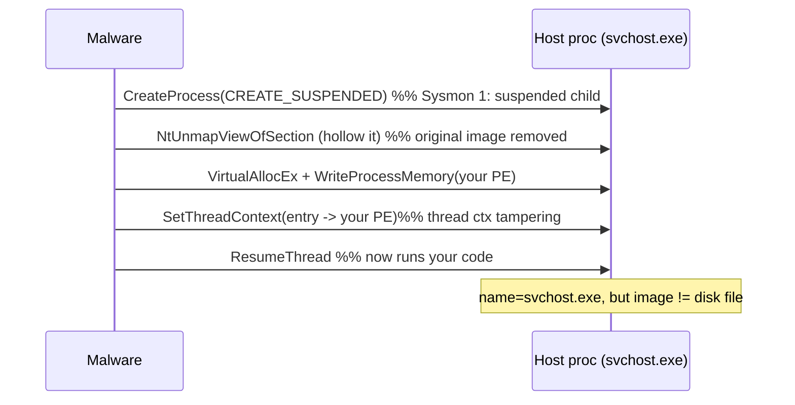

**Detections, and they are strong:**
- **A process created SUSPENDED and then modified** is abnormal — Sysmon Event ID 1 plus the sequence of memory writes into a just-created child.
- **Image mismatch:** the in-memory image no longer matches the on-disk `svchost.exe`. Memory scanners (`pe-sieve`'s `Replaced`/`hdrs modified`, Volatility comparing in-memory vs disk) catch the hollowed module directly.
- **`SetThreadContext` / entry-point tampering** — Sysmon Event ID 25 (ProcessTampering) was added specifically to flag hollowing/herpaderping-style image tampering.
- **Parent/child and path anomalies:** a `svchost.exe` whose parent is not `services.exe`, or whose command line is wrong, is a classic hollowing tell independent of the memory analysis.

Process hollowing is the perfect illustration of the chapter's theme: it produces a *convincing name-level masquerade* but an *unavoidable memory-level contradiction* (in-memory image ≠ on-disk image), and the defender wins by inspecting the level where the contradiction is forced to exist.

**A worked detection walk-through (benign, illustrative).** Suppose Sysmon surfaces this sequence in a few seconds:

```
EID 1  ParentImage: C:\Users\bob\AppData\Local\Temp\update.exe
       Image: C:\Windows\System32\svchost.exe
       CommandLine: C:\Windows\System32\svchost.exe        <- no -k group!
       IntegrityLevel: Medium
EID 25 ProcessTampering  Image: svchost.exe  Type: Image is replaced
EID 3  Image: svchost.exe  DestinationIp: 45.13.x.x  DestinationPort: 443
```

Read it against Part 1.2's baseline and Part 6's mechanics: a `svchost.exe` **parented by a temp-path binary** (should be `services.exe`), with **no `-k` group** (real svchost always has one), running at **Medium integrity** (real svchost is higher), flagged by **Event ID 25 as image-replaced**, then **beaconing to a bare IP on 443**. Every one of those is an independent tell; together they are a near-certain hollowed `svchost` running an implant. No memory scan was even needed — the process-metadata anomalies alone convict, which is exactly why the Part 1.2 baseline is the highest-leverage anti-hollowing skill. A memory scan (`pe-sieve` reporting `Replaced`) would confirm it, and forensics (`ldrmodules`, `pstree`) would nail it in a captured image.

## Part 7: Stealthier Descendants — Doppelgänging, Herpaderping, Ghosting

Because hollowing's core tell is "in-memory image ≠ on-disk image," a lineage of techniques tries to make the on-disk artifact itself lie, so the two *appear* to match, or so there is no clean on-disk file to compare against. These are advanced and we describe them at concept level, each with its detection.

- **Process Doppelgänging.** Abuses **NTFS Transactional (TxF)** operations: create a file *inside a transaction*, write the malicious image to it, create a process from that transacted file, then **roll back the transaction** so the malicious file never truly commits to disk. The process runs from an image that, on disk, no longer exists. **Detection:** the use of the transactional file APIs and the section/image provenance; EDRs added specific coverage, and the technique's reliance on TxF (a deprecated, rarely-used feature) is itself anomalous.
- **Process Herpaderping.** Create the file, map it into a new process, then **modify the file on disk *after* the image is mapped but *before* the process is examined**, so a scanner reading the file sees different (benign) bytes than what is actually executing. **Detection:** Sysmon Event ID 25 (ProcessTampering) was designed with herpaderping in mind — the mismatch between the mapped image and the file's current bytes is the tell.
- **Process Ghosting.** Create a file, put it into a **delete-pending** state, write the payload, map it into a process, then let the delete complete — the process runs from an image whose file is already gone, so there is nothing on disk to scan by the time the process exists. **Detection:** again the image/section provenance and process-tampering telemetry; the sequence of delete-pending + section creation is abnormal.

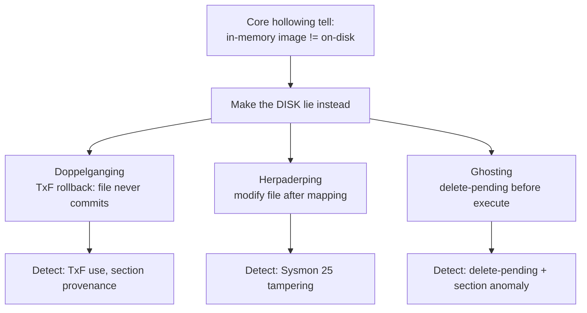

**The pattern to internalise:** each of these attacks the *comparison* the defender relies on (memory vs disk) by corrupting the disk side of it. The counter is to stop relying solely on the disk-side comparison and lean on **image/section provenance at creation time** (what the kernel knows about where a process's image came from), which is exactly what Sysmon Event ID 25 and modern EDR image-load provenance provide. Naming these techniques is defensive literacy; none is implemented here.

### 7.1 Transacted Hollowing and the "Atom Bombing" Family — Named for Literacy

Two more names you will encounter in threat reports and EDR docs, described only so you recognise them:

- **Transacted Hollowing** — a hybrid that combines process hollowing with the transacted-file trick of doppelgänging, mapping the payload from a transacted section into a hollowed process. It exists to get hollowing's masquerade *and* doppelgänging's disk-lie in one technique. **Detection:** the same section-provenance + Sysmon 25 + memory-integrity signals; the combination does not create a new invariant to hide behind.
- **Atom Bombing (APC + atom tables)** — writes the payload into the global **atom table** (a legitimate Windows string-sharing mechanism) and uses an APC to have the target read it back and execute it, avoiding `WriteProcessMemory`. **Detection:** it still ends in an APC to alertable-thread execution and placed code in the target's memory — the atom-table indirection changes *how the bytes arrive*, not that they arrive and run.

The reason to name these without dwelling on them is discipline: **the named-technique zoo is effectively infinite, but the invariant set is small.** A defender who tries to memorise and rule-match every named technique loses; a defender who instruments the invariants (cross-process memory ops, execution triggers, memory-vs-disk contradictions, unbacked-executable memory) wins against techniques that have not even been published yet. That is the single most important strategic takeaway of this chapter, and it is why the Detection part is organised around primitives and memory anomalies rather than around technique names.

## Part 8: Execution Triggers — Remote Thread, APC, Thread Hijacking, Early-Bird

Recall the two-halves model: placing code is half the battle; **triggering** it is the other, and the trigger is often the most detectable half, so it is where much technique variation lives. The main triggers:

- **`CreateRemoteThread`** — the canonical trigger (Part 2). Loud: Sysmon Event ID 8 logs source, target, and start address.
- **APC (Asynchronous Procedure Call) injection.** Queue your code as an APC (`QueueUserAPC`/`NtQueueApcThread`) onto a thread in the target; when that thread enters an **alertable** wait state, the APC runs. Avoids `CreateRemoteThread`. **Detection:** APC queuing to a thread in another process, and the RWX/write tells still precede it.
- **Early-Bird APC.** A refinement: create the target **suspended**, queue an APC, then resume — the APC fires very early in process startup, before many EDR hooks are fully in place. **Detection:** the suspended-create + APC + resume sequence; EDRs increasingly hook early.
- **Thread hijacking (`SetThreadContext`).** Suspend an existing thread in the target, change its **register context** (set the instruction pointer `RIP` to your code), and resume it — no new thread at all, so nothing for Sysmon 8 to log. **Detection:** `SetThreadContext` on a thread in another process is abnormal; the preceding memory writes and the eventual execution from unbacked memory remain.
- **Thread pool / callback abuse and other triggers** — a long tail of ways to get existing execution machinery to run your code, each avoiding the previous most-watched trigger.

The APC trigger, structurally (benign, non-functional — it names the API path, nothing runs):

```c
/* STRUCTURAL ONLY — APC injection shape. 'mem' would hold code; here it is a
   benign placeholder. Shows why there is no CreateRemoteThread to log. */
HANDLE hThread = /* a handle to an existing alertable thread in the target */;
/* code already placed in 'mem' via alloc+write (the 'place' half) */
QueueUserAPC((PAPCFUNC)mem, hThread, 0);   /* runs when the thread goes alertable */
```

Notice there is **no `CreateRemoteThread`** — so Sysmon Event ID 8 never fires. That is the entire appeal of APC injection, and the entire reason a defender cannot rely on Sysmon 8 alone. What *does* remain: the memory `alloc`/`write`/`protect` of the place-half (ETW TI), the `NtQueueApcThread` operation itself, and — decisively — the placed code sitting in unbacked-executable memory (memory scan). Thread hijacking is similar in spirit:

```c
/* STRUCTURAL ONLY — thread hijacking shape. Nothing executes here. */
SuspendThread(hThread);              /* freeze an existing thread in target   */
CONTEXT ctx; ctx.ContextFlags = CONTEXT_FULL;
GetThreadContext(hThread, &ctx);     /* read its register state               */
ctx.Rip = (DWORD64)mem;              /* point instruction pointer at our code */
SetThreadContext(hThread, &ctx);     /* write it back  <- the tell            */
ResumeThread(hThread);               /* thread now runs our code, no new thread */
```

No new thread is ever created, so **Sysmon Event ID 8 is silent**. The tell shifts entirely to **`SetThreadContext` on a thread in another process** (abnormal — benign software almost never rewrites another process's `RIP`) plus the same unavoidable memory tells from the place-half. The pattern is now unmistakable across every trigger: attackers keep *moving* which API fires, but they cannot avoid *placing executable code somewhere a memory scan can find it*.

| Trigger | Avoids | Still leaves |
|---|---|---|
| CreateRemoteThread | nothing (baseline) | Sysmon 8, unbacked start addr |
| APC injection | Sysmon 8 (no new thread visible as remote) | APC queue op, RWX/write tells |
| Early-Bird APC | early EDR hooks | suspended-create + resume pattern |
| Thread hijacking (SetThreadContext) | new-thread creation entirely | context tamper, unbacked exec memory |
| Module stomping (Part 9) | unbacked-memory tell | in-memory ≠ on-disk module |

**The defender's takeaway:** because the *place* half almost always leaves memory tells (RWX, unbacked-executable, image mismatch), you do not have to catch every exotic *trigger* — memory scanning catches the placed code regardless of how it was triggered. Trigger-focused telemetry (Sysmon 8/10/25, APC/context anomalies) is valuable for real-time alerting, but memory scanning is the backstop that does not care which trigger was used.

## Part 9: Module Stomping (Overloading)

**Module stomping** (a.k.a. **module overloading**) is the clever answer to the "unbacked executable memory" tell. Instead of allocating *new* private RWX memory (which screams injection), the attacker **loads a real, legitimate, signed DLL** into the target, then **overwrites that DLL's code section in memory** with their payload. Now the malicious code executes from memory that is **image-backed** — it belongs to a legitimately loaded module — so a scanner looking for *private, unbacked* executable memory does not flag it.

**Detection — the disguise fails at the comparison again:** the stomped module's **in-memory bytes no longer match its on-disk file**. Tools like `pe-sieve`/`Moneta`/`hollows_hunter` and Volatility can compare the mapped module against its disk image and flag the modified code section. The tell moved from "unbacked memory" to "image-backed but modified," but there is still a contradiction between memory and disk that a defender can detect. **This is module stomping's whole point and whole weakness:** it defeats the *presence* check (is this memory backed by an image?) but not the *integrity* check (do the bytes match the image?).

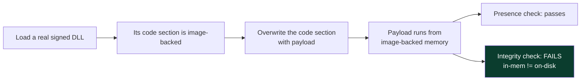

## Part 9b: Section-Mapping Injection (No WriteProcessMemory)

One more primitive-level variation is worth understanding because it removes the **cross-process write** tell. Instead of `WriteProcessMemory`-ing code into the target, the attacker creates a **section object** (shared memory), maps it into *their own* process, writes the payload there (a *local* write — not cross-process, so no `NtWriteVirtualMemory` into another PID), then maps the *same section* into the **target** with `NtMapViewOfSection`. Because both processes now share the same physical pages, the code is present in the target without any cross-process write ever occurring.

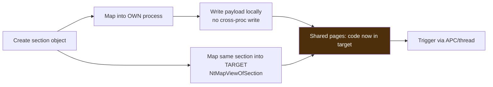

**Detection:** the cross-process `NtMapViewOfSection` is itself the tell (EDR/ETW can observe a section created in one process mapped executable into another), and — the refrain — the mapped region is still executable memory carrying code, so memory scanning finds it. Section mapping is the basis of several named techniques (including parts of doppelgänging); the takeaway is that **removing the write tell does not remove the mapping tell or the memory tell.** Defenders who instrument section operations and scan memory are covered regardless.

## Part 9c: The `lsass` Special Case — Why It Gets Extra Armor

A large fraction of real injection/handle-abuse targets **`lsass.exe`**, because it holds credential material, so Windows added specific defences that are worth understanding as both a hardening lesson and a detection goldmine.

- **Protected Process Light (PPL).** `lsass` can run as a PPL, which restricts which processes may obtain powerful handles to it — even administrators are blocked from `PROCESS_VM_READ`/`WRITE` without going through kernel-level bypasses. Enabling `RunAsPPL` is a high-value, low-cost hardening step. **Detection bonus:** an attempt to strip PPL (loading a driver to remove the protection) is extremely loud.
- **Credential Guard.** Uses virtualization-based security (VBS) to move secrets into an isolated VTL1 process (`LSAIso`), so even code running in `lsass` cannot read them directly.
- **Sysmon Event ID 10 tuned for `lsass`.** The single highest-value ProcessAccess rule is "handle to `lsass` with `0x1010`/`0x1410`/`0x1FFFFF` access from a non-standard process" — it catches credential-dumping and injection into `lsass` alike. Most SOC Sysmon configs ship this rule specifically.

**The lesson generalises:** the most-targeted processes deserve the most armor (PPL/Credential Guard) *and* the tightest telemetry (Sysmon 10 rules), and the combination — make the operation harder *and* make attempting it loud — is the model for protecting any crown-jewel process. This connects forward to the credential-access material in later notebooks; here it is the clearest example of "raise the cost and raise the noise" as a defensive doctrine.

## Part 10: Hands-On Lab — Detecting Injection in a Memory Image (Benign)

This lab is entirely defensive: we use free memory-analysis tools to learn the exact tells injection leaves, running them against **benign, normal processes** so you learn to read clean output and know what an anomaly would look like. Do this on a lab VM you own; never analyse memory from systems you are not authorized to.

### Step 0 — Tools (from scratch)

- **`pe-sieve` / `hollows_hunter`** — free tools that scan a live process (or all processes) for implanted shellcode, hollowed/replaced modules, and unbacked executable memory. `pe-sieve` scans one PID; `hollows_hunter` sweeps all.
- **Volatility 3** — the standard memory-forensics framework; plugins analyse a captured RAM image offline.
- **Sysmon** — with a good config (e.g. the widely-used SwiftOnSecurity/Olaf config), emits Event IDs 8/10/25 in real time.
- **Process Hacker / System Informer** — GUI to inspect a process's memory regions, threads, and protections live.

### Step 1 — Baseline a normal process with pe-sieve

```
# BENIGN: scan a normal process to learn clean output
pe-sieve64.exe /pid 5120 /shellc
PID: 5120  (explorer.exe)
Scanning workingset: 512 memory regions.
Summary:
  Total scanned:      512
  Suspicious:           0
  Replaced:             0
  Implanted PE:         0
  Implanted shc:        0
```

A clean process = all zeros. On an injected process you would see `Implanted shc` (shellcode), `Implanted PE` (manual-mapped DLL), or `Replaced`/`Hdrs modified` (hollowing/stomping), and `pe-sieve` would dump the offending region to disk for analysis.

### Step 2 — Sweep all processes with hollows_hunter

```
# BENIGN: sweep the whole system for injection tells
hollows_hunter64.exe /shellc /loop
[*] Scanning 214 processes...
[+] No suspicious modifications detected.
Summary: hooked=0 replaced=0 implanted=0 detached=0
```

### Step 3 — Inspect memory regions live (what "unbacked executable" looks like)

In Process Hacker, open a process → **Memory** tab. Normal executable regions show a **mapped file** (the DLL/EXE) and protection **RX**. An injection tell would be a region with protection **RWX** or **RX** but **no mapped file** ("Private" with Execute) — the unbacked-executable anomaly. Learning to spot the *absence* of a backing file on an executable region is the core manual skill.

### Step 4 — Volatility 3 on a captured image (malfind)

```
# BENIGN: analyze a RAM image you captured from your own lab VM
vol -f lab_memory.raw windows.malfind
Process: notepad.exe  Pid: 4812
  Address: 0x1f0a0000  Protection: PAGE_EXECUTE_READWRITE
  Hexdump:
  4d 5a 90 00 03 00 00 00 ...   MZ......    <- PE header in private RWX = injected module
  Disassembly:
  dec ebp / pop edx / ...
```

`windows.malfind` finds executable-and-writable private regions and dumps them — the presence of an `MZ`/`PE` header in **private RWX** memory is the textbook injection finding. On a clean image, `malfind` returns nothing or only known-benign JIT regions (which is a real false-positive source — .NET/Java JIT legitimately produce RWX, so you correlate, not convict).

### Step 5 — Correlate with Sysmon in real time

```
# Pull recent CreateRemoteThread + ProcessAccess + Tampering events
Get-WinEvent -LogName 'Microsoft-Windows-Sysmon/Operational' -MaxEvents 200 |
  Where-Object { $_.Id -in 8,10,25 } |
  Select-Object -First 5 TimeCreated, Id, @{n='Msg';e={$_.Message.Split("`n")[0]}}
```

Realistic (clean-host) output is sparse; on an injection you would see an **Event 8** whose `StartAddress` is in unbacked memory, an **Event 10** with a high granted-access mask to a sensitive target, or an **Event 25** flagging image tampering. **The lab's whole lesson:** memory scanning (`pe-sieve`/`malfind`) finds *placed* code regardless of technique, while Sysmon 8/10/25 catches the *act* of injection in real time — run both, because together they cover both halves of the two-halves model.

## Part 10b: Writing Injection Detections — From Behaviour to Sigma

Turning the tells into SIEM rules follows the same detection-engineering workflow as Chapter 4: pick a behaviour the attacker cannot avoid, find the log source, express it portably, tune out benign. Here are benign, illustrative **Sigma** rules for the highest-value injection signals.

**Rule 1 — CreateRemoteThread into a non-JIT process (classic injection):**

```yaml
title: Remote Thread Created in Uncommon Target (Injection)
status: experimental
logsource:
    product: windows
    service: sysmon
detection:
    selection:
        EventID: 8
    filter_known_injectors:
        SourceImage|endswith:
            - '\csrss.exe'      # some legit remote-thread creators
            - '\wininit.exe'
            - '\svchost.exe'
    condition: selection and not filter_known_injectors
falsepositives:
    - Some AV/EDR, accessibility tools, and installers create remote threads
level: high
```

**Rule 2 — Suspicious handle to lsass (injection or credential access):**

```yaml
title: High-Access Handle Opened to LSASS
logsource:
    product: windows
    service: sysmon
detection:
    selection:
        EventID: 10
        TargetImage|endswith: '\lsass.exe'
        GrantedAccess:
            - '0x1010'
            - '0x1410'
            - '0x1438'
            - '0x143a'
            - '0x1fffff'
    filter:
        SourceImage|endswith:
            - '\MsMpEng.exe'    # Defender legitimately accesses lsass
            - '\wininit.exe'
    condition: selection and not filter
level: high
```

**Rule 3 — Process image tampering (hollowing/herpaderping):**

```yaml
title: Process Tampering Detected
logsource:
    product: windows
    service: sysmon
detection:
    selection:
        EventID: 25          # ProcessTampering
    condition: selection
falsepositives:
    - Some packers/self-modifying legitimate software
level: high
```

Each rule keys on a behaviour that the corresponding technique *cannot avoid producing*: a remote thread (Sysmon 8), a powerful handle to `lsass` (Sysmon 10), or image tampering (Sysmon 25). **Tuning note:** the `filter` blocks encode the *known-benign* remote-thread creators and `lsass` accessors in your environment — you build these by baselining, then everything else that trips the rule is worth a look. This is why a Sysmon config plus a week of baselining is worth more than any single clever rule: the allow-list *is* the detection.

## Part 10c: Validating with a Purple-Team Loop

As in Chapter 4, detections that were never fired in anger are hope, not coverage. Use **Atomic Red Team**'s benign T1055 emulations to prove each rule works:

```
1. Sensors on:    Sysmon (config with EID 8/10/25), SIEM ingesting, pe-sieve available
2. Emulate:       run Atomic T1055.001/.002/.012 benign tests on a lab VM
3. Verify telemetry: did Sysmon 8/10/25 fire? did a remote thread appear in an odd target?
4. Verify detection: did Rules 1-3 alert in the SIEM?
5. Verify backstop:  does pe-sieve/malfind find the placed code post-emulation?
6. Close gaps + document coverage per T1055 sub-technique
```

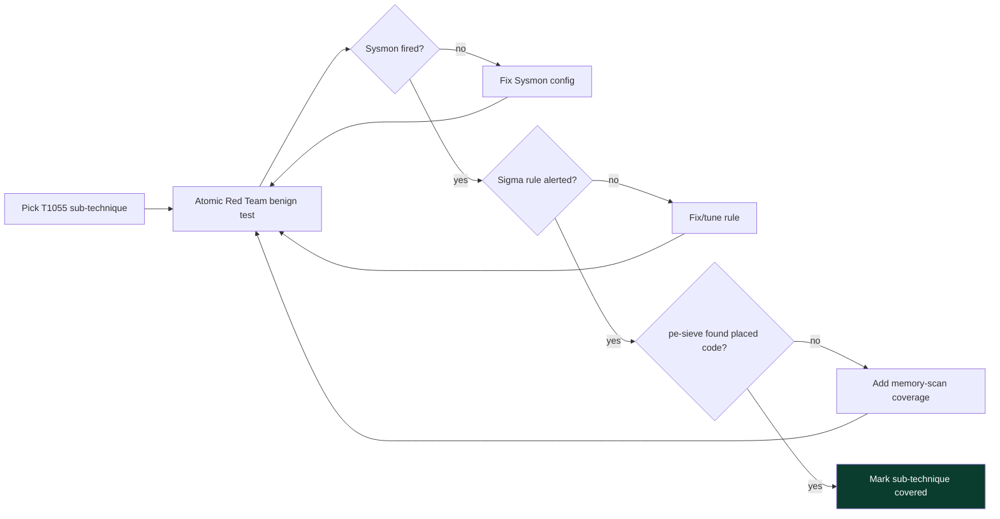

Run the loop across T1055.001/.002/.003/.004/.012 and you convert the whole chapter into a measured coverage map, each cell backed by a benign emulation you actually ran and a rule that actually fired. **Do this safely:** lab hosts you own, benign published atomics only, and clean up any test artifacts afterward.

### Step 6 — Hollowing-specific checks (ldrmodules and process tree)

Hollowing has two signatures beyond `malfind`, and both are worth practising. First, **`ldrmodules`** compares the three places Windows tracks a loaded module (the three loader lists) — a hollowed or manually-mapped module appears in some lists but not others, or not at all:

```
vol -f lab_memory.raw windows.ldrmodules
Pid    Process        Base         InLoad InInit InMem  MappedPath
1092   svchost.exe    0x7ff6...    True   True   True   \Windows\System32\svchost.exe
4812   svchost.exe    0x00f00000   False  False  False  <no path>     <- hollowed/manual-map tell
```

The row with `InLoad/InInit/InMem = False` and no mapped path is executable memory the loader does not know about — the manual-map/hollowing signature. Second, **process-tree sanity**: compare against Part 1.2's baseline.

```
vol -f lab_memory.raw windows.pstree
 ... 0x.. services.exe   660  ...
 ...  0x.. svchost.exe   1092  660   (parent=services.exe)  OK
 0x.. explorer.exe  3200 3180
  0x.. svchost.exe   4812 3200   (parent=explorer.exe)     <- WRONG PARENT: investigate
```

A `svchost.exe` parented by `explorer.exe` is not a normal system process — combined with the `ldrmodules` anomaly, this is textbook hollowing. **The lab's compounded lesson:** no single plugin convicts; `malfind` (RWX/unbacked), `ldrmodules` (module not in loader lists), `pstree`/`psscan` (parent/path anomaly), and `threads` (thread start in unbacked memory) *together* build a high-confidence injection finding — multi-signal fusion again, now in memory forensics.

### Step 7 — Confirm a thread's start address is unbacked

```
vol -f lab_memory.raw windows.threads --pid 4812
Tid    StartAddress   BackingModule
5123   0x7ff6...      svchost.exe        OK (image-backed)
5140   0x00f00000     -                  <- thread starts in unbacked memory = injection
```

A thread whose start address resolves to no module is the single cleanest per-thread injection tell, and it ties the whole two-halves model together: the *trigger* half created a thread (or hijacked one), and its start address points into the *place* half's unbacked code. Find that pairing and you have caught the injection end to end.

## Part 11: Detection & Defense Angle (Consolidated)

Bringing it together: because every injection technique must (a) place code in a target and (b) trigger it, and both halves leave tells, robust defence instruments the **primitives and the memory anomalies**, not the named techniques.

**Real-time behavioural telemetry:**
- **Sysmon Event ID 8 (CreateRemoteThread)** — remote thread with source/target/start address; alert when the start address is in unbacked memory.
- **Sysmon Event ID 10 (ProcessAccess)** — handle opens with dangerous access masks (`0x1FFFFF`, `VM_WRITE|VM_OPERATION|CREATE_THREAD`), especially to `lsass`, browsers, and system processes.
- **Sysmon Event ID 25 (ProcessTampering)** — hollowing/herpaderping/image tampering.
- **Sysmon Event ID 7 (Image Load)** — unsigned/odd-path DLLs into unexpected processes (DLL injection).
- **ETW Threat-Intelligence provider (EDR)** — kernel-sourced remote allocation, protect-change, and write operations that userland hooks might miss.

**Memory scanning (the backstop that ignores technique):**
- **`pe-sieve`/`hollows_hunter`/`Moneta`** on endpoints (scheduled or on-alert) for implanted shellcode, replaced/hollowed modules, unbacked-executable memory, and modified (stomped) modules.
- **Volatility `malfind`, `ldrmodules`, `threads`, `psxview`** in forensics — RWX private memory, modules missing from the loader list, threads with unbacked start addresses.

**Hunt hypotheses (concrete):**
- Thread whose **start address is private/unbacked executable memory** → injection (any technique).
- Process created **SUSPENDED** then written to → hollowing/early-bird.
- **In-memory module ≠ on-disk file** → hollowing or module stomping.
- **`SetThreadContext`** on another process's thread → thread hijacking.
- High **granted-access mask** to `lsass`/browser/system process → injection or credential access.
- **RWX private memory** in a non-JIT process → placed code (correlate to rule out JIT).

**Harden the surface:**
- **EDR with kernel-level (TI ETW) memory sensors** — userland-only hooks can be evaded; kernel provenance is sturdier.
- **Attack Surface Reduction (ASR) rules** and **Credential Guard** to constrain common injection targets (e.g. blocking `lsass` access).
- **Application control (WDAC)** to limit unsigned DLL loads (raises the cost of DLL injection and stomping).
- **Protected Process Light (PPL)** for sensitive processes (`lsass`) to block handle-based tampering.

**MITRE ATT&CK anchors:** **T1055** (Process Injection) and its sub-techniques — **.001** DLL Injection, **.002** PE Injection, **.003** Thread Execution Hijacking, **.004** APC, **.012** Process Hollowing, plus **T1620** (Reflective Code Loading) and **T1106** (Native API).

| Technique | Key primitive | Primary detection | ATT&CK |
|---|---|---|---|
| Classic shellcode injection | VirtualAllocEx RWX + CreateRemoteThread | Sysmon 8/10, unbacked start addr | T1055.002 |
| DLL injection (LoadLibrary) | remote thread → LoadLibraryA | Sysmon 7 (odd DLL), Sysmon 8 | T1055.001 |
| Reflective/manual map | self-implemented loader | unbacked exec memory (pe-sieve) | T1620 |
| Process hollowing | suspended create + unmap + write | Sysmon 25, image mismatch | T1055.012 |
| Doppelgänging/herpaderping/ghosting | image/section trickery | Sysmon 25, section provenance | T1055.013 |
| APC / early-bird | QueueUserAPC | APC to alertable thread, suspended pattern | T1055.004 |
| Thread hijacking | SetThreadContext | context tamper, unbacked memory | T1055.003 |
| Module stomping | overwrite loaded DLL code | in-mem ≠ on-disk module | T1055 |

## Part 11b: A Triage Order for a Suspected-Injection Process

When an alert or a hunch points at a process, this is the fastest order of checks — cheapest and most decisive first — to confirm or clear injection:

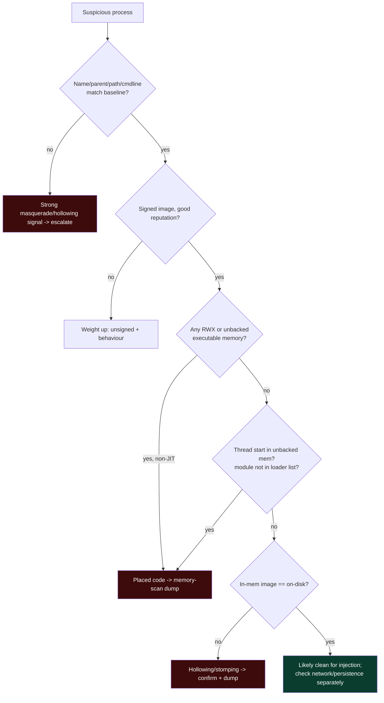

The order encodes the chapter's economics: **process metadata (parent/path/cmdline/signature) is free and catches most masquerading**, so check it first; **memory state (RWX, unbacked, loader-list, integrity) is the decisive backstop** that catches technique-agnostic placement, so check it when metadata is clean but suspicion remains. Only after both are clear do you conclude "not injected" — and even then you separately check network beaconing and persistence, because a clean process can still be the *launcher* of an implant living elsewhere. Running this order a few dozen times, on both benign and (lab) injected processes, is how the triage becomes reflexive.

## Part 12: Real-World Cases & Pitfalls

**Real-world grounding.** Process injection is ubiquitous across the threat spectrum: commodity loaders hollow `svchost`/`RegAsm`/`RegSvcs`, banking trojans (the Zeus/Emotet lineage) built their entire model on injecting into browsers to steal credentials, and post-exploitation frameworks default to injecting beacons into benign processes for stealth and stability. Reflective DLL injection was popularised as a public technique and is now a standard building block; process hollowing has been in commodity malware for over a decade; doppelgänging/herpaderping/ghosting were introduced as research and then adopted. The defensive history mirrors the chapter: each memory-level tell prompted a detection (Sysmon 8, then 10, then 25; `malfind`, then `pe-sieve`/`Moneta`), and each detection prompted a stealthier variant that moved the tell rather than removing it.

**Common pitfalls:**
- *Trusting the process name.* A "svchost.exe" can be hollowed. Verify parent, path, command line, signature, and — decisively — memory integrity.
- *JIT false positives.* .NET, Java, and browsers legitimately create RWX/private-executable memory for JIT. Correlate with process identity before convicting on RWX alone.
- *Userland-hook-only EDR.* Injection techniques specifically target userland hooks (unhooking, direct syscalls); kernel TI ETW and memory scanning are the sturdier sensors.
- *Watching only CreateRemoteThread.* APC and thread hijacking avoid Sysmon 8 entirely; you need the memory-scan backstop.
- *Disk-only forensics.* Manual-mapped and hollowed payloads may have no on-disk file; capture memory.
- *Assuming "image-backed = safe".* Module stomping runs from image-backed memory; check integrity, not just backing.
- *Alerting on every remote thread.* Some legitimate software injects (accessibility tools, some AV, some installers) — baseline your environment.

## Part 12b: The Evolution of Injection — an Arms-Race Timeline

Injection detection and injection technique co-evolved exactly like the packing/AMSI arms races of the previous chapters, and seeing the sequence makes the whole family coherent: each defensive win pushed attackers to move a tell rather than remove it.

```mermaid
flowchart LR
    A[Classic remote-thread injection] --> B[Defenders: hook CreateRemoteThread<br/>Sysmon 8]
    B --> C[Attackers: APC / thread hijack<br/>avoid Sysmon 8]
    C --> D[Defenders: watch APC/SetThreadContext<br/>+ memory scan for placed code]
    D --> E[Attackers: reflective map<br/>no file, no image-load]
    E --> F[Defenders: hunt unbacked exec memory<br/>pe-sieve/malfind]
    F --> G[Attackers: hollowing / module stomping<br/>look image-backed]
    G --> H[Defenders: in-mem vs on-disk integrity<br/>Sysmon 25, provenance]
    H --> I[Attackers: doppel/herp/ghost<br/>corrupt the disk side]
    I --> J[Defenders: section/image provenance<br/>at creation, kernel TI ETW]
    style B fill:#0b3d2e,color:#fff
    style D fill:#0b3d2e,color:#fff
    style F fill:#0b3d2e,color:#fff
    style H fill:#0b3d2e,color:#fff
    style J fill:#0b3d2e,color:#fff
```

Read the green (defensive) nodes top to bottom and you have the modern EDR memory-detection stack, each layer added in response to an attacker move. The lesson for a defender is strategic: **do not chase individual named techniques; instrument the invariants** — the place-half always writes executable code somewhere, the trigger-half always uses a finite set of execution primitives, and any masquerade always creates a memory-vs-disk contradiction. Cover those invariants and the *next* named technique, whatever it is called, still trips them. The lesson for an authorized red teamer is the mirror image: assume the invariants are watched, and understand that "novel" technique names mostly relocate a tell into a less-monitored corner rather than achieving true invisibility — which is why real OPSEC leans on *blending* (inject into processes that legitimately do the suspicious thing) rather than on any single "undetectable" trick.

## Part 12c: Why DLL Injection Never Dies, and Benign Injectors

A practical wrinkle every defender hits: **legitimate software injects too**, and if you do not know the benign baseline you will drown in false positives. Accessibility tools, input-method editors, some backup and DLP agents, endpoint-security products themselves, screen recorders, and older application-compatibility shims all use DLL injection or remote threads as designed. This is why every rule in this chapter carries a `filter`/exclusion clause and why "baseline first" is not boilerplate — it is the difference between a usable detection and an alert firehose.

The defensive discipline for separating benign from malicious injection:
- **Signature and reputation of the source process and the injected module** — a signed, known-good vendor DLL injected by that vendor's signed agent is expected; an unsigned DLL from `%TEMP%` injected by a freshly-spawned process is not.
- **Path and provenance** — injected code from `System32`/`Program Files` by a signed binary vs from a user-writable temp/AppData path.
- **Target sensitivity** — injection into `lsass`/browsers/security tools is weighted far higher than into a sacrificial process the same user started.
- **Sequence** — a *just-created suspended* process being written to, or a process that opened a high-access handle *and* created a remote thread *and* the thread starts in unbacked memory, is a chain no benign injector produces.

**The takeaway:** injection detection is fundamentally an *anomaly-plus-context* problem, not a single-event problem. The strongest detections fuse the primitive (Sysmon 8/10/25), the provenance (signature/path/target), and the memory state (backed vs unbacked, integrity) — exactly the multi-signal fusion the whole notebook keeps advocating.

## Part 13: Final Revision / Summary

- **Injection = run code inside another process** for evasion, application-control bypass, context, and fileless persistence (ATT&CK T1055).
- **Two-halves model:** *place* the code (allocate + write + make executable) and *trigger* it (remote thread / APC / hijack). Every technique is an ordering of a small set of `ntdll` primitives.
- **Canonical chain:** `OpenProcess → VirtualAllocEx(RWX) → WriteProcessMemory → CreateRemoteThread`, seen via Sysmon 10/8, ETW, and an unbacked-executable start address — foundational and the most detected.
- **DLL injection (LoadLibrary)** looks legitimate in memory (image-backed) but needs a disk file and yields a Sysmon 7 image-load; **manual/reflective mapping** removes the file and image-load but lives in private, unbacked memory (memory-scan tell).
- **Process hollowing (RunPE)** masquerades as a real process but produces an in-memory ≠ on-disk image contradiction; **doppelgänging/herpaderping/ghosting** corrupt the disk side of that comparison and are caught by section provenance + Sysmon 25.
- **Triggers** (remote thread / APC / early-bird / thread hijacking) vary to dodge Sysmon 8, but the *placed* code still leaves memory tells — memory scanning is the technique-agnostic backstop.
- **Module stomping** runs from image-backed memory to beat the presence check, but fails the integrity check (in-mem ≠ on-disk).
- **Detection doctrine:** instrument the primitives (Sysmon 8/10/25/7, ETW TI) for real-time alerts and run memory scanning (`pe-sieve`/`malfind`) as the backstop that ignores which technique was used. Harden with EDR kernel sensors, ASR, Credential Guard, WDAC, and PPL.
- **Windows API layering** (Win32 → `ntdll` native → syscall → kernel) explains sensor placement: userland hooks live in `ntdll` and can be evaded (direct syscalls, unhooking), but **kernel callbacks + TI ETW + memory scanning cannot be reached from userland** — so kernel-level EDR coverage is the decisive question.
- **Instrument invariants, not named techniques:** the technique zoo is infinite, the primitive/anomaly set is small (cross-process memory ops, execution triggers, memory-vs-disk contradictions, unbacked-executable memory). Cover the invariants and unpublished techniques still trip them.
- **Triage order:** metadata (parent/path/cmdline/signature) first — free and catches masquerading — then memory state (RWX/unbacked/loader-list/integrity) as the decisive backstop.
- **ATT&CK anchors:** T1055 (.001/.002/.003/.004/.012/.013), T1620, T1106.

## Part 14: Cheat Sheet / Quick Reference

**The two-halves model:** place (alloc + write + make-exec) → trigger (thread/APC/hijack). Every technique is a permutation.

**Canonical chain → detection**

| API step | ntdll | Detection |
|---|---|---|
| OpenProcess(ALL) | NtOpenProcess | Sysmon 10, access mask |
| VirtualAllocEx(RWX) | NtAllocateVirtualMemory | ETW TI remote alloc |
| WriteProcessMemory | NtWriteVirtualMemory | cross-proc write |
| CreateRemoteThread | NtCreateThreadEx | Sysmon 8, unbacked start |

**Memory tells (technique-agnostic)**
- private + executable + **no image backing** → shellcode / manual-map
- **RWX** private memory (non-JIT) → placed code
- in-memory image **≠** on-disk file → hollowing / stomping
- module in memory **not in loader list** → manual-map / detached

**Real-time events to watch**
- Sysmon **8** (CreateRemoteThread), **10** (ProcessAccess mask), **25** (ProcessTampering), **7** (Image Load)
- `SetThreadContext` on another process → hijacking
- process created **SUSPENDED** then written → hollowing / early-bird

**Defensive tools**
- live: `pe-sieve` (1 pid), `hollows_hunter` (all), Process Hacker/System Informer (regions)
- forensics: Volatility 3 `malfind`, `ldrmodules`, `threads`, `psxview`
- real-time: Sysmon (good config) + EDR with kernel TI ETW

**Harden:** EDR kernel sensors, ASR rules, Credential Guard, WDAC (unsigned DLLs), PPL for lsass.

**Triage order (cheap → decisive):**

1. Process metadata — parent, path, command line, signature vs baseline.
2. Reputation — is the image known-good/signed?
3. Memory state — any RWX or unbacked-executable region (rule out JIT)?
4. Thread start addresses — any in unbacked memory / module not in loader list?
5. Integrity — does in-memory image match the on-disk file?
6. Only if all clear → not injected (then check network/persistence separately).

**One-line model:** *code must be placed and triggered; placing leaves memory tells and triggering leaves API tells — watch both.*

**Page protections at a glance**

| Protection | Normal use | Injection signal |
|---|---|---|
| RX (image-backed) | loaded code | none |
| RW | data/heap/stack | none |
| RWX | JIT only | loud (writable+executable) |
| RX (private/unbacked) | — | placed shellcode/manual-map |

**Windows API layers:** Win32 (`kernel32`) → Native (`ntdll` `Nt*`) → syscall → kernel. EDR hooks live in `ntdll` (evadable by direct syscalls/unhooking); kernel callbacks + TI ETW + memory scan do not.

**Canonical Windows processes (anti-hollowing baseline)**

| Process | Instances | Parent | Path | Note |
|---|---|---|---|---|
| `smss.exe` | 1 master | System | System32 | children exit |
| `csrss.exe` | 1/session | (parent exits) | System32 | parentless is normal |
| `wininit.exe` | 1 | smss (exits) | System32 | session 0 |
| `services.exe` | 1 | wininit | System32 | parent of svchost |
| `svchost.exe` | many | **services.exe** | System32 | always `-k <group>` |
| `lsass.exe` | **1** | wininit | System32 | second one = critical |
| `explorer.exe` | per user | userinit (exits) | Windows | user session |

**Volatility 3 injection-hunt plugins**

```
windows.malfind      # RWX / unbacked executable regions (dumps them)
windows.ldrmodules   # module not in all 3 loader lists = manual-map/hollow
windows.threads      # thread start address with no backing module
windows.pstree       # parent/child anomalies (hollowing masquerade)
windows.psxview      # processes hidden from one enumeration source
windows.dlllist      # loaded modules per process
```

**Access masks worth alerting on (Sysmon 10 → lsass/browsers)**
`0x1010`, `0x1410`, `0x1438`, `0x143a`, `0x1fffff` from non-standard source images.

## Part 14b: Memory Hooks — Locking the Concepts In

- **"Place and trigger."** Every injection has two halves: get code into the target, then make a thread run it. Watch both.
- **"Placing leaves memory tells; triggering leaves API tells."** Memory scan catches the code regardless of trigger; Sysmon 8/10/25 catches the act.
- **"Unbacked executable memory = injection until proven JIT."** Executable memory with no image file is the near-universal tell (correlate to rule out .NET/Java JIT).
- **"Name it right, get the parent wrong."** Hollowing masquerades the process name but usually botches parent/path/command-line — check the trio first.
- **"Memory vs disk must agree."** Hollowing and module stomping create an in-memory ≠ on-disk contradiction; doppel/herp/ghost corrupt the disk side — check integrity, not just presence.
- **"Kernel sensors beat userland tricks."** Direct syscalls and unhooking evade `ntdll` hooks but not kernel callbacks/TI ETW or memory scanning.
- **"Instrument invariants, not techniques."** The primitives are finite; a new technique name usually just relocates a tell.

Seven lines that compress the whole family; expand each to its paragraph and you understand process injection at working depth.

## Part 15: Practice Labs & Resources

Topic-specific and defensively-framed — these train injection *detection and analysis*, not weaponization. Handle anything live only in an isolated VM you own.

- **TryHackMe — "Abusing Windows Internals," "Windows Internals," "Sysmon," "Core Windows Processes," and the memory-forensics rooms.** Core Windows Processes teaches what a *normal* `svchost`/`lsass`/`explorer` looks like — essential for spotting hollowing.
- **HackTheBox Academy — "Windows Event Logs & Finding Evil"** and Windows-internals modules; retired boxes/challenges that involve injected implants.
- **Volatility memory-forensics labs** — the official Volatility 3 docs plus public sample images; practise `malfind`, `ldrmodules`, `psxview`, `threads` until you can spot injection cold. **CyberDefenders** and **Blue Team Labs Online** host memory-analysis investigations built on real injected samples.
- **`pe-sieve`/`hollows_hunter`/`Moneta` (hasherezade / Forrest Orr)** — read the docs and run them against benign and (in an isolated VM) known-benign-but-injecting tools to learn each finding type. hasherezade's writeups on hollowing/doppelgänging are outstanding conceptual references.
- **MITRE ATT&CK T1055** page and its sub-techniques — each links to attributed campaigns and to specific detection guidance; read it as your coverage checklist.
- **Atomic Red Team** — benign T1055.* emulations to validate your Sysmon 8/10/25 detections in a purple-team loop (as in Chapter 4, Part 9b).
- **Reading:** *Practical Malware Analysis* (injection & hollowing chapters), the *Windows Internals* books (processes, threads, memory manager) for the primitives in Part 1, and the Sysmon documentation for Event IDs 7/8/10/25.
- **Reversing side:** Flare-On / crackmes challenges featuring injectors and packed loaders; x64dbg to step a (benign, lab) loader and watch the alloc/write/thread sequence live.
- **A concrete self-study arc:** (1) baseline normal processes with `pe-sieve`/Process Hacker so you know clean; (2) run benign Atomic Red Team T1055 tests on a lab VM with Sysmon; (3) confirm Sysmon 8/10/25 fired and write Sigma rules; (4) capture RAM and find the placed code with `malfind`; (5) map your coverage to T1055 sub-techniques. Reverse-then-detect is the loop that builds real injection intuition.
- **Sysmon config to start from:** the SwiftOnSecurity and Olaf Hartong `sysmon-modular` configs ship well-tuned Event ID 7/8/10/25 rules (including the `lsass` ProcessAccess rule from Part 9c). Read them to learn *which* accesses and start-addresses experienced defenders alert on, and adapt the exclusion lists to your environment.
- **Windows internals grounding:** the *Windows Internals* books (Part V processes/threads, memory management) and Pavel Yosifovich's talks explain the primitives in Part 1 at the depth that makes every technique here obvious rather than memorised. Sysinternals **Process Explorer** (verify image signatures, view mapped vs private memory) and **Autoruns** are the free daily-driver tools.
- **Detection references:** Elastic's and Red Canary's public writeups on process injection detection, the MITRE ATT&CK T1055 detection notes, and hasherezade's technical blog on hollowing/doppelgänging/module-overloading — all defender-oriented and technique-accurate.
- **Memory-forensics practice sets:** the public Volatility sample images and the CyberDefenders "memory analysis" challenges give you real injected samples to find with `malfind`/`ldrmodules`/`threads`, which is the single best way to build the "spot injection in RAM" reflex the lab introduces.

Master this and you can answer the only question injection poses: *what cross-process operation did this require, and which sensor — real-time API or memory scan — saw it?* This closes the Malware & Evasion notebook's evasion arc: Chapter 3 hid code on disk, Chapter 4 moved it into memory and script engines, and Chapter 5 placed it inside living processes — and at every step the same asymmetry held, that code which must eventually run must eventually be visible on the surface where it runs. The next notebook, **Red Team Operations**, zooms out from single-host tradecraft to the campaign: objectives, OPSEC, the engagement lifecycle, and the command-and-control that ties injected implants across a network back to the operator.
