**Level:** Advanced · **Track:** Red Team · **Read time:** 195 min

This is Chapter 1 of the Red Team Operations notebook, and it changes altitude. The previous notebook (Malware & Evasion) worked at the level of a single host: how a payload hides on disk, in memory, and inside a living process. This notebook zooms out to the level of a **campaign** — a coordinated, objective-driven operation against a whole organization, conducted by an authorized team emulating a real adversary. Before any of the later technical chapters (command and control, infrastructure, lateral movement, exfiltration) make sense as *operations* rather than isolated tricks, you need the frame this chapter builds: what a red team actually is, how it differs from a penetration test, the lifecycle every professional engagement follows, and the operational security (OPSEC) discipline that separates a controlled, valuable exercise from a reckless one.

A framing note that governs this entire notebook. Everything here assumes **explicit, written authorization** and a lawful, scoped engagement. Red teaming is *offensive security performed with permission, to make an organization more defensible.* Nothing in this notebook is a license to attack systems you do not own or lack signed authorization to test — doing so is a serious crime regardless of skill or intent. The discipline you will read about (rules of engagement, deconfliction, evidence handling, minimizing impact) exists precisely because operating against real production systems carries real risk, and a professional red teamer's first job is to do no unnecessary harm. This chapter is as much about *restraint, legality, and value to the defender* as it is about offense, and that balance is the mark of the craft.

We build from the definitions (pentest vs red team vs purple team), through the objective-driven and threat-emulation mindset, the full engagement lifecycle stage by stage, rules of engagement and authorization, OPSEC as a through-line, C2 and infrastructure at a conceptual level, deconfliction and safety, reporting and turning offense into defensive value, a worked planning lab (building a scoping pack and an ATT&CK-mapped plan), a consolidated defensive/purple-team angle, and a cheat sheet with real training resources.

## Why This Matters

Organizations buy two very different things and often confuse them. A **penetration test** answers *"how many exploitable weaknesses can we find in this scope, and how do we fix them?"* A **red-team engagement** answers *"if a capable, motivated adversary targeted us to achieve a specific goal, would our people, processes, and technology detect and stop them — and how fast?"* The first is about **coverage of vulnerabilities**; the second is about **testing the defense as a system** against a realistic threat. Sell or buy the wrong one and both sides are disappointed: a client expecting a vulnerability inventory gets a single stealthy attack path, or a client expecting a detection test gets a noisy scan that trips every alert on day one.

Getting this distinction right is not pedantry — it drives every decision downstream. It determines whether you optimize for **breadth** (find everything) or **stealth and objective** (achieve the goal without being caught). It determines whether the blue team is told in advance (announced vs unannounced). It determines your infrastructure, your pace, your reporting, and your definition of success. A red teamer who runs a pentest methodology on a red-team contract produces noise; a pentester who goes quiet and objective-focused on a pentest contract under-delivers on coverage. **The single most important professional skill in this chapter is matching the engagement type, methodology, and success criteria to what the client actually needs** — and that starts with understanding the spectrum precisely.

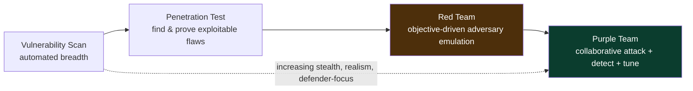

**Defender framing up front:** this notebook is offensive, but its *purpose* is defensive — every engagement exists to give the blue team measured feedback. Throughout, keep asking *"what does this teach the defender, and how do I hand it to them as something actionable?"* The best red teamers are judged not by whether they "won," but by how much more defensible the organization is afterward.

## Part 1: The Spectrum — Vuln Scan, Pentest, Red Team, Purple Team

These terms are used loosely in marketing; professionals need them sharp. They form a spectrum of increasing realism, stealth, and focus on the *defense as a system.*

- **Vulnerability scanning** — automated tools (Nessus, Qualys, OpenVAS) enumerate known weaknesses across a scope. Broad, shallow, no exploitation, high false-positive rate. Answers "what known issues exist?" It is a *hygiene* activity, run continuously, not an engagement.
- **Penetration testing** — a human tester actively finds and **exploits** vulnerabilities within a defined scope to demonstrate real impact, then reports them for remediation. Optimizes for **coverage**: find as many exploitable paths as possible in the time box. Usually **announced**, often noisy (the goal is findings, not stealth), and scoped to systems/apps/networks. Answers "what can actually be exploited here, and how do we fix it?"
- **Red teaming** — an objective-driven emulation of a specific adversary against the **whole organization** (people, process, technology), optimizing for **stealth and goal achievement** rather than coverage. Often **unannounced** to the blue team (only a small "white cell" knows), tests **detection and response**, and is scoped by *objective and rules* rather than by an IP list. Answers "against a realistic threat pursuing a real goal, do we detect and stop them?"
- **Purple teaming** — not a separate assessment so much as a *mode*: red and blue work **collaboratively**, often in the same room, running attack techniques and immediately checking detection and tuning it. Optimizes for **defensive improvement per unit time**. Answers "for each technique, do we detect it, and if not, how do we fix that now?"

| Dimension | Vuln Scan | Pentest | Red Team | Purple Team |
|---|---|---|---|---|
| Primary goal | find known flaws | find & prove exploits | achieve objective vs defense | improve detection collaboratively |
| Optimizes for | breadth (automated) | coverage | stealth + objective | defensive gain/time |
| Scope defined by | asset list | asset/app list | objective + RoE | technique list (ATT&CK) |
| Blue team knows? | n/a | usually yes | usually no (white cell only) | yes — in the room |
| Noise tolerance | high | medium-high | low (stealth matters) | n/a (open) |
| Success measure | issues found | exploitable findings | objective + dwell time | techniques detected/tuned |
| Typical duration | continuous | 1–3 weeks | weeks–months | days–weeks |

**Where TIBER/CBEST and "assumed breach" fit.** Regulated sectors run **intelligence-led red teaming** frameworks (TIBER-EU, CBEST in finance) that formalize threat-intel-driven emulation against production systems with heavy governance. And many engagements start from an **assumed breach** premise — the client grants an initial foothold (a workstation, a low-priv account) so the exercise focuses on detection/response of *post-compromise* activity rather than spending weeks on initial access. Assumed breach is efficient and increasingly common, because the questions that matter most ("can we detect lateral movement and stop exfiltration?") live after initial access.

### 1.1 Common Misconceptions, Cleared Up

Because the terms are marketed loosely, a few misconceptions are worth killing explicitly:

- **"Red team = a fancier pentest."** No — it optimizes for a *different objective* (test the defense as a system) and often *avoids* the breadth a pentest maximizes. A red team that finds "fewer" issues than a pentest is not worse; it answered a different question.
- **"More findings = better engagement."** For a pentest, coverage matters; for a red team, a single realistic attack path plus a clear detection assessment can be far more valuable than a long findings list. Value is measured in defensive improvement, not finding count.
- **"Getting caught means the red team failed."** The opposite — being detected is a *win for the client* and a valid finding. The engagement's success is measured by defensive value, and a well-detected operation that teaches the blue team is a success for everyone.
- **"Red teaming is just hacking skill."** The hacking is necessary but not sufficient; scoping, authorization, OPSEC judgment, safety, and reporting are the larger part of the profession. Many brilliant hackers make poor red teamers because they neglect the front and back halves.
- **"Purple team is weaker than red team."** Different, not weaker — purple teaming builds detections faster; red teaming measures reality. Mature programs use both.

Clearing these up matters because they drive real decisions — a client who thinks "red team = more findings" will be disappointed by the right deliverable, and a practitioner who thinks "getting caught = failure" will make reckless OPSEC choices to avoid detection at the cost of safety and value.

## Part 2: The Objective-Driven Mindset

The deepest difference between pentest and red team is not tooling or stealth — it is that a red team is **objective-driven**. Instead of "test everything in scope," the engagement is defined by one or a few concrete **objectives** (sometimes called "flags" or "crown jewels"), agreed with the client, that represent real business risk. Examples:

- "Obtain and demonstrate access to the customer PII database."
- "Achieve the ability to initiate a fraudulent SWIFT/payment transaction (proven, not executed)."
- "Gain Domain Admin and access the CFO's mailbox."
- "Access the source code for product X and prove exfiltration is possible."
- "Demonstrate ability to disrupt the manufacturing OT environment (in a safe, agreed manner)."

Everything the team does is judged against progress toward the objective, which imposes a discipline pentests lack: **you take the path that a real adversary would take toward the goal, and you avoid noise that does not advance it.** You do not enumerate every host; you find the *one* path to the crown jewel that stays under the detection threshold. This is why red-team reports often show a single, elegant attack narrative rather than a list of 200 findings — the deliverable is *"here is how a real adversary would achieve your worst-case scenario, and here is where you could have caught them."*

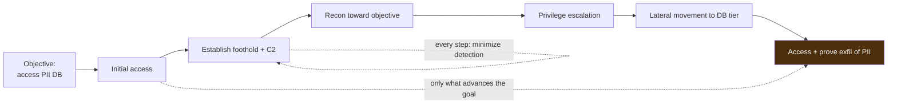

**Blue-team relevance:** objectives map directly to the organization's crown jewels, so a red-team report tells the defender *exactly which detections along the real attack path matter most*. **The professional discipline:** objectives are agreed in writing before the engagement, along with how each will be *proven* safely (a screenshot, a benign canary file placed in the target, a specific record retrieved) so that "success" is unambiguous and no real damage is done.

### 2.1 The Cyber Kill Chain and How It Relates to ATT&CK

Before ATT&CK, the dominant model was Lockheed Martin's **Cyber Kill Chain** — a seven-stage narrative of an intrusion that is still useful for high-level thinking. Understanding both, and how they relate, is part of the shared vocabulary.


The kill chain is a **linear story** (recon → weaponize → deliver → exploit → install → C2 → act), good for explaining an intrusion to executives. ATT&CK is a **behavior matrix** — richer, non-linear, and mapped to real procedures, good for planning and detection. They are complementary: the kill chain frames the *narrative arc* of your red-team report, while ATT&CK provides the *granular technique language* for the emulation plan and detection timeline. A useful habit is to structure the report's narrative along the kill chain and annotate each step with the ATT&CK techniques used and whether each was detected — leadership follows the story, the SOC follows the techniques.

| Kill Chain stage | Rough ATT&CK tactics | Red-team activity |
|---|---|---|
| Reconnaissance | Recon, Resource Dev | OSINT, infra build |
| Weaponization | Resource Dev | build payloads (authorized, lab) |
| Delivery | Initial Access | phishing, exposed service |
| Exploitation | Execution | run code on target |
| Installation | Persistence, Defense Evasion | foothold, C2 implant |
| Command & Control | Command & Control | beaconing, operator control |
| Actions on Objectives | PrivEsc→Exfil→Impact | reach and prove the crown jewel |

**Blue-team relevance:** defenders map their controls to both models — the kill chain to reason about "how early can we break the chain?" and ATT&CK to reason about "which specific techniques do we detect?" A red-team report that speaks both languages is immediately actionable to both the board and the SOC.

### 2.2 The Red-Team Roles and White Cell

A professional engagement is a *team* with defined roles, not a lone hacker. Knowing the roles clarifies how operations actually run:

- **Engagement lead / operator-in-charge** — owns the objective, the RoE, and the risk decisions; the client's primary technical contact within the team.
- **Operators** — the hands-on-keyboard team executing the plan, making moment-to-moment OPSEC calls.
- **Infrastructure engineer** — builds and maintains C2, redirectors, domains, and phishing infra (Part 6); keeps it healthy and OPSEC-safe.
- **Threat-intel / emulation lead** — selects the adversary, builds the ATT&CK-mapped plan, ensures the tradecraft matches the emulated actor.
- **White cell (client side)** — the small, trusted group at the client who *know* the test is happening: typically the CISO, SOC lead, and a legal/exec sponsor. They handle deconfliction (confirming "that alert is the red team, stand down") and can invoke stop conditions. In an unannounced engagement, the *rest* of the blue team does not know — that is the entire point, because you are testing their genuine response.

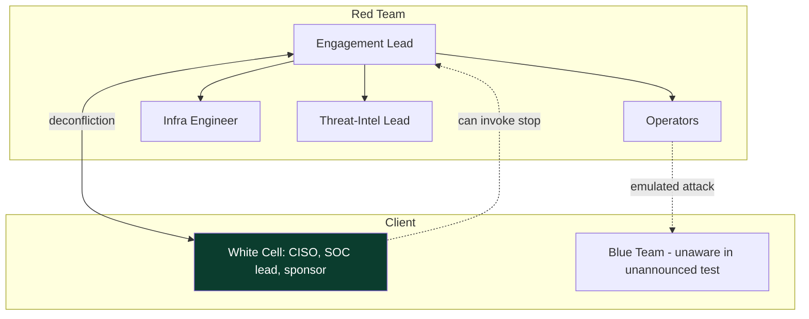

**Why the white cell matters so much:** it is the safety valve. If the blue team escalates a red-team action into a full incident response — pulling in executives, calling law enforcement, shutting down systems — the white cell can quietly confirm "this is the authorized test" and prevent real business disruption. Without it, an unannounced engagement can cause exactly the chaos it was meant to measure, at real cost. Deconfliction is therefore not optional; it is what makes unannounced testing safe.

### 2.3 Writing Good Objectives and Safe Proofs

Objectives are the spine of the engagement, and writing them well is a skill. A good objective is **specific, business-meaningful, and safely provable.** Compare:

- Weak: "get admin access." (Admin of what? Why does it matter to the business? How proven?)
- Strong: "demonstrate the ability to read the production customer-PII database, proven by retrieving a single pre-seeded canary record and recording its hash — without exporting real customer data."

The strong version ties to real business risk (customer-data breach), defines a clear finish line, and specifies a **safe proof** that causes no harm. Every objective needs its safe proof defined *in advance*, because the proof is how you demonstrate impact without becoming the incident you were hired to simulate:

| Objective type | Safe proof | Never do |
|---|---|---|
| Access sensitive DB | retrieve one seeded canary record + hash | bulk-export real data |
| Reach Domain Admin | benign marker in DA-only location | reset real passwords, alter GPOs |
| Access exec mailbox | screenshot one seeded test email | read/exfil real correspondence |
| Payment/fraud capability | prove access to the function, don't execute | initiate a real transaction |
| Ransomware impact | drop benign marker with the access | encrypt anything real |

**The discipline:** the proof demonstrates *capability*, not *consequence*. A professional proves they *could* cause the worst-case outcome and stops exactly there — the gap between "could" and "did" is the difference between a valued assessment and a catastrophe. This is why objectives and their proofs are negotiated with the client and written into the RoE before a single action is taken.

## Part 3: Threat Emulation and Adversary Modeling

Red teams do not attack "as themselves"; the best emulate a **specific, relevant threat actor** — one that plausibly targets this organization's sector — so the exercise tests the defense against a realistic adversary rather than an arbitrary one. This is **threat-intelligence-led** red teaming, and it uses a shared language: **MITRE ATT&CK**, the public knowledge base of adversary **tactics** (the "why" — e.g. Initial Access, Persistence, Lateral Movement) and **techniques** (the "how" — e.g. spearphishing attachment, valid accounts). We teach ATT&CK from scratch because it recurs throughout the notebook.

**MITRE ATT&CK, from zero.** ATT&CK organizes real-world adversary behavior into a matrix. Columns are **tactics** (the adversary's tactical goals, in rough kill-chain order); cells are **techniques** and **sub-techniques** (concrete behaviors), each with an ID (e.g. `T1566.001` Spearphishing Attachment), description, real-world procedure examples, detections, and mitigations. Threat-intel reports on named groups (APT29, FIN7, etc.) list which techniques that group uses, so you can **build an emulation plan by selecting the techniques your target adversary actually employs.**

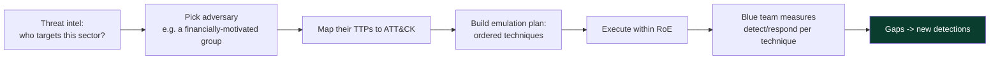

The tactics, in kill-chain-ish order, that structure most emulation plans:

| Tactic | Adversary goal | Example technique |
|---|---|---|
| Reconnaissance | gather target info | OSINT, T1595 active scanning |
| Resource Development | build infra | acquire domains/C2, T1583 |
| Initial Access | get in | spearphishing T1566, valid accounts T1078 |
| Execution | run code | PowerShell T1059.001, user execution |
| Persistence | survive reboot/logout | run keys, WMI, scheduled tasks T1053 |
| Privilege Escalation | gain higher rights | token abuse, T1548 |
| Defense Evasion | avoid detection | obfuscation T1027, injection T1055 |
| Credential Access | steal secrets | LSASS dump T1003, Kerberoasting |
| Discovery | map the environment | T1087 account discovery, T1018 |
| Lateral Movement | move between hosts | T1021 remote services, pass-the-hash |
| Collection | gather objective data | T1005 local data, email collection |
| Command & Control | remote control | T1071 app-layer protocols, beaconing |
| Exfiltration | steal data out | T1041 over C2, T1567 over web service |
| Impact | disrupt/destroy | ransomware T1486 (emulated safely) |

**Adversary emulation vs adversary simulation.** *Emulation* replays a specific known adversary's TTPs (using their tradecraft, tools-alike, and sequence); *simulation* is a looser "act like a generic skilled attacker." Frameworks and resources — MITRE's **Adversary Emulation Plans**, the **Atomic Red Team** library (benign per-technique tests), **CALDERA** (automated emulation) — let teams build and run these plans. **Purple-team tie-in:** running an emulation plan technique-by-technique with the blue team watching is exactly the purple-team loop from the previous notebook's chapters, scaled to a campaign.

## Part 4: The Engagement Lifecycle

Every professional engagement follows a lifecycle. The names vary, but the phases are stable, and skipping the front ones is how engagements go legally and operationally wrong. We walk each.

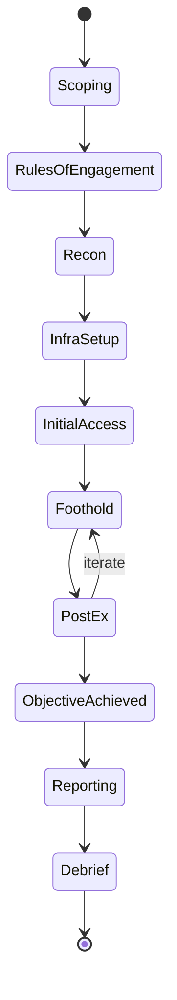

**1. Scoping & objectives.** Define what the client wants tested and why: the objectives (crown jewels), the type (red vs purple, announced vs not, assumed-breach or not), what is *in* and *out* of scope, timelines, and constraints. This is where you prevent mismatched expectations. Output: a scoping document and a statement of work.

**2. Rules of Engagement (RoE) & authorization.** The legal and safety contract (Part 5). Without a signed authorization ("get out of jail" letter), you do not touch anything.

**3. Reconnaissance & threat modeling.** OSINT and (if in scope) light active recon to understand the attack surface, plus building the ATT&CK-mapped emulation plan for the chosen adversary.

**4. Infrastructure setup.** Stand up the C2, redirectors, phishing infrastructure, and domains needed for the operation (Part 6), configured for OPSEC and resilience.

**5. Initial access.** Achieve the first foothold — phishing, exposed service, valid credentials, or (assumed breach) the granted foothold.

**6. Establish foothold & C2.** Get reliable, OPSEC-safe command and control; establish persistence appropriate to the objective; avoid tripping detection.

**7. Post-exploitation toward the objective.** Recon, privilege escalation, lateral movement, credential access, collection — always weighing each action's value to the objective against its detection risk. This phase iterates.

**8. Objective completion.** Achieve and *safely prove* the objective (agreed proof artifact), without causing real damage.

**9. Reporting & debrief.** The actual deliverable (Part 8): the attack narrative, the timeline, detection opportunities missed and hit, and prioritized recommendations — followed by a collaborative debrief with the blue team.

**10. Cleanup.** Remove artifacts, implants, persistence, and test accounts; confirm the environment is returned to its prior state; hand over anything the client needs for their own IR review.

**The front half is where professionalism lives.** Amateurs rush to phase 5; professionals spend real effort on 1–4, because a well-scoped, well-authorized, well-planned engagement is safe and valuable, and a poorly-scoped one is a liability no matter how good the hacking is.

### 4.1 A Closer Look at Reconnaissance

Recon deserves expansion because it is where the objective-driven mindset first bites and where OPSEC starts. Recon splits into **passive** (no interaction with target systems — invisible to them) and **active** (touching target systems — potentially detectable).

- **Passive / OSINT** — public data only: the company website, job postings (which reveal technologies — "must know Okta, CrowdStrike, ServiceNow"), LinkedIn (org structure, names, roles for phishing target selection), DNS records, certificate-transparency logs (subdomains), code repos and paste sites (leaked credentials/keys), breach-data corpora (for password patterns), and social media. Because it never touches the target, passive recon is essentially undetectable and is done first and continuously.
- **Active** — interacting with target-owned systems: port/service scanning, web-app spidering, DNS brute-forcing against target servers. This *can* be detected, so under a red-team (stealth) contract it is done sparingly, slowly, and only where it materially advances the objective — a stark contrast to a pentest, where broad active scanning is expected on day one.

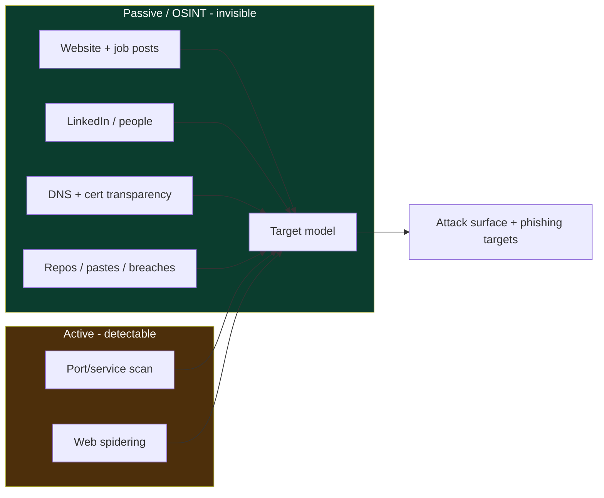

**The recon products** that feed the rest of the engagement: a map of the external attack surface (domains, exposed services, tech stack), a list of people with roles (for phishing target selection and pretext design), the security stack in use (EDR, email gateway, MFA provider — which shapes tradecraft), and leaked credentials or exposed secrets. **OPSEC note:** even OSINT has a footprint if done carelessly (e.g. authenticating to the target's systems while researching, or LinkedIn-viewing patterns from a burnable identity) — professionals separate research identities from operational ones.

**Blue-team relevance:** organizations reduce their recon surface by minimizing information leakage (careful job postings, subdomain hygiene, credential-leak monitoring, brand/domain monitoring for lookalikes) — a red-team report's recon section is effectively a free external-exposure assessment.

### 4.2 Pacing, Duration, and Maturity Matching

Two scoping decisions shape the whole engagement and are worth understanding: **pacing** and **maturity matching**.

**Pacing.** A red team's tempo is itself an OPSEC lever. Real advanced adversaries operate over weeks or months with long quiet periods; a red team compressing the same activity into three noisy days will trip velocity-based detections and produce an unrealistic test. So mature engagements are *time-boxed but slow-paced within the box* — long beacon intervals, deliberate gaps, activity blended into business hours (or deliberately off-hours if that is the emulated actor's pattern). The trade-off is cost: a longer, slower engagement is more realistic but more expensive, so the client and team agree the pace against the budget and the realism goal.

**Maturity matching.** Running a stealthy, unannounced red team against an organization with *no* SOC, no EDR, and no logging is a waste — they will not detect anything, and the exercise teaches little beyond "you have no detection," which a cheaper assessment could establish. Match the engagement to defensive maturity:

| Defensive maturity | Best-fit engagement |
|---|---|
| No SOC / minimal logging | vulnerability assessment + pentest; build baseline detection first |
| Emerging SOC, some EDR | purple team to build detections rapidly |
| Established SOC + EDR + IR | unannounced red team to test genuine detect/respond |
| Mature, threat-informed | intelligence-led red team + continuous purple + metrics |

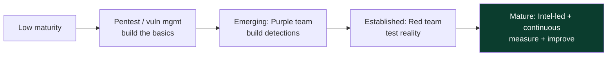

**The professional judgment:** recommending the *right* engagement for a client's maturity — even when it is a cheaper one than they asked for — builds the trust that sustains a career. A red team that sells an organization something it is not ready to benefit from has mis-served it, however impressive the hacking.

## Part 5: Rules of Engagement & Authorization

The **Rules of Engagement (RoE)** and the **authorization** are the most important documents in the engagement — more important than any exploit. They convert "unauthorized computer intrusion" (a crime) into "contracted security assessment" (a service), and they keep everyone safe. Understand every field.

A proper authorization package includes:

- **Signed authorization letter** — from someone with the *authority to grant it* (an officer of the company, not a mid-level manager), explicitly permitting the described activities against the described assets for the described dates. Carried by the team during the engagement (the "get out of jail letter") in case they are challenged.
- **Scope** — precisely which assets, domains, IP ranges, applications, physical locations, and personnel are in and out of scope. Third-party/cloud assets need the *provider's* authorization too (you cannot authorize testing of infrastructure you do not own).
- **Objectives & success criteria** — the crown jewels and how each is proven safely.
- **Timing windows** — when testing may occur (e.g. business hours only, or a specific window), and any blackout dates (earnings, peak sales).
- **Permitted and forbidden techniques** — e.g. phishing allowed but no calls to personal phones; no DoS; no destructive actions; no accessing actual customer PII beyond proof-of-access; social engineering limits.
- **Deconfliction & emergency contacts** — the "white cell" (small group aware of the test) and 24/7 contacts to call if something goes wrong or if the blue team needs to confirm whether an alert is "just the red team."
- **Data handling** — how any sensitive data encountered is handled, stored (encrypted), and destroyed; legal/privacy constraints (GDPR etc.).
- **Safety & stop conditions** — what forces an immediate halt (evidence of a *real* concurrent breach, risk to safety/production, hitting an out-of-scope critical system).

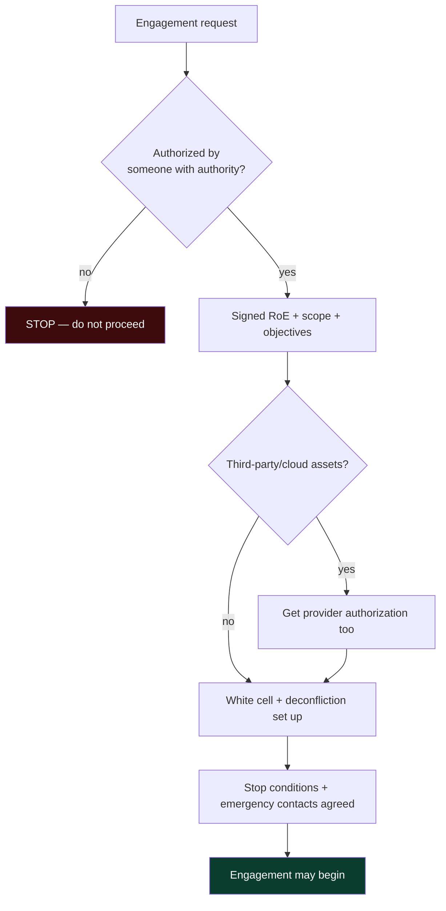

**The professional rule:** if you are ever unsure whether something is authorized, it is not — you pause and confirm with the white cell. The most senior red teamers are the *most* conservative about authorization, because they understand the legal and human stakes. A signed RoE is not bureaucracy; it is what makes the whole profession lawful.

### 5.1 Legal and Ethical Foundations — the Non-Negotiables

Because the entire profession rests on doing lawfully what would otherwise be criminal, the legal/ethical foundations deserve explicit treatment. The relevant law varies by jurisdiction but the principles are near-universal:

- **Unauthorized access is a crime** — computer-misuse statutes (the US Computer Fraud and Abuse Act, the UK Computer Misuse Act, and equivalents worldwide) criminalize accessing systems without authorization. *Written authorization from a party with authority over the system* is the thing that makes red-team activity lawful. Verbal permission, or permission from someone without authority, is not sufficient.
- **You cannot authorize what you do not own** — testing third-party SaaS, cloud infrastructure, or shared services requires the *provider's* authorization too. Cloud providers publish penetration-testing policies; exceeding them (e.g. certain DoS-adjacent tests) can violate their terms even with client permission.
- **Data-protection law constrains what you may touch** — encountering real personal data (PII, health, financial) triggers GDPR/HIPAA/etc. obligations. This is why objectives are proven with *canary* records and *proof of access*, never bulk exfiltration of real customer data.
- **Scope creep is legal risk** — pivoting onto an out-of-scope system, even accidentally, can cross from authorized to unauthorized. When in doubt, stop and confirm with the white cell.
- **Evidence handling has legal weight** — data collected during the engagement must be stored encrypted, access-controlled, retained only as agreed, and securely destroyed. A red team that mishandles client data has caused a breach itself.

**The ethical spine:** a professional red teamer's loyalty is to making the organization more defensible, within the law and the RoE, causing no unnecessary harm. The skill to break in is common; the judgment to do it lawfully, safely, and usefully is what makes it a profession. Every senior practitioner will tell you the same thing — *the exploit is the easy part; the authorization, safety, and value are the job.*

### 5.2 Safety, Deconfliction, and Stop Conditions in Practice

Safety is operationalized through concrete mechanisms that every engagement must have running:

- **The deconfliction channel** — a 24/7 way for the white cell to ask "is this you?" and get an immediate answer, and for the red team to warn "we are about to do X" before a high-risk action. A shared, logged channel with named contacts on both sides.
- **Stop conditions** — pre-agreed triggers that halt the operation immediately: evidence of a *real, concurrent* breach by an actual adversary (you must not muddy a real incident); risk to human safety or to production/critical systems; accidentally reaching an out-of-scope critical asset; or a client request to pause. When a stop condition fires, you stop, notify, and preserve state.
- **Blast-radius control** — favoring reversible, low-impact actions and testing destructive-adjacent capabilities in the safest possible way (e.g. *proving* you could deploy ransomware by dropping a benign marker file with the same access, never actually encrypting anything).
- **Change awareness** — knowing the client's change calendar so you never coincide with a critical migration or peak-load event where an unexpected action could cause outsized harm.

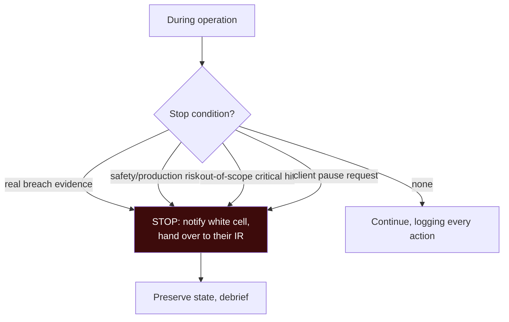

**The professional stance:** the red team that stops appropriately and communicates clearly is trusted with bigger, riskier engagements; the one that "pushes through" a stop condition to reach its objective is never hired again. Safety and communication are not constraints on the work — they *are* the work at the senior level.

## Part 6: Infrastructure & C2 at a Conceptual Level

A red-team operation runs on **infrastructure**: the servers, domains, and tooling that deliver payloads and provide command and control. This chapter introduces the concepts (later chapters go deep on C2 and infrastructure); the point here is how infrastructure choices serve *OPSEC and resilience.*

- **Command & Control (C2)** — the server(s) the operator uses to control implants (next chapter's whole topic). The C2 team server should never be exposed directly to the target.
- **Redirectors** — intermediary servers (often simple reverse proxies) that sit between the target and the real C2, so the target only ever talks to a disposable redirector. If a redirector is burned (blocked/identified), you swap it without losing the C2. This is the single most important infrastructure OPSEC pattern.
- **Domain categorization & reputation** — payloads and C2 use domains that look benign and are categorized in a harmless category (not "newly registered" or "uncategorized," which alerts). Aged, categorized domains blend in.
- **Redundancy & tiering** — separate infrastructure for phishing, for staging, for short-haul C2 (frequent beacons), and for long-haul C2 (slow, resilient fallback), so burning one tier does not end the operation.
- **Encryption & profiles** — C2 traffic is encrypted and shaped to blend with normal traffic (covered under malleable profiles in a later chapter).

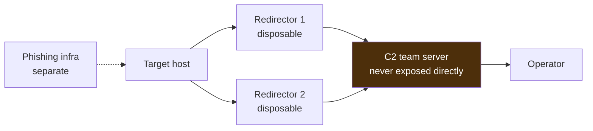

**Blue-team relevance:** every one of these choices is also a *detection opportunity* — newly-registered or uncategorized domains, beaconing patterns, and redirector fingerprints are all things defenders hunt, which is exactly why operators invest in blending. **The symmetry to hold onto:** good red-team infrastructure and good blue-team network detection are two sides of the same coin, and understanding one sharpens the other.

A few more infrastructure concepts you will meet in the next chapter, named here for orientation:

- **Traffic blending / legitimate-service C2** — routing C2 over commonly-allowed channels (HTTPS to well-known cloud services, DNS, collaboration platforms) so it blends with normal egress. The more the C2 looks like ordinary business traffic, the harder it is to filter without false positives.
- **Domain fronting (largely historically)** — a technique that made C2 appear to go to a high-reputation CDN domain while actually reaching the operator's server behind the same CDN. Major providers have since restricted it, but it illustrates the general goal: make the *apparent* destination trustworthy.
- **Categorized/aged domains** — registering domains well in advance and getting them categorized as benign (e.g. "business," "health") so web filters allow them, rather than using freshly-registered domains that trip "newly seen domain" detections.
- **Certificate and JA3/JARM hygiene** — default tool TLS certificates and TLS fingerprints (JA3/JARM) are known and signatured, so operators customize them; defenders, conversely, hunt exactly those default fingerprints.

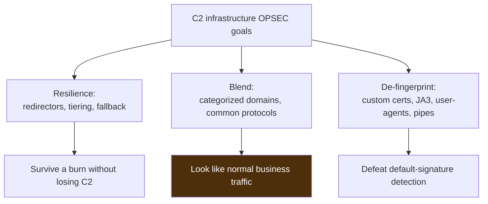

Each of these is a full topic in the next chapter; the point *here* is that infrastructure is designed around three OPSEC goals — **resilience** (survive being partially burned), **blending** (look normal), and **de-fingerprinting** (avoid default signatures) — and that every one of those goals has a mirror-image blue-team detection. Hold that mirror in mind and the C2 chapter will read as a two-sided game rather than a bag of tricks.

### 6.1 Initial Access Vectors — the Options and Their Trade-offs

The transition from "outside" to "first foothold" is **initial access**, and the vector chosen shapes the whole operation's OPSEC. The main options, each an ATT&CK technique family, with trade-offs:

- **Phishing (T1566)** — the most common real-world vector. Spearphishing an attachment or a link to a small set of well-chosen targets (from recon). High success against most orgs, but touches people (who may report it) and email security (which may block it). Requires careful pretext, sending infrastructure, and payload that survives the email gateway and endpoint.
- **Exposed/vulnerable external service (T1190)** — exploit an internet-facing app or VPN. Quiet if it works (no human involved), but external attack surfaces are increasingly hardened and monitored, and exploitation can be noisy/risky against production.
- **Valid accounts (T1078)** — use credentials from a breach corpus, password spraying, or leaked secrets. Very stealthy (it looks like a legitimate login) — which is exactly why credential-based access is so common in real breaches — but gated by MFA where present.
- **Supply chain / trusted relationship (T1195/T1199)** — via a third party or software update. Powerful and realistic for high-end adversaries; usually out of scope or tightly controlled in engagements.
- **Physical / on-site (T1091, T1200)** — dropped USB, on-site network access, tailgating. Tests physical and human controls; only when explicitly in scope.
- **Assumed breach** — the client simply grants a foothold, skipping initial access entirely so the engagement focuses on post-compromise detection. Increasingly the default for efficiency.

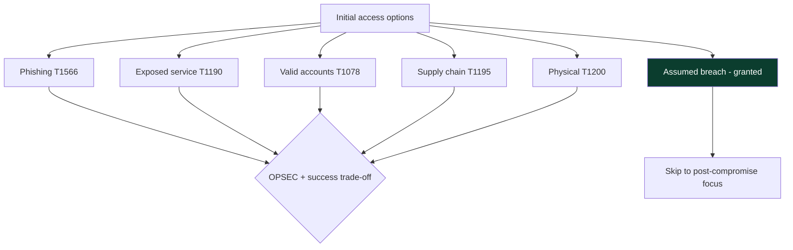

**The strategic point:** initial access is often the *least* interesting part of a red-team engagement to the client, because the questions that matter most ("can we detect what happens *after* they get in?") live post-compromise. This is why assumed breach is so popular — it puts budget where the defensive value is highest. **Blue-team relevance:** each vector maps to a control (email security + user reporting for phishing, attack-surface management + patching for exposed services, MFA + impossible-travel detection for valid accounts), so the initial-access section of a report is a direct assessment of those controls.

## Part 7: OPSEC as a Through-Line

**Operational security (OPSEC)** is the discipline of not getting caught — and, more importantly in an authorized context, of controlling *when and how* you are detected so the exercise produces clean signal. It is not a phase; it is a mindset applied to every single action. The core question before any action is: **"what will this do to my detection risk, and is the value worth it?"**

Principles that recur throughout the notebook:

- **Every action has a cost.** Each command, tool, and network connection can generate telemetry. Weigh value-to-objective against detection risk before acting. The loudest, most convenient technique is rarely the right one.
- **Blend in (living off the land).** Prefer built-in, expected tools and behaviors over dropping obvious tooling — a `net` command looks more normal than a strange binary; using existing admin channels beats novel ones.
- **Slow is smooth.** Real adversaries operate over weeks; a red team that rushes trips volume-based and velocity-based detections. Beacon intervals, pacing, and patience are OPSEC.
- **Minimize footprint.** Fewer implants, fewer files on disk, in-memory where sensible (the previous notebook's whole subject), and clean up after yourself.
- **Assume you are watched.** Operate as if the blue team sees everything, because on a good day they do — that assumption produces careful tradecraft.
- **Segregate infrastructure and identities.** Don't reuse burned domains, don't cross-contaminate operator identities, don't let one compromised element expose the rest.

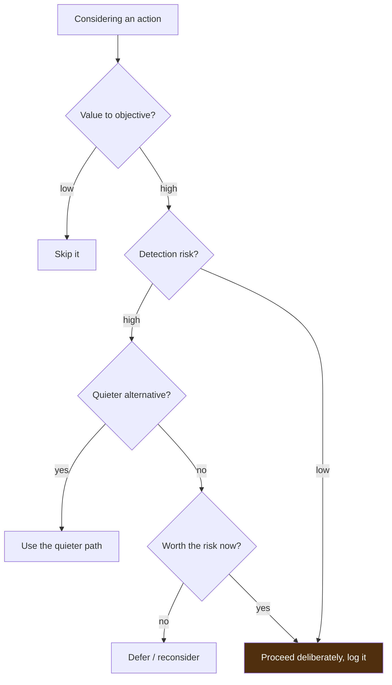

**The defender's mirror:** OPSEC failures are the blue team's wins. When a red team documents *where* their OPSEC was thin and the blue team *should* have caught them, that is often the most valuable output of the whole engagement — it is a precise, prioritized list of detection improvements. This is why mature reports include an honest "here is where we were noisy and you missed it" section.

### 7.1 OPSEC Indicators — What Actually Gives Operators Away

OPSEC is abstract until you enumerate the concrete indicators defenders hunt, because *avoiding them* is what OPSEC means in practice. Understanding these is equally a red-team skill (don't produce them) and a blue-team skill (detect them):

- **Anomalous process ancestry** — `winword.exe` spawning `powershell.exe`, `svchost.exe` with the wrong parent (the previous notebook's whole Chapter 5 baseline). A top-tier telemetry source.
- **Unusual command lines** — `-enc`, `-w hidden`, `DownloadString`, LOLBin arguments (previous notebook, Chapter 4). Loud and decodable.
- **Beaconing network patterns** — regular, periodic callbacks to the same destination (next chapter's core detection). Even encrypted C2 betrays itself by *timing* if not jittered.
- **New/uncategorized/low-reputation domains** — freshly-registered C2/phishing domains, or domains in "uncategorized" web-filter categories.
- **Rare parent-child and logon patterns** — first-time RDP between two hosts, service creation on a remote host, a user account authenticating to systems it never touches.
- **Tool artifacts** — known-tool byte signatures, default named pipes, default certificates, default user-agents (the reason operators customize everything default).
- **Volume and velocity** — mass enumeration, rapid lateral movement, large egress — anything that stands out from the slow, low baseline of normal activity.

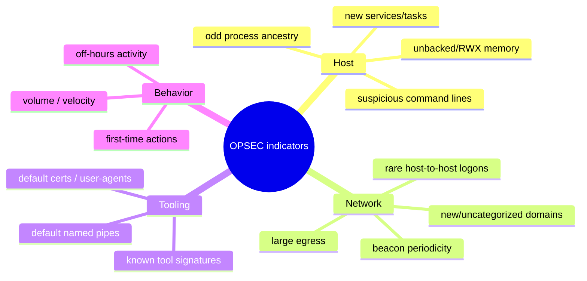

**The operator's discipline** is to eliminate or blend each of these: customize tool defaults, jitter beacons, use categorized domains, move slowly, live off the land, and blend with the host's normal ancestry. **The defender's discipline** is to build detection for each. This is the same coin, two faces — and it is why the strongest red teamers deeply understand blue-team telemetry, and the strongest defenders deeply understand offensive tradecraft.

### 7.2 Metrics That Matter — Dwell Time and Response

A red-team engagement's defensive value is measured, and the metrics are worth naming because they reframe "did we win?" into "how good is the defense?":

- **Time to detect (TTD)** — from a red-team action to the blue team *noticing* it. Lower is better.
- **Time to respond (TTR)** — from detection to *effective response* (containment). A detection nobody actions is nearly worthless, so TTR often matters more than TTD.
- **Dwell time** — how long the red team operated before being detected/contained. Real-world adversary dwell times have historically been measured in weeks to months; driving your own dwell time down is a concrete defensive goal.
- **Detection coverage** — the fraction of executed ATT&CK techniques that produced telemetry / an alert / a response. This is the purple-team scorecard.
- **Kill-chain break point** — the earliest stage at which the defense *could* have stopped the operation. Earlier is better and cheaper.

| Metric | Question it answers | Improve by |
|---|---|---|
| Time to detect | how fast did we notice? | better telemetry + tuned alerts |
| Time to respond | how fast did we contain? | IR playbooks, automation, drills |
| Dwell time | how long did they operate? | detect earlier in the chain |
| Detection coverage | which techniques did we catch? | detection engineering per gap |
| Kill-chain break point | earliest we could have stopped it? | layered controls, defense-in-depth |

**The reframe:** these metrics turn a red-team engagement from a pass/fail "were we breached" into a *continuous-improvement instrument*. Track them across engagements (in a tool like VECTR) and you get a trend line for your security program — which is what leadership actually needs to justify investment and measure progress.

## Part 8: Reporting — Turning Offense into Defensive Value

The report is the product. An engagement that achieved its objective but produced a vague report has failed; an engagement that was partly detected but produced a clear, actionable report has succeeded. A red-team report is fundamentally different from a pentest report (a list of vulns) — it is a **narrative plus a defensive assessment.**

A strong red-team report contains:

- **Executive summary** — in business terms: what objective was pursued, whether it was achieved, the business risk demonstrated, and the top 3–5 things to fix. Written for leadership, no jargon.
- **The attack narrative** — a chronological story of the operation: how initial access was gained, how the team moved toward the objective, decision points, and how the objective was proven. This is what makes red-team reports compelling to executives.
- **The detection timeline** — mapped to ATT&CK: for each technique used, *did the blue team detect it, when, and did they respond?* This is the heart of the defensive value. "Technique X at 14:32 — no alert; Technique Y at 15:10 — alerted but not actioned for 3 hours."
- **Findings & root causes** — the specific weaknesses (technical and process) that enabled the path, with root-cause analysis, not just symptoms.
- **Prioritized recommendations** — ranked by risk reduction per effort, spanning detection engineering, hardening, and process. Actionable, specific, and mapped to the gaps found.
- **Appendices** — IOCs, tooling used, artifacts left (for cleanup verification), and a full technique log for the blue team to build detections from.

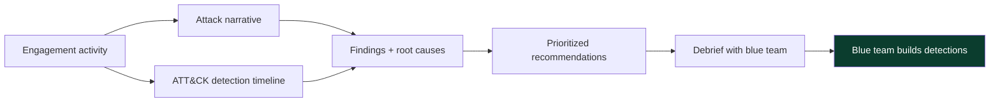

**The purple-team handoff.** The best engagements end with a collaborative debrief where red walks blue through the timeline technique-by-technique, and blue immediately builds or tunes detections for the gaps. That debrief is where a red-team engagement converts, finally and completely, from offense into defense — which is its entire reason for existing.

### 8.1 What a Detection Timeline Actually Looks Like

The detection timeline is the report's centre of gravity, so here is a benign, illustrative example of the format — an ATT&CK-mapped, time-ordered account of the operation against the blue team's response:

```text
TIME   ATT&CK      ACTION                         TELEMETRY   ALERT?  RESPONSE
09:14  T1566.001   Phishing attachment opened     email+4104  no      —
09:15  T1059.001   PowerShell cradle executed     4104+Sys1   no      —      <- missed: enable alert
11:40  T1053.005   Scheduled task persistence     Sys1+task   yes      no    <- alerted, not actioned (3h+)
13:02  T1055.012   Process hollowing (proof)      Sys25       yes     yes    <- detected + isolated host
                   >>> host isolated by SOC; red team pivoted to second foothold
14:20  T1003.001   LSASS access (proof only)      Sys10       yes     yes    <- strong detection
16:05  T1021.001   RDP to DB tier                 4624 t10    no      —      <- missed: no lateral-movement alert
17:30  T1005/T1041 Canary record exfil over C2    egress      no      —      <- OBJECTIVE MET undetected
```

Read this the way a SOC lead would: the operation was **detected twice** (hollowing, LSASS) but **the objective path was missed** at both the initial-execution and lateral-movement stages, and one alert (persistence) was **not actioned for hours**. That single table generates a precise, prioritized backlog: (1) alert on PowerShell cradles, (2) fix the response gap on persistence alerts, (3) build a lateral-movement/RDP-anomaly detection. This is worth more than a hundred vulnerability findings, because it tells the defender exactly where their *detection and response* — not their patch level — let a real adversary through.

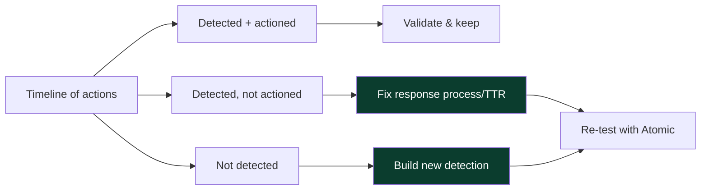

**The report-writing discipline:** be honest about both sides — where the blue team caught you (credit them; it builds trust and a collaborative debrief) and where they missed (the actionable gold). A report that only crows about success teaches nothing; a report that maps every action to detect/respond outcomes is a roadmap.

### 8.2 A Benign Executive-Summary Example

The executive summary is written for leadership — no jargon, business risk framed plainly. A benign, illustrative example of the tone and content:

```text
EXECUTIVE SUMMARY

Over a four-week authorized engagement emulating a financially-motivated
intrusion set, our team was able to gain access to the customer-PII database
(Objective 1) and reach Domain Administrator (Objective 2), demonstrating that
a determined attacker could access sensitive customer data.

The security team detected and contained two stages of the operation — process
tampering and credential access on a workstation — reflecting genuine strength
in endpoint detection. However, three earlier and later stages went undetected:
initial code execution, lateral movement to the database tier, and the final
data access. A persistence alert did fire but was not actioned for over three
hours, indicating a response-process gap rather than a visibility gap.

Top priorities (detailed in the report):
 1. Alert on script-based execution (PowerShell) at initial-access stage.
 2. Close the response gap: ensure persistence alerts are triaged within SLA.
 3. Build lateral-movement detection for internal RDP to sensitive tiers.
 4. Add database-access anomaly monitoring for the PII store.

Addressing items 1–3 would likely have broken the attack chain before the
objective was reached. Overall, endpoint detection is a strength; the gaps are
in early-stage execution visibility, lateral-movement detection, and response
timeliness.
```

Notice what it does: states outcomes in **business terms**, **credits** the blue team's genuine strengths, names the **specific, prioritized** gaps, and ties each to **breaking the chain earlier** — the language leadership needs to allocate budget. No technique IDs, no tool names, no jargon; those live in the body for the SOC. **The skill:** writing the *same* engagement two ways — a plain-language risk story for the board and a technique-by-technique detection timeline for the defenders — so both audiences get exactly what they can act on.

## Part 9: Hands-On Lab — Building a Scoping Pack and an ATT&CK-Mapped Plan

This lab is a planning exercise — the professional front-half work that most training skips. You will produce two artifacts every real engagement needs: a scoping/RoE checklist and a threat-emulation plan mapped to ATT&CK. No systems are touched; the deliverable is the plan.

### Step 1 — Draft the scoping questionnaire

A benign template you fill in with a (hypothetical) client:

```text
ENGAGEMENT SCOPING — v1
1. Engagement type:   [ ] Pentest  [x] Red Team  [ ] Purple Team
2. Announced?         [ ] Yes  [x] No (white cell only)
3. Assumed breach?    [x] Yes — client provides one standard workstation + low-priv AD user
4. Objective(s):      1) Access the "CustomerPII" DB and prove exfat of 1 canary record
                      2) Reach Domain Admin
5. In scope:          corp.example.com AD, standard user endpoints, internal apps
6. Out of scope:      production payment-processing OT, third-party SaaS, personal devices
7. Timing window:     4 weeks; testing 24/7 permitted; blackout: quarter-end week
8. Forbidden:         no DoS, no destructive actions, no real customer PII beyond canary
9. Threat to emulate: financially-motivated intrusion set (data theft profile)
10. White cell:       CISO, SOC lead, IT director  | 24/7 contact: +xx-xxx
11. Proof artifacts:  screenshots + canary record hash + DA ticket
12. Stop conditions:  real breach evidence, safety/production risk, out-of-scope critical hit
```

### Step 2 — Authorization checklist (must all be TRUE before starting)

```text
[ ] Signed authorization letter from an officer with authority to grant it
[ ] Scope precisely enumerated (assets, ranges, apps, locations, people)
[ ] Third-party/cloud provider authorization obtained where needed
[ ] Objectives + safe proof method agreed in writing
[ ] Timing windows + blackout dates confirmed
[ ] Forbidden techniques + safety/stop conditions documented
[ ] White cell + 24/7 deconfliction contacts established
[ ] Data-handling + destruction plan agreed (encryption, retention)
[ ] Insurance / liability terms in the contract reviewed
```

**If any box is FALSE, the engagement does not start.** This checklist is the single most important artifact in professional red teaming.

### Step 3 — Build the ATT&CK emulation plan

Select techniques the chosen adversary actually uses and order them by phase. A benign planning table (no execution):

```text
PHASE               ATT&CK        TECHNIQUE (planned)                 DETECTION HYPOTHESIS
Initial Access      T1566.001     Spearphishing attachment            email gw + 4104 on open
Execution           T1059.001     PowerShell cradle                   script-block logging
Persistence         T1053.005     Scheduled task                      Sysmon 1 + task-create
Defense Evasion     T1055.012     Process hollowing (proof-scoped)    Sysmon 25 + memory scan
Credential Access   T1003.001     LSASS access (proof only)           Sysmon 10 lsass mask
Discovery           T1087.002     Domain account discovery            unusual net/AD queries
Lateral Movement    T1021.001     RDP to DB tier                      logon 4624 type 10
Collection          T1005         Data from the PII DB (canary)       DB access anomaly
Exfiltration        T1041         Exfil canary over C2                egress volume/beacon
```

### Step 4 — Map objectives to proof and safety

For each objective, write the *safe* proof and the *stop* line:

```text
OBJECTIVE 1: Access CustomerPII DB
  Proof:  retrieve ONE pre-seeded canary record; record its hash; screenshot query
  Never:  bulk-export real customer PII; alter/delete any record
OBJECTIVE 2: Domain Admin
  Proof:  create/screenshot a benign marker in a DA-only location; do not disable defenses
  Never:  reset real admin passwords; modify GPOs affecting production
```

**The lab's lesson:** a professional engagement is *designed* before it is executed — the scoping pack, the authorization checklist, the ATT&CK plan with detection hypotheses, and the safe-proof/stop-line definitions together make the operation lawful, safe, and valuable. This planning discipline, not any single exploit, is what distinguishes a red teamer from someone who merely knows attacks.

## Part 10: Defensive & Purple-Team Angle (Consolidated)

Because this notebook is offense in service of defense, here is how everything above lands for the blue team and how to extract maximum value from a red-team engagement.

- **Treat the engagement as a detection exam.** Map every red-team action to ATT&CK and ask, per technique, "did we generate telemetry, alert, and respond?" The gaps are your prioritized detection backlog.
- **Insist on the detection timeline.** The most valuable report section is "what we did, when, and whether you caught it." Demand it, and turn each miss into a detection-engineering ticket (the Sigma/Atomic loop from the previous notebook).
- **Run the debrief as a purple-team session.** Walk the timeline together; build or tune detections live for the gaps; re-test with Atomic Red Team to confirm they fire.
- **Measure dwell time and response time**, not just "were we breached." Reducing time-to-detect and time-to-respond is often more valuable than closing any single hole.
- **Use assumed-breach framing** to spend budget where it matters — post-compromise detection — rather than only on perimeter.
- **Institutionalize the improvements.** The engagement's ROI is the *permanent* detections, hardening, and process changes it produces, validated by re-testing.

**The blue-team north star:** a red team's job is to make you measurably better. If after an engagement you have new, validated detections, reduced dwell time, and a clear picture of your worst-case attack paths, it worked — regardless of whether the red team reached its objective.

## Part 10b: Purple Teaming in Depth — the Fastest Path to Better Detection

Purple teaming deserves its own deeper treatment because, for many organizations, it delivers more defensive improvement per dollar than a classic unannounced red team — and it directly operationalizes the previous notebook's Sigma/Atomic loop at campaign scale.

The purple-team model puts red and blue **in the same room, working the same technique list in real time.** For each technique:

1. Red explains and executes the technique (benignly, in a controlled way).
2. Blue checks: did we get telemetry? did an alert fire? could we have responded?
3. If not, they diagnose *why* — logging off, rule missing, rule too narrow, sensor gap.
4. They fix it *immediately* — enable the log, write/tune the rule.
5. Red re-runs the technique to confirm the detection now fires.
6. They record the result (technique → detected? → tuned?) and move on.

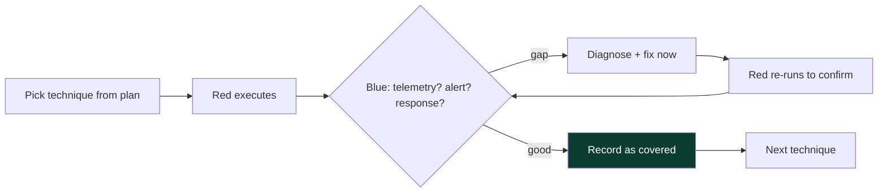

**Why it is so effective:** the feedback loop is *minutes*, not weeks — the blue team learns exactly what each technique looks like in *their* telemetry and leaves with working detections, validated on the spot. The trade-off versus a red team is realism: purple teaming does not test whether the blue team *notices unprompted*, only whether they *can* detect a technique once looking. Mature programs do both — periodic unannounced red teams to measure genuine detection/response, and frequent purple-team sessions to rapidly close the gaps those red teams (and threat intel) reveal.

| Aspect | Unannounced Red Team | Purple Team |
|---|---|---|
| Tests | genuine detect + response | detection capability per technique |
| Feedback speed | weeks (report) | minutes (live) |
| Blue team knows? | no | yes, collaborating |
| Best for | measuring reality, dwell time | rapidly building/tuning detections |
| Cadence | periodic | frequent |

**The combined program** — red teams to measure, purple teams to improve, threat intel to prioritize, and metrics (dwell time, coverage) to track — is what a mature, threat-informed defense looks like, and this notebook's offensive chapters exist to feed exactly that machine.

## Part 10c: Special Environments — Cloud and OT/ICS

Two environments deserve a note because their objectives, risks, and constraints differ sharply from a classic corporate network.

**Cloud (AWS/Azure/GCP).** Objectives shift from "Domain Admin" to "assume a privileged IAM role," "access an S3 bucket of customer data," or "pivot from a compromised workload to the control plane." Key differences: the *provider's* penetration-testing policy governs what is allowed (you cannot freely attack shared infrastructure); identity (IAM roles, keys, federation) is the primary attack surface rather than network position; and logging (CloudTrail, Azure Activity Log, GCP Audit Logs) is the primary detection surface. Recon and post-ex use cloud-native techniques (enumerating roles, metadata-service abuse), and the ATT&CK **Cloud matrices** map them.

**OT / ICS (industrial control systems).** Objectives involve demonstrating potential impact on physical processes (manufacturing, energy, utilities) — the highest-stakes environments, where an unsafe action can endanger lives or cause physical damage. The overriding rule is **safety first**: testing is heavily constrained, often limited to the IT/OT boundary or done in a lab/digital-twin, with any near-process activity requiring extreme caution, engineering sign-off, and hard stop conditions. Frameworks like **MITRE ATT&CK for ICS** provide the technique language. The red teamer's judgment about *what not to do* matters more here than anywhere else.

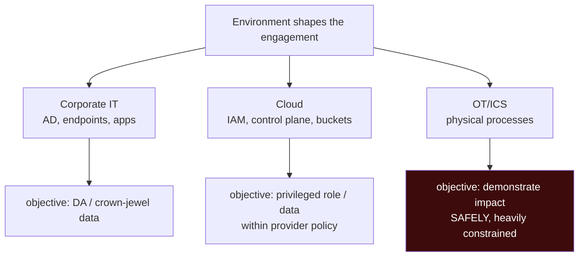

**The unifying lesson:** the lifecycle, RoE, OPSEC, and reporting principles are the same everywhere, but the *objectives, allowed actions, detection surfaces, and safety constraints* are environment-specific — and matching them correctly is part of scoping a professional engagement.

## Part 11: Real-World Context & Pitfalls

**Real-world grounding.** Intelligence-led red teaming is now mandated in parts of the financial sector (TIBER-EU, CBEST, and similar frameworks worldwide), precisely because regulators recognized that vulnerability scanning and pentesting do not measure whether an institution can detect and respond to a realistic, determined adversary. Major breaches repeatedly show that the failure was not a lack of vulnerabilities found, but a lack of *detection and response* to activity that was, in hindsight, visible — which is exactly the gap red teaming measures. The discipline exists because the threat is real and the defensive question ("would we catch them?") cannot be answered by counting vulnerabilities.

**Common pitfalls:**
- *Selling a pentest as a red team (or vice versa).* Mismatched expectations ruin engagements. Match type to need explicitly.
- *Skipping the front half.* Rushing to exploitation without solid scoping/RoE is how engagements become legal incidents.
- *Optimizing to "win" instead of to inform.* Reaching the objective while teaching the blue team nothing is a poor outcome. Value = defensive improvement.
- *No deconfliction.* Without a white cell and 24/7 contact, a red-team action can trigger a real IR mobilization, waste huge effort, or cause real business disruption.
- *Poor OPSEC discipline.* Being caught is fine (it is a finding); being caught *for a reason you can't explain* muddies the signal. Log your actions so the timeline is clean.
- *Weak reporting.* The best operation with a vague report delivers little. The report and debrief are the product.
- *Ignoring cleanup.* Leaving implants, persistence, or test accounts behind is both unprofessional and a real risk.
- *Testing out-of-scope or third-party assets.* A fast way to a lawsuit. Scope is sacred; when unsure, stop and confirm.

## Part 12: Final Revision / Summary

- **Spectrum:** vuln scan (automated breadth) → pentest (find & prove exploits, coverage) → red team (objective-driven adversary emulation, stealth, tests defense) → purple team (collaborative attack+detect+tune). Match the type to the client's real need.
- **Objective-driven mindset:** a red team pursues concrete crown-jewel objectives via the path a real adversary would take, avoiding noise that doesn't advance the goal — a single elegant narrative, not 200 findings.
- **Threat emulation:** emulate a *specific, relevant adversary* using ATT&CK tactics/techniques; build the plan from real threat-intel TTPs (MITRE Adversary Emulation Plans, Atomic Red Team, CALDERA).
- **Lifecycle:** scoping → RoE/authorization → recon/threat-model → infra → initial access → foothold/C2 → post-ex toward objective → objective proof → reporting/debrief → cleanup. The front half is where professionalism lives.
- **RoE & authorization** convert crime into service: signed letter from someone with authority, precise scope, third-party authorization, objectives + safe proof, timing, forbidden techniques, deconfliction/white cell, data handling, stop conditions. If unsure, it's not authorized.
- **Infrastructure** serves OPSEC and resilience: C2 behind disposable redirectors, categorized/aged domains, tiered redundancy, encrypted blended traffic.
- **OPSEC** is a through-line, not a phase: value-vs-detection-risk on every action, blend in, slow is smooth, minimize footprint, assume you're watched.
- **Reporting** is the product: executive summary, attack narrative, ATT&CK detection timeline, root causes, prioritized recommendations, purple-team debrief. Value = measurable defensive improvement (new detections, reduced dwell time).
- **Assumed breach** focuses effort on post-compromise detection; **intelligence-led frameworks** (TIBER/CBEST) formalize realistic emulation.
- **Objectives are specific, business-meaningful, and safely provable** — prove *capability*, never cause the *consequence* (canary records, benign markers, not real damage).
- **Match engagement to maturity** — an unannounced red team against an org with no detection wastes everyone's time; build basics or purple-team first.
- **Pacing is OPSEC** — slow, blended, time-boxed-but-patient beats fast and noisy; real adversaries take weeks.
- **Metrics turn "did we win?" into "how good is the defense?"** — track TTD, TTR, dwell time, coverage, and kill-chain break point across engagements.
- **Environment shapes objectives and safety** — cloud (IAM/control-plane, provider policy) and OT/ICS (safety-first, heavily constrained) differ sharply from corporate IT, but the lifecycle/RoE/OPSEC principles are constant.

The overarching lesson of this chapter is that red teaming is a *profession of judgment*, not just of technique: the exploit is the easy part, and the value lives in matching the engagement to the need, operating lawfully and safely, exercising OPSEC judgment on every action, and turning the whole operation into measurable defensive improvement for the client. Every subsequent chapter — C2, infrastructure, lateral movement, exfiltration — is a tool in service of that frame, and should be read with the same question this chapter keeps asking: *what does this teach the defender, and how do I do it lawfully, safely, and usefully?*

## Part 12b: Memory Hooks — Locking the Concepts In

- **"Pentest = coverage; red team = objective vs defense."** The one distinction that drives every downstream choice.
- **"The front half is the profession."** Scoping, RoE, authorization, planning — amateurs rush past them, professionals live there.
- **"If unsure whether it's authorized, it isn't."** Pause, confirm with the white cell. The most senior operators are the most conservative here.
- **"Every action: value vs detection risk."** OPSEC is a question asked before each step, not a phase.
- **"Slow is smooth; blend in."** Real adversaries take weeks and live off the land; so do good red teams.
- **"The report is the product."** Attack narrative + ATT&CK detection timeline + prioritized recs. Value = measurable defensive improvement.
- **"Getting caught is a finding."** Being detected is fine and useful; being detected for a reason you can't explain muddies the signal — log everything.
- **"Two faces of one coin."** Red-team OPSEC indicators are blue-team detections; mastering one sharpens the other.

Eight lines that compress the chapter; expand each to its paragraph and you hold the operational mindset the rest of the notebook assumes.

## Part 13: Cheat Sheet / Quick Reference

**Engagement type at a glance**

| Question | If yes → |
|---|---|
| Need a vuln inventory to fix? | Pentest |
| Need to test detection/response vs a real threat? | Red Team |
| Want to build detections collaboratively fast? | Purple Team |
| Want to skip initial access and test post-compromise? | Assumed Breach |
| Regulated finance, need governed realistic test? | Intelligence-led (TIBER/CBEST) |

**Authorization non-negotiables:** signed letter (authority) • precise scope • third-party auth • objectives + safe proof • timing/blackouts • forbidden techniques • white cell + 24/7 deconfliction • data handling • stop conditions.

**Lifecycle:** Scope → RoE → Recon/Model → Infra → Initial Access → Foothold/C2 → Post-Ex → Objective → Report/Debrief → Cleanup.

**OPSEC questions before any action:** value to objective? detection risk? quieter path? worth it now? (log it either way).

**Infra pattern:** target → disposable redirector(s) → C2 team server (never exposed); separate phishing infra; tiered short/long-haul; aged categorized domains.

**ATT&CK tactics order:** Recon → Resource Dev → Initial Access → Execution → Persistence → PrivEsc → Defense Evasion → Cred Access → Discovery → Lateral Movement → Collection → C2 → Exfiltration → Impact.

**Report must-haves:** exec summary • attack narrative • ATT&CK detection timeline • root causes • prioritized recs • cleanup/IOC appendix.

**Emulation resources:** MITRE ATT&CK, MITRE Adversary Emulation Plans, Atomic Red Team, CALDERA, VECTR (tracking).

**Maturity → engagement fit:** no SOC → pentest/build basics; emerging → purple team; established → unannounced red team; mature → intelligence-led + continuous purple + metrics.

**Objective → safe proof (never cause the consequence)**

| Objective | Prove capability by | Never |
|---|---|---|
| Sensitive DB access | one canary record + hash | bulk-export real data |
| Domain Admin | benign marker in DA-only spot | reset passwords / alter GPOs |
| Exec mailbox | one seeded test email screenshot | read/exfil real mail |
| Payment/fraud | prove access to the function | execute a real transaction |
| Ransomware impact | drop benign marker with the access | encrypt anything real |

**Maturity → engagement fit:** no SOC → pentest/build basics • emerging → purple team • established → red team • mature → intel-led + continuous.

**Metrics to track:** time-to-detect, time-to-respond, dwell time, detection coverage (% techniques caught), kill-chain break point.

**Report structure:** exec summary (business terms) → attack narrative (kill-chain story) → ATT&CK detection timeline (detect/respond per technique) → findings + root causes → prioritized recommendations → cleanup/IOC appendix. Write it twice: plain-language for the board, technique-by-technique for the SOC.

**Purple vs red:** purple team = collaborative, minutes-fast feedback, builds detections; red team (unannounced) = measures genuine detect/respond and dwell time. Mature programs run both, prioritized by threat intel, tracked by metrics.

**Stop conditions (halt immediately):** real concurrent breach • safety/production risk • out-of-scope critical asset • client pause.

**OPSEC indicators to avoid/hunt:** odd process ancestry • suspicious command lines • beacon periodicity • new/uncategorized domains • rare host-to-host logons • default tool fingerprints • volume/velocity.

**Team roles:** engagement lead • operators • infra engineer • threat-intel/emulation lead • (client) white cell for deconfliction.

**Kill chain → ATT&CK:** Recon → Weaponize → Deliver → Exploit → Install → C2 → Actions-on-Objectives, annotated with ATT&CK techniques + detect/miss per step in the report.

**The one distinction:** pentest optimizes vulnerability *coverage*; red team optimizes *objective achievement against the defense as a system*. Everything downstream follows from which you are running.

**Recon split:** passive/OSINT (invisible — website, job posts, LinkedIn, DNS, cert transparency, breaches) first and always; active (detectable — scanning, spidering) sparingly under a stealth contract.

**Initial-access vectors → control tested:** phishing (email + user reporting) • exposed service (ASM + patching) • valid accounts (MFA + impossible-travel) • supply chain • physical • assumed breach (skip to post-compromise).

**Special environments:** cloud (IAM/control-plane objectives, provider policy, CloudTrail detection) • OT/ICS (safety-first, heavily constrained, ATT&CK for ICS). Lifecycle/RoE/OPSEC constant; objectives + safety differ.

## Part 14: Practice Labs & Resources

Topic-specific and process-focused — these train the *operational* skills of this chapter (planning, emulation, reporting), not just exploitation.

- **MITRE ATT&CK & the ATT&CK Navigator** — learn the matrix cold; build a layer for a chosen adversary and turn it into an emulation plan. Free and foundational.
- **MITRE Adversary Emulation Plans** (Center for Threat-Informed Defense) — full worked emulation plans for real groups (e.g. APT29, FIN6); study one end to end to see objective-driven planning in practice.
- **Atomic Red Team** — benign, per-technique tests mapped to ATT&CK; run them in a lab to see each technique's telemetry and to practice the purple-team loop. **CALDERA** — automated adversary emulation to run a chain.
- **TryHackMe — "Red Team Fundamentals," "Red Team Engagements," "Red Team OPSEC," and the "Intro to C2" / "MITRE" rooms.** The Red Team pathway walks this exact lifecycle hands-on.
- **HackTheBox — Pro Labs (Dante, Offshore, RastaLabs, Cybernetics)** for multi-host, objective-driven scenarios that force the objective-driven mindset rather than box-by-box hacking.
- **Zero-Point Security "Red Team Ops" (CRTO)** and the **SANS SEC565** course — the standard practical red-team curricula covering lifecycle, C2, and OPSEC; CRTO's lab is excellent value for the C2 chapters ahead.
- **Reading:** the "Red Team Development and Operations" material (Vincent/Cook), the *Tribe of Hackers Red Team* interviews for the professional mindset, and the *Purple Team* literature for the collaborative model.
- **Reporting practice:** take any HTB Pro Lab or TryHackMe scenario and write it up as a *red-team* report — exec summary, attack narrative, ATT&CK detection timeline, prioritized recs. Reporting is the least-practiced, highest-value skill; do it deliberately.
- **VECTR** (free) — track purple-team results over time (technique → detected? → tuned?), which is how mature programs measure improvement.
- **Threat-intel sources for adversary selection:** the MITRE ATT&CK Groups pages, vendor threat reports (the annual threat-landscape reports), and CISA advisories — use these to pick a *sector-relevant* adversary to emulate rather than an arbitrary one.
- **OPSEC & tradecraft references:** the "Red Team Development and Operations" guide, SpecterOps and TrustedSec blog material on infrastructure and OPSEC, and the previous notebook's detection chapters (so you understand what your tradecraft trips).
- **Certifications that map to this material:** CRTO (Zero-Point Security) and CRTP/CRTE (Altered Security) for hands-on AD-focused red teaming, OSEP (Offensive Security) for evasion/AD, and SANS SEC565 for full red-team operations — each is a structured path through much of this and the following chapters.
- **A concrete self-study arc:** (1) build an ATT&CK Navigator layer for a chosen adversary; (2) turn it into an emulation plan with detection hypotheses; (3) run the benign Atomic tests for each technique in a home lab with Sysmon + a free SIEM; (4) write a mock red-team report with an ATT&CK detection timeline; (5) track your results in VECTR. Doing this once end-to-end teaches the *operational* discipline that pure exploitation practice never does.
- **Home lab:** a small AD lab (a domain controller + two workstations, e.g. via GOAD "Game of Active Directory," or a cloud-based detection lab like DetectionLab) gives you a safe environment to run the whole lifecycle — plan, execute benignly, detect, report — which is the single best way to internalize this chapter.

Master this and you can plan, run, and report an engagement that is lawful, safe, and genuinely useful to the defender — the foundation the rest of the notebook builds on. The next chapter goes deep on the operational heart of a campaign: **Command & Control concepts and beaconing** — how an operator maintains reliable, OPSEC-safe control of implants across a network, and how defenders detect the beaconing that gives C2 away.

---

*Also on [Praneeth's portfolio](https://ping-praneeth.vercel.app/notebook/redteam-operations/01-red-team-vs-pentest-objectives-opsec-and-engagement-lifecycle), with comments and the latest edits.*
