This is Chapter 2 of the Red Team Operations notebook. Chapter 1 set the frame: red teaming is objective-driven adversary emulation, run lawfully under a signed RoE, with OPSEC as a through-line and defensive value as the goal. It repeatedly pointed at one operational component as the heart of any campaign — **command and control (C2)**, the channel that lets an operator control implants across a target network — and deferred it to here. This chapter opens it up: what C2 is, how the **beaconing** pattern works and why it looks the way it does, the protocols and infrastructure that carry it, the frameworks that implement it, and — because this is a defender-first notebook — exactly how beaconing gives itself away and how blue teams hunt it.

The framing discipline of the whole notebook holds and, as with the Malware & Evasion chapters, tightens here. Everything is **conceptual, lawful, lab-scoped, and defanged**. There is **no working C2, no live implant, and no operational tradecraft you can point at a real network** in this chapter. The one hands-on exercise is a **benign Python "beacon simulator"** that makes periodic HTTPS requests to a *local* server you run yourself — nothing malicious, no remote control — used purely so you can see what beaconing looks like in logs and detect it. Standing up C2 against systems you do not own or lack written authorization to test is a serious crime. The reason to understand C2 in this depth is to detect it on the wire, to reason about an implant you find during IR, to build network detections that survive real intrusions, and — under an authorized mandate — to reason about your own channel's detectability. Learn this to defend and to conduct sanctioned assessments — nothing else.

We build from first principles: what a C2 channel is and the agent/server model, the beaconing lifecycle and the role of sleep and jitter, the channel protocols and their trade-offs, staged vs stageless payloads, redirectors and malleable profiles (from Chapter 1) in operational detail, an overview of the major frameworks at a capability level, a fully worked **defensive** beacon-detection lab, a consolidated Detection & Defense part, and a cheat sheet with topic-specific practice.

## Why This Matters

Once an adversary has code running on a target (the whole previous notebook), they face a new problem: **how do I control it, reliably and without being caught, from outside the network?** That control channel is C2, and it is the connective tissue of an intrusion — the thing that turns a single compromised host into an operation. Almost every stage after initial access (recon, privilege escalation, lateral movement, collection, exfiltration) is *driven over C2*. This is why C2 is simultaneously the operator's most important asset and the defender's richest opportunity: it is a **persistent, repeating behavior** that must cross the network boundary again and again, and repetition is exactly what detection thrives on.

The central tension that defines C2 — and this whole chapter — is that **an implant must periodically contact its controller, and periodic contact is inherently detectable.** A single connection is invisible in the noise; a connection that repeats every 60 seconds, to the same destination, for hours, is a *pattern*, and patterns are what network detection is built to find. The operator's entire craft is spent making that necessary, repeating contact look like normal business traffic — randomizing its timing (jitter), blending its protocol (HTTPS to a categorized domain), and de-fingerprinting its tooling. The defender's entire craft is spent finding the pattern anyway, through timing analysis, fingerprinting, and destination reputation. Understanding both sides is the point.

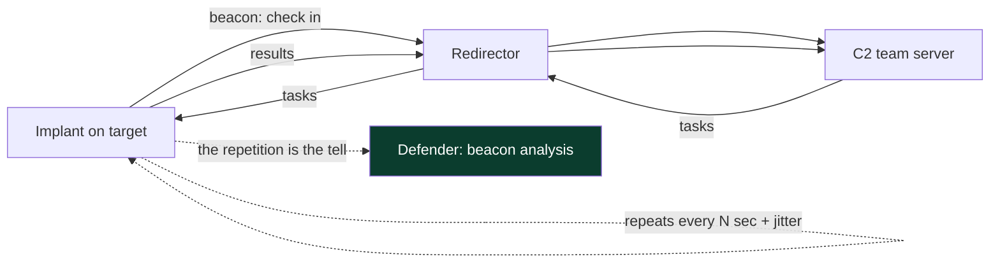

**Blue-team framing up front:** the working question for the whole chapter is *"this channel has to repeat — how do I find the repetition despite the operator's attempts to hide it?"* Answer that with timing analysis, fingerprinting, and reputation, and you catch C2 regardless of protocol. **On bug bounty, honestly:** there is no web-app-bounty angle to C2; the genuine arenas are network detection engineering, threat hunting, malware/network forensics, and the defensive/CTF blue-team space — where the inline notes and practice section point.

## Part 1: What a C2 Channel Is — the Agent/Server Model

At its simplest, C2 is a **client-server system where the roles are inverted from normal software**: the "server" the operator runs (the **team server** / **C2 server** / **listener**) waits, and the compromised host runs a **client** (the **agent** / **implant** / **beacon**) that reaches *out* to the server. This outbound orientation is deliberate and important: most networks allow outbound connections (a workstation browsing the web) far more freely than inbound ones, so an implant that *calls home* traverses firewalls that would block an inbound connection to the host. **Egress is the path of least resistance**, which is why virtually all modern C2 is outbound-initiated.

**Why outbound-initiated, in more detail.** Think about a typical corporate network's firewall posture. **Inbound** connections (from the internet to an internal host) are heavily restricted — usually only a handful of published services (a web server, a VPN) accept inbound, and everything else is denied by default. **Outbound** connections (from an internal host to the internet) are far more permissive, because employees need to browse the web, use SaaS, and download updates. An attacker who has code running on an internal workstation therefore has a hard time receiving an *inbound* connection (the firewall blocks it) but an easy time making an *outbound* one (it looks like browsing). So the implant *initiates* the connection outward and the "server" waits — inverting the normal client/server roles. This single fact — **egress is permissive, ingress is restrictive** — shapes essentially all modern C2 design, and it is also the defender's opportunity: since all the C2 traffic is *egress*, controlling and inspecting egress (proxies, DNS monitoring, egress filtering) is where C2 defense concentrates.

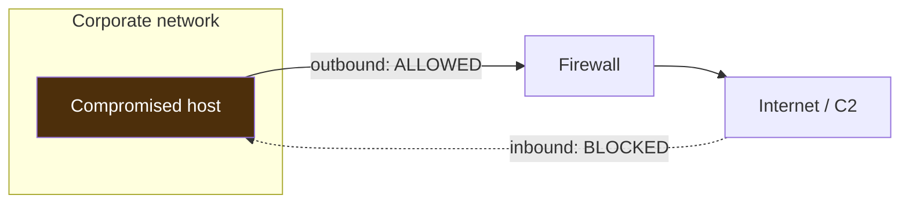

The core components, named from scratch:

- **Implant / agent / beacon** — the code running on the compromised host that executes the operator's tasks and reports results. "Beacon" specifically implies the *asynchronous, periodic* check-in style (Part 2). Implants range from a full-featured agent (file transfer, screenshots, pivoting) to a minimal stub.
- **Listener** — the component on the C2 side that accepts implant connections over a specific protocol/port (an HTTPS listener on 443, a DNS listener, etc.).
- **Team server** — the operator-facing server that manages implants, queues tasks, stores results, and (in team tools) lets multiple operators collaborate.
- **Redirector** — the disposable intermediary (Chapter 1) between implant and team server, so the target never talks to the team server directly.
- **Task / result** — the unit of work: the operator queues a task ("run this command," "download this file"), the implant fetches it on its next check-in, executes it, and returns the result on a subsequent check-in.

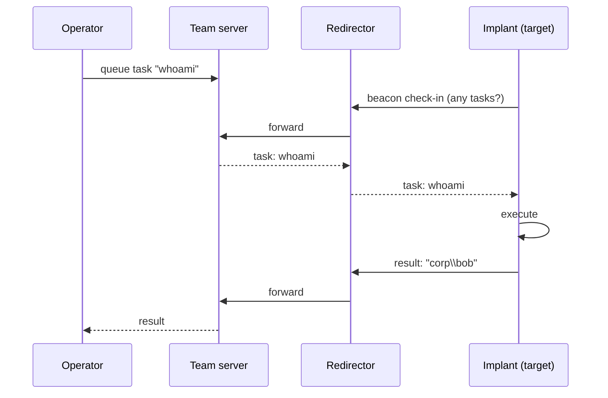

**The asynchronous model is key.** Unlike an interactive shell (a live, continuous connection — easy to spot and fragile), a beacon is **asynchronous**: it sleeps, wakes, checks in briefly, and sleeps again. The operator's commands wait in a queue until the next check-in. This trades *latency* (you might wait 60 seconds for a command to run) for *stealth and resilience* (there is no long-lived connection to notice, and a dropped check-in is harmless — the implant just tries again next interval). This asynchronous, sleep-wake rhythm *is* beaconing, and understanding it is the foundation of both operating and detecting C2.

### 1.1 Interactive Shells vs Beacons — Two Control Models

It clarifies beaconing to contrast it with its opposite, the **interactive shell**, because the trade-off between them is a foundational OPSEC decision.

- **Interactive / real-time shell** — a live, continuous connection (a reverse shell, an SSH session, a Meterpreter interactive session). The operator types and sees results instantly. **Pros:** fast, responsive, great for hands-on-keyboard work. **Cons:** a long-lived connection is easy to spot (a persistent socket to one destination), fragile (drops end the session), and unnatural (few benign apps hold a continuous connection to an odd host for hours).
- **Asynchronous beacon** — the sleep-wake model (Part 2). **Pros:** no long-lived connection, resilient to drops, blends with periodic web traffic, tunable stealth. **Cons:** latency — the operator waits up to one sleep interval for each command.

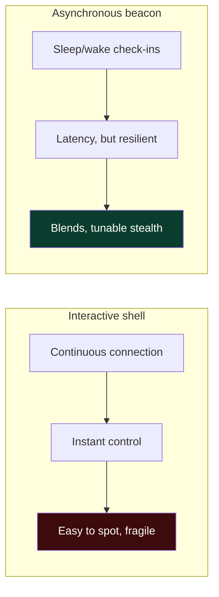

Operators often **use both at different phases**: a long-sleep beacon for patient, stealthy footholding, then — when they need to do fast interactive work (like exploring an unfamiliar system) — temporarily drop the sleep to near-zero (an "interactive" beacon) or open a short-lived shell, accepting the higher detection risk for the burst of speed, then returning to a long sleep. **Detection relevance:** that transition is itself a tell — a beacon that suddenly switches from a 1-hour sleep to constant check-ins produces a burst of regular, frequent traffic that stands out sharply against its prior quiet, so a defender watching interval *changes* over time (not just steady state) catches the moment the operator "goes loud." This is why good beacon analytics look at how a channel's rhythm *changes*, not only whether it is currently regular.

## Part 2: Beaconing — the Sleep/Jitter Rhythm

**Beaconing** is the defining behavior of modern C2: the implant repeatedly "phones home" at an interval to ask for tasks. Two parameters govern it, and both exist to fight detection:

- **Sleep (interval)** — how long the implant waits between check-ins. Short sleeps (seconds) give the operator near-interactive control but generate frequent, regular traffic (loud). Long sleeps (minutes to hours to days) are stealthy but slow to operate. Operators tune sleep to the phase — short during active tasking, long while idle.
- **Jitter** — random variation added to the sleep interval so check-ins are *not* perfectly periodic. A 60-second sleep with 30% jitter checks in every 42–78 seconds instead of exactly every 60. This directly attacks the single most powerful beacon-detection signal: **perfect periodicity.**

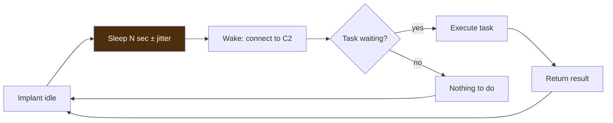

Why jitter matters so much: a naive beacon with a fixed 60-second sleep produces connections at times that, plotted, form a perfectly even comb — a signal no benign software produces so cleanly, and one that beacon-analysis tools (Part 8) detect trivially by measuring the *regularity* of inter-connection intervals. Jitter smears the comb, raising the analysis difficulty. But — the chapter's core tension — **jitter cannot eliminate the underlying repetition**, only obscure its exact timing; over enough check-ins, statistical analysis of the interval distribution still reveals a beacon even with heavy jitter, because the traffic is still *fundamentally periodic within a bounded window* and still goes to the *same destination*. This is why timing analysis plus destination consistency, not timing alone, is the durable detection.

**Additional beacon-shaping parameters** operators tune, each with a detection mirror:

| Parameter | Operator goal | Detection mirror |
|---|---|---|
| Sleep interval | control latency vs noise | frequency of connections to one dest |
| Jitter % | break perfect periodicity | interval-distribution regularity |
| Data jitter | vary request/response sizes | uniform small request sizes |
| Kill date | auto-stop after engagement | (housekeeping, not a tell) |
| Working hours | only beacon in business hours | off-hours beaconing stands out |
| Max retries / fallback | survive C2 outage | fallback to secondary infra |

**The takeaway:** every beacon parameter is a move in the detection game — sleep and jitter trade control against stealth, and none of them removes the two invariants a defender keys on: *the traffic repeats* and *it goes to the same place.*

### 2.1 The Math of Beacon Detection — Why Repetition Wins

It is worth making the detection side quantitative, because "jitter hides the beacon" is a myth that a little math dispels, and understanding *why* makes you a better detector (and a more honest operator about your own detectability). Beacon detection reduces to a simple question: **are the inter-connection intervals between one source and one destination more regular than random traffic would be?**

Consider the intervals between consecutive check-ins. For a fixed-sleep beacon (no jitter), every interval is identical — the standard deviation is ~0, a signal no human-driven or event-driven traffic produces. Add 30% jitter to a 60-second sleep and intervals fall in 42–78s: the mean stays ~60s and the standard deviation is small relative to the mean. Compare that to genuinely bursty human traffic (browsing), where intervals range from milliseconds to minutes with huge variance. The discriminator is the **coefficient of variation** (std-dev ÷ mean) and related measures of regularity:

| Traffic type | Interval pattern | Coefficient of variation | Beacon score |
|---|---|---|---|
| Fixed-sleep beacon | identical | ~0.0 | very high |
| Jittered beacon (30%) | bounded around mean | low (~0.1–0.2) | high |
| Update checker (benign beacon) | regular (hourly/daily) | low | high — needs whitelist |
| Human browsing | wildly variable | high (>1.0) | low |
| Event-driven app | irregular bursts | high | low |

RITA and similar tools compute a **beacon score** by combining the regularity of *intervals*, the consistency of *data sizes*, and the *number of connections* (more connections = more statistical confidence). The key insight: **more check-ins make a beacon easier to detect, not harder** — every additional interval tightens the statistical picture. So an operator using a long sleep to *reduce the number of connections* is trading operational speed for lower detectability, while an operator who beacons frequently for interactivity is easy to catch. This is the quantitative version of the chapter's tension, and it explains why real advanced operators use very long sleeps (hours) when idle: not because it hides any single connection, but because it starves the statistical analysis of samples.

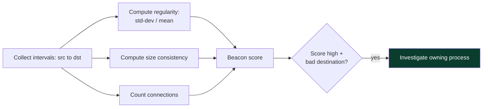

**The honest limit for defenders:** benign software *also* beacons regularly (update checkers, telemetry, monitoring agents, NTP), so a high beacon score is a *lead*, not a verdict — you must whitelist known-good beacons and enrich with destination reputation and the owning process. The art is separating the malicious regular beacon from the thousands of benign ones, which is why beacon analysis is always paired with reputation and host context.

## Part 3: C2 Channel Protocols

C2 can ride almost any protocol that crosses the network boundary; the choice is an OPSEC decision about what blends into the target's normal traffic. We cover the main channels and their trade-offs.

**HTTP/HTTPS (the workhorse).** The most common C2 channel because web traffic is ubiquitous and usually allowed outbound. The implant makes HTTP(S) requests to the C2 (disguised as normal web browsing); tasks and results are hidden in URLs, headers (cookies), or bodies. HTTPS adds encryption so the *content* is opaque to inspection — but the *metadata* (destination, timing, certificate, TLS fingerprint) remains visible, which is where detection lives. **Detection:** beacon timing to a destination, TLS fingerprinting (JA3/JARM), certificate anomalies, destination reputation/category, and (if TLS is intercepted) content signatures.

**DNS.** The implant encodes data into DNS queries (e.g. `<encoded-data>.attacker-domain.com`) and receives tasks in DNS responses (TXT/A records). DNS is powerful because it is *almost never blocked* and often not deeply inspected — even in networks that proxy all web traffic, DNS resolves. But it is **low-bandwidth and noisy in a distinctive way**: exfiltrating data over DNS produces many long, high-entropy subdomain lookups to one domain. **Detection:** high volume of DNS queries to one domain, unusually long/entropic subdomains, high NXDOMAIN rates, TXT-record-heavy traffic — DNS analytics catch this well.

**SMB / named pipes (internal / peer-to-peer).** For *lateral* C2 inside a network, implants can talk to each other over **SMB named pipes** rather than each beaconing out separately — one host is the egress point, and others chain their C2 through it over internal SMB. This reduces the number of hosts making external connections. **Detection:** anomalous named-pipe creation (Sysmon Event ID 17/18), unusual internal SMB connections between workstations, and known default pipe names (which operators customize, and defenders hunt).

**Cloud / legitimate services.** C2 over trusted third-party services — a cloud storage bucket, a collaboration platform's API, a pastebin, a social-media API — so the traffic goes to a high-reputation domain that is hard to block without breaking business. **Detection:** anomalous use of a service by an unexpected process, timing patterns, and volume anomalies; the destination reputation is useless here, so behavioral analysis carries the load.

**ICMP and other covert channels.** Data tunneled in ICMP echo payloads or other protocols — niche, low-bandwidth, used where other egress is blocked. **Detection:** unusual ICMP payload sizes/volume.

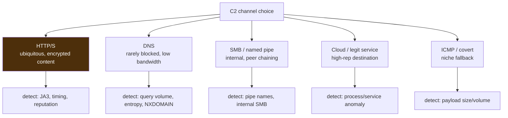

**The unifying detection insight across all protocols:** no matter the carrier, C2 must (a) repeat and (b) reach a controller, so the durable detections are *timing/volume anomalies* and *destination analysis*, which are protocol-agnostic. Protocol-specific signatures (JA3, DNS entropy, pipe names) are valuable additions, but the timing-and-destination invariants are what catch even a novel channel.

### 3.1 DNS as a C2 Channel — the Detail

DNS C2 deserves a closer look because it is both powerful and distinctively detectable, and because it recurs in real high-end intrusions. The mechanism exploits that **DNS resolution is nearly always allowed** and that the *client* controls the queried name. The implant encodes outbound data into the **subdomain labels** of queries to an attacker-controlled authoritative domain, and the C2 encodes tasks into the **responses** (TXT, CNAME, or A records).

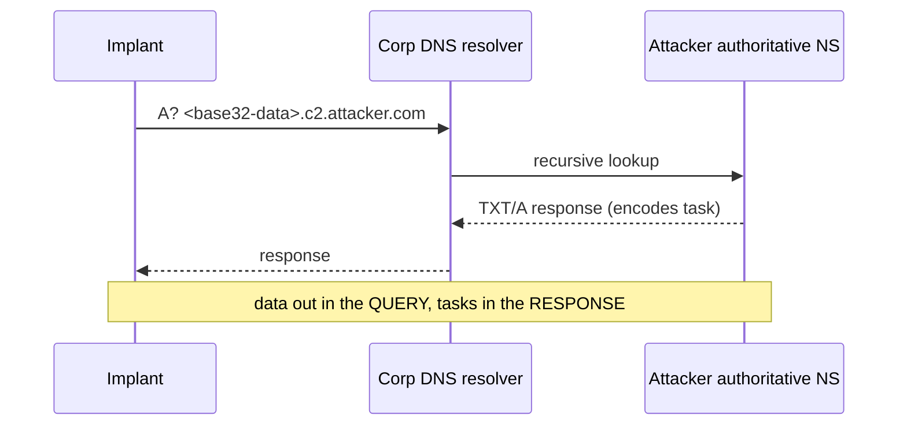

The costs that make it detectable:
- **Bandwidth is tiny.** A DNS label is ≤63 chars and a name ≤253, so each query carries only a few dozen bytes. Exfiltrating a megabyte means *thousands* of queries — a volume spike to one domain.
- **The names look wrong.** Encoded subdomains are long, high-**entropy** (random-looking base32/base64), and numerous — nothing like the short, dictionary-word names of normal DNS.
- **Distinctive record use.** Heavy TXT-record queries, or high **NXDOMAIN** rates (from encoding schemes that query non-existent names), stand out.

| DNS C2 tell | Why it happens | Detection metric |
|---|---|---|
| High query volume to one domain | low per-query bandwidth | queries/domain/host over time |
| Long, high-entropy subdomains | encoded data in labels | label length + Shannon entropy |
| TXT-record heavy | responses carry tasks | TXT query ratio |
| High NXDOMAIN | encoding queries junk names | NXDOMAIN rate per host |
| Steady periodicity | it's still a beacon | interval regularity (Part 2.1) |

**Detection in practice:** Zeek's `dns.log` plus analytics that flag per-host, per-domain query volume, mean subdomain length, and subdomain entropy will surface DNS tunneling clearly — it is one of the more reliable C2 detections precisely because the bandwidth constraint *forces* a loud volume signature. **Hardening:** force all clients through internal resolvers you log, block direct outbound port-53, monitor for the entropy/volume tells, and block newly-registered authoritative domains. **The lesson consistent with the whole chapter:** DNS defeats naive egress blocking (great for the operator) but *creates* a distinctive volume-and-entropy signature (great for the defender) — the tell moved, it did not disappear.

### 3.2 Legitimate-Service C2 and Domain Fronting

The hardest C2 to block is C2 that rides a service the organization *cannot* block without breaking business — and this deserves its own note because it inverts the usual "block bad destinations" defense.

- **Legitimate-service (Web-service) C2** — the implant communicates via a widely-used third-party API: a cloud-storage service, a code-hosting platform, a document/collaboration API, a pastebin, or a social-media API. Tasks and results are written to and read from that service (e.g. the operator leaves tasks in a shared document; the implant polls it). The traffic goes to a **high-reputation, business-critical domain**, so reputation- and category-based blocking is useless — you cannot block the cloud provider your company runs on.
- **Domain fronting (largely mitigated)** — historically, an implant could send TLS with an outer SNI of a high-reputation CDN domain but an inner `Host` header pointing to the operator's server behind the same CDN, so the connection *appeared* to go to the trusted domain. Major CDNs have since restricted this, but it illustrates the goal: borrow a trusted destination's reputation.

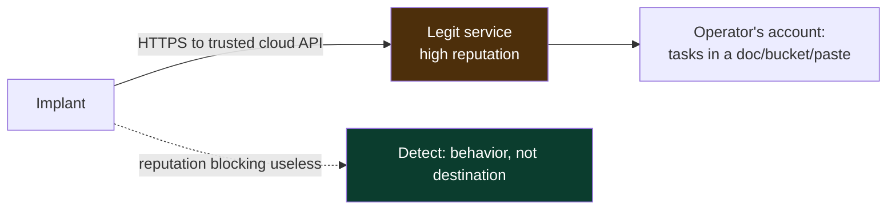

**Detection when reputation fails:** because the destination is trusted, detection shifts entirely to **behavior and context** — *which process* is using the cloud API (a browser and the official client are expected; `notepad.exe` or an unknown process is not), the *timing* (is it beaconing-regular?), the *volume and pattern* (polling a document every 60 seconds is not how humans use it), and *whether that service is normally used by that host/user at all*. This is the clearest case in the whole chapter where **destination analysis is worthless and behavioral + host-process analysis carries the entire load** — a reminder that no single detection angle suffices, and that the owning-process correlation (from the previous notebook) is often the decisive one. **Hardening:** where feasible, restrict which processes may reach sensitive cloud APIs, and apply CASB/DLP controls that understand the *content and pattern* of service use rather than just the destination.

## Part 4: Staged vs Stageless Delivery

A C2 payload can be delivered **staged** or **stageless**, a distinction from the previous notebook that has direct C2 and detection implications.

- **Stageless (single-stage)** — the full implant is delivered in one package. Larger initial payload, but no follow-up download — nothing extra to catch on the network at delivery time. Once it runs, it beacons.
- **Staged (multi-stage)** — a tiny **stager** is delivered first, whose only job is to connect to the C2 and download the full implant ("stage 2") into memory, then execute it. Smaller initial footprint (useful where payload size is constrained, e.g. a limited exploit), but it generates a **distinctive stage-download** — a small stub reaching out and pulling a larger blob — which is a detection opportunity at delivery time.

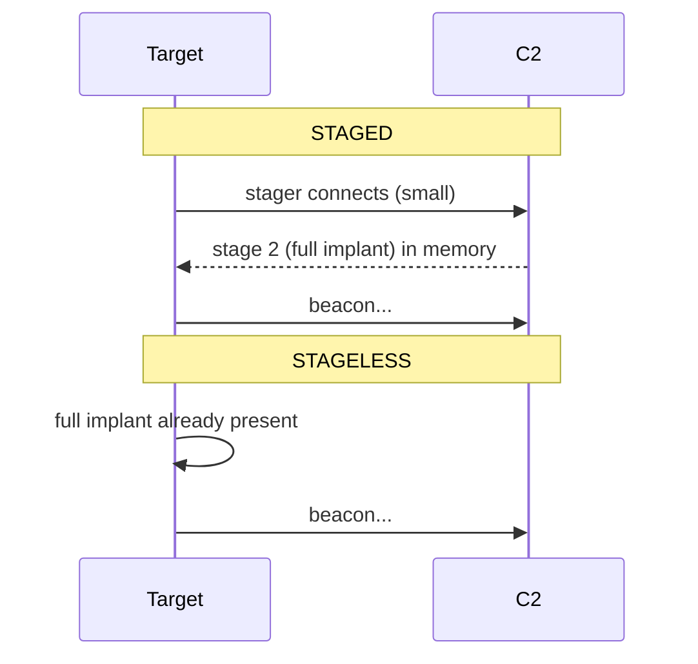

**Detection difference:** the staged model's stage-0 download is a network event a defender can catch (a fresh process making an outbound request that pulls executable content), and the classic stager patterns (e.g. a small HTTP GET returning shellcode) are well-signatured. Stageless avoids that specific event but ships a larger initial payload that is more exposed to the *static* surface (the previous notebook's Chapter 3). **The trade-off mirror:** staged reduces initial size at the cost of a network stage-download tell; stageless avoids the download tell at the cost of a bigger, more scannable initial artifact — another instance of "you move the tell, you don't remove it."

## Part 5: Redirectors and Infrastructure Resilience

Chapter 1 introduced redirectors; here is the operational detail, because redirector design is the core of C2 infrastructure OPSEC. A **redirector** is a lightweight server (often just an Apache/Nginx reverse proxy or a `socat` relay) that sits between the target and the real team server and forwards traffic. Its jobs:

- **Hide the team server.** The target only ever connects to the redirector's IP/domain; the team server's real address is never exposed, so burning the redirector (blocking its IP) does not reveal or lose the team server.
- **Filter traffic.** A good redirector only forwards traffic that matches the expected C2 profile (right URIs, headers, user-agent) and sends everything else (a curious analyst, a scanner) to a **decoy** — often a real, benign website — so the infrastructure looks innocuous when investigated.
- **Enable rotation.** Multiple redirectors point at one team server; when one is burned, you spin up another and update the implants' fallback, without touching the team server.

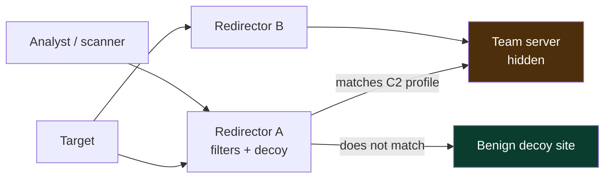

**Categorized domains and traffic blending** (Chapter 1) layer on top: the redirector's domain is aged and categorized as benign so web filters allow it, and the C2 traffic is shaped (Part 6) to look like normal browsing to that domain. **Blue-team relevance:** redirectors are why "block the C2 IP" is a temporary win — the operator rotates — and why durable detection focuses on the *behavior* (beaconing) and the *endpoint* (the implant) rather than any single network indicator. Chasing IPs is whack-a-mole; detecting the beacon pattern and hunting the implant on the host is durable.

## Part 6: Malleable C2 Profiles — Shaping the Traffic

The most sophisticated blending comes from **malleable C2 profiles** — configuration that lets an operator define *exactly what the C2 traffic looks like on the wire*, so it mimics a legitimate application's traffic. This is a signature-defeating tool: instead of a framework's default (well-known, signatured) traffic, the operator makes their beacon's HTTP requests look like, say, normal traffic to a specific web service.

A profile controls things like:
- **URIs and parameters** — the paths the beacon requests (`/api/v2/updates` instead of a default `/submit.php`).
- **Headers** — user-agent, cookies, custom headers, so the request matches a real browser or app.
- **Data transforms** — how tasks/results are encoded and *where* they are placed (in a cookie, a header, a base64 body, appended to an image).
- **Server response** — what the C2 returns, shaped to look like a legitimate response (a real-looking HTML page or JSON, with the actual task data hidden inside).
- **Certificate and JARM** — the TLS certificate and handshake characteristics, to avoid default fingerprints.

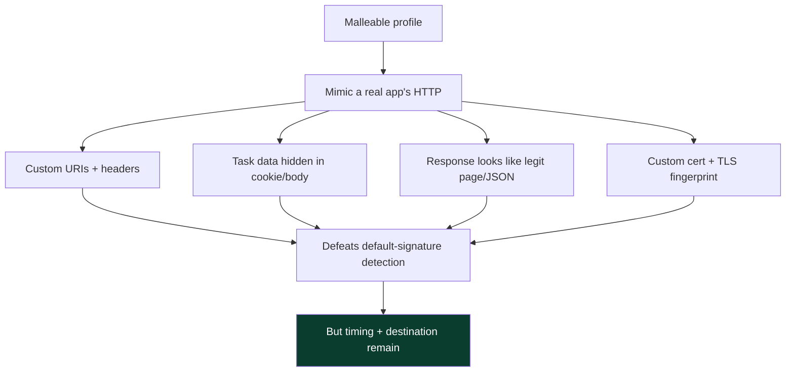

**The recurring limit:** a malleable profile can make each *individual request* look legitimate, defeating content and default-signature detection — but it **cannot change that the requests repeat and go to the same destination.** So even a perfectly profiled beacon is caught by timing/beacon analysis and destination reputation. This is the single most important thing to understand about C2 detection: **content-level blending is strong, but the behavioral invariants (periodic contact to a consistent controller) are what durable detection targets, and profiles cannot erase them.** Defenders who over-invest in content signatures and under-invest in beacon/timing analysis are fighting the wrong battle.

### 6.1 JA3, JA3S, and JARM — TLS Fingerprinting Explained

Because so much C2 rides HTTPS and encrypts its content, defenders lean heavily on **TLS metadata fingerprinting**, and understanding it is essential to C2 detection. When a TLS connection is established, the client and server exchange handshake messages *before* encryption begins, and the exact way each side constructs those messages — cipher suites offered, extensions, elliptic curves, versions, in a specific order — is characteristic of the *software* making the connection.

- **JA3** — hashes the **client's** TLS ClientHello fields (version, cipher list, extensions, curves) into a short fingerprint. Two connections made by the same client library produce the same JA3, so a specific C2 framework's default TLS stack has a recognizable JA3. Defenders maintain lists of known-malicious JA3 hashes.
- **JA3S** — the same idea for the **server's** ServerHello. Combined with JA3, a JA3/JA3S pair fingerprints both ends of a conversation.
- **JARM** — an **active** fingerprint: a scanner sends a series of crafted ClientHellos to a server and hashes how it responds. JARM lets defenders scan the internet and fingerprint C2 *team servers* by how their TLS stack behaves — which is how public projects track exposed Cobalt Strike/Sliver servers.

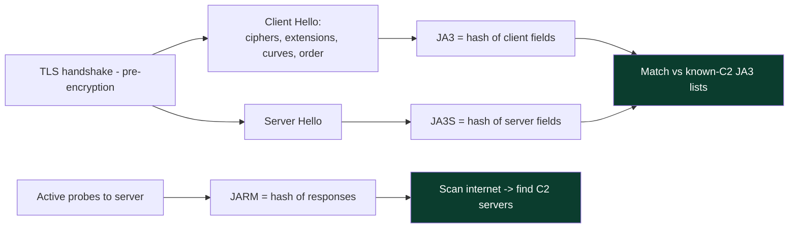

**The operator's counter and its limit:** frameworks let operators customize the TLS stack (cipher order, extensions, custom certs) to change their JA3/JARM away from the known defaults — so JA3 detection catches the lazy but not the careful. **But** even a customized JA3 is *a* fingerprint, and an *unusual* JA3 that matches no common browser or application, appearing on egress traffic, is itself suspicious — rarity is a signal even when the specific hash is unknown. And JARM scanning still finds servers whose operators did not fully customize. **The consistent theme:** fingerprint customization moves the operator off the known-bad list but rarely makes them look *exactly* like a common client, so fingerprint *rarity* plus the behavioral (timing) and destination signals still converge. Defenders should track both known-bad JA3s *and* rare/anomalous JA3s on egress.

### 6.2 Pivoting and Peer-to-Peer C2

In a segmented network, not every compromised host can reach the internet — internal servers often have no direct egress. C2 solves this with **pivoting**: a host that *does* have egress acts as a gateway, and internal implants route their C2 *through* it, so only one host makes external connections and the internal ones use internal protocols.

- **SOCKS proxy pivoting** — the implant on the egress host opens a proxy; the operator tunnels tools through it to reach internal systems as if local.
- **Peer-to-peer (SMB/TCP) C2** — internal implants link to a parent implant over **SMB named pipes** or raw TCP, forming a chain; only the parent egresses. This dramatically reduces external connections (fewer beacons leaving the network) at the cost of internal lateral connections.

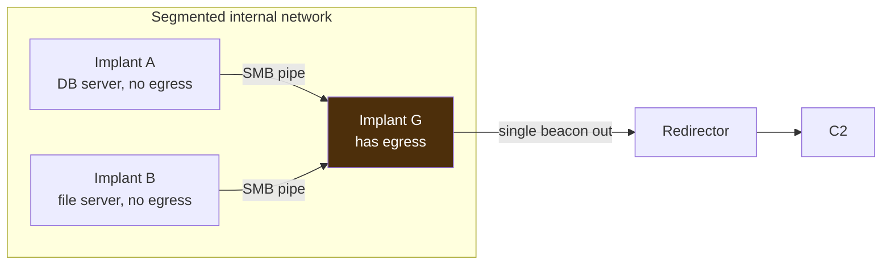

**Detection — the tell moves internal:** peer C2 reduces *external* beaconing but creates *internal* anomalies — workstation-to-workstation or server-to-workstation SMB connections that never normally happen, and named-pipe creation/connection events (Sysmon Event IDs 17/18), often with characteristic default pipe names (which operators rename, and defenders hunt). **Blue-team relevance:** this is why internal (east-west) network monitoring and named-pipe telemetry matter — an org that only watches its egress is blind to peer C2, which is exactly why operators use it in well-monitored perimeters. The invariant holds: reducing the external tell creates an internal one.

### 6.3 Exfiltration Over the C2 Channel

The objective of many operations is data theft, and the C2 channel is the natural exfil path (ATT&CK **T1041**, "Exfiltration Over C2 Channel") because it is already established, encrypted, and blended. But exfil has a property that beaconing does not: **volume.** Command-and-control check-ins are small; moving gigabytes of stolen data is large, and that volume is a detection opportunity.

- **Exfil over C2 (T1041)** — data leaves over the same channel as tasking. Blends with C2 but the *size* of the transfer breaks the small-uniform-request pattern of a beacon.
- **Exfil over an alternate channel (T1567)** — a separate upload to a cloud/web service, to avoid inflating the C2 channel. Trades blending for a separate, possibly high-reputation destination.

Operators mitigate the volume tell by **throttling** (drip data slowly over long periods), **chunking** (many small transfers spread across check-ins), and **compressing/encrypting** first (smaller, opaque). Each mitigation has a mirror: throttling extends the operation (more time to detect), chunking keeps the beacon regular (still detectable by timing), and a sudden compression/archive step on the host is itself a signal.

| Exfil tactic | Operator goal | Detection |
|---|---|---|
| Bulk over C2 | speed | egress volume spike to C2 dest |
| Throttled/drip | avoid volume spike | sustained abnormal egress over time |
| Chunked over beacons | blend with C2 | larger-than-normal beacon responses |
| Alternate channel (cloud) | avoid C2 inflation | upload to unusual service by odd process |
| Compress/encrypt first | smaller, opaque | archive creation on host (Sysmon/EDR) |

**The detection doctrine for exfil:** watch **egress volume per host/destination** for anomalies (a workstation uploading gigabytes is abnormal), correlate with the C2 beacon (same destination suddenly moving volume), and watch the host for staging (mass file access, archive creation) that precedes exfil. **The chapter's tension one last time:** the data *must* leave, and leaving is volume, and volume is visible — the operator can slow and split it, but cannot make the bytes not traverse the boundary.

## Part 7: The C2 Framework Landscape (Capability Overview)

Operators rarely build C2 from scratch; they use **frameworks**. Understanding the major ones at a *capability* level (not as operating instructions) helps you recognize their telemetry and defaults during IR and detection. All are dual-use — built for authorized testing and also abused — and all are heavily studied by defenders.

- **Metasploit / Meterpreter** — the classic open-source framework; Meterpreter is a full-featured implant. Ubiquitous, well-signatured (its defaults are detected everywhere), great for learning, less stealthy for real red-team work precisely because it is so well-known.
- **Cobalt Strike** — the long-dominant commercial red-team platform; its implant is **Beacon**, and it pioneered malleable C2 profiles and a mature operator workflow. Extremely well-studied by defenders (JARM/JA3 signatures, default profile detections, named-pipe defaults), and also widely abused by criminals (cracked versions), which means its indicators are exhaustively documented — a defender's advantage.
- **Sliver** — a modern open-source framework (Go), popular as a Cobalt Strike alternative; cross-platform implants, multiple protocols (mTLS, HTTP/S, DNS, WireGuard). Increasingly seen in real intrusions, with growing detection coverage.
- **Mythic** — an open-source, modular framework with a plugin architecture for many different agents/profiles, favored for flexibility and research.
- **Others** — Havoc, Brute Ratel (commercial), Empire (PowerShell/Python, historically significant), Covenant (.NET). Each has a characteristic implant style and default fingerprints.

| Framework | Type | Implant | Notable |
|---|---|---|---|
| Metasploit | open-source | Meterpreter | ubiquitous, well-signatured |
| Cobalt Strike | commercial | Beacon | malleable profiles, most-studied |
| Sliver | open-source | sliver | Go, multi-protocol, modern |
| Mythic | open-source | modular | plugin agents/profiles |
| Empire | open-source | PS/Python | historically significant |

**A note on fallback and resilience (T1008).** Serious implants carry **fallback channels**: if the primary C2 is unreachable (redirector burned, network blocked), the implant tries a secondary — a different domain, a different protocol (fall back from HTTPS to DNS), or a long-haul low-and-slow channel. This is why "block the C2 domain" rarely ends an intrusion — the implant fails over. **Detection relevance:** the *fallback attempts themselves* are a tell (a host trying multiple unusual destinations after one is blocked), and comprehensive egress logging catches the pivot to the secondary channel. The defensive lesson: when you block a C2, *watch the host* for its fallback rather than assuming the block ended it.

**Detection relevance:** every framework ships **defaults** — default TLS certs, JARM/JA3 fingerprints, named pipes, HTTP profiles, sleep behaviors — that defenders signature. Operators customize these (malleable profiles, custom certs) to evade default detection, which is exactly why default-signature detection and behavioral (beacon/timing) detection must be layered: defaults catch the lazy, behavior catches the careful. **Threat-intel resources** like the openly-published JARM/JA3 fingerprint databases, Cobalt Strike beacon-config extractors, and C2 tracking projects (that scan the internet for exposed team servers) are the defender's toolkit here.

### 7.1 Recognizing Framework Defaults in Telemetry

A practical detection skill is recognizing the *default artifacts* frameworks leave when operators do not (or cannot fully) customize them — and a surprising amount of real-world C2 uses near-default configurations because customization takes effort and expertise. Categories of default artifacts, with the caveat that specific values change over versions and operators do customize:

- **Default named pipes** — many frameworks use characteristic default pipe-name patterns for peer/SMB C2 and for internal operations; SOC Sysmon configs ship rules for the well-known ones. Operators rename them, so rare/unusual pipe names are also worth flagging.
- **Default TLS certs and JA3/JARM** — out-of-the-box self-signed certificates with tell-tale fields, and default JA3/JARM fingerprints published in threat-intel feeds.
- **Default HTTP profiles** — default URIs, user-agents, and response bodies that predate malleable-profile customization; these are heavily signatured (which is why the frameworks added malleable profiles in the first place).
- **Default ports and staging behavior** — default listener ports and default stager patterns.
- **Watermarks / config** — some frameworks embed a numeric watermark or a recoverable config in the beacon; defender tooling (beacon-config extractors) pulls the C2 profile straight out of a captured sample, which is a rich IOC source.

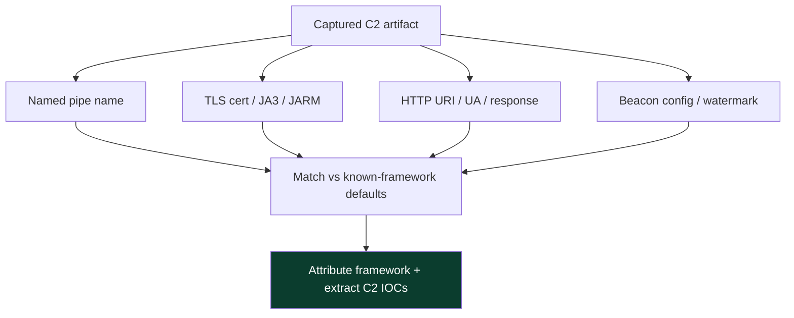

**The two-sided lesson:** default-artifact detection is high-fidelity but *evadable* (customize everything), so it catches the less-sophisticated operator and the commodity-malware crews who use cracked frameworks as-is (a large fraction of real intrusions). The sophisticated operator who customizes every default is then caught by the *behavioral* invariants (timing, destination, host process) that customization cannot touch. **This is why a mature C2-detection program runs both:** signature the defaults to catch the many, and analyze behavior to catch the few — the same layered doctrine as every other topic in these notebooks.

## Part 8: Hands-On Lab — Simulating and Detecting a Beacon (Benign)

This lab is entirely benign and self-contained: you run a tiny Python "beacon simulator" that makes periodic HTTPS requests to a *local* server you also run, then analyze the traffic to *detect the beacon* — the exact workflow a network defender uses, practiced with zero malicious code and no remote control. Nothing here is an implant; it is a stand-in that produces the *timing pattern* so you can learn to find it.

### Step 0 — Tools (from scratch)

- **Python 3** — for the benign beacon simulator and a local server.
- **Zeek** — the open-source network-analysis framework (formerly Bro); turns packet captures into rich connection logs (`conn.log`, `dns.log`, `ssl.log`). The standard for network detection engineering.
- **RITA** (Real Intelligence Threat Analytics) — a free tool that analyzes Zeek logs specifically for **beaconing** (regular connection intervals) and other C2 indicators. This is the star of the lab.
- **tshark/Wireshark** — packet inspection.

```bash
sudo apt update && sudo apt install -y zeek tshark python3
# RITA: install per its GitHub instructions (needs MongoDB); or use the docker image
```

### Step 1 — A benign beacon simulator

This makes an HTTPS request every ~30 seconds with jitter, to a local server. It is a *timing* stand-in — no tasks, no control, no payload:

```python
#!/usr/bin/env python3
# BENIGN beacon SIMULATOR — periodic local HTTPS requests to study timing. Not an implant.
import time, random, urllib.request, ssl
ctx = ssl.create_default_context(); ctx.check_hostname=False; ctx.verify_mode=ssl.CERT_NONE
SLEEP, JITTER = 30, 0.3            # 30s interval, 30% jitter
for i in range(40):
    try:
        urllib.request.urlopen("https://127.0.0.1:8443/api/v2/updates", context=ctx, timeout=5)
    except Exception:
        pass
    wait = SLEEP * (1 + random.uniform(-JITTER, JITTER))   # 21s..39s
    print(f"check-in {i} at {time.strftime('%H:%M:%S')}, next in {wait:.1f}s")
    time.sleep(wait)
```

```bash
# Run a throwaway local HTTPS server in one terminal (self-signed, benign)
openssl req -x509 -newkey rsa:2048 -keyout k.pem -out c.pem -days 1 -nodes -subj "/CN=localhost"
python3 -c "import http.server,ssl,socketserver; \
h=http.server.SimpleHTTPRequestHandler; s=socketserver.TCPServer(('127.0.0.1',8443),h); \
s.socket=ssl.wrap_socket(s.socket,certfile='c.pem',keyfile='k.pem',server_side=True); s.serve_forever()"
```

### Step 2 — Capture the traffic

```bash
# In another terminal, capture loopback while the simulator runs
sudo tshark -i lo -w beacon_lab.pcap -a duration:1200   # ~20 min = 40 check-ins
```

### Step 3 — Turn packets into Zeek logs

```bash
zeek -r beacon_lab.pcap
ls   # conn.log  ssl.log  ...
# Look at connection timing to the destination
cat conn.log | zeek-cut ts id.orig_h id.resp_h id.resp_p duration | head
```

Realistic (abbreviated) `conn.log` view — note the near-regular timestamps:

```
1706... 127.0.0.1 127.0.0.1 8443 0.03
1706...(+34s) 127.0.0.1 127.0.0.1 8443 0.03
1706...(+27s) 127.0.0.1 127.0.0.1 8443 0.03
1706...(+38s) 127.0.0.1 127.0.0.1 8443 0.03
```

The inter-connection gaps cluster around 30s ± jitter — the beacon fingerprint. Even with jitter, the *destination is constant* and the *intervals are bounded and centered*, which is exactly what beacon analysis keys on.

### Step 4 — Detect the beacon with RITA

```bash
rita import conn.log beacon_lab
rita show-beacons beacon_lab
```

Realistic (abbreviated) RITA output:

```
Score   Source      Destination   Connections  Avg Interval  Interval Skew
0.94    127.0.0.1   127.0.0.1     40           30.2s         0.11
```

RITA assigns a **beacon score** (near 1.0 = strongly periodic). Our simulator scores high because, despite jitter, its check-ins are statistically regular to one destination over many connections. **This is the whole lesson:** jitter lowers the score somewhat but cannot hide a beacon from interval analysis over enough samples — the invariant (repetition to a consistent destination) survives the obfuscation. On real traffic, you'd triage high-scoring src→dst pairs by destination reputation and the owning process.

### Step 5 — Add the fingerprint and destination angles

```bash
# TLS fingerprint (JA3) and cert details from ssl.log — default tools have known JA3/certs
cat ssl.log | zeek-cut ts id.resp_h server_name subject | head
# On real data: enrich destination with reputation/category; check JA3 against known-C2 lists
```

**The lab's compounded lesson:** three independent angles converge on a beacon — **timing** (RITA beacon score), **TLS fingerprint** (JA3/JARM vs known-C2 databases), and **destination** (reputation/category/age). Any one can be evaded (jitter, custom certs, aged domains), but fusing all three catches C2 that defeats any single one — the multi-signal doctrine, now on the network.

### Step 6 — Detect a DNS beacon by entropy and volume (benign)

To practice the DNS side (Part 3.1), generate benign high-entropy DNS lookups to a domain you own or to a local resolver, then measure the tells. A benign generator (no tunneling tool, just lookups):

```python
#!/usr/bin/env python3
# BENIGN: emit high-entropy DNS-like lookups to study the detection signal. Resolves nothing real.
import socket, base64, os, time
for i in range(50):
    label = base64.b32encode(os.urandom(20)).decode().strip('=').lower()
    name = f"{label}.lab.example.invalid"   # .invalid never resolves -> NXDOMAIN, harmless
    try: socket.gethostbyname(name)
    except Exception: pass
    time.sleep(1)
```

Then compute the entropy/length signal a detector uses:

```python
# Measure mean subdomain length + entropy from a list of queried names (what Zeek dns.log feeds)
import math, collections
def entropy(s):
    c=collections.Counter(s); n=len(s)
    return -sum((v/n)*math.log2(v/n) for v in c.values())
names = ["mjuxg43...".split('.')[0]]  # in practice: pull leftmost label from dns.log
# High mean length (>20) + high entropy (>3.5) + many to one domain = DNS tunneling signal
```

Realistic interpretation: normal DNS labels are short dictionary words (`mail`, `www`, `api`) with entropy ~2.5–3.0 and length <10; tunneling labels are 20–63 chars of base32 with entropy >3.5. **The detection:** in Zeek's `dns.log`, group by second-level domain and per host, then flag domains with high mean label length, high entropy, high query count, and high NXDOMAIN rate — the DNS-tunneling fingerprint. This is one of the highest-fidelity C2 detections because, as Part 3.1 explained, the low bandwidth *forces* the loud volume signature.

### Step 7 — Correlate the beacon to its owning process (host side)

The network says "host X beacons to Y"; the host says "which *process* on X owns that connection." Correlate (benignly, on your lab host):

```bash
# Which process owns a given outbound connection (Linux)
sudo ss -tnp | grep 8443
# Windows equivalent: Get-NetTCPConnection + Sysmon Event ID 3 (network) with process
```

**The compounded lab lesson, now complete:** a high beacon score (RITA) + a bad/rare destination (reputation, JA3) + a suspicious owning process (injected, odd ancestry — the previous notebook) is a near-certain C2 verdict, and no single-signal evasion (jitter, custom cert, aged domain, injection) defeats the *fusion*. That fusion — network behavior + fingerprint + destination + host process — is the entire craft of C2 detection.

### Step 8 — Express a detection as a rule (benign, illustrative)

Detections become durable when written as portable rules. A benign, illustrative **Suricata** rule that alerts on a known-C2 JA3 hash on egress TLS (you would populate the hash from a threat-intel feed):

```
alert tls any any -> any any ( \
    msg:"Possible C2 - known framework default JA3"; \
    ja3.hash; content:"a0e9f5d64349fb13191bc781f81f42e1"; \
    threshold: type limit, track by_src, count 1, seconds 3600; \
    classtype:trojan-activity; sid:9000001; rev:1; )
```

And a Zeek/RITA-style hunting logic, expressed as pseudocode for a SIEM scheduled search:

```
# Pseudocode: flag beacon-like egress not on the allowlist
FROM conn.log
GROUP BY src_ip, dest_ip
WHERE connection_count > 20
  AND interval_coefficient_of_variation < 0.25   # regular
  AND dest_ip NOT IN known_good_beacon_destinations
  AND dest_domain_age_days < 30                   # newly registered
ENRICH WITH owning_process (Sysmon EID 3)
ALERT high IF owning_process is unsigned OR injected
```

**The point:** the JA3 rule catches the *default-config* operator cheaply; the beacon-hunting logic catches the *customized* operator behaviorally; and both defer the final verdict to the owning-process enrichment. Layer the cheap signature and the behavioral analytic, tune with the allowlist, and you have a durable C2 detection — the network analogue of the Sigma/Atomic loop from the previous notebook.

## Part 9: Detection & Defense Angle (Consolidated)

Because C2 must repeat and must reach a controller, durable detection targets those invariants and fuses multiple weak signals into strong verdicts.

**Network-behavioral (the durable core):**
- **Beacon/timing analysis** — tools like RITA (on Zeek logs), commercial NDR, and SIEM analytics score src→dst pairs by connection regularity. The single most durable C2 detection; jitter degrades but does not defeat it over time.
- **Destination analysis** — reputation, category, domain age (newly-registered/uncategorized domains), and known-C2 IOC feeds. Cheap first-pass filtering.
- **Volume/size analysis** — small, uniform request sizes; steady low-volume egress that never stops; or exfil-scale spikes.

**Fingerprinting:**
- **JA3 / JA3S / JARM** — TLS client/server/handshake fingerprints; default framework fingerprints are published — match egress against known-C2 fingerprint databases.
- **Certificate analysis** — self-signed, default, or anomalous certs on C2 destinations.
- **HTTP anomalies** — unusual user-agents, URIs, header patterns (when TLS is inspected).

**Protocol-specific:**
- **DNS analytics** — query volume to one domain, subdomain length/entropy, high NXDOMAIN, TXT-heavy traffic (DNS C2/exfil).
- **Named-pipe telemetry** — Sysmon Event IDs 17/18 (pipe create/connect), anomalous internal SMB (peer C2), known default pipe names.
- **Cloud/service anomalies** — unexpected process using a cloud API, timing patterns to a service.

**Host-side (ties to the previous notebook):**
- The process making the beacon: is it a normal browser, or `notepad.exe`/an injected process (Chapter 5)? Correlate network beacon with the *owning process's* legitimacy.
- Egress from unexpected processes; new autoruns/persistence launching the implant.

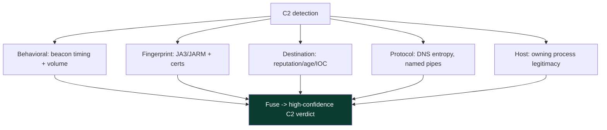

**Harden / reduce the C2 surface:**
- **Egress filtering** — restrict outbound to what business needs; force web through an inspecting proxy; block direct outbound DNS (force through internal resolvers you monitor). This alone breaks many naive C2 channels.
- **TLS inspection** where lawful/feasible — turns encrypted content back into an inspectable surface (and enables content signatures + JA3).
- **DNS monitoring/filtering** — inspect and rate-limit DNS; block newly-registered/uncategorized domains.
- **Proxy + category/reputation enforcement** — deny uncategorized and newly-seen domains by default.

**MITRE ATT&CK anchors:** **T1071** (Application Layer Protocol — .001 Web, .004 DNS), **T1090** (Proxy — redirectors), **T1573** (Encrypted Channel), **T1008** (Fallback Channels), **T1104** (Multi-Stage Channels), **T1568** (Dynamic Resolution), **T1041/T1567** (Exfiltration over C2 / web service).

| C2 aspect | Durable detection | ATT&CK |
|---|---|---|
| Beaconing | timing/interval analysis (RITA/NDR) | T1071 |
| HTTPS channel | JA3/JARM + destination reputation | T1071.001, T1573 |
| DNS channel | query volume/entropy/NXDOMAIN | T1071.004 |
| Redirectors | infra IOC + behavior (chase behavior, not IPs) | T1090 |
| Internal/peer C2 | named-pipe + internal SMB anomalies | T1071 |
| Staged delivery | stage-download network event | T1104 |
| Exfil over C2 | egress volume anomaly | T1041 |

## Part 9b: The C2 Detection Arms Race — an Evolution

Like every topic in these two notebooks, C2 and its detection co-evolved, and seeing the sequence makes the current detection stack coherent — each defensive advance pushed operators to a new blending technique that moved, but never erased, the tell.

```mermaid
flowchart LR
    A[Reverse shells<br/>continuous connection] --> B[Defenders: spot long-lived odd connections]
    B --> C[Beaconing<br/>async check-ins]
    C --> D[Defenders: fixed-interval detection]
    D --> E[Jitter + sleep tuning]
    E --> F[Defenders: statistical interval analysis - RITA]
    F --> G[Malleable profiles + custom certs]
    G --> H[Defenders: JA3/JARM + rarity + destination]
    H --> I[DNS / cloud / legit-service C2]
    I --> J[Defenders: DNS analytics, process-behavior, CASB]
    J --> K[Peer C2, long-haul, fallback]
    K --> L[Defenders: east-west + host-process correlation]
    style B fill:#0b3d2e,color:#fff
    style D fill:#0b3d2e,color:#fff
    style F fill:#0b3d2e,color:#fff
    style H fill:#0b3d2e,color:#fff
    style J fill:#0b3d2e,color:#fff
    style L fill:#0b3d2e,color:#fff
```

Read the green nodes top to bottom and you have the modern network-detection program, each layer added in response to an operator move: connection-based → interval-based → statistical → fingerprint → protocol-analytic → east-west/host-correlated. The strategic lesson, identical to the previous notebook's injection arms race: **do not chase individual frameworks or IOCs; instrument the invariants** — the channel repeats (timing), reaches a controller (destination/behavior), carries a fingerprint (JA3/JARM), and is owned by a process on a host (endpoint correlation). Cover those and the *next* framework or profile still trips them. And for the authorized operator, the mirror lesson: assume the invariants are watched, and understand that blending buys time and raises the analyst's cost, not true invisibility — which is why real operations lean on *patience* (long sleeps, low volume) as much as on any single evasion.

## Part 9c: Legitimate Beacons — the False-Positive Problem

The hardest part of C2 detection in practice is not finding beacons — it is finding the *malicious* beacon among the thousands of benign ones, because modern software beacons constantly:

- **Software update checkers** — poll for updates on a regular schedule.
- **Telemetry and analytics** — send usage data at intervals.
- **Monitoring/EDR agents** — check in with their management servers regularly (ironically, security tools are among the most beacon-like traffic on a network).
- **Cloud sync clients** — poll for changes.
- **Certificate/OCSP and time (NTP)** — periodic by design.
- **Push-notification and chat clients** — long-poll or heartbeat.

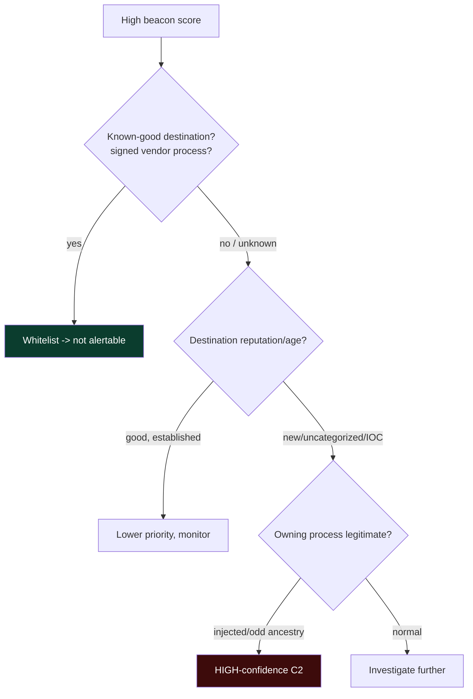

**The operational discipline:** build and maintain a **baseline/allowlist** of known-good beacons (by destination + owning process), so alerts fire only on the *unexplained* regular beacon. Without this baseline, beacon analysis is an alert firehose and gets ignored; with it, a high-scoring beacon to an unknown/new destination owned by a suspicious process is a crisp, high-confidence lead. This baselining work — unglamorous but essential — is what separates a functioning C2-detection program from a noisy one, and it is the network analogue of the "instrument invariants, but tune out benign" doctrine that runs through both notebooks.

## Part 10: Real-World Cases & Pitfalls

**Real-world grounding.** C2 is where offensive frameworks and real intrusions converge most visibly: cracked Cobalt Strike Beacon has been one of the most common tools in real-world intrusions for years, Sliver and other open-source frameworks appear increasingly in criminal and state operations, and DNS/cloud C2 recur in high-end campaigns precisely because they evade naive egress controls. The defensive response has matured in lockstep: beacon-analysis tooling (RITA and its commercial descendants), published JARM/JA3 fingerprint databases, internet-wide scanning that tracks exposed team servers, and beacon-config extractors that pull a Beacon's C2 profile out of a sample. The arms race mirrors the previous notebook exactly: operators blend the content (malleable profiles, custom certs, aged domains), defenders lean on the behavioral invariants (timing, destination) that blending cannot erase.

**Common pitfalls:**
- *Chasing IPs/domains instead of behavior.* Operators rotate redirectors; IOC-only detection is whack-a-mole. Detect the *beacon* and hunt the *implant*.
- *Trusting encryption to hide C2.* HTTPS hides content, not metadata — timing, destination, JA3, and cert remain. Metadata is where detection lives.
- *Relying on default-signature detection alone.* Malleable profiles and custom certs defeat defaults; you need behavioral analysis too.
- *Ignoring DNS.* Many networks proxy web but let DNS flow freely — a wide-open C2/exfil channel if unmonitored.
- *Beacon-analysis false positives.* Legitimate software beacons too — update checkers, telemetry, monitoring agents, RSS pollers. Baseline and whitelist known-good beacons before alerting.
- *No egress control.* Unrestricted outbound is C2's best friend; least-privilege egress breaks many channels for free.
- *Forgetting the host side.* A network beacon plus an illegitimate owning process (injected, odd ancestry) is a high-confidence verdict — correlate network and endpoint.
- *Only watching steady-state, not changes.* A channel that shifts from a long sleep to constant check-ins (operator going interactive) is a burst worth catching — analyze rhythm *changes*, not just current regularity.
- *No east-west visibility.* Peer/SMB C2 makes few external connections; an egress-only monitoring posture is blind to it. Watch internal SMB and named pipes.
- *Blocking the C2 and declaring victory.* Implants have fallback channels; after a block, watch the host for its pivot to secondary infrastructure and hunt the fleet for siblings.
- *Trusting high-reputation destinations blindly.* Legitimate-service C2 rides trusted domains where reputation is useless — behavioral and process context must carry the detection there.

**A note on the sensitivity of this topic.** C2 detection is a defensive, IR, and threat-hunting discipline; this chapter is written for that purpose and kept strictly benign and lab-scoped. If any of this is being read in the context of an actual suspected intrusion, the right move is to engage a qualified incident-response process (internal IR or a reputable IR firm) rather than to act alone — real intrusions involve evidence-preservation, legal, and containment decisions beyond the scope of a study chapter.

## Part 10b: An Investigation Walk-Through (Benign, Illustrative)

To make the detection doctrine concrete, here is how an analyst pieces together a C2 finding from fused signals — a benign, illustrative reconstruction of the reasoning:

```text
1. NDR/RITA flags: host 10.0.4.21 -> 185.x.x.x, beacon score 0.91,
   ~300 connections over 5h, mean interval 118s, low variance.
2. Destination enrichment: 185.x.x.x resolves to "cdn-updates[.]xyz",
   domain registered 9 days ago, category "uncategorized". <- suspicious
3. TLS: ssl.log shows a self-signed cert, JA3 matches a known framework
   default on threat-intel feed. <- suspicious
4. Host side: Sysmon EID 3 shows the connection is owned by
   "onedriveupdater.exe" running from C:\Users\...\AppData\Local\Temp
   with parent explorer.exe. Legit updater doesn't live in Temp. <- suspicious
5. Sysmon EID 8 earlier: a remote thread was created in that process. <- injected
Verdict: high-confidence C2 beacon from an injected/masqueraded process to a
newly-registered uncategorized domain with a known-C2 JA3. Isolate host,
capture memory, hunt the same beacon pattern + JA3 + domain across the fleet.
```

Notice how *no single signal* was conclusive but the **fusion** was overwhelming: a strong beacon score (timing) + a newly-registered uncategorized domain (destination) + a known-C2 JA3 (fingerprint) + a masqueraded, injected owning process (host). Each could have a benign explanation alone; together they are a near-certain compromise. And notice the response: not just "block the IP" (the operator would fail over), but **isolate the host, capture memory, and pivot the hunt** across the fleet on the durable indicators (beacon pattern, JA3, domain) — because other hosts likely carry the same implant. This fused, host-plus-network, hunt-the-pattern approach is the entire craft of C2 detection distilled into one investigation.

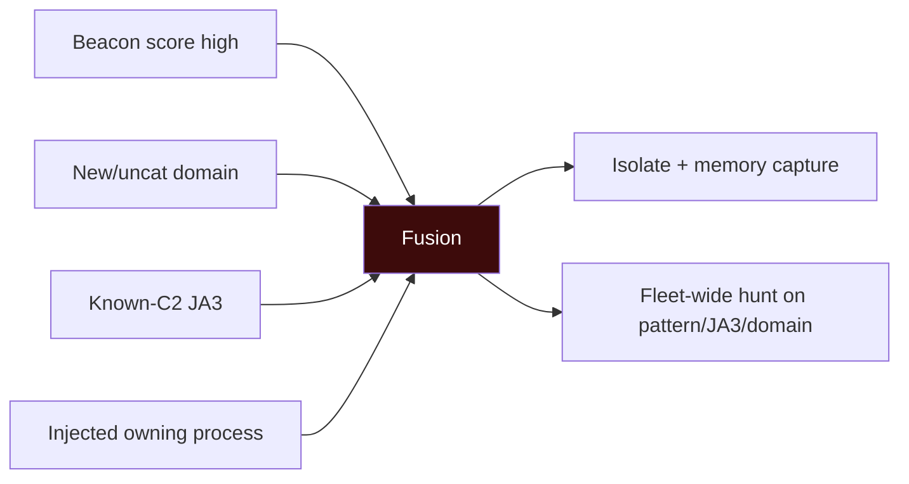

## Part 11: Final Revision / Summary

- **C2 is outbound-initiated client/server** — implant/beacon on the target calls out to a team server (via a redirector), because egress is the path of least resistance. Tasks/results flow asynchronously.
- **Beaconing** = periodic check-ins governed by **sleep** (interval) and **jitter** (randomization). The core tension: the channel *must repeat*, and repetition is detectable; jitter obscures but cannot erase periodicity.
- **Channels:** HTTP/S (workhorse, encrypts content not metadata), DNS (rarely blocked, low-bandwidth, entropic), SMB/named-pipe (internal/peer C2), cloud/legit-service (high-rep destination), ICMP/covert (niche). Durable detection is protocol-agnostic: timing + destination.
- **Staged vs stageless:** staged ships a tiny stager that pulls stage 2 (network stage-download tell) vs stageless ships the full implant (bigger static artifact). Move the tell, don't remove it.
- **Redirectors** hide and preserve the team server, filter to a decoy, and enable rotation — which is why IP-blocking is temporary and behavioral detection is durable.
- **Malleable profiles** shape each request to mimic legitimate traffic, defeating content/default signatures — but cannot change that requests repeat to a consistent destination.
- **Frameworks:** Metasploit/Meterpreter (ubiquitous, signatured), Cobalt Strike/Beacon (malleable, most-studied), Sliver (modern, Go, multi-protocol), Mythic (modular), Empire/others. All ship default fingerprints defenders signature.
- **Detection doctrine:** fuse behavioral (beacon timing/volume), fingerprint (JA3/JARM/cert), destination (reputation/age/IOC), protocol-specific (DNS/pipe), and host-side (owning-process legitimacy). Harden with egress filtering, TLS/DNS inspection, and category/reputation enforcement.
- **Interactive vs beacon:** continuous shells are fast but easy to spot and fragile; beacons trade latency for stealth and resilience. Operators switch to interactive for speed bursts — a detectable rhythm change.
- **The detection math:** low coefficient of variation of intervals + size consistency + many connections = high beacon score; more check-ins make detection *easier*, which is why patient operators use long sleeps.
- **Fingerprinting:** JA3 (client), JA3S (server), JARM (active) fingerprint the TLS stack; defaults are signatured, customization moves the operator off known-bad but rarely to "looks exactly like a common client," so *rarity* is also a signal.
- **Pivoting/peer C2** cuts external beacons but creates internal SMB/named-pipe anomalies; **exfil** must move volume, which is visible; **fallback channels** mean blocking one C2 triggers a detectable pivot, not an end.
- **False-positive discipline:** benign software beacons constantly (updaters, telemetry, EDR, NTP, cloud sync) — baseline/allowlist by destination + owning process so only unexplained beacons alert.
- **ATT&CK anchors:** T1071 (.001/.004), T1090, T1573, T1008, T1104, T1568, T1041/T1567.

The two-notebook arc closes here. The Malware & Evasion notebook taught how code hides on a host — on disk, in memory, inside a process — and this notebook's opening two chapters lifted that to the campaign: the engagement that frames it (Chapter 1) and the control channel that drives it (this chapter). The single idea that runs through all of it is the asymmetry the very first evasion chapter named: **anything an attacker must eventually do — run code, contact a controller, move data — must eventually become visible on the surface where it happens, and the defender's craft is to inspect that surface and fuse the signals.** For C2, that surface is the network egress and the owning host process, and the signal is the beacon that, however jittered, profiled, and blended, still has to repeat and still has to phone home.

## Part 11b: The Full C2 Lifecycle — One Picture

To tie every part together, here is the whole C2 lifecycle as a single flow, from delivery through objective, annotated with where each detection lives — a map you can hold in your head during an investigation.

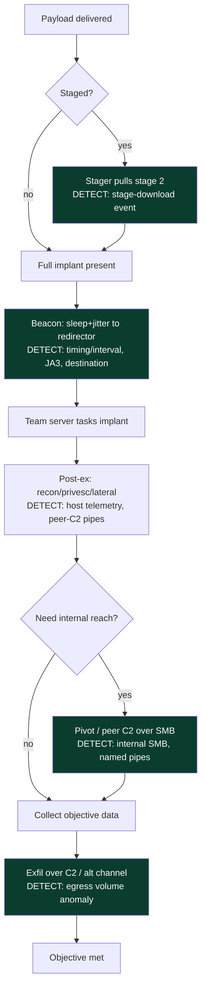

Read the green nodes and you have the C2 detection program: catch the stage-download at delivery, the beacon by timing/fingerprint/destination during control, the peer-C2 by internal SMB/pipe telemetry during lateral movement, and the exfil by egress volume at the objective. Every phase of C2 has a detection seam, and they are all instances of the same principle — **the channel must repeat and must move data across boundaries, and both are visible.**

## Part 11c: Memory Hooks — Locking the Concepts In

- **"It must repeat, and repetition is detectable."** The one sentence of C2 detection. Timing/interval analysis is the durable core.
- **"Encryption hides content, not metadata."** Destination, timing, JA3/JARM, and certs survive HTTPS. Metadata is where detection lives.
- **"More check-ins = easier to catch."** Statistics tighten with samples; long sleeps starve the analysis. That's why real operators go slow.
- **"Blend the content, but you can't erase the pattern."** Malleable profiles defeat signatures; timing + destination catch the beacon anyway.
- **"Chase behavior, not IPs."** Redirectors rotate; detect the beacon and hunt the implant, don't play IP whack-a-mole.
- **"The tell moves; it doesn't vanish."** DNS avoids egress blocks but spikes query volume; peer-C2 cuts external beacons but creates internal SMB; exfil throttling extends the window.
- **"Fuse four angles."** Timing + fingerprint + destination + owning process = a verdict no single evasion defeats.

Seven lines that compress the chapter; expand each and you can find C2 on the wire whatever framework or profile it uses.

## Part 12: Cheat Sheet / Quick Reference

**C2 in one breath:** implant beacons out (sleep+jitter) → redirector → team server; tasks/results async; blend content, but timing + destination give it away.

**Beacon parameters → detection**

| Parameter | Purpose | Detection mirror |
|---|---|---|
| sleep | control vs noise | connection frequency to one dest |
| jitter | break periodicity | interval-distribution regularity |
| data jitter | vary sizes | uniform small requests |
| working hours | blend timing | off-hours beaconing |
| fallback | survive burn | secondary-infra callouts |

**Channels → durable detection**
- HTTP/S → beacon timing + JA3/JARM + destination reputation
- DNS → query volume + subdomain entropy + NXDOMAIN + TXT-heavy
- SMB/pipe → Sysmon 17/18 + internal SMB anomalies + default pipe names
- cloud/service → process/service anomaly + timing
- ICMP → payload size/volume anomaly

**Defender toolkit:** Zeek (conn/dns/ssl logs), RITA (beacon scoring), JA3/JARM databases, DNS analytics, Sysmon 17/18, egress proxy + reputation, TLS inspection where lawful.

**Analyst triage of a suspected beacon**
1. Beacon score / interval regularity to one destination?
2. Destination reputation / category / age / on IOC feeds?
3. JA3/JARM match a known framework?
4. What *process* owns the connection — legitimate or injected/odd ancestry?
5. Volume: steady low egress that never stops, or exfil-scale spike?

**Harden:** least-privilege egress • force web through inspecting proxy • monitor/filter DNS • block newly-registered/uncategorized domains • correlate network beacon with host process.

**Frameworks to know (defensively):** Metasploit/Meterpreter, Cobalt Strike/Beacon, Sliver, Mythic, Empire, Havoc, Brute Ratel — all ship default JA3/JARM/cert/pipe fingerprints.

**Beacon-detection math:** low coefficient of variation (std-dev/mean of intervals) + consistent sizes + many connections to one destination = high beacon score. More check-ins = easier to catch; long sleeps starve the analysis.

**Why egress-initiated:** ingress is blocked, egress is permissive — so control/inspect egress (proxy, DNS, egress filtering) is where C2 defense concentrates.

**Fingerprint layers:** JA3 (client hello) • JA3S (server hello) • JARM (active server probe) — match known-bad *and* flag rare/anomalous on egress.

**False-positive discipline:** baseline/allowlist benign beacons (update checkers, telemetry, EDR agents, NTP, cloud sync) by destination + owning process, so only unexplained beacons alert.

**Fusion verdict:** high beacon score + bad/rare destination + known-C2 or rare JA3 + suspicious owning process = C2. No single-signal evasion defeats the fusion.

**Interactive vs beacon:** continuous shell = fast but loud/fragile; beacon = latency but stealthy/resilient. Watch rhythm *changes* (long sleep → constant) as a tell.

**Fallback (T1008):** blocking one C2 triggers failover to secondary infra/protocol — watch the host for the pivot, hunt the fleet, don't just block the IP.

**Exfil over C2 (T1041):** data must move volume — throttling/chunking extends the window but egress-volume-per-host anomaly still catches it.

**Triage a suspected beacon:**

1. Beacon score / interval regularity to one destination?
2. Destination reputation / category / domain age / IOC feeds?
3. JA3/JA3S/JARM match a known framework or rare on egress?
4. Which process owns the connection — legit, or injected/odd ancestry?
5. Volume — steady low egress that never stops, or exfil-scale spike?
6. Fuse → verdict; then isolate + capture memory + hunt the fleet on the durable indicators.

## Part 13: Practice Labs & Resources

Topic-specific and defensively-framed — these train C2 *detection and analysis*, not live operation. Handle anything live only in an isolated lab you own.

- **Active Countermeasures "RITA" + "Malware of the Day" + AC-Hunter Community** — the canonical beacon-analysis training; download benign/known PCAPs and practice scoring beacons in Zeek+RITA exactly as in the lab.
- **TryHackMe — "Intro to C2," "C2 frameworks," "Zeek," "Wireshark," and the network-forensics rooms.** The C2 rooms walk listener/beacon concepts hands-on in a lab.
- **HackTheBox / CyberDefenders / Blue Team Labs Online** — network-forensics challenges with real C2 traffic to detect (beaconing, DNS tunneling, exfil).
- **Zeek + RITA on your own lab** — capture your benign beacon simulator (Part 8), then capture *legitimate* beacons (an update checker, a monitoring agent) and learn to tell them apart — the core false-positive skill.
- **JA3/JARM resources** — the open JA3 fingerprint lists and Salesforce/Cisco JARM tooling; practice fingerprinting TLS and matching against known-C2 databases.
- **DNS tunneling detection** — build or replay benign DNS-tunnel traffic (e.g. iodine in a lab you own) and detect it via query volume/entropy in Zeek `dns.log`.
- **Adversary emulation** — CALDERA and Atomic Red Team include C2-adjacent techniques (T1071) you can run benignly to generate detection telemetry, closing the purple-team loop from Chapter 1.
- **Reading:** the Active Countermeasures "Threat Hunting" material, the MITRE ATT&CK T1071/T1090/T1573 pages, and vendor writeups on Cobalt Strike/Sliver detection (JARM, beacon-config extraction, named-pipe defaults).
- **Certifications:** CRTO (builds and uses a real C2 in a lab, then you learn to detect it), and blue-team tracks (BTL1, and SANS network-forensics/threat-hunting courses) for the detection side.
- **PCAP practice corpora:** Malware-Traffic-Analysis.net (annotated real-world PCAPs with C2), the Active Countermeasures sample datasets, and CyberDefenders network challenges — work through them with Zeek+RITA+Suricata until beacon, DNS-tunnel, and exfil patterns are instantly recognizable.
- **Zeek scripting:** learn to write a small Zeek script that computes per-(src,dst) interval statistics — building the beacon detector yourself, even a crude one, cements the Part 2.1 math better than any reading.
- **A concrete self-study arc:** (1) run the benign beacon simulator and detect it with Zeek+RITA; (2) capture a legitimate beacon and learn to distinguish it; (3) replay a benign DNS-tunnel and detect it; (4) fingerprint TLS with JA3 and match against known lists; (5) correlate a beacon to its owning process on the host. That loop builds the full network-plus-host C2 detection intuition.
- **Build a home detection lab:** a Security Onion or DetectionLab instance gives you Zeek, Suricata, and a SIEM pre-wired; generate benign beacon/DNS traffic and hunt it end to end. This is the single best way to internalize the whole chapter, because you see the same channel from the operator's and defender's sides at once.
- **Threat-hunting mindset resources:** the Active Countermeasures "Cyber Threat Hunting" training and "Malware of the Day" series are the canonical, free way to practice beacon hunting on real (benign-to-analyze) PCAPs; do a dozen and beacon analysis becomes reflexive.
- **C2 matrix and tracking:** the community "C2 Matrix" catalogs frameworks and their properties (channels, features) — useful for knowing what defaults to expect; public JARM/JA3 tracking projects show how exposed team servers are fingerprinted at internet scale.
- **Suricata/Zeek rule practice:** write signatures for known-C2 JA3 hashes and DNS-tunneling heuristics, then validate them against your benign lab traffic — the network equivalent of the Sigma-rule loop from the previous notebook.
- **Reading on the operator side (to understand the tradecraft you detect):** the malleable-C2-profile documentation and infrastructure/OPSEC writeups (SpecterOps, TrustedSec) — read them as a *defender* to know exactly what blending you must see through.

Master this and you can answer the only question C2 poses to a defender: *this channel has to repeat and reach a controller — where is the repetition, what fingerprint does it carry, and what process on the host owns it?* This closes the opening arc of the Red Team Operations notebook: Chapter 1 framed the engagement, and this chapter gave you its operational heartbeat — the control channel that ties injected implants (the previous notebook) across a network back to the operator, and the beacon rhythm that, however well disguised, is the thread a defender pulls to unravel the whole operation.
