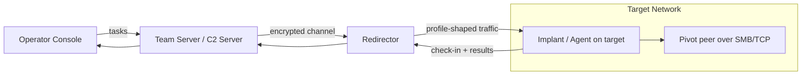
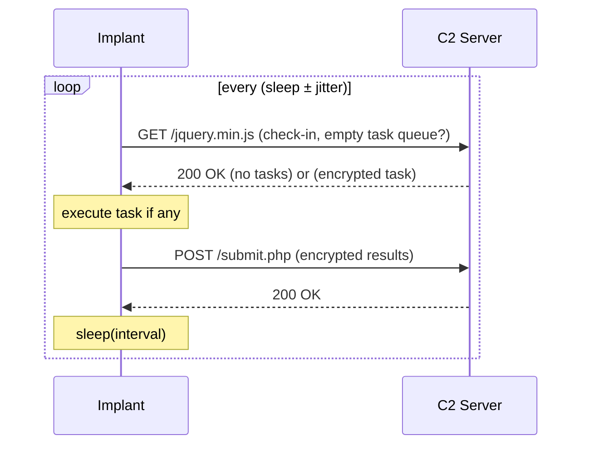
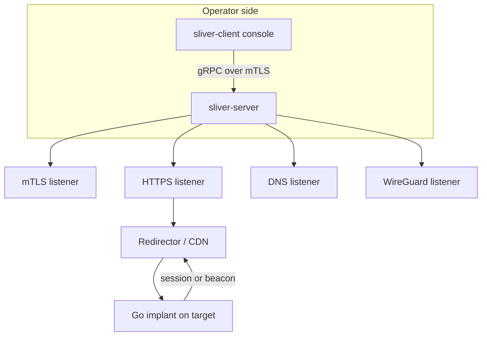
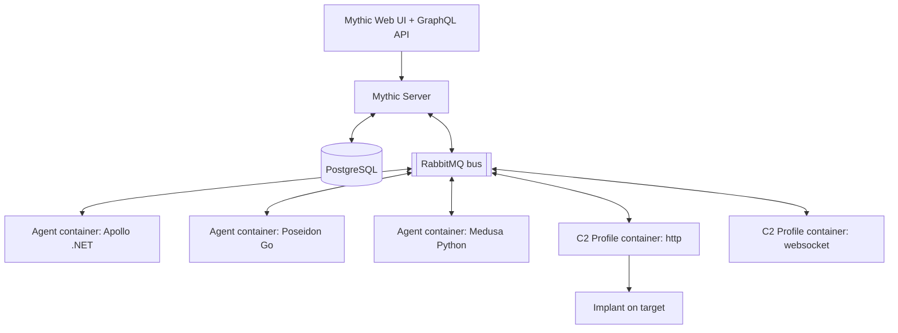
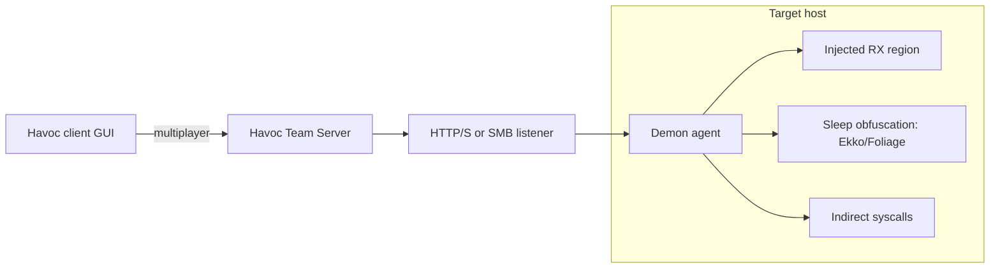
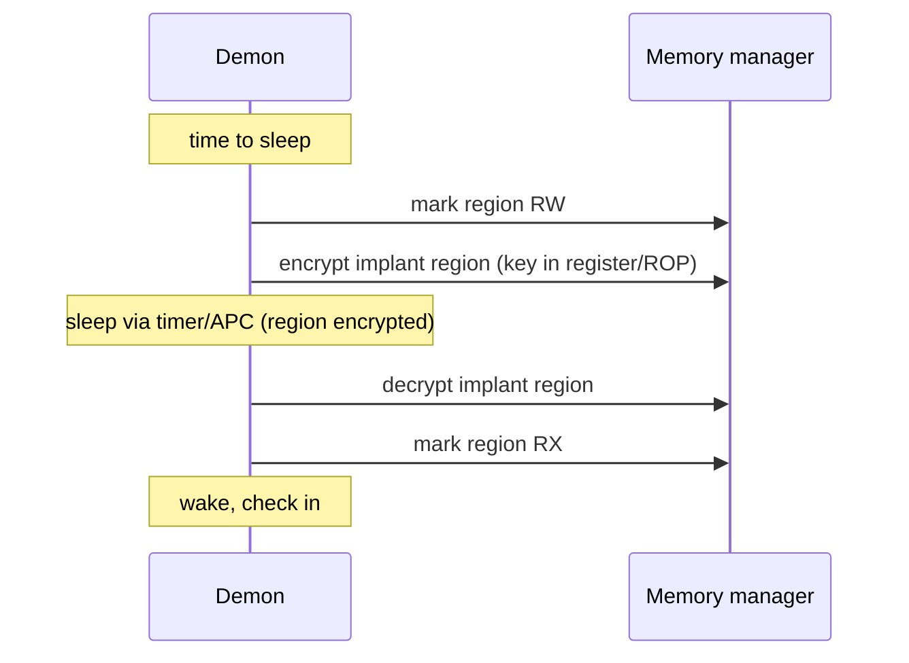
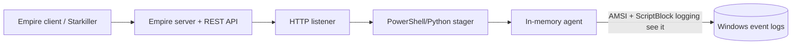
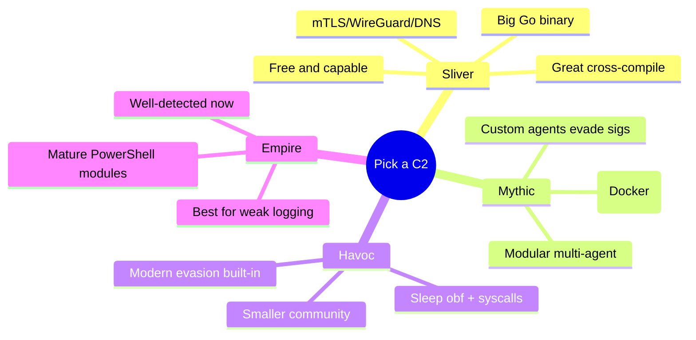
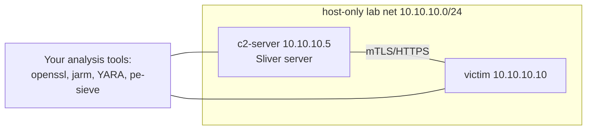
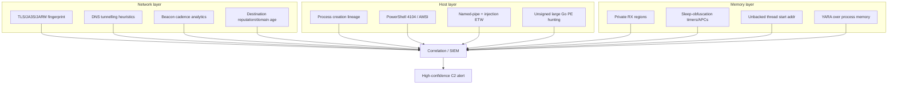

This is Chapter 4 of the Red Team Operations notebook. The previous chapter
dissected **Cobalt Strike** — the commercial benchmark — at the level of
Beacon, listeners, and Malleable C2, and then spent most of its length on how a
modern SOC fingerprints and defeats it. This chapter turns to the other half of
the C2 landscape: the **open-source frameworks** that anyone can download, read
the source of, and — crucially for a defender — study line by line. Where
Cobalt Strike is a licensed black box that leaks, Sliver, Mythic, Havoc, and
Empire are public repositories. That transparency cuts both ways. It lets a red
team stand up capable infrastructure for free, and it lets a blue team read the
exact code that generates an implant's traffic, its default certificate fields,
its named-pipe names, and its sleep routine — and build detections from ground
truth.

A framing note governs this entire chapter, as it did the last.
Command-and-control frameworks are **dual-use**: the same Sliver implant a
licensed red team drops on a client's authorized workstation is the one that
appears in real intrusions and incident-response reports. The point of studying
them is not to operate them against systems you do not own — it is to
understand the threat well enough to *emulate it intellectually and, far more
importantly, to detect and defeat it.* Nothing here is a deployment walkthrough
against third parties. There are **no working malware payloads, no live off-net
C2 instructions, and no evasion recipes tuned to bypass a specific named EDR.**
Every hands-on step is defensive and analytical — generating a benign implant
in an isolated lab you own purely to read its artifacts, inspecting a default
TLS certificate, computing a JARM hash, parsing a Mythic C2 profile,
recognizing a Havoc sleep-obfuscation indicator in a memory image. If you run
any offensive tooling, do so only under a signed engagement, in a lab you
control, on assets you are explicitly authorized to test. If you defend, this
chapter is written for you first.

We build from *why open-source C2 matters* and a shared mental model of what
every framework has in common, through each of the four frameworks in turn —
architecture, implant, transports, profiles — then a benign hands-on lab on
generating and fingerprinting implants in an isolated range, a large
consolidated Detection & Defense section spanning network, host, and memory
telemetry, real-world abuse cases and pitfalls, and a cheat sheet with
legitimately runnable practice resources.

## Why This Matters

For roughly a decade, "C2 framework" was almost synonymous with **Cobalt
Strike** on the offensive side and **Metasploit/Meterpreter** on the commodity
side. That era is over. Threat-intel reporting through the mid-2020s repeatedly
shows intrusion sets moving *off* Cobalt Strike — precisely because it is so
well-detected — and onto open-source frameworks whose smaller install base and
rapidly-changing code make signature-based detection harder. **Sliver** (by
Bishop Fox) in particular became a poster child: multiple vendors published
reports of ransomware affiliates and access brokers adopting it. **Havoc**
appeared in phishing campaigns within months of its public release. **Mythic**
is the backbone of countless custom agents because its plugin architecture lets
an operator ship a brand-new implant without touching the core. **Empire**, the
oldest of the four, defined the PowerShell-post-exploitation era and — through
its community fork — still turns up on hosts with weak PowerShell logging.

For a **defender**, this shift is the whole story: your detections cannot assume
Cobalt Strike. You must understand the *class* of behaviour — asynchronous
beaconing, staged payloads, TLS with attacker-controlled certificates, process
injection, named-pipe pivoting, sleep obfuscation — and build controls that
catch the technique regardless of which framework produced it. For a **red
teamer**, understanding these tools deeply (and their indicators) is what
separates an operator who gets caught on day one from one who can emulate a
specific threat actor faithfully. For a **CTF player or student**, these
frameworks are the payload half of countless "get a foothold, then pivot" boxes
on HackTheBox and in adversary-emulation labs. Because they are open source,
they are the single best way to *learn how C2 actually works* — you can read
every function.

By the end of this chapter you will understand what all four frameworks share,
how each differs in implant language, transport, and obfuscation, exactly which
artifacts each leaves on the wire, on disk, and in memory, and how a blue team
turns that knowledge into detections.

## Part 1: The Shared Anatomy of a C2 Framework

Before we look at any single tool, fix the mental model. Every C2 framework —
commercial or open source — is built from the same five moving parts. If you
understand these, you understand 80% of any framework you will ever meet, and
you know where to point your telemetry.



**1. The server (team server / C2 server).** A long-running process on
attacker-controlled infrastructure that holds operator state, queues tasks for
each implant, decrypts results, and exposes a console or API to operators.
Sliver calls it the *server*; Mythic runs it as a set of Docker containers;
Havoc calls it the *team server*; Empire calls it the *server* with a REST/
socket API. **Blue-team relevance:** you rarely see the server directly, but its
*default TLS certificate*, its listening ports, and its management interface are
frequently exposed to the internet and are exactly what scanning services like
Shodan and Censys fingerprint.

**2. The listener / C2 profile.** The server-side definition of *how* implants
talk to it — which transport (HTTPS, DNS, mTLS, SMB, WireGuard), on which port,
with which URIs, headers, and jitter. In Cobalt Strike this was the Malleable C2
profile; the open-source frameworks have direct equivalents (Mythic's "C2
Profiles," Havoc's listener + profile block, Sliver's HTTP C2 config JSON). The
profile is where an operator tries to blend in — and where a defender finds the
richest fingerprints, because defaults are rarely changed.

**3. The stager (optional).** A tiny first-stage payload whose only job is to
pull down and execute the much larger full implant. Staging keeps the initial
artifact small (useful in size-limited exploits) but is **noisy** — the
un-authenticated download of a large blob over HTTP is a classic detection.
Stageless (self-contained) payloads avoid that download but are larger. Every
framework supports both; the choice is a tradecraft trade-off.

**4. The implant / agent / beacon.** The code running on the target. It runs in
one of two rhythms: **asynchronous "beacon" mode**, where it sleeps, wakes,
checks in for tasks, executes, returns results, and sleeps again (low and slow,
hard to catch on the wire); or **interactive mode**, a near-real-time session
(fast, responsive, far noisier). The implant is where language matters most:
Sliver's implant is Go, Havoc's Demon is C/assembly, Empire's agents are
PowerShell/Python/C#, and Mythic's are whatever the agent author wrote.

**5. The post-exploitation toolset.** Everything the implant can *do* once it is
running — run a command, inject into a process, dump credentials, pivot,
socks-proxy, upload/download. The mechanics (process injection, token
manipulation, named-pipe pivoting) are shared across frameworks and are the
richest source of host-based detections, because the OS emits telemetry for
each.

### The beaconing rhythm (why "low and slow" works)

The single most important behaviour to internalise is asynchronous beaconing.
Instead of holding an open connection, the implant contacts the server on an
interval — the **sleep** — usually with random **jitter** so the interval is
not perfectly periodic. A beacon might sleep 60 seconds with 30% jitter,
producing check-ins every 42–78 seconds.



**Detection consequence:** perfectly periodic check-ins are trivially spotted by
"beaconing" analytics that measure the variance of inter-connection times to a
destination. Jitter defeats naive periodicity detection but **not** the more
robust approach of flagging any internal host that makes many small, regular
requests to a single low-reputation external host over hours. Keep this in mind
through the whole chapter: every framework tunes sleep and jitter, and every
serious blue team looks for the residual regularity.

### What differs between frameworks (the map for the rest of the chapter)

| Framework | Server lang | Implant lang | Flagship transport(s) | Signature feature | Typical detection surface |
|-----------|-------------|--------------|-----------------------|-------------------|---------------------------|
| **Sliver** | Go | Go | mTLS, WireGuard, DNS, HTTP(S) | Per-build mutual-TLS, huge Go binaries | Default certs, Go runtime strings, large static binary |
| **Mythic** | Python/Docker | Any (per agent) | Pluggable C2 profiles (HTTP, WebSocket, DNS, etc.) | Multi-agent plugin architecture | Depends on agent; default profile headers, container ports |
| **Havoc** | C++/Python (Qt UI) | C/ASM (Demon) | HTTP(S), SMB | Sleep obfuscation (Ekko), indirect syscalls | Injected RX memory, default profile, Demon strings |
| **Empire** | Python | PowerShell/C#/Python | HTTP(S), Malleable-style | PowerShell post-ex heritage, Starkiller UI | Script-block logging, AMSI, default URIs |

Read that table as the itinerary. The next four parts take each row in turn,
teach the tool from scratch, and — per the authoring contract — fold the red-
team *use* and the blue-team *detection* directly into the discussion rather
than siloing them.

## Part 2: Sliver — The Go Implant That Ate the Mid-Market

**What Sliver is, from zero.** Sliver is an open-source, cross-platform
adversary-emulation / C2 framework written in **Go** by Bishop Fox. It was
designed explicitly as a Cobalt-Strike alternative for teams that could not or
would not license commercial tooling, and it succeeded to the point that it is
now regularly abused in real intrusions. Its two defining engineering choices
are (1) **everything is Go** — the server, the client, and the implant all
compile from one Go codebase, which makes cross-compilation to Windows, Linux,
and macOS trivial; and (2) **mutual TLS by default** — each implant build ships
with its own per-build certificate, and the server authenticates the implant as
much as the implant authenticates the server.

**Architecture.** Sliver runs as a single server binary that embeds an
mTLS-secured multiplayer gRPC API. Operators connect with the same binary in
client mode (or via the console on the server itself). Because the whole thing
is Go and statically linked, "installing" Sliver is famously a one-liner —
which is part of why it spread so fast.



### Sessions vs beacons in Sliver

Sliver draws a clean line between two implant modes, and you must know both
because they have very different detection profiles.

- A **session** is an interactive, real-time implant. It holds a live channel;
  commands return immediately. Great for the operator, loud on the network.
- A **beacon** is the asynchronous, sleep/jitter implant described in Part 1.
  It checks in periodically and is the default for long-haul operations.

You can generate either, and you can *interactively* task a beacon which spawns
a session on demand. **Blue-team relevance:** a Sliver session over mTLS on a
non-standard port is a glaring anomaly; a Sliver beacon over HTTPS through a CDN
is the hard case, and is where you fall back to host and memory telemetry.

### Transports — the four Sliver channels

Sliver's transport flexibility is its real strength. Teach each one and, for
each, the artifact it leaves.

**1. mTLS.** The default and most secure channel. Both ends present
certificates; traffic is opaque. **Detection:** you will not decrypt it, but the
*certificate* the server presents, plus the JARM/JA3(S) fingerprint of the TLS
stack, are strong network indicators — Go's TLS stack produces a recognisable
ClientHello, and default Sliver server certs have historically had guessable
subject fields. Also, mTLS on an odd port from a workstation is behaviourally
odd on its own.

**2. WireGuard.** Sliver can tunnel over a WireGuard virtual interface, giving
the operator a full virtual network into the target. Powerful for pivoting.
**Detection:** WireGuard's UDP handshake has a fixed structure; unexpected
WireGuard from a corporate endpoint that has no business running a VPN is the
tell.

**3. DNS.** Fully-featured DNS C2 — data is encoded into subdomain labels and
answers. Slow but egress-resistant, since DNS is almost always allowed out.
**Detection:** long, high-entropy subdomains, abnormally high query volume to a
single authoritative domain, and TXT/NULL record abuse. This is the classic DNS-
tunnelling signature and applies to every DNS-capable framework, not just
Sliver.

**4. HTTP(S).** The blend-in channel. Sliver's HTTP C2 is configurable through a
JSON config that defines URIs, file extensions, headers, and polling behaviour —
the open-source analogue of a Malleable profile. **Detection:** default URIs and
the shape of the requests; see the lab and the Detection part.

### Reading a Sliver HTTP C2 config (benign, analytical)

The most defender-useful Sliver artifact is its HTTP configuration, because it
governs exactly what the requests look like. A simplified, illustrative config
looks like this (fields shortened for teaching; this is configuration data, not
a payload):

```json
{
  "implant_config": {
    "sleep_seconds": 60,
    "jitter_percent": 30
  },
  "http_c2": {
    "poll_paths": ["static", "assets", "api"],
    "poll_file_ext": "js",
    "stager_file_ext": "woff",
    "start_session_paths": ["login", "auth"],
    "session_file_ext": "php",
    "headers": [
      { "name": "Accept", "value": "text/html,application/xhtml+xml" },
      { "name": "Accept-Encoding", "value": "gzip, deflate" }
    ],
    "max_files": 8,
    "min_files": 2
  }
}
```

Every one of those knobs exists so the operator can make Sliver requests look
like ordinary web traffic (asking for `/static/xxxx.js`, posting to
`/login/yyyy.php`). **Blue-team usage:** because the *default* config ships with
recognisable path words and extension choices, and because most operators never
change them, a proxy log full of requests to `/assets/<random>.js` and
`/api/<random>.js` from a single host on a fixed cadence is a Sliver-shaped
pattern. When operators *do* customise the profile, you lose the string
signature and must lean on cadence + destination reputation + host telemetry.

### The Go-binary problem (why Sliver implants are so chunky)

Because the implant is statically-linked Go, a Sliver implant binary is
**large** — often 8–15 MB — and carries the entire Go runtime. This is a
double-edged sword. For the operator it means a big artifact to deliver. For the
defender it is a gift: Go binaries have a very recognisable structure —
`.gopclntab` sections, Go build IDs, module path strings, and runtime symbol
names that survive even in stripped binaries. **Red-team usage:** operators
strip symbols, pack, and obfuscate (garble) to fight this. **Blue-team usage:**
YARA rules keyed on Go runtime artifacts plus Sliver-specific strings, and
simple "why is there a 12 MB unsigned Go binary in a user's Temp folder"
hunting, both catch un-obfuscated builds. We return to concrete rules in the
Detection part.

### Sliver pivoting and post-ex

Sliver supports SMB and TCP **pivots** (an implant that relays for another,
deeper implant that cannot reach the internet directly), a SOCKS proxy for
tunnelling tools through the beacon, plus the usual file transfer, execute-
assembly (running .NET assemblies in memory), and process injection. **Blue-
team relevance:** the pivot creates internal implant-to-implant traffic — an SMB
named pipe between two workstations that never normally talk — which is often
easier to spot than the external channel, because internal east-west traffic is
less noisy and more anomalous.

**IR use case.** In a real Sliver incident, responders typically pivot off one
of three findings: an oversized unsigned Go binary on disk, an unusual outbound
mTLS/HTTPS beacon to a low-reputation host, or a suspicious SMB named-pipe
between endpoints. Each of those maps directly to one of the mechanics above —
which is why understanding the tool's architecture *is* the detection strategy.

## Part 3: Mythic — The Multi-Agent Framework

**What Mythic is, from zero.** Mythic (by Cody Thomas / SpecterOps) is not a
single implant with a console — it is a **framework for building and operating
many different agents** through one web UI and one API. Its core is a set of
**Docker containers**: a PostgreSQL database, a RabbitMQ message bus, the
Mythic server, a web front-end, and then — separately — one container per
**agent** and one per **C2 profile**. This container-per-component design is the
whole point: you can drop in a brand-new agent (a new implant, in any language)
or a new C2 profile (a new transport) without modifying Mythic core, just by
adding a container that speaks the message-bus protocol.



**Why this matters for both sides.** For the **operator**, Mythic is a platform:
pick an agent that fits the target (Apollo for Windows/.NET, Poseidon for
Linux/macOS Go, Medusa for Python, Athena for cross-platform .NET, and many
community agents), pair it with a C2 profile, and operate. For the **defender**,
Mythic is a warning that "detect Mythic" is the wrong goal — there is no single
Mythic implant to signature. You must detect the *agent* (Apollo's injection,
Poseidon's Go artifacts) and the *C2 profile* (the HTTP profile's default
headers and URIs). The framework is just glue.

### The agent zoo (know the common ones)

| Agent | Language | Target | Notable tradecraft | Primary detection surface |
|-------|----------|--------|--------------------|---------------------------|
| **Apollo** | C# / .NET | Windows | execute-assembly, injection, SOCKS | CLR loading, ETW, AMSI, injected memory |
| **Poseidon** | Go | Linux/macOS | cross-platform, in-memory | Go runtime strings, unusual daemon |
| **Medusa** | Python | Cross-platform | scripted, lightweight | python interpreter spawning, script artifacts |
| **Athena** | C# / .NET | Cross-platform | modular, forge plugins | CLR + plugin DLL loads |
| **Merlin/others** | Various | Various | HTTP/2, HTTP/3 experiments | protocol anomalies |

The takeaway is not to memorise the zoo but to internalise the pattern: each
agent inherits the detection surface of *its language and its techniques*, and
Mythic just orchestrates. **Blue-team usage:** map each agent you care about to
the ATT&CK techniques it implements and hunt those techniques, not "Mythic."

### C2 profiles in Mythic

A Mythic **C2 profile** is a separate container that defines a transport and its
parameters. The stock `http` profile is the most common and exposes a
configuration much like Sliver's — callback host, interval, jitter, custom
headers, GET/POST URIs, and a "user-agent." Because the profile is decoupled
from the agent, the *same* Apollo agent can talk over `http`, `websocket`, or
`dns` just by re-pairing. **Detection consequence:** the network fingerprint is
a property of the *profile*, and stock profiles ship with defaults (a default
User-Agent string, default URIs, a default `Content-Type`) that survive into
many real deployments. A representative stock HTTP profile config (teaching
data) looks like:

```json
{
  "callback_host": "https://cdn.example.com",
  "callback_interval": 10,
  "callback_jitter": 23,
  "callback_port": 443,
  "get_uri": "index",
  "post_uri": "data",
  "query_path_name": "q",
  "headers": {
    "User-Agent": "Mozilla/5.0 (Windows NT 10.0; Win64; x64) AppleWebKit/537.36",
    "Content-Type": "application/json"
  }
}
```

**Blue-team usage.** A defender who has read the stock profile knows the default
`get_uri`/`post_uri` words and the default User-Agent; proxy logs matching those
defaults against an external callback host are a Mythic-http signature. Mature
operators change all of it, which — again — pushes you to cadence and host
telemetry. This "defaults survive" theme is universal across all four
frameworks and is the single highest-yield hunting idea in the chapter.

### Translation containers and encryption

One Mythic subtlety worth knowing: agents and profiles negotiate encryption
(commonly a per-callback key exchange, AES for message bodies), and a
"translation container" can transform Mythic's internal message format into an
arbitrary on-the-wire format. This is how an operator makes Mythic traffic look
like something completely custom. **Detection consequence:** encrypted, custom-
shaped bodies mean the *content* is opaque; you are back to metadata — who is
talking to whom, how often, how regularly, and to what reputation of
destination.

**Red-team usage.** Mythic's appeal is exactly this modularity: an operator can
ship a bespoke agent that no signature covers, paired with a custom profile that
no proxy rule matches, all without forking a monolith. **Blue-team counter:**
this is why behaviour-based and volumetric detection beats signatures for the
open-source era — the signatures are, by design, a moving target.

## Part 4: Havoc — The Demon and Modern Evasion

**What Havoc is, from zero.** Havoc (by C5pider) is a modern open-source C2 with
a **Qt-based multiplayer GUI** that deliberately mimics the Cobalt Strike
operator experience, a Python/C++ team server, and — its centrepiece — the
**Demon** agent, an implant written in **C and assembly** with a strong focus on
in-memory evasion. Havoc matters not because it is the most widely deployed but
because it packages *modern implant evasion techniques* into an easy-to-use tool,
which is exactly what makes it a good teaching object for defenders: the
techniques it uses are the techniques you must detect.



### The Demon agent's evasion stack (teach each technique)

The Demon is where you learn the vocabulary of contemporary implant evasion. Do
not treat these as magic; each has a concrete mechanism and, critically, a
concrete detection.

**1. Sleep obfuscation (Ekko / Foliage / Zilean).** When a beacon sleeps, its
code and configuration sit in memory in the clear — a perfect target for a
memory scanner. Sleep-obfuscation techniques *encrypt the implant's own memory
region for the duration of the sleep* and decrypt it just before waking. Ekko,
for example, queues timer callbacks (via `CreateTimerQueueTimer` / ROP) that
flip the memory to RW, encrypt it, sleep, decrypt, flip back to RX. **Blue-team
detection:** this is a strong technique but it leaves its own tells — a thread
sitting in a timer/APC state, an RX private memory region that periodically
becomes RW, and the ROP gadget chain itself. Memory scanners that catch the
region *during* the RW window, or that flag private RX regions not backed by a
file (classic shellcode indicator), still work. **This is the single most
important modern C2 concept in the chapter** — commercial and open-source
implants alike now do this, and detection has shifted from "scan sleeping memory
for signatures" to "catch the region regardless of its encrypted state."

**2. Indirect / direct syscalls.** EDRs hook user-mode NTDLL functions to watch
for malicious calls. Direct syscalls invoke the kernel via `syscall`
instructions in the implant's own code, skipping the hook; **indirect** syscalls
jump to the real `syscall` instruction *inside* NTDLL (so the return address
looks legitimate) after resolving the syscall number. **Blue-team detection:**
the syscall number/stack mismatch is itself detectable — a `syscall` originating
from a non-NTDLL memory region, or a call stack where the return address is not
in a loaded module, are the tells. Modern EDRs moved from pure user-mode hooks to
kernel callbacks (ETW-TI, kernel `Nt*` telemetry) precisely because syscalls
defeat user-mode hooks.

**3. Injection & RX regions.** The Demon typically injects into or spawns a
host process and runs from a private executable memory region. **Blue-team
detection:** the presence of a private, non-image, executable region (`MEM_
PRIVATE` + `PAGE_EXECUTE_READ`) is one of the most reliable shellcode indicators
that exists, which is why tools like **pe-sieve**, **Moneta**, and **Hunt-
Sleeping-Beacons** exist. We use them in the lab.

### Havoc profile and defaults

Havoc's listener/profile block (a YAML-ish config) controls the HTTP indicators
— host, port, User-Agent, URIs, headers, and the sleep technique. As with
Sliver and Mythic, the **defaults are the fingerprint**. Early Havoc releases
shipped with recognisable default header sets and a specific TLS profile, and —
famously — a bug/artifact in how the Demon populated certain fields made some
early campaigns trivially clusterable. **Red-team usage:** operators must
customise the profile, sign the loader, and change the sleep technique to avoid
canned rules. **Blue-team usage:** default-profile Havoc is well-covered by
public YARA and Suricata rules; custom Havoc pushes you to memory scanning for
the RX-region and sleep-obfuscation indicators above.



**IR use case.** When responders meet a Havoc Demon, the disk artifact is often
minimal (it may live only in memory after injection), so the investigation is
memory-first: dump the suspect process, scan for private RX regions and sleep-
obfuscation timer artifacts, and carve the config. The techniques the Demon uses
to hide are the very things a memory scanner is tuned to surface.

## Part 5: Empire — PowerShell Post-Exploitation and Its Afterlife

**What Empire is, from zero.** PowerShell Empire (originally by Will Schroeder,
Justin Warner, et al.; now maintained as a community fork under BC-Security)
is the oldest framework in this chapter and the one that *defined* an era. Its
implant — the "agent" — was originally pure **PowerShell**, later extended to
**Python** (for Linux/macOS) and **C#**. Its whole design assumed a Windows
estate where PowerShell was trusted and under-logged, and it delivered a rich
module library: Mimikatz-based credential theft, situational-awareness modules,
lateral-movement modules, and persistence — all runnable in memory without ever
writing an EXE to disk. **Starkiller** is its modern web GUI.

Empire still matters for two reasons. First, historically: understanding Empire
is understanding *why* Windows PowerShell logging (script-block logging, module
logging, transcription) and **AMSI** were built — they were, in large part, a
direct response to Empire and its peers. Second, practically: the community fork
is alive, and Empire still lands on networks whose PowerShell logging is weak or
disabled, and in CTF/lab scenarios constantly.



### The staging and key-exchange model

Empire's classic flow is a textbook stager story. A one-liner (often a
`powershell -enc <base64>` command, or a downloaded `.ps1`) fetches the stager,
which performs an encrypted key exchange with the listener and pulls the full
agent into memory. **Blue-team usage:** that `powershell -enc` with a long
base64 blob, especially spawned from a non-interactive parent (a Word process, a
scheduled task, `wmiprvse.exe`), is one of the most classic detections in the
Windows world. Decoding the base64 reveals the download cradle
(`IEX (New-Object Net.WebClient).DownloadString(...)`), which script-block
logging captures in full even when the command tries to obfuscate itself.

### Why AMSI and script-block logging changed the game

The **Anti-Malware Scan Interface (AMSI)** lets antivirus inspect script content
*after* it is de-obfuscated, right before execution — so an obfuscated Empire
stager that decodes itself in memory is still scanned in its final,
recognisable form. **Script-block logging** (Event ID 4104) records the actual
script blocks PowerShell compiles, again post-deobfuscation. Together they
turned PowerShell from an attacker's blind spot into one of the best-instrumented
execution surfaces on Windows. **Red-team usage:** this is why modern Empire
usage leans on AMSI-bypass techniques and increasingly on the C#/Python agents
instead of PowerShell. **Blue-team usage:** ensure script-block logging and AMSI
are actually on and centrally collected — a huge fraction of Empire's continued
success is estates where they are not.

| Windows control | Event / mechanism | What it catches | Empire counter |
|-----------------|-------------------|-----------------|----------------|
| Script-block logging | Event ID 4104 | De-obfuscated script content | Obfuscation (loses), C# agent (evades PS logging) |
| Module logging | Event ID 4103 | Pipeline/module invocation | C#/Python agents |
| AMSI | Runtime scan pre-exec | Known malicious script strings | AMSI bypass/patching |
| Transcription | Text transcripts | Full session record | Disabling (needs admin), non-PS agents |
| Constrained Language Mode | Runtime restriction | Blocks many offensive cmdlets | Language-mode bypasses |

**IR use case.** An Empire investigation is usually a *log* investigation, not a
memory one: 4104 events with download cradles and Mimikatz strings, `powershell
-enc` process-creation events (Sysmon Event ID 1 / Security 4688), and outbound
HTTP to the listener's default URIs. Because Empire predates the modern evasion
stack, it is the *easiest* of the four to catch on a well-instrumented Windows
host — which is exactly why sophisticated actors moved to Sliver and Havoc.

## Part 6: Choosing a Framework — The Operator's Trade-Offs (and What Each Choice Tells a Defender)

Put the four side by side as an operator would, because the *choice* an intruder
makes is itself intelligence for a defender who understands the landscape.



- **Sliver** is chosen for capability-for-free and painless cross-platform
  operation; its cost is a large, Go-shaped binary that host telemetry catches
  if un-obfuscated. A defender seeing Sliver infers a competent but not
  necessarily elite actor — it is the "default upgrade" from Cobalt Strike.
- **Mythic** is chosen when the operator wants to run a *custom* agent that no
  signature covers; its cost is heavier infrastructure. Seeing a bespoke Mythic
  agent implies a more deliberate, engineering-capable adversary.
- **Havoc** is chosen for built-in modern evasion without writing it yourself;
  its cost is a smaller ecosystem and (early on) recognisable defaults. Seeing
  Havoc implies an actor prioritising in-memory stealth.
- **Empire** is chosen for its mature module library or when the target's
  PowerShell logging is known-weak; its cost is that a well-instrumented Windows
  estate lights it up instantly.

**Detection strategy consequence.** You do not build "a Sliver detection" and "a
Havoc detection" as isolated silos. You build *layers* — network cadence and
TLS/DNS fingerprinting, host process/injection telemetry, and memory scanning —
each of which catches a *class* of behaviour that all four frameworks share.
That layered model is the subject of Part 9.

## Part 7: Hands-On Lab — Generate and Fingerprint a Sliver Implant in an Isolated Range

This lab is **entirely benign and self-contained**. You stand up Sliver on a VM
you own, generate an implant, point it at *your own* server, and then study the
artifacts it produces — the binary, the certificate, the TLS handshake, the
process behaviour. **You never point the implant at any system you do not own,
and everything happens inside an isolated lab network.** The objective is
defensive: to see, with your own eyes, exactly what indicators an open-source C2
leaves, so you can detect them.

**Lab topology.** Two VMs on a host-only network: `c2-server` (Linux, runs
Sliver server) and `victim` (a throwaway Windows or Linux VM you own). No
internet egress needed. Snapshot both first.



### Step 0 — Tools from scratch

Four tools appear in this lab. Each is taught here before use.

- **Sliver** — the C2 framework itself (installed only to generate a benign
  implant we will dissect). One-line install on the lab server:

```bash
# On c2-server ONLY, a lab VM you own:
curl https://sliver.sh/install | sudo bash
# This installs the 'sliver-server' and 'sliver' client binaries.
sudo systemctl status sliver
```

- **openssl** — the Swiss-army knife for TLS/PKI. We use it to fetch and read
  the certificate the Sliver server presents, revealing default subject fields.
- **jarm** — an active TLS-server fingerprinting tool (by Salesforce). It sends
  ten specially-crafted TLS ClientHellos and hashes the server's responses into
  a 62-character **JARM** fingerprint. Servers built from the same stack/config
  share a JARM, which is how scanning services cluster C2 servers. Install:

```bash
pip install jarm    # or use the reference python-jarm implementation
```

- **pe-sieve** — an open-source (Hasherezade) scanner that inspects a running
  process for in-memory anomalies: injected/replaced modules, private
  executable regions, hollowing, and hooks. It is a *defender's* tool and is
  the star of the memory-detection half of the lab.

### Step 1 — Start the Sliver server and generate a benign implant

```bash
# On c2-server:
sliver-server            # drops you into the interactive console

# In the Sliver console — generate a BEACON implant that only ever calls back
# to our own lab server. This is the artifact we will dissect.
[server] sliver > generate beacon --mtls 10.10.10.5 --os windows --arch amd64 \
                    --seconds 60 --jitter 30 --save /tmp/lab_implant.exe

[*] Generating new windows/amd64 implant binary (beacon)
[*] Symbol obfuscation is enabled
[*] Build completed in 00:00:42
[*] Implant saved to /tmp/lab_implant.exe
```

Flag-by-flag, because you must understand every option:

- `generate beacon` — build an asynchronous beacon (vs `generate` for a
  session).
- `--mtls 10.10.10.5` — use the mTLS transport, calling back to our lab server
  IP. (In a real op this would be a domain behind a redirector; in the lab it is
  our own box.)
- `--os windows --arch amd64` — cross-compile target. Note Sliver did this from
  a Linux server with zero extra toolchain setup — the Go cross-compile
  advantage in action.
- `--seconds 60 --jitter 30` — sleep 60s ± 30% (so ~42–78s between check-ins).
- `--save` — write the binary out so we can analyse it.

### Step 2 — Fingerprint the binary on disk (the Go-artifact tell)

```bash
# Size: note how large a Go implant is.
$ ls -lh /tmp/lab_implant.exe
-rw-r--r-- 1 root root 9.4M Jan 1 00:00 /tmp/lab_implant.exe

# Confirm it is a Go binary even without symbols:
$ strings -n 8 /tmp/lab_implant.exe | grep -iE 'go1\.|golang|gopclntab|runtime\.' | head
go1.21.6
runtime.gopanic
runtime.morestack
...

# Look for Sliver/protobuf artifacts (present unless heavily obfuscated):
$ strings -n 8 /tmp/lab_implant.exe | grep -iE 'sliver|bishopfox|clientpb|sliverpb' | head
```

**What you just learned as a defender:** an unsigned ~9 MB PE that is
unmistakably Go, sitting in a user-writable path, is already a high-fidelity
hunting hit *before any behavioural analysis.* Operators fight this with `garble`
(symbol/string obfuscation) and packing — which is why the memory and network
layers exist as backstops.

### Step 3 — Read the server certificate and compute its JARM

```bash
# Fetch the cert the Sliver mTLS/HTTPS listener presents (from the analyst box):
$ openssl s_client -connect 10.10.10.5:443 -showcerts </dev/null 2>/dev/null \
    | openssl x509 -noout -subject -issuer -dates -fingerprint -sha256
subject=CN = <default-or-operator-chosen value>
issuer=CN = <self-signed CA>
notBefore=...
notAfter=...
SHA256 Fingerprint=...

# Compute the JARM fingerprint of the listener:
$ python3 -m jarm 10.10.10.5 -p 443
Resolved: 10.10.10.5
JARM: 2ad2ad0002ad2ad00042d42d000000<...>
```

**What you just learned:** the certificate's subject/issuer fields and the JARM
hash are *network-visible* even though the channel is encrypted. Threat-intel
platforms maintain lists of JARM hashes and certificate patterns associated
with default Sliver, Havoc, and other framework listeners; matching one against
an internet-exposed server is how researchers map C2 infrastructure at scale.
Operators mitigate by using a valid CA-issued cert and a proper reverse proxy —
which changes the cert but often not the underlying JARM, unless they also
change the TLS stack in front of it.

### Step 4 — Detonate in the isolated victim VM and scan memory

Run the benign implant *only* on your throwaway victim VM, with the Sliver
server the only callback destination, snapshot taken. Then, from the victim,
scan the implant process with pe-sieve:

```powershell
# On the victim VM, find the implant PID (it may inject into another process):
PS> Get-Process | Where-Object { $_.Path -like '*lab_implant*' }

# Scan that process's memory for injected/anomalous regions:
PS> .\pe-sieve64.exe /pid <PID> /shellc /threads
[*] Scanning: C:\Users\lab\lab_implant.exe
[*] Report: {
      "scanned": { "total": 1, "suspicious": 1 },
      "implanted": 1,
      "workingset_scan": 1
    }
[+] Dumped modified/implanted regions to: process_<PID>/
```

Flag notes: `/pid` targets a process; `/shellc` also hunts shellcode-like
regions not backed by a module; `/threads` inspects thread start addresses for
ones pointing into private memory (a classic injection tell). **What you just
learned:** even when the on-disk artifact is obfuscated, the *runtime* memory
picture — private executable regions, thread start addresses outside any module
— is far harder for the implant to hide, which is why memory scanning is the
detection layer of last resort and the one that generalises across all four
frameworks.

### Step 5 — Capture and eyeball the beacon on the wire

```bash
# On the analyst box, capture the lab traffic while the beacon runs:
$ sudo tcpdump -i lab0 host 10.10.10.10 and host 10.10.10.5 -w /tmp/beacon.pcap
# Open in Wireshark and observe:
#  - regular TLS connections at ~60s ± jitter
#  - the same server cert each time (Step 3)
#  - near-constant small request sizes (the check-in) with occasional larger
#    responses (a task)
```

**What you just learned:** the *cadence and shape* of the traffic — small,
regular, to one destination — is the framework-independent network signature.
You could not read the encrypted content, yet the beaconing rhythm alone is a
detection primitive. In Part 9 we turn each of these five observations into a
concrete detection.

> **Ethics and scope reminder.** Everything above ran between two machines you
> own, on an isolated network, with the implant only ever calling back to your
> own server. Generating a benign implant to study its indicators is defensive
> research. Deploying any implant against a system you are not explicitly
> authorised to test is a crime in essentially every jurisdiction. Keep it in
> the lab.

## Part 8: Real-World Abuse, Case Patterns & CVEs

These frameworks are not academic. A defender should carry a few concrete
patterns of how they show up in real intrusions, because the pattern *is* the
detection hypothesis.

- **Sliver in ransomware and access-broker activity.** From the early 2020s
  onward, multiple vendors (Microsoft, Cybereason, Team Cymru, and others)
  documented Sliver replacing Cobalt Strike in intrusion chains — often
  delivered after initial access via a loader, then used for pivoting and staging
  before ransomware. The recurring IOC classes: oversized unsigned Go PE files,
  mTLS beacons to freshly-registered domains, and SMB-pipe pivoting. **Hunt
  hypothesis:** new large Go binaries in `%TEMP%`/`%APPDATA%` combined with an
  outbound beacon to a low-age domain.
- **Havoc in phishing.** Within months of Havoc's public release, threat hunters
  reported campaigns delivering the Demon via malicious documents and ISO/LNK
  chains. Early Demon builds were clusterable by default profile artifacts and by
  the specific in-memory characteristics of the sleep-obfuscation and injection
  routines. **Hunt hypothesis:** document-spawned process performing injection
  into a benign host process that then exhibits a private RX region.
- **Mythic's Apollo/Poseidon in targeted intrusions.** Because Mythic agents are
  bespoke, public reporting tends to describe the *agent* (e.g., a .NET loader
  behaving like Apollo) rather than "Mythic." **Hunt hypothesis:** CLR loaded
  into an unusual host process plus ETW/AMSI evasion attempts.
- **Empire's long tail.** Empire and its modules still appear on under-logged
  Windows estates and in commodity intrusions, precisely where script-block
  logging and AMSI are off. **Hunt hypothesis:** `powershell -enc` from a
  non-interactive parent, download cradles in 4104 events.

**A word on CVEs.** The interesting vulnerabilities here are often in the C2
*servers themselves* — an under-appreciated point. Because operators expose these
servers to the internet, the servers are attack surface. There have been
publicly-discussed vulnerabilities and hardening advisories in various C2
frameworks' web/teamserver components over the years (path traversal, auth
weaknesses, and RCE-class bugs in management interfaces of several frameworks).
**Blue-team and researcher relevance:** an exposed, vulnerable C2 server can
sometimes be identified, and its very presence on the internet — matched by cert/
JARM/port fingerprints — is itself the finding. **Ethical note:** identifying and
reporting exposed infrastructure through legitimate channels is defensive;
exploiting someone else's server, even an attacker's, is not something to do
outside an authorised takedown operation with legal backing.

**Bug-bounty angle (narrow but real).** Straight C2 operation has no bounty
relevance, but the *servers'* web interfaces occasionally do when a framework or
a hosted derivative is in scope, and the fingerprinting skills from this chapter
(JARM, cert analysis, default-path enumeration) transfer directly to recon on
authorised targets. Keep it scoped to programs that explicitly permit it.

## Part 9: Detection & Defense Angle (Consolidated)

This is the section that matters most. Everything above exists to make this
concrete. Detection of open-source C2 is a **layered** problem — no single
signal is reliable, so you stack network, host, and memory telemetry, and you
target *behaviour classes* shared by all four frameworks rather than any one
tool's signature.



### Network-layer detection

- **TLS fingerprinting (JA3/JA3S/JARM).** Go's and C's TLS stacks produce
  recognisable ClientHellos; default framework listeners produce recognisable
  JARM hashes. Maintain and match against curated JARM/JA3S lists (public feeds
  exist). Caveat: fronting/CDN and proper certs blunt this, so treat a match as
  *strong lead*, not proof.
- **Certificate heuristics.** Self-signed certs, default/anomalous subject fields,
  and certs whose validity window is suspiciously short or freshly minted.
  Correlate cert fingerprints across your egress.
- **DNS analytics.** For DNS-capable frameworks (Sliver, some Mythic profiles):
  high query volume to one domain, long high-entropy labels, TXT/NULL abuse, and
  low answer-cache-hit ratios. This is generic DNS-tunnelling detection and it
  covers every DNS C2.
- **Beacon cadence analytics.** Measure inter-connection-time regularity per
  (internal host → external dest). Flag many small, regular requests over hours
  even with jitter — the residual regularity survives. Combine with destination
  reputation and domain age to cut false positives.

### Host-layer detection

| Behaviour | Telemetry source | Example detection |
|-----------|------------------|-------------------|
| `powershell -enc` from odd parent | Sysmon EID 1 / Security 4688 | Parent = office/wmiprvse/scheduled task |
| De-obfuscated malicious script | PowerShell EID 4104, AMSI | Download cradle / Mimikatz strings |
| Process injection | Sysmon EID 8 (CreateRemoteThread), ETW-TI | Target = benign host proc, source unsigned |
| Named-pipe pivot | Sysmon EID 17/18 | Anomalous pipe name, east-west between workstations |
| Large unsigned Go PE | EDR file telemetry | 8–15 MB, Go artifacts, user-writable path |
| .NET assembly in memory | CLR/ETW `Microsoft-Windows-DotNETRuntime` | execute-assembly host process loading CLR unexpectedly |

**Blue-team priority:** turn on and *centrally collect* Sysmon (with a good
config such as the widely-used community baselines), PowerShell script-block
logging, and — where licensing allows — ETW Threat-Intelligence provider
telemetry. A huge fraction of open-source C2 success is simply estates where
these are off.

### Memory-layer detection

This is where you catch the evasive Havoc/Sliver builds that beat disk and
network layers.

- **Private executable regions.** `MEM_PRIVATE` + `PAGE_EXECUTE_READ(_WRITE)`
  not backed by an image file is the canonical shellcode indicator. Tools:
  **pe-sieve**, **Moneta**, EDR memory scanners.
- **Sleep-obfuscation artifacts.** Threads parked in timer/APC states, regions
  that periodically flip RW↔RX, ROP stacks. Tool: **Hunt-Sleeping-Beacons**,
  plus periodic (not one-shot) memory scans so you catch the region during a
  wake window.
- **Unbacked thread start addresses.** A thread whose start address is in
  private memory rather than a module. Tool: pe-sieve `/threads`, EDR thread
  telemetry.
- **YARA over process memory.** Even obfuscated implants often decrypt config or
  strings at runtime; scanning live process memory (not just disk) with
  framework YARA rules catches the decrypted form.

A representative (illustrative, teaching) YARA skeleton keyed on generic Go +
implant artifacts — tune and validate before production use:

```yara
rule Generic_Go_Implant_Indicators
{
    meta:
        author = "notebook-lab"
        description = "Heuristic: large Go binary with implant-ish artifacts"
        note = "Illustrative only; validate against benign Go apps to avoid FPs"
    strings:
        $go1  = "go1." ascii
        $gopcl = ".gopclntab" ascii
        $rt   = "runtime.gopanic" ascii
        $s1   = "sliverpb" ascii nocase
        $s2   = "clientpb" ascii nocase
    condition:
        uint16(0) == 0x5A4D and                // MZ (PE)
        all of ($go1,$gopcl,$rt) and           // it's Go
        any of ($s1,$s2)                        // implant-ish
}
```

**Why "any of the implant strings" and not "all":** obfuscation strips some
strings; requiring all yields false negatives, requiring one Go+one implant
string balances sensitivity against the false positives you would get from
matching Go alone (lots of benign software is Go).

### Detection engineering principle

The throughline: **detect the technique class, not the tool.** Beaconing,
attacker-controlled TLS, DNS tunnelling, injection, named-pipe pivoting, and
sleep obfuscation are shared across Sliver, Mythic, Havoc, and Empire (and
Cobalt Strike). Build layered controls on those primitives, and a new framework
released next quarter is already substantially covered on day one.

## Part 10: Common Pitfalls & Misconfigurations

Both operators and defenders make predictable mistakes with these frameworks.
Knowing the operator's mistakes is a detection opportunity; knowing the
defender's mistakes is a gap to close.

**Operator (offense) pitfalls — which become defender wins:**

- **Shipping default profiles.** The number-one operator error. Default URIs,
  User-Agents, headers, certificate fields, JARM, and named-pipe names all
  survive into real deployments. Every one is a free detection.
- **Not obfuscating the Go binary.** Leaving Sliver symbols and `sliverpb`
  strings intact turns a static scan into an instant hit.
- **Aggressive sleep with low jitter.** Fast, near-periodic beacons for operator
  convenience are exactly what cadence analytics flag.
- **Exposing the team server / management UI to the internet.** Turns the C2
  server itself into fingerprint-able (and sometimes exploitable) attack surface.
- **Re-using infrastructure.** Same cert, same JARM, same domain-registration
  pattern across engagements lets defenders and researchers cluster activity.

**Defender (blue-team) pitfalls — gaps to close:**

- **PowerShell logging off or uncollected.** Script-block logging and AMSI are
  the single biggest reason Empire still works; enabling and *centralising* them
  is high-value, low-cost.
- **No memory scanning.** Relying only on disk and network misses evasive
  Havoc/Sliver builds. Periodic memory scans (pe-sieve/Moneta/EDR) are the
  backstop.
- **Treating a JARM/cert match as proof.** Fronting and valid certs defeat it;
  use it as a lead and corroborate with host/memory signals.
- **Ignoring east-west traffic.** SMB-pipe pivots between workstations are often
  more anomalous — and less monitored — than the external beacon.
- **Alerting on tools, not techniques.** A "Sliver rule" is obsolete the moment
  an operator obfuscates; behaviour-class detections age far better.

## Part 11: Final Revision / Summary

The one-screen recap.

- Every C2 framework shares five parts: **server, listener/profile, stager,
  implant, post-ex toolset**, and one rhythm: **asynchronous beaconing** with
  sleep + jitter.
- **Sliver** — Go, cross-compiles anywhere, mTLS/WireGuard/DNS/HTTP(S), huge
  static binaries. Detection: default certs/JARM, Go runtime artifacts, SMB-pipe
  pivots.
- **Mythic** — a *framework* of pluggable agents (Apollo, Poseidon, Medusa…) and
  C2 profiles in Docker. Detection: per-agent techniques + default-profile
  headers/URIs; there is no single "Mythic implant" to signature.
- **Havoc** — the **Demon** agent, built around modern evasion: **sleep
  obfuscation (Ekko), indirect syscalls, injected RX regions**. Detection:
  memory-first — private RX regions, sleep-timer artifacts, unbacked threads.
- **Empire** — mature PowerShell/C#/Python post-ex; the reason AMSI and 4104
  script-block logging exist. Detection: log-first — `powershell -enc` lineage,
  4104 download cradles, AMSI.
- **Detect the technique class, not the tool.** Layer network (TLS/DNS/cadence),
  host (process/injection/PowerShell), and memory (RX regions/YARA) telemetry.
  Defaults are the highest-yield fingerprints; evasive builds fall to memory
  scanning.
- **Ethics:** study by generating benign implants in a lab you own; never
  operate against systems you are not authorised to test.

## Part 12: Cheat Sheet / Quick Reference

**Framework-at-a-glance**

| | Sliver | Mythic | Havoc | Empire |
|---|--------|--------|-------|--------|
| Implant lang | Go | per-agent | C/ASM (Demon) | PS/C#/Python |
| Server | Go binary | Docker stack | C++/Py + Qt | Python + REST |
| Transports | mTLS/WG/DNS/HTTPS | pluggable profiles | HTTP(S)/SMB | HTTP(S) |
| Signature trait | big Go binary, mTLS | modular agents | sleep obf/syscalls | PowerShell heritage |
| Best detection layer | disk+network | host (per agent) | memory | Windows logs |

**Defender command quick-reference (all defensive/analytical)**

```bash
# TLS cert of a suspected C2 listener
openssl s_client -connect HOST:443 </dev/null 2>/dev/null | openssl x509 -noout -subject -issuer -dates -fingerprint -sha256

# JARM fingerprint
python3 -m jarm HOST -p 443

# Is a suspect PE a Go binary?
strings -n 8 sample.exe | grep -iE 'go1\.|gopclntab|runtime\.'

# Memory scan a suspect process (Windows)
pe-sieve64.exe /pid <PID> /shellc /threads

# Hunt sleeping-beacon artifacts (Windows)
Hunt-Sleeping-Beacons.exe
```

**Key Windows telemetry to enable & collect**

- Sysmon (community baseline config) — EID 1 (proc), 3 (net), 7 (image load),
  8 (CreateRemoteThread), 17/18 (named pipe).
- PowerShell — Script-block logging (4104), Module logging (4103), Transcription.
- Security — Process creation with command line (4688 + audit policy).
- ETW Threat-Intelligence provider (via EDR) for syscall/injection visibility.

**Network hunting checklist**

- [ ] Match egress TLS against curated JARM/JA3S C2 lists (leads, not proof).
- [ ] Flag self-signed / anomalous-subject certs on egress.
- [ ] DNS: high-entropy long labels, high volume to one domain, TXT/NULL abuse.
- [ ] Beacon cadence: regular small requests to one dest over hours (+ jitter).
- [ ] Correlate with destination reputation and domain-registration age.

## Part 13: Practice Labs & Resources

All of the following are legitimate, authorised learning environments — you own
the lab, or the platform explicitly permits the activity. Never practise C2
against third-party systems.

- **Build the Part-7 lab yourself.** Two VMs on a host-only network; install
  Sliver on one, generate a benign beacon, and repeat every analysis step
  (binary strings, cert, JARM, pe-sieve, pcap). This is the single best exercise
  in the chapter.
- **DetectionLab / Splunk Attack Range / SANS SEC599-style ranges.** Purpose-
  built adversary-emulation labs that let you run open-source C2 against your
  *own* instrumented Windows estate and watch the telemetry (Sysmon, PowerShell
  logs, ETW) light up. Ideal for the blue-team half.
- **Sliver documentation & source (Bishop Fox, GitHub).** Read the HTTP C2
  config schema and the implant generation code — ground-truth for detections.
- **Mythic documentation (docs.mythic-c2.net) and agent repos.** Study a stock
  agent (Apollo/Poseidon) and the `http` C2 profile defaults to derive
  fingerprints.
- **Havoc source (GitHub).** Read the Demon's sleep-obfuscation and injection
  code to understand exactly which memory artifacts to hunt.
- **Empire / Starkiller (BC-Security).** Stand up in a lab with PowerShell
  logging ON and watch 4104/AMSI capture the stager and modules — the clearest
  demonstration of why those controls exist.
- **HackTheBox / TryHackMe adversary-emulation and detection rooms.** Rooms
  covering C2 detection, Sysmon, and PowerShell logging map directly to Part 9.
- **Tool practice (defensive):** pe-sieve, Moneta, Hunt-Sleeping-Beacons, and
  YARA — practise scanning benign and lab-implant processes to calibrate your
  eye for private RX regions and sleep-obfuscation tells.
- **MITRE ATT&CK & Atomic Red Team.** Map each framework's capabilities to
  ATT&CK techniques (T1071 app-layer protocol, T1572 tunnelling, T1055
  injection, T1059.001 PowerShell) and run the corresponding Atomic tests in
  your lab to validate detections.

### Practice questions

1. An internal host makes small HTTPS requests to one external domain every
   ~50–70 seconds for six hours; the TLS cert is self-signed and the JARM
   matches a known framework listener. Walk through how you confirm this is C2
   and which *class* of framework behaviour you are seeing — without decrypting
   the traffic.
2. A suspect process shows a private `PAGE_EXECUTE_READ` region not backed by any
   module, and a thread whose start address is inside that region. Which
   framework capability does this indicate, which tool surfaced it, and why does
   sleep obfuscation make one-shot memory scans unreliable?
3. Explain why "detect the technique class, not the tool" is the correct strategy
   for open-source C2, using Sliver's default profile vs a garbled/custom build
   as your example. Which detection layer still fires in the custom case?
4. You find a 9 MB unsigned Go PE in `%APPDATA%` and a `powershell -enc` event
   with a download cradle on two different hosts. Which frameworks do each of
   these most likely indicate, and what single SIEM correlation would tie them
   into one incident?
5. Design a three-layer detection (network, host, memory) for a Havoc Demon that
   uses a valid CA-issued cert, a customised profile, sleep obfuscation, and
   indirect syscalls. State which layer is your highest-confidence signal and why.

> **Closing note.** Open-source C2 is the clearest window into how command and
> control actually works, because you can read every line. Use that access the
> way a defender should: generate benignly, dissect thoroughly, and build
> detections on the behaviour classes that outlive any single framework. The next
> chapter moves from the C2 tools themselves to the **infrastructure** that
> hides them — redirectors, domain fronting, and operational OPSEC.
