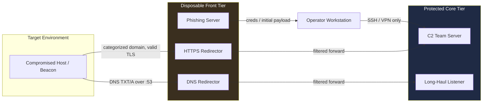
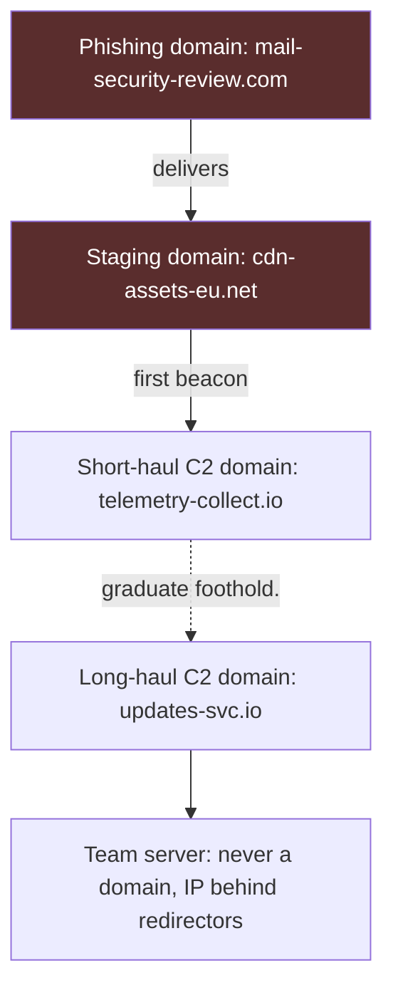
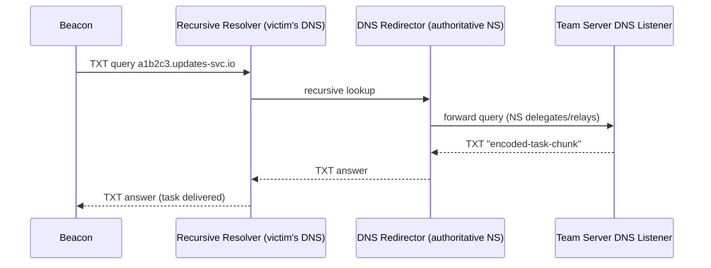
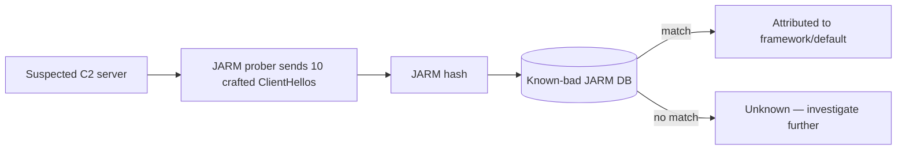
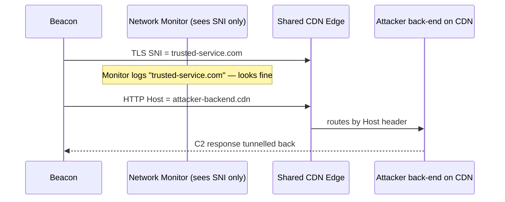
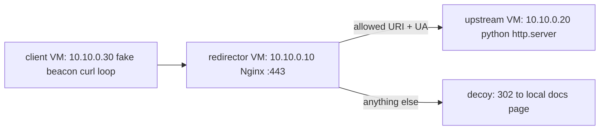
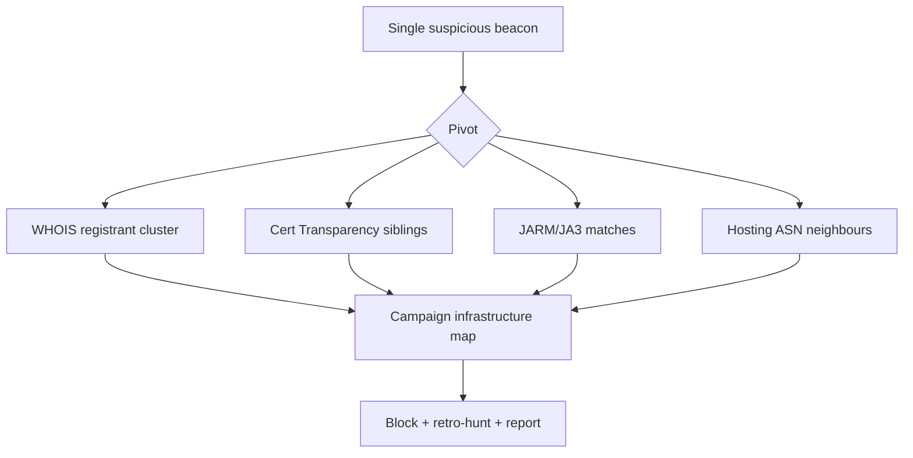

**Level:** Expert · **Track:** Red Team · **Read time:** 210 min

This is Chapter 5 of the Red Team Operations notebook. The previous four chapters
built the conceptual core of an engagement — how a red team differs from a
pentest, how command-and-control and beaconing actually work, and how both the
commercial (Cobalt Strike) and open-source (Sliver, Mythic, Havoc, Empire) C2
ecosystems are architected and, crucially, fingerprinted. Those chapters kept
asking the same question from the implant's point of view: *how does the beacon
talk home without getting caught?* This chapter zooms out one level and asks the
network-architecture version of that question: **what does "home" actually look
like, and how is it built so that burning one piece never burns the whole
operation?**

Everything here is written the same way the rest of this notebook treats
offensive tradecraft — **defender-first and lab-scoped**. You cannot detect
attacker infrastructure you do not understand, and you cannot design a resilient
purple-team exercise without knowing why a redirector exists. Nothing here is a
turnkey recipe against a third party; every lab is a benign, self-contained range
you own. The payoff: by the end you can look at a suspicious beacon in a SIEM and
reason backwards through the entire infrastructure that produced it.

---

## Why This Matters

When people imagine a red team "server," they picture a single box in the cloud
running C2. That mental model is not just simplified — it is the exact model that
gets operations caught, and the exact model a defender should *hope* the
adversary is using. Real intrusion infrastructure, whether it belongs to a
sanctioned red team or a criminal group, is **tiered, compartmentalized, and
disposable**. The C2 server that holds the operator's sessions is never the
server a victim endpoint talks to. Between them sit one or more **redirectors** —
cheap, stateless relays whose only job is to forward traffic and absorb the blast
radius when a domain or IP gets flagged.

Three forces shape all of this:

1. **Attribution asymmetry.** A defender who identifies one malicious IP will
   block it, report it, and often get it sinkholed within hours. If that IP is
   the real team server, the operation is over and the tooling is exposed. If it
   is a $5/month redirector, the operator swaps DNS and continues. Infrastructure
   design is fundamentally about making the cheap, exposed thing die instead of
   the expensive, secret thing.
2. **Reputation-based defense.** Modern controls — secure web gateways, EDR
   network modules, DNS filtering, email security — increasingly decide *allow or
   block* based on the **reputation and category** of a domain, not its content.
   A brand-new domain registered in the last day is suspicious by default. This is why
   attackers age domains, buy categorized ones, and abuse trusted CDNs.
3. **Telemetry everywhere.** TLS handshakes, DNS queries, HTTP headers, and JA3/
   JARM fingerprints are all logged somewhere. Sloppy infrastructure leaves
   fingerprints that cluster across campaigns — exactly how threat-intel teams tie
   ten "unrelated" intrusions to one actor.

For a blue teamer, this chapter is a field guide to the other side's supply
chain. For a purple teamer, it is the blueprint you emulate to test whether your
detections fire. For a red teamer operating under authorization, it is the
discipline that separates a professional engagement from a smash-and-grab that
gets the client's domain sinkholed and your C2 tooling signatured.

Here is the whole tiered picture we will build up, one layer at a time:



Notice the properties baked into that diagram: the operator never touches the
front tier directly, victims never touch the core, and each arrow crosses a trust
boundary where filtering happens. Keep this picture in mind — the rest of the
chapter is details about each box and each arrow.

---

## Part 1: The Tiered Infrastructure Model

The foundational design principle of intrusion infrastructure is **separation of
concerns by lifespan and sensitivity**. Different components have wildly different
"burn" tolerances, so they live in different tiers.

### 1.1 The functional roles

| Tier | Component | Burn tolerance | What it holds | If discovered |
|------|-----------|----------------|---------------|----------------|
| Core | **Team server** (C2) | Long — protected at all costs | Operator sessions, loot, keys | Operation compromised; tooling exposed |
| Front | **Long-haul redirector** | Medium — swap DNS if flagged | Nothing; stateless relay | Rotate domain, continue |
| Front | **Short-haul redirector** | Short — burns fastest | Nothing; stateless relay | Rotate, continue |
| Front | **Phishing infrastructure** | Very short — often single-use | Lures, cred-capture pages | Campaign burned, core untouched |
| Support | **Payload staging / hosting** | Short | Hosted payloads, profiles | Pull payload, rotate URL |

The rule that ties them together: **no line of the diagram may leak the identity
of a tier above it.** A redirector must not reveal the team server's IP; a
phishing server must not reveal the redirector's true purpose; the team server
must never be reachable except from operator management channels.

### 1.2 Short-haul vs long-haul

Beacons typically use two callback profiles:

- **Short-haul (interactive):** low sleep (seconds), used only during active
  operator work — hands-on-keyboard tasking. High-signal, so it runs through the
  most disposable redirector and is torn down quickly.
- **Long-haul (persistence):** high sleep (hours to a day), high jitter, used to
  keep a foothold alive between working sessions. It rides the most trusted,
  most-aged domain because it must survive weeks.

**Blue-team relevance:** the *transition* between these profiles is itself
detectable. A host that talks to a domain every few seconds for an hour, goes
silent, then checks in once every 8 hours to a *different* domain is exhibiting a
classic dual-channel C2 pattern. Beaconing analytics that only look at one
destination miss this; correlating both destinations by source host catches it.

### 1.3 The compartmentalization principle

Every campaign phase gets its own infrastructure so that burning one never
implicates another:



If the phishing domain is reported to an anti-abuse feed, the staging and C2
domains are untouched because they were never referenced from the phish. This is
**infrastructure segmentation**, and it is the single most important habit that
separates mature operations from amateur ones.

---

## Part 2: Redirectors — The Load-Bearing Wall

A **redirector** is a server that sits in front of the team server and forwards
approved traffic to it while dropping everything else. It is stateless: it holds
no C2 logic, no loot, no keys. If it is seized or blocked, the operator loses a
DNS record, not the operation.

### 2.1 Why redirectors exist (three jobs)

1. **Hide the team server IP.** Victims, sandboxes, and investigators only ever
   see the redirector's address. The real C2 stays off every block list.
2. **Filter hostile traffic.** Redirectors drop or divert anything that doesn't
   look like a real beacon — security scanners, curious analysts, sandbox
   detonations, wrong URIs, wrong User-Agents, wrong source geolocations.
3. **Provide a swap point.** When a domain is flagged, you re-point DNS at a fresh
   redirector VPS and the beacons follow, with the team server untouched.

### 2.2 Dumb pipe vs filtering redirector

The simplest redirector is a **dumb TCP pipe** — `socat` forwarding a port:

```bash
# Benign lab demo: forward local 443 to an internal team-server IP.
# In a real op this leaks nothing but also FILTERS nothing — hence "dumb".
socat TCP4-LISTEN:443,fork,reuseaddr TCP4:10.10.0.20:443
```

`socat` flags explained:

- `TCP4-LISTEN:443` — listen on IPv4 TCP port 443.
- `fork` — spawn a child per connection so multiple beacons are handled.
- `reuseaddr` — allow immediate rebind after restart (avoids "address already in
  use").
- `TCP4:10.10.0.20:443` — the upstream to forward to (the protected core).

The problem: a dumb pipe forwards a security researcher's `curl` just as happily
as a real beacon. That is why serious redirectors are **HTTP-aware** and filter.

### 2.3 Apache mod_rewrite filtering redirector

The classic filtering redirector is Apache with `mod_rewrite`. It inspects each
request and decides: **forward to C2**, or **redirect to a decoy** (a real,
innocuous website). Conceptually:

```apache
# /etc/apache2/sites-enabled/redirector.conf  (LAB ILLUSTRATION)
RewriteEngine On
SSLProxyEngine On

# 1) Only forward requests whose URI matches the C2 profile's paths.
RewriteCond %{REQUEST_URI} ^/(api/v2/telemetry|assets/main\.js)$ [NC]
# 2) Only forward the exact User-Agent the beacon is configured to send.
RewriteCond %{HTTP_USER_AGENT} "Mozilla/5\.0 \(Windows NT 10\.0; Win64; x64\)" [NC]
# 3) If both match, proxy to the hidden team server.
RewriteRule ^.*$ https://10.10.0.20%{REQUEST_URI} [P,L]

# Everything else: send it to a believable decoy site, NOT the C2.
RewriteRule ^.*$ https://www.example-vendor-docs.com/ [R=302,L]
```

Directive-by-directive:

- `RewriteEngine On` — enable rewriting.
- `SSLProxyEngine On` — allow proxying to an HTTPS upstream.
- `RewriteCond` — a condition that must be true for the following `RewriteRule`
  to fire; multiple conditions AND together by default.
- `%{REQUEST_URI}` / `%{HTTP_USER_AGENT}` — server variables holding the request
  path and UA header.
- `[NC]` — case-insensitive match.
- `[P]` — proxy the request (reverse-proxy pass-through).
- `[L]` — last rule; stop processing on match.
- `[R=302]` — issue an HTTP 302 redirect to the browser (used for the decoy
  path).

**Why the decoy matters:** if an analyst points a browser at the redirector's
domain, they should see a plausible, boring website — not a blank page, not a 404,
and certainly not a C2 login. A blank or broken response is itself a signal.

**Blue-team relevance:** this is why you cannot judge a domain by fetching its
root URL. The malicious behaviour only appears for the exact URI + UA + method
the beacon uses. Detection has to come from the *endpoint* (what process made the
connection) and from *beaconing regularity*, not from browsing the domain.

### 2.4 Nginx as a reverse-proxy redirector

Nginx is often preferred for HTTPS redirectors because of clean TLS handling and
`proxy_pass`:

```nginx
# /etc/nginx/sites-enabled/redirector (LAB ILLUSTRATION)
server {
    listen 443 ssl;
    server_name updates-svc.io;

    ssl_certificate     /etc/letsencrypt/live/updates-svc.io/fullchain.pem;
    ssl_certificate_key /etc/letsencrypt/live/updates-svc.io/privkey.pem;

    # Only these paths reach the C2; everything else 302s to a decoy.
    location ~ ^/(api/v2/telemetry|assets/main\.js)$ {
        if ($http_user_agent !~ "Windows NT 10\.0; Win64; x64") { return 302 https://example-vendor-docs.com/; }
        proxy_pass https://10.10.0.20;
        proxy_ssl_verify off;
        proxy_set_header Host $host;
        proxy_set_header X-Forwarded-For "";   # strip, don't leak beacon IP upstream logs
    }

    location / { return 302 https://example-vendor-docs.com/; }
}
```

Key directives:

- `listen 443 ssl` — terminate TLS here so the redirector presents a valid cert.
- `location ~ ^/(...)$` — regex match of allowed C2 URIs.
- `proxy_pass` — forward matching traffic to the hidden upstream.
- `proxy_ssl_verify off` — the upstream uses a self-signed cert internally; skip
  verification on the private hop (still TLS on the public hop).
- `proxy_set_header X-Forwarded-For ""` — deliberately *not* forwarding the real
  client IP, keeping upstream logs clean of victim addresses.

### 2.5 DNS redirectors

DNS C2 needs its own redirector because it speaks UDP/TCP 53 and the "traffic" is
encoded in subdomain labels and record answers. The redirector is an authoritative
name server for the operator's zone that forwards queries to the team server's DNS
listener.



**Blue-team relevance:** DNS C2's tells are high query volume to one zone, long
random-looking labels, unusual record types (lots of TXT/NULL), and low answer
diversity. DNS is often less monitored than HTTP, which is precisely why long-haul
channels favour it — and precisely why passive DNS logging is one of the highest-
value blue-team investments.

---

## Part 3: Domains — Reputation, Aging & Categorization

A redirector is only as trustworthy as the **domain** pointed at it. Reputation is
now a first-class security control, so domain selection is tradecraft in itself.

### 3.1 What "reputation" actually means

Secure web gateways and DNS filters (Cisco Umbrella, Zscaler, Netskope, Palo Alto
URL Filtering, etc.) assign each domain a **category** (e.g. "Business Services",
"Newly Registered Domain", "Malware") and a **risk score**. Decisions are made on
these, often before any content is inspected. The relevant properties:

| Property | Attacker wants | Defender uses it to |
|----------|----------------|---------------------|
| **Registration age** | Old (aged) | Flag Newly Registered Domains (NRDs) — a top-tier detection |
| **Category** | Benign (Business, IT) | Block "Uncategorized"/"Malware"/"NRD" categories outright |
| **Registrar / TLD** | Reputable registrar, common TLD | Score cheap/abused TLDs (.zip, .top, .xyz) higher risk |
| **WHOIS** | Clean, privacy-protected but consistent | Cluster domains sharing registrant fingerprints |
| **Passive DNS history** | Prior benign resolution history | Spot domains that "activate" suddenly |

### 3.2 Newly Registered Domains (NRDs) — the number-one tell

A domain registered in the last 30 days is statistically far more likely to be
malicious. Many enterprises simply **block all NRDs** for the first N days. This
single control defeats a huge fraction of lazy phishing. It is also why attackers:

- **Age domains:** register early and let them sit (weeks to months) before use.
- **Buy aged/expired domains:** acquire domains with existing history and a benign
  category already assigned.
- **Re-categorize:** submit a domain to categorization services so it lands in a
  benign bucket before the campaign.

**Blue-team relevance:** an NRD feed (e.g. from a passive-DNS or threat-intel
provider) fed into your DNS filter and SIEM is one of the cheapest high-value
detections available. Alert on first-seen resolutions to domains registered within
your chosen window.

### 3.3 Domain categorization abuse

Because categorization gates access, attackers try to get malicious domains
labelled "Business/IT". Historically this was done by hosting benign content and
requesting a category, or by abusing categorization-check portals. The defensive
takeaway: **category is a hint, not proof.** A "Business Services" domain with a
90-day-old certificate, no inbound links, and a single endpoint beaconing to it is
still suspicious. Correlate category with behaviour.

### 3.4 Naming and typosquatting

Operational domains are chosen to look boring and infrastructural — `updates-svc`,
`cdn-assets`, `telemetry-collect`, `mail-security-review`. For phishing, attackers
lean on **look-alikes**: homoglyphs, hyphenation, and TLD swaps of a real brand.

**Blue-team relevance:** register-and-monitor your own look-alikes, and run
detection (e.g. `dnstwist`) against your brands to catch squats early.

```bash
# Defensive use: enumerate look-alike domains of YOUR OWN brand to monitor/pre-register.
dnstwist --registered example.com
# --registered  : only show permutations that are actually registered (live threats)
```

---

## Part 4: TLS, Certificates & Network Fingerprints

Even perfect domain reputation fails if the *handshake* screams "C2 framework".
TLS is a rich fingerprinting surface.

### 4.1 Valid certificates are table stakes

Self-signed certs and framework-default certs are instant flags. Operators use
free, automatically-issued certificates so the padlock is green and the chain
validates:

```bash
# Issue a real cert for the redirector domain (LAB: a domain you own).
certbot certonly --standalone -d updates-svc.io
# certonly    : obtain the cert but don't auto-configure a server
# --standalone: certbot runs its own temporary listener on :80 for the ACME challenge
# -d          : the domain to certify
```

The historical default-cert failure: early Cobalt Strike shipped a self-signed
certificate with a specific serial and issuer that defenders signatured
network-wide. Any framework default — cert subject, JARM, HTTP headers — becomes a
cluster key.

### 4.2 JA3 / JA3S — client and server TLS fingerprints

**JA3** hashes the ordered set of fields a client offers in its TLS `ClientHello`
(version, cipher suites, extensions, elliptic curves, formats). Because a given
TLS library produces a consistent ordering, JA3 fingerprints the *client software*
— including many malware families and C2 implants that use a distinctive TLS
stack. **JA3S** is the server-side equivalent from the `ServerHello`.

### 4.3 JARM — active server fingerprint

**JARM** actively probes a server with ten crafted TLS `ClientHello`s and hashes
how the server responds. Two servers with the same C2 software and config produce
the same JARM, letting defenders and researchers **scan the whole internet** for
"servers that JARM-match a known Cobalt Strike / Sliver / Havoc default". This is
how large-scale C2 hunting works.



**The attacker countermeasure** is to change the JARM — by fronting with a
standard web server (Nginx terminating TLS with a normal config), by customizing
the C2 profile's TLS settings, or by riding a CDN so the visible JARM is the CDN's,
not the C2's. **This is a primary reason redirectors terminate TLS themselves** —
the internet-facing JARM becomes "generic Nginx", not "C2 framework".

| Fingerprint | Who computes it | What it identifies | Attacker mitigation |
|-------------|-----------------|--------------------|--------------------|
| **JA3** | Passive (sensor on wire) | Client TLS stack (implant) | Mimic a common browser's stack |
| **JA3S** | Passive | Server TLS stack | Front with common web server |
| **JARM** | Active (scanner) | Server config/framework | Terminate TLS at Nginx/CDN |
| **Cert subject/serial** | Passive/active | Default framework cert | Use real ACME cert |
| **HTTP headers/order** | Passive | Framework HTTP stack | Malleable profile tuning |

**Blue-team relevance:** JARM/JA3 are powerful but not infallible — false positives
happen when legitimate software shares a stack. Use them as *enrichment and
pivoting* signals, not sole verdicts. A JARM match plus an NRD plus a lone
beaconing endpoint is a high-confidence stack.

---

## Part 5: Domain Fronting & CDN Abuse

**Domain fronting** hides the true C2 destination by exploiting a mismatch between
the TLS SNI / HTTP Host and the actual routing on a shared CDN. Classically: the
TLS `ClientHello` SNI shows an innocent, high-reputation domain hosted on the same
CDN, while the inner HTTP `Host:` header names the attacker's back-end on that CDN.
Network monitors that only see SNI think the traffic goes to the innocent domain.



### 5.1 Why fronting declined

Major providers (Google, AWS/CloudFront, Azure) largely **broke classic fronting**
by enforcing that SNI and Host match, so the mismatch trick no longer routes. It
is not a reliable modern technique on those CDNs.

### 5.2 What replaced it: "domainless" fronting and CDN pass-through

Attackers shifted to:

- **CDN pass-through / reverse-proxy on a trusted platform:** hosting the
  redirector logic on a legitimate cloud service so the visible destination is the
  platform (`*.cloudfront.net`, `*.azureedge.net`, a serverless function URL, a
  workers domain). The traffic genuinely goes to the platform; the platform routes
  onward.
- **Abusing high-trust SaaS as a channel:** using legitimate services (cloud
  storage, collaboration webhooks, pastebins, code-hosting raw endpoints) as dead
  drops or relays so the destination is a universally-allowed domain.

**Blue-team relevance:** you cannot simply block the CDN — half your business runs
on it. Detection shifts to **endpoint context** (which *process* is making the
request; is it a browser or a random binary?), **volume/regularity** to the CDN
endpoint, and **decrypting/inspecting** at a TLS-terminating proxy where policy and
privacy allow, so the true Host is visible.

### 5.3 The trade-off table

| Technique | Visible destination | Blocks needed to kill | Blue-team counter |
|-----------|---------------------|-----------------------|-------------------|
| Direct IP C2 | Attacker IP | 1 IP block | Trivial — IP/domain block |
| Redirector + domain | Redirector domain | Domain block + swap race | NRD + beacon analytics |
| CDN pass-through | Trusted CDN domain | Can't block CDN wholesale | Endpoint process + TLS inspect |
| Trusted-SaaS channel | Major SaaS domain | Can't block SaaS | DLP + anomalous app usage |

The trend line is clear: as destinations become more trusted, network blocking
loses power and **endpoint + behavioural detection becomes the only reliable
control**. That is the strategic reason the industry pushes EDR and identity
telemetry so hard.

---

## Part 6: OPSEC — Compartmentalization & Operator Discipline

Infrastructure OPSEC is the set of habits that keep tiers separate and keep the
operator invisible.

### 6.1 The management plane is sacred

The team server is reachable **only** over a dedicated management channel — an SSH
key-only bastion or a VPN — never exposed to the internet on its C2 ports directly.
Common rules:

- SSH key auth only, no passwords; management port firewalled to operator IPs.
- No shared credentials across servers; each host its own key.
- Operators connect from a **dedicated VPS or VM**, never their personal machine,
  so their home IP never appears anywhere.

```bash
# Lab hardening example for a team server's SSH (management-plane only).
# /etc/ssh/sshd_config
PermitRootLogin no
PasswordAuthentication no
PubkeyAuthentication yes
AllowUsers operator@203.0.113.10   # only the operator jump host may connect
```

### 6.2 Attribution hygiene

Every action leaves a trace tied to *something*. OPSEC minimizes what those traces
tie back to:

- **Registrant separation:** each campaign's domains use distinct registrant
  details / privacy so WHOIS clustering fails.
- **Payment separation:** infrastructure is paid for in ways that don't cross-link
  campaigns.
- **Time hygiene:** operating hours that mimic the target's time zone avoid the
  classic "beacon only active 9–5 in a foreign time zone" tell.
- **No reuse:** never reuse a domain, cert, SSH key, or profile across engagements —
  reuse is exactly the thread threat-intel pulls to merge campaigns.

**Blue-team relevance:** these same properties are your *pivots*. Shared WHOIS,
shared TLS certs (via certificate transparency logs), shared JARM, and shared
hosting ASNs are how you expand from one indicator to a whole campaign's
infrastructure. Certificate Transparency (CT) logs in particular are a goldmine:
every publicly-issued cert is logged, so you can watch for certs issued to
look-alikes of your brand in near-real time.

### 6.3 Beacon OPSEC vs infrastructure OPSEC

The two interlock. A perfectly aged domain behind a CDN still gets caught if the
beacon sleeps for exactly 60.000 seconds with zero jitter. Infrastructure buys
*network* invisibility; the C2 profile and implant behaviour buy *host/behavioural*
invisibility. Chapter 7 covers the host side in depth; here the point is that
neither works alone.

---

## Part 7: Hands-On Lab — Build & Fingerprint a Redirector in an Isolated Range

**Goal:** stand up a benign HTTPS redirector in a lab you own, point a harmless
"beacon" (a scripted `curl` loop) at it through the redirector, then put on the
blue-team hat and fingerprint the setup exactly as a defender would. No third
party is touched; no real C2 or malware is used. This teaches both sides at once.

### 7.1 Lab topology



Three VMs on a host-only network. The "upstream" simply serves a text file to
stand in for a team server; the "beacon" is a `curl` loop.

### 7.2 Stand up the upstream (stand-in team server)

```bash
# On upstream VM 10.10.0.20 — serve a fake "task" file over TLS.
mkdir -p ~/upstream && cd ~/upstream
echo 'TASK: noop; sleep 30' > api_v2_telemetry
# Generate a self-signed cert for the INTERNAL hop only.
openssl req -x509 -newkey rsa:2048 -nodes -keyout key.pem -out cert.pem \
  -subj "/CN=internal-upstream" -days 7
# Minimal HTTPS server (Python) on 443.
sudo python3 - <<'PY'
import http.server, ssl
srv = http.server.HTTPServer(('0.0.0.0',443), http.server.SimpleHTTPRequestHandler)
ctx = ssl.SSLContext(ssl.PROTOCOL_TLS_SERVER)
ctx.load_cert_chain('cert.pem','key.pem')
srv.socket = ctx.wrap_socket(srv.socket, server_side=True)
srv.serve_forever()
PY
```

Flag/notes:

- `openssl req -x509 -newkey rsa:2048 -nodes` — self-signed cert, new 2048-bit RSA
  key, `-nodes` = no passphrase on the key.
- The Python server is deliberately trivial; it just proves forwarding works.

### 7.3 Configure the Nginx redirector

```nginx
# On redirector VM 10.10.0.10 — /etc/nginx/sites-enabled/lab
server {
    listen 443 ssl;
    server_name lab.local;
    ssl_certificate     /etc/nginx/lab/cert.pem;      # a self-signed lab cert
    ssl_certificate_key /etc/nginx/lab/key.pem;

    location = /api_v2_telemetry {
        if ($http_user_agent !~ "LabBeacon/1.0") { return 302 http://lab.local/docs; }
        proxy_pass https://10.10.0.20/api_v2_telemetry;
        proxy_ssl_verify off;
    }
    location /docs { return 200 "vendor docs placeholder\n"; }
    location /     { return 302 http://lab.local/docs; }
}
```

```bash
sudo nginx -t && sudo systemctl reload nginx
# nginx -t : validate config syntax before reloading (never reload a broken config)
```

### 7.4 Run the harmless "beacon"

```bash
# On client VM 10.10.0.30 — a benign beacon: correct UA + path gets the "task".
while true; do
  curl -sk -A "LabBeacon/1.0" https://10.10.0.10/api_v2_telemetry
  sleep 30
done
```

Expected output each cycle:

```
TASK: noop; sleep 30
```

Now prove the filter works — the *wrong* UA is redirected to the decoy, never
reaching the upstream:

```bash
curl -skI -A "curl/8.5.0" https://10.10.0.10/api_v2_telemetry
```

```
HTTP/1.1 302 Moved Temporarily
Server: nginx
Location: http://lab.local/docs
```

That 302-to-decoy for the "wrong" client, versus the real task for the "right"
client, **is** the redirector doing its one job.

### 7.5 Blue-team hat: fingerprint your own lab

Now analyze the redirector like a defender who found the domain:

```bash
# 1) Look at the TLS layer — what cert and JARM does the front present?
echo | openssl s_client -connect 10.10.0.10:443 2>/dev/null | openssl x509 -noout -subject -issuer -dates
# Reveals a self-signed lab cert — in a real hunt, a self-signed or default cert is a flag.

# 2) Compute a JARM fingerprint (clone the open-source jarm tool in the lab).
python3 jarm.py 10.10.0.10
# Record the hash; compare against known-framework JARMs. Generic Nginx != framework default.

# 3) Behavioural: capture the beacon's regularity.
sudo tcpdump -ni eth0 host 10.10.0.30 and port 443 -tt | awk '{print $1}'
# The near-constant 30s inter-arrival is the classic beaconing tell — jitterless traffic.
```

**What you just demonstrated to yourself:** browsing the domain shows only a boring
"vendor docs" page (the decoy); the malicious path is invisible without the exact
UA; and yet the *behaviour* (fixed-interval callbacks from one host) and the *TLS
fingerprint* still betray the setup. That is the whole thesis of the chapter in one
lab: network hiding is strong, but endpoint + behavioural + fingerprint analysis
still wins.

---

## Part 8: Automating Build-Out (and Why That Helps Defenders Too)

Standing up tiers by hand is slow and error-prone, so teams automate with
**infrastructure-as-code** (Terraform, Ansible) and profile generators. A single
`terraform apply` can create VPSs, DNS records, firewall rules, and TLS certs for
an entire disposable front tier, then `terraform destroy` tears it down after the
engagement so nothing lingers.

```hcl
# ILLUSTRATIVE Terraform sketch — a disposable redirector VPS + firewall.
resource "cloud_server" "redirector" {
  name  = "rdr-01"
  image = "ubuntu-22.04"
  # user_data bootstraps Nginx + certbot for the redirector role
}
resource "cloud_firewall" "rdr_fw" {
  # only 443 from the internet; 22 only from operator jump host
  rule { protocol = "tcp"; port = "443"; source = "0.0.0.0/0" }
  rule { protocol = "tcp"; port = "22";  source = "203.0.113.10/32" }
}
```

**Why this matters to defenders (RedELK and friends):** mature red teams run
**RedELK** — an Elastic stack that ingests redirector and team-server logs so
operators can *see themselves the way a blue team would*, spot when a beacon is
being investigated (e.g. a non-beacon IP hitting C2 paths), and catch their own
OPSEC mistakes. The very existence of RedELK proves the point: the offensive craft
and the defensive craft are the same knowledge viewed from two chairs. A blue
teamer who studies RedELK's detections learns exactly which redirector artifacts
are worth alerting on.

---

## Part 9: Real-World Patterns & Case Studies

- **Cobalt Strike default TLS cert (historical):** the framework's out-of-the-box
  self-signed certificate had a recognizable serial/issuer that defenders and
  scanners (Shodan/Censys queries) used to find live team servers worldwide. The
  lesson institutionalized "never ship defaults" and drove JARM-based hunting.
- **Domain fronting via major CDNs (2016–2018), then its removal:** widely used by
  both red teams and real threat actors to tunnel through trusted domains, until
  Google and AWS disabled the SNI/Host mismatch, forcing the shift to CDN
  pass-through and trusted-SaaS channels described in Part 5.
- **Aged/expired-domain marketplaces:** the ecosystem of buying pre-categorized,
  history-rich domains exists specifically to defeat NRD blocking, and is regularly
  observed in commodity phishing and access-broker operations.
- **CT-log monitoring wins:** defenders repeatedly catch phishing infrastructure
  the moment a look-alike domain requests a certificate, because that issuance is
  published to Certificate Transparency logs in near-real time — often before the
  campaign even launches.

Each case reinforces the same loop: an attacker technique creates a fingerprint, a
defender learns the fingerprint, the attacker adapts, and the fingerprint moves up
the stack (from IP → domain → cert → CDN → behaviour).

---

## Part 10: Detection & Defense Angle (Consolidated)

This is the section a blue teamer implements. Everything above exists to make the
detections below possible.

### 10.1 Network & DNS

- **Block/alert on Newly Registered Domains** for the first N days (feed an NRD
  list into DNS filtering + SIEM). Highest ROI single control here.
- **Passive DNS logging** of all resolutions; alert on first-seen domains, high
  TXT/NULL volume (DNS C2), and long random subdomain labels (entropy scoring).
- **Beaconing analytics:** cluster outbound connections by (src host, dst domain)
  and score for fixed intervals + low jitter + consistent byte sizes. Correlate
  *dual-channel* short/long-haul patterns to the same source host.
- **TLS fingerprinting (JA3/JA3S/JARM)** as enrichment/pivot, never as a sole
  verdict. Pivot from one match to related infrastructure.
- **Certificate Transparency monitoring** for look-alikes of your brands; alert on
  new cert issuance to squats.

### 10.2 Endpoint (the control network can't evade)

- **Process-to-network mapping:** *which process* opened the connection? A non-
  browser binary talking to a CDN on a fixed cadence is far more suspicious than
  the same destination from a browser. This is the single detection that survives
  CDN/SaaS-channel evasion.
- **Parent-child anomalies** (Office spawning a network-calling child, covered in
  Chapter 6) tie the network event to a delivery event.

### 10.3 Web-gateway & proxy

- **TLS inspection** where policy/privacy permit, so the true Host (not just SNI)
  is visible — the counter to CDN pass-through.
- **Category + behaviour fusion:** don't trust "Business Services" alone; combine
  category with age, inbound-link scarcity, and lone-beacon behaviour.

### 10.4 Threat-intel & hunting

- Pivot on shared WHOIS registrant, shared certs (CT), shared JARM, shared hosting
  ASN to expand one indicator into a campaign map.
- Feed confirmed redirector/C2 domains back into blocking and retro-hunt.



---

## Part 11: Common Pitfalls & Misconfigurations

**Attacker-side pitfalls (which are your detections):**

- **Default everything** — framework default cert, default JARM, default HTTP
  headers, default C2 profile URIs. Instantly clustered and scanned.
- **Blank/broken decoy** — a redirector whose "wrong" requests return 404, blank,
  or an error page instead of a believable site. A boring-but-real decoy is
  mandatory.
- **Leaking the core IP** — forgetting `X-Forwarded-For` stripping, verbose error
  pages, or a `location /server-status` left enabled that reveals the upstream.
- **Reusing infrastructure** across engagements — the fastest way to get two
  operations merged by threat intel.
- **Jitterless beacons** behind perfect infrastructure — the domain is clean but
  the traffic is a metronome.
- **Time-zone tells** — the beacon is only ever active during the operator's
  working hours in a different region than the target.

**Defender-side pitfalls:**

- **Judging a domain by its root page** — the malicious path is invisible without
  the exact UA/URI; browse-testing proves nothing.
- **Treating JARM/JA3 as verdicts** — false positives on shared stacks; use as
  pivots.
- **Blocking the CDN wholesale** — breaks the business; you must move to endpoint
  and behavioural detection instead.
- **Ignoring DNS** — the least-monitored channel is exactly where long-haul C2
  hides.

---

## Part 12: Final Revision / Summary

- Intrusion infrastructure is **tiered and disposable**: a protected core (team
  server) hidden behind cheap, stateless **redirectors** and single-use phishing
  and staging tiers. Burning the front never burns the core.
- **Redirectors** hide the team-server IP, **filter** hostile traffic (by URI, UA,
  method, geo), and provide a **swap point**. Dumb `socat` pipes forward; Apache
  `mod_rewrite` and Nginx `proxy_pass` *filter* and send non-beacons to a
  believable **decoy**.
- **DNS redirectors** relay subdomain-encoded C2 over port 53 — powerful for
  long-haul, but detectable by query volume, record type, and label entropy.
- **Domain reputation** is now a control: age, category, registrar, WHOIS, and
  passive-DNS history all matter. **Newly Registered Domain** blocking is the
  single highest-ROI defense.
- **TLS is a fingerprint surface:** valid ACME certs are table stakes; **JA3/JA3S**
  (passive client/server) and **JARM** (active server) let defenders hunt C2
  internet-wide. Attackers counter by terminating TLS at generic web servers/CDNs.
- **Domain fronting** largely died on major CDNs (SNI/Host now must match);
  attackers moved to **CDN pass-through** and **trusted-SaaS channels**, which
  push detection onto the **endpoint and behaviour** because you can't block the
  CDN.
- **OPSEC** = compartmentalization (no tier leaks the one above), a sacred
  management plane (key-only bastion/VPN), attribution hygiene (no reuse of
  domains/certs/keys), and matching the target's rhythm.
- The recurring theme: as destinations become more trusted, **network blocking
  loses power and endpoint + behavioural + fingerprint analysis wins.** Build your
  blue-team program around that shift.

---

## Part 13: Cheat Sheet / Quick Reference

**Tiers (burn order, fastest first):** phishing → staging → short-haul redirector →
long-haul redirector → team server (never burns).

**Redirector filters (allow only if ALL match):** exact URI(s), exact User-Agent,
expected method, expected source geo; else → 302 to a real decoy site.

| Task | Tool / knob |
|------|-------------|
| Dumb TCP forward | `socat TCP-LISTEN:443,fork,reuseaddr TCP:core:443` |
| Filtering HTTP redirector | Apache `mod_rewrite` `[P,L]` + `RewriteCond` UA/URI |
| Reverse-proxy redirector | Nginx `proxy_pass` + `location ~` + UA `if` guard |
| Real TLS cert | `certbot certonly --standalone -d domain` |
| Inspect a server cert | `openssl s_client -connect host:443 \| openssl x509 -noout -subject -dates` |
| Look-alike monitoring (your brand) | `dnstwist --registered yourbrand.com` |
| Beacon interval check | `tcpdump -tt host <src> and port 443` → inspect inter-arrival |

**Fingerprints:** JA3 = client TLS stack (passive) · JA3S = server TLS stack
(passive) · JARM = active server probe · Cert subject/serial · HTTP header order.

**Top blue-team controls:** NRD blocking · passive DNS + entropy/TXT alerts ·
beacon interval/jitter analytics · process→network mapping · CT-log look-alike
monitoring · JARM/JA3 as *pivots*.

**Golden rules:** never ship defaults · always have a believable decoy · never
reuse infrastructure · management plane is key-only and IP-restricted · the
endpoint sees what the network can't.

---

## Part 14: Practice Labs & Resources

Train the exact skills in this chapter — both building intuition and, more
importantly, detecting the results — in these environments:

- **TryHackMe — "Red Team" pathway** (Intro to C2, Red Team Fundamentals,
  Firewalls/Bypass rooms): stand up and reason about redirectors and C2 profiles
  in a sanctioned range.
- **TryHackMe — "Follina", "Snort", "Zeek", "Brim"** rooms: practise the *blue*
  side — writing network/DNS detections and hunting beaconing in packet captures.
- **HackTheBox — Pro Labs (e.g. Dante/Offshore/Cybernetics)**: multi-host ranges
  where pivoting and infrastructure discipline matter end-to-end.
- **RedELK (open source):** deploy it against your own lab redirector + team
  server to *see your operation as a blue team would* — the best way to learn which
  artifacts are detectable.
- **Cobalt Strike / Sliver community docs & Malleable-C2 references:** read how C2
  profiles shape URIs, headers, and TLS — then write detections against the
  defaults.
- **`dnstwist`, `jarm`, `certstream`/CT-log tooling:** run these against domains
  you own to internalize NRD, look-alike, and certificate-transparency detection.
- **DetectionLab / a home ESXi/Proxmox range:** build the three-VM redirector lab
  from Part 7, then wire Zeek/Suricata + an ELK stack and prove your beacon
  analytics fire.

Work the lab in Part 7 until you can, from a packet capture alone, (a) tell that a
domain is fronting a hidden upstream, (b) show why browsing its root proves
nothing, and (c) name the two signals (fixed-interval behaviour and TLS
fingerprint) that still give it away. When that reasoning is automatic, you
understand attacker infrastructure well enough to defeat it — which is the entire
point. The next chapter moves from *where C2 lives* to *how the first foothold is
delivered*: initial access, phishing infrastructure, payloads, and delivery.

---

*Also on [Praneeth's portfolio](https://ping-praneeth.vercel.app/notebook/redteam-operations/05-red-team-infrastructure-redirectors-domains-and-opsec), with comments and the latest edits.*
