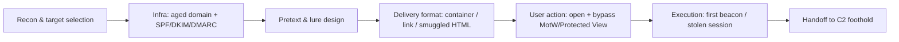
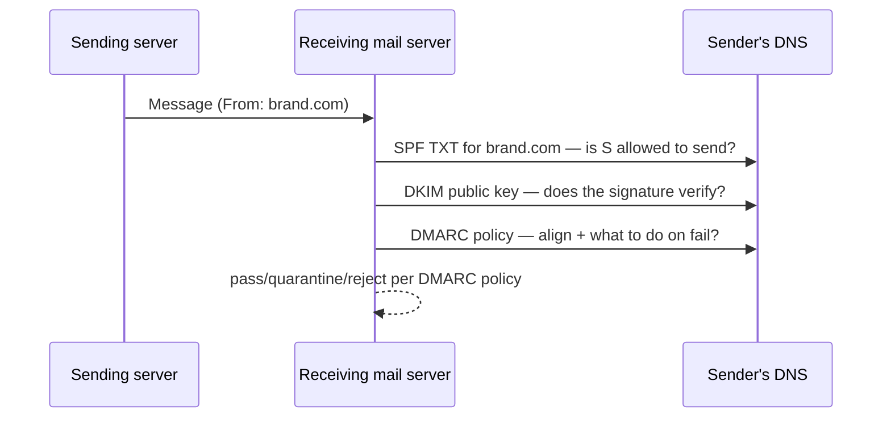
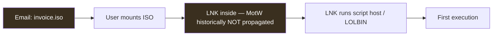
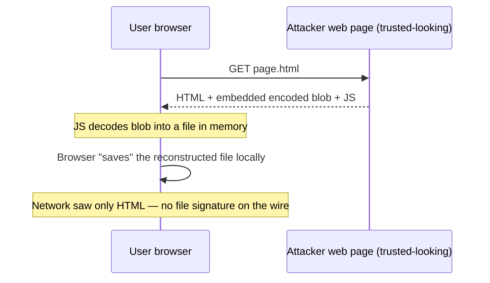
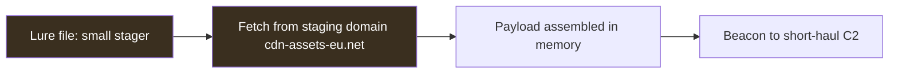
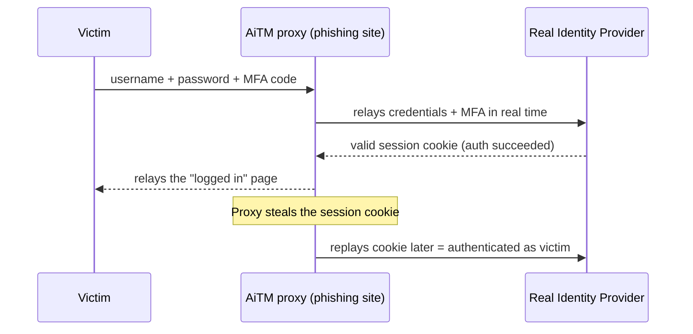
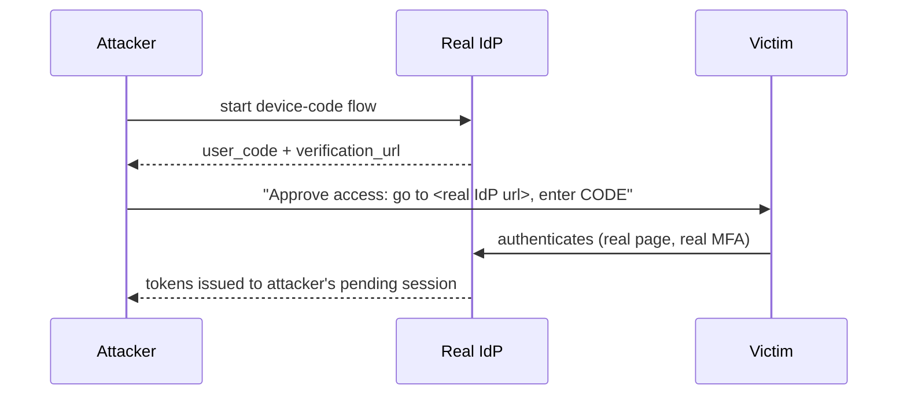
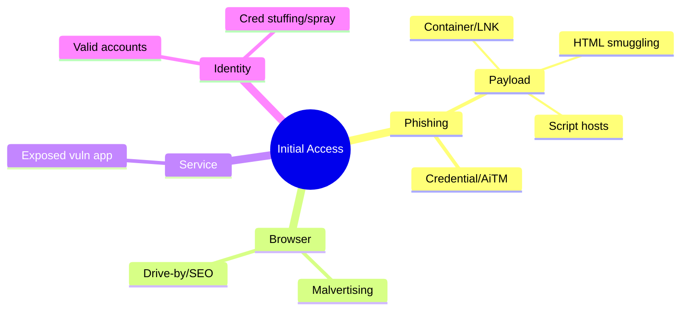
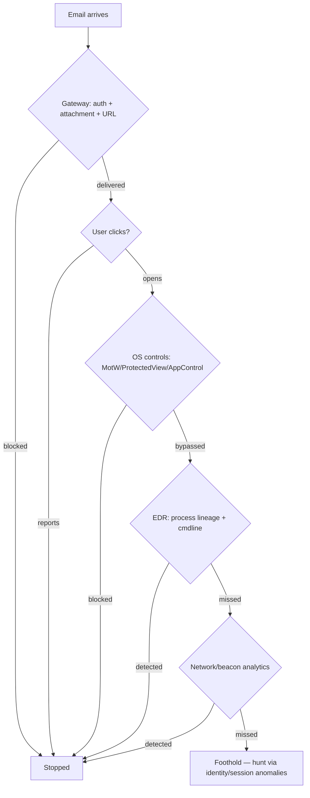

This is Chapter 6 of the Red Team Operations notebook. Chapter 5 built the
*infrastructure* an operation runs on — the tiered team-server/redirector model,
domain reputation, TLS fingerprints, and the OPSEC that keeps it all
compartmentalized. That infrastructure is useless until something is running
inside the target. This chapter is about that first something: **initial access** —
how a red team gets its first execution on a target endpoint, and, in equal
measure, how a defender's email gateway, browser, operating system, and EDR are
each designed to stop it.

As with every offensive chapter in this notebook, the treatment is **defender-
first and lab-scoped**. There is no working malware here, no live phishing against
any real person, and no copy-paste weaponization. What there *is*: a precise,
mechanism-level understanding of each delivery technique and the exact telemetry
it produces — because a SOC analyst who cannot explain *why* an ISO with a single
LNK inside is suspicious cannot write the rule that catches it. The payoff is a
mental model complete enough to build detections, run authorized purple-team
tests, and reason about real intrusions.

---

## Why This Matters

Initial access is the hinge of the entire ATT&CK matrix. Everything downstream —
privilege escalation, lateral movement, exfiltration — presupposes that *code ran
on a box that shouldn't have run it*. According to a decade of incident data, the
overwhelming majority of intrusions begin with one of a small handful of vectors:
**phishing** (by far the largest), exploitation of an exposed service, valid
credentials from prior breaches, and supply-chain/trust relationships.

Three realities make this chapter's mechanics matter:

1. **The macro era is over; the container era arrived.** For years, malicious
   Office macros were *the* delivery vehicle. When Microsoft began blocking macros
   in files marked with the **Mark-of-the-Web (MotW)** by default, attackers pivoted
   en masse to **container files** (ISO, IMG, VHD) and **shortcut/script formats**
   (LNK, JS, HTA, OneNote) specifically because those either don't propagate MotW
   to their contents or bypass the macro control entirely. Understanding *why the
   pivot happened* is the key to understanding current lures.
2. **The endpoint is the last honest witness.** Modern phishing rides trusted
   infrastructure (Chapter 5) and valid TLS, so the network sees "user downloaded a
   file from a reputable-looking domain." The truth only surfaces on the host: what
   process opened the file, what child it spawned, whether MotW was present, what
   the child then did. Initial-access detection is overwhelmingly an **endpoint and
   email-header** discipline.
3. **MFA changed the credential game.** Simple credential-harvesting phishing is
   increasingly defeated by MFA — so attackers moved to **adversary-in-the-middle
   (AiTM)** phishing that proxies the real login and steals the *session token*,
   and to MFA-fatigue and OAuth-consent abuse. Defenders had to move from "did the
   password leak?" to "is this session anomalous?"

Here is the initial-access kill-chain we will unpack:



Every arrow is a defensive control point. The chapter walks them left to right,
and at each one asks the two questions that matter: *what does the attacker do,
and what does that leave behind for the defender?*

---

## Part 1: The Initial-Access Landscape

### 1.1 The vectors, ranked by real-world prevalence

| Vector | Mechanism | Primary defense | Notes |
|--------|-----------|-----------------|-------|
| **Phishing (payload)** | Email delivers a file/link that executes code | Email filtering + MotW + EDR | The dominant vector; the focus of this chapter |
| **Phishing (credential/AiTM)** | Email lures user to fake or proxied login | MFA + phishing-resistant auth + session analytics | Steals passwords or session tokens |
| **Exploit public-facing app** | Vuln in an internet-exposed service | Patching + WAF + attack-surface mgmt | Covered in the pentest notebooks |
| **Valid accounts** | Reused/breached credentials | MFA + impossible-travel + leaked-cred monitoring | No malware needed |
| **Trusted relationship / supply chain** | Compromise a vendor/MSP with access | Third-party risk + least privilege | High impact, low volume |
| **Removable media** | USB drop | Device control + MotW-equivalent | Niche but real in some sectors |

This chapter concentrates on the two phishing rows because they are where a red
team spends most initial-access effort and where the richest, most teachable
detection surface lives.

### 1.2 The "assume the click" principle

Mature defenders do **not** assume they can stop every user from clicking. Given a
large enough population and a good enough pretext, *someone* clicks. So the modern
posture is layered: reduce the volume that arrives (email security), reduce what a
click can do (MotW, Protected View, application control, disabled script hosts),
and detect what execution looks like (EDR behavioural rules). A red team that
understands this layering designs its delivery to slip a specific layer; a blue
team that understands it knows *which layer* each technique is attacking.

---

## Part 2: Phishing Infrastructure & Sender Authentication

Chapter 5 covered domains and redirectors generally. Phishing adds an **email
authentication** dimension: SPF, DKIM, and DMARC decide whether a message even
reaches the inbox.

### 2.1 SPF, DKIM, DMARC — the three checks



- **SPF (Sender Policy Framework):** a DNS TXT record listing which IPs may send
  mail for a domain. The receiver checks the connecting server's IP against it.
- **DKIM (DomainKeys Identified Mail):** the sender cryptographically signs the
  message with a private key; the receiver verifies using the public key in DNS.
  Proves the message wasn't altered and came from the domain.
- **DMARC:** ties SPF/DKIM to the visible `From:` domain (**alignment**) and tells
  receivers what to do on failure — `p=none` (monitor), `p=quarantine` (spam
  folder), or `p=reject` (drop).

### 2.2 How attackers work around it — and how defenders shut each down

| Attacker approach | Why it can work | Defender counter |
|-------------------|-----------------|------------------|
| **Register a look-alike domain** and fully configure SPF/DKIM/DMARC on *it* | The phish passes auth — for the wrong domain | User/link inspection; brand look-alike monitoring; block NRDs |
| **Abuse a domain with weak/no DMARC** (`p=none`) to spoof the real brand | Receivers don't reject on fail | Publish `p=reject`; external banners; anti-spoofing |
| **Compromise a real mailbox** and send from it | Perfect auth, real domain, real trust | Impossible-travel, anomalous send volume, MFA |
| **Use a trusted bulk sender / SaaS** to relay | Sender reputation is high | Detect unusual template + link patterns |

**Blue-team relevance:** the biggest self-inflicted wound is publishing DMARC
`p=none` forever. It generates reports but never actually stops spoofing. Moving to
`p=quarantine` then `p=reject` (after reading the aggregate reports to avoid
breaking legitimate senders) is one of the highest-impact anti-phishing steps an
org can take. External-sender banners and "first contact" flags catch look-alikes
that pass auth on their own domain.

### 2.3 Deliverability warm-up

New sending domains/IPs have no reputation, so bulk mail from them lands in spam.
Attackers "warm up" a domain (gradual, human-like sending) just as legitimate
marketers do. **Detection:** brand-new sending domains with sudden volume, or a
first-ever email from an external domain to many internal recipients at once, are
strong signals.

---

## Part 3: Pretext & Lure Design (the human layer)

The delivery format is plumbing; the **pretext** is what makes a person act. This
notebook's social-engineering notebook covers persuasion psychology in depth; here
the focus is how the pretext shapes the *technical* delivery.

### 3.1 Pretext archetypes

- **Authority / IT:** "Security review — verify your account," "mailbox over
  quota," "new MFA enrollment." Drives credential/AiTM phishing.
- **Business process:** invoice, purchase order, shipping notice, résumé,
  contract. Drives document/container payload phishing (finance/HR open these for a
  living).
- **Urgency / fear:** "unusual sign-in," "payroll change deadline." Compresses the
  victim's decision time so they skip scrutiny.
- **Curiosity / reward:** bonus, reorg, benefits update.

The pretext dictates the file type: an "invoice" justifies a PDF/archive; an "HR
policy" justifies a document; an "IT MFA reset" justifies a link, not a file.

**Blue-team relevance:** awareness training and simulated phishing should mirror
*these* archetypes, and reporting rates on each tell you where the org is weak.
The security-awareness chapter in the social-engineering notebook covers building
that program.

| Pretext archetype | Typical target role | Justified format | Emotional lever |
|-------------------|---------------------|------------------|-----------------|
| Authority / IT | Any employee | Link (login/MFA) | Compliance, trust |
| Business process | Finance, HR, procurement | Document/container | Routine, duty |
| Urgency / fear | Any employee | Link or document | Time pressure |
| Curiosity / reward | Any employee | Link or document | Anticipation |
| Vendor/partner | Ops, finance | Reply-chain document | Established trust |

The mapping matters technically: a defender tuning attachment/URL policy should
expect **containers and documents** to arrive under business-process pretexts to
finance/HR, and **links** under IT/authority pretexts to everyone — so per-
department detection tuning (finance sees more invoice-archives; help-desk sees
more "reset" links) outperforms one flat ruleset.

### 3.2 Lure quality tells (for the defender)

Even good phishing leaves seams: slightly-off sender display names, mismatched
reply-to, look-alike domains, urgency + unusual request, external banner on a
"internal" message, or a link whose visible text differs from its target. Training
users to hover-and-read the true URL and to report rather than click is the
cheapest control in the whole chapter.

---

## Part 4: The Delivery-Format Landscape

This is the technical heart of the chapter: the file/link formats used to carry
first execution, why each exists, and what each leaves behind. **Everything below
is descriptive — mechanism and telemetry — not a build recipe.**

### 4.1 Mark-of-the-Web: the control everything revolves around

When a file is downloaded from the internet (browser, email client), Windows tags
it with a **Mark-of-the-Web (MotW)** — an NTFS alternate data stream
`Zone.Identifier` recording that the file came from the internet zone.

```powershell
# Benign demo: inspect MotW on a downloaded file (read-only).
Get-Content .\downloaded.docx -Stream Zone.Identifier
# Output like:
# [ZoneTransfer]
# ZoneId=3        # 3 = Internet zone
# ReferrerUrl=... HostUrl=...
```

MotW is what triggers **Protected View** in Office, **SmartScreen** prompts, and —
critically — the **default blocking of macros** in Office files from the internet.
The entire post-macro delivery meta-game is about **whether a container format
propagates MotW to the files inside it**.

### 4.2 Why containers (ISO/IMG/VHD) rose

Historically, when a user mounted an ISO/IMG and ran a file inside, Windows did
**not** propagate MotW to the extracted contents — so an executable or LNK inside a
downloaded ISO ran *without* the internet-zone restrictions that would have applied
to the same file downloaded directly. That single gap is why container smuggling
exploded after macros were curbed.



Microsoft has since tightened MotW propagation for several container types, which
is why the landscape keeps shifting. **Blue-team relevance:** flagging mounted
ISO/IMG/VHD files that arrived by email — especially small ones containing a single
LNK or script — is a high-value detection, because legitimate business email almost
never delivers a disk image.

### 4.3 LNK (shortcut) abuse

A Windows `.lnk` shortcut can point at a script host or LOLBIN with arguments, so
"opening" what looks like a document actually launches, say, `powershell.exe` or
`mshta.exe` with a crafted command line. LNKs are popular because their target and
arguments are hidden behind a familiar icon.

**Detection surface:** LNK files that spawn script interpreters, unusually long or
obfuscated LNK command-line arguments, and LNKs arriving inside archives/containers.
EDR that logs process creation with full command lines catches the spawn even when
the LNK itself looks benign.

### 4.4 HTML smuggling

**HTML smuggling** hides a payload *inside* an HTML page as encoded data
(JavaScript reconstructs the file client-side using a Blob and triggers a
download), so nothing malicious traverses the network as a file — the "download"
is assembled in the browser. This slips content filters that scan for file
signatures on the wire.



**Detection surface:** this is a case where the *endpoint and browser* win — the
reconstructed file still lands on disk (often with MotW if the browser applies it),
still needs a user to run it, and still spawns a detectable child process. Some
email/web gateways now detect the tell-tale JS blob-assembly pattern; browser
download telemetry and MotW on the resulting file remain reliable.

### 4.5 Malicious documents, macros & the post-macro world

- **Macros (VBA):** the classic vector — an Office doc whose macro runs on open.
  Now blocked by default for internet-origin files (MotW), which is why volume
  moved elsewhere. Still relevant where MotW is stripped (e.g. delivered inside a
  container) or where org policy re-enables macros.
- **OneNote (.one):** briefly surged because OneNote could embed files/scripts that
  users click to run, and it didn't inherit the same macro restrictions — Microsoft
  responded with added protections.
- **DDE, remote template injection, and object embedding:** older document-based
  execution tricks, each progressively mitigated.

**Detection surface:** the crown-jewel detection here is **parent-child process
anomaly** — an Office app (`WINWORD.EXE`, `EXCEL.EXE`, `ONENOTE.EXE`) spawning
`powershell.exe`, `cmd.exe`, `wscript.exe`, `mshta.exe`, or `rundll32.exe`. That
lineage is abnormal for a document being read and is one of the most durable
initial-access detections in existence.

### 4.6 Archives (ZIP/RAR/7z) and password protection

Attackers wrap payloads in archives — sometimes password-protected (password in the
email body) — specifically to **defeat gateway scanning**, which can't inspect an
encrypted archive, and to **strip or complicate MotW** on extraction. 

**Detection surface:** password-protected archives from external senders (with the
password helpfully in the email), archives containing a single executable/LNK/
script, and extraction events feeding directly into a script-host spawn.

### 4.7 The format meta-game, summarized

| Format | Why attackers use it | What defeats / detects it |
|--------|----------------------|---------------------------|
| **VBA macro doc** | Historically ubiquitous | Default macro block on MotW files; Office→script spawn |
| **ISO / IMG / VHD** | Historically didn't propagate MotW | Flag emailed disk images; tightened MotW; single-LNK content |
| **LNK** | Hides launch of script host/LOLBIN | Process-creation lineage + command-line logging |
| **HTML smuggling** | No file on the wire | Endpoint/browser download telemetry; MotW on result |
| **OneNote embed** | Skirted macro controls | Added MS protections; ONENOTE→script spawn |
| **Password ZIP/RAR** | Defeats gateway scanning | External encrypted-archive policy; single-payload content |
| **JS/HTA/WSF scripts** | Direct script-host execution | Disable/relaunch WSH; script-host spawn alerts |

The through-line: **every format is chosen to attack a specific control (MotW,
gateway scanning, or macro blocking), and every one still produces an endpoint
lineage that a properly-instrumented EDR sees.**

### 4.8 Script hosts: JS, HTA, WSF, VBS

Windows ships several **script interpreters** that will happily run a
double-clicked script file, historically with no MotW-driven block:

- **`.js` / `.jse` (JScript via `wscript.exe`/`cscript.exe`)** — a "JavaScript"
  file on Windows does *not* run in the browser sandbox; it runs on the **Windows
  Script Host (WSH)** with full user privileges.
- **`.hta` (HTML Application via `mshta.exe`)** — an HTML file that runs *outside*
  the browser security model, with local execution rights. `mshta.exe` is a signed
  Microsoft binary, which is exactly why it's abused.
- **`.wsf` (Windows Script File)** — an XML wrapper that can combine JScript and
  VBScript.
- **`.vbs` (VBScript via WSH)** — legacy but still executes where WSH is enabled.

**Detection surface:** `wscript.exe`, `cscript.exe`, and `mshta.exe` launching from
a user's Downloads/Temp folder, or as a child of a mail client, browser, or archive
tool, is high-signal. The strongest posture is to **disable or heavily restrict
WSH** and block `mshta.exe`/HTA associations via application control — removing the
interpreter removes the whole class.

### 4.9 Signed-binary proxy execution (LOLBins / LOLBAS)

Rather than dropping a novel executable (which EDR scrutinizes), delivery
frequently launches a **Living-off-the-Land Binary (LOLBin)** — a legitimate,
Microsoft-signed Windows utility that can be coaxed into executing attacker-
supplied code or fetching a remote payload. The community-maintained **LOLBAS**
project catalogs these. Representative examples (conceptual — detection focus):

| LOLBin | Legitimate purpose | Abuse pattern | Detection cue |
|--------|--------------------|----------------|---------------|
| `mshta.exe` | Run HTA apps | Execute remote/inline script | mshta with URL/script arg |
| `rundll32.exe` | Run DLL exports | Invoke code via export/JS | rundll32 with odd args/no DLL |
| `regsvr32.exe` | Register COM DLLs | "Squiblydoo" remote scriptlet | regsvr32 `/i:` remote `scrobj.dll` |
| `msbuild.exe` | Build projects | Compile+run inline task | msbuild running a user-file project |
| `installutil.exe` | Install .NET services | Run code via install hooks | installutil on a random binary |
| `certutil.exe` | Certificate utility | Download/decode payloads | certutil `-urlcache`/`-decode` |

**Blue-team relevance:** because these binaries are signed and normally present,
signature-based AV won't flag them — detection is **behavioural**: the *arguments*
and the *parent* are what betray abuse (`certutil` downloading from the internet,
`regsvr32` fetching a remote scriptlet, `rundll32` with no DLL). This is the bridge
into Chapter 7, which covers living-off-the-land tradecraft and its detection in
depth.

### 4.10 Payload staging & retrieval

Delivery rarely carries the full implant; it carries a tiny **stager** that
retrieves the real payload from the staging tier built in Chapter 5. Staging keeps
the emailed artifact small (evades size/scan limits) and lets the operator swap the
real payload without re-phishing.



**Detection surface:** the stager's *retrieval* is a network event tied to a
freshly-spawned script host or LOLBin — e.g. `powershell.exe` making an outbound
request seconds after `WINWORD.EXE` spawned it. Correlating **process creation →
immediate outbound connection** is a potent initial-access-to-C2 bridge detection,
and it links this chapter's delivery telemetry to Chapter 5's beacon analytics.

---

## Part 5: Payload Phishing vs Credential/AiTM Phishing

Two fundamentally different goals need two different setups.

### 5.1 Payload phishing

The email delivers something that **executes code**, producing a C2 foothold
(Chapter 5's infrastructure catches the beacon). The chain is delivery → user
action → execution → beacon. Defense is layered as in Part 4.

### 5.2 Credential harvesting

The email lures the user to a **fake login page** that captures typed credentials.
Simple, cheap, and increasingly defeated by MFA — a stolen password alone no longer
grants access.

### 5.3 Adversary-in-the-Middle (AiTM) — defeating MFA

Because MFA broke plain credential theft, attackers moved to **AiTM**: a reverse-
proxy phishing server sits between the victim and the *real* login page, relaying
every request. The victim authenticates for real — password *and* MFA — and the
proxy captures the resulting **session cookie/token**, which the attacker replays
to be logged in without ever knowing the second factor.



**Blue-team relevance — this is the important part:** the counter to AiTM is
**phishing-resistant authentication** — FIDO2/WebAuthn security keys and passkeys,
which cryptographically bind the login to the real origin so a proxy on a different
domain simply cannot complete the ceremony. Where that's not deployed, detection
leans on **session/token analytics**: sign-ins from anomalous locations/devices,
token replay from a new IP/user-agent, impossible travel, and unfamiliar OAuth
grants. Conditional-access policies that bind sessions to compliant/managed devices
also blunt token replay.

### 5.3b Device-code phishing

A subtler token-theft technique abuses the **OAuth device-authorization flow**
(the "enter this code on another device" pattern used by TVs and CLIs). The
attacker initiates a device-code request against the real identity provider, then
sends the victim the legitimate provider URL and a short code, asking them to
"approve access." The victim authenticates on the *real* IdP — so there's no fake
page to spot — and the attacker's waiting session receives the tokens.



**Blue-team relevance:** because the login page is genuine, user-facing tells are
minimal. Defenses are policy-side: **restrict/disable device-code flow** where not
needed via conditional access, alert on device-code grants from unusual clients,
and — again — bind sessions to compliant devices so a token issued to an unmanaged
device is useless.

### 5.4 MFA fatigue & OAuth consent

- **MFA fatigue/push-bombing:** spamming approval prompts until a tired user taps
  "approve." Counter: number-matching MFA, limits on prompts, user education.
- **OAuth consent phishing:** tricking a user into granting a malicious app
  persistent API access (no password needed afterward). Counter: restrict user
  consent, review/monitor app grants, alert on new high-privilege consents.

---

## Part 6: Hands-On Lab — Analyze Phishing Artifacts Like a SOC Analyst

**Goal:** entirely defensive. You will (1) parse a raw email's authentication
results, (2) inspect MotW on a downloaded file, and (3) reason about a suspicious
container — all using benign, self-generated artifacts in a lab. No phishing is
sent; no malware is used.

### 6.1 Read email authentication from headers

Take any email you received (in your own mailbox) and view its raw source. The
`Authentication-Results` header records the verdicts:

```
Authentication-Results: mx.example.com;
  spf=pass (sender IP is authorized) smtp.mailfrom=news.brand.com;
  dkim=pass header.d=brand.com header.s=selector1;
  dmarc=pass (p=reject) header.from=brand.com
```

How to read it:

- `spf=pass ... smtp.mailfrom=news.brand.com` — the connecting IP is authorized for
  the envelope domain.
- `dkim=pass header.d=brand.com` — the signature verified for `brand.com`.
- `dmarc=pass (p=reject) header.from=brand.com` — SPF/DKIM **aligned** with the
  visible `From:` and the domain's policy is `reject`. A `dmarc=fail` with a
  `From:` of a real brand is a red flag; a `dmarc=pass` on a *look-alike* domain is
  the subtle case awareness training targets.

### 6.2 Inspect Mark-of-the-Web

Download any benign file from the web to a lab VM, then:

```powershell
Get-Item .\report.pdf -Stream *          # list alternate data streams
Get-Content .\report.pdf -Stream Zone.Identifier   # read the MotW
# ZoneId=3 confirms internet origin — the tag that triggers Protected View/SmartScreen.
```

Now observe what *removing* MotW would do (this is what container smuggling
achieves): `Unblock-File .\report.pdf` strips the stream. Seeing the before/after
teaches exactly why "MotW not propagated" is such a powerful attacker property and
why detecting its *absence* on emailed content matters.

### 6.3 Reason about a suspicious container (tabletop)

Given an email with `invoice.iso` (312 KB) containing a single `Invoice.lnk`, walk
the analysis:

1. **Disk image by email** → almost never legitimate business communication.
2. **Tiny size** → not a real disk of data; a smuggling wrapper.
3. **Single LNK inside** → the "document" is actually a launcher.
4. **Predicted lineage** → mount → `explorer.exe` → LNK → `powershell.exe`/`mshta`
   → network. Write the EDR hunt for `Office/explorer → script host` and for
   `ISO mount events from Outlook-originated files`.

You just reconstructed the attacker's whole plan from artifacts alone — which is
precisely the skill initial-access detection requires.

### 6.3b Decode an obfuscated command line (safely, offline)

Delivery chains almost always obfuscate the launched command so gateway/AV string
matching fails. Practise *decoding* — not building — with a benign sample. A common
pattern is Base64-encoded PowerShell:

```bash
# Given a captured (benign, lab) command line containing an encoded blob:
# powershell -nop -w hidden -enc VwByAGkAdABlAC0ASABvAHMAdAAgACcAaABpACcA
echo 'VwByAGkAdABlAC0ASABvAHMAdAAgACcAaABpACcA' | base64 -d | iconv -f UTF-16LE -t UTF-8
# Decodes to:  Write-Host 'hi'
```

Notes:

- `-enc` / `-EncodedCommand` takes **Base64 of UTF-16LE** text — that's why the
  decode pipes through `iconv` from `UTF-16LE`.
- `-nop` (NoProfile), `-w hidden` (hidden window), `-nop` etc. in a command line are
  themselves suspicious flags to alert on.

The lesson: **PowerShell script-block logging (Event ID 4104)** captures the
*de-obfuscated* script even when the command line is encoded — which is why enabling
it is one of the single best initial-access/execution visibility upgrades. CyberChef
does the same decode with a visual recipe for analysts who prefer a GUI.

### 6.5 Verify an ASR rule actually blocks (purple-team check)

Attack-Surface-Reduction rules are worthless in *audit-only* mode. A benign
verification: on a lab host with Defender ASR configured, use Microsoft's own
demo/test tooling (or a benign Atomic Red Team atomic for T1204) to trigger the
"Office child process" rule and confirm a **block** event appears in the Defender
operational log — not merely an audit entry. This is exactly the gap red teams
exploit: a rule that logs but doesn't block is a rule that stops nothing.

### 6.4 Build a detection hypothesis

```text
Hypothesis: emailed container smuggling.
Data sources: email gateway (attachment type=ISO/IMG/VHD), Sysmon EventID 1
  (process create, full command line), Sysmon 11 (file create in mounted volume),
  MotW/Zone.Identifier presence.
Rule sketch:
  ALERT WHEN parent in {WINWORD,EXCEL,ONENOTE,explorer(from mounted image)}
    AND child in {powershell,cmd,wscript,cscript,mshta,rundll32}
    AND (attachment_type in {iso,img,vhd,zip-encrypted} within prior 10 min)
Tuning: baseline legitimate ISO usage (IT imaging) and exclude it by host/OU.
```

---

## Part 6b: Non-Email Initial Access (Browser, Service, Identity)

Phishing dominates, but a complete initial-access model includes the routes that
never touch the inbox — a red team will use whichever is cheapest against the
target, and a defender must cover all of them.

### 6b.1 Malvertising & fake software downloads

Attackers buy search ads or SEO-poison results for popular software so a user
searching for a legitimate tool downloads a **trojanized installer** from a
look-alike site. The delivery format is often a signed-looking MSI/EXE or an
archive; the user *intended* to download software, so suspicion is low.

**Detection surface:** newly-installed software from unusual domains, installer
processes spawning script hosts, and — again — MotW plus process lineage on the
downloaded installer. User education ("download only from vendor/official stores")
plus application control blunt this.

### 6b.2 Exposed-service exploitation

Where an internet-facing app is vulnerable (unpatched VPN, mail server, web app),
the "initial access" is a network exploit, not a click. The pentest notebooks cover
the offensive mechanics; here the point is that this route **produces no email
artifact** — detection lives in the exposed service's own logs, WAF, and the post-
exploitation behaviour on the host (a web server process suddenly spawning a shell).

### 6b.3 Valid accounts

The quietest initial access uses **no malware at all**: credentials from a prior
breach, credential-stuffing, or password spray get the attacker in through the
front door. Detection is entirely **identity-side**: impossible travel, new-device
sign-ins, anomalous MFA, and leaked-credential monitoring. This is why identity is
now treated as a primary security perimeter.



---

## Part 6c: Attack-Surface Reduction — The Hardening Baseline

The most effective initial-access defense is to **remove the capabilities
attackers rely on** before any detection is needed. A practical baseline:

| Control | Removes / blunts | Example mechanism |
|---------|------------------|-------------------|
| Block macros from internet | VBA-macro delivery | Office policy: block MotW-tagged macro files |
| Block emailed disk images | ISO/IMG/VHD smuggling | Gateway attachment policy |
| Disable/limit WSH & HTA | JS/VBS/HTA script hosts | WSH policy; block `mshta` association |
| Application control (WDAC/AppLocker) | Arbitrary EXE + many LOLBins | Allow-list signed, known-good binaries |
| ASR rules (Microsoft Defender) | Office→child, script-host abuse, LNK | Attack-Surface-Reduction rule set |
| Phishing-resistant MFA | AiTM/credential theft | FIDO2/passkeys, device-bound sessions |
| Least privilege + no local admin | Post-click impact | Standard-user default |
| Command-line + script-block logging | Blind spots on *what* ran | Sysmon EID 1, PowerShell logging |

**Microsoft's Attack Surface Reduction (ASR) rules** deserve special mention: they
are policy toggles that specifically block the exact lineages in this chapter —
"block Office applications from creating child processes," "block executable content
from email/webmail," "block execution of potentially obfuscated scripts," "block
Win32 API calls from Office macros." Enabling ASR in block mode neutralizes a large
fraction of the delivery techniques in Part 4 *without any custom detection*. A
purple team's job is to verify each ASR rule is on and actually blocking.

**The strategic point:** detection is the safety net; **surface reduction is the
wall**. A red team that has done its homework will probe *which* walls are missing
(are macros really blocked? is WSH really disabled? is ASR in audit-only mode
pretending to protect?) — and a blue team's highest-leverage work is closing those
gaps before writing a single alert.

---

## Part 7: Real-World Patterns & Case Studies

- **The 2022 macro-block pivot:** when Office began blocking VBA macros in MotW-
  tagged files by default, threat actors industry-wide shifted to **ISO/LNK** and
  **HTML smuggling** within weeks — one of the clearest cause-and-effect events in
  delivery history, and a case study in how a single default change reshapes the
  threat landscape.
- **OneNote surge and mitigation:** attackers briefly favored `.one` files with
  embedded clickable payloads; Microsoft added protections that curbed it, showing
  the perpetual measure/counter-measure loop.
- **AiTM phishing kits (e.g. Evilginx-style proxies):** widely observed stealing
  Microsoft 365 session tokens and bypassing MFA, which is the primary reason
  enterprises are pushing **passkeys/FIDO2** and device-bound sessions. The
  social-engineering notebook's AiTM chapter dissects the proxy mechanics.
- **Search-ad and SEO "malvertising" to fake software sites:** a non-email initial-
  access route where users download trojanized installers of popular tools — a
  reminder that "phishing" increasingly includes the browser, not just the inbox.
- **"ClickFix" / fake-CAPTCHA paste lures:** a widely-observed pattern where a page
  instructs the user to press Win+R and paste a "verification" command — turning the
  user into the execution mechanism and bypassing download-based controls entirely.
  Detection returns to lineage: `explorer.exe`→`powershell.exe` from a Run-dialog
  paste is abnormal and catchable, and disabling the Run box / clipboard-execution
  paths via policy removes it.
- **Callback / "TOAD" (telephone-oriented attack delivery):** an email with no
  malicious link at all, just a phone number for a fake "support" line; the human
  agent then walks the victim into installing remote-access software. The defensive
  lesson: not every phishing email carries a technical artifact — some carry only a
  pretext, and awareness training must cover voice/callback lures too (see the
  social-engineering notebook's vishing chapter).

Each case reinforces the same loop introduced in Chapter 5: an attacker technique
creates a fingerprint or artifact, a defender learns it, the attacker adapts, and
the technique shifts to attack a different control.

---

## Part 8: Detection & Defense Angle (Consolidated)

### 8.1 Email layer

- Enforce **DMARC `p=reject`** (after reading aggregate reports), plus external-
  sender banners and first-contact/look-alike flags.
- Attachment policy: block or detonate **disk images (ISO/IMG/VHD)**, treat
  **password-protected archives** from external senders as high-risk, and sandbox-
  detonate active content.
- URL rewriting/time-of-click analysis for links; monitor for **AiTM proxy domains**
  and newly registered look-alikes (Chapter 5's CT-log and NRD detections).

### 8.2 OS / browser layer

- Keep **MotW, Protected View, SmartScreen** on; do not let users blanket-disable.
- **Macro controls:** block macros from the internet; prefer signed-macro-only
  policies internally.
- **Application control** (WDAC/AppLocker) and **disabling/limiting script hosts**
  (WSH, HTA) removes whole classes of LOLBIN launchers.

### 8.3 Endpoint (EDR) — the highest-value layer

- **Parent-child lineage rules:** Office/PDF/OneNote/explorer(from image) → script
  host or LOLBIN. The single most durable initial-access detection.
- **Command-line logging** (Sysmon EID 1) to catch obfuscated LNK/script arguments.
- **Image-mount events** correlated with email origin; **first-execution of files
  with (or suspiciously *without*) MotW**.
- Feed all of it to beacon analytics (Chapter 5) so the *post-execution* callback is
  caught even if delivery slipped through.

### 8.4 Identity layer

- **Phishing-resistant MFA (FIDO2/passkeys)** to defeat AiTM structurally.
- **Conditional access** binding sessions to managed/compliant devices; token-
  replay and impossible-travel analytics; **number-matching MFA** vs push-bombing;
  restrict and monitor **OAuth consent**.



The diagram is the whole defensive thesis: **no single layer is expected to be
perfect; defense-in-depth means each technique has to beat several independent
controls, and each control produces telemetry.**

---

## Part 9: Common Pitfalls & Misconfigurations

**Attacker-side tells (your detections):**

- Emailing **disk images** or **password-protected archives** — rare in legitimate
  business, loud in a SOC.
- **Office/OneNote spawning a script host** — the lineage that ends most campaigns.
- **Look-alike domain that passes its own SPF/DKIM** but is an NRD with no history.
- **AiTM proxy domain** distinct from the real IdP origin — invisible to the user,
  visible to origin-binding auth (passkeys) and session analytics.

**Defender-side pitfalls:**

- **DMARC stuck at `p=none`** — reports without protection.
- **Letting users disable Protected View / re-enable macros** org-wide for
  convenience.
- **No command-line logging** — you see "powershell ran" but not *what* it ran.
- **MFA without phishing resistance** — push/OTP MFA is beaten by AiTM; treat
  passkeys/FIDO2 as the real fix.
- **Blocking the CDN/SaaS instead of instrumenting the endpoint** — breaks business,
  misses the technique.

---

## Part 10: Final Revision / Summary

- **Initial access** is the hinge of every intrusion; **phishing** is the dominant
  route, split into **payload** and **credential/AiTM** phishing.
- **Sender authentication** (SPF/DKIM/DMARC) gates delivery. Attackers configure
  auth on *look-alike* domains or abuse weak-DMARC brands; defenders enforce
  `p=reject`, banners, and look-alike/NRD monitoring.
- The **pretext** picks the format: process lures → documents/containers; IT lures →
  links.
- **Mark-of-the-Web** is the control the whole delivery meta-game revolves around.
  When macros were blocked on MotW files, attackers pivoted to **containers (ISO/
  IMG/VHD)** that historically didn't propagate MotW, plus **LNK**, **HTML
  smuggling**, **OneNote**, and **password archives** — each attacking a specific
  control.
- The most durable initial-access detection is **parent-child process lineage**
  (Office/OneNote/explorer → script host/LOLBIN) with **full command-line logging**.
- **MFA broke plain credential theft**, so attackers use **AiTM** to steal session
  tokens; the structural counter is **phishing-resistant auth (FIDO2/passkeys)**
  plus session/token analytics and device-bound conditional access.
- Defense is **layered** — email, OS/browser, endpoint, identity — and every
  technique must beat several layers, each of which emits telemetry.

**Memory hook:** *"Delivery attacks a control; execution attacks a process; the
lineage tells the tale."* Every format in Part 4 is chosen to beat MotW, gateway
scanning, or macro blocking — but the moment code runs, a parent spawns a child,
and that parent→child→network chain is the one artifact no smuggling trick erases.
Reduce the surface first (ASR, macro block, WSH off, passkeys), then detect the
lineage that gets through.

---

## Part 11: Cheat Sheet / Quick Reference

**Email auth verdicts:** `spf=pass` (IP authorized) · `dkim=pass` (signature +
integrity) · `dmarc=pass` (alignment + policy). Watch for `dmarc=pass` on a
*look-alike* domain.

**MotW inspection (PowerShell):**

```powershell
Get-Content file -Stream Zone.Identifier   # ZoneId=3 = internet
Get-Item file -Stream *                     # list ADS
Unblock-File file                           # strips MotW (what smuggling achieves)
```

| Delivery format | Control it attacks | Key detection |
|-----------------|--------------------|--------------|
| VBA macro | (pre-block) trust | Office→script spawn |
| ISO/IMG/VHD | MotW propagation | Emailed disk image; single-LNK content |
| LNK | Hides launcher | Process lineage + cmdline |
| HTML smuggling | Gateway file scan | Browser/endpoint download + MotW |
| OneNote embed | Macro controls | ONENOTE→script spawn |
| Password ZIP/RAR | Gateway scanning | External encrypted archive policy |

**Identity defenses (AiTM/MFA):** FIDO2/passkeys (structural) · number-matching MFA
(anti push-bomb) · conditional access + device binding · session/impossible-travel
analytics · restrict OAuth consent.

**Top EDR rule:** `parent ∈ {WINWORD,EXCEL,ONENOTE,explorer} AND child ∈
{powershell,cmd,wscript,cscript,mshta,rundll32}` with full command line.

**Golden rules:** assume the click; layer the defense; the endpoint sees what the
network can't; passkeys beat AiTM.

---

## Part 12: Practice Labs & Resources

- **TryHackMe — "Phishing" module** (Phishing Analysis Fundamentals, Phishing
  Emails 1–5, Phishing Analysis Tools): parse headers, analyze attachments and
  URLs, and write verdicts — pure blue-team initial-access analysis.
- **TryHackMe — "MalDoc: Static Analysis", "Mouse Trap", "Snapped Phish-ing Line"**:
  safely dissect malicious-document *structure* (not detonation) and email artifacts.
- **Blue Team Labs Online / CyberDefenders — email & phishing investigations:**
  real-world artifact analysis with graded answers.
- **DMARC/SPF/DKIM tooling:** configure and read records for a domain you own;
  practise reading aggregate DMARC reports and moving `none → quarantine → reject`.
- **MITRE ATT&CK — Initial Access (TA0001)** and **Phishing (T1566)** with sub-
  techniques: map each format above to its technique ID and build detections from
  the data-source suggestions.
- **Atomic Red Team — T1566 / T1204 (User Execution) tests:** run the *benign*
  atomics on a lab host with Sysmon + your EDR to see exactly which telemetry each
  produces, then validate your parent-child rules fire.
- **CyberChef:** decode obfuscated script/LNK arguments and HTML-smuggling blobs
  from samples in a safe, offline lab.

Work the Part 6 lab until, from headers and a file's alternate data streams alone,
you can state an email's authentication verdict, whether a file carries MotW, and
the exact process lineage you'd hunt for. That is the analyst skill that catches
initial access. The next chapter follows the foothold *inward*: living-off-the-land
tradecraft, EDR evasion concepts, and the OPSEC that keeps a foothold quiet — again,
strictly defender-first and lab-scoped.
