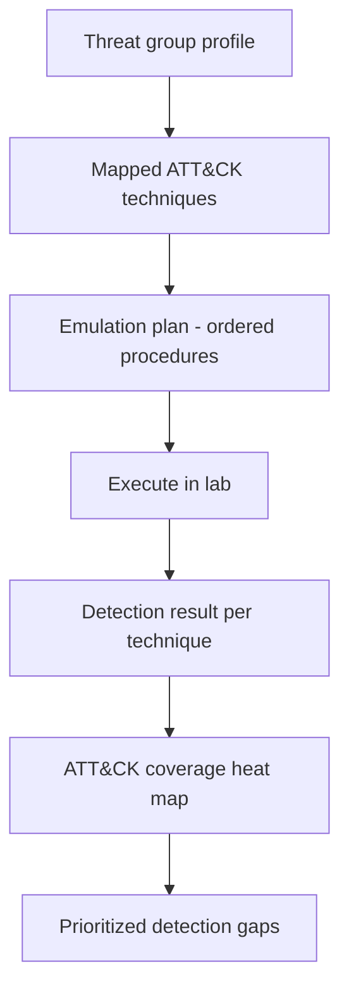
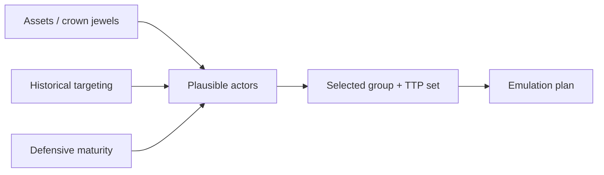
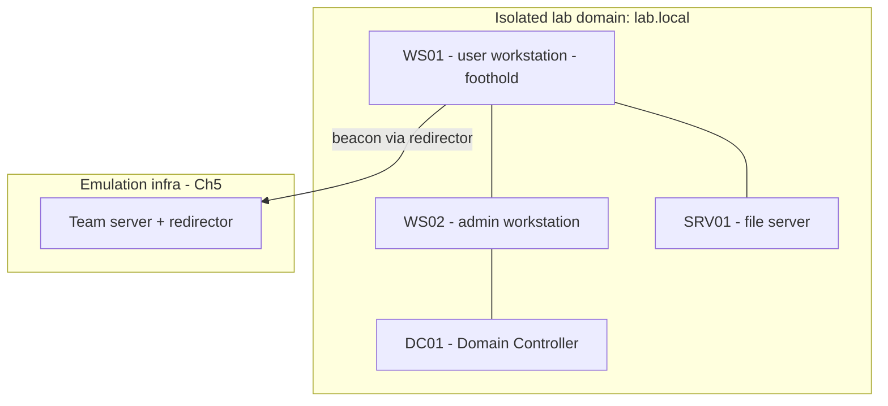
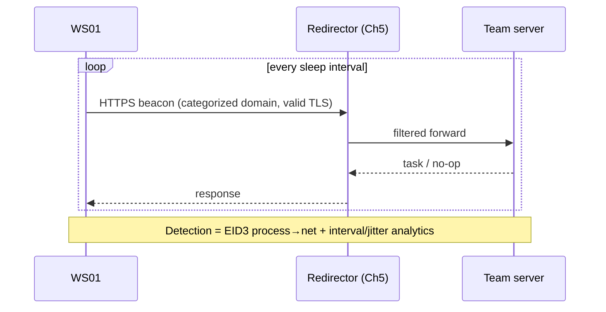
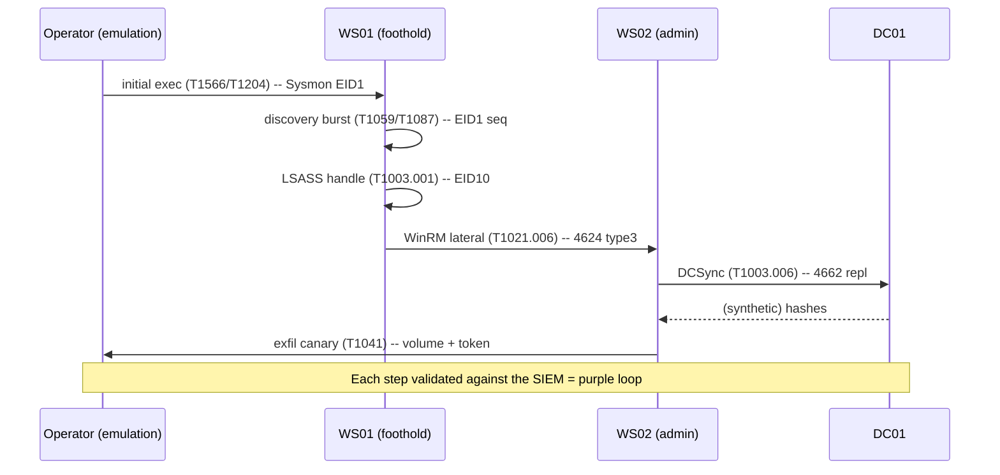
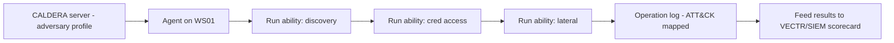
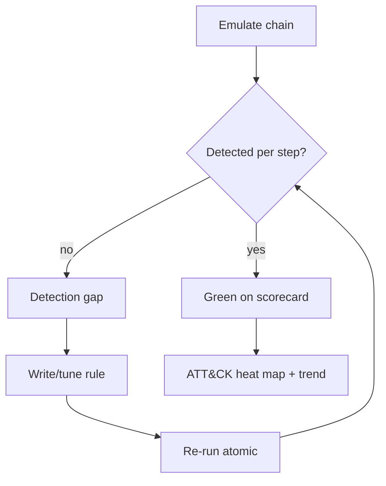

**Level:** Expert · **Track:** Red Team · **Read time:** 225 min

This is Chapter 8 of the Red Team Operations notebook. The previous three chapters
built the pieces in isolation: **infrastructure** (Chapter 5), **initial access**
(Chapter 6), and **living-off-the-land + evasion + OPSEC** (Chapter 7). A real
engagement is not any one of those — it is all of them, executed in sequence, under
a plan, against a scoped objective, with a defender watching. This chapter assembles
the pieces into a **full adversary-emulation exercise** and walks the entire kill
chain end to end in a lab range you own, pausing at every step to ask the two
questions that make this notebook worth reading: *what did the attacker do, and what
did it look like to the blue team?*

The treatment is **defender-first, lab-scoped, and reproducible**. There is no
working malware and no live targeting. The whole exercise runs against a small,
self-contained Windows domain in a hypervisor, using **benign, published emulation
tooling** (MITRE ATT&CK, Atomic Red Team, CALDERA) whose entire purpose is safe,
repeatable testing of detections. If Chapters 5–7 were the instruments, this chapter
is the score — and every measure is annotated with the telemetry it produces.

---

## Why This Matters

Individual techniques are easy to detect in isolation and easy to overrate. The
hard, valuable question is: **when a realistic adversary chains twenty techniques
together against your actual environment, how far do they get before something
fires, and does anyone act on it?** Adversary emulation answers that. It is the
difference between "we have a rule for Kerberoasting" and "we ran a full
credential-to-domain-admin chain and measured that our SOC caught it at step 14,
19 minutes in, and escalated correctly."

Three ideas frame the chapter:

1. **Emulation is threat-informed, not improvised.** True adversary emulation picks
   a *specific* threat actor relevant to the target's sector, extracts that actor's
   real TTPs from threat intelligence and the **MITRE ATT&CK** knowledge base, and
   reproduces *those* — not the operator's favourite tricks. The output is a
   defensible statement: "we emulated the behaviours of the group most likely to
   attack you, and here is where your defenses stand against them."
2. **The chain is where detection lives or dies.** Defense-in-depth means no single
   control must be perfect; the adversary has to beat a *sequence* of them, and each
   step emits telemetry. Emulation tests the *seams* — the handoffs between initial
   access and execution, between discovery and credential access, between one host
   and the next — which is exactly where real detections fail.
3. **Purple, not just red.** The modern best practice is **purple teaming**:
   emulate a technique, check whether the blue team saw it, fix the gap, and re-test
   — a tight offense/defense feedback loop. The deliverable isn't "we won"; it's a
   measurably improved detection posture. (Chapter 9 turns this into the report.)

Here is the end-to-end chain this chapter walks:

```mermaid
flowchart LR
    TI[Threat intel + ATT&CK scoping] --> INF[Infra stand-up - Ch5]
    INF --> IA[Initial access - Ch6]
    IA --> EX[Execution + discovery - Ch7]
    EX --> CA[Credential access]
    CA --> LM[Lateral movement]
    LM --> PE[Priv-esc to domain dominance]
    PE --> COL[Collection + exfil simulation]
    COL --> RPT[Purple validation + report - Ch9]
    classDef d fill:#1f2a44,color:#fff
    class TI,RPT d
```



Every arrow is a seam; every box is a detection opportunity. We take them in order.

---

## Part 1: Adversary Emulation vs Red Teaming vs Pentesting

These terms are used loosely; the distinctions matter for scoping and deliverables.

| Dimension | Penetration test | Red team | Adversary emulation |
|-----------|------------------|----------|---------------------|
| **Goal** | Find as many vulns as possible | Test detection/response against a goal | Reproduce a *specific* actor's TTPs |
| **Scope** | Broad, often noisy | Narrow objective, stealthy | Defined TTP set from threat intel |
| **Success** | Vuln count/severity | Objective reached; gaps found | Detection coverage measured per TTP |
| **Blue-team awareness** | Usually aware | Often unaware (covert) | Often collaborative (purple) |
| **Primary artifact** | Vuln report | Attack narrative + gaps | ATT&CK coverage matrix + fixes |

**Adversary emulation** is the most rigorous: it starts from *"which real group
threatens this org, and what do they actually do?"* and ends with a coverage map
against that group's techniques. It is inherently **threat-intel-driven** and maps
cleanly onto **MITRE ATT&CK**, which is why ATT&CK is the backbone of the whole
discipline.

### 1.1 The role of MITRE ATT&CK

**MITRE ATT&CK** is a curated knowledge base of adversary **tactics** (the *why* —
Initial Access, Execution, Persistence, …), **techniques** (the *how* — Phishing
T1566, Command/Scripting T1059, …), and **procedures** (specific real-world
implementations). Emulation uses ATT&CK three ways: to **select** which behaviours
to reproduce (from a threat group's mapped techniques), to **communicate** results
in a shared vocabulary, and to **measure** coverage as a heat map over the matrix.



---

## Part 2: Scoping & Building the Emulation Plan

### 2.1 Pick a threat actor and extract TTPs

A sector-appropriate group is chosen (e.g. a group known to target finance, or
healthcare, matching the client). Its behaviours are pulled from public threat
reporting and ATT&CK group pages, then distilled into an **ordered procedure list**.
MITRE's own **Adversary Emulation Plans** (published for several well-known groups)
are ready-made, vetted examples of exactly this artifact.

An emulation plan entry looks like:

```text
Step 07  | Tactic: Credential Access | Technique: T1003.001 (LSASS Memory)
Procedure: dump lsass via a signed LOLBin MiniDump; parse offline.
Expected telemetry: Sysmon EID 10 handle to lsass w/ read access; MiniDump ETW.
Detection to validate: "LSASS handle from non-security process" rule.
Success criteria: credentials obtained AND rule fired AND SOC alerted.
```

### 2.1b Threat-model the target first

Actor selection isn't arbitrary — it follows from the target's **threat model**.
Three inputs drive the choice:

1. **Sector & crown jewels:** what does the org have that someone wants? A hospital's
   threat set (ransomware crews, data thieves) differs from a defense contractor's
   (espionage-focused APTs). Emulate the group whose *goals* match the org's *assets*.
2. **Historical targeting:** has this sector/region been hit by identifiable groups?
   Threat-intel feeds and ISACs provide this. Emulate what has actually come after
   peers.
3. **Defensive maturity:** a nascent SOC benefits more from emulating a *noisy*
   commodity actor (does the basic chain get caught at all?); a mature SOC benefits
   from a *stealthy* APT (do the subtle seams get caught?). Match the difficulty to
   the program.



The output is a *defensible* answer to "why this actor?" — which is what turns an
emulation from a hobbyist exercise into a board-level risk statement.

### 2.2 Rules of engagement (recap from Chapter 1)

Even in a lab, emulation follows discipline: written authorization, defined scope
(which hosts/subnets/identities are in play), explicit **no-go** actions (no
destructive payloads, no real exfil of sensitive data — use canary/synthetic data),
deconfliction contacts, and a kill-switch. The lab here is entirely owned, but the
habits transfer directly to a client engagement.

### 2.3 Choose the tooling

| Tool | Role in emulation | Why it's safe/teaching-grade |
|------|-------------------|------------------------------|
| **MITRE ATT&CK** | Technique taxonomy + selection | Reference knowledge base |
| **MITRE Adversary Emulation Plans** | Ready-made ordered TTP scripts | Vetted, published |
| **Atomic Red Team** | Per-technique *benign* test cases | Small, transparent, reversible atomics |
| **CALDERA** | Automated multi-step emulation | Open-source, agent-based, lab-scoped |
| **VECTR** | Track results / coverage over time | Purple-team scorekeeping |
| **Sysmon + SIEM (Elastic/Splunk)** | Blue-team instrumentation | The detection side of the test |

**Atomic Red Team** deserves emphasis: it is a library of small, well-documented
tests, each mapped to an ATT&CK technique, designed to **safely** generate the exact
telemetry a real technique would — so you can validate a detection without deploying
malware. It is the backbone of the labs below.

### 2.4 Deconfliction & safety discipline

Even benign emulation must be deconflicted so a live alert isn't mistaken for a real
breach (or vice-versa). Practical controls carried from Chapter 1's rules of
engagement into emulation:

- **A test window and an out-of-band signal** so the SOC lead can confirm "was that
  us?" without tipping analysts who are meant to respond blind.
- **A ground-truth log** (the CALDERA/Atomic execution record) timestamped against
  the SIEM so every alert can be attributed to a specific emulated step.
- **Synthetic-only impact:** canary/decoy data for collection, no destructive
  actions, no production credentials, reversible atomics with cleanup verified.
- **A kill-switch and deconfliction contact** reachable throughout — if a *real*
  incident coincides with the exercise, you must be able to stand down instantly and
  tell the two apart.

This discipline is what lets an emulation run against a *production-like* environment
safely, and it is the same discipline a client engagement demands.

---

## Part 3: The Lab Range

A minimal but realistic range to run the full chain:



- **DC01** — domain controller for `lab.local`.
- **WS01** — the initial foothold (where Chapter 6's delivery lands).
- **WS02** — an admin's workstation (lateral-movement target holding privileged
  creds).
- **SRV01** — a file server (collection target with synthetic "sensitive" data).
- **Blue-team stack** — Sysmon on every host, PowerShell logging, shipping to a SIEM
  (Elastic/Splunk) with the detections from Chapters 6–7 loaded.

The whole point of instrumenting *before* attacking is that every step below can be
immediately checked against the SIEM — that is what makes it *purple*.

### 3.1 The blue-team stack, concretely

For the exercise to *mean* anything, the detection side must be real. A minimal but
credible stack:

| Layer | Component | Provides |
|-------|-----------|----------|
| Host telemetry | Sysmon (strong config) + PowerShell logging | Process/image/net/registry/WMI events, 4104 |
| EDR | Any EDR w/ ETW-TI + memory scan | Kernel-anchored detection (Ch7) |
| Log shipping | Winlogbeat / Splunk UF | Get events off-host reliably |
| SIEM | Elastic or Splunk | Correlation, search, dashboards |
| Detections | Sigma → SIEM rules; Elastic detection engine | The rules under test |
| Scorekeeping | VECTR | Per-technique coverage over time |

**Why ship logs off-host:** Chapter 4.4c shows an attacker clearing the local
Security log (Event 1102). If logs live only on the host, that clear destroys the
evidence; if they were shipped to the SIEM in real time, the clear itself is caught
*and* the prior events survive. **Log-forwarding is therefore a detection control**,
not just plumbing — a lesson emulation makes visceral the first time you watch a
log-clear fail to hide anything.

### 3.2 Wiring detections before the run

Load the detections you intend to test *before* emulating — otherwise you're
measuring nothing. A practical starting set (from Chapters 6–7 and community Sigma):

- Office/script-host → child process lineage (T1204/T1059).
- Discovery-burst sequence under one tree (T1087/T1082).
- LSASS handle from non-security process (T1003.001).
- Abnormal 4769 volume / RC4 TGS (T1558.003).
- New service (7045) / task (4698) / Run-key on a workstation (T1053/T1543/T1547).
- DS replication by non-DC principal (4662 / T1003.006).
- Security/Application log cleared (1102 / T1070.001).

Each maps to a chain step in Part 4; the exercise is simply: *does each fire when its
step runs?*

---

## Part 4: Walking the Chain — Step by Step (with Detection at Every Seam)

Each step lists the tactic, an ATT&CK technique, the **benign** way to reproduce it,
the telemetry it emits, and the detection to validate. Nothing here requires real
malware; Atomic Red Team atomics or built-in commands generate the signals.

### 4.1 Reconnaissance & Resource Development (TA0043 / TA0042)

Off-target OSINT and the infrastructure stand-up from Chapter 5: aged domain,
redirector, valid TLS, categorized domain. **Telemetry (external):** minimal on the
target side — which is the point. **Blue-team validation:** confirm your **NRD
blocking, CT-log look-alike monitoring**, and email-auth (DMARC) are configured
(Chapters 5–6). This step tests *pre-intrusion* controls.

### 4.2 Initial Access (TA0001) — T1566 Phishing

Chapter 6's delivery: a lure leads to first execution on WS01. In the lab you
reproduce the *effect* benignly — e.g. an Atomic test for **T1204 User Execution**
that spawns a child process as if a user opened a malicious document.

```powershell
# Benign reproduction: simulate "document spawns script host" lineage on WS01.
# (Atomic Red Team T1059.001 / T1204 style — safe, prints a marker.)
Start-Process -FilePath "powershell.exe" -ArgumentList "-NoProfile -Command Write-Host 'emulated initial exec'"
```

**Telemetry:** Sysmon EID 1 (process create, parent→child, full command line).
**Detection to validate:** the Chapter 6 rule `parent∈{Office/script host} → child
script host`. **Seam tested:** delivery → execution.

### 4.2b Command & Control (TA0011) — T1071

Once code runs, it establishes C2 back to the emulation infrastructure (Chapters 2
and 5). In the lab, a benign scripted beacon (the `curl`-loop "beacon" from Chapter
5's lab, pointed at your lab redirector) reproduces the *network behaviour* without
any real implant.

**Telemetry:** periodic outbound connections from WS01 to the redirector domain,
tied by Sysmon EID 3 (network connect) to the *process* that made them. **Detection
to validate:** Chapter 5's beacon analytics (fixed interval + low jitter) **plus**
Chapter 7's process→network mapping (is the connecting process a browser or a script
host?). **Seam tested:** execution → C2. This is the join between the network-side
detections of Chapter 5 and the host-side detections of Chapter 7 — emulation proves
whether your SIEM correlates *both* views of the same beacon.



### 4.3 Execution & Discovery (TA0002 / TA0007)

The foothold performs situational awareness — LotL discovery from Chapter 7.

```powershell
whoami /all
net user /domain
net group "Domain Admins" /domain
nltest /domain_trusts
Get-CimInstance Win32_Process | Select Name, ProcessId  # host process view
```

**Telemetry:** Sysmon EID 1 for each; the *burst* under one tree is the signal.
**Detection to validate:** Chapter 7's "discovery burst under one process tree"
sequence rule. **Seam tested:** execution → discovery.

### 4.4 Credential Access (TA0006) — T1003 / T1558

Two representative procedures, both reproducible as *telemetry* without real
extraction:

- **LSASS access (T1003.001):** open a read handle to `lsass.exe` with a benign tool
  (Chapter 7's lab) to fire **Sysmon EID 10**. Validate the "LSASS handle from
  non-security process" rule; confirm **Credential Guard/PPL** denies it when
  enabled.
- **Kerberoasting (T1558.003):** request service tickets for SPN accounts. The
  *request* itself is the emulation; you don't need to crack anything to test
  detection.

```powershell
# Benign Kerberoast-signal generation: request TGS for SPNs in the lab domain.
# (Reproduces the 4769 pattern; no cracking performed.)
setspn -T lab.local -Q */*        # enumerate SPNs (discovery of roastable accounts)
```

**Telemetry:** Kerberos **Event ID 4769** (TGS request) — a spike of requests for
many SPNs, especially with RC4 encryption, is the Kerberoasting tell. **Detection to
validate:** "abnormal 4769 volume / RC4 TGS for service accounts." **Seam tested:**
discovery → credential access. (The AD-attacks notebook covers Kerberoasting
mechanics in full; here it's one link in the emulated chain.)

### 4.5 Lateral Movement (TA0008) — T1021

Move from WS01 to WS02 using a built-in method that matches the lab's "normal" admin
tooling — say WinRM.

```powershell
# Benign lateral-movement signal: remote command via WinRM to WS02 (authorized lab).
Invoke-Command -ComputerName WS02 -ScriptBlock { hostname; whoami }
```

**Telemetry:** 5985/5986 connection + `wsmprovhost.exe` spawn on WS02; logon Event
**4624 type 3** on the target. **Detection to validate:** Chapter 7's per-method
lateral-movement baseline (is WinRM from *this* source normal?). **Seam tested:**
host → host.

### 4.6 Privilege Escalation to Domain Dominance (TA0004 / TA0006) — T1003.006

With admin creds harvested on WS02, the chain reaches the domain controller. The
canonical domain-dominance procedure is **DCSync (T1003.006)** — abusing directory-
replication rights to pull password hashes. **In the lab, the emulation is the
replication request pattern**, validated by detection, not the extraction of real
secrets beyond synthetic accounts.

**Telemetry:** **Directory Service replication (Event ID 4662)** with the
replication GUIDs, from a non-DC principal — the DCSync signature. **Detection to
validate:** "replication rights used by a non-DC account." **Seam tested:**
credential access → domain dominance. This is the highest-value detection in the
whole chain, because DCSync is a near-universal step to full compromise (see the AD
notebook's DCSync chapter for internals).

### 4.7 Collection & Exfiltration Simulation (TA0009 / TA0010) — T1005 / T1041

Stage **synthetic** "sensitive" data on SRV01 (canary files, never real data),
collect it, and simulate exfil to the emulation infrastructure.

```powershell
# Benign collection + simulated exfil of CANARY data only.
$loot = Get-ChildItem \\SRV01\share -Filter "*canary*" -Recurse
Compress-Archive $loot.FullName -DestinationPath $env:TEMP\stage.zip
# "Exfil" = upload the canary archive to the lab team server (Ch5), measuring detection.
```

**Telemetry:** archive creation (Sysmon EID 11), large outbound transfer to the
beacon channel, unusual data staging. **Detection to validate:** DLP/exfil analytics
and Chapter 5's beacon/volume analytics. **Canary files** are the safe, brilliant
trick here: if a canary token is ever opened/exfiltrated, it phones home — proving
both the emulation reached collection *and* whether detection caught it. **Seam
tested:** collection → exfil.

### 4.4b Persistence (TA0003) — T1053 / T1547 / T1546

A real actor establishes persistence early so a lost beacon doesn't end the
operation (Chapter 5's long-haul concept, realized on the host). The chain reproduces
representative mechanisms benignly:

```powershell
# Benign persistence signals on WS01 (create, observe telemetry, then remove).
schtasks /create /tn "LabPersist" /tr "cmd /c echo hi" /sc onlogon /f   # T1053.005
reg add "HKCU\Software\Microsoft\Windows\CurrentVersion\Run" /v Lab /d "cmd /c echo hi" /f  # T1547.001
# Cleanup:
schtasks /delete /tn "LabPersist" /f
reg delete "HKCU\Software\Microsoft\Windows\CurrentVersion\Run" /v Lab /f
```

| Persistence (ATT&CK) | Mechanism | Telemetry / detection |
|----------------------|-----------|-----------------------|
| Scheduled task (T1053.005) | `schtasks /create` | Event 4698 (task created); Sysmon EID 1 |
| Run key (T1547.001) | Registry `...\Run` | Sysmon EID 13 (registry set) |
| Service (T1543.003) | `sc create` | Event 7045 (service install) |
| WMI subscription (T1546.003) | `__EventFilter` binding | Sysmon EID 19/20/21 |
| Startup folder (T1547.001) | file in Startup | Sysmon EID 11 (file create) |

**Detection to validate:** new scheduled task / Run-key / service / WMI subscription
on a workstation outside known software deployment. **Seam tested:** foothold →
durable foothold. Persistence is a high-value anchor because it is **low-reversibility**
(it leaves an artifact) and almost always eventually used.

### 4.4c Defense Evasion in the chain (TA0005) — T1562 / T1070

Between steps, a real actor blunts telemetry (Chapter 7's evasion families) and
clears tracks. Emulate the *observable effects* only:

```powershell
# Benign evasion signals (observe, don't actually cripple the lab's security):
wevtutil cl Security          # T1070.001 clear event log — generates 1102 (loud!)
Get-MpComputerStatus          # read Defender status (recon of defenses, T1518.001)
```

**Telemetry:** **Event ID 1102 (audit log cleared)** is one of the loudest,
highest-fidelity signals in Windows — clearing the Security log is almost never
legitimate. Tampering with Defender/EDR surfaces via service-stop and config-change
events. **Detection to validate:** "Security log cleared (1102)" and "security
service stopped/altered." **Seam tested:** the operator's attempt to *go dark* is
itself an alert — the Chapter 7 lesson that **absence/tampering is telemetry**,
realized in the chain.

### 4.8 The full chain, annotated



---

## Part 5: Hands-On Lab — Run and Score an Emulation with Atomic Red Team + a SIEM

**Goal:** execute a short, benign emulation chain and *score detection coverage* —
the core purple-team skill. Everything is reversible and malware-free.

### 5.1 Install Atomic Red Team on the foothold VM

```powershell
# Atomic Red Team's execution framework (lab VM, elevated).
IEX (IWR 'https://raw.githubusercontent.com/redcanaryco/invoke-atomicredteam/master/install-atomicredteam.ps1' -UseBasicParsing)
Install-AtomicRedTeam -getAtomics
# Installs Invoke-AtomicTest + the atomics library (per-technique test definitions).
```

### 5.2 Run a technique and read its telemetry

```powershell
# Show what a technique will do BEFORE running it (transparency is the point).
Invoke-AtomicTest T1059.001 -ShowDetailsBrief
# Run a specific, benign atomic (e.g. an encoded-command execution test).
Invoke-AtomicTest T1059.001 -TestNumbers 1
# Clean up afterwards (atomics are reversible).
Invoke-AtomicTest T1059.001 -TestNumbers 1 -Cleanup
```

Then confirm the detection fired in your SIEM:

```text
# Elastic/Splunk query sketch for the emulated encoded PowerShell:
event.provider: "Microsoft-Windows-Sysmon" AND event.code: 1
  AND process.parent.name: ("winword.exe" OR "explorer.exe")
  AND process.name: "powershell.exe"
  AND process.command_line: (*-enc* OR *-EncodedCommand*)
```

### 5.3 Build the coverage scorecard

For each technique in your plan, record the outcome:

| Step | ATT&CK | Executed | Telemetry present | Alert fired | SOC actioned | Gap? |
|------|--------|----------|-------------------|-------------|--------------|------|
| Initial exec | T1204 | ✅ | EID 1 | ✅ | ✅ | — |
| Discovery burst | T1087 | ✅ | EID 1 | ⚠️ partial | ❌ | Sequence rule too loose |
| LSASS handle | T1003.001 | ✅ | EID 10 | ✅ | ✅ | — |
| WinRM lateral | T1021.006 | ✅ | 4624 t3 | ❌ | ❌ | No lateral baseline |
| DCSync | T1003.006 | ✅ | 4662 | ✅ | ✅ | — |
| Exfil canary | T1041 | ✅ | volume+token | ⚠️ | ❌ | No exfil analytic |

This scorecard **is** the deliverable of adversary emulation: a per-technique,
evidence-backed map of where telemetry exists, where alerts fire, and where the SOC
actually responds. Green means the defense works; ⚠️/❌ are prioritized backlog for
detection engineering. Tools like **VECTR** track this over successive exercises so
you can *show improvement over time*.

### 5.4 Close the loop (the purple part)

For each gap: write/tune the detection, re-run *only* that atomic, and confirm it now
fires. The measurable outcome — "coverage went from 4/6 to 6/6 detected, mean time
to alert dropped" — is what a mature program reports, and what Chapter 9 formalizes.

### 5.5 The metrics that matter

A scorecard's tick-marks become *management-legible* when reduced to a few metrics.
Track these across exercises:

| Metric | Definition | Why it matters |
|--------|------------|----------------|
| **Detection coverage** | % of emulated techniques with telemetry present | Are you even collecting the data? |
| **Alerting coverage** | % of techniques that fired an alert | Do rules exist and work? |
| **Response coverage** | % where the SOC actioned the alert | Does the human loop close? |
| **MTTD** | Mean time to detect (technique → alert) | Speed of the net |
| **MTTR** | Mean time to respond (alert → action) | Speed of the humans |
| **Dwell reduction** | How much earlier in the chain you now catch it | Impact limitation |

The distinction between **telemetry present**, **alert fired**, and **SOC actioned**
is the most important lesson of the exercise: many programs collect the data (green
on column 1) but have no rule (red on column 2), or have a rule that fires into a
void nobody triages (red on column 3). Emulation surfaces *which* of the three is
failing per technique — a precision that a vulnerability scan can never give you.

### 5.6 A worked mini-run

A concrete short chain you can execute in an afternoon and score:

```powershell
# 1) Initial-exec lineage signal
Invoke-AtomicTest T1204.002 -TestNumbers 1
# 2) Discovery burst
foreach ($c in 'whoami /all','net user /domain','nltest /domain_trusts') { cmd /c $c }
# 3) Cred-access signal (benign LSASS handle via a tool that requests read)
Invoke-AtomicTest T1003.001 -ShowDetailsBrief   # review, then run a benign variant
# 4) Log-clear evasion signal (loud on purpose)
wevtutil cl Application     # generates 1102 for the Application log in the lab
# Cleanup atomics
Invoke-AtomicTest T1204.002 -TestNumbers 1 -Cleanup
```

Then, for each, query the SIEM and fill the scorecard row. Even this four-step run
teaches the whole method: generate real telemetry safely, check the three columns,
find the gap, fix, re-test.

---

## Part 6: Automating the Chain with CALDERA

**CALDERA** (MITRE's open-source adversary-emulation platform) automates multi-step
chains: a lightweight agent runs on lab hosts, and the server issues ATT&CK-mapped
"abilities" in sequence, logging each. It turns a manual runbook into a repeatable,
scheduled emulation you can run before and after a detection change.



**Blue-team relevance:** the operation log CALDERA produces is a ground-truth
"what happened and when" that you *diff* against what the SIEM detected — turning
"did we catch it?" into an automatic, repeatable measurement. Running CALDERA on a
schedule is continuous **detection validation**, the natural evolution of one-off
purple exercises.

### 6.1 Adversary profiles and abilities

CALDERA models an attacker as an **adversary profile** — an ordered set of
**abilities**, each an ATT&CK-mapped command with a platform, an executor, and a
cleanup step. You assemble a profile that mirrors your emulation plan (Part 2.1), so
the automation *is* the plan:

```yaml
# ILLUSTRATIVE CALDERA ability sketch (YAML) — discovery step.
- id: <uuid>
  name: Enumerate domain admins
  tactic: discovery
  technique:
    attack_id: T1069.002
  platforms:
    windows:
      psh:
        command: net group "Domain Admins" /domain
```

Chaining such abilities under a profile lets CALDERA drive the whole Part 4 sequence
on the agent, logging each ability's success/failure and output. **Blue-team
relevance:** because every ability carries its `attack_id`, the resulting operation
report is *already* an ATT&CK-mapped ground truth — you diff it directly against SIEM
detections to compute coverage with no manual mapping.

### 6.2 Continuous validation vs point-in-time

| Model | Cadence | Strength | Weakness |
|-------|---------|----------|----------|
| One-off red team | Annual | Deep, realistic, covert | Stale fast; single snapshot |
| Purple exercise | Quarterly | Collaborative, fixes gaps | Effort per cycle |
| Automated emulation (CALDERA/Atomic) | Continuous/scheduled | Catches regressions early | Less creative than a human |
| **Blend (recommended)** | Continuous + periodic human | Coverage + creativity | Requires program maturity |

The mature answer is a **blend**: automated emulation runs continuously to catch
detection regressions (a rule silently broke, a log source stopped shipping), while
periodic human-led red/purple exercises probe the creative gaps automation can't
imagine. Chapter 9's reporting spans both.

---

## Part 7: Real-World Patterns & Case Studies

- **MITRE ATT&CK Evaluations:** MITRE publicly emulates real APT groups (e.g.
  established, well-documented actors) against participating security products,
  scoring detection coverage step by step — the industry-scale version of this
  chapter's scorecard, and a great study reference for how emulation is structured.
- **Ransomware playbook convergence:** many ransomware affiliates follow a strikingly
  similar chain — phishing/valid-accounts → LotL discovery → credential access →
  lateral movement → domain dominance (often DCSync) → mass deployment. Emulating
  that generic chain is high-value because it mirrors the majority of destructive
  intrusions.
- **Living-off-the-land dominance:** post-incident reports repeatedly show the middle
  of the chain (Parts 4.3–4.6) executed almost entirely with built-in tools — which
  is why the detections validated here are behavioural and sequence-based, not
  signature-based.
- **Purple teaming as continuous practice:** organizations that moved from annual red
  tests to *continuous* emulation (Atomic/CALDERA on a schedule + VECTR tracking)
  demonstrably shrink detection gaps over time — the strongest argument for the loop
  in Part 5.4.
- **The "caught at the seam" pattern:** repeatedly, mature SOCs catch intrusions not
  at the glamorous step (initial access often slips) but at a later seam — the DCSync
  4662, the anomalous lateral logon, the log-clear 1102. Emulation's value is
  precisely measuring *how deep* an actor gets before a seam catches them, and
  pushing that catch-point earlier over successive exercises (the dwell-reduction
  metric).
- **Coverage bias toward the front of the matrix:** many programs over-invest in
  initial-access detection and under-invest in the middle (discovery→lateral). A full
  chain-emulation exposes this imbalance objectively, because it forces every tactic
  column to be exercised, not just the ones the team already worries about.

---

## Part 8: Detection & Defense Angle (Consolidated)

The chapter's whole thesis is that **the chain is the unit of detection**. Practical
program guidance:

### 8.1 Instrument for the whole chain

- Sysmon + PowerShell logging + EDR (ETW-TI) on **every** host, shipped to a SIEM —
  the coverage from Chapters 6–7 must be *ubiquitous*, because emulation finds the
  one un-instrumented host and pivots through it.
- Domain-controller auditing for **4662 (replication)**, **4769 (TGS)**, **4624/4625
  (logons)**, **4720/4728/4732 (account/group changes)**.

### 8.2 Detect at the seams, not just the steps

- Score **sequences and lineages** across the chain (delivery→exec→discovery→cred→
  lateral→DCSync), not isolated events. The seams are where real detection value is.
- Correlate **across hosts** by identity and time — lateral movement is invisible if
  each host is analyzed alone.

### 8.3 Measure and close gaps

- Run **Atomic Red Team / CALDERA** on a schedule; maintain an **ATT&CK coverage
  heat map**; track it in **VECTR** to prove improvement.
- Treat every ⚠️/❌ in the scorecard as detection-engineering backlog; re-test after
  each fix.

### 8.3b Instrumentation coverage is a prerequisite, not a finding

A recurring emulation outcome is discovering that a technique wasn't detected *because
the data was never collected* — an un-instrumented host, a log source that stopped
shipping, an EDR agent that was uninstalled during troubleshooting and never restored.
Before blaming detection rules, verify the three-column scorecard's **first** column:
was the telemetry even present? A rule can't fire on data that never arrived.

| Coverage gap | Symptom in scorecard | Fix |
|--------------|----------------------|-----|
| Host un-instrumented | No telemetry for steps on that host | Deploy Sysmon/EDR; verify heartbeat |
| Log source stopped | Telemetry present then absent | Monitor log-source health; alert on silence |
| Agent removed | EDR events missing from one host | Tamper-protect agents; alert on uninstall |
| Wrong Sysmon config | Some event IDs missing | Standardize a strong config fleet-wide |

**This is why "absence of telemetry is telemetry" (Chapter 7) matters at the program
level:** a host that should be reporting and isn't is both a coverage gap *and* a
possible sign of tampering. Emulation is often the first thing that surfaces these
silent gaps, which alone justifies running it.

### 8.4 Validate the high-value anchors

Ensure the **loudest, least-reversible** steps (Chapter 7's cost model) are
reliably caught: LSASS access, DCSync (4662), new persistence, driver loads, mass
collection/exfil. If the chain is caught anywhere, catching it *here* limits impact
the most.



---

## Part 9: Common Pitfalls & Misconfigurations

**Emulation-side pitfalls:**

- **Improvising instead of emulating** — running favourite techniques rather than a
  threat-informed TTP set; the result isn't defensible against "which actor?".
- **Testing steps, not chains** — passing every atomic in isolation while the *seams*
  go uncaught.
- **Using real malware or real data** — unnecessary and dangerous; benign atomics +
  canary data reproduce the telemetry safely.
- **No scorecard** — running the exercise but not measuring per-technique coverage,
  so nothing improves.

**Defense-side pitfalls:**

- **Instrumentation gaps** — one un-logged host or subnet becomes the pivot; coverage
  must be ubiquitous.
- **Single-host analysis** — missing lateral movement because detections don't
  correlate across hosts/identity.
- **Alert without action** — the rule fired but the SOC didn't escalate; emulation
  must test *response*, not just detection.
- **One-and-done** — a single annual test instead of continuous validation; threats
  and environments drift.

---

## Part 10: Final Revision / Summary

- **Adversary emulation** reproduces a *specific*, threat-intel-selected actor's TTPs
  (mapped in **MITRE ATT&CK**) end to end, and measures detection coverage — distinct
  from broad pentesting and from covert red teaming.
- The **chain is the unit of detection**: defense-in-depth means the adversary must
  beat a *sequence* of controls, and the **seams** (delivery→exec→discovery→cred→
  lateral→domain dominance→exfil) are where detections fail and where emulation adds
  the most value.
- Build a **lab range** (DC + workstations + server), **instrument it first**
  (Sysmon/PowerShell/EDR → SIEM), then walk the chain using **benign** reproductions
  (Atomic Red Team atomics, built-in commands, canary data) so every step generates
  real telemetry without real malware.
- Key per-step anchors: initial exec lineage (EID 1), discovery burst (EID 1 seq),
  LSASS handle (EID 10), Kerberoast (4769), WinRM lateral (4624 t3), **DCSync (4662)**,
  exfil (volume + canary tokens).
- The output is a **coverage scorecard / ATT&CK heat map**: per-technique evidence of
  telemetry, alerting, and SOC response, turned into prioritized detection-engineering
  backlog. **CALDERA** automates the chain; **VECTR** tracks improvement over time.
- **Purple teaming** — emulate, measure, fix, re-test — is the mature practice.
  Success is not "we won"; it's a measurably improved, continuously-validated
  detection posture. Chapter 9 turns all of this into the report.

**Memory hook:** *"Emulate a real actor, walk the whole chain, score every seam."*
A lone technique tells you nothing; the chain tells you how far a realistic adversary
gets before your defenses catch them. Instrument first, reproduce benignly, and
measure the three columns — telemetry present, alert fired, SOC actioned — for each
step. The gaps are your backlog; the trend line is your proof of progress.

Three numbers to leave an exercise with: **how deep** did the chain get before a seam
caught it, **how fast** (MTTD/MTTR), and **how much earlier** you now catch it than
last time. Those three make adversary emulation a management-legible risk statement
rather than a hacking demo — which is exactly what the reporting chapter converts
into decisions and budget.

---

## Part 11: Cheat Sheet / Quick Reference

**Emulation flow:** threat intel → ATT&CK TTP set → ordered plan → instrument lab →
walk chain → score coverage → close gaps → re-test → trend.

| Chain step | ATT&CK | Benign reproduction | Detection anchor |
|------------|--------|---------------------|------------------|
| Initial exec | T1204/T1566 | Atomic user-exec | Sysmon EID 1 lineage |
| Discovery | T1087/T1082 | `whoami`,`net`,`nltest` | EID 1 burst/sequence |
| Cred access | T1003.001 | benign LSASS handle | Sysmon EID 10 |
| Kerberoast | T1558.003 | `setspn -Q`, TGS request | Event 4769 (RC4 spike) |
| Lateral | T1021.006 | `Invoke-Command` WinRM | 4624 type 3 + wsmprovhost |
| Domain dominance | T1003.006 | replication request pattern | Event 4662 (repl) |
| Exfil | T1041 | canary archive upload | volume + canary token |

**Toolkit:** MITRE ATT&CK · Adversary Emulation Plans · Atomic Red Team
(`Invoke-AtomicTest`) · CALDERA · VECTR · Sysmon + SIEM · Canarytokens.

**Pre-run checklist:** actor selected + justified · TTP plan ordered · lab
instrumented (Sysmon/PS/EDR→SIEM) · detections loaded · logs shipping off-host ·
deconfliction + kill-switch set · synthetic/canary data only.

**Scorecard columns:** Executed · Telemetry present · Alert fired · SOC actioned ·
Gap. Green everywhere = validated defense; ⚠️/❌ = backlog.

**Golden rules:** emulate a real actor, not your habits · test chains and seams, not
lone steps · benign atomics + canary data, never real malware/data · alert *and*
response must both pass · run continuously and trend the heat map.

**Metrics to report:** detection coverage % · alerting coverage % · response coverage
% · MTTD · MTTR · dwell-reduction (catch-point moved earlier). The three-column
distinction — *telemetry present / alert fired / SOC actioned* — is the single most
useful thing an emulation tells you, because it pinpoints whether a miss is a data
gap, a rule gap, or a response gap.

**One-line framing for leadership:** "We emulated the group most likely to target us,
walked the full kill chain, and measured that our defenses caught it at step N in M
minutes — here are the specific seams we've now closed." That sentence is the entire
value of the discipline.

---

## Part 12: Practice Labs & Resources

- **MITRE ATT&CK (attack.mitre.org)** — study group pages and the matrix; pick a
  group and build an emulation plan from its techniques.
- **MITRE Adversary Emulation Plans (CTID)** — ready-made, vetted plans for
  well-known groups; run one end to end in a lab.
- **Atomic Red Team (atomicredteam.io / redcanaryco GitHub)** — the per-technique
  benign test library; work through a tactic column and validate each detection.
- **MITRE CALDERA** — deploy the server + agents in your lab and automate a chain;
  build an adversary profile from your emulation plan and diff its operation log
  against your SIEM detections.
- **VECTR (SecurityRiskAdvisors)** — track purple-team results and coverage trends.
- **DetectionLab / SimuLand / a home Proxmox/ESXi range** — pre-built instrumented
  Windows domains ideal for running the whole Part 4 chain safely.
- **TryHackMe — "Red Team Capstone", "Attacktive Directory", "Post-Exploitation
  Basics", "Threat Emulation"; HackTheBox Pro Labs (Dante/Offshore/Cybernetics)** —
  full multi-host chains to practise the sequence, not just single techniques.
- **Splunk Boss of the SOC / Elastic detection content / Sigma rules** — the blue
  side: load detections, run the emulation, and measure what fires.
- **Canarytokens (canarytokens.org)** — generate free canary files/tokens for the
  safe collection/exfil step; a token that phones home proves both that the chain
  reached collection and whether your exfil detection caught it.
- **Sigma HQ rule repository + Elastic detection-rules repo** — a large, free library
  of community detections mapped to ATT&CK; load them, emulate, and measure which fire
  against your Part 4 chain.

Run the Part 5 lab until you can execute a short chain, produce a per-technique
scorecard from your own SIEM, and close at least one gap by writing a rule and
re-testing it. When you can hand someone a coverage heat map and say exactly which
seams your defenses miss and which you've fixed, you're doing adversary emulation —
and you're ready for the final chapter, which turns this evidence into the reports,
attack narratives, and executive deliverables that make an engagement worth paying
for.

---

*Also on [Praneeth's portfolio](https://ping-praneeth.vercel.app/notebook/redteam-operations/08-full-adversary-emulation-chaining-the-kill-chain-end-to-end), with comments and the latest edits.*
