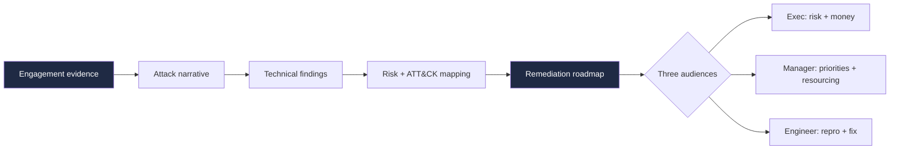
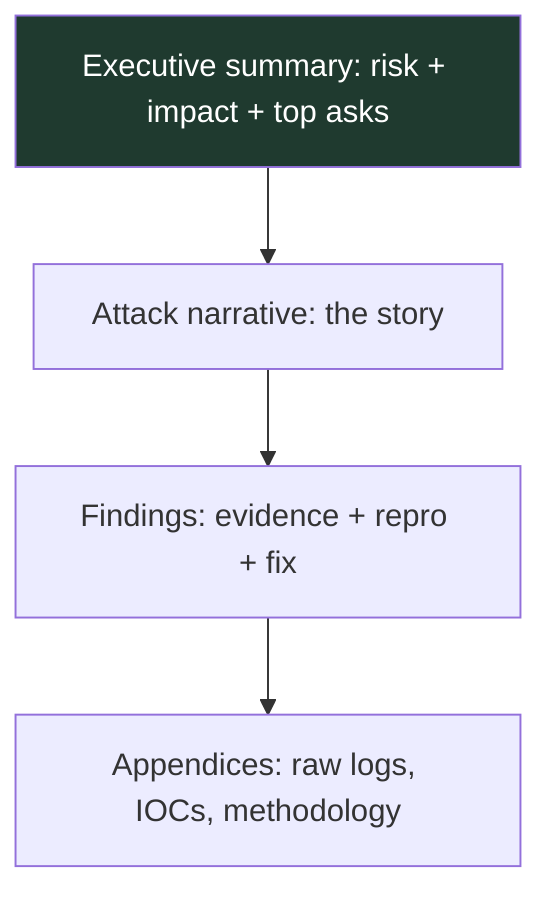
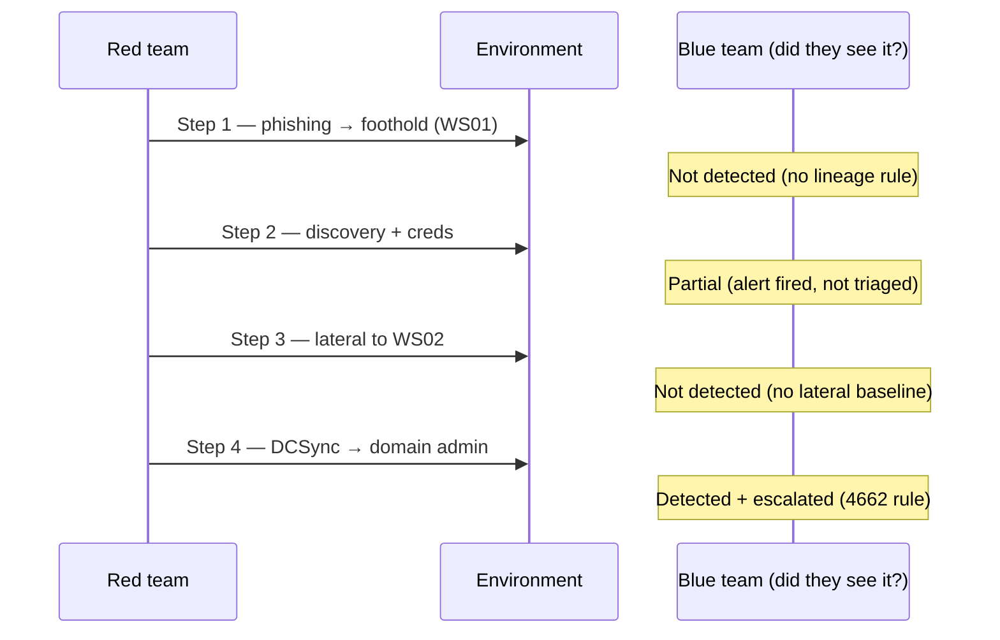
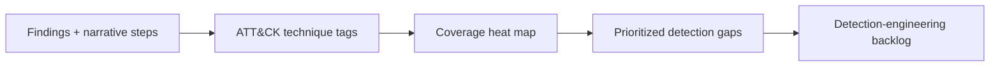
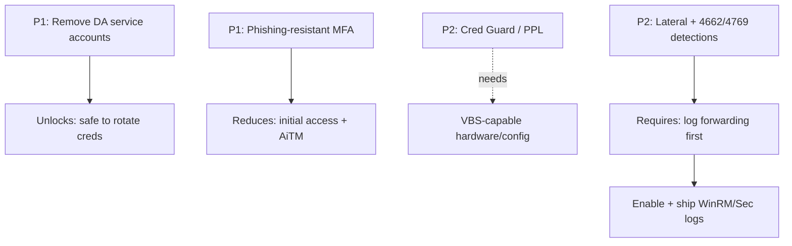
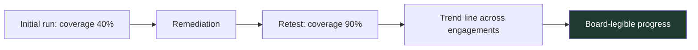
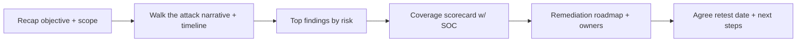
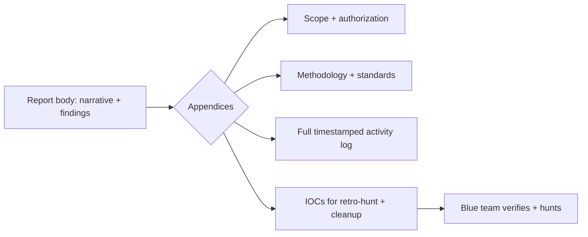

This is Chapter 9, the final chapter of the Red Team Operations notebook. Chapters 1
through 8 built an entire operation: the mindset and lifecycle, C2 and beaconing,
commercial and open-source frameworks, infrastructure, initial access, living-off-
the-land and evasion, and a full end-to-end adversary emulation. None of that
matters to the organization that paid for it until it becomes a **report** — a set of
deliverables that a defender can read, believe, prioritize, and act on. This chapter
is about producing those deliverables well, because a brilliant engagement described
in a bad report changes nothing, and a modest engagement described in an excellent
report can transform a security program.

Reporting is where the red team's value is realized, and it is, appropriately, a
**defender-serving** activity from start to finish. The whole point of breaking in
was to help the organization not get broken into. Everything in this chapter is
oriented around that outcome: clarity over cleverness, reproducibility over drama,
and a remediation roadmap the blue team can actually execute.

---

## Why This Matters

A red-team report is read by people who were not in the room and who have limited
time, competing priorities, and real budgets. If the report doesn't land, the
findings die on a shelf. The stakes are concrete:

1. **The report is the product.** Clients don't buy "an intrusion"; they buy the
   understanding and the roadmap the intrusion produced. The document *is* the thing
   they keep. A senior operator who can't write clearly is worth less than a mid-
   level one who can — because the report is what survives the engagement.
2. **Three very different audiences read the same document.** An executive needs risk
   and money framing in a page. A security manager needs prioritized, resourced
   remediation. An engineer needs exact reproduction steps and precise fixes. Serve
   one and lose the others, and the report fails partly.
3. **Trust is fragile and evidentiary.** Every claim ("we reached domain admin") must
   be backed by reproducible evidence. One unverifiable or exaggerated finding
   poisons the credibility of the whole report — and of the next engagement.



The chapter walks that pipeline: from raw evidence to a narrative, to findings, to
risk, to a roadmap — written so all three audiences are served by one coherent
document.

---

## Part 1: The Deliverable Set

A red-team engagement produces not one document but a **set**, each serving a
purpose and an audience.

| Deliverable | Primary audience | Purpose | Length |
|-------------|------------------|---------|--------|
| **Executive summary** | Leadership, board | Risk, business impact, spend justification | 1–2 pages |
| **Attack narrative** | Managers, technical leads | The story: how the objective was reached | 3–10 pages |
| **Technical findings** | Engineers, blue team | Per-issue detail: evidence, repro, fix | Bulk of report |
| **Detection/coverage results** | SOC, detection eng | What was/wasn't caught; gaps (purple) | Several pages |
| **Remediation roadmap** | Managers, engineers | Prioritized, sequenced fixes | 2–5 pages |
| **Appendices** | Engineers | Full command logs, IOCs, scope, methodology | As needed |
| **Debrief / readout** | Mixed | Live walkthrough + Q&A | Meeting |

The **debrief meeting** is as important as the document: it is where questions get
answered, priorities get negotiated, and the blue team gets to interrogate the
attack path. A report without a readout loses half its value.

### 1.1 Report vs pentest report

A **pentest** report is typically a *catalog of vulnerabilities* ranked by severity.
A **red-team** report is a *narrative of an objective being achieved*, in which
individual weaknesses are links in a chain — and the emphasis is on **detection and
response** as much as prevention. The two are not interchangeable: a red-team report
that is just a vuln list has missed its own point (the AD/pentest notebooks cover
the vuln-catalog style; this chapter is the narrative style).

---

## Part 2: Writing for Three Audiences at Once

The central craft problem of reporting is that one document serves readers with
opposite needs. The solution is **layering**: structure the document so each
audience can read *their* layer and stop.

### 2.1 The inverted pyramid

Lead with the conclusion. Executives read the top; each subsequent layer adds detail
for a more technical reader. Nobody has to wade through packet captures to learn
"an attacker could reach your crown-jewel data from a single phishing email."



### 2.2 The executive summary

One to two pages, **no jargon**, answering four questions:

1. **What did we do?** ("We emulated a ransomware-style actor against the corporate
   domain over three weeks.")
2. **What did we find?** ("A single phishing email led to full domain compromise in
   under a day; the activity was not detected until the domain-controller stage.")
3. **What does it mean for the business?** ("An attacker could deploy ransomware
   enterprise-wide or exfiltrate customer data; current detection would not stop
   this before significant impact.")
4. **What are the top three things to do?** (The highest-leverage fixes, framed as
   decisions leadership can fund.)

**Rules:** business impact in business terms (downtime, data, regulatory, financial),
no unexplained acronyms, and a risk rating leadership can compare across reports.
Avoid both understatement (burying a critical) and hype (crying "critical" at
everything — it destroys the rating's meaning).

### 2.3 The manager layer

Security managers need **prioritized, resourced** actions: what to fix first, roughly
how much effort, and what risk each fix retires. This layer connects the narrative to
the roadmap (Part 6) and is where most real decisions get made.

### 2.3b Writing craft that survives busy readers

A few habits carry disproportionate weight:

- **Lead every section with its conclusion.** Busy readers get the point even if they
  stop after the first sentence.
- **One idea per paragraph.** If a paragraph makes two points, split it.
- **Prefer concrete nouns and active voice.** "An attacker reached Domain Admin" beats
  "Domain Admin access was potentially achievable."
- **Quantify.** "Full domain compromise in under 4 hours" lands; "significant risk"
  doesn't.
- **Define an acronym once, or not at all in exec-facing text.** LSASS, TGS, and SPN
  mean nothing to a board.
- **Cut hedging.** "May potentially in some cases be able to" → "can." Hedging reads as
  either uncertainty or self-protection; state what you demonstrated and cite the
  evidence.

These are not stylistic niceties — they are what determines whether a finding is
understood and acted on or skimmed and shelved.

### 2.4 The engineer layer

Engineers need **exact reproduction and exact fixes**: the precise request, command,
account, host, and configuration; screenshots/log excerpts as evidence; and a
specific, testable remediation ("set this GPO," "rotate this key," "add this
detection"). Vague findings ("improve password hygiene") waste this reader's time;
precise ones ("service account `svc-sql` has an SPN and a crackable password; it is
in Domain Admins — remove it from DA and rotate to a 25+ char managed password")
get fixed.

---

## Part 3: The Attack Narrative — Heart of the Report

The attack narrative is what makes a red-team report different from a vuln scan. It
tells the **story of the objective being reached**, step by step, as a chain — the
same chain Chapter 8 walked, now told for a reader.

### 3.1 Structure of a narrative

Each step in the narrative answers: **what we did, why it worked, what it let us do
next, and — crucially — whether the defenders saw it.**



That "did the blue team see it?" annotation on every step is the single feature that
turns a narrative from a war story into a **detection-improvement tool**. It shows
not just *that* the objective fell but *where the defense had its chances* and which
it took.

### 3.2 Narrative principles

- **Chronological and causal:** each step should visibly *enable* the next, so the
  reader understands the chain, not a pile of issues.
- **Evidence inline:** anchor each claim to a screenshot, a log excerpt, or a
  timestamped command — but keep bulk logs in appendices.
- **Name the control that failed and the control that could have caught it:** every
  step is a lesson, not a boast.
- **Timeline discipline:** include timestamps so the blue team can correlate against
  their own logs (and validate the "did we see it?" column).
- **No gratuitous drama:** the goal is comprehension and action, not to make the org
  feel foolish. Respectful, factual tone preserves the relationship and the fixes.

### 3.3 The narrative-to-timeline pairing

A strong report pairs the prose narrative with a **timeline table** the blue team can
diff against their SIEM:

| Time | Step | Technique (ATT&CK) | Host | Detected? | Evidence ref |
|------|------|--------------------|------|-----------|--------------|
| 09:14 | Foothold via phish | T1566/T1204 | WS01 | No | Fig. 2, log A1 |
| 09:31 | Domain discovery | T1087 | WS01 | Partial | log A3 |
| 10:02 | Cred access (LSASS) | T1003.001 | WS01 | No | Fig. 5 |
| 11:40 | Lateral to admin WS | T1021.006 | WS02 | No | log A7 |
| 13:05 | DCSync → DA | T1003.006 | DC01 | Yes+escalated | Fig. 9, log A11 |

This table is often the most-used artifact in the debrief: the blue team sits with
it and their logs and rebuilds their own visibility, step by step.

---

## Part 4: Technical Findings — Anatomy of a Good One

Findings are the reference core. Each should be self-contained and follow a
consistent schema.

### 4.1 The finding template

```text
Title:        Short, specific (e.g. "Kerberoastable service account in Domain Admins")
Severity:     Rating + rationale (see Part 5)
ATT&CK:       Technique ID(s), e.g. T1558.003
Affected:     Hosts / accounts / scope
Description:  What the weakness is, in plain terms
Evidence:     Screenshots, log excerpts, exact commands/requests (redacted as needed)
Reproduction: Numbered steps a defender can follow to reproduce
Impact:       What it enabled in THIS engagement + worst-case
Remediation:  Specific, testable fix + validation step
Detection:    How the blue team could detect this (the purple value-add)
References:   CVE/vendor guidance/MITRE
```

### 4.2 A worked finding (illustrative)

> **Title:** Kerberoastable service account `svc-sql` is a member of Domain Admins
>
> **Severity:** Critical — direct path to domain compromise.
>
> **ATT&CK:** T1558.003 (Kerberoasting), T1078.002 (Valid Domain Accounts).
>
> **Affected:** `svc-sql@lab.local` (SPN `MSSQLSvc/db01.lab.local:1433`); member of
> `Domain Admins`.
>
> **Description:** The account exposes a Service Principal Name, so any authenticated
> user can request a Kerberos service ticket encrypted with the account's password
> hash and crack it offline. The account's password is short and non-random, and the
> account holds Domain Admin rights — so cracking it yields full domain control.
>
> **Evidence:** SPN enumeration output (Fig. 3); TGS request (log A5); the recovered
> credential was validated against `DC01` (Fig. 4). *No plaintext password is printed
> in this report; see the secure evidence package.*
>
> **Reproduction:** (1) As any domain user, enumerate SPNs (`setspn -T lab.local
> -Q */*`). (2) Request the TGS for `svc-sql`. (3) Crack offline. (4) Authenticate to
> `DC01` as `svc-sql`.
>
> **Impact:** In this engagement, this single account provided the path from a
> standard user to Domain Admin. Worst case: full domain compromise, enterprise-wide
> ransomware, or data theft.
>
> **Remediation:** Remove `svc-sql` from `Domain Admins`; grant only the specific
> rights the service needs. Replace the password with a 25+ character managed
> credential (gMSA). Validate by re-attempting Kerberoast and confirming the hash is
> no longer crackable in a reasonable window.
>
> **Detection:** Alert on abnormal volumes of Kerberos TGS requests (Event 4769),
> especially RC4-encrypted tickets for service accounts. This activity was **not
> detected** during the engagement.

Notice how the finding serves all three audiences: the severity/impact lines are
executive-ready, the remediation/detection lines are manager/SOC-ready, and the
reproduction/evidence lines are engineer-ready. **That multi-audience self-
containment is the mark of a professional finding.**

### 4.3 A second worked finding — a detection gap

Red-team findings aren't only about vulnerabilities; a **missing detection** is a
finding in its own right, and often the most valuable one in a purple engagement.

> **Title:** No detection for internal lateral movement via WinRM
>
> **Severity:** High — a core attack-chain step is invisible to the SOC.
>
> **ATT&CK:** T1021.006 (Remote Services: WinRM).
>
> **Affected:** All workstations and servers; WinRM logging not forwarded to the SIEM.
>
> **Description:** During the engagement, movement from `WS01` to `WS02` via
> `Invoke-Command` (WinRM) generated a Type-3 logon (Event 4624) and a
> `wsmprovhost.exe` process on the target, but neither was collected centrally, so no
> alert was possible. Lateral movement is a mandatory step in almost every intrusion;
> its invisibility means an attacker can spread freely once a foothold exists.
>
> **Evidence:** Target-side `wsmprovhost.exe` spawn (Fig. 7); absence of any
> corresponding SIEM event (query A9 returned zero results for the window).
>
> **Reproduction:** (1) From an authenticated host, `Invoke-Command -ComputerName
> <target> -ScriptBlock { hostname }`. (2) On the target, observe 4624 type 3 +
> `wsmprovhost.exe`. (3) Query the SIEM for the same window — confirm nothing arrives.
>
> **Impact:** Undetected lateral spread across the estate; in this engagement it
> enabled reaching the admin workstation that held the credentials used for domain
> compromise.
>
> **Remediation:** Forward WinRM/PowerShell-remoting logs and Security 4624 to the
> SIEM; **baseline** which source→destination WinRM flows are normal (admin jump
> hosts) and alert on the rest. Validate by re-running the movement and confirming an
> alert fires.
>
> **Detection:** `wsmprovhost.exe` spawned on a host that is not a management target,
> correlated with a 4624 type-3 logon from a non-admin workstation.

The two worked findings together show the range: a **vulnerability** finding
(Kerberoastable DA account) and a **visibility** finding (no lateral-movement
detection). A red-team report that contains only the first type is doing half the job.

### 4.4 Redaction & sensitive content

Reports themselves are sensitive. **Never** print live plaintext passwords, full
hashes, private keys, or exploit code that could be reused verbatim in the body;
reference a separately-transmitted, access-controlled **evidence package** instead.
The report proves the finding; the secure package holds the raw proof.

### 4.5 Evidence quality standards

Evidence is what separates a credible finding from a claim. Standards worth holding:

| Evidence type | Good | Weak |
|---------------|------|------|
| Screenshot | Cropped to the point, timestamp visible, redacted secrets | Full desktop, no context, secrets exposed |
| Log excerpt | Exact event, timestamp, host, correlated to a step | Paraphrased, undated, unattributable |
| Command | Exact invocation + relevant output, in a fenced block | "We ran some enumeration" |
| Reproduction | Numbered, deterministic, self-contained | "Repeat the above" |

The test for any piece of evidence: **could a defender who wasn't there reproduce the
finding and confirm it using only what's in the report (plus the secure package)?**
If not, the evidence is incomplete.

---

## Part 5: Risk Rating & ATT&CK Mapping

### 5.1 Rating that survives scrutiny

Severity must be consistent and defensible. Common approaches:

- **CVSS** for individual technical vulnerabilities (covered in the vuln-assessment
  notebook) — good for componentized issues, weaker for *chains*.
- **Likelihood × Impact** business-risk matrices — better for red-team findings where
  the "vuln" is a path, not a CVE.
- **Chain-aware rating:** a red-team finding's severity often derives from its role in
  the *path*, not its isolated CVSS. A medium-CVSS misconfiguration that is the pivot
  to domain admin is, in context, critical. Say so, and explain why.

| Severity | Meaning (chain-aware) | Example |
|----------|-----------------------|---------|
| Critical | Direct path to objective / full compromise | Kerberoastable DA account; DCSync possible |
| High | Major step in the chain; likely exploited | Reused local admin password enabling lateral spread |
| Medium | Contributing weakness; needs a chain | Verbose error leaking internal hostnames |
| Low | Minor / hygiene | Missing security header with no demonstrated impact |
| Info | No direct risk; note for awareness | Deprecated but unused protocol enabled |

**Rule:** rate the *contextual* risk and *justify* it. A reader must be able to see
why a finding got its rating; unexplained ratings invite argument and erode trust.

### 5.2 Mapping to MITRE ATT&CK

Tagging every finding and narrative step with ATT&CK technique IDs (Chapter 8) gives
the report a shared vocabulary and a **coverage view**: the blue team can see which
tactics they detected and which they missed, as a heat map over the matrix. This is
the bridge from a one-off report to a durable detection-engineering backlog.



---

## Part 6: The Remediation Roadmap

Findings tell the org what's wrong; the **roadmap** tells them what to do, in what
order, with what effort. This is frequently the section managers act on most.

### 6.1 Prioritize by leverage, not just severity

Order fixes by **risk retired per unit of effort**, and by **dependency** (some fixes
unlock or obviate others). A quick config change that breaks the primary attack path
outranks a costly multi-quarter project that addresses a lesser issue.

| Priority | Fix | Effort | Risk retired | Sequence |
|----------|-----|--------|--------------|----------|
| P1 | Remove service accounts from Domain Admins; gMSA | Low | Critical (breaks main path) | Now |
| P1 | Enable phishing-resistant MFA (FIDO2) | Med | High (initial access + AiTM) | Now |
| P2 | Deploy Credential Guard / PPL on LSASS | Med | High (cred access) | Quarter |
| P2 | Add lateral-movement + 4662/4769 detections | Med | High (visibility) | Quarter |
| P3 | Application control (WDAC) rollout | High | Medium-High (execution) | Roadmap |

### 6.2 Strategic vs tactical

Separate **tactical** fixes (do this now — remove the DA service account) from
**strategic** improvements (mature the SOC, roll out application control). Both
belong in the roadmap; conflating them makes the whole list feel unachievable.

### 6.3 Tie remediation to detection

Every prevention recommendation should be paired with a **detection** recommendation,
because prevention fails and detection is the backstop (the theme of Chapters 5–8).
"Remove the account" *and* "alert on 4769 anomalies" — belt and suspenders.

### 6.4 Effort, ownership, and dependency

A roadmap the client can execute names, for each item, an **owner**, an **effort
estimate**, and any **dependencies**. Without owners, items stall; without effort
estimates, managers can't schedule; without dependencies, teams do things in the wrong
order.



Note the dependency in the diagram: you cannot build lateral-movement detections until
the logs are actually forwarded — so "enable log forwarding" is a prerequisite that
must be sequenced *before* the detection work, even though the detection is what the
manager cares about. Surfacing these ordering constraints is a core value of the
roadmap.

### 6.5 Framing fixes as risk retired, not chores

Each roadmap item reads better as *"this retires the path to domain admin"* than as
*"reconfigure service accounts."* Tie every fix back to the narrative step it breaks,
so the reader sees remediation as **removing links from the attack chain**, not as a
maintenance backlog. A roadmap that visibly dismantles the story the report just told
is far more likely to get funded and done.

---

## Part 7: The Purple-Team Scorecard & Detection Results

For an engagement run as purple (Chapter 8), the **coverage scorecard** is a
first-class deliverable: per technique, whether telemetry existed, an alert fired,
and the SOC responded.

| Technique (ATT&CK) | Telemetry | Alert | SOC action | Gap / fix |
|--------------------|-----------|-------|------------|-----------|
| T1204 Initial exec | ✅ | ❌ | ❌ | Add Office→script lineage rule |
| T1087 Discovery | ✅ | ⚠️ | ❌ | Tighten burst rule; route to triage |
| T1003.001 LSASS | ✅ | ✅ | ✅ | — (deploy Cred Guard to prevent) |
| T1021.006 Lateral | ❌ | ❌ | ❌ | Enable WinRM logging + baseline |
| T1003.006 DCSync | ✅ | ✅ | ✅ | — |

The three-column distinction (telemetry / alert / action) tells the SOC *exactly*
what kind of gap each miss is — a data gap, a rule gap, or a response gap — which is
far more actionable than "you missed it." This section, plus the retest below, is
what makes the engagement a measurable improvement rather than a scare.

### 7.1 Retest & metrics

A mature engagement includes (or schedules) a **retest**: after remediation, re-run
the relevant steps and record the new result. Reporting the *delta* — "initial
detection coverage 40% → 90% after remediation; catch-point moved from step 14 to
step 3; MTTD dropped from hours to minutes" — is the most persuasive evidence a
security program can show leadership.

### 7.2 KPIs leadership understands

Translate technical results into a small set of metrics that trend across engagements
and mean something to a non-technical reader:

| KPI | What it tells leadership | Direction |
|-----|--------------------------|-----------|
| Detection coverage % | Breadth of visibility across the chain | ↑ good |
| Catch-point (step N) | How early the chain is caught | earlier = good |
| MTTD / MTTR | Speed of detection / response | ↓ good |
| Findings closed vs open (by severity) | Remediation follow-through | ↑ closed |
| Repeat findings | Whether fixes actually stuck | ↓ good |

**Repeat findings** deserve special attention: a finding that reappears in the next
engagement means the fix didn't hold (or was never done), which is a *program* problem
worth surfacing to leadership directly. Trending these KPIs across engagements is what
converts a series of one-off reports into a visible security-maturity curve — the story
executives most want to see.

### 7.3 The narrative of improvement

The most compelling thing a mature red-team program delivers is not a scary finding
but a **trend line**: "over four engagements, catch-point moved from the domain
controller to the first workstation, coverage went 40%→60%→80%→95%, and mean time to
detect dropped from six hours to eight minutes." That single chart justifies the entire
security investment better than any individual vulnerability, and it is only possible
because each engagement was reported with consistent, measurable coverage data.



---

## Part 7b: The Debrief — Delivering the Report Live

The written report is half the deliverable; the **debrief (readout)** is the other
half, and often where the real decisions happen. It is a facilitated meeting, not a
slide-reading.

### 7b.1 Structure of a debrief



### 7b.2 Reading the room

- **Executives** want the risk and the ask; give them the first ten minutes and let
  them leave with the top three decisions.
- **Managers** want ownership and sequencing; assign owners to roadmap items *in the
  meeting* while everyone is present.
- **The SOC** wants to interrogate the "did we see it?" column; walk the timeline with
  them and their logs open — this is where detection engineering is born.

### 7b.3 Handling defensiveness

A report documents failures, and people can feel judged. Keep the framing on the
*system*, not individuals ("the environment lacked a lateral-movement detection," not
"the SOC missed it"). The goal is a client who leaves motivated to fix things, not
embarrassed into disengaging. A red team that damages the relationship doesn't get
invited back — and doesn't get its findings fixed.

---

## Part 7c: Report Production, Tooling & Consistency

At scale, reporting is an engineering problem: consistency, reuse, and turnaround.

### 7c.1 Templates and finding libraries

Maintain a **finding library** — pre-written, vetted descriptions/remediations/
detections for common issues (Kerberoasting, weak DA membership, no lateral
detection, MotW gaps). Each engagement customizes evidence and scope but reuses the
vetted core, which improves consistency and quality while cutting turnaround.

### 7c.2 Reporting tooling

| Approach | Strength | Trade-off |
|----------|----------|-----------|
| Word/Docs template | Familiar, flexible | Manual, error-prone at scale |
| Markdown → PDF pipeline | Version-controlled, diffable | Setup effort |
| Dedicated platforms (e.g. Ghostwriter, PlexTrac, Dradis, SysReptor) | Finding libraries, collaboration, consistency | Tooling to learn/maintain |

The right choice scales with team size: a solo consultant may use a Markdown pipeline;
a team benefits from a platform with a shared finding library and review workflow.

### 7c.3 Quality control before delivery

- **Technical review:** a second operator reproduces at least the critical findings.
- **Editorial review:** someone checks the executive summary reads cleanly with no
  jargon and no unexplained acronyms.
- **Consistency check:** severities applied uniformly; every finding has a fix *and* a
  detection; every claim has evidence.
- **Redaction pass:** no live secrets in the body; evidence package handled securely.

A report should never reach the client without passing all four; the review is part of
the deliverable, exactly as verification is part of any engineering work.

---

## Part 8: Hands-On Lab — Build an Attack Narrative from Evidence

**Goal:** practise the core reporting skill — turning raw engagement evidence into a
clear, multi-audience narrative and a finding. Uses the benign emulation output from
Chapter 8; no new offensive action.

### 8.1 Assemble the evidence timeline

From your Chapter 8 lab, collect the timestamped artifacts (Sysmon events, SIEM
alerts, the CALDERA/Atomic execution log) and lay them on one timeline:

```text
09:14  WS01  Sysmon EID1  WINWORD.EXE -> powershell.exe (emulated foothold)   [no alert]
09:31  WS01  Sysmon EID1  whoami/net/nltest burst                             [alert, not triaged]
10:02  WS01  Sysmon EID10 handle to lsass.exe (read)                          [no alert]
11:40  WS02  Sec 4624 t3  WinRM logon from WS01                               [no alert]
13:05  DC01  Sec 4662     DS-Replication by non-DC principal                  [alert + escalated]
```

### 8.2 Write the executive summary (3 sentences)

Practise compression. Example target:

> A simulated phishing email led to full domain-administrator control of `lab.local`
> within four hours, using only built-in Windows tooling. The activity went
> undetected until the final domain-controller step, meaning an attacker would have
> had hours of undetected access to deploy ransomware or exfiltrate data. The two
> highest-leverage fixes are phishing-resistant MFA and removing privileged service
> accounts, paired with detections for lateral movement and credential access.

### 8.3 Write one finding in full

Take the LSASS-access step and write it against the Part 4.1 template — severity,
ATT&CK, evidence ref, reproduction, impact, remediation, detection. Confirm it reads
correctly for all three audiences (a manager should grasp the impact/fix; an engineer
should be able to reproduce and remediate).

### 8.4 Build the coverage scorecard

Fill the Part 7 table from your timeline's `[alert]` annotations. For each ❌/⚠️, name
the specific detection to add. You now hold the two artifacts that make a red-team
report valuable: a **narrative with a "did they see it?" column** and a **coverage
scorecard with a fix per gap**.

### 8.5 Draft the debrief agenda

One page: recap objective and outcome, walk the timeline, present the top three
remediation asks, review the coverage scorecard with the SOC, and agree on a retest
date. Rehearsing the *readout* is part of reporting — the meeting is where priorities
are actually set.

### 8.6 Peer-review your finding

Hand your Part 8.3 finding to someone who wasn't involved and ask them to reproduce it
using *only* what you wrote. Note every place they get stuck or have to ask a question —
each is a gap in the finding. Revise until it reproduces cleanly with no verbal help.
This is the single most effective way to raise finding quality, and it mirrors the
technical-review QC step from Part 7c.3.

### 8.7 The "cut it in half" pass

Take your executive summary and remove every word that doesn't change the meaning
(applying Chapter-wide conciseness discipline). Count words before and after; a good
first cut removes 20–40% without losing content. A tight executive summary is read in
full; a bloated one is skimmed and misunderstood. Do the same pass on one finding's
description.

### 8.8 Self-check against the rubric

Before calling any report done, verify:

- [ ] Executive summary answers what/found/means/top-3 in business terms, no jargon.
- [ ] Narrative is a causal chain with a "did they see it?" annotation per step + a
      timestamped timeline.
- [ ] Every finding: severity(+rationale), ATT&CK, evidence, reproduction, impact,
      remediation, **and** detection.
- [ ] No live secrets in the body; evidence package handled securely.
- [ ] Roadmap prioritized by risk÷effort, owners assigned, prevention paired with
      detection.
- [ ] Coverage scorecard (telemetry/alert/action) + a retest date.

If any box is unchecked, the report isn't finished — the same "keep going until the
contract is met" discipline the authoring rules apply to these chapters.

---

## Part 8b: The Appendices & Methodology Section

The appendices are where engineers and future auditors live, and where the report
earns long-term trust. A complete set typically includes:

- **Scope & authorization:** the systems, subnets, identities, and time windows that
  were in bounds, plus a restatement of the signed authorization. This anchors every
  finding as sanctioned activity.
- **Methodology:** the approach and standards followed (e.g. adversary-emulation of a
  named threat profile mapped to ATT&CK), so a reader can judge rigor and completeness.
- **Full command / activity log:** the timestamped record of what was executed
  (Chapter 8's CALDERA/Atomic ground truth), enabling the blue team to correlate
  against their own logs exhaustively.
- **Indicators of compromise (IOCs):** the infrastructure, hashes, and artifacts the
  engagement generated, so the SOC can retro-hunt and confirm cleanup.
- **Tooling inventory:** what was used, so nothing left behind is mistaken for a real
  adversary later.



**Blue-team relevance:** the IOC and activity-log appendices let defenders do two
things that turn a report into operational value — **confirm the environment is clean**
of engagement artifacts, and **retro-hunt** their historical logs for the same
techniques to check whether a *real* adversary used them before the engagement. A red-
team report without exploitable IOCs and a precise activity log forces the blue team to
guess; with them, the report becomes a hunting package.

---

## Part 9: Ethics, Disclosure & Handling of Findings

Reporting is bound by the same ethics and authorization that governed the engagement
(Chapters 1–2 and the security-foundations notebook).

- **Authorization & scope in writing:** the report restates the authorized scope and
  rules of engagement, so no finding can be read as unsanctioned activity.
- **Responsible handling:** reports are transmitted and stored securely (encryption,
  access control); raw exploit material and credentials go in a separate,
  access-controlled evidence package, not the body.
- **No collateral disclosure:** incidental sensitive data discovered (PII, third-party
  secrets) is reported responsibly and minimally, never reproduced gratuitously.
- **Constructive tone:** the report's job is to improve the org, not to embarrass it;
  factual, respectful framing gets findings fixed and preserves the relationship.
- **Retention & destruction:** agree on how long evidence is kept and when it's
  destroyed, per contract and regulation.

**Blue-team relevance:** a report that mishandles sensitive findings *creates* risk —
a leaked red-team report is a ready-made attack plan. Treat the deliverable itself as
a crown-jewel asset, exactly as you'd advise the client to treat theirs.

---

## Part 10: Common Pitfalls & Misconfigurations

**Reporting pitfalls:**

- **Vuln list masquerading as a red-team report** — no narrative, no chain, no "did
  they see it?" column. Misses the entire point of the engagement.
- **Jargon in the executive summary** — leadership can't act on what they can't
  parse.
- **Unverifiable or exaggerated claims** — one unbacked finding poisons the whole
  report's credibility.
- **Findings without reproduction or specific fixes** — "improve hygiene" is not a
  finding; engineers can't act on it.
- **Severity inflation** — everything "critical" makes the rating meaningless.
- **Prevention-only remediation** — no paired detection; ignores that prevention
  fails.
- **No retest / no metrics** — the engagement can't demonstrate improvement.
- **Leaking sensitive content** in the report body — the deliverable becomes an
  attack plan.

**Program pitfalls (for the client):**

- **Shelving the report** — no owner, no roadmap tracking, no retest date.
- **Fixing findings without adding detection** — the next actor uses a slightly
  different path.
- **Treating the debrief as optional** — losing the highest-bandwidth channel for
  turning findings into action.

---

## Part 11: Final Revision / Summary

- The **report is the product**. A great engagement in a poor report changes nothing;
  a solid engagement in an excellent report can transform a program.
- Deliver a **set**: executive summary, attack narrative, technical findings,
  detection/coverage results, remediation roadmap, appendices — plus a live
  **debrief**.
- Write for **three audiences at once** using the **inverted pyramid**: risk-and-money
  for executives, prioritized-and-resourced for managers, reproduce-and-fix for
  engineers.
- The **attack narrative** is the heart of a red-team report: the chain told step by
  step, each annotated with **"did the blue team see it?"**, paired with a
  timestamped timeline the SOC can diff against their logs.
- **Findings** follow a consistent, self-contained template (title, severity, ATT&CK,
  evidence, reproduction, impact, remediation, detection) and **never** print live
  secrets — those go in a secure evidence package.
- **Risk rating** is **chain-aware** and always justified; every finding and step maps
  to **MITRE ATT&CK**, yielding a coverage heat map and a detection backlog.
- The **remediation roadmap** prioritizes by risk-retired-per-effort and dependency,
  separates tactical from strategic, and **pairs every prevention with a detection**.
- For purple engagements, the **coverage scorecard** (telemetry / alert / SOC action)
  and a **retest with metrics** (coverage delta, MTTD/MTTR, catch-point moved earlier)
  turn the engagement into measurable improvement.
- Reporting is bound by **ethics and authorization**: secure handling, responsible
  disclosure, constructive tone, and treating the report itself as a sensitive asset.
- This closes the Red Team Operations notebook: from mindset and C2 through
  infrastructure, access, evasion, and emulation — to the report that makes it all
  serve the defender. The natural next step in the broader series is the **blue-team /
  SOC** notebook, which picks up exactly where these detection recommendations land.

**Memory hook:** *"The break-in is the research; the report is the product."* Serve
three audiences with one layered document, tell the attack as a causal chain with a
"did they see it?" column on every step, back every claim with reproducible evidence,
pair each fix with a detection, and prove improvement with a retest. A finding a
stranger can reproduce from your words alone, and an executive summary a board member
grasps in ninety seconds, are the two artifacts that make everything in Chapters 1–8
actually change how safe the organization is.

---

## Part 12: Cheat Sheet / Quick Reference

**Deliverable set:** exec summary · attack narrative · technical findings · coverage
results · remediation roadmap · appendices · debrief.

**Audience layers (inverted pyramid):** exec = risk + money (1–2 pp, no jargon) ·
manager = prioritized/resourced fixes · engineer = repro + exact fix.

**Finding template:** Title · Severity(+rationale) · ATT&CK · Affected · Description ·
Evidence · Reproduction · Impact · Remediation · Detection · References.

**Narrative rule:** chronological + causal, evidence inline, **"did they see it?" on
every step**, timestamped timeline table, respectful tone.

| Section | Serves | Must contain |
|---------|--------|--------------|
| Exec summary | Leadership | What/found/means/top-3, business terms |
| Narrative | Managers/leads | The chain + detection annotations + timeline |
| Findings | Engineers/SOC | Evidence, repro, specific fix, detection |
| Coverage | SOC/det-eng | Telemetry/alert/action per technique |
| Roadmap | Managers | Priority by risk÷effort; prevention+detection |

**Risk:** chain-aware, justified, no inflation. **Map everything to ATT&CK.**
**Never** print live secrets — secure evidence package. **Always** pair prevention
with detection, and schedule a **retest**.

**Golden rules:** the report is the product · serve three audiences with one layered
document · every claim needs reproducible evidence · rate contextual risk and justify
it · prevention + detection, always · measure improvement (retest + metrics) · the
report is a crown-jewel asset — protect it.

**Debrief agenda (one line):** recap → walk narrative + timeline → top findings →
coverage scorecard with SOC → roadmap + owners → retest date.

**Two-finding rule:** a good red-team report contains *both* vulnerability findings
(what's exploitable) and visibility findings (what the SOC can't see) — the second
type is often the most valuable and is the one a pure pentest report omits.

**Pre-delivery QC:** technical review (reproduce criticals) · editorial review
(jargon-free exec summary) · consistency (uniform severities; every finding has a fix
*and* a detection) · redaction pass (no live secrets in body).

---

## Part 13: Practice Labs & Resources

- **SANS / offensive-certification report templates & sample reports** (e.g. OSCP
  exam report format, public red-team report samples): study real structure and
  tone, then write your own from the Chapter 8 lab.
- **TryHackMe — "Red Team Capstone", "Documentation" / reporting rooms; HackTheBox
  Pro Lab writeups:** practise turning a full engagement into a narrative + findings.
- **MITRE ATT&CK Navigator:** build a coverage heat map from your findings' technique
  tags — the exact artifact Part 5.2 describes.
- **VECTR:** track purple-team coverage and retest deltas over time; produce the
  trend line in Part 7.1.
- **Public red-team & incident reports** (vendor threat reports, CTID emulation
  writeups): read how professionals structure narrative, evidence, and remediation.
- **Peer-review practice:** exchange a draft finding with a colleague and have them
  try to reproduce it from your steps alone — if they can't, the finding isn't done.
- **Write, then cut:** take any finding you draft and remove every word that doesn't
  change the meaning (the conciseness discipline of good technical writing). A tight
  report gets read; a bloated one gets shelved.
- **Reporting platforms (Ghostwriter, PlexTrac, Dradis, SysReptor):** try one to see
  how a finding library and review workflow raise consistency and cut turnaround.
- **Public sample red-team reports & the PTES / OSSTMM reporting guidance:** study how
  established methodologies structure evidence, risk, and remediation, then adapt a
  template you can reuse across engagements.

Read a handful of these end to end before writing your own; nothing teaches report
structure faster than seeing how a strong one guides the reader from risk to fix.

Complete the Part 8 lab end to end — timeline, three-sentence executive summary, one
full finding, a coverage scorecard, and a debrief agenda — and you will have produced,
in miniature, the entire deliverable set that a real engagement demands. That is the
skill that makes everything in Chapters 1–8 actually matter: not the break-in, but the
document that turns a break-in into a stronger defender. With that, the Red Team
Operations notebook is complete.
