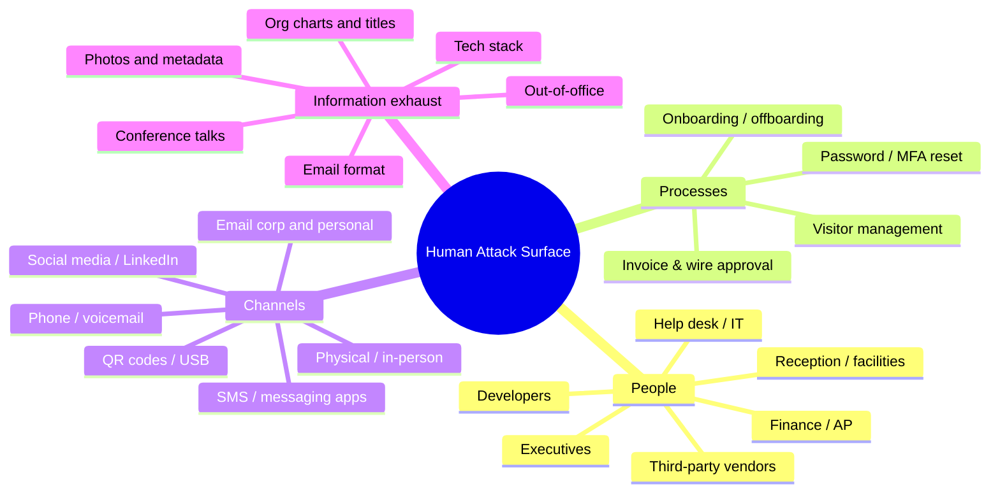
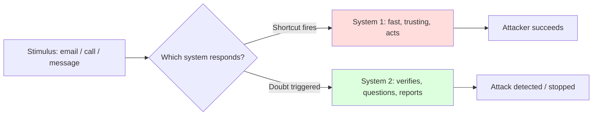
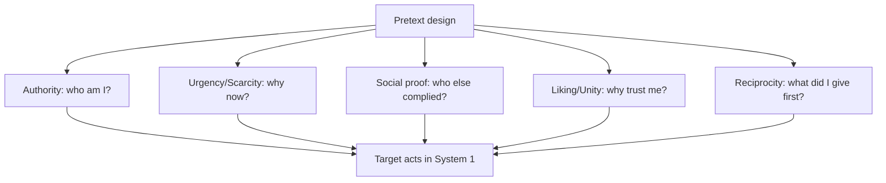
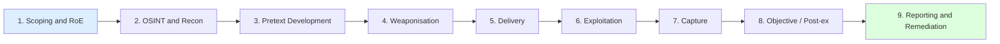
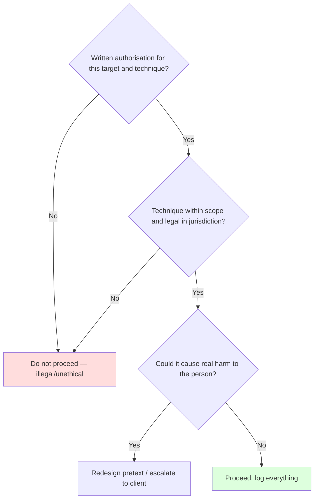
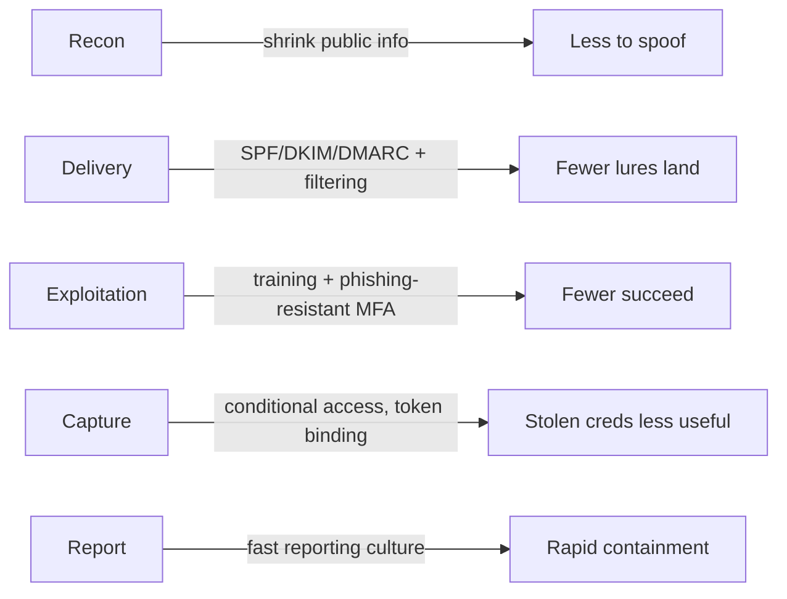
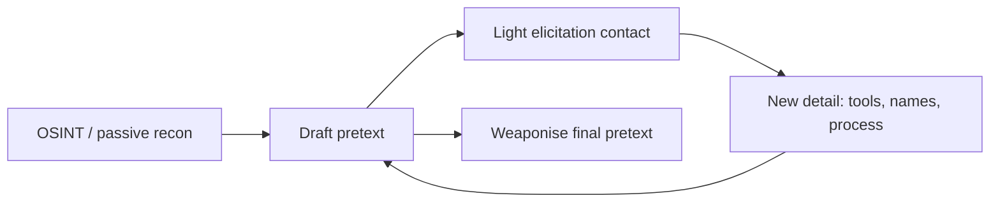
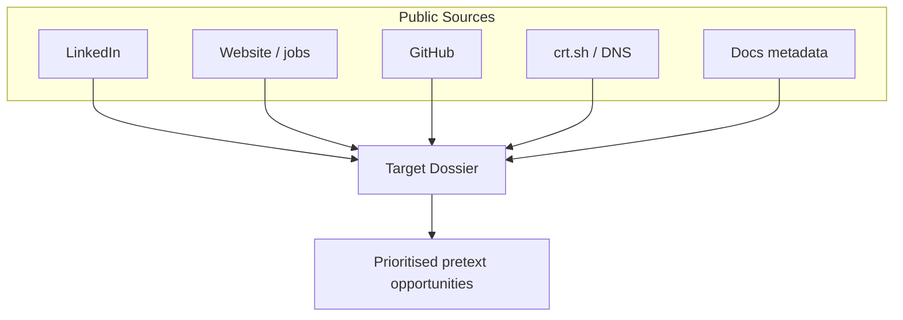
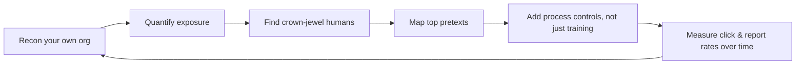

**Level:** Beginner · **Track:** Red Team · **Read time:** 150 min

This is Chapter 1 of the Social Engineering series — the first notebook in the Red Team track. Every earlier notebook attacked machines: services, protocols, web apps, Active Directory. This one attacks the one component you can never patch — the human being who reads the email, answers the phone, holds the door, and types their password when a convincing voice tells them to. Social engineering is not a fringe trick; it is the *initial access* stage of the overwhelming majority of real intrusions. Verizon's Data Breach Investigations Report has for years put the human element at the root of roughly three quarters of breaches, and phishing plus pretexting dominate that category.

This chapter is deliberately foundational. We will not send a single email yet. Instead we build the model everything else in this notebook sits on: what the *human attack surface* actually is, the cognitive machinery attackers exploit, the principles of influence that make a pretext work, the end-to-end social-engineering kill chain, and — throughout — the ethical and legal guardrails that separate an authorised red-team operator from a criminal. Everything here is framed for authorised, scoped engagements and defensive understanding. You practise on infrastructure and personnel you are contracted to test, or on yourself.

---

## Part 1: What "The Human Attack Surface" Actually Means

In application security you learned to enumerate an *attack surface*: every input, endpoint, and trust boundary an attacker could touch. The human attack surface is the same idea applied to people and the processes they follow. It is the sum of every point where a human decision, action, or piece of trust can be influenced by an outsider.

Concretely, an organisation's human attack surface includes:

- **People with access** — employees, contractors, interns, executives, help-desk staff, developers, finance clerks, receptionists, cleaners, and third-party vendors. Each holds some access (a badge, a login, signing authority, physical keys) or some *information* that leads to access.
- **The processes they follow** — password reset flows, new-hire onboarding, invoice approval, purchase orders, "please reset my MFA" help-desk tickets, visitor sign-in, wire transfers. Every process is a script an attacker can learn and abuse.
- **The channels that reach them** — corporate email, personal email, SMS, phone, LinkedIn DMs, Slack/Teams, WhatsApp, QR codes on a poster, a USB drive in the car park, an in-person conversation at reception.
- **The information exhaust** — everything a person or company publishes that helps an attacker sound legitimate: job titles, org charts, email-address formats, tech-stack hints, out-of-office replies, conference talks, GitHub commits, and photos that reveal badge designs or desk layouts.

Notice the pattern from earlier notebooks repeats here. Just as a web app has a larger attack surface the more endpoints it exposes, an organisation has a larger *human* attack surface the more people it employs, the more they publish, and the more processes rely on trust rather than verification.



**Red team usage:** the first job of any social-engineering engagement is to *map this surface* before touching a single person — exactly the discipline the next chapter covers. **Blue team usage:** defenders map the same surface to shrink it — reducing what's public, hardening the highest-risk processes (finance, help desk), and instrumenting the channels attackers use.

### Why humans are the softest target

Machines fail closed when you get the protocol wrong; humans fail *open* when you get the story right. A firewall does not feel social pressure. A person does. Three structural reasons make people the reliable entry point:

1. **Patched slowly, if ever.** You can push a kernel patch overnight. You cannot patch the instinct to be helpful, to trust authority, or to avoid conflict. Awareness training decays; new staff arrive untrained.
2. **They hold the keys deliberately.** Access controls exist so that *people* can do their jobs. The help-desk analyst is *supposed* to reset passwords. The AP clerk is *supposed* to pay invoices. Abuse of a legitimate process leaves fewer technical traces than an exploit.
3. **They are reachable directly.** You often cannot reach a target's internal database from the internet, but you can almost always reach an employee's inbox, phone, or LinkedIn.

This is why, throughout this notebook, we treat the human as a first-class part of the attack surface — enumerated, prioritised, and (on the defensive side) monitored and hardened just like any server.

---

## Part 2: A Short, Honest History of Social Engineering

Social engineering long predates computers — con artists, grifters, and spies have exploited trust for centuries. What changed is *scale and reach*. A few landmarks worth knowing because interviewers and CTFs reference them:

- **Kevin Mitnick (1980s–90s).** The archetypal social engineer. Much of his access came not from code but from phone calls — impersonating employees, talking staff into revealing dial-in numbers, source code, and credentials. His book *The Art of Deception* is still a useful catalogue of pretexts.
- **The rise of phishing (late 1990s–2000s).** As email became universal, mass "phishing" (a play on "fishing") emerged — fake AOL, PayPal, and bank messages harvesting credentials at scale.
- **Spear phishing and APTs (2010s).** Targeted phishing became the standard *initial access* vector for nation-state and criminal groups. The 2013 Target breach began with a phishing email to an HVAC vendor. The 2016 DNC compromise began with a credential-harvesting email. The 2011 RSA SecurID breach began with an Excel attachment titled "2011 Recruitment plan".
- **Business Email Compromise, BEC (2015–present).** Pure pretexting with almost no malware: an attacker impersonates a CEO or supplier and instructs finance to wire money or change bank details. The FBI's IC3 consistently ranks BEC among the costliest cybercrime categories — billions in annual losses.
- **MFA-era phishing (2020s).** As organisations rolled out multi-factor authentication, attackers adapted: MFA-fatigue push-bombing (used in several high-profile 2022 intrusions), and real-time *adversary-in-the-middle* phishing that proxies the login and steals the session cookie (Chapter 8).

The through-line: as technical defences improve, attackers move up the stack to the human. This is why social engineering is not a "beginner topic to graduate from" but a permanent, evolving discipline.

---

## Part 3: The Cognitive Machinery — Why the Brain Is Exploitable

To manipulate a decision you must understand how decisions are actually made. Human cognition runs on two systems, popularised by Daniel Kahneman:

- **System 1** — fast, automatic, emotional, effortless. It handles the flood of daily micro-decisions with heuristics (mental shortcuts). Reading an email, judging a caller's tone, deciding a logo "looks right" — all System 1.
- **System 2** — slow, deliberate, logical, effortful. It engages when we consciously reason, but it is lazy and expensive; the brain avoids it whenever a shortcut will do.

**Social engineering is, at its core, the art of keeping the target in System 1 and preventing System 2 from waking up.** Every technique you will learn — urgency, authority, fear, a familiar-looking logo — is designed to make the fast, trusting system act before the slow, sceptical system asks "wait, is this real?"



### The heuristics attackers weaponise

| Cognitive bias / heuristic | What it is | How it's abused in social engineering |
|---|---|---|
| **Authority bias** | We defer to perceived authority figures | Impersonate the CEO, IT admin, police, auditor, or a vendor "account manager" |
| **Urgency / scarcity** | Time pressure short-circuits deliberation | "Your account will be locked in 15 minutes", "invoice overdue today" |
| **Social proof** | We copy what others (seem to) do | "All of finance has already approved this", forged reply chains |
| **Reciprocity** | We feel obliged to return favours | Offer "help" first, then request access; small gift before the ask |
| **Liking / affinity** | We say yes to people we like or resemble | Shared alma mater, hobby, fake rapport, flattery |
| **Commitment & consistency** | We stay consistent with prior small actions | Get a tiny "yes" first (confirm your name?), escalate to a big one |
| **Loss aversion** | Losses hurt about twice as much as equivalent gains | "Fail to act and you'll lose access / be fined / miss payroll" |
| **Curiosity** | Novelty and gossip draw clicks | "Restructuring plan.xlsx", "photos from the party" |
| **Halo effect** | One good trait colours the whole judgment | A polished logo/website makes the *request* seem legitimate too |

**CTF/practical note:** platforms like TryHackMe's *social engineering* rooms and many OSINT challenges test whether you can *identify* which principle a given lure uses — being able to name the bias in a phishing sample is a common exam and interview question.

### Emotional levers

Beyond biases, attackers deliberately induce *emotional states* that suppress scrutiny: **fear** (account compromised, legal trouble), **greed** (bonus, refund, prize), **curiosity** (leaked document), **helpfulness** (a stranded colleague), and **guilt/obligation**. A useful mental rule for both attackers-in-training and defenders: *strong emotion plus time pressure plus an unusual request is the signature of manipulation.* Teaching staff that specific triad is one of the highest-yield awareness lessons (Chapter 11).

---

## Part 4: Cialdini's Six Principles of Influence, Applied

Robert Cialdini's *Influence* distilled persuasion into principles that map almost one-to-one onto social-engineering tradecraft. Every serious operator internalises these because a pretext is really a *stack* of them.

1. **Reciprocity.** People repay. A pretexter who "helps" first — "I noticed your account flagged, let me fix it for you" — creates an obligation that makes the later request (a code, a password) feel fair.
2. **Commitment & Consistency.** Once someone commits to a position, they align later behaviour with it. Start with an innocuous request the target agrees to ("Can you confirm you're the AP contact?"), then escalate. Each yes makes the next harder to refuse.
3. **Social Proof.** Under uncertainty we look to others. "Your colleague Sarah in the same team already verified" or a forged email thread showing peers complying manufactures false consensus.
4. **Authority.** Titles, uniforms, and jargon trigger deference. Spoofing the CFO, name-dropping the CISO, or wearing a hi-vis vest and carrying a clipboard all borrow authority.
5. **Liking.** We comply with people we like. Attackers build rapport fast: mirroring language, shared connections on LinkedIn, compliments, or simply being warm and friendly on a call.
6. **Scarcity.** Rare or time-limited things feel more valuable and urgent. "Only today", "limited seats", "before the system locks" all exploit scarcity to force System 1 action.

Cialdini later added a seventh — **Unity** (shared identity: "we're both engineers", "we're all in this together") — which underpins pretexts that lean on in-group membership.



**Worked example — a BEC pretext dissected.** Consider this (sanitised) message an authorised red team might model:

> From: "Jane Okoro, CEO" &lt;jane.okoro@yourcompany-invoices.com&gt;
> Subject: Quick favour — need this before my flight
>
> Hi Tomas, I'm about to board and can't take calls. We need to close the Nakamura deal today — please process the wire to the new account details attached. Legal has already signed off (see thread). Keep this confidential until the announcement. Thanks — Jane

Count the principles: **Authority** (the CEO), **Scarcity/Urgency** ("before my flight", "today"), **Social proof** ("Legal has already signed off"), **Liking/Unity** (first-name warmth), and a **consistency** trap (the confidentiality request pre-empts the target checking with anyone). The *look-alike domain* (`yourcompany-invoices.com`) is the technical sleight of hand we'll dismantle in Chapter 4. This is why BEC works without malware — it is pure applied psychology.

---

## Part 5: Taxonomy of Social-Engineering Attacks

The notebook's later chapters go deep on each; here is the map so you can place every technique.

| Category | Channel | Description | Later chapter |
|---|---|---|---|
| **Phishing** | Email (mass) | Broad, low-effort credential/malware lure | Ch 3, 5 |
| **Spear phishing** | Email (targeted) | Tailored to a specific person/role using recon | Ch 2–3 |
| **Whaling** | Email | Spear phishing aimed at executives ("big fish") | Ch 3 |
| **BEC / CEO fraud** | Email | Impersonate exec/vendor to move money or data | Ch 3–4 |
| **Vishing** | Voice call | Phone pretexting (help desk, bank, IT) | Ch 9 |
| **Smishing** | SMS | Text-message lures (delivery, MFA, bank) | Ch 9 |
| **Angler phishing** | Social media | Fake support accounts replying to complaints | Ch 3 |
| **Pretexting** | Any | The invented scenario/identity underpinning all of the above | Ch 2 |
| **Baiting** | Physical/USB | Drop infected media/QR to exploit curiosity | Ch 9 |
| **Quid pro quo** | Phone/in-person | Offer a "service" in exchange for access | Ch 9 |
| **Tailgating / piggybacking** | Physical | Follow an authorised person through a door | Ch 9 |
| **Watering hole** | Web | Compromise a site the target group visits | (web track) |
| **AiTM phishing** | Email + proxy | Real-time proxy that steals MFA session cookies | Ch 8 |
| **Deepfake / AI voice** | Voice/video | Synthetic media impersonation | Ch 10 |

A single engagement usually *chains* several: OSINT recon (Ch 2) → a spear-phishing email (Ch 3) → a credential harvester (Ch 5) → an AiTM proxy to defeat MFA (Ch 8) → a follow-up vishing call to complete access (Ch 9).

---

## Part 6: The Social-Engineering Kill Chain

Borrowing from Lockheed Martin's Cyber Kill Chain and adapting it to the human vector, an authorised social-engineering engagement follows a repeatable lifecycle. Internalise this — every later chapter slots into one of these stages.



1. **Scoping & Rules of Engagement (RoE).** Define authorised targets, channels, timing, safe-words, data-handling, and no-go areas *in writing* before anything else. This is the legal backbone (Part 8).
2. **OSINT & Recon.** Enumerate the human attack surface: people, roles, emails, tech, relationships (Chapter 2).
3. **Pretext Development.** Craft a believable identity and scenario tuned to the target and objective (Chapter 2).
4. **Weaponisation.** Build the lure and, if in scope, the payload or credential harvester (Chapters 3, 5, 7).
5. **Delivery.** Send via the chosen channel — email infrastructure that lands in the inbox (Chapter 4), a phone call, or physical drop.
6. **Exploitation.** The target takes the intended action: clicks, enters credentials, approves a push, opens a document, lets you in.
7. **Capture.** Harvested credentials, a live session cookie, code execution, or physical entry.
8. **Objective / Post-exploitation.** Use the access to reach the engagement's goal (data, domain admin, proof) — handing off to the pentest/red-team-ops notebooks.
9. **Reporting & Remediation.** Document what worked, quantify risk, and — critically — help the client fix the *process and awareness* gaps, not just punish clicks.

**Blue team usage:** the same chain read left-to-right is a *detection opportunity map*. Defenders can intervene at recon (reduce public info), delivery (email auth, filtering), exploitation (browser isolation, phishing-resistant MFA), capture (conditional access, token binding), and reporting (a strong "report phish" culture). We consolidate this in Part 10 and Chapter 11.

---

## Part 7: Anatomy of a Pretext

A **pretext** is the fabricated identity + scenario that gives the target a plausible reason to comply. It is the single most important artefact in social engineering, and Chapter 2 is devoted to building them. Here we define the components so the vocabulary is set.

A complete pretext answers six questions:

1. **Who am I?** (the persona: IT support, a new vendor, HR, a courier)
2. **Why am I contacting *you*?** (the hook that ties to the target's real role)
3. **What do I want?** (the objective: a click, a code, a door, a wire)
4. **Why now?** (the urgency/scarcity element)
5. **Why should you trust me?** (authority, shared context, spoofed identifiers)
6. **What happens if you don't comply?** (loss/consequence framing)

A strong pretext is **plausible** (fits the target's normal world), **specific** (uses real names, systems, and jargon gathered in recon), **low-friction** (asks for something the target *can* and *routinely does* do), and **verifiable-looking but hard to actually verify** (a spoofed sender, a caller ID, a look-alike portal).

```mermaid
sequenceDiagram
    participant A as Attacker (persona: IT Support)
    participant T as Target (employee)
    A->>T: "Hi, IT here — we see failed logins on your account"
    Note over T: Authority + fear engaged (System 1)
    T->>A: "Oh no, is my account okay?"
    A->>T: "I can secure it now — read me the code we just sent"
    Note over T: Reciprocity + urgency; verification skipped
    T->>A: Reads MFA code
    A->>A: Completes login / approves push
    Note over A: Capture achieved
```

**Ethics checkpoint:** notice how effective this is even on paper. That effectiveness is exactly why authorised operators keep pretexts *within scope*, avoid genuinely traumatising themes (real bereavement, medical emergencies, sexual content), and never actually harm the person or exfiltrate real personal data. We build these to *measure and improve* an organisation's resilience, not to exploit individuals.

---

## Part 8: Ethics, Law, and Rules of Engagement (Read This Twice)

Social engineering is the area of offensive security where the line between an authorised test and a crime is thinnest, because the "target" is a human being with rights, feelings, and legal protections. **Every technique in this notebook is lawful only under explicit, written authorisation with a defined scope.** Get this wrong and you commit fraud, computer-misuse, impersonation, or wire-fraud offences regardless of intent.

### The non-negotiables

- **Written authorisation.** A signed contract/statement of work naming the client, the authorised targets, the permitted techniques, the time window, and the people who can call it off. Verbal "sure, go ahead" is not authorisation.
- **Scope.** Which domains, phone ranges, buildings, and people are in scope — and, just as important, who and what is *out*. Executives may be excluded; personal devices and personal accounts are usually off-limits.
- **Relevant laws (know your jurisdiction).** In the US, the Computer Fraud and Abuse Act (CFAA) and wire-fraud statutes; impersonating federal agents or law enforcement is itself a crime. In the UK, the Computer Misuse Act 1990 and the Fraud Act 2006. In the EU, GDPR governs any personal data you touch. Impersonating police, government, or medical staff is frequently illegal *even in an authorised test* and is typically excluded in the RoE.
- **Data handling.** Harvested credentials must be stored encrypted, used only to prove impact, and destroyed per the contract. You do not read employees' actual email, exfiltrate personal data, or keep passwords beyond the engagement.
- **Psychological safety.** Avoid pretexts that could cause genuine distress (fake death of a relative, fake serious illness, fake job termination). Have a *de-escalation* plan and a safe-word/point-of-contact so a target or the SOC can verify an operation is authorised without blowing cover to everyone.
- **The "get out of jail" letter.** For physical engagements, carry a signed authorisation letter with client contacts to show if security or police detain you. The 2019 Coalfire case in Iowa — where two authorised physical pentesters were arrested despite a contract — is the canonical cautionary tale about *ambiguous scope* and *who* inside the client actually has authority to approve building entry.

### A simple decision gate



If you cannot point to the clause that authorises what you are about to do, you are not testing — you are offending. This gate applies to every remaining chapter.

---

## Part 9: Hands-On Lab — Mapping a Human Attack Surface from Open Sources

**Objective:** without contacting anyone, build a *human attack-surface map* of a target organisation using only passive OSINT, and identify the highest-value pretext opportunities. This mirrors stage 2 of the kill chain and sets up Chapter 2.

**Lawful-use framing:** perform this against an organisation you are authorised to test, your *own* employer with permission, or a deliberately public practice target such as a bug-bounty program that lists social engineering as *out of scope* (you still only gather already-public data and never contact anyone). We use a fictional example, `acme-widgets.example`, throughout.

### Step 0 — Tooling (teach-from-scratch)

Everything here uses passive, read-only tools. On Kali Linux (or any Linux box) install what you don't have:

```bash
# theHarvester — OSINT aggregator for emails, names, subdomains, hosts
sudo apt update && sudo apt install -y theharvester

# whois / dig — domain & DNS metadata (usually preinstalled)
sudo apt install -y whois dnsutils

# Optional: a lightweight username/profile checker
pipx install maigret    # searches many sites for a username

# jq — pretty-print JSON from APIs
sudo apt install -y jq
```

- **`theHarvester`** is an OSINT aggregator: given a domain, it queries public sources (search engines, certificate transparency, some paid APIs if you add keys) and returns emails, employee names, subdomains, and hosts. It exists to automate the boring parts of footprinting.
- **`whois`** returns domain registration data (registrar, sometimes registrant org/contact, creation date). Useful for spotting look-alike domains an attacker *could* register.
- **`dig`** queries DNS records — MX (mail servers, hints at the email provider and defences), TXT (SPF/DMARC, previewing Chapter 4), and more.

### Step 1 — Establish the email format

Email format is the master key to phishing a company: guess one person's address correctly and you can address the whole org. Start with what's already indexed:

```bash
theHarvester -d acme-widgets.example -b bing,duckduckgo,crtsh -l 200
```

- `-d` = target domain.
- `-b` = data sources (back-ends). `crtsh` pulls names from Certificate Transparency logs; `bing`/`duckduckgo` scrape indexed results. Chaining several sources reduces blind spots.
- `-l 200` = limit results per source to 200.

Realistic (illustrative) output:

```
[*] Emails found: 6
------------------
j.okoro@acme-widgets.example
t.mendes@acme-widgets.example
s.patel@acme-widgets.example
helpdesk@acme-widgets.example
accounts@acme-widgets.example
careers@acme-widgets.example

[*] Hosts found: 4
------------------
mail.acme-widgets.example
vpn.acme-widgets.example
portal.acme-widgets.example
autodiscover.acme-widgets.example
```

Interpretation: the format is clearly `{first-initial}.{lastname}@`. Two role-based aliases (`helpdesk@`, `accounts@`) are gold — they name the *processes* (IT support, accounts payable) most worth targeting. `vpn.` and `portal.` hint at externally reachable login pages that a look-alike harvester could clone.

### Step 2 — Cross-reference people to roles (build a mini org chart)

Use LinkedIn (in a browser, manually — respect the platform's terms; do not scrape aggressively) plus the company's own "About/Team" page and press releases to attach *roles* to the names. Record them:

| Name | Likely email | Role | Why they matter (pretext angle) |
|---|---|---|---|
| Jane Okoro | j.okoro@ | CEO | Authority source to *impersonate* in BEC |
| Tomas Mendes | t.mendes@ | AP / Finance clerk | *Target* for wire-fraud pretext |
| Sara Patel | s.patel@ | IT Help Desk lead | Target for MFA-reset vishing; or persona to impersonate |
| — | helpdesk@ | IT support alias | Process to abuse (reset flows) |
| — | accounts@ | Finance alias | Process to abuse (invoice changes) |

This table *is* the human attack surface, prioritised. Note we record it neutrally, for the report — not to actually defraud Tomas.

### Step 3 — Fingerprint the email defences (preview of Chapter 4)

```bash
dig +short MX acme-widgets.example
dig +short TXT acme-widgets.example | grep -i spf
dig +short TXT _dmarc.acme-widgets.example
```

Illustrative results:

```
10 acme-widgets-example.mail.protection.outlook.com.
"v=spf1 include:spf.protection.outlook.com -all"
"v=DMARC1; p=none; rua=mailto:dmarc@acme-widgets.example"
```

Interpretation: they use Microsoft 365 (M365) for mail. SPF ends in `-all` (a hard fail — good), but **DMARC is `p=none`** — meaning failing messages are *monitored, not rejected*. For a defender that's a finding: direct-domain spoofing is not actively blocked. For an authorised red teamer it informs whether to spoof the exact domain or use a look-alike (Chapter 4 explains exactly why).

### Step 4 — Look for a look-alike domain opportunity

```bash
whois acme-widgets.example | grep -iE "created|registrar|status"
# Is a plausible typo/look-alike domain unregistered and thus available to an attacker?
whois acme-widgets-invoices.example | grep -i "No match" && echo "AVAILABLE - risk"
```

Finding an *unregistered* convincing look-alike (`acme-widgets-invoices.example`, `acme-w1dgets.example`) is a concrete risk to report: an attacker could register it for a few dollars and pass casual inspection.

### Step 5 — Assemble the deliverable

Produce a one-page **Human Attack Surface Map** containing: the email format, the prioritised people/roles table, the exposed login portals, the email-auth posture (SPF/DMARC), and the top three *pretext opportunities* with the influence principles each would exploit. Example top-three:

1. **CEO→AP wire fraud (BEC):** impersonate Jane (authority) to Tomas (AP), urgency + confidentiality. *Enabled by:* public org chart + `p=none` DMARC.
2. **Help-desk MFA reset (vishing):** impersonate an employee to `helpdesk@`, or impersonate help desk to an employee. *Enabled by:* published help-desk alias + predictable email format.
3. **Portal credential harvest (phishing):** clone `portal.acme-widgets.example`, lure via look-alike domain. *Enabled by:* exposed portal + available look-alike domain.

That map is the entire point of this chapter made concrete: you have enumerated a human attack surface, prioritised it by impact, and named the psychology each pretext would use — with zero contact and zero law broken.

---

## Part 10: Detection & Defense Angle

Everything above has a defensive mirror. Because this is the foundational chapter, we set out the *strategy*; Chapter 11 is the full playbook.

**Shrink the surface (recon-stage defence).**
- Minimise public information that fuels pretexts: no full org charts with reporting lines, careful with out-of-office auto-replies, scrub metadata from published documents, and coach executives on what they reveal in talks and social media.
- Assume the email format is public (it always is). Defence therefore cannot rely on secrecy — it must rely on *verification*.

**Harden the highest-risk processes (exploitation-stage defence).**
- **Finance:** mandate out-of-band verification (a call to a *known* number, not the one in the email) and dual authorisation for any wire or bank-detail change. This single control defeats most BEC.
- **Help desk:** require strong identity proofing before password/MFA resets (callback to a registered number, manager approval, or in-person). Attackers love a help desk that resets MFA on a convincing story.

**Instrument the channels (delivery/capture-stage defence).**
- Email authentication: SPF, DKIM, and DMARC at **`p=reject`** (Chapter 4) to stop exact-domain spoofing; add anti-look-alike/brand-impersonation detection.
- Phishing-resistant MFA (FIDO2/WebAuthn passkeys) to blunt credential harvesting and even AiTM (Chapter 8).
- Report-phish button and a **no-blame reporting culture** — the fastest breach containment is an employee who reports the lure in minutes.

**Measure, don't punish.** Authorised phishing simulations exist to produce a *click-and-report rate* trend, target training where it's needed, and prove control improvements — not to shame the person who clicked. Punitive programs drive under-reporting, which is worse than clicking.



---

## Part 11: Real-World Cases to Learn From

- **RSA SecurID (2011).** An Excel attachment ("2011 Recruitment plan.xls") emailed to a small group; one employee retrieved it from junk and opened it. A single click seeded a breach that affected SecurID's cryptographic seeds. *Lesson:* targeting + curiosity beats broad spam; the human, not the filter, was the last line.
- **Target (2013).** Initial access via a phishing email to an HVAC vendor (Fazio Mechanical), whose network access was reused to reach Target's environment. *Lesson:* your human attack surface includes your suppliers.
- **Twitter (2020).** Attackers vished (phone-phished) employees to reach internal admin tooling, then hijacked high-profile accounts. *Lesson:* voice pretexting against staff can defeat strong technical controls; help-desk/tooling access is a crown jewel.
- **Uber (2022).** An MFA-fatigue push-bombing attack plus a WhatsApp message *posing as IT* convinced a contractor to approve a login. *Lesson:* MFA is not magic; push-approval MFA is socially engineerable — hence the move to phishing-resistant factors.
- **BEC generally.** The FBI IC3 reports BEC losses in the *tens of billions* cumulatively — almost all pure pretexting, no malware. *Lesson:* the most expensive social engineering needs no exploit at all.

Each case maps cleanly onto the kill chain and the influence principles; being able to do that mapping out loud is exactly what a red-team or SOC interview probes.

---

## Part 12: Elicitation — Getting Information Without Asking For It

A pretext delivers a payload; **elicitation** gathers the raw material that makes the pretext believable. Elicitation is the craft of steering a normal-seeming conversation so the target volunteers information they would never hand over if asked directly. It is used both in recon (Chapter 2) and live on a call (Chapter 9). Understanding it now sharpens both your offensive planning and your defensive radar.

The core principle: **people want to appear knowledgeable, helpful, and consistent, and they dislike silence and correction.** Elicitation weaponises these tendencies. Key techniques:

| Technique | How it works | Example line | Why it works |
|---|---|---|---|
| **Deliberate false statement** | State something wrong; people reflexively correct it | "You still run everything on-prem, right?" | Consistency/ego: correcting feels like helping |
| **Assumed knowledge** | Speak as an insider so they match your register | "Since you're on the Okta rollout too…" | Unity/social proof |
| **Bracketing** | Guess a range; they narrow it | "Team's what, 40, 50 people?" → "More like 30" | People correct numbers, not the premise |
| **Quid pro quo of info** | Over-share first; reciprocity pulls a reply | "We just moved to CrowdStrike, painful migration…" | Reciprocity |
| **Flattery + expertise** | Praise their skill, ask their opinion | "You clearly know this stack — how'd you handle X?" | Liking/ego |
| **Feigned ignorance** | Play dumb so they explain (and reveal) | "I never understood how your VPN login works…" | Helpfulness |
| **The provocative statement** | Mildly wrong/contrarian claim to spark a rebuttal | "Honestly MFA is security theatre" | Ego + need to correct |
| **Silence** | Pause; the target fills the gap | (say nothing after a half-answer) | Discomfort with silence |

**Illustrative elicitation snippet** (authorised vishing rehearsal; the operator is building rapport with a help-desk analyst before the real ask):

```
Operator: "Hey, quick one — I'm setting up for the new starter batch, you're
           still doing MFA resets through the ticket portal, not the phone line?"
Analyst:  "No no, phone's fine too, we just verify with the employee ID and
           the manager's name."   <-- reveals the exact verification steps
Operator: "Right, the employee ID and manager — makes sense. Bet you get
           slammed on Mondays."   <-- mirrors, builds rapport, banks the process
Analyst:  "Ha, you have no idea…"
```

In four lines the operator has learned the *exact* identity-proofing the help desk uses — the very control they must satisfy or bypass later. **Blue team usage:** train staff that describing internal *process* to an unverified caller is itself a disclosure; the counter is a scripted "I can't discuss our verification steps — let me call you back on your listed number." **CTF/bug-bounty note:** the same elicitation mindset applies to reading a target's public docs, Slack, or GitHub issues, where engineers casually reveal architecture that becomes your attack map.

### The elicitation-to-pretext loop

Recon and pretexting are not sequential-once but a loop: each piece of elicited detail makes the next pretext more specific, which elicits more detail.



---

## Part 13: A Reusable Pretext Library

Experienced operators keep a library of *pretext patterns* — reusable persona+scenario combinations that they tailor with recon. Studying the library also teaches defenders exactly what to drill against. Each entry names the persona, the hook, the objective, and the dominant influence principles.

| Persona | Hook (why they're contacting you) | Objective | Primary principles | Channel |
|---|---|---|---|---|
| **IT Help Desk** | "We detected suspicious logins on your account" | MFA code / password / push approval | Authority + Fear + Reciprocity | Phone/email |
| **New employee** | "It's my first day and I can't log in, my manager said you'd help" | Password reset / access | Liking + Helpfulness + Unity | Phone |
| **Senior executive (BEC)** | "Confidential deal, need this handled now" | Wire transfer / gift cards / data | Authority + Urgency + Consistency | Email |
| **Vendor / supplier** | "Our bank details changed, update before next invoice" | Redirect payments | Authority + Consistency | Email |
| **Delivery / courier** | "Package needs a signature / redelivery fee" | Click smishing link / building entry | Urgency + Curiosity | SMS/physical |
| **HR / payroll** | "Confirm your details for the annual review / bonus" | Credential harvest | Authority + Greed | Email |
| **Auditor / compliance** | "Regulatory audit — we need read access to X" | Access / documents | Authority + Fear | Email/phone |
| **Fellow employee (facilities)** | "Can you hold the door, hands full, forgot my badge" | Physical entry (tailgating) | Liking + Social proof | In-person |
| **Survey / recruiter** | "Quick paid survey about your tech stack" | Elicit internal detail | Reciprocity + Greed | Email/LinkedIn |
| **Microsoft / M365 support** | "Your mailbox is over quota / will be deleted" | Credential harvest | Authority + Loss aversion | Email |

Two rules make a library entry *ethical to use*: it must be in scope, and it must avoid the harmful themes from Part 8. A "your relative is in hospital" pretext is effective and strictly off-limits.

**Tailoring in practice.** Take the generic "Vendor bank-detail change" pattern and fuse it with the Part 9 recon: you now know the real AP clerk (Tomas), the real supplier naming convention, and that DMARC is `p=none`. The generic pattern becomes a specific, high-credibility message — which is exactly why recon (Chapter 2) and pretexting are inseparable.

---

## Part 14: Common Pitfalls & Operator Mistakes

Even technically skilled testers fail social-engineering engagements. The failures are instructive because each is also a *tell* defenders can train on.

- **Over-engineering the pretext.** Beginners write a paragraph of backstory. Real pressure comes from *simplicity + plausibility + a single clear action*. The more you explain, the more System 2 wakes up. Keep the ask small and obvious.
- **Wrong register / jargon.** Using consumer language ("your password thingy") to an IT audience, or deep jargon to a receptionist, breaks the illusion. Match the target's vocabulary — which is why elicitation and recon come first.
- **Traceable urgency that invites verification.** "Reply in the next 5 minutes" can *trigger* a call to IT. Calibrate urgency to be felt, not alarming enough to prompt out-of-band checking.
- **Ignoring time zones and working hours.** A "CEO" emailing finance at 3 a.m. local time, or a "UK courier" texting at a US hour, is a giveaway. Recon includes *when* to strike.
- **Reusing infrastructure.** Sending from a domain already flagged, or a phone number tied to a prior attempt, gets you filtered. (Infrastructure hygiene is Chapters 4 and 6.)
- **Breaking character under pushback.** If a target says "let me verify that with my manager," an amateur panics. A professional pretext has a prepared, calm response — or *gracefully disengages*, because pushing too hard both fails and traumatises.
- **No safe-word / no de-confliction.** Forgetting the agreed mechanism to prove authorisation to a suspicious SOC or an alarmed employee. This is an ethics failure, not just a tradecraft one.
- **Forgetting to capture evidence.** The point is the *report*. Screenshots, timestamps, and click/report metrics are the deliverable; an operator who "wins" but records nothing has failed the engagement.

**Defensive mirror:** every pitfall above is a training signal. The wrong-register email, the off-hours "CEO," the domain that's *almost* right — these are precisely the anomalies a well-trained employee and a good email gateway flag. Turn each operator mistake into a "spot-the-tell" exercise in your awareness program (Chapter 11).

---

## Part 15: The OSINT Source Map for the Human Surface

Chapter 2 goes deep on tooling; here we catalogue *where human-surface intelligence actually lives*, because knowing the source map is what turns aimless googling into disciplined recon. Every source below is passive (read-only) and public — the ethical baseline for this stage.

| Source | What it yields for the human surface | Passive? | Notes / caution |
|---|---|---|---|
| **LinkedIn** | Names, titles, tenure, reporting hints, tech in profiles, "we're hiring" posts | Yes (browse) | Don't mass-scrape; respect ToS. Sales Navigator reveals org depth |
| **Company website / "Team" page** | Executives, org structure, email format, brand assets | Yes | Bios reveal hobbies (liking hooks) |
| **Certificate Transparency (crt.sh)** | Subdomains → portals, apps, staging | Yes | Reveals login pages to clone conceptually |
| **Job postings** | Exact tech stack, tools, EDR/SIEM in use, team size | Yes | "Experience with CrowdStrike + Splunk" = defensive fingerprint |
| **GitHub / GitLab** | Dev names, emails in commits, internal hostnames, secrets | Yes | `git log` in public repos leaks real emails |
| **Breach/paste data (HIBP)** | Which employees were in past breaches, password patterns | Yes | Use only aggregate/authorised; never reuse real creds |
| **Social media (X, Instagram, FB)** | Personal interests, travel (out-of-office windows), badge/desk photos | Yes | Photos leak building layout & badge design |
| **Google dorks** | `site:` + `filetype:` finds docs, org charts, metadata | Yes | `filetype:pdf site:target.com` → author metadata |
| **Company filings / press** | Executives, suppliers, deal names, finance contacts | Yes | Deal names power BEC pretexts |
| **Glassdoor / review sites** | Culture, internal tool names, morale, process gripes | Yes | "The new Workday rollout is a mess" = pretext hook |
| **DNS / WHOIS / Shodan** | Mail provider, exposed services, tech | Yes | Ties human targets to technical entry points |

**Google dork examples** (run against a domain you're authorised to assess):

```text
site:acme-widgets.example filetype:pdf            # documents (check author metadata)
site:acme-widgets.example filetype:xlsx           # spreadsheets (finance, HR lists)
site:acme-widgets.example intitle:"index of"      # exposed directories
site:linkedin.com "Acme Widgets" "accounts payable"   # find the AP team
"@acme-widgets.example" -site:acme-widgets.example    # emails leaked elsewhere
```

**Metadata angle.** Office and PDF documents carry author names, usernames, software versions, and sometimes internal paths in their metadata. A quick pull:

```bash
# exiftool reads embedded metadata from documents/images
exiftool report.pdf | grep -Ei "author|creator|producer|company"
```

Illustrative output:

```
Author        : t.mendes
Creator       : Microsoft Word for Microsoft 365
Company       : Acme Widgets Ltd
```

That single line confirms the `{first-initial}.{lastname}` username convention *and* the Office suite in use — two facts that sharpen every later pretext. **Blue team usage:** strip document metadata before publishing (many DLP and publishing pipelines do this automatically); it is cheap and closes a real leak.



---

## Part 16: The Target Dossier — A Reusable Template

The output of recon is a **dossier**: a structured file per person and per organisation that turns scattered facts into an actionable pretext plan. Standardising it makes engagements faster and reports cleaner. A minimal per-target dossier:

```yaml
# --- Organisation ---
org: Acme Widgets Ltd
domains: [acme-widgets.example]
email_format: "{first-initial}.{lastname}@acme-widgets.example"
mail_provider: Microsoft 365
spf: "-all (hard fail)"
dmarc: "p=none (monitor only)  # spoofing not actively blocked"
exposed_portals: [portal., vpn., autodiscover.]
edr_siem_guess: "CrowdStrike + Splunk (from job posts)"
lookalike_available: ["acme-widgets-invoices.example"]

# --- Person ---
name: Tomas Mendes
role: Accounts Payable Clerk
email: t.mendes@acme-widgets.example
reports_to: Finance Manager (name TBD)
interests: [cycling, Arsenal FC]        # liking hooks (from public socials)
working_hours: "09:00-17:00 GMT"        # timing for delivery
verification_habits: "confirms bank changes by email only"  # elicited
pretext_fit: "Vendor bank-detail change (Authority + Consistency)"
risk_rating: HIGH   # holds payment authority
```

Two dossier disciplines matter for professionalism and ethics:

1. **Source every field.** Note where each fact came from (URL, screenshot, tool). The report must show the client this was all *publicly available* — which is itself a finding ("your AP clerk's role, hours, and interests are trivially discoverable").
2. **Minimise personal data.** Record only what the engagement needs. Interests are a legitimate liking-hook note; a person's home address, family details, or health information are not — collecting them is both unnecessary and a privacy violation.

The dossier is the bridge from this chapter to the rest of the notebook: Chapter 2 fills it, Chapter 3 turns it into a spear-phishing email, Chapter 4 makes that email deliverable, and Chapters 5–9 execute against it.

---

## Part 17: Building a Threat Model of Your Own Human Surface (Defensive Exercise)

Flip the whole chapter around. As a defender, run the *same* passive recon against your own organisation and build the dossier an attacker would. This is the single most effective way to shrink the human attack surface, and it's fully lawful because it's your own org (with sign-off).

The exercise, step by step:

1. **Enumerate exposure.** Run theHarvester, crt.sh, and Google dorks against your own domain. How many emails, portals, and documents are exposed? This is your baseline metric.
2. **Fingerprint your own email auth.** Check your SPF/DKIM/DMARC. Is DMARC at `p=reject`? If it's `p=none`, you've found your top remediation.
3. **Identify the crown-jewel humans.** Who can move money, reset MFA, or grant access? These are your finance team, help desk, and identity admins. They need the most training and the strongest process controls.
4. **Map the highest-impact pretexts** (use the Part 13 library). For each, ask: "what process control would defeat this even if the human is fooled?" That control — not just training — is the durable fix.
5. **Set metrics.** Track click rate and, more importantly, *report rate* over time from authorised simulations (Chapter 11). Rising report rate and falling time-to-report are the numbers that actually predict breach resilience.



This defensive loop is why the offensive and defensive halves of social engineering are the same skill viewed from two directions. An operator who can map a human attack surface is exactly the person who can help an organisation shrink it.

---

## Part 18: Final Revision / Summary

- The **human attack surface** is every person, process, channel, and piece of public information an attacker can influence. You *enumerate and prioritise* it just like a technical attack surface.
- Humans are the softest target because they can't be patched, they hold access deliberately, and they're directly reachable.
- Manipulation works by keeping the target in **System 1** (fast, trusting) and preventing **System 2** (slow, sceptical) from engaging. Urgency + strong emotion + unusual request is the manipulation signature.
- **Cialdini's principles** — reciprocity, commitment/consistency, social proof, authority, liking, scarcity (+ unity) — are the building blocks a pretext stacks together.
- A **pretext** answers who/why-you/what/why-now/why-trust-me/or-else, and must be plausible, specific, low-friction, and hard to verify.
- The **social-engineering kill chain** — scope → recon → pretext → weaponise → deliver → exploit → capture → objective → report — organises the whole notebook and doubles as the defender's detection map.
- **Ethics and law come first, always.** No written, scoped authorisation → no engagement. Impersonating police/government is usually illegal even under contract. Avoid harmful pretexts; protect the people you test.
- Defence is **shrink the surface, harden finance/help-desk processes, instrument channels (DMARC, phishing-resistant MFA), and build a no-blame reporting culture** — and measure, never punish.

Memory hook — **"P.I.E.C.E."**: **P**eople, **I**nfluence principles, **E**thics/authorisation, **C**hain (kill chain), **E**vidence (report). If your engagement thinking touches all five, you're operating like a professional.

---

## Part 19: Cheat Sheet / Quick Reference

**Influence principles (Cialdini + unity):** Reciprocity · Commitment/Consistency · Social Proof · Authority · Liking · Scarcity · Unity.

**Manipulation signature (teach to staff):** unusual request **+** strong emotion **+** time pressure **+** discourages verification.

**SE attack taxonomy:** phishing · spear phishing · whaling · BEC · vishing · smishing · baiting · quid pro quo · tailgating · watering hole · AiTM · deepfake.

**Kill chain:** Scope → Recon → Pretext → Weaponise → Deliver → Exploit → Capture → Objective → Report.

**Pretext six questions:** Who am I? · Why you? · What do I want? · Why now? · Why trust me? · Or else?

**Passive recon quick commands:**

```bash
theHarvester -d TARGET -b bing,duckduckgo,crtsh -l 200   # emails, names, hosts
dig +short MX TARGET                                       # mail provider
dig +short TXT TARGET | grep -i spf                        # SPF policy
dig +short TXT _dmarc.TARGET                               # DMARC policy (none/quarantine/reject)
whois TARGET | grep -iE "created|registrar"                # registration + look-alike hunting
```

**Ethics gate:** No written authorisation for *this* target + technique → STOP. Illegal-impersonation themes (police/gov/medical) → excluded. Harmful pretexts → redesign.

**Top defensive controls:** DMARC `p=reject` · phishing-resistant MFA (FIDO2) · out-of-band + dual-auth for finance · strong help-desk identity proofing · report-phish button + no-blame culture.

---

## Part 20: Practice Labs & Resources

- **TryHackMe — "Phishing" and "Intro to Social Engineering" rooms**: hands-on labs on lures, pretexts, and analysis; good first practical after this chapter.
- **TryHackMe — "OhSINT" and "Sakura Room" (OSINT)**: build the recon muscle you'll need for Chapter 2's human attack-surface mapping.
- **PortSwigger Web Security Academy**: not SE-specific, but its authentication and OAuth labs pair with credential-harvesting concepts you'll meet in Chapters 5 and 8.
- **The SANS "OUCH!" newsletter and NIST Phish Scale**: defender-side reading on measuring phishing difficulty — directly relevant to Chapter 11.
- **Cialdini, *Influence: The Psychology of Persuasion*** and **Christopher Hadnagy, *Social Engineering: The Science of Human Hacking***: the two canonical texts; read the Cialdini principles chapter closely.
- **Kahneman, *Thinking, Fast and Slow*** (System 1/System 2): the cognitive foundation of everything in Part 3.
- **FBI IC3 annual report & Verizon DBIR**: real, current numbers on BEC and the human element to cite in reports and interviews.
- **Self-drill:** take five phishing samples (from your own spam folder or PhishTank) and, for each, label the influence principles and the emotional lever used. Then write the one-line verification step that would have defeated it. This trains both the offensive eye and the defensive habit.

**Practice question 1.** You receive a call: "This is Sara from IT, we're seeing your account locked out — I'll fix it, just read me the code we just texted you." Name every influence principle in play and the single verification step that defeats the attack.

**Practice question 2.** A company publishes a detailed org chart, uses `firstname.lastname@` emails, and has DMARC at `p=none`. Describe the highest-impact pretext this combination enables and which two controls most reduce the risk.

**Practice question 3.** Explain, in System 1 / System 2 terms, why adding a 15-minute countdown to a phishing page increases success — and what a defender can teach staff to counter it.

**Practice question 4 (ethics).** You're asked verbally by a manager to "test" whether the receptionist will let you in. What must exist before you proceed, and which two pretext themes are off-limits regardless?

**Practice question 5 (lab).** Using only passive tools, produce a human attack-surface map (email format, three prioritised roles, email-auth posture, one look-alike-domain risk) for an organisation you are authorised to assess, and note the influence principle behind each pretext opportunity.

---

## Part 21: Appendix — Annotated Lure Teardown Gallery

The fastest way to internalise the psychology is to dissect real-shaped lures. Below are four sanitised samples. For each: the raw message, the influence principles, the technical tells, and the one verification step that defeats it. Use these as templates for a "spot-the-tell" awareness session (Chapter 11) and as a checklist when triaging suspicious mail.

### Sample A — Microsoft 365 credential harvest

```
From: "Microsoft 365 Team" <no-reply@m365-security-alerts.com>
Subject: [Action Required] Your password expires in 24 hours

Dear user,
Our system shows your Acme Widgets mailbox password expires in 24 hours.
To keep the same password and avoid interruption, verify your account now:
   [ Keep My Password ]
Failure to verify will result in permanent loss of access to your mailbox.
Microsoft 365 Security Team
```

- **Principles:** Authority (Microsoft), Loss aversion ("permanent loss"), Urgency (24 hours), and a subtle *convenience* hook ("keep the same password").
- **Technical tells:** sender domain `m365-security-alerts.com` is *not* microsoft.com; the "keep your password" premise is nonsensical (password expiry never lets you keep the same one); generic "Dear user".
- **Defeats it:** never authenticate via an email link — open the portal from a bookmark and check account status there. Hovering the button reveals the real (non-Microsoft) URL.

### Sample B — Vendor bank-detail change (BEC, no malware)

```
From: "Northbridge Supplies (Accounts)" <accounts@northbridge-supplies.co>
Subject: Updated remittance details for upcoming invoices

Hi Tomas,
Please note our bank has changed. Kindly update your records so the next
payment (INV-4471, due Friday) goes to the new account below. Apologies for
the short notice — the old account is already closed.
   Sort code / IBAN: [new details]
Thanks for your continued partnership.
```

- **Principles:** Authority (a real supplier relationship), Consistency ("update your records"), Urgency (due Friday, old account "closed"), Liking ("continued partnership").
- **Technical tells:** the real supplier domain is `northbridge-supplies.com`; this is `.co` (a look-alike TLD). No malware or link — pure process abuse, so email filters may pass it.
- **Defeats it:** out-of-band verification — call the supplier on a *known, previously used* number (never the one in the email) and dual-authorise any bank-detail change. This single control neutralises most BEC.

### Sample C — Help-desk MFA reset (vishing script)

```
[Phone] "Hi, this is Daniel from the IT service desk. We've had a security
alert on your account and I need to re-register your authenticator before it
locks in a few minutes. I'll send a code now — can you read it back so I can
confirm it's really you?"
```

- **Principles:** Authority (IT), Fear (security alert), Urgency (locks in minutes), Reciprocity ("I'll fix it for you").
- **Technical tells:** legitimate IT never asks you to *read back* an MFA code — the code is proof of *your* identity to a login *the caller is driving*. Inbound call you can't verify.
- **Defeats it:** hang up and call IT back on the official number. Policy: "we will never ask you to read a code to us." An MFA code read aloud is a credential handed to the attacker.

### Sample D — Smishing (SMS delivery lure)

```
[SMS] Royal Delivery: Your parcel is held pending a GBP 1.45 customs fee.
Reschedule & pay here: hxxps://royaldelivery-reschedule.top/uk
```

- **Principles:** Curiosity/expectation (many people are awaiting a parcel), Urgency (held), tiny plausible amount (small enough not to trigger scrutiny — loss-aversion calibrated low).
- **Technical tells:** `.top` domain, brand mismatch, unsolicited payment request over SMS, link shortener behaviour.
- **Defeats it:** never pay or log in from an SMS link; check the courier via its official app/site. Report and delete.

**Pattern across all four:** authority + a manufactured reason to act *now* + a channel that discourages verification. Teach staff to recognise that *shape* rather than memorising specific scams — new lures change the surface details but keep the shape. That single lesson, plus the process controls (out-of-band verification, phishing-resistant MFA, "never read a code aloud"), is the core of the defensive program built in Chapter 11.

---

## Part 22: Worked Answers to the Practice Questions

Attempt each question before reading these. The goal is to *reason in the framework*, not memorise answers.

**Answer 1 — the "read me the code" call.** Principles: **Authority** ("this is IT"), **Fear/urgency** ("account locked out"), **Reciprocity** ("I'll fix it for you"), and an implicit **liking** from a warm, helpful tone. The tell is structural: legitimate IT never needs *you* to read an MFA code aloud, because the code proves *your* identity to a login someone else is driving. Single defeating step: **hang up and call IT back on the official, published number.** Policy line to institutionalise it: "We will never ask you to read a one-time code to us." This converts a judgment call into a rule, moving the decision out of System 1.

**Answer 2 — org chart + `firstname.lastname@` + DMARC `p=none`.** Highest-impact pretext: **CEO→finance BEC / wire fraud.** The public org chart reveals who the CEO and the AP/finance staff are and their reporting line; the predictable email format lets the attacker address anyone; `p=none` means the attacker can spoof the *exact* corporate domain and it won't be rejected (only monitored). Two controls that most reduce risk: (1) **move DMARC to `p=reject`** (with SPF+DKIM aligned) to stop exact-domain spoofing, and (2) **mandatory out-of-band verification + dual authorisation** for any payment or bank-detail change, which defeats the fraud even if a spoofed or look-alike message slips through.

**Answer 3 — the 15-minute countdown.** In dual-process terms, a countdown manufactures **time pressure that keeps the target in System 1** and prevents the slow, sceptical System 2 from engaging — the victim acts (enters credentials) before asking "is this real?". Loss aversion amplifies it: the ticking clock frames inaction as a *loss* (locked account). Defender counter: teach the explicit heuristic "**urgency is itself a red flag — the more a message rushes you, the more you should slow down and verify out-of-band**," and remove real business urgency from security-relevant flows (e.g., password expiry warnings sent well in advance, never "in 15 minutes").

**Answer 4 — verbal request to test the receptionist.** Before proceeding you need **written authorisation** (a signed statement of work / RoE) that (a) names physical social engineering as in scope, (b) is approved by someone with *actual authority* to permit building entry, and (c) defines the time window and a de-confliction contact — plus a **get-out-of-jail letter** to carry. A verbal "go ahead" from a manager is not sufficient (recall the Coalfire arrests). Off-limits pretext themes regardless of authorisation: **impersonating police/government officials** (often independently illegal) and **any theme likely to cause genuine trauma** (fake bereavement, medical emergency, threats).

**Answer 5 — the human attack-surface map.** A complete answer produces, from passive tools only: the **email format** (e.g., `{first-initial}.{lastname}@`), **three prioritised roles** with why they matter (e.g., CEO = authority to impersonate; AP clerk = wire-fraud target; help-desk lead = MFA-reset target), the **email-auth posture** (SPF `-all`, DMARC policy), and **one look-alike-domain risk** (an available convincing typo/TLD variant). For each pretext opportunity, name the dominant influence principle — BEC = Authority+Urgency, help-desk vishing = Authority+Fear+Reciprocity, portal harvest = Authority+Loss aversion. The deliverable should *source every fact* and note that all of it was public, which is itself the headline finding.

---

## Part 23: Glossary of Key Terms

Precise vocabulary matters in reports and interviews. Definitions used consistently throughout this notebook:

- **Social engineering** — manipulating people into performing actions or divulging information that benefits the attacker, by exploiting trust, authority, emotion, and cognitive shortcuts rather than technical exploits.
- **Human attack surface** — the sum of people, processes, communication channels, and public information through which an attacker can influence an organisation.
- **Pretext** — the fabricated identity and scenario an operator adopts to justify a request to the target.
- **Pretexting** — the act of creating and using a pretext; a distinct MITRE ATT&CK sub-technique of phishing/impersonation.
- **Phishing** — fraudulent electronic communication (usually email) designed to trick recipients into revealing credentials, transferring funds, or executing a payload.
- **Spear phishing** — phishing tailored to a specific individual or small group using recon.
- **Whaling** — spear phishing aimed at senior executives ("big fish").
- **BEC (Business Email Compromise)** — impersonation of an executive, employee, or vendor to induce fraudulent payments or data disclosure; often malware-free.
- **Vishing** — voice phishing; social engineering conducted over the phone.
- **Smishing** — SMS phishing; lures delivered by text message.
- **Baiting** — leaving malicious media (USB, QR) to exploit curiosity for access or execution.
- **Quid pro quo** — offering a service or benefit in exchange for information or access.
- **Tailgating / piggybacking** — following an authorised person through a physical access point without valid credentials.
- **Elicitation** — extracting information through casual conversation without the target realising they are being interrogated.
- **AiTM (Adversary-in-the-Middle)** — a proxy that relays a victim's login to the real service in real time to capture credentials *and* the authenticated session cookie, defeating many MFA methods (Chapter 8).
- **MFA fatigue / push bombing** — spamming a victim with MFA push prompts until they approve one to make the noise stop.
- **OSINT (Open-Source Intelligence)** — intelligence gathered from publicly available sources.
- **RoE (Rules of Engagement)** — the written agreement defining what an authorised operator may and may not do.
- **System 1 / System 2** — Kahneman's model of fast/automatic vs slow/deliberate thinking; social engineering targets System 1.
- **Influence principles** — Cialdini's reciprocity, commitment/consistency, social proof, authority, liking, scarcity (+ unity), the levers a pretext stacks.
- **Report rate** — the proportion of recipients who report a simulated phish; the key defensive metric, more predictive of resilience than click rate.
- **Get-out-of-jail letter** — signed authorisation carried during physical engagements to present if detained.

Memorise these; the rest of the notebook uses them without re-defining. If you can define each term *and* name a control that mitigates it, you have the mental model this chapter set out to build.

---

## Part 24: Rapid Self-Test (Flashcards)

Cover the answer and recall it aloud. Twenty prompts spanning the whole chapter.

1. Q: What are the four components of the human attack surface?
   A: People, processes, channels, and public information (information exhaust).

2. Q: Why can't the human be "patched"?
   A: Trust, helpfulness, and deference to authority are innate; awareness decays and new staff arrive untrained.

3. Q: In dual-process terms, what does social engineering target?
   A: System 1 (fast, automatic, trusting) — while preventing System 2 (slow, sceptical) from engaging.

4. Q: State the manipulation signature staff should learn.
   A: Unusual request + strong emotion + time pressure + discourages verification.

5. Q: Name Cialdini's six original principles.
   A: Reciprocity, commitment/consistency, social proof, authority, liking, scarcity.

6. Q: What did Cialdini add as a seventh?
   A: Unity (shared identity / in-group).

7. Q: What six questions must a complete pretext answer?
   A: Who am I? Why you? What do I want? Why now? Why trust me? Or else?

8. Q: List the nine stages of the social-engineering kill chain.
   A: Scope → recon → pretext → weaponise → deliver → exploit → capture → objective → report.

9. Q: What is BEC and why is it so costly?
   A: Business Email Compromise — impersonating an exec/vendor to redirect money or data; costly because it needs no malware and abuses legitimate finance processes.

10. Q: What DMARC policy actually blocks exact-domain spoofing?
    A: `p=reject` (with aligned SPF/DKIM); `p=none` only monitors.

11. Q: What single finance control defeats most BEC?
    A: Out-of-band verification on a known number plus dual authorisation for payments/bank-detail changes.

12. Q: Why should you never read an MFA code to an inbound caller?
    A: The code authenticates *you* to a login the caller is driving — reading it aloud hands them your session.

13. Q: Define elicitation.
    A: Extracting information via casual conversation without the target realising they're being interrogated.

14. Q: Name three elicitation techniques.
    A: Deliberate false statement, bracketing, feigned ignorance (also: flattery, silence, quid pro quo of info).

15. Q: What is the top defensive metric from phishing simulations, and why?
    A: Report rate (and time-to-report) — it predicts containment speed better than click rate.

16. Q: What's the difference between phishing, spear phishing, and whaling?
    A: Broad vs targeted-to-an-individual vs targeted-at-executives.

17. Q: What must exist before any physical SE engagement?
    A: Written, scoped authorisation from someone with real authority, plus a get-out-of-jail letter and de-confliction contact.

18. Q: Which impersonation themes are typically off-limits even under authorisation?
    A: Police/government officials and any genuinely traumatising theme (bereavement, medical emergency).

19. Q: What is AiTM phishing and why does it matter in the MFA era?
    A: A real-time proxy that captures credentials *and* the session cookie, defeating many MFA methods (Chapter 8).

20. Q: What is the single most effective way to shrink your own human attack surface?
    A: Run the same passive recon against yourself, harden crown-jewel processes (finance/help desk), and add process controls — not just training.

In the next chapter we move from theory to tradecraft: **Social-Engineering Recon & Pretext Development** — turning the OSINT toolchain and the psychology in this chapter into specific, believable pretexts ready to weaponise.

---

*Also on [Praneeth's portfolio](https://ping-praneeth.vercel.app/notebook/redteam-social-engineering/01-the-human-attack-surface-and-the-psychology-of-influence), with comments and the latest edits.*
