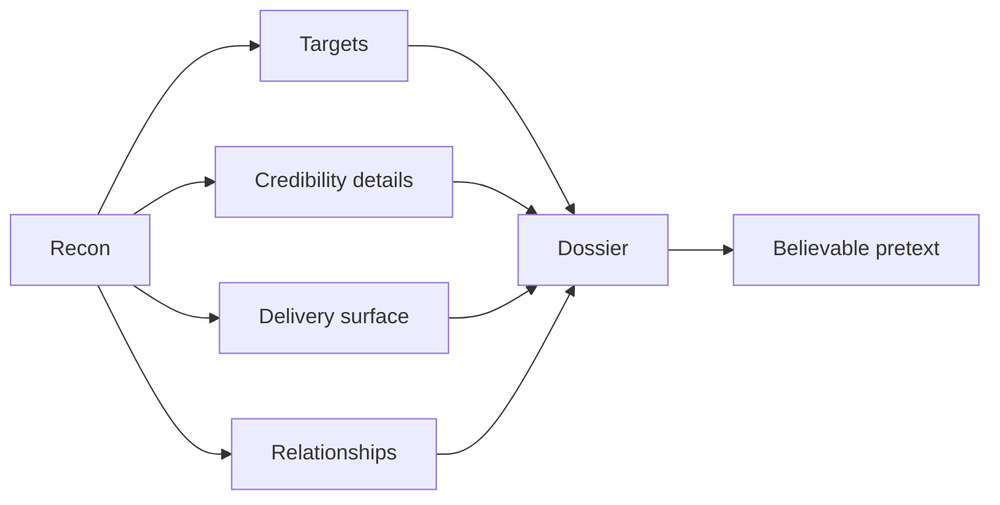
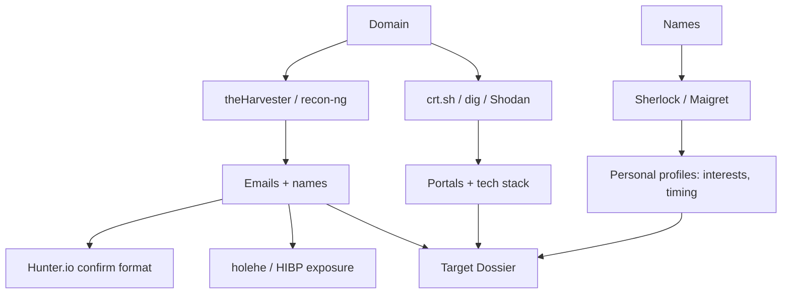
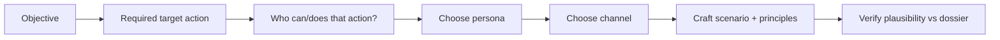
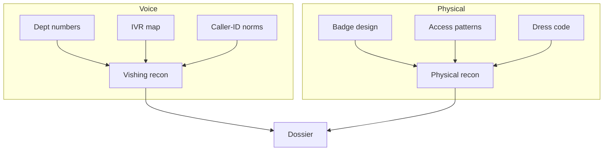
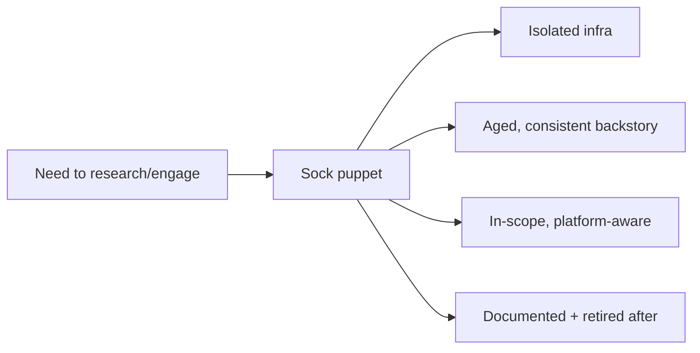
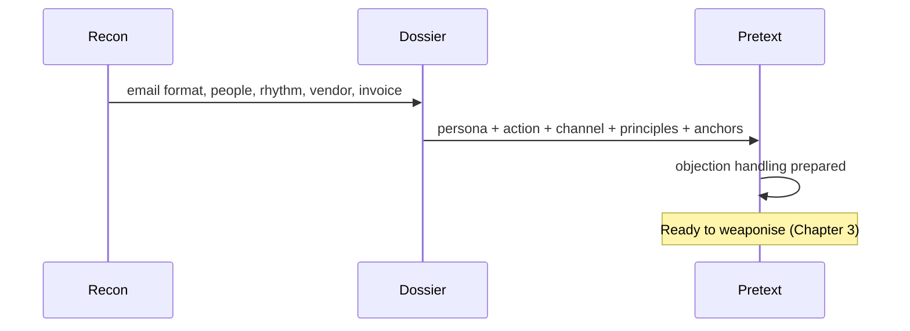
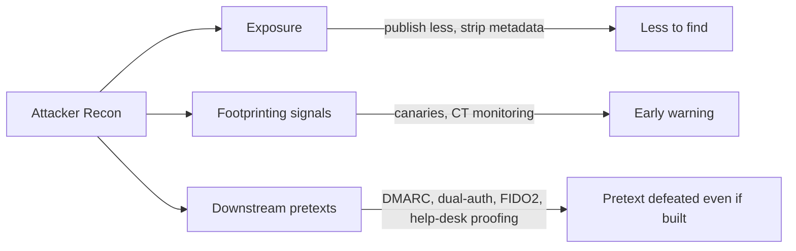

**Level:** Beginner · **Track:** Red Team · **Read time:** 160 min

This is Chapter 2 of the Social Engineering series. Chapter 1 built the mental model — the human attack surface, the psychology of influence, the kill chain, and the ethics that gate everything. This chapter turns that model into tradecraft.

Two disciplines dominate the early kill chain and decide whether an engagement succeeds:

- **Reconnaissance** — systematically gathering open-source intelligence (OSINT) about the target's people, technology, processes, and relationships.
- **Pretext development** — converting that intelligence into a believable identity and scenario the target will act on.

They are inseparable. A pretext is only as convincing as the recon behind it. This chapter teaches the full passive-recon toolchain from scratch, shows how to organise findings into a dossier, and gives a repeatable framework for building pretexts that are specific, low-friction, and — critically — in scope and lawful.

Everything here is passive and public unless explicitly noted. You gather already-published information about an organisation you are authorised to assess. You do not contact anyone, exploit anything, or collect sensitive personal data. The ethics gate from Chapter 1 applies to every command below.

---

## Part 1: Why Recon Decides the Engagement

In technical pentesting you learned that recon quality caps exploitation quality. The same law governs social engineering, only more strongly, because the "vulnerability" is a person's judgment and the "exploit" is a story.

Consider two versions of the same phishing email:

**Generic (no recon):**

> "Dear user, your account needs verification. Click here."

**Recon-driven (specific):**

> "Hi Tomas — following up on the Northbridge invoices before month-end close. The finance portal flagged INV-4471 for re-approval. Can you confirm via the usual link? — Priya (AP shared services)"

The second uses a real name, a real supplier, a real business rhythm (month-end close), a real process (invoice approval), and a plausible internal persona. Every one of those specifics came from recon. That specificity is what moves a target from suspicion (System 2) to compliance (System 1).

Recon does four jobs for the operator:

1. **Identifies targets** — who has the access or authority the objective needs.
2. **Supplies credibility details** — names, jargon, systems, business events that make a pretext ring true.
3. **Reveals the delivery surface** — email format, providers, phone ranges, portals, defences.
4. **Uncovers relationships** — vendors, partners, and internal reporting lines that pretexts can borrow trust from.



---

## Part 2: Passive vs Active Recon — the Legal and Tradecraft Line

Recon splits into two modes, and the boundary is both a tradecraft choice and, often, a legal one.

**Passive recon** collects information *without interacting with the target's systems or people* in a way they could detect or attribute. Reading LinkedIn, querying public DNS, browsing the company website, and searching breach-notification databases are passive. Passive recon leaves no footprint in the target's logs.

**Active recon** involves interaction the target could observe: port-scanning their servers, calling an employee to elicit information, sending a probe email to test filters, or connecting to their VPN portal to fingerprint it. Active recon can create evidence and, for the human channel, can *itself* be the start of the attack.

| Aspect | Passive | Active |
|---|---|---|
| Target awareness | None | Possible/likely |
| Footprint | None in target logs | May appear in logs |
| Examples | LinkedIn, DNS, crt.sh, breach data | Vishing elicitation, probe emails, port scans |
| Risk | Low legal/OPSEC risk | Higher; may require explicit scope |
| When | Always first | Only when authorised and needed |

**Rule of thumb:** exhaust passive recon before any active step. Most of what you need is already public. When active recon is required (e.g., a light elicitation call), make sure it is explicitly in scope — for the human channel, an elicitation call *is* social engineering and needs authorisation.

---

## Part 3: The OSINT Toolchain — Taught From Scratch

This section introduces each recon tool the first time it appears, per the notebook's tool-from-scratch rule. Install on Kali Linux; most are free.

### 3.1 theHarvester (recap + deeper)

Introduced in Chapter 1. `theHarvester` aggregates emails, names, subdomains, and hosts from many public back-ends.

```bash
# Full sweep across multiple sources, save structured output
theHarvester -d acme-widgets.example \
  -b bing,duckduckgo,crtsh,hackertarget,otx,urlscan \
  -l 500 -f acme_harvest
```

- `-b` chains back-ends; each has blind spots, so combine several.
- `-f acme_harvest` writes `acme_harvest.json` and `.xml` for import into your dossier.

Interpret the results the same way as Chapter 1: derive the **email format**, note **role aliases** (`helpdesk@`, `accounts@`), and record **exposed hosts** (`vpn.`, `portal.`).

### 3.2 recon-ng — a framework, not just a tool

`recon-ng` is a full reconnaissance *framework* modelled on Metasploit's console: it has modules, a workspace database, and the ability to chain data between modules. It exists to make multi-step OSINT repeatable and to store results in a queryable schema.

```bash
recon-ng
[recon-ng][default] > workspaces create acme
[recon-ng][acme] > marketplace install all      # install modules
[recon-ng][acme] > db insert domains             # add acme-widgets.example
[recon-ng][acme] > modules load recon/domains-hosts/hackertarget
[recon-ng][acme] > run                            # enumerate hosts
[recon-ng][acme] > modules load recon/domains-contacts/whois_pocs
[recon-ng][acme] > run                            # pull registration contacts
[recon-ng][acme] > show hosts                     # review the workspace DB
```

The value is the **workspace database**: hosts, contacts, and credentials accumulate in tables you can query and export, so recon-ng becomes the backbone of the dossier.

### 3.3 Maltego — visual link analysis

`Maltego` is a graphical link-analysis tool. You start with an *entity* (a domain, person, email) and run *transforms* that expand it into connected entities — domains to hosts, people to social profiles, emails to breaches. It exists to make *relationships* visible, which is exactly what pretexts exploit (vendor→AP, manager→report).

Workflow: drop a Domain entity → run "To DNS Name", "To Email Address", "To Person" transforms → the graph reveals clusters. The Community Edition is free with rate limits; it's the fastest way to *see* an organisation's human and technical web.

### 3.4 Email discovery: Hunter.io and phonebook.cz

- **Hunter.io** — a web service that, given a domain, returns the email pattern and known addresses with confidence scores. One query often confirms the format instantly (`{first}.{last}@`).
- **phonebook.cz** — returns email addresses, subdomains, and URLs for a domain from indexed data.

Both are passive. Cross-check their output against theHarvester to raise confidence in the email format before you build anything on it.

### 3.5 Username & profile hunting: Sherlock and Maigret

- **Sherlock** — given a username, checks hundreds of sites for that handle.
- **Maigret** — similar, with richer output (extracts profile details, tags).

```bash
# Find where a handle exists across the web
sherlock tmendes

# Deeper profile enumeration
maigret tmendes --html
```

Why it matters: a person's reused handle links their professional identity to personal profiles that leak interests (liking hooks), location, and routines (timing). Handle it with restraint — collect only what the pretext legitimately needs.

### 3.6 Email-to-breach and account checks: holehe and HIBP

- **holehe** — given an email, checks which sites have an account registered to it (without alerting the user), revealing the person's service footprint.
- **Have I Been Pwned (HIBP)** — tells you which breaches an email appeared in.

```bash
holehe t.mendes@acme-widgets.example
```

**Ethics:** use breach data only to demonstrate *exposure* to the client (e.g., "12 staff emails appear in past breaches, increasing credential-stuffing and pretext risk"). Never reuse real leaked passwords against live accounts outside explicit, scoped credential-testing authorisation.

### 3.7 Google account intelligence: GHunt

- **GHunt** — enumerates public information tied to a Google account/email (profile, some services, review history where public). Useful when a target uses a Gmail/Google Workspace identity.

### 3.8 Google dorking and metadata

Covered in Chapter 1. Repeat here as the connective tissue: dorks surface documents, and `exiftool` extracts author/username/software metadata that confirms naming conventions and tooling.

```bash
exiftool annual-report.pdf | grep -Ei "author|creator|company"
```



---

## Part 4: Organising Findings — the Dossier Discipline

Raw tool output is not intelligence. Intelligence is structured, sourced, and prioritised. Chapter 1 introduced the dossier template; here we operationalise it.

Maintain three linked artefacts:

1. **Org profile** — domains, email format, mail provider, SPF/DKIM/DMARC posture, exposed portals, guessed EDR/SIEM (from job posts), key suppliers, and business rhythms (fiscal calendar, product launches).
2. **Person records** — per target: name, role, email, reporting line, working hours/time zone, interests (liking hooks), verification habits (if lawfully elicited), and a risk rating based on their access.
3. **Pretext opportunities** — a prioritised list mapping targets to pretext patterns and the influence principles each uses.

Two disciplines make the dossier professional and ethical:

- **Source every field.** Record the URL/tool/screenshot for each fact. The report must prove the data was public.
- **Data minimisation.** Collect only what the engagement needs. Interests are a legitimate hook note; home addresses, family details, and health data are neither necessary nor lawful to hoard.

A well-kept dossier is also a *deliverable*: showing the client exactly how much of their human surface is discoverable is often the most impactful finding in the report.

---

## Part 5: Business Rhythm — the Under-Used Recon Goldmine

Amateur recon stops at names and emails. Professional recon captures **business rhythm**: the recurring events that make a pretext timely and therefore believable.

Examples of rhythm intelligence and the pretexts they enable:

| Rhythm signal | Where to find it | Pretext it enables |
|---|---|---|
| Fiscal year-end / month-end close | Filings, job posts, LinkedIn | "Invoice before close" urgency (BEC) |
| Product launch / earnings date | Press releases, investor pages | "Confidential deal" executive pretext |
| Open enrolment / benefits window | HR posts, careers page | "Confirm your benefits details" harvest |
| Payroll cycle | Glassdoor, employee posts | "Payroll update required" pretext |
| Office move / new tool rollout | LinkedIn posts, reviews | "New system login migration" harvest |
| Conference attendance | Event sites, social posts | "Follow-up from the booth" pretext |
| Hiring surge | Job boards | "New starter can't log in" help-desk pretext |

**Why rhythm works:** a request that aligns with something the target *expects to be happening* passes the plausibility test instantly. A "confirm your benefits" email during actual open enrolment is far stronger than a random one. Recon that captures the calendar is what separates a generic lure from a targeted one.

---

## Part 6: The Pretext Development Framework

With the dossier built, convert intelligence into a pretext using a repeatable framework. A pretext is engineered, not improvised.

### 6.1 Start from the objective, work backwards

Define the engagement objective first (credentials for the VPN? a wire transfer? building entry? code execution?). The objective determines the *action* you need the target to take, which determines the *persona* and *channel*.



### 6.2 Answer the six pretext questions (Chapter 1)

For every pretext, write down: Who am I? Why you? What do I want? Why now? Why trust me? Or else? If any answer is weak or generic, the pretext will fail.

### 6.3 Choose the persona for minimum friction

The best persona makes the request *routine*. If you need a password reset, "new employee who can't log in" makes the help desk's normal job the exploit. If you need a payment, "known vendor with updated bank details" makes finance's normal job the exploit. Low friction beats clever.

### 6.4 Stack influence principles deliberately

Layer two or three principles, not all seven. Over-stacking reads as manipulation. A clean stack for a help-desk reset: **Authority** (IT persona or employee-in-distress) + **Urgency** (locked out before a meeting) + **Liking** (warm, apologetic tone). Name the stack in your notes so the report can explain *why* it worked.

### 6.5 Build verifiable-looking, hard-to-verify anchors

Credibility anchors are the details that make the story checkable at a glance but hard to actually verify: a spoofed or look-alike sender, a real internal project name, a correct manager's name, a plausible ticket number, a caller-ID. These borrow the halo of legitimacy.

### 6.6 Prepare the objection handling

Write, in advance, calm responses to the two or three likely pushbacks ("let me check with my manager", "can you email me instead", "what's your employee ID?"). A prepared, unbothered response sustains the illusion; panic breaks it. If pushback escalates, the professional move is to **disengage gracefully**, not to pressure — both because pressure fails and because it risks harming the person.

---

## Part 7: Pretext Examples, Fully Worked

Three complete pretexts, each tied to a dossier fact, with the principle stack and the defeating control.

### 7.1 Vendor bank-detail change (BEC)

- **Dossier facts used:** real supplier "Northbridge Supplies"; AP clerk Tomas; DMARC `p=none`; month-end close approaching.
- **Persona:** Northbridge accounts team.
- **Message:** "Our bank has changed; please update before INV-4471 is paid at month-end. Old account is closed."
- **Principle stack:** Authority (real vendor) + Consistency ("update your records") + Urgency (month-end).
- **Anchor:** look-alike domain `northbridge-supplies.co`; real invoice number from a leaked PDF.
- **Defeating control:** out-of-band callback to Northbridge on a known number + dual authorisation.

### 7.2 New-starter help-desk reset (vishing)

- **Dossier facts used:** hiring surge (job posts); help-desk verification = employee ID + manager name (lawfully elicited); manager's real name from LinkedIn.
- **Persona:** anxious new employee, first day.
- **Message:** "It's my first day, my manager [real name] said you'd help — I can't log in and my induction starts in 10 minutes."
- **Principle stack:** Liking (warm, apologetic) + Urgency (induction) + Unity ("we're on the same team").
- **Anchor:** correct manager name; correct starter-batch timing.
- **Defeating control:** callback to a registered number / manager confirmation before any reset.

### 7.3 Portal credential harvest (spear phish)

- **Dossier facts used:** exposed `portal.acme-widgets.example`; new-tool rollout mentioned on Glassdoor; email format.
- **Persona:** IT "migration" team.
- **Message:** "We're migrating the portal to SSO; sign in once via the new link to keep your access."
- **Principle stack:** Authority (IT) + Loss aversion (keep access) + Social proof ("most of the team have migrated").
- **Anchor:** cloned portal look-and-feel; look-alike domain.
- **Defeating control:** phishing-resistant MFA (FIDO2) + never authenticate via emailed links.

Each example demonstrates the discipline: *every* credibility detail traces to a sourced dossier fact, and *every* pretext has a named control that defeats it — which is what you write into the remediation section of the report.

---

## Part 8: Hands-On Lab — From Blank Page to Pretext Plan

**Objective:** using only passive OSINT against a target you are authorised to assess (we use fictional `acme-widgets.example`), produce (a) an org profile, (b) three person records, and (c) a prioritised pretext plan with principle stacks and defeating controls.

**Lawful-use framing:** authorised target, own employer with sign-off, or a public practice domain — passive data only, no contact.

### Step 1 — Enumerate the org profile

```bash
theHarvester -d acme-widgets.example -b bing,duckduckgo,crtsh,otx -l 300 -f acme
dig +short MX acme-widgets.example
dig +short TXT acme-widgets.example | grep -i spf
dig +short TXT _dmarc.acme-widgets.example
curl -s https://crt.sh/?q=%25.acme-widgets.example | grep -oE '[a-z0-9.-]+\.acme-widgets\.example' | sort -u
```

Illustrative consolidated findings:

```
Email format : {first-initial}.{lastname}@acme-widgets.example
Mail provider: Microsoft 365
SPF          : v=spf1 include:spf.protection.outlook.com -all
DMARC        : p=none  (monitor only -> spoofable)
Portals      : portal., vpn., autodiscover.
Aliases      : helpdesk@, accounts@, careers@
```

### Step 2 — Confirm the email format independently

Cross-check with Hunter.io (web) and phonebook.cz. Two independent confirmations of `{first-initial}.{lastname}@` means you can address any employee with confidence.

### Step 3 — Build three person records

From the company "Team" page, LinkedIn, and press releases:

```yaml
- name: Jane Okoro
  role: CEO
  email: j.okoro@acme-widgets.example
  use: persona to IMPERSONATE (authority) for BEC
  risk: HIGH (authority source)
- name: Tomas Mendes
  role: Accounts Payable
  email: t.mendes@acme-widgets.example
  hours: 09:00-17:00 GMT
  interests: [cycling]     # liking hook, from public socials
  use: TARGET for wire-fraud pretext
  risk: HIGH (payment authority)
- name: Sara Patel
  role: IT Help Desk Lead
  email: s.patel@acme-widgets.example
  use: TARGET for MFA-reset, or persona to impersonate
  risk: HIGH (identity operations)
```

### Step 4 — Capture business rhythm

From filings and posts: fiscal year-end in March (month-end close each month), a portal-to-SSO migration mentioned on Glassdoor, and a current hiring surge. Record each with its enabling pretext.

### Step 5 — Produce the prioritised pretext plan

| # | Target | Pretext pattern | Principle stack | Enabled by | Defeating control |
|---|---|---|---|---|---|
| 1 | Tomas (AP) | Vendor bank-detail change | Authority+Consistency+Urgency | `p=none`, real supplier, month-end | Out-of-band callback + dual auth |
| 2 | Help desk | New-starter reset (vishing) | Liking+Urgency+Unity | Hiring surge, elicited verification | Callback + manager confirm |
| 3 | All staff | Portal SSO migration harvest | Authority+Loss aversion+Social proof | Exposed portal, SSO rollout | FIDO2 MFA, no link auth |

### Step 6 — Write the exposure finding

The headline for the client's report: "Using only public sources and free tools, and without contacting anyone, an attacker can determine your email format, identify your finance and IT-support staff by name and role, learn your business calendar, and construct at least three high-credibility pretexts. Two are defeated primarily by *process* controls, one by phishing-resistant MFA." That sentence is the whole chapter delivering value to the defender.

---

## Part 9: Recon for the Voice and Physical Channels

Not every engagement is email. Vishing (Chapter 9) and physical entry need their own recon, and it draws on different sources.

### 9.1 Phone and caller-ID recon

Before a vishing call you want: the target's direct or department number, the main switchboard, the IVR menu structure, and the caller-ID convention the organisation uses internally.

- **Department numbers** appear on contact pages, invoices, email signatures (found in leaked PDFs), and support portals.
- **IVR mapping** (calling the *main* line and noting the menu tree) is light active recon — it touches the target, so it must be in scope. Knowing "press 3 for IT" lets a pretext reference the right internal path.
- **Caller-ID expectations:** if internal calls show as a 4-digit extension, an external number is a tell. Conversely, some PBXs display "IT Service Desk" for internal calls — knowledge that shapes what a spoofed call should look like (spoofing itself is heavily regulated; see Chapter 9's legal notes).

Record the phone surface in the org profile:

```yaml
phone_surface:
  switchboard: "+44 20 7946 0000"
  it_servicedesk_option: "menu option 3"
  internal_callerid: "4-digit extension"
  hours: "08:00-18:00 GMT"
```

### 9.2 Physical recon (for in-scope physical engagements)

Physical pretexts (Chapter 9) need building intelligence gathered lawfully from public sources plus, where authorised, on-site observation.

- **Badge design** leaks from staff selfies and LinkedIn "first day!" photos — enough to mock up a convincing lanyard.
- **Building access patterns**: smoking areas, delivery entrances, and shift-change times are visible from the street.
- **Tenant/floor directories**, reception layout, and visitor-management vendor (a sign at the desk) all shape the pretext.
- **Dress code** from public photos tells you what to wear to blend in.

**Ethics/OPSEC:** on-site observation is active and often requires explicit physical-engagement scope and a get-out-of-jail letter. Never photograph individuals unnecessarily or loiter in ways that alarm the public; the objective is a scoped test, not surveillance of people's private lives.



---

## Part 10: Social-Media Deep Dive — a Worked Mini-Case

Social media is the richest source of *liking* and *timing* intelligence. Here's a disciplined, minimised walkthrough against a fictional target, Tomas Mendes (AP clerk).

1. **LinkedIn** confirms role, tenure, and a post: "Excited to be speaking at FinOps Live next month!" → he'll be *out of office* around that event (timing) and receptive to a "follow-up from the conference" pretext (hook).
2. **X/Twitter** shows he retweets a cycling club → *liking* hook; also a photo of his desk with a visible ID lanyard → **badge design leak** (report this to the client).
3. **Instagram** (public) shows regular Friday five-a-side football → a plausible small-talk anchor for a vishing rapport-builder.
4. **A leaked conference attendee PDF** (via a dork) lists his corporate email and job title → confirms format and role independently.

The dossier entry that results:

```yaml
name: Tomas Mendes
role: Accounts Payable
hooks:
  liking: ["cycling", "five-a-side football"]
  timing: ["FinOps Live conference — likely OOO", "Fridays PM low focus"]
findings_for_client:
  - "Badge/lanyard design visible in public desk photo"
  - "Corporate email exposed in third-party conference PDF"
```

Notice the discipline: we recorded *only* hooks the pretext needs plus *findings the client should fix*, and nothing about his family, home, or health. That line — useful hook vs. gratuitous surveillance — is the ethical core of social-media recon.

**Blue team usage:** this mini-case is a perfect awareness-training artefact. Show staff how four public posts become a targeted pretext, and the "why should I care about a desk photo?" question answers itself.

---

## Part 11: Building a Lawful Sock-Puppet Persona

For some recon and for delivery, operators use a **sock puppet** — a fabricated online identity used to research or engage without exposing the real operator or the client. This is standard tradecraft, but it carries ethical and platform-policy weight.

A credible, *lawful* sock puppet (for authorised engagements):

- Has a consistent name, photo (AI-generated or licensed, never a real person's stolen identity), and backstory.
- Is aged — created in advance with some benign history, because brand-new profiles are low-trust and easily flagged.
- Uses dedicated infrastructure (email, phone, browser profile) isolated from the operator and client.
- Stays within the engagement scope and platform rules to the extent the RoE requires.

**Boundaries:** do not impersonate a *real, specific* person (identity theft), do not use stolen photos of real individuals, and document the puppet in the engagement record so it can be retired and disclosed to the client. The puppet is a tool for a scoped test, not a permanent deception.



---

## Part 12: Annotated Recon-to-Pretext Case Study

Tying the whole chapter together: a single, end-to-end thread from a blank page to a ready pretext, annotated at each step so you can see the reasoning.

- **Objective (from RoE):** obtain proof-of-access to the finance approval system.
- **Recon step 1 — org profile:** theHarvester + Hunter.io confirm `{first-initial}.{lastname}@`; DMARC `p=none`.
- **Recon step 2 — people:** LinkedIn identifies Tomas (AP) and his manager Priya (Finance Manager).
- **Recon step 3 — rhythm:** filings show fiscal year-end in March; monthly close creates recurring invoice-approval urgency.
- **Recon step 4 — relationships:** a press release names "Northbridge Supplies" as a key vendor; a dork finds a real invoice number in a cached PDF.
- **Pretext synthesis:** persona = Northbridge accounts; action = approve/redirect payment; channel = email from look-alike domain; principle stack = Authority + Consistency + Urgency; anchors = real vendor, real invoice number, month-end timing.
- **Objection handling:** if Tomas replies "I'll check with Priya", prepared response: "Of course — Priya's copied, but please don't hold the payment past close." (This *tests* whether dual-auth is enforced; it does not pressure beyond the scoped scenario.)
- **Defeating control (for the report):** out-of-band callback + dual authorisation.

Read left to right, this is the kill chain's recon→pretext stages made concrete. Read as a defender, every arrow is a place to reduce exposure or insert verification.



---

## Part 13: Common Recon & Pretexting Pitfalls

- **Boiling the ocean.** Unbounded recon wastes time. Start from the objective and gather only what a specific pretext needs.
- **Unsourced "facts".** A detail you can't source may be wrong; a wrong detail in a pretext is a tell. Cite everything.
- **Over-collection of personal data.** Hoarding family/home/health data is unethical, often unlawful, and irrelevant to the objective.
- **Single-source confidence.** Confirm the email format and key facts from at least two sources before building on them.
- **Ignoring timing.** A perfectly written pretext sent at the wrong hour or outside the relevant business rhythm loses credibility.
- **Sloppy OPSEC.** Researching from personal accounts or hammering platforms tips off the target and pollutes results.
- **Confusing recon with the attack.** An elicitation call is not passive recon — it is social engineering and needs scope.

Each pitfall doubles as a defender's detection or training point: unsourced urgency, off-hours "executives", and brand-new "vendor" domains are exactly the anomalies awareness programs teach staff to catch.

---

## Part 14: OPSEC for the Operator's Own Recon

Recon can also expose *you*. Professional operators keep their own OPSEC tight, both to protect the engagement and to model realistic adversary behaviour.

- **Separate identity/infrastructure.** Use dedicated research accounts and VMs, not personal ones. Viewing a LinkedIn profile while logged into a personal account can notify the target ("who viewed your profile").
- **Rate and pattern discipline.** Aggressive automated scraping trips platform defences and can tip off a target. Stay within normal browsing patterns for passive work.
- **VPN/attribution hygiene.** Source your research traffic appropriately per the RoE; don't leak the client's identity or your own tooling.
- **Data handling.** Store the dossier encrypted; it contains personal data. Destroy per contract.

**Blue team usage:** these same signals — "who viewed your profile", unusual crt.sh/DNS query spikes, mass profile lookups — are weak but real indicators that someone is footprinting you. Threat-intel teams sometimes register canary documents and monitor for access as a tripwire.

---

## Part 15: Detection & Defense Angle

Recon is the hardest stage to detect because most of it touches third-party platforms, not the target's systems. Defence therefore focuses on **reducing exposure** and **planting tripwires**, then hardening the downstream stages the recon feeds.

**Reduce exposure (shrink what recon can find):**

- Publish less: avoid full org charts with reporting lines; minimise staff directories; review what "Team" pages and bios reveal.
- Strip document metadata before publishing (removes author usernames and tooling fingerprints).
- Coach executives and finance/IT staff on their public footprint (interests, travel, tool mentions).
- Assume the email format is public; rely on verification, not secrecy.
- Reduce exposed portals or put them behind SSO/conditional access so a cloned login is less useful.

**Plant tripwires (detect footprinting):**

- Canary documents/emails that alert when opened or when a canary credential is used.
- Brand/look-alike domain monitoring (register or monitor obvious typosquats; watch Certificate Transparency for look-alike certs).
- Monitor for spikes in "who viewed your profile" or bulk directory access where visible.

**Harden the downstream stages recon enables:**

- Email auth to `p=reject` (Chapter 4) to blunt exact-domain spoofing.
- Out-of-band verification + dual authorisation in finance (defeats the BEC that recon sets up).
- Strong help-desk identity proofing (defeats the vishing reset recon enables).
- Phishing-resistant MFA (defeats the credential harvest recon enables).



The durable lesson: you cannot stop an attacker from doing recon on public data, so defence must assume the pretext will be well-informed and make the *action* the pretext requests impossible to complete without verification.

---

## Part 16: Real-World Illustrations

- **Twitter (2020).** Attackers researched employees, identified those with access to internal admin tools, then vished them. Recon into *who had access* was decisive — the pretext targeted exactly the right people.
- **BEC campaigns generally.** Successful BEC crews study a company's suppliers, invoice cadence, and executive travel before striking, then send the bank-change email at precisely the right moment in the payment cycle. The recon *is* the attack's edge.
- **Business-rhythm phishing.** Tax-season, open-enrolment, and "new payroll system" lures spike at exactly the calendar moments they're plausible — a direct application of rhythm recon at scale.

Being able to point at a real case and name which recon fact made the pretext work is a common interview and report-writing skill; practise it on each case above.

---

## Part 17: Final Revision / Summary

- **Recon quality caps pretext quality.** Specific, sourced details move a target from System 2 suspicion to System 1 compliance.
- **Exhaust passive recon first**; treat active recon (including elicitation calls) as social engineering that needs explicit scope.
- The **toolchain**: theHarvester and recon-ng (aggregation + workspace DB), Maltego (relationships), Hunter.io/phonebook (email format), Sherlock/Maigret (handles), holehe/HIBP (exposure), GHunt (Google identity), dorks + exiftool (docs + metadata).
- Organise everything into a **dossier**: org profile, person records, pretext opportunities — sourced and minimised.
- Capture **business rhythm** (fiscal calendar, launches, rollouts, hiring) — timing is credibility.
- Build pretexts with the **framework**: objective → action → persona → channel → principle stack → anchors → objection handling. Keep friction low and principle stacks small.
- **Defence** = reduce exposure, plant tripwires, and harden the downstream action so a well-informed pretext still fails without verification.

Memory hook — **"R.O.P.E."**: **R**econ (passive first), **O**rganise (dossier, sourced/minimised), **P**retext (framework, low friction), **E**thics (scope + data minimisation) — the rope that ties intelligence to a lawful, effective operation.

---

## Part 18: Cheat Sheet / Quick Reference

**Passive recon quick commands:**

```bash
theHarvester -d TARGET -b bing,duckduckgo,crtsh,otx -l 300 -f out
dig +short MX TARGET; dig +short TXT _dmarc.TARGET
curl -s "https://crt.sh/?q=%25.TARGET" | grep -oE "[a-z0-9.-]+\.TARGET"
sherlock USERNAME ; maigret USERNAME --html
holehe EMAIL
exiftool FILE | grep -Ei "author|creator|company"
```

**recon-ng skeleton:** `workspaces create X` → `marketplace install all` → `db insert domains` → load/run modules → `show hosts/contacts`.

**Dossier = ** org profile + person records + prioritised pretext opportunities (every field sourced; data minimised).

**Pretext framework:** objective → required action → who does it → persona → channel → principle stack (2–3) → credibility anchors → objection handling → disengage gracefully.

**Business-rhythm hooks:** month-end close · launch/earnings · open enrolment · payroll cycle · tool rollout · hiring surge · conferences.

**Defence:** publish less + strip metadata · canaries + CT/look-alike monitoring · DMARC `p=reject` · dual-auth finance · help-desk proofing · FIDO2 MFA.

**Ethics gate:** passive-first · in-scope only · source every fact · minimise personal data · encrypt & destroy the dossier.

---

## Part 19: Practice Labs & Resources

- **TryHackMe — "OhSINT", "Sakura Room", "Searchlight IMINT"**: passive OSINT reasoning from a single artefact; directly builds the dossier skill.
- **TryHackMe — "Red Team Recon" and "Phishing" rooms**: recon-to-pretext workflow in a lab.
- **OSINT Framework (osintframework.com)**: a categorised directory of passive sources to broaden your toolchain.
- **recon-ng and Maltego official docs / TryHackMe recon-ng room**: learn the frameworks properly, not just the CLI.
- **Have I Been Pwned & holehe**: measure exposure ethically against your own accounts first.
- **Hadnagy, *Social Engineering: The Science of Human Hacking* (recon & pretexting chapters)** and **Michael Bazzell, *OSINT Techniques***: the two references for this chapter's craft.
- **Self-drill:** pick an organisation you're authorised to assess (or your own employer, with sign-off). In 60 minutes, using only passive tools, produce the three dossier artefacts and a three-item pretext plan with principle stacks and defeating controls. Time-box it — real recon is bounded.

**Practice question 1.** Why is a pretext that references "month-end close" more effective than a generic urgency line, and what recon step produces that detail?

**Practice question 2.** You have a target's reused username. Which two tools expand it into personal-profile intelligence, and what single ethical rule limits what you record?

**Practice question 3.** Given DMARC `p=none`, a known supplier, and a leaked invoice number, construct (in outline) a BEC pretext and name the one process control that defeats it regardless of how convincing the email is.

**Practice question 4.** Distinguish passive from active recon with two examples each, and explain why an elicitation phone call is not "just recon".

**Practice question 5 (lab).** Produce an org profile (email format, mail provider, SPF/DMARC, portals) for an authorised target using only passive commands, and state the single highest-impact remediation the posture reveals.

**Worked answer to Q3 (outline).** Persona = the real supplier's accounts team; message = "bank details changed, update before INV-XXXX is paid at month-end, old account closed"; anchors = look-alike domain + the real invoice number; principle stack = Authority + Consistency + Urgency. The defeating control is **out-of-band verification on a previously known number plus dual authorisation** for any bank-detail change — a process control that works even against a technically perfect spoof, which is why it belongs at the top of the remediation list.

---

## Part 20: Worked Answers to the Practice Questions

**Answer 1 — "month-end close" vs generic urgency.** A generic urgency line ("act now!") triggers suspicion because it has no *context*; a "month-end close" reference matches something the target knows is genuinely happening, so the urgency feels *earned* rather than manufactured — it passes the plausibility test and keeps the target in System 1. The recon step that produces it is **business-rhythm intelligence**: reading filings, job posts, and social media to learn the organisation's fiscal calendar and payment cycle.

**Answer 2 — expanding a reused username.** **Sherlock** and **Maigret** expand a handle into the sites where it exists and the personal-profile details attached (interests, location, routines). The single ethical rule that limits what you record is **data minimisation**: capture only the hooks the pretext legitimately needs (e.g., a hobby for rapport) plus findings the client should fix — never family, home, or health data.

**Answer 3 — see the outline above.** Persona = real supplier's accounts team; anchors = look-alike domain + real invoice number; stack = Authority + Consistency + Urgency; defeating control = out-of-band callback + dual authorisation.

**Answer 4 — passive vs active + the elicitation call.** Passive: reading LinkedIn; querying public DNS/crt.sh. Active: port-scanning the VPN portal; sending a probe email to test filters. An elicitation phone call is *not* "just recon" because it **interacts with a human target and attempts to extract information through manipulation** — that is social engineering itself, it can be detected and attributed, and it therefore requires explicit authorisation in the RoE.

**Answer 5 — org profile + top remediation.** The profile lists email format, mail provider (from MX), SPF and DMARC records, and exposed portals. If DMARC is `p=none`, the single highest-impact remediation is almost always **move DMARC to `p=reject` with aligned SPF/DKIM**, because it stops exact-domain spoofing that underpins the most damaging pretext (executive/vendor BEC).

---

## Part 21: Recon Tool Glossary

Quick-reference definitions for the toolchain, so the rest of the notebook can name a tool without re-explaining it.

- **theHarvester** — OSINT aggregator: emails, names, subdomains, hosts from many public back-ends.
- **recon-ng** — modular OSINT *framework* with a workspace database; chains modules and stores results.
- **Maltego** — graphical link-analysis tool; expands entities via transforms to reveal relationships.
- **Hunter.io** — web service returning a domain's email pattern and known addresses with confidence scores.
- **phonebook.cz** — returns emails, subdomains, and URLs for a domain from indexed data.
- **Sherlock** — checks hundreds of sites for a given username.
- **Maigret** — richer username enumeration with profile extraction.
- **holehe** — checks which sites have an account registered to a given email, silently.
- **Have I Been Pwned (HIBP)** — shows which breaches an email/handle appeared in.
- **GHunt** — enumerates public info tied to a Google account/email.
- **exiftool** — reads embedded document/image metadata (author, software, company).
- **crt.sh** — Certificate Transparency search; surfaces subdomains and look-alike certs.
- **Shodan** — search engine for internet-exposed services; ties people to technical entry points.
- **Sock puppet** — a fabricated, documented online identity used for authorised research/engagement.
- **Business rhythm** — the recurring calendar of events (close, launches, enrolment) that makes a pretext timely.

---

## Part 22: Rapid Self-Test (Flashcards)

1. Q: What caps pretext quality? A: Recon quality — specific, sourced detail.
2. Q: What must you exhaust before any active step? A: Passive recon.
3. Q: Why is an elicitation call not passive recon? A: It interacts with and manipulates a human — it is the attack, and needs scope.
4. Q: Which tool aggregates emails/names/hosts from many back-ends? A: theHarvester.
5. Q: Which OSINT tool is a framework with a workspace database? A: recon-ng.
6. Q: Which tool visualises relationships via transforms? A: Maltego.
7. Q: Two tools to confirm an email format? A: Hunter.io and phonebook.cz.
8. Q: Two tools to expand a username into profiles? A: Sherlock and Maigret.
9. Q: Which tool checks account existence per email, silently? A: holehe.
10. Q: What does exiftool reveal that helps recon? A: Author username, software, company from document metadata.
11. Q: The three linked dossier artefacts? A: Org profile, person records, pretext opportunities.
12. Q: Two disciplines that make a dossier ethical/professional? A: Source every fact; minimise personal data.
13. Q: What is "business rhythm" and why capture it? A: Recurring events that make a pretext timely and thus credible.
14. Q: The pretext framework in order? A: Objective → action → who → persona → channel → principle stack → anchors → objection handling.
15. Q: How many influence principles should you stack? A: Two or three — over-stacking reads as manipulation.
16. Q: What is a credibility anchor? A: A detail that looks verifiable at a glance but is hard to actually verify (look-alike sender, real project name, ticket #).
17. Q: The professional response to hard pushback? A: Disengage gracefully — never pressure.
18. Q: One defensive tripwire for footprinting? A: Canary documents/credentials; Certificate Transparency / look-alike monitoring.
19. Q: What is a lawful sock puppet's key boundary? A: Never impersonate a real specific person or use a real person's stolen photo; document and retire it.
20. Q: The single highest-impact remediation for `p=none`? A: Move DMARC to `p=reject` with aligned SPF/DKIM.

---

## Part 23: Extended Lab — a Full recon-ng Session, Annotated

To make recon-ng concrete, here is an annotated end-to-end session against the fictional `acme-widgets.example`. Run only against authorised targets. The console output below is illustrative but representative of what you'd actually see.

### Create a workspace and seed the domain

```text
$ recon-ng
[recon-ng][default] > workspaces create acme
[recon-ng][acme] > db insert domains
domain (TEXT): acme-widgets.example
[*] 1 rows affected.
```

The workspace is a self-contained SQLite database. Everything you discover lands in tables (`domains`, `hosts`, `contacts`, `credentials`) you can query and export later.

### Install and load modules

```text
[recon-ng][acme] > marketplace search hackertarget
  +---------------------------------------------------------------+
  | Path                                   | Version | Status      |
  +---------------------------------------------------------------+
  | recon/domains-hosts/hackertarget       | 1.1     | not installed|
  +---------------------------------------------------------------+
[recon-ng][acme] > marketplace install recon/domains-hosts/hackertarget
[*] Module installed: recon/domains-hosts/hackertarget
[recon-ng][acme] > modules load recon/domains-hosts/hackertarget
[recon-ng][acme][hackertarget] > options set SOURCE acme-widgets.example
[recon-ng][acme][hackertarget] > run
```

Representative output:

```text
[*] mail.acme-widgets.example
[*] vpn.acme-widgets.example
[*] portal.acme-widgets.example
[*] autodiscover.acme-widgets.example
[*] 4 total (4 new) hosts found.
```

Each host is now stored. `vpn.` and `portal.` are externally reachable login surfaces — candidates for a credential-harvest pretext (their look-and-feel can be cloned in Chapter 5).

### Pull registration contacts

```text
[recon-ng][acme] > modules load recon/domains-contacts/whois_pocs
[recon-ng][acme][whois_pocs] > options set SOURCE acme-widgets.example
[recon-ng][acme][whois_pocs] > run
[*] Contact: Domain Admin (admin@acme-widgets.example)
[*] 1 total (1 new) contacts found.
```

### Expand contacts to hosts of interest and review

```text
[recon-ng][acme] > show hosts
  +----+-------------------------------+------+
  | id | host                          | ip   |
  +----+-------------------------------+------+
  | 1  | mail.acme-widgets.example     | ...  |
  | 2  | vpn.acme-widgets.example      | ...  |
  | 3  | portal.acme-widgets.example   | ...  |
  | 4  | autodiscover.acme-widgets.ex. | ...  |
  +----+-------------------------------+------+
[recon-ng][acme] > show contacts
  +----+---------------+---------------------------------+
  | id | name          | email                           |
  +----+---------------+---------------------------------+
  | 1  | Domain Admin  | admin@acme-widgets.example      |
  +----+---------------+---------------------------------+
```

### Export the workspace into the dossier

```text
[recon-ng][acme] > modules load reporting/csv
[recon-ng][acme][csv] > options set FILENAME /tmp/acme_recon.csv
[recon-ng][acme][csv] > run
[*] 4 records added to '/tmp/acme_recon.csv'.
```

The CSV feeds straight into the org profile. In one short session you have a queryable database of hosts and contacts, an export for the report, and a clear list of externally reachable portals to feed pretext design — all passive, all sourced.

### What this adds over ad-hoc googling

- **Persistence:** results are stored and re-queryable, not scattered across browser tabs.
- **Repeatability:** the same module chain runs against any authorised target.
- **Reporting:** built-in exporters produce client-ready artefacts.

**Blue team usage:** understanding exactly how easily this database is built against your own org is the strongest argument for exposure-reduction — run the same session against yourself and count how many portals and contacts fall out with zero effort.

---

## Part 24: Appendix — Google Dork Library for the Human Surface

A reusable dork set for social-engineering recon. Replace `TARGET` with an authorised domain. Dorks are passive (they query the search engine, not the target), but treat the *results* — especially documents — as sensitive.

```text
# --- People & emails ---
site:linkedin.com "TARGET_COMPANY"                       # employees, titles
site:linkedin.com "TARGET_COMPANY" "accounts payable"    # finance staff
"@TARGET" -site:TARGET                                    # emails leaked elsewhere
intext:"@TARGET" filetype:pdf                            # emails inside PDFs

# --- Documents & metadata ---
site:TARGET filetype:pdf                                  # PDFs (check author metadata)
site:TARGET filetype:docx                                 # Word docs
site:TARGET filetype:xlsx                                 # spreadsheets (HR/finance lists)
site:TARGET filetype:pptx                                 # decks (internal project names)

# --- Exposed surfaces ---
site:TARGET intitle:"index of"                            # open directories
site:TARGET inurl:login                                   # login portals
site:TARGET inurl:vpn                                     # VPN portals
site:TARGET intitle:"dashboard" | intitle:"admin"         # admin panels

# --- Vendors, projects, rhythm ---
site:TARGET "invoice" filetype:pdf                        # invoice numbers/vendors
"TARGET_COMPANY" "we are pleased to announce"             # deals, launches
"TARGET_COMPANY" "open enrollment" | "benefits"           # HR windows

# --- Code & secrets (dev recon) ---
site:github.com "TARGET"                                  # repos, dev emails
"TARGET" "BEGIN RSA PRIVATE KEY"                          # leaked keys (report, never use)
```

Each result is a potential dossier entry *and* a client finding. A single exposed invoice PDF can yield the vendor name, an invoice number, the AP contact, and the document author's username — four independent facts that harden a BEC pretext.

---

## Part 25: Appendix — A Complete Sample Dossier

The finished artefact the whole chapter builds toward, shown in full so you have a concrete target to reproduce. Fictional data.

```yaml
# ================= ORG PROFILE =================
org: Acme Widgets Ltd
domains: [acme-widgets.example]
email_format: "{first-initial}.{lastname}@acme-widgets.example"
mail_provider: Microsoft 365
spf: "v=spf1 include:spf.protection.outlook.com -all"      # hard fail (good)
dkim: "present (selector1)"
dmarc: "v=DMARC1; p=none; rua=mailto:dmarc@..."            # monitor only -> spoofable
exposed_portals: [portal., vpn., autodiscover.]
edr_siem_guess: "CrowdStrike + Splunk (from job posts)"
key_vendors: ["Northbridge Supplies"]
business_rhythm:
  fiscal_year_end: "March"
  monthly_close: "last working day"
  events: ["FinOps Live conference", "SSO migration in progress"]
lookalike_available: ["northbridge-supplies.co", "acme-w1dgets.example"]
phone_surface:
  switchboard: "+44 20 7946 0000"
  it_servicedesk_option: "menu option 3"

# ================= PERSON RECORDS =================
people:
  - name: Jane Okoro
    role: CEO
    email: j.okoro@acme-widgets.example
    use: "persona to impersonate (authority) for BEC"
    risk: HIGH
    source: "company Team page; press release"
  - name: Tomas Mendes
    role: Accounts Payable
    email: t.mendes@acme-widgets.example
    hours: "09:00-17:00 GMT"
    hooks: {liking: [cycling, five-a-side], timing: [FinOps Live OOO]}
    use: "target for vendor bank-detail change (BEC)"
    risk: HIGH
    source: "LinkedIn; public socials; conference PDF"
    client_findings: ["badge visible in desk photo", "email in third-party PDF"]
  - name: Sara Patel
    role: IT Help Desk Lead
    email: s.patel@acme-widgets.example
    use: "target for MFA-reset vishing; or persona to impersonate"
    risk: HIGH
    source: "LinkedIn; job posting"

# ================= PRETEXT OPPORTUNITIES =================
pretexts:
  - id: 1
    target: Tomas Mendes
    pattern: "Vendor bank-detail change (BEC)"
    principles: [authority, consistency, urgency]
    enabled_by: ["p=none DMARC", "real vendor + invoice#", "month-end close"]
    defeating_control: "out-of-band callback + dual authorisation"
    severity: CRITICAL
  - id: 2
    target: IT Help Desk
    pattern: "New-starter MFA reset (vishing)"
    principles: [liking, urgency, unity]
    enabled_by: ["hiring surge", "elicited verification steps"]
    defeating_control: "callback to registered number + manager confirmation"
    severity: HIGH
  - id: 3
    target: All staff
    pattern: "Portal SSO-migration credential harvest"
    principles: [authority, loss_aversion, social_proof]
    enabled_by: ["exposed portal", "SSO rollout"]
    defeating_control: "phishing-resistant MFA (FIDO2); no link auth"
    severity: HIGH
```

This single file is the bridge to the rest of the notebook. Chapter 3 turns pretext #1 or #3 into a real email; Chapter 4 makes it deliverable; Chapters 5–9 execute. As a defender, reading this dossier tells you *exactly* where to spend your next hardening hour: fix DMARC, add dual-auth in finance, harden help-desk proofing, and roll out FIDO2.

In the next chapter we put recon and pretext to work on the wire: **Phishing Fundamentals — Pretexts, Lures & Payload Delivery.**

---

*Also on [Praneeth's portfolio](https://ping-praneeth.vercel.app/notebook/redteam-social-engineering/02-social-engineering-recon-and-pretext-development), with comments and the latest edits.*
