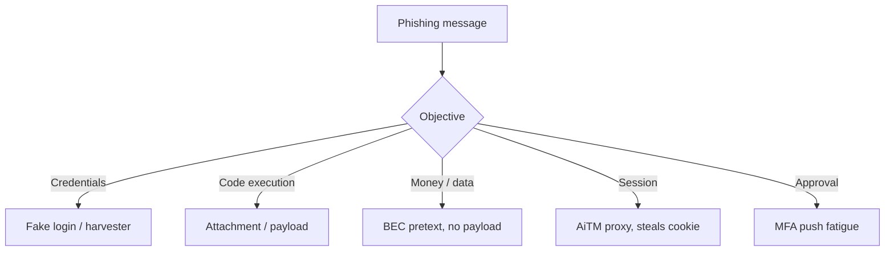
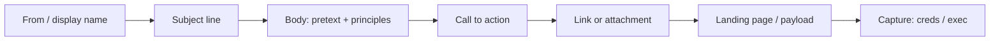
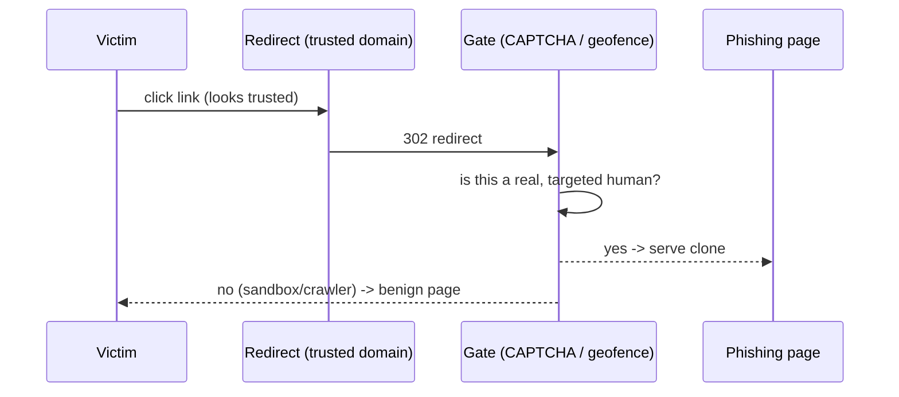
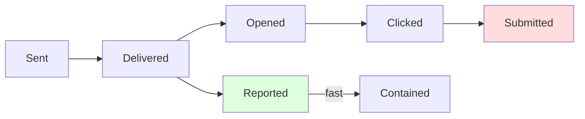
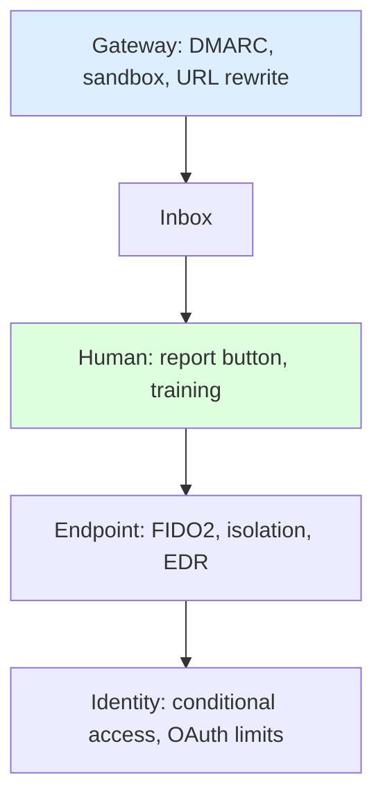
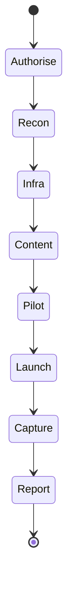

**Level:** Intermediate · **Track:** Red Team · **Read time:** 170 min

This is Chapter 3 of the Social Engineering series. Chapter 1 built the psychology; Chapter 2 built the recon and the pretext. This chapter puts a pretext on the wire as an actual phishing message and follows it all the way to compromise.

Phishing is the single most important initial-access technique in the modern threat landscape. It is how ransomware crews, criminal fraud rings, and nation-state actors most often get their first foothold. Understanding it deeply — as a builder and as a defender — is non-negotiable for anyone doing red teaming or blue teaming.

We treat phishing as an engineering discipline. A phishing message has components (sender, subject, body, call-to-action, link or attachment, landing page), each of which can be tuned for credibility and deliverability. We will dissect every one.

Everything in this chapter is for authorised, scoped engagements and for defensive understanding. You build and fire phishing only against people and infrastructure you are contracted to test, using isolated lab infrastructure for practice. The ethics gate from Chapter 1 governs every step.

---

## Part 1: What Phishing Actually Is (and Is Not)

Phishing is the delivery of a fraudulent message — usually email, but also SMS, chat, or social media — designed to make the recipient take an action that benefits the attacker: reveal credentials, execute a payload, approve an MFA prompt, or transfer money.

It is useful to separate phishing by **objective**, because the objective determines the entire construction of the message:

- **Credential harvesting** — drive the target to a fake login page and capture their username and password (and, with AiTM, their session — Chapter 8).
- **Payload delivery** — get the target to open an attachment or run a file that executes code (Chapters 7 and the malware notebook).
- **Business Email Compromise (BEC)** — no link, no malware; pure pretext to move money or data (Chapter 4 covers the spoofing that enables it).
- **MFA approval / push** — trick the target into approving an authentication request the attacker triggered.

Phishing is *not* just "spam with a bad link." Modern phishing is targeted, well-researched, technically polished, and increasingly able to defeat MFA. Treating it as low-effort is exactly the mistake that gets organisations breached.



---

## Part 2: The Phishing Taxonomy

The taxonomy from Chapter 1, expanded with the distinguishing features that matter when you build or defend against each.

| Type | Targeting | Channel | Typical objective |
|---|---|---|---|
| **Bulk phishing** | Broad, untargeted | Email | Credential/malware at scale |
| **Spear phishing** | Specific individual/team | Email | Tailored credential/payload |
| **Whaling** | Executives | Email | High-value fraud/access |
| **BEC / CEO fraud** | Finance/AP, specific | Email | Wire/data via impersonation |
| **Clone phishing** | Anyone | Email | Replay a real message with a swapped link |
| **Angler phishing** | Complainers on social | Social media | Fake "support" credential theft |
| **Smishing** | Mobile users | SMS | Link/credential (Chapter 9) |
| **Vishing** | Anyone | Voice | Elicitation/approval (Chapter 9) |
| **Quishing** | Anyone | QR code | Move victim to phishing URL off a filtered channel |

**Clone phishing** deserves a note: the attacker takes a legitimate email the target already received (an invoice, a shared document notification), copies it exactly, and re-sends it with the link or attachment swapped for a malicious one. Because the target recognises the message, suspicion is low. Recon (Chapter 2) that reveals what real notifications a target receives feeds this directly.

**Quishing** (QR phishing) has surged because a QR code in an email image often bypasses URL filters (the URL is inside the image), and because scanning moves the victim onto their *phone*, which may lack the corporate browser protections and where the full URL is harder to inspect.

---

## Part 3: Anatomy of a Phishing Email

Every phishing email is assembled from the same parts. Mastering each is how you build convincing lures and how you teach staff and tune filters to catch them.



### 3.1 The sender (From, display name, Reply-To)

The sender is the first credibility signal. Three sub-parts:

- **Display name** — the human-readable name shown in most clients (e.g., "IT Service Desk"). It is trivially forgeable and, on mobile, often the *only* thing shown. Display-name spoofing ("Jane Okoro, CEO" over an unrelated address) is a staple of BEC.
- **From address (envelope + header From)** — the actual address. Exact-domain spoofing depends on the target's DMARC (Chapter 4). Where DMARC blocks it, attackers use **look-alike domains** (`acme-widgets-support.com`) or **cousin domains**.
- **Reply-To** — can silently route replies to an attacker-controlled inbox even when the From looks legitimate — common in BEC so the "conversation" continues with the attacker.

### 3.2 The subject line

The subject does two jobs: get the email opened and set the emotional frame. Effective (and therefore commonly abused) patterns: account/security alerts, invoices/payments, delivery notifications, HR/payroll, shared documents, and calendar/meeting invites. Subjects that combine relevance and mild urgency ("Action needed: mailbox storage full") outperform pure alarm.

### 3.3 The body

The body carries the pretext and stacks the influence principles (Chapter 1). Good phishing bodies are **short**, **specific**, and drive to a **single action**. Over-long backstories wake System 2. Brand imagery, correct logos, and matching tone create the halo effect.

### 3.4 The call to action (CTA)

One clear action: "Review the document", "Verify your account", "Update payment details". A single, obvious button reduces friction. Multiple asks dilute and raise suspicion.

### 3.5 The link or attachment

The technical payload vector. Links go to a harvester or redirect chain; attachments carry macros, scripts, or malware (Chapter 7). Chapter covers URL construction and evasion below and attachments in Chapter 7.

### 3.6 The landing page

For credential harvesting, the landing page is a pixel-accurate clone of a login the target trusts (their M365 portal, VPN, or SSO). Its job is to look identical and to capture what's typed. AiTM landing pages (Chapter 8) go further and proxy the real site to also steal the session.

---

## Part 4: Sender Tradecraft and Look-Alike Domains

Because Chapter 4 covers SPF/DKIM/DMARC in depth, here we focus on the *choices* an operator makes about the sender, and the tells each leaves for defenders.

Options, roughly in ascending sophistication:

1. **Exact-domain spoof** — forge the target's real domain. Works only if their DMARC is `p=none` or absent. Cheapest, highest credibility when it works; blocked by proper DMARC.
2. **Look-alike / cousin domain** — register a confusingly similar domain: character swaps (`rn` for `m`), extra words (`-support`, `-secure`, `-invoices`), or different TLDs (`.co` for `.com`). Passes casual inspection.
3. **Homoglyph / IDN domain** — use Unicode characters that look like Latin ones (`аcme` with a Cyrillic а). Visually identical; defeated by browsers/clients that display punycode.
4. **Compromised legitimate account** — send from a *real* mailbox the attacker controls (often at a partner/vendor). Highest deliverability and trust; this is why supply-chain email compromise is so dangerous.
5. **Trusted-service abuse** — send via a legitimate bulk sender, file-share, or e-signature service the target trusts, so the link is on a reputable domain.

| Sender strategy | Credibility | Deliverability | Main defender tell |
|---|---|---|---|
| Exact-domain spoof | High (if it lands) | Low if DMARC reject | DMARC/DKIM failure in headers |
| Look-alike domain | Medium-high | High | Domain age, near-miss spelling |
| Homoglyph/IDN | High visually | Medium | Punycode `xn--` in address |
| Compromised account | Very high | Very high | Behavioural anomaly, new rules |
| Trusted-service abuse | High | Very high | Unusual sender for that service |

**Blue team usage:** each row's "tell" is a detection rule. Newly registered look-alike domains, `xn--` punycode senders, first-time-seen vendor addresses, and DMARC failures are all high-signal indicators worth alerting on.

---

## Part 5: URL Construction and Link Evasion (Concepts)

Attackers work hard to get a malicious link past filters and past the human's glance. Understanding the techniques — at a conceptual, lawful, lab-scoped level — is what lets defenders catch them.

Common link-obfuscation and evasion concepts:

- **URL shorteners / redirect chains** — hide the final destination behind `bit.ly`-style links or open redirects on trusted domains (`trusted.com/redirect?url=evil`). Open redirects on the *target's own* domain are especially potent.
- **Subdomain padding** — `acme-widgets.example.login-verify.com` puts the trusted string on the left so a hurried reader stops reading before the real registrable domain.
- **Look-alike path/host** — `microsoft-account-security.com/login` reads as Microsoft to a glance.
- **Homoglyph URLs** — Unicode characters in the hostname (defeated by punycode display).
- **Legitimate hosting** — host the phishing page on a reputable cloud/storage/pages platform so the domain reputation is clean.
- **Time-based / geofenced delivery** — the link serves the phishing page only to targeted victims and shows a benign page to sandboxes, crawlers, or out-of-scope IPs. This defeats naive automated scanning.
- **CAPTCHA / human-check gates** — a CAPTCHA in front of the phishing page blocks automated crawlers while real victims click through.
- **QR codes (quishing)** — the URL lives inside an image, bypassing text-URL filters, and moves the victim to a mobile browser.



**Defensive counters** (previewing Part 12): URL rewriting and time-of-click analysis at the gateway, sandbox detonation that follows redirects, browser isolation, blocking newly registered/low-reputation domains, and — crucially — teaching users to *never authenticate via emailed links* and to open portals from bookmarks.

---

## Part 6: Credential Harvesting vs Payload Delivery vs BEC

The three main phishing objectives use the same skeleton but diverge sharply in construction and in what defeats them.

### 6.1 Credential harvesting

- **Build:** convincing email → link → cloned login page → capture creds (→ optionally AiTM to capture session).
- **Signals to defenders:** link to non-corporate domain, login page not on the real SSO domain, credentials submitted to an unusual host.
- **Defeated by:** phishing-resistant MFA (FIDO2/passkeys), which makes stolen passwords insufficient and resists AiTM; plus "never log in from email links."

### 6.2 Payload delivery

- **Build:** email → attachment or link-to-file → user opens → macro/script/loader executes (Chapters 7 and malware notebook).
- **Signals to defenders:** office docs with macros, script files (`.js`, `.hta`, `.lnk`), containers (`.iso`, `.zip`) hiding executables, unusual child processes.
- **Defeated by:** blocking risky attachment types, disabling macros by policy (especially macros from the internet), sandbox detonation, and EDR behavioural detection.

### 6.3 BEC

- **Build:** email → pure pretext (impersonate exec/vendor) → request a wire or bank-detail change. No link, no malware.
- **Signals to defenders:** display-name impersonation, Reply-To mismatch, look-alike domain, urgency + confidentiality + payment.
- **Defeated by:** out-of-band verification + dual authorisation for payments (process, not technology).

The key insight for both offense and defense: **the control that defeats each objective is different.** MFA doesn't stop BEC; DMARC doesn't stop a malicious macro; a sandbox doesn't stop a pure-text wire-fraud email. Layered defence must cover all three.

---

## Part 7: Crafting the Message — A Builder's Walkthrough

For an authorised engagement, here is how a professional assembles a spear-phishing email from a dossier (Chapter 2), step by step. We use pretext #3 from the sample dossier: a portal SSO-migration credential harvest.

1. **Objective:** capture VPN/portal credentials to demonstrate impact.
2. **Persona:** internal "IT / Identity" team.
3. **Sender:** look-alike domain `acme-widgets-sso.com` (real domain's DMARC is `p=none`, so exact spoof is possible too — but a look-alike is more resilient if they fix DMARC mid-engagement). Display name: "Acme IT — Identity Services".
4. **Subject:** "Action required: migrate to the new single sign-on by Friday".
5. **Body (short, specific, one CTA):**

```
Hi {{first_name}},

We're moving Acme sign-in to the new single sign-on (SSO) portal. To keep
your access, please sign in once via the link below to complete the migration.
Most of the {{department}} team have already migrated.

    [ Complete SSO migration ]

If you don't migrate by Friday, your portal access will be temporarily
suspended until IT can re-enable it.

Thanks,
Acme IT — Identity Services
```

6. **Principle stack:** Authority (IT) + Loss aversion ("access suspended") + Social proof ("most of the team") + mild Scarcity (Friday).
7. **Link:** to a cloned login on the look-alike domain (built in Chapter 5 with tooling).
8. **Personalisation tokens** (`{{first_name}}`, `{{department}}`) pulled from the dossier — specificity is credibility.
9. **Objection handling:** a plausible "reply to this email with questions" that routes to a monitored, in-persona inbox.

Notice every choice traces back to a dossier fact and an influence principle, and the whole thing drives one action. That discipline is what separates a professional lure from spam — and it's exactly what a good awareness program teaches staff to recognise.

---

## Part 8: Reading Email Headers Like an Analyst

Whether you're a red teamer validating deliverability or a blue teamer triaging a report, you must read raw headers. Headers are the ground truth an inbox display hides.

Key headers, top to bottom of interest:

| Header | What it tells you |
|---|---|
| `Received:` (chain) | The hop-by-hop path; the *first* (bottom) Received often reveals the true origin |
| `Return-Path:` | The envelope sender (bounce address); mismatches with From are suspicious |
| `From:` | The header sender shown to the user; check display name vs actual address |
| `Reply-To:` | Where replies actually go; mismatch is a BEC red flag |
| `Authentication-Results:` | SPF/DKIM/DMARC pass/fail verdicts (Chapter 4) |
| `DKIM-Signature:` | The signing domain (`d=`); should align with From |
| `Message-ID:` | Origin domain hint; odd domains are suspicious |
| `X-Mailer` / `User-Agent` | Sending software; bulk tools sometimes leak here |

A quick analyst read of an `Authentication-Results` header:

```
Authentication-Results: mx.acme-widgets.example;
    spf=fail (sender IP is 203.0.113.7) smtp.mailfrom=northbridge-supplies.co;
    dkim=none;
    dmarc=fail action=none header.from=acme-widgets.example
```

Interpretation: SPF **failed**, there's **no DKIM**, and DMARC **failed** — but `action=none` means the domain's DMARC policy is `p=none`, so the failing message was delivered anyway. This single header simultaneously proves the message is spoofed *and* explains why it wasn't blocked. Fixing DMARC to `p=reject` (Chapter 4) is the remediation.

**Blue team usage:** triage every reported phish by pulling `Authentication-Results`, `Reply-To`, and the first `Received` — those three answer "is it spoofed, where do replies go, and where did it originate" in seconds.

---

## Part 9: Hands-On Lab — Build and Analyse a Phishing Email in an Isolated Range

**Objective:** in a fully isolated lab you control, construct a credential-harvesting phishing email, deliver it to a test mailbox you own, then switch hats and analyse it as a defender from the raw headers. This teaches both construction and detection without touching any real person.

**Lawful-use framing:** everything runs inside a self-contained lab — your own mail server or a test tenant, test recipient accounts you own, and a harvester bound to localhost. No third party is contacted. This mirrors how authorised campaigns are rehearsed before an engagement.

### Step 1 — Stand up the lab

Two VMs on an isolated host-only network:

- **Attacker VM (Kali):** will send the mail and host a mock login page.
- **Victim VM:** a mail client / browser to receive and open the message.

A minimal local SMTP + web setup on the attacker VM:

```bash
# A tiny local SMTP sink to receive/inspect mail (does NOT relay externally)
python3 -m aiosmtpd -n -l 127.0.0.1:1025 &     # local SMTP debug server

# A simple HTTP server to host the mock login page (localhost only)
mkdir phish && cd phish
# index.html = a benign mock login form that posts to /capture (see below)
python3 -m http.server 8080 --bind 127.0.0.1 &
```

### Step 2 — Craft the message

Save the email as a file and send it into the local sink so nothing leaves the lab:

```bash
cat > mail.txt <<'EOF'
From: "Acme IT — Identity Services" <it@acme-widgets-sso.example>
To: testuser@lab.local
Reply-To: it-migration@acme-widgets-sso.example
Subject: Action required: migrate to the new single sign-on by Friday
Content-Type: text/html

<html><body>
<p>Hi Test User,</p>
<p>We're moving Acme sign-in to the new SSO portal. To keep your access,
please <a href="http://127.0.0.1:8080/index.html">complete the migration</a>.
Most of your team have already migrated.</p>
<p>If you don't migrate by Friday, your access will be suspended.</p>
<p>Thanks,<br>Acme IT — Identity Services</p>
</body></html>
EOF

# Send into the LOCAL sink only
swaks --to testuser@lab.local --from it@acme-widgets-sso.example \
      --server 127.0.0.1:1025 --data mail.txt
```

- **`swaks`** is the "Swiss Army knife for SMTP" — a CLI to compose and send test emails with full control over headers. `--server 127.0.0.1:1025` forces delivery to the local sink; nothing touches the internet.

Representative sink output confirming receipt:

```
---> MAIL FROM:<it@acme-widgets-sso.example>
<--- 250 OK
---> RCPT TO:<testuser@lab.local>
<--- 250 OK
---> DATA
<--- 250 Message accepted for delivery
```

### Step 3 — The mock landing page (benign)

`index.html` is a *mock* login that stores nothing real and only proves the concept. In an authorised engagement the harvester (Chapter 5) records that a credential was submitted (often just the fact + timestamp, not the plaintext, depending on RoE):

```html
<form method="POST" action="/capture">
  <label>Email <input name="u"></label>
  <label>Password <input name="p" type="password"></label>
  <button>Sign in</button>
</form>
<!-- In the lab, /capture just logs "submission received @ time" -->
```

### Step 4 — Switch hats: analyse the headers

Open the received message's raw source and read it as an analyst:

```
From: "Acme IT — Identity Services" <it@acme-widgets-sso.example>
Reply-To: it-migration@acme-widgets-sso.example
Subject: Action required: migrate to the new single sign-on by Friday
```

Analyst findings to write up:

- **Display name vs domain mismatch:** claims "Acme IT" but the domain is `acme-widgets-sso.example` — a **look-alike**, not the real `acme-widgets.example`.
- **Link destination:** points to an IP/host that is not the corporate SSO domain — never authenticate here.
- **Urgency + loss framing:** "suspended by Friday" is the manipulation signature.
- **Verification step that defeats it:** open the SSO portal from a bookmark; report the mail via the phish button.

### Step 5 — Produce both deliverables

From the red side: a working, credible lure and evidence it was delivered. From the blue side: a triage note naming the tells and the defeating control. Doing both halves in one lab is the fastest way to internalise phishing — you learn to build it and to catch it in the same sitting.

---

## Part 10: Campaign Metrics That Matter

An authorised phishing engagement is measured, not vibes-based. The metrics tell the client where the risk really is.

| Metric | Definition | Why it matters |
|---|---|---|
| **Delivery rate** | % that reached the inbox | Tests email-auth/gateway posture |
| **Open rate** | % that opened the email | Subject-line credibility |
| **Click rate** | % that clicked the link | Lure/pretext effectiveness |
| **Submit rate** | % that entered credentials | The true compromise metric |
| **Report rate** | % that reported the phish | The key *defensive* metric |
| **Time to first report** | How fast the first report arrived | Predicts containment speed |
| **Time to first click** | How fast someone clicked | How fast an attacker gets in |

The two numbers that matter most for resilience are **report rate** and **time to first report** — a high, fast report rate means an organisation can contain a real phish in minutes. A program that only tracks click rate and punishes clickers optimises the wrong thing and suppresses reporting.



---

## Part 11: Mobile and Multi-Channel Phishing

Phishing is no longer email-only, and the mobile context weakens defences.

- **Mobile clients** often show only the display name, hide the real URL, and lack hover-to-preview — so display-name spoofing and obfuscated URLs are more effective.
- **Smishing (SMS)** and messaging-app lures (WhatsApp, Teams) arrive on channels with weaker filtering and a more casual trust posture (Chapter 9).
- **Quishing (QR)** deliberately moves the victim from a filtered desktop inbox to an unmanaged phone browser.
- **Consent phishing / OAuth** — instead of stealing a password, the lure asks the victim to *grant an app permission* to their account; the victim clicks "Allow" on a real Microsoft/Google consent screen and the attacker gets a token. MFA doesn't help because no password is phished. Defeated by restricting third-party app consent and admin review of OAuth grants.

Multi-channel campaigns *chain* these: an email that references a text, or a Teams message that follows an email, each reinforcing the other's legitimacy (social proof across channels).

---

## Part 12: Detection & Defense Angle

Phishing defence is layered because no single control catches everything. Map controls to the stages of the click-to-compromise flow.

**At the gateway (before the inbox):**

- Email authentication — SPF, DKIM, DMARC at `p=reject` (Chapter 4) — stops exact-domain spoofing.
- Anti-spoofing / impersonation detection — flag display-name impersonation of executives, look-alike domains, and first-time senders.
- URL rewriting + time-of-click analysis — re-evaluate links when clicked, not just at delivery.
- Attachment sandboxing — detonate documents/files and follow redirects.
- Newly-registered / low-reputation domain blocking.

**At the endpoint/browser:**

- Phishing-resistant MFA (FIDO2/passkeys) — the single highest-impact control against credential harvesting and AiTM.
- Browser isolation / safe-links; block macros from the internet; restrict risky file types.
- EDR behavioural detection for payloads that do execute.

**At the human layer:**

- A one-click **report-phish** button and a **no-blame** culture — drives report rate and time-to-report down.
- Recurring, realistic, *measured* simulations that train the "shape" of phishing (Chapter 11), not just specific scams.
- Process controls for BEC — out-of-band verification + dual authorisation.

**At the identity layer:**

- Conditional access (device, location, risk) so stolen creds are less useful.
- Restrict third-party OAuth consent to defeat consent phishing.
- Token protection / binding to blunt session theft.



The durable principle: assume some phishing *will* reach the inbox and *some* users will click. Design so that a click doesn't equal compromise — phishing-resistant MFA, least privilege, and fast reporting are what turn a click into a non-event.

---

## Part 13: Real-World Cases

- **Google & Facebook BEC (2013–2015).** A fraudster impersonated a hardware vendor (Quanta) and invoiced both companies, netting over $100M before arrest. Pure pretext + look-alike invoicing — no malware.
- **Colonial Pipeline (2021).** Ransomware that disrupted fuel supply; initial access traced to a compromised VPN credential (no MFA) — the kind of credential phishing routinely harvests.
- **0ktapus / Scatter Swift-style campaigns (2022).** SMS phishing (smishing) directed employees of many companies to look-alike Okta login pages, harvesting credentials and MFA codes at scale — a textbook multi-channel credential-harvest campaign.
- **Consent phishing campaigns.** Attackers abused OAuth "Allow" consent screens to gain persistent mailbox access without ever stealing a password, defeating password-based MFA.

For each, practise naming the objective (credential/payload/BEC/consent), the sender strategy, and the one control that would have broken it — the exact reasoning a report and an interview demand.

---

## Part 14: Final Revision / Summary

- Phishing is an **engineering discipline**: sender, subject, body, CTA, link/attachment, landing page — each tunable for credibility and deliverability.
- Separate phishing by **objective** — credential harvesting, payload delivery, BEC, consent/OAuth, MFA approval — because each is defeated by a *different* control.
- **Sender tradecraft** ranges from exact-domain spoof (needs weak DMARC) through look-alike/homoglyph domains to compromised accounts and trusted-service abuse.
- **Link evasion** (redirects, subdomain padding, homoglyphs, geofencing, CAPTCHA gates, QR) exists to beat filters and glances; the counters are URL rewriting, sandboxing, isolation, and "never log in from email links."
- **Read headers** — `Authentication-Results`, `Reply-To`, first `Received` — to prove spoofing and origin.
- **Metrics:** submit rate is the compromise number; **report rate and time-to-report are the resilience numbers**.
- **Defence is layered** across gateway, endpoint/browser, human, and identity; the highest-impact single control against credential phishing is **phishing-resistant MFA**.
- Design so a **click ≠ compromise**.

Memory hook — **"S.L.A.M."** (a well-known user-facing check): scrutinise the **S**ender, **L**inks, **A**ttachments, and **M**essage. If any is off, stop and verify out-of-band.

---

## Part 15: Cheat Sheet / Quick Reference

**Email anatomy:** From/display-name · Subject · Body (pretext + principles) · CTA · Link/attachment · Landing page.

**Objectives → defeating control:** credentials → FIDO2 MFA · payload → macro/type blocking + EDR · BEC → out-of-band + dual-auth · consent/OAuth → restrict app consent.

**Sender strategies:** exact-domain spoof · look-alike/cousin · homoglyph/IDN · compromised account · trusted-service abuse.

**Link evasion concepts:** shorteners/redirects · open redirects · subdomain padding · homoglyph URLs · geofence/time-gate · CAPTCHA gate · QR (quishing).

**Analyst header triage:**

```
Authentication-Results:  # SPF/DKIM/DMARC verdicts
Reply-To:                # BEC mismatch?
Received: (first/bottom) # true origin
From: display vs address # impersonation?
```

**swaks lab send (local sink only):**

```bash
swaks --to user@lab.local --from it@lookalike.example \
      --server 127.0.0.1:1025 --data mail.txt
```

**Metrics:** delivery · open · click · **submit (compromise)** · **report (resilience)** · time-to-first-report.

**User check:** S.L.A.M. — Sender, Links, Attachments, Message.

**Top defences:** DMARC `p=reject` · phishing-resistant MFA · URL rewrite + sandbox · report-phish button + no-blame · dual-auth finance · restrict OAuth consent.

---

## Part 16: Practice Labs & Resources

- **TryHackMe — "Phishing", "Phishing Analysis Fundamentals", "Phishing Analysis Tools", "Greenholt Phish"**: build and, crucially, *analyse* phishing emails and headers.
- **PortSwigger Web Security Academy — OAuth and authentication labs**: the mechanics behind credential-harvest and consent-phishing objectives.
- **Gophish (Chapter 6) documentation**: the open-source framework you'll use to run a full authorised campaign next.
- **MITRE ATT&CK — Phishing (T1566) and its sub-techniques**: map each technique in this chapter to the framework for reports.
- **PhishTank / APWG reports / real disclosed samples**: study current lures; label objective, sender strategy, and principle stack for each.
- **Self-drill:** take five emails from your own spam/junk. For each, identify objective, sender strategy, link-evasion technique, principle stack, and the one control that defeats it. Then rebuild one (in your isolated lab only) and analyse its headers.

**Practice question 1.** A message shows "Jane Okoro, CEO" but `Reply-To` is a Gmail address and there's no link or attachment. What objective is this, and what single process control defeats it?

**Practice question 2.** Explain why phishing-resistant MFA stops credential harvesting but does nothing against BEC, and vice-versa for out-of-band payment verification.

**Practice question 3.** Given `spf=fail; dkim=none; dmarc=fail action=none`, explain how you know the message is spoofed *and* why it was still delivered.

**Practice question 4.** Why has quishing (QR phishing) become popular, and which two defences most reduce its effectiveness?

**Practice question 5 (lab).** In an isolated range, send a credential-harvest email into a local sink, then write an analyst triage note from the raw headers naming three tells and the defeating control.

**Worked answer to Q1.** Objective = **BEC** (display-name impersonation, Reply-To to an attacker inbox, no payload). The defeating control is **out-of-band verification on a known number plus dual authorisation** for any payment or data request — a process control, because no technical filter reliably stops a pure-text, well-written impersonation email.

---

## Part 17: Worked Answers to the Remaining Questions

**Answer 2.** Credential harvesting ends with the attacker holding a username+password (and often a session). Phishing-resistant MFA (FIDO2/passkeys) binds authentication to the legitimate origin and a hardware key, so a stolen password is useless and even an AiTM proxy can't complete the challenge — hence it stops harvesting. BEC, by contrast, involves *no login at all*; it's a human being persuaded to move money, so MFA is irrelevant. Conversely, out-of-band payment verification stops BEC (it catches the fraudulent instruction) but does nothing to prevent someone typing a password into a fake login page. Different objective, different control — which is why layered defence must address each objective explicitly.

**Answer 3.** `spf=fail` means the sending IP is not authorised for the envelope domain; `dkim=none` means the message carried no valid signature; `dmarc=fail` means neither SPF nor DKIM aligned with the header From — together these prove the message did not originate from the claimed domain (spoofed). It was still delivered because `action=none` reflects a DMARC policy of `p=none`, which only *monitors* failures rather than rejecting or quarantining them. The fix is `p=reject`.

**Answer 4.** Quishing is popular because the URL is embedded in an *image* (the QR code), so text-based URL filters and link rewriters don't see it, and because scanning moves the victim onto a personal phone that often lacks corporate browser protection and makes the full URL hard to inspect. The two most effective defences: (1) gateway/image analysis that decodes QR codes and evaluates the embedded URL, and (2) phishing-resistant MFA so that even if the victim reaches the fake login, the credentials/session can't be replayed — plus user training to treat email QR codes with suspicion.

**Answer 5.** A good triage note names, for example: the display-name/domain mismatch (look-alike domain), the link pointing to a non-corporate host, and the urgency/loss framing ("suspended by Friday"); then states the defeating control — open the portal from a bookmark and report via the phish button, backed by phishing-resistant MFA. Including the raw `From`, `Reply-To`, and link host as evidence makes the note actionable.

---

## Part 18: Rapid Self-Test (Flashcards)

1. Q: Name the six components of a phishing email.
   A: Sender/display-name, subject, body, CTA, link/attachment, landing page.

2. Q: Which phishing objective uses no link and no malware?
   A: BEC (business email compromise).

3. Q: What defeats credential harvesting most effectively?
   A: Phishing-resistant MFA (FIDO2/passkeys).

4. Q: What defeats BEC?
   A: Out-of-band verification + dual authorisation for payments.

5. Q: What is clone phishing?
   A: Copying a real message the target received and re-sending it with a swapped malicious link/attachment.

6. Q: What is quishing and why does it evade filters?
   A: QR-code phishing; the URL is inside an image, so text URL filters miss it and it moves the victim to a phone.

7. Q: What is consent/OAuth phishing?
   A: Tricking the victim into granting an app permission (a token) instead of stealing a password; MFA doesn't stop it.

8. Q: Which header reveals where replies actually go?
   A: Reply-To.

9. Q: Which header carries SPF/DKIM/DMARC verdicts?
   A: Authentication-Results.

10. Q: `dmarc=fail action=none` — why was the mail delivered?
    A: The domain's DMARC policy is `p=none` (monitor only).

11. Q: What's the difference between a look-alike and a homoglyph domain?
    A: Look-alike uses similar ASCII (extra words/TLD); homoglyph uses Unicode chars that look identical (punycode `xn--`).

12. Q: The single compromise metric in a campaign?
    A: Submit rate (credentials entered).

13. Q: The two key resilience metrics?
    A: Report rate and time to first report.

14. Q: Why is display-name spoofing more effective on mobile?
    A: Mobile clients often show only the display name and hide the real address/URL.

15. Q: What is subdomain padding?
    A: Putting the trusted string on the left (`trusted.example.evil.com`) so hurried readers stop before the real registrable domain.

16. Q: One gateway control against evasive links?
    A: URL rewriting with time-of-click analysis (and sandbox detonation following redirects).

17. Q: The user-facing check acronym?
    A: S.L.A.M. — Sender, Links, Attachments, Message.

18. Q: Why does a CAPTCHA appear on some phishing pages?
    A: To block automated crawlers/sandboxes while letting real human victims through.

19. Q: What is trusted-service abuse?
    A: Sending via a reputable bulk/file-share/e-signature service so the link is on a clean domain.

20. Q: The core design principle of phishing defence?
    A: Make a click ≠ compromise (phishing-resistant MFA, least privilege, fast reporting).

---

## Part 19: Annotated Sample Gallery (by Objective)

Four full, sanitised samples — one per objective — each with the raw shape, the tells, and the defeating control. Use them as an awareness "spot-the-tell" set and as a triage reference.

### Sample 1 — Credential harvest (M365)

```
From: "Microsoft 365" <security@m365-account-verify.example>
Subject: [Action required] Unusual sign-in to your mailbox

We detected a sign-in from a new device. If this wasn't you, secure your
account now:
    [ Review activity ]
For your protection, access will be limited until you verify.
```

- **Objective:** credential harvesting (link → cloned M365 login).
- **Tells:** sender domain isn't microsoft.com; generic greeting; urgency + loss ("access limited"); link host is not the real login.microsoftonline.com.
- **Defeats it:** phishing-resistant MFA + open the portal from a bookmark; report via phish button.

### Sample 2 — Payload delivery (invoice macro)

```
From: "Accounts" <billing@northbridge-supplies.co>
Subject: Invoice INV-4471 - payment overdue
Attachment: INV-4471.docm

Please find the overdue invoice attached. Enable editing and content to
view the secured document.
```

- **Objective:** payload delivery (macro-enabled `.docm`; "enable content" is the macro trigger).
- **Tells:** `.docm` attachment; "enable content" social-engineering line; look-alike `.co` domain.
- **Defeats it:** block/disarm macro-enabled docs from the internet; sandbox detonation; EDR; user training that "enable content" = red flag.

### Sample 3 — BEC (CEO wire fraud)

```
From: "Jane Okoro" <ceo.jane.okoro@gmail.example>
Reply-To: ceo.jane.okoro@gmail.example
Subject: Are you at your desk?

Tomas - I need you to process an urgent supplier payment before end of day.
It's confidential ahead of the announcement. Reply and I'll send details.
```

- **Objective:** BEC (no link/payload; gift-card/wire ask follows).
- **Tells:** free-mail address for a "CEO"; urgency + confidentiality that discourages verification; "are you at your desk?" opener typical of BEC.
- **Defeats it:** out-of-band verification on a known number + dual authorisation; policy that payments are never initiated by email alone.

### Sample 4 — Consent/OAuth phishing

```
From: "Acme Docs" <no-reply@acme-docs-share.example>
Subject: A document has been shared with you

[ Open in Acme Docs ]   ->  leads to a real Microsoft consent screen
                             requesting Mail.Read + offline_access
```

- **Objective:** OAuth consent grant (token, not password).
- **Tells:** third-party app requesting broad mailbox scopes; unfamiliar app name; consent screen for an app you didn't seek.
- **Defeats it:** restrict third-party OAuth app consent (admin approval workflow); user training to scrutinise permission requests; review/revoke risky grants.

**Pattern across all four:** authority + a reason to act now + a channel/step that discourages verification. Different objectives need different controls — which is the chapter's central lesson made concrete.

---

## Part 20: Glossary of Key Terms

- **Phishing** — fraudulent message engineered to make a recipient reveal data, run code, approve auth, or move money.
- **Spear phishing / whaling** — targeted phishing; whaling targets executives.
- **BEC** — impersonation of exec/vendor to induce fraudulent payment/data disclosure; usually malware-free.
- **Clone phishing** — replaying a real received message with a swapped malicious link/attachment.
- **Quishing** — QR-code phishing; URL embedded in an image to evade filters.
- **Smishing / vishing** — SMS / voice phishing (Chapter 9).
- **Consent phishing** — tricking a victim into granting an OAuth app permission (token), bypassing password MFA.
- **Look-alike / cousin domain** — a confusingly similar registered domain (extra words, different TLD).
- **Homoglyph / IDN domain** — a domain using Unicode characters that visually mimic Latin ones; shown as punycode `xn--`.
- **Display-name spoofing** — forging the human-readable sender name over an unrelated address.
- **Reply-To abuse** — routing replies to an attacker inbox while From looks legitimate.
- **Landing page / harvester** — the cloned login page that captures submitted credentials.
- **AiTM** — adversary-in-the-middle proxy that also steals the session cookie (Chapter 8).
- **Open redirect** — a legitimate URL parameter that forwards to an attacker site, borrowing the trusted domain's reputation.
- **Subdomain padding** — placing the trusted string on the left of a URL to mislead a hurried reader.
- **Geofencing / time-gating** — serving the phishing page only to targeted victims and a benign page to sandboxes/crawlers.
- **URL rewriting / time-of-click** — a gateway control that re-evaluates a link when it is clicked.
- **Submit rate** — % of recipients who entered credentials; the compromise metric.
- **Report rate** — % who reported the phish; the key resilience metric.
- **S.L.A.M.** — user check: Sender, Links, Attachments, Message.

---

## Part 21: Filter-Evasion → Defence Mapping (Reference)

A consolidated reference tying each evasion concept to the control that counters it. Written for the report's remediation section.

| Evasion technique | How it beats naive defence | Primary counter-control |
|---|---|---|
| Exact-domain spoof | No DKIM/alignment check | DMARC `p=reject` + DKIM alignment |
| Look-alike domain | Passes eyeball check | Impersonation detection; newly-registered-domain blocking |
| Homoglyph/IDN | Visually identical | Punycode display; block `xn--` senders |
| URL shortener/redirect | Hides final host | URL rewriting; expand + reputation check; sandbox follows redirects |
| Open redirect on trusted domain | Borrows reputation | Fix open redirects; evaluate final destination |
| Subdomain padding | Reader stops early | User training; highlight registrable domain |
| Geofence/time-gate | Benign to sandbox | Detonate from victim-like geos; time-of-click re-check |
| CAPTCHA gate | Blocks crawlers | Human-assisted detonation; block known kit patterns |
| QR (quishing) | URL in image | Decode QR at gateway; evaluate embedded URL |
| Macro attachment | Runs on "enable content" | Block internet macros; sandbox; EDR |
| Compromised sender | Real domain, real DKIM | Behavioural/anomaly detection; impossible-travel; new-rule alerts |
| OAuth consent | No password to catch | Restrict app consent; admin approval; grant review |

The takeaway for the defender: there is no single silver bullet, but **DMARC `p=reject`, phishing-resistant MFA, sandbox+URL-rewrite gateways, macro/type controls, restricted OAuth consent, and a fast report-and-respond culture** together cover the entire evasion matrix.

---

## Part 22: Extended Lab — Full Header Teardown, Line by Line

Analysts must read a *complete* raw header, not just the pretty view. Below is a representative (fictional) raw header for a spoofed message, followed by a line-by-line reading. Reproduce this skill on any phish you triage.

```
Delivery-date: Tue, 19 Jan 2027 09:14:02 +0000
Return-Path: <bounce@mailer-southbay.example>
Received: from mx.acme-widgets.example (10.0.0.5)
    by inbox.acme-widgets.example with LMTP id abc123
    for <t.mendes@acme-widgets.example>; Tue, 19 Jan 2027 09:14:02 +0000
Received: from mailer-southbay.example (203.0.113.7)
    by mx.acme-widgets.example with ESMTPS id def456
    (TLS1.3) for <t.mendes@acme-widgets.example>; Tue, 19 Jan 2027 09:14:01 +0000
Authentication-Results: mx.acme-widgets.example;
    spf=fail (mx.acme-widgets.example: 203.0.113.7 is not permitted by
        domain of acme-widgets.example) smtp.mailfrom=bounce@mailer-southbay.example;
    dkim=none;
    dmarc=fail (p=none sp=none dis=none) header.from=acme-widgets.example
Received-SPF: fail (not permitted) client-ip=203.0.113.7;
From: "Acme IT — Identity Services" <it@acme-widgets.example>
Reply-To: <it-migration@acme-widgets-sso.example>
To: <t.mendes@acme-widgets.example>
Subject: Action required: migrate to the new single sign-on by Friday
Message-ID: <9f2a@mailer-southbay.example>
X-Mailer: bulk-sender 4.2
MIME-Version: 1.0
Content-Type: text/html; charset=UTF-8
```

Line-by-line reading:

- **`Return-Path` / `smtp.mailfrom`** is `mailer-southbay.example`, but the visible **`From`** claims `acme-widgets.example`. Envelope and header senders disagree — classic spoof indicator.
- **First (bottom) `Received`** shows the true origin IP `203.0.113.7` on `mailer-southbay.example` — not any Acme infrastructure.
- **`spf=fail`** — that IP is not authorised to send for `acme-widgets.example`.
- **`dkim=none`** — no cryptographic signature at all.
- **`dmarc=fail (p=none)`** — the message fails DMARC, but the domain publishes only `p=none`, so it is delivered anyway. This one token is the reason the spoof reached the inbox.
- **`Reply-To`** points to a **look-alike** domain `acme-widgets-sso.example` — replies would leave the real org entirely.
- **`Message-ID`** domain matches the bulk sender, not Acme — corroborates the true origin.
- **`X-Mailer: bulk-sender 4.2`** leaks the sending tool — a weak but real indicator.

Analyst verdict: spoofed, delivered due to `p=none`, replies routed to a look-alike. Remediation: DMARC `p=reject`; block/monitor the look-alike domain; user-report confirms the campaign.

**Why this matters for both sides:** the red teamer reads these same headers to confirm their mail landed and to see which auth checks failed (informing whether to switch to a look-alike). The blue teamer reads them to prove spoofing, find the origin, and scope the campaign by `Message-ID` pattern or origin IP.

---

## Part 23: An Authorised Campaign Run-Book (Outline)

Tying the chapter to operational reality, here is the run-book skeleton an authorised phishing engagement follows. Chapter 6 executes it with Gophish; this is the process it automates.

1. **Authorisation & scope** — signed RoE naming target population, timing window, allowed pretexts, and data handling. Confirm the safe-word/de-confliction contact and notify the SOC lead per the agreed disclosure model (some tests are blind, some are coordinated).
2. **Pretext & recon** — pull targets and personalisation from the dossier (Chapters 1–2). Choose one objective per campaign for clean metrics.
3. **Infrastructure** — register/warm the sending domain, configure DNS (SPF/DKIM to maximise deliverability of the *authorised* sender), set up the landing page and capture with the RoE-mandated data minimisation (often capture *that* a credential was submitted, not the plaintext).
4. **Content** — build the email and landing page; personalise with tokens; test-send to yourself and read the headers.
5. **Pilot** — send to a small pilot group to validate deliverability and rendering before the full send.
6. **Launch & monitor** — send in controlled batches; watch delivery, click, submit, and report metrics live; be ready to pause if the SOC (in a coordinated test) needs de-confliction.
7. **Capture & prove impact** — record the minimum evidence needed to demonstrate risk (a submitted credential proves the harvest; you do not then log into real systems unless explicitly authorised).
8. **Debrief & report** — metrics, the pretext teardown, the specific tells, and — the deliverable that matters — prioritised remediations (DMARC, MFA, process, training) and a "just-in-time" teaching moment for those who clicked, framed constructively.



The professional difference is in steps 1, 7, and 8: explicit authorisation, minimum-necessary capture, and a report that improves the organisation rather than shaming individuals. That is what makes an authorised campaign a security service rather than an attack.

---

## Part 24: MITRE ATT&CK Mapping

Reports land better when techniques are mapped to a shared framework. The phishing-relevant ATT&CK techniques:

| ATT&CK ID | Technique | Where it appears in this chapter |
|---|---|---|
| **T1566** | Phishing | The whole chapter |
| **T1566.001** | Phishing: Spearphishing Attachment | Payload delivery (Part 6.2), Sample 2 |
| **T1566.002** | Phishing: Spearphishing Link | Credential harvest (Part 6.1), Sample 1 |
| **T1566.003** | Phishing: Spearphishing via Service | Trusted-service abuse (Part 4) |
| **T1598** | Phishing for Information | Recon-oriented lures (Chapter 2 overlap) |
| **T1534** | Internal Spearphishing | Post-compromise lateral phishing from a real account |
| **T1656** | Impersonation | BEC / display-name spoofing (Sample 3) |
| **T1204.001/.002** | User Execution: Link / File | The click / "enable content" step |
| **T1078** | Valid Accounts | The outcome of credential harvesting |
| **T1550.004** | Web Session Cookie | AiTM session theft (Chapter 8) |
| **T1528** | Steal Application Access Token | Consent/OAuth phishing (Sample 4) |

Mapping each engagement finding to an ATT&CK ID lets the client cross-reference their detection coverage (e.g., "do we alert on T1566.002?") and plan improvements against a standard taxonomy.

---

## Part 25: Common Builder & Defender Pitfalls

**Builder (authorised operator) pitfalls:**

- **Too many asks or too much backstory** — dilutes the single CTA and wakes System 2.
- **Poor deliverability prep** — sending from cold infrastructure with no DNS setup lands in spam and skews metrics; warm and configure first.
- **Over-broad capture** — logging plaintext passwords when the RoE only needs proof of submission; violates data minimisation.
- **Ignoring rendering** — an email that looks broken on Outlook mobile fails; always pilot across clients.
- **No de-confliction** — launching a coordinated test without the SOC contact ready causes real incident response and wasted effort.

**Defender pitfalls:**

- **Optimising click rate and punishing clickers** — suppresses reporting, the metric that actually matters.
- **Relying on any single control** — DMARC alone, or MFA alone, leaves whole objectives (BEC, consent) uncovered.
- **Treating `p=none` as "DMARC is done"** — monitoring is not enforcement; exact-domain spoofing still lands.
- **No report button / slow triage** — every minute between click and report is attacker dwell time.
- **Forgetting mobile and OAuth** — defences tuned only for desktop email miss quishing, smishing, and consent phishing.

Each builder pitfall is also a *tell* a sharp defender can catch, and each defender pitfall is a gap an operator will find first — which is exactly why running both roles, as this notebook does, produces the strongest practitioners.

---

## Part 26: Extended Practice & Labs

- **Header triage drill:** collect five reported phish (or samples from PhishTank). For each, extract `From`, `Reply-To`, first `Received`, and `Authentication-Results`; state spoofed-or-not, origin, and why it was/wasn't delivered.
- **Objective classification drill:** label 10 samples by objective (credential/payload/BEC/consent) and name the defeating control for each — speed and accuracy here is a real SOC skill.
- **Isolated build drill:** in your lab range, build one lure per objective, send each into a local sink, and write the matching analyst triage note.
- **Deliverability drill (own domain):** on a test domain you own, publish SPF/DKIM/DMARC and use a mail-tester service to score deliverability — this bridges directly into Chapter 4.
- **ATT&CK mapping drill:** take a disclosed phishing incident report and map each step to ATT&CK IDs, then list the detections that would cover them.

**Practice question 6.** A campaign shows a 42% click rate but a 4% report rate and a 20-minute time-to-first-report. Which number worries you most as a defender, and what program change addresses it?

**Practice question 7.** You must demonstrate credential-harvest impact for a client whose RoE forbids storing plaintext passwords. How do you prove the harvest while respecting data minimisation?

**Worked answer to Q6.** The 4% report rate and 20-minute time-to-first-report worry you most — a low, slow report rate means a real phish would dwell for many minutes before anyone raises it, and most recipients never report at all. Click rate is a training input, but *reporting* is what enables containment. The fix is a program change: deploy a one-click report button, run a no-blame reporting campaign, publicly celebrate reporters (not shame clickers), and set a target to drive time-to-first-report down toward a couple of minutes.

**Worked answer to Q7.** Configure the harvester to record only the *fact* of submission plus metadata (timestamp, which target, that both fields were filled) — not the credential values — or hash-and-immediately-discard so no plaintext is retained. The evidence that a user submitted credentials on the cloned page is sufficient to prove the harvest and quantify submit rate, without ever storing a real password, satisfying both the impact requirement and the data-minimisation clause.

---

## Part 27: Deliverability Primer (Bridge to Chapter 4)

A perfect lure that lands in the spam folder achieves nothing, so operators care intensely about **deliverability** — and defenders use the same signals to *reduce* it for malicious mail. A short primer that Chapter 4 expands:

- **Reputation.** Sending IP and domain reputation dominate. Brand-new domains and cold IPs are distrusted; that's why attackers *age* and *warm* infrastructure, and why newly-registered-domain blocking is a strong defence.
- **Authentication alignment.** For an *authorised* sender, correct SPF, DKIM, and DMARC alignment improve inbox placement. For a *spoofer*, these are exactly the checks that get them blocked — the same mechanisms, opposite outcomes.
- **Content signals.** Spammy words, image-only bodies, mismatched links, and poor HTML hurt placement. Well-formed, text-balanced messages fare better.
- **Engagement.** Providers weigh whether recipients open/reply. Low engagement and high complaint rates tank a domain's reputation.
- **List hygiene.** Sending to invalid addresses (bounces) and spam traps destroys reputation fast.

The defender's mirror of each: monitor and block low-reputation/new domains, enforce DMARC to punish unauthenticated mail, run content and URL analysis at the gateway, and feed user "report phish" signals back into filtering so the community's reports improve everyone's protection.

The key conceptual link to Chapter 4: **SPF, DKIM, and DMARC are simultaneously a deliverability tool for legitimate senders and the primary anti-spoofing control for defenders.** Understanding both faces of that coin is exactly what the next chapter builds.

---

## Part 28: One-Page User Field Guide — Top Phishing Red Flags

A distilled, staff-facing list you can lift straight into an awareness deck. If a message trips two or more of these, stop and verify out-of-band.

1. The sender's address doesn't match the display name, or is a look-alike domain.
2. Replies would go somewhere different from the sender (`Reply-To` mismatch).
3. It pressures you to act *now* or threatens loss of access/money.
4. It asks you to log in via a link, or to "verify" credentials.
5. It asks you to enable content/macros or open an unexpected attachment.
6. It requests a payment, gift cards, or a change to bank details.
7. It asks you to approve an MFA prompt you didn't start, or spams you with prompts.
8. It's a QR code asking you to scan and log in on your phone.
9. It grants an app broad permissions to your mailbox ("Allow" screen).
10. The greeting is generic ("Dear user") or the tone is subtly off.
11. The link's real destination (hover/long-press) isn't the expected domain.
12. It's an unexpected message about a topic you *do* deal with (invoice, delivery, HR).
13. It claims confidentiality to stop you checking with a colleague.
14. It arrives at an odd hour or outside the sender's normal pattern.
15. Something just feels wrong — trust that instinct and verify.

The single habit that neutralises most of these: **never authenticate or pay from a message — open the site from a bookmark or call a known number — and report anything suspicious.** That one behaviour, plus phishing-resistant MFA and dual-authorisation on payments, defeats the large majority of real-world phishing.

In the next chapter we go under the hood of the sender: **Email Spoofing, SPF/DKIM/DMARC & Deliverability** — exactly why some spoofs land and others bounce, and how defenders shut the door.

---

*Also on [Praneeth's portfolio](https://ping-praneeth.vercel.app/notebook/redteam-social-engineering/03-phishing-fundamentals-pretexts-lures-and-payload-delivery), with comments and the latest edits.*
