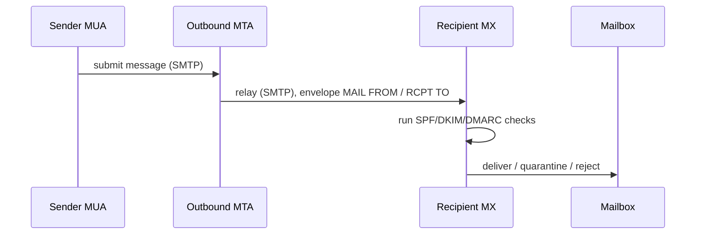
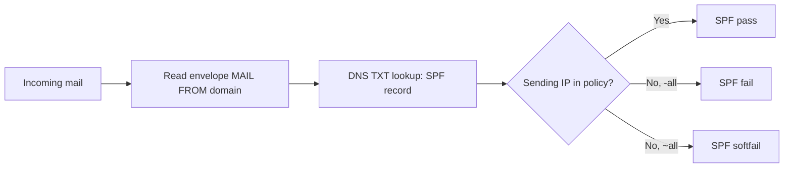
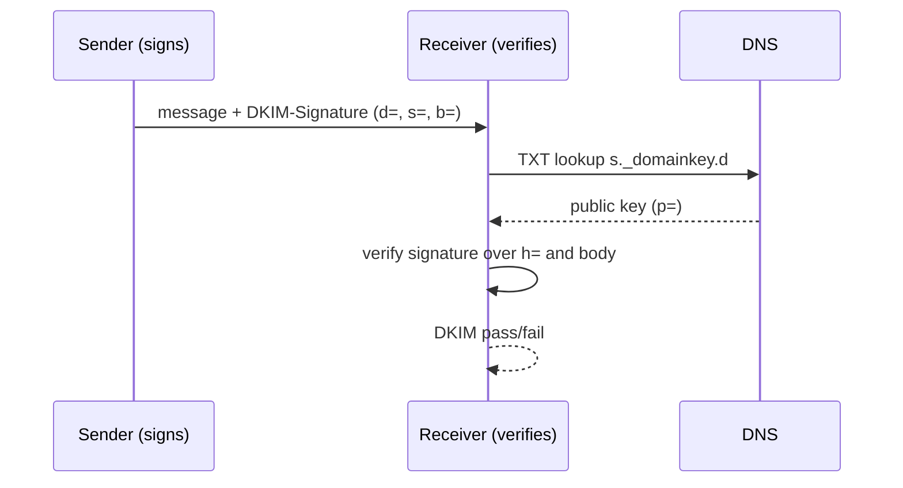
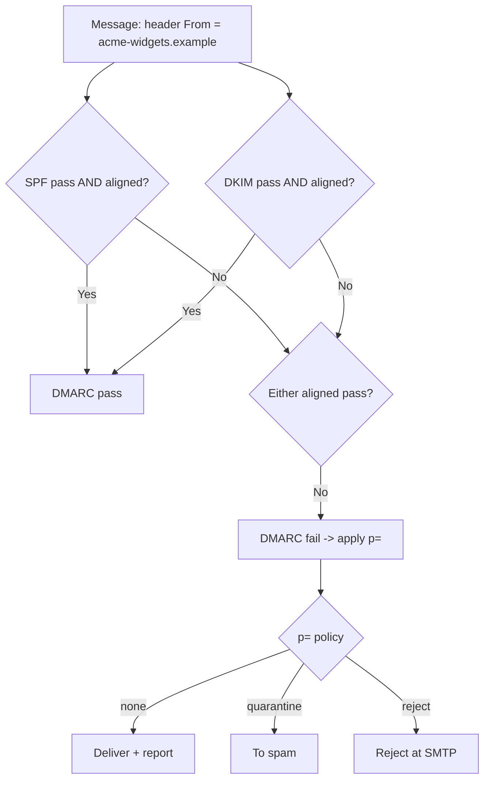
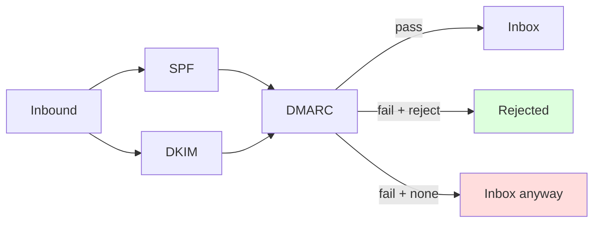
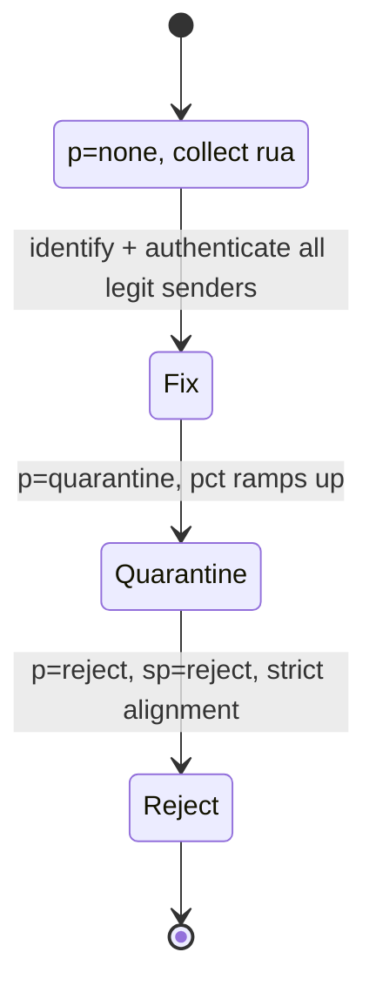
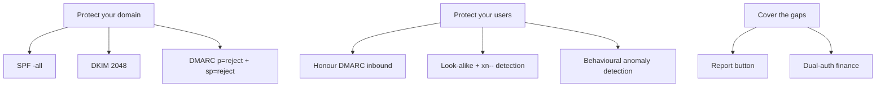
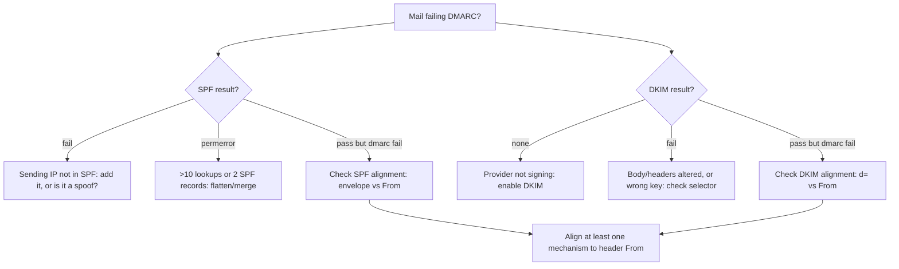

**Level:** Intermediate · **Track:** Red Team · **Read time:** 175 min

This is Chapter 4 of the Social Engineering series. Chapter 3 built the phishing email as an artefact and repeatedly deferred one question to here: *why does a spoofed sender sometimes land in the inbox and sometimes get rejected?* The answer is the email-authentication stack — SPF, DKIM, and DMARC — and it is the single most important technical topic for both phishing operators and email defenders.

This chapter is unusually mechanical for the Social Engineering track, and deliberately so. To spoof, to prevent spoofing, and to triage a phish, you must understand exactly how email is authenticated (or not). We start from how a message physically flows across the internet, then build each authentication pillar from zero, then show how they combine — and where they fail.

Everything here is for authorised testing and defensive hardening. You publish and test records on domains you own or are contracted to assess. The ethics gate from Chapter 1 applies.

---

## Part 1: How Email Actually Flows

Email predates almost every security control it now carries. It was designed in an era of mutual trust, which is why *anyone can claim to be anyone* unless authentication is layered on top.

A message travels via **SMTP** (Simple Mail Transfer Protocol). The key actors:

- **MUA (Mail User Agent)** — the client (Outlook, a script) that composes and submits mail.
- **MSA / MTA (Mail Submission / Transfer Agent)** — servers that accept and relay mail toward the destination.
- **MX (Mail Exchanger)** — the destination domain's inbound mail server, found via a DNS `MX` record.
- **MDA (Mail Delivery Agent)** — delivers into the recipient's mailbox.



The crucial, non-obvious fact: SMTP has **two** "from" identities, and they are independent.

- **Envelope sender (`MAIL FROM`, aka Return-Path)** — used for routing and bounces. The recipient never normally sees it.
- **Header From (`From:`)** — what the mail client *displays* to the user.

Nothing in base SMTP forces these to match, or forces either to match the server actually sending. That gap is the root of email spoofing, and SPF/DKIM/DMARC exist precisely to close it.

---

## Part 2: The Two "From" Addresses — the Heart of Spoofing

Understanding the envelope-vs-header split is the whole game. Consider a raw SMTP conversation:

```
HELO evil.example
MAIL FROM:<bounce@evil.example>        <-- envelope sender (Return-Path)
RCPT TO:<t.mendes@acme-widgets.example>
DATA
From: "Jane Okoro, CEO" <jane@acme-widgets.example>   <-- header From (displayed)
Subject: Urgent
...
```

Here the **envelope** sender is `evil.example` but the **displayed** From is `acme-widgets.example`. Base SMTP happily delivers this. The recipient sees "Jane Okoro, CEO <jane@acme-widgets.example>" — a perfect spoof.

The three authentication pillars each bind a *different* identity:

| Pillar | What it checks | Which identity |
|---|---|---|
| **SPF** | Is the sending IP authorised for the envelope domain? | Envelope (`MAIL FROM`) |
| **DKIM** | Is the message cryptographically signed by a domain? | The `d=` signing domain |
| **DMARC** | Does an SPF- or DKIM-passing identity *align* with the header From? | Header `From:` |

The subtle, essential point: **SPF and DKIM don't protect the address the user sees — the header From. DMARC is what ties a passing check back to the displayed From.** That's why DMARC is the linchpin, and why SPF or DKIM alone do not stop header-From spoofing.

---

## Part 3: SPF — Sender Policy Framework, From Zero

**SPF** lets a domain publish, in DNS, the list of IPs/servers authorised to send mail using that domain in the **envelope** sender. The receiving MX looks up the envelope domain's SPF record and checks whether the connecting IP is allowed.

An SPF record is a DNS `TXT` record on the domain:

```
v=spf1 ip4:198.51.100.0/24 include:spf.protection.outlook.com include:_spf.google.com -all
```

Breaking it down:

- `v=spf1` — version marker (always first).
- `ip4:198.51.100.0/24` — authorise this IP range.
- `include:spf.protection.outlook.com` — also trust the IPs in Microsoft's SPF (delegation to a provider).
- `include:_spf.google.com` — likewise for Google.
- `-all` — the **qualifier** for everything else: hard fail.

The final qualifier is the most security-relevant token:

| Mechanism | Meaning | Effect on non-listed senders |
|---|---|---|
| `-all` | Hard fail | Reject/mark — strongest |
| `~all` | Soft fail | Accept but mark suspicious |
| `?all` | Neutral | No opinion — effectively open |
| `+all` | Pass everything | Never use — authorises the world |

**SPF's limitations (why it isn't enough on its own):**

- It authenticates the **envelope** domain, not the visible **header From** — so it doesn't stop header-From spoofing by itself.
- It **breaks on forwarding**: when a message is forwarded, the forwarder's IP sends it, failing the original domain's SPF (mitigated by ARC, Part 9).
- The **10-DNS-lookup limit**: an SPF record that triggers more than 10 DNS lookups (via chained `include:`) is invalid (`permerror`) — a common real-world misconfiguration that silently breaks authentication.



**Blue team usage:** publish SPF with `-all`, keep it under 10 lookups (flatten if needed), and include *only* the providers you actually send through. **Red team usage:** an SPF that ends in `?all`/`+all`, or has `permerror` from too many lookups, is a green light for envelope spoofing.

---

## Part 4: DKIM — DomainKeys Identified Mail, From Zero

**DKIM** adds a cryptographic signature to outbound mail. The sending server signs selected headers and the body with a **private key**; the corresponding **public key** is published in DNS. The receiver fetches the public key and verifies the signature — proving the message was authorised by the signing domain and wasn't altered in transit.

A DKIM signature appears as a header:

```
DKIM-Signature: v=1; a=rsa-sha256; c=relaxed/relaxed;
    d=acme-widgets.example; s=selector1;
    h=from:to:subject:date; bh=<body-hash>;
    b=<signature>
```

Key fields:

- `d=` — the **signing domain** (this is what DMARC will check for alignment).
- `s=` — the **selector**, which names *which* public key to fetch (a domain can rotate keys with different selectors).
- `h=` — the list of headers covered by the signature.
- `bh=` — the body hash.
- `b=` — the actual signature.

The public key lives at `<selector>._domainkey.<domain>`:

```
selector1._domainkey.acme-widgets.example  TXT
"v=DKIM1; k=rsa; p=MIGfMA0GCSqGSIb3DQEBAQUAA4GNADCBiQKBgQ..."
```

Verification flow:



**DKIM's properties:**

- **Survives forwarding** (unlike SPF) as long as the signed headers/body aren't modified — which is why mailing lists that alter subjects/bodies can still break it.
- Proves **integrity** (tamper-evidence) and **domain authorisation**, but on its own still doesn't bind to the visible From — DMARC does that.
- **Key length matters:** 1024-bit RSA is legacy/weak; 2048-bit is the modern minimum. Rotating selectors periodically limits exposure.

**Blue team usage:** enable DKIM for every sending service, use ≥2048-bit keys, rotate selectors, and confirm each provider signs with a `d=` that can align to your domain. **Red team usage:** a domain with **no DKIM** (`dkim=none`) is relying on SPF alone, which forwarding and header-From spoofing can defeat.

---

## Part 5: DMARC — the Linchpin, From Zero

**DMARC** (Domain-based Message Authentication, Reporting & Conformance) ties SPF and DKIM to the **header From** via **alignment**, tells receivers what to do on failure, and requests **reports**. It is the control that actually stops someone spoofing your visible domain.

A DMARC record is a `TXT` at `_dmarc.<domain>`:

```
_dmarc.acme-widgets.example  TXT
"v=DMARC1; p=reject; sp=reject; adkim=s; aspf=s;
 rua=mailto:dmarc-agg@acme-widgets.example;
 ruf=mailto:dmarc-forensic@acme-widgets.example; pct=100; fo=1"
```

Fields:

- `p=` — **policy** for the domain: `none` (monitor), `quarantine` (spam folder), or `reject` (block). This is the security dial.
- `sp=` — policy for **subdomains**.
- `adkim=` / `aspf=` — **alignment** mode: `r` (relaxed, allows subdomain matches) or `s` (strict, exact match).
- `rua=` — where to send **aggregate** reports (daily rollups).
- `ruf=` — where to send **forensic/failure** reports (per-message, privacy-sensitive).
- `pct=` — percentage of mail the policy applies to (for gradual rollout).
- `fo=` — forensic reporting options.

### Alignment — the concept that makes DMARC work

DMARC passes if **at least one** of SPF or DKIM both *passes* **and** *aligns* with the header From domain:

- **SPF alignment:** the envelope (`MAIL FROM`) domain matches the header From domain (relaxed allows a shared organisational domain; strict requires exact).
- **DKIM alignment:** the DKIM `d=` domain matches the header From domain.

So a message can have SPF pass on `mailer-southbay.example` (the sender's own domain) yet **fail DMARC** for `acme-widgets.example` because that SPF pass doesn't *align* with the displayed From. This is exactly why the spoof in Chapter 3's header teardown failed DMARC despite the message being technically "sent" correctly by the attacker's own infrastructure.



### The policy ladder

| Policy | Effect | Use |
|---|---|---|
| `p=none` | Monitor only; deliver failing mail | Roll-out phase — collect `rua` data first |
| `p=quarantine` | Failing mail to spam | Intermediate hardening |
| `p=reject` | Failing mail blocked at SMTP | The goal — stops exact-domain spoofing |

The single most common real-world failure — seen repeatedly in this notebook's recon labs — is a domain **stuck at `p=none`**. Monitoring is not enforcement: `p=none` means a perfect exact-domain spoof is *delivered*. The remediation, always, is to progress to `p=reject`.

---

## Part 6: Putting It Together — What Actually Happens on Receipt

When mail arrives, the receiver evaluates all three and writes the verdict into `Authentication-Results`:

```
Authentication-Results: mx.acme-widgets.example;
    spf=pass smtp.mailfrom=acme-widgets.example;
    dkim=pass header.d=acme-widgets.example;
    dmarc=pass (p=reject) header.from=acme-widgets.example
```

That's a fully authenticated, aligned message. Compare the spoof:

```
Authentication-Results: mx.acme-widgets.example;
    spf=fail smtp.mailfrom=mailer-southbay.example;
    dkim=none;
    dmarc=fail (p=reject) header.from=acme-widgets.example
```

With `p=reject`, that second message is **rejected at SMTP** — the spoof never reaches the inbox. With `p=none` it is delivered. Reading these three verdicts is the core analyst skill of the chapter.



---

## Part 7: What DMARC Does *Not* Stop

DMARC at `p=reject` is powerful but bounded. Operators exploit exactly these gaps; defenders must layer controls to cover them.

- **Look-alike / cousin domains.** DMARC protects *your* domain, not domains that merely *look* like it. `acme-widgets-support.com` has its own (attacker-controlled) DMARC and passes its own checks. Defence: brand/impersonation detection, look-alike monitoring, user training.
- **Display-name spoofing.** "Jane Okoro, CEO" over a Gmail address passes DMARC for gmail.com. The *display name* lies; the domain is honest. Defence: executive-impersonation detection, external-sender banners.
- **Compromised legitimate accounts.** Mail from a genuinely compromised mailbox passes all authentication because it *is* authentic. Defence: behavioural/anomaly detection, impossible-travel, new-inbox-rule alerts.
- **Subdomain abuse when `sp=` is weak.** If `sp=none`, unprotected subdomains can be spoofed. Defence: set `sp=reject`.
- **Homoglyph domains.** Register with Unicode look-alikes; they have their own valid DMARC. Defence: punycode display, block `xn--` senders.

| Attack | Beaten by DMARC `p=reject`? | Real counter |
|---|---|---|
| Exact-domain spoof | **Yes** | DMARC itself |
| Look-alike domain | No | Impersonation detection, monitoring |
| Display-name spoof | No | Exec-impersonation rules, banners |
| Compromised account | No | Behavioural anomaly detection |
| Subdomain spoof (`sp=none`) | No | `sp=reject` |
| Homoglyph/IDN | No | Punycode display, `xn--` blocking |

The lesson mirrors Chapter 3: authentication closes the *exact-domain* door, but the *human-perception* doors (look-alikes, display names) need separate locks.

---

## Part 8: BIMI and the Brand-Trust Layer

**BIMI (Brand Indicators for Message Identification)** lets a domain that enforces DMARC (`p=quarantine`/`reject`) publish a logo that supporting clients display next to authenticated mail. It is a *reward* for strong authentication and a subtle anti-spoofing signal (users learn to expect the verified logo).

A BIMI record:

```
default._bimi.acme-widgets.example  TXT
"v=BIMI1; l=https://acme-widgets.example/logo.svg; a=https://acme-widgets.example/vmc.pem"
```

- `l=` — URL of the brand logo (a specific SVG profile).
- `a=` — optional Verified Mark Certificate (VMC) proving trademark ownership; some clients require it.

BIMI doesn't add authentication strength on its own — it *requires* DMARC enforcement first — but it increases the visible payoff of doing DMARC right and gives users a positive signal, complementing the negative "external sender" banners.

---

## Part 9: ARC — Fixing Authentication Across Forwarders

**ARC (Authenticated Received Chain)** addresses SPF/DKIM breakage when mail is legitimately forwarded (mailing lists, forwarding rules). Each intermediary can record the authentication results it saw and sign that record, so the final receiver can trust the *original* verdict even though SPF now fails on the forwarder's IP and the body may have been altered.

ARC headers (`ARC-Seal`, `ARC-Message-Signature`, `ARC-Authentication-Results`) form a chain the final MX can validate. ARC is why a DMARC-enforcing domain's newsletter can still be trusted after passing through a list server that rewrites the subject.

For this chapter's purposes: ARC explains why some forwarded mail that "should" fail DMARC is still delivered, and it's a piece defenders configure on their own forwarders to avoid breaking others' DMARC.

---

## Part 10: Hands-On Lab — Publish, Break, and Test Email Auth on Your Own Domain

**Objective:** on a domain you own (or a test tenant), publish SPF/DKIM/DMARC, verify them, then read the resulting `Authentication-Results` — building the exact skill you'll use to both harden a client and triage a phish. Everything is on your own infrastructure.

### Step 1 — Inspect a target's current posture (recon recap)

```bash
# SPF
dig +short TXT acme-widgets.example | grep -i spf
# DKIM (need the selector; common ones: selector1, google, default)
dig +short TXT selector1._domainkey.acme-widgets.example
# DMARC
dig +short TXT _dmarc.acme-widgets.example
# MX (mail provider fingerprint)
dig +short MX acme-widgets.example
```

Illustrative output for a weak posture:

```
"v=spf1 include:spf.protection.outlook.com ~all"   # softfail, not hard fail
(no DKIM record at selector1)                        # dkim=none
"v=DMARC1; p=none; rua=mailto:dmarc@acme-widgets.example"   # monitor only
```

Three findings in one screen: SPF is only `~all`, DKIM is missing at the tested selector, and DMARC is `p=none`. This domain is spoofable.

### Step 2 — Publish a strong posture on your own domain

On a domain you control, add DNS TXT records (via your DNS provider). Example for a domain sending only via Microsoft 365:

```
# SPF
@   TXT  "v=spf1 include:spf.protection.outlook.com -all"

# DKIM (M365 publishes CNAMEs to Microsoft-hosted keys)
selector1._domainkey  CNAME  selector1-yourdomain._domainkey.<tenant>.onmicrosoft.com
selector2._domainkey  CNAME  selector2-yourdomain._domainkey.<tenant>.onmicrosoft.com

# DMARC (start at none to collect data, then tighten)
_dmarc  TXT  "v=DMARC1; p=none; rua=mailto:dmarc@yourdomain.example; pct=100"
```

### Step 3 — Validate the records

```bash
dig +short TXT yourdomain.example | grep spf
dig +short TXT _dmarc.yourdomain.example
# Send a message to a mail-tester service and read the score/report
# (many free services email you a per-check breakdown)
```

### Step 4 — Read the Authentication-Results

Send yourself a message and open the raw headers. A correctly configured domain shows:

```
Authentication-Results: ...;
    spf=pass smtp.mailfrom=yourdomain.example;
    dkim=pass header.d=yourdomain.example;
    dmarc=pass (p=none) header.from=yourdomain.example
```

### Step 5 — Break it deliberately, and observe

Change SPF to `~all`, remove DKIM alignment, or send from an unauthorised IP, and watch the verdicts flip to `softfail`/`none`/`fail`. Seeing the header change in response to each record teaches the mechanics better than any diagram.

### Step 6 — Analyse aggregate (rua) reports

After a day at `p=none`, your `rua` mailbox receives XML aggregate reports from major receivers summarising which IPs sent mail claiming your domain and whether they passed. This is how you discover *legitimate* senders (a marketing platform, a helpdesk tool) before you tighten to `reject` — the entire point of the `none` phase.

```xml
<record>
  <row><source_ip>203.0.113.7</source_ip><count>48</count>
    <policy_evaluated><disposition>none</disposition>
      <dkim>fail</dkim><spf>fail</spf></policy_evaluated></row>
  <identifiers><header_from>yourdomain.example</header_from></identifiers>
</record>
```

Interpretation: 48 messages from `203.0.113.7` claimed your domain and failed both checks — either an unconfigured legitimate sender to fix, or spoofing to block once you move to `reject`.

### Step 7 — Progress to enforcement

Once `rua` data confirms all legitimate senders pass and align, tighten `pct` upward and move `p=none` → `p=quarantine` → `p=reject`, adding `sp=reject` and strict alignment. That progression is the deliverable: a domain that can no longer be exact-domain spoofed.

---

## Part 11: The DMARC Roll-Out Methodology (Defender Playbook)

Moving straight to `p=reject` without data risks blocking legitimate mail (payroll systems, CRMs, ticketing tools that send "as" your domain). The safe, standard progression:



1. **Monitor (`p=none`).** Publish DMARC with `rua`. Change nothing else. Collect 2–4 weeks of aggregate reports.
2. **Inventory senders.** From `rua`, list every source sending as your domain. Authenticate the legitimate ones (add them to SPF, enable DKIM at the provider).
3. **Quarantine with `pct`.** Move to `p=quarantine; pct=10`, ramping to 100 while watching for false positives.
4. **Reject.** Move to `p=reject`, set `sp=reject`, and tighten alignment. Keep `rua` on forever for ongoing visibility.

This methodology is a common interview and audit topic; being able to describe it — and why the `none` phase is mandatory rather than a sign of weakness — demonstrates real operational maturity.

---

## Part 12: Deliverability and Reputation (Both Faces of the Coin)

The same records that stop spoofing also determine whether *legitimate* mail reaches the inbox. Operators running authorised campaigns care about this; defenders exploit it to suppress malicious mail.

Deliverability drivers:

- **Authentication:** aligned SPF/DKIM/DMARC passes improve placement; failures hurt or block.
- **Domain & IP reputation:** history of good sending; new domains/IPs are distrusted (hence attacker domain *aging* and *warming*).
- **Engagement & complaints:** opens/replies help; spam complaints and spam-trap hits devastate reputation.
- **Content & structure:** balanced text/HTML, valid links, no spam-trigger patterns.
- **List hygiene:** bounces and invalid recipients signal a low-quality sender.

**Red team usage:** for an *authorised* campaign, correct DNS auth on the sending domain maximises inbox placement so metrics reflect human behaviour, not spam filtering. **Blue team usage:** feed user "report phish" signals back into filtering, block newly-registered/low-reputation domains, and enforce DMARC so unauthenticated mail claiming partners is dropped.

---

## Part 13: Reading Headers — Analyst Deep Dive

Consolidating the analyst skill: given any message, extract and interpret the authentication story.

Checklist:

1. **`From:`** — note display name and actual address; mismatch or look-alike?
2. **`Return-Path` / `smtp.mailfrom`** — does the envelope domain match From (SPF alignment)?
3. **`DKIM-Signature d=`** — does the signing domain align with From?
4. **`Authentication-Results`** — the three verdicts and the DMARC policy in effect.
5. **First (bottom) `Received`** — the true origin IP/host.
6. **`Reply-To`** — does it diverge (BEC signal)?

Worked interpretation:

```
From: "Payroll" <payroll@acme-widgets.example>
Return-Path: <noreply@bulkmail-xyz.example>
DKIM-Signature: d=bulkmail-xyz.example; s=k1; ...
Authentication-Results: spf=pass smtp.mailfrom=bulkmail-xyz.example;
    dkim=pass header.d=bulkmail-xyz.example;
    dmarc=fail (p=reject) header.from=acme-widgets.example
```

Read: SPF and DKIM both **pass** — but for `bulkmail-xyz.example`, which does **not align** with the header From `acme-widgets.example`, so **DMARC fails** and (at `p=reject`) the mail is rejected. This is the classic "a legitimate-looking bulk sender not authorised for the brand" case — either a misconfigured marketing tool to fix, or an impersonation to block. Alignment, not raw pass/fail, is what decides.

---

## Part 14: Real-World Cases and CVE-Class Issues

- **Widespread `p=none` exposure.** Repeated studies of large domain populations find a majority publishing DMARC at `p=none` or no DMARC at all — meaning exact-domain spoofing of those brands is delivered. This is the most common *systemic* email-security gap.
- **SPF 10-lookup `permerror`.** Organisations chaining many `include:` entries silently exceed the 10-lookup limit, invalidating SPF and weakening DMARC — a frequent, quiet misconfiguration.
- **Mailsploit (2017).** A class of bugs in how clients decoded/encoded From headers let attackers spoof the *displayed* address while passing DMARC in some clients — a reminder that parsing bugs can undercut the model.
- **Forwarding-related DMARC failures.** Legitimate mailing lists breaking SPF/DKIM (before ARC adoption) taught the industry why the `none`→`reject` roll-out and ARC matter.
- **Look-alike/BEC dominance.** Because DMARC closed the exact-domain door for well-configured brands, attackers pivoted to look-alike domains and display-name spoofing — the reason Parts 7 and Chapter 3 stress non-DMARC controls.

For each, be able to state the mechanism and the fix — the exact reasoning an email-security audit or interview probes.

---

## Part 15: Detection & Defense Angle

Because this whole chapter is defensive-technical, we consolidate the operational checklist a defender implements.

**Authenticate outbound (stop others spoofing you):**

- SPF with `-all`, under 10 lookups, listing only real senders.
- DKIM on every sending service, ≥2048-bit, selectors rotated.
- DMARC rolled `none`→`quarantine`→`reject`, with `sp=reject` and `rua` monitoring kept on permanently.
- BIMI once enforcing, for a positive user signal.

**Authenticate inbound (stop spoofed mail reaching users):**

- Honour DMARC on inbound (reject/quarantine failing mail per sender policy).
- Impersonation/look-alike detection; newly-registered-domain and `xn--` blocking.
- External-sender banners; exec-name impersonation rules.
- Behavioural detection for compromised-account sends (impossible travel, new rules, mass sends).

**Human + process (cover what auth can't):**

- Report-phish button + no-blame culture (Chapter 11).
- Out-of-band verification + dual-auth for payments (defeats BEC that passes DMARC via free-mail/display-name).



---

## Part 16: Final Revision / Summary

- Email has **two From addresses** — envelope (`MAIL FROM`) and header (`From:`) — and base SMTP forces neither to be truthful. That gap is spoofing.
- **SPF** authenticates the *envelope* domain against sending IPs (DNS TXT, end with `-all`); breaks on forwarding; 10-lookup limit.
- **DKIM** cryptographically signs mail (`d=` signing domain, `s=` selector, public key in DNS); survives forwarding; proves integrity + domain authorisation.
- **DMARC** ties an SPF- or DKIM-passing identity to the visible **header From** via **alignment**, sets a **policy** (`none`/`quarantine`/`reject`), and requests **reports** (`rua`/`ruf`). It is the linchpin.
- **Alignment**, not raw pass, decides DMARC — a passing SPF/DKIM for a non-aligned domain still fails DMARC.
- **`p=none` is monitoring, not protection**; the goal is `p=reject` (+ `sp=reject`), reached via the `none`→`quarantine`→`reject` roll-out using `rua` data.
- DMARC stops **exact-domain** spoofing but **not** look-alikes, display-name spoofing, compromised accounts, or homoglyphs — those need impersonation detection, behavioural analytics, and process controls.
- **BIMI** rewards DMARC enforcement; **ARC** preserves authentication across forwarders.
- The same records drive **deliverability** — auth is simultaneously a legit-sender tool and the anti-spoofing control.

Memory hook — **"Envelope routes, Header shows, DMARC aligns the two; none just watches, reject blocks — align or it won't do."**

---

## Part 17: Cheat Sheet / Quick Reference

**Recon a domain's posture:**

```bash
dig +short TXT DOMAIN | grep -i spf
dig +short TXT selector1._domainkey.DOMAIN
dig +short TXT _dmarc.DOMAIN
dig +short MX DOMAIN
```

**SPF:** `v=spf1 include:... -all` — `-all` hard fail, `~all` soft, `?all`/`+all` open. Keep < 10 lookups.

**DKIM:** `DKIM-Signature: d=<domain>; s=<selector>; b=<sig>` → key at `<selector>._domainkey.<domain>`; ≥2048-bit.

**DMARC:** `v=DMARC1; p=reject; sp=reject; adkim=s; aspf=s; rua=mailto:...; pct=100` at `_dmarc.<domain>`.

**Alignment:** DMARC passes if SPF **or** DKIM passes **and** aligns to header From.

**Policy ladder:** `none` (monitor) → `quarantine` (spam) → `reject` (block).

**Authentication-Results verdicts:** `spf=pass/fail`, `dkim=pass/none`, `dmarc=pass/fail (p=...)`.

**DMARC does NOT stop:** look-alike domains · display-name spoofing · compromised accounts · homoglyphs · subdomains if `sp=none`.

**Roll-out:** publish `p=none` + `rua` → inventory senders → `quarantine` w/ `pct` → `reject` + `sp=reject`.

---

## Part 18: Practice Labs & Resources

- **TryHackMe — "Phishing Analysis Fundamentals" / "Phishing Analysis Tools"**: read `Authentication-Results` and headers on real samples.
- **dmarcian, MXToolbox, Google Admin Toolbox, mail-tester.com**: inspect and score SPF/DKIM/DMARC for any domain and get per-check breakdowns.
- **Your own test domain**: publish records, break them, and read the header changes — the single best exercise for this chapter.
- **RFC 7208 (SPF), RFC 6376 (DKIM), RFC 7489 (DMARC), RFC 8617 (ARC)**: the authoritative specs; skim the alignment sections of the DMARC RFC.
- **Aggregate report parsers (dmarcian, open-source XML parsers)**: turn `rua` XML into a sender inventory.
- **Self-drill:** audit five domains you use. For each, record SPF qualifier, DKIM presence, and DMARC policy, then state whether an exact-domain spoof would be delivered and the single fix.

**Practice question 1.** A message has `spf=pass` and `dkim=pass` but `dmarc=fail`. Explain how that's possible and what it usually means.

**Practice question 2.** Why does moving straight to `p=reject` without a `p=none` phase risk breaking legitimate mail, and what data prevents that?

**Practice question 3.** Which spoofing techniques does `p=reject` NOT stop, and name the control for each.

**Practice question 4.** Explain why SPF alone doesn't stop someone spoofing your visible From address.

**Practice question 5 (lab).** On a domain you own, publish SPF/DKIM/DMARC at `p=none`, send yourself mail, and paste the `Authentication-Results`; then break DKIM alignment and show the verdict change.

---

## Part 19: Worked Answers

**Answer 1.** SPF and DKIM can both pass for the *sending infrastructure's own* domain (e.g., a bulk-mail provider), but if that passing domain doesn't **align** with the header From domain, DMARC fails. It usually means a legitimate service is sending "as" your brand without being properly authorised/aligned (a marketing or ticketing tool to fix) — or an impersonation using a technically valid but non-aligned sender.

**Answer 2.** Many legitimate systems send mail using your domain in the From (payroll, CRM, helpdesk, marketing). If they aren't yet authenticated/aligned and you jump to `p=reject`, their mail is blocked — a self-inflicted outage. The `rua` aggregate reports from the `p=none` phase inventory every sender using your domain, letting you authenticate the legitimate ones *before* enforcing.

**Answer 3.** `p=reject` does not stop: look-alike/cousin domains (counter: impersonation detection + monitoring), display-name spoofing (counter: exec-impersonation rules + external banners), compromised legitimate accounts (counter: behavioural/anomaly detection), homoglyph/IDN domains (counter: punycode display + `xn--` blocking), and subdomain spoofing if `sp=none` (counter: `sp=reject`).

**Answer 4.** SPF authenticates the **envelope** (`MAIL FROM`/Return-Path) domain, which the recipient never sees, against the sending IP. The address the user actually sees is the **header From**, which SPF doesn't check. An attacker can pass SPF for their own envelope domain while displaying your domain in the header From — only DMARC alignment ties a passing check back to that visible address.

**Answer 5.** Expected result: after publishing, `Authentication-Results` shows `spf=pass`, `dkim=pass header.d=yourdomain`, `dmarc=pass (p=none)`. After removing DKIM alignment (or sending from an unauthorised IP so SPF fails), the same header shows `dmarc=fail` — demonstrating that alignment of at least one mechanism is what carries DMARC.

---

## Part 20: Glossary

- **SMTP** — the protocol email travels over; trust-by-default, hence spoofable.
- **Envelope sender (`MAIL FROM` / Return-Path)** — routing/bounce address; not normally shown.
- **Header From (`From:`)** — the displayed sender the user sees.
- **SPF** — publishes authorised sending IPs for the envelope domain (DNS TXT).
- **`-all` / `~all` / `?all` / `+all`** — SPF hard fail / soft fail / neutral / pass-all.
- **DKIM** — cryptographic signature of mail; `d=` signing domain, `s=` selector, public key in DNS.
- **DMARC** — ties SPF/DKIM to the header From via alignment; sets policy + reporting.
- **Alignment** — the header From domain matching the SPF envelope domain (aspf) or DKIM `d=` (adkim), relaxed or strict.
- **`p=` / `sp=`** — DMARC policy for the domain / subdomains: none, quarantine, reject.
- **`rua` / `ruf`** — DMARC aggregate / forensic report destinations.
- **`pct`** — percent of failing mail the policy applies to (roll-out control).
- **Authentication-Results** — the header recording spf/dkim/dmarc verdicts.
- **BIMI** — brand-logo display for DMARC-enforcing domains; may require a VMC.
- **ARC** — preserves authentication results across legitimate forwarders.
- **Look-alike / cousin domain** — a similar registered domain with its own valid auth.
- **Display-name spoofing** — forging the human-readable name over an honest address.
- **`permerror`** — SPF error, commonly from exceeding the 10 DNS-lookup limit.

---

## Part 21: Rapid Self-Test (Flashcards)

1. Q: The two From addresses in email? A: Envelope (`MAIL FROM`/Return-Path) and header (`From:`).

2. Q: Which identity does SPF authenticate? A: The envelope (`MAIL FROM`) domain.

3. Q: Which identity does DKIM tie to? A: The `d=` signing domain.

4. Q: What binds a passing check to the visible From? A: DMARC alignment.

5. Q: What does `-all` mean in SPF? A: Hard fail for any non-listed sender.

6. Q: The SPF DNS-lookup limit? A: 10 (exceeding it causes `permerror`).

7. Q: Why does SPF break on forwarding? A: The forwarder's IP sends it, failing the original domain's SPF.

8. Q: What are `d=` and `s=` in DKIM? A: Signing domain and selector (which public key to fetch).

9. Q: Minimum modern DKIM key size? A: 2048-bit RSA.

10. Q: The three DMARC policies? A: none (monitor), quarantine (spam), reject (block).

11. Q: What does `sp=` control? A: DMARC policy for subdomains.

12. Q: Relaxed vs strict alignment? A: Relaxed allows organisational/subdomain match; strict requires exact.

13. Q: What is `rua` for? A: Aggregate DMARC reports — inventory of senders using your domain.

14. Q: Why is `p=none` insufficient? A: It only monitors; exact-domain spoofs are still delivered.

15. Q: Does `p=reject` stop look-alike domains? A: No — only exact-domain spoofing.

16. Q: How does display-name spoofing pass DMARC? A: The domain (e.g., gmail.com) is honest; only the name lies.

17. Q: What does BIMI require first? A: DMARC enforcement (quarantine/reject).

18. Q: What problem does ARC solve? A: Preserving authentication results across legitimate forwarders.

19. Q: `spf=pass; dkim=pass; dmarc=fail` — why? A: The passing domain doesn't align with the header From.

20. Q: The one-line remediation for a spoofable domain? A: Roll DMARC to `p=reject` (with `sp=reject`) after a `p=none` sender inventory.

---

## Part 22: Deep Dive — Parsing DMARC Aggregate Reports

The `p=none` monitoring phase is only useful if you can *read* the `rua` reports. They arrive as gzipped XML from each major receiver. Here is how to turn them into a sender inventory — the artefact that lets you safely move to `reject`.

A single aggregate report is one XML file per receiver per day:

```xml
<feedback>
  <report_metadata>
    <org_name>google.com</org_name>
    <email>noreply-dmarc-support@google.com</email>
    <report_id>14023...</report_id>
    <date_range><begin>1737244800</begin><end>1737331200</end></date_range>
  </report_metadata>
  <policy_published>
    <domain>yourdomain.example</domain>
    <adkim>s</adkim><aspf>s</aspf>
    <p>none</p><sp>none</sp><pct>100</pct>
  </policy_published>
  <record>
    <row>
      <source_ip>203.0.113.7</source_ip>
      <count>48</count>
      <policy_evaluated><disposition>none</disposition>
        <dkim>fail</dkim><spf>fail</spf></policy_evaluated>
    </row>
    <identifiers><header_from>yourdomain.example</header_from></identifiers>
    <auth_results>
      <spf><domain>mailer-southbay.example</domain><result>pass</result></spf>
    </auth_results>
  </record>
  <record>
    <row>
      <source_ip>198.51.100.10</source_ip>
      <count>512</count>
      <policy_evaluated><disposition>none</disposition>
        <dkim>pass</dkim><spf>pass</spf></policy_evaluated>
    </row>
    <identifiers><header_from>yourdomain.example</header_from></identifiers>
  </record>
</feedback>
```

A small parser to summarise many reports into "who is sending as us and do they pass":

```python
#!/usr/bin/env python3
# Summarise DMARC aggregate reports into a sender inventory.
import sys, glob, gzip, xml.etree.ElementTree as ET
from collections import defaultdict

senders = defaultdict(lambda: {"count": 0, "pass": 0, "fail": 0})

for path in glob.glob(sys.argv[1] + "/*.xml*"):
    opener = gzip.open if path.endswith(".gz") else open
    with opener(path, "rb") as fh:
        root = ET.parse(fh).getroot()
        for rec in root.findall("record"):
            ip = rec.findtext("row/source_ip")
            cnt = int(rec.findtext("row/count", "0"))
            dkim = rec.findtext("row/policy_evaluated/dkim")
            spf = rec.findtext("row/policy_evaluated/spf")
            aligned = (dkim == "pass") or (spf == "pass")
            s = senders[ip]
            s["count"] += cnt
            s["pass" if aligned else "fail"] += cnt

print(f"{'Source IP':<18}{'Total':>8}{'Aligned':>10}{'Failing':>10}")
for ip, s in sorted(senders.items(), key=lambda x: -x[1]["count"]):
    print(f"{ip:<18}{s['count']:>8}{s['pass']:>10}{s['fail']:>10}")
```

Representative output after a week of reports:

```
Source IP           Total   Aligned   Failing
198.51.100.10         3600      3600         0    <- M365, legitimate & aligned
192.0.2.55             820       820         0    <- CRM (fixed last week)
203.0.113.7            336         0       336    <- unknown, all failing -> spoof or unconfigured
198.51.100.77          140         0       140    <- payroll tool, needs DKIM
```

Interpretation drives action: the two aligned senders are safe; the payroll tool needs DKIM before you enforce; and `203.0.113.7` failing everything is either an unconfigured legit sender to fix or spoofing to block. **You do not move to `p=reject` until every legitimate row shows aligned.** This script *is* the readiness gate.

---

## Part 23: Common Misconfiguration Gallery

The failures below appear constantly in real audits. Each is a finding to report with a one-line fix.

| Misconfiguration | Symptom | Fix |
|---|---|---|
| DMARC `p=none` left in place | Exact-domain spoofing delivered | Progress to `p=reject` after inventory |
| No DMARC record at all | No policy; brand freely spoofable | Publish `_dmarc` starting at `p=none` |
| `sp=none` (or omitted with weak default) | Subdomains spoofable | Add `sp=reject` |
| SPF `~all` instead of `-all` | Spoofs soft-fail, often delivered | Use `-all` once senders inventoried |
| SPF > 10 lookups | `permerror`, SPF ignored | Flatten `include:` chains (Part 24) |
| Multiple SPF records | Invalid (`permerror`) | Merge into a single TXT |
| Missing DKIM on a sending service | `dkim=none`, weaker DMARC | Enable DKIM at that provider |
| 1024-bit DKIM key | Weak signature | Rotate to ≥2048-bit |
| DMARC without `rua` | No visibility | Add `rua=mailto:` |
| `ruf` to a mailbox with no privacy handling | Leaks message data (PII) | Use cautiously; prefer `rua` |
| Trailing typo in TXT (quoting/spacing) | Record silently ignored | Validate with a checker |

**Blue team usage:** run this gallery as a checklist against your own and your partners' domains quarterly. **Red team usage:** each row is an opening — a `~all` + `p=none` + no-DKIM domain is trivially spoofable and worth flagging in the engagement.

---

## Part 24: SPF Flattening and the 10-Lookup Trap

The 10-DNS-lookup limit is subtle and bites big organisations. Each `include:`, `a`, `mx`, `ptr`, and `exists` mechanism costs lookups, and nested `include:`s multiply. Exceed 10 and receivers return `permerror`, effectively disabling SPF — which then weakens DMARC (one of its two legs is gone).

Example of a record that *looks* fine but exceeds the limit:

```
v=spf1 include:spf.protection.outlook.com include:_spf.google.com
       include:sendgrid.net include:mailgun.org include:servers.mcsv.net
       include:_spf.salesforce.com include:amazonses.com -all
```

Each `include:` may itself expand to several nested lookups; together they blow past 10.

Mitigations:

- **Flattening:** resolve the `include:` chains to their underlying IP ranges and publish those `ip4:`/`ip6:` directly (fewer lookups), re-flattening periodically as providers change IPs (automated services exist for this).
- **Consolidation:** send through fewer services; remove stale `include:`s for tools you no longer use.
- **Subdomain delegation:** send bulk/marketing mail from a subdomain with its own SPF, keeping the primary domain's record lean.

**Trade-off:** flattening trades maintainability (you must track provider IP changes) for staying under the limit. The clean long-term answer is usually fewer senders plus subdomain delegation, not endless flattening.

---

## Part 25: MITRE ATT&CK & Standards Mapping

| Reference | Item | Relevance |
|---|---|---|
| **ATT&CK T1656** | Impersonation | Spoofing/BEC this chapter's controls target |
| **ATT&CK T1585/T1583.001** | Establish/Acquire domains | Look-alike domain registration DMARC can't stop |
| **ATT&CK T1566** | Phishing | The delivery this authentication defends |
| **RFC 7208** | SPF | Envelope authentication |
| **RFC 6376** | DKIM | Signature authentication |
| **RFC 7489** | DMARC | Alignment, policy, reporting |
| **RFC 8617** | ARC | Forwarding preservation |
| **RFC 8616** | BIMI-adjacent / internationalisation | IDN/homoglyph awareness |

Mapping the domain's posture to these lets an auditor cross-reference detection coverage and compliance requirements (many frameworks now expect DMARC enforcement).

---

## Part 26: Troubleshooting Playbook

When mail is failing authentication (legitimately or in an audit), work through this decision tree.



Field checklist, in order:

1. **Confirm the exact records** with `dig +short TXT` for SPF, the selector, and `_dmarc`. Typos, smart quotes, and duplicate records silently break everything — validate with a checker.
2. **Reproduce the verdict** by sending a test message and reading `Authentication-Results`. Never debug from assumptions; read the header.
3. **Isolate which leg fails.** If SPF fails, is the IP missing or is it a spoof? If DKIM is `none`, the provider isn't signing.
4. **Check alignment, not just pass.** A pass that doesn't align to the header From still fails DMARC — the most common "but SPF passes!" confusion.
5. **Count SPF lookups** to rule out `permerror`; flatten or consolidate if over 10.
6. **Verify selector and key.** DKIM `fail` often means the wrong selector is published or the key was rotated without updating DNS.
7. **Only then adjust policy.** Fix senders first; tighten `p=` last, using `rua` to confirm readiness.

**Analyst tip:** keep a saved query set and a reference table of your organisation's legitimate senders and their aligning domains. Triage then becomes "is this sender on the known list and aligned?" — a two-second decision instead of a research project.

This playbook is the practical payoff of the whole chapter: given any authentication failure — an audit finding, a blocked newsletter, or a reported phish — you can locate the exact broken leg and name the fix.

---

## Part 27: Key Numbers & Facts to Memorise

A compact recall set — the specifics interviewers and audits expect you to know cold.

- SPF lives in a **DNS TXT** record; only **one** SPF record per domain is valid.
- SPF has a hard limit of **10 DNS lookups**; exceeding it is `permerror` and voids SPF.
- SPF qualifier strengths: `-all` (hard fail) > `~all` (soft) > `?all` (neutral) > `+all` (never use).
- DKIM public key lives at `<selector>._domainkey.<domain>`; modern keys are **≥2048-bit RSA**.
- DMARC lives at `_dmarc.<domain>`; policies are **none / quarantine / reject**.
- DMARC passes if **SPF *or* DKIM** both passes **and** aligns to the header From.
- **Alignment modes:** `r` relaxed (organisational match) or `s` strict (exact).
- `sp=` sets the **subdomain** policy; omit it and subdomains may be under-protected — set `sp=reject`.
- `rua` = **aggregate** reports (safe, daily rollups); `ruf` = **forensic** per-message (PII-sensitive).
- The standard roll-out is **none → quarantine → reject**, gated by `rua` sender inventory.
- **`p=none` = monitoring, not protection.** Exact-domain spoofs are delivered under `p=none`.
- DMARC stops **exact-domain** spoofing only — not look-alikes, display-name spoofing, compromised accounts, or homoglyphs.
- **BIMI** requires DMARC enforcement first; a **VMC** may be required to show the logo.
- **ARC** preserves original authentication results across legitimate forwarders.
- Relevant RFCs: **7208 (SPF), 6376 (DKIM), 7489 (DMARC), 8617 (ARC)**.

If you can reproduce this list from memory and explain *why* each holds, you understand email authentication well enough to both harden a domain and exploit a weak one in an authorised test.

### The 30-second spoofability verdict

Given any domain, deliver a verdict in five checks:

1. Does a DMARC record exist at `_dmarc.<domain>`? No → **highly spoofable**.
2. Is the DMARC policy `p=reject` or `p=quarantine`? `p=none` → **exact-domain spoofable**.
3. Is `sp=reject` set (or subdomains otherwise covered)? No → **subdomains spoofable**.
4. Does SPF end in `-all` and stay under 10 lookups? `~all`/`permerror` → **weakened**.
5. Is DKIM present and aligning? Missing → **DMARC leans on SPF alone**.

A domain that passes all five resists exact-domain spoofing (but still needs look-alike and display-name defences). A domain failing checks 1–2 should be the top line of your engagement report — and the first thing a defender fixes.

Practise the verdict until it's automatic: run the three `dig` queries, glance at the qualifier and policy, and state "spoofable / partially hardened / hardened" with the one fix that moves it up a tier. That fluency — turning three DNS records into a risk statement and a remediation in under a minute — is the concrete, portable skill this chapter exists to build, and it feeds directly into the tooling of the chapters that follow.

**Carry-forward to the tooling chapters:** when you stand up authorised phishing infrastructure (Chapters 5 and 6), you will publish SPF/DKIM/DMARC on *your* sending domain to maximise deliverability of the test, and you will read the recipient's posture to decide between exact-domain spoofing (viable only against `p=none`) and a look-alike domain. Everything you built here is the substrate those chapters run on.

Before moving on, do the Part 10 lab on a domain you own — publishing, breaking, and reading these records once teaches more than re-reading this chapter twice.

In the next chapter we pick up the tooling that turns these concepts into a live credential-harvest capability: **The Social-Engineer Toolkit (SET) & Credential Harvesters.**

---

*Also on [Praneeth's portfolio](https://ping-praneeth.vercel.app/notebook/redteam-social-engineering/04-email-spoofing-spf-dkim-dmarc-and-deliverability), with comments and the latest edits.*
