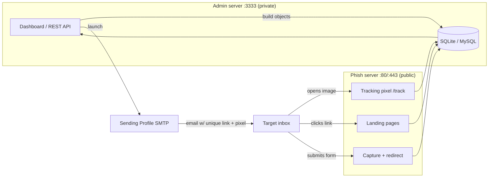
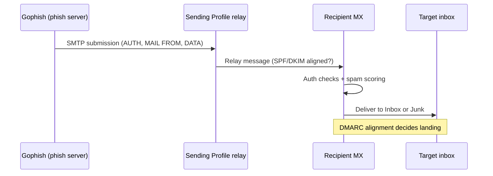
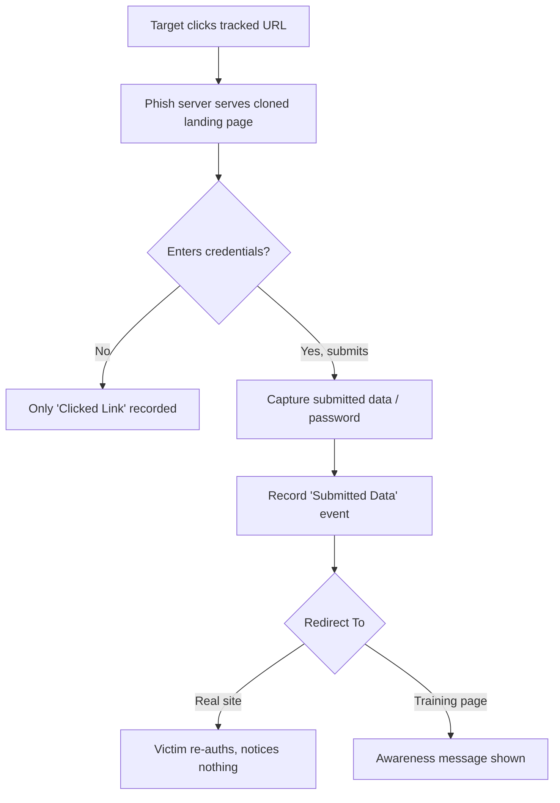
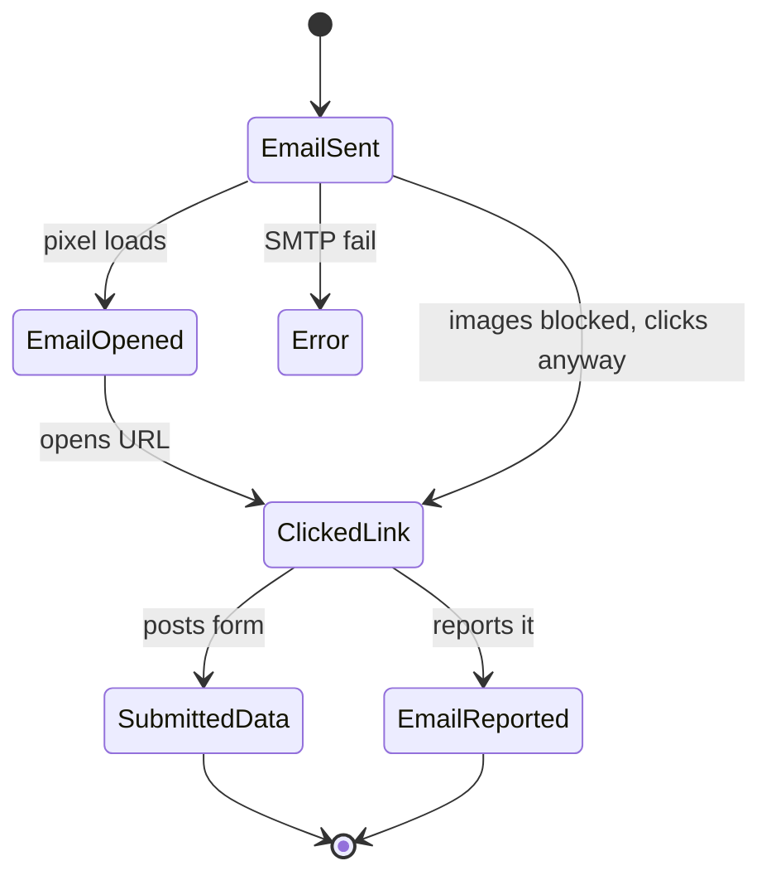
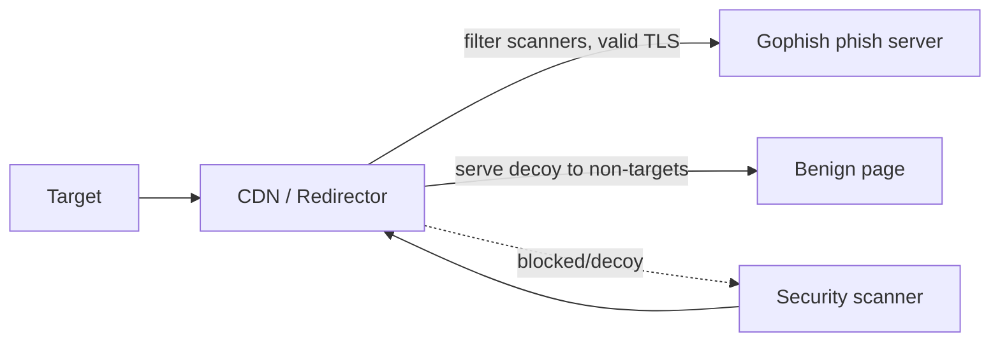
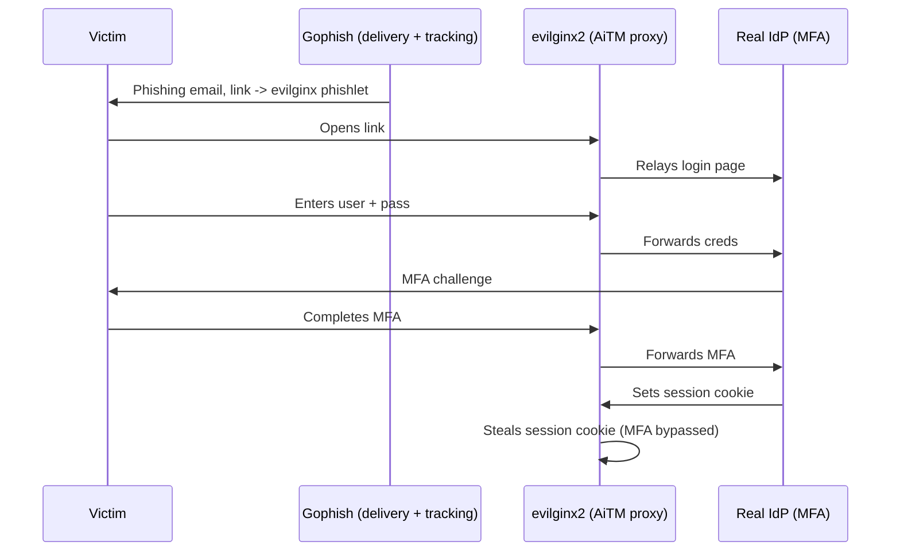
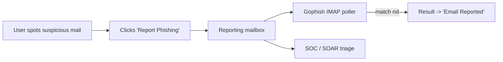

**Level:** Advanced · **Track:** Red Team · **Read time:** 180 min

This is Chapter 6 of the Social Engineering series. Chapter 3 built the phishing pipeline conceptually — pretext, infrastructure, delivery, capture — Chapter 4 explained the email-authentication engine (SPF/DKIM/DMARC) that decides whether your mail lands, and Chapter 5 took you deep into the Social-Engineer Toolkit (SET) as a fast credential-harvesting multitool. This chapter picks up where SET's single-operator, single-page workflow runs out of road: **Gophish**, the open-source phishing framework built to plan, launch, pace, and *measure* a full campaign against a list of hundreds or thousands of targets, with a proper database, a REST API, and a results dashboard your client actually wants to see.

Gophish is a **campaign engine**. Where SET clones one page and tails a log, Gophish models the whole exercise as first-class objects — Sending Profiles, Email Templates, Landing Pages, target Groups, and Campaigns — stores every event (sent, opened, clicked, submitted, reported) in a database, and renders a per-user timeline you can hand to a customer as evidence. It was written in Go by Jordan Wright, ships as a single static binary with an embedded web server, and runs identically on Linux, macOS, and Windows. This chapter teaches Gophish from zero — architecture, installation, every screen and every API endpoint that matters — then walks a complete authorized campaign end to end, and finishes by confronting the same uncomfortable truth Chapter 5 did: a classic Gophish landing page captures a password but **not** a second factor, so against MFA-protected targets you either pivot to an assessment-of-behaviour metric (who clicked / who submitted) or hand off to an AiTM reverse proxy like evilginx2.

> **Ethics and scope first.** Gophish exists for **authorized** phishing simulations, sanctioned red-team engagements, and security-awareness programmes. Standing up a look-alike login page to capture real users' credentials without written authorization is fraud and unauthorized access in essentially every jurisdiction — U.S. wire-fraud statutes and the CFAA, the UK Computer Misuse Act and Fraud Act, GDPR for any personal data you harvest, and equivalents worldwide. Everything below assumes a signed statement of work, a defined target list, a rules-of-engagement (RoE) document, attacker-owned throwaway domains, a data-handling/destruction plan, and a client point of contact who can stop the exercise. Build the labs against **your own** VMs, your own mail server, and your own test accounts. Nothing here is a turnkey weapon aimed at anyone you are not contracted to test.

---

## Why This Matters

Year after year, Verizon's Data Breach Investigations Report puts the human element — phishing, pretexting, and stolen credentials — at or near the top of confirmed-breach root causes. Organisations respond by *running their own phishing tests*: sanctioned campaigns that measure how many staff click, how many submit credentials, and how many report the mail to security. That measurement loop is exactly what Gophish was built to run, which is why it shows up on both sides of the table — red teams and awareness vendors use it to launch campaigns, and blue teams study it to recognise what its traffic and artifacts look like.

For a red teamer, Gophish is worth mastering for three concrete reasons. First, it **scales**: a single campaign object can target thousands of recipients, throttle send rate to protect deliverability and dodge rate-based detection, and record every interaction without you babysitting a terminal. Second, it produces **evidence a client will pay for** — a timeline showing "User X opened at 09:14, clicked at 09:15, submitted credentials at 09:16, and never reported it" is the deliverable that drives awareness budgets, far more than a raw password dump. Third, it is **fully automatable** through a documented REST API, so you can template an entire engagement (profiles, templates, pages, groups, campaign, launch, poll results, export) as code and reproduce it across quarterly re-tests. Understanding Gophish deeply therefore serves offense (run the exercise well) and defense (detect and blunt the real attackers who use the same tool) equally, and this chapter is written for both chairs.

---

## Part 1: What Gophish Is — Architecture, Design, and Where It Fits

Gophish is a self-hosted web application written in Go. When you run the binary it starts **two** independent HTTP listeners inside one process:

- The **admin server** (default `https://127.0.0.1:3333`) — the authenticated dashboard and the REST API you use to build and launch campaigns. You should *never* expose this to the internet unfirewalled.
- The **phish server** (default `http://0.0.0.0:80`, and typically also `:443` with TLS) — the public-facing server that hosts your landing pages, serves the tracking pixel, captures submitted form data, and issues redirects. This is the only listener a target ever touches.

Behind those listeners sits a database (SQLite by default, MySQL optionally for larger or clustered deployments) that stores every object and every event. The object model is the mental map for the whole tool:

| Object | What it is | Analogous to |
|---|---|---|
| **Sending Profile** | SMTP credentials + envelope/From settings used to actually send mail | The outbound mail relay config |
| **Email Template** | The HTML/plain-text body, subject, and attachments of the phishing email | The lure email |
| **Landing Page** | The page a target sees after clicking — clone of a login form, capture logic, redirect | The fake login / awareness page |
| **Users & Groups** | The target list (email, first/last name, position) you import | The recipient list |
| **Campaign** | Ties one template + one page + one profile + one group together, launches, and tracks | The engagement itself |

A campaign is where everything joins. When you launch one, Gophish renders the template per-recipient (substituting name, a unique tracking URL, and a tracking pixel), hands each message to the sending profile's SMTP server at the configured rate, and then waits for the phish server to report events back into the database as targets interact.



**Where it fits versus SET (Chapter 5).** SET is a fast, interactive, single-operator tool: clone a page, tail a log, done in ninety seconds — ideal for a quick one-off or a demo. Gophish is the *campaign* layer above that: persistent objects, scheduled sends, rate control, multi-thousand target lists, and a results database with an exportable timeline. If you need to phish three people this afternoon, SET is fine. If you need to phish an org, prove who clicked, pace the send over a work-day to protect deliverability, and re-run the identical test next quarter, Gophish is the tool. They are not competitors so much as different rungs on the same ladder.

**Where it fits versus AiTM proxies (evilginx2, Modlishka).** Gophish's built-in capture is a *static* form grab — it records what a victim types into a cloned page. That defeats password-only logins but not MFA, because a captured password plus a one-time code the attacker never sees is useless. AiTM proxies sit as a live reverse proxy between victim and the *real* site, relaying the whole authentication including the MFA challenge and stealing the resulting **session cookie**. Many mature engagements use Gophish for the delivery, tracking, and reporting layer, and point its links at an evilginx2 phishlet for the actual credential/session theft — Part 12 covers that handoff.

---

## Part 2: Installing and Running Gophish From Scratch

Gophish ships as a pre-built ZIP for each platform and as source you can compile with the Go toolchain. On Kali or any Debian/Ubuntu host, the binary release is the fastest path.

### 2.1 Binary install (recommended)

```bash
# Fetch the latest release (check the GitHub releases page for the current version/tag)
cd /opt
sudo mkdir gophish && cd gophish
sudo wget https://github.com/gophish/gophish/releases/download/v0.12.1/gophish-v0.12.1-linux-64bit.zip
sudo unzip gophish-v0.12.1-linux-64bit.zip
sudo chmod +x gophish
```

Flag/step notes:
- `wget <url>` downloads the release archive. Always pull the version you intend to run from the official `gophish/gophish` GitHub releases, and verify the checksum where published — a phishing framework fetched from a random mirror is exactly the supply-chain risk you would flag on an engagement.
- `unzip` expands the archive: you get the `gophish` binary, a `config.json`, a `db/` migrations folder, and `static/` / `templates/` assets.
- `chmod +x gophish` marks the binary executable (`+x` adds the execute permission bit for the file's owner/group/other per the current umask).

### 2.2 Build from source (when you want to patch/rebrand)

```bash
# Requires Go 1.20+ installed and on PATH
git clone https://github.com/gophish/gophish.git
cd gophish
go build          # produces the ./gophish binary from the current source tree
```

Building from source matters operationally because Gophish's default responses contain **fingerprintable artifacts** — most famously the `X-Gophish-Contact` header and a default 404 page / server signature that defenders and researchers scan the internet for. Serious operators patch these out before an engagement (see Part 11). `go build` compiles the whole module into a single static binary with no external runtime dependencies, which is why Gophish is so easy to drop onto a fresh VPS.

### 2.3 The config file

`config.json` controls both listeners and the database. A minimal production-shaped config:

```json
{
  "admin_server": {
    "listen_url": "127.0.0.1:3333",
    "use_tls": true,
    "cert_path": "gophish_admin.crt",
    "key_path": "gophish_admin.key",
    "trusted_origins": []
  },
  "phish_server": {
    "listen_url": "0.0.0.0:80",
    "use_tls": false,
    "cert_path": "example.crt",
    "key_path": "example.key"
  },
  "db_name": "sqlite3",
  "db_path": "gophish.db",
  "migrations_prefix": "db/db_",
  "contact_address": "",
  "logging": {
    "filename": "",
    "level": ""
  }
}
```

Key fields explained:
- `admin_server.listen_url` — bind the admin UI to `127.0.0.1` only. If you need remote admin access, reach it over an SSH tunnel (`ssh -L 3333:127.0.0.1:3333 user@vps`), **never** by binding `0.0.0.0`. An exposed admin panel with default creds is a well-known way operators get their own campaigns owned.
- `phish_server.listen_url` — `0.0.0.0:80` so targets can reach it. In real deployments you terminate TLS here (`use_tls: true` with a valid Let's Encrypt cert for your look-alike domain) or, better, put a reverse proxy / redirector in front (Part 11).
- `contact_address` — populates the `X-Gophish-Contact` header, an anti-abuse feature so a genuinely-phished recipient can find who's testing them. On an authorized internal sim you may set it to your security team; on a covert red-team you patch the header out of the source entirely.
- `db_name` / `db_path` — `sqlite3` + a local file is fine for most engagements. Switch to `mysql` with a DSN for high-volume or multi-node setups.
- `trusted_origins` — CSRF origin allow-list for the admin API when fronted by a proxy.

### 2.4 First run and the one-time admin password

```bash
sudo ./gophish
```

On first launch Gophish auto-creates the admin user and prints a **randomly generated temporary password** to the log — this behaviour was added specifically because older versions shipped the notorious default `admin:gophish`, which the internet promptly scanned for.

```
time="..." level=info msg="Please login with the username admin and the password <RANDOM_TEMP_PW>"
time="..." level=info msg="Starting admin server at https://127.0.0.1:3333"
time="..." level=info msg="Starting phishing server at http://0.0.0.0:80"
```

Browse to `https://127.0.0.1:3333`, accept the self-signed cert warning (the admin cert is self-signed by default — that's fine because only you touch it), log in with `admin` and the printed password, and Gophish forces you to set a new one immediately.

**Run it as a service.** For anything beyond a quick test, run Gophish under systemd so it survives reboots and logs cleanly:

```ini
# /etc/systemd/system/gophish.service
[Unit]
Description=Gophish
After=network.target

[Service]
Type=simple
User=gophish
WorkingDirectory=/opt/gophish
ExecStart=/opt/gophish/gophish
Restart=on-failure

[Install]
WantedBy=multi-user.target
```

```bash
sudo useradd -r -s /usr/sbin/nologin gophish     # -r = system account, -s nologin = no interactive shell
sudo chown -R gophish:gophish /opt/gophish
sudo setcap 'cap_net_bind_service=+ep' /opt/gophish/gophish  # allow binding :80/:443 without full root
sudo systemctl daemon-reload
sudo systemctl enable --now gophish
sudo journalctl -u gophish -f                     # follow the log to grab the temp password
```

`setcap cap_net_bind_service=+ep` grants the binary the single Linux capability needed to bind privileged ports (<1024) so you don't have to run the whole process as root — a good habit for any internet-facing service.

---

## Part 3: Touring the Admin UI and the REST API

The admin dashboard's left nav mirrors the object model exactly: **Dashboard, Campaigns, Users & Groups, Email Templates, Landing Pages, Sending Profiles, Account Settings**. You build the reusable pieces (profile, template, page, group) once, then combine them in a campaign.

### 3.1 The API key

Everything the UI does is a thin client over the REST API. Open **Account Settings** to find (or reset) your **API key** — a bearer token you pass on every API call. This is what makes Gophish scriptable.

```bash
# Store the key once
export GP=https://127.0.0.1:3333
export GPKEY="0123456789abcdef..."   # from Account Settings

# Smoke test: list campaigns (empty array on a fresh install)
curl -sk -H "Authorization: Bearer $GPKEY" "$GP/api/campaigns/" | jq .
```

- `-s` silences the curl progress meter; `-k` accepts the self-signed admin cert; `-H "Authorization: Bearer ..."` sends the API key. `jq .` pretty-prints the JSON.
- The trailing slash on `/api/campaigns/` matters — Gophish's router is slash-sensitive on several endpoints.

Core endpoints you will use constantly:

| Method + path | Purpose |
|---|---|
| `GET /api/campaigns/` | List all campaigns |
| `POST /api/campaigns/` | Create + launch a campaign |
| `GET /api/campaigns/:id/results` | Poll live results/timeline for a campaign |
| `GET /api/campaigns/:id/summary` | Aggregate stats (sent/opened/clicked/submitted) |
| `GET/POST /api/groups/` | Manage target groups |
| `GET/POST /api/templates/` | Manage email templates |
| `GET/POST /api/pages/` | Manage landing pages |
| `GET/POST /api/smtp/` | Manage sending profiles |
| `POST /api/import/email` | Parse a raw `.eml` into a template |
| `POST /api/import/site` | Clone a live URL into a landing page |

We'll use these in Part 10 to script an entire campaign. For now, know that any screen you click in the UI has a one-to-one API call underneath.

---

## Part 4: Sending Profiles — the SMTP Layer

A **Sending Profile** is the outbound mail configuration: the SMTP host, port, auth, and the envelope/From identity. No email leaves Gophish without one.

Fields on the *New Sending Profile* form:

- **Name** — internal label (e.g. `mailgun-relay` or `internal-postfix`).
- **Interface Type** — `SMTP` (the only real option).
- **SMTP From** — the `From:` header the recipient sees, e.g. `IT Support <it-support@corp-helpdesk.com>`. This is the *display* From; deliverability depends on it aligning with the sending domain's SPF/DKIM/DMARC (Chapter 4).
- **Host** — `smtp.yourrelay.com:587` (submission) or `:465` (implicit TLS) or `:25` (server-to-server).
- **Username / Password** — SMTP auth creds for the relay.
- **Ignore Certificate Errors** — allow self-signed TLS on the relay (lab only; don't in prod).
- **Email Headers** — add custom headers (e.g. a custom `X-Mailer`, or a `List-Unsubscribe` header to look legitimate).

Two realistic ways to source the SMTP relay:

1. **A reputable relay you control an account on** — Mailgun, SendGrid, Amazon SES, Postmark, etc. These give high deliverability *if* you've warmed the domain and set SPF/DKIM correctly, but their acceptable-use policies forbid phishing and they will terminate you; for authorized sims you use a dedicated sub-account and disclose intent where required.
2. **Your own Postfix on the phishing VPS** — full control, no third-party AUP, but you own the entire deliverability problem (reverse DNS, SPF, DKIM signing, warm-up, blocklist monitoring). For serious red-team work this is common because it keeps the whole chain in-scope infrastructure you control.

**Always click "Send Test Email"** before saving. Gophish will render a test message through the profile so you can confirm auth works and inspect how it lands (inbox vs. spam) in a seed account. A profile that authenticates but lands in spam is worse than useless — it burns your domain reputation for zero clicks.



---

## Part 5: Email Templates — the Lure

An **Email Template** holds the subject line, the HTML and/or plain-text body, and any attachments. Two things make a Gophish template different from a plain email: **template variables** and the **tracking pixel**.

### 5.1 Template variables

Gophish substitutes these per-recipient at send time:

| Variable | Expands to |
|---|---|
| `{{.FirstName}}` | Target's first name |
| `{{.LastName}}` | Target's last name |
| `{{.Email}}` | Target's email address |
| `{{.Position}}` | Target's position/title |
| `{{.URL}}` | The unique per-target phishing link (points at your landing page with the tracking token) |
| `{{.TrackingURL}}` | The tracking-pixel URL (usually inserted automatically) |
| `{{.Tracker}}` | A full `` tracking-pixel tag |
| `{{.RId}}` | The recipient's unique result ID (the token in the link) |
| `{{.From}}` | The sending-profile From value |
| `{{.BaseURL}}` | The phish server base URL |

A minimal but realistic HTML body:

```html
<p>Hi {{.FirstName}},</p>

<p>Our records show your mailbox is over quota and outbound mail will be
paused within 24 hours. Please re-validate your account to keep sending:</p>

<p><a href="{{.URL}}">Re-validate my mailbox</a></p>

<p>If you do not complete this by end of day, IT will reset your access.</p>

<p>Regards,<br/>IT Service Desk</p>

{{.Tracker}}
```

Notes:
- `{{.URL}}` is the *only* thing the link should point at — Gophish rewrites it into a unique tracked URL per recipient so clicks are attributable. Never hardcode a raw URL; you lose per-user tracking.
- `{{.Tracker}}` drops a 1×1 transparent tracking pixel. When the mail client loads that image, Gophish records an **Email Opened** event. (Caveat: many clients block remote images by default, so "opened" undercounts — treat it as a floor, not a truth.)

### 5.2 Import an existing email

The **Import Email** button parses a raw `.eml` (source of a real newsletter, an internal notification, a password-reset mail you legitimately received) and reproduces its HTML, headers, and inline styling as a template. This is the fastest route to a convincing lure: capture a genuine "Microsoft/Okta/Workday" notification's source and swap the link for `{{.URL}}`. Tick **Change Links to Point to Landing Page** so Gophish auto-rewrites hrefs to your tracked URL.

**Red team usage:** cloning a real transactional email inherits its exact styling, footer, and unsubscribe boilerplate, which sails past the "does this look off?" instinct. **Blue team usage:** the same fidelity is why look-alike-domain detection and link inspection matter more than "spot the typo" training — modern lures rarely have typos.

### 5.3 Attachments and the `{{.RId}}` trick

Templates can carry attachments (a "protected document", an `.html` file, a macro-enabled doc — kept lab-scoped and covered properly in Chapter 7). A neat tracking technique: name or template an attachment/URL with `{{.RId}}` so that even out-of-band interactions can be tied back to a specific recipient.

---

## Part 6: Landing Pages — Capture and Redirect

A **Landing Page** is what a target sees after clicking `{{.URL}}`. This is where a campaign either just measures clicks, or actually harvests credentials.

### 6.1 Cloning a real page

The **Import Site** feature fetches a live URL and reproduces its HTML/CSS locally:

```
Import Site → URL: https://login.microsoftonline.com  → Import
```

Gophish pulls the markup so your capture page is pixel-similar to the real login. You then enable:

- **Capture Submitted Data** — record everything posted from the form (so you see the username *and* which fields were filled).
- **Capture Passwords** — additionally store the password field value. This checkbox exists as a deliberate, logged decision because storing plaintext passwords — even in a sanctioned test — is sensitive. Many awareness programmes *deliberately leave this off*: they prove the user *submitted* credentials without ever storing the actual password, which is safer and often sufficient for the metric.

### 6.2 Redirect after submit

The **Redirect To** field controls what happens after the victim clicks submit. This is critical for realism and for OpSec:

- Redirect to the **real** login page (`https://login.microsoftonline.com`) so the victim sees a genuine "wrong password, try again" and re-authenticates on the real site, never realising they were phished.
- Or redirect to an **awareness/training page** ("You just clicked a simulated phishing test — here's what to look for") for internal sims where the teachable moment is the point.



### 6.3 The capture/redirect flow in HTTP terms

Understanding what actually crosses the wire is what separates an operator from a button-clicker, and it's exactly the artifact a defender hunts for:

```http
GET /login?rid=aB3xK9 HTTP/1.1        # target opens tracked URL (rid = recipient token)
Host: corp-helpdesk.com

HTTP/1.1 200 OK                        # phish server returns cloned login HTML
...

POST /login?rid=aB3xK9 HTTP/1.1        # target submits the form
Host: corp-helpdesk.com
Content-Type: application/x-www-form-urlencoded

username=jdoe%40corp.com&password=Summer2027%21

HTTP/1.1 302 Found                     # Gophish records event, then redirects
Location: https://login.microsoftonline.com/
```

The `rid` query parameter is the linchpin — it's how Gophish attributes every open, click, and submission to a specific person in the group. **Blue team usage:** a `POST` of credential-looking fields to a domain that isn't your identity provider, immediately followed by a 302 to the *real* IdP, is a high-fidelity phishing signature you can hunt in proxy/DNS logs.

---

## Part 7: Users and Groups — the Target List

A **Group** is a named list of targets. Each target carries **First Name, Last Name, Email, Position**. You can add them by hand or bulk-import a CSV.

```csv
First Name,Last Name,Email,Position
John,Doe,jdoe@corp.local,Finance Analyst
Jane,Smith,jsmith@corp.local,HR Manager
Ravi,Kumar,rkumar@corp.local,IT Support
```

Import via **Users & Groups → New Group → Bulk Import Users → (upload CSV)**. The column headers must match exactly. Position is worth populating because it lets you *segment* — e.g. send a "vendor invoice" pretext only to Finance and an "HR policy update" pretext only to HR, which both improves click-through and mirrors how real targeted attacks work.

**Scope discipline:** the group is your authorized target list. It should be derived directly from the RoE — never import addresses that aren't in scope, and honour any opt-outs (executives who've declined, staff on leave, addresses that are actually shared mailboxes or distribution lists). Sending a "test" to an out-of-scope third party is the kind of mistake that ends engagements and careers.

---

## Part 8: Hands-On Lab — Launch a Full Campaign End to End

This is the fully worked lab. It runs **entirely against your own infrastructure**: a Gophish VM, your own Postfix relay (or a lab SMTP), and target mailboxes you own (spin up a few accounts on a mail server you control, or use MailHog/Mailpit as a catch-all sink). Nothing here touches a third party.

### 8.1 Lab topology

```mermaid
flowchart LR
    subgraph Attacker VPS
        G[Gophish admin :3333]
        P[Gophish phish :80/:443]
        PF[Postfix relay :587]
    end
    subgraph Lab targets
        M1[test1@lab.local]
        M2[test2@lab.local]
        M3[test3@lab.local]
    end
    G --> P
    G --> PF
    PF --> M1
    PF --> M2
    PF --> M3
    M1 -.click.-> P
    M2 -.click.-> P
```

### 8.2 Step 1 — Sending Profile

UI: **Sending Profiles → New Profile**
```
Name:      lab-postfix
SMTP From: IT Service Desk <it-desk@corp-helpdesk.lab>
Host:      127.0.0.1:587
Username:  gophish
Password:  ********
```
Click **Send Test Email → test1@lab.local**. Confirm it arrives in your sink (MailHog UI at `http://127.0.0.1:8025`, or the target's inbox). If it lands in Junk, fix SPF/DKIM before proceeding — a spam-foldered lure produces near-zero clicks.

### 8.3 Step 2 — Landing Page

UI: **Landing Pages → New Page → Import Site**
```
URL: http://webmail.corp.lab/login     (your own lab webmail login)
[x] Capture Submitted Data
[ ] Capture Passwords          (leave OFF — we only need to prove submission)
Redirect To: http://webmail.corp.lab/login   (bounce back to real login)
```
Name it `webmail-clone`. Save.

### 8.4 Step 3 — Email Template

UI: **Email Templates → New Template**
```
Name:    quota-warning
Subject: [Action Required] Mailbox over quota — re-validate within 24h
```
Body (HTML tab): use the quota-warning HTML from Part 5.1, with `{{.URL}}` on the link and `{{.Tracker}}` at the bottom. Toggle **Add Tracking Image** on. Save.

### 8.5 Step 4 — Group

UI: **Users & Groups → New Group → Bulk Import Users**, upload the CSV from Part 7 (pointed at your `@lab.local` mailboxes). Name it `lab-targets`.

### 8.6 Step 5 — Launch the Campaign

UI: **Campaigns → New Campaign**
```
Name:           Q1-webmail-quota-sim
Email Template: quota-warning
Landing Page:   webmail-clone
URL:            http://corp-helpdesk.lab      (the phish server's public base URL — MUST be reachable by targets and match the link they'll click)
Launch Date:    now
Send Emails By: (optional) spread over 2 hours
Sending Profile: lab-postfix
Groups:         lab-targets
```

Two fields deserve emphasis:
- **URL** — this is the base URL baked into every `{{.URL}}`. It must be the address targets can actually reach (your phish server's domain/IP), *not* `127.0.0.1`. Getting this wrong is the #1 reason "clicks don't register".
- **Send Emails By** — if set, Gophish paces the send evenly across that window instead of blasting all at once. Pacing protects deliverability (bulk simultaneous sends trip rate limits and spam heuristics) and better mimics organic mail. **Red team usage:** slow pacing also dodges volume-based email-security alerts.

Hit **Launch Campaign**. Gophish renders each mail, sends via `lab-postfix`, and drops you on the live results dashboard.

### 8.7 Step 6 — Watch the timeline

As your lab "victims" open and click, the dashboard fills in. Poll it from the API too:

```bash
curl -sk -H "Authorization: Bearer $GPKEY" "$GP/api/campaigns/1/summary" | jq .
```
Realistic sample output:
```json
{
  "id": 1,
  "name": "Q1-webmail-quota-sim",
  "status": "In progress",
  "stats": {
    "total": 3,
    "sent": 3,
    "opened": 2,
    "clicked": 2,
    "submitted_data": 1,
    "email_reported": 0,
    "error": 0
  }
}
```

Per-user timeline:
```bash
curl -sk -H "Authorization: Bearer $GPKEY" "$GP/api/campaigns/1/results" \
  | jq '.results[] | {email, status, ip}'
```
```json
{ "email": "test1@lab.local", "status": "Submitted Data", "ip": "10.0.0.51" }
{ "email": "test2@lab.local", "status": "Clicked Link",     "ip": "10.0.0.52" }
{ "email": "test3@lab.local", "status": "Email Sent",       "ip": "" }
```

You now have exactly the evidence a client wants: who opened, who clicked, who submitted, and who (nobody, yet) reported it.

### 8.8 Step 7 — Complete and export

When the window closes, **Complete** the campaign (this stops further tracking) and export results to CSV from the UI or:
```bash
curl -sk -H "Authorization: Bearer $GPKEY" "$GP/api/campaigns/1/results" -o results.json
```
Archive the raw data securely, then — per your data-handling plan — **purge captured credentials** if any were stored. That deletion step is part of the engagement, not an afterthought.

---

## Part 9: Reading Results — Events, the Pixel, and What the Numbers Really Mean

Gophish records a fixed set of per-recipient event states, and each has caveats you must understand to report honestly.

| Event | Trigger | Caveat |
|---|---|---|
| **Email Sent** | Message handed to SMTP successfully | Delivery ≠ inbox; could be spam-foldered |
| **Email Opened** | Tracking pixel loaded | **Undercounts** — image-blocking clients never fire it |
| **Clicked Link** | Target requested the tracked URL | Can be inflated by link-scanning security appliances that auto-fetch URLs |
| **Submitted Data** | Target POSTed the form | The gold-standard "compromise" signal |
| **Email Reported** | Target reported via a report button/plugin | Requires the reporting integration configured |
| **Error** | SMTP send failed | Bad address, relay rejection, etc. |

Two measurement traps every professional must flag in the report:

1. **Security appliances poison your clicks.** Proofpoint, Mimecast, Microsoft Defender for Office 365 "Safe Links", and similar products *pre-fetch* URLs in emails to scan them. Those fetches register in Gophish as opens/clicks from datacenter IPs, inflating your numbers with events no human generated. Filter them by correlating the source IP/ASN and User-Agent, or by the tell-tale pattern of a click that arrives seconds after send with no prior "open". A click-through rate that ignores this is wrong.
2. **Opens undercount, submissions are truth.** Because remote images are blocked by default in many clients, treat "opened" as a soft floor. The number that actually matters for risk is **Submitted Data** — that's a human who typed credentials into your page.



**Blue team usage:** the "Email Reported" metric is the one defenders should optimise *up* — a workforce that reports fast gives the SOC early warning even when some users click. Configuring a report button that feeds back into Gophish (or your SOAR) turns the exercise into a detection drill, not just a shaming exercise.

---

## Part 10: Automating a Campaign With the REST API

Everything you did by hand in Part 8 can be scripted. This is how you make an engagement reproducible and how you run quarterly re-tests without re-clicking every screen. Below is a self-contained Python flow using the API (the official `gophish` Python library wraps the same calls; raw `requests` shows the mechanics).

```python
import requests, urllib3
urllib3.disable_warnings()  # self-signed admin cert in lab

API = "https://127.0.0.1:3333/api"
KEY = "0123456789abcdef..."          # Account Settings -> API key
H = {"Authorization": f"Bearer {KEY}", "Content-Type": "application/json"}

# 1. Sending profile
smtp = requests.post(f"{API}/smtp/", headers=H, verify=False, json={
    "name": "lab-postfix",
    "interface_type": "SMTP",
    "from_address": "IT Service Desk <it-desk@corp-helpdesk.lab>",
    "host": "127.0.0.1:587",
    "username": "gophish",
    "password": "********",
    "ignore_cert_errors": True
}).json()

# 2. Landing page (clone captured separately, or inline HTML here)
page = requests.post(f"{API}/pages/", headers=H, verify=False, json={
    "name": "webmail-clone",
    "html": "<html>...captured login form...</html>",
    "capture_credentials": True,
    "capture_passwords": False,
    "redirect_url": "http://webmail.corp.lab/login"
}).json()

# 3. Email template
tmpl = requests.post(f"{API}/templates/", headers=H, verify=False, json={
    "name": "quota-warning",
    "subject": "[Action Required] Mailbox over quota — re-validate within 24h",
    "html": "<p>Hi {{.FirstName}},</p><p><a href=\"{{.URL}}\">Re-validate</a></p>{{.Tracker}}"
}).json()

# 4. Target group
group = requests.post(f"{API}/groups/", headers=H, verify=False, json={
    "name": "lab-targets",
    "targets": [
        {"first_name": "John", "last_name": "Doe", "email": "test1@lab.local", "position": "Finance"},
        {"first_name": "Jane", "last_name": "Smith", "email": "test2@lab.local", "position": "HR"}
    ]
}).json()

# 5. Create + launch the campaign (POST to /campaigns launches immediately unless launch_date is future)
camp = requests.post(f"{API}/campaigns/", headers=H, verify=False, json={
    "name": "Q1-webmail-quota-sim",
    "template":  {"name": "quota-warning"},
    "page":      {"name": "webmail-clone"},
    "smtp":      {"name": "lab-postfix"},
    "url": "http://corp-helpdesk.lab",
    "groups": [{"name": "lab-targets"}]
}).json()
print("launched campaign id", camp["id"])

# 6. Poll results
import time
for _ in range(10):
    s = requests.get(f"{API}/campaigns/{camp['id']}/summary", headers=H, verify=False).json()
    print(s["stats"])
    time.sleep(30)
```

Why script it:
- **Reproducibility** — the whole engagement is version-controlled config. Next quarter's re-test is a one-line change (new group, new date).
- **Scale** — programmatic group import handles thousands of targets and per-segment templates without UI fatigue.
- **Integration** — poll `summary`/`results` on a timer and push into your reporting pipeline, a dashboard, or a Slack alert to the engagement channel.

**Red team usage:** the API also lets you build *multi-node* setups — one hidden Gophish "master" driving several disposable phish-server front-ends behind redirectors — so burning one front-end domain doesn't cost you the campaign data.

---

## Part 11: OpSec, Infrastructure, and Deliverability

A technically perfect campaign that lands in spam, or that a defender fingerprints in five minutes, is a failed campaign. Professional Gophish work is 20% clicking the UI and 80% infrastructure.

### 11.1 Domains

- Register an **attacker-owned look-alike domain** that fits the pretext (`corp-helpdesk[.]com`, `okta-verify[.]net`) — or, for internal sims, a benign domain your client agrees is the test source. Age it if you can; brand-new domains are scored as risky by mail filters and often auto-blocked for the first days/weeks.
- Set up **reverse DNS (PTR)** on your VPS IP to match, and keep the IP off blocklists (check Spamhaus, Barracuda, etc. before launch).

### 11.2 Email authentication (ties back to Chapter 4)

Configure, on the *sending* domain:
- **SPF** — a TXT record authorising your sending IP/relay.
- **DKIM** — sign outbound mail with a published public key so receivers can verify integrity/origin.
- **DMARC** — a `p=none` (monitoring) policy at minimum so aligned mail passes rather than being quarantined.

Without alignment, modern receivers junk or reject the mail and your click-rate collapses regardless of how good the lure is.

### 11.3 TLS for the landing page

Serve the phish server over HTTPS with a **valid** certificate for your look-alike domain (Let's Encrypt via a reverse proxy or Gophish's own TLS config). A browser "Not secure" warning on a login page is an instant tell to any alert user, and increasingly a hard block.

### 11.4 Redirectors and fingerprint removal

- Put a **redirector** (an Nginx/Apache reverse proxy, or Cloudflare/CDN) in front of the phish server so the real Gophish host IP is never exposed, and so you can filter out security-scanner traffic (drop known scanner ASNs, serve benign content to non-target User-Agents).
- **Strip Gophish's default fingerprints.** Out of the box Gophish adds an `X-Gophish-Contact` header and returns a distinctive default 404/server signature; internet-wide scanners (and defenders) specifically hunt these. Remove/blank `contact_address`, patch the header out of the source, and customise the default not-found response before compiling. This is the single most common "how the blue team caught the red team" story with Gophish.



### 11.5 Pacing and timing

- Use **Send Emails By** to spread the send across a plausible window (e.g. the first two hours of the workday in the targets' timezone).
- Launch when people actually read mail — mid-morning on a workday out-performs 3 a.m. Both realism and click-rate improve.

---

## Part 12: The MFA Wall — and the AiTM Handoff

Here is the limitation you must internalise: **Gophish's built-in capture is a static form grab.** It records the username and password a victim types into your cloned page. Against any account protected by MFA, that password alone doesn't get you in — you never see the one-time code, push approval, or FIDO assertion. So a classic Gophish "credential capture" against an MFA'd target proves the *behaviour* (they submitted) but does **not** yield a working login.

Two professional responses:

1. **Measure behaviour, not access.** For an awareness engagement, "who submitted credentials" is the metric that matters and MFA doesn't change it. Often you deliberately *don't* capture the password at all — you prove submission and redirect to training. This is the cleanest, safest posture for internal sims.
2. **Hand off to an AiTM proxy for real access testing.** When the objective is to prove that MFA-protected accounts *can* be compromised (a red-team goal, not an awareness one), you keep Gophish for delivery/tracking/reporting but point `{{.URL}}` at an **evilginx2** phishlet (or Modlishka/Muraena). The proxy sits live between victim and the *real* IdP, relays the entire login including the MFA step, and steals the resulting **session cookie**, which does bypass MFA. Chapter 8 covers evilginx2 and AiTM in depth.



Understanding *why* the handoff exists — the static-capture limitation — is exactly what separates a checkbox operator from someone who can design a credible modern phishing test.

---

## Part 13: Detection & Defense Angle

Everything above is offense; a professional owes the defender the mirror image. Gophish (and the real attackers who use it) leaves detectable artifacts at the mail, network, endpoint, and human layers.

### 13.1 Email-layer detection

- **Enforce DMARC at `p=reject`** on your own domain so look-alike *spoofing* of your exact domain fails outright. It won't stop cousin-domain lookalikes, but it kills exact-domain impersonation.
- **Flag newly-registered and look-alike domains** at the secure email gateway — `corp-helpdesk[.]com` sending mail about `corp[.]com` accounts is a strong signal. Homoglyph and Levenshtein-distance checks against your brand domains catch cousin domains.
- **Detonate links in a sandbox** (Safe Links/URL rewriting) and score landing pages that present credential forms on non-IdP domains.

### 13.2 Network/proxy detection

- Hunt for the **Gophish fingerprint**: the `X-Gophish-Contact` header, default self-signed admin cert, and the known default 404 body — Shodan/Censys and internal scanning can find unpatched instances. (A patched instance won't have these, which is precisely why detection can't rely on them alone.)
- Alert on the **capture signature** from Part 6.3: an HTTP `POST` carrying `username`/`password`-shaped fields to a domain that is *not* your identity provider, especially one immediately followed by a `302` to the real IdP.
- Correlate a burst of DNS lookups / first-seen connections to a **freshly-registered domain** across many employees within a short window — that's a campaign fan-out.

| Layer | Signal | Tooling |
|---|---|---|
| Email | Look-alike/new domain, failed DMARC alignment | SEG (Proofpoint/Mimecast/Defender), DMARC reports |
| Email | Credential-form landing page on non-IdP host | Safe Links / URL detonation |
| Network | POST of creds to non-IdP domain → 302 to IdP | Proxy/NGFW logs, Zeek |
| Network | Gophish default header/cert/404 fingerprint | Zeek, JA3/JARM, internet scan feeds |
| Endpoint | Browser hits new domain then IdP seconds later | EDR network telemetry |
| Human | Reported phishing mail | Report button → SOAR |

### 13.3 Identity-layer defense (the real fix)

Because static credential capture dies against strong MFA, **the durable defence is phishing-resistant authentication**:
- **FIDO2 / WebAuthn security keys or passkeys** are origin-bound — the browser will not release the assertion to a look-alike domain, which defeats *both* static capture and AiTM proxying. This is the single highest-impact control.
- Where hardware keys aren't yet universal, prefer **number-matching push** over one-tap approval to blunt MFA-fatigue, and monitor for **impossible-travel** and **new-session-from-new-ASN** as compensating detections that catch stolen-cookie replay.

### 13.4 Human layer

- Run these very simulations (with Gophish) on a cadence, but measure **report rate**, not just click rate — reward reporting, don't punish clicking. A high, fast report rate is the metric that actually shrinks attacker dwell time.
- Make reporting frictionless (a one-click button that files to the SOC and, ideally, back into your Gophish "reported" metric).

---

## Part 14: The Reporting Integration (IMAP Monitoring)

The **Email Reported** metric doesn't populate itself — you have to give Gophish a way to learn that a target reported the mail. Gophish does this by polling a mailbox over IMAP: you point it at the inbox that receives forwarded/reported phishing mail (or the mailbox behind an Outlook/O365 "Report Phishing" button), and Gophish matches the unique `rid` embedded in the reported message back to the recipient, flipping their status to *Email Reported*.

Configure it under **Account Settings → Reporting (IMAP)**:

| Field | Value / meaning |
|---|---|
| **Host** | `imap.yourmail.com:993` — the IMAP server + port (993 = implicit TLS) |
| **Username / Password** | Credentials for the reporting mailbox |
| **Folder** | Which folder to poll (e.g. `INBOX`) |
| **Restrict to Domain** | Only ingest reports from your own domain, so noise/spoofed reports don't skew stats |
| **Delete/Mark after processing** | Housekeeping so the same report isn't counted twice |
| **Poll interval** | How often Gophish checks the mailbox |

Operationally, the reporting loop is what converts a phishing *simulation* into a *detection drill*:



**Blue team usage:** wiring the same report button into your SOAR (not just Gophish) means every genuine phish a user reports during business-as-usual — not only during a sim — becomes a triage ticket. The metric you want trending up over successive quarters is *report rate and time-to-first-report*, because a fleet that reports in two minutes shrinks the attacker's window regardless of click rate. **Common pitfall:** if you forget to set *Restrict to Domain*, auto-forwarders and mailing-list traffic can inject junk into the reported count; always scope it to your own sending domain.

---

## Part 15: Troubleshooting a Campaign That Isn't Landing

Most Gophish failures are mundane and fall into a handful of buckets. Work them in order — mail path first, then tracking, then capture.

**Nothing arrives at all (Error state on every recipient).**
- Check the campaign's per-user status; an `Error` means the SMTP send itself failed. Re-run **Send Test Email** from the Sending Profile — if that also fails, it's auth/host/port, not Gophish.
- Verify the relay port matches the mode: `587` needs STARTTLS, `465` implicit TLS, `25` often blocked outbound by cloud providers (AWS/GCP throttle or block :25 by default — this bites people constantly on a fresh VPS).
- `sudo journalctl -u gophish -f` and watch the exact SMTP error the relay returns (`535` = bad auth, `550` = rejected/blocklisted sender, `421` = rate-limited).

**Mail sends but lands in Junk.**
- Almost always email-authentication (Part 11.2): run the message through a seed inbox and read the `Authentication-Results` header — you want `spf=pass dkim=pass dmarc=pass` with *alignment* (the `d=` in DKIM and the envelope domain matching the visible From).
- Fresh domain/IP with no reputation → warm it: send low volume to engaged seed accounts for a few days before the real launch.

**Mail lands but no opens/clicks register.**
- The campaign **URL** is `127.0.0.1` or an unreachable host — set it to the public phish-server address the target's browser can actually resolve and reach.
- The phish server isn't listening on the port the URL implies (e.g. URL says `https://` but `use_tls` is off / no `:443` bind). Confirm with `curl -I http://corp-helpdesk.lab/` from an outside host.
- Opens specifically stay at zero → image blocking in the client. That's expected; judge by clicks/submissions, not opens.

**Clicks register but submissions don't.**
- **Capture Submitted Data** wasn't ticked on the landing page, so the POST isn't recorded.
- The cloned form's `action`/`method` got mangled during Import Site (dynamic JS logins are the usual culprit). Test the page yourself: load it, submit dummy creds, and confirm a *Submitted Data* event appears for your own `rid`.

**Suspiciously instant 100% clicks.**
- Security appliance URL pre-fetch (Part 9). Correlate source IPs — datacenter/scanner ASNs firing within seconds of send are not humans. Filter them before reporting the true click-through rate.

| Symptom | Most likely cause | Fix |
|---|---|---|
| All recipients `Error` | SMTP auth/host/port; :25 blocked | Fix profile; use 587/465; test send |
| Delivered to Junk | SPF/DKIM/DMARC not aligned; cold domain | Fix DNS + warm domain |
| No opens/clicks | Campaign URL = 127.0.0.1 / unreachable | Set public reachable URL |
| Clicks but no submits | Capture off / broken cloned form | Enable capture; re-clone & self-test |
| Instant 100% clicks | Appliance pre-fetch | Filter scanner IPs/ASNs |

---

## Final Revision / Summary

- **Gophish is a campaign engine**, not a one-page harvester: reusable Sending Profiles, Email Templates, Landing Pages, and Groups combine into a Campaign that sends, paces, tracks, and reports across many targets, backed by a database and a REST API.
- **Two listeners**: a private admin server (`:3333`, `127.0.0.1` only, reach it via SSH tunnel) and a public phish server (`:80/:443`) that serves pages, the pixel, capture, and redirects. First run prints a random admin password — no more `admin:gophish`.
- **The object model is the workflow**: Profile (SMTP) → Template (lure, `{{.URL}}` + `{{.Tracker}}`) → Landing Page (clone + capture + redirect) → Group (CSV targets) → Campaign (URL base + pacing + launch).
- **`{{.URL}}` and `rid` are the tracking backbone** — never hardcode links, always let Gophish rewrite them so every open/click/submit is attributable.
- **Read the numbers honestly**: opens undercount (image blocking), clicks can be inflated by security appliances pre-fetching URLs, and **Submitted Data** is the truth signal. Optimise **report rate** up.
- **Infrastructure is most of the job**: look-alike domain, SPF/DKIM/DMARC alignment, valid TLS, a redirector, and stripping Gophish's default fingerprints (`X-Gophish-Contact`, default 404/cert) are what make a campaign land and stay hidden.
- **Static capture hits the MFA wall.** Either measure behaviour (submission) — often without storing the password — or hand off delivery/tracking to Gophish and the actual auth theft to an AiTM proxy (evilginx2, Chapter 8) that steals session cookies.
- **Defence** ends at phishing-resistant auth: FIDO2/passkeys are origin-bound and defeat both static capture and AiTM; DMARC `p=reject`, look-alike-domain detection, the credential-POST-to-non-IdP signature, and a fast human report loop are the layered supporting controls.

---

## Cheat Sheet / Quick Reference

**Install & run**
```bash
cd /opt/gophish && unzip gophish-*.zip && chmod +x gophish
sudo setcap 'cap_net_bind_service=+ep' ./gophish   # bind :80/:443 without root
./gophish                                           # prints random admin pw on first run
ssh -L 3333:127.0.0.1:3333 user@vps                 # reach the admin UI safely
```

**config.json essentials**
```
admin_server.listen_url : 127.0.0.1:3333   (never 0.0.0.0)
phish_server.listen_url : 0.0.0.0:80
contact_address         : ""  (blank/patch out X-Gophish-Contact for covert ops)
db_name                 : sqlite3 | mysql
```

**Template variables**
```
{{.FirstName}} {{.LastName}} {{.Email}} {{.Position}}
{{.URL}}  -> unique tracked phishing link  (ALWAYS use for the link)
{{.Tracker}} / {{.TrackingURL}} -> open-tracking pixel
{{.RId}} -> recipient token (the rid=... in the URL)
```

**API quickies**
```bash
curl -sk -H "Authorization: Bearer $GPKEY" $GP/api/campaigns/            # list
curl -sk -H "Authorization: Bearer $GPKEY" $GP/api/campaigns/1/summary   # stats
curl -sk -H "Authorization: Bearer $GPKEY" $GP/api/campaigns/1/results   # timeline
POST /api/campaigns/   # create + launch (future launch_date to schedule)
POST /api/import/site  # clone a URL into a landing page
POST /api/import/email # parse .eml into a template
```

**Event states**: Email Sent -> Email Opened (undercounts) -> Clicked Link (appliances inflate) -> **Submitted Data** (truth) / Email Reported (optimise up) / Error.

**Pre-launch checklist**: SPF+DKIM+DMARC aligned | valid TLS on look-alike domain | PTR set, IP off blocklists | `Send Test Email` lands in inbox | campaign **URL** = reachable phish host (not 127.0.0.1) | pacing window set | fingerprints stripped | scope = RoE only | data-destruction plan ready.

---

## Common Pitfalls

- **Campaign URL set to `127.0.0.1`** → targets can't reach the page, "clicks don't register". Set it to the public phish-server domain/IP.
- **Hardcoding a raw href** instead of `{{.URL}}` → no per-user tracking; every click looks like one anonymous hit.
- **Exposing the admin server on `0.0.0.0`** with default/weak creds → your own campaign (and captured data) gets owned. Bind localhost, tunnel in.
- **Ignoring email auth** → beautiful lure, spam folder, ~0% clicks. Fix SPF/DKIM/DMARC first.
- **Trusting "clicked" numbers raw** → security-appliance URL pre-fetch inflates them. Filter scanner IPs/UA; report Submitted Data as the real figure.
- **Leaving `X-Gophish-Contact` / default 404 in place** on a covert op → trivially fingerprinted by defenders and internet scanners.
- **Storing passwords when you didn't need to** → unnecessary sensitive-data risk; leave "Capture Passwords" off unless the SoW genuinely requires it, and destroy captures per plan.
- **Sending out of scope** → importing addresses not in the RoE, or hitting distribution lists/third parties. Group = authorized list, full stop.

---

## Practice Labs & Resources

- **Gophish official documentation & getting-started guide** (getgophish.com/documentation) — build a first campaign against your own sink mailboxes end to end; then reproduce it entirely via the REST API.
- **TryHackMe – "Phishing" module / "Phishing Emails" rooms and the "Red Team" phishing content** — hands-on Gophish/SET-style campaign building and email-analysis practice in a legal lab.
- **TryHackMe – "Phishing Analysis" / "Advanced" rooms** — take the blue-team chair: dissect headers, spot SPF/DKIM/DMARC failures, and identify look-alike domains (the defensive mirror of this chapter).
- **HackTheBox Academy – "Phishing" / "Password Attacks" tracks** — campaign infrastructure and credential-attack context.
- **Build your own lab**: Gophish + Postfix + MailHog/Mailpit on an isolated network with a handful of throwaway mailboxes. Practise: (1) get SPF/DKIM/DMARC to *pass* so a test mail lands in inbox; (2) clone your own webmail login and prove submission without storing passwords; (3) script the whole campaign via the API; (4) then switch chairs and detect your own campaign in the proxy/DNS logs.
- **DMARC/SPF tooling** (dmarcian, MXToolbox) — verify alignment on your sending domain before launch; then read a real DMARC aggregate report to see what receivers thought of your mail.
- **Disclosed phishing reports** on HackerOne/Bugcrowd and vendor write-ups of AiTM campaigns — study how real operators chain delivery (Gophish-style) into evilginx2 session theft, which sets up Chapter 8.

**Practice questions**

1. A colleague reports that their Gophish campaign shows 100% "Clicked" within 10 seconds of launch, but 0% "Submitted". What is almost certainly happening, and how do you correct the reported click-through rate?
2. You must test an Okta-protected workforce and prove that accounts can actually be taken over, not just that users click. Explain why Gophish's built-in capture is insufficient and describe the exact architecture that achieves the goal.
3. List the four DNS/authentication prerequisites that most influence whether your lure lands in the inbox versus junk, and state what each one does.
4. A defender wants to catch Gophish campaigns even after the operator has stripped the `X-Gophish-Contact` header. Give two detection strategies that don't rely on that fingerprint.
5. Design a safe internal awareness campaign that measures behaviour without ever storing a plaintext password. Which Gophish settings do you toggle, and where do you redirect after submit?

---

*Also on [Praneeth's portfolio](https://ping-praneeth.vercel.app/notebook/redteam-social-engineering/06-gophish-running-a-full-phishing-campaign), with comments and the latest edits.*
