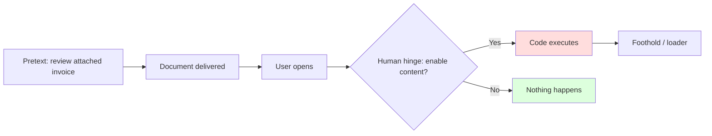
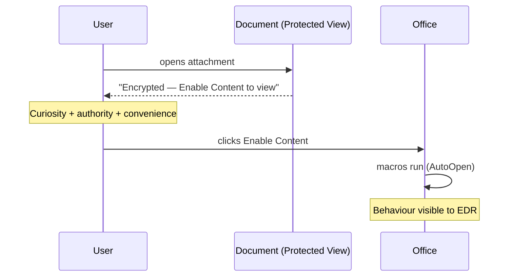
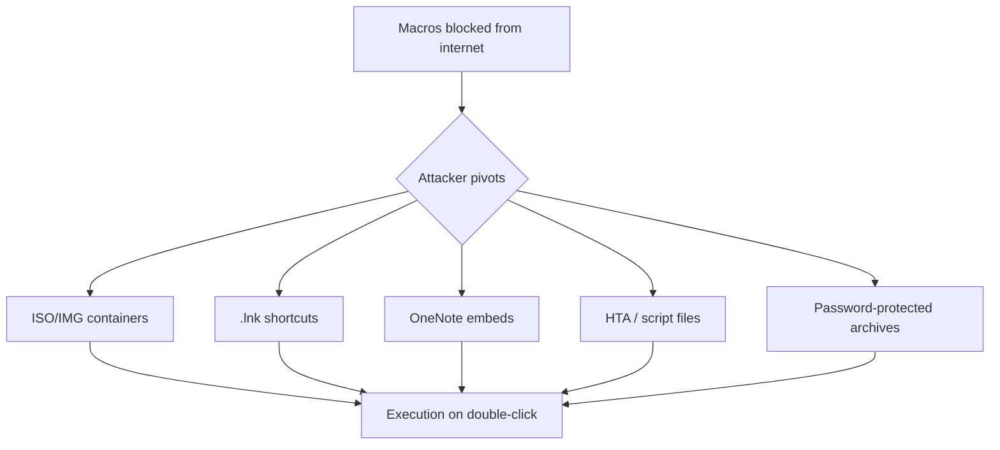
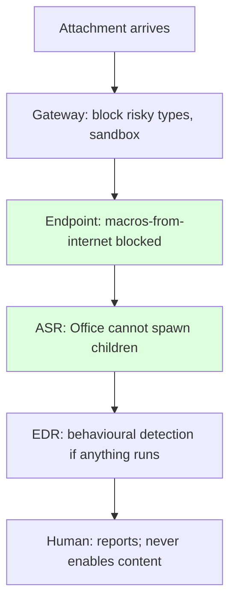
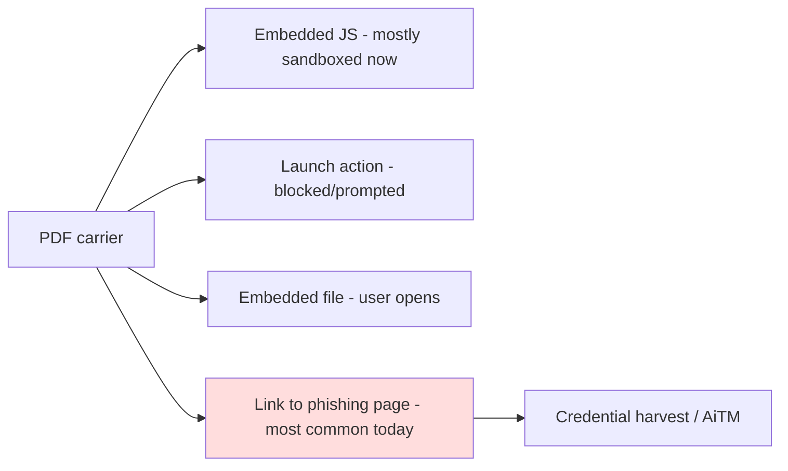
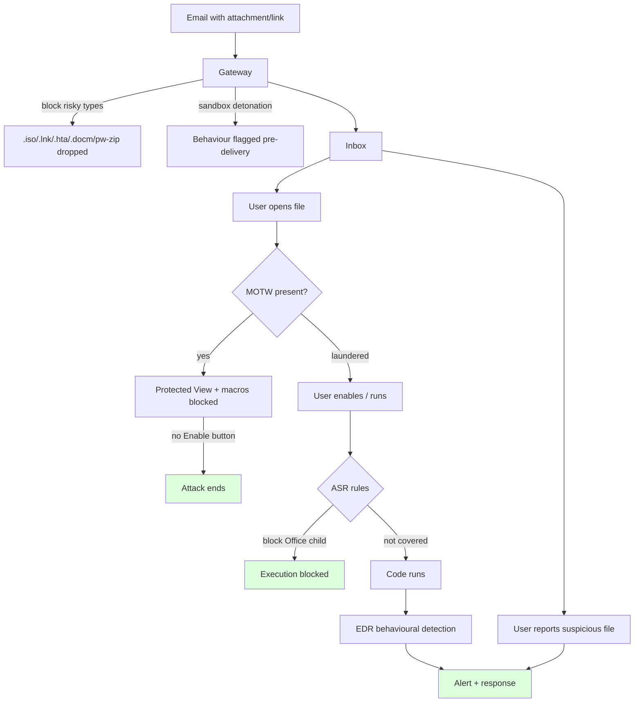

This is Chapter 7 of the Social Engineering series. The previous chapters delivered a message and, for credential harvesting, a fake login. This chapter covers the other main phishing objective: **payload delivery** — getting a document or file that the target opens to execute attacker-chosen code.

A hard rule frames everything here. **This chapter is conceptual and lab-scoped. It teaches how weaponised documents work so you can build authorised proof-of-execution artefacts and, above all, defend against them. It does not provide working malware, weaponised payloads, or evasion tuned to arm a real attack.** Every hands-on step uses a *benign* proof marker — a document that launches the calculator or writes a harmless file — inside an isolated lab you own. The malware-and-evasion notebook that follows keeps the same discipline.

We focus on the mechanics that matter for detection and authorised testing: the document formats, how macros and template injection cause execution, why "enable content" is the human hinge, Mark-of-the-Web, the industry's shift away from macros toward containers and shortcuts, and the defender controls that have made document malware much harder in recent years.

---

## Part 1: Why Documents Are Such a Popular Delivery Vector

Documents are an ideal phishing payload container for four reasons:

- **Ubiquity and trust.** Everyone opens Office files and PDFs all day. An invoice, a résumé, a contract — these are *expected*, so they lower suspicion.
- **Rich functionality.** Office formats were designed to be programmable (macros, dynamic data, embedded objects). That power is exactly what an attacker abuses.
- **They pair with a strong pretext.** "Please review the attached invoice" is a natural, low-friction ask (Chapters 1–3). The document *is* the pretext's payoff.
- **They cross the email boundary.** An attachment or link-to-file arrives where the human is, then executes on the endpoint if opened.



The human hinge — the moment the user enables content, runs a file, or mounts a container — is where social engineering and payload delivery meet, and it is where defence is most effective.

---

## Part 2: The Document Formats and Their Risk Surface

Different formats carry different execution capabilities. Knowing the surface is essential for building authorised tests and for writing detections.

| Format | Extension | Execution surface | Notes |
|---|---|---|---|
| Word (legacy) | `.doc` | VBA macros, binary format | No macro-free variant — riskier inbound |
| Word (OOXML) | `.docx` / `.docm` | `.docm` carries macros; `.docx` does not | The `m` suffix = macro-enabled |
| Excel | `.xls` / `.xlsx` / `.xlsm` | VBA macros; legacy Excel 4.0 (XLM) macros | XLM macros were a huge abuse vector |
| PowerPoint | `.ppt` / `.pptx` / `.pptm` | Macros; action-on-hover historically | Less common but possible |
| PDF | `.pdf` | JavaScript, embedded files, launch actions | Reader-dependent; modern readers restrict |
| Rich Text | `.rtf` | OLE object embedding; exploit-prone | Equation-editor exploits (CVE-2017-11882) |
| OneNote | `.one` | Embedded files/scripts users click | Rose after macro clampdowns |
| HTML Application | `.hta` | Runs as a trusted local app via `mshta` | A script host delivered *as* a document |

**Distinctions to teach:**

- The **`x` vs `m` suffix** in modern Office signals macro capability. Blocking or flagging `.docm`/`.xlsm`/`.pptm` from external sources is a high-value control.
- **Legacy binary formats** (`.doc`, `.xls`, `.rtf`) don't carry that distinction and have historically hidden macros and exploits — many organisations block them inbound.
- **Non-Office carriers** (`.hta`, `.one`, `.lnk`, script files) surged precisely because Office macros were locked down (Part 6).

---

## Part 3: How Macros Cause Execution (Conceptual)

A **macro** is a small program embedded in a document, written in **VBA (Visual Basic for Applications)**, originally to automate repetitive tasks. VBA can call the operating system, which is what makes weaponised macros dangerous.

A malicious macro relies on two conceptual triggers:

- **Auto-execution hooks.** VBA has event handlers that run automatically when a document opens or closes — historically `AutoOpen`/`Document_Open` (Word) and `Auto_Open`/`Workbook_Open` (Excel). These fire *once macros are enabled*, with no further user action.
- **OS interaction.** VBA can spawn processes, write files, and reach the network. In an authorised test, a benign macro merely *proves* execution.

A **benign, lab-only** illustration of the *shape* of an auto-run macro — it pops the calculator as a proof marker and nothing else:

```vba
' LAB PROOF-OF-EXECUTION ONLY — launches calc.exe as a harmless marker.
' Do NOT extend this to run real payloads.
Sub Document_Open()
    MsgBox "Authorised test marker — document macro executed", vbInformation
    Shell "calc.exe", vbNormalFocus
End Sub
```

The point of the lab marker is to demonstrate, to a client, that "enable content" led to code execution — without ever running anything harmful. A real attacker would place a loader here; an authorised operator places a calculator or a marker file, and the report says "this is where a real payload would run."

**Blue team usage:** the telemetry that matters is not the macro's *contents* but its *behaviour* — `winword.exe` spawning `cmd.exe`/`powershell.exe`/`mshta.exe`, or making an outbound connection, is the detection signal regardless of obfuscation. Office child-process creation is one of the highest-value hunts in any SOC.

---

## Part 4: The "Enable Content" Human Hinge

Modern Office opens macro-enabled documents from the internet in **Protected View** with macros disabled, showing a warning banner. The malware only runs if the user clicks **Enable Editing** and then **Enable Content**. That click is the entire attack's dependency — which is why attackers invest so heavily in *social-engineering the banner away*.

Common lure techniques that pressure the click (teach these as red flags):

- **Fake "secure document" splash.** The document body is a full-page image claiming it's "encrypted/protected by [DocuSign/Microsoft/Adobe]" and instructs the user to "Enable Content to decrypt." There is nothing to decrypt — the image is the lure.
- **Blurred/"loading" content.** A blurred fake spreadsheet with "Enable Content to view" overlaid.
- **Compatibility pretext.** "This document was created in a newer version — enable content to view correctly."
- **Authority framing.** Logos and legalese ("Protected by Acme DLP") to borrow legitimacy (halo effect).



**The defensive counter is decisive:** if macros from the internet are *blocked by policy* (Part 8), the Enable Content button doesn't appear at all — the social engineering has nothing to act on. This is why the single most impactful control in this whole chapter is macro blocking, not user training.

---

## Part 5: Template Injection and Remote Content (Conceptual)

Beyond in-document macros, Office documents can *pull* content at open time, which attackers abuse to keep the delivered file "clean" and fetch the malicious part later.

- **Remote template injection.** An OOXML document references an external template URL in its relationship files. When opened, Office fetches the remote template — which can carry the macro. The emailed `.docx` itself contains no macro (evading static scanning); the payload arrives on open. Detection: outbound requests from `winword.exe` to fetch a template; unusual external relationships in the document XML.
- **Linked objects / DDE (historical).** Dynamic Data Exchange fields once let documents run commands via field codes without VBA. Microsoft disabled DDE execution by default after widespread abuse. Still worth knowing for legacy analysis.
- **Embedded objects (OLE).** Documents can embed objects (a "double-click to open" package) that are really script or executable files, moving the execution decision to the user.
- **Follina-class (CVE-2022-30190).** A protocol-handler abuse (`ms-msdt`) let a Word document execute code via a remote reference *without macros* — a reminder that "macros off" is necessary but not sufficient; patching and attack-surface reduction matter too.

The through-line: attackers separate the *carrier* (clean-looking document) from the *payload* (fetched remotely or embedded) to beat static detection. Defenders counter with behavioural detection (Office reaching the network, spawning children) and attack-surface reduction rules.

---

## Part 6: The Great Shift — From Macros to Containers and Shortcuts

Around 2022, Microsoft began **blocking macros by default in Office files from the internet** (based on Mark-of-the-Web, Part 7). This was one of the most consequential defensive changes in years, and it visibly changed attacker behaviour. Payload delivery shifted toward carriers that *don't* rely on Office macros:

- **Container files (`.iso`, `.img`, `.vhd`).** When a user opens an ISO, Windows mounts it as a drive. Historically, files *inside* a mounted container did **not** inherit Mark-of-the-Web, so a `.lnk` or executable inside ran without the internet warning. Microsoft later extended MOTW propagation to close much of this.
- **Windows shortcuts (`.lnk`).** A shortcut can point at `powershell`/`cmd`/`mshta` with arguments. Disguised with a document icon and a name like `Invoice.pdf.lnk`, it lures a double-click. LNK abuse became extremely common post-macro-clampdown.
- **OneNote (`.one`).** OneNote let users embed files that run when clicked, with weaker warnings than Office macros — briefly a favourite until detections and Microsoft mitigations caught up.
- **HTML/HTA and script files (`.hta`, `.js`, `.wsf`, `.vbs`).** Script hosts delivered directly or inside archives.
- **Password-protected archives.** A `.zip`/`.7z` with a password (in the email body) defeats gateway scanning — the gateway can't open the archive — while the human "helpfully" enters the password.



This arms-race history is important for defenders: as one door closes, attackers move to the next. Detection strategy must therefore be *behavioural* (what runs after the click) rather than tied to a single file type.

---

## Part 7: Mark-of-the-Web (MOTW) — the Quiet Hero

**Mark-of-the-Web** is the mechanism that makes many of the controls above work. When a file is downloaded from the internet (browser, email client), Windows tags it with a `Zone.Identifier` alternate data stream marking it as coming from the internet zone.

```powershell
# Inspect a file's Mark-of-the-Web (the Zone.Identifier ADS)
Get-Content .\Invoice.docm -Stream Zone.Identifier
# ZoneId=3  means "Internet zone"
```

Why MOTW matters:

- Office uses MOTW to open internet-sourced documents in **Protected View** and to **block macros** from them.
- SmartScreen and other controls factor in MOTW.
- Much attacker tradecraft is really *MOTW evasion* — delivering the payload in a way that doesn't inherit the mark (the historical ISO trick), because a file *without* MOTW is treated as trusted-local.

**Blue team usage:** ensure MOTW propagation is enabled and patched (Microsoft has hardened container MOTW handling), and hunt for files that *should* have MOTW but don't. **Red team usage (conceptual):** understanding which delivery methods strip MOTW explains *why* certain carriers were chosen historically — knowledge that informs detection, not a recipe to arm attacks.

---

## Part 8: Hands-On Lab — Build and Detonate a Benign Proof Document (Isolated Range)

**Objective:** in an isolated Windows VM you own, create a macro-enabled document whose macro is a *benign proof marker*, observe the Protected View / Enable Content flow, detonate it, and then capture the defender telemetry it generates. This teaches the full attacker→defender loop with zero real payload.

**Lawful-use framing:** a disposable Windows VM on a host-only network, no internet egress, a benign marker (launch `calc.exe` / write a file). Nothing here is real malware. Snapshot before and revert after.

### Step 1 — Prepare the lab

- A Windows VM with Office installed, on a host-only network.
- Sysmon installed with a sensible config (for telemetry), and the Event Viewer open.
- Take a clean snapshot.

### Step 2 — Create the benign macro document

In Word: `View > Macros > Visual Basic`, insert the benign `Document_Open` from Part 3, and **Save As** `Lab-Invoice.docm` (macro-enabled). Close it.

### Step 3 — Simulate internet delivery (apply MOTW)

To reproduce what an emailed file looks like, add Mark-of-the-Web so the VM treats it as internet-sourced:

```powershell
# Add a Zone.Identifier marking the file as from the Internet zone
Set-Content -Path .\Lab-Invoice.docm -Stream Zone.Identifier -Value @"
[ZoneTransfer]
ZoneId=3
"@
Get-Content .\Lab-Invoice.docm -Stream Zone.Identifier
```

### Step 4 — Open it as a victim would

Double-click the file. Observe:

- **Protected View** banner ("Be careful — files from the internet…").
- After Enable Editing, the **Enable Content** (macros) banner.
- On Enable Content, the benign marker fires (calculator opens / message box). This *is* the "compromise" — proof that the click led to execution.

### Step 5 — Switch hats: read the telemetry

In Event Viewer / Sysmon, find the process-creation events:

```
Sysmon Event ID 1 (Process Create)
  ParentImage: C:\Program Files\Microsoft Office\...\WINWORD.EXE
  Image:       C:\Windows\System32\calc.exe
  User:        LAB\testuser
```

The detection signal is unmistakable: **WINWORD.EXE spawned a child process.** In a real attack that child would be `powershell.exe`, `cmd.exe`, `mshta.exe`, or `rundll32.exe`. A SOC hunt for "Office app spawning a shell/script host" catches the entire class regardless of macro obfuscation.

### Step 6 — Now block it, and watch the attack fail

Enable the policy "Block macros from running in Office files from the Internet" (Part 9), re-open the MOTW-tagged document, and observe: **no Enable Content button appears** — a red bar states macros are blocked. The social engineering has nothing to click. Revert the snapshot when done.

Doing both halves — detonate, then block — is the fastest way to *feel* why macro blocking is the dominant control and why behavioural detection beats signature matching.

---

## Part 9: Detection & Defense Angle

Document-payload defence is layered, and the modern controls are strong enough that this is one of the areas where defenders have genuinely regained ground.

**Prevent execution (highest impact):**

- **Block macros from the internet by policy** (Group Policy / Intune). This single control removes the Enable Content hinge for external files.
- **Attack Surface Reduction (ASR) rules** (Microsoft Defender): block Office apps from creating child processes, block Office from creating executable content, block Win32 API calls from macros, block execution of potentially obfuscated scripts, block untrusted/unsigned processes from USB, etc. ASR is purpose-built for this chapter's threats.
- **Block/disarm risky attachment types** at the gateway: `.docm`, `.xlsm`, `.iso`, `.img`, `.lnk`, `.hta`, `.js`, `.wsf`, and password-protected archives that can't be scanned.
- **Disable legacy XLM (Excel 4.0) macros** and DDE; block or convert legacy binary formats.

**Contain and detect:**

- **MOTW propagation** enabled and patched (so containers don't launder files).
- **Sandbox detonation** at the gateway, following remote template fetches and embedded objects.
- **EDR behavioural detection** for Office spawning shells/script hosts, Office network egress, and suspicious LNK/HTA execution.
- **Sysmon** logging of process creation, network, and file events; alert on Office→child-process.

**Human layer:**

- Train the specific red flag: **"Enable Content / Enable Editing on an unexpected file is a stop-and-verify moment."**
- Report-phish culture so a suspicious attachment is reported, not opened (Chapters 3 and 11).



The strategic message for the report: **document malware is now largely defeated by configuration** — block internet macros, deploy ASR rules, restrict risky file types, and detect Office child processes. Organisations still getting hit almost always have one of these controls missing.

---

## Part 10: Real-World Cases

- **Emotet.** For years the archetypal macro-doc loader — "enable content" Word/Excel documents delivering a banking/loader botnet, spread via reply-chain phishing. Its decline tracked the rise of macro blocking.
- **Macro-blocking pivot (2022+).** After Microsoft blocked internet macros by default, threat actors visibly shifted to ISO/LNK/OneNote delivery — a documented, industry-wide behaviour change that this chapter's Part 6 describes.
- **Follina (CVE-2022-30190).** A macro-less Word code-execution via the `ms-msdt` handler — proof that attack-surface reduction and patching matter alongside macro controls.
- **Equation Editor exploits (CVE-2017-11882).** RTF/OLE documents exploiting a legacy component — why blocking legacy formats and patching Office components is part of the defence.
- **OneNote campaigns (2023).** Embedded-file lures in `.one` files briefly surged until detections and Microsoft mitigations caught up — a clean example of the arms race.

For each, name the carrier, the human hinge (or the lack of one), and the control that ends it — the reasoning a report and interview expect.

---

## Part 11: Final Revision / Summary

- Documents are a top **payload-delivery** vector: ubiquitous, trusted, programmable, and paired with a natural pretext.
- **Format risk** tracks the macro-capable (`m`) suffix, legacy binary formats, and non-Office carriers (`.hta`, `.one`, `.lnk`).
- **Macros execute** via auto-run hooks (`Document_Open`/`Auto_Open`) once enabled; the danger is VBA's OS access. Lab work uses **benign proof markers only**.
- **"Enable Content" is the human hinge** — attackers social-engineer the banner; blocking internet macros removes the hinge entirely.
- **Template injection, OLE, and Follina-class** bugs separate carrier from payload to beat static scanning; behavioural detection counters them.
- The **macro clampdown (2022)** pushed attackers to **containers (ISO), shortcuts (LNK), OneNote, HTA/scripts, and password-protected archives**.
- **Mark-of-the-Web** is the quiet hero behind Protected View and macro blocking; much tradecraft is really MOTW evasion.
- **Defence is largely configuration:** block internet macros, deploy **ASR rules**, restrict risky attachment types, enable MOTW propagation, sandbox, and detect **Office spawning child processes**.

Memory hook — **"Carrier, Click, Code"**: attackers need a believable *carrier*, a *click* (enable content / double-click), and then *code* runs. Break any one — block the carrier, remove the click (macro policy), or detect the code (EDR) — and the attack fails.

---

## Part 12: Cheat Sheet / Quick Reference

**Macro-capable formats:** `.docm` `.xlsm` `.pptm` `.doc` `.xls` `.rtf` (+ `.hta` `.one` `.lnk` carriers).

**Auto-run hooks:** `Document_Open` / `AutoOpen` (Word), `Workbook_Open` / `Auto_Open` (Excel).

**Human hinge:** Enable Editing → Enable Content. Blocked internet macros = no button.

**MOTW check:**

```powershell
Get-Content .\file.docm -Stream Zone.Identifier   # ZoneId=3 = Internet
```

**Top detection:** `WINWORD.EXE`/`EXCEL.EXE` spawning `cmd`/`powershell`/`mshta`/`rundll32` (Sysmon EID 1).

**Top prevention:** block macros from the internet (policy) · Defender **ASR rules** (Office child-process, executable content, obfuscated scripts) · block `.iso/.img/.lnk/.hta/.js` + password-protected archives · disable XLM/DDE · MOTW propagation.

**Carriers post-macro-clampdown:** ISO/IMG · LNK · OneNote · HTA/scripts · password-protected ZIP.

**Lab discipline:** isolated VM · benign marker (calc/file) · snapshot + revert · no internet egress.

---

## Part 13: Practice Labs & Resources

- **MITRE ATT&CK — T1204.002 (User Execution: Malicious File), T1566.001 (Spearphishing Attachment), T1137 (Office Application Startup), T1218 (System Binary Proxy Execution)**: map the chapter to the framework.
- **Microsoft Defender ASR rules documentation**: read each rule and which threat it blocks; enable in audit mode in a lab.
- **TryHackMe — "Phishing" / "MalDoc" style rooms and Blue Team analysis rooms**: analyse document telemetry.
- **Sysmon + a curated config (e.g., a community modular config)**: instrument a lab VM and generate the Office→child-process events yourself.
- **Any Run / Joe Sandbox public reports (read-only)**: study how analysts describe maldoc behaviour and IOCs.
- **Self-drill (defensive):** in an isolated VM, enable macros-from-internet blocking and ASR "Block Office child process" in audit mode; open a benign marker doc; confirm the block/audit event fires; write the detection query.

**Practice question 1.** Why did macro-based document malware decline sharply around 2022, and what three carriers did attackers pivot to?

**Practice question 2.** A `.docx` (not `.docm`) contains no macros yet leads to code execution on open. Name two mechanisms that make this possible and the behavioural detection for each.

**Practice question 3.** Explain Mark-of-the-Web and why delivering a payload inside an ISO historically bypassed macro blocking.

**Practice question 4.** What single endpoint policy removes the "Enable Content" attack entirely for external documents, and what ASR rule complements it?

**Practice question 5 (lab).** In an isolated VM, detonate a benign proof-of-execution document, capture the Sysmon process-creation event showing the Office parent, then enable macro blocking and show the attack no longer runs.

---

## Part 14: Worked Answers

**Answer 1.** Microsoft began **blocking macros by default in Office files from the internet** (using Mark-of-the-Web) around 2022, removing the "Enable Content" hinge for external documents. Attackers pivoted to carriers that don't need Office macros: **ISO/IMG containers, `.lnk` shortcuts, and OneNote (`.one`) embeds** (also HTA/scripts and password-protected archives).

**Answer 2.** (a) **Remote template injection** — the `.docx` references an external template fetched on open that carries the macro; detection: `winword.exe` making an outbound HTTP request / unusual external relationships in the document XML. (b) **Protocol-handler / vulnerability abuse (Follina-class, `ms-msdt`)** — a reference triggers a handler that executes code without macros; detection: `winword.exe` spawning `msdt.exe`/child processes and unusual command lines. Both are caught by behavioural EDR watching Office network egress and child processes.

**Answer 3.** Mark-of-the-Web is a `Zone.Identifier` tag Windows adds to internet-downloaded files marking them as internet-zone; Office uses it to open documents in Protected View and block macros. Historically, files *inside* a mounted ISO did not inherit MOTW, so a document or LNK extracted from the container was treated as trusted-local and ran without the internet macro block. Microsoft later hardened container MOTW propagation to close this.

**Answer 4.** **Block macros from running in Office files from the Internet** (Group Policy/Intune) removes the Enable Content button for external files. It is complemented by the ASR rule **"Block all Office applications from creating child processes"**, which stops execution even if a macro somehow runs.

**Answer 5.** Expected: the Sysmon Event ID 1 shows `ParentImage = WINWORD.EXE` and `Image = calc.exe` (the benign marker). After enabling macro blocking, re-opening the MOTW-tagged document shows a "macros blocked" red bar and no execution — demonstrating that configuration, not user vigilance, is what ends the attack.

---

## Part 15: Rapid Self-Test (Flashcards)

1. Q: Which phishing objective does this chapter cover? A: Payload delivery (code execution).

2. Q: What language are Office macros written in? A: VBA (Visual Basic for Applications).

3. Q: Name the Word and Excel auto-run macro hooks. A: `Document_Open`/`AutoOpen`; `Workbook_Open`/`Auto_Open`.

4. Q: What does the `m` in `.docm`/`.xlsm` signify? A: Macro-enabled.

5. Q: What is the "human hinge" of a maldoc? A: Clicking Enable Editing / Enable Content.

6. Q: What single policy removes that hinge for external files? A: Block macros from the internet.

7. Q: What is Mark-of-the-Web? A: A Zone.Identifier tag marking a file as internet-sourced, triggering Protected View/macro blocking.

8. Q: Why were ISO files used post-2022? A: Files inside a mounted container historically didn't inherit MOTW, bypassing macro blocking.

9. Q: What is remote template injection? A: A clean-looking document fetches an external template carrying the macro on open.

10. Q: What is Follina (CVE-2022-30190)? A: A macro-less Word code-execution via the `ms-msdt` protocol handler.

11. Q: The top behavioural detection for maldocs? A: Office apps (WINWORD/EXCEL) spawning child processes (cmd/powershell/mshta/rundll32).

12. Q: Which Defender feature blocks Office child processes? A: An ASR (Attack Surface Reduction) rule.

13. Q: Two carriers attackers used after macro blocking? A: LNK shortcuts and OneNote embeds (also HTA/scripts, ISO).

14. Q: Why use a password-protected archive? A: The gateway can't scan inside it; the human enters the password.

15. Q: What legacy Office macro type was heavily abused? A: Excel 4.0 (XLM) macros.

16. Q: What tool provides process-creation telemetry in the lab? A: Sysmon (Event ID 1).

17. Q: What must a lab maldoc payload be? A: Benign (calc/marker) — never real malware; isolated VM, snapshot/revert.

18. Q: Why is behavioural detection better than file signatures here? A: Attackers keep changing carriers/obfuscation; behaviour (Office→shell) is constant.

19. Q: One user-facing red flag to train? A: "Enable Content on an unexpected file = stop and verify."

20. Q: The three-word memory hook? A: Carrier, Click, Code — break any one to stop the attack.

---

## Part 16: PDF-Specific Threats

PDFs deserve their own treatment because their risk model differs from Office. A PDF can carry:

- **JavaScript.** The PDF spec allows embedded JavaScript that runs in the reader. Historically used for reader exploits and to trigger actions. Modern readers (and browser PDF viewers) heavily sandbox or disable it.
- **Launch actions.** A PDF can define an action that attempts to launch an external file/command; modern readers block or prompt on these.
- **Embedded files.** A PDF can contain an attached file (a script, an archive) the user is invited to open — moving execution to the user, exactly like OLE in Office.
- **URI actions / links.** The most common *modern* PDF abuse is simply a link: the PDF is a clean carrier whose only job is to present a "View document" button to a phishing URL. No code — just a trusted-looking wrapper around a credential-harvest link (Chapters 3, 8).
- **Rendering exploits.** Bugs in the reader's parser (fonts, images, JBIG2) have led to zero-click exploits in the past — an argument for patching readers and preferring sandboxed viewers.

**Defender guidance:** prefer browser-based/sandboxed PDF viewing, disable PDF JavaScript where possible, keep readers patched, and treat "PDF with a login button" as a phishing link — evaluate the destination, not the wrapper. Most PDF phishing today is a link lure, so the URL controls from Chapter 3 (rewriting, sandbox, reputation) do the heavy lifting.



---

## Part 17: Archive & Container Deep Dive

Archives and containers are the modern delivery workhorses because they wrap the payload in a layer that gateways struggle with and that historically stripped Mark-of-the-Web.

**Archives (`.zip`, `.7z`, `.rar`):**

- **Password protection** defeats gateway scanning — the scanner can't open an encrypted archive. The password sits in the email body ("password: 1234"), and the human does the unlocking. This is a *social-engineering* control bypass, not a technical exploit.
- **Nested archives** (zip-in-zip) and **archive bombs** frustrate automated analysis.
- **Extension/type confusion** — a file named `Invoice.pdf` that is really `Invoice.pdf.exe` or a `.scr`, relying on hidden extensions.

**Containers (`.iso`, `.img`, `.vhd`, `.vhdx`):**

- Double-clicking **mounts** the container as a drive letter; the user then runs the file inside.
- The historical draw was **MOTW laundering** — inner files didn't inherit the internet mark, so macro blocking and SmartScreen didn't apply. Microsoft has since propagated MOTW into mounted containers, blunting this.
- Containers also **evade many email gateways** that don't inspect inside disk images.

**Defender controls (map each to the report):**

| Carrier | Why it's used | Control |
|---|---|---|
| Password-protected archive | Gateway can't scan | Block/quarantine encrypted archives; strip at gateway |
| ISO/IMG/VHD | MOTW laundering, gateway blind spot | Block mounting from email; ASR; MOTW propagation |
| Nested/bomb archives | Frustrate analysis | Depth/size limits; block on failure to inspect |
| Double-extension | Hidden `.exe`/`.scr` | Show extensions; block executable types; user training |

**Blue team usage:** blocking inbound `.iso/.img/.vhd` and password-protected archives outright is a common, high-value policy — legitimate business rarely needs them by email. **Red team usage (conceptual):** understanding why these carriers were adopted explains the telemetry gaps defenders must close; it is not a recipe to arm delivery.

---

## Part 18: Detection Engineering — Turning Behaviour into Alerts

The chapter's central defensive claim is that **behavioural detection beats file signatures**. Here is what that looks like concretely, using Sysmon-style telemetry. (Queries are illustrative pseudo-KQL/EQL to teach the logic.)

**Detection 1 — Office spawning a shell/script host (the single best maldoc signal):**

```
process where parent.name in ("WINWORD.EXE","EXCEL.EXE","POWERPNT.EXE","OUTLOOK.EXE")
  and process.name in ("cmd.exe","powershell.exe","pwsh.exe","mshta.exe",
                       "wscript.exe","cscript.exe","rundll32.exe","regsvr32.exe")
```

**Detection 2 — Office reaching the network (template injection / C2):**

```
network where process.name in ("WINWORD.EXE","EXCEL.EXE")
  and destination.port in (80,443) and not destination.domain in (allowlist)
```

**Detection 3 — Suspicious LNK / HTA execution:**

```
process where process.name == "mshta.exe"
  or (process.name in ("cmd.exe","powershell.exe")
      and process.parent.name == "explorer.exe"
      and process.command_line contains ".lnk")
```

**Detection 4 — Mount of a container from a recent download:**

```
file where event == "MountDiskImage" and file.extension in ("iso","img","vhd")
```

**Detection 5 — Files missing MOTW that should have it (hunt):**

```
file where file.path startswith "C:\\Users\\*\\Downloads"
  and file.extension in ("docm","xlsm","lnk","hta","js")
  and file.zone_identifier == null
```

Building these five detections (and testing them with the benign lab from Part 8) gives a SOC durable coverage across the whole maldoc class — because they key on *what the payload does*, not on a signature that changes with every campaign. Test each detection by firing the benign marker and confirming the alert; tune the allowlists to your environment to control false positives.

---

## Part 19: Attack Surface Reduction (ASR) Rules Reference

Microsoft Defender's ASR rules are purpose-built for this chapter's threats. Deploy in **audit** mode first (to measure impact), then **block**. The most relevant rules:

| ASR rule | What it blocks | Threat addressed |
|---|---|---|
| Block Office apps from creating child processes | WINWORD spawning cmd/powershell | Macro/exploit execution |
| Block Office apps from creating executable content | Office writing `.exe`/scripts | Droppers |
| Block Office apps from injecting into other processes | Process injection from Office | Post-exec evasion |
| Block Win32 API calls from Office macros | VBA calling Win32 directly | Macro payloads |
| Block execution of potentially obfuscated scripts | Obfuscated JS/VBS/PS | Script carriers |
| Block JS/VBScript from launching downloaded executable content | Script → downloaded EXE | Script-based loaders |
| Block executable content from email client and webmail | `.exe`/scripts from mail | Attachment delivery |
| Block untrusted/unsigned processes from USB | USB-run binaries | Baiting (Chapter 9) |
| Block process creations from PSExec/WMI commands | Lateral-movement tooling | Post-exec |
| Block persistence through WMI event subscription | WMI persistence | Post-exec |

**Deployment discipline:** roll out in audit mode, review the generated events for legitimate business processes that would break, allowlist those specifically, then flip to block. ASR plus "block internet macros" plus risky-type blocking covers the overwhelming majority of document-delivery tradecraft — which is why a well-configured Windows fleet is a genuinely hard target for maldocs today.

---

## Part 20: Annotated Carrier Gallery & Glossary

### Annotated carrier gallery

Four sanitised carrier patterns, each with the lure, the mechanism, and the control. Use as an awareness "spot-the-tell" set.

- **"Encrypted invoice" `.docm`.** Lure: full-page image "Protected — Enable Content to decrypt." Mechanism: `Document_Open` macro. Control: block internet macros + ASR Office-child-process; train the enable-content red flag.
- **`Statement.pdf.lnk` in a ZIP.** Lure: document icon, PDF-looking name. Mechanism: shortcut runs `powershell`/`mshta`. Control: block `.lnk` inbound; show extensions; detect explorer→shell with `.lnk` in command line.
- **`Report.iso` containing a shortcut.** Lure: "double-click to open the report." Mechanism: mounts, inner LNK runs. Control: block inbound ISO/mounting; MOTW propagation; detect MountDiskImage.
- **OneNote `.one` with an embedded "Open" button.** Lure: click to view. Mechanism: embedded script/file runs on click. Control: block/inspect OneNote embeds; EDR on ONENOTE→child-process.

### Glossary

- **Macro / VBA** — embedded document program; dangerous because VBA can call the OS.
- **Auto-run hook** — `Document_Open`/`Auto_Open` events that fire on open once macros are enabled.
- **Protected View** — Office's sandboxed read-only mode for internet-sourced files.
- **Enable Content** — the user action that activates macros; the attack's human hinge.
- **Mark-of-the-Web (MOTW)** — Zone.Identifier tag marking a file as internet-sourced.
- **Template injection** — fetching a macro-bearing template from a remote URL on open.
- **OLE / embedded object** — an object embedded in a document that the user opens to execute.
- **DDE** — Dynamic Data Exchange; legacy field-based execution, now disabled by default.
- **Follina (CVE-2022-30190)** — macro-less Word code execution via `ms-msdt`.
- **Container** — ISO/IMG/VHD that mounts as a drive; historically laundered MOTW.
- **LNK** — Windows shortcut that can execute commands with a document disguise.
- **ASR (Attack Surface Reduction)** — Defender rules that block classes of malicious behaviour.
- **Sysmon** — telemetry tool; Event ID 1 = process creation (the key maldoc signal).
- **XLM (Excel 4.0 macros)** — legacy macro type heavily abused; disable it.

If you can name, for each carrier, the *human hinge* and the *one control that ends it*, you have this chapter's core competency — and the reasoning a report and interview reward.

---

## Part 21: Extended Lab — Instrumenting the Range for Maldoc Telemetry

The Part 8 lab detonates a benign document. This extended lab sets up the *telemetry* so you can see, capture, and alert on the behaviour — the skill a detection engineer actually needs.

### Step 1 — Install and configure Sysmon

Sysmon is a Windows Sysinternals driver that logs rich events (process creation, network, file, registry) to the Windows event log.

```powershell
# Download Sysmon (Sysinternals) into the isolated VM out-of-band, then:
sysmon64.exe -accepteula -i sysmonconfig.xml
```

A minimal config fragment focused on this chapter's threats:

```xml
<Sysmon schemaversion="4.90">
  <EventFiltering>
    <!-- Process creation: capture everything, filter noise later -->
    <RuleGroup groupRelation="or">
      <ProcessCreate onmatch="include">
        <!-- Office spawning children -->
        <ParentImage condition="end with">WINWORD.EXE</ParentImage>
        <ParentImage condition="end with">EXCEL.EXE</ParentImage>
        <ParentImage condition="end with">POWERPNT.EXE</ParentImage>
        <ParentImage condition="end with">ONENOTE.EXE</ParentImage>
        <ParentImage condition="end with">mshta.exe</ParentImage>
      </ProcessCreate>
    </RuleGroup>
    <!-- Network from Office -->
    <RuleGroup groupRelation="or">
      <NetworkConnect onmatch="include">
        <Image condition="end with">WINWORD.EXE</Image>
        <Image condition="end with">EXCEL.EXE</Image>
      </NetworkConnect>
    </RuleGroup>
  </EventFiltering>
</Sysmon>
```

### Step 2 — Detonate the benign document

Open the MOTW-tagged `Lab-Invoice.docm` from Part 8 and click Enable Content. The benign marker fires.

### Step 3 — Read the events

```powershell
# Pull the process-creation events Sysmon recorded
Get-WinEvent -LogName "Microsoft-Windows-Sysmon/Operational" -MaxEvents 20 |
  Where-Object { $_.Id -eq 1 } |
  ForEach-Object { $_.Message } | Select-String "ParentImage|Image|CommandLine"
```

Representative output:

```
ParentImage: C:\Program Files\Microsoft Office\root\Office16\WINWORD.EXE
Image:       C:\Windows\System32\calc.exe
CommandLine: "C:\Windows\System32\calc.exe"
User:        LAB\testuser
```

### Step 4 — Turn the observation into a rule

You now have the exact field values to write Detection 1 from Part 18. Confirm the rule fires on the benign marker; if it does, it will fire on a real `powershell.exe` child too — because the *parent* (Office) is the invariant.

### Step 5 — Prove the prevention

Enable "Block macros from the internet" and the ASR "Block Office child process" rule (audit → block). Re-open the document:

- Macro-block: red bar, no Enable Content button, no execution.
- ASR (block mode): the child-process creation is blocked and an ASR event is logged.

Capture both the *failed attack* and the *defensive events*. That before/after pair — attack works, control added, attack fails, telemetry proves it — is exactly the evidence an authorised report presents to justify the control.

### Step 6 — Clean up

Revert the VM snapshot. Never carry lab artefacts onto a production or personal machine.

---

## Part 22: The Full Delivery-to-Detection Picture

Zooming out, here is how every piece in this chapter fits into a single defended pipeline. Each stage is an independent chance to stop the attack — defence in depth means an attacker must beat *all* of them.



Reading this pipeline as a checklist, an organisation should be able to say "yes" to each: do we block risky attachment types? sandbox? enforce MOTW and macro blocking? deploy ASR? run EDR with Office-child detections? have a report button? A "no" anywhere is where the next maldoc will land — and that gap is precisely the finding an authorised engagement exists to surface.

---

## Part 23: Operator Ethics Recap (Lab-Scoped Discipline)

Because this chapter borders on malware, restate the discipline explicitly:

- **Benign markers only.** Authorised proof-of-execution uses `calc.exe`, a message box, or a marker file — never real payloads, loaders, or C2.
- **Isolated ranges.** Detonation happens on disposable VMs with no internet egress, snapshotted and reverted.
- **Scope and authorisation.** Payload-delivery testing against people requires explicit written authorisation and RoE (Chapter 1); many engagements *simulate* delivery and measure the click without any real execution.
- **Data minimisation.** Capture only what proves the finding (that a user enabled content), not the user's files or data.
- **Defensive intent.** The purpose is to measure and improve resilience — the deliverable is the remediation list (macro blocking, ASR, type filtering, detections), not a working weapon.

This is why the chapter teaches *mechanics and detection* rather than functional malware: the value to a defender — and to an authorised operator writing a report — is understanding how the class works and which control ends it, not possessing a ready payload.

---

## Part 24: Field Reference — Maldoc IOCs and Hunt Ideas

A working list to seed a hunt program. Treat these as *behavioural* indicators to alert or hunt on, not as a blocklist to copy blindly.

Process-behaviour indicators:

- Office app (`WINWORD/EXCEL/POWERPNT/ONENOTE`) spawning `cmd.exe`.
- Office app spawning `powershell.exe`/`pwsh.exe`.
- Office app spawning `mshta.exe`.
- Office app spawning `wscript.exe`/`cscript.exe`.
- Office app spawning `rundll32.exe`/`regsvr32.exe`.
- Office app spawning `certutil.exe` (download/decode living-off-the-land).
- Office app spawning `bitsadmin.exe` (background transfer).
- `explorer.exe` launching a shell where the command line references a `.lnk`.
- `mshta.exe` launched from a user Downloads/Temp path.
- `powershell.exe` with encoded (`-enc`) or hidden (`-w hidden`) arguments from an Office parent.

Network indicators:

- `WINWORD.EXE`/`EXCEL.EXE` making outbound HTTP/HTTPS (template injection / C2).
- Document open followed by a DNS request to a newly-registered domain.
- Office process contacting a raw IP address.

File/host indicators:

- Macro-enabled or script files in Downloads/Temp lacking a `Zone.Identifier` (MOTW hunt).
- Mounting of `.iso`/`.img`/`.vhd` shortly after an email arrival.
- New `.lnk` files with document-like names in mail-adjacent paths.
- Creation of executable content by an Office process.
- OneNote creating or launching embedded file objects.

Content/static indicators (lower fidelity, use as enrichment):

- OOXML documents with external template relationships.
- Documents with high-entropy or heavily-obfuscated VBA.
- Excel files containing XLM (Excel 4.0) sheets.
- Full-page image "enable content to decrypt" lures.

Hunt cadence: alert (high fidelity) on Office→shell/script-host and Office→network; hunt (lower fidelity) weekly on MOTW-missing files and container mounts. Validate every rule against the benign Part 8/21 lab before enabling in production so you know it fires and you understand its false-positive profile.

---

## Part 25: Scenario Drills

Work each scenario aloud — name the carrier, the human hinge, the telemetry, and the control.

**Scenario A.** Finance receives `Remittance.xlsm` from a look-alike vendor domain; the body says "Enable Content to view the secured invoice." A user enables content and the SOC sees `EXCEL.EXE` spawn `powershell.exe -w hidden -enc ...`.

- Carrier: macro-enabled Excel. Hinge: Enable Content. Telemetry: Office→PowerShell with hidden/encoded args. Controls that would have stopped it: block internet macros (removes the button), ASR "block Office child process", gateway block of `.xlsm`, and out-of-band vendor verification for the pretext itself.

**Scenario B.** An employee downloads `Contract.iso` from a link, double-clicks it, and runs `Contract.pdf.lnk` inside.

- Carrier: ISO container + LNK. Hinge: mount + double-click. Telemetry: MountDiskImage event; `explorer.exe`→shell with `.lnk` in command line. Controls: block inbound ISO/mounting, MOTW propagation, show file extensions, EDR LNK detection.

**Scenario C.** A PDF titled "Invoice_4471.pdf" contains only a "View secure document" button linking to `acme-portal-login.example`.

- Carrier: PDF as a link wrapper (no code). Hinge: clicking the link → phishing page. Telemetry: URL/gateway, not process. Controls: URL rewriting + sandbox, phishing-resistant MFA, "never log in from a document link."

**Scenario D.** A `.one` OneNote file has an "Open Attachment" graphic; clicking it runs an embedded script.

- Carrier: OneNote embed. Hinge: click the embedded object. Telemetry: `ONENOTE.EXE`→script host. Controls: block/inspect OneNote embeds, ASR obfuscated-script rule, EDR.

**Scenario E.** A password-protected `payroll.zip` arrives; the email body gives the password.

- Carrier: encrypted archive. Hinge: human enters password, then runs inner file. Telemetry: archive extraction then execution of the inner type. Controls: block/quarantine encrypted archives at the gateway; block inner executable types; user training.

Being able to run these drills fluently — carrier → hinge → telemetry → control — is the practical outcome of the chapter and a direct rehearsal for both report-writing and SOC triage.

---

## Part 26: Key Facts to Memorise

Recall these cold — they anchor the chapter.

- Documents serve the **payload-delivery** phishing objective (vs credential harvesting / BEC).
- Macros are written in **VBA**; the danger is VBA's access to the OS (spawn processes, write files, network).
- Auto-run hooks: **`Document_Open`/`AutoOpen`** (Word), **`Workbook_Open`/`Auto_Open`** (Excel).
- The **`m` suffix** (`.docm`, `.xlsm`, `.pptm`) marks macro-enabled files.
- **"Enable Content" is the human hinge** — attackers social-engineer that click.
- Since ~2022 Microsoft **blocks internet macros by default** (using MOTW) — the single biggest defensive shift.
- Attackers pivoted to **ISO/IMG containers, `.lnk` shortcuts, OneNote, HTA/scripts, and password-protected archives**.
- **Mark-of-the-Web** drives Protected View and macro blocking; laundering MOTW was the point of ISO delivery.
- **Template injection** fetches the macro remotely so the emailed file looks clean.
- **Follina (CVE-2022-30190)** was macro-less code execution via `ms-msdt`.
- **Equation Editor (CVE-2017-11882)** was a legacy-component RTF/OLE exploit.
- The **top detection**: Office app spawning `cmd`/`powershell`/`mshta`/`wscript`/`rundll32`.
- **Sysmon Event ID 1** = process creation — the workhorse maldoc telemetry.
- **ASR rules** (Defender) block Office child processes, executable content, obfuscated scripts, and more.
- **Behavioural detection beats signatures** because carriers and obfuscation change constantly; Office→shell does not.
- Lab discipline: **benign markers, isolated VM, snapshot/revert, no egress**.
- Password-protected archives beat gateways because the scanner **can't open** them.
- Modern **PDF phishing is usually just a link** (a clean wrapper around a credential-harvest URL).
- The memory hook is **Carrier, Click, Code** — break any one and the attack fails.

If you can reproduce this list and, for each item, state the control that neutralises it, you have mastered the defensive core of document-based social engineering.

---

## Part 27: ATT&CK Technique Detail

For report cross-referencing, the techniques this chapter touches, with a one-line relevance each.

| ATT&CK ID | Technique | Relevance here |
|---|---|---|
| T1566.001 | Spearphishing Attachment | The delivery vector |
| T1204.002 | User Execution: Malicious File | The Enable Content / double-click step |
| T1137 | Office Application Startup | Macro/template persistence & execution |
| T1137.001 | Office Template Macros | In-document macro execution |
| T1221 | Template Injection | Remote template fetch on open |
| T1218.005 | System Binary Proxy Execution: Mshta | HTA/mshta carriers |
| T1218.010 | Signed Binary Proxy: Regsvr32 | Script/DLL execution proxy |
| T1059.001 | Command and Scripting: PowerShell | Common macro child |
| T1059.005 | Command and Scripting: Visual Basic | VBA itself |
| T1027 | Obfuscated Files or Information | Obfuscated VBA/scripts |
| T1553.005 | Subvert Trust Controls: Mark-of-the-Web Bypass | ISO/container MOTW laundering |
| T1204.001 | User Execution: Malicious Link | PDF/link wrappers |

Mapping each engagement finding to these IDs lets the client check their detection coverage technique-by-technique and prioritise the gaps — turning this chapter's mechanics into an auditable improvement plan.

---

## Part 28: Defender's One-Line Remediation Checklist

Everything a report should recommend, in priority order:

1. Block macros from running in Office files from the internet (policy).

2. Deploy Defender ASR rules (audit → block): Office child process, executable content, obfuscated scripts, Win32 from macros.

3. Block risky inbound attachment types at the gateway: `.iso`, `.img`, `.vhd`, `.lnk`, `.hta`, `.js`, `.wsf`, `.docm`/`.xlsm` as policy allows.

4. Block or quarantine password-protected archives that can't be scanned.

5. Disable Excel 4.0 (XLM) macros and DDE execution.

6. Ensure Mark-of-the-Web propagation is enabled and patched (containers don't launder files).

7. Sandbox-detonate attachments and links at the gateway, following remote fetches.

8. Deploy EDR with behavioural detections for Office spawning shells/script hosts and Office network egress.

9. Instrument endpoints with Sysmon (process, network, file) and ship to the SIEM.

10. Keep Office and document readers patched (Follina/Equation-Editor-class bugs).

11. Prefer sandboxed/browser PDF viewing; disable PDF JavaScript where feasible.

12. Deploy a report-phish button and a no-blame reporting culture.

13. Train the specific red flag: "Enable Content / run this file on an unexpected attachment = stop and verify."

14. For BEC-adjacent document lures (fake invoices), enforce out-of-band verification of the underlying request.

A fleet that implements items 1–3 alone defeats the large majority of document malware; the rest closes the remaining carriers and adds detection for what slips through.

---

## Part 29: Rapid Self-Test (Round 2)

1. Q: What policy removes the Enable Content hinge for internet files?
   A: Block macros from the internet.

2. Q: Which Sysmon event ID is process creation?
   A: Event ID 1.

3. Q: Name three post-macro-clampdown carriers.
   A: ISO containers, LNK shortcuts, OneNote (also HTA/scripts, password-protected archives).

4. Q: What does MOTW trigger for internet documents?
   A: Protected View and macro blocking.

5. Q: Why were ISO files effective for a time?
   A: Inner files historically didn't inherit MOTW.

6. Q: What is template injection?
   A: A clean document fetching a macro-bearing template from a remote URL on open.

7. Q: What made Follina notable?
   A: Macro-less code execution via the `ms-msdt` protocol handler.

8. Q: The single highest-value maldoc detection?
   A: Office application spawning a shell or script host.

9. Q: Which Defender feature blocks Office child processes?
   A: An ASR rule.

10. Q: Why do password-protected archives beat gateways?
    A: The scanner can't open the encrypted archive; the human supplies the password.

11. Q: What is the modern PDF phishing pattern?
    A: A clean PDF wrapper around a credential-harvest link.

12. Q: Two legacy execution features now disabled by default?
    A: DDE execution and (largely) internet macros; XLM should be disabled too.

13. Q: What must a lab payload always be?
    A: Benign (calc/marker), in an isolated, revertible VM.

14. Q: A hunt for laundered files looks for what?
    A: Risky files in Downloads lacking a Zone.Identifier (missing MOTW).

15. Q: Why is behavioural detection preferred over signatures?
    A: Carriers/obfuscation change; the Office→shell behaviour is invariant.

16. Q: The three-word memory hook?
    A: Carrier, Click, Code.

17. Q: What ATT&CK technique is "User Execution: Malicious File"?
    A: T1204.002.

18. Q: One ASR rule beyond blocking child processes?
    A: Block obfuscated scripts / block executable content from Office / block Win32 from macros.

19. Q: What should you do before enabling a detection in production?
    A: Validate it against the benign lab and tune false positives.

20. Q: The top two remediation items?
    A: Block internet macros and deploy ASR (Office child process).

In the next chapter we tackle the technique that defeats even good passwords and many MFA setups: **Evilginx & Adversary-in-the-Middle (AiTM) Phishing — Bypassing MFA.**
