This is Chapter 8 of the Social Engineering series, and the final tooling chapter in it. The previous chapters took you from the psychology of influence through recon, pretexting, email spoofing, SET, GoPhish, and weaponised documents. Every credential-harvesting technique you've seen so far shares one fatal weakness against a modern target: **it captures a username and password, and a password alone no longer logs you in.** Multi-factor authentication (MFA) has become the default, and a stolen password without the second factor is often worthless.

Adversary-in-the-Middle (AiTM) phishing is the answer attackers reached for, and it is the single most important reason that "we have MFA" is no longer a complete defence. Instead of collecting a static password, an AiTM attack **proxies the victim's entire login in real time** to the real site, lets the victim complete MFA against the genuine service, and then **steals the resulting authenticated session** — the cookie or token the server hands back. With that session in hand, the attacker is logged in *as the victim, past MFA*, without ever knowing the second factor.

A hard rule frames everything here, exactly as in the previous chapters. **This chapter is conceptual and lab-scoped. It explains how AiTM phishing works so you can run authorised red-team assessments against systems you own or are contracted to test, and — above all — so you can detect and defend against it.** It does not provide a turnkey campaign, ready-to-abuse phishlets for real providers, or operational tuning to attack third parties. Every hands-on step targets a lab service you control inside an isolated range. The goal is understanding and defence, not a weapon.

We focus on the mechanics that matter: why the session — not the password — is the real prize, how a transparent reverse proxy sits in the flow, how Evilginx's phishlet model rewrites traffic, why OTP and push MFA fall while FIDO2 stands, and the concrete detection and hardening that actually stops this class of attack.

---

## Part 1: Why the Session Is the Real Prize

To understand AiTM you must first internalise a shift in what "authentication" produces. When you log into a web application, the password check is a one-time event. What keeps you logged in afterwards is **a bearer credential** the server issues: a session cookie, or in OAuth/OIDC systems an access token and refresh token. That credential is what the browser sends on every subsequent request to prove "I already authenticated." The server, on seeing a valid session cookie, does not re-check your password or your MFA — it trusts the cookie.

This is the crux. **MFA protects the act of logging in. It does not protect the session that logging in creates.** If an attacker can obtain a *valid, already-authenticated* session artefact, they inherit the full authenticated state — MFA included — because MFA was already satisfied when that artefact was minted.

Classic credential phishing steals the wrong thing. It captures `alice@corp.com` / `Summer2027!`, then the attacker tries to replay those on the real login page and gets stopped cold at the MFA prompt. AiTM sidesteps this entirely by targeting the artefact issued *after* MFA succeeds.

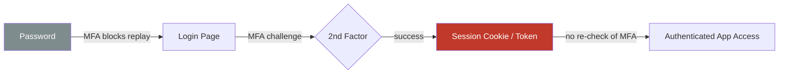

The red node is what AiTM steals. Everything to the left of it is what traditional phishing wasted its time on.

**Why this cannot be fully "fixed" at the password layer:** you can make passwords stronger, add breach detection, force rotation — none of it matters, because the attacker never needs the password after the session exists. The defence has to move to (a) making the *session artefact itself* impossible to replay from another device, and (b) making the *login flow* resistant to being proxied. Both are covered later; keep the distinction in mind throughout.

A quick vocabulary anchor you'll need repeatedly:

| Term | What it is | Why AiTM cares |
|------|-----------|----------------|
| **Session cookie** | Server-set cookie (e.g. `ESTSAUTH`, `sid`) proving an authenticated browser session | The primary theft target for cookie-based apps |
| **Access token** | Short-lived OAuth/OIDC bearer token granting API access | Stolen to call APIs directly as the victim |
| **Refresh token** | Long-lived token that mints new access tokens | The crown jewel — extends access for weeks |
| **Bearer credential** | Any credential where possession = authorisation, no extra proof | The whole class AiTM exploits |
| **Token binding / DPoP** | Cryptographically ties a token to one client key | The main defence that breaks replay |

Hold onto that last row. The entire defensive arc of this chapter is about turning bearer credentials (possession is enough) into **bound credentials** (possession is not enough — you must also prove you're the original client).

---

## Part 2: A Taxonomy of Phishing — Where AiTM Sits

It helps to place AiTM on a ladder of phishing sophistication, because each rung defeats the defence that stopped the rung below it.

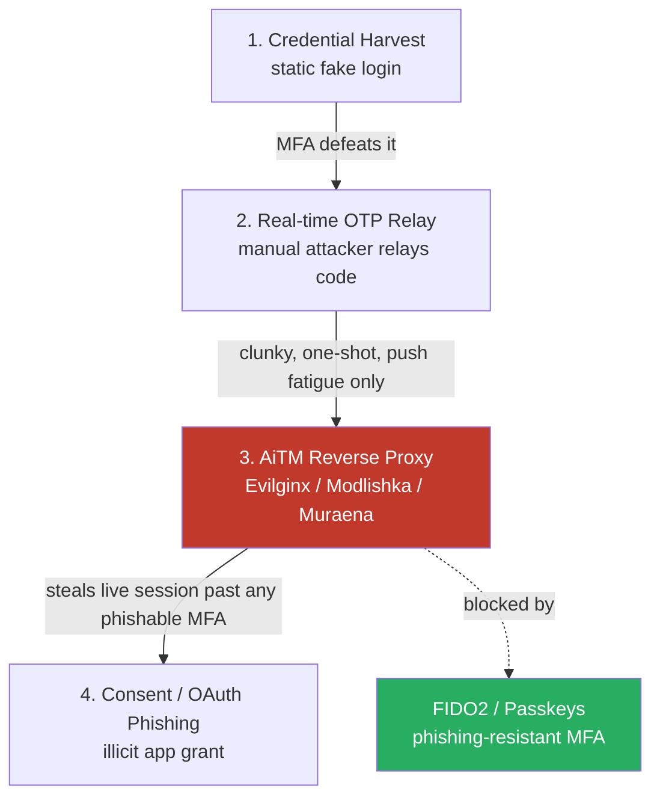

- **Rung 1 — Static credential harvesting.** A fake login page (SET, a cloned HTML page) captures username/password. Defeated by any MFA, because the attacker still lacks the second factor. This is what Chapter 5 covered.
- **Rung 2 — Manual OTP relay.** The attacker's fake page also captures the OTP the victim types, and a human (or script) races to replay it on the real site before it expires (30–60s). Works, but fragile: one code, one shot, no session persistence, and useless against push-with-number-matching or hardware keys.
- **Rung 3 — AiTM reverse proxy (this chapter).** The attacker runs a transparent proxy between victim and real site. The victim completes the *entire* real login, including any **phishable** MFA (OTP, SMS, push, voice), and the proxy silently harvests the session cookie/token the real site issues. This is durable, automatable, and defeats every MFA type *except* cryptographically bound ones.
- **Rung 4 — Consent/OAuth phishing.** A different beast: rather than proxying login, trick the victim into *granting an OAuth app* access to their account. No password needed at all. Complementary to AiTM, briefly contrasted in Part 12.

The green node is the point of the whole chapter from a defender's view: **FIDO2/WebAuthn passkeys break AiTM at rung 3** because the cryptographic challenge is bound to the real origin and cannot be relayed through a proxy. We build up to *why* that is true, mechanically, in Part 10.

**Red team relevance:** in an authorised assessment, demonstrating a working AiTM capture against a test tenant is the single most persuasive way to show leadership that "we enabled MFA" is not equivalent to "we are phishing-resistant." The remediation you'll recommend — phishing-resistant MFA and token protection — is the actual deliverable, not the capture itself.

---

## Part 3: The Reverse-Proxy Phishing Model From Scratch

Before naming any tool, understand the model in the abstract, because Evilginx, Modlishka, Muraena, and the commercial AiTM kits (EvilProxy, Tycoon, Mamba, NakedPages) are all implementations of the same idea.

A normal phishing page is a **clone**: a static copy of the login HTML, disconnected from the real site. It looks right but behaves wrong — it can't complete a real login, so it can only capture whatever the victim types into it.

A reverse-proxy phishing page is **not a clone — it is a relay**. The attacker stands up a server that:

1. Receives the victim's HTTPS request to the phishing domain (e.g. `login.corp-secure-portal.com`).
2. **Forwards that request to the real site** (`login.microsoftonline.com`) as if the proxy were the victim's browser.
3. Receives the real site's response, **rewrites** any hard-coded real-domain references to point back at the phishing domain, and returns it to the victim.
4. Repeats for every request/response in the login sequence — password page, MFA challenge, MFA response, redirect — so the victim experiences the **genuine** login flow, pixel-perfect, because it *is* the genuine flow, merely passing through.
5. Watches the traffic for the moment the real site issues the **session cookie / token**, and copies it.

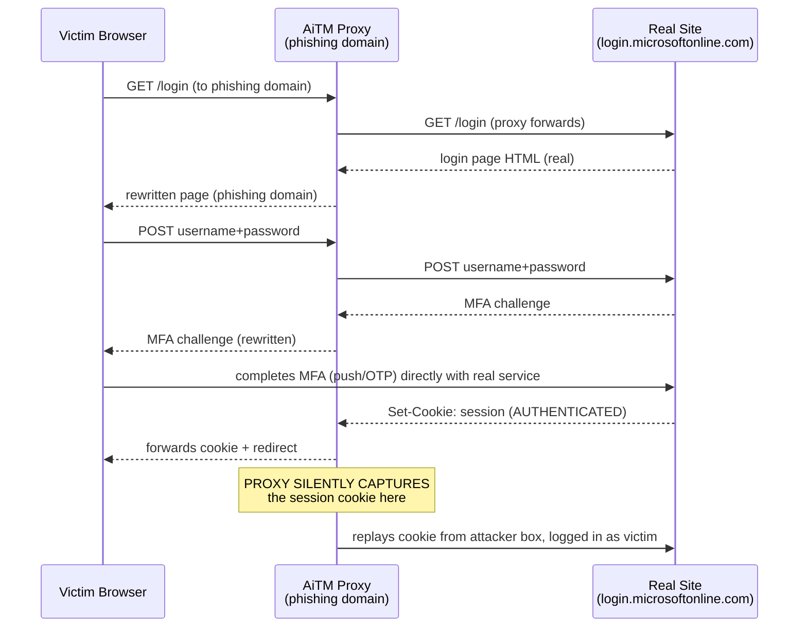

Two things make this devastating:

- **The MFA is real and succeeds honestly.** The victim's authenticator app shows a legitimate prompt from the real service (because the real service is genuinely being asked to authenticate). Number-matching, geolocation on the push, "does this look right?" — all of it can pass, because from the *service's* perspective this is a real login. The only anomaly is the source IP, which is the proxy's, not the victim's.
- **The captured artefact is a fully valid, post-MFA session.** Replaying it from the attacker's browser lands directly in the account, no second factor requested, because the service already considers MFA satisfied for that session.

**The single most important limitation, stated up front:** the proxy relays whatever the real site sends. If the real site's MFA is a **FIDO2/WebAuthn** ceremony, the browser signs a challenge that is *cryptographically bound to the origin the browser actually connected to* — which is the phishing domain, not the real one. The signature is therefore invalid for the real site, and the login fails at the proxy. AiTM cannot forge or relay a WebAuthn assertion. This is not a configuration detail; it is the mathematical reason phishing-resistant MFA works, developed fully in Part 10.

---

## Part 4: HTTP, Cookies and TLS — the Plumbing AiTM Abuses

To follow the mechanics you need three pieces of web plumbing clear in your head. If you've read the Web Fundamentals and Networking notebooks these are revision; here they're framed specifically for AiTM.

### Cookies and their scoping attributes

A cookie is set by the server via a `Set-Cookie` response header and returned by the browser on subsequent requests via the `Cookie` header. The attributes that matter for AiTM:

| Attribute | Meaning | AiTM impact |
|-----------|---------|-------------|
| `Domain` | Which host(s) the cookie is sent to | Proxy must rewrite/scope so the victim's browser sends session cookies through the phishing domain |
| `Secure` | Only sent over HTTPS | Forces the proxy to terminate real TLS on the phishing domain (it does) |
| `HttpOnly` | Not readable by JavaScript | Irrelevant to AiTM — the proxy reads it from the *HTTP layer*, not JS, so `HttpOnly` does **not** stop AiTM |
| `SameSite` | Restricts cross-site sending (`Lax`/`Strict`/`None`) | Affects some redirect flows; not a reliable AiTM defence |
| `Expires`/`Max-Age` | Lifetime | Longer-lived session cookies = longer attacker access after theft |

A defender's instinct is often "we set `HttpOnly`, so cookies can't be stolen." **That defends against XSS-based theft, not AiTM.** AiTM reads the cookie as it passes through the proxy at the network/HTTP layer, where `HttpOnly` has no effect. Understanding *which* cookie defence stops *which* attack class is exactly the kind of precision this notebook insists on.

### TLS termination on the phishing domain

The victim connects to the phishing domain over HTTPS with a valid padlock, because the attacker obtains a legitimate TLS certificate for that domain — trivially, and free, via an ACME certificate authority like Let's Encrypt. The proxy **terminates** that TLS connection (decrypts the victim's traffic), inspects/rewrites it, then opens its **own** TLS connection to the real site. So there are two TLS sessions: victim↔proxy and proxy↔real. The victim sees a valid certificate for the *phishing* domain and a padlock, which is why "look for HTTPS" is worthless advice against AiTM — the padlock is genuine, it's just genuine for the wrong domain.

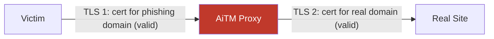

### The domain is the whole game

Everything hinges on the victim connecting to the *attacker's* domain believing it's the real one. That is a pure social-engineering and look-alike-domain problem (Chapter 4's territory): homoglyph domains, `corp-secure-login.com`, `microsoft-verify[.]net`, subdomain tricks, and increasingly abuse of legitimate hosting/redirect services. **The browser's address bar is the last honest signal** — it shows the phishing domain, not the real one. Which is precisely why passkeys, which bind to that exact address-bar origin, are the reliable defence: they enforce in code what humans fail to check by eye.

---

## Part 5: Evilginx — What It Is, From Zero

Now we name the canonical tool. **Evilginx** (currently maintained as Evilginx3, evolved from Evilginx2 by Kuba Gretzky) is an open-source, standalone man-in-the-middle framework written in Go. It is *the* reference implementation of AiTM phishing and the one blue teams most need to understand. It began life built on nginx (hence the name) and was rewritten as a self-contained Go application with its own HTTP/DNS stack.

**What it is:** a transparent reverse proxy purpose-built for login flows, plus a templating system ("phishlets") that describes, per target site, exactly which domains to proxy and which cookies/tokens to capture. It handles TLS certificate provisioning automatically, runs its own DNS, and presents an interactive console for managing "lures" (the links you send).

**Why it exists:** Gretzky built and open-sourced it as an awareness and red-team tool to prove that MFA is not a silver bullet and to push the industry toward phishing-resistant authentication. That educational intent is why we study it — but note that later versions added deliberate friction and the maintainer has restricted access to certain phishlets specifically to slow criminal misuse. We keep to the same spirit: mechanics and defence, lab targets only.

**Core architecture and vocabulary:**

| Concept | What it means |
|---------|--------------|
| **Phishlet** | A YAML config describing a target: which hostnames to proxy, which sub-filters rewrite content, which cookies/tokens to capture as the "auth" credentials, and the success condition |
| **Lure** | A specific phishing URL generated from a phishlet, optionally with a landing redirect, custom path, and per-target parameters |
| **Session** | A captured victim interaction: username, password (if typed), and — critically — the harvested authentication cookies/tokens |
| **Proxy host** | A hostname mapping between the phishing domain and the real target domain that the engine proxies and rewrites |
| **Sub-filter** | A search-and-replace rule applied to proxied traffic so real-domain strings become phishing-domain strings (and back), keeping the flow coherent |
| **Blacklist** | IP/UA filtering to hide the phishing infra from scanners and crawlers (also how operators evade detection — and thus a detection signal for defenders) |

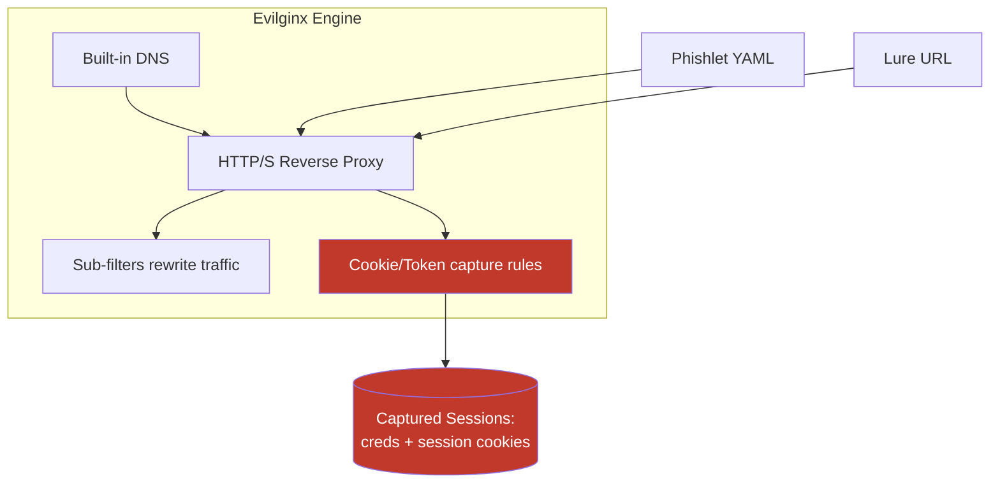

We will **not** author or reproduce a working phishlet for any real provider here. Real phishlets for major identity providers are exactly the "operational weapon" this chapter refuses to hand over, and the maintainer restricts them for the same reason. What follows in the lab (Part 8) uses a *self-hosted lab login app you own*, proxied only to demonstrate the capture mechanic against your own service.

---

## Part 6: How a Phishlet Rewrites a Login (Conceptual Walkthrough)

To defend against AiTM you need to understand what a phishlet actually does to traffic, without needing a live one. Conceptually a phishlet declares four things:

1. **Which hosts to proxy.** A real login often spans several hostnames (the login host, an auth/token host, a CDN for scripts). The phishlet lists each and maps it to a phishing sub-domain. Miss one and the flow breaks — which is why misconfigured AiTM pages sometimes half-load, a detection cue.

2. **Sub-filters (content rewriting).** The real site's HTML/JS/JSON is full of absolute references to its real domains. The proxy rewrites those to the phishing domains on the way *to* the victim, and reverses the substitution on the way *back* to the real site, so both sides stay internally consistent. Example logic in plain terms: "replace `login.microsoftonline.com` with `login.corp-secure-portal.com` in response bodies; replace it back in request bodies."

```text
# Conceptual sub-filter logic (NOT a working phishlet — illustration only)
response_body:  s/real-login.example.com/phish.attacker-domain.tld/g
request_body:   s/phish.attacker-domain.tld/real-login.example.com/g
response_headers: rewrite Location:, Set-Cookie Domain= to phishing domain
```

3. **Auth-token capture rules.** The phishlet names the specific cookies/tokens that represent a completed, MFA-passed session — e.g. "capture cookies named `ESTSAUTH`, `ESTSAUTHPERSISTENT`, `SignInStateCookie` once all are present." When the engine sees those set on a proxied response, it records them as the session's stolen credential and can signal success.

4. **Success/auth condition.** A rule that says "the victim is now authenticated" — usually "all required auth cookies captured" — after which the engine can redirect the victim to a harmless real page so nothing seems amiss.

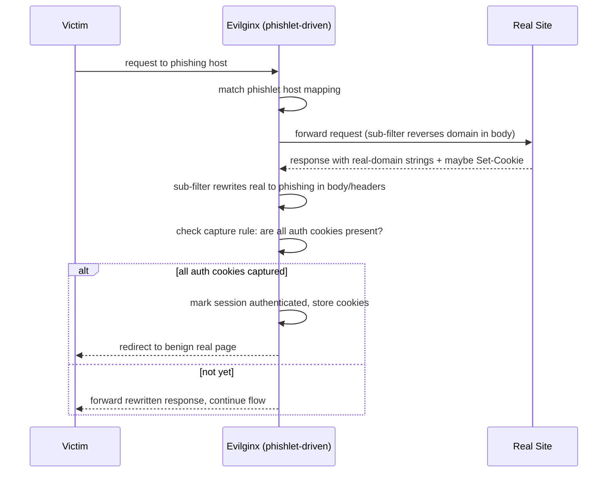

The elegance — and the danger — is that the victim sees the *real* login behaving *normally*, including a genuine MFA prompt on their real authenticator, while the engine quietly waits for the auth cookies to appear. **The only reliable tells are on the wire and in the identity provider's logs, not in the victim's UX** — which is the whole reason detection has to be server-side, developed in Part 11.

---

## Part 7: Why Each MFA Type Falls — or Doesn't

This is the heart of the "bypassing MFA" claim, and precision matters. AiTM does not "bypass MFA" in the sense of skipping it — the victim *does* complete MFA. It bypasses the *protection MFA was supposed to provide* by stealing the post-MFA session. Whether that works depends entirely on the MFA type.

| MFA method | Falls to AiTM? | Why |
|-----------|:--------------:|-----|
| SMS OTP | Yes | Victim types the code into the (real, proxied) page; session issued; proxy steals it |
| TOTP app (Google Authenticator etc.) | Yes | Same — a code typed into the flow; nothing binds it to the real origin |
| Push notification (approve/deny) | Yes | Victim approves a *legitimate* prompt from the real service; session issued and stolen |
| Push with number matching | Yes | The number matches because it's a real login; the human check passes; session still stolen |
| Voice call OTP | Yes | Code relayed by the victim into the flow |
| **FIDO2 / WebAuthn security key** | **No** | Signed challenge is bound to the *actual* origin (phishing domain) → signature invalid for real site |
| **Passkeys (synced FIDO2)** | **No** | Same origin-binding guarantee as hardware FIDO2 |
| **Certificate-based auth (CBA)** | Generally no | Client cert TLS handshake is with the real endpoint; proxy can't produce the private key |

The dividing line is razor-sharp and worth stating as a law: **every MFA method whose "proof" is a value the human copies into the login flow is phishable by AiTM. Every MFA method whose proof is a cryptographic signature bound to the origin is not.** OTP, SMS, push, voice — all copyable proofs. FIDO2/WebAuthn — an origin-bound signature. That is the entire security difference, and it's why the defensive recommendation is never "add more MFA" but specifically "move to phishing-resistant, origin-bound MFA."

**Blue team framing:** if your risk register still treats "MFA enabled" as a single control, split it. Track *phishable MFA coverage* and *phishing-resistant MFA coverage* as separate metrics. The gap between them is your AiTM exposure. This reframing alone is often the most valuable thing a red-team AiTM demo produces.

**A subtlety on push fatigue vs. AiTM:** push-bombing (spamming approve prompts hoping the victim taps yes) is a *different* attack that number-matching largely fixes. AiTM does not rely on victim carelessness at the MFA step at all — the victim approves a prompt that *is* legitimate. That's why number-matching, which defeats push fatigue, does **not** defeat AiTM. Conflating the two leads to a false sense of security; keep them distinct.

---

## Part 8: Hands-On Lab — Observing the Session-Theft Mechanic Against Your Own Service

**Scope and ethics — read before doing anything.** This lab uses only:
- A **login application you own and run yourself** on the lab network (we use a tiny throwaway app).
- A reverse proxy you control, on the same isolated network.
- No real identity provider, no third-party site, no real users, no internet-facing exposure.

The purpose is to *see* the session cookie get captured as it transits a proxy — the core AiTM primitive — using only your own service, so the mechanic is concrete and the defence (Part 10/11) makes sense. We deliberately do **not** run Evilginx against a real provider or build a real phishlet.

### Lab topology

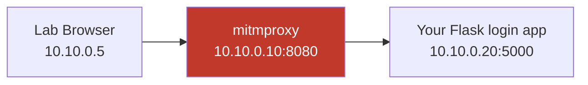

Everything runs on an isolated host-only network (`10.10.0.0/24`) with no route to the internet — the same discipline as the maldoc lab in Chapter 7.

### Step 1 — Stand up a trivial login app you own

We need a service that authenticates and issues a session cookie, so we can watch that cookie in transit. A ~30-line Flask app suffices.

```python
# labapp.py — a throwaway login app for the lab ONLY. Not production code.
from flask import Flask, request, make_response, redirect, render_template_string
import secrets

app = Flask(__name__)
SESSIONS = {}                      # session_id -> username (in-memory, lab only)
USERS = {"alice": "labpass123"}    # single fake lab user

LOGIN = """
<h2>Lab Corp Login</h2>
<form method="post" action="/login">
  <input name="user" placeholder="username"><br>
  <input name="pw" type="password" placeholder="password"><br>
  <button>Sign in</button>
</form>"""

@app.route("/")
def home():
    sid = request.cookies.get("labsession")
    if sid in SESSIONS:
        return f"Welcome back, {SESSIONS[sid]} — you are authenticated."
    return render_template_string(LOGIN)

@app.route("/login", methods=["POST"])
def login():
    u, p = request.form.get("user"), request.form.get("pw")
    if USERS.get(u) == p:
        sid = secrets.token_hex(16)          # the session artefact AiTM would steal
        SESSIONS[sid] = u
        resp = make_response(redirect("/"))
        # HttpOnly set on purpose — to prove it does NOT stop proxy-layer theft
        resp.set_cookie("labsession", sid, httponly=True, samesite="Lax")
        return resp
    return "Invalid credentials", 401

if __name__ == "__main__":
    app.run(host="0.0.0.0", port=5000)
```

Run it:

```bash
python3 -m pip install --break-system-packages flask
python3 labapp.py
#  * Running on http://0.0.0.0:5000
```

Flag-by-flag on the one interesting line, `resp.set_cookie(...)`:
- `"labsession", sid` — the cookie name and its value, a 128-bit random session id. **This value is exactly what AiTM harvests** — possess it, and you are the user.
- `httponly=True` — marks the cookie unreadable by JavaScript. We set it *deliberately* to demonstrate it is **irrelevant** to proxy-layer capture.
- `samesite="Lax"` — restricts cross-site sending; also does not stop an on-path proxy.

### Step 2 — Put a proxy in the middle

`mitmproxy` is a free, open-source interactive HTTPS proxy — think of it as a transparent, scriptable man-in-the-middle you point traffic through. First appearance, so from scratch: it terminates the client connection, lets you inspect/modify every request and response, then forwards to the upstream. It is the standard tool for *understanding* on-path interception (and, for defenders, for reproducing what an AiTM proxy sees).

Install and run it in the reverse-proxy mode pointing at your lab app:

```bash
python3 -m pip install --break-system-packages mitmproxy
# reverse-proxy mode: everything hitting :8080 is forwarded to the lab app
mitmdump --mode reverse:http://10.10.0.20:5000 --listen-port 8080 \
         -s capture_session.py
```

Flag-by-flag:
- `mitmdump` — the non-interactive, scriptable flavour of mitmproxy (good for logging).
- `--mode reverse:http://10.10.0.20:5000` — run as a **reverse** proxy whose fixed upstream is your lab app. This mirrors how an AiTM proxy has a fixed real-site upstream.
- `--listen-port 8080` — where the victim browser connects (the "phishing" endpoint).
- `-s capture_session.py` — load an addon script (below) that watches for the session cookie.

### Step 3 — The capture addon (the AiTM primitive, on your own data)

```python
# capture_session.py — logs the session cookie as it passes through the proxy.
# Demonstrates that HttpOnly does NOT prevent on-path capture.
from mitmproxy import http

def response(flow: http.HTTPFlow):
    sc = flow.response.headers.get("set-cookie", "")
    if "labsession=" in sc:
        # This is the moment an AiTM proxy captures the post-auth session.
        print(f"[CAPTURED SESSION COOKIE] {sc}")
    # also log the cookie replayed on subsequent requests
    ck = flow.request.headers.get("cookie", "")
    if "labsession=" in ck:
        print(f"[VICTIM REPLAYING SESSION] {ck}  (attacker could reuse this)")
```

### Step 4 — Drive the flow and watch the theft

From the lab browser (or `curl`), authenticate *through the proxy*:

```bash
# hit the proxy (:8080), not the app directly
curl -i -c jar.txt -b jar.txt http://10.10.0.10:8080/login \
     -d "user=alice&pw=labpass123"
```

Realistic proxy console output:

```text
[CAPTURED SESSION COOKIE] labsession=6f1c...9ab2; HttpOnly; SameSite=Lax; Path=/
127.0.0.1:52344: POST http://10.10.0.10:8080/login
    << 302 Found  (redirect to /)
[VICTIM REPLAYING SESSION] labsession=6f1c...9ab2  (attacker could reuse this)
```

And the smoking gun — replay the captured cookie from a *different* client with no login at all:

```bash
curl -i http://10.10.0.20:5000/ -H "Cookie: labsession=6f1c...9ab2"
# HTTP/1.1 200 OK
# Welcome back, alice — you are authenticated.
```

**What just happened, and why it's the whole chapter in miniature:** the second `curl` never sent a username, password, or any MFA — it presented only the stolen session cookie, and the server said *"Welcome back, alice."* That is exactly what an AiTM attacker does after harvesting a real, post-MFA session cookie: replay it and inherit the authenticated state. Note that `HttpOnly` was set the entire time and did nothing to stop it, because the theft happened at the HTTP/proxy layer, not via JavaScript.

**Lab takeaways to carry into the defence sections:**
- The session cookie *is* the identity after login; protecting the password protected the wrong thing.
- On-path capture ignores `HttpOnly` and `SameSite`.
- The defence must make the stolen cookie *useless on a different client* (token binding, IP/device conditional access) or prevent the proxy interception from succeeding in the first place (origin-bound MFA). That's Parts 10–12.

---

## Part 9: Infrastructure, OPSEC and the Detection Signals They Leak

Understanding how AiTM operators build and hide infrastructure is not a how-to — it's a *detection* map. Every evasion an operator uses leaves a corresponding trace a defender can hunt.

| Attacker action | Purpose | Defender's detectable signal |
|-----------------|---------|------------------------------|
| Register look-alike / homoglyph domain | Fool the victim's eye | Newly-registered-domain (NRD) feeds; brand-similarity monitoring; certificate transparency (CT) logs |
| Provision free ACME TLS cert | Valid padlock on phish domain | CT logs show certs issued for brand-adjacent names |
| Run reverse proxy in cloud VPS | Host the AiTM engine | Sign-ins from hosting-provider ASNs / datacentre IPs, not user ISPs |
| IP/UA blacklisting of scanners | Hide from crawlers & sandboxes | Sudden cloaking behaviour; page differs for security tooling |
| Route through legitimate redirect/hosting | Reputation laundering | Referrer chains ending at NRDs; open-redirect abuse in logs |
| Replay stolen session from VPS | Use the stolen session | **Impossible-travel** and **new-ASN** anomalies between the real login and the replay |

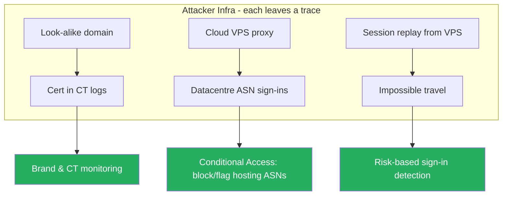

The most reliable of these is the **replay anomaly**: the victim genuinely authenticates from their real device and IP (they're at their desk), but the attacker then uses the stolen session from a datacentre IP, often in another country, sometimes within minutes. That mismatch — same session, two wildly different origins — is the signature identity-protection systems key on. It is *server-side* and *unspoofable by the proxy*, which is why cloud identity telemetry, not endpoint AV, is where AiTM gets caught.

---

## Part 10: Why FIDO2 / WebAuthn Breaks AiTM — the Mechanism in Detail

This is the section every reader should be able to reproduce from memory, because it is the reason a specific defence *provably* works rather than merely helping.

WebAuthn (the browser API) and FIDO2/CTAP (the authenticator side) implement **origin-bound public-key authentication**. When you register a security key or passkey with a site, the authenticator generates a key pair *scoped to that site's origin* (its `rpId`, derived from the domain). Authentication then works like this:

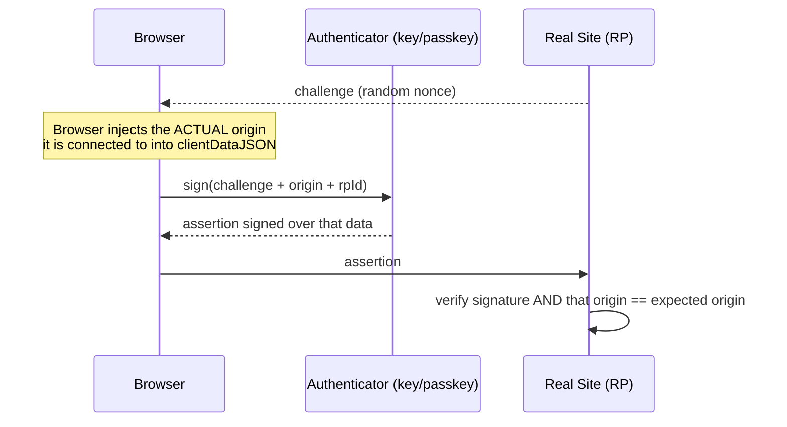

The decisive detail: the browser includes the **actual origin the browser connected to** in the signed `clientDataJSON`, and the authenticator's key is bound to the expected `rpId`. Now run this through an AiTM proxy:

- The victim's browser is connected to `login.corp-secure-portal.com` (the phishing domain), so **that** is the origin baked into the signature.
- The real site expects the origin `login.microsoftonline.com`.
- When the proxy relays the assertion to the real site, the signed origin says *phishing domain* — the real site's verification **rejects it** as origin-mismatched.
- The proxy cannot fix this: it cannot forge the signature (no private key), and it cannot make the victim's browser sign for a different origin than the one it's actually talking to. The origin is asserted by the browser itself, not by anything the proxy controls.

That is why FIDO2/WebAuthn is called **phishing-resistant**: the phishing resistance is a cryptographic property of origin binding, not a policy or a heuristic. An AiTM proxy that works flawlessly against OTP and push simply *cannot complete* a WebAuthn login it is proxying.

**Passkeys** are FIDO2 credentials that can sync across a user's devices (via platform providers); they carry the same origin-binding guarantee, so they inherit the same AiTM resistance while being more usable than a physical key. For most organisations, **rolling out passkeys / FIDO2 for all users is the single highest-impact anti-AiTM control** — it removes the entire phishable-MFA category rather than adding detection after the fact.

Caveats worth stating so the recommendation is honest:
- If a service allows *fallback* to phishable MFA ("lost my key? use SMS"), AiTM targets the fallback. Phishing resistance requires removing or tightly gating fallbacks.
- Account *recovery* and *registration* flows are the new soft target — attackers pivot to enrolling their own key. Harden onboarding/recovery too.
- Some legacy protocols (IMAP/SMTP/basic auth) bypass modern MFA entirely; disable legacy auth or FIDO2 on the front door won't matter.

---

## Part 11: Detection & Defense Angle

This is the consolidated defensive section. AiTM defeats endpoint-centric thinking, so the controls cluster around identity, session integrity, and email/domain hygiene. Organise your program in four layers.

### Layer 1 — Prevent the proxy from succeeding (best)

- **Phishing-resistant MFA (FIDO2/passkeys/CBA) for everyone**, especially admins and high-value roles. As Part 10 shows, this breaks AiTM at the cryptographic level. Remove or gate phishable fallbacks.
- **Token/credential binding.** Bind session artefacts to the client so a stolen cookie is useless elsewhere:
  - *Token Protection / bound sessions* (identity-provider features that tie the refresh/session token to the device's cryptographic key).
  - *DPoP (Demonstration of Proof-of-Possession)* and *mTLS-bound tokens* in OAuth — the token can only be used by the holder of a specific key.
  - Where available, **device-bound session credentials** (emerging browser/OS features) that make a session cookie non-replayable off the original device.

### Layer 2 — Constrain where a session can be used

- **Conditional Access / context-aware access policies:**
  - Require **compliant / managed devices** for sensitive apps → a session replayed from an unmanaged VPS is blocked.
  - **Block or flag sign-ins from hosting/datacentre ASNs and anonymising infrastructure** — AiTM replays come from these, real users rarely do.
  - **Named locations / geofencing** for admin roles.
  - **Continuous Access Evaluation (CAE)** to revoke sessions near-real-time when risk changes, shrinking the window a stolen token is usable.
- **Shorter session/token lifetimes and re-auth for sensitive actions** — reduces the value of any stolen session.

### Layer 3 — Detect the theft and replay

Key hunting signals (map to your SIEM / identity logs):

| Signal | What it catches | Where to find it |
|--------|-----------------|------------------|
| Impossible travel / atypical location | Session replayed from far-away VPS | Identity provider sign-in logs, UEBA |
| Sign-in from hosting/datacentre ASN | Replay from attacker cloud box | Sign-in logs + ASN enrichment |
| New/anomalous session shortly after a normal login | The duplicate AiTM session | Sign-in logs, session IDs |
| Same session token seen from two IPs/devices | Cookie/token replay | Token/session telemetry, proxy logs |
| Newly registered look-alike domains for your brand | Infra being stood up | CT-log & NRD monitoring |
| Certificate issued for brand-adjacent name | Phish TLS provisioning | Certificate Transparency feeds |
| MFA method registration by unusual actor | Attacker enrolling their own factor | Identity audit logs |

A compact detection-logic example (pseudo-KQL-style, adapt to your platform):

```text
SignInLogs
| where ResultType == "success"
| summarize IPs=make_set(IPAddress), ASNs=make_set(ASN) by User, SessionId, bin(TimeGenerated, 15m)
| where array_length(ASNs) > 1                        // one session, two networks
      or ASNs has_any (datacenter_asn_list)           // session used from hosting ASN
| project User, SessionId, IPs, ASNs, TimeGenerated
```

- **Automated response:** on a high-confidence hit — revoke the session/refresh tokens (force sign-out everywhere), require phishing-resistant re-auth, disable the account if warranted, and alert. CAE makes revocation take effect fast.

### Layer 4 — Reduce exposure to the lure

- **Email authentication and filtering** (SPF/DKIM/DMARC from Chapter 4) plus AiTM-aware phishing detection that follows redirect chains to NRDs.
- **Brand & domain monitoring** (CT logs, NRD feeds, typosquat detection) to catch look-alike domains early and take them down.
- **User training that reflects reality:** teach people the padlock and "it looks exactly right" are *not* safety signals against AiTM, and that the address bar is the honest signal. But treat training as defence-in-depth, **not** the primary control — AiTM is specifically engineered to beat human vigilance, so technical controls (Layer 1) carry the load.

**The one-sentence defender's summary:** deploy FIDO2/passkeys to break the attack cryptographically, bind and short-lease sessions so any stolen token is near-useless, and watch identity logs for the replay anomaly — endpoint AV is not where this fight is won.

---

## Part 12: Adjacent Techniques — Contrast to Sharpen the Concept

Knowing what AiTM is *not* prevents muddled defences.

- **OAuth consent / illicit application grant phishing.** The victim is lured to *grant an OAuth app* permissions (read mail, files). No password, no session theft — the victim clicks "Accept" on a real consent screen. Defence: app-consent policies, admin-approval workflows, restrict user consent, review enterprise app grants. FIDO2 does **not** stop this — it's an authorisation-abuse problem, not an authentication one.
- **Device-code phishing.** Abuses the OAuth device-authorization flow: the attacker starts a device-code flow and tricks the victim into entering the attacker's code at the real `microsoft.com/devicelogin`. The victim authenticates (even with FIDO2!) and unwittingly authorises the attacker's device. A genuinely nasty gap because it can survive phishing-resistant MFA. Defence: conditional access on device-code flow, user education specific to "why am I being asked to enter a code?".
- **Push-bombing / MFA fatigue.** Spamming approvals; fixed by number-matching. Distinct from AiTM (Part 7).
- **Session hijacking via infostealer malware.** Malware on the endpoint steals cookies from the browser profile directly — same end state (stolen session) but a different delivery (endpoint compromise, not proxy). Notably, **token binding / device-bound sessions defend against both** AiTM replay and infostealer replay, which is why that control is so valuable.

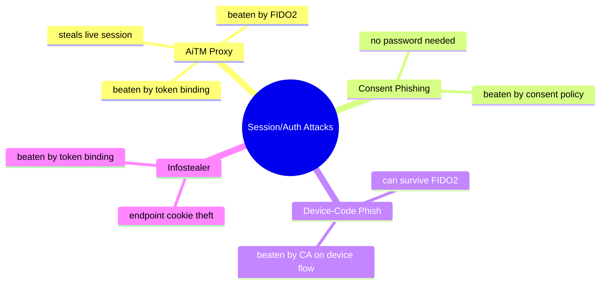

---

## Part 13: Real-World Cases and Scale

AiTM is not theoretical — it is the dominant credential-phishing model against MFA-protected cloud identity.

- **Large-scale AiTM campaigns against Microsoft 365** have been documented repeatedly by defenders: attackers proxy the M365 login, steal session cookies, then use the sessions for **business email compromise (BEC)** — reading mail, hijacking invoice threads, and moving money. A single stolen session has driven six- and seven-figure fraud.
- **Phishing-as-a-Service kits** (EvilProxy, Tycoon 2FA, Mamba 2FA, NakedPages, and others) commoditised AiTM: operators rent turnkey reverse-proxy phishing with pre-built templates for major providers, lowering the skill floor dramatically. Their existence is why "advanced" AiTM is now a *baseline* threat, not a nation-state luxury.
- **Follow-on abuse:** stolen sessions are used to register attacker-controlled MFA methods, create mailbox rules that hide fraud, and pivot to other cloud apps via SSO — turning one proxied login into broad tenant access.
- **The industry's response** — the push for passkeys/FIDO2, token protection, and CAE — is a direct reaction to AiTM's success. That an entire wave of authentication engineering exists to counter this one attack class is the clearest possible statement of how important the session-vs-password distinction from Part 1 really is.

The takeaway for an assessment report: AiTM is *expected*, *cheap*, and *effective* against phishable MFA. Recommending phishing-resistant MFA and token binding is not gold-plating — it's meeting the current baseline threat.

---

## Part 14: Final Revision / Summary

- **Passwords are not the prize; sessions are.** MFA protects the *login event*; it does not protect the *session artefact* that login creates. AiTM steals that artefact.
- **AiTM = transparent reverse proxy** between victim and real site. The victim completes the *genuine* login (including real MFA) through the proxy, which harvests the post-MFA session cookie/token and replays it.
- **The TLS padlock is genuine — for the phishing domain.** "Check for HTTPS" is useless advice here. The address bar (the real origin) is the honest signal, which humans miss and passkeys enforce.
- **Every copyable MFA proof falls** (SMS, TOTP, push, voice, even number-matching). **Every origin-bound cryptographic proof stands** (FIDO2/WebAuthn, passkeys, CBA). That line is the whole security difference.
- **FIDO2 breaks AiTM cryptographically:** the browser signs over the *actual* origin, so a proxied assertion is origin-mismatched and rejected. Not a heuristic — a proof.
- **`HttpOnly` / `SameSite` do not stop AiTM** (they stop XSS/CSRF). On-path capture reads cookies at the HTTP layer.
- **Detection is server-side identity telemetry:** impossible travel, datacentre-ASN sign-ins, one session from two networks, CT-log/NRD monitoring for look-alike domains.
- **Defence-in-depth order:** (1) phishing-resistant MFA + token binding, (2) conditional access + short sessions + CAE, (3) identity-log detection + auto session revocation, (4) email/domain hygiene and realistic training.
- **Evilginx** is the reference AiTM tool (Go, phishlet-driven). We studied its model and the capture primitive on our *own* lab service — never a real provider or a live phishlet.
- **Adjacent, don't confuse:** consent phishing and device-code phishing can survive FIDO2 and need their own controls; infostealers reach the same end via the endpoint. Token binding helps against several at once.

---

## Part 15: Cheat Sheet / Quick Reference

**The core idea in one line:** steal the *session issued after MFA*, not the password.

| You have / see | Meaning | Action |
|----------------|---------|--------|
| MFA enabled, phishable (OTP/push) | AiTM-exposed | Move to FIDO2/passkeys |
| MFA is FIDO2/passkey, no fallback | AiTM-resistant | Harden recovery/registration too |
| Session from datacentre ASN | Likely replay | Investigate / revoke session |
| Same session, two IPs/ASNs | Token replay | Revoke tokens, force re-auth |
| Valid cert for brand-adjacent domain in CT logs | Phish infra forming | Takedown + block domain |
| `HttpOnly` cookies | Stops XSS theft only | Does **not** stop AiTM |

**Defender control stack (memorise the order):**

```text
1. Phishing-resistant MFA (FIDO2 / passkeys / CBA)   <- breaks the attack
2. Token binding / DPoP / device-bound sessions       <- makes stolen tokens useless
3. Conditional Access (managed device, block DC-ASN)  <- constrains use
4. Short sessions + CAE                                <- shrinks the window
5. Impossible-travel / ASN detection + auto-revoke     <- catches replay
6. CT-log / NRD / brand monitoring                     <- catches infra
7. DMARC/DKIM/SPF + AiTM-aware filtering + training    <- reduces lure delivery
```

**MFA-vs-AiTM quick table:**

```text
SMS / TOTP / Voice / Push / Number-matching -> PHISHABLE (falls)
FIDO2 / WebAuthn / Passkeys / Cert-based    -> PHISHING-RESISTANT (stands)
Rule: copyable proof = phishable; origin-bound signature = resistant
```

**Lab primitive recap:**

```text
victim -> proxy -> real app       (login flows through)
real app sets session cookie      (proxy captures it here)
attacker replays cookie           (logged in, no MFA asked)
HttpOnly / SameSite               (do nothing against this)
```

---

## Part 16: Common Pitfalls and Misconceptions

- **"We have MFA, so we're safe from phishing."** The single most dangerous belief in this chapter. Phishable MFA is exactly what AiTM defeats. Safety comes from *phishing-resistant* MFA.
- **"Number-matching stops AiTM."** No — it stops *push fatigue*. In AiTM the number matches because the login is real. Different attack, different fix.
- **"HttpOnly cookies can't be stolen."** They can't be stolen *by JavaScript* (XSS). AiTM steals them at the proxy/HTTP layer where `HttpOnly` is irrelevant.
- **"The padlock/HTTPS means it's legit."** The phishing domain has a valid cert and a real padlock. Only the *domain name* is wrong.
- **"FIDO2 fixes everything."** It breaks AiTM specifically. It does *not* stop consent phishing, device-code phishing, infostealers, or attacks on weak recovery flows. Layer other controls.
- **"Training is the fix."** Training helps but AiTM is engineered to beat human vigilance; make technical controls (FIDO2, token binding, conditional access) the primary defence.
- **"Short-lived access tokens are enough."** Refresh tokens (often long-lived) are the real prize; without binding, a stolen refresh token re-mints access for weeks. Bind and monitor them.
- **"Blocking datacentre ASNs will break users."** Rarely — genuine users almost never sign in from hosting ASNs. Start in report-only mode, then enforce.

---

## Part 17: Practice Labs & Resources

Train the concepts in this chapter specifically — session theft, MFA models, and phishing-resistant auth.

- **Your own Part 8 lab** — extend it: add a fake "MFA" step (a second form), confirm the proxy still captures the final session cookie regardless of the MFA step, proving the session-not-password point with your own hands.
- **WebAuthn.io / webauthn.guide** — register and authenticate with a passkey/security key against a demo relying party; inspect the `clientDataJSON` to *see* the origin being signed. This makes Part 10 concrete.
- **PortSwigger Web Security Academy — Authentication & OAuth labs** — the authentication vulnerabilities and OAuth topic labs build the token/session intuition AiTM abuses (not AiTM itself, but the underlying auth mechanics).
- **Microsoft Entra ID / Okta free developer tenant** — configure Conditional Access, register FIDO2/passkeys, enable sign-in risk policies, and read the sign-in logs. Simulate a "sign-in from a VPS" (your own cloud box, your own test account) and watch the risk detections fire. *Your own tenant and account only.*
- **mitmproxy documentation** — deepen the on-path-proxy understanding from the lab; its interactive mode is excellent for *seeing* request/response rewriting.
- **FIDO Alliance & W3C WebAuthn spec** — read the origin-binding and `rpId` sections; this is the primary source for why AiTM fails against FIDO2.
- **Disclosed BEC/AiTM incident write-ups** (vendor threat-intel blogs on M365 AiTM campaigns and PhaaS kits) — study the *detection* narratives: which log signals caught the replay.

**Practice questions (answer from memory, then verify against the chapter):**

1. A user completes number-matching push MFA on their real authenticator, yet the attacker ends up logged in as them. Explain, step by step, how AiTM made this possible even though the MFA prompt was legitimate and approved correctly.
2. Your org sets all session cookies `HttpOnly; Secure; SameSite=Strict`. A colleague says this stops AiTM cookie theft. Rebut this precisely, naming what those flags *do* stop and what layer AiTM operates at.
3. Explain the exact cryptographic reason a FIDO2/WebAuthn login cannot be completed through an AiTM proxy. Reference `clientDataJSON`, origin, and `rpId`.
4. You see one M365 session ID used from the user's home ISP and, 8 minutes later, from a datacentre ASN in another country. Name the detection this represents and the *automated* response you'd configure.
5. Leadership asks: "We rolled out FIDO2 for everyone — are we done?" Give three attack paths that can still succeed (with their specific defences) and explain why FIDO2 alone doesn't close them.

---

## Part 18: Worked Answers

1. **Number-matching push still falls:** the victim visits the phishing domain and the AiTM proxy forwards every request to the real M365 login. When the real service issues the push, the number matches because it is a *genuine* login the service initiated — the victim sees a legitimate, correct prompt and approves. The real service, satisfied, sets the authenticated session cookie(s). Those cookies pass back *through the proxy*, which captures them. The attacker replays the captured cookies from their own box and is inside the account, no MFA re-prompted, because MFA was already satisfied for that session. Number-matching defends against blind push-bombing (unexpected prompts), not against a prompt the victim *expects* because they're actively "logging in."
2. **HttpOnly/SameSite rebuttal:** `HttpOnly` prevents JavaScript (`document.cookie`) from reading the cookie — it defends against **XSS**-based theft. `SameSite` restricts cross-site cookie sending — it defends against **CSRF** and some cross-site leakage. AiTM operates at the **HTTP/proxy layer**: it reads the `Set-Cookie`/`Cookie` headers as they transit the on-path proxy, where neither flag applies. So those flags are correct hygiene but orthogonal to AiTM. The controls that matter are token binding (makes the cookie non-replayable elsewhere) and origin-bound MFA (prevents the proxied login succeeding).
3. **FIDO2 origin binding:** during WebAuthn authentication the browser builds `clientDataJSON` containing the **actual origin** it is connected to and the server's challenge; the authenticator signs over this using a private key bound to the registered `rpId` (derived from the real domain). Through an AiTM proxy the browser is connected to the *phishing* origin, so that phishing origin is what's signed. The real relying party verifies the signature *and* checks the origin/`rpId` — the origin mismatch (phishing ≠ real) fails verification. The proxy can't forge the signature (no private key) and can't change what origin the browser signs (the browser asserts its true connection). Hence the login cannot complete.
4. **Detection & response:** this is **impossible travel** combined with a **datacentre-ASN sign-in / session-token replay across two networks**. Automated response: trigger a high-risk sign-in policy that **revokes the session and refresh tokens** (sign out everywhere), **requires phishing-resistant re-authentication**, and alerts SOC; with Continuous Access Evaluation the revocation takes effect in near-real-time, cutting off the attacker's stolen session quickly. Optionally disable the account pending investigation.
5. **"FIDO2 for everyone — are we done?" No:** (a) **Phishable fallback** — if users can fall back to SMS/TOTP when a key is "lost," AiTM targets the fallback; fix by removing/gating fallbacks. (b) **Device-code phishing** — the victim can authenticate with FIDO2 yet authorise the *attacker's* device via the device-code flow; fix with conditional access on the device-code flow and targeted training. (c) **Consent phishing / infostealer session theft** — FIDO2 doesn't touch OAuth consent abuse (fix: app-consent policy) or endpoint cookie theft by malware (fix: token binding/device-bound sessions + EDR). So FIDO2 is necessary and high-impact, but recovery/registration hardening, device-flow controls, consent governance, and token binding remain required.

---

## Part 19: Rapid Self-Test (Flashcards)

Cover the right column and recall.

| Prompt | Answer |
|--------|--------|
| What does AiTM steal? | The post-MFA session cookie/token (not the password) |
| Core AiTM component | Transparent reverse proxy between victim and real site |
| Does the victim really complete MFA? | Yes — the genuine flow, on their real authenticator |
| MFA types that fall | SMS, TOTP, push, voice, number-matching |
| MFA types that stand | FIDO2/WebAuthn, passkeys, certificate-based |
| Why FIDO2 resists | Browser signs over the *actual origin*; proxied origin mismatches, rejected |
| Does HttpOnly stop AiTM? | No — that's XSS defence; AiTM reads at HTTP/proxy layer |
| Is the phishing padlock real? | Yes, valid cert for the phishing domain; only the name is wrong |
| Top replay detection | Impossible travel / datacentre-ASN sign-in / one session, two networks |
| #1 preventive control | Phishing-resistant MFA (FIDO2/passkeys) |
| Makes stolen tokens useless | Token binding / DPoP / device-bound sessions |
| Reference AiTM tool | Evilginx (Go, phishlet-driven) |
| Attack that survives FIDO2 | Device-code phishing; consent phishing |
| Fixes push fatigue but NOT AiTM | Number-matching |
| The honest browser signal | The address bar (real origin), not the padlock |

---

## Part 20: ATT&CK Mapping and Reporting Language

For assessment reports and detection engineering, anchor AiTM to shared vocabulary.

| Phase | Technique (MITRE ATT&CK) | AiTM specifics |
|-------|--------------------------|----------------|
| Resource development | Acquire Infrastructure: Domains (T1583.001) | Look-alike domain + ACME cert |
| Initial access | Phishing (T1566) / Spearphishing Link (T1566.002) | Lure to the AiTM proxy |
| Credential access | Adversary-in-the-Middle (T1557) | Reverse-proxy interception of the login |
| Credential access | Steal Web Session Cookie (T1539) | Harvest of the post-MFA session cookie/token |
| Defense evasion / persistence | Modify Authentication Process / MFA registration (T1556.006) | Enrolling attacker MFA using the stolen session |
| Collection / impact | Email Collection / BEC (T1114) | Post-access mailbox abuse, fraud |

**Report phrasing that lands with leadership:** "The organisation's MFA is *phishable*. An authorised AiTM simulation captured a valid, post-MFA session for a test account and reused it from external infrastructure without re-prompting for MFA. Remediation: deploy phishing-resistant MFA (FIDO2/passkeys) for all users with phishable fallbacks removed, enable token protection/binding, and configure Conditional Access to block sign-ins from hosting ASNs and require managed devices for sensitive apps, backed by impossible-travel detection with automatic session revocation." That single paragraph converts an abstract fear into a prioritised, technique-mapped action list.

---

## Part 21: Operator Ethics Recap (Lab-Scoped Discipline)

Everything offensive in this chapter is authorised-testing and defensive knowledge, and the discipline is identical to the maldoc chapter:

- **Only your own systems or systems you're contracted, in writing, to test.** Proxying a real third-party login to capture anyone's session — even "just to see" — is interception of another person's authenticated session and is illegal in essentially every jurisdiction.
- **No real phishlets for real providers here, by design.** We studied the *model* and demonstrated the *primitive* against a lab app we built. That is enough to defend; more would be a weapon.
- **In a real engagement:** use a dedicated test tenant and test accounts, define scope and rules of engagement (Chapter 2's territory), notify defenders per the ROE, and destroy captured sessions after the assessment.
- **The purpose is to move organisations off phishable MFA.** The most valuable thing an AiTM capability produces is the evidence that justifies deploying FIDO2/passkeys and token binding — not the capture itself.

---

## Part 22: The Full Picture — From Lure to Detection

Tying the whole chapter into one flow you can teach from:

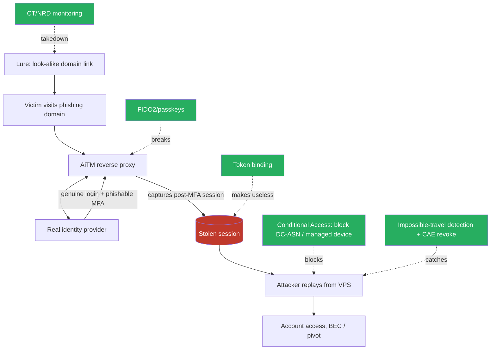

Read the green nodes as your prioritised roadmap: **FIDO2 first** (breaks the attack), **token binding** (defuses any theft), **conditional access + detection** (constrain and catch), **domain monitoring** (starve the lure). Deploy top-down and the AiTM threat collapses from "beats our MFA" to "cryptographically can't complete, and if anything slips through, it's bound, blocked, and alerted."

---

## Part 23: OAuth/OIDC Tokens — What Exactly Gets Stolen in a Token-Based App

Cookie-based apps hand out a session cookie; modern SSO/cloud apps hand out **tokens** under OAuth 2.0 / OpenID Connect (OIDC). Because AiTM against Microsoft 365, Google Workspace, and Okta is really token theft, you need the token model precise.

After an authorization-code flow completes, the identity provider issues three artefacts:

| Token | Purpose | Typical lifetime | AiTM value |
|-------|---------|------------------|-----------|
| **ID token** | Proves *who* authenticated (OIDC claims) | Short | Low on its own — it's an assertion, not an API key |
| **Access token** | Bearer credential to call resource APIs (mail, files) | ~1 hour | High — direct API access as the victim right now |
| **Refresh token** | Redeems for fresh access tokens without re-login | Days to weeks (sometimes rolling) | **Highest** — long-lived, re-mints access repeatedly |

An AiTM proxy that sits in the authorization-code flow can capture the **session/cookie state** that lets it complete the flow *and* the resulting tokens (or the cookies that let it silently re-request tokens). The refresh token is the crown jewel: with it, the attacker scripts new access tokens for the token endpoint for as long as the refresh token lives and isn't revoked — no further victim interaction, no further MFA.

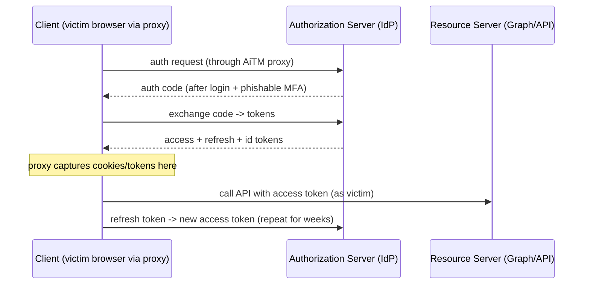

**Why short access-token lifetimes are not enough on their own:** the one-hour access token feels reassuring, but if the attacker also holds the refresh token (or the IdP session cookie that silently re-issues tokens), they simply mint new access tokens indefinitely. The fix is not shorter access tokens alone but **binding** the refresh/session artefact to the original device (Part 24) plus **Continuous Access Evaluation** to revoke on risk. This is why "we use OAuth with 60-minute tokens" is not, by itself, an AiTM defence.

**Scopes matter for blast radius.** The stolen access token carries whatever scopes were granted — `Mail.ReadWrite`, `Files.ReadWrite.All`, etc. Least-privilege scoping and admin-consent governance shrink what a stolen token can do, which is why Part 12's consent-governance controls double as AiTM blast-radius reduction.

---

## Part 24: Token Binding, DPoP and Device-Bound Sessions — the Mechanics That Kill Replay

Part 10 showed how FIDO2 stops the *login* being proxied. This part covers the complementary control that makes a *stolen artefact useless even if capture succeeds* — the "possession is not enough" property. Four related mechanisms:

**1. Token Protection / bound session tokens.** The IdP issues a session/refresh token cryptographically tied to a key held in the client device's secure hardware (TPM/secure enclave). Using the token requires proving possession of that key. A proxy or infostealer that copies the token bytes cannot use them elsewhere because it lacks the private key.

**2. DPoP (Demonstration of Proof-of-Possession, RFC 9449).** The client generates a key pair and, on each token request/use, sends a signed **DPoP proof** JWT (over the HTTP method, URL, and a nonce) in a `DPoP` header. The access token is bound to the public key (`jkt` thumbprint claim). A stolen access token without the matching private key is rejected because the attacker can't produce a valid DPoP proof.

```text
# Conceptual DPoP-bound request (illustrative)
GET /v1.0/me/messages HTTP/1.1
Host: graph.example.com
Authorization: DPoP eyJ...access_token_bound_to_jkt...
DPoP: eyJ...signed proof over (htm=GET, htu=.../messages, nonce)...
# Server checks: token.jkt == thumbprint(DPoP proof key) AND proof signature valid
```

**3. mTLS-bound tokens (RFC 8705).** The token is bound to the client's TLS client certificate; the resource server checks that the presenting client used the same cert. Same idea, TLS layer.

**4. Device-bound session credentials (emerging browser/OS features).** The browser binds the session cookie to a device key so a copied cookie is non-replayable off the original device — directly neutralising both AiTM cookie replay and infostealer cookie theft.

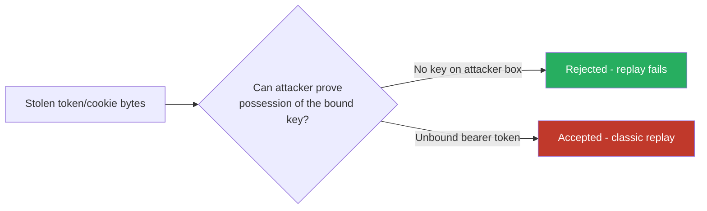

The takeaway: **binding converts the theft from "game over" to "so what."** Even a perfect AiTM capture yields bytes that don't work anywhere but the victim's own device. Combined with FIDO2 (attack can't complete) this is defence-in-depth with two independent cryptographic guarantees.

**Deployment reality:** binding requires client, IdP, and resource-server support, and hardware-backed keys; roll it out first for high-value apps and privileged users, and pair with CAE so that when binding isn't available, risk-based revocation covers the gap.

---

## Part 25: Extended Detection Lab — Turning a Replay Into an Alert

The Part 8 lab proved capture and replay. This extended lab shows the *defender's* half: producing the telemetry that catches the replay, using only your own logs. Because the mini Flask app doesn't emit enterprise sign-in logs, we simulate the detection over a small synthetic log and write the exact rule logic you'd run in a SIEM.

**Step 1 — a synthetic sign-in log (your own data):**

```bash
cat > signins.csv <<'CSV'
timestamp,user,session_id,ip,asn,asn_type
2027-01-24T09:00:05Z,alice,SID-771,203.0.113.20,AS15169-homeISP,isp
2027-01-24T09:07:41Z,alice,SID-771,198.51.100.9,AS14061-cloudVPS,hosting
2027-01-24T09:12:00Z,bob,SID-802,203.0.113.55,AS7922-homeISP,isp
CSV
```

Note the same `session_id` (`SID-771`) appearing from a home ISP and, seven minutes later, from a hosting ASN — the exact AiTM replay signature.

**Step 2 — the detection, as a self-contained script (mirrors the KQL logic in Part 11):**

```python
# detect_replay.py — flags one session used from >1 ASN, or from a hosting ASN.
import csv, collections

HOSTING = {"AS14061-cloudVPS", "AS16509-aws", "AS8075-azure"}  # datacentre ASNs
rows = list(csv.DictReader(open("signins.csv")))
by_session = collections.defaultdict(set)
meta = collections.defaultdict(list)
for r in rows:
    by_session[r["session_id"]].add(r["asn"])
    meta[r["session_id"]].append(r)

for sid, asns in by_session.items():
    hosting_hit = asns & HOSTING
    if len(asns) > 1 or hosting_hit:
        u = meta[sid][0]["user"]
        print(f"[ALERT] session {sid} user={u} used from ASNs={sorted(asns)}"
              f"{' (HOSTING: '+str(sorted(hosting_hit))+')' if hosting_hit else ''}")
```

**Step 3 — run it and read the alert:**

```bash
python3 detect_replay.py
# [ALERT] session SID-771 user=alice used from ASNs=['AS14061-cloudVPS', 'AS15169-homeISP'] (HOSTING: ['AS14061-cloudVPS'])
```

Line-by-line on why this rule works:
- `by_session[...].add(r["asn"])` — collects every ASN a single session was used from. One legitimate session should live on one network path; two disjoint ASNs is the replay tell.
- `asns & HOSTING` — set intersection flags any use from a datacentre ASN, where genuine interactive users almost never sign in.
- The trigger `len(asns) > 1 or hosting_hit` — either condition is suspicious; together they're high-confidence AiTM replay.

**Step 4 — the response you'd wire to the alert (described, not executed):** on a hit, call your IdP's admin API to **revoke the user's refresh tokens / sessions** (force re-auth everywhere), **require phishing-resistant MFA** on next sign-in, and open an incident. With CAE, revocation propagates in minutes rather than at next token expiry. *In the lab we stop at the alert — token-revocation APIs act on real accounts and are out of scope for a synthetic exercise.*

**Tuning notes (so the rule survives production):**
- Whitelist sanctioned corporate egress/VPN ASNs to avoid flagging your own gateways.
- Treat mobile-carrier ASN hops (legitimate roaming) with a wider threshold than home↔hosting jumps.
- Enrich with geo/velocity for a true "impossible travel" calculation (distance ÷ time > feasible speed).
- Alert-fatigue control: rank by whether the second ASN is *hosting* (high) vs merely *different ISP* (medium).

---

## Part 26: Hardening Checklist — Copy Into Your Runbook

A concrete, orderable checklist an organisation can execute, roughly high-impact-first:

```text
[ ] Enforce phishing-resistant MFA (FIDO2/passkeys) for ALL admins       (breaks AiTM)
[ ] Extend phishing-resistant MFA to all users; remove phishable fallback
[ ] Harden MFA registration + account recovery (attacker enrols own key?)
[ ] Enable token protection / bound sessions where supported             (kills replay)
[ ] Adopt DPoP / mTLS-bound tokens for sensitive APIs
[ ] Conditional Access: require compliant/managed device for sensitive apps
[ ] Conditional Access: block or step-up sign-ins from hosting/datacentre ASNs
[ ] Conditional Access on the OAuth device-code flow                     (device-code phish)
[ ] Restrict user OAuth consent; require admin approval; review app grants (consent phish)
[ ] Enable Continuous Access Evaluation (CAE) for fast revocation
[ ] Shorten session lifetimes; re-auth for high-risk actions
[ ] Disable legacy/basic auth protocols entirely
[ ] Sign-in risk + impossible-travel detection -> auto session revocation
[ ] Monitor CT logs + newly-registered domains for brand look-alikes
[ ] Enforce DMARC (reject) / DKIM / SPF; AiTM-aware link/redirect analysis
[ ] Least-privilege scopes so a stolen token's blast radius is minimal
[ ] User awareness: address bar is truth; padlock is not; expect no code prompts
```

The ordering is deliberate: the top items *prevent or neutralise* the attack cryptographically; the middle items *constrain and detect*; the bottom items *reduce exposure and blast radius*. An organisation that completes even the top five has moved AiTM from "reliable win" to "cryptographically blocked and, if anything leaks, bound and revocable."

---

## Part 27: Key Facts to Memorise

- AiTM steals the **post-MFA session/token**, not the password — that one sentence is the whole chapter.
- The attack is a **transparent reverse proxy**; the victim completes the **genuine** login and MFA through it.
- **Copyable MFA proof = phishable** (SMS/TOTP/push/voice/number-matching). **Origin-bound signature = resistant** (FIDO2/passkeys/CBA).
- **FIDO2 resists because the browser signs the *actual origin*** (`clientDataJSON` + `rpId`); a proxied origin mismatches and is rejected.
- **`HttpOnly`/`SameSite` are XSS/CSRF controls, not AiTM controls** — on-path capture ignores them.
- **Refresh token = crown jewel**; short access-token lifetimes alone don't help if the refresh/session artefact is stolen and unbound.
- **Token binding / DPoP / device-bound sessions** make a stolen artefact useless off the victim's device — the "possession isn't enough" property.
- **Detection is identity-side:** one session, two ASNs; sign-in from a hosting ASN; impossible travel; CT/NRD monitoring for look-alike domains.
- **Response:** revoke sessions/refresh tokens, force phishing-resistant re-auth; **CAE** makes it fast.
- **Don't confuse** AiTM with push-fatigue, consent phishing, device-code phishing, or infostealers — device-code and consent phishing can survive FIDO2 and need their own controls.

This closes the Social Engineering series. You now understand the human attack surface end to end — from the psychology of influence, through recon, pretexting, spoofing, tooling, and weaponised documents, to the most advanced credential-phishing model in use today and the specific, provable defence that defeats it. The next notebook moves from tricking humans to evading machines: malware and evasion, kept — as always — conceptual and lab-scoped.
