**Level:** Expert · **Track:** Red Team · **Read time:** 185 min

This is Chapter 9 of the Social Engineering series. The previous chapters built up the email-and-web side of social engineering — pretext development, phishing lures, spoofing, SET, Gophish, weaponised documents, and finally Evilginx-style adversary-in-the-middle attacks that steal a live session past MFA. Every one of those attacks arrives through a mailbox or a browser. This chapter deliberately leaves that channel behind and covers the three vectors that reach a target through a phone line, a text message, or a physical doorway: **vishing** (voice phishing), **smishing** (SMS/RCS phishing), and **physical pretexting** (talking or badging your way into a building).

These channels matter because they route around almost everything the last eight chapters' defenders spent money on. A secure email gateway, DMARC enforcement, a browser isolation stack, and an EDR agent do nothing when the attack is a phone call to the help desk, a text to a personal phone, or a person in a hi-vis vest holding a ladder at the loading dock. The human is reached directly, in a medium with far weaker technical controls and far stronger social pressure. That is exactly why real intrusions — from the 2020 Twitter breach to the 2022 Uber/Rockstar incidents to the 2023 MGM/Caesars casino attacks — leaned on a phone call or a help-desk reset, not a clever email.

A hard rule frames everything here, exactly as in the earlier chapters. **This chapter is written for authorised red-team engagements and for defenders. It explains how these attacks work so you can run scoped social-engineering assessments against organisations that have contracted you to test them, and — above all — so you can detect, harden, and train against them.** It does not endorse impersonating real people, defrauding anyone, or entering premises without written authorisation. Vishing a stranger, spoofing a bank's number, or tailgating into a building you have no permission to enter is illegal in most jurisdictions (wire fraud, computer-misuse, trespass, and telecom statutes all apply). Everything below assumes a signed scope, a get-out-of-jail authorisation letter, and a lab or client environment you are permitted to test.

We will move from the psychology and the telecom plumbing, through each channel's mechanics with real tooling and scripts, into a fully worked lab you can run against your own numbers and a mock help desk, and finish with a consolidated detection-and-defense treatment plus a cheat sheet and practice resources.

## Part 1: Why Non-Email Channels Win — The Threat Model

Start with the defender's spend. A mature organisation in the email era has, roughly in order of budget: a secure email gateway (SEG) doing URL rewriting and sandboxing, SPF/DKIM/DMARC enforcement, an EDR/XDR stack on endpoints, conditional-access policies, and a security-awareness program that has trained everyone to hover over links. Every control on that list is bound to the email-and-endpoint plane.

Now change the medium. A phone call to the IT help desk carries **no SPF record, no DKIM signature, no sandbox, and no URL to rewrite.** An SMS lands on a personal phone that the EDR agent cannot see and the SEG never touches. A person walking through a propped fire door generates no log at all unless a camera happens to catch them and a human happens to review it. The attacker has moved the fight to terrain where the defender has almost no sensors.

There is a second, deeper reason these channels win: **synchronous social pressure.** Email is asynchronous — the victim can pause, forward the message to security, and think. A live phone call removes that pause. The attacker controls the tempo, invents urgency ("I've got the VP on the other line, he needs this reset in the next two minutes"), and exploits the human instinct to be helpful and to avoid conflict in real time. Physical pretexting adds the strongest pressure of all: a person standing in front of you, making eye contact, whom it feels rude to challenge. Psychologists call the underlying levers *authority, urgency, social proof, liking,* and *commitment/consistency* — the same Cialdini principles the series opened with in Chapter 1, but weaponised in a channel where the target cannot step away to verify.

**Red team usage:** on a full-scope engagement, these vectors are frequently the fastest path to initial access precisely because the client under-invests in them. A single successful help-desk vish that resets an MFA token can hand you an authenticated session in ten minutes — faster than weeks of email phishing against a well-trained workforce.

**Blue team usage:** the same asymmetry tells you where to instrument. If you have no telemetry on help-desk identity-verification events, no analytics on inbound SMS to corporate numbers, and no reconciliation of physical-access logs against badge-holder identity, you are blind exactly where the sophisticated adversary now operates.

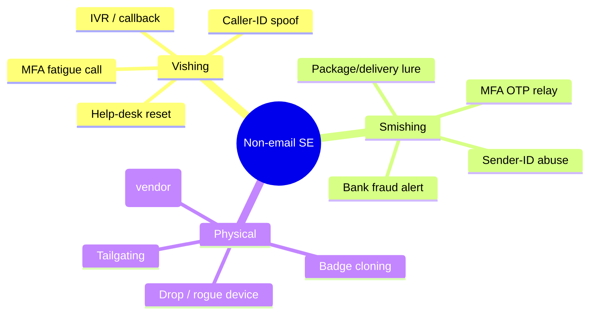

### The channels compared

| Channel | Reaches | Primary controls it bypasses | Dominant pretext | Typical goal |
|---|---|---|---|---|
| Vishing | Any phone (desk, mobile, help desk) | SEG, DMARC, EDR, URL filtering | Authority + urgency (IT/exec/bank) | MFA reset, credential capture, wire fraud, recon |
| Smishing | Personal & corp mobiles | SEG, DMARC, EDR, most DLP | Delivery / bank / account-locked | Credential or OTP capture, malware install |
| Physical | On-site systems, people, paper | Every network control | Vendor / employee / delivery / authority | Rogue device, doc theft, badge clone, direct access |

The rest of the chapter unpacks each of these, starting with the telecom plumbing that makes voice and SMS spoofing possible — because you cannot defend (or realistically simulate) what you do not understand at the protocol level.

## Part 2: The Telephone Network From Scratch — PSTN, VoIP, SS7 and Caller ID

To understand why caller-ID spoofing works, you have to understand that the caller ID your phone displays is **data the caller's carrier asserts, not a verified fact.** The phone network was designed in an era of trusted, state-owned carriers, and identity was never authenticated end to end. Two numbers travel with a call:

- **ANI (Automatic Number Identification):** the billing number, used by carriers and 911/emergency and toll-free routing. Harder to forge because it's tied to trunk billing.
- **CLID / CNAM (Calling Line Identification / Caller Name):** the "caller ID" your handset shows. This is populated from signalling data and a CNAM database lookup. **This is the field that gets spoofed.**

In the legacy circuit-switched world, calls are set up over **SS7 (Signalling System No. 7)**, an out-of-band signalling network. SS7 carries the calling-party number as a parameter in the call-setup message (an IAM — Initial Address Message). Nothing in classic SS7 authenticates that the originating switch is entitled to assert that number. Once VoIP arrived, the situation got worse for defenders and better for attackers: with **SIP (Session Initiation Protocol)**, the calling number lives in the `From:` header and the `P-Asserted-Identity` header of a plaintext (or TLS) SIP INVITE. A VoIP provider that does not validate its customers' right to a number will happily place a call asserting *any* `From:` value.

```mermaid
sequenceDiagram
    participant A as Attacker (SIP client)
    participant P as VoIP provider
    participant C as PSTN / carrier
    participant V as Victim handset
    A->>P: SIP INVITE From: "IT Help Desk" <+1-555-0100>
    P->>C: Route call, assert calling number
    C->>V: Ring — display "+1-555-0100 / IT Help Desk"
    Note over V: Victim sees a trusted-looking number
    V-->>A: Answers; live pretext begins
```

**This is the whole trick.** The attacker's SIP INVITE simply *claims* a `From:` number. If the provider doesn't check, the victim's phone shows it. Historically, services marketed as "spoof cards" and countless VoIP resellers exposed this as a feature.

### STIR/SHAKEN — the fix, and its gaps

The industry response is **STIR/SHAKEN** (Secure Telephone Identity Revisited / Signature-based Handling of Asserted information using toKENs). The originating carrier cryptographically signs the calling number with a certificate and an **attestation level**:

| Attestation | Meaning | Trust |
|---|---|---|
| **A (Full)** | Carrier authenticated the caller AND confirmed they own the number | High |
| **B (Partial)** | Carrier authenticated the caller but can't confirm number ownership | Medium |
| **C (Gateway)** | Carrier just passed the call through (e.g. from an international gateway) | Low |

The terminating carrier verifies the signature and can surface a "verified"/checkmark indication (or, in the U.S., the FTC/FCC-mandated caller-ID authentication). **Why spoofing still works anyway:** STIR/SHAKEN only covers IP-based calls end-to-end; legacy TDM segments break the signature chain, international-origin calls commonly arrive with only C-level attestation, and plenty of small carriers were slow to deploy. An attacker routing through a permissive or offshore provider can still land a call that shows an arbitrary number, just without an "A" attestation. Defenders should treat the **absence of full attestation** as a strong signal, which is exactly what modern carrier spam-labelling leans on.

**Blue team usage:** enterprise telephony (PBX/SBC — Session Border Controller) can be configured to read the `verstat`/attestation result and tag or reject calls that claim to be internal extensions but arrive from outside with low attestation. A call whose `From:` is a CEO's internal DID but which ingresses from a PSTN trunk with C attestation is a near-certain spoof.

### Tools that expose this (conceptual, lab-scoped)

You do not need shady "spoof cards." A red-team lab typically stands up its own telephony with legitimate, auditable providers:

- **Asterisk / FreePBX** — open-source PBX. In a lab you fully control, you can originate calls and set the caller-ID via the dialplan (`Set(CALLERID(num)=...)`), which teaches exactly how the `From:` field is populated. Use only against your own DIDs and consented test lines.
- **Twilio / Plivo / Telnyx** — reputable programmable-voice APIs. They *enforce* that you may only set caller IDs you've verified you own, which is the point: legitimate providers implement the control that fraudsters bypass. Great for building an authorised callback/IVR test where you legitimately own both numbers.
- **SIPVicious / `sipvicious`** — an auditing suite (`svmap`, `svwar`, `svcrack`) for finding and testing SIP devices. On an authorised VoIP pentest this enumerates extensions and weak credentials. (Covered as a tool-from-scratch in Part 7.)

The ethical line is bright: **spoofing a number you do not own, to a person who did not consent, outside a signed engagement, is illegal.** In a scoped test you either (a) use numbers the client provides and authorises, or (b) demonstrate the *capability* against lab lines and report the risk without targeting real staff without written sign-off.

## Part 3: Vishing — Anatomy of a Voice-Phishing Call

Vishing is a live or semi-live phone pretext whose goal is to make the target *do something* — read back a code, reset an account, approve a push, wire money, or reveal information — that they would not do for a stranger. Its structure is remarkably consistent, and learning the structure is what separates a professional social engineer from someone who sounds like a scammer.

A well-built vish has five phases:

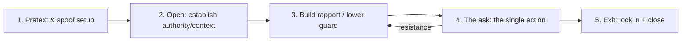

1. **Pretext & setup.** Choose a role that has a legitimate reason to call: internal IT, an MSP, a vendor's support line, HR, a bank's fraud department, a courier. Prepare the caller ID (authorised), a plausible name and employee/ticket number, and *evidence* gathered from OSINT (Chapter 2) — the target's manager's name, a real project, a recent all-hands, the badge-office phone number. The more true details you can drop, the more the false frame is believed.
2. **The open.** Establish the frame in the first ten seconds: who you are, why you're calling, and a reason it's routine. "Hi, this is Dan from the Service Desk, ticket INC0294471 — we're seeing your VPN cert about to expire and wanted to sort it before it locks you out Monday." Authority + a helpful motive + a deadline.
3. **Rapport.** Small talk, empathy, matching pace. This is where the target's guard drops. A skilled operator sounds *bored and routine*, never excited — urgency is asserted about the situation, never felt in the voice.
4. **The ask.** One clear action. Amateurs ask for many things; professionals ask for exactly one, framed as the fastest way to help the target. "I'll push a re-enrolment to your Authenticator now — can you approve it so I can rebind the cert?" or "Can you read me the six-digit code so I can verify the line?"
5. **The exit.** Lock in the win, thank them, give a reason not to call back or verify ("I'll email you the confirmation, no need to do anything else"), and close warmly so the target feels good rather than suspicious.

### A realistic help-desk-reset script (authorised engagement)

The single highest-impact vish in modern engagements is the **help-desk MFA/password reset** — because it directly defeats MFA by convincing IT to re-enrol the attacker's device. Below is a redacted, engagement-style call flow. The *target of the vish is the help desk*, and the *impersonated party is an employee* whose identity you were authorised to use in the scope.

```text
[Setup] Caller ID authorised to display an internal-looking DID.
        OSINT: employee = "Jordan Reyes", mgr = "Priya Nair", dept = Finance,
        recent = office move to 4th floor, new laptop last week.

Help Desk: "IT Service Desk, this is Sam."
Operator:  "Hey Sam — Jordan Reyes, Finance. So embarrassing, I just moved
            desks to the 4th floor and my new laptop won't take my
            Authenticator — it keeps saying 'no registered device.' Priya's
            got me in back-to-back close meetings all afternoon."
Help Desk: "No problem. Can I verify you first? What's your employee ID?"
Operator:  "Yep, E-40912." [obtained via OSINT / badge photo in scope]
Help Desk: "And your manager?"
Operator:  "Priya Nair."
Help Desk: "Great. I can send a temporary re-enrolment link. What's the best
            number?"
Operator:  "Use my cell, it's the only thing working right now — 555-0143."
            [attacker-controlled number in scope]
[The ask] Help desk resets MFA / sends re-enrol link to attacker's device.
[Exit]    "You're a lifesaver, Sam. Have a good one."
```

Notice what made it work: real employee ID and manager name (weak "knowledge-based" verification), a *reason the normal channel is unavailable* (new laptop, back-to-back meetings), and a *reason to use the attacker's number*. **This is precisely the MGM/Scattered-Spider pattern** and precisely why the defense (Part 12) is to stop using guessable knowledge as identity proof.

**Detection preview:** the tell is the *combination* — an MFA re-enrolment to a brand-new device/number, initiated via help desk, for a user whose ticket has no corroborating asset record. Blue teams should alert on "MFA method added" events correlated with help-desk resets.

### MFA-fatigue and "call from IT" push bombing

A lighter vish supports **MFA fatigue** (a.k.a. push bombing): the attacker, already holding a valid password (from a prior leak or phish), triggers repeated MFA push prompts, then *calls the victim* posing as IT: "We're pushing a security update, you'll get a couple of prompts — just approve them to finish." The call converts an annoying flood of denials into a single trusting approval. This was the initial-access technique in the 2022 Uber breach. The defense is **number matching** (the user must type a number shown on the login screen, which the attacker doesn't know) and push-rate limiting — both covered in Part 12.

## Part 4: Vishing Tradecraft — Scripts, Voice, and Live Handling

Building the pretext is half the job; *delivering* it under live pressure is the other half. Professional social engineers rehearse the way actors do.

**Voice and pacing.** Sound routine and slightly bored, never nervous or over-eager. Match the target's speed and vocabulary. Breathe. Silence is a tool — after the ask, stop talking and let the target fill the gap; people rush to be helpful in a pause. Have ambient "office" noise (a busy-help-desk soundscape) if you're calling from a quiet room, because dead silence reads as "scammer in a basement."

**The objection playbook.** Anticipate resistance and pre-script responses so you never sound caught out:

| Target says | Weak (scammer) response | Strong (professional) response |
|---|---|---|
| "Can I call you back on the official number?" | "No, this line only takes outbound." | "Of course — the desk line is [real number], reference ticket INC…; but I'll be off shift in ten minutes so it may bounce to voicemail. Happy to keep going or you can call in, whatever's easier." |
| "What's this regarding exactly?" | Vague stalling | Crisp, specific, boring detail that matches OSINT |
| "I need to check with my manager." | Pushback / urgency spike | "Totally reasonable — want me to loop Priya in? I can wait." (Rarely called; the offer defuses.) |
| "How do I know you're really IT?" | Defensive | Volunteer a verifiable fact (their asset tag, ticket number) *before* asking anything |

The counterintuitive core: **the more willing you appear to let the target verify, the less they actually do it.** Resistance to verification screams fraud; graceful acceptance of it signals legitimacy.

**Warm-up and info-only vishes.** Not every call asks for the crown jewels. Early-stage vishes just harvest details: confirm who handles a system, learn the naming convention for tickets, find out which MSP is used, whether the desk asks for employee ID or a callback. Each low-stakes call feeds the OSINT graph and calibrates the final high-stakes call. Chapter 2's pretext-development work is the input here.

**Callbacks and IVR.** A powerful variant reverses the direction: instead of calling the target, you make the target call *you*. A smish or email tells the victim their account was charged and to "call this number to dispute," which routes to an attacker-run **IVR (Interactive Voice Response)** that mimics a bank — "press 1 for fraud, please enter your card and the code we just texted." Because the victim *initiated* the call, their guard is far lower. This "hybrid" or "callback phishing" model (BazarCall/BazaCall) pairs an email lure with a live vishing agent and has driven major ransomware intrusions. In a lab, you can build a benign IVR with Twilio/Asterisk to demonstrate the flow to a client without touching real victims.

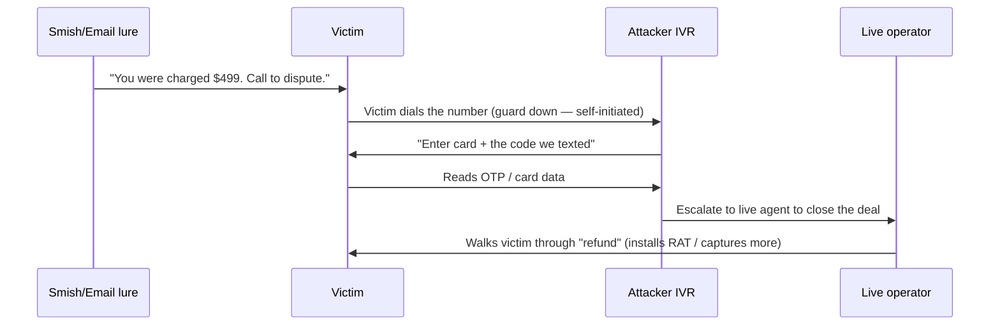

### A full worked vishing case — BEC voice confirmation (annotated)

One of the most damaging vishing patterns pairs with **Business Email Compromise (BEC)**: an email requests a wire or a change of banking details, and a *follow-up phone call* "confirms" it, defeating the "always call to verify" advice because the attacker controls the call. Here is the flow, annotated with the lever each step pulls (authorised simulation only):

```text
[Pre-work] OSINT: CFO = "Marcus Hale", finance clerk = "Dana", a real
           supplier = "Meridian Freight", quarter-end is close (urgency
           is real, not invented). Caller ID authorised to show a
           supplier-looking DID.

Email (spoofed/look-alike domain) -> Dana:
  "Meridian updated banking details, please use the attached remittance
   for this week's invoice. — Accounts, Meridian Freight"
        [Lever: authority + routine business + a real supplier name]

Call (attacker as 'Meridian AR') -> Dana:
  "Hi Dana, it's Priya from Meridian accounts — just following up on the
   banking-update email so your payment doesn't bounce at quarter-end.
   Marcus flagged it to us. Can you confirm you got the new details?"
        [Lever: pre-references the email (proof of legitimacy), name-drops
         the CFO, ties to a real deadline, offers to 'help' avoid a problem]

Dana: "Oh — I was going to call to check."
  "Perfect, that's exactly right to do. You've got our AR line if you need
   it. The only change is the account number, everything else is the same."
        [Lever: praises her caution (disarms), makes verification feel done]

[Outcome in a real attack] Dana updates the payee; the next wire goes to
        the attacker. In the SIMULATION, the finding is logged and no funds move.
```

Why the "call to verify" control failed: Dana verified against the **number and person the attacker supplied**, not an independently-sourced contact. **The fix** is a hard rule: banking-detail changes are confirmed *only* by calling the supplier back on a number from your own records (a prior invoice, the contract), never a number or contact from the request itself — plus dual authorisation for payee changes and a call-back cooling-off period. This is the single control that stops BEC-vish, and it belongs in the finance runbook, not just awareness training.

### Vishing infrastructure and OPSEC

A professional voice engagement runs on infrastructure that keeps the operator anonymous, consistent, and legally clean:

- **Numbers:** authorised DIDs from a reputable provider, one per pretext persona, warmed up and kept consistent across a campaign so a target who calls back reaches the same "desk." Never reuse a burnt number.
- **Voice-changer / soundboard discipline:** professionals rarely disguise their voice (it sounds fake); instead they *match register and vocabulary* to the persona and use a quiet room with an optional office-ambience track. Any pitch-shifting is a red flag to trained listeners.
- **Call recording:** with legal sign-off, calls are recorded for the client debrief — both to prove the finding and to train the client's staff on exactly how they were manipulated. Recording law varies (one-party vs all-party consent); the engagement contract must cover it.
- **Note-taking template:** operators keep a live sheet — persona, target, claims made, information gained, next call — so a multi-call campaign stays consistent and every extracted fact is logged for the report.
- **Failure handling:** if a target becomes suspicious, the operator has a graceful exit ("no problem, I'll re-route this through your manager, thanks for being careful — that's exactly right") that *reinforces* good security behaviour and avoids burning the persona. Never argue; suspicion that ends in a polite exit is far better than a confrontation that triggers an incident report mid-campaign.

**Blue team usage:** the very consistency that helps operators also helps defenders — a cluster of calls from one external number probing multiple employees with process questions is a detectable pattern if the PBX/CDR data is analysed.

## Part 5: Smishing — SMS, RCS, and the Mobile Channel

Smishing is phishing over SMS (and increasingly **RCS** — Rich Communication Services — and OTT apps like WhatsApp). It thrives for three reasons: mobile screens hide URLs and truncate sender info, people trust texts more than email, and the corporate security stack largely can't see a personal phone.

### How SMS routing enables spoofing

An SMS from a business is usually sent through an **SMS aggregator / SMPP gateway** or a programmable-messaging API. The *sender* field can be a long number, a **short code**, or — critically — an **alphanumeric Sender ID** (e.g. "MyBank"). In many countries, alphanumeric sender IDs are historically **unauthenticated**: a gateway will send whatever sender string the customer specifies. That's why a smish can arrive in the *same thread* as a bank's real messages — the phone groups messages by sender string, and "MyBank" collides.

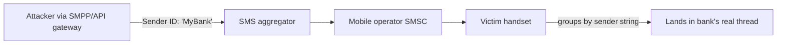

Countermeasures exist and vary by region: **sender-ID registration** (UK, India, and others now require pre-registered, vetted sender IDs), operator **SMS firewalls** that block unregistered alphanumeric senders, and the U.S. **10DLC** (10-digit long-code) registration regime that ties business messaging to a vetted brand/campaign. Where these are enforced, naive sender-ID spoofing is blocked and attackers fall back to look-alike long numbers, hijacked short codes, or OTT apps.

**Blue team usage:** for a defender, unregistered-sender-ID delivery and messages from freshly provisioned long codes are strong fraud signals; enterprises should register their own sender IDs and brand messaging (RCS Business Messaging with verified sender + logo) so customers can distinguish the real thing.

### The smish itself

A smish is short, urgent, and drives to one link or one number. Common families:

| Family | Example text | Goal |
|---|---|---|
| Delivery/parcel | "USPS: your package is held, update address: hxxp://…" | Credential/card capture, malware |
| Bank/fraud alert | "ALERT: $780 debit at BestBuy. Not you? Reply or call…" | OTP relay, callback vish |
| Account locked | "Your Microsoft account is locked. Verify: hxxp://…" | Credential capture (often to Evilginx-style AiTM) |
| Boss/gift-card | "Hey it's [CEO], I'm in a meeting, need a favour — you around?" | Wire/gift-card fraud |
| MFA relay | "[Bank] code: 449120. Do NOT share." + a call to extract it | Real-time OTP theft |

The most dangerous modern smish pairs with **AiTM (Chapter 8)**: the link goes to a reverse-proxy phishlet that relays the login and the OTP in real time, so even the SMS OTP the victim reads is captured and replayed within seconds. Smishing is frequently just the *delivery* layer for the session-theft mechanic you learned last chapter.

### Building an authorised smishing test

For a scoped assessment, you send test messages only to **consented numbers** (client-provided test devices or opted-in staff per the rules of engagement), through a legitimate provider that enforces sender registration:

- **Gophish** (Chapter 6) is email-first but many teams pair it with an SMS API for combined campaigns; the tracking/landing-page infrastructure is reused.
- **Twilio / Plivo / Telnyx Programmable SMS** send the test smish from a registered number, with full logs and opt-out handling. Legitimate providers require 10DLC/sender-ID registration — which, again, is the point: you're modelling the attack within the guardrails.
- The landing page is the same Evilginx/Gophish infrastructure from earlier chapters, scoped to capture-and-report, never to harm.

A minimal Twilio send (authorised test line only) looks like:

```python
# authorised_smish_test.py — send only to consented test numbers in scope
from twilio.rest import Client

# Credentials from a legitimate, registered Twilio account (10DLC-compliant)
client = Client("ACxxxxxxxxxxxxxxxxx", "your_auth_token")

TEST_NUMBERS = ["+15550100123"]   # client-provided, opted-in test devices ONLY
FROM = "+15550100999"             # a number you own and registered

body = ("IT Service Desk: security re-enrolment required by EOD. "
        "Complete here: https://sec-portal.example-lab.test/reenroll "
        "(This is an AUTHORISED security test.)")

for to in TEST_NUMBERS:
    msg = client.messages.create(body=body, from_=FROM, to=to)
    print(f"queued {msg.sid} -> {to}")
```

Flags/fields explained: `from_` must be a number you own and have registered (Twilio rejects arbitrary sender IDs — the guardrail); `body` includes an explicit test disclaimer, which real ethics-review boards require; `TEST_NUMBERS` is populated *only* from the signed scope. The landing domain is a lab domain, and the page reports rather than harvests real credentials in a training exercise.

### Quishing, RCS, and OTT — where smishing is going

The mobile channel keeps evolving, and three shifts matter:

- **Quishing (QR-code phishing).** Instead of a link, the lure is a **QR code** — in an email, a poster, a parking meter, or a "MFA re-enrolment" flyer taped to a wall. The victim scans it with their *phone*, which moves the click to a personal device the corporate stack can't see, and the raw URL is hidden inside the code. Quishing surged precisely because SEGs got good at scanning links but not images. *Defense:* image/QR analysis at the gateway, and awareness that a QR code is just an unverified link you can't read.
- **RCS.** RCS adds delivery receipts, typing indicators, and richer content — which makes a fake message *more* convincing (it looks like an app conversation, not a plain SMS). **RCS Business Messaging** with a verified sender + brand logo is the defensive answer, letting legitimate brands prove themselves; unverified rich messages should be treated with suspicion.
- **OTT apps (WhatsApp, Signal, iMessage, Teams).** Attackers increasingly move to over-the-top messengers to reach targets outside SMS controls entirely — the Uber attacker used WhatsApp; "pig-butchering" and CEO-impersonation scams often start on WhatsApp. There is *no* carrier sender-ID control here at all; trust rests entirely on the user recognising the number and the request.

| Channel | Sender authentication | Corporate visibility | Attacker appeal |
|---|---|---|---|
| SMS | Sender-ID/10DLC (region-dependent) | Low (personal phones) | High reach |
| RCS | Verified sender possible | Low | Richer, more convincing |
| OTT (WhatsApp etc.) | None (just a number/handle) | None | Bypasses all telecom controls |
| QR / quishing | None (opaque link) | Very low (moves to phone camera) | Evades link scanning |

The strategic point for defenders: as you close SMS with registration and 10DLC, attackers migrate to RCS spoof-adjacent tricks, QR codes, and OTT apps. Awareness training must cover *the request*, not *the channel* — "would a legitimate party really ask me to do this, in this way, right now?"

## Part 6: Physical Pretexting — Getting In

Physical social engineering is the discipline of gaining unauthorised physical access — to a building, a floor, a data centre, or just a desk — by exploiting people rather than locks. On a red-team engagement it demonstrates risks no network test can: an unattended workstation, a badge reader that lets anyone tailgate, a "clean desk" with passwords on sticky notes, or an unlocked comms cabinet.

**Ironclad prerequisite:** physical engagements require a **written authorisation letter** ("get out of jail letter") signed by someone with authority over the premises, carried on your person, naming you, the client, the dates, and an emergency contact who will vouch for you to police or security. Without it, you are committing trespass and possibly burglary. Professionals also brief local security leadership, agree "safe words," and define hard boundaries (no forcing doors, no touching production systems, etc.). The 2019 Iowa case, where two authorised physical pentesters were arrested for entering a courthouse, is the standard cautionary tale: get the authorisation scope *exactly* right and confirm who actually owns the building.

**Pre-engagement legal & consent checklist (physical + voice):** before any of this touches a real person or building, confirm every item — a missing one turns a pentest into a crime:

- Signed **authorisation letter** naming operators, client, dates, address(es), and scope, carried on-person.
- **Emergency contact** at the client (24/7) who will vouch for you to police/security, plus a defined **abort/"safe word"** procedure.
- **Rules of engagement:** what's in-bounds (which doors, floors, systems) and hard "do-nots" (no forcing locks, no production changes, no touching non-scoped tenants in shared buildings).
- **Building ownership confirmed** — in shared/leased premises, the client may not have authority over lobbies, other floors, or a landlord's security; verify who can actually consent.
- **Recording consent** for calls (one-party vs all-party jurisdiction) and **data-handling** rules for anything captured.
- **PII / opt-in** confirmation for any staff targeted by name in vishing/smishing, per the contract.

### The core techniques

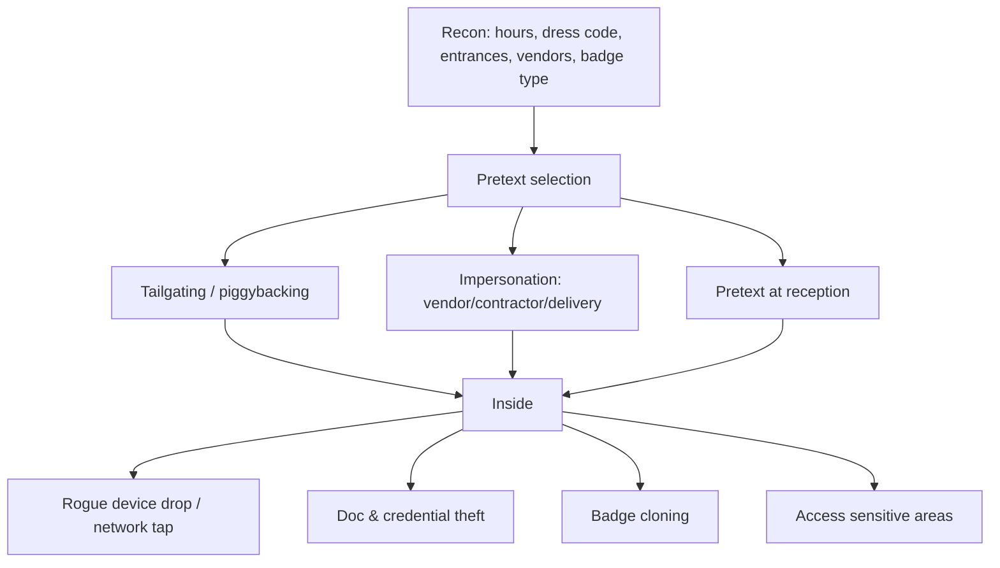

- **Tailgating / piggybacking.** Follow an authorised person through a badge door. Human courtesy holds the door. Techniques: hands full (coffee + boxes), a phone call that keeps you "busy," arriving in the smoking-break crowd, or a confident nod. **Piggybacking** technically means the authorised person *knowingly* lets you in; **tailgating** means they don't notice.
- **Impersonation.** A uniform and a plausible reason: contractor, HVAC/fire-safety inspector, pest control, courier, new hire, auditor, or the classic — the person "from IT here to fix the printer." The uniform and a clipboard do more than any forged ID; people obey the *costume of authority*.
- **Reception pretext.** Talk your way past the front desk with a name-drop ("I'm here to see Priya in Finance, she's expecting me — running late, could you point me to the 4th floor?"). Combine with a prior vish that pre-warms reception ("a contractor named Dan is coming by").
- **Rogue-device drop.** Once inside, plant a device: a small implant on the network (a **Raspberry Pi** or commercial drop box like a **LAN Turtle / Packet Squirrel / Shark Jack**), a **USB Rubber Ducky / OMG cable** at an unattended desk, or a **Wi-Fi Pineapple** for a rogue AP. These give remote persistence for the network side of the test.
- **Badge cloning.** Many facilities use low-frequency **125 kHz HID Prox** cards with *no authentication* — a **Proxmark3** can read one from a short distance and write a clone. Higher-security **13.56 MHz** cards (HID iCLASS, MIFARE) range from trivially cloneable (MIFARE Classic, broken Crypto-1) to hard (iCLASS SE / SEOS with proper key management). Covered as a tool-from-scratch in Part 7.

### The physical pretext playbook

| Pretext | Props | Best target time | Watch-outs |
|---|---|---|---|
| Delivery courier | Uniform, parcel, handheld scanner | Morning rush | Reception may sign & take parcel — have a "signature required from recipient" reason |
| Fire/safety inspector | Hi-vis, clipboard, ID lanyard | Business hours | May trigger facilities call — know the inspection body |
| IT/printer tech | Polo, toolbag, work order | Mid-morning | Real IT may be paged; have a ticket number |
| New hire / lost badge | Lanyard, "first day" nerves | Start of day | Ask to be walked to HR — often escorted *in* |
| Smoking-break tailgate | Cigarette, casual dress | Break times | Side/rear doors, cameras |

The unifying psychology: **people avoid confrontation.** Challenging a confident, appropriately-dressed stranger feels rude and risks being wrong in front of colleagues. The social engineer weaponises that discomfort. The defense — a culture where challenging politely is *expected and rewarded* — is the single highest-leverage control (Part 12).

### Beyond the badge — locks, long-range readers, and the USB-drop statistic

Badge cloning is one of several physical primitives. A few others every operator (and defender) should understand:

- **Under-door and latch bypass.** Many interior doors are secured only by a latch (not a deadbolt). An **under-door tool** (a stiff wire loop) reaches the interior lever/push-bar; a **latch slip** ("loiding" with a shim) retracts a spring latch on a door with a gap. **Request-to-Exit (REX) sensors** — the motion detectors that unlock a door for people leaving — can sometimes be triggered from outside by puffing air or slipping a device under the door, defeating the badge reader entirely. *Defense:* deadbolts on sensitive doors, REX sensors tuned and positioned to avoid outside triggering, door gaps sealed.
- **Long-range RFID capture.** LF Prox badges can be read at distance with a purpose-built **long-range reader** concealed in a bag or clipboard — an attacker only has to stand near a target in a lift or queue. This raises the badge-cloning risk from "needs a brush-past" to "needs to be in the same room." *Defense:* shielded badge holders (RFID-blocking sleeves), higher-security credentials with mutual authentication.
- **The USB-drop reality.** Research (notably a University of Illinois study) found that of USB drives scattered in a car park, roughly **45–98% were plugged in**, many within minutes — people are overwhelmingly curious and helpful. This is why a "drop" (a labelled USB stick, an "HR bonuses" file) remains effective. On engagements the payload is a benign beacon that phones home to prove the click; the finding drives USB device control and awareness. *Defense:* EDR USB HID/storage blocking, disabling autorun, and awareness that "found" media is never plugged in.
- **Dumpster diving & shoulder surfing.** Discarded documents, printouts, and sticky notes yield org charts, project names, and sometimes credentials; watching someone type a PIN or badge code is the lowest-tech capture of all. *Defense:* shred policy, clean-desk enforcement, privacy screens.

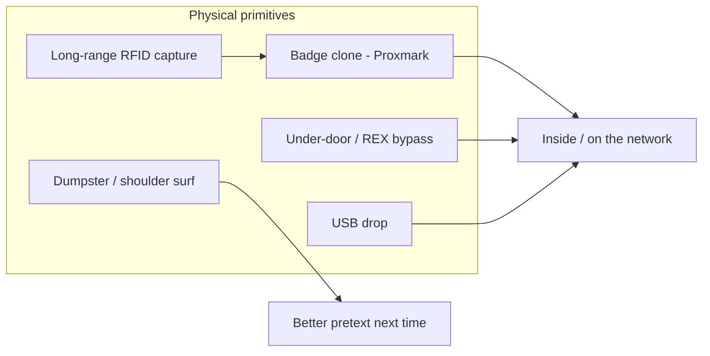

## Part 7: Building the Lab and the Toolkit From Scratch

Before the worked lab, we teach each tool from zero, per the authoring standard. Everything here is used only against your own equipment, your own numbers, and consented test targets.

### Asterisk / FreePBX (software PBX)

**What it is:** Asterisk is an open-source private branch exchange — software that acts as a phone switch. FreePBX is a web GUI on top of it. **Why it exists:** to let organisations (and labs) run their own telephony: extensions, IVRs, call routing, voicemail. **Why the red team cares:** it lets you build an *authorised* vishing/IVR range end-to-end — originate calls between numbers you own, build a fake-bank IVR for a callback demo, and *observe firsthand* how the caller-ID (`CALLERID`) field is set, which demystifies spoofing without breaking the law.

Install on a lab box (Debian/Ubuntu):

```bash
# Lab-only PBX install (isolated VM/VLAN, no PSTN trunk unless you own the DIDs)
sudo apt update && sudo apt install -y asterisk
sudo systemctl enable --now asterisk
sudo asterisk -rvvv          # connect to the running Asterisk CLI, very verbose
# CLI health checks:
#   core show version         -> confirm build
#   pjsip show endpoints      -> registered devices
#   dialplan show             -> loaded call routing
```

A minimal dialplan snippet showing how caller ID is *just a variable* (this is the whole demystification):

```ini
; /etc/asterisk/extensions.conf  (LAB extension context)
[lab-outbound]
exten => _X.,1,NoOp(Lab call — caller ID is set by us, not verified by anyone)
 same => n,Set(CALLERID(num)=5551234567)     ; the "spoof": we assert this number
 same => n,Set(CALLERID(name)=IT Service Desk)
 same => n,Dial(PJSIP/${EXTEN}@lab-trunk)     ; only to DIDs you own
 same => n,Hangup()
```

The lesson: `Set(CALLERID(num)=...)` writes whatever you want into the field the callee sees — *there is no authentication step*. STIR/SHAKEN (Part 2) is the layer that later signs this at the carrier, which is why lab trunks without proper attestation get flagged.

### SIPVicious (VoIP auditing)

**What it is:** a suite (`svmap`, `svwar`, `svcrack`, `svreport`) for auditing SIP infrastructure. **Why:** on an authorised VoIP pentest you need to find SIP devices, enumerate valid extensions, and test for weak passwords — the same recon a phone-system attacker would do. **From zero:**

```bash
pipx install sipvicious            # or: git clone github.com/EnableSecurity/sipvicious
# 1) Discover SIP devices on an AUTHORISED range:
svmap 10.10.10.0/24                 # scans for SIP services (like nmap for SIP)
# 2) Enumerate valid extensions on a target PBX you're authorised to test:
svwar -m INVITE -e 100-200 10.10.10.5   # -m method, -e extension range
# 3) Test extension passwords (authorised only):
svcrack -u 101 -d wordlist.txt 10.10.10.5  # -u user/ext, -d dictionary
```

Flag notes: `-m INVITE` uses INVITE-based enumeration (noisier but works where REGISTER is filtered); `-e` is the extension range to sweep; `svcrack -d` runs a dictionary against an extension's SIP auth. Only ever run against a PBX in your engagement scope — SIP scanning across the internet is both illegal and rude.

### Proxmark3 (RFID/badge)

**What it is:** the reference RFID research/pentest tool, supporting both 125 kHz (LF) and 13.56 MHz (HF) cards. **Why:** physical engagements frequently hinge on cloning an access badge. **From zero, on your own test cards:**

```bash
# Proxmark3 RRG/Iceman firmware client
pm3
# --- Low-frequency (125 kHz HID Prox) ---
[usb] pm3 --> lf search             # identify the card type on the antenna
[usb] pm3 --> lf hid read           # read a HID Prox card's facility+card number
[usb] pm3 --> lf hid clone -r 2004060f8    # write that ID to a writable T5577 card
# --- High-frequency (13.56 MHz MIFARE Classic) ---
[usb] pm3 --> hf search
[usb] pm3 --> hf mf autopwn         # attack weak Crypto-1 keys (nested/darkside)
```

The takeaway for both offense and defense: **LF HID Prox has no cryptography** — reading and cloning is trivial with physical proximity, which is why high-security sites moved to iCLASS SE/SEOS with mutual authentication. **Blue team usage:** inventory your badge technology; if you're still on 125 kHz Prox or MIFARE Classic, a Proxmark in a jacket pocket clones a badge from a brush-past in a lift.

### Rogue-device drop boxes (conceptual)

Commercial and DIY implants — Raspberry Pi with a 4G modem, Hak5 LAN Turtle/Packet Squirrel/Shark Jack, Wi-Fi Pineapple, USB Rubber Ducky/O.MG cable — provide network persistence or keystroke injection once physically placed. On an engagement they are deployed only where the scope authorises, logged, and *retrieved* at the end (leaving hardware behind is both an OPSEC and a liability problem). The detection side (NAC, 802.1X, USB device control) is in Part 12.

## Part 8: Hands-On Lab — An Authorised Multi-Channel Pretext, End to End

This lab strings the channels together the way a real engagement does, entirely within equipment and numbers you own or that the client consented to in writing. **Objective:** demonstrate that a smish → callback-vish → help-desk-reset chain can obtain an MFA re-enrolment, and capture the telemetry a blue team would need to catch each step. Nothing here targets a non-consenting person or a real production account.

### Lab topology

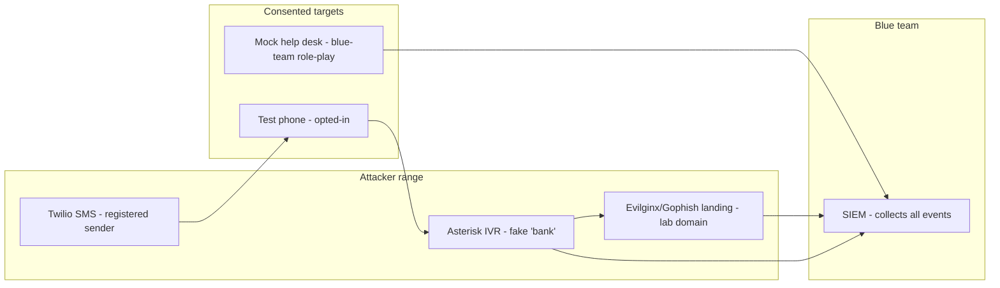

### Step 1 — Recon the (consented) target profile

You are given a test persona in scope: *Jordan Reyes, Finance, employee E-40912, manager Priya Nair.* In a real engagement these come from OSINT (Chapter 2 — LinkedIn, breach data, the company org chart). Record the *knowledge-based verification* the mock help desk uses (employee ID + manager) — that is the control you will show is weak.

### Step 2 — The smish (delivery layer)

Send the authorised test message (Part 5 script) to the opted-in test phone:

```bash
python3 authorised_smish_test.py
# queued SM3f9a...  -> +15550100123
```

Sample received text on the test device:

```text
IT Service Desk: security re-enrolment required by EOD.
Complete here: https://sec-portal.example-lab.test/reenroll
(This is an AUTHORISED security test.)
```

**What the blue team should see:** an inbound message from a newly-registered long code containing a URL to a domain registered days ago, resolving to attacker infrastructure — three correlated fraud signals.

### Step 3 — The callback IVR (Asterisk)

If the test user calls the number instead of clicking, the Asterisk IVR answers as a "verification line." A trimmed dialplan:

```ini
; /etc/asterisk/extensions.conf
[lab-ivr]
exten => s,1,Answer()
 same => n,Playback(custom/verify-your-identity)     ; "To verify, enter your 6-digit code"
 same => n,Read(CODE,beep,6)                          ; capture 6 digits (lab OTP)
 same => n,NoOp(Captured lab code: ${CODE})           ; logged to Asterisk full log
 same => n,Playback(custom/thank-you)
 same => n,Hangup()
```

Sample Asterisk CLI output during the call:

```text
    -- Executing [s@lab-ivr:1] Answer("PJSIP/testphone-00000003", "")
    -- Executing [s@lab-ivr:2] Playback("...", "custom/verify-your-identity")
    -- Executing [s@lab-ivr:3] Read("...", "CODE,beep,6")
    -- User entered '449120'
    -- Executing [s@lab-ivr:4] NoOp("...", "Captured lab code: 449120")
```

**What the blue team should see:** in a real setting, an outbound call from an internal user to an unrecognised external number immediately after a smish — a strong correlation rule.

### Step 4 — The help-desk vish (the actual defeat of MFA)

Now the human step, role-played with a colleague acting as the mock help desk. Use the Part 3 script. The success condition is the mock desk agreeing to send an MFA re-enrolment link to the attacker's number *based only on employee ID + manager name.* Record the call (with consent) for the debrief.

### Step 5 — Capture the win and the telemetry

If the mock IdP (e.g. a lab Azure AD / Keycloak) is wired to the SIEM, the re-enrolment produces an auditable event. Example Keycloak/Entra-style event you would hunt on:

```json
{
  "event": "MFA_METHOD_ADDED",
  "user": "jordan.reyes@corp.lab",
  "method": "authenticator_app",
  "device": "NEW-UNENROLLED-DEVICE",
  "initiated_by": "helpdesk_reset",
  "src_number": "+15550143",
  "ticket": "INC0294471",
  "asset_match": false,
  "risk": "HIGH"
}
```

### Step 6 — Blue-team hunt queries

Turn the chain into detections. Example SIEM pseudo-queries (adapt to Splunk SPL / Sentinel KQL):

```sql
-- 1) MFA method added shortly after a help-desk reset, to a new device
index=idp event=MFA_METHOD_ADDED device="NEW*"
| join user [search index=helpdesk action=reset]
| where asset_match=false
| stats count by user, src_number, ticket
```

```kql
// 2) Sentinel KQL: user calls an external number right after inbound smish
SmsGateway
| where Direction == "inbound" and SenderAgeDays < 7 and Body has "re-enroll"
| join kind=inner (CallDetailRecords | where Direction=="outbound" and CalleeReputation=="unknown")
  on UserId
| project TimeGenerated, UserId, SenderId, CalleeNumber
```

**Debrief output:** each step is mapped to a control gap — smish delivered (no SMS firewall / sender registration), callback answered (no user awareness of callback scams), help-desk reset succeeded (knowledge-based verification), MFA added to new device (no out-of-band re-verification). Every gap becomes a recommendation in Part 12.

## Part 9: OSINT and Pretext Fuel — Where the Details Come From

A vish or physical pretext is only as convincing as its details, and those details come from reconnaissance (Chapter 2 and the Recon/OSINT notebook). The specific fuel each channel needs:

| Detail | Source | Used for |
|---|---|---|
| Org chart / manager names | LinkedIn, company site, SEC filings | Help-desk verification answers, name-drops |
| Employee ID format | Badge photos, leaked docs, prior vish | Passing weak verification |
| Ticketing system + prefix | Job ads (mentions ServiceNow), signatures | Believable ticket numbers ("INC…") |
| Phone/DID ranges | Website contact pages, PBX enumeration | Plausible caller ID, extension guessing |
| Office layout / floors | Job posts, Instagram/Glassdoor photos | Physical pretext ("moved to 4th floor") |
| Vendors/MSP names | Case studies, job ads, LinkedIn | Impersonating the right third party |
| Dress code / badge type | Recon photos, Google Street View | Physical costume, badge-tech choice |
| Recent events (mergers, moves, outages) | News, social media | Timely, believable urgency |

**Red team usage:** the OSINT phase for a social-engineering test is often longer than the "attack" phase; a five-minute call succeeds because of five days of research. **Blue team usage:** reducing your public attack surface (limiting who's publicly listed as "IT Help Desk," not posting badge-visible photos, generic auto-replies) starves these pretexts.

A compact recon aid — pulling public employee names to model the pretext pool (authorised, public-source only):

```bash
# theHarvester — passive OSINT for a domain in scope (earlier-chapter tool)
theHarvester -d example.com -b bing -l 200
#   -d target domain   -b data source   -l limit results
# Output feeds the pretext: names, roles, email format -> infer employee-ID/manager graph
```

## Part 10: Real-World Cases — What Actually Happened

These channels aren't theoretical; they drive the biggest breaches of the last few years. Studying them calibrates both the offense (what works) and the defense (what failed).

- **2020 Twitter breach.** Attackers **vished** Twitter employees, impersonating internal IT, and walked targets to a phishing page to capture VPN/credential and MFA details — gaining access to internal admin tooling and hijacking high-profile accounts. *Lesson:* internal-IT impersonation over the phone defeats even a sophisticated tech company.
- **2022 Uber breach.** An attacker had a contractor's password, launched **MFA-fatigue** push bombing, then messaged the victim on WhatsApp posing as Uber IT to get the push approved. *Lesson:* push-approval MFA falls to fatigue + a vish; number-matching would have blocked it.
- **2022 "0ktapus"/Scatter Swine campaign.** Mass **smishing** of telecom/tech employees with Okta-login look-alike pages harvested credentials and OTPs from 100+ organisations. *Lesson:* smishing at scale + AiTM-style OTP capture is a supply-chain-level threat.
- **2023 MGM Resorts & Caesars (Scattered Spider).** Attackers **vished the IT help desk**, impersonating employees, to reset credentials/MFA — leading to enterprise-wide ransomware and, at MGM, days of operational outage. Caesars reportedly paid a large ransom. *Lesson:* help-desk identity verification is a top-tier enterprise risk; knowledge-based questions are not identity proof.
- **BazarCall / callback phishing (2021–present).** Emails about a "subscription charge" drive victims to call attacker **IVRs**, where live agents talk them into installing remote-access tooling — an initial-access vector for Ryuk/Conti-lineage ransomware. *Lesson:* the callback direction (victim-initiated) neutralises "don't click links" training.

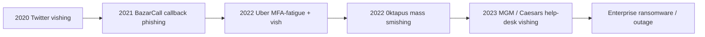

The through-line: **the phone and the help desk are the soft underbelly of otherwise hardened enterprises.** The next parts are the numbers and then the consolidated defense.

## Part 11: The Numbers — Scale, Cost, and Why This Keeps Working

A short, concrete grounding in why organisations should fund defense here. Vishing and smishing are not fringe: industry telemetry consistently shows **smishing and vishing volumes rising year over year**, with callback-phishing and help-desk social engineering singled out by incident-response firms (Mandiant, CrowdStrike, Unit 42) as leading *initial-access* techniques for ransomware. The economics favour the attacker brutally: a single successful help-desk vish can cost minutes and yield domain-wide access, while the defender must get identity verification right on *every* call, forever. Regulators responded — the U.S. FCC's STIR/SHAKEN mandate, 10DLC registration, and sender-ID regimes abroad — precisely because the underlying protocols never authenticated identity.

The defensive implication is a *base-rate* argument: because these channels are high-yield and low-cost for attackers and under-instrumented for defenders, the marginal security dollar often buys more risk reduction in help-desk process and phone/SMS telemetry than in yet another email control.

## Part 12: Detection & Defense Angle

This is the one consolidated defensive section (per the authoring standard). It spans people, process, and technology across all three channels.

### Against vishing and help-desk attacks

The single most important control is **removing knowledge-based verification.** Employee ID, manager name, date of birth, and last-four are all OSINT-able and therefore worthless as identity proof. Replace with:

- **Out-of-band re-verification** for any credential/MFA reset: a push to the user's *already-enrolled* authenticator, a call back to the number on record (not the caller's number), or verification by the user's manager through a separate channel.
- **Video-verify / in-person** for high-risk resets (privileged accounts): require a live video call showing a corporate ID, or an in-person visit.
- **Strong identity proofing** via a dedicated identity-verification vendor for remote resets.
- **A "no rush" culture:** help-desk staff are explicitly authorised to slow down, escalate, and *not* be punished for making a legitimate-but-impatient caller wait. Attackers weaponise urgency; policy must neutralise it.
- **Number matching + rate limiting** on push MFA to kill MFA-fatigue; move toward **phishing-resistant FIDO2/passkeys** so there's no OTP or push to socially engineer at all (ties back to Chapter 8).
- **Callback scam awareness:** train staff that *the direction of the call doesn't confer trust* — a number in a text is not verified.

**Detection telemetry:**

| Signal | Where | Rule idea |
|---|---|---|
| MFA method added to new/unenrolled device | IdP audit log | Alert when `device=new` AND source is help-desk reset AND asset doesn't match |
| Help-desk reset volume/anomaly | ITSM | Spike per-agent or per-user, off-hours resets |
| Inbound call spoofing internal DID from PSTN | SBC/PBX | Low STIR/SHAKEN attestation + `From` = internal extension |
| Push-approval floods | IdP | >N prompts in M minutes to one user |

### Against smishing

- **Register and brand your messaging:** enrol sender IDs / 10DLC, adopt **RCS Business Messaging** with verified sender + logo so customers can tell real from fake.
- **Enterprise mobile management (MDM/UEM):** where corporate phones are in scope, mobile threat defense (MTD) can flag malicious links; corporate policy should steer sensitive workflows off SMS.
- **Kill SMS OTP where possible:** SMS OTP is phishable and SIM-swappable; move to app-based or FIDO2. If SMS OTP remains, train users that *no one legitimate will ever ask you to read a code aloud or type it into a site you reached from a text.*
- **Report-and-block pipelines:** an easy "report spam text" path (e.g. forwarding to 7726/"SPAM" in the U.S./UK) feeds carrier and enterprise blocklists.

### Against physical pretexting

- **Anti-tailgating engineering:** mantraps/turnstiles at high-security entries, badge-in *and badge-out*, and — most importantly — a **challenge culture** where employees are trained and *rewarded* for politely asking "Hi, can I help you find someone?" of anyone they don't recognise.
- **Visitor management:** every visitor logged, badged, escorted; vendors verified against a pre-approved list by calling the *known* vendor number, not a number the visitor provides.
- **Badge hardening:** retire 125 kHz HID Prox and MIFARE Classic; move to iCLASS SE/SEOS or equivalent with proper key management; consider mobile credentials with device binding.
- **Endpoint & network defenses against drops:** **802.1X / NAC** so a rogue device can't just get an IP; **USB device control** (block HID injection / storage) via EDR; port security and rogue-AP detection on the wireless side.
- **Clean-desk and lock-screen policy** enforced, so a moment of physical access yields nothing.
- **Red-team validation:** the only reliable way to know if the above works is to test it under authorisation — which is the whole point of this chapter's offensive knowledge.

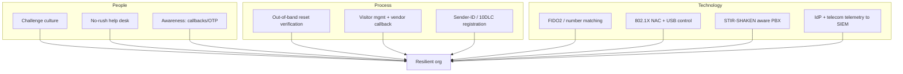

## Part 13: Elicitation — Extracting Information Without Asking

The most dangerous vishing calls never ask a direct question, because a direct question ("what's your password?") triggers suspicion. **Elicitation** is the craft of steering a conversation so the target volunteers information on their own, believing they are in control. It is the same skill intelligence officers and skilled interviewers use, and it is what makes a "recon" vish so productive.

Core elicitation techniques, each with a phone example:

| Technique | How it works | Vishing example |
|---|---|---|
| **Assumed knowledge** | State something as if you already know it; the target corrects/confirms | "So you're still on the old VPN client, the 5.x one, right?" → target: "No, we moved to GlobalProtect last month." |
| **Deliberate false statement** | People love to correct errors | "I heard everything routes through the London DC now." → "No no, London's just DR, primary is Frankfurt." |
| **Flattery / bracketing** | Praise expertise, or bracket a number to narrow it | "You clearly run a tight desk — how many resets do you handle, like 200 a day?" → "Ha, more like 60." |
| **Quid pro quo** | Give a small 'secret' to get one back | "Between us, our side's migration is a mess too…" builds reciprocity |
| **Feigned ignorance** | Play dumb so the expert 'helps' | "Sorry, I'm new — how does the ticket format work again?" |
| **Provocative statement** | Mild disagreement draws out detail | "Surely you don't still use security questions?" → target defends/explains the process |

The unifying principle: **people are wired to be helpful, to correct mistakes, to appear knowledgeable, and to reciprocate.** Elicitation weaponises all four. A recon vish might spend ten minutes never asking for anything sensitive, yet walk away with the ticketing prefix, the MFA product, the MSP name, the reset procedure, and the manager's name — everything needed to build the *real* call.

**Blue team usage:** train staff to recognise the *shape* of elicitation — a caller who volunteers a lot, disagrees to draw you out, or asks "just curious" process questions. The countermeasure isn't paranoia; it's a simple rule: **procedural details (ticket formats, tooling, reset steps, org structure) are internal and not discussed with unverified callers**, however harmless a single fact feels. Social engineers assemble a mosaic from individually-harmless pieces.

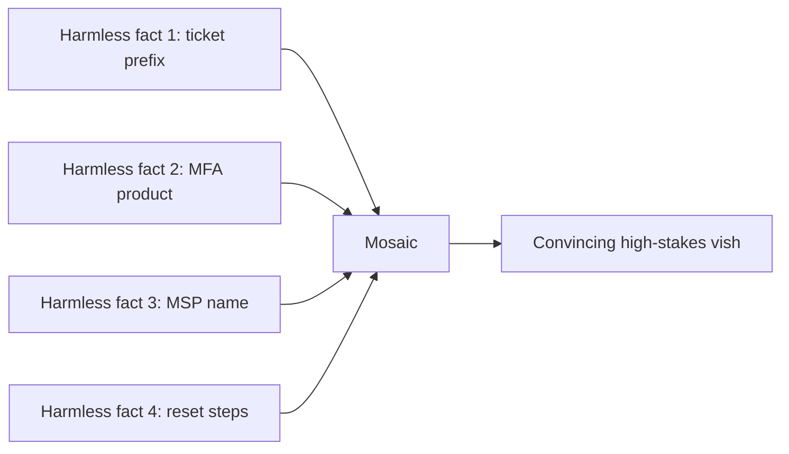

## Part 14: SIM Swapping and OTP Interception — When the Phone Number Itself Is the Target

Smishing and SMS-OTP attacks have a more aggressive cousin: **SIM swapping**, where the attacker takes over the victim's *phone number* itself, so every SMS and call — including OTPs — routes to the attacker's device. This is a hybrid vishing/identity attack, and it is why SMS-based MFA is considered weak.

**How a SIM swap works:**

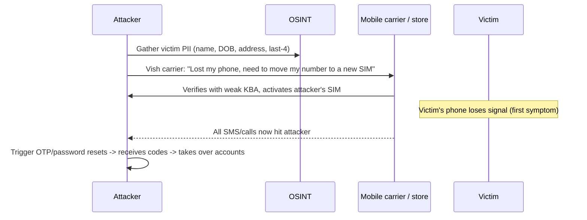

The attack is almost pure vishing: the attacker calls (or visits a store, impersonating the victim to) the carrier, uses OSINT'd PII to pass the carrier's weak identity check, and requests the number be "ported" to a new SIM they hold. Once done, the victim's phone goes dark and the attacker receives all texts and calls. They then trigger "forgot password" and OTP flows on the victim's email, bank, and exchange accounts. High-profile crypto thefts and the 2019 takeover of Twitter's own CEO's account used SIM swaps.

**Related: SS7 interception.** Beyond swapping the SIM, well-resourced attackers with SS7 network access can intercept SMS and calls in transit by abusing the same unauthenticated signalling protocol from Part 2 (e.g. `SendRoutingInfoForSM` / `UpdateLocation` message abuse to reroute messages). This is rarer (needs carrier-level access) but demonstrates why **any SMS-delivered secret is fundamentally interceptable.**

**Defenses (offense informs defense):**

| Control | Stops |
|---|---|
| Carrier **port-out PIN / number-lock** | Casual SIM-swap vishing of the carrier |
| **Remove SMS OTP**, use FIDO2/passkeys or app-based TOTP with device binding | OTP interception via swap or SS7 |
| **eSIM change alerts / re-auth** | Silent swaps |
| Account-recovery not tied to phone number | Downstream takeover after a swap |
| Carrier staff training + strong KBA replacement | The vish that starts it |

**Red team usage:** on engagements that include mobile/identity scope, demonstrating that a target's high-value account can be recovered via SMS OTP is a powerful finding — you don't need to actually swap a SIM (illegal against real carriers/people); you show the *dependency chain* (account X recovers via SMS to number Y, which is protected only by carrier KBA) and rate it as critical. **Blue team usage:** map which corporate/executive accounts still allow SMS-based recovery — that inventory is your SIM-swap exposure.

## Part 15: ATT&CK Mapping and Reporting Language

A finding is only useful if it lands in the client's report in language their blue team and leadership understand. Map the techniques in this chapter to **MITRE ATT&CK** and write findings in impact-first language.

| Technique in this chapter | ATT&CK ID | Tactic |
|---|---|---|
| Vishing (help-desk, IT impersonation) | T1598.004 (Phishing for Information: Spearphishing Voice) / T1656 (Impersonation) | Reconnaissance / Initial Access |
| Smishing | T1660 (Phishing) / T1598 | Initial Access / Reconnaissance |
| MFA-fatigue / push bombing | T1621 (Multi-Factor Authentication Request Generation) | Credential Access |
| Rogue device / hardware placement | T1200 (Hardware Additions) | Initial Access |
| Physical impersonation / tailgating | (Physical — pairs with T1200; note as physical access) | Initial Access |
| Account manipulation via help desk (MFA re-enrol) | T1098.005 (Account Manipulation: Device Registration) | Persistence / Credential Access |

**Impact-first finding language (example):** rather than "the help desk was helpful," write:

> *Finding HD-01 (Critical): The IT Service Desk reset multi-factor authentication for a user account and enrolled an attacker-controlled device after verifying identity solely with an employee ID and manager name, both of which are recoverable from public sources. This permits an external attacker to obtain an authenticated, MFA-satisfied session for any employee, bypassing all email and endpoint controls. Observed: MFA re-enrolment to +1-555-0143 (attacker number) for account jordan.reyes, no asset-record corroboration. Recommendation: replace knowledge-based verification with out-of-band re-verification to the enrolled device and manager confirmation via a separate channel; alert on `MFA_METHOD_ADDED` where device is new and asset_match=false.*

**Severity guidance:** score with CVSS-style reasoning or the client's rubric, but for social-engineering findings the impact is usually *Initial Access to authenticated identity* — routinely Critical/High, because it is the front door to everything else. Include the **repro path**, the **telemetry that would have caught it**, and a **prioritised remediation** (process change first, tech control second, awareness third).

## Part 16: Worked Answers and Rapid Self-Test

Answers to the practice questions (Part 21), condensed:

1. **Caller-ID spoofing / STIR-SHAKEN:** the calling number is unauthenticated data in the SS7 IAM or SIP `From:`/`P-Asserted-Identity`; a permissive provider asserts any value. STIR/SHAKEN has the *originating* carrier sign the number with a cert and an attestation (A=full/authenticated+owned, B=authenticated only, C=gateway passthrough); the *terminating* carrier verifies. A spoofed call still lands without an "A" when it transits legacy TDM (signature stripped), originates internationally, or routes via a small/permissive carrier — it simply arrives with B/C attestation, which is why "verified"/no-label is a signal, not a guarantee.
2. **Help-desk redesign:** never use employee-ID + manager as proof. Require an out-of-band push to the user's *already-enrolled* device, or a manager confirmation through Teams/Slack, or video-ID for privileged accounts; log and alert on `MFA_METHOD_ADDED` with `device=new` correlated to a help-desk reset with `asset_match=false`.
3. **Lab build:** Asterisk IVR with `Read(CODE,beep,6)`; detection (a) inbound SMS from sender <7 days old containing "re-enroll"/link to newly-registered domain; detection (b) outbound call from that user to an unknown-reputation external number within minutes of the smish (join on user + time window).
4. **Physical / Prox:** pretext e.g. fire-safety inspector (hi-vis + clipboard) to reach the target floor; Proxmark `lf search` → `lf hid read` → `lf hid clone` to a T5577 of a *consented* test badge; recommend turnstiles/mantrap + challenge culture, upgrade 125 kHz Prox to iCLASS SE/SEOS, and badge-in/badge-out with anomaly alerting.
5. **Ranking:** help-desk **vishing** highest (knowledge-based verification is directly exploitable and FIDO2 isn't universal); **smishing** second (SMS OTP for VPN means an AiTM/OTP-relay or SIM-swap path to VPN exists); **physical** third but high-impact (depends on site controls; a single drop box bypasses the network perimeter). Justify each by the specific control it routes around.

**Rapid flashcards (self-test):**

- Q: Which caller-ID field gets spoofed — ANI or CLID? → **CLID/CNAM.**
- Q: What kills MFA-fatigue? → **Number matching + rate limiting; ultimately FIDO2.**
- Q: Why can a smish land in the bank's real thread? → **Unauthenticated alphanumeric Sender ID; phone groups by sender string.**
- Q: One thing you must carry on a physical engagement? → **A signed authorisation ("get out of jail") letter.**
- Q: Which badge tech has no crypto? → **125 kHz HID Prox.**
- Q: Which recent casino breach used help-desk vishing? → **MGM/Caesars (Scattered Spider), 2023.**
- Q: What makes callback phishing bypass "don't click links" training? → **The victim initiates the call, so guard is down.**
- Q: The single control that stops BEC wire-fraud vishing? → **Call the supplier back on a number from your own records, never one from the request; plus dual authorisation for payee changes.**
- Q: Why is a QR code ("quishing") effective against email gateways? → **The link is hidden inside an image and the scan moves the click to a personal phone the corporate stack can't see.**

## Part 17: Common Pitfalls and Misconceptions

- **"Caller ID proves who's calling."** No — it's asserted data. Absence of STIR/SHAKEN "A" attestation on an internal-looking number is a red flag, not a guarantee either way.
- **"MFA stops phone-based attacks."** Push/OTP MFA is defeated by fatigue, help-desk resets, and AiTM/OTP relay. Only phishing-resistant FIDO2/passkeys close the door.
- **"Our SEG/DMARC handles phishing."** Those controls don't touch voice, SMS, or a person at reception.
- **"Physical tests are just for show."** A single planted drop box or cloned badge can be a full network foothold; physical is often the *fastest* path in.
- **"Spoofing is a special hacker tool."** It's a consequence of unauthenticated legacy protocols; the defense is attestation, registration, and process — not a magic filter.
- **Operator pitfall — over-asking.** New social engineers ask for too much; the strongest calls request exactly one action and exit.
- **Operator pitfall — sounding urgent.** Urgency should be *in the story*, never *in your voice*; nervous energy is the biggest tell.
- **Legal pitfall — no paper.** Never place a spoofed call to a real person or enter a building without a signed authorisation and scope. This is the difference between a pentest and a crime.

## Part 18: Final Revision / Summary

- **Why these channels:** they bypass email/endpoint controls and exploit synchronous social pressure. Defenders under-instrument them, so they're often the fastest initial-access route.
- **Vishing:** a five-phase live pretext (setup → open → rapport → the ask → exit). The highest-impact form is the **help-desk MFA/password reset**, which defeats MFA by re-enrolling the attacker's device. **MFA-fatigue + a "call from IT"** turns a valid password into an approved login.
- **Caller ID is unauthenticated;** SS7/SIP let a permissive provider assert any `From:`. **STIR/SHAKEN** signs and attests caller identity but has gaps (legacy TDM, international, low-attestation transit).
- **Smishing:** SMS/RCS phishing; alphanumeric sender IDs were historically unauthenticated (mitigated by sender-ID registration, 10DLC, SMS firewalls). Frequently the **delivery layer for AiTM/OTP relay** (Chapter 8).
- **Physical pretexting:** tailgating, impersonation, reception pretext, rogue-device drops, badge cloning (LF Prox/MIFARE Classic are trivially cloned with a Proxmark3). Requires a **written authorisation letter, always.**
- **Real cases:** Twitter (2020), Uber (2022), 0ktapus (2022), MGM/Caesars (2023), BazarCall — all leaned on phone/help-desk/SMS, not clever email.
- **Defense (consolidated):** kill knowledge-based verification (out-of-band/video re-verify), number matching → FIDO2/passkeys, register/brand messaging, retire weak badges, NAC + USB control, challenge culture, and pipe IdP + telecom telemetry into the SIEM.

## Part 19: Cheat Sheet / Quick Reference

**Vishing call structure:** Setup → Open (authority+reason) → Rapport → *One* ask → Exit.

| Concept | Key fact |
|---|---|
| Caller ID field spoofed | CLID/CNAM (`From:` in SIP), not ANI billing number |
| Signalling | SS7 (legacy) / SIP INVITE `From` + `P-Asserted-Identity` (VoIP) |
| Anti-spoof | STIR/SHAKEN attestation A/B/C; treat non-A internal-looking calls as suspect |
| Highest-impact vish | Help-desk MFA/password reset (MGM/Scattered Spider) |
| MFA-fatigue defense | Number matching, push rate-limit, FIDO2 |
| SMS sender abuse | Unauthenticated alphanumeric Sender ID; mitigate w/ 10DLC/sender-ID registration |
| SMS OTP | Phishable + SIM-swappable → move to FIDO2 |
| LF badge | 125 kHz HID Prox = no crypto → Proxmark3 clones trivially |
| HF badge | MIFARE Classic broken; iCLASS SE/SEOS strong |
| Physical must-have | Signed authorisation ("get out of jail") letter |

**Tool quick-ref:**

```text
asterisk -rvvv                  # PBX CLI (lab telephony)
Set(CALLERID(num)=...)          # how caller ID is set (unauthenticated)
svmap 10.0.0.0/24               # SIPVicious: find SIP devices (authorised)
svwar -m INVITE -e 100-200 ip   # enumerate extensions
pm3 -> lf hid read / clone      # read/clone 125kHz badge (own cards)
pm3 -> hf mf autopwn            # attack MIFARE Classic keys
theHarvester -d target -b bing  # OSINT pretext fuel
```

**Defender quick-ref:** out-of-band reset verification · number matching → passkeys · register sender IDs/10DLC · retire Prox/MIFARE Classic · 802.1X NAC + USB control · challenge culture · IdP+telecom telemetry → SIEM.

## Part 20: Practice Labs & Resources

Train these specific skills (authorised/lab environments only):

- **TryHackMe:** the *Phishing* module and *Red Team Fundamentals* / *Red Team Engagements* rooms cover pretexting and campaign structure; the *OSINT* rooms feed pretext development.
- **Asterisk/FreePBX home lab:** build a two-extension PBX plus a benign IVR to *observe* caller-ID being set and to prototype an authorised callback demo. FreePBX docs + the Asterisk "The Definitive Guide" (free O'Reilly text).
- **Twilio/Plivo free tier:** build an *authorised* SMS + voice test to your own numbers; learn 10DLC/sender-ID registration firsthand (the guardrail attackers bypass).
- **Proxmark3 + T5577/MIFARE test cards:** practise reading/cloning **your own** badges; work through the Iceman firmware wiki. Pair with a physical-red-team operations reference (e.g. *Physical Red Team Operations*).
- **SIPVicious against your own Asterisk:** run `svmap`/`svwar`/`svcrack` on your lab PBX to see VoIP enumeration and hardening.
- **SANS SEC504 / social-engineering modules** and the **Social-Engineer.org** framework and *Social Engineering: The Science of Human Hacking* (Hadnagy) for pretext craft, elicitation, and the ethics/consent framework.
- **Blue-team side:** stand up a lab IdP (Keycloak or an Entra ID trial), wire audit logs to a free SIEM (Elastic/Wazuh), and build the "MFA method added after help-desk reset" detection from Part 8.
- **CTF/awareness:** DEF CON's **Social Engineering Community (SEC) vishing competition** rules and past reports are the gold-standard, ethics-bound demonstration of live vishing tradecraft.

## Part 21: Practice Questions & Labs

1. **Explain the mechanism:** why does caller-ID spoofing work at the protocol level, and precisely what does STIR/SHAKEN change? Name the three attestation levels and describe a scenario where a spoofed call still lands without an "A."
2. **Design a control:** your client's help desk currently verifies identity with employee ID + manager name. Write a replacement reset procedure that would have stopped the MGM/Scattered-Spider attack, and specify the exact IdP log event and correlation rule you'd alert on.
3. **Lab build:** using Asterisk (or Twilio) and *only numbers you own*, build a callback IVR that captures a 6-digit lab code, then write the two SIEM detections that would catch (a) the smish delivery and (b) the victim's outbound call to the IVR.
4. **Physical scenario:** you're authorised to test tailgating and badge cloning at a site using 125 kHz HID Prox. Describe your pretext, the Proxmark3 workflow to read/clone a consented test badge, and the three physical/technical controls you'd recommend afterward.
5. **Threat-model comparison:** for a mid-size company with strong email security (SEG + DMARC + FIDO2 for some apps) but SMS OTP for VPN and a knowledge-based help desk, rank the vishing, smishing, and physical vectors by likely success and justify the ranking with reference to the controls each bypasses.

Worked answers are intentionally omitted so you can reason them through; every answer is derivable from the parts above. The next chapter moves from these human-channel attacks into **deepfakes and AI-driven social engineering**, where synthetic voice and video supercharge exactly the vishing and pretexting techniques covered here.

---

*Also on [Praneeth's portfolio](https://ping-praneeth.vercel.app/notebook/redteam-social-engineering/09-vishing-smishing-and-physical-pretexting), with comments and the latest edits.*
