This is Chapter 10 of the Social Engineering series, and the final one. The previous nine chapters built social engineering from the human attack surface up: the psychology of influence, pretext development, email and web phishing, spoofing, SET and Gophish, malicious documents, Evilginx-style adversary-in-the-middle, and the phone-and-doorway channels — vishing, smishing, and physical pretexting. Every technique so far assumed a human attacker crafting each lure by hand and delivering it one target at a time. This chapter is about what happens when generative AI removes both limits at once: when the voice on the phone, the face on the video call, and the email in the inbox can all be **synthesised on demand**, at scale, at near-zero marginal cost.

Synthetic media — colloquially "deepfakes" — collapses the last technical defences that older social engineering relied on the target to provide. A finance clerk trained to "call the CFO back on a known number to verify" is defeated when the voice that answers that callback is a real-time clone. A "join the video call to confirm it's really the executive" control is defeated when every face on the call is a rendered puppet. And the spear-phishing email that once took an operator an hour to research and write now takes a language model seconds, in the target's own language, referencing their real projects pulled from AI-accelerated OSINT.

The framing rule that governed the whole series governs this chapter with extra force. **Everything here is written for authorised red-team engagements and for defenders.** Cloning a real person's voice or face without consent, impersonating them to defraud a third party, or generating deceptive media of a real individual is illegal in most jurisdictions — wire fraud, identity theft, impersonation, deepfake-specific statutes, and (for intimate imagery) serious criminal offences all apply, and the legal picture tightens every year. The techniques below are explained so red teams can run scoped assessments of an organisation's *human and process* resilience, and — above all — so blue teams can detect, verify around, and train against them. Every lab uses **your own voice, your own face, and consenting teammates on isolated infrastructure**. Nothing here targets a real third party.

We move from the threat landscape and a precise taxonomy, through the actual generative pipelines (voice, video, text), into AI-accelerated OSINT and a full worked lab against your own likeness, and finish with a consolidated detection-and-defense treatment, a cheat sheet, and practice resources.

## Why This Matters

For twenty years the practical ceiling on social engineering was **operator time**. A convincing spear-phishing campaign against fifty executives meant fifty pieces of research and fifty hand-written lures. A vishing pretext meant one skilled operator on one call. Impersonating a specific executive's *voice* was essentially impossible outside a film studio; impersonating their *face* on a live call was science fiction. Those limits are gone.

Three things changed simultaneously, and their combination — not any one alone — is what makes this an expert-level threat:

- **Voice cloning went real-time and few-shot.** Modern text-to-speech and voice-conversion models clone a recognisable voice from **seconds** of reference audio (a conference talk, a voicemail greeting, a podcast, a short video) and generate new speech — including into a live call — with sub-second latency.
- **Video deepfakes went consumer-grade and streamable.** Face-swap and lip-sync models that once needed a GPU farm and days of training now run on a single consumer GPU, and real-time reenactment tools can drive a live webcam feed on a video call.
- **LLMs industrialised the *content*.** The remaining bottleneck — writing a fluent, context-aware, target-specific message — was removed by large language models that write flawless business prose in any language, adapt tone, and hold an interactive conversation as a chatbot on a phishing page.

Social engineering has become **an industrial process**, and defenders can no longer rely on the tells that used to catch it: the awkward phrasing, the wrong accent, the generic greeting, the impossibility of a live face. **Blue-team relevance up front:** this is exactly why the defensive centre of gravity is shifting from "spot the fake" (increasingly unwinnable at the media layer) to "make the *process* resistant to a perfect fake" — out-of-band verification, callback discipline, transaction controls, and provenance. That shift is the throughline of the whole chapter.

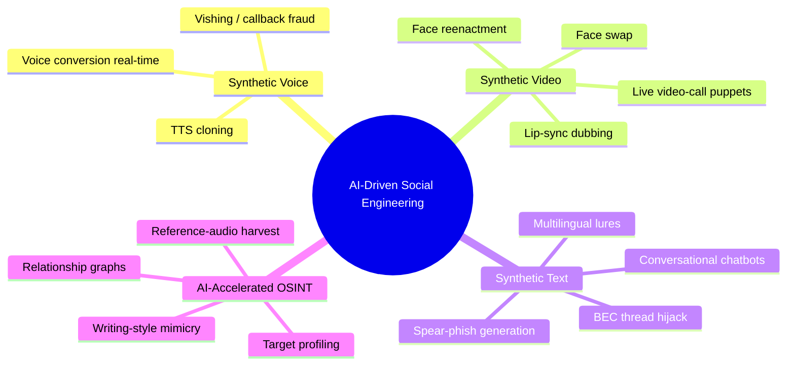

## Part 1: A Precise Taxonomy of Synthetic Media

"Deepfake" is a loose word. For a red team scoping a job, or a blue team writing detections, you need precise categories, because each one is made differently, has different tells, and needs different defences. The term originates from a 2017 Reddit user ("deepfakes") who used autoencoders to swap faces in video; it now covers a whole family of techniques across three modalities.

| Modality | Technique | What it produces | Reference data needed | Primary SE use |
|---|---|---|---|---|
| Audio | **TTS voice cloning** | New speech in a target's voice from *typed text* | Seconds–minutes of clean audio | Voicemail, IVR, scripted vishing |
| Audio | **Voice conversion (VC)** | Attacker speaks; output re-timbred to target in real time | Seconds–minutes; low-latency model | Live vishing, callback fraud |
| Video | **Face swap** | Target's face pasted onto a source performer | Many images / short video of target | Pre-recorded "proof" video |
| Video | **Face reenactment (puppeteering)** | Attacker's expressions drive the target's face | Images/video of target | **Live video-call impersonation** |
| Video | **Lip-sync / dubbing** | Real footage, mouth re-animated to new audio | One clip + target audio/text | Fake "statement" clips |
| Image | **GAN/diffusion synthesis** | Wholly synthetic faces (do not exist) | None (or a style prompt) | Sock-puppet profile photos |
| Text | **LLM generation** | Fluent, targeted written content and live chat | Public writing samples (optional) | Spear phish, BEC, chatbots |

A few distinctions matter operationally:

- **Cloning vs. synthesis.** *Cloning* reproduces a *specific real person* (the CFO). *Synthesis* invents a person who does not exist (a fake recruiter's headshot). Red teams use both — a cloned executive for the payout call, a synthesised persona for the recon sock puppet (Chapter 3).
- **Offline vs. real-time.** Offline deepfakes (a pre-rendered video) can be near-perfect — no latency budget. Real-time deepfakes (a live call) trade quality for speed and are where *behavioural* detection tells still live.
- **Reenactment vs. swap** is the single most important video distinction. A **swap** replaces the face region; a **reenactment** keeps the target's face but *drives* it with the attacker's movements. Live-call impersonation is almost always reenactment or a real-time swap, because the attacker must speak and react in the moment.

**CTF/analyst angle:** media-forensics challenges (and DFIR triage) usually ask you to *classify* a clip into one of these buckets first, because the artefacts differ — swap artefacts cluster at the face boundary and in temporal flicker; reenactment artefacts show up as unnatural eye/teeth/tongue rendering and head-pose/lighting mismatch.

### Ranking the modalities by real-world danger

Not all synthetic media is equally weaponisable at present. Ranking them by observed fraud impact helps a red team prioritise a scoped test and a blue team prioritise controls:

| Rank | Modality | Why it ranks here | Defensive priority |
|---|---|---|---|
| 1 | **Synthetic text (LLM)** | Zero artefacts, infinite scale, drives every other vector | Infra/behaviour detection + verification |
| 2 | **Voice clone / VC** | Phones are trusted and have no provenance layer; real-time feasible | Out-of-band callback + challenge phrase |
| 3 | **Live video reenactment** | Highest-impact single incidents (Arup) but higher skill/setup | Liveness challenges + transaction controls |
| 4 | **Offline video (statements/proof)** | High quality but not interactive; slower to weaponise per target | Provenance (C2PA) + forensics |
| 5 | **GAN/diffusion face synthesis** | Enables personas, not direct fraud | Reverse-image + account-age heuristics |

The counter-intuitive takeaway: the *most* dangerous modality is the one with *no media artefact at all* — text — because it is the connective tissue that initiates and coordinates the others. A defence program that pours all its budget into video-deepfake detectors while leaving BEC verification weak is defending the wrong flank.

## Part 2: How Generative Models Make a Fake — The Engine Room

You cannot detect, or convincingly simulate, what you don't understand mechanically. This section teaches the four model families underlying everything above, from scratch. You do not train any of them for the lab, but you need to know how they work to reason about their artefacts and limits.

### Autoencoders and the original face-swap

The 2017-era face swap uses a pair of **autoencoders**. An autoencoder is a network with a bottleneck: an *encoder* compresses an image into a small latent vector, and a *decoder* reconstructs it. Train one shared encoder plus two decoders — decoder A on thousands of frames of person A's face, decoder B on person B's. Because the encoder is shared, it learns an identity-agnostic *pose/expression* representation. At swap time you encode person A's frame, then reconstruct with **decoder B** — you get A's pose and expression rendered as B's face. This is what DeepFaceLab and older FaceSwap implement.


**Why it needs so much data.** The decoder can only render poses, expressions, and lighting it has *seen*. That is why classic face-swap needs thousands of frames of B (usually harvested from video) and why a target with only a handful of front-facing photos produces a weak swap — there is nothing to reconstruct a profile or a laugh from. This data dependency is a defensive lever: an executive whose public imagery is mostly a single corporate headshot is markedly harder to swap convincingly than one with hours of conference video online.

**Limitation → tell:** the swap is only as good as B's training data covers A's poses/lighting. Novel angles, occlusions (a hand over the face), and extreme lighting produce boundary artefacts and flicker — historically the reliable detection signal, which is why liveness challenges ask the subject to turn side-on or wave a hand across the face.

### GANs — adversarial synthesis

A **Generative Adversarial Network** pits two networks against each other: a *generator* that produces images from noise, and a *discriminator* that tries to tell real from fake. They train in a minimax game until the generator fools the discriminator. StyleGAN (the "this-person-does-not-exist" family) produces photorealistic faces of people who do not exist and is the standard source of sock-puppet profile photos.

There is a deep symmetry worth noting: the discriminator in a GAN is, quite literally, a **deepfake detector** — and the whole point of training is to defeat it. This is the mathematical heart of why deepfake detection is a perpetual arms race: any detector you publish can be folded back in as a discriminator to train a generator that beats it. Detection can win *rounds*, but the media layer cannot win the *game* outright, which is the theoretical backing for the "defend the process, not the perception" thesis running through this chapter.

**Tell:** classic StyleGAN artefacts — asymmetric or mismatched earrings, garbled backgrounds, melting teeth/hair, and (in early versions) a **fixed eye position**: eyes always landed at the same pixel coordinates, a giveaway for automated detectors and for the "align two profile pics and see if the eyes overlap" OSINT trick. A related persona check: run a suspected sock-puppet headshot through reverse-image search — a GAN face returns *no* prior hits (it never existed), which is itself a weak signal when combined with a brand-new account.

### Diffusion models

**Diffusion** models learn to reverse a gradual noising process: start from pure noise and iteratively denoise toward a coherent image, guided by a text prompt or a reference. They now dominate high-fidelity image and increasingly video synthesis and underpin many "AI avatar" products. Slower per frame than GANs but higher quality, which is why offline video fakes have improved so sharply.

**Why diffusion beat GANs for video.** GANs are fast but notoriously unstable to train and prone to *mode collapse* (producing a narrow range of outputs). Diffusion trades speed for stability and fidelity, and — importantly for deepfakes — is much easier to *condition* on a reference image and a driving signal. That controllability is why the best offline "talking head" and dubbing systems moved to diffusion: you can hold identity fixed while varying pose, expression, and lip motion. The cost is compute per frame, which is precisely why diffusion dominates *offline* fakes (where you can spend seconds per frame) but has been slower to reach the *real-time* call scenario, where GAN-based and lightweight reenactment models still lead. This split — diffusion for offline perfection, lightweight GAN/reenactment for live — is stable enough to plan detections around.

### Neural TTS and voice conversion

Modern speech systems split into two jobs:

- **Text-to-Speech (TTS):** text → speech. A neural TTS (a Tacotron/FastSpeech-style acoustic model plus a neural vocoder such as HiFi-GAN, or a single end-to-end model) can be *conditioned on a speaker embedding* — a vector capturing a voice's timbre. **Few-shot cloning** extracts that embedding from a few seconds of the target and biases generation toward it.
- **Voice Conversion (VC):** speech → speech, changing *only* speaker identity while keeping the words and prosody of the input speaker. This enables **real-time** vishing: the operator talks naturally and the model re-timbres their voice to the target on the fly.

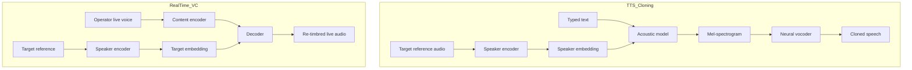

**Tell:** cloned audio often has too-clean backgrounds, subtly wrong breathing/pause patterns, flattened prosody on unusual words, and no consistent room-acoustic/channel signature. Anti-spoofing models (Part 9) are trained specifically on these vocoder artefacts.

### Speaker embeddings, concretely

The single idea that makes few-shot voice cloning work is the **speaker embedding**. A speaker-verification network (the same class of model banks use for "your voice is your password") is trained on thousands of speakers to output a fixed-length vector — typically 192 or 256 dimensions — that is *close* for two clips of the same person and *far* for clips of different people. That vector encodes timbre, pitch range, and vocal-tract characteristics while discarding the words.

Cloning hijacks this: extract the target's embedding from a few seconds of reference audio, then *condition* a TTS or voice-conversion decoder on it so the generated speech lands near the target in embedding space. Crucially, the same embedding model that *enables* cloning also underpins the *defence* — a voice-biometric system flags a mismatch when a caller's embedding drifts from the enrolled reference, and anti-spoofing models specifically look for the vocoder fingerprint that synthetic speech leaves even when the embedding matches. This dual use is why "voiceprint" authentication alone is now considered weak: a good clone can push the embedding close enough to pass naïve verification, which is exactly why Part 9 pairs biometrics with a *liveness* and *challenge-phrase* layer.

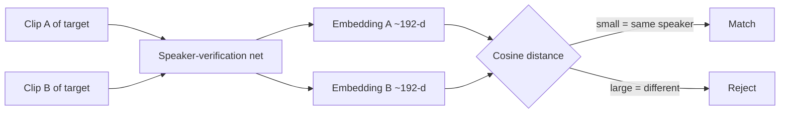

### Large Language Models

An **LLM** predicts the next token over text; instruction-tuned models follow prompts to write, translate, summarise, and converse. For social engineering they remove the *content* bottleneck: fluent multilingual prose, tone-matching to a stolen email thread, and interactive chat that improvises around a target's replies. There is no image/audio artefact to detect — the "tell" is behavioural and contextual, which reshapes defence entirely (Part 6, Part 9).

The mechanic worth internalising is **context conditioning**. An LLM's output quality on a spear-phish is a direct function of how much true, specific context you put in the prompt: the target's role, their manager's name, a real project code, the house style of an intercepted thread. This is why AI-driven social engineering is *recon-bound*, not *model-bound* — the differentiator between a generic scam and a devastating spear-phish is the quality of the OSINT feeding the prompt (Part 6), not the cleverness of the model.

## Part 3: Voice Cloning End-to-End (Authorised Lab Context)

Voice is the highest-ROI synthetic vector in real fraud because phones are trusted, ubiquitous, and lack any provenance layer. This section teaches the pipeline from scratch, framed strictly around **cloning your own voice** for an authorised assessment or lab.

### The tools, from scratch

Two categories exist:

- **Open-source local models.** Coqui-TTS and its community forks, XTTS, Tortoise-TTS, OpenVoice, and **RVC (Retrieval-based Voice Conversion)** for real-time timbre conversion. These run locally on a consumer GPU, so they leave no third-party audit trail — the reason serious red teams and criminals both favour them.
- **Hosted "AI voice" platforms.** Commercial services offer high-quality cloning behind consent gates and watermarking. Their terms forbid non-consensual cloning, and many now embed inaudible watermarks — relevant for blue teams building provenance checks, and a reason attackers drift toward local models.

You do **not** need to train from scratch. Few-shot models take a short reference clip and a speaker embedding. The skill is in the *pipeline hygiene*, not the model.

### The pipeline

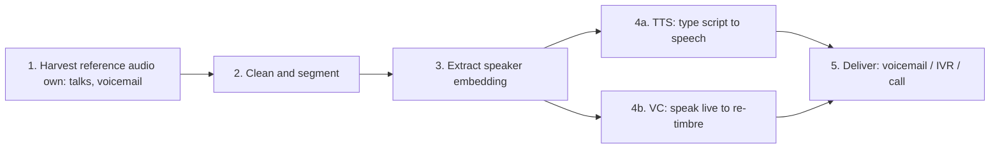

**Step 1 — Harvest (your own voice).** For the lab, record 3–10 minutes of your own clean speech, or gather your own public talks. In a real engagement the *target's* reference audio comes from OSINT (Chapter 2/12) — conference recordings, webinars, podcasts, earnings calls, voicemail greetings, social video. This is why "how much of your voice is public?" is a genuine executive-protection question.

**Reference-audio quality — the hidden determinant.** Cloning quality tracks reference quality more than model choice. The factors that matter, in rough order:

| Factor | Good reference | Poor reference (weak clone) |
|---|---|---|
| Signal-to-noise | Studio/podcast, minimal background | Street noise, HVAC hum, music bed |
| Single speaker | One voice, no overlap | Cross-talk, interviews, panels |
| Duration & variety | 1–10 min covering varied phonemes | A few seconds of one flat sentence |
| Channel consistency | One mic, one room | Spliced from many sources/codecs |
| Emotional range | Some prosodic variety | Monotone, or shouting only |

This table is also an **executive-protection checklist in reverse**: the more of an executive's audio that exists in "good reference" form (long, clean, single-speaker recordings — exactly what a keynote or a podcast produces), the cheaper they are to clone. That is a concrete, defensible reason to think about *how* leadership audio is published, not just whether it is.

**Step 2 — Clean and segment.** Reference quality dominates output quality. Denoise, remove music and cross-talk, normalise loudness, and cut to clean segments:

```bash
# Extract audio from a recording of YOUR OWN talk, resample to 22.05 kHz mono
ffmpeg -i my_talk.mp4 -vn -ac 1 -ar 22050 -f wav my_voice_raw.wav

# Denoise + normalise with sox (install: sudo apt install sox libsox-fmt-all)
sox my_voice_raw.wav my_voice_clean.wav \
    noisered noise.prof 0.21 \
    norm -1 \
    silence 1 0.1 1% -1 0.3 1%
#   noisered <profile> <amount>  -> subtract profiled noise
#   norm -1                      -> normalise peak to -1 dBFS
#   silence ...                  -> trim leading/trailing near-silence
```

**Step 3–4 — Clone (few-shot, your own voice).** Using a local Coqui-style XTTS model as the teaching example. Install and generate:

```bash
# Install into an isolated venv (never pollute system Python)
python3 -m venv ~/tts && source ~/tts/bin/activate
pip install TTS            # Coqui-TTS package

# List models, then synthesise NEW text in a voice cloned from YOUR clip
tts --list_models | grep xtts
tts --model_name tts_models/multilingual/multi-dataset/xtts_v2 \
    --text "This is an authorised red-team voice test. Reference three-seven-nine." \
    --speaker_wav my_voice_clean.wav \
    --language_idx en \
    --out_path clone_out.wav
#   --speaker_wav   reference clip to clone from (YOUR OWN voice)
#   --language_idx  target language of the synthesised speech
#   --out_path      rendered audio
```

Realistic console output you would see:

```
 > tts_models/multilingual/multi-dataset/xtts_v2 is already downloaded.
 > Using model: xtts
 > Computing speaker latents...
 > Processing time: 3.812 s
 > Real-time factor: 0.34
 > Saving output to clone_out.wav
```

A **real-time factor (RTF) below 1.0** means generation is faster than playback — the threshold that makes *live* use feasible. **Red-team usage:** an RTF well under 1 is what lets an operator paste a live transcription into a TTS pipe, or run RVC voice-conversion, and hold a phone conversation with acceptable latency.

**Step 5 — Delivery matters more than fidelity.** The phone network is the attacker's friend: narrowband codecs (G.711/AMR), packet loss, and background noise **mask exactly the artefacts a detector would use**. A clone that sounds obviously synthetic on studio monitors is convincing through a compressed mobile call. Defenders should assume caller-audio forensics degrade sharply over telephony — which is why Part 9's defences are procedural, not acoustic.

### Real-time voice conversion — the live-call variant

Scripted TTS is fine for a voicemail, but a live conversation needs to *react*. That is the job of **voice conversion (VC)**: the operator speaks naturally into a microphone and a model re-timbres the output to the target's voice with low latency, so the operator can answer questions, handle objections, and improvise in real time. RVC (Retrieval-based Voice Conversion) is the archetype — it keeps the operator's prosody and timing (which is what makes it sound *alive*) and swaps only the timbre.

The engineering constraint is the **latency budget**. Humans notice conversational lag above roughly 200–300 ms; beyond that the "connection sounds off" and the pretext weakens. The end-to-end budget for a real-time-VC vishing call must fit inside that window:

| Stage | Typical latency | Notes |
|---|---|---|
| Audio capture + buffering | 10–30 ms | Small frame size trades latency for quality |
| Voice-conversion inference | 20–90 ms | Depends on GPU and model size |
| Vocoder / resynthesis | 10–40 ms | Neural vocoders are the usual bottleneck |
| Virtual-audio-cable routing | 5–15 ms | Into the softphone/SIP client |
| Telephony transport | 50–150 ms | Network + codec; outside attacker control |
| **End-to-end target** | **< ~250 ms** | Above this, conversational lag is noticeable |

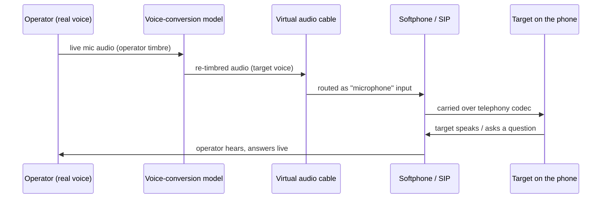

**Red-team usage (authorised only):** in a scoped engagement you would clone a *consenting* stand-in and route the converted audio into a lab SIP client, then measure whether staff proceed on voice alone. **Blue-team relevance:** the telephony leg (50–150 ms) is the largest and least controllable term — which is why a well-run detection strategy assumes the *acoustic* layer will not save you and forces an out-of-band control instead.

### Where cloned voice gets used

- **Voicemail drops** — a cloned "CEO" voicemail asking finance to expect a call, priming the later live contact.
- **Callback fraud** — the attacker gets the target to call a number they control (a smish, a fake invoice), where a cloned IVR or live-VC operator answers *as* the trusted party — defeating the "call back on a known number" control if the number itself was seeded.
- **MFA-reset and help-desk attacks** — a cloned executive voice pressures a help desk into a password/MFA reset (see Chapter 9's help-desk attacks; AI just removes the "does it sound like them?" check).
- **Family-emergency / "grandparent" scams at scale** — a cloned voice of a relative in distress, previously a hand-crafted con, now generated from a few seconds of a target's public video. Not an enterprise vector, but the one most likely to be encountered in awareness training, and a vivid demo of few-shot cloning.

## Part 4: Video Deepfakes and Live-Call Impersonation

Video is harder than audio and, until recently, mostly an *offline* threat (fake statement clips). The step-change is **real-time reenactment** good enough to survive a live video call — the vector behind the largest reported deepfake fraud to date.

### Offline vs. real-time, and why it decides everything

| Property | Offline (pre-rendered) | Real-time (live call) |
|---|---|---|
| Quality ceiling | Very high — unlimited compute per frame | Limited by latency budget |
| Latency | Irrelevant | Must be < ~100–150 ms end-to-end |
| Interaction | None (scripted) | Must react, turn head, respond |
| Typical tool | DeepFaceLab, diffusion video | DeepFaceLive, real-time face-swap apps |
| Best defence | Media forensics, provenance | **Behavioural liveness challenges** |
| SE use | "Proof" clips, fake statements | Impersonating exec on a video call |

**The live-call constraint is the defender's leverage.** A real-time puppet must keep up at 25–30 fps with sub-150 ms latency, so it *cannot* render the hard cases well: sharp profile turns, a hand passing over the face, standing up and stepping back, picking up and rotating an object near the face, fast lighting changes. These are the basis of **liveness challenges** (Part 9).

### The offline swap pipeline (conceptual)

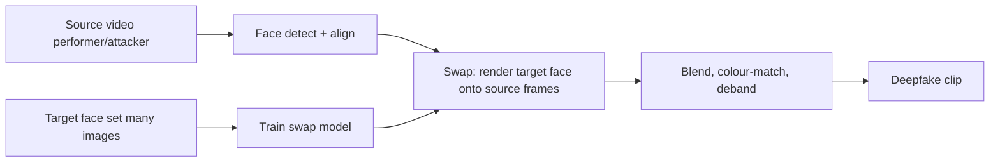

The quality-defining steps are **alignment** (landmarking every frame) and **blending** (colour-matching and feathering the face boundary so it doesn't shimmer). Poor blending is the classic detection signal — a faint rectangle or flicker at the jaw/hairline.

### Real-time reenactment on a call

Real-time tools take a **single well-lit portrait or short clip** of the target plus the operator's live webcam, and drive the target's face with the operator's head pose and expressions, piping the result into a **virtual camera** device that video-conferencing apps see as a normal webcam. **Red-team usage (authorised, your own face):** in a scoped assessment you would test whether staff will act on a video-verified instruction, using a puppet of a *consenting* team member's face — never a real executive without written, individual consent, because non-consensual likeness use crosses legal lines even inside a "red team."

**The defining real-world case:** in early 2024, a finance employee at the engineering firm **Arup** (Hong Kong) paid out roughly **US$25 million** across 15 transfers after joining a video call on which *multiple* participants — including the "CFO" — were deepfakes. The employee had been suspicious of the initial email, but the *video call* overcame that suspicion. That single fact is the most important lesson in this chapter: **a live video call is no longer proof of identity.**

### Lip-sync and dubbing — the "fake statement" vector

Distinct from swap and reenactment is **lip-sync (re-dubbing)**: take *genuine* footage of a real person and re-animate only the mouth region to match new audio, so they appear to say something they never said. Because most of the frame is authentic — real lighting, real body, real background — these clips are unusually convincing and are the workhorse of disinformation "the CEO announces a fake acquisition / a fake recall / an emergency stock move" style attacks, which can move markets or panic staff before a denial catches up.

For a social-engineering campaign, the lip-sync clip is a **credibility prop**: a short "internal message from the CEO" video attached to a phish, plausible enough that a target stops scrutinising the request. **Blue-team relevance:** the defence is the same provenance-and-process stack — an official announcement that lacks signed content credentials (C2PA) and does not appear through the *official* channel should be treated as unverified regardless of how real the footage looks. The tell, when present, is the mouth region: lip motion that is slightly too smooth, teeth that don't render on wide vowels, and audio-visual sync that drifts on plosives.

### How a live-call puppet reaches the meeting (lab, own face)

The plumbing that turns a rendered face into a "webcam" on a conference call is a **virtual camera** — a software device the OS presents to any app as if it were a physical camera. The reenactment tool writes rendered frames into that device; Zoom/Teams/Meet then list it in the camera dropdown alongside real hardware. Conceptually:

```
Operator webcam ──▶ Reenactment model ──▶ Virtual camera device ──▶ Conferencing app
   (drives pose)       (renders target        (OS sees a "webcam")     (shows the puppet)
                        face live, ~30fps)
```

In an authorised lab, using **your own** or a consenting colleague's face, the setup is: a portrait/short clip as the identity source, the operator's webcam as the driver, the model piping to a virtual-camera sink, and the conferencing client selecting that virtual camera. The point of building it is not the trick — it is to *feel the failure modes*: watch how the rendered face degrades the instant you turn to a hard profile, cover part of your face, or move quickly. Those degradations are the liveness challenges in Part 9, and seeing them first-hand is the fastest way to internalise why they work.

### Video deepfake artefacts — a detection reference

Even high-quality fakes leave signatures. This reference maps the artefact to the underlying cause and to the field check that surfaces it:

| Artefact | Underlying cause | How to surface it |
|---|---|---|
| Face-boundary shimmer / rectangle | Imperfect blending at the mask edge | Have subject move head laterally; watch the jaw/hairline |
| Teeth as a smear, no individual teeth | Model rarely sees clear teeth in training | Ask subject to smile broadly / say a word with lots of "ee" |
| Eyes that don't track / rare blinks | Weak gaze + blink modelling | Ask subject to follow your finger, then blink deliberately |
| Lighting on face ≠ lighting on room | Face rendered independently of scene | Ask subject to hold a bright phone screen near their face |
| Occlusion "tearing" | Model can't reconstruct hidden face regions | Ask subject to pass a hand slowly across their face |
| Lag between audio and lip motion | Separate audio/video pipelines | Watch lip-sync on plosives ("p", "b") |
| Frozen/duplicated background | Compute spent on the face, not the scene | Look for a static, low-detail or looping background |

**IR/analyst use case:** when triaging a reported deepfake call after the fact, ask the reporter which of these they noticed — it both corroborates the report and tells you which generator class was likely used (swap vs. reenactment), which narrows the attribution.

## Part 5: LLM-Driven Phishing and Conversational Agents

Text is where AI scales social engineering the hardest, because there is no artefact to detect. LLMs eliminate the three historical tells of phishing: broken grammar, generic greetings, and one-shot messages that can't respond.

### What LLMs change, concretely

- **Fluency in any language.** The "poorly-written phishing email" heuristic is dead. A model writes flawless business prose in the target's language and register.
- **Personalisation at scale.** Feed the model OSINT (Part 6) and it drafts a lure referencing the target's real projects, manager, tooling, and recent activity — 50 unique spear-phishes in the time one used to take.
- **Tone and thread hijacking.** Given a stolen email thread (from a compromised mailbox), the model continues it in the sender's exact style — the core of AI-boosted **Business Email Compromise (BEC)**.
- **Interactive chatbots.** A phishing page can host an LLM chatbot that answers the victim's questions, stalls for time, and walks them through "verification," raising conversion rates and defeating "if in doubt, ask a question" advice.

### Structure of an AI-assisted lure (authorised assessment)

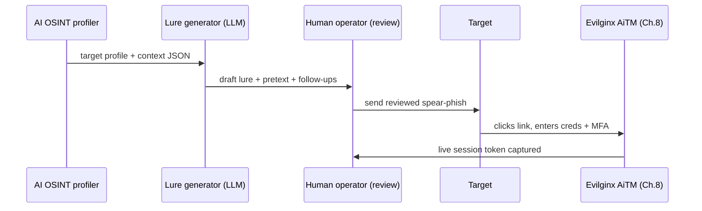

Note the **human-in-the-loop review** step. Even sophisticated operators keep a human reviewer, because LLMs hallucinate specifics (a wrong project name breaks the pretext) and inject stylistic tells. **Blue-team relevance:** because the *content* is now clean, detection shifts to **infrastructure and behaviour** — sending domain age/reputation, the AiTM redirect chain, impossible-travel logins, and the token-theft telemetry from Chapter 8 — not the prose.

### A worked thread-hijack example (authorised, consenting parties)

The most dangerous LLM use is not a fresh email — it is **continuing a real one**. When an attacker controls a compromised mailbox (or is testing with a consenting colleague's), they feed the existing thread to the model and ask it to insert a plausible next reply that redirects payment or requests an action, matching the sender's exact voice. Illustratively, given an intercepted thread:

```
> On Tue, Finance <ap@corp.example> wrote:
> Hi Alex — the Meridian invoice #8841 is queued for payment Friday.
> Same bank details as last quarter? — Priya
```

A style-matched, redirecting continuation the model produces:

```
Subject: Re: Meridian invoice #8841

Hi Priya,

Thanks — quick change on this one. Meridian moved banks after an audit,
so please use the updated remittance details on the attached instead of
last quarter's. Everything else (amount, ref) is unchanged. Can you get
it in before the Friday cut-off? Appreciate it.

Alex
```

Every property that used to betray BEC is gone: it is grammatically perfect, references the *real* invoice number and vendor, matches the sender's sign-off, and gives a mundane, verifiable-sounding reason for the change. **The only reliable defence is procedural** — a bank-detail change *must* trigger out-of-band verification to the vendor on a known number, never a reply in-thread. This is the textual mirror of the voice/video lesson: authenticity of the *medium* proves nothing; only an *independent channel* does.

### On model guardrails and "jailbreaks"

Mainstream LLMs refuse overt "write me a phishing email impersonating this bank" requests. Attackers route around this with obfuscated framing, uncensored open-weights models run locally, or purpose-built criminal offerings sold on forums (the "FraudGPT/WormGPT" genre — much of which is scam-ware itself). The security-relevant point for defenders: **guardrails on hosted models reduce but do not remove the threat, because local uncensored models exist.** This chapter does not provide jailbreak prompts; the defensive posture must assume content generation is freely available to a motivated adversary.

### Orchestration — where all three modalities combine

The real threat is not any single modality but their **orchestration** into one coherent campaign, each channel lending credibility to the next. Text primes, voice pressures, and video "confirms." A representative authorised assessment might chain them like this:

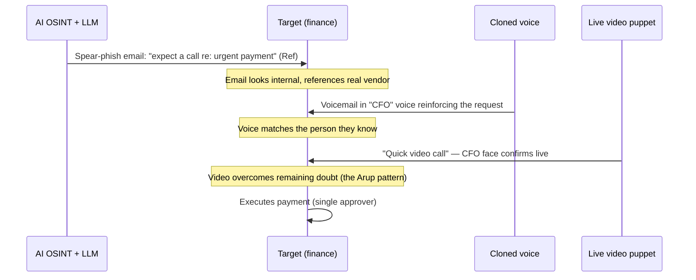

Each hand-off is designed to defeat the specific doubt the previous channel might have raised: the email's "is this real?" is answered by a familiar voice; the voice's "could this be a clone?" is answered by a face on a live call. **The defence does not scale channel-by-channel** — adding a "verify the voice" step is defeated by the video, and vice versa. Only a channel-independent control (out-of-band callback to a directory number, a challenge phrase, dual authorisation) breaks the chain, because it does not trust *any* of the incoming media. This is why Part 9 ranks process controls above every detection technique: they are the only defence that is invariant to which modality the attacker escalates to.

**Red-team scoping note:** propose the multi-channel version explicitly in the rules of engagement. A test that only sends email measures the weakest link of the campaign and will under-report risk; the client's real exposure is to the *orchestrated* attack, and that is what the assessment should model (with consenting stand-ins for any impersonated voice/face).

## Part 6: AI-Accelerated OSINT and Target Profiling

The lures and clones above are only as good as the intelligence behind them. AI has compressed the reconnaissance in Chapters 2, 3, and 12 from days to minutes, and — critically — it also **harvests the very reference data** (voice, face, writing style) the synthesis stages need.

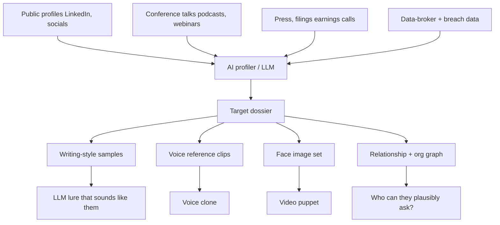

### What an automated profiler actually collects

An AI recon pipeline assembles a structured dossier from sources you already know from the OSINT chapters, but at machine speed and machine breadth. Mapping each field to what it *feeds* downstream makes the exposure concrete:

| Collected field | Typical source | Feeds which stage |
|---|---|---|
| Role, seniority, reporting line | Professional networks, org charts | Authority selection for the pretext |
| Current projects, tooling, jargon | Posts, talks, job ads, press | Plausibility of the lure content |
| Writing style / sign-off | Public posts, forum activity | LLM tone-matching |
| Voice samples | Talks, podcasts, webinars, voicemail | Voice clone reference |
| Face imagery | Socials, press photos, video | Video puppet source |
| Colleagues & relationships | Networks, co-authored content | "Who can plausibly ask whom" |
| Schedule / travel signals | Social posts, out-of-office, events | Timing (strike when the exec is unreachable) |

The last row is the quiet force-multiplier: an attacker who knows the CFO is *on a flight* can impersonate them precisely when a real verification callback would fail — a timing advantage AI-accelerated monitoring hands out for free.

- **Relationship graphing.** Models ingest scraped org data and infer *who reports to whom* and *who can plausibly instruct whom* — the authority chain a BEC pretext exploits.
- **Writing-style mimicry.** A few of the target's public posts let an LLM match their idiolect — sign-offs, punctuation habits, favourite phrases — making a spoofed message read authentically.
- **Reference-data harvesting is the multiplier.** The same scrape that profiles the target *also yields the voice and face samples* for Parts 3–4. This is why "reduce your executives' public voice/video footprint" is a concrete, defensible control, not paranoia.

**OSINT/analyst angle:** the defensive mirror of this is **attack-surface monitoring for likeness** — knowing what voice and video of your executives is public, and treating a new high-quality clip of a VIP as an exposure event, not just PR.

### The economics of scale — why this changed the threat model

The reason to take AI-driven social engineering seriously is not that any single attack is novel — voice-clone fraud existed before — but that the **marginal cost of a convincing, personalised attack collapsed toward zero**. A rough comparison of the old hand-crafted model against the AI-assisted one:

| Cost driver | Traditional operator | AI-assisted operator |
|---|---|---|
| Research per target | 30–90 min manual | Seconds (automated profiler) |
| Lure writing per target | 15–45 min, one language | Seconds, any language |
| Voice impersonation | Impractical / studio-only | Minutes from public audio |
| Live video impersonation | Effectively impossible | Consumer GPU, real time |
| Marginal targets per operator | Handful per day | Hundreds, largely automated |
| Skill floor | High (writing, acting, research) | Low (tooling does the craft) |

The strategic consequence for defenders: **you can no longer assume you are too small, too obscure, or too multilingual to be individually targeted.** The economics that once reserved spear-phishing and impersonation for high-value targets now make them viable against everyone. Controls must therefore be *systemic* (process, provenance, verification) rather than relying on attention from a scarce, expensive human attacker who might overlook you.

## Part 7: Hands-On Lab — An Authorised AI-SE Assessment (Your Own Likeness)

**Scope and authorisation (read first).** This lab is performed **only** against yourself and consenting teammates, on isolated lab infrastructure, with a signed authorisation for any organisational component. You will (a) clone *your own* voice, (b) generate an AI spear-phish targeting a *consenting teammate*, (c) run a controlled test of your organisation's **verification process**, and (d) measure whether the process — not the human's ear — catches it. The deliverable is a *process-resilience* finding, which is what clients actually pay for.

### Pre-engagement authorisation checklist

Synthetic-media testing carries more legal weight than ordinary phishing, so the paperwork is part of the method, not an afterthought. Before any synthetic media is generated, confirm every item:

- [ ] Signed **rules of engagement** naming AI/deepfake techniques explicitly (a generic phishing scope does *not* cover cloning someone's likeness).
- [ ] **Individual written consent** from every person whose voice or face will be cloned — an org's blanket authorisation does not waive a specific individual's likeness rights.
- [ ] Named **consenting participants** for any targeted test, with an agreed debrief.
- [ ] **Isolated infrastructure** — lab mail server, lab PBX, no production systems, no third-party hosted model fed with a real person's data.
- [ ] A **data-handling and destruction plan** for generated media (retention limited to what the report requires).
- [ ] An **emergency stop / de-confliction** contact, so a panicked "the CFO is being impersonated!" report can be resolved without a real IR spin-up.
- [ ] Legal sign-off in jurisdictions with specific deepfake, impersonation, or wiretap statutes.

Skipping any of these is not a shortcut — it is how an authorised assessment becomes an actual crime.

### Lab topology

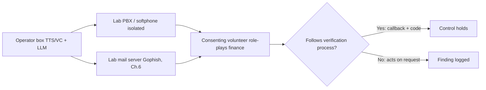

### Step 1 — Clone your own voice (from Part 3)

Record your own 5-minute sample, clean it, and generate a scripted "executive" voicemail with XTTS as in Part 3. Save `clone_out.wav`. Verify the RTF < 1.0 so a live variant is feasible.

### Step 2 — Generate the spear-phish (LLM, authorised)

Draft the lure with a locally-run open model so nothing about the *consenting* target leaves your lab. Example using a local Ollama endpoint:

```bash
# Install & pull a local model (isolated lab box)
curl -fsSL https://ollama.com/install.sh | sh
ollama pull llama3.1:8b

# Generate a pretext lure from a target-profile file you built in Part 6
ollama run llama3.1:8b "You are assisting an AUTHORISED red-team test with signed \
consent from the recipient. Write a concise internal email from 'Finance Director' \
to a treasury analyst asking them to expect a call about an urgent vendor payment. \
Professional tone, no threats, include a plausible reference number. Target context: \
$(cat volunteer_profile.txt)"
```

Realistic (abbreviated) output:

```
Subject: Heads-up — vendor payment call in ~15 min (Ref VP-2291)

Hi Sam,

Quick heads-up: I'll call you shortly about an urgent payment to Meridian
Supplies (Ref VP-2291) that needs to clear before their cut-off. Nothing
unusual — just tight on timing. Please have the treasury portal open.

Thanks,
Alex
Finance Director
```

Note the hallmarks: correct internal tone, a fabricated but plausible reference, urgency without threat, and a hand-off to the **voice** channel — the classic multi-channel play. **You review and sanitise this by hand** before sending to your consenting volunteer.

### Step 3 — Deliver via lab Gophish + softphone

Send the email through your isolated Gophish instance (Chapter 6), then follow up with the cloned voicemail/call through the lab PBX. The volunteer has consented to the *test* but not been told the specifics or timing — a valid design because you are testing the **process**, not tricking a non-consenting person.

### Step 4 — Measure the *process*, not the person

Score against the control, not the volunteer's gut feeling:

| Checkpoint | Pass (control holds) | Fail (finding) |
|---|---|---|
| Out-of-band callback | Calls back via directory number, not the one supplied | Trusts the inbound number/voice |
| Verification code / passphrase | Requests the pre-agreed challenge phrase | Proceeds without it |
| Dual authorisation | Second approver required for the transfer | Single-person payout possible |
| Escalation | Reports the pressure/urgency as suspicious | Rushes to comply |

A filled-in scorecard from a run might read:

```
AI-SE Process Assessment — Treasury payout workflow
  [PASS] Volunteer noticed urgency, paused before acting
  [FAIL] Called back on the number in the email, not the directory
  [FAIL] No challenge phrase requested (control not yet in place)
  [PASS] Second approver required above £10k — payout was £8.4k, so single-approver
  Net: attacker-supplied callback + no challenge phrase = payout would clear under
       the threshold. Above-threshold protected by dual auth. Finding: MEDIUM-HIGH.
```

Notice what the scorecard rewards: it credits the volunteer for pausing, but the *finding* is about the control, not the person — the callback went to an attacker-supplied number and there was no challenge phrase, so the loss is possible *regardless of how alert the individual was*. That framing is what keeps the report actionable and blame-free.

### Step 5 — Report

Write the finding as a **process gap with a controlled remediation**, e.g. "A single analyst can execute a payout on the basis of an inbound call plus a corroborating email; neither channel is independently verified. A cloned voice defeats the current callback control because the callback number is attacker-supplied. Recommend: verify-out-of-band to directory numbers only, mandatory challenge-phrase for payment instructions, and dual authorisation above threshold X." That sentence — not the cloned audio — is the value of the engagement.

**Lab teardown:** delete cloned audio and generated lures after the report is signed off, retain only what the rules of engagement require, and confirm no synthetic media of any person leaves the engagement boundary.

## Part 8: Real-World Cases — What Actually Happened

Grounding the theory in documented incidents keeps the threat model honest. These are widely reported cases; treat figures as reported.

| Case | Vector | Outcome | Lesson |
|---|---|---|---|
| **Arup / Hong Kong (2024)** | Live **video** call with multiple deepfaked participants incl. "CFO" | ~US$25M paid across 15 transfers | A video call is not identity proof; needs transaction controls |
| **UK energy firm (2019)** | **Voice** clone of German parent-company CEO | ~€220,000 wired to a "supplier" | First widely-reported voice-clone fraud; urgency + authority |
| **"WPP CEO" attempt (2024)** | Voice clone + fake video meeting + spoofed messaging | Attempt **failed** — staff verification held | Trained staff + out-of-band checks stopped it |
| **LastPass (2024)** | **Voice** deepfake of the CEO via messaging app to an employee | Attempt failed — employee reported it | Off-channel, off-hours "CEO" contact = red flag |
| **Ferrari (2024)** | Voice-clone of CEO; caught by a **personal challenge question** | Attempt failed | A shared secret the AI can't know defeats the clone |
| **IT-support voice-phish (2023)** | **Voice**-phish of IT support → MFA reset → account access | Downstream account compromise | Help-desk voice verification is defeatable |

Two patterns jump out. First, **the successes exploited a process gap** (single-person payout authority, no out-of-band verification). Second, **the failures were stopped by a process, not by someone detecting the fake** — a challenge question at Ferrari, a callback culture at WPP, a "why is the CEO messaging me off-hours" instinct at LastPass. This is the empirical case for the defensive philosophy in Part 9.

Dig one level deeper into the successful cases and a common anatomy appears, worth teaching as a template so staff recognise the *shape* of the attack regardless of which channel it arrives on:

1. **Authority** — the request comes from (or appears to come from) someone senior, whose instructions are not normally questioned.
2. **Urgency** — a deadline, a cut-off, a deal that will fail, compressing the time available to think or verify.
3. **Plausibility** — real invoice numbers, real vendors, real projects (the AI-OSINT contribution), so nothing feels invented.
4. **Isolation** — the target is steered into a private channel or a solo decision, away from the colleagues who might say "that's odd."
5. **A single point of failure** — one person can complete the action with no independent check.

Every documented success has all five; every documented failure broke at least one — usually #5, by requiring a second party or an out-of-band step. **This is the single most useful thing to teach non-technical staff:** you do not need to detect the deepfake if you can recognise the *pattern* and refuse to be the single point of failure.

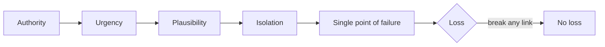

## Part 9: Detection & Defense Angle

Because media detection is a losing arms race in isolation, effective defence is layered: a thin, realistic media-detection layer under a thick **process and provenance** layer. Rank effort accordingly.

### Tier 1 — Process controls (highest ROI, do these first)

- **Out-of-band verification to *directory* numbers.** Any high-risk request (payment, credential/MFA reset, data export) must be confirmed on a channel and number the *recipient* independently looks up — never a number, link, or callback the requester supplied. This single control defeats the seeded-callback attack.
- **Challenge phrases / shared secrets.** Pre-agreed passphrases for executives and finance, rotated periodically. The AI does not know a secret that was never public — the control that saved Ferrari.
- **Dual authorisation and transaction limits.** No single person can move significant funds or reset a privileged account. Deepfakes bypass identity, not a second independent approver.
- **"Off-channel, off-hours, urgent" = automatic suspicion.** Train that unusual urgency plus an unusual channel (CEO on a personal messaging app, personal number) is itself the signal, regardless of how real the voice/face seems.
- **Help-desk hardening (Chapter 9).** Identity-proof resets with something beyond voice — callback to a registered device, manager approval, or in-person/badge checks.

### Tier 2 — Liveness challenges for live video/voice

Exploit the real-time constraint from Part 4. On a suspicious live call, ask the party to:

- Turn their head to a **full side profile** and back (swap models degrade at extreme angles).
- **Pass a hand across the face** (occlusion breaks blending/reenactment).
- Stand up and step back, or pick up and rotate an object near the face.
- Respond to a spontaneous, un-scriptable question (defeats pre-rendered/scripted audio).

These are cheap, need no tooling, and are the practical field test until detection tech matures. A short, memorable script staff can keep by the phone:

```
LIVE-CALL LIVENESS SCRIPT (use on any high-stakes video/voice request)
  1. "Can you turn fully to the side for a second? My video's glitching."
        -> real-time swaps break at extreme profile angles
  2. "Wave your hand in front of your face — I think it's my screen."
        -> occlusion tears reenactment/blending
  3. Ask something ONLY the real person could answer, that isn't public:
        "What did we decide about <internal, non-public detail> last week?"
        -> defeats scripted/pre-rendered audio and an operator without context
  4. "I'll call you straight back on your desk line." Then hang up and
     dial the DIRECTORY number yourself.
        -> breaks the seeded-callback and the whole live channel
If ANY step is refused, deflected, or fails: STOP. Do not action the request.
```

Two principles make the script robust. First, the physical challenges (steps 1–2) exploit the real-time compute limit that no amount of model quality removes on a live call. Second, the knowledge challenge (step 3) is *content the attacker's OSINT cannot reach* — the same principle as the executive challenge phrase, applied ad hoc. Together they cover both "is the media fake?" and "is the person who they claim to be?" without needing a detector.

### Tier 3 — Provenance and authenticity (the strategic fix)

- **C2PA / Content Credentials.** The Coalition for Content Provenance and Authenticity (C2PA) defines cryptographically-signed **content credentials** — tamper-evident metadata binding media to its capture/edit history. Cameras, editing tools, and platforms increasingly emit and check them. For an enterprise, requiring signed provenance on official executive communications is the long-term equivalent of email DMARC for media.
- **Watermarking.** Many hosted generation platforms embed detectable (often inaudible/invisible) watermarks; open tooling to detect them is emerging. Not a silver bullet — local models omit watermarks — but useful telemetry.
- **Signed executive comms.** Route genuine executive video/audio through channels that carry provenance, so *absence* of provenance becomes suspicious.

### Tier 4 — Automated media forensics (assistive, not decisive)

Detectors exist and help at scale, but treat their output as a **signal, not a verdict** — accuracy drops on compressed telephony audio and on unseen generators.

| Signal class | What it flags | Caveat |
|---|---|---|
| Vocoder-artefact / anti-spoofing models (ASVspoof-style) | Synthetic speech traces | Degrades over phone codecs |
| Face-boundary / temporal-flicker analysis | Face-swap blending seams | Fails on high-quality offline fakes |
| Physiological signals (rPPG "pulse from skin") | Missing blood-flow micro-colour changes | Beatable as models improve |
| Eye/teeth/reflection consistency | Reenactment rendering errors | Requires good resolution |
| Metadata / provenance absence | Missing/edited C2PA, re-encode traces | Absence ≠ proof of fake |

**Why detectors disappoint in production — the generalisation gap.** A detector reporting 99% accuracy on a benchmark is measuring performance on *generators it saw in training*. Against a *new* generator — the one an actual attacker used — accuracy often falls sharply, because the model learned that generator's specific artefacts rather than a universal "fakeness." This is the same **generalisation gap** that plagues signature-based malware detection, and it is why a detector's number should be read as "flags known fakes" not "detects fakes." Two consequences follow: (1) never gate a decision solely on a detector's pass, and (2) evaluate any vendor tool on *out-of-distribution* samples (a generator it wasn't trained on) before trusting it, because the vendor's headline metric almost certainly is not that.

**Detection engineering / DFIR use:** wire deepfake-detector scores and provenance checks into the SOC as **enrichment** on high-risk workflows (wire approvals, VIP-comms verification), and alert on the *combination* of "high-risk action + failed out-of-band verification + missing provenance." Never let a green detector score override a failed process check.

### Writing SOC detections for the AI-SE kill chain

Because the *content* is clean, detection engineering pivots to the surrounding telemetry. The synthetic media rarely touches your logs — but the actions around it do. Map detections to the kill-chain stages you *can* see:

| Kill-chain stage | Observable telemetry | Example detection logic |
|---|---|---|
| Lure delivery | Mail gateway, URL rewrite | New/low-reputation sending domain + lookalike display name of an internal exec |
| Credential capture (AiTM) | Auth logs, reverse-proxy indicators | Sign-in from a known AiTM ASN; token issued then reused from a new IP (Ch.8) |
| Impossible travel | Identity provider logs | Successful auth from two geographies inside a physically impossible window |
| Session/token replay | Identity + app logs | Session token minted on one device, replayed on another with different UA/IP |
| Payment/reset action | Finance/ITSM/help-desk logs | Bank-detail change or MFA reset lacking a recorded out-of-band verification step |

A representative alert expressed as pseudo-Sigma-style logic (adapt to your SIEM):

```yaml
title: High-Risk Action Without Out-of-Band Verification
logsource: { product: finance_workflow }
detection:
  action:
    event_type:
      - bank_detail_change
      - vendor_payment_over_threshold
      - privileged_mfa_reset
  verification:
    oob_verification_recorded: false      # no directory-callback logged
  correlate:                              # optional enrichment
    - preceded_by_urgent_inbound_call: true
    - sender_domain_age_days: '<30'
  condition: action and verification
level: high
```

The design principle: **alert on the missing control, not the fake.** You will rarely catch the deepfake in your logs, but you can reliably catch "a high-risk action executed without the mandated verification step" — and that is the event that actually causes loss.

### Tier 5 — Human program

- **Deepfake-aware awareness training** with live demos (show staff a real-time puppet of a *consenting* colleague — nothing convinces like seeing it).
- **Tabletop the deepfake-CFO payout scenario** with finance and the help desk.
- **A no-blame reporting culture**, so the employee who *almost* complied reports it (as at LastPass) instead of hiding it.

### Executive-protection program (VIP-specific hardening)

Because clones are only as good as the reference material, and because executives are the highest-value impersonation targets, a mature program treats a handful of named people as a distinct protective surface:

- **Footprint audit.** Inventory the public voice and video of each VIP — keynotes, podcasts, earnings calls, social clips. You cannot remove it all, but you can stop *needlessly* publishing long, clean, single-speaker recordings and can prefer formats (panels, lower-fidelity streams) that yield weaker reference audio.
- **Pre-shared challenge phrases for the inner circle.** The CFO, the CEO's EA, treasury, and IT admins each hold rotating pass-phrases used to authenticate any high-stakes verbal instruction. Ferrari's save came from exactly this.
- **A "the CEO will never ask you to do X over voice/chat" charter.** Publish, in plain language, the things leadership will *never* request via phone, video, or messaging app (gift cards, urgent wire changes, MFA codes, credential resets). This converts "is this really them?" into "leadership never asks this, full stop."
- **Designated verification path.** Every VIP has a documented, out-of-band way to be reached for confirmation, so staff are never improvising a callback number under pressure.
- **Monitoring for new likeness exposure.** Treat the appearance of a new, high-quality public clip of a VIP as a minor exposure event worth a heads-up to finance and the help desk, not merely PR.

**Red-team feedback loop:** the AI-SE assessment in Part 7 is what *validates* this program — run it against the treasury and help-desk workflows periodically and track whether the process-level pass rate improves over time. A rising pass rate is the metric that proves the controls, not the absence of incidents.

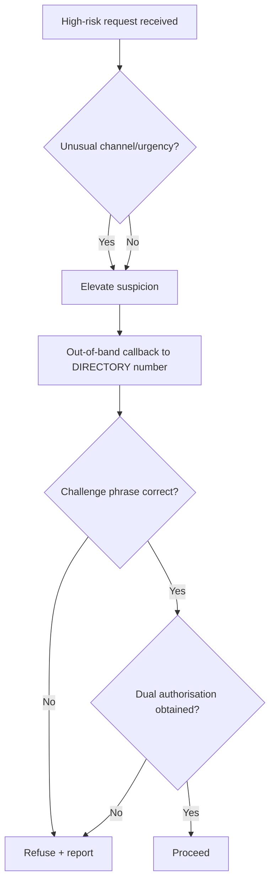

## Part 10: Common Pitfalls and Ethical/Legal Boundaries

**Operator (red-team) pitfalls**

- **Cloning a real executive without individual written consent** — do not, even under a red-team contract; likeness rights and impersonation laws are not waived by an org's blanket authorisation. Use consenting stand-ins.
- **Letting the media quality distract from the finding.** The deliverable is a *process gap*, not a cool clone. Clients pay for the fix.
- **Non-lab infrastructure.** Never push a real person's profile into a hosted model, and never let synthetic media of anyone escape the engagement boundary.
- **Over-reliance on one modality.** Real attacks are multi-channel (email → voicemail → live call). A test that only sends an email under-measures the risk.

**Defender pitfalls**

- **Buying a "deepfake detector" and calling it done.** Detection is Tier 4; without Tier 1 process controls you are one novel generator away from failure.
- **Training staff to "spot the fake."** This is increasingly unwinnable and creates false confidence. Train the *process* instead.
- **Callback controls that trust attacker-supplied numbers.** The most common real-world failure — the seeded callback.
- **Treating provenance absence as proof.** Missing C2PA is a flag, not a verdict; legitimate media is often stripped of metadata by platforms.
- **Voice-biometric "voiceprint" auth as a sole factor.** A good clone can push the speaker embedding close enough to pass naïve verification. Keep it as one signal, never the only one.
- **Awareness training that shows only *bad* fakes.** Demoing an obviously-glitchy deepfake teaches staff to look for glitches — and then a *good* fake sails through. Demo a convincing one (of a consenting colleague) so the lesson is "trust the process," not "spot the seam."
- **A blame culture that suppresses near-miss reports.** If the employee who almost complied fears punishment, you lose the earliest and best signal you have. The LastPass save depended on the employee feeling safe to report.

**Legal reality (jurisdiction-dependent, get counsel):** non-consensual voice/face cloning can constitute identity theft, fraud, right-of-publicity violation, harassment, or a specific deepfake offence; intimate synthetic imagery is a serious crime in a growing number of jurisdictions. Election-related and impersonation deepfakes face rapidly expanding statutes. "It was a red-team test" is a defence *only* within a properly scoped, authorised, consented engagement — and even then not for third-party likenesses.

### Memory hooks

- **"The medium is not the proof."** A voice, a face, or a fluent email proves the *channel* is convincing, not that the person is real. Only an *independent channel* proves identity.
- **"Detect the missing control, not the fake."** You will rarely catch the deepfake; you can reliably catch a high-risk action done without its verification step.
- **"Real-time is the crack in the armour."** Live puppets can't do profiles, occlusions, or the unexpected — so *ask them to*.
- **"AI is recon-bound, not model-bound."** The lure is only as sharp as the OSINT behind it; shrink your executives' public voice/video footprint.
- **"Be the second signature."** Every documented loss had a single point of failure; refusing to be it is the cheapest defence there is.

## Part 11: Final Revision / Summary

- **AI removed the two ceilings on social engineering** — operator time and technical impossibility — turning it into an industrial, scalable process.
- **Three modalities:** synthetic *voice* (TTS cloning + real-time voice conversion), synthetic *video* (offline swaps and, decisively, real-time reenactment on live calls), and synthetic *text* (LLM spear-phishing, BEC thread hijacking, chatbots). Plus GAN/diffusion *image* synthesis for sock-puppet personas.
- **Engine room:** autoencoders (original face-swap), GANs (adversarial synthesis, sock-puppet faces), diffusion (high-fidelity offline video/image), neural TTS + voice conversion (speaker-embedding cloning), and LLMs (content at scale). Each family has characteristic artefacts — but **telephony and video compression mask them**, which is why acoustic/visual detection alone is unreliable.
- **The real-time constraint is the defender's leverage:** live puppets can't do profile turns, occlusions, or spontaneous physical actions well — the basis of **liveness challenges**.
- **The cases prove the thesis:** successes (Arup ~US$25M, the 2019 voice-clone) exploited *process gaps*; failures (Ferrari, WPP, LastPass) were stopped by *processes* — challenge phrases, out-of-band callbacks, off-channel suspicion — not by detecting the fake.
- **Defence is layered and process-first:** Tier 1 process controls (out-of-band verification, challenge phrases, dual authorisation) > Tier 2 liveness challenges > Tier 3 provenance (C2PA) > Tier 4 assistive forensics > Tier 5 human program.
- **This closes the Social Engineering series.** From the psychology of influence to synthetic media, the constant is that the human and the *process around the human* are the attack surface — and the durable defence is making that process resistant to a *perfect* fake, not hoping people spot an imperfect one.

## Part 12: Cheat Sheet / Quick Reference

**Taxonomy at a glance**

| Term | One-line meaning |
|---|---|
| TTS cloning | Type text → speech in a target's voice (few-shot from seconds of audio) |
| Voice conversion (VC) | Speak live → output re-timbred to target (enables real-time vishing) |
| Face swap | Target's face pasted onto a source performer |
| Face reenactment | Attacker's movements *drive* the target's face (live calls) |
| Lip-sync / dubbing | Real footage, mouth re-animated to new audio |
| GAN synthesis | Photoreal face of a person who doesn't exist (sock puppets) |
| Diffusion | Denoise-from-noise generation; high-fidelity offline media |
| RTF | Real-time factor; < 1.0 = faster than playback = live-capable |
| C2PA | Signed content-provenance credentials (media's "DMARC") |

**Model → artefact → field test**

| Model | Characteristic tell | Quick check |
|---|---|---|
| Autoencoder swap | Face-boundary flicker, jaw/hairline seam | Ask for a hand across the face |
| StyleGAN face | Mismatched earrings, melted teeth, fixed eye position | Reverse-image + align two pics |
| Real-time reenactment | Bad extreme angles, eye/teeth errors | Ask for full side-profile turn |
| Neural TTS clone | Too-clean background, flat prosody, odd breathing | Ask a spontaneous question |
| LLM text | No artefact — check infra & context | Verify facts out-of-band |

**Defender's one-page playbook**

```
HIGH-RISK REQUEST (payment / reset / data export)?
  1. Off-channel? Off-hours? Urgent?  -> raise suspicion, don't lower it
  2. CALL BACK on a DIRECTORY number (never the supplied one)
  3. Demand the CHALLENGE PHRASE (pre-agreed, non-public)
  4. Require DUAL AUTHORISATION over threshold
  5. On live video: PROFILE TURN + HAND-ACROSS-FACE + SPONTANEOUS QUESTION
  6. No provenance (C2PA) on 'official' media -> treat as suspect
  7. When in doubt: STOP and REPORT (no blame)
Never let a green 'deepfake detector' score override a failed step above.
```

**Operator lab commands (own likeness only)**

```bash
# Clean your own reference audio
ffmpeg -i my_talk.mp4 -vn -ac 1 -ar 22050 -f wav voice_raw.wav
sox voice_raw.wav voice_clean.wav norm -1 silence 1 0.1 1% -1 0.3 1%

# Clone YOUR voice with local XTTS
tts --model_name tts_models/multilingual/multi-dataset/xtts_v2 \
    --text "Authorised test. Reference 379." \
    --speaker_wav voice_clean.wav --language_idx en --out_path clone.wav

# Draft an authorised, consented lure locally
ollama run llama3.1:8b "AUTHORISED consented red-team test. Draft ..."
```

## Part 13: Practice Labs & Resources

Train on this topic with material that actually exercises these skills — build/detect responsibly, using your own likeness and consenting participants only.

- **Deepfake detection datasets & challenges:** the **DeepFake Detection Challenge (DFDC)** dataset, **FaceForensics++**, and **Celeb-DF** — classic benchmarks for building and evaluating video-deepfake detectors. Practise *classifying* clips into swap vs. reenactment.
- **Audio anti-spoofing:** the **ASVspoof** challenge datasets — the standard for detecting synthetic/converted speech; a good place to understand what telephony compression does to those signals.
- **Provenance:** read the **C2PA specification** and experiment with **Content Credentials** verification tools on signed vs. stripped media.
- **Voice/video tooling (self-cloning only):** Coqui-TTS / XTTS, OpenVoice, RVC, and DeepFaceLab/DeepFaceLive — stand up in an isolated VM, clone *your own* voice/face, and test the liveness challenges against your own puppet to feel where they break.
- **LLM safety & red-teaming:** the **OWASP Top 10 for LLM Applications** and **MITRE ATLAS** (adversarial threat landscape for AI systems) — for the defensive/model-security side of AI-driven attacks.
- **Framework mapping:** map these techniques onto **MITRE ATT&CK** Phishing (T1566) and Impersonation/Trusted-Relationship tradecraft, and onto the **social-engineering kill chain** from Chapter 1, to keep them anchored in a testable methodology.
- **Tabletop:** run the "deepfake CFO payout" and "help-desk voice-reset" scenarios (Part 7) with your finance and IT teams — the single most valuable exercise here, because it tests the *process* that Part 9 says is the real defence.

### Practice questions & mini-labs

Work these without looking back at the chapter, then check yourself:

1. **Classification.** You are handed a 20-second clip of a "CEO" on a webcam call. Their face looks sharp head-on but tears when they reach off-screen for a coffee cup, and the background never changes. Which technique is most likely — offline face swap, real-time reenactment, or lip-sync dubbing — and which *two* liveness challenges would you use to confirm it live?
2. **Voice biometrics.** Explain, in terms of speaker embeddings, why "your voice is your password" phone-banking auth is now considered weak, and what *two* additional factors you would layer on to keep voice as one signal without trusting it alone.
3. **Latency budget.** A real-time voice-conversion vishing rig measures 90 ms inference + 40 ms vocoder + 15 ms routing on the operator side, with a 140 ms telephony leg. Is the call likely to *feel* laggy to the target, and what does your answer imply about where the defender should place their control?
4. **BEC verification design.** Draft the *exact* procedural rule that would have stopped the Part 5 thread-hijack example, specifying the trigger, the required channel, and who is not allowed to complete the action alone.
5. **Detection engineering.** Your SIEM cannot see the deepfake itself. Write, in one sentence each, three log-based detections (across mail, identity, and finance/ITSM sources) that would catch the *actions* surrounding an AI-driven CFO-payout attack.

Model answers live in the mechanics above (Parts 2, 3, 5, 9) — if any question is hard, that section is where to re-read.

This is the last chapter of the Social Engineering series. You began with the psychology of a single human decision and end with the industrialisation of deception by machines — and in both, the lesson is identical: defend the *process*, not just the perception.
