This is Chapter 11 of the Social Engineering series, and it turns the whole series around. The previous ten chapters were written from the attacker's chair: the psychology of influence, pretext development, phishing and spoofing, SET and Gophish, malicious documents, Evilginx-style adversary-in-the-middle, vishing and physical pretexting, and AI-driven synthetic media. This chapter is the defender's answer to all of it. Every technique you learned to *run* has a control, a detection, and a program response that makes it fail — and building those, at organizational scale, is a distinct discipline with its own craft.

The core claim of this chapter is uncomfortable but load-bearing: **you cannot train people out of being human.** Curiosity, deference to authority, time pressure, and the desire to be helpful are not bugs to be patched — they are the operating system. A defense that depends on every employee being suspicious every minute of every day will fail, because attackers only need one success and defenders need to win every time. So the real goal of a human-risk program is not "make users perfect." It is to (1) shrink the attack surface with technical controls so that most lures never arrive and most successful lures cannot be monetized, (2) make the *right* action easy and fast — one-click reporting — so that the humans who do spot something become a sensor network, and (3) measure the residual risk honestly so you know whether you are getting better.

We will build that program from the ground up: the psychology of why awareness training usually fails, the technical controls that make phishing fail closed, help-desk and identity hardening, how to run phishing simulations *ethically* and measure them without gaming the numbers, the human-detection telemetry pipeline, incident response for a live attack, and the metrics that tell you if any of it is working. The offensive references throughout are lab-scoped and exist only to explain what the control is defending against.

## Why This Matters

Social engineering is the entry vector in the overwhelming majority of real breaches. Year after year, industry incident reports put the "human element" — phishing, pretexting, stolen credentials, misdelivery, and error — in the majority of breaches. The reason is economic: exploiting a memory-corruption bug in a hardened, patched, EDR-monitored target is expensive and unreliable; convincing a help-desk agent to reset an MFA token, or a finance clerk to approve a wire, is cheap, repeatable, and often invisible to every technical control you bought.

That asymmetry is why "defense" here is not a single product. It is a **layered system** where each layer catches what the previous one missed:

- **Prevent the lure from arriving** — email authentication, filtering, attachment sandboxing, link rewriting, external-sender banners, look-alike domain monitoring.
- **Prevent the lure from working** — phishing-resistant MFA (FIDO2/passkeys), conditional access, least privilege, so that even a user who types their password into a fake page cannot hand over a usable session.
- **Detect the attempt in progress** — reporting buttons, mail-flow analytics, impossible-travel and token-anomaly detection, help-desk verification logs.
- **Respond fast when one lands** — session revocation, credential reset, forensic triage, and communication that treats the human as a partner, not a culprit.
- **Measure and improve** — resilience metrics, not just click rates, so the program demonstrably reduces risk over time.

A program that only does awareness training — the "annual 45-minute video and a quiz" model — is the single most common failure mode in the industry, and this chapter is largely an argument for why, and what to do instead.

## Part 0: The Threat Landscape and Attacker Economics

Before designing defenses, you need a clear-eyed model of *who* is attacking and *why the economics favor them*, because a defense that ignores the attacker's incentives will optimize the wrong things.

The attacker population runs on a spectrum. At the low end are **commodity phishers** — high-volume, low-effort campaigns using kits bought or rented on criminal markets (phishing-as-a-service), casting wide for reused passwords and unprotected accounts. In the middle are **BEC and fraud crews** — patient, research-driven operators who compromise or spoof executive and vendor mailboxes to redirect payments; they are the most financially damaging category and often use *no malware at all*. At the high end are **initial-access brokers and targeted intrusion crews** — including the "help-desk caller" groups whose entire tradecraft is a convincing phone call to reset an MFA token, and who then sell or use that access for ransomware and data theft.

The economics that shape all of this:

- **Attacker cost is near-zero and scales.** A phishing kit, a look-alike domain, and a list cost a few dollars; AI (Chapter 10) drops the per-lure content cost to nothing. Defenders, by contrast, must protect every user, every day.
- **The attacker only needs one success.** A 99% report rate still means 1% who don't — and one credential can be enough. This asymmetry is *why* the strategy must be "make the one success unmonetizable," not "achieve a 0% click rate."
- **Credentials are a liquid commodity.** Stolen valid accounts are bought and sold; that's why "make a stolen credential worthless" (phishing-resistant MFA + conditional access) is the highest-leverage move — it breaks the *monetization*, not just the theft.
- **Process, not technology, is often the target.** Wire approvals, vendor bank-detail changes, and MFA resets are business processes; attacking them needs no exploit, so no amount of endpoint hardening helps. The defense lives in the process (Parts 6 and 13).

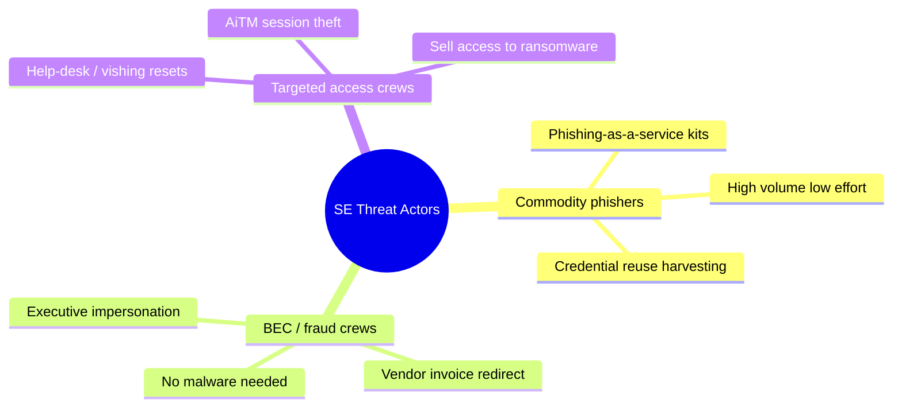

The practical consequence for your program: **weight your defenses toward the highest-impact, lowest-attacker-cost paths** — credential theft made worthless by passkeys, and payment/reset processes hardened against pure social manipulation — rather than spreading effort evenly. The rest of the chapter is organized around that prioritization.

## Part 1: Why Traditional Awareness Training Fails

Start with the failure mode, because most organizations are living in it. The classic program looks like this: employees are enrolled in an annual computer-based training (CBT) module, they watch a video, they answer a five-question multiple-choice quiz, they get a completion certificate, and the compliance team records a 100% completion rate. Leadership sees "100% trained" and believes the human risk is handled. Then a simulated phish goes out and 22% of the "fully trained" workforce clicks.

There are concrete, well-understood reasons this happens, and naming them is the first step to designing something better.

**Knowledge is not behavior.** A user can score 5/5 on "which of these is a phishing email?" in a calm quiz environment and still click a lure at 4:55pm on a Friday when it appears to come from their manager and references a real project. The quiz measures *declarative knowledge* in a low-stakes context; the attack exploits *automatic behavior* under load. The two are almost unrelated. This is the single most important idea in the whole chapter.

**Fear and shame backfire.** Programs that punish clickers — public shaming, "you failed, here's a mandatory extra course," manager escalation for a first offense — teach one durable lesson: *do not report, and do not admit mistakes.* The moment an employee believes reporting a real click will get them in trouble, your most valuable detection sensor goes dark. The single worst thing a program can do is make people afraid to raise their hand.

**One-size-fits-all wastes everyone's time.** A finance-team wire-approver, a developer with cloud admin keys, an executive who is a whaling target, and a warehouse worker with no email access face wildly different threats. Feeding them all the same generic module is simultaneously too much for some and useless for others.

**Frequency and recency dominate.** Awareness decays fast. A single annual event produces a spike in vigilance that fades within weeks. Effective programs deliver **short, frequent, contextual** nudges — a 90-second micro-lesson triggered by a relevant event — rather than one long annual dump.

**The metric is wrong.** "Completion rate" measures attendance, not resilience. Even "click rate" alone is a trap (Part 8): a program can drive click rate to near zero and still be more vulnerable, because it optimized for the test rather than for real reporting behavior.

Here is the mental model for what a modern program replaces the old one with:

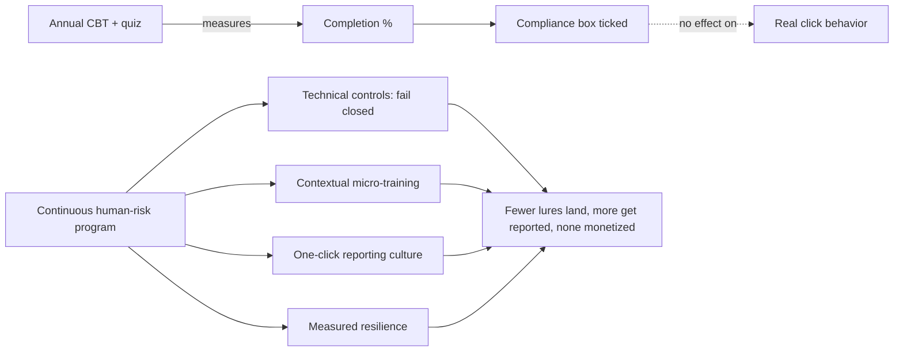

**Program relevance:** the deliverable of this part is a principle, not a tool — *design for behavior change and measurement, not for compliance completion.* Everything that follows is an implementation of that principle.

## Part 2: The Psychology of Resistance — Turning Cognition Into a Control

Chapter 1 of this series taught the six Cialdini levers attackers pull — reciprocity, commitment/consistency, social proof, authority, liking, and scarcity — plus urgency and fear. Defense means giving people a *procedural* counter to each lever, because you cannot ask a stressed human to out-reason a professional manipulator in real time. You replace judgment with a rule.

The key insight from behavioral science: manipulation works by pushing people into **System 1** — fast, automatic, emotional thinking — and keeping them out of **System 2** — slow, deliberate, analytical thinking. Urgency ("wire this in the next 20 minutes or we lose the deal"), authority ("this is the CEO"), and fear ("your account will be suspended") are all System-1 accelerants. The defensive move is to install **friction that forces a System-2 check** at exactly the moments attackers try to rush people.

The most powerful single procedural control is the **out-of-band verification rule**: any request that (a) moves money, (b) changes payment details, (c) resets an authentication factor, or (d) shares credentials or sensitive data must be verified through a *different, pre-established channel* than the one it arrived on — and the person verifying must *initiate* the contact using a known-good number, never a number supplied in the request. This one rule defeats CEO fraud, most vishing, invoice-redirect fraud, and help-desk reset attacks, because every one of those relies on the target trusting the channel the attacker chose.

| Attacker lever | How it feels to the target | Procedural counter (the rule) |
|---|---|---|
| Authority ("I'm the CFO") | Deference, fear of pushback | Verify via org directory number you dial; authority never exempts verification |
| Urgency ("in the next 10 min") | Panic, tunnel vision | Mandatory cool-down: money/credential requests have a minimum verification delay |
| Scarcity ("last chance") | Fear of missing out | Treat artificial deadlines as a red flag, not a reason to hurry |
| Liking / rapport | Desire not to disappoint | Verification is impersonal policy, applied to everyone, so refusing isn't rude |
| Social proof ("everyone's done it") | Conformity | Independent confirmation, not "others did it" |
| Reciprocity (small favor first) | Feeling indebted | Recognize the setup; favors don't unlock exceptions |

**Awareness content that works** teaches these *rules and the feeling that should trigger them* — "when you feel rushed about money or passwords, that feeling is the signal to slow down and verify" — rather than a taxonomy of email header fields most users will never inspect. You are training an emotional trigger ("I feel pressured → I verify"), which survives under load, instead of a checklist, which does not.

To make the out-of-band rule real rather than aspirational, write it as an unambiguous, posted procedure the finance and help-desk teams can follow without judgment calls:

```
PAYMENT / CREDENTIAL VERIFICATION PROCEDURE (mandatory, no exceptions)
1. Trigger: any request to move money, change payee bank details, reset an
   auth factor, or share credentials/sensitive data.
2. STOP. Do not act on the request in the channel it arrived.
3. Look up the requester's number in the corporate directory (NOT the number,
   email, or link in the request).
4. Call them and confirm the request verbally. If unreachable, the request waits.
5. For payments over [THRESHOLD] or any bank-detail change: a SECOND authorized
   approver independently repeats step 3-4.
6. Log who requested, who verified, method used, and outcome.
Authority does not exempt this. Urgency does not exempt this. "The CEO said so"
does not exempt this. Slowing down a sensitive request is always correct.
```

The reason to write it this literally is that manipulation works by making the target feel that *this case is the exception* — the boss is really in a hurry, the deal really will collapse. A posted, exception-free procedure removes the target's need to make that judgment under pressure, which is precisely the cognitive load the attacker is exploiting.

**Red team usage (lab-scoped, for calibration):** authorized SE assessments deliberately test whether these procedural rules hold under pressure. A scoped vishing test that asks a help-desk agent to reset MFA without ID verification is measuring exactly the control this part installs. The finding is never "Alice is gullible"; it is "the reset process lacks an enforced identity check," which is a *process* fix.

## Part 3: Email Authentication — SPF, DKIM & DMARC Done Right

The first technical layer is making it hard for an attacker to *be* your domain, and easy for the world to reject mail that fakes it. This is the SPF/DKIM/DMARC trio. Chapter 4 of this series covered these from the attacker's angle (deliverability and spoofing); here we configure them as a defender, correctly, because misconfiguration is rampant and a `p=none` DMARC record protects nobody.

**SPF (Sender Policy Framework)** is a DNS TXT record that lists which IP addresses/hosts are authorized to send mail *for your domain's envelope sender (MAIL FROM)*. A receiver checks the connecting IP against the record. Its blind spot: SPF validates the envelope `MAIL FROM` (the "Return-Path"), **not** the `From:` header the user sees. An attacker can pass SPF on their own domain while spoofing your brand in the visible `From:` — which is why SPF alone stops nothing that users see. SPF also breaks on forwarding (the forwarder's IP isn't in your record).

A correct SPF record is strict and ends in a hard fail:

```dns
example.com.  IN  TXT  "v=spf1 include:_spf.google.com include:sendgrid.net -all"
```

- `v=spf1` — version tag, required first.
- `include:_spf.google.com` — authorizes Google Workspace's sending infrastructure (delegates to their record).
- `include:sendgrid.net` — authorizes a marketing/transactional ESP.
- `-all` — **hard fail**: anything not listed should be rejected. Use `-all`, not `~all` (soft fail) once you're confident of your senders. A `+all` (allow anything) is catastrophic and occasionally seen in the wild.

Watch the **10-DNS-lookup limit**: SPF permits at most 10 nested DNS lookups; exceeding it yields a `permerror` and receivers may ignore the record. Flatten or consolidate `include:`s if you hit it.

**DKIM (DomainKeys Identified Mail)** cryptographically signs selected headers and the body with a private key; receivers fetch the public key from DNS (`selector._domainkey.example.com`) and verify the signature. DKIM survives forwarding (the signature travels with the message) and proves the message wasn't altered in transit and genuinely came from a signer authorized for that domain. Use **2048-bit** keys and **rotate** selectors periodically.

```dns
s1._domainkey.example.com. IN TXT "v=DKIM1; k=rsa; p=MIIBIjANBgkqhki...QAB"
```

**DMARC (Domain-based Message Authentication, Reporting & Conformance)** is the keystone. It (1) tells receivers what to do when a message *fails* authentication, and (2) — crucially — ties SPF/DKIM to the **visible `From:` header** via *alignment*. A message passes DMARC if it passes SPF *or* DKIM **and** the passing domain aligns with the `From:` domain. That alignment requirement is what finally protects the header the user actually reads.

```dns
_dmarc.example.com. IN TXT "v=DMARC1; p=reject; rua=mailto:dmarc@example.com; ruf=mailto:forensic@example.com; fo=1; adkim=s; aspf=s; pct=100"
```

- `p=reject` — the goal state: receivers reject unauthenticated mail claiming to be you. `p=none` (monitor only) protects nobody; `p=quarantine` sends to spam; `p=reject` is the target.
- `rua=` — aggregate report destination (daily XML rollups of who's sending as you). Start here.
- `ruf=` — forensic/failure reports (per-message, redacted); support varies.
- `adkim=s` / `aspf=s` — **strict** alignment (exact domain match) vs. `r` relaxed (organizational-domain match). Strict is safer once mapped.
- `pct=100` — apply the policy to 100% of mail; you can ramp from a lower percentage.

The **correct rollout** is a staged one — never jump to `p=reject` blind, or you'll bounce legitimate mail:

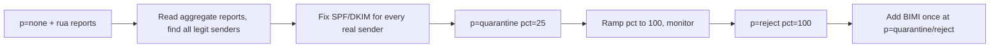

| Mechanism | Validates | Survives forwarding? | Protects visible From:? | Key gotcha |
|---|---|---|---|---|
| SPF | Envelope MAIL FROM vs IP list | No | No | 10-lookup limit; forwarding breaks it |
| DKIM | Cryptographic header/body signature | Yes | Only via DMARC alignment | Key rotation, 2048-bit keys |
| DMARC | Alignment + policy | Depends on SPF/DKIM | **Yes** | `p=none` does nothing; ramp carefully |

**Blue team usage:** DMARC aggregate reports are also *threat intelligence* — they reveal who is attempting to spoof your domain and from where. Feed `rua` XML into a parser (dmarcian, Postmark's free analyzer, or a self-hosted tool like `parsedmarc` into Elastic) and watch for spikes from unfamiliar sources ahead of a campaign. Complement outbound DMARC with inbound controls: enforce DMARC on *received* mail, add **external-sender banners**, and deploy **look-alike/cousin-domain monitoring** (Part 7).

## Part 4: Layered Email & Web Defenses

DMARC stops exact-domain spoofing. It does nothing about the far more common lure: a *look-alike* domain (`examp1e.com`, `example-support.com`), a compromised third-party sender, or a legitimate-but-abused service (a Google Doc share, a DocuSign lure). Those require a second layer of controls at the gateway and the endpoint.

**Secure Email Gateway (SEG) / cloud mail security** provides the bulk filtering:

- **Reputation and content filtering** — block known-bad senders, URLs, and hashes; score novel mail.
- **Attachment sandboxing (detonation)** — open attachments in an instrumented VM and watch for malicious behavior before delivery. Defeats many macro/loader lures (see the Malware & Evasion notebook for what's being detonated).
- **Time-of-click URL rewriting** — rewrite links so they're re-checked *when the user clicks*, not just at delivery. Attackers weaponize a benign URL after delivery to beat delivery-time scanning; time-of-click catches the swap. Trade-off: it breaks some link previews and centralizes a lot of trust in the rewriter.
- **Impersonation / display-name protection** — flag mail where the display name matches an executive but the address doesn't, or where the domain is a newly registered look-alike.
- **External-sender banners** — a prepended `[EXTERNAL]` banner on any mail from outside the org. Cheap, effective, and directly undercuts "I'm the CEO" pretexts sent from external look-alike domains. Keep the banner meaningful — if *every* mail has it, users stop seeing it; tune so internal-looking-but-external mail stands out.

**Browser and web layer**: enforce safe-browsing/URL reputation, block newly registered domains and known phishing categories at the DNS/proxy layer (e.g., a protective DNS resolver), and — for the AiTM threat from Chapter 8 — this is where **phishing-resistant MFA** (Part 5) becomes the real control, because reverse-proxy phishing defeats URL filtering by using a *unique, clean* domain per campaign.

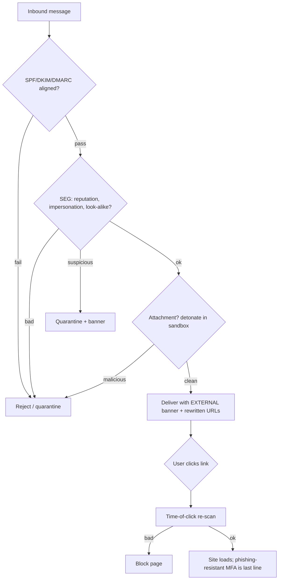

**CTF/lab relevance:** if you build a home lab to study these defenses (an isolated mail server, an internal Gophish instance targeting *only your own test accounts*), you can watch SPF/DKIM/DMARC verdicts appear in `Authentication-Results` headers and see exactly why a spoof passes or fails. TryHackMe's "Phishing" and "Phishing Analysis" rooms and the "MITRE" / "Sysmon" rooms pair well with this for hands-on header and telemetry reading.

## Part 5: Identity Hardening — Make Stolen Credentials Useless

The most important shift in modern anti-phishing is philosophical: **stop trying to prevent every credential theft, and instead make a stolen credential worthless.** Chapter 8 showed that adversary-in-the-middle phishing steals the *session*, not just the password, defeating OTP and push MFA. The answer is not "better user training" — it is **phishing-resistant authentication**.

**FIDO2 / WebAuthn / passkeys** are the control that actually defeats AiTM. The mechanism: the authenticator (a hardware security key like a YubiKey, or a platform authenticator like Face ID / Windows Hello holding a passkey) performs a public-key challenge-response that is **cryptographically bound to the origin (the real domain)**. When a user lands on `evil-proxy.com`, the browser passes that origin to the authenticator, the signature is computed for `evil-proxy.com`, and it does not validate against the real service. **There is no code, no OTP, and no cookie the proxy can relay** — the secret never leaves the authenticator and is scoped to the real site. This is why passkeys/FIDO2 are the single highest-leverage anti-phishing investment an organization can make.

| MFA type | Stops password reuse? | Stops real-time phishing/AiTM? | Notes |
|---|---|---|---|
| SMS OTP | Partial | **No** | Also vulnerable to SIM-swap; weakest MFA |
| TOTP app (authenticator codes) | Yes | **No** | Code is relayable through a proxy |
| Push approval | Yes | **No** | MFA-fatigue / push-bombing; relayable |
| Push + number matching | Yes | Mostly no | Raises effort but still not origin-bound |
| **FIDO2 / passkey (WebAuthn)** | Yes | **Yes** | Origin-bound; phishing-resistant by design |

**Number matching and push hardening**: if you cannot deploy FIDO2 everywhere immediately, at minimum enforce **number matching** (user types a number shown on the login screen into the app, defeating blind "just approve" fatigue attacks) and **rate-limit push prompts** to stop push-bombing. This is a mitigation, not a solution.

**Conditional access / risk-based access** is the second identity layer. Even with a stolen session, policies can require:

- **Device compliance** — only managed, compliant devices get tokens; an attacker's box fails the check.
- **Managed-network / geo constraints** — block or step-up from anomalous locations.
- **Sign-in risk scoring** — impossible travel, anonymizer/Tor egress, unfamiliar ASN, atypical token replay → block or force re-auth with a phishing-resistant factor.
- **Token protection / binding** — bind the session token to the device (e.g., token binding / continuous access evaluation) so a stolen cookie replayed from another machine is rejected.

**Least privilege and blast-radius reduction**: assume some account *will* be phished. Limit what a single compromised identity can reach — separate admin accounts, just-in-time privilege elevation, no standing global-admin, tiered administration (the AD administrative-tiering model from the AD notebook applies directly). The goal is that a phished sales account cannot pivot to the domain.

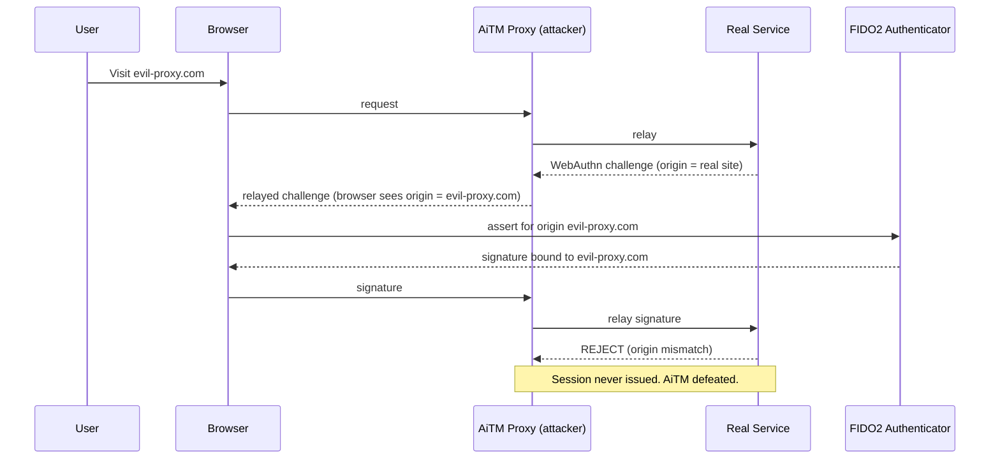

**Program note:** rolling out passkeys is change management as much as technology — pilot with high-risk groups (finance, admins, executives), provide backup authenticators, plan the account-recovery path (recovery is the new phishing target — Part 6), and communicate the *why*. The payoff is that the Evilginx-class attack from Chapter 8 simply stops working against enrolled users.

## Part 6: Help-Desk, Callback & Account-Recovery Hardening

Attackers who cannot beat your MFA will attack the process that *resets* it. The help desk and the account-recovery flow are now the softest part of most organizations — the wave of high-profile intrusions that started with a phone call to the IT service desk made this the defining SE battleground. Chapter 9's vishing and MFA-reset attacks target exactly here.

The failure pattern is simple: an attacker calls the help desk claiming to be an employee who is "locked out and traveling," supplies a few pieces of easily-OSINTed information (name, employee ID, manager, birthday), and a helpful agent resets the password and/or re-enrolls a *new* MFA device — handing the attacker a fully working, MFA-backed account. Every control below exists to break that.

**Enforced identity verification for sensitive actions.** Password resets, MFA re-enrollment, and email-forwarding changes must require **strong, non-public verification**, not knowledge-based questions (which are OSINT-able). Options, best first:

- **In-person or video verification with government ID** for high-risk resets.
- **Manager or sponsor call-back attestation** using a directory-sourced number the agent dials.
- **A pre-enrolled verification factor** the caller must satisfy (a separate recovery passkey, an in-app approval from an *already-trusted* device).
- **A time delay + notification** to the account owner's known channels before the reset takes effect, so the real owner can cancel a fraudulent reset.

**Never trust caller-supplied contact details.** The agent initiates verification through the directory, never a number or email the caller provides. This is the out-of-band rule from Part 2, applied to the help desk.

**Log and alert on the pattern.** Every reset/re-enroll should be logged with who requested it, who approved it, and the verification method used. Alert on tell-tale sequences: MFA device removed *then re-added* from a new device, followed by a login from a new location; multiple reset attempts for different users from one caller; resets outside business hours.

**Reduce the value of a reset.** With phishing-resistant MFA and conditional access, even a reset password lands on a device/location that fails policy. Recovery flows should require a phishing-resistant factor to *complete*, not just to log in afterward.

| Help-desk request | Weak (vulnerable) handling | Hardened handling |
|---|---|---|
| Password reset | KBA (DOB, employee ID) | ID/video verify or manager callback via directory number |
| Add/replace MFA device | Agent enrolls on caller's say-so | Owner notified + delay; existing trusted factor or in-person proof required |
| Change forwarding/recovery email | Changed on request | Treated as high-risk; out-of-band verify + owner alert |
| "Urgent, I'm traveling" pressure | Agent expedites | Urgency is a red flag; standard verification still applies |

**Blue team usage:** treat the help desk as a monitored, high-value control point. Give agents an **explicit, blameless escalation path** — "when in doubt, verify out-of-band; you will never be penalized for slowing down a sensitive request." Run scoped vishing simulations (Part 7) against the help-desk process specifically, and measure the *process*, not the individual agent.

## Part 7: Running Phishing Simulations Ethically and Well

Phishing simulations are the most powerful — and most frequently *misused* — tool in the program. Done well, they build a reporting reflex and give you a real resilience metric. Done badly, they destroy trust, teach people to hide mistakes, and generate a vanity number that hides growing risk. This part is how to do them well, and it leans heavily on the *ethics/authorization* framing that has governed the entire series.

**Purpose first.** The goal of a simulation is **not** to catch people out or to drive click rate to zero by any means. It is to (a) build and measure the *reporting* reflex, (b) find *process and control* gaps, and (c) deliver just-in-time teaching at the teachable moment. Design every campaign around those goals.

**Ethical guardrails (non-negotiable):**

- **Authorization and governance.** Simulations run under documented approval from security leadership and, where required, HR and legal/works councils. This is the same authorization discipline as an offensive engagement — scope, sign-off, and rules of engagement.
- **No cruel lures.** Never bait with things that cause real distress or exploit personal hardship: fake bonuses, layoffs, promised raises, benefits/health scares, bereavement, or emergencies. These generate clicks *and* lasting resentment, and they poison the program. Several organizations have caused serious internal harm with "you got a bonus" lures — don't.
- **Teach, don't shame.** A click leads *immediately* to a short, supportive landing page: "This was a safe training exercise. Here's the one tell you can use next time. Here's the report button." No manager email for a first click, no public leaderboard of "losers."
- **Measure the group, tune the difficulty.** Report aggregate and per-population trends, not individual names, to leadership. Escalate *repeat, high-risk* clickers into supportive coaching, not punishment.
- **Reward reporting.** The headline metric is the **report rate** and the **resilience ratio** (reporters ÷ clickers), not click rate alone (Part 8).

**Tooling.** Use a dedicated simulation platform (commercial: KnowBe4, Proofpoint Security Awareness, Microsoft Attack Simulator; open-source: **GoPhish** for lab/internal use as covered in Chapter 6). GoPhish is fine for controlled internal programs; commercial platforms add curated templates, LMS integration, and reporting-button plugins. Whatever you use, sending simulated phish to your own employees is authorized internal testing — but it must still be governed, logged, and scoped exactly like the offensive work in earlier chapters.

**A sane campaign cadence** ramps difficulty and always closes the loop:

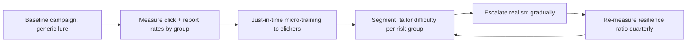

**Realism, ramped responsibly.** Start with obvious lures and increase sophistication over quarters (look-alike domains, then pretext-tailored, then — for high-risk groups with leadership sign-off — vishing/help-desk tests). Don't open with a flawless spear-phish against the whole company; you'll get a scary number and no learning. The point is a *trend line that improves*, not a single dramatic result.

**Report-button pipeline.** The single most valuable output of a simulation program is a well-adopted **one-click report button** wired to your SOC/abuse mailbox. When a real campaign hits, reporters become your earliest and best sensor (Part 8 and Part 9). Measure adoption and celebrate it.

## Part 8: Metrics — Measuring Human Risk Honestly

If you take one thing from this chapter as a program owner, take this: **click rate alone is a lie.** A program can drive click rate toward zero while *increasing* real-world risk — for example by making people so afraid of clicking that they also stop reporting, or by training to the specific templates you use. You need a small set of metrics that together describe *resilience*, and you need to watch them as trends, segmented by population.

**The core metrics:**

- **Report rate** — % of simulated (and real) phish that get reported via the button. This is the metric to *maximize*. A rising report rate means your sensor network is growing.
- **Resilience ratio** — reporters ÷ clickers for a given campaign. This captures whether "good behavior" is outrunning "bad behavior." A ratio > 1 (more reporters than clickers) and rising is the goal.
- **Click rate** — % who clicked. Useful, but only *alongside* report rate; a low click rate with a low report rate is a warning, not a win.
- **Time-to-report (TTR)** — median minutes from delivery to first report. Fast reporting is what lets the SOC pull a real campaign before it spreads. Watch this trend down.
- **Repeat-clicker rate** — the small population that clicks repeatedly; target coaching here, and measure whether it shrinks.
- **Real-incident metrics** — actual reported phish, credential-harvest attempts caught, and — the outcome that matters — reduction in successful account compromises and BEC losses.

| Metric | Direction you want | What it really tells you | Failure if you ignore it |
|---|---|---|---|
| Report rate | Up | Size/health of your human sensor net | You optimized fear, not detection |
| Resilience ratio | Up (>1) | Good behavior outpacing bad | Click rate looks fine but nobody reports |
| Click rate | Down (context) | Susceptibility to *this* template | Vanity metric; easily gamed |
| Time-to-report | Down | How fast SOC can respond | Slow reports = campaign spreads |
| Repeat-clicker rate | Down | Where to focus coaching | A few users carry most risk |
| Real BEC / ATO losses | Down | Whether ANY of it worked | Program looks busy, risk unchanged |

**Segment everything.** Report by department, role, tenure, and risk tier. Finance, executives, and privileged IT are different risk populations; a blended company-wide number hides the dangerous pockets. Trend over time; a single campaign is noise.

**Avoid gaming.** Rotate templates and senders so people aren't just recognizing "the training vendor." Don't announce campaigns. Don't teach to the test. And never tie individual click results to compensation or discipline for routine clicks — the instant you do, you're measuring fear-of-getting-caught, not resilience.

**Program relevance:** present leadership a one-page **human-risk dashboard** — report rate and resilience ratio trending up, time-to-report trending down, repeat-clicker population shrinking, and real ATO/BEC incidents trending down — rather than "100% completed training." That is the difference between a compliance artifact and a risk-management program.

## Part 9: The Human Sensor Network & Detection Telemetry

Every employee who reports a suspicious message is a distributed sensor. The program's job is to make reporting effortless and to wire those reports into a detection-and-response pipeline that treats them as high-signal intelligence. This is where awareness culture meets the SOC.

**The reporting pipeline:**

1. **One-click report button** in the mail client submits the full message (headers + body) to an abuse mailbox / SOAR intake.
2. **Automated triage** parses headers (auth results, sender infrastructure), detonates URLs/attachments, and clusters the report against others — five reports of the "same" mail in ten minutes is a live campaign.
3. **Auto-remediation** claws back unreported copies of a confirmed-malicious message from every inbox (mail-flow "search and purge"), blocks the sender/URL/hash at the gateway, and adds indicators to the blocklist.
4. **Feedback to the reporter** — a quick "thanks, this was malicious and we removed it" or "thanks, this one was safe." Closing the loop is what sustains reporting behavior.

**Beyond user reports — telemetry to correlate:**

- **Mail-flow analytics** — spikes in similar subjects/senders, newly registered sender domains, look-alike/cousin-domain hits.
- **Identity signals** — impossible travel, atypical token use, new-device sign-ins, MFA-method changes, mass mailbox-rule creation (attackers create hidden forwarding/filter rules post-compromise — a classic BEC tell).
- **Endpoint/EDR** — process lineage from a mail attachment (Office spawning a script interpreter), the exact behaviors detonation is meant to catch.
- **Help-desk logs** — reset/re-enroll anomalies (Part 6).

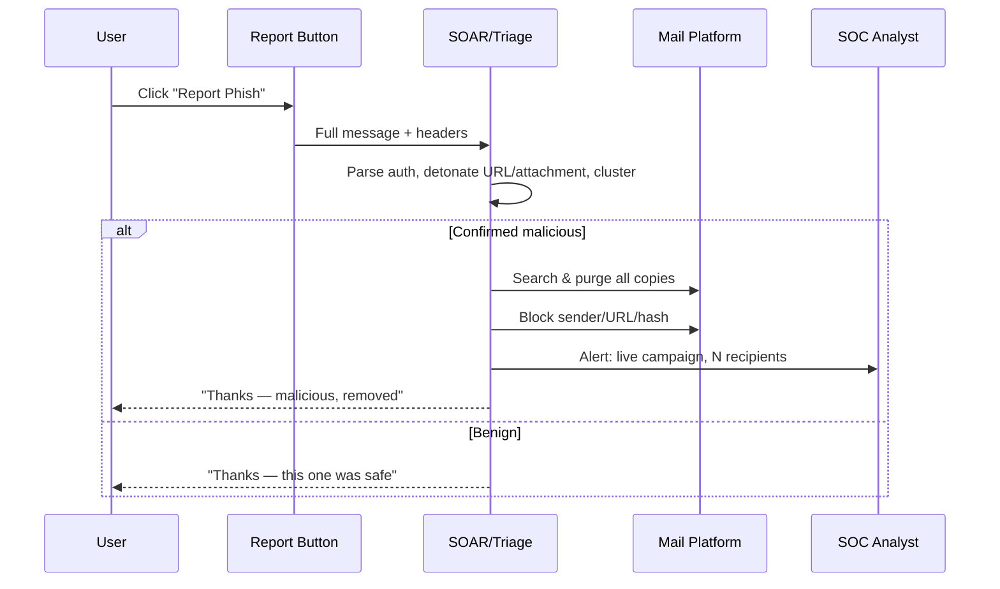

The telemetry sources that feed this pipeline, and what each is uniquely good at spotting:

| Source | Uniquely catches | Example signal |
|---|---|---|
| User reports (button) | Novel lures no filter flagged | 5 reports of same subject in 10 min |
| Mail-flow analytics | Campaign infrastructure | Newly registered sender domain, look-alike |
| Sign-in / identity logs | Session/token theft | Impossible travel, anonymizer egress |
| Audit logs | Post-compromise persistence | Inbox-rule creation, OAuth consent grant |
| EDR | Payload execution | Office spawns PowerShell/script host |
| Help-desk logs | Reset-attack abuse | MFA re-enroll → new-device login |
| Proxy / protective DNS | Click-through to phishing | Request to newly registered/categorized-bad domain |

No single source is sufficient — the value is in *correlation*. A user report plus an impossible-travel sign-in plus a new inbox rule for the same account, within minutes, is an unambiguous confirmed compromise that any one signal alone might leave as "maybe."

**IR use case:** a good pipeline turns "one user clicked" into "campaign detected, contained, and blocked before the second user opened it." The reporter who raised their hand is the reason. That is precisely why the program must *never* punish reporting — the sensor network is your best early-warning system, and fear switches it off.

## Part 10: Incident Response for a Live Social-Engineering Attack

When a lure lands — a user clicked, entered credentials, approved an MFA push, ran an attachment, or wired money — you're now in incident response, and speed matters more than blame. The whole preceding program (fail-closed controls, reporting, telemetry) exists to make this moment survivable. Here is the playbook, mapped to the standard IR lifecycle.

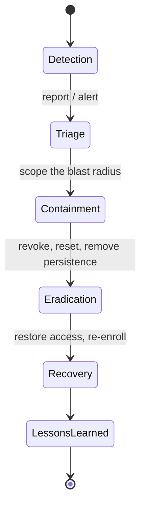

**1. Detection & triage.** Confirm what happened and what was exposed: password only? full session/token? MFA re-enrolled? attachment executed? money moved? The response differs sharply — a stolen *session* (AiTM) means the password reset alone is insufficient; you must **revoke the session/tokens**.

**2. Containment — do these fast, in parallel:**
- **Revoke active sessions and refresh tokens** for the affected identity (not just reset the password — kill the live session). Continuous access evaluation makes this near-immediate.
- **Reset credentials** and require re-enrollment of a **phishing-resistant** factor.
- **Remove attacker persistence** in the mailbox: delete malicious **inbox/forwarding rules** and OAuth app-consent grants the attacker added (a very common, easily-missed BEC persistence mechanism).
- **Isolate the endpoint** if an attachment/loader ran (EDR network-contain), and hand off to the malware-IR process.
- **Purge the campaign** from all inboxes and block indicators (Part 9).
- **For a fraudulent wire:** contact the bank *immediately* to attempt recall, file with law enforcement (in the US, the FBI IC3 for BEC), and preserve all evidence — the recovery window is measured in hours.

**3. Eradication & recovery.** Confirm no residual access (tokens, app grants, rules, new MFA devices, created accounts), restore the user with hardened auth, and verify identity out-of-band before restoring access. Watch for the attacker's *next* move — one compromised account is often a beachhead for internal phishing to colleagues.

**4. Lessons learned — blameless.** Run a blameless post-incident review focused on *what control or process gap allowed this*, not *who clicked*. Did MFA fail closed? Did the help desk verify? Did the report come fast? Feed findings back into controls, training content, and simulation design. The human who reported (or even the one who clicked and then reported) is treated as part of the solution.

**Communication.** Reassure the reporter/victim explicitly and early. The message that keeps your sensor network alive is: *"Thank you for telling us — that's exactly right, and it helped us contain this."* An organization where people are afraid to report a click is an organization that finds out about breaches from the attacker.

## Part 11: Building the Program — Governance, Roles & Culture

Individual controls don't add up to defense on their own; a *program* ties them together with ownership, cadence, and executive support. This part is the management scaffolding.

**Ownership and governance.** Name an accountable owner for human risk (often within security, partnering with IT, HR, comms, and legal). Establish governance for simulations and awareness content — approval, scope, ethics review, and works-council/legal sign-off where required. Treat the whole thing like a product with a roadmap, not a once-a-year event.

**Role-based programs.** Tailor to risk tiers:

- **High-risk / privileged** (finance approvers, IT admins, executives, developers with cloud keys): phishing-resistant MFA mandatory, extra help-desk verification, targeted simulations including vishing, and specific playbooks (wire-verification, executive-impersonation).
- **General workforce**: continuous micro-training, the report button, external-sender banners, and the out-of-band verification rule for money/credentials.
- **New hires**: onboarding that establishes the reporting culture and the verification rules *on day one*, when habits form.

**Culture is the real deliverable.** The programs that work share a culture where reporting is celebrated, mistakes are treated as learning, security is *helpful* rather than punitive, and leadership visibly participates (executives take the same training and simulations). A "just culture" — accountability without blame for honest errors — is what turns a workforce from an attack surface into a sensor network.

**Executive sponsorship and reporting.** Give leadership the human-risk dashboard (Part 8) quarterly, tie it to real incident outcomes, and secure budget for the high-leverage technical controls (passkeys, conditional access, mail security). The business case is straightforward: BEC and account-takeover losses dwarf the cost of the controls that prevent them.

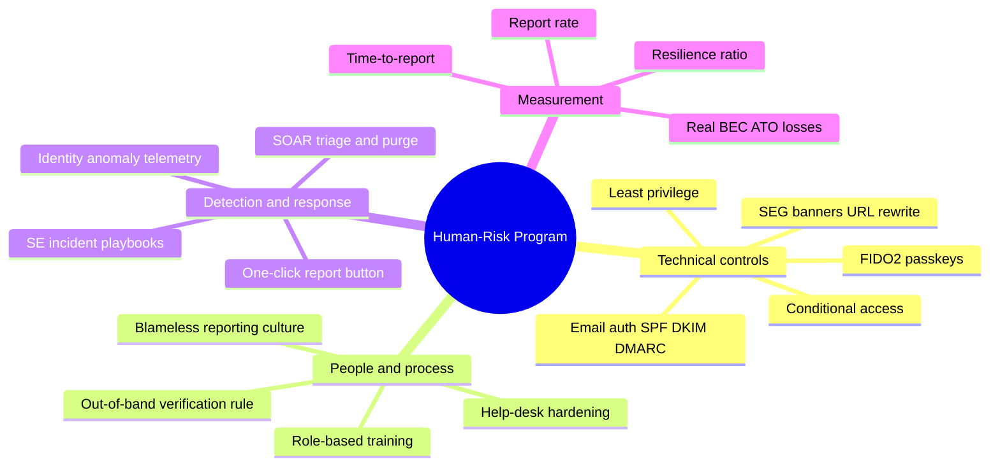

## Part 12: Hands-On Lab — Stand Up the Defensive Stack

This lab builds the *defensive* side end to end in an isolated environment: check your email authentication posture, parse DMARC data, and run a small, ethical internal phishing simulation wired to a reporting workflow — all against **your own domain and your own test accounts only.** Nothing here targets a third party. This is the mirror image of Chapter 6's offensive Gophish lab.

### Lab setup

- A test domain you control (or a lab domain), with access to its DNS.
- A mail environment you own (a test Google Workspace/M365 tenant, or a self-hosted mail server in an isolated VM network).
- A machine with `dig`, `swaks`, Python 3, and (optionally) GoPhish for the internal-simulation portion.

> **Authorization reminder:** everything below is authorized internal testing of your own infrastructure and consenting test accounts. Sending simulated phishing to real employees requires the governance from Part 7. Never point any of this at a domain or person you don't own or have written authorization to test.

### Step 1 — Audit your email authentication posture

Check what the world sees for your domain. Every flag here is explained the first time it appears.

```bash
# SPF record - what IPs are authorized to send as you?
dig +short TXT example.com | grep spf1
# -> "v=spf1 include:_spf.google.com -all"   (want a strict -all)

# DMARC policy - what should receivers do with fakes?
dig +short TXT _dmarc.example.com
# -> "v=DMARC1; p=none; rua=mailto:dmarc@example.com"   (p=none = NOT protected yet)

# DKIM public key for a known selector (selector names vary by provider)
dig +short TXT google._domainkey.example.com
# -> "v=DKIM1; k=rsa; p=MIGfMA0..."   (empty = DKIM not published for that selector)
```

Flags/commands explained:
- `dig` — DNS lookup utility. `+short` trims output to just the record data. `TXT` requests text records (where SPF/DKIM/DMARC live).
- `grep spf1` — filter to the SPF line among any other TXT records.

**Interpretation:** if DMARC shows `p=none`, you are collecting data but *not* rejecting spoofs — the number-one real-world misconfiguration. The remediation is Part 3's staged ramp to `p=reject`.

### Step 2 — Prove to yourself why SPF alone doesn't protect the visible From:

Use `swaks` (Swiss Army Knife for SMTP) against a **mail server you own** to observe how a spoofed visible `From:` is handled. `swaks` is a scriptable SMTP test client; install with `apt install swaks`.

```bash
swaks --to victim@yourlab.test \
      --from ceo@yourlab.test \
      --header "From: CEO <ceo@yourlab.test>" \
      --server your-lab-mx.yourlab.test \
      --data "Subject: Test\n\nThis is a lab authentication test."
```

Flags explained:
- `--to` / `--from` — envelope recipient and envelope sender (`MAIL FROM`, what SPF checks).
- `--header "From: ..."` — the *visible* header the user reads (what DMARC alignment checks).
- `--server` — the MX/SMTP host to deliver through (your lab server).
- `--data` — the message body/subject.

Now open the delivered message and read the `Authentication-Results:` header:

```
Authentication-Results: mx.yourlab.test;
  spf=pass (sender IP is authorized) smtp.mailfrom=ceo@yourlab.test;
  dkim=fail (no valid signature);
  dmarc=fail (p=none) header.from=yourlab.test
```

**What you just learned, concretely:** SPF can `pass` on the envelope while DMARC still `fail`s alignment — which is *exactly* the gap that lets external look-alike spoofs through when DMARC is `p=none`. Move the policy to `p=reject` (after mapping senders) and repeat: unauthenticated mail claiming to be you is now rejected outright.

### Step 3 — Parse DMARC aggregate reports

Once `rua=` is set, receivers send daily XML rollups. Parse them to find every sender using your domain (legit and not) before you tighten policy.

```bash
pip install parsedmarc --break-system-packages
# Point parsedmarc at a mailbox or a saved report file:
parsedmarc -o output/ ./dmarc-reports/*.xml.gz
```

The output lists source IPs, message counts, and SPF/DKIM/DMARC results per sender. **Blue-team payoff:** you'll discover forgotten legitimate senders (fix their SPF/DKIM *before* enforcing) and hostile spoof sources (feed to threat intel). This is the data that makes a safe ramp to `p=reject` possible.

### Step 4 — Run a small, ethical internal simulation with reporting

Using GoPhish (Chapter 6 taught its setup) against **your own test accounts**, send a *benign, non-cruel* lure — e.g., a generic "IT: confirm your printer settings" — and wire up the learning loop:

1. Landing page on a click shows a supportive teaching message (never a scare), one concrete "tell," and the report button.
2. Track **who reported** (via the report button/abuse mailbox), not just who clicked.
3. Compute the metrics from Part 8:

```python
clicked = 12
reported = 41
delivered = 200
report_rate = reported / delivered            # 0.205  -> maximize this
resilience_ratio = reported / max(clicked, 1) # 3.4    -> want > 1 and rising
print(f"Report rate: {report_rate:.1%}  Resilience ratio: {resilience_ratio:.1f}")
# Report rate: 20.5%  Resilience ratio: 3.4
```

**Interpretation:** a resilience ratio of 3.4 means people are reporting far more than clicking — a healthy sensor network. Track it quarterly and by department; a single number is noise, the *trend* is the signal. Never publish individual clicker names to leadership.

### Step 5 — Wire the report button to a triage workflow

Even a minimal pipeline beats none: forward the abuse mailbox to a script that extracts headers, checks `Authentication-Results`, and clusters by subject/sender to flag live campaigns (Part 9). In a real environment this is a SOAR playbook; in the lab, a short Python script that counts identical subjects arriving within a time window demonstrates the "5 reports in 10 minutes = campaign" detection that turns one reporter into whole-org protection.

### Step 6 — Validate a detection with a benign trigger

Detections are worthless until proven to fire. Safely trigger the inbox-rule detection from Part 14 against your own test mailbox: create a rule that forwards to an external test address and moves matching mail to "Archive," then confirm the alert fires.

```bash
# PowerShell against your OWN test mailbox (lab tenant only):
New-InboxRule -Mailbox testuser@yourlab.test -Name "labtest" `
  -ForwardTo external-lab@example.test -MoveToFolder ":\Archive"
# Then confirm the KQL hunt from Part 14 returns this event, and the alert fires.
# Clean up:
Remove-InboxRule -Mailbox testuser@yourlab.test -Identity "labtest" -Confirm:$false
```

Flags explained: `New-InboxRule` creates the rule; `-ForwardTo` sets external forwarding (the malicious behavior); `-MoveToFolder` hides matching mail (the "hide the evidence" tell). This is **detection validation** — the discipline of proving each alert works *before* you rely on it in an incident. Do this for every SE detection you deploy.

### Step 7 — Tabletop the incident-response playbook

The cheapest, highest-value defensive exercise is a **tabletop**: walk the team through a scenario verbally and find where the playbook breaks. Run the Part 10 playbook against this scenario:

> "A finance analyst reports that they entered their password on a page reached from an 'invoice' email, approved an MFA push, and now their Outlook has a rule forwarding all mail to an external address. Ten minutes ago they also 'confirmed a bank-detail change' for a vendor."

Walk it step by step and record who does what, in what order, and how long each step takes:

1. Revoke sessions/tokens (who has the button? how fast?).
2. Reset credentials + re-enroll phishing-resistant factor.
3. Delete the forwarding rule and hunt for OAuth grants.
4. **Freeze the vendor payment** — this scenario is also a live VEC; contact the bank and halt the transfer.
5. Purge the campaign from all inboxes; block IOCs.
6. Blameless review: which control failed? (Answer: phishing-resistant MFA and the payment-change verification would each have independently stopped it.)

The tabletop's value is finding the gaps *before* a real incident — "nobody knew who could revoke tokens" is a finding you want on a Tuesday afternoon, not at 2am during a live BEC.

### Step 8 — Employee-facing one-page playbook

Distill everything into a single card employees can actually remember. This is the deliverable that reaches the humans:

```
IF YOU FEEL RUSHED ABOUT MONEY, PASSWORDS, OR ACCESS -> STOP AND VERIFY.
- Money / bank-detail change? Call the person on a number YOU look up. Never the one in the message.
- Password / MFA reset request? We will never ask you to do this by email or phone. Report it.
- Something feels off? Click "Report Phish." You will NEVER get in trouble for reporting.
- Clicked something already? Tell us immediately - fast reporting is what protects everyone.
Reporting is always the right move. We thank people who report; we never punish them.
```

**Lab wrap-up:** you now have the defensive mirror of the offensive series — authenticated mail that fails closed, DMARC data driving a safe ramp to `p=reject`, phishing-resistant MFA as the AiTM backstop, and a measured reporting reflex. That combination is what actually moves real-world risk.

## Part 13: Business Email Compromise & Payment-Process Controls

Business Email Compromise (BEC) deserves its own treatment because it is the single most financially damaging social-engineering category — annual reported losses run into the billions, dwarfing ransomware in dollar terms in many years' reporting. BEC is not a malware problem; it is a *process* problem, and the controls that stop it live in finance workflows, not in the mail gateway.

There are four recurring BEC patterns, each with a specific process countermeasure:

- **CEO/executive fraud** — a spoofed or look-alike "CEO" emails finance requesting an urgent wire, often while "traveling" and "unreachable by phone." Countered by the out-of-band verification rule plus a hard policy that *no* wire is exempt from verification regardless of who requests it.
- **Vendor/invoice redirect (VEC — Vendor Email Compromise)** — an attacker (often having compromised the *vendor's* mailbox) sends a legitimate-looking invoice with *changed bank details*. This is the most insidious because the email is genuinely from the vendor's real domain. Countered by a **bank-detail-change verification** control: any change to a payee's banking information triggers a callback to a *previously known* vendor contact number (never the one on the new invoice), plus a mandatory hold.
- **Payroll diversion** — a spoofed employee emails HR asking to update their direct-deposit account. Countered by requiring self-service changes through an authenticated portal with MFA and owner notification, never by email request.
- **Gift-card scams** — a "manager" asks a junior employee to buy gift cards urgently. Countered by awareness plus a simple rule: the company never requests gift-card purchases by email.

The core financial controls that make all four fail:

| Control | What it does | Which BEC pattern it stops |
|---|---|---|
| Dual authorization for payments over a threshold | Two people must approve; one compromised account isn't enough | CEO fraud, vendor redirect |
| Out-of-band verification of new/changed bank details | Callback to known number before any change takes effect | Vendor redirect (VEC), payroll |
| Payment-change hold / cool-down | Mandatory delay lets the real owner notice and cancel | All |
| Vendor master-data governance | Bank details changed only via verified, logged process | Vendor redirect |
| Self-service payroll via MFA portal only | No email-driven direct-deposit changes | Payroll diversion |
| "We never ask for gift cards" policy | Removes the pretext entirely | Gift-card scam |

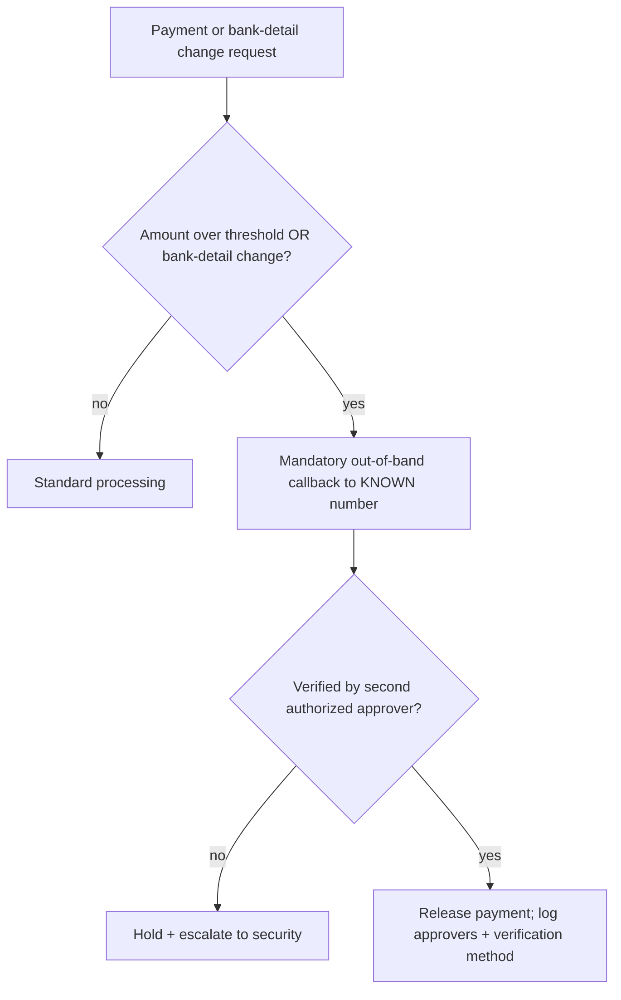

**Program relevance:** BEC controls are owned by finance, not security — which is exactly why security must *drive their creation* and wire them into the human-risk program. A perfectly configured DMARC record does nothing against a vendor-redirect invoice sent from the vendor's genuinely compromised, DMARC-passing mailbox; only the payment-process control catches it. This is the clearest example in the chapter of why "defense" is layered and cross-functional rather than a product you buy.

## Part 14: Detection Engineering for Social-Engineering Attacks

Awareness and process controls reduce how often lures land; detection engineering catches the ones that do, and catches the *post-compromise* activity that follows. This part gives concrete, adaptable detection logic — the queries a SOC actually writes — mapped to the behaviors earlier chapters produced.

**Detection 1 — New inbox/forwarding rule (BEC persistence).** After compromising a mailbox, attackers create hidden rules to auto-forward or auto-delete (hiding the fraud from the real owner). This is one of the highest-fidelity BEC signals. In a Microsoft 365 environment, hunting the unified audit log:

```kql
// KQL-style hunt: suspicious inbox-rule creation
CloudAppEvents
| where ActionType in ("New-InboxRule", "Set-InboxRule")
| where RawEventData has_any ("ForwardTo", "RedirectTo", "DeleteMessage", "MoveToFolder")
| where RawEventData has_any ("RSS", "..", "Deleted Items", "Archive")  // hide-the-evidence tells
| project TimeGenerated, AccountDisplayName, ActionType, RawEventData
```

Fields explained: `ActionType` filters to rule-creation/modification events; `has_any(...)` looks for forwarding/deletion actions and the tell-tale "hide in an obscure folder" behavior. A rule that forwards externally and moves matching mail to a rarely-checked folder is a near-certain BEC indicator.

**Detection 2 — Impossible travel / atypical token use.** A sign-in from a new country minutes after one from home, or a session token replayed from a new ASN, is the AiTM/token-theft signal:

```kql
SigninLogs
| where ResultType == 0  // successful
| summarize Locations=make_set(Location), IPs=make_set(IPAddress) by UserPrincipalName, bin(TimeGenerated, 1h)
| where array_length(Locations) > 1
| extend Suspicious = "Multiple countries within 1h"
```

**Detection 3 — Mass external mail after compromise (internal phishing spread).** A user account suddenly sending many external messages, or many internal messages with a link, is the "beachhead spreading" signal from the IR section:

```kql
EmailEvents
| where SenderFromAddress endswith "@yourorg.com"
| summarize Recipients=dcount(RecipientEmailAddress) by SenderFromAddress, bin(Timestamp, 30m)
| where Recipients > 50   // tune to baseline
```

**Detection 4 — MFA method change followed by new-device login.** The help-desk-reset attack signature:

```kql
AuditLogs
| where OperationName in ("User registered security info", "Admin updated security info")
| join kind=inner (SigninLogs | where DeviceDetail.deviceId != "") on UserPrincipalName
| where SigninTime between (MFAChangeTime .. MFAChangeTime + 1h)
| project UserPrincipalName, MFAChangeTime, SigninTime, IPAddress, DeviceDetail
```

A Sigma-style rule generalizes this so it's portable across SIEMs:

```yaml
title: Suspicious MFA Re-Enrollment Then New-Device Sign-In
logsource:
  product: azure
  service: signinlogs
detection:
  selection_mfa:
    OperationName: 'User registered security info'
  selection_login:
    ResultType: 0
    NewDevice: true
  timeframe: 60m
  condition: selection_mfa and selection_login
level: high
```

| Detection | Data source | Behavior it catches | Chapter it maps to |
|---|---|---|---|
| Inbox-rule creation | Mail audit log | BEC persistence / hiding | Ch 10 IR, this chapter |
| Impossible travel | Sign-in logs | AiTM / stolen session | Ch 8 |
| Mass external send | Mail events | Beachhead spreading | Ch 3, this chapter IR |
| MFA change + new device | Audit + sign-in | Help-desk reset attack | Ch 9 |
| Look-alike domain hit | Proxy/DNS + threat intel | Look-alike phishing | Ch 3–4 |

**Blue team usage:** map each detection to MITRE ATT&CK (T1566 Phishing, T1078 Valid Accounts, T1114 Email Collection, T1556 Modify Authentication Process) and track coverage so you can see which SE techniques you can and cannot see. The point of detection engineering here is not "buy a SIEM" — it is to turn the specific behaviors the offensive chapters taught into specific, testable alerts, and to *validate* them with the ethical simulations from Part 7.

## Part 15: A Realistic Conditional-Access Baseline

Conditional access (Part 5) is worth making concrete, because "deploy conditional access" is advice nobody can act on. A defensible baseline for a mid-size org, expressed as policy intent (the exact syntax varies by IdP), looks like this:

```
Policy 1 — Require phishing-resistant MFA for all users
  Applies to: All users (exclude break-glass accounts)
  Conditions: All cloud apps
  Grant: Require authentication strength = "Phishing-resistant MFA" (FIDO2/passkey/CBA)

Policy 2 — Block legacy authentication
  Applies to: All users
  Conditions: Client apps = legacy/basic auth protocols (IMAP, POP, SMTP AUTH)
  Grant: Block  (legacy auth bypasses MFA entirely — close it)

Policy 3 — Require compliant/managed device for privileged roles
  Applies to: Admin roles, finance approvers
  Grant: Require device marked compliant AND phishing-resistant MFA

Policy 4 — Risk-based step-up
  Applies to: All users
  Conditions: Sign-in risk = medium/high (impossible travel, anonymizer, token anomaly)
  Grant: Require phishing-resistant re-auth OR block

Policy 5 — Session controls
  Applies to: All users on unmanaged devices
  Grant: Sign-in frequency limit + no persistent browser session; enable
         continuous access evaluation so revocation is near-real-time
```

Two non-obvious but critical details: **break-glass (emergency) accounts** must be excluded from MFA-lockout policies and monitored heavily (they're the recovery path if conditional access misfires), and **legacy authentication must be blocked** — it is the single most common way MFA gets silently bypassed, because protocols like IMAP/SMTP-AUTH predate MFA and don't enforce it. Together, Policies 1–5 mean that even a user who hands their password to a perfect AiTM page cannot produce a usable session from an attacker's device.

**Red team usage (lab-scoped):** an authorized assessment validates this baseline by attempting exactly the bypasses it's designed to stop — legacy-auth login, token replay from a new device, sign-in from an anonymizer — and confirming each is blocked. A finding of "legacy auth still enabled for the finance OU" is a concrete, fixable gap, which is the entire value of the exercise.

## Part 16: Measuring Program Maturity

Metrics (Part 8) tell you whether behavior is improving; a **maturity model** tells you whether the *program* is complete. Use it to find your gaps and to communicate a roadmap to leadership. Score each dimension 1–5 and target the next level.

| Dimension | Level 1 (Initial) | Level 3 (Managed) | Level 5 (Optimized) |
|---|---|---|---|
| Email authentication | No/`p=none` DMARC | `p=quarantine`, some DKIM | `p=reject`, aligned, BIMI, monitored |
| Authentication | Passwords + SMS OTP | TOTP/push everywhere | Phishing-resistant (FIDO2) default; passwordless |
| Conditional access | None | MFA required | Risk-based, device-compliant, legacy-auth blocked, CAE |
| Help-desk verification | KBA only | Manager callback for some | Enforced ID/video + owner alert + logging |
| Awareness | Annual CBT | Quarterly + simulations | Continuous, role-based, contextual micro-training |
| Reporting | Forward-to-IT | Report button, manual triage | One-click → SOAR auto-triage + purge |
| Payment controls | Single approver, email changes | Dual approval over threshold | Out-of-band bank-change verify + holds |
| Detection | None SE-specific | Some sign-in alerts | Full SE detection suite mapped to ATT&CK |
| Measurement | Completion % only | Click + report rate | Resilience ratio, TTR, real-loss trends, segmented |
| Culture | Blame/shame | Neutral | Blameless, reporting celebrated, exec participation |

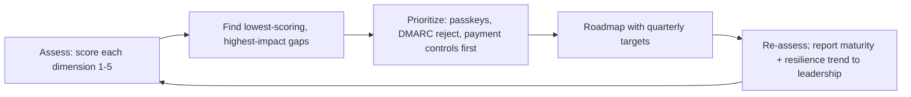

**How to use it:** most organizations are strong on awareness (because it's cheap and visible) and weak on the high-leverage technical and process controls (passkeys, `p=reject`, payment verification, help-desk hardening). The maturity model exposes that imbalance and gives leadership a concrete, sequenced roadmap instead of "we should do more training." Prioritize the moves that make a stolen credential worthless and a fraudulent payment impossible — those buy the most risk reduction per dollar.

**Program relevance:** pair the maturity score (program completeness) with the resilience trend (behavior) in the same quarterly leadership readout. Together they answer the only two questions leadership actually cares about: *are we building the right controls*, and *are they working?*

## Final Revision / Summary

- **You can't train people out of being human.** The program's job is to (1) shrink the attack surface, (2) make stolen credentials useless, (3) make reporting effortless, and (4) measure resilience honestly.
- **Traditional annual CBT-and-quiz training fails** because knowledge ≠ behavior, shame kills reporting, one-size-fits-all wastes effort, and completion-rate is the wrong metric.
- **Beat the psychology with procedure, not willpower.** The out-of-band verification rule for money/credentials/MFA defeats CEO fraud, vishing, invoice redirect, and help-desk reset attacks in one stroke.
- **Email authentication** — SPF (`-all`), DKIM (2048-bit, rotated), and above all **DMARC ramped to `p=reject`** with alignment — stops exact-domain spoofing. `p=none` protects nobody.
- **Layered mail/web defenses** (SEG, sandboxing, time-of-click rewriting, external banners, look-alike monitoring) catch look-alike and abused-service lures DMARC can't.
- **Phishing-resistant MFA (FIDO2/passkeys) is the single highest-leverage control** — it defeats AiTM by binding auth to the real origin. Pair with conditional access and least privilege so a phished account is contained.
- **Help-desk and account-recovery are the new front line.** Enforce strong, out-of-band identity verification for resets/re-enrollments; never trust caller-supplied contact details.
- **Run simulations ethically** — no cruel lures, teach-don't-shame, reward reporting, measure the group. Maximize **report rate** and **resilience ratio**, not just click rate.
- **The reporting workforce is a sensor network.** Wire one-click reporting into SOAR triage and auto-purge; never punish reporting or the network goes dark.
- **IR for SE means revoking sessions, not just resetting passwords**, killing mailbox rules/OAuth grants, and running a blameless review that fixes controls.
- **BEC is a process problem, not a malware problem** — dual approval and out-of-band bank-detail verification stop the most financially damaging category, which no mail filter can catch.
- **Detection engineering turns offense into alerts** — inbox-rule creation, impossible travel, MFA-reset-then-new-device — validated against ATT&CK and proven to fire before you rely on them.
- **Measure both program maturity and behavior** — a maturity model shows the roadmap, resilience metrics show whether it's working; report both to leadership.
- **It's a program, not an event** — owned, governed, role-based, executive-sponsored, and built on a just culture.

## Cheat Sheet / Quick Reference

**Email auth (target state):**
```
SPF:   v=spf1 include:_spf.provider.com -all         # hard fail
DKIM:  2048-bit key, rotate selectors periodically
DMARC: v=DMARC1; p=reject; rua=mailto:dmarc@you.com; adkim=s; aspf=s; pct=100
Ramp:  p=none (learn) -> fix senders -> p=quarantine pct=25 -> ramp -> p=reject
```

**The one rule to teach everyone:**
> Any request to move money, change payment details, reset an authentication factor, or share credentials/sensitive data must be verified out-of-band, on a channel/number YOU look up — never one the request supplied.

**MFA ranking (weakest to strongest):** SMS OTP → TOTP → push → push+number-matching → **FIDO2/passkey (phishing-resistant)**.

**Help-desk sensitive actions:** ID/video or manager-callback verification via directory number; owner notified + delay; never trust caller-supplied contacts; log and alert on reset→re-enroll→new-location patterns.

**Simulation ethics:** authorized + governed; no cruel lures (no fake bonuses/layoffs/benefits scares); teach-don't-shame landing page; reward reporting; report aggregate trends, not names.

**Metrics that matter:** report rate up, resilience ratio (reporters÷clickers) up >1, time-to-report down, repeat-clicker rate down, real BEC/ATO losses down. Segment by role; watch trends, not single campaigns.

**SE incident containment (in parallel):** revoke sessions/tokens (not just password) → reset + re-enroll phishing-resistant factor → delete malicious inbox rules/OAuth grants → isolate endpoint if payload ran → purge campaign + block IOCs → for wire fraud, call bank + IC3 immediately.

**Quick triage of a reported mail:**
```bash
dig +short TXT _dmarc.<sender-domain>          # do they even publish DMARC?
# In headers, read: Authentication-Results: spf= dkim= dmarc=
# Red flags: dmarc=fail, newly-registered/look-alike domain, display-name mismatch,
#            reply-to != from, external banner + "internal" pretext, urgency about money/creds
```

## Common Pitfalls

- **Leaving DMARC at `p=none`** and believing you're protected. Monitoring is not enforcement.
- **Jumping straight to `p=reject`** without mapping senders — you bounce legitimate mail and get the policy rolled back. Ramp with data.
- **Using `~all` forever** on SPF instead of tightening to `-all`.
- **Deploying TOTP/push and calling it "phishing-resistant."** It isn't; only origin-bound FIDO2/passkeys resist AiTM.
- **Punishing clickers / naming-and-shaming.** Kills reporting, your best sensor. The one unforgivable program mistake.
- **Cruel simulation lures** (bonuses, layoffs, benefits scares). High clicks, lasting damage, poisoned program.
- **Optimizing click rate alone.** Vanity metric; can hide rising risk. Track report rate and resilience ratio.
- **Resetting a password but not revoking the session** after AiTM — the attacker keeps the live token.
- **Forgetting mailbox rules and OAuth grants** during IR — a classic persistence mechanism left behind.
- **Ignoring the help desk** — the softest identity control in most orgs and a favorite modern entry point.
- **One-size-fits-all training** — wastes the low-risk majority and under-serves high-risk targets.
- **Leaving legacy authentication enabled** — IMAP/POP/SMTP-AUTH silently bypass MFA; the most common way "we have MFA" still gets breached.
- **No break-glass account plan** — over-tight conditional access can lock everyone out; always keep monitored, excluded emergency accounts.
- **Deploying detections without validating them** — an alert nobody proved fires is an alert that won't fire during the incident. Validate every rule (Part 12, Step 6).
- **Treating BEC as a mail-filter problem** — vendor-redirect fraud arrives from the vendor's *real, authenticated* mailbox; only the payment-process control catches it.

## Practice Labs & Resources

- **PortSwigger Web Security Academy** — Authentication and OAuth labs to understand the token/session theft that identity controls defend against (the defender's-eye view of Chapter 8).
- **TryHackMe** — "Phishing," "Phishing Analysis Fundamentals/Tools," "Phishing Prevention," "Greenholt Phish," and "MITRE"/"Sysmon" rooms for hands-on header analysis, telemetry, and detection.
- **GoPhish** (self-hosted, your own test accounts only) — build the ethical internal-simulation and reporting-metrics pipeline from Part 12.
- **DMARC tooling** — `parsedmarc` + Elastic/Kibana, or free analyzers (dmarcian, Postmark) — parse real aggregate reports and practice a safe ramp to `p=reject`.
- **`swaks`** — script SMTP tests against your own lab MX to see SPF/DKIM/DMARC verdicts in `Authentication-Results` first-hand.
- **FIDO2/passkeys** — enroll a hardware key or platform passkey on a test account and attempt to phish yourself with a lab reverse-proxy to confirm origin binding defeats it (lab-scoped, your own accounts).
- **CISA and NCSC phishing/BEC guidance** and **M3AAWG** sender best-practices for authoritative, current control recommendations.
- **MITRE ATT&CK** — Phishing (T1566), Valid Accounts (T1078), Email Collection (T1114), Modify Authentication Process (T1556) — map your detections to the framework.
- **Microsoft Attack Simulation Training / M365 Defender hunting** — practice writing and validating the KQL detections from Parts 14–15 against a lab tenant's audit and sign-in logs.
- **FBI IC3 BEC resources and the "Financial Fraud Kill Chain"** — the authoritative reference for the wire-recall and reporting steps in Parts 10 and 13.
- **Atomic Red Team** — safely execute individual ATT&CK techniques (inbox rules, OAuth consent) in a lab to validate your SE detection coverage end to end.

Practice questions to test yourself:

1. A user forwards you a suspicious email. Its `Authentication-Results` shows `spf=pass` but `dmarc=fail`. Explain how both can be true at once, and what it tells you about the sender.
2. Your DMARC is at `p=none`. Write the exact staged plan (records and order) to reach `p=reject` without bouncing legitimate mail, and name the data source that de-risks each step.
3. An organization has TOTP MFA everywhere and still lost accounts to an Evilginx campaign. Explain precisely why, and specify the single control that would have prevented it and the mechanism by which it works.
4. Design an ethical phishing-simulation program for a 5,000-person company: cadence, lure guardrails, the two headline metrics you'll report to leadership, and how you'll avoid the metric being gamed.
5. A finance clerk just wired $180,000 after a convincing "CEO" email and follow-up call. Walk through your first hour of incident response in priority order, and name the one procedural control that would have stopped the attack before any money moved.

This closes the Social Engineering series. The next notebook, Malware & Evasion, shifts to the *payloads* that phishing and pretexting are so often used to deliver — beginning, in its first chapter, with a precise taxonomy of malware families and how they're built, detected, and defended against, entirely within a lab-scoped, conceptual frame.
