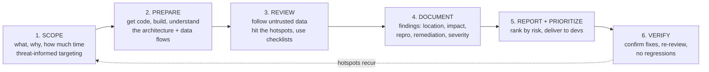
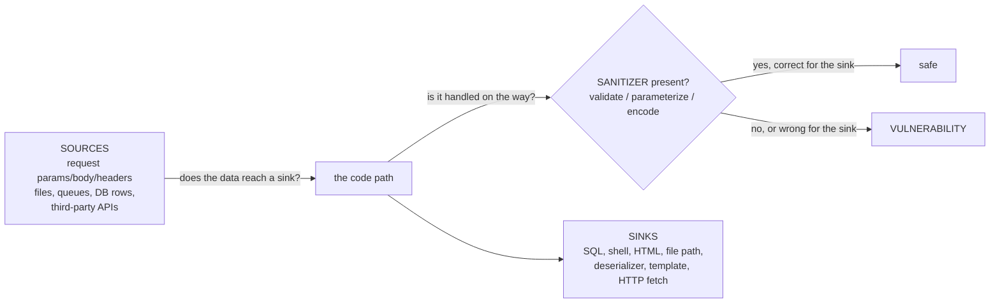
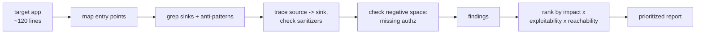

The previous notebook taught you to write secure code and to recognize the twenty-five weakness patterns that matter most. This notebook is about the other half of the job: **checking that the code is actually secure** — systematically, repeatably, at the scale of a real codebase, and inside a delivery pipeline that ships every day. Secure code review is the human core of that checking, and it is the skill this whole notebook is built around, because every automated tool in the chapters that follow — SAST, DAST, SCA, secrets scanning — is ultimately a way to scale, focus, or verify the judgment that a good reviewer applies by hand.

The distinction that opens the notebook is the one people most often miss: **secure code review is not the same as ordinary peer review, and it is not a penetration test.** Peer review asks *is this code correct, readable, and maintainable* — a security bug can sail through a peer review that was looking at naming and test coverage. A penetration test attacks the running system from the outside and finds what is *reachable and exploitable* right now, but it cannot see the code path it never triggered, the dangerous function guarded by a condition it never met, or the backdoor sitting behind an obscure header. Secure code review reads the source with an adversary's questions in mind, and it finds a **distinct class of bugs** that neither of the others will — which is exactly why it is worth doing as its own discipline.

This chapter builds the discipline. Not "read the code carefully and look for bugs" — that advice is useless at 200,000 lines and a Friday deadline — but a *methodology*: how to scope when you cannot read everything, how to follow untrusted data through the code, where to spend disproportionate attention, how to prioritize what you find, and how to write a finding a developer will actually fix. The chapters after this one make it automated and continuous; this one makes it *rigorous*.

## Why This Matters

The economic case is the shift-left argument from Notebook 45, and it is strongest for review because review happens *before* the code ships. A flaw a reviewer catches in a pull request costs the author a few minutes to fix and never reaches a customer. The same flaw found by a pentest three months later costs a re-test, a release, and an explanation; found by an attacker, it costs a breach. Review is the cheapest place to catch a bug after it is written, and it is the last cheap place before the code is live.

But the deeper case is *coverage*. Black-box testing — a pentest, a bug bounty, a DAST scan — can only find what it can reach and trigger from the outside, and real applications are full of code that is hard to reach: an admin path behind a role, a parser that only runs on a specific content type, a dangerous branch guarded by a feature flag, error-handling code that only executes on failure. A reviewer reading the source sees *all* of it, including the branch the tester never hit. This is why the most serious findings — a hardcoded backdoor credential, an authorization check that is present on nine endpoints and missing on the tenth, a cryptographic misuse in a rarely-exercised code path — are overwhelmingly found by review, not by testing. The two are complementary: testing proves exploitability, review proves *coverage*, and a mature program does both.

There is also a career reality. Secure code review is one of the highest-leverage skills a product security engineer has, because it is where deep language knowledge (Notebook 45 Chapter 7), threat modeling (Chapters 3–5), and the weakness taxonomy (Chapter 8) all come together and become *judgment*. It is also the skill that is hardest to automate away, precisely because the highest-value findings — the logic and authorization bugs of Family 3 — are the ones tools are worst at. Chapter 2 is entirely about that human-only tier.

## Part 1: Three Different Activities, Often Confused

Pin down the boundaries, because using the wrong activity for the goal wastes effort.

| | Peer review | Penetration test | Secure code review |
|---|---|---|---|
| Primary question | Is this code correct and maintainable? | Can I break the running system? | Is this source secure, across all paths? |
| Vantage | The diff | The deployed system, outside-in | The source, all branches |
| Finds | Bugs, style, design smells | Reachable, exploitable flaws | Reachable *and unreached* weaknesses |
| Misses | Most security bugs (not looking) | Code it never triggered | Environmental / runtime-only issues |
| Proves | Quality | Exploitability | Coverage |
| Best at | Everyday quality | Confirming real-world risk | Logic/authz bugs, backdoors, crypto misuse |

The three are complementary, not substitutes, and the mature answer is all three at different points in the lifecycle: peer review on every change, secure code review on security-relevant changes and periodically on hotspots, and penetration testing to confirm real-world exploitability of the whole system. The specific gap secure review fills is **the code no test happened to reach** — and that gap is where the worst bugs hide, because "nobody triggered it" is not the same as "nobody can."

One more distinction that matters operationally: secure code review has two modes, **manual** (a human reads the code) and **automated** (SAST reads it — Chapter 3). This chapter and the next are about the manual mode; Chapter 3 is about the automated mode; and Part 3 explains why you need both, because each finds what the other misses.

## Part 2: The Review Lifecycle

A review is a process with phases, not an act of staring at code. Skipping the phases is why ad-hoc reviews miss things and never finish.



**Scope.** Decide what you are reviewing and why *before* you open a file. The input should be threat-informed (Chapters 3–5): the review of a new payment flow targets the money path; the review after a threat model targets the highest-risk data flows. Scope includes the time budget, because that budget determines the strategy — a two-hour review and a two-week review are different disciplines, and Part 3 is about choosing what to read when you cannot read everything.

**Prepare.** Get the code building and runnable if you can (it makes tracing and confirming vastly easier), read the architecture and the data-flow diagram, identify the trust boundaries and the entry points. A reviewer who understands the system's shape reviews an order of magnitude faster than one reading files cold.

**Review.** The core work, structured by Part 4's sources-sinks-sanitizers model and Part 6's hotspots, guided but not shackled by checklists (Part 7).

**Document.** Every finding, as you find it, with the fields Part 9 specifies. Documenting later means forgetting the exact reasoning.

**Report and prioritize.** Rank by real risk (Part 8) and deliver in a form developers will act on (Part 9).

**Verify.** Confirm the fix actually fixes the bug and did not introduce a new one, and re-review the surrounding code — a fix under time pressure is itself a likely place for a new bug. Because hotspots recur, verification feeds back into scoping the next review.

## Part 3: Scoping — You Cannot Read Everything

The foundational reality of code review is that **you cannot read all the code**, and pretending otherwise is why reviews fail. A serious application is hundreds of thousands of lines; a human reads and *understands* a few hundred lines an hour for security. The entire skill of scoping is deciding which few thousand lines out of hundreds of thousands actually matter.

The targeting strategy, in priority order:

**Attack surface first.** The code that processes untrusted input is where bugs become vulnerabilities. Start at the entry points — HTTP handlers, API endpoints, message consumers, file parsers, deserializers — and work inward. Code that never touches untrusted data is a lower priority regardless of how much of it there is.

**Trust boundaries.** Every place data crosses from untrusted to trusted (Notebook 45 Chapter 6) is a review target. The threat model and the data-flow diagram name these directly, which is why a review that follows a threat model is far more efficient than one that does not.

**Security-critical code, always.** Authentication, authorization, session management, cryptography, and secrets handling get reviewed *regardless* of whether they changed, because a bug there is high-impact and because these are the areas tools are worst at.

**Changed and new code.** In a continuous setting you review the diff, not the whole repo, every time — which is why the pipeline integration of Chapter 7 matters. The diff is a natural, tractable scope, and reviewing every security-relevant diff is how you keep a large codebase covered over time without ever reading it all at once.

**Complexity and history.** Complex code hides bugs (economy of mechanism, Notebook 45 Chapter 6), and code with a history of security bugs tends to have more — both are signals for disproportionate attention.

The honest framing: scoping is *risk allocation of your attention*. You are spending a fixed, scarce resource — reviewer hours — and the question is always "where does an hour of reading reduce the most risk?" Attack surface, trust boundaries, and security-critical code are where the answer is highest, and a review that starts anywhere else is spending the scarce resource poorly.

## Part 4: Sources, Sinks, and Sanitizers — The Core Mental Model

The single most useful structure for a manual review is **data-flow analysis in your head**: follow untrusted data from where it enters (a **source**) to where it does something dangerous (a **sink**), and check whether it is properly handled (**sanitized** — validated, parameterized, or encoded) somewhere along the path.



This is the reviewer's version of what SAST automates (Chapter 3 calls it taint analysis), and doing it by hand is how you find the bugs the tool's rules do not cover. The technique:

**Enumerate the sources.** Every place untrusted data enters — and remember Notebook 45's warning that DB rows and internal APIs are sources too (second-order injection, stored XSS).

**Enumerate the sinks.** Every dangerous operation — the query APIs, the shell calls, the HTML rendering, the file operations, the deserializers. Grepping for the sink functions (`execute`, `system`, `pickle.loads`, `innerHTML`, `open`) is a fast way to build this list, and it is often the first thing you do.

**Trace source to sink.** For each sink, ask: can untrusted data reach here, and if so, is it correctly handled *for this sink's context* on every path? The "every path" is where reviewers earn their keep — a sanitizer on the common path and none on the error path is a real bug that testing usually misses.

**Check the sanitizer is correct, not just present.** Notebook 45's central lesson: validation is not encoding, and the encoding for HTML is not the encoding for SQL. A "sanitized" input can still be vulnerable if the sanitizer is wrong for the sink. A reviewer who sees *a* sanitizer and moves on misses the context-mismatch bugs.

Working sink-backward (start at the dangerous operation, trace back to see if untrusted data reaches it) is usually faster than source-forward, because there are fewer sinks than sources and each sink is a concrete, greppable thing. Build the sink list first, then trace each one back to its sources.

## Part 5: The Attack-Surface-First Walk, Concretely

Putting Parts 3 and 4 together, a structured first pass through an unfamiliar codebase:

1. **Map the entry points.** Find every route, handler, consumer, and parser. In a web app this is the router; grep for the framework's route decorators or the controller base class.
2. **Grep for the sinks.** Build the dangerous-operation inventory: query execution, `exec`/`system`, template rendering with raw HTML, file operations, deserialization, outbound HTTP. This list is finite and greppable and it is your worklist.
3. **Grep for the anti-patterns.** String-built SQL (`"SELECT" + `, f-strings with `SELECT`), `shell=True`, `pickle.loads`, `innerHTML`/`dangerouslySetInnerHTML`, `eval`, `text/template`, `strcpy`. These are the Notebook 45 footguns, and a grep for them is a high-yield first ten minutes.
4. **Find the security-critical modules.** Where is authentication? Authorization? Crypto? Secrets? Review these regardless of the diff.
5. **Trace the highest-risk sinks back to sources**, checking sanitization on every path.
6. **Check the negative space.** The most valuable review finding is often something *absent* — the authorization check present on nine endpoints and missing on the tenth, the CSRF token on every form but one, the input validation everywhere except the new field. Absence is invisible to a grep and to most tools; it is found by a human comparing the code to a mental model of what *should* be there.

That last point is the reviewer's superpower and the theme Chapter 2 develops: **tools find bad code that is present; humans find good code that is missing.** An authorization check that was never written produces no dangerous line to flag — there is nothing there. Only a reviewer holding the expectation "this endpoint should check ownership" notices that it does not.

## Part 6: Security Hotspots — Where to Spend Disproportionate Attention

Some code is worth reading line by line even when the budget is tight, because a bug there is both likely and high-impact. The hotspots, with what to look for at each:

| Hotspot | The question | Common bug |
|---|---|---|
| **Authentication** | Can it be bypassed? Weak factor? | `alg:none` JWT, timing leak, client-side check |
| **Authorization** | Object-level check on every op? Deny by default? | Missing check on one endpoint (Family 3) |
| **Session management** | Random IDs? Regenerated on login? Secure cookies? | Fixation, predictable IDs |
| **Input handling** | Validated, and correct for each sink? | Injection (Family 1) |
| **Cryptography** | Vetted lib? AEAD? Unique nonce? CSPRNG? | Misuse (Notebook 45 Ch 8) |
| **Secrets** | Anything hardcoded? Logged? In client code? | CWE-798 |
| **Deserialization** | Untrusted data into a code-capable deserializer? | CWE-502 RCE |
| **File & path ops** | Traversal? Upload becomes executable? | CWE-22, CWE-434 |
| **Process/command execution** | Shell string built from input? | CWE-78 |
| **Error handling & logging** | Leaks internals? Logs secrets? Fails open? | Info disclosure, fail-open |

The pattern is that these map almost exactly onto the three super-families of Chapter 8 and the hotspots of Notebook 45 Chapter 6 — which is the point. The reviewer's prior for *where* bugs are is the same evidence-weighted prior the CWE Top 25 encodes for *what* bugs are. Reading the hotspots line by line while skimming everything else is how a reviewer covers a large codebase's *risk* without covering its *lines*.

## Part 7: Checklists — Using Them Without Becoming Mechanical

A checklist is a memory aid, not the review. Used well it ensures you did not forget to check a class of bug; used badly it becomes a mechanical box-ticking that misses everything not on the list. The tension is real and worth resolving explicitly.

The value of a checklist: it makes the review *complete and repeatable*. Human attention drifts, and without a checklist a tired reviewer forgets to check for CSRF on the third pull request of the day. The OWASP Code Review Guide, the ASVS (Notebook 45 Chapter 6), and a team's own accumulated list encode "the things we have been burned by" so no individual has to remember them all.

The danger: a reviewer working *only* the checklist stops *thinking*, and the highest-value findings — novel logic bugs, business-logic authorization flaws, chained weaknesses — are precisely the ones no checklist anticipates. A checklist is a floor, never a ceiling.

The resolution: **use the checklist to confirm coverage, not to drive the review.** Do the thinking-heavy work first — follow the data, hit the hotspots, look for the missing checks — then run the checklist to make sure you did not skip a category. And treat the checklist as *living*: every real bug that gets past a review is a candidate new checklist item, so the list encodes the team's actual history rather than a generic template. A checklist that never changes is one nobody is learning from.

## Part 8: Prioritizing Findings — Severity Is Not the Whole Story

A review produces findings, and delivering them as an unranked list is nearly useless — developers fix from the top, so the ranking *is* the recommendation. Rank by *risk*, which is more than severity.

The factors, and how they combine:

- **Impact** — what happens if it is exploited (RCE > data disclosure > DoS, roughly). This is the CVSS-severity dimension.
- **Exploitability** — how hard is it actually to exploit (unauthenticated and trivial > authenticated and complex).
- **Reachability** — can untrusted data actually reach this code in the deployed configuration? A dangerous sink in dead code, or behind a disabled feature, or reachable only by an admin, is lower risk than the same sink on the login page. This is the factor that separates a real risk ranking from a CVSS sort, and it is exactly the KEV/EPSS/reachability refinement from Chapter 8 Part 8.
- **Confidence** — how sure are you it is a real bug versus a suspicious pattern you could not fully trace. Low-confidence findings are worth reporting but flagged as "needs confirmation," because a report full of false positives trains developers to ignore the report (Chapter 3's central problem with SAST).

The practical output is a small number of severity tiers (Critical / High / Medium / Low / Informational) with the *reasoning* attached, ordered so the developer fixing top-down is reducing the most risk per fix. And a discipline worth stating: **do not inflate.** A reviewer who marks everything Critical loses the signal that makes Critical mean "drop everything." Reserve the top tier for what genuinely warrants dropping everything, and the ranking stays trustworthy.

## Part 9: Writing a Finding a Developer Will Actually Fix

A finding nobody fixes is wasted work, and the difference between a fixed finding and an ignored one is usually the *write-up*, not the bug. A developer under deadline pressure fixes what is clear, justified, and easy to act on. The fields:

1. **Title** — the weakness in one line, with the CWE (Chapter 8): "SQL injection (CWE-89) in the order search endpoint."
2. **Location** — file and line, precise and clickable. A finding without an exact location is a finding the developer has to re-find.
3. **Severity** — the tier, *with the reasoning* (impact × exploitability × reachability from Part 8), not a bare label.
4. **Description** — what the bug is and *why it is a bug*, in terms the author understands. Assume competence, not security expertise.
5. **Reproduction / evidence** — the input or path that triggers it, concretely enough to confirm. A finding the developer can reproduce is a finding they believe.
6. **Impact** — what an attacker gains, in business terms where it helps ("read any customer's orders," not just "IDOR").
7. **Remediation** — the specific fix, ideally with a code snippet of the corrected pattern (Notebook 45's safe API). "Parameterize the query, like this: ..." gets fixed; "sanitize the input" does not.
8. **References** — the CWE page, the relevant cheat sheet, the internal standard.

The two fields that most determine whether it gets fixed are **reproduction** (belief) and **remediation** (a clear path to done). A finding that the developer can reproduce and knows exactly how to fix gets fixed in the same pull request; a vague finding with no repro and "sanitize inputs" as the fix gets deferred forever. Write for the person who has to act, not for the security team's records.

## Part 10: The Reviewer Mindset and Cognitive Traps

Secure review is as much a mental discipline as a technical one, and the failure modes are predictable.

**Think like an attacker, not a user.** A user asks "how do I use this feature"; a reviewer asks "how do I abuse it." What happens if this field is a million characters, is negative, is null, is someone else's ID, is a `../`, is a `<script>`? The productive question at every input is *what did the author assume, and what if that assumption is false?*

**Assume the input is hostile, always.** The reviewer's default is that every source is attacker-controlled, including the ones the author "knows" are safe. "This only comes from our own frontend" is exactly the assumption an attacker violates by calling the API directly.

**Beware the cognitive traps:**

- **Confirmation of the happy path.** Reading code the way it was meant to be used, and thus never seeing the abuse case. Deliberately trace the error paths, the edge values, the branch the author clearly did not think much about.
- **Reviewer fatigue.** Attention collapses after an hour or two of dense reading, and a tired reviewer misses the subtle bug. Time-box, take breaks, and do the hotspots while fresh.
- **The plausible-looking sanitizer.** A function named `sanitize()` or `validate()` invites you to trust it and move on. Read what it actually does — plausible-looking sanitizers that are wrong for the sink are a rich source of bugs precisely because they lull the reviewer.
- **Anchoring on the tool's output.** If SAST flagged three things, the temptation is to review only those three and stop. The tool found the patterns it has rules for; the logic and authorization bugs it cannot find are still there.
- **Author trust.** "This was written by a senior engineer" is not a security control. Review the code, not the résumé.

The through-line: the reviewer's job is to hold, actively, the *adversary's* model of the system against the *author's* model of the system, and report every place they diverge. That divergence is where the bugs are.

## Part 11: Hands-On Lab — A Structured Manual Review

### 11.1 What we are building

We take a small application, apply the Part 5 attack-surface-first walk and the Part 4 source-sink tracing, and produce a prioritized findings report using the Part 8 ranking and Part 9 format. The lab is the methodology executed end to end.



Python 3 only.

### 11.2 The target application

```bash
mkdir -p ~/review-lab && cd ~/review-lab
cat > app.py <<'PY'
from flask import Flask, request, session, send_file
import sqlite3, subprocess, os

app = Flask(__name__)
app.secret_key = "dev-secret-123"          # (a)

def db():
    c = sqlite3.connect("app.db"); return c

@app.route("/login", methods=["POST"])
def login():
    u = request.form["user"]; p = request.form["pass"]
    # (b) string-built SQL
    row = db().execute(
        f"SELECT id FROM users WHERE user='{u}' AND pass='{p}'").fetchone()
    if row:
        session["uid"] = row[0]
        return {"ok": True}
    return {"ok": False}, 401

@app.route("/note/<int:nid>")
def note(nid):
    # (c) no ownership check on the note
    row = db().execute(f"SELECT owner,body FROM notes WHERE id={nid}").fetchone()
    return {"body": row[1]} if row else ("no", 404)

@app.route("/export")
def export():
    name = request.args.get("name", "notes")
    # (d) command built from user input
    subprocess.run(f"tar czf /tmp/{name}.tgz app.db", shell=True)
    # (e) path built from user input
    return send_file(f"/tmp/{name}.tgz")

@app.route("/render")
def render():
    msg = request.args.get("msg", "")
    # (f) reflected without encoding
    return f"<h1>{msg}</h1>"
PY
echo "app.py written ($(wc -l < app.py) lines)"

# Sample output:
# app.py written (39 lines)
```

### 11.3 The attack-surface-first walk

**Step 1 — entry points.** Grep the routes:

```bash
grep -n "@app.route" app.py

# Sample output:
# 9:@app.route("/login", methods=["POST"])
# 18:@app.route("/note/<int:nid>")
# 26:@app.route("/export")
# 33:@app.route("/render")
```

Four entry points, all processing untrusted input. **Step 2 — sinks and anti-patterns:**

```bash
grep -nE "execute\(|subprocess|shell=True|send_file|secret_key" app.py

# Sample output:
# 7:    c = sqlite3.connect("app.db"); return c
# 13:        f"SELECT id FROM users WHERE user='{u}' AND pass='{p}'").fetchone()
# 22:    row = db().execute(f"SELECT owner,body FROM notes WHERE id={nid}").fetchone()
# 26:@app.route("/export")
# 32:    return send_file(f"/tmp/{name}.tgz")
# 33: ...
grep -nE "f\"SELECT|shell=True|secret" app.py

# Sample output:
# 13:        f"SELECT id FROM users WHERE user='{u}' AND pass='{p}'").fetchone()
# 22:    row = db().execute(f"SELECT owner,body FROM notes WHERE id={nid}").fetchone()
```

**Step 3 — trace each, Step 4 — check negative space.** The findings, traced source to sink:

- `/login`: `request.form` (source) → f-string → `execute` (SQL sink), **no sanitizer** → SQL injection.
- `/note/<nid>`: reads a note by id with **no ownership check** (negative space — the check that should be there is absent) → IDOR.
- `/export`: `request.args` → f-string → `subprocess(shell=True)` (command sink) → command injection; the same `name` → `send_file` path → path traversal.
- `/render`: `request.args` → f-string into HTML, **no encoding** → reflected XSS.
- `app.secret_key = "dev-secret-123"`: hardcoded secret.

### 11.4 The prioritized findings report

```python
# report.py -- rank findings by impact x exploitability x reachability (Part 8).
findings = [
 dict(id="R1", title="SQL injection in /login (CWE-89)", loc="app.py:13",
      impact=10, exploit=10, reach=10,           # unauth, trivial, on login
      repro="user=admin'-- , pass=x  -> auth bypass / data extraction",
      fix="Parameterize: execute('... WHERE user=? AND pass=?', (u,p))"),
 dict(id="R2", title="Command injection in /export (CWE-78)", loc="app.py:31",
      impact=10, exploit=9, reach=6,             # needs the export route
      repro="?name=x;id;  -> arbitrary command execution",
      fix="subprocess.run(['tar','czf',path,'app.db'], shell=False); validate name"),
 dict(id="R3", title="Missing authorization in /note (CWE-862)", loc="app.py:22",
      impact=7, exploit=10, reach=8,             # any note by id
      repro="GET /note/1,2,3...  -> read any user's note (IDOR)",
      fix="Check row owner == session['uid']; deny by default"),
 dict(id="R4", title="Path traversal in /export (CWE-22)", loc="app.py:32",
      impact=7, exploit=8, reach=6,
      repro="?name=../../etc/passwd%00  -> read/write outside /tmp",
      fix="Reject non-alphanumeric name; confine path under /tmp"),
 dict(id="R5", title="Reflected XSS in /render (CWE-79)", loc="app.py:35",
      impact=5, exploit=8, reach=9,
      repro="?msg=<script>alert(1)</script>",
      fix="Return via an auto-escaping template; HTML-encode msg"),
 dict(id="R6", title="Hardcoded secret key (CWE-798)", loc="app.py:5",
      impact=6, exploit=4, reach=3,              # needs source access
      repro="secret_key in source -> forge any session if leaked",
      fix="Load from os.environ; rotate; keep out of source"),
]
for f in findings:
    f["risk"] = f["impact"] * 0.5 + f["exploit"] * 0.3 + f["reach"] * 0.2
findings.sort(key=lambda f: -f["risk"])

def tier(r): return ("CRITICAL" if r>=9 else "HIGH" if r>=7 else
                     "MEDIUM" if r>=5 else "LOW")
print(f"{'#':<3}{'ID':<4}{'TIER':<9}{'RISK':<6}{'LOC':<12}TITLE")
print("-"*78)
for i,f in enumerate(findings,1):
    print(f"{i:<3}{f['id']:<4}{tier(f['risk']):<9}{f['risk']:<6.1f}{f['loc']:<12}{f['title']}")
    print(f"     repro: {f['repro']}")
    print(f"     fix:   {f['fix']}")
print("-"*78)
print(f"{len(findings)} findings")
```

```bash
python3 report.py

# Sample output:
# #  ID  TIER     RISK  LOC         TITLE
# ------------------------------------------------------------------------------
# 1  R1  CRITICAL 10.0  app.py:13   SQL injection in /login (CWE-89)
#      repro: user=admin'-- , pass=x  -> auth bypass / data extraction
#      fix:   Parameterize: execute('... WHERE user=? AND pass=?', (u,p))
# 2  R2  HIGH     8.5   app.py:31   Command injection in /export (CWE-78)
#      repro: ?name=x;id;  -> arbitrary command execution
#      fix:   subprocess.run(['tar','czf',path,'app.db'], shell=False); validate name
# 3  R3  HIGH     7.9   app.py:22   Missing authorization in /note (CWE-862)
#      repro: GET /note/1,2,3...  -> read any user's note (IDOR)
#      fix:   Check row owner == session['uid']; deny by default
# 4  R5  MEDIUM   6.7   app.py:35   Reflected XSS in /render (CWE-79)
#      repro: ?msg=<script>alert(1)</script>
#      fix:   Return via an auto-escaping template; HTML-encode msg
# 5  R4  MEDIUM   6.7   app.py:32   Path traversal in /export (CWE-22)
#      repro: ?name=../../etc/passwd%00  -> read/write outside /tmp
#      fix:   Reject non-alphanumeric name; confine path under /tmp
# 6  R6  MEDIUM   5.1   app.py:5    Hardcoded secret key (CWE-798)
#      repro: secret_key in source -> forge any session if leaked
#      fix:   Load from os.environ; rotate; keep out of source
# ------------------------------------------------------------------------------
# 6 findings
```

Read the ranking against Part 8. SQL injection on the *login* page tops the list — maximal impact, trivial exploit, fully reachable by an unauthenticated attacker. The hardcoded key, despite being a real bug, ranks last: its exploitability and reachability are low because it requires source access. **This is risk, not severity** — and the ordering is the actual recommendation to the team. Note R3, the missing-authorization finding, was found only by checking the *negative space* (Part 5); no grep for a dangerous function would have surfaced it, because the bug is a check that was never written.

### 11.5 Extending the lab

Fix each finding using Notebook 45's safe patterns and re-review to confirm no regressions (the verify phase); add the OWASP Code Review Guide checklist as a final coverage pass and see whether it surfaces anything the data-flow walk missed; run a SAST tool (Chapter 3) over the same app and compare what it found to your manual findings — noting which the tool missed (the authorization bug) and which it flagged that you had already caught; and rewrite the report in your team's real ticket format so it is ready to file.

## Part 12: Common Pitfalls

**Reviewing without scoping.** "Read the whole thing" is not a plan for 200,000 lines. Scope by attack surface, trust boundaries, and security-critical code, and spend attention where it reduces the most risk.

**Looking for bad code, forgetting to look for missing code.** Tools find the dangerous line that is present; the highest-value human findings are the check that is *absent*. Hold a model of what should be there.

**Trusting a sanitizer by its name.** Read what `sanitize()` actually does. A plausible-looking sanitizer that is wrong for the sink is a rich bug source precisely because it invites trust.

**Only reviewing what SAST flagged.** The tool found its patterns. The logic and authorization bugs it cannot find are still there — and they are the worst ones.

**Reviewing the happy path.** Trace the error paths, the edge values, the branch the author clearly did not consider. That is where the abuse case lives.

**A checklist as the whole review.** It is a coverage floor, not a ceiling. Do the thinking first, then confirm with the checklist, and grow the checklist from real escaped bugs.

**Inflating severity.** If everything is Critical, nothing is. Reserve the top tier for what genuinely warrants dropping everything, or the ranking stops being believed.

**A finding with no repro and no fix.** It will not get fixed. Give the concrete trigger (belief) and the specific corrected pattern (a path to done).

**Reviewing while exhausted.** Attention collapses; do the hotspots while fresh and time-box.

**Skipping verification.** A fix under deadline is a likely place for a new bug. Confirm the fix works and re-review around it.

**Treating review as a substitute for testing, or vice versa.** They find different bugs. Review proves coverage; testing proves exploitability. Do both.

## Final Revision / Summary

- Secure code review is a **distinct discipline** from peer review (which looks at quality) and penetration testing (which proves outside-in exploitability). Its unique value is **coverage** — it finds the bugs in code no test happened to reach, which is where the worst bugs (backdoors, missing authz, crypto misuse) hide.
- It is the human core of this whole notebook; every automated tool that follows is a way to scale, focus, or verify the judgment a reviewer applies by hand.
- The **review lifecycle**: scope (threat-informed) → prepare (understand the architecture) → review (follow the data, hit the hotspots) → document → report and prioritize → verify. Skipping phases is why ad-hoc reviews miss things.
- **You cannot read everything.** Scoping is risk allocation of scarce reviewer attention: attack surface first, then trust boundaries, then security-critical code (always), then changed code, weighted by complexity and history.
- The core technique is **sources → sinks → sanitizers**: trace untrusted data from entry to dangerous operation and check it is correctly handled *for that sink's context* on *every* path. Work sink-backward (fewer, greppable sinks); check the sanitizer is *correct*, not merely present.
- The **attack-surface-first walk**: map entry points → grep sinks and anti-patterns → trace the highest-risk sinks to sources → and **check the negative space** for the check that should be there and is not. Tools find bad code present; humans find good code missing.
- **Hotspots** get line-by-line attention regardless of budget: authentication, authorization, session, input handling, crypto, secrets, deserialization, file/path ops, command execution, error handling. They map onto Chapter 8's three super-families.
- **Checklists** ensure coverage but must not drive the review — do the thinking first, confirm with the list, and grow the list from real escaped bugs. A floor, never a ceiling.
- **Prioritize by risk, not severity**: impact × exploitability × **reachability**, plus confidence. Reachability is what separates a risk ranking from a CVSS sort. Do not inflate — reserve Critical for "drop everything."
- **Write findings developers will fix**: title with CWE, exact location, severity with reasoning, why-it-is-a-bug, **reproduction** (belief) and **specific remediation with a code snippet** (a path to done). Those last two most determine whether it gets fixed.
- The **reviewer mindset**: think like an attacker, assume every input is hostile, and hold the adversary's model against the author's model — reporting every divergence. Beware happy-path reading, fatigue, plausible sanitizers, anchoring on the tool, and author trust.

## Cheat Sheet / Quick Reference

**Three activities, different jobs**

```
peer review     -> quality (misses most security bugs)
pentest         -> outside-in exploitability (misses unreached code)
secure review   -> coverage across ALL paths (finds backdoors, missing authz, crypto misuse)
```

**Review lifecycle**

```
scope (threat-informed) -> prepare (architecture) -> review (data flow + hotspots)
-> document -> report + PRIORITIZE -> verify (re-review the fix)
```

**Scoping priority (you can't read it all)**

```
1 attack surface (untrusted-input code)   2 trust boundaries
3 security-critical code (always)         4 changed/new code
weighted by: complexity, bug history
```

**The core walk**

```
1 map entry points (routes/handlers/consumers/parsers)
2 grep sinks + anti-patterns:
    execute/f"SELECT  | shell=True | pickle.loads | innerHTML | eval | strcpy | text/template
3 trace each sink BACK to sources; sanitizer correct for THIS sink, on EVERY path?
4 check NEGATIVE SPACE: the authz/CSRF/validation check that should be there and isn't
```

**Hotspots (line-by-line regardless of budget)**

```
authN | authZ | session | input handling | crypto | secrets
deserialization | file/path ops | command exec | error handling/logging
```

**Prioritize by RISK not severity**

```
risk ~ impact x exploitability x REACHABILITY   (+ confidence)
reachability = can untrusted data actually get here in prod?
don't inflate: Critical = drop everything
```

**A finding that gets fixed**

```
title + CWE | exact file:line | severity WITH reasoning
why it's a bug | REPRODUCTION (belief) | specific fix + code snippet (path to done)
references
```

## Practice Labs & Resources

**Methodology references**
- **OWASP Code Review Guide** — the canonical methodology and checklist; the source of much of this chapter's structure.
- **OWASP ASVS** — the testable requirements list to review against (Notebook 45 Chapter 6).
- **OWASP Cheat Sheet Series** — the per-topic "correct pattern" to cite in remediation.

**Hands-on**
- Extend the lab: fix and re-review every finding; run a SAST tool over the same app and compare; rewrite the report in your team's ticket format.
- Review a small open-source project with the Part 5 walk and produce a real prioritized report — then compare your findings to its known CVEs.
- Do a "negative space" drill: pick an app with authorization and list every endpoint, then check each for the ownership check — the missing one is the finding.

**Deliberate practice**
- Build the sink inventory for a language you use (the greppable dangerous functions) so step 2 of the walk is instant.
- Time-box a review and track which findings you got in the first thirty minutes (the grep-able ones) versus later (the logic ones) — the split shows what tools can and cannot replace.
- Grow a personal checklist from every bug you have seen escape a review.

**Further reading**
- Notebook 45 Chapters 6–8 (the bugs this chapter looks for) and Chapter 2 next (the manual review of injection, auth, and logic flaws in depth).
- Chapter 3 (SAST) for the automated counterpart, and the rest of this notebook for making review continuous in a pipeline.
- Dowd, McDonald & Schuh, *The Art of Software Security Assessment* — the deep reference on manual code review technique.
