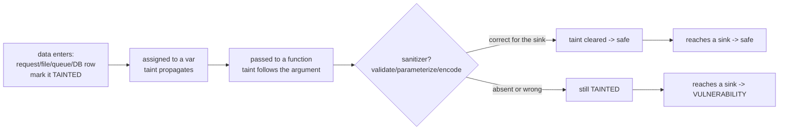
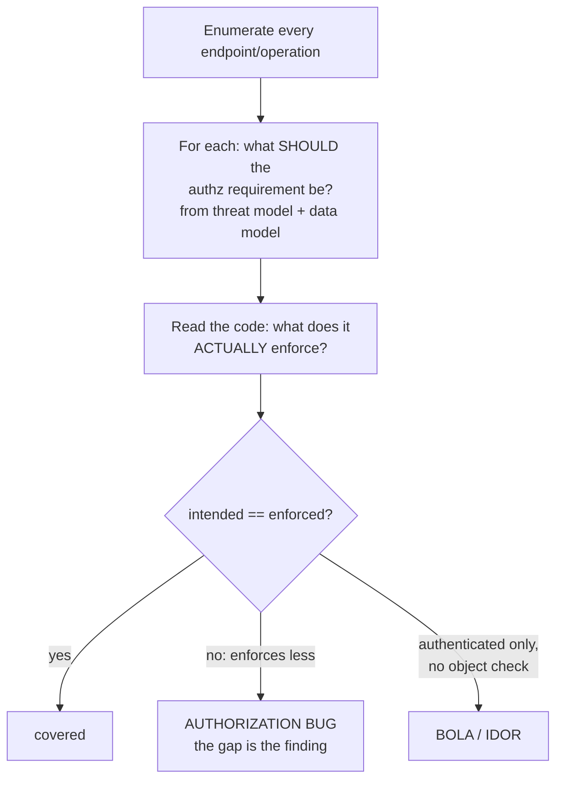
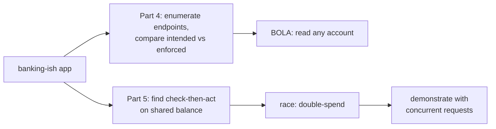

**Level:** Advanced · **Track:** Product Security · **Read time:** 255 min

Chapter 1 gave the methodology — how to scope, where to spend attention, how to prioritize and report. This chapter is about the act itself: **reading code by hand and seeing the bug.** It is the most craft-heavy chapter in the notebook, because the highest-value review skills cannot be reduced to a checklist or a tool rule. They are reading techniques, and reading techniques are learned by doing them deliberately until they become perception.

The organizing claim, which Chapter 1 introduced and this chapter proves in detail: there is a tier of vulnerabilities that **only a human reviewer finds**, and it is the most valuable tier. SAST (Chapter 3) is genuinely good at the injection family — it can trace tainted data from a source to a dangerous sink because that is a syntactic, mechanical property. It is nearly useless at the authorization and business-logic families, because those bugs are about *intent* — about what the code *should* do and does not — and intent is not in the syntax. A missing authorization check produces no dangerous line to flag; there is simply nothing there, and only a reviewer holding a model of what ought to be present notices the absence. The bugs that take down real companies — the IDOR that leaks every customer's data, the workflow flaw that lets you skip payment, the race that double-spends a balance — live overwhelmingly in this human-only tier.

So this chapter is weighted deliberately. Injection reading gets a solid treatment because it is foundational and because reading it well is how you *confirm or dismiss* the tool's output. But the center of gravity is **authorization and business logic** — the categories where the human is not merely faster than the tool but is the *only* thing that works. If you take one skill from this notebook into a job, it is the ability to read code and find the authorization check that was never written.

## Why This Matters

Look at the breach reports through the lens of *which tool would have caught this*. The injection bugs — the classic SQL injection, the command injection — are increasingly caught before production, because SAST rules and secure-by-default frameworks have made them harder to write and easier to detect. The bugs that still get through, still make headlines, and still cost the most are overwhelmingly **authorization and logic** bugs: the API that returned any user's records by incrementing an ID, the endpoint that checked you were logged in but not that the object was yours, the coupon that could be applied a thousand times because the check and the redemption were not atomic. The OWASP API Security Top 10 puts broken object-level authorization at number one for exactly this reason — it is the most prevalent serious API bug, and it is invisible to the tools.

The reason these persist is structural. An injection bug is a dangerous *thing present in the code* — a string-built query — and a pattern-matcher can find a thing that is present. An authorization bug is a safe *thing absent from the code* — the ownership check that should guard the object and does not — and no pattern-matcher can find the absence of something it does not know was supposed to be there. This asymmetry is permanent; it is not a matter of better rules. It is why manual review is not a legacy practice that automation will retire, but a permanent complement to it, and why this skill only grows in value as the automatable bugs get automated away.

For the reviewer, this is the good news: the skill that is hardest to learn is also the one that cannot be replaced. Master the human-only tier and you are valuable in a way a scanner license is not.

## Part 1: Taint Tracking by Hand

The mechanical core of injection review — and the thing SAST automates as "taint analysis" — is tracking *tainted* (untrusted) data from a **source** to a **sink**, checking for a **sanitizer** on the path. Doing it by hand is Chapter 1's sources-sinks-sanitizers model executed line by line, and it is worth building as an explicit mental motion.



The manual technique:

**Mark the source tainted, and follow it.** When untrusted data enters, mentally (or in notes) tag that variable as tainted. Then follow every assignment, every function call it is passed into, every field it is stored in — taint *propagates* through all of them. `name = request.form['name']` taints `name`; `full = name + suffix` taints `full`; `record.title = full` taints `record.title`; and if `record` is later saved and re-read, the taint survives into the second-order path.

**Taint is cleared only by a correct sanitizer.** Parameterization clears it for a SQL sink; context-encoding clears it for an HTML sink; and — the point reviewers miss — a sanitizer for the *wrong* sink does not clear it for *this* one. HTML-encoding does not make data safe for a shell. Read the sanitizer and ask "correct for *which* sink," not "is there a sanitizer."

**Work sink-backward for speed.** There are far fewer sinks than sources, and sinks are greppable concrete functions. Build the sink list (Chapter 1), then for each sink walk *backward* to see whether any tainted source reaches it unsanitized. This is more efficient than forward tracing from every source, and it is how experienced reviewers actually work.

**The hard part is the branches.** A sanitizer on the main path and none on the error path, the retry path, or the admin path is a real bug, and following taint through *every* branch — not just the one the author was thinking about — is where hand-tracking beats a hurried tool run. Hold the question: is there *any* path from this source to this sink that skips the sanitizer?

## Part 2: Reading for Injection — The Tells

Injection bugs have visual signatures. A reviewer learns to see them the way a proofreader sees a typo — the pattern jumps before the analysis begins. The tells, by sink:

**SQL and query languages.** The signature is *string construction reaching a query API*: `+`, f-strings, `.format`, template literals, or `%` immediately before `.execute`/`.query`/`.find`. The moment you see `"SELECT ... " + something` or `f"...{var}..."` feeding a query, that is a candidate; confirm by tracing whether `var` is tainted and whether it is a *value* (parameterizable) or a *structural* element like a column or table name (parameterization does not cover those — allowlist them).

**OS command.** The signature is a *shell string built from input*, or `shell=True`/`exec`/`system`/`Runtime.exec(String)` with a concatenated argument. The safe form — an argument array with no shell — looks different, so the visual contrast is a fast discriminator: an array of separate arguments is safe; a single built string is the tell.

**Template / code execution.** `render_template_string`, `eval`, `Function`, `text/template`, or a template rendered from a string that includes input. The tell is input reaching a *template compiler* or an *evaluator* rather than a template's data slot.

**The critical discrimination: real sink vs safe sink.** Not every `execute` is a bug. The reviewer's job is to distinguish the dangerous form from the safe one *fast*:

```
db.execute("... WHERE id = " + uid)        # TELL: concatenation -> real sink
db.execute("... WHERE id = ?", (uid,))     # parameterized -> safe, move on
subprocess.run("tar " + name, shell=True)  # TELL: shell string -> real sink
subprocess.run(["tar", name])              # arg array, no shell -> safe, move on
element.innerHTML = userInput              # TELL: raw HTML sink -> real
element.textContent = userInput            # text node, not HTML -> safe, move on
```

Learning to glance at a query or command call and instantly classify it as "parameterized/safe" or "built/dangerous" is the single most time-saving injection-review skill, because it lets you skim the safe majority and stop only on the real candidates. This is also exactly the confirm-or-dismiss judgment you apply to SAST output (Part 10): the tool flags the pattern; you read the line and decide in seconds whether it is real.

## Part 3: Reading for Broken Authentication

Authentication code is a hotspot (Chapter 1) and it fails in specific, readable ways. What to look for:

**Credential storage and comparison.** Are passwords hashed with a slow, salted algorithm (Argon2id/bcrypt/scrypt), or with a fast hash or — the worst case — stored reversibly? Is the comparison of secrets and tokens **constant-time**, or an ordinary `==` that leaks through timing? These are readable in the credential-handling module and are high-impact.

**Token validation.** For JWT and similar (Notebook 43 Chapter 2, Notebook 45 Chapter 7): is the algorithm *pinned* on verification, or does the code trust the token's own `alg` (the `alg:none` and RS256→HS256 bugs)? Is the signature actually verified before the claims are read? Are `exp`, `iss`, and `aud` all checked? A reviewer reads the verify function and confirms each check is present — their *absence* is the bug.

**Multi-factor gaps.** Is MFA enforced on *every* authentication path, or only the main one? The tells are the exceptions — the legacy login, the API-key path, the "remember me" flow, the password-reset completion — where the second factor is quietly skipped.

**Password reset — the most bug-dense auth flow.** Reset is where authentication is *re-established*, so a flaw here bypasses everything else. Read for: a reset token that is predictable or long-lived or reusable; a reset that does not invalidate existing sessions; user enumeration through different responses for valid and invalid accounts; and — the classic — a "change password" that does not require the *current* password, letting a session-riding attacker take over the account. Reset flows reward line-by-line reading because each of these is a specific, catchable omission.

**Session establishment.** Is the session ID regenerated on login (fixation defense)? Is it generated from a CSPRNG? Are the cookie flags set? These are read in the login handler and the session middleware.

The through-line: authentication bugs are usually a *missing* check in a flow that otherwise looks complete, and the reviewer finds them by knowing the full set of checks each flow *should* have and confirming each one is present. That is Chapter 1's negative-space reading applied to auth.

## Part 4: Reading for Broken Authorization — The Highest-Value Category

This is the most important section in the notebook. Authorization bugs are the most prevalent serious vulnerability in modern applications, they are nearly invisible to tools, and they are found by a specific, learnable reading discipline.

First, the taxonomy, because you review each layer differently:

| Layer | The question | The bug |
|---|---|---|
| **Function-level** | May this *role* call this operation at all? | An admin endpoint with no role check |
| **Object-level (BOLA/IDOR)** | May this *user* act on *this specific object*? | Reading `/orders/{id}` without checking ownership |
| **Field-level** | May this user see/modify *this field* of the object? | Returning an internal `is_admin` field; mass-assignment |

And the two directions of abuse:

- **Vertical** — a lower-privileged user reaching higher-privileged function (a regular user hitting an admin route).
- **Horizontal** — a user reaching a *peer's* data at the same privilege level (user A reading user B's order). Horizontal is the more common and more overlooked, because the endpoint "works" for legitimate use and only fails when you supply someone else's identifier.

**The reading discipline — enumerate what should be protected, then check each.** Authorization bugs are absences, so you cannot find them by reading for a dangerous pattern; you find them by building the list of *what ought to be checked* and verifying each one is. The systematic method:

1. **List every endpoint / operation** that touches data or performs a privileged action. The router gives you this.
2. **For each, write down what the authorization requirement *should* be** — "must be admin," "must own the object," "must be in the same tenant." This is the model of intended access, and it comes from the threat model and the data model, not from the code.
3. **Read the code for each and confirm the check exists and is correct.** The endpoint where your model says "must own the object" and the code only says "must be logged in" is the bug. This comparison — *intended access* against *enforced access* — is the entire technique, and the gap between them is the finding.



**The specific tells:**

- An operation that takes an object ID from the request and fetches it **without a WHERE clause or check tying it to the current user** — `SELECT * FROM orders WHERE id = ?` with no `AND owner_id = ?`. This is the BOLA signature and it is everywhere.
- **Inconsistency across similar endpoints** (Part 6): nine endpoints do `if order.owner != user: deny` and the tenth does not. The inconsistency is the tell, and comparing sibling handlers is how you find it fast.
- **Authorization decided from client-supplied data** — a `role` field in the request body, a `user_id` parameter the client sets. The client controls it, so it is not authorization (Notebook 45 Chapter 6).
- **Mass assignment / over-posting** — binding a whole request body to a model so the client can set fields (`is_admin`, `balance`) the form never showed. The tell is `Model(**request.json)` or `updateAll(request.body)` with no field allowlist.
- **IDs that are guessable** — sequential integers make horizontal access trivial to exploit; UUIDs raise the bar but do *not* fix the missing check (the authorization gap is the bug; the ID scheme only changes exploitation difficulty).

The reason this category is the reviewer's crown jewel: **every one of these bugs is invisible to a scanner** (there is no dangerous line — the danger is a missing safe line), and every one is catastrophic (unauthorized data access at scale). A reviewer who systematically compares intended access to enforced access, endpoint by endpoint, finds the bugs that make headlines.

## Part 5: Reading for Business-Logic Flaws — What No Scanner Finds

Below authorization sits an even more human category: **business-logic flaws**, where every individual operation is authorized and safe, but the *sequence* or *combination* violates a rule the application was supposed to enforce. No scanner finds these, because there is no dangerous pattern at all — the code is doing exactly what it says, and what it says is wrong.

The classes, with their tells:

**Workflow and state-machine abuse.** An application assumes steps happen in order — add to cart → check out → pay → ship — and does not enforce the order server-side. The tell: a state transition (`order.status = 'shipped'`) reachable without confirming the prior state (`paid`). Read the state field and ask: *can I reach this state directly, skipping the ones before it?* Skipping payment, activating a trial without a card, or completing a multi-step verification by jumping to the last step are all this bug.

**Price, quantity, and amount manipulation.** The client sends a value the server should compute or bound: a price in the request body, a negative quantity that credits the account, a discount applied to a total the client also controls. The tell: a security- or money-relevant number read from the request instead of derived or validated server-side. Notebook 45's "the server trusts something the client controls," in its most expensive form.

**Race conditions / TOCTOU.** A check and the action it guards are not atomic, so concurrent requests slip multiple actions between them — redeem a one-time coupon many times, withdraw past a balance, register a taken username twice. The tell: a *check-then-act* on shared state without a lock, a transaction, or an atomic operation — `if balance >= amount:` on one line and `balance -= amount` a few lines later, with nothing making the pair atomic. This is Notebook 43 Chapter 2's single-packet attack from the defender's side, and the lab in Part 9 hunts one.

**Insecure workflow transitions and replay.** Re-using a one-time token, replaying a signed request, or repeating an idempotent-looking operation that is not actually idempotent. The tell: a token or nonce with no consumed-marker, or a mutating operation with no replay guard.

The reading discipline for logic flaws is different from all the others: you cannot grep for it, and you cannot check it against a generic model of "what should be protected." You have to **understand what the feature is supposed to guarantee** — the business rule — and then ask *how could I violate that rule while keeping every individual step legal?* That requires reading the code *and* understanding the domain, which is exactly why it is the last thing to automate and the mark of a senior reviewer. The question is always: **what invariant is this code supposed to maintain, and where is it maintained — or not?**

## Part 6: The Comparison Technique — Find the Inconsistent Path

One reading technique deserves its own section because it finds a disproportionate share of real authorization and validation bugs: **compare similar code paths and find the one that is different.**

Applications have families of similar handlers — CRUD endpoints for a dozen resources, a set of admin actions, parallel flows for web and API. Security controls are supposed to be applied consistently across the family, and the bug is almost always the *inconsistency*: the one endpoint missing the ownership check, the one form missing the CSRF token, the one input missing validation, the one query that is built instead of parameterized. Humans are excellent at spotting "one of these is not like the others" when the items are lined up side by side — far better than at judging any single item in isolation.

The technique in practice:

- **Line up the family.** Put the CRUD handlers, or the admin routes, or the parallel flows next to each other (literally, in split panes or a table of what each does).
- **Read down the column, not across the row.** For a single control — the authorization check — look at how *every* handler in the family implements it, and the odd one out is the finding.
- **Grep for the control and count.** If nine handlers contain `authorize(order, user)` and there are ten handlers, one is missing it. A grep that returns *fewer* hits than there are handlers is a direct signal.

This is why reviewers ask for the *whole* family of endpoints, not just the changed one — a diff shows the new handler in isolation, and the bug is only visible when the new handler is compared to its siblings and turns out to be missing the check they all have. The comparison technique is the practical way to search the negative space Chapter 1 described: absence becomes visible as *difference*.

## Part 7: Reading for Crypto, Secrets, and Information Disclosure

The remaining hotspots, briefly, since Notebook 45 Chapters 7–8 covered the substance:

**Cryptography.** Read for the misuse patterns, not for broken math: a fast hash where a password hash belongs, ECB mode, a hardcoded or reused IV/nonce, a non-CSPRNG for tokens, a homemade construction, encryption without authentication. These are readable signatures in the crypto-using code, and the reviewer confirms the *right* primitive is used *correctly*.

**Secrets.** Grep the source and the config for high-entropy strings and key-shaped patterns (`sk_`, `AKIA`, `-----BEGIN`), and read for secrets reaching logs or client-side code. Chapter 6 automates this; a manual pass catches the ones the tool's rules miss.

**Error handling and information disclosure.** Read for stack traces or detailed errors returned to the client (internal paths, SQL errors, library versions), secrets or personal data written to logs, and — the security-relevant one — security checks that **fail open** on error (a `try/except` around an authorization call that proceeds on failure). The tell for fail-open is an exception handler around a security decision that does not deny; read every such handler and confirm it fails *closed*.

## Part 8: Reading Diffs and Pull Requests Efficiently

Most real review happens on a diff, not a whole codebase, and reviewing a diff well is its own skill.

The efficient diff-review order:

1. **Read the description and the linked ticket first** — what is this change *supposed* to do? You cannot spot a logic flaw without knowing the intended behavior.
2. **Look at the changed *security-relevant* files first** — auth, authorization, input handling, crypto, anything in a hotspot. A one-line change to an authorization function deserves more scrutiny than a hundred lines of UI.
3. **Read the change in context, not in isolation.** The danger of diff review is that the bug is in the *interaction* between the changed line and the unchanged code around it — or, per Part 6, in the *inconsistency* between the new handler and its unchanged siblings. Expand the context; do not review the green lines alone.
4. **Ask what the change *removed* or *weakened*.** A diff that deletes a validation, loosens a check, or adds a new parameter to an existing query is where regressions hide. A removed line is easy to skim past and is often the whole bug.
5. **Check the new attack surface.** A new endpoint, a new parameter, a new file upload, a new external call — each is new surface that needs the full hotspot treatment even though it is "just a small feature."

The trap of diff review is tunnel vision: the reviewer looks only at what changed and misses that the change *should have* included an authorization check it does not, or that it introduced an inconsistency with the rest of the family. The fix is to always pull the changed handler into the context of its siblings (Part 6) before approving.

## Part 9: Hands-On Lab — Hunting an Authorization Bug and a Logic Race by Hand

### 9.1 What we are building

Two human-only bugs, found by the reading techniques of this chapter: a horizontal-authorization (BOLA) flaw found by the Part 4 enumerate-and-compare method, and a business-logic race found by the Part 5 check-then-act tell. Neither is findable by a naive scanner.



Python 3 and Flask.

### 9.2 The application

```python
# bank.py -- small money app with two human-only bugs. Lab use only.
from flask import Flask, request, session, jsonify
import sqlite3, threading, time

app = Flask(__name__)
app.secret_key = "lab"
LOCKLESS = True   # the bug in Part 5 lives here

def db():
    c = sqlite3.connect("bank.db", check_same_thread=False)
    return c

def setup():
    c = db()
    c.executescript("""
      DROP TABLE IF EXISTS accounts;
      CREATE TABLE accounts(id INTEGER PRIMARY KEY, owner TEXT, balance INTEGER);
      INSERT INTO accounts VALUES (1,'asha',100),(2,'ravi',5000);
    """); c.commit()

@app.route("/login/<who>")
def login(who):
    session["user"] = who
    return {"user": who}

@app.route("/account/<int:aid>")
def account(aid):
    # BUG (Part 4): fetches by id with NO ownership check -> BOLA/IDOR.
    row = db().execute("SELECT owner,balance FROM accounts WHERE id=?", (aid,)).fetchone()
    if not row: return ("no", 404)
    return {"owner": row[0], "balance": row[1]}

@app.route("/withdraw/<int:aid>/<int:amt>", methods=["POST"])
def withdraw(aid, amt):
    c = db()
    row = c.execute("SELECT owner,balance FROM accounts WHERE id=?", (aid,)).fetchone()
    if not row or row[0] != session.get("user"):
        return ("forbidden", 403)                 # this endpoint DOES check ownership
    # BUG (Part 5): check-then-act on balance with no lock/transaction -> race.
    if row[1] >= amt:                             # CHECK
        time.sleep(0.05)                          # window that concurrency exploits
        c.execute("UPDATE accounts SET balance=balance-? WHERE id=?", (amt, aid))
        c.commit()                                # ACT
        return {"withdrew": amt}
    return ("insufficient", 400)

if __name__ == "__main__":
    setup(); app.run(port=5000, threaded=True)
```

### 9.3 Finding the BOLA by the Part 4 method

Enumerate the endpoints and, for each, write the *intended* authorization and compare to the *enforced*:

```bash
grep -n "@app.route" bank.py

# Sample output:
# 24:@app.route("/login/<who>")
# 28:@app.route("/account/<int:aid>")
# 35:@app.route("/withdraw/<int:aid>/<int:amt>", methods=["POST"])
```

| Endpoint | Intended authz | Enforced (read the code) | Verdict |
|---|---|---|---|
| `/login/<who>` | none (public) | none | ok |
| `/account/<aid>` | **must own the account** | authenticated? not even that — no check | **BOLA** |
| `/withdraw/<aid>/<amt>` | must own the account | `row[0] != session['user']` → 403 | ok (compare!) |

The comparison technique (Part 6) makes it obvious: `/withdraw` checks ownership, `/account` — a sibling that also takes an account id — does not. The inconsistency *is* the finding. Prove it:

```bash
pip install flask > /dev/null
python3 bank.py & sleep 2

# Log in as asha (owns account 1, balance 100)
curl -s -c jar "localhost:5000/login/asha" >/dev/null

# Read asha's OWN account -- fine
curl -s -b jar "localhost:5000/account/1"

# Sample output:
# {"balance":100,"owner":"asha"}

# BOLA: read ravi's account (id 2) while logged in as asha -- should be forbidden
curl -s -b jar "localhost:5000/account/2"

# Sample output:
# {"balance":5000,"owner":"ravi"}
```

asha read ravi's balance. No scanner flags this, because the dangerous thing is the *absence* of the check that its sibling `/withdraw` has.

### 9.4 Finding the logic race by the Part 5 tell

The tell in `withdraw` is a **check-then-act on shared state with no atomicity**: `if row[1] >= amt` (check), a gap, then `UPDATE ... balance-?` (act). Concurrent requests both pass the check before either acts, and the balance goes negative — a double-spend.

```python
# race.py -- fire concurrent withdrawals to exploit the check-then-act gap.
import threading, requests

BASE = "http://localhost:5000"
s = requests.Session()
s.get(f"{BASE}/login/asha")            # asha owns account 1, balance 100

results = []
def hit():
    r = s.post(f"{BASE}/withdraw/1/100")   # each tries to withdraw the FULL balance
    results.append(r.status_code)

# 5 simultaneous requests, each for the entire balance.
threads = [threading.Thread(target=hit) for _ in range(5)]
for t in threads: t.start()
for t in threads: t.join()

ok = results.count(200)
final = s.get(f"{BASE}/account/1").json()["balance"]
print(f"[*] concurrent withdrawals of 100 each from a balance of 100")
print(f"[*] successful (200) withdrawals: {ok}")
print(f"[*] final balance: {final}")
print("[!] VULNERABLE: more than one succeeded -> double-spend"
      if ok > 1 else "[+] safe")
```

```bash
python3 race.py

# Sample output:
# [*] concurrent withdrawals of 100 each from a balance of 100
# [*] successful (200) withdrawals: 3
# [*] final balance: -200
# [!] VULNERABLE: more than one succeeded -> double-spend
```

Three withdrawals of the full balance succeeded and the account went to −200. The bug is not in any single request — each one is perfectly authorized and passed its check — it is in the *interaction* of concurrent requests, which is exactly why Part 5 says no scanner finds it.

### 9.5 The fixes

```python
# The BOLA fix (Part 4): add the ownership check its sibling already has.
@app.route("/account/<int:aid>")
def account(aid):
    row = db().execute("SELECT owner,balance FROM accounts WHERE id=?", (aid,)).fetchone()
    if not row: return ("no", 404)
    if row[0] != session.get("user"):        # <-- the missing line
        return ("forbidden", 403)
    return {"owner": row[0], "balance": row[1]}

# The race fix (Part 5): make check-and-act atomic. Conditional UPDATE, one statement.
@app.route("/withdraw/<int:aid>/<int:amt>", methods=["POST"])
def withdraw(aid, amt):
    c = db()
    row = c.execute("SELECT owner FROM accounts WHERE id=?", (aid,)).fetchone()
    if not row or row[0] != session.get("user"):
        return ("forbidden", 403)
    # Atomic: the DB checks AND decrements in one statement; only succeeds if funds exist.
    cur = c.execute(
        "UPDATE accounts SET balance=balance-? WHERE id=? AND balance>=?",
        (amt, aid, amt))
    c.commit()
    return ({"withdrew": amt} if cur.rowcount == 1 else ("insufficient", 400))
```

The race fix is the general remedy for check-then-act: **make the check and the act a single atomic operation** — here a conditional `UPDATE ... WHERE balance >= amt` that the database executes atomically, so concurrent requests cannot both pass. Re-running `race.py` against the fixed version yields exactly one successful withdrawal.

### 9.6 Extending the lab

Add a field-level bug (return an internal `pin` column) and find it by reading what the response object exposes; add a mass-assignment endpoint (`Account(**request.json)`) and demonstrate setting `balance` directly; add a workflow bug (a `/transfer` that sets `status='complete'` without confirming `status='pending'`) and find it by the state-machine reading of Part 5; and run a SAST tool over the whole app and confirm it flags neither the BOLA nor the race — the empirical proof of this chapter's thesis.

## Part 10: Pairing Manual Review With the Tools

Manual review and SAST are not competitors; they cover different bug classes, and the mature workflow uses each for what it is good at.

- **Let SAST do the injection sweep** (Chapter 3). It is genuinely good at tracing taint to a dangerous sink, and it does it across the whole codebase tirelessly. Reviewing every line for injection by hand duplicates what the tool does better.
- **The human confirms or dismisses each SAST finding.** The tool produces false positives (a "tainted" value that is actually constrained, a sink that is actually safe); a reviewer reads the flagged line and decides in seconds using Part 2's real-sink-vs-safe-sink discrimination. This triage is itself a manual-review skill and it is where the tool and the human meet.
- **The human owns the authorization and logic tiers entirely** (Parts 4–5). Do not expect the tool here; spend your scarce manual hours where the tool is blind, which is exactly the highest-value tier.
- **Use the tool's output to *target*, not to *bound*, the review.** SAST flagging three injection points near a module is a signal that the module handles untrusted input carelessly — which means it is also a good place to hunt by hand for the authorization and logic bugs the tool cannot see. The tool's noise is a map of where the careless code is.

The division of labor, stated once: **tools for the present-and-dangerous (injection), humans for the absent-and-safe (authorization, logic).** A program that runs SAST and skips manual review has automated the easy half and left the expensive half — the half that makes headlines — entirely uncovered.

## Part 11: Common Pitfalls

**Reviewing every line for injection by hand.** The tool does this better and tirelessly. Spend human hours on authorization and logic, and use manual injection reading to *confirm* the tool, not replace it.

**Expecting the scanner to find authorization bugs.** It cannot — the bug is a missing safe line, not a present dangerous one. This tier is human-only, permanently.

**Reading an endpoint in isolation.** The bug is usually the *inconsistency* with its siblings (Part 6). Pull the whole family into view before judging any one handler.

**Trusting `==` on secrets and unpinned JWT `alg`.** Constant-time comparison and a pinned algorithm are the readable auth checks whose *absence* is the bug.

**Skimming the password-reset flow.** It re-establishes authentication and is the most bug-dense auth code. Read it line by line for token strength, session invalidation, current-password requirement, and enumeration.

**Missing the check-then-act tell.** A check and its action on shared state, not made atomic, is a race. `if balance >= amt` followed later by `balance -= amt` is the signature.

**Trusting client-supplied authorization or amounts.** A `role` in the body, a `user_id` parameter, a price the client sends — none is trustworthy. Money and access decisions are made server-side from server-side data.

**Diff tunnel vision.** Reviewing only the green lines misses the check the change *should* have added and the inconsistency it introduced. Read the change in the context of its neighbors and its siblings.

**Not knowing the intended behavior.** You cannot find a logic flaw without knowing what the feature is supposed to guarantee. Read the ticket and understand the domain first.

**Anchoring on the tool.** Reviewing only what SAST flagged and stopping. The tool's silence about authorization and logic is not a clean bill of health.

## Final Revision / Summary

- There is a tier of bugs **only a human finds**, and it is the most valuable tier. SAST is good at injection (a dangerous thing *present* — syntactic, traceable); it is nearly useless at authorization and business logic (a safe thing *absent*, or a rule violated by a legal sequence — a matter of intent, not syntax). This asymmetry is permanent.
- **Taint tracking by hand**: mark the source tainted, follow it through assignments and calls, and it is cleared only by a sanitizer *correct for the specific sink*. Work sink-backward for speed; the hard part is following taint through *every* branch, including error and admin paths.
- **Reading for injection** is pattern recognition: string-built queries, shell strings, and raw-HTML/eval sinks are the tells. The key skill is instantly discriminating a **real sink from a safe one** (concatenation vs parameterization, shell string vs arg array, `innerHTML` vs `textContent`) — which is also how you confirm or dismiss SAST output.
- **Broken authentication** is usually a *missing* check in an otherwise-complete flow: reversible or fast-hashed passwords, non-constant-time compares, unpinned JWT `alg`, MFA skipped on an exception path, and above all the **password-reset flow** (predictable/reusable tokens, no session invalidation, no current-password requirement, user enumeration).
- **Broken authorization is the highest-value category.** Taxonomy: function-level (role), object-level/BOLA (ownership), field-level (which fields), abused vertically (privilege escalation) or horizontally (peer data). The reading discipline: **enumerate every operation, write down what the authz requirement *should* be, read the code for what it *enforces*, and the gap is the finding.** Tells: object fetched by id with no ownership check, inconsistency across sibling endpoints, authz decided from client data, mass assignment, guessable IDs.
- **Business-logic flaws** no scanner finds, because the code does exactly what it says and what it says is wrong: workflow/state-machine skipping (reach a state without its prerequisites), client-controlled price/quantity/amount, **check-then-act races/TOCTOU** (the fix is one atomic operation), and replay of one-time tokens. The question is always *what invariant should this maintain, and where is it maintained — or not?*
- **The comparison technique** finds a disproportionate share of real bugs: line up a family of similar handlers, read *down the column* for a single control, and the odd one out is the finding. Grep the control and count — fewer hits than handlers is a direct signal. This is how you search the negative space.
- **Crypto/secrets/disclosure** reading: misuse signatures (fast hash for passwords, ECB, reused nonce, homemade crypto, non-CSPRNG), high-entropy strings in source, and security checks that **fail open** on error.
- **Diff review**: read the ticket first (you need the intended behavior), scrutinize security-relevant changed files, read in context not isolation, ask what the change *removed or weakened*, and treat new surface with the full hotspot pass. The trap is tunnel vision on the green lines.
- **Pair with tools correctly**: SAST does the injection sweep and the human triages its output (real sink vs safe); the human owns authorization and logic entirely; the tool's findings *target* rather than *bound* the manual review. Tools for the present-and-dangerous, humans for the absent-and-safe.

## Cheat Sheet / Quick Reference

**Taint by hand**

```
source (tainted) -> follows every assignment/call -> cleared ONLY by a sanitizer
correct FOR THIS SINK. check EVERY branch (error/retry/admin path too).
work sink-backward: fewer sinks, all greppable.
```

**Real sink vs safe sink (glance and classify)**

```
"..."+var into a query        REAL      execute("...?",(var,))       safe
shell string / shell=True     REAL      exec(["prog",arg])           safe
innerHTML / eval / text/tmpl  REAL      textContent / html/template  safe
```

**Auth reading**

```
passwords: Argon2id/bcrypt (not fast hash, not reversible)
compares: constant-time (not ==)
JWT: alg PINNED on verify; sig checked before claims; exp/iss/aud all present
MFA: on EVERY path (watch legacy/api-key/remember-me)
password reset: token unpredictable+single-use+expiring | invalidates sessions
                | requires CURRENT password | no user enumeration
```

**Authorization = enumerate then compare**

```
for every endpoint/operation:
  intended authz (from threat + data model)  vs  enforced authz (from code)
  gap = the bug
tells: fetch-by-id with no ownership check (BOLA) | inconsistent siblings
       | authz from client data | mass assignment | guessable ids
directions: vertical (privilege up) | horizontal (peer data - more common)
```

**Business logic (no scanner finds these)**

```
workflow: can I reach this state skipping its prerequisites?
amounts:  is a price/qty/discount read from the client instead of server-computed?
race:     check-then-act on shared state, not atomic?  -> single atomic op
replay:   one-time token with no consumed-marker?
ask: what INVARIANT should this maintain, and where is it maintained?
```

**Comparison technique**

```
line up the family of similar handlers
read DOWN the column for one control (authz check / CSRF / validation)
odd one out = finding | grep the control, count vs number of handlers
```

**Tool/human division**

```
SAST  -> injection sweep (present-and-dangerous); human triages each finding
HUMAN -> authorization + business logic (absent-and-safe) -- tools are blind here
tool output TARGETS the manual hunt; it does not BOUND it
```

## Practice Labs & Resources

**Hands-on**
- Extend the lab: add field-level, mass-assignment, and workflow bugs and find each by its reading technique; run SAST and confirm it misses the BOLA and the race.
- Work the PortSwigger **Access Control** and **Business Logic** labs from the reviewer's side: for each, write the server-side check or atomic operation that would have prevented it.
- Take an open-source app and do the Part 4 enumeration — every endpoint, intended vs enforced authz — and find the inconsistent one.

**Deliberate practice**
- Drill the real-sink/safe-sink discrimination on twenty query and command calls until classification is instant.
- Practice the comparison technique: pick a CRUD-heavy codebase, grep the authorization function, and find the handler that lacks it.
- For a feature you know, write down its invariants and then attack each one on paper — the logic-flaw muscle.

**Further reading**
- **OWASP API Security Top 10** — BOLA (API1) and broken function-level authorization (API5) are Parts 4's bugs in production form.
- **OWASP Business Logic Testing** guidance and the WSTG logic chapters.
- Dowd, McDonald & Schuh, *The Art of Software Security Assessment* — the definitive manual-review reference.
- Chapter 3 next (SAST) for the automated injection counterpart, and Notebook 45 Chapter 6 Part 7 for the secure-coding side of authorization.

---

*Also on [Praneeth's portfolio](https://ping-praneeth.vercel.app/notebook/secure-code-review-sast-sca/02-manual-secure-code-review-reading-code-for-injection-auth-and-logic-flaws), with comments and the latest edits.*
