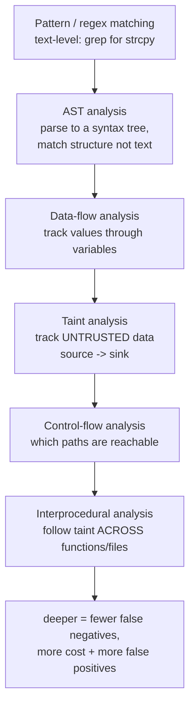
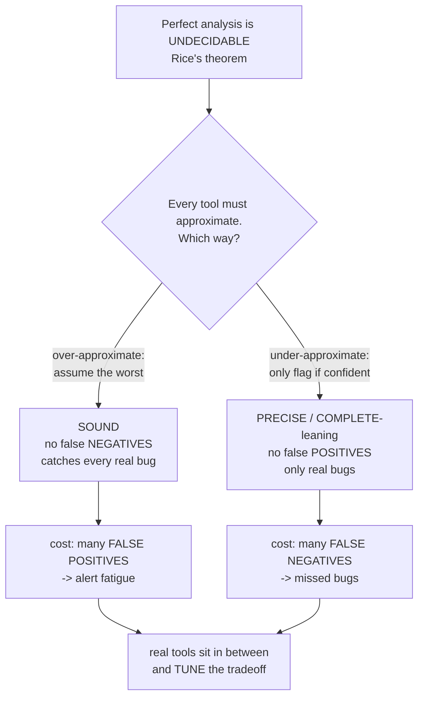
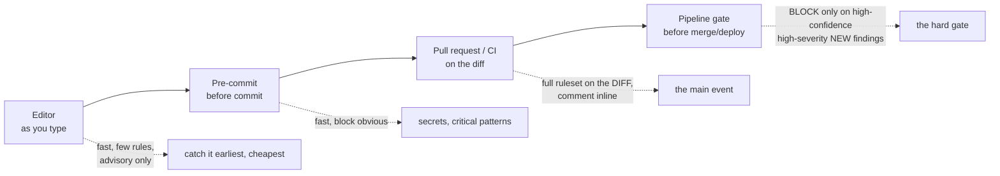
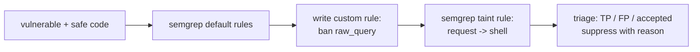

**Level:** Advanced · **Track:** Product Security · **Read time:** 255 min

Chapter 2 ended on a division of labor: humans own the authorization and logic tiers, and tools own the injection sweep, because tracing tainted data from a source to a dangerous sink is a mechanical, syntactic property that a machine can check across an entire codebase tirelessly. **Static Application Security Testing (SAST)** is that machine. This chapter is about what it is, what it can and — just as important — *cannot* do, and how to run it so it helps rather than drowns the team in noise.

The honest framing up front, because SAST is the most over-sold and most mis-deployed category of security tooling: **SAST is a force multiplier for the manual review of Chapters 1–2, not a replacement for it.** It scales the part of review that is automatable — the injection taint-tracking — across millions of lines, on every commit, without fatigue. It does not, and by a deep theoretical result *cannot*, find the authorization and business-logic bugs that are the highest-value tier. A program that buys a SAST tool and declares code review "done" has automated the cheap half and abandoned the expensive half. Understanding exactly where the tool's power ends is the difference between a SAST deployment that developers trust and one they route around.

The chapter has three movements. First, **how SAST actually works** — the analysis techniques from pattern matching to interprocedural taint analysis — because you cannot triage a tool's output or write a good rule without understanding what it is doing. Second, **the theoretical limits** — undecidability and the soundness/completeness tradeoff — because they explain *why* every SAST tool forces a choice between false positives and false negatives, and why the false-positive problem is the central operational challenge of the whole category. Third, **the practice** — the tool landscape, writing custom rules (the highest-leverage SAST skill), triage, tuning, and pipeline integration — because a SAST tool is only as good as the program running it.

## Why This Matters

The scaling argument is real and it is the reason SAST exists. A human reviewer reads a few hundred lines an hour; a codebase is millions of lines and changes every day. No amount of manual review covers a large, fast-moving codebase completely, and the injection bugs that manual review *can* find are exactly the ones a machine can find too — so automating them frees the scarce human hours for the tier only humans cover. Done well, SAST catches the string-built query and the `shell=True` on the commit that introduces them, in the editor, before they ever merge — the leftmost, cheapest point on the shift-left curve.

But the more important reason to understand SAST deeply is that **most SAST deployments fail, and they fail in a predictable way.** A tool is turned on with its default rules, it produces thousands of findings against a legacy codebase, most of them false positives or irrelevant, the team cannot triage the flood, they stop looking, and within a quarter the tool is a red build nobody reads or a report nobody opens. The failure is not the tool; it is the deployment. Every part of this chapter's practice section — false-positive management, custom rules, baselining, the right gate at the right stage — exists to prevent that specific failure. A product security engineer who can make SAST *trusted* is worth far more than one who can merely install it, because the installation is easy and the trust is where every program dies.

And there is a skill that compounds: **writing custom rules.** Off-the-shelf rules catch generic bugs; your codebase has its own dangerous patterns — an internal unsafe API, a deprecated auth helper, a house-specific footgun — that no vendor rule knows about. The ability to encode "never call our old `raw_query()` helper" or "every route handler must be decorated with `@authorize`" as a rule the pipeline enforces is how SAST goes from catching textbook bugs to catching *your* bugs. It is the single highest-leverage SAST skill and the lab is built around it.

## Part 1: What SAST Is, and How It Reads Code Without Running It

SAST analyzes source code (or compiled bytecode) **without executing it** — hence *static*. It reasons about what the code *could* do across all possible inputs and paths, in contrast to DAST (Chapter 4), which runs the application and observes what it *does* do on the inputs it actually sends. That difference is the source of both SAST's superpower and its central weakness: because it does not run the code, it can reason about *every* path (including ones a test would never trigger — the coverage advantage of Chapter 1), but it must *reason* about behavior rather than *observe* it, and reasoning about all possible behavior is where the theoretical limits of Part 3 bite.

The techniques stack from shallow to deep, and each real tool is a particular combination of them:



**Pattern / regex matching** operates on raw text — "flag any line containing `strcpy`." Fast and simple, and useless for anything context-dependent, because it cannot tell `strcpy(safe, constant)` from `strcpy(buf, attacker_input)`; both match. This is the level a grep operates at, and it is why grep is a first pass, not a SAST tool.

**AST (Abstract Syntax Tree) analysis** parses the code into a structural tree and matches on *structure* rather than text — "a call to `execute` whose argument is a string concatenation." This is a large step up: it understands that a query call and its argument are related regardless of formatting, whitespace, or variable names, and it is where a tool stops matching characters and starts matching *code*. Semgrep's core is essentially structural AST matching made writable.

**Data-flow analysis** tracks how *values* move through variables and assignments, so the tool knows `x = user_input; y = x; sink(y)` connects the input to the sink through two hops. **Taint analysis** is data-flow specialized for security: it marks untrusted **sources** as *tainted*, propagates the taint through assignments and calls, treats **sanitizers** as taint-clearing, and reports when taint reaches a dangerous **sink** — the exact source-sink-sanitizer model you traced by hand in Chapter 2, now automated. This is the technique that makes SAST good at injection.

**Control-flow analysis** reasons about which paths are actually reachable (is this sink behind a condition that can never be true?), and **interprocedural analysis** follows data *across* function and file boundaries — the taint enters in `handler.py`, is passed to a helper in `db.py`, and reaches the sink there. Interprocedural taint tracking is what separates a serious SAST engine from a linter, and it is also the most expensive and the most false-positive-prone, because reasoning correctly across every function call in a large program runs straight into Part 3's limits.

The practical takeaway: **deeper analysis finds more real bugs (fewer false negatives) at the cost of more compute and more false positives.** Every tool picks a point on that curve, and knowing where a tool sits explains its behavior — Semgrep leans toward fast, writable, intraprocedural-by-default matching; CodeQL leans toward deep, semantic, interprocedural analysis that is slower and more thorough.

## Part 2: Why SAST Is Strong at Injection and Weak at Authorization

Chapter 2 asserted this division; Part 1 explains *why* it is fundamental, not a temporary limitation.

**Injection is a syntactic property, and SAST is a syntactic engine.** "Tainted data reaches a dangerous sink without passing a sanitizer" is a statement about the *structure and data flow of the code* — exactly what taint analysis computes. The tool does not need to understand what the application is *for*; it only needs to trace the data. That is why SAST genuinely finds SQL injection, command injection, XSS, path traversal, and the rest of Family 1 (Chapter 8) — they are all "untrusted data reaches interpreter," and that is a traceable, mechanical property.

**Authorization is a semantic property, and SAST has no access to semantics.** "This endpoint should check that the object belongs to the current user" is a statement about *intent* — about what the code is *supposed* to guarantee — and intent is nowhere in the syntax. The tool sees a function that fetches an object by ID and returns it; nothing in the code says whether an ownership check *should* be there, so its absence is not a pattern the tool can match. There is no tainted data flowing to a dangerous sink; there is a *safe check that was never written*, and you cannot pattern-match the absence of something the tool does not know was required. This is the same asymmetry Chapter 2 named — **tools find bad code present; they cannot find good code missing** — now grounded in how the analysis works.

The consequence for a SAST program is a hard boundary: expect the tool to cover Family 1 (injection) well, Family 2 (memory safety — the C/C++ analyzers and the sanitizers are decent here) moderately, and Family 3 (authorization, business logic) essentially not at all. Do not measure the tool by whether it finds authorization bugs; it structurally cannot, and a program that leans on SAST for that tier has an invisible, permanent gap. The lab in Chapter 2 proved this empirically; Part 1 here proves it in principle.

## Part 3: The Theoretical Limits — Undecidability and the Soundness/Completeness Tradeoff

The false-positive problem that dominates SAST practice is not an engineering defect that better tools will someday fix. It is a *consequence of computability theory*, and understanding that is what lets you set realistic expectations and stop blaming the tool for the impossible.

**Rice's theorem and undecidability.** A foundational result in computer science (Rice's theorem, building on the halting problem) says that any non-trivial *semantic* property of a program's behavior is **undecidable** in general — there is no algorithm that correctly answers "does this program have property X" for all programs. "Does tainted data reach this sink on some real execution" is exactly such a property. So no SAST tool can be *both* always-correct-when-it-flags *and* never-miss — the perfect analyzer is mathematically impossible, not merely unbuilt.

Faced with an undecidable question, a tool must *approximate*, and the direction of the approximation is a forced choice:



- A **sound** analysis over-approximates: it assumes the worst wherever it is unsure, so it never misses a real bug (no false negatives) — at the cost of flagging many things that are not actually exploitable (false positives). "Better safe than sorry" taken to its logical end produces a tool that cries wolf constantly.
- A **complete** (precise) analysis under-approximates: it only flags what it can *prove* is a bug, so everything it reports is real (no false positives) — at the cost of staying silent about bugs it cannot prove (false negatives). "Only speak when certain" produces a quiet tool that misses things.

**No real tool is fully either**, and the vocabulary matters when you read vendor claims: a tool advertised as "no false positives" is telling you it leans toward completeness and *will* have false negatives (miss bugs); a tool that "catches everything" leans toward soundness and *will* flood you with false positives. There is no free lunch, and the position on this axis is a *design choice* the tool exposes as configuration — which is why Part 8's tuning is the real work.

The operational upshot, which every subsequent part serves: **false positives are inherent, not a bug to be fully eliminated, and the entire discipline of running SAST well is managing that inherent noise down to a level the team will actually act on.** A reviewer who understands this stops expecting a clean tool and starts building a *process* — custom rules, triage, baselining, suppression — that makes an inherently noisy signal usable.

## Part 4: The False-Positive Problem — Why It Kills Adoption

Everything about SAST practice orbits one operational fact: **false positives kill SAST programs, and they kill them through human psychology, not through technology.**

The failure sequence is textbook and worth naming so you can recognize it early:

1. The tool is turned on with default rules against an existing codebase.
2. It produces thousands of findings — many false positives (Part 3's inherent noise), many true-but-irrelevant (a real pattern in code that is not actually reachable or is accepted risk), many low-severity.
3. Developers open the report, investigate the first several findings, discover most are not real or not worth fixing, and conclude the tool is noise.
4. They stop looking. The findings queue grows to tens of thousands and becomes permanently ignored. If SAST is a *blocking* build gate, they route around it (skip flags, blanket suppressions); if it is non-blocking, they never open it.
5. A real, serious finding appears in the flood and is missed exactly like the noise around it — the tool's one job, defeated by its own volume.

The lesson generalizes beyond SAST to all security tooling: **a security tool that cries wolf is worse than no tool, because it trains the team to ignore alerts, and that trained-ignorance carries over to the real alert.** The signal-to-noise ratio is not a nice-to-have metric; it is the difference between a tool that changes behavior and a tool that decorates a dashboard.

Consequently, the *first* priority of any SAST deployment is not coverage — it is **trust**. A tool that reports ten findings of which nine are real earns developers who fix nine; a tool that reports a thousand of which fifty are real earns developers who fix zero, even though it "found more." Every practice in the rest of this chapter — starting with a small high-signal ruleset, baselining out legacy noise, writing precise custom rules, triaging honestly, and gating narrowly — is in service of protecting that trust. Optimize for the developer *acting* on the finding, because a finding nobody acts on had no value regardless of whether it was technically correct.

## Part 5: The Tool Landscape

Three tools anchor the category, and they represent three genuinely different design points on Part 3's axis.

| | Semgrep | SonarQube | CodeQL |
|---|---|---|---|
| Core model | AST pattern matching, writable rules | Quality + security platform | Code as a queryable database |
| Analysis depth | Fast; intraprocedural default, taint mode | Moderate | Deep, semantic, interprocedural |
| Rule authoring | **Easy** — YAML, looks like code | Custom rules harder | Powerful but a real query language (QL) |
| Speed | Very fast (CI-friendly) | Moderate | Slow (builds a database) |
| Best for | Custom rules, CI gating, polyglot | Quality gates + security in one | Deep vuln research, variant analysis |
| Sweet spot | The pattern *your* codebase needs | Broad org-wide quality program | Finding all variants of a known bug |

**Semgrep** treats a rule as a *pattern that looks like the code you want to match* — you write `subprocess.run(..., shell=True)` and it finds every structural instance regardless of variable names or formatting. Its rules are YAML, fast to write, and fast to run, which makes it the best tool for the highest-leverage SAST activity (custom rules, Part 6) and for CI gating. It leans toward precision (fewer false positives) and intraprocedural analysis by default, with an opt-in taint mode for source-to-sink tracking.

**SonarQube** is a broader *code quality* platform that includes security rules — it measures bugs, code smells, coverage, and vulnerabilities together, with a "quality gate" concept for blocking builds. Its strength is being the single org-wide platform that developers already look at for quality, so security findings ride along in a place they already are. Its custom-rule authoring is more involved than Semgrep's.

**CodeQL** (GitHub) is the deepest of the three: it compiles the codebase into a *relational database* and lets you write **queries** (in the QL language) against the code's structure and data flow. This is enormously powerful for **variant analysis** — given one known vulnerability, write a query that finds every other instance of the same pattern across the codebase (and, via GitHub, across open source). It is how a lot of serious vulnerability research is done. The cost is that QL is a real language with a learning curve, and building the database makes it slower — it is a research and deep-analysis tool more than a fast CI linter.

The pragmatic answer for most teams: **Semgrep for fast CI gating and custom rules, one deep engine (CodeQL) for periodic thorough analysis and variant hunting, and whatever quality platform (often SonarQube) the org already runs as the place findings live.** They are complementary, occupying different points on the depth/speed/precision curve, and a mature program uses more than one deliberately.

## Part 6: Writing Custom Rules — The Highest-Leverage SAST Skill

Off-the-shelf rules find generic, textbook bugs. Your codebase's *actual* recurring problems are specific to it: an internal `raw_query()` helper that bypasses the ORM's parameterization, a deprecated `legacy_auth()` that must never be used, a house convention that every route handler be decorated with `@requires_auth`, a logging call that must never receive a secret. No vendor rule knows about these, and encoding them as rules the pipeline enforces is how SAST catches *your* bugs instead of only the ones in the textbook.

Semgrep is the tool to learn this in, because its rules *look like the code they match*. The anatomy of a rule:

```yaml
# Catch a project-specific dangerous helper: our raw_query() bypasses parameterization.
rules:
  - id: no-raw-query
    pattern: raw_query(...)                 # matches any call to raw_query, any args
    message: "raw_query() bypasses ORM parameterization (CWE-89). Use db.query()."
    severity: ERROR
    languages: [python]
```

The `pattern` is the code shape to find; `...` is a wildcard for "any arguments." This one rule enforces a real house rule across the whole codebase on every commit — far higher leverage than reviewing for it by hand forever.

More expressive rules use metavariables and taint mode. A **taint-mode** rule (source → sink, Part 1) is how you write a precise injection rule tuned to your APIs:

```yaml
rules:
  - id: tainted-shell
    mode: taint
    pattern-sources:
      - pattern: flask.request.$ANYTHING       # untrusted: anything off the request
    pattern-sinks:
      - pattern: subprocess.run($CMD, ..., shell=True)   # dangerous: shell=True
    pattern-sanitizers:
      - pattern: shlex.quote(...)               # this clears the taint
    message: "Request data reaches a shell (CWE-78). Use an arg array, not shell=True."
    severity: ERROR
    languages: [python]
```

This rule reports only when request data actually *flows* to a `shell=True` call and is *not* passed through `shlex.quote` — precise enough to avoid flagging the safe uses, which is exactly the false-positive management of Part 4 built into the rule. Metavariables (`$CMD`, `$ANYTHING`) match and remember sub-expressions; `pattern-not`, `metavariable-pattern`, and `pattern-inside` add the conditions that make a rule precise rather than noisy.

The discipline of good custom rules mirrors Part 4's priority on trust: **write the rule to be precise, test it against both a true-positive and a false-positive case, and only ship it when it fires on the bug and stays silent on the safe pattern.** A noisy custom rule is worse than no rule, because it adds to the flood the team learns to ignore. The lab writes and tests exactly such a rule.

## Part 7: Triaging Findings and Suppressing Responsibly

Every SAST finding needs a verdict, and the triage is itself a manual-review skill (Chapter 2's real-sink-vs-safe-sink discrimination applied to the tool's output). The verdicts:

- **True positive, fix it** — a real, reachable bug. Fix, and if it is a class the tool should have a better rule for, tune the rule.
- **True positive, accepted risk** — real but a deliberate, documented decision not to fix (unreachable in this deployment, compensating control exists). Suppress *with a reason*.
- **False positive** — not actually a bug (the "taint" is constrained, the sink is safe in this context). Suppress *with a reason*, and consider whether the rule can be made more precise so it stops recurring.

**Suppression is legitimate and necessary — done responsibly.** The rules of responsible suppression:

- **Always with a documented reason**, in the code (an inline `# nosemgrep: rule-id -- reason` comment) or in the tool, so the next person (and the auditor) sees *why*, not just *that*, it was suppressed. An unexplained suppression is indistinguishable from hiding a real bug.
- **As narrowly as possible** — suppress the specific finding on the specific line, never a blanket disable of the rule across the repo. A blanket suppression is how a real future instance gets silently swallowed.
- **Reviewed, not self-served for high severity.** A developer suppressing a Critical finding on their own is the failure mode; high-severity suppressions should require a second set of eyes, so suppression cannot become a bypass.
- **Prefer fixing the rule over suppressing the finding** when the false positive is systematic. Ten suppressions of the same false pattern is a signal to make the rule precise (Part 6), which removes all ten and prevents the eleventh.

The anti-pattern to avoid absolutely is the **blanket baseline suppression that hides real bugs** — turning off a rule org-wide because it was noisy on legacy code, which also turns it off for the new code where it matters. The correct tool for legacy noise is baselining (Part 8), which silences *existing* findings while keeping the rule live for *new* ones — a completely different thing from disabling the rule.

## Part 8: Tuning Signal-to-Noise, Baselining, and Pipeline Integration

The two operational techniques that make SAST usable on a real, existing codebase, and then where to run it.

**Baselining a legacy codebase.** A tool turned on against a five-year-old codebase produces thousands of pre-existing findings, and Part 4's failure sequence follows immediately. The fix is a **baseline**: record all *existing* findings as accepted-for-now, and configure the tool to report only findings *introduced after* the baseline. This flips the dynamic entirely — instead of "fix these ten thousand old things," it becomes "do not add *new* ones," which is a gate developers can actually pass and which stops the bleeding while the backlog is addressed separately, at a sustainable pace, worst-first. Almost every successful SAST rollout on an existing codebase starts with a baseline; almost every failed one skipped it and drowned.

**Tuning the ruleset.** Start with a *small, high-signal* set of rules (the injection and secrets rules that are precise and high-impact), earn trust, and *add* rules over time — the opposite of the common mistake of enabling everything on day one. Disable or down-tune rules that are systematically noisy for your stack, and invest in custom rules (Part 6) that are precise for your actual bugs. The goal is a ruleset where a finding *means something*, because that is what keeps developers reading.

**Where to run it — the right gate at the right stage:**



The principle at each stage is *match the gate's strictness to the finding's confidence and the stage's cost of being wrong*:

- **Editor**: fast, few rules, purely advisory — surface the issue as the developer types, the cheapest possible fix point, never blocking.
- **Pre-commit**: fast checks that block the truly obvious (a committed secret, a critical known-bad pattern), kept minimal so commits stay fast.
- **Pull request / CI**: the **main event** — run the full ruleset on the *diff* (baselining makes this "new findings only") and post them as inline PR comments where the reviewer and author already are. This is where SAST delivers most of its value, because the finding appears exactly when and where the code is being reviewed.
- **Pipeline gate**: the hard block, and it must be *narrow* — block a merge or deploy only on **high-confidence, high-severity, new** findings. Blocking on everything reproduces the route-around failure; blocking on a curated, trusted subset is a gate developers accept because it fires rarely and correctly.

The recurring principle: **advisory early, blocking late and narrow.** A hard gate is only credible if what it blocks on is trustworthy, which loops back to Part 4 — the whole program is in service of a signal developers believe.

## Part 9: Hands-On Lab — Semgrep, a Custom Rule, and Triage

### 9.1 What we are building

Install Semgrep, run it against vulnerable code, write a *precise custom rule* for a project-specific dangerous pattern (Part 6), write a *taint-mode* rule, and triage the output with responsible suppression (Part 7).



Python 3 and `pip`.

### 9.2 Install and run against vulnerable code

```bash
pip install semgrep > /dev/null
semgrep --version

# Sample output:
# 1.90.0

mkdir -p ~/sast-lab && cd ~/sast-lab
cat > vuln.py <<'PY'
import subprocess, sqlite3
from flask import Flask, request
app = Flask(__name__)
db = sqlite3.connect(":memory:")

def raw_query(sql):            # project-specific: bypasses parameterization
    return db.execute(sql)

@app.route("/a")
def a():
    name = request.args["name"]
    return raw_query(f"SELECT * FROM u WHERE n='{name}'").fetchall()   # (1) raw_query + SQLi

@app.route("/b")
def b():
    host = request.args["host"]
    subprocess.run(f"ping -c1 {host}", shell=True)                     # (2) tainted shell

@app.route("/c")
def c():
    # SAFE: parameterized, no shell -- must NOT be flagged by a good rule
    name = request.args["name"]
    return db.execute("SELECT * FROM u WHERE n=?", (name,)).fetchall()  # (3) safe
PY

# Run Semgrep's default registry rules for a baseline.
semgrep --config=auto vuln.py 2>/dev/null | grep -E "finding|rule|shell|sql" | head

# Sample output (abbreviated):
#   vuln.py
#      subprocess-shell-true  (2) shell=True with a formatted string ...
#      formatted-sql-query    (1) SQL built with an f-string ...
#   2 findings
```

The default rules catch (1) and (2) — Family 1 injection, the tool's strength — and correctly leave (3), the parameterized version, alone.

### 9.3 A precise custom rule

The default rules do not know that `raw_query()` is dangerous in *our* codebase. Encode it:

```bash
cat > raw_query.yaml <<'YAML'
rules:
  - id: no-raw-query
    pattern: raw_query(...)
    message: "raw_query() bypasses ORM parameterization (CWE-89). Use db.query()."
    severity: ERROR
    languages: [python]
YAML

semgrep --config=raw_query.yaml vuln.py 2>/dev/null | grep -E "no-raw-query|finding" 

# Sample output:
# vuln.py:12  no-raw-query  raw_query() bypasses ORM parameterization (CWE-89). Use db.query().
# 1 finding
```

One rule now enforces the house standard on every commit, forever — the leverage of Part 6.

### 9.4 A taint-mode rule, tested for precision

A taint rule that fires only when request data actually reaches a `shell=True` call and is not sanitized:

```bash
cat > taint_shell.yaml <<'YAML'
rules:
  - id: request-to-shell
    mode: taint
    pattern-sources:
      - pattern: request.args[...]
      - pattern: request.args.get(...)
    pattern-sinks:
      - pattern: subprocess.run($X, ..., shell=True)
    pattern-sanitizers:
      - pattern: shlex.quote(...)
    message: "Request data reaches a shell (CWE-78). Use an arg array, not shell=True."
    severity: ERROR
    languages: [python]
YAML

semgrep --config=taint_shell.yaml vuln.py 2>/dev/null | grep -E "request-to-shell|finding"

# Sample output:
# vuln.py:19  request-to-shell  Request data reaches a shell (CWE-78). Use an arg array, not shell=True.
# 1 finding
```

Test that the rule is *precise* — it must stay silent on a sanitized version (the false-positive test of Part 6):

```bash
cat > safe_shell.py <<'PY'
import subprocess, shlex
from flask import request
def b():
    host = request.args["host"]
    subprocess.run(f"ping -c1 {shlex.quote(host)}", shell=True)   # sanitized -> should NOT flag
PY

semgrep --config=taint_shell.yaml safe_shell.py 2>/dev/null | grep -cE "request-to-shell"

# Sample output:
# 0
```

Zero findings on the sanitized code — the sanitizer clears the taint, so the rule fires on the bug and is silent on the safe pattern. A rule that passed both tests is a rule the team can trust (Part 4).

### 9.5 Triage with responsible suppression

Suppose finding (2) is in code that is genuinely unreachable in production (behind a disabled admin flag) — an accepted risk, not a false positive. Suppress it *narrowly and with a reason* (Part 7):

```bash
# Inline, on the exact line, with a documented justification.
cat > suppressed.py <<'PY'
import subprocess
from flask import request
def b():
    host = request.args["host"]
    # nosemgrep: request-to-shell -- admin-only, route disabled in prod; tracked in SEC-142
    subprocess.run(f"ping -c1 {host}", shell=True)
PY

semgrep --config=taint_shell.yaml suppressed.py 2>/dev/null | grep -cE "request-to-shell"

# Sample output:
# 0
```

The finding is silenced *only here*, *with a reason a reviewer and auditor can see*, and the rule stays live everywhere else — the responsible suppression of Part 7, not a blanket disable.

### 9.6 Extending the lab

Baseline the repo (`semgrep --baseline-commit`) and confirm a *new* injection introduced after the baseline is reported while the pre-existing ones are not (Part 8); add a custom rule that requires every `@app.route` handler to also be decorated `@requires_auth` and watch it flag the handler missing it (encoding an authorization *convention* the tool cannot otherwise check — a partial bridge to Family 3); write a deliberately over-broad rule and see it flag the safe case, then tighten it with `pattern-not` until it is precise; and wire Semgrep into a GitHub Actions step that comments findings on the PR diff (Chapter 7).

## Part 10: Common Pitfalls

**Treating SAST as a replacement for manual review.** It scales the injection sweep; it structurally cannot find authorization and business-logic bugs (Part 2). A program that skips manual review has abandoned the highest-value tier.

**Turning on all rules against a legacy codebase.** The thousand-finding flood, then trained ignorance (Part 4). Start small and high-signal, and **baseline** the existing findings.

**Expecting zero false positives.** They are inherent (Part 3, Rice's theorem), not a defect. The job is managing noise to an actionable level, not eliminating it.

**Chasing coverage over trust.** A tool that reports ten findings, nine real, beats one that reports a thousand, fifty real. Optimize for the developer *acting* on the finding.

**Blanket suppression of noisy rules.** It silences the rule for new code too. Use baselining for legacy noise; suppress individual findings narrowly and with a reason.

**Blocking the build on everything.** Reproduces the route-around failure. Gate hard only on high-confidence, high-severity, *new* findings; advisory everywhere else.

**Never writing custom rules.** Off-the-shelf rules find textbook bugs; your codebase's real recurring problems need custom rules. It is the highest-leverage SAST skill.

**Shipping a custom rule without a false-positive test.** A noisy custom rule adds to the flood. Test against both a true-positive and a safe case before shipping.

**Running SAST only in the pipeline, never in the editor.** The cheapest fix point is as-you-type. Advisory early, blocking late.

**Believing "no false positives" marketing.** It means the tool leans complete and *will* miss bugs (false negatives). There is no free lunch on Part 3's axis.

## Final Revision / Summary

- **SAST** analyzes code *without running it*, reasoning about all possible paths — the coverage advantage over DAST, at the cost of having to *reason* about behavior rather than *observe* it. It is a **force multiplier for manual review, not a replacement.**
- The analysis techniques stack from **pattern matching → AST → data-flow → taint → control-flow → interprocedural**, and deeper means fewer false negatives at the cost of more compute and more false positives. Taint analysis (source → sink, minus sanitizers) is the automated version of Chapter 2's hand-tracing and the reason SAST is good at injection.
- **SAST is strong at injection (syntactic, traceable) and structurally weak at authorization and business logic (semantic, about intent).** You cannot pattern-match the *absence* of a check the tool does not know was required. Expect Family 1 coverage, moderate Family 2, and essentially no Family 3.
- The false-positive problem is **not an engineering defect but a consequence of undecidability** (Rice's theorem). Every tool must approximate, choosing between **sound** (no false negatives, many false positives) and **complete/precise** (no false positives, many false negatives). "No false positives" marketing means "misses bugs."
- **False positives kill SAST programs through psychology**: flood → developers stop looking → the real finding is missed in the noise. A tool that cries wolf is worse than no tool. The first priority of a deployment is **trust**, not coverage — optimize for the finding a developer *acts on*.
- **Tool landscape**: **Semgrep** (fast, writable AST-pattern rules, best for custom rules and CI gating), **SonarQube** (org-wide quality+security platform), **CodeQL** (deep, semantic, code-as-a-database, best for variant analysis). They are complementary points on the depth/speed/precision curve; a mature program uses more than one.
- **Writing custom rules is the highest-leverage SAST skill** — encode *your* codebase's dangerous patterns (an unsafe helper, a required decorator) that no vendor rule knows. Semgrep rules look like the code they match; taint-mode rules give precise source-to-sink detection. **Test every rule against a true-positive and a false-positive case before shipping.**
- **Triage** every finding as fix / accepted-risk / false-positive. **Suppress responsibly**: always with a documented reason, as narrowly as possible, high-severity suppressions reviewed, and prefer fixing the rule over repeatedly suppressing the same false pattern. Never blanket-disable a rule for legacy noise — that also disables it for new code.
- **Baseline** a legacy codebase (report only findings introduced after the baseline) to flip "fix ten thousand old things" into "add no new ones." **Tune** from a small high-signal ruleset upward. **Integrate** with the right gate at each stage: **advisory early (editor, pre-commit), the main event on the PR diff, and a narrow hard gate (high-confidence, high-severity, new only) late.**

## Cheat Sheet / Quick Reference

**Analysis depth (shallow → deep)**

```
regex -> AST -> data-flow -> TAINT (source->sink-sanitizer) -> control-flow -> interprocedural
deeper = fewer false negatives, more cost + more false positives
```

**The unavoidable tradeoff (Rice's theorem)**

```
SOUND    = no false negatives, MANY false positives (catches all, cries wolf)
COMPLETE = no false positives, MANY false negatives (all real, misses bugs)
"no false positives" marketing => it MISSES bugs. no free lunch.
```

**What SAST can and cannot do**

```
GOOD:  injection / Family 1 (syntactic, traceable taint)
MEH:   memory safety / Family 2
CANNOT: authorization + business logic / Family 3 (absence of a check = not a pattern)
```

**Tool picker**

```
Semgrep   -> custom rules + fast CI gating + polyglot
CodeQL    -> deep semantic analysis + variant analysis (code as a database)
SonarQube -> org-wide quality + security platform
use more than one, deliberately
```

**Semgrep custom rule (pattern + taint)**

```yaml
# ban a house-specific dangerous helper
- id: no-raw-query
  pattern: raw_query(...)
  severity: ERROR
  languages: [python]
# precise taint rule
- id: request-to-shell
  mode: taint
  pattern-sources: [{pattern: "request.args[...]"}]
  pattern-sinks:   [{pattern: "subprocess.run($X, ..., shell=True)"}]
  pattern-sanitizers: [{pattern: "shlex.quote(...)"}]
```

**Triage + responsible suppression**

```
verdict: FIX (real) | ACCEPTED (real, documented) | FALSE POSITIVE
suppress: always WITH A REASON | as NARROW as possible (one line)
          high-severity suppressions REVIEWED | fix the RULE if the FP is systematic
NEVER blanket-disable a rule for legacy noise -> use BASELINING instead
```

**Pipeline gates: advisory early, blocking late + narrow**

```
editor      -> fast, few rules, advisory (cheapest fix point)
pre-commit  -> block only the obvious (secrets, critical)
PR / CI      -> FULL ruleset on the DIFF, inline comments  <- the main event
pipeline gate -> BLOCK only on high-confidence + high-severity + NEW findings
```

**Rolling out on legacy code**

```
1. BASELINE existing findings (report only NEW ones)
2. start with a small HIGH-SIGNAL ruleset; add over time
3. write PRECISE custom rules for your real bugs
4. earn TRUST first; coverage second
```

## Practice Labs & Resources

**Tools and docs**
- **Semgrep** — install it, work through the interactive rule tutorial (`semgrep.dev/learn`), and the registry of existing rules as examples.
- **CodeQL** — GitHub's CodeQL documentation and the "CodeQL for X" language guides; try a variant-analysis query on a known CVE.
- **SonarQube** — the community edition and its quality-gate concept.
- **OWASP** guidance on SAST/DAST selection and the Benchmark project for comparing tool accuracy.

**Hands-on**
- Extend the lab: baseline the repo and confirm new-only reporting; write a required-decorator rule; tighten an over-broad rule with `pattern-not`; wire Semgrep into GitHub Actions with PR comments.
- Take a real open-source project, run Semgrep `--config=auto`, and triage the first twenty findings honestly into fix / accepted / false-positive — the ratio is your lesson about noise.
- Write three custom rules for the actual footguns in a codebase you know, each with a true-positive and false-positive test.

**Deliberate practice**
- For each false positive you triage, decide whether the *rule* could be made precise enough to remove it, and do so — this is the skill that keeps a program trusted.
- Read a tool's soundness/completeness stance from its docs and predict its false-positive behavior before running it.
- Practice the editor→PR→gate mental model on a real pipeline: what should block, what should only advise, and why.

**Further reading**
- Chapter 2 (the manual review SAST scales) and Chapter 4 next (DAST, the dynamic complement that observes rather than reasons).
- Rice's theorem and the halting problem for the theoretical foundation of Part 3.
- The Semgrep and CodeQL engineering blogs for real variant-analysis case studies, and Notebook 46 Chapter 7 for wiring SAST into the full CI/CD pipeline.

---

*Also on [Praneeth's portfolio](https://ping-praneeth.vercel.app/notebook/secure-code-review-sast-sca/03-sast-deep-dive-semgrep-sonarqube-and-codeql-for-automated-code-analysis), with comments and the latest edits.*
