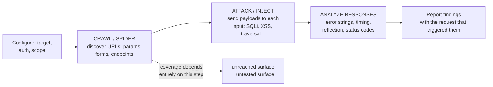
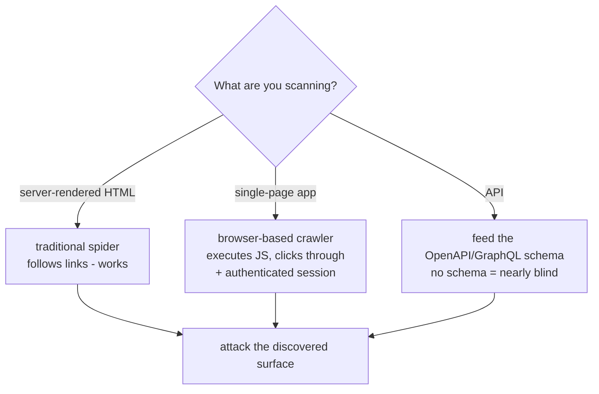
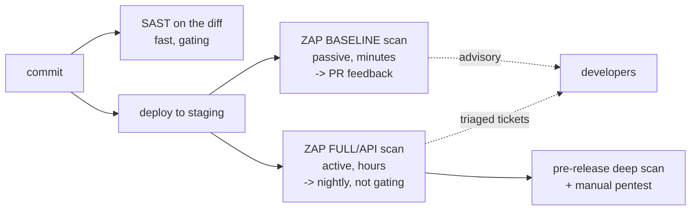
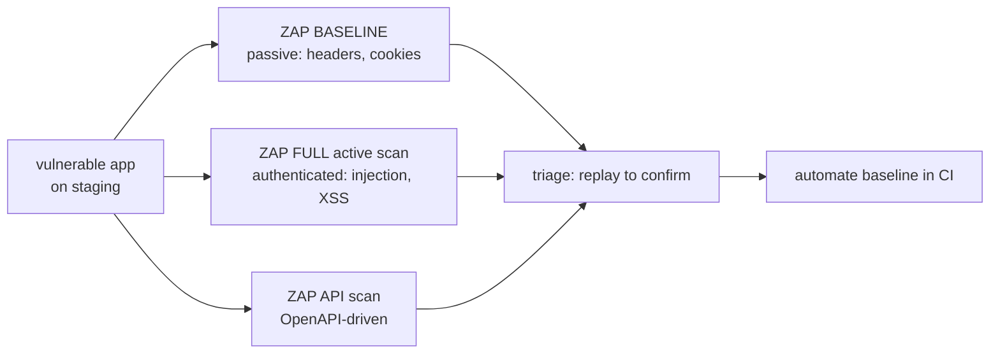

**Level:** Advanced · **Track:** Product Security · **Read time:** 255 min

The last chapter analyzed code *without running it*. This one runs the application and attacks it. **Dynamic Application Security Testing (DAST)** is the automated, black-box counterpart to SAST: it does not read the source, it sends the application malicious requests and watches how it responds — the automated cousin of the penetration test from Chapter 1. Where SAST reasons about what the code *could* do across all paths, DAST observes what the running system *actually does* on the inputs it sends, and that difference is the whole story of this chapter: the two find different bugs, miss different bugs, and a serious program runs both.

The framing that keeps DAST in its place: **it tests the thing you actually ship.** SAST analyzes source in isolation; DAST attacks the deployed application, with its real configuration, its real server, its real TLS setup, its real reverse proxy and its real runtime dependencies all in play. That means DAST finds a class of problems SAST cannot see at all — a misconfigured security header, a debug endpoint left on, a TLS weakness, an authentication flaw that only manifests when the whole stack is assembled — because those are properties of the *running system*, not of any single source file. The price of that realism is DAST's central weakness: it can only test what it can *reach*, and reaching everything in a modern application is genuinely hard.

This chapter covers DAST proper — how a scanner works, what it is good at, its blind spots, and OWASP ZAP as the tool to learn it in — and then the two hybrids that try to get the best of both worlds: **IAST**, which instruments the running application so it can watch code execute *during* testing and report the exact line, combining runtime accuracy with static precision; and, more briefly, **RASP** (runtime protection) and **fuzzing** (input-mutation crash-finding), the two runtime cousins that sit at the edges of the dynamic-testing family. As with SAST, the theme is honest complementarity: no single technique is sufficient, and the mature program layers static, dynamic, and hybrid so each covers the others' blind spots.

## Why This Matters

The complementarity argument is the whole case, and it is worth making concretely rather than as a slogan. SAST reads `app.py` and can prove that a query is parameterized — but it has no idea whether the application is served over TLS, whether the `Strict-Transport-Security` header is set, whether a `/debug` route is exposed in production, or whether the login flow can be bypassed when the session middleware, the load balancer, and the identity provider are all assembled. Those are runtime and configuration properties, invisible to source analysis, and they are exactly where DAST lives. Conversely, DAST sends requests and observes responses — but it cannot see the SQL injection in an admin function it never authenticated into, the dangerous code path behind a feature flag it never toggled, or the vulnerability in error-handling code it never triggered. Each tool is blind precisely where the other sees.

The practical consequence is that a program running *only* SAST has an entire category of exposure — configuration, TLS, headers, deployment-specific auth, whole-stack behavior — that nothing is checking, and a program running *only* DAST misses everything in the code it could not reach. The breaches bear this out: some are pure code bugs SAST could have caught, and some — the exposed admin panel, the missing security header that enabled a session hijack, the debug mode left on in production — are pure runtime issues that only a dynamic test against the real deployment would have found. Understanding *which* tool catches *which* is what lets a product security engineer build a testing program with no silent gaps.

There is also a validation role that makes DAST uniquely valuable in triage. A SAST finding is a *potential* bug — the code pattern is there, but is it actually reachable and exploitable in the running system? DAST answers that by *demonstrating* exploitation against the live app. A finding confirmed by both SAST (the vulnerable code) and DAST (the working exploit) is one you can hand a developer with total confidence — which is the promise of the correlation Part 9 examines.

## Part 1: DAST vs SAST — The Complementarity, Precisely

Pin down exactly how the two differ, because the difference dictates how you use each.

| | SAST (static) | DAST (dynamic) |
|---|---|---|
| Tests | Source code, not running | The running application |
| Vantage | Inside the code, all paths | Outside, black-box, reachable paths only |
| Sees configuration/TLS/headers | No | **Yes** |
| Sees unreached code | **Yes** | No |
| Finds | Injection in code, all branches | Runtime/config issues, reachable exploits |
| False positives | Many (reasons about behavior) | **Fewer** (demonstrates the exploit) |
| False negatives | Misses logic/authz | Misses unreached code |
| Language-dependent | Yes | **No** (tests over HTTP, language-agnostic) |
| When in SDLC | Commit / PR, earliest | Staging / pre-prod, later |
| Proves | The vulnerable code exists | The vulnerability is *exploitable* |

Three consequences worth internalizing:

**DAST has fewer false positives, because it demonstrates rather than reasons.** When DAST reports SQL injection, it is because it sent a payload and observed the tell-tale response — the exploit *worked*. That is far higher confidence than SAST's "this pattern could be a bug," and it is why DAST findings often go straight to a developer without the triage overhead SAST needs. The tradeoff is that DAST's confidence is bounded by what it reached — a clean DAST scan means "nothing found in what I could test," never "the app is clean."

**DAST is language-agnostic.** It speaks HTTP, so it does not care whether the backend is Python, Java, or Go — a major operational advantage in a polyglot shop where SAST needs a different analyzer per language. The same ZAP scan tests them all.

**They belong at different points in the SDLC.** SAST runs on every commit, at the leftmost point (Chapter 3). DAST needs a *running, deployed* application, so it runs later — against a staging or pre-production environment — which is why it "shifts left" less than SAST and why Part 8's integration patterns look different. This is not a flaw; it is the nature of testing a running system, and it is why the two occupy different lifecycle slots rather than competing for one.

The one-line summary to carry: **SAST proves the vulnerable code exists; DAST proves it is exploitable; and each sees exactly where the other is blind.**

## Part 2: How a DAST Scanner Works

A DAST scanner automates the pentester's outer loop from Chapter 1: discover the surface, attack each entry point, analyze the responses. The phases:



**Crawl / spider.** The scanner discovers the attack surface by following links, parsing forms, and enumerating parameters — building the map of URLs and inputs it will attack. **This step determines everything**, because a scanner can only attack what it discovered, and anything it fails to crawl is silently untested. Traditional spidering follows HTML links; modern apps need more (Part 4).

**Attack / inject.** For each discovered input, the scanner sends attack payloads for each vulnerability class it knows — SQL-injection strings, XSS vectors, path-traversal sequences, command-injection metacharacters, and so on. This is a library of payloads applied systematically to every parameter it found.

**Analyze responses.** The scanner decides whether each attack *worked* by examining the response: a database error string means SQL injection; the reflected payload appearing unencoded means XSS; a time delay from a `SLEEP()` payload means blind SQL injection; a directory listing means traversal. This response analysis is where DAST's "it demonstrated the exploit" confidence comes from — and also where its false *negatives* come from, because a bug whose success produces no observable response signal (a blind bug with no timing or error tell) may go undetected.

**Report.** Each finding comes with the exact request that triggered it, so a developer (or you, in triage) can replay it and confirm. That reproducibility is one of DAST's best properties.

The crucial dependency, restated because it governs how you configure a scan: **DAST's coverage is exactly its crawl coverage.** Everything downstream — every attack, every finding — happens only on the surface the crawler found. Improving a DAST program is, more than anything, improving what the scanner reaches, which is the subject of the next two parts.

## Part 3: What DAST Is Good At, and Its Blind Spots

**DAST's strengths** are the runtime and whole-stack issues SAST cannot see:

- **Configuration and deployment issues** — missing security headers (`Content-Security-Policy`, `Strict-Transport-Security`, `X-Content-Type-Options`), verbose error pages, directory listing, exposed `.git` or backup files, debug mode in production.
- **TLS/SSL problems** — weak protocols and ciphers, certificate issues, missing HSTS.
- **Authentication and session issues in the assembled system** — session fixation, missing cookie flags, weak session tokens, login flaws that only appear with the real stack.
- **Injection and XSS that are actually reachable and exploitable** — with a demonstrated payload, not a suspicion.
- **Server and framework version disclosure** and known-vulnerable-version detection.

**DAST's blind spots** are the mirror of SAST's strengths, and they are serious:

- **Unreached code.** Anything the crawler did not discover — an admin function behind authentication it did not have, a route with no link to it, a code path behind a feature flag — is untested. This is the fundamental limit, and it is why a clean scan is not a clean bill of health.
- **Authorization and business logic.** DAST no more understands "this user should not access that object" than SAST does — it does not know the intended access model, so it cannot tell that returning another user's record is wrong (it looks like a successful request). Family 3 is a blind spot for DAST *too*, which is why manual review (Chapter 2) remains irreplaceable.
- **Blind vulnerabilities with no response signal** — a bug whose exploitation produces no error, no timing difference, and no reflected output may not be detected, because the scanner has nothing to observe.
- **It is slow and it can be destructive.** A full scan sends thousands of attacking requests, can take hours, and *can modify or delete data* (it submits forms, it triggers actions) — which is why DAST runs against staging, never production, and why the scope and authentication configuration matter enormously.

The honest summary: **DAST finds what is reachable and observable in the running system, and it is blind to what it cannot reach or observe.** Its blind spots (unreached code, authorization, blind bugs) are precisely why it is a *complement* to SAST and manual review, not a replacement for either.

## Part 4: The Modern-App Problem and API Scanning

Traditional DAST was built for server-rendered HTML apps where spidering links discovered the surface. Modern applications broke that model, and this is the single biggest practical challenge in running DAST today.

**Single-page applications (SPAs).** A React/Angular/Vue app serves a near-empty HTML shell and builds the UI in JavaScript, making its calls to a backend API. A traditional link-following spider sees the shell and almost nothing else — it cannot discover the surface, so it attacks almost nothing. Modern scanners address this with a **browser-based crawler** (driving a real headless browser, executing the JavaScript, clicking through the app) rather than an HTML link parser. Configuring the scanner to use a real browser and to authenticate into the SPA is often the difference between a scan that covers 5% of the app and one that covers most of it.

**APIs — the schema requirement.** An API has no links to crawl at all; there is nothing for a spider to follow. A DAST scanner cannot discover an API's endpoints, parameters, and expected types by crawling — it needs to be *told* the surface, which means it needs the **API schema** (an OpenAPI/Swagger definition, a GraphQL schema, a Postman collection). Feed the scanner the OpenAPI spec and it can enumerate every endpoint and parameter and attack them systematically; without the spec it is nearly blind to the API. This makes **an accurate, complete API schema a prerequisite for API DAST**, and it makes "our OpenAPI spec is out of date" a security problem, not just a documentation one — the endpoints missing from the spec are the endpoints nothing is testing.



**The authenticated-scan problem** cuts across all three. Most of an application's surface — and most of its risk — is *behind login*. A scanner testing only the pre-authentication pages tests the least interesting part. Configuring **authenticated scanning** — giving the scanner valid credentials or a session token, and teaching it to stay logged in (detect and re-authenticate when the session expires, and avoid logging *itself* out by clicking the logout link) — is essential and is one of the fiddliest parts of DAST setup. A DAST program's real coverage is largely a function of how well its authenticated scanning is configured, and getting it right is where much of the setup effort goes.

## Part 5: OWASP ZAP — The Tool to Learn DAST In

**OWASP ZAP (Zed Attack Proxy)** is the leading open-source DAST scanner and the right tool to learn the category in — it is free, scriptable, and covers the full range from a quick passive scan to a full authenticated active scan. Its modes map onto the SDLC integration patterns of Part 8:

- **Baseline scan** — a fast, *passive* scan that spiders the app and reports issues visible without attacking (missing headers, information disclosure, cookie flags). It sends no attack payloads, so it is safe, fast, and CI-friendly — the mode you run on every build. It will not find injection (it does not attack), but it catches the whole class of configuration issues cheaply.
- **Full / active scan** — spiders *and* actively attacks every discovered input with the full payload library. This finds injection and XSS, but it is slow and *destructive*, so it runs against staging, typically nightly or pre-release, never in a fast CI gate and never against production.
- **API scan** — takes an OpenAPI/GraphQL/SOAP definition (Part 4), imports the surface, and actively tests every endpoint. This is how you scan an API, and it requires the schema.

ZAP also provides a **proxy mode** (sit between your browser and the app, see and modify every request — the manual-testing companion, like Burp) and an **automation framework** (a YAML file describing the scan — target, authentication, scan policy, report — run headlessly in CI). The automation framework is what turns ZAP from an interactive tool into a pipeline component, and the lab uses it.

The commercial landscape (Burp Suite Professional's scanner, Invicti, Rapid7 InsightAppSec, and others) offers better crawlers, better authentication handling, and lower false positives, and mature programs often run a commercial scanner for depth alongside ZAP for CI automation. But everything conceptual — crawl, attack, analyze, authenticate, schema-for-APIs — is identical, and ZAP is where you learn it without a license.

## Part 6: IAST — The Instrumented Hybrid

**Interactive Application Security Testing (IAST)** tries to get the best of both static and dynamic by *instrumenting the application from the inside while it runs under test*. An agent runs inside the application (via the language runtime, a Java agent, a Python/Node hook), watching code execute during functional or DAST testing, so it sees both the *runtime behavior* (like DAST) and the *exact code path and line* (like SAST).

The mechanism and why it is compelling:

- The IAST agent sits inside the app during QA testing (whether that testing is a DAST scan, an automated functional test suite, or a human clicking around). As requests flow through, the agent watches tainted data move through the actual executing code.
- When tainted data reaches a dangerous sink *during a real request*, IAST reports it — with the runtime confidence of DAST (it happened on a real execution, so it is real and reachable) *and* the code-level precision of SAST (the exact file, line, and data-flow path).
- Because it observes real executions, IAST has **very low false positives** (it saw the bug actually happen) *and* pinpoints the code (unlike DAST, which only knows the request). It effectively combines the two prior tools' strengths.

The catch, and why IAST is not simply "the answer":

- **Coverage equals test coverage.** IAST only sees code that the tests *exercise*. If your functional/QA tests do not touch a code path, IAST does not see its bugs — so IAST's completeness is bounded by how good your testing is. It rides on existing tests rather than crawling on its own.
- **It requires instrumentation** — an agent in the runtime, which means language-specific support, a performance overhead, and a deployment change. Not every stack has good IAST support.
- **It is largely a commercial category** (Contrast Security, and modules from the larger vendors); the open-source story is thinner than for SAST/DAST.

Where IAST fits: it is most powerful in organizations with **strong automated test suites**, because it turns every functional test run into a security test for free — the QA suite exercises the app, and IAST reports any vulnerability that fires along the way, precisely located. It is the natural bridge between the SAST and DAST worlds, and it is the reason "run your existing tests with an IAST agent attached" is one of the higher-leverage dynamic-testing moves available to a team that already tests well.

## Part 7: The Runtime Cousins — RASP and Fuzzing

Two more members of the runtime-security family, at the edges of this chapter's scope.

**RASP (Runtime Application Self-Protection)** is IAST's *protection* cousin: the same inside-the-app instrumentation, but at *production* runtime and acting to **block** attacks rather than to report them during testing. A RASP agent inside the running app watches requests and, when it sees an attack reaching a dangerous operation (a SQL injection payload actually flowing to a query), blocks *that request* — with far more context than a WAF, because it sees the code execution, not just the HTTP traffic. RASP is a *mitigation* (a runtime control), not a *testing* tool — it does not find bugs to fix, it stops exploitation of bugs that exist. It belongs in the defense-in-depth conversation (Notebook 45 Chapter 6) as a compensating control, useful for buying time on a known-vulnerable legacy app, and it is explicitly *not* a substitute for fixing the code.

**Fuzzing** is the input-mutation cousin: bombard the application (or a specific function, parser, or API) with malformed, unexpected, and randomly-mutated inputs and watch for crashes, hangs, memory errors, and assertion failures. It is the dynamic technique that finds the bugs *structured* testing misses — the parser that crashes on a malformed length field, the memory-safety bug (Notebook 45 Chapter 7) that a specific byte sequence triggers. Modern **coverage-guided fuzzing** (AFL++, libFuzzer, and Go's built-in fuzzing) instruments the target to steer mutation toward new code paths, making it dramatically more effective than random input. Fuzzing is the workhorse of memory-safety bug discovery and is central to Notebook 36; in the web/API context, API fuzzing (mutating requests against the schema) finds input-handling bugs that a fixed payload library misses. Its place in the SDLC: run it continuously against parsers, deserializers, and any code handling untrusted binary/structured input, and against APIs as a complement to DAST's fixed payloads.

Neither RASP nor fuzzing replaces DAST; both extend the runtime-testing family — RASP toward production *protection*, fuzzing toward *finding the inputs* that break things.

## Part 8: Integrating Dynamic Testing Into the SDLC

Because DAST needs a *running, deployed* application and a full scan is slow and destructive, its pipeline integration looks nothing like SAST's per-commit gate. The patterns:



- **Baseline (passive) scan on each staging deploy.** Fast enough (minutes) to run on every deploy to a preview/staging environment and give near-PR-time feedback on configuration and header issues. This is the DAST equivalent of a fast gate — but advisory, because even passive findings need context.
- **Full (active) scan nightly or on a schedule.** The slow, destructive, thorough scan runs against a dedicated staging environment overnight, and its findings become triaged tickets rather than a build block. Nightly cadence matches the scan's runtime and its data-mutating nature.
- **API scan whenever the API changes**, driven by the (kept-current) OpenAPI spec.
- **Deep scan plus manual pentest before a major release.** The thorough, human-in-the-loop pass for high-risk releases.

**Why DAST rarely blocks a build**, stated plainly because it is a common mistake to try: full scans are too slow for a fast gate, they need a deployed environment a commit does not have, and they are destructive. Forcing DAST into a blocking per-commit gate produces slow, flaky builds that developers route around — the same trust-destroying failure as noisy SAST (Chapter 3 Part 4). The right model is **DAST as continuous feedback against staging, not a commit gate**: baseline advisories fast, full scans nightly, findings triaged into the backlog. The only DAST that reasonably gates is a *narrow* baseline check for a critical regression (e.g., a security header that must never disappear) against a preview deploy.

The deployment prerequisite is worth naming as a program dependency: DAST requires a **stable, representative, seeded staging environment** with authentication working and realistic (non-production) data. Standing up and maintaining that environment is often the hardest part of a DAST program — more than the scanner itself — and a program that lacks a good staging environment will have a weak DAST program regardless of the tool.

## Part 9: Correlating DAST and SAST, and Triaging Dynamic Findings

**Correlation** — matching a DAST finding to the SAST finding for the same underlying bug — is an appealing idea with real but limited payoff.

The promise: when DAST demonstrates an exploitable SQL injection *and* SAST identifies the exact vulnerable line for the same endpoint, you have a finding that is both *confirmed exploitable* (DAST) and *precisely located* (SAST) — the highest-confidence, most-actionable finding possible, handed to a developer with the exploit and the line together. A finding corroborated by both tools is one nobody argues with. This is, incidentally, exactly what IAST (Part 6) produces natively in a single tool, which is part of IAST's appeal — it does the correlation internally.

The limits, which keep expectations honest: correlation is *hard* because DAST knows an endpoint and a request while SAST knows a file and a line, and reliably matching "this HTTP request" to "this source location" across a real application is imperfect — the two tools speak different languages about the same code. Many findings appear in only one tool (DAST's config issues have no SAST equivalent; SAST's unreached-code bugs have no DAST equivalent — *by design*, since that non-overlap is the whole point of running both). So correlation *enriches* the findings that happen to overlap; it does not unify the two toolsets, and a program that expects clean one-to-one correlation across everything will be disappointed. Treat overlap as a confidence bonus where it occurs, not as the organizing principle.

**Triaging dynamic findings** is generally *easier* than triaging SAST, because DAST demonstrated the exploit:

- **Confirm by replaying the request.** Every DAST finding includes the triggering request; replay it and see the exploit work (or not). This is fast, concrete confirmation — a major advantage over SAST's "is this reachable?" uncertainty.
- **Watch for the scanner's own false positives.** DAST has fewer than SAST but not zero — a reflected payload that is actually in a safe context, a "vulnerability" that is really the scanner misreading a response. Replay-to-confirm catches these.
- **Assess real-world exploitability and reachability** (Chapter 1 Part 8): a finding on an internal-only staging endpoint, or one requiring an unrealistic precondition, may be lower risk than its raw severity suggests.
- **Rank and route** with the same risk model as every other finding (impact × exploitability × reachability), into the backlog with the reproduction request attached.

The one-line contrast: **SAST triage asks "is this real and reachable?"; DAST triage asks "did the exploit actually work when I replayed it?" — and the second question is faster and more certain to answer.**

## Part 10: Hands-On Lab — ZAP Baseline, Authenticated, and API Scans

### 10.1 What we are building

Run OWASP ZAP against a deliberately vulnerable app in the three modes of Part 5 — baseline (passive), full (active, authenticated), and API (schema-driven) — triage the output, and automate a baseline scan for CI.



Docker (for ZAP) and Python 3 (for the target).

### 10.2 A target with runtime and code issues

```bash
mkdir -p ~/dast-lab && cd ~/dast-lab
cat > target.py <<'PY'
from flask import Flask, request, jsonify
app = Flask(__name__)

@app.after_request
def headers(r):
    # deliberately MISSING security headers -> baseline (passive) scan should flag
    r.headers["Server"] = "Flask/leaky-1.0"     # version disclosure
    return r

@app.route("/")
def index():
    return '<a href="/search?q=x">search</a> <a href="/api/openapi.json">api</a>'

@app.route("/search")
def search():
    q = request.args.get("q", "")
    # reflected XSS -> active scan should demonstrate
    return f"<h1>Results: {q}</h1>"

@app.route("/api/user")
def api_user():
    uid = request.args.get("id", "")
    # SQL-ish error reflection -> active scan tell
    if "'" in uid:
        return ("SQL error near '" + uid + "'", 500)
    return jsonify(id=uid, name="demo")

@app.route("/api/openapi.json")
def spec():
    return jsonify({
      "openapi":"3.0.0","info":{"title":"demo","version":"1.0"},
      "paths":{"/api/user":{"get":{"parameters":[
        {"name":"id","in":"query","required":True,"schema":{"type":"string"}}],
        "responses":{"200":{"description":"ok"}}}}}})

if __name__ == "__main__":
    app.run(host="0.0.0.0", port=8000)
PY
pip install flask > /dev/null
python3 target.py & sleep 2
echo "target up on :8000"

# Sample output:
# target up on :8000
```

### 10.3 The baseline (passive) scan

```bash
# ZAP baseline: passive only -- fast, safe, CI-friendly. Finds config/header issues.
docker run --rm --network host ghcr.io/zaproxy/zaproxy:stable \
  zap-baseline.py -t http://localhost:8000 -I 2>/dev/null | grep -E "WARN|FAIL|PASS" | head

# Sample output (abbreviated):
# WARN-NEW: Content Security Policy (CSP) Header Not Set [10038]
# WARN-NEW: Missing Anti-clickjacking Header [10020]
# WARN-NEW: Strict-Transport-Security Header Not Set [10035]
# WARN-NEW: X-Content-Type-Options Header Missing [10021]
# WARN-NEW: Server Leaks Version Information via "Server" HTTP Header [10036]
# FAIL-NEW: 0    WARN-NEW: 5    ...
```

Five findings in seconds, all **runtime/configuration** issues (missing headers, version disclosure) — the class SAST *cannot* see (Part 3). The `-I` flag makes warnings non-failing; a CI baseline gate would fail only on the issues you choose to block on.

### 10.4 The full (active) scan

```bash
# ZAP full scan: spiders AND attacks. Slow, destructive -> staging only.
docker run --rm --network host ghcr.io/zaproxy/zaproxy:stable \
  zap-full-scan.py -t http://localhost:8000 -I 2>/dev/null | grep -E "XSS|SQL|WARN-NEW" | head

# Sample output (abbreviated):
# WARN-NEW: Cross Site Scripting (Reflected) [40012]  -- /search?q=<script>...
# WARN-NEW: SQL Injection [40018]                     -- /api/user?id='
# ...
```

The active scan *demonstrated* the reflected XSS and the SQL-injection tell by sending payloads and observing the responses — DAST's "it proved the exploit" confidence (Part 1). Note this took far longer than the baseline and sent attacking traffic, which is why it is a nightly-against-staging job, not a commit gate (Part 8).

### 10.5 The API scan

```bash
# ZAP API scan: driven by the OpenAPI spec, not by crawling (Part 4).
docker run --rm --network host ghcr.io/zaproxy/zaproxy:stable \
  zap-api-scan.py -t http://localhost:8000/api/openapi.json -f openapi -I \
  2>/dev/null | grep -E "SQL|WARN-NEW|endpoints" | head

# Sample output (abbreviated):
# Imported 1 path from the OpenAPI definition
# WARN-NEW: SQL Injection [40018]  -- GET /api/user  param: id
# ...
```

The scanner found and attacked `/api/user` *because the OpenAPI spec told it the endpoint and the `id` parameter existed* — there was no link to crawl. This is Part 4's lesson made concrete: **no schema, no API coverage.** An endpoint missing from the spec would have been completely untested.

### 10.6 Automate a baseline gate in CI

```yaml
# .github/workflows/dast-baseline.yml -- fast passive scan on each staging deploy.
name: DAST Baseline
on: [deployment_status]
jobs:
  zap-baseline:
    runs-on: ubuntu-latest
    steps:
      - name: ZAP Baseline Scan
        uses: zaproxy/action-baseline@v0.12.0
        with:
          target: 'https://staging.example.com'
          # fail the job only on the rules we choose to gate on (e.g. missing HSTS),
          # everything else is advisory -- the "advisory early, block narrow" model
          fail_action: true
          rules_file_name: '.zap/rules.tsv'
```

```bash
# .zap/rules.tsv -- gate policy: FAIL only on HSTS-missing; WARN (advisory) the rest.
printf "10035\tFAIL\tStrict-Transport-Security must be present\n10038\tWARN\tCSP advisory\n" \
  > /tmp/rules.tsv && cat /tmp/rules.tsv

# Sample output:
# 10035  FAIL  Strict-Transport-Security must be present
# 10038  WARN  CSP advisory
```

This is Part 8's model in practice: the passive baseline runs on every staging deploy and *blocks narrowly* on a single critical regression (HSTS disappearing), while everything else is advisory — fast, trusted, and un-route-around-able because it fires rarely and correctly.

### 10.7 Extending the lab

Configure **authenticated scanning** (Part 4): add a login route to the target, give ZAP a session token or a form-auth script, and confirm it reaches and tests a behind-login endpoint it otherwise misses; run the same app through a SAST tool (Chapter 3) and compare — the header/config findings appear only in DAST, the code-injection findings appear in both, proving the complementarity of Part 1; add an endpoint to the app but *not* to the OpenAPI spec and watch the API scan miss it entirely; and add an IAST-style experiment by running the app's own test suite with a coverage tool to see how much surface your tests actually exercise (the coverage ceiling of Part 6).

## Part 11: Common Pitfalls

**Running DAST as a per-commit blocking gate.** Full scans are too slow, need a deployed environment, and are destructive. Baseline advisories fast, full scans nightly against staging, findings triaged — not a commit gate.

**Running DAST against production.** Active scans send attacks and *mutate data* — they submit forms and trigger actions. Staging only, with seeded non-production data.

**A clean scan mistaken for a clean app.** DAST tests only what it *reached*. A clean scan means "nothing found in what I could crawl and attack," never "the app is secure." Unreached code, authorization, and blind bugs are all invisible.

**Not configuring authenticated scanning.** Most of the app and most of the risk is behind login. An unauthenticated scan tests the least interesting surface. Getting authentication right is where most of DAST's real coverage comes from.

**Scanning a SPA with a link-following spider.** It sees the empty shell and tests almost nothing. Use a browser-based crawler that executes the JavaScript.

**Scanning an API without a schema.** There is nothing to crawl; the scanner is nearly blind. Feed it the OpenAPI/GraphQL spec — and keep the spec current, because endpoints missing from it are untested.

**Expecting DAST to find authorization or business-logic bugs.** It does not understand the intended access model any more than SAST does. Family 3 is a blind spot for DAST too — manual review owns it.

**Relying on SAST/DAST correlation to unify everything.** Much of each tool's value is exactly the *non-overlap*. Correlation enriches the findings that coincide; it does not merge the toolsets.

**No staging environment, or a bad one.** DAST's real prerequisite is a stable, representative, authenticated, seeded staging environment. A weak environment means a weak DAST program regardless of the scanner.

**Treating RASP as a fix.** RASP blocks exploitation of bugs that still exist; it is a compensating control, not a substitute for fixing the code.

## Final Revision / Summary

- **DAST** tests the *running application* by attacking it over HTTP — the automated black-box counterpart to SAST and the tool version of a pentest. It observes what the system *actually does*; SAST reasons about what the code *could* do.
- **Complementarity is the whole point.** DAST sees runtime/config/TLS/header issues and whole-stack auth flaws that SAST cannot; SAST sees unreached code that DAST cannot. DAST has **fewer false positives** (it demonstrates the exploit) and is **language-agnostic** (speaks HTTP). It runs *later* in the SDLC because it needs a deployed app. **SAST proves the vulnerable code exists; DAST proves it is exploitable.**
- A scanner works by **crawl → attack → analyze → report**, and **coverage equals crawl coverage** — anything not discovered is silently untested.
- DAST is **good at** configuration/header/TLS issues, exposed endpoints, reachable-and-observable injection/XSS with a demonstrated payload. Its **blind spots** are unreached code, **authorization and business logic** (a blind spot for DAST *too*), blind bugs with no response signal, and it is **slow and destructive** (staging only).
- **The modern-app problem** is the biggest practical challenge: SPAs need a **browser-based crawler** (not a link spider), APIs need the **schema** (OpenAPI/GraphQL) because there is nothing to crawl, and **authenticated scanning** is essential because most surface and risk is behind login. Real coverage is largely a function of getting these right.
- **OWASP ZAP** is the tool to learn in: **baseline** (passive, fast, CI-safe — finds config issues), **full/active** (spiders and attacks — finds injection, slow, destructive, staging-only), **API** (schema-driven), plus a proxy mode and an automation framework for CI.
- **IAST** instruments the running app to watch code execute during testing, combining DAST's runtime accuracy (real, reachable) with SAST's code-level precision (exact line) and **very low false positives** — but its **coverage equals your test coverage**, and it needs a runtime agent. Best where automated test suites are strong.
- **RASP** is IAST's production *protection* cousin (blocks attacks at runtime — a compensating control, not a testing tool or a fix); **fuzzing** mutates inputs to find crashes and memory-safety bugs (coverage-guided; central to Notebook 36; complements DAST's fixed payloads).
- **Integration**: DAST **rarely blocks a build** — baseline (passive) advisories on each staging deploy, full/active scans **nightly against staging**, API scans on API change, deep scan + manual pentest before major releases. The real prerequisite is a **stable, authenticated, seeded staging environment**.
- **Correlation** with SAST enriches the findings that overlap (confirmed-exploitable + precisely-located, which IAST produces natively) but does not unify the toolsets — much of each tool's value is the non-overlap. **DAST triage is easier**: replay the triggering request to confirm the exploit actually works.

## Cheat Sheet / Quick Reference

**SAST vs DAST**

```
SAST: source, all paths, config-blind, many FPs, language-specific, earliest, proves code exists
DAST: running app, reachable only, sees config/TLS/headers, fewer FPs, language-agnostic,
      later (needs deploy), proves EXPLOITABLE
each is blind exactly where the other sees. run BOTH.
```

**How a scanner works**

```
crawl/spider -> attack/inject -> analyze responses -> report (with the request)
COVERAGE = CRAWL COVERAGE. unreached = untested.
```

**DAST blind spots**

```
unreached code | authorization + business logic (blind for DAST too)
blind bugs (no response signal) | slow + destructive (STAGING ONLY)
```

**Modern-app coverage**

```
SPA -> browser-based crawler (executes JS), not a link spider
API -> feed the OpenAPI/GraphQL SCHEMA (nothing to crawl); keep it current
ALL -> configure AUTHENTICATED scanning (most surface is behind login)
```

**ZAP modes -> SDLC**

```
baseline (passive)  -> every staging deploy, fast, CI-safe (config/headers)
full (active)       -> nightly vs staging (injection/XSS), slow, destructive
api (schema-driven) -> on API change
proxy / automation framework -> manual testing / CI
```

**The runtime family**

```
DAST   : attack from outside, black-box
IAST   : agent inside during TEST -> runtime + exact line, low FP; coverage = test coverage
RASP   : agent inside in PROD -> BLOCKS attacks (mitigation, not testing, not a fix)
FUZZING: mutate inputs -> crashes + memory-safety bugs (coverage-guided)
```

**Integration rule**

```
DAST rarely gates a build (too slow, needs deploy, destructive)
-> continuous feedback vs STAGING: baseline fast+advisory, full nightly, triage into backlog
prerequisite: a stable, authenticated, seeded staging environment
```

## Practice Labs & Resources

**Tools and docs**
- **OWASP ZAP** — install it, work the baseline/full/API scans and the Automation Framework; the ZAP documentation and the `zaproxy/action-baseline` GitHub Action.
- **Burp Suite** (Community for manual, Professional for the scanner) — the commercial counterpart; its scanner and crawler are the industry benchmark.
- **OWASP** Web Security Testing Guide (WSTG) — what the payloads DAST sends are actually testing.
- **AFL++ / libFuzzer / Go fuzzing** for the fuzzing cousin; **Contrast** docs for the IAST model.

**Hands-on**
- Extend the lab: configure authenticated scanning and confirm it reaches a behind-login endpoint; run SAST over the same app and compare the non-overlapping findings; drop an endpoint from the OpenAPI spec and watch the API scan miss it; measure your test suite's coverage to see IAST's ceiling.
- Run ZAP against an intentionally vulnerable app (OWASP Juice Shop, DVWA) in all three modes and triage the output by replaying the triggering requests.
- Stand up a seeded staging environment for a small app and wire a nightly full scan — the real skill is the environment, not the scanner.

**Deliberate practice**
- For every finding, practice the DAST triage motion: replay the request, confirm the exploit, assess reachability. It is faster and surer than SAST triage.
- Take a SPA and a plain HTML app and scan both with a link spider; the coverage difference is Part 4's lesson first-hand.
- Map your own program's coverage: what does SAST cover, what does DAST cover, and what (authorization, logic) does *neither* cover and therefore needs manual review?

**Further reading**
- Chapters 1–3 (manual review and SAST — the static and human counterparts DAST complements) and Chapter 7 (wiring dynamic testing into the full pipeline).
- Notebook 36 for fuzzing and memory-safety bug discovery in depth.
- The OWASP DAST/IAST guidance and vendor documentation for authenticated-scan and SPA-crawling configuration, which is where real DAST programs succeed or fail.

---

*Also on [Praneeth's portfolio](https://ping-praneeth.vercel.app/notebook/secure-code-review-sast-sca/04-dast-and-iast-in-the-sdlc-runtime-scanning-and-feedback-loops), with comments and the latest edits.*
