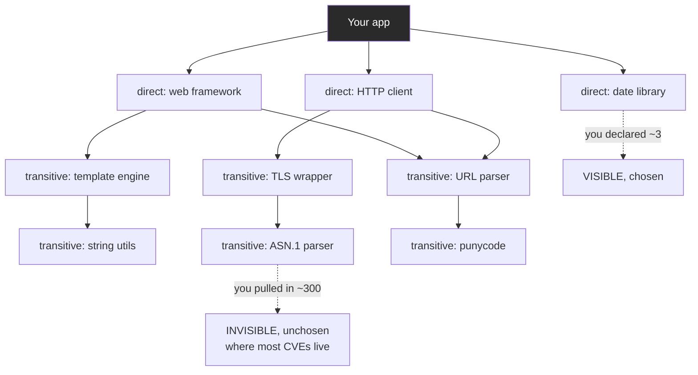
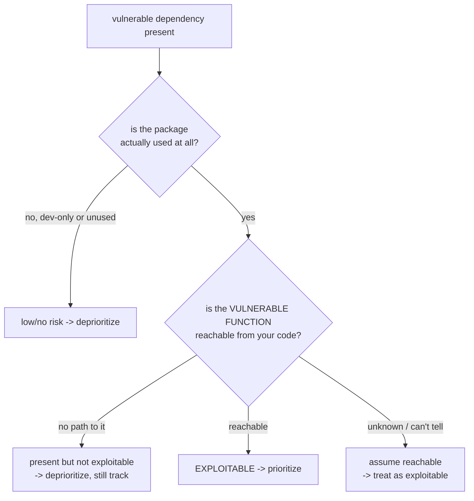
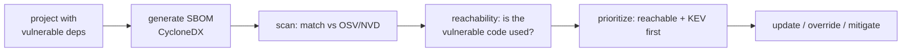

**Level:** Advanced · **Track:** Product Security · **Read time:** 255 min

Every chapter so far has been about *your* code — reviewing it, scanning it, testing it. This chapter is about the uncomfortable truth that **most of your application is not your code.** A modern application is a thin shell of first-party logic wrapped around a vast body of third-party dependencies — frameworks, libraries, utilities, and their dependencies, and *their* dependencies, recursively — and by every measure that body is 80–90% of what you ship. You reviewed the 10%. Nobody on your team reviewed the 90%. That 90% is your attack surface too, and securing it is a different discipline from everything in the prior chapters, because you cannot fix code you did not write and often cannot even read.

**Software Composition Analysis (SCA)** is that discipline: identifying every third-party component in your application and matching it against databases of known vulnerabilities, so you learn that the version of a library you depend on has a published, exploitable flaw. It is conceptually simple — an inventory joined against a vulnerability list — and operationally deep, because modern dependency trees are enormous, mostly *transitive* (dependencies of your dependencies, which you never chose and often cannot see), and because "this dependency has a known CVE" is not the same as "you are exploitable," a gap that reachability analysis tries to close.

But SCA against *known* vulnerabilities is only half the chapter. The other half is the **active-attacker** dimension of the software supply chain: dependency confusion, typosquatting, and outright malicious packages — where the threat is not an accidental bug in an honest library but a deliberate backdoor slipped into the dependency graph. The landmark incidents of the last decade — event-stream, SolarWinds, Log4Shell, and the xz-utils backdoor — are the case studies, and each taught the industry something it did not want to learn about trusting code it did not write. And underneath all of it sits the **Software Bill of Materials (SBOM)**, the ingredient list that makes any of this possible and that regulation is now making mandatory — because you cannot secure, or even assess, an inventory you do not have.

## Why This Matters

The numbers make the case on their own. When 80–90% of your shipped code is third-party, the probability that *some* component in your tree has a known vulnerability at any given moment approaches certainty — a typical application depends, transitively, on hundreds to thousands of packages, and the vulnerability databases add thousands of entries a year. The question is never *whether* you have vulnerable dependencies; it is *which*, *how exploitable*, and *how fast you can respond*. A team that cannot answer those quickly is a team that will be breached through a dependency, because attackers scan for known-vulnerable versions at internet scale the moment a CVE drops.

Log4Shell (December 2021) is the incident that made this visceral for every engineering organization on earth. A critical remote-code-execution vulnerability in Log4j — a logging library so ubiquitous it was in effectively every Java application — turned into a global fire drill where the first and hardest question for most companies was simply *do we even use it, and where?* The organizations that had an SBOM answered in minutes; the ones that did not spent weeks grepping build files across every repository, and some never got a complete answer. The lesson was not "patch faster"; it was "you cannot patch what you cannot find," and it drove SBOM from a niche idea to a regulatory requirement (Part 6).

The deeper reason this matters is that the supply chain is where the *attacker* has moved. Directly attacking a hardened target is expensive; compromising a widely-used dependency that the target pulls in automatically is a force multiplier — one poisoned package reaches thousands of downstream victims. SolarWinds and xz-utils were exactly this: patient, sophisticated compromises of the *build and dependency pipeline* rather than of any single target. For a product security engineer, this means dependency security is no longer a hygiene checkbox; it is a primary threat, and the discipline of this chapter is a primary defense.

## Part 1: Direct and Transitive Dependencies — Where the Risk Actually Lives

Your dependencies come in two kinds, and the distinction is the key to understanding where dependency risk concentrates.

- **Direct dependencies** are the ones *you* declared — the libraries in your `package.json`, `requirements.txt`, `pom.xml`, or `go.mod`. You chose them, you know they are there, and you can see them.
- **Transitive dependencies** are the dependencies *of your dependencies*, pulled in automatically and recursively. You did not choose them, you may not know they exist, and they typically outnumber your direct dependencies by a large factor.



The security reality that follows: **transitive dependencies are the larger and less visible risk.** You might declare a dozen direct dependencies and end up with several hundred transitive ones, and the vulnerability is far more likely to be in one of the hundreds you never chose than in the dozen you did. Worse, transitive vulnerabilities are harder to *fix*, because you do not control the vulnerable package directly — you depend on it through an intermediary that may pin an old version, and fixing it may require the intermediary to update first (the transitive-fix problem, Part 9).

This is also why *manual* dependency management fails completely: no human can track the security state of several hundred transitively-pulled packages that change with every `npm install`. The invisibility of the transitive tree is the whole reason SCA tools and SBOMs exist — they make the unchosen, unseen 90% visible, which is the prerequisite for securing it. When you read "we have a vulnerable dependency," assume until proven otherwise that it is transitive, because statistically it is.

## Part 2: What SCA Does — Inventory Joined Against Known Vulnerabilities

SCA is, at its core, two operations: **identify every component** (build the inventory, Part 6's SBOM), and **match each against databases of known vulnerabilities.** The mechanics:

**Identification.** The tool reads your dependency manifests and lockfiles (`package-lock.json`, `poetry.lock`, `go.sum`, etc.) to enumerate every direct and transitive component and its exact version. Lockfiles are essential here (Part 8): they record the *precise* resolved versions of the entire tree, so the SCA tool knows you have `lodash@4.17.15` specifically, not "some lodash." Some tools also fingerprint compiled artifacts and container image layers to catch dependencies not in a manifest.

**Matching.** Each identified component-and-version is looked up against vulnerability databases. The ecosystem:

- **CVE / NVD** — the National Vulnerability Database, the canonical CVE feed. Authoritative but sometimes slow and coarse (imprecise version ranges).
- **GHSA** — GitHub Security Advisories, often faster and more precise for open-source packages, with ecosystem-specific version data.
- **OSV** — the Open Source Vulnerabilities database (Google), designed *for* automated SCA: machine-readable, precise about which package versions are affected, aggregating many ecosystem sources. OSV is increasingly the backbone of modern SCA because it answers exactly the question a tool asks — "is *this version* of *this package* vulnerable?"
- **Vendor and commercial databases** — Snyk and others maintain their own curated databases that often include advisories before they reach NVD, which is part of what a commercial SCA tool sells.

The output is a list of your components that have known vulnerabilities, each with a CVE/GHSA id, a severity, the affected and fixed version ranges, and (in good tools) the *dependency path* showing how you pulled the vulnerable package in — which is what tells you whether it is direct (you fix it) or transitive (Part 9's harder problem).

The conceptual simplicity — inventory joined against a vulnerability list — is why SCA has *low false positives compared to SAST*: it is not reasoning about your code's behavior (Chapter 3's undecidability), it is matching a version string against a database. If you have `log4j-core@2.14.1` and the database says versions `< 2.15.0` are vulnerable to CVE-2021-44228, that match is a fact, not an inference. The false positives that *do* exist come from a different place — the gap between "vulnerable version present" and "actually exploitable," which is the subject of Part 3.

## Part 3: Reachability — A Vulnerable Dependency Is Not an Exploitable One

The central nuance of SCA, and the source of most of the noise a naive deployment produces: **having a vulnerable dependency does not mean you are exploitable.** A library can contain a critical CVE in a function *your application never calls*, and if the vulnerable code path is unreachable from your code, the CVE — however severe in the abstract — is not exploitable *in your application*.

This creates the same signal-to-noise problem SAST has (Chapter 3 Part 4), in a new form. A basic SCA tool reports *every* known vulnerability in *every* dependency, which for a large tree can be hundreds of findings, most of them in transitive packages, many of them in code paths you never touch. Developers drown in it, learn to ignore it, and the one that *is* reachable gets lost — the exact trust-destroying failure of Chapter 3, replayed for dependencies.

**Reachability analysis** is the response: determine whether your application can actually reach the vulnerable function in the dependency. The levels of sophistication:



- **Presence only** (basic): the vulnerable version is in the tree. Highest noise.
- **Usage** (better): is the package actually imported and used, or is it a dev-only or unused dependency? A vulnerability in a build-time-only tool is a different risk from one in a runtime library on the request path.
- **Function-level reachability** (best): does a call path exist from your code to the *specific vulnerable function*? This is where commercial SCA (Snyk, in particular) adds real value — it dramatically cuts the noise by telling you which of the hundred findings are actually reachable, turning an unusable flood into a short, prioritized list.

The discipline this implies: **prioritize by reachability, not by raw CVE severity.** A "critical" CVE in an unreachable code path is lower *risk* than a "medium" one on your main request path — the same reachability-over-severity lesson from Chapter 1 Part 8 and Chapter 8's KEV/EPSS, now applied to dependencies. But note the honest caveat: reachability analysis is imperfect (dynamic dispatch, reflection, and configuration-driven code paths make "reachable" undecidable in general — Chapter 3's ghost again), so when reachability is *unknown*, the safe default is to treat it as reachable. Use reachability to *prioritize* the flood, not to *dismiss* findings you are unsure about.

## Part 4: The Active-Attacker Dimension — Malicious Packages

Everything so far concerns *accidental* vulnerabilities — honest bugs in honest libraries, catalogued as CVEs. But the supply chain has an *adversarial* dimension that SCA-against-CVEs does not cover, and it is growing fast: packages that are malicious *by design*.

The main techniques:

**Typosquatting.** An attacker publishes a malicious package with a name a hair's breadth from a popular one — `python-requests` vs `requests`, `electorn` vs `electron`, `crossenv` vs `cross-env` — betting on a developer's typo or copy-paste error. Install the wrong one and you have run the attacker's code (via install scripts, Notebook 45 Chapter 7) on your build machine. These appear and are taken down constantly across npm and PyPI.

**Dependency confusion.** A subtler and more dangerous attack (Alex Birsan's 2021 research demonstrated it against dozens of major companies). If your organization uses *internal* packages with a private registry, an attacker publishes a package with the *same name* but a *higher version number* on the *public* registry. Misconfigured package managers, seeing a higher version publicly, pull the attacker's public package instead of your internal one — automatically, on the next build. The fix is registry configuration (scoping, namespace reservation, explicit source pinning) so internal names never resolve publicly.

**Malicious updates to legitimate packages.** An attacker gains control of a real, trusted package — by compromising the maintainer's account, or by socially engineering their way into maintainer status — and ships a malicious version. Because it is a *real* package that thousands already depend on, the backdoor propagates automatically to everyone who updates. This is the event-stream and xz-utils pattern (Part 5), and it is the hardest to defend against because the package is legitimate right up until it is not.

**Protestware and sabotage.** A maintainer deliberately breaks or weaponizes their own package (the `node-ipc` and `colors`/`faker` incidents), which is a reliability and trust problem even when not classically "malicious."

The key insight: **these are invisible to CVE-based SCA**, because a brand-new malicious package or a fresh malicious update has no CVE yet — the whole point is that it is novel. Defending against them needs different controls: dependency pinning and lockfiles with integrity hashes (Part 8) so an unexpected package or version is rejected, install-script scrutiny (Notebook 45 Chapter 7), private-registry configuration against confusion, delaying adoption of brand-new versions (so the community catches malice first), and behavioral/anomaly scanning that some tools now offer. SCA covers *known accidental* bugs; supply-chain *attack* defense is a broader program.

## Part 5: The Landmark Incidents

Each major supply-chain incident taught the industry a specific, expensive lesson. Knowing them is knowing why the controls exist.

| Incident | Year | What happened | The lesson |
|---|---|---|---|
| **event-stream** | 2018 | A popular npm package was handed to a new "maintainer" who added a transitive dependency that stole bitcoin wallets | Maintainer trust is transferable and exploitable; transitive deps hide malice |
| **SolarWinds** | 2020 | Attackers compromised the *build pipeline* and inserted a backdoor into signed Orion updates, reaching ~18,000 orgs | The build system is a target; a signed artifact is only as trustworthy as the pipeline that built it |
| **Log4Shell** | 2021 | Critical RCE in ubiquitous Log4j; the crisis was *finding* every use of it | You cannot patch what you cannot find -> SBOM became mandatory |
| **Dependency confusion** | 2021 | Birsan pulled attacker packages into Apple, Microsoft, and others via public-registry name collisions | Internal names must never resolve to the public registry |
| **xz-utils** | 2024 | A multi-year social-engineering campaign made a malicious actor a co-maintainer, who inserted a subtle SSH backdoor caught almost by accident | Patient human compromise of maintainership; open-source maintainer burnout is a security problem |

The through-lines across all five: **trust in the supply chain is transitive and fragile** (you trust a package, which means trusting its maintainers, its build pipeline, and its own dependencies — a chain any link of which can break); **the build and distribution pipeline is itself a high-value target** (SolarWinds); **ubiquity is a vulnerability** (Log4Shell — the more universal a component, the bigger its blast radius); and **the human maintainers are an attack surface** (event-stream, xz-utils — under-resourced volunteers maintaining critical infrastructure are a target for both account compromise and patient social engineering). These are not abstract; they directly justify SBOMs (find fast), pinning and integrity hashes (detect tampering), pipeline hardening (Notebook 46 Chapter 7), and the general posture of not blindly trusting the tree.

## Part 6: The SBOM — The Inventory That Makes It All Possible

You cannot secure what you cannot see, and the **Software Bill of Materials** is what makes the software supply chain visible. An SBOM is a formal, machine-readable inventory of every component in a piece of software — like the ingredient list on food packaging — with each component's name, version, supplier, and relationship to the others.

Why it is foundational: every capability in this chapter *depends* on having an accurate inventory. SCA matching needs to know what components exist. Log4Shell response needed to know where Log4j was. License compliance (Part 7) needs the component list. Incident response to any future dependency vulnerability needs to answer "are we affected, and where" in minutes rather than weeks. The SBOM is that answer, precomputed.

The two dominant formats:

- **SPDX** (Software Package Data Exchange) — an ISO/IEC standard (originally Linux Foundation), comprehensive, strong on licensing, widely required in procurement and government contexts.
- **CycloneDX** (OWASP) — designed security-first, lighter-weight, strong on vulnerability and dependency-relationship data, popular in application security tooling.

Both are machine-readable (JSON/XML), both are widely supported by generation tools (Syft, the native `cyclonedx` plugins, and most SCA tools emit one), and choosing between them is largely about your ecosystem — SPDX where licensing and government compliance dominate, CycloneDX where security tooling integration dominates. Many programs generate both.

**Regulation is making SBOMs mandatory**, which is why this went from niche to universal. The US Executive Order 14028 (2021, post-SolarWinds) required SBOMs for software sold to the federal government; the EU Cyber Resilience Act imposes SBOM and vulnerability-management obligations on products with digital elements; and sector regulators (FDA for medical devices, others) increasingly require them. The direction is unambiguous: an SBOM is becoming table stakes for shipping software, both as a security practice and as a compliance artifact.

The operational discipline: **generate the SBOM automatically as part of the build**, so it always reflects what actually shipped (a hand-maintained SBOM is fiction within a week, exactly like a hand-maintained RoPA in Notebook 42), version it alongside the artifact, and feed it into your vulnerability-monitoring so that when a *new* CVE is published against a component you already shipped, you are alerted — because the vulnerability in your dependency was not known when you built, and continuous monitoring of the SBOM against fresh advisories is how you catch the Log4Shell that lands *after* release.

## Part 7: License Compliance — The Other Half of SCA

SCA tools do two jobs, and the second is not about vulnerabilities at all: **open-source license compliance.** Every dependency carries a license, and those licenses impose obligations that, if violated, create *legal* rather than security risk — but it is risk a product security engineer is often asked to manage because the SCA tool is where the data lives.

The categories that matter:

- **Permissive** (MIT, BSD, Apache 2.0) — minimal obligations (usually attribution); safe to use in nearly any context. Apache 2.0 adds an explicit patent grant, which matters for some organizations.
- **Weak copyleft** (LGPL, MPL) — obligations triggered mainly if you *modify* the component; typically manageable with dynamic linking.
- **Strong copyleft** (GPL, AGPL) — the important one. GPL requires that derivative works be released under the GPL too; **AGPL** extends this to software provided as a *network service*, meaning if you use AGPL code in your SaaS backend you may be obligated to open-source your application. For a proprietary product this can be unacceptable, and an AGPL dependency slipping into the tree transitively is a genuine problem.
- **No license / unclear** — code with no license is, by default, *not* licensed for reuse; using it is a legal exposure.

The security-adjacent point: license obligations, like vulnerabilities, arrive *transitively* — a permissive direct dependency can pull in a GPL transitive one — so the same invisibility problem applies, and the same tool (SCA) surfaces it. A mature program defines an allowed-license policy, and the SCA gate fails the build on a disallowed license (a copyleft license entering a proprietary codebase) just as it fails on a critical vulnerability. It is not this notebook's focus, but you will own it in practice, and the mechanism is identical to the vulnerability gate.

## Part 8: Pinning, Lockfiles, and Integrity — The Foundational Controls

Before any tooling, three foundational practices determine whether your dependency graph is even *knowable* and *tamper-evident*. They recur from Notebook 45 Chapter 7 because they are that important.

**Lockfiles** record the exact resolved version of *every* dependency in the tree — direct and transitive — so a build is **reproducible**: the same lockfile produces the same dependency graph every time, on every machine. Without a lockfile, `npm install` resolves version *ranges* fresh each time, so your build silently changes as upstream publishes new versions, and you cannot even say what you shipped. A lockfile is the prerequisite for SCA (it is what the tool reads), for reproducible builds, and for detecting unexpected changes. Commit it, always.

**Pinning** means depending on exact versions (or narrow ranges) rather than "latest" or wide ranges. Wide ranges (`^1.0.0`, `*`) are how a malicious or broken update reaches you automatically on the next build (Part 4's malicious-update vector). Pinning trades some update convenience for control over *when* new code enters your application — and the "when" matters, because delaying adoption of brand-new versions lets the community catch malice or bugs first.

**Integrity hashes** (the `integrity` field in `package-lock.json`, hashes in `go.sum`, `--require-hashes` in pip) record a cryptographic hash of each package's contents, so the package manager *verifies* that what it downloads matches what the lockfile recorded. This is the direct defense against a package being tampered with after you pinned it — if the registry serves different bytes than the hash expects, the install fails. It is what turns "I pinned version 1.2.3" into "I pinned *these exact bytes* of version 1.2.3," which is the difference between trusting a version number and trusting the content.

Together these give you a dependency graph that is **knowable** (lockfile), **stable** (pinning), and **tamper-evident** (integrity hashes) — the foundation on which SCA, SBOM, and supply-chain defense all rest. A program without them is scanning a graph that changes under it and cannot detect tampering; the tooling in Part 9 assumes these are in place.

## Part 9: Tooling, Prioritization, and the Transitive-Fix Problem

**The tooling** splits into *updaters* (keep dependencies current) and *scanners* (find vulnerabilities):

| Tool | Type | Role |
|---|---|---|
| **Dependabot** | Updater | GitHub-native; opens PRs for vulnerable and outdated deps; also alerts |
| **Renovate** | Updater | More configurable updater; grouping, scheduling, auto-merge policies |
| **Snyk** | Scanner (commercial) | SCA with strong reachability analysis, fix advice, broad ecosystem support |
| **OWASP Dependency-Check** | Scanner (free) | NVD-based, language-broad, CI-friendly |
| **Trivy** | Scanner (free) | Fast, scans dependencies *and* container images and IaC (Chapter 8) |
| **Grype** | Scanner (free) | Fast SBOM/image scanner, pairs with Syft for SBOM generation |
| **npm audit / pip-audit / govulncheck** | Scanner (native) | Built into the ecosystem; the first, free line of defense |

The pragmatic stack: a native audit as the always-on baseline, a broader scanner (Trivy/Grype free, or Snyk for reachability) in CI, and an updater (Dependabot/Renovate) to keep things current and open fix PRs automatically.

**Prioritizing dependency findings** uses the risk model of Chapter 1 and Chapter 8, specialized:

1. **Reachability first** (Part 3) — is the vulnerable code actually reachable? Deprioritize the unreachable, treat the unknown as reachable.
2. **KEV and EPSS** (Chapter 8 Part 8) — is this dependency CVE *known-exploited* (fix now) or high exploit-likelihood?
3. **Severity and exposure** — CVSS, and whether the affected component is on an internet-facing, request-path surface.
4. **Fix availability** — is there a patched version? (Sometimes there is not yet, which changes the response to mitigation.)

**Remediation — update vs mitigate.** The usual fix is *update to a patched version*, and updaters automate this. But two complications:

- **The transitive-fix problem.** When the vulnerable package is *transitive*, you cannot just bump it — you depend on it through an intermediary that pins the old version. The options: update the *direct* dependency to a version that pulls a fixed transitive (the clean fix, if available); use a **dependency override / resolution** (`overrides` in npm, `resolutions` in yarn, `dependencyManagement` in Maven) to force the fixed transitive version (effective but can break the intermediary if it relied on the old behavior); or, if neither works, apply a compensating control and track it. This is why transitive vulnerabilities are harder than direct ones and why the dependency-path information in an SCA report matters so much.
- **When you cannot update** (no patch exists, or updating breaks you), the response shifts to *mitigation*: a WAF/RASP rule (Chapter 4) to block the exploit path, a configuration change that disables the vulnerable feature (the Log4j `formatMsgNoLookups` mitigation before the patch was the archetype), or removing the dependency. Mitigation is a bridge to the real fix, not a substitute, and it must be tracked with an SLA (Chapter 9).

**Pipeline integration**: run the scanner in CI on every build (fast scanners like Trivy/Grype/native audits are CI-appropriate), gate narrowly (fail on new high-severity *reachable* findings, or on a disallowed license — the same advisory-early/block-narrow model as SAST), let the updater open fix PRs continuously, generate the SBOM as a build artifact, and monitor the SBOM against fresh advisories *after* release so post-release CVEs (the Log4Shell case) alert you. Because dependency scanning is low-false-positive (Part 2), it gates more comfortably than SAST — a *reachable* critical CVE with a fix available is a defensible hard block.

## Part 10: Hands-On Lab — SBOM, Scanning, Reachability, and Automated Updates

### 10.1 What we are building

Generate an SBOM (Part 6), scan a project with known-vulnerable dependencies (Part 2), reason about reachability (Part 3), and see the automated-update workflow (Part 9).



Python 3 with `pip`.

### 10.2 A project with known-vulnerable dependencies

```bash
mkdir -p ~/sca-lab && cd ~/sca-lab
# Deliberately pin OLD, known-vulnerable versions.
cat > requirements.txt <<'REQ'
requests==2.19.1
pyyaml==5.1
jinja2==2.10
REQ

python3 -m venv venv && . venv/bin/activate
pip install -r requirements.txt > /dev/null 2>&1
echo "installed $(pip list 2>/dev/null | wc -l) packages (note: TRANSITIVE deps pulled in too)"

# Sample output:
# installed 12 packages (note: TRANSITIVE deps pulled in too)
```

Three *direct* dependencies, but a dozen packages installed — the transitive tree of Part 1 made visible.

### 10.3 Generate an SBOM

```bash
pip install cyclonedx-bom > /dev/null 2>&1
cyclonedx-py environment > sbom.json 2>/dev/null
python3 - <<'PY'
import json
s = json.load(open("sbom.json"))
comps = s.get("components", [])
print(f"SBOM format: {s.get('bomFormat')} spec {s.get('specVersion')}")
print(f"components inventoried: {len(comps)}")
for c in comps[:6]:
    print(f"  {c['name']:<20} {c.get('version','?')}")
PY

# Sample output:
# SBOM format: CycloneDX spec 1.5
# components inventoried: 12
# for  requests             2.19.1
#   urllib3              1.24
#   certifi              2024.x
#   pyyaml               5.1
#   jinja2               2.10
#   markupsafe           1.1
```

This machine-readable inventory is what makes everything else possible — and what would have answered "do we use Log4j?" in seconds (Part 6).

### 10.4 Scan against the vulnerability database

```bash
pip install pip-audit > /dev/null 2>&1
pip-audit -r requirements.txt 2>/dev/null | head -20

# Sample output (abbreviated):
# Found 6 known vulnerabilities in 3 packages
# Name     Version  ID                  Fix Versions
# -------- -------- ------------------- ------------
# requests 2.19.1   GHSA-x84v-xcm2-53pg 2.20.0
# pyyaml   5.1      CVE-2020-1747       5.3.1
# pyyaml   5.1      CVE-2020-14343      5.4
# jinja2   2.10     CVE-2020-28493      2.11.3
# jinja2   2.10     GHSA-h5c8-rqwp-cp95 2.11.3
# ...
```

Six known vulnerabilities, each a *fact* (version-string match against the database, Part 2), each with a fix version — low false positives, unlike SAST.

### 10.5 Reachability reasoning

The scanner reports every CVE; reachability (Part 3) decides which matter. Reason about one:

```python
# reachability.py -- crude usage-based reachability: is the vulnerable package
# even imported by our first-party code?
import ast, os, sys

VULN_PACKAGES = {"requests", "yaml", "jinja2"}   # yaml is pyyaml's import name

def imports_in(path):
    used = set()
    for root, _, files in os.walk(path):
        if "venv" in root: continue
        for f in files:
            if not f.endswith(".py"): continue
            try:
                tree = ast.parse(open(os.path.join(root, f)).read())
            except SyntaxError:
                continue
            for n in ast.walk(tree):
                if isinstance(n, ast.Import):
                    for a in n.names: used.add(a.name.split(".")[0])
                elif isinstance(n, ast.ImportFrom) and n.module:
                    used.add(n.module.split(".")[0])
    return used

# Our (tiny) first-party code: only actually uses requests.
open("app.py", "w").write("import requests\ndef go(): return requests.get('http://x')\n")

used = imports_in(".")
print(f"{'PACKAGE':<12}{'IMPORTED BY OUR CODE?':<24}VERDICT")
print("-" * 52)
for p in sorted(VULN_PACKAGES):
    reachable = p in used
    verdict = "REACHABLE -> prioritize" if reachable else "not imported -> deprioritize*"
    print(f"{p:<12}{str(reachable):<24}{verdict}")
print("-" * 52)
print("* still track: could be reachable transitively or via config (assume-reachable-if-unknown)")
```

```bash
python3 reachability.py

# Sample output:
# PACKAGE     IMPORTED BY OUR CODE?    VERDICT
# ----------------------------------------------------
# jinja2      False                    not imported -> deprioritize*
# pyyaml      False                    not imported -> deprioritize*
# requests    False                    not imported -> deprioritize*
# yaml        False                    not imported -> deprioritize*
# ----------------------------------------------------
```

```bash
# 'requests' shows via its import name; re-check with the real import name
python3 -c "print('requests reachable:', 'requests' in __import__('reachability').imports_in('.'))" 2>/dev/null || \
grep -q "import requests" app.py && echo "requests IS imported -> REACHABLE -> prioritize its CVE"

# Sample output:
# requests IS imported -> REACHABLE -> prioritize its CVE
```

The point (not the crude tool): the `requests` CVE is on code we actually call and jumps the queue; the `pyyaml`/`jinja2` CVEs, if nothing reaches them, drop down the list — **prioritize by reachability, not raw severity** (Part 3), while still tracking the unknowns under assume-reachable.

### 10.6 Automated update

```bash
# The fix: update to patched versions (Part 9). An updater (Dependabot) automates this as a PR.
cat > requirements.txt <<'REQ'
requests==2.32.3
pyyaml==6.0.2
jinja2==3.1.4
REQ
pip install -r requirements.txt > /dev/null 2>&1
pip-audit -r requirements.txt 2>/dev/null | head -3

# Sample output:
# No known vulnerabilities found
```

```yaml
# .github/dependabot.yml -- automate this update workflow: Dependabot opens fix PRs.
version: 2
updates:
  - package-ecosystem: "pip"
    directory: "/"
    schedule: { interval: "weekly" }
    open-pull-requests-limit: 10
    # security updates are opened immediately regardless of schedule
```

All six vulnerabilities cleared by updating. In a real repo, `dependabot.yml` opens these fix PRs automatically, and a CI SCA gate blocks a *new* vulnerable dependency from being introduced.

### 10.7 Extending the lab

Add a transitive vulnerability (pin a direct package whose *dependency* is vulnerable) and practice the transitive-fix options of Part 9 — direct bump vs override; generate an SBOM in both CycloneDX and SPDX and diff what each captures; scan a container image with Trivy (Chapter 8) to see OS-package vulnerabilities alongside language dependencies; add a license-policy check that fails on a GPL dependency (Part 7); and set up continuous SBOM monitoring so a CVE published *after* your build alerts you (the Log4Shell case).

## Part 11: Common Pitfalls

**Ignoring transitive dependencies.** They are the majority of the tree and where most CVEs live, and they are invisible without tooling. "We reviewed our dependencies" usually means the direct ones — the smaller risk.

**Drowning in un-prioritized findings.** A basic SCA tool reports every CVE in every package; without reachability and KEV/EPSS prioritization it is Chapter 3's noise flood again. Prioritize by reachability, not raw severity.

**Dismissing findings as "not reachable" without proof.** Reachability analysis is imperfect (dynamic dispatch, reflection, config-driven paths). When reachability is *unknown*, assume reachable. Use it to prioritize, not to dismiss.

**No lockfile, or an uncommitted one.** Without it the dependency graph changes under you, SCA has nothing precise to scan, and builds are not reproducible. Commit the lockfile.

**Wide version ranges and no integrity hashes.** This is how a malicious or broken update reaches you automatically. Pin, and verify integrity hashes.

**Thinking SCA covers malicious packages.** It covers *known accidental* CVEs. Typosquatting, dependency confusion, and fresh malicious updates have no CVE — they need pinning, registry configuration, install-script scrutiny, and adoption delay.

**No SBOM.** The Log4Shell lesson: you cannot patch what you cannot find. Generate one automatically per build and monitor it against fresh advisories after release.

**Set-and-forget scanning.** New CVEs are published daily against components you already shipped. Continuous monitoring of the SBOM, not a one-time scan, is what catches the post-release vulnerability.

**Never updating dependencies until forced.** A tree kept current is one where the eventual security update is a small bump, not a multi-major-version migration under fire. Renovate/Dependabot keep the gap small.

**Ignoring license compliance.** A transitive GPL/AGPL dependency in a proprietary product is a real legal exposure surfaced by the same tool. Define a license policy and gate on it.

## Final Revision / Summary

- **Most of your application is not your code** — 80–90% is third-party. That 90% is your attack surface too, and securing it is a distinct discipline because you cannot fix or often even read code you did not write.
- **Transitive dependencies** (dependencies of your dependencies, pulled in automatically) are the **larger and less visible risk** — they outnumber direct dependencies greatly, most CVEs live there, and they are harder to fix. Assume a reported vulnerable dependency is transitive until shown otherwise.
- **SCA** = identify every component (inventory) joined against **known-vulnerability databases** (CVE/NVD, GHSA, and the SCA-designed **OSV**). It has **low false positives** because it matches version strings against a database, not code behavior against undecidable questions.
- **Reachability**: a vulnerable dependency is **not** automatically exploitable — the vulnerable function may be unreachable from your code. Prioritize by **reachability (and KEV/EPSS), not raw CVE severity**; but reachability is imperfect, so **treat unknown as reachable** and use it to prioritize, never to dismiss.
- **The active-attacker dimension** is invisible to CVE-based SCA: **typosquatting** (a name a typo away), **dependency confusion** (a public package outranking your private one), and **malicious updates to legitimate packages** (event-stream, xz-utils). Defend with pinning, integrity hashes, registry configuration, install-script scrutiny, and adoption delay.
- **Landmark incidents** and their lessons: event-stream (transferable maintainer trust), SolarWinds (the *build pipeline* is a target), Log4Shell (**you cannot patch what you cannot find** → SBOM mandate), dependency confusion (internal names must not resolve publicly), xz-utils (patient compromise of under-resourced maintainers). Trust in the supply chain is **transitive and fragile**.
- The **SBOM** (SPDX or CycloneDX) is the machine-readable ingredient list that makes everything else possible; **regulation (EO 14028, EU CRA) is making it mandatory**. Generate it **automatically per build** and **monitor it against fresh advisories after release** so post-release CVEs alert you.
- **License compliance** is SCA's other half: permissive (MIT/BSD/Apache) is safe; **strong copyleft (GPL, and AGPL for network services)** can force you to open-source a proprietary product, and it arrives transitively. Gate the build on a license policy just as on vulnerabilities.
- **Foundational controls**: **lockfiles** (reproducible, knowable graph — the prerequisite for SCA), **pinning** (control *when* new code enters), and **integrity hashes** (tamper-evident — trusting bytes, not just a version number).
- **Tooling**: updaters (**Dependabot, Renovate**) and scanners (**Snyk** for reachability, **Trivy/Grype/OWASP Dependency-Check** free, native **npm audit/pip-audit/govulncheck**). Remediate by **updating** (watch the **transitive-fix problem** — direct bump vs override) or, when no patch exists, **mitigating** (config/WAF) as a tracked bridge. Gate CI narrowly on new, reachable, high-severity findings — SCA gates more comfortably than SAST because its findings are facts.

## Cheat Sheet / Quick Reference

**The core fact**

```
80-90% of your app is third-party. transitive deps >> direct deps.
most CVEs live in the transitive tree you never chose and can't see without tooling.
```

**SCA = inventory JOIN known-vuln DB**

```
identify (lockfile) -> match vs CVE/NVD, GHSA, OSV -> findings (low false positives)
report includes the DEPENDENCY PATH -> tells you direct (easy fix) vs transitive (hard)
```

**Prioritize by REACHABILITY, not severity**

```
present -> used? -> vulnerable FUNCTION reachable? -> exploitable
unknown reachability -> ASSUME REACHABLE
critical-but-unreachable < medium-on-the-request-path
```

**Beyond CVEs: supply-chain ATTACKS (SCA can't see these)**

```
typosquatting        -> a name a typo away              -> install-script scrutiny
dependency confusion -> public pkg outranks your private -> registry scoping/pinning
malicious update     -> real pkg backdoored (xz, event-stream) -> pin + hashes + delay adoption
```

**Foundational controls**

```
LOCKFILE       -> reproducible, knowable graph (commit it; SCA needs it)
PINNING        -> control WHEN new code enters (no wide ranges / *)
INTEGRITY HASH -> tamper-evident (trust the bytes, not just the version)
```

**SBOM**

```
formats: SPDX (ISO, licensing/gov) | CycloneDX (OWASP, security-first)
generate AUTOMATICALLY per build | required by EO 14028 / EU CRA
MONITOR it after release -> catch CVEs published against what you shipped (Log4Shell)
```

**Remediation**

```
direct vuln     -> update to fixed version (Dependabot PR)
transitive vuln -> bump the direct dep to pull a fixed transitive,
                   OR override/resolutions to force the fixed version
no patch yet    -> MITIGATE (config/WAF/remove) as a TRACKED bridge, with an SLA
```

**Licenses (surfaced by the same tool)**

```
permissive (MIT/BSD/Apache) -> safe
copyleft GPL / AGPL (network) -> can force open-sourcing a proprietary product
arrives TRANSITIVELY -> gate the build on a license policy
```

**Tools**

```
update:  Dependabot | Renovate
scan:    Snyk (reachability) | Trivy | Grype | OWASP Dependency-Check
native:  npm audit | pip-audit | govulncheck
SBOM:    Syft | cyclonedx tools
```

## Practice Labs & Resources

**Tools and standards**
- **OSV** (osv.dev) and **OSV-Scanner** — the SCA-designed vulnerability database and its official scanner; the modern backbone.
- **Snyk** (free tier), **Trivy**, **Grype + Syft**, **OWASP Dependency-Check** — run several against the same project and compare findings and reachability.
- **CycloneDX** and **SPDX** specifications, and **Syft** for generating SBOMs.
- **Dependabot** and **Renovate** documentation for automated updates.

**Hands-on**
- Extend the lab: add a transitive vulnerability and fix it two ways (direct bump vs override); generate both SBOM formats and diff them; scan a container image with Trivy; add a license-policy gate; set up post-release SBOM monitoring.
- Take a real project you work on, generate its SBOM, and count direct vs transitive dependencies — the ratio is Part 1's lesson first-hand.
- Reproduce a dependency-confusion scenario in a lab (a private name published higher on a public test registry) and configure the package manager to defeat it.

**Deliberate practice**
- For every dependency CVE you triage, do the reachability reasoning before reaching for the CVSS score.
- Audit one project's lockfile, pinning, and integrity-hash posture against Part 8, and fix the gaps.
- Read the Log4Shell and xz-utils post-mortems and, for each, name which control in this chapter would have helped most.

**Further reading**
- CISA's SBOM resources and US Executive Order 14028; the EU Cyber Resilience Act summary.
- Alex Birsan, *Dependency Confusion* (2021) — the original research.
- The xz-utils backdoor analysis and the SolarWinds SUNBURST technical reports.
- Notebook 45 Chapter 7 (dependency hygiene per ecosystem), Chapter 6 next (secrets — the credentials that leak *into* your code and your dependencies), and Chapter 8 (container and IaC scanning, which extends SCA to images and infrastructure).

---

*Also on [Praneeth's portfolio](https://ping-praneeth.vercel.app/notebook/secure-code-review-sast-sca/05-software-composition-analysis-snyk-dependabot-sbom-and-supply-chain-risk), with comments and the latest edits.*
