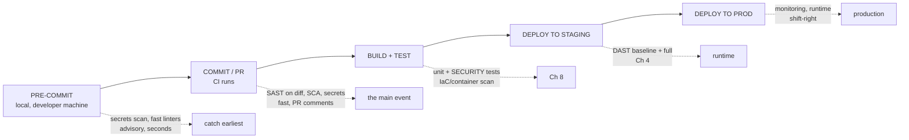
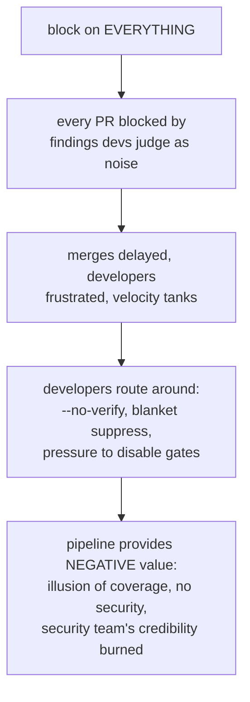
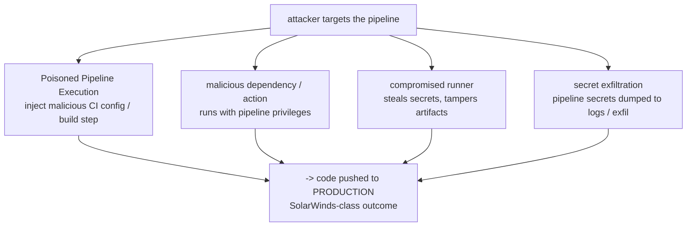
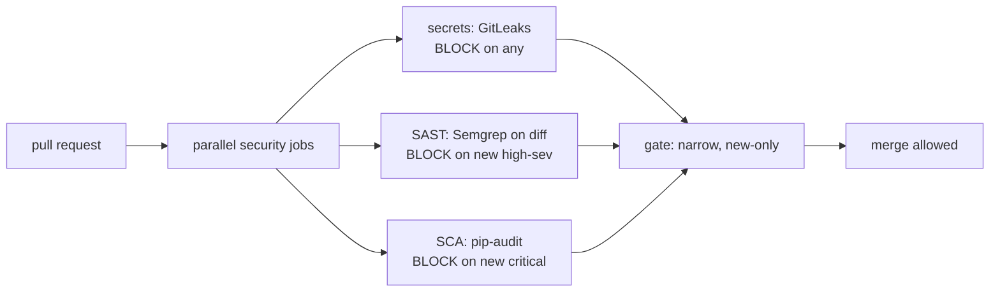

**Level:** Expert · **Track:** Product Security · **Read time:** 270 min

The last six chapters built a toolbox: manual review, SAST, DAST, SCA, secrets scanning. Individually, each is a capability. This chapter assembles them into a *system* — an automated security pipeline that runs on every commit, every pull request, every deploy, without anyone remembering to invoke it. This is **DevSecOps**: security woven into the continuous-integration and continuous-delivery pipeline so that it happens at the speed the business ships, rather than as a gate the business ships *around*.

The problem this solves is one of arithmetic. A modern engineering organization deploys dozens, hundreds, or thousands of times a day. A security model built on humans reviewing each release — the classic pre-release security sign-off — cannot survive contact with that velocity; it becomes either a bottleneck that the business routes around or a rubber stamp that provides no assurance. The only way security scales to continuous delivery is to **automate it into the pipeline itself**, so that every change is scanned automatically, the common bugs are caught without human involvement, and the scarce human attention (Chapters 1–2) is reserved for the tier only humans cover. Automation is not a nice-to-have here; it is the *only* model that works at modern velocity, and building it well is the defining skill of the DevSecOps discipline.

But — and this is the theme that governs the whole chapter — **assembling scanners into a pipeline is easy, and assembling them *well* is hard**, and the difference is almost entirely about *developer experience*. A pipeline that blocks every build on every finding, floods pull requests with noise, and adds twenty minutes to every merge does not make the organization more secure; it makes developers hate security, disable checks, and route around the whole thing — the trust-destroying failure of Chapter 3, now at the scale of the entire engineering org. Every design decision in this chapter — what blocks versus what advises, new findings versus existing, fast checks versus thorough ones — serves one goal: a pipeline developers *accept* because it is fast, trustworthy, and helps them rather than obstructing them. And underneath it all sits a threat most teams miss entirely: **the pipeline itself is a high-value target**, and a compromised pipeline is a catastrophe, so securing the pipeline is as important as the security the pipeline provides.

## Why This Matters

The velocity argument is the foundation and it is worth stating starkly: **the old security model is dead.** For decades, security was a phase — a pre-release review, a penetration test before launch, a sign-off gate. That model assumed releases were infrequent and discrete, and it collapses completely when an organization ships continuously. You cannot manually review a thousand deploys a day; you cannot pen-test every merge; you cannot have a human gate on a pipeline that runs every four minutes. Either security automates into the flow of delivery, or it becomes irrelevant to it — and "irrelevant to delivery" is exactly how security ends up bolted on at the end, expensive and ineffective, which is the anti-pattern the entire shift-left movement (Notebook 45) exists to kill.

The developer-experience argument is what separates a DevSecOps program that works from one that is quietly sabotaged. Security tooling in a pipeline has a unique power to *harm* productivity — a slow, noisy, false-positive-ridden gate taxes every single change every developer makes, all day, forever. Developers are rational: faced with a security gate that blocks their work with findings they judge to be noise, they will find the path of least resistance, and that path is *around* the gate — skip flags, blanket suppressions, disabled checks, pressure on security to loosen the gate. A pipeline that developers route around provides *negative* security value, because it creates the illusion of coverage while delivering none, and it burns the security team's credibility in the process. Getting the developer experience right — fast, trustworthy, helpful — is therefore not a UX nicety; it is the core engineering challenge of the whole discipline, and it is what this chapter is really about.

And the pipeline-as-target argument is the one that most surprises teams. The CI/CD pipeline has, by design, access to *everything* — source code, deployment credentials, production access, signing keys, the ability to push code to production automatically. That makes it one of the highest-value targets in the entire organization: an attacker who compromises the pipeline does not need to breach production directly, because the pipeline *deploys to production for them*. SolarWinds (Notebook 46 Chapter 5) was exactly this — a compromised build pipeline inserting a backdoor into signed releases. Securing the pipeline itself, covered in Part 6, is not an afterthought; it is a primary responsibility, and a product security engineer who automates scanning while leaving the pipeline itself wide open has secured the house and left the master key under the mat.

## Part 1: DevSecOps — Culture Before Tools

**DevSecOps** extends DevOps by integrating security into the continuous delivery flow, and the single most important thing to understand about it is that it is **a culture change first and a tooling change second.** The tools — the scanners of Chapters 3–6 — are necessary but not sufficient; the transformation that makes them work is a change in *who owns security and when.*

The cultural shifts that actually matter:

- **Shared ownership.** In the old model, security was the security team's job, bolted on at the end. In DevSecOps, security is *everyone's* job, integrated throughout — developers own the security of their code, the security team provides tools, guardrails, and expertise rather than being the sole gate. This is the deepest change and the hardest, because it redistributes responsibility.
- **Shift left, but not shift *only* left.** Catch issues early where they are cheap (Notebook 45), but also *shift right* — monitor in production, because not everything can be caught before deploy. DevSecOps spans the whole lifecycle.
- **Security as an enabler, not a blocker.** The framing that determines whether the culture takes hold: security's job is to help developers ship *securely and fast*, providing paved paths and fast feedback, not to be the office of "no." A security team perceived as a blocker gets routed around; one perceived as a helpful guardrail gets adopted.
- **Automate the routine, reserve humans for judgment.** Automation handles the repetitive scanning (the injection sweep, the dependency check, the secret scan); humans handle the threat modeling, the design review, and the authorization/logic tier that tools cannot (Chapter 2). This is the division of labor that makes the whole model scale.

The reason "culture before tools" is not a platitude: **you can buy every scanner and build a beautiful pipeline, and if developers experience security as an adversary, they will defeat it** — with `--no-verify`, with blanket suppressions, with pressure to weaken gates, with shadow processes that avoid the pipeline. Conversely, a team with a genuine shared-ownership culture will make even mediocre tools effective, because they *want* the findings and act on them. The tools amplify the culture; they do not substitute for it. Every technical decision in this chapter is downstream of this: the gating strategy, the noise management, the speed optimization all exist to keep developers on-side, because a hostile developer defeats any pipeline.

## Part 2: The Anatomy of a Secure Pipeline

A secure pipeline places each control from Chapters 3–6 at the stage where it fits, matching the control's speed and its findings' confidence to the stage's tolerance for delay and blocking.



The placement logic, stage by stage:

- **Pre-commit** (Chapter 6, Chapter 3 editor tier): the fastest checks — secrets scanning, quick linters — run on the developer's machine, advisory, in seconds. Catch the obvious before it enters history.
- **Commit / Pull Request** (the main event): the core scanning runs in CI on the PR — **SAST on the diff** (Chapter 3), **SCA** (Chapter 5), **secrets** (Chapter 6) — fast enough to complete while the PR is open, with findings posted as **inline PR comments** where the reviewer and author already are. Most of the pipeline's value is delivered here, because this is where the code is being reviewed and the fix is cheapest.
- **Build / Test**: unit tests, **security regression tests** (Notebook 45's test-as-a-control), and **container and IaC scanning** (Chapter 8) run against the built artifact.
- **Deploy to staging**: **DAST** (Chapter 4) runs against the deployed application — baseline fast, full nightly — because DAST needs a running system.
- **Deploy to production and beyond**: runtime monitoring, RASP (Chapter 4), and continuous SBOM monitoring (Chapter 5) — the **shift-right** half, catching what pre-deploy scanning could not.

The organizing principle, which every later part elaborates: **match the control to the stage — fast/advisory early, thorough/gating late and narrow.** A slow, thorough scan belongs nightly against staging, not blocking a PR; a fast, high-confidence check (a secret, a critical new dependency CVE) belongs at the PR gate. Putting a control at the wrong stage — a twenty-minute full DAST scan blocking every commit — is the single most common way pipelines become the thing developers route around.

## Part 3: Blocking vs Non-Blocking — The Decision That Makes or Breaks the Pipeline

This is the most consequential design decision in the entire chapter, and getting it wrong is the number-one cause of failed DevSecOps programs. Every security check in the pipeline is either **blocking** (a failure stops the build/merge/deploy) or **non-blocking** (a failure is reported as feedback but does not stop anything). The choice for each check determines whether developers experience the pipeline as a helpful partner or an obstacle to defeat.

The failure mode of over-blocking is precise and predictable:



The framework for deciding what blocks, which resolves the tension:

**Block only on high-confidence, high-severity, and — critically — *new* findings.** Three conditions, all of which should hold before a check blocks:

1. **High confidence** — the finding is very likely real (a verified live secret, a reachable critical dependency CVE, a high-confidence SAST rule), not a probable false positive. Blocking on findings that are often wrong destroys trust fastest.
2. **High severity** — the issue genuinely warrants stopping the release. A low-severity informational finding should never block; a critical, exploitable one should.
3. **New, not pre-existing** — this is the subtlest and most important. Blocking on the *thousands of findings already in a legacy codebase* is the instant-death of a pipeline (Chapter 3's baseline lesson, now a gate). The gate should block only findings *introduced by this change* — "do not add new critical issues" — while existing findings are tracked and remediated separately, worst-first, off the critical path. This single distinction is what makes gating survivable on a real, imperfect codebase.

**Everything else is non-blocking feedback** — reported as PR comments, dashboards, and tracked findings, informing without obstructing. The default for a new check should be *non-blocking*, earning trust before it is allowed to block; a check is promoted to blocking only once the team trusts its signal.

The principle to internalize: **the gate must be narrow, high-signal, and about new issues, or developers will route around it — and a routed-around gate is worse than no gate.** The goal is a gate that blocks *rarely* and, when it does, blocks on something the developer agrees is worth stopping for. That is a gate developers respect; a gate that blocks constantly on things they judge as noise is a gate they defeat. Optimizing for "blocks rarely and correctly" over "blocks on everything" is the core judgment of pipeline security.

## Part 4: Platform Mechanics — GitHub Actions, GitLab CI, Jenkins

The three dominant CI/CD platforms implement the same concepts with different mechanics, and a product security engineer works across all of them.

| | GitHub Actions | GitLab CI | Jenkins |
|---|---|---|---|
| Config | `.github/workflows/*.yml` | `.gitlab-ci.yml` | `Jenkinsfile` (Groovy) |
| Model | Event-driven workflows, marketplace actions | Stages and jobs, built-in security templates | Plugins, highly flexible, self-managed |
| Security features | Code scanning (CodeQL), Dependabot, secret scanning, OIDC | Built-in SAST/DAST/SCA/secret templates, one-line enable | Plugin ecosystem for every tool |
| Secrets | Encrypted secrets, OIDC to clouds | CI/CD variables, OIDC | Credentials plugin |
| Runner risk | GitHub-hosted or self-hosted | GitLab-hosted or self-hosted | Almost always self-hosted (higher risk) |
| Best fit | GitHub-centric orgs, easy on-ramp | All-in-one DevSecOps out of the box | Legacy, complex, or self-hosted needs |

**GitHub Actions** is event-driven: workflows trigger on events (`push`, `pull_request`), and a rich marketplace supplies pre-built actions for every scanner. Its native security stack (CodeQL code scanning, Dependabot, secret scanning, and OIDC for keyless cloud auth) makes it a strong on-ramp for GitHub-centric organizations. The security-relevant caution is the marketplace itself — a third-party action is *code you run with pipeline privileges* (Part 6).

**GitLab CI** is notable for **built-in security scanning templates** — SAST, DAST, dependency scanning, container scanning, and secret detection are available as one-line `include`s, making it the most "batteries-included" DevSecOps platform. For a team standardizing on GitLab, enabling a competent baseline of security scanning is genuinely a few lines of YAML, and the results flow into a merge-request security widget.

**Jenkins** is the veteran: enormously flexible via plugins, scriptable in Groovy, and almost always *self-hosted* — which is both its strength (total control, works anywhere) and its risk (you own the security of the Jenkins server and its runners, and a poorly-secured Jenkins is a classic breach vector). Jenkins security is as much about hardening the Jenkins installation as about the scans it runs.

The conceptual point across all three: **the platform differences are mechanical, not conceptual.** The stages, the gating decisions, the pipeline-hardening principles are identical; only the config syntax and the built-in-versus-plugin sourcing of tools differ. Learn the concepts once and the platform is a translation exercise. The lab uses GitHub Actions because it is the most common on-ramp, but every pattern maps directly to the other two.

## Part 5: Managing Findings at Scale

A pipeline running SAST, SCA, secrets, DAST, and container scanning across dozens of repositories produces a *lot* of findings, and without a strategy for managing them the program drowns in its own output — the Chapter 3 noise problem multiplied across every tool and every repo.

The techniques:

**Deduplication and correlation.** The same underlying issue often appears across multiple scans, multiple tools, and multiple runs — the same dependency CVE in every build, the same SAST finding on every commit until it is fixed. A finding-management layer deduplicates these so a developer sees *one* issue, not one-per-build, and correlates findings that are the same vulnerability seen by different tools (the SAST+DAST correlation of Chapter 4).

**Triage and lifecycle.** Each finding needs a state — new, triaged, accepted-risk, false-positive, fixed — and a workflow to move through it, so findings do not simply accumulate. Suppression is responsible (Chapter 3 Part 7): documented, narrow, reviewed for high severity.

**Prioritization at scale** uses the risk model of Chapter 1 and Chapter 8 — reachability, KEV/EPSS, severity, exposure — to rank a large backlog so remediation attacks the highest risk first rather than working alphabetically.

**The ASOC / ASPM platform category.** As programs mature, a dedicated layer emerges: **Application Security Orchestration and Correlation (ASOC)**, evolving into **Application Security Posture Management (ASPM)** — platforms (DefectDojo is the well-known open-source one; several commercial) that ingest findings from *all* the scanners, deduplicate and correlate them, provide unified triage and reporting, and give a single view of application security posture across the whole org. The value proposition is exactly the scale problem: instead of five separate tool dashboards per repo, one place where every finding lives, is deduplicated, is prioritized, and is tracked to closure. For a program beyond a handful of repos, an ASOC/ASPM layer is what makes the finding volume manageable, and it is where the metrics of Part 9 come from.

The principle: **a finding that is not tracked to closure is a finding that will be forgotten**, and at the scale a pipeline produces, tracking cannot be manual. The finding-management layer is what turns "the scanners found things" into "the risks got fixed."

## Part 6: Securing the Pipeline Itself — The Target Most Teams Miss

The pipeline has access to source code, deployment credentials, production, and signing keys. That makes it one of the highest-value targets in the organization, and securing it is a first-class responsibility — not an afterthought. This is the part of the chapter teams most often skip, and it is where the SolarWinds-class catastrophe lives.

The threats specific to the pipeline:



- **Poisoned Pipeline Execution (PPE)** — an attacker who can influence the pipeline definition (a malicious PR that edits the CI config, in platforms where PR-triggered pipelines run the PR's own config with privileges) injects a malicious build step. The defense: do not run privileged pipelines on untrusted PRs; require approval for workflows on external contributions; separate the *build* (untrusted-input) context from the *deploy* (privileged) context.
- **Malicious dependencies and actions** — a third-party GitHub Action or a build-time dependency runs *with the pipeline's privileges* (Chapter 5's supply chain, now with production access). The defense: **pin actions to a full commit SHA** (not a mutable tag like `@v3`, which can be repointed to malicious code), vet third-party actions, and minimize them.
- **Compromised runners** — self-hosted runners (common in Jenkins and self-hosted GitLab/GitHub) that are shared, persistent, or poorly isolated let one job tamper with another or persist between jobs. The defense: ephemeral, isolated runners that are destroyed after each job; never run untrusted code on a runner with production access.
- **Secret exfiltration** — pipeline secrets (deploy keys, cloud credentials) dumped to logs, sent to an attacker's endpoint by a malicious step, or read by a poisoned job. The defense: least-privilege secrets, masked in logs, and — the strategic fix — **OIDC / keyless authentication** so the pipeline gets *short-lived, scoped* cloud credentials at runtime instead of holding long-lived static secrets at all (Notebook 45 Chapter 7's workload identity).

The overarching principles, which mirror the whole curriculum: **least privilege** (the pipeline and each job get the minimum access needed — a test job needs no deploy credentials), **pinned and vetted dependencies** (actions to SHAs, dependencies locked — Chapter 5), **ephemeral isolated runners**, **short-lived credentials via OIDC** instead of static secrets, and **separation of trust** between untrusted-input stages and privileged stages.

**SLSA (Supply-chain Levels for Software Artifacts)** is the framework that formalizes this: a graded set of requirements (levels 1–4, increasing) for build integrity — provenance (a signed, verifiable record of *how* an artifact was built), isolated and hermetic builds, and tamper-resistance — designed so that a consumer of an artifact can *verify* it was built as claimed. SLSA is the direct, industry-standard answer to the SolarWinds question ("how do I know this signed artifact was not tampered with in the build?"), and adopting it — even partially, at a lower level — is how a mature program hardens the build itself, not just the code the build compiles.

The one-line lesson: **a pipeline that scans code perfectly but is itself compromisable has secured the product and lost the master key.** Securing the pipeline is as important as the scanning it performs.

## Part 7: Speed, Policy as Code, and Keeping Developers On-Side

Two more forces shape a pipeline developers accept.

**Speed — the thoroughness tradeoff.** A pipeline that adds twenty minutes to every change taxes velocity intolerably and pushes developers to skip it. But thorough scanning is slow. The resolution is *not* to scan less, but to scan *smart*:

- **Incremental / diff-based scanning** — scan only what changed on the PR (SAST on the diff, not the whole repo), reserving full scans for scheduled runs. This is the single biggest speed lever.
- **Parallelization** — run the independent scans (SAST, SCA, secrets) concurrently rather than sequentially, so the pipeline is as slow as its slowest scan, not the sum.
- **Caching** — cache dependency downloads, SAST databases, and build artifacts between runs.
- **Tiering** — fast checks (secrets, diff SAST) block the PR; slow, thorough checks (full SAST, full DAST) run asynchronously nightly and feed the backlog, never the PR gate.

The principle: **fast in the critical path, thorough off it.** The PR gate must be fast (minutes, not tens of minutes) or developers resent it; the thoroughness that cannot fit in that budget moves to scheduled scans. This is the same "advisory-early/thorough-late" logic as gating, applied to *time*.

**Policy as code.** Security gates and their rules should themselves be *code* — versioned, reviewed, testable — rather than clicked-together console settings. Tools like Open Policy Agent (OPA, Notebook 42 Chapter 4) express gate policy declaratively ("block if a new critical, reachable finding is introduced"), so the gating logic is auditable, consistent across repos, and changed through review rather than by a quiet console toggle. Policy-as-code is how a large org keeps its gates consistent and its exceptions documented.

The unifying goal of both, and of the whole chapter: **keep developers on-side.** Fast pipelines, narrow high-signal gates, findings delivered where developers already work (PR comments), auto-generated fix suggestions, and self-service exceptions with documented approval — every one of these is in service of the culture point from Part 1. A pipeline developers experience as fast and helpful is a pipeline that survives; one they experience as slow and obstructive is one they defeat. The technical excellence of the scanning is worthless if the delivery of it alienates the people who must act on it.

## Part 8: Hands-On Lab — A Complete, Hardened GitHub Actions Security Pipeline

### 8.1 What we are building

A GitHub Actions pipeline assembling the scanners of Chapters 3–6 with *correct gating* (Part 3) and *pipeline hardening* (Part 6) — secrets, SAST, and SCA stages, parallelized, blocking narrowly on new high-severity findings, with least-privilege tokens and pinned actions.



A GitHub repository (the YAML is illustrative and runnable in a real repo).

### 8.2 The pipeline workflow, hardened

```yaml
# .github/workflows/security.yml
name: Security Pipeline
on:
  pull_request:
    branches: [main]

# Part 6: LEAST PRIVILEGE at the workflow level -- read-only by default.
permissions:
  contents: read

jobs:
  # Part 7: the three scans run in PARALLEL (independent jobs), not in sequence.
  secrets:
    runs-on: ubuntu-latest
    permissions:
      contents: read
      pull-requests: write        # only to comment findings
    steps:
      # Part 6: pin the action to a full commit SHA, not a mutable @v tag.
      - uses: actions/checkout@11bd71901bbe5b1630ceea73d27597364c9af683  # v4.2.2
        with: { fetch-depth: 0 }   # full history for secret scanning (Ch 6 Part 5)
      - name: GitLeaks
        uses: gitleaks/gitleaks-action@44c470ffc35caa8b1eb3e8012ca53c2f9bea4eb5  # v2.3.6
        # Part 3: secrets are high-confidence + high-severity -> BLOCK on any finding.

  sast:
    runs-on: ubuntu-latest
    permissions:
      contents: read
      pull-requests: write
    steps:
      - uses: actions/checkout@11bd71901bbe5b1630ceea73d27597364c9af683  # v4.2.2
      - name: Semgrep (diff-aware)
        # Part 7: incremental -- scan only what the PR changed, not the whole repo.
        uses: returntocorp/semgrep-action@713efdd345f3035192eaa63f56867b88e63e4e5d
        with:
          config: p/default
        env:
          # Part 3: block only on NEW high-severity findings, not the legacy backlog.
          SEMGREP_BASELINE_REF: origin/main

  sca:
    runs-on: ubuntu-latest
    permissions:
      contents: read
    steps:
      - uses: actions/checkout@11bd71901bbe5b1630ceea73d27597364c9af683  # v4.2.2
      - name: pip-audit
        run: |
          python -m pip install pip-audit
          # Part 3: fail (block) only on CRITICAL/HIGH; report the rest non-blocking.
          pip-audit -r requirements.txt --desc \
            --vulnerability-service osv || echo "SCA findings reported"
```

Every hardening decision from Part 6 is visible: workflow-level `permissions: contents: read` (least privilege), per-job scoping of the `pull-requests: write` needed only to comment, and every action **pinned to a commit SHA** so a repointed tag cannot inject malicious code. Every gating decision from Part 3 is visible: secrets block on any finding (high-confidence, high-severity), SAST blocks only on findings *new since `origin/main`* (the baseline), SCA blocks only on critical/high. And Part 7's speed is visible: three parallel jobs, SAST scanning only the diff.

### 8.3 The gating policy, as code

```python
# gate.py -- the blocking decision (Part 3), expressed as testable code.
# Run after the scans; exit non-zero to BLOCK the merge.
import json, sys

def should_block(findings):
    """Block ONLY on new, high-confidence, high-severity findings (Part 3)."""
    blockers = []
    for f in findings:
        new = f.get("introduced_by_this_pr", False)
        sev = f.get("severity", "low")
        confident = f.get("confidence", "low") in ("high", "verified")
        if new and sev in ("critical", "high") and confident:
            blockers.append(f)
    return blockers

if __name__ == "__main__":
    findings = json.load(open(sys.argv[1]))
    blockers = should_block(findings)
    total = len(findings)
    print(f"{total} findings total | {len(blockers)} meet the BLOCK criteria")
    for b in blockers:
        print(f"  BLOCK: {b['id']} {b['severity']} {b['title']}")
    non_block = total - len(blockers)
    print(f"{non_block} findings are advisory (existing / low-sev / low-confidence)")
    sys.exit(1 if blockers else 0)
```

```bash
cat > findings.json <<'JSON'
[
  {"id":"F1","title":"hardcoded AWS key (new)","severity":"critical",
   "confidence":"verified","introduced_by_this_pr":true},
  {"id":"F2","title":"SQLi in legacy module","severity":"high",
   "confidence":"high","introduced_by_this_pr":false},
  {"id":"F3","title":"low-sev info leak (new)","severity":"low",
   "confidence":"high","introduced_by_this_pr":true},
  {"id":"F4","title":"reachable critical dep CVE (new)","severity":"critical",
   "confidence":"high","introduced_by_this_pr":true}
]
JSON
python3 gate.py findings.json; echo "exit: $?"

# Sample output:
# 4 findings total | 2 meet the BLOCK criteria
#   BLOCK: F1 critical hardcoded AWS key (new)
#   BLOCK: F4 critical reachable critical dep CVE (new)
# 2 findings are advisory (existing / low-sev / low-confidence)
# exit: 1
```

The gate blocks on exactly two of four findings — the *new*, *critical*, *high-confidence* ones (F1, F4). The *existing* high-severity SQLi (F2) does **not** block the PR (it is tracked and remediated separately, not made this developer's problem for a bug they did not introduce — Part 3's new-vs-existing distinction), and the low-severity new finding (F3) is advisory. This is a gate developers accept: it blocks rarely and, when it does, on something they agree is worth stopping for.

### 8.4 Demonstrating the pipeline-hardening difference

```python
# harden_check.py -- audit a workflow for the Part 6 pipeline-security controls.
import re, sys

def audit(yaml_text):
    issues = []
    # Actions pinned to SHA, not mutable tags?
    for m in re.finditer(r"uses:\s*([^\s]+)@([^\s]+)", yaml_text):
        ref = m.group(2)
        if not re.fullmatch(r"[0-9a-f]{40}", ref):
            issues.append(f"UNPINNED action: {m.group(1)}@{ref} (use a commit SHA)")
    # Least-privilege permissions declared?
    if "permissions:" not in yaml_text:
        issues.append("NO permissions block -> runs with default (broad) token")
    # Long-lived cloud secrets vs OIDC?
    if re.search(r"AWS_SECRET_ACCESS_KEY|GCP_SA_KEY", yaml_text):
        issues.append("STATIC cloud secret -> prefer OIDC/keyless (Part 6)")
    return issues

if __name__ == "__main__":
    text = open(sys.argv[1]).read()
    issues = audit(text)
    if not issues:
        print("PASS: pinned actions, least-privilege permissions, no static cloud secrets")
    else:
        for i in issues: print("FAIL:", i)
    sys.exit(1 if issues else 0)
```

```bash
python3 harden_check.py .github/workflows/security.yml

# Sample output:
# PASS: pinned actions, least-privilege permissions, no static cloud secrets
```

```bash
# Contrast: an UNHARDENED workflow fails the audit.
cat > bad.yml <<'YAML'
on: [pull_request]
jobs:
  deploy:
    runs-on: ubuntu-latest
    steps:
      - uses: actions/checkout@v4
      - run: deploy.sh
        env:
          AWS_SECRET_ACCESS_KEY: ${{ secrets.AWS_SECRET_ACCESS_KEY }}
YAML
python3 harden_check.py bad.yml

# Sample output:
# FAIL: UNPINNED action: actions/checkout@v4 (use a commit SHA)
# FAIL: NO permissions block -> runs with default (broad) token
# FAIL: STATIC cloud secret -> prefer OIDC/keyless (Part 6)
```

The audit makes Part 6 concrete: the hardened workflow passes; the naive one runs untrusted PR code with a broad token, an unpinned (repointable) action, and a long-lived cloud secret — the exact ingredients of a poisoned-pipeline compromise.

### 8.5 Extending the lab

Add a DAST baseline job (Chapter 4) that runs against a staging deploy *after* merge rather than blocking the PR (Part 2's staging placement); wire the findings from all jobs into DefectDojo (Part 5) to see unified deduplication and triage; add an OIDC-based cloud auth step to replace the static secret (Part 6); add a scheduled nightly job that runs the *full* SAST and SCA (not diff-only) and feeds the backlog (Part 7's tiering); and write a policy-as-code gate in OPA/Rego that expresses the Part 3 blocking rule declaratively.

## Part 9: Common Pitfalls

**Blocking on everything.** The number-one killer of DevSecOps programs. Developers route around a gate that blocks on noise, and a routed-around gate provides negative value. Block only on new, high-confidence, high-severity findings.

**Blocking on the legacy backlog.** Turning on a gate that fails every PR because of thousands of pre-existing findings is instant death. Gate on *new* findings; remediate existing ones separately, worst-first.

**Slow pipelines.** A twenty-minute gate on every change makes developers skip it. Scan the diff, parallelize, cache, and move thorough scans off the critical path to nightly.

**Treating DevSecOps as a tooling purchase.** Culture before tools. A team that experiences security as an adversary defeats any pipeline. Shared ownership and security-as-enabler are the prerequisite.

**Leaving the pipeline itself unsecured.** The pipeline has production access and secrets — it is a top-tier target. Unpinned actions, broad tokens, static secrets, and shared runners are how it gets compromised (SolarWinds-class). Pin actions to SHAs, least-privilege every job, use OIDC, isolate runners.

**Running untrusted PR code with privileges.** Poisoned Pipeline Execution. Separate untrusted-input stages from privileged ones; require approval for external contributions.

**Static long-lived cloud credentials in the pipeline.** A single exfiltration is total compromise. Use OIDC/keyless for short-lived scoped credentials.

**No finding-management layer.** At pipeline scale, un-deduplicated findings across every tool and run drown the team. Deduplicate, correlate, and track to closure — an ASOC/ASPM layer for anything beyond a few repos.

**Findings delivered where developers do not look.** A separate security dashboard nobody opens is ignored. Put findings in PR comments, where the work already is.

**No exceptions process.** If there is no legitimate, fast way to accept a risk or suppress a false positive, developers create an illegitimate one (blanket suppressions). Provide documented, reviewed, self-service exceptions.

## Final Revision / Summary

- **DevSecOps** automates security into the CI/CD pipeline because it is the **only model that scales to continuous delivery** — you cannot manually review a thousand deploys a day. Automate the routine scanning; reserve human attention for the tier only humans cover (Chapter 2).
- It is **culture before tools**: shared ownership (security is everyone's job), shift-left-and-right, and **security as an enabler, not a blocker.** A team that experiences security as an adversary defeats any pipeline; the tools amplify the culture, they do not substitute for it.
- **Pipeline anatomy**: pre-commit (secrets, fast linters, advisory) → PR/CI (SAST-on-diff + SCA + secrets, the main event, PR comments) → build/test (security tests, container/IaC scan) → staging (DAST) → prod (monitoring, shift-right). **Match the control to the stage — fast/advisory early, thorough/gating late and narrow.**
- **Blocking vs non-blocking is the decision that makes or breaks the pipeline.** Block only on findings that are **high-confidence, high-severity, and NEW** (not the legacy backlog — Chapter 3's baseline as a gate). Everything else is non-blocking feedback; new checks start non-blocking and earn the right to block. **The gate must block rarely and correctly, or developers route around it** — and a routed-around gate is worse than none.
- **Platforms** (GitHub Actions, GitLab CI, Jenkins) differ **mechanically, not conceptually**: GitHub is event-driven with a marketplace and native CodeQL/Dependabot/secret-scanning/OIDC; GitLab has one-line built-in security templates; Jenkins is flexible, plugin-based, and self-hosted (higher self-hardening burden). Learn the concepts once.
- **Manage findings at scale** with deduplication, correlation, lifecycle triage, and risk-based prioritization — and, beyond a few repos, an **ASOC/ASPM** layer (DefectDojo and commercial) that unifies findings from all tools into one tracked, prioritized view. A finding not tracked to closure is forgotten.
- **Secure the pipeline itself** — it has source, deploy credentials, production, and signing keys, making it a **top-tier target** (SolarWinds). Defend against **poisoned pipeline execution** (don't run privileged untrusted-PR code), **malicious actions/dependencies** (pin actions to commit SHAs, vet, minimize), **compromised runners** (ephemeral, isolated), and **secret exfiltration** (least-privilege secrets, **OIDC/keyless** short-lived credentials over static secrets). **SLSA** formalizes build integrity and provenance.
- **Speed**: fast in the critical path, thorough off it — **diff/incremental scanning, parallelization, caching, and tiering** (fast checks gate the PR; slow full scans run nightly and feed the backlog). **Policy as code** (OPA) makes gates versioned, reviewed, and consistent.
- Every decision serves one goal: **a pipeline developers accept because it is fast, trustworthy, and helpful.** The technical excellence of the scanning is worthless if its delivery alienates the people who must act on it.

## Cheat Sheet / Quick Reference

**DevSecOps in one line**

```
automate security into CI/CD (only model that scales to continuous delivery)
culture BEFORE tools: shared ownership, security as ENABLER not blocker
```

**Pipeline stages -> controls**

```
pre-commit  -> secrets, fast linters (advisory, seconds)
PR / CI      -> SAST-on-DIFF + SCA + secrets (the main event, PR comments)
build/test  -> security tests, container + IaC scan (Ch 8)
staging     -> DAST (Ch 4)
prod        -> monitoring, RASP, SBOM watch (shift-right)
match control to stage: fast/advisory early, thorough/gating late + narrow
```

**What blocks (Part 3)**

```
BLOCK only if: HIGH-CONFIDENCE  and  HIGH-SEVERITY  and  NEW (not legacy backlog)
everything else = non-blocking feedback
new checks start NON-BLOCKING, earn the right to block
goal: block RARELY and CORRECTLY (or devs route around it)
```

**Secure the pipeline itself (Part 6)**

```
pin actions to a COMMIT SHA (not @v3 -- mutable tags can be repointed)
least-privilege permissions per job (test job needs no deploy creds)
OIDC / keyless short-lived creds  >  static long-lived cloud secrets
ephemeral isolated runners; don't run untrusted-PR code with privileges
SLSA = build integrity + provenance (the SolarWinds answer)
```

**Speed (Part 7)**

```
diff/incremental scan (biggest lever) | parallelize scans | cache
tier: fast checks gate the PR; full scans run nightly -> backlog
policy as code (OPA) for versioned, consistent gates
```

**Manage findings at scale**

```
deduplicate + correlate + lifecycle triage + risk-prioritize
> a few repos -> ASOC/ASPM (DefectDojo) = one tracked, prioritized view
findings -> PR comments (where devs already are), not a separate dashboard
```

**Platforms (mechanical differences only)**

```
GitHub Actions -> workflows + marketplace; CodeQL/Dependabot/secret-scan/OIDC native
GitLab CI      -> one-line built-in SAST/DAST/SCA/secret templates
Jenkins        -> plugins, self-hosted (harden the server itself)
```

## Practice Labs & Resources

**Platforms and tools**
- **GitHub Actions** security features (code scanning, Dependabot, secret scanning, OIDC) and the **GitLab CI** built-in security templates — enable a baseline on a real repo.
- **DefectDojo** — the open-source ASOC/ASPM platform; ingest findings from several scanners and see deduplication and triage.
- **Open Policy Agent (OPA)** — for policy-as-code gates.
- **SLSA framework** (slsa.dev) — the build-integrity levels and provenance model.

**Hands-on**
- Extend the lab: add a post-merge DAST staging job, wire findings into DefectDojo, replace the static secret with OIDC, add a nightly full-scan tier, and write the gate as OPA/Rego.
- Take an existing repo's pipeline and audit it against Part 6 (the `harden_check.py` checks): pinned actions, least-privilege permissions, no static cloud secrets.
- Build the same three-scanner pipeline in GitLab CI and in a Jenkinsfile to feel the mechanical-not-conceptual difference.

**Deliberate practice**
- For any check you add, decide *before* enabling it: blocking or advisory, and on new-only or all findings — and default to advisory-and-new until it earns trust.
- Measure your PR pipeline's wall-clock time and attack the slowest stage with diff-scanning, parallelization, or tiering.
- Threat-model your own pipeline: what could a malicious PR do, what does each job have access to, and where is a static secret that should be OIDC?

**Further reading**
- **OWASP Top 10 CI/CD Security Risks** — the definitive list of the Part 6 pipeline threats.
- The SLSA specification and the CNCF/CISA software-supply-chain guidance.
- Chapters 3–6 (the scanners this chapter assembles) and Chapter 8 next (container and IaC scanning, the build/test-stage controls), and Chapter 9 (vulnerability management and SLAs — what happens to the findings the pipeline produces).

---

*Also on [Praneeth's portfolio](https://ping-praneeth.vercel.app/notebook/secure-code-review-sast-sca/07-integrating-security-into-ci-cd-pipelines-github-actions-gitlab-ci-and-jenkins), with comments and the latest edits.*
