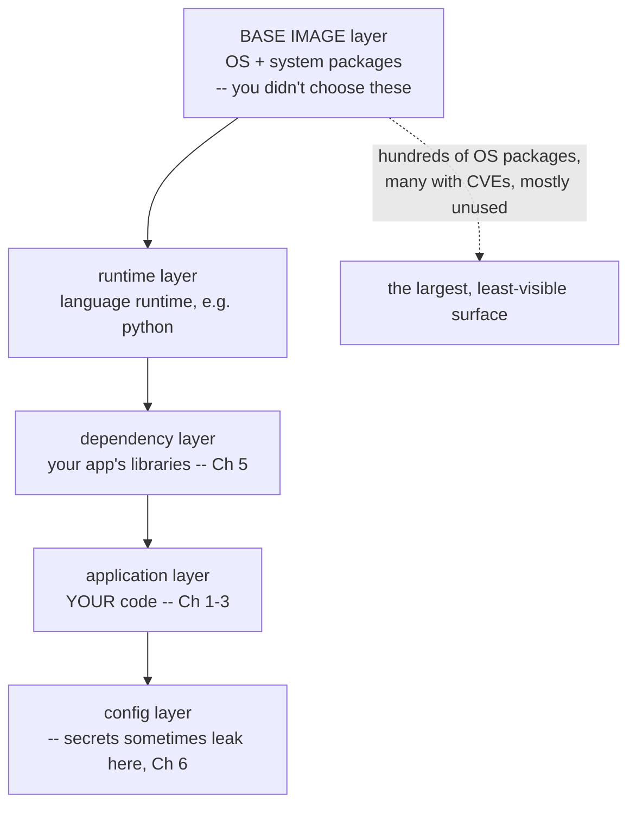
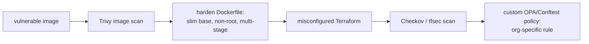

**Level:** Expert · **Track:** Product Security · **Read time:** 270 min

Every chapter so far has scanned *application* code. This one extends the entire discipline to two things that used to be outside a code reviewer's world and are now squarely inside it: the **container images** applications ship in, and the **infrastructure-as-code** that defines the cloud environments they run in. The unifying insight — the one that makes this a code-review chapter rather than an operations chapter — is that **infrastructure is now code**, and code gets reviewed, scanned, and gated exactly like the application code of the previous chapters.

This is a genuine shift in what "product security" covers. A decade ago, the security of a server was a system-administration concern, configured by hand and reviewed, if at all, by an ops team. Today that server is defined in a Terraform file, that Terraform file lives in a git repository next to the application code, and a single line in it — `acl = "public-read"` on a storage bucket, `cidr_blocks = ["0.0.0.0/0"]` on a security group — can expose an entire company's data or open the whole environment to the internet. That line is *code*, it is reviewed in a pull request, and it can be scanned by a tool before it ever provisions anything. The consequence is that the product security engineer's scope now includes the Dockerfile, the Kubernetes manifest, and the Terraform module, and the same shift-left, scan-in-the-pipeline, gate-narrowly discipline of Chapters 3–7 applies directly.

There is also a force multiplier that makes IaC security uniquely high-stakes: **a misconfiguration in infrastructure-as-code is a fleet-wide misconfiguration.** A hand-configured mistake affects one server; a mistake in a Terraform module that provisions a hundred environments affects all hundred, instantly and identically. IaC amplifies both good and bad — it makes secure configuration reproducible *and* insecure configuration reproducible — which is exactly why scanning it before it applies is so valuable. The chapter covers container image scanning (what is actually in your image and what is vulnerable), Dockerfile and Kubernetes hardening, IaC misconfiguration scanning (Checkov, tfsec), and the idea that ties it all together — **policy-as-code** (OPA/Rego), which lets an organization express its *own* security rules once and enforce them across containers, IaC, Kubernetes, and the pipeline uniformly.

## Why This Matters

The breach data makes the case bluntly: **cloud misconfiguration is one of the leading causes of data exposure**, and it has been for years. The recurring headline — "company exposes millions of records via a misconfigured S3 bucket" — is almost always a single wrong setting: a storage bucket set to public, a database security group open to `0.0.0.0/0`, an unencrypted volume, an over-permissive IAM role. These are not sophisticated attacks; they are doors left open, and they are exactly the settings an IaC scanner flags *before the door is ever built*. Gartner's oft-cited projection that the vast majority of cloud security failures will be the customer's fault, through misconfiguration rather than provider vulnerability, has held true — and IaC scanning is the single most effective control against it, because it catches the misconfiguration in the pull request rather than in a breach report.

Containers add a second, equally common exposure. A container image is not a single artifact; it is a stack of layers, and the bottom layers — the base image and the OS packages in it — are full of software nobody on the application team chose or tracks. A typical container image built on a full OS base ships with *hundreds* of OS packages, many with known vulnerabilities, most of which the application never uses (Chapter 5's reachability problem, now for the OS). Ship that image and you have shipped every one of those vulnerabilities into production. Image scanning is what makes the invisible contents of the image visible, and base-image choice (Part 4) is what makes the vulnerable surface small in the first place.

The deeper reason this matters for a product security engineer is scope and leverage. Infrastructure-as-code security is the highest-leverage place to enforce cloud security, because it is *upstream of everything* — every environment, every server, every bucket is provisioned from it, so a rule enforced in IaC scanning is a rule enforced across the entire fleet, forever, automatically. A single Checkov policy that blocks public S3 buckets prevents that entire breach class across every repository in the org. That leverage — one policy, fleet-wide, preventive — is why this discipline sits at the center of modern cloud security, and why "infrastructure is code, so review it like code" is one of the most consequential ideas in the notebook.

## Part 1: Infrastructure Is Code — and Therefore In Scope

The premise the whole chapter rests on: modern infrastructure is *declared in code* — Terraform, CloudFormation, Pulumi, Kubernetes YAML, Dockerfiles, Ansible — and that code is committed to git, reviewed in pull requests, and applied by pipelines. This is **Infrastructure as Code (IaC)**, and it has transformed operations from manual configuration into software engineering, with all the benefits (versioning, review, reproducibility, testing) and all the security implications (a bug is now a code bug, and a code bug can be scanned).

The security consequences that follow directly:

- **Infrastructure is reviewable.** A cloud configuration is now a diff in a pull request, subject to the same review (Chapters 1–2) as application code. A reviewer can catch the public bucket in the PR.
- **Infrastructure is scannable.** Because it is text with a defined schema, a tool can parse it and check it against a library of misconfiguration rules *before it applies* — the same static analysis as SAST (Chapter 3), aimed at infrastructure. This is the preventive superpower: you catch the mistake before it exists in the cloud.
- **Infrastructure mistakes are amplified.** A module that provisions many environments applies its mistake to all of them, identically. Fleet-wide reproducibility cuts both ways.
- **Infrastructure is a new attack surface for the reviewer to learn.** IAM policies, network rules, encryption settings, and public-access flags are a different vocabulary than injection and XSS, and the product security engineer must learn them — they are Chapter 8's CWE Top 25 for the cloud.

The mental model to carry: **everything you learned about reviewing and scanning application code applies to infrastructure code, with a different vocabulary of bugs.** The bugs are not injection and memory safety; they are public exposure, over-permissive access, missing encryption, and insecure defaults. The *method* — scan statically, review the diff, gate the pipeline, prioritize by risk — is identical. This chapter is the previous six chapters pointed at a new target.

## Part 2: The Container Security Model — What Is Actually In Your Image

A **container image** is a layered, read-only template from which running containers are created, and understanding its layered structure is the key to knowing *what to scan and where the risk lives*.



What actually needs scanning, layer by layer:

- **OS packages in the base image** — the largest and least-visible attack surface. A `ubuntu` or `node:latest` base ships with hundreds of system packages (openssl, libc, curl, and so on), many carrying known CVEs. You did not choose these and you do not track them, and they are in production the moment you ship. **This is Chapter 5's dependency problem for the OS layer**, and it is why image scanning exists.
- **Application dependencies** — your language libraries, exactly Chapter 5's SCA, now inside the image.
- **The Dockerfile itself** — the build instructions, which encode security-relevant choices (does it run as root? does it use a huge base? does it copy secrets in?) — Part 4.
- **Secrets baked into layers** — a critical and subtle problem: a secret `COPY`ed in and `RM`ed in a *later* layer is **still in the earlier layer** (exactly Chapter 6's git-history problem, in image form — the layers are immutable and the secret persists in the layer that added it, retrievable by anyone who pulls the image). Scan image layers for secrets.
- **The base image choice** — the single highest-leverage decision, because it determines how much OS surface you inherit (Part 4).

The crucial distinction for *when* to scan: **scanning an image (the build artifact) is different from scanning a running container (the live workload).** Image scanning (build-time) finds vulnerable packages and misconfigurations in the artifact *before* it deploys — the shift-left, preventive scan. Runtime scanning/monitoring (Part 8) watches the *running* container for anomalous behavior, drift, and newly-disclosed CVEs against what is actually running. You need both: image scanning to ship clean, runtime scanning because new CVEs are disclosed against images you already deployed (Chapter 5's post-release monitoring, containerized). The build-time scan is where most of the value is and where this chapter concentrates.

## Part 3: Image Scanning With Trivy and Grype

**Image scanning** identifies every component in a container image and matches it against vulnerability databases — it is SCA (Chapter 5) extended to the OS-package layer and the whole image. The dominant open-source tools:

- **Trivy** (Aqua) — the de facto standard: fast, comprehensive, and unusually *broad* — it scans container images, filesystems, git repos, *and* IaC and Kubernetes configs (making it a near-one-stop tool for this whole chapter). It finds OS-package CVEs, language-dependency CVEs, secrets in layers, and IaC misconfigurations, and it is trivial to run in CI.
- **Grype** (Anchore) — fast image/SBOM scanner, pairs with Syft for SBOM generation (Chapter 5), strong on the vulnerability-matching half.

What a scan reports: for each vulnerable component, the CVE, the severity, the installed version, and the fixed version (if one exists) — the same actionable output as Chapter 5's SCA, now covering the OS layer. And the same prioritization applies: **reachability and fix-availability matter more than raw severity** (Chapter 5 Part 3) — a critical CVE in an OS package your application never invokes is lower *risk* than a reachable one, and a CVE with no fix available changes the response from "update" to "mitigate or accept."

The single most impactful finding image scanning surfaces is usually the **base image**: scanning `node:18` (a full Debian base) versus `node:18-slim` versus a distroless or Alpine base often shows the difference between *hundreds* of OS-package CVEs and *a handful*. That result is the whole argument for Part 4's base-image discipline, and it is why the first thing a scan should prompt is not "patch these hundred packages" but "why is the base image so large, and can it be smaller?" The most effective remediation for image vulnerabilities is frequently not patching individual packages but **choosing a minimal base image that never contained them.**

## Part 4: The Dockerfile as a Security Artifact

The Dockerfile is code, and its instructions are security controls. The high-leverage Dockerfile practices, each a real hardening:

- **Use a minimal base image.** `distroless`, `alpine`, or `-slim` variants ship a fraction of the packages a full OS base does, which directly shrinks the vulnerable surface (Part 3). Distroless images contain *only* the runtime and the app — no shell, no package manager — which also removes the tools an attacker would use post-compromise. This is the single highest-leverage Dockerfile decision.
- **Run as a non-root user.** By default, containers run as root, so a compromised application is root *inside the container* and one container-escape away from root on the host. Add a `USER` instruction to drop to an unprivileged user. This is the most commonly missed and most impactful Dockerfile hardening — least privilege (Notebook 45 Chapter 6) in container form.
- **Use multi-stage builds.** Build in one stage (with the compilers, build tools, and dev dependencies) and copy *only the artifact* into a minimal final stage, so the shipped image does not contain the build toolchain (a large surface an attacker can use) or any build-time secrets. Multi-stage builds are how you get a small, clean final image without sacrificing a full-featured build.
- **Pin base images by digest, not tag.** `FROM node:18` is a mutable tag that changes under you (Chapter 5's pinning lesson); `FROM node:18@sha256:...` pins the exact image content, making builds reproducible and tamper-evident.
- **Do not copy secrets in.** A `COPY .env` or an `ARG API_KEY` bakes the secret into a layer permanently (Part 2 — layers are immutable, so even a later `RM` leaves it in the earlier layer). Use build-time secret mounts or runtime injection (Chapter 6 Part 8), never a copied-in secret.
- **Minimize layers and clean up in the same layer.** `RUN apt-get update && apt-get install ... && rm -rf /var/lib/apt/lists/*` in one instruction, so the cleanup actually reduces image size (a separate `RM` layer does not shrink the earlier layer — the same layer-immutability rule again).

A Dockerfile linter (**hadolint**, and Trivy's config scan) checks most of these automatically — the practices are *scannable rules*, so they belong in the pipeline as gates just like application SAST rules. The Dockerfile is not documentation of how the image is built; it is a security control that a scanner can verify.

## Part 5: IaC Misconfiguration Scanning — Checkov, tfsec, Terrascan

**IaC scanning** parses infrastructure definitions (Terraform, CloudFormation, Kubernetes, ARM, Bicep) and checks them against a library of misconfiguration rules — static analysis (Chapter 3) for infrastructure, run *before the infrastructure is provisioned*. The dominant tools:

- **Checkov** (Bridgecrew/Palo Alto) — the most comprehensive, covering Terraform, CloudFormation, Kubernetes, Helm, ARM, and more, with thousands of built-in policies and support for custom ones (Part 7).
- **tfsec** (Aqua, now converging with Trivy) — fast, Terraform-focused, developer-friendly output.
- **Terrascan** (Tenable) — policy-based, OPA-backed, multi-cloud.
- **Trivy** — also does IaC config scanning, making it a broad option (Part 3).

The misconfigurations these catch are the ones that cause real breaches — the cloud equivalent of Chapter 8's CWE Top 25:

| Misconfiguration | The exposure |
|---|---|
| **Public storage bucket** (`acl = "public-read"`) | The classic S3 data-exposure breach |
| **Security group open to `0.0.0.0/0`** | Database/admin port exposed to the internet |
| **Unencrypted storage/volume/database** | Data at rest unprotected |
| **Over-permissive IAM** (`Action: "*"`, `Resource: "*"`) | A compromised role can do anything |
| **No logging/audit enabled** | Blind during an incident |
| **Public database / RDS** | Direct internet exposure of data |
| **Missing encryption in transit** (no TLS enforced) | Data interceptable |
| **Default/weak credentials in config** | Trivial access |
| **Disabled deletion protection / no backups** | Destructive-action and ransomware exposure |

The reason IaC scanning is so high-leverage bears repeating from Part 1: **each of these is caught in the pull request, before the resource exists**, and each rule enforced in scanning is enforced *fleet-wide, forever* — one "no public buckets" policy prevents that entire breach class across every repo in the org. This is preventive, upstream, and reproducible in a way that reactive cloud-posture scanning (finding the already-public bucket after it is deployed) is not. Both have their place — you scan IaC to *prevent* and scan the running cloud (CSPM — cloud security posture management) to *catch what slipped through* — but the IaC scan is where a misconfiguration is cheapest to fix and where it never becomes a breach in the first place.

## Part 6: Kubernetes Security Scanning

Kubernetes deserves its own treatment because it is where containers and IaC meet, and its manifests are a rich source of misconfiguration.

**Manifest scanning.** Kubernetes YAML (Deployments, Pods, Services, RBAC) is IaC and is scanned by the same tools (Checkov, Trivy, and Kubernetes-specific tools like **kube-bench** for CIS-benchmark checks and **kube-score**). The dangerous manifest settings:

- **Privileged containers** (`securityContext.privileged: true`) — full host access; a container escape waiting to happen.
- **Running as root** (`runAsNonRoot: false` or unset) — the Part 4 problem in Kubernetes form.
- **No resource limits** — a compromised or buggy pod can exhaust the node (DoS).
- **Host namespace sharing** (`hostNetwork`, `hostPID`, `hostPath` mounts) — breaks the container's isolation from the host.
- **Over-permissive RBAC** — a service account with cluster-admin, the Kubernetes IAM problem.
- **Missing network policies** — pods can talk to everything (no microsegmentation, Notebook 42 Chapter 4).

**Pod Security Standards** are Kubernetes' built-in policy tiers — *Privileged* (unrestricted), *Baseline* (prevents known privilege escalations), and *Restricted* (hardened best-practice) — enforced by the **Pod Security Admission** controller. Applying the Restricted standard to a namespace blocks a whole class of dangerous pod configurations at admission time.

**Admission control** is the enforcement point, and it is the key idea: an **admission controller** intercepts every request to create or modify a resource *before it is persisted* and can reject it if it violates policy. This is where policy-as-code (Part 7) becomes *enforcement* rather than *advice* — tools like **OPA Gatekeeper** and **Kyverno** run as admission controllers that evaluate every incoming manifest against your policies and reject the ones that fail (a privileged pod, an image from an untrusted registry, a container without resource limits). Admission control is the runtime gate that ensures what actually runs in the cluster complies, complementing the build-time manifest scanning — the same "scan in the pipeline *and* enforce at the boundary" pattern as the rest of the notebook.

## Part 7: Policy-as-Code — The Unifying Idea

Everything in this chapter — container config, Dockerfile rules, IaC misconfigurations, Kubernetes manifests — is checked against *rules*, and the most powerful way to express and enforce those rules across all these domains uniformly is **policy-as-code**: writing your security policies as versioned, testable, executable code rather than as prose in a wiki or clicks in a console.

**Open Policy Agent (OPA)** and its policy language **Rego** (met in Notebook 42 Chapter 4) are the general-purpose engine for this. OPA evaluates structured input (a Terraform plan, a Kubernetes manifest, a JSON config) against Rego policies and returns allow/deny decisions. **Conftest** wraps OPA to test configuration files against Rego policies in CI, and **OPA Gatekeeper** runs OPA as a Kubernetes admission controller (Part 6).

Why policy-as-code is the unifying idea:

- **One language, many domains.** The same Rego expresses "no public buckets" for Terraform, "no privileged pods" for Kubernetes, and "no `latest` tags" for images — a single policy engine across the whole infrastructure surface, rather than a different rule syntax per tool.
- **Your rules, not just the vendor's.** Built-in scanner rules catch generic misconfigurations; policy-as-code lets you encode *your organization's specific* requirements — "all resources must have a `cost-center` tag," "only these approved base images," "databases must be in the private subnet" — that no vendor rule knows (Chapter 3's custom-rule leverage, generalized to infrastructure).
- **Versioned, reviewed, tested, consistent.** Policies live in git, change through pull requests, have tests, and apply identically everywhere — the gate logic is auditable and consistent across every repo and every cluster (Chapter 7's policy-as-code point, realized).
- **Advice *and* enforcement.** The same policy runs in CI (advisory/gating on the PR) *and* at the Kubernetes admission controller (hard enforcement at runtime), so the rule is checked at every stage from pull request to production.

The strategic point: **policy-as-code is how an organization scales its security standards across infrastructure without relying on every engineer to remember every rule.** Write the policy once, enforce it everywhere, change it through review — the same shift from "hope everyone remembers" to "the system enforces it" that a secure-by-default framework provides for application code (Notebook 45 Chapter 6). It is the connective tissue that turns a pile of scanners into a coherent, org-wide, enforced security posture.

## Part 8: Build-Time, Runtime, and the Pipeline

Where all of this runs, tying back to Chapter 7's pipeline.

**Build-time (the main event, preventive):**
- **Dockerfile lint** (hadolint, Trivy config) on the Dockerfile — fast, gates the PR.
- **Image scan** (Trivy, Grype) on the built image — before it is pushed to the registry; gate on new high-severity, fixable CVEs (Chapter 7 Part 3's narrow gate).
- **IaC scan** (Checkov, tfsec) on the Terraform/manifests — gate on high-severity misconfigurations (public bucket, open security group).
- **Policy-as-code** (Conftest/OPA) enforcing org-specific rules across all of the above.
- **Secrets scan** (Chapter 6) on the image layers and IaC files.

**Runtime (shift-right, detective and enforcing):**
- **Admission control** (Gatekeeper/Kyverno) rejecting non-compliant manifests at the cluster boundary (Part 6).
- **Runtime scanning/monitoring** — watching running containers for newly-disclosed CVEs against deployed images (Chapter 5's post-release monitoring), for **drift** (the running infrastructure diverging from the declared IaC — someone changed a setting in the console, and now reality does not match the reviewed code), and for anomalous behavior (Falco and similar).
- **CSPM (Cloud Security Posture Management)** — continuously scanning the *actual* cloud environment for misconfigurations that slipped past IaC scanning or were introduced out-of-band.

The **build-time vs runtime** distinction is the same one from image scanning (Part 2), generalized: **scan at build to prevent, monitor at runtime to catch what prevention missed** — because new CVEs are disclosed against already-deployed images, and infrastructure *drifts* from its declared state when humans make out-of-band changes. Drift is the specific runtime concern IaC introduces: the whole value of IaC is that the code is the source of truth, and drift breaks that promise, so detecting and reconciling drift (redeploying from code, or alerting on divergence) is what keeps the reviewed-and-scanned code actually authoritative over the live environment.

The integration principle is Chapter 7's, unchanged: **advisory early, gate narrowly and late on new high-severity findings, thorough scans nightly, and keep it fast** — because a slow, noisy infrastructure-scanning gate gets routed around exactly like a slow application one.

## Part 9: Hands-On Lab — Scan an Image, Harden a Dockerfile, Scan Terraform, Write a Policy

### 9.1 What we are building

The four core activities of the chapter: scan a vulnerable image (Part 3), harden its Dockerfile (Part 4), scan a misconfigured Terraform file (Part 5), and write a custom OPA policy (Part 7).



Docker and Python 3 (tools run via Docker/pip).

### 9.2 Scan a vulnerable image

```bash
mkdir -p ~/iac-lab && cd ~/iac-lab

# A deliberately heavy, outdated image.
cat > Dockerfile <<'DF'
FROM node:14                       # old, full Debian base -> huge CVE surface
COPY . /app
WORKDIR /app
RUN npm install
CMD ["node", "server.js"]
DF
echo '{"name":"demo","dependencies":{"lodash":"4.17.15"}}' > package.json
echo 'console.log("hi")' > server.js

# Scan the image with Trivy (via Docker).
docker run --rm -v "$PWD:/work" aquasec/trivy:latest \
  config /work 2>/dev/null | grep -E "Dockerfile|CRITICAL|HIGH|MEDIUM" | head

# Sample output (abbreviated):
# Dockerfile (dockerfile)
#   HIGH: Specify a tag in the 'FROM' statement for image 'node' ... (pinned digest)
#   HIGH: Last USER should not be 'root'
#   MEDIUM: '--no-install-recommends' missing ...
```

Trivy's config scan already flags the Dockerfile problems: unpinned base, running as root. An image scan of a built `node:14` would additionally report *hundreds* of OS-package CVEs — the base-image surface of Part 3.

### 9.3 Harden the Dockerfile

```bash
# Apply Part 4: minimal base, multi-stage, non-root, pinned, no copied secrets.
cat > Dockerfile <<'DF'
# --- build stage: full toolchain, not shipped ---
FROM node:20-slim@sha256:0000000000000000000000000000000000000000000000000000000000000000 AS build
WORKDIR /app
COPY package.json .
RUN npm ci --omit=dev

# --- final stage: minimal, non-root, only the artifact ---
FROM gcr.io/distroless/nodejs20-debian12
WORKDIR /app
COPY --from=build /app/node_modules ./node_modules
COPY server.js .
USER nonroot                         # drop root (Part 4)
CMD ["server.js"]
DF

docker run --rm -v "$PWD:/work" aquasec/trivy:latest \
  config /work 2>/dev/null | grep -E "Failures|CRITICAL|HIGH" | head

# Sample output:
# Tests: N (SUCCESSES: N, FAILURES: 0 ...)
```

The hardened Dockerfile passes: distroless final stage (tiny OS surface, no shell), multi-stage (no build toolchain shipped), non-root `USER`, pinned digest. The vulnerable-surface reduction from `node:14` to distroless is the Part 3/Part 4 lesson made concrete — most of the CVEs are gone because the packages that contained them are gone.

### 9.4 Scan a misconfigured Terraform file

```bash
# A Terraform file with the classic breach-causing misconfigurations (Part 5).
cat > main.tf <<'TF'
resource "aws_s3_bucket" "data" {
  bucket = "company-data"
  acl    = "public-read"                     # PUBLIC bucket -> the classic breach
}

resource "aws_security_group" "db" {
  name = "db-sg"
  ingress {
    from_port   = 5432
    to_port     = 5432
    protocol    = "tcp"
    cidr_blocks = ["0.0.0.0/0"]              # database open to the entire internet
  }
}

resource "aws_db_instance" "prod" {
  storage_encrypted = false                  # unencrypted at rest
  publicly_accessible = true                 # public database
}
TF

# Scan with Checkov (via pip).
pip install checkov > /dev/null 2>&1
checkov -f main.tf --compact 2>/dev/null | grep -E "FAILED|PASSED|Check:" | head -12

# Sample output (abbreviated):
# Check: CKV_AWS_20: "S3 Bucket has an ACL defined which allows public access"
#   FAILED for resource: aws_s3_bucket.data
# Check: CKV_AWS_23: "Security group allows ingress from 0.0.0.0/0 to port 5432"
#   FAILED for resource: aws_security_group.db
# Check: CKV_AWS_16: "Ensure all data stored in RDS is encrypted"
#   FAILED for resource: aws_db_instance.prod
# Check: CKV_AWS_17: "RDS should not be publicly accessible"
#   FAILED for resource: aws_db_instance.prod
```

Four breach-causing misconfigurations, all caught **in the file, before `terraform apply` ever runs** — the preventive, fleet-wide leverage of Part 5. Each is a real headline-breach class (public bucket, exposed database, unencrypted data), stopped in the pull request.

### 9.5 Write a custom org-specific policy

Built-in checks catch generic issues; policy-as-code (Part 7) encodes *your* rules. An org rule: "every S3 bucket must have a `data-classification` tag."

```bash
# A Rego policy enforcing an org-specific tagging requirement (Conftest/OPA).
mkdir -p policy
cat > policy/tags.rego <<'REGO'
package main

# Deny any aws_s3_bucket that lacks a data-classification tag (org rule, Part 7).
deny[msg] {
    resource := input.resource.aws_s3_bucket[name]
    not resource.tags["data-classification"]
    msg := sprintf("S3 bucket '%s' missing required tag: data-classification", [name])
}
REGO

# Convert the Terraform to JSON that OPA can read, then test with Conftest.
cat > tags_test.json <<'JSON'
{"resource":{"aws_s3_bucket":{"data":{"bucket":"company-data","tags":{}}}}}
JSON

docker run --rm -v "$PWD:/project" openpolicyagent/conftest:latest \
  test /project/tags_test.json -p /project/policy 2>/dev/null | head

# Sample output:
# FAIL - /project/tags_test.json - main - S3 bucket 'data' missing required tag: data-classification
# 1 test, 0 passed, 0 warnings, 1 failure
```

This is Part 7's leverage: a rule *no vendor scanner knows* — your org's tagging standard — now enforced as code, in the pipeline, across every repo. Add `data-classification = "confidential"` to the bucket and the same policy passes. One Rego file, enforced fleet-wide, changed through review.

### 9.6 Extending the lab

Add a Kubernetes manifest with a privileged, run-as-root pod and scan it with Trivy/Checkov, then write a Gatekeeper/Kyverno policy that would reject it at admission (Part 6); scan a *built* image (not just the Dockerfile) with `trivy image` to see the OS-package CVE count difference between `node:14` and distroless (Part 3); wire the image scan, Checkov, and Conftest into the GitHub Actions pipeline from Chapter 7 with narrow gating; and add a drift-detection step that compares `terraform plan` against the applied state (Part 8).

## Part 10: Common Pitfalls

**Treating infrastructure as out of scope.** Infrastructure is code now — the Terraform file is a diff in a PR and a single line can expose everything. It is in the reviewer's scope, and it is scannable.

**Not scanning base images / shipping a huge base.** A full-OS base ships hundreds of OS-package CVEs you never chose. The highest-leverage fix is usually a minimal base (distroless/slim), not patching individual packages.

**Running containers as root.** The default, and the most impactful missed hardening. A compromised root container is one escape from host root. Add a `USER` instruction.

**Copying secrets into image layers.** Layers are immutable — a secret added and later `RM`ed is still in the earlier layer, retrievable by anyone who pulls the image (Chapter 6 in container form). Use build secrets or runtime injection.

**Ignoring the fleet-wide amplification of IaC mistakes.** A misconfiguration in a module applies to every environment it provisions. That is also why scanning it is so high-leverage — one fix, fleet-wide.

**Only scanning IaC, not the running cloud (or vice versa).** IaC scanning prevents; CSPM catches what slipped through and out-of-band changes. You need both, and you need **drift detection** so the reviewed code stays authoritative.

**Relying only on built-in scanner rules.** They catch generic misconfigurations; your org-specific rules (approved base images, required tags, private-subnet databases) need policy-as-code. It is the container/IaC equivalent of Chapter 3's custom-rule leverage.

**No admission control in Kubernetes.** Build-time manifest scanning is advisory; without an admission controller (Gatekeeper/Kyverno), a non-compliant manifest applied out-of-band still runs. Enforce at the boundary.

**Gating on the whole backlog.** Chapter 7's lesson applies identically: block on *new* high-severity misconfigurations, not the thousand pre-existing ones, or developers route around the gate.

**Unpinned base images.** `FROM node:18` changes under you (Chapter 5's pinning lesson). Pin by digest for reproducible, tamper-evident builds.

## Final Revision / Summary

- **Infrastructure is now code** — Terraform, CloudFormation, Kubernetes YAML, Dockerfiles — committed to git, reviewed in PRs, and applied by pipelines. Therefore it is **in the reviewer's scope and is scannable**, and everything from Chapters 1–7 applies with a **different vocabulary of bugs** (public exposure, over-permissive access, missing encryption, insecure defaults instead of injection).
- **IaC mistakes are fleet-wide**: a module's misconfiguration applies to every environment it provisions, identically. This amplification is why **IaC scanning is the highest-leverage cloud-security control** — one rule enforced in scanning is enforced across the whole fleet, preventively, in the PR before the resource exists.
- A **container image is layered**, and the largest, least-visible surface is the **OS packages in the base image** — hundreds of CVEs you never chose (Chapter 5's dependency problem for the OS). Also scan for **secrets baked into layers** (immutable layers = Chapter 6's history problem in image form). **Scanning the image (build-time, preventive) differs from scanning the running container (runtime, catches new CVEs and drift)** — do both.
- **Image scanning** (Trivy, Grype) reports OS + dependency CVEs with fixed versions; prioritize by **reachability and fix-availability, not raw severity**. The most impactful remediation is often **choosing a minimal base image** that never contained the CVEs, not patching them.
- **The Dockerfile is a security artifact**: minimal/distroless base (highest leverage), **non-root `USER`** (most-missed, most-impactful), multi-stage builds (ship only the artifact), pinned digests, no copied-in secrets, cleanup in the same layer. These are **scannable rules** (hadolint, Trivy) — gate them like SAST.
- **IaC scanning** (Checkov, tfsec, Terrascan, Trivy) catches the breach-causing misconfigurations — **public buckets, security groups open to `0.0.0.0/0`, unencrypted storage, over-permissive IAM, public databases** — the cloud's CWE Top 25, caught in the PR before provisioning.
- **Kubernetes** manifests are IaC (scan for privileged/root pods, host-namespace sharing, over-permissive RBAC, missing resource limits and network policies). **Pod Security Standards** (Restricted) and **admission control** (OPA Gatekeeper, Kyverno) enforce policy at the cluster boundary — the runtime gate complementing build-time scanning.
- **Policy-as-code (OPA/Rego, Conftest, Gatekeeper) is the unifying idea**: one language expresses your security rules across containers, IaC, and Kubernetes; encodes **your org-specific requirements** that no vendor rule knows; is versioned/reviewed/tested/consistent; and runs both as **CI advice and admission-control enforcement**. It scales security standards across infrastructure without relying on everyone to remember every rule.
- **Build-time vs runtime**: scan at build to **prevent** (Dockerfile lint, image scan, IaC scan, policy-as-code, secrets), monitor at runtime to **catch what prevention missed** (admission control, runtime scanning for new CVEs and anomalies, CSPM, and **drift detection** so the reviewed code stays authoritative over the live environment). Integrate with Chapter 7's pipeline discipline: **advisory early, gate narrowly on new high-severity findings, thorough scans nightly, keep it fast.**

## Cheat Sheet / Quick Reference

**The premise**

```
infrastructure is CODE -> reviewed in PRs, scannable, in scope
IaC mistake = FLEET-WIDE mistake -> scanning it is the highest-leverage cloud control
different vocabulary: public exposure, over-permissive access, missing encryption
```

**Container image = layers**

```
base image (OS pkgs -- hundreds of CVEs you didn't choose)  <- biggest, least-visible surface
+ runtime + your deps (Ch 5) + your code + config (secrets leak here, Ch 6)
scan IMAGE (build-time, prevent) AND running container (runtime, new CVEs + drift)
secret RM'ed in a later layer is STILL in the earlier layer (immutable layers)
```

**Dockerfile hardening (scannable rules)**

```
minimal/distroless base   <- highest leverage (shrinks CVE surface + removes attacker tools)
USER non-root             <- most-missed, most-impactful
multi-stage build         <- ship only the artifact, no toolchain/secrets
pin base by @sha256 digest (not :tag)
no COPY .env / ARG secret; cleanup in the SAME layer
tools: hadolint, trivy config
```

**IaC misconfigs (the cloud CWE Top 25)**

```
public bucket (acl public-read)      | security group 0.0.0.0/0
unencrypted storage/db               | over-permissive IAM (*:*)
public database                      | no logging | disabled backups/deletion-protection
caught in the PR, BEFORE the resource exists
tools: Checkov | tfsec | Terrascan | Trivy
```

**Kubernetes**

```
scan manifests: privileged, runAsRoot, hostNetwork/hostPath, over-permissive RBAC,
                no resource limits, no network policy
Pod Security Standards: Privileged / Baseline / RESTRICTED
ADMISSION CONTROL (OPA Gatekeeper / Kyverno) = reject non-compliant manifests at the boundary
```

**Policy-as-code (the unifying idea)**

```
OPA/Rego + Conftest (CI) + Gatekeeper (admission) = one language, all domains
encodes YOUR org rules (approved base images, required tags, private-subnet DBs)
versioned, reviewed, tested, consistent | advice AND enforcement
```

**Build-time vs runtime**

```
BUILD (prevent): Dockerfile lint, image scan, IaC scan, policy-as-code, secrets
RUNTIME (catch): admission control, runtime scanning (new CVEs, anomalies), CSPM, DRIFT
drift = live infra diverges from declared code -> reconcile to keep code authoritative
gate: new high-severity only, advisory early, keep it fast (Ch 7)
```

## Practice Labs & Resources

**Tools**
- **Trivy** — the broad one-stop scanner (images, filesystems, IaC, K8s, secrets); learn it first.
- **Checkov** and **tfsec** — IaC misconfiguration scanning for Terraform/CloudFormation/Kubernetes.
- **hadolint** — Dockerfile linting.
- **OPA / Rego / Conftest** and **OPA Gatekeeper / Kyverno** — policy-as-code and Kubernetes admission control.
- **kube-bench** (CIS benchmark) and **Falco** (runtime) for the Kubernetes and runtime sides.

**Hands-on**
- Extend the lab: scan a *built* image to see the base-image CVE-count difference; write a Gatekeeper policy rejecting privileged pods; wire image + IaC + policy scanning into the Chapter 7 pipeline with narrow gating; add drift detection.
- Take a real Terraform module and run Checkov against it; fix the top three findings and re-scan.
- Convert three of your org's written infrastructure rules into Rego policies and enforce them with Conftest.

**Deliberate practice**
- For any container image you ship, compare its base against a slim/distroless alternative and measure the CVE-count difference — Part 3's argument first-hand.
- Audit a Dockerfile against Part 4's checklist (base, non-root, multi-stage, pinned, no secrets) and harden it.
- Threat-model an IaC change: what does this resource expose, who can reach it, is it encrypted, is access least-privilege?

**Further reading**
- The **CIS Benchmarks** for Docker, Kubernetes, and the major clouds — the authoritative hardening baselines these tools check against.
- **OWASP Docker Top 10** and the Kubernetes security documentation (Pod Security Standards, admission control).
- Chapter 5 (SCA — the dependency problem this extends to the OS layer), Chapter 7 (the pipeline this plugs into), and Chapter 9 next (vulnerability management and SLAs — what happens to all the findings these scanners produce).

---

*Also on [Praneeth's portfolio](https://ping-praneeth.vercel.app/notebook/secure-code-review-sast-sca/08-container-and-iac-security-scanning-trivy-checkov-tfsec-and-policy-as-code), with comments and the latest edits.*
