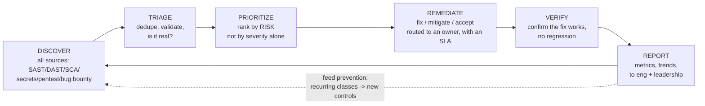
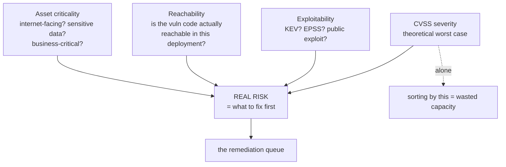
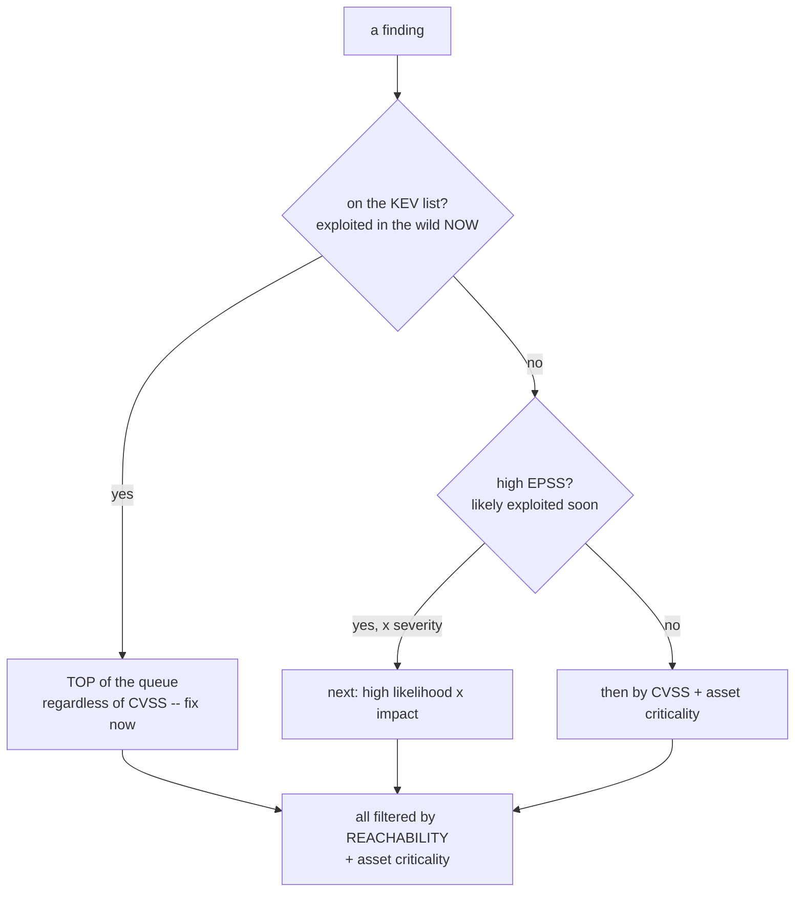
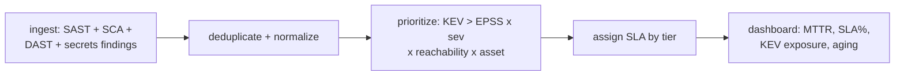

Eight chapters of this notebook have been about *finding* vulnerabilities — by hand, with SAST, with DAST, in dependencies, in secrets, in the pipeline, in containers and infrastructure. This final chapter is about the uncomfortable truth that lies underneath all of them: **finding vulnerabilities is the easy part.** The scanners are good and getting better; run them and you will drown in findings within a day. The hard part — the part where security programs actually succeed or fail — is what happens *next*: deciding which of the thousands of findings matter, getting them to the people who can fix them, ensuring they actually get fixed on a timeline that matches their risk, and proving it. That is **vulnerability management**, and it is the discipline that turns a pile of scan output into reduced risk.

The reframing this chapter demands is fundamental. A program measured by *how many vulnerabilities it finds* is measuring the wrong thing — finding is trivially scalable, you can always find more by turning up the scanners. A program measured by *how much risk it reduces* is measuring the right thing, and risk is only reduced when a vulnerability is actually *remediated*. The entire value of the eight preceding chapters is realized, or lost, in this one: a perfectly-found vulnerability that sits unfixed in a backlog for two years reduced no risk and might as well not have been found. The scanners produce findings; vulnerability management produces *fixes*, and fixes are the only thing that matters.

The chapter's spine is two ideas. First, **ruthless prioritization**, because you cannot fix everything and pretending you can is how programs fail — you must decide, honestly and by risk, what to fix first, what to fix later, and what to consciously accept. Second, **SLA-driven remediation**, because a finding with no deadline is a finding that never gets fixed — attaching a time-to-remediate target to each severity is what creates the accountability that turns "we should fix that" into "that got fixed." Around these sit the supporting machinery: deduplication at scale, ownership and routing, the risk-acceptance process, the metrics that actually mean something, and the organizational reality that remediation happens through *other people* — developers with their own deadlines — which makes vulnerability management as much a discipline of relationships and influence as of technology.

## Why This Matters

The finding-fixing gap is the central, measurable failure of application security, and it is enormous. Study after study of real programs finds that organizations remediate only a fraction of the vulnerabilities they discover, that the median time-to-fix is measured in *months*, and that backlogs of tens or hundreds of thousands of unaddressed findings are normal at scale. The scanners work; the fixing does not keep up. Every one of those unfixed findings is either accepted risk (if consciously) or, far more often, *unconscious* risk — a door left open that nobody decided to leave open, that simply fell off the bottom of an un-prioritized list. Attackers, meanwhile, need only one of those doors, and the KEV catalog (Chapter 8) exists precisely because attackers exploit *known*, *published*, *fixable* vulnerabilities that organizations simply had not gotten around to fixing.

This is why vulnerability management, not scanning, is where a security program lives or dies. A program that finds ten thousand vulnerabilities and fixes the two hundred that matter, on time, is vastly more effective than one that finds fifty thousand and fixes them in random order as developers happen to notice. The difference is not the scanners — it is the *management*: the prioritization that surfaces the two hundred that matter, the SLAs that get them fixed on time, and the accountability that proves it happened. A product security engineer who can *find* vulnerabilities is common; one who can build the workflow that reliably *fixes* the right ones, at scale, across an organization that would rather ship features, is rare and valuable, because that is the skill that actually reduces risk.

And there is a career and program-maturity dimension. The metrics leadership actually cares about — are we getting more or less exposed over time, are we fixing the important things fast enough, what is our risk trend — are *vulnerability-management* metrics, not scanning metrics. The ability to answer "how is our security posture, and is it improving?" with real data (Part 8) is what elevates a security function from a cost center that says "no" to a risk-management function that informs the business. This chapter is where the whole notebook's technical work becomes a *program*.

## Part 1: The Vulnerability Management Lifecycle

Vulnerability management is a continuous cycle, not a one-time cleanup, and naming its phases keeps a program from collapsing into "run scanners and hope."



- **Discover** — aggregate findings from *every* source (the eight chapters' tools, plus pentests and bug bounty, Notebook 47 Chapter 3) into one place. Findings scattered across ten tool dashboards cannot be managed; centralization is the prerequisite.
- **Triage** — deduplicate (Part 5), validate (is this real, or a false positive?), and enrich (what asset, what owner, what exposure). Triage turns raw scanner output into a clean, de-duplicated, contextualized finding.
- **Prioritize** — rank by *risk* (Parts 3–4), because you cannot fix everything and the order is the whole game.
- **Remediate** — fix, mitigate, or accept (Part 7), routed to the owner who can actually do it (Part 6), on a timeline set by an SLA (Part 6).
- **Verify** — confirm the fix actually closed the vulnerability and did not introduce a regression (a fix under deadline is itself a bug risk — Chapter 1's verify phase).
- **Report** — metrics and trends to the people who need them (Part 8), in their language (Part 9).

The loop closes back to prevention: recurring vulnerability *classes* (the same bug type appearing across teams) are a signal to fix the *root cause* — a new SAST rule, a secure-by-default library, a training gap — rather than remediating instances forever (Part 10). A mature program does not just fix vulnerabilities; it drives their *classes* toward zero by feeding what it learns back into the controls of the earlier chapters.

## Part 2: You Cannot Fix Everything — The Overload Problem

The defining reality of vulnerability management at scale, and the one that breaks programs built on the fantasy of "fix everything": **the volume of findings vastly exceeds the capacity to fix them, permanently and by a wide margin.**

The arithmetic is unforgiving. A large organization's scanners produce findings faster than any realistic engineering capacity can remediate them — new code, new dependencies (with new CVEs published daily against dependencies already shipped, Chapter 5), new infrastructure, and re-scans of existing code all generate findings continuously, while remediation competes with feature work for the same scarce engineering time. The backlog does not shrink to zero; it is a *flow* to be managed, not a *stock* to be cleared. Any program whose plan is "fix all the findings" will fail, demoralize everyone, and — worse — fix findings in a haphazard order that leaves the dangerous ones sitting while the trivial ones get closed.

The consequences that the rest of the chapter follows from:

- **Prioritization is not optional; it is the entire discipline.** If you cannot fix everything, the only question that matters is *what do you fix first*, and getting that order right (by risk) is what separates an effective program from a busy one. A program that fixes the right 5% is more effective than one that fixes a random 40%.
- **Conscious acceptance is a legitimate, necessary outcome.** Some findings will *not* be fixed — the risk is too low, the fix too costly, the asset too unimportant — and deciding that *consciously and on the record* (Part 7) is far better than the alternative, which is the finding falling off the bottom of an un-prioritized list as *unconscious* risk. The goal is not zero unfixed findings; it is zero *un-decided* findings.
- **Capacity is the binding constraint, so spend it on the highest risk.** Every hour of remediation is scarce and competes with features. The job of vulnerability management is to point that scarce hour at the finding where it reduces the most risk — which is, again, prioritization.

The mindset shift the chapter demands: **stop trying to drive the finding count to zero and start trying to drive the *risk* down.** A backlog of fifty thousand findings of which the two hundred genuinely dangerous ones are all fixed within SLA is a *healthy* program; a backlog of five thousand fixed in random order with the dangerous ones scattered unfixed among them is a failing one, even though its raw count is lower. Manage risk, not count.

## Part 3: Risk-Based Prioritization — Beyond CVSS

Since prioritization is the whole game, doing it *well* is the core skill, and doing it well means moving beyond the near-universal but broken default of sorting by CVSS severity.

**Why CVSS-alone fails.** CVSS gives a severity score (0–10), and sorting the backlog by it feels rigorous. But CVSS measures the *theoretical worst-case severity of the vulnerability in the abstract* — it does *not* measure the risk *to your specific system*. It ignores whether the vulnerable code is reachable, whether the asset is exposed or internal, whether anyone is actually exploiting this class of bug, and how critical the affected system is. Two findings with identical CVSS can have wildly different real risk: a critical CVE in an unreachable code path on an internal dev tool versus the same CVE on your internet-facing authentication service. Sorting by CVSS treats them identically, which is why CVSS-sorted remediation wastes scarce capacity on theoretically-severe-but-actually-low-risk findings while genuinely dangerous ones wait.

**Real risk combines several factors** (the model from Chapter 1 Part 8 and Chapter 8, now the organizing principle):



- **Severity (CVSS)** — the starting input, the theoretical impact, but only one factor.
- **Exploitability** — is it *actually* being exploited (**KEV**) or *likely* to be (**EPSS**)? This is the factor CVSS most badly misses (Part 4).
- **Reachability** — can an attacker actually reach the vulnerable code in your deployment (Chapter 5's SCA reachability, Chapter 4's DAST demonstration)? An unreachable critical is lower risk than a reachable medium.
- **Asset criticality** — is the affected system internet-facing, does it hold sensitive data, is it business-critical? The same vulnerability on a public payments service and an internal wiki are not the same risk. This is where the threat modeling and data classification of Notebooks 45 and 42 feed in.

The output is a queue ordered by *real risk to your organization*, which is frequently *very different* from a CVSS-sorted queue — and that difference is exactly the value prioritization adds. A finding that is critical-by-CVSS but unreachable on an internal tool drops down the queue; a finding that is medium-by-CVSS but KEV-listed on your internet-facing login jumps to the top. **Prioritize by real risk, and the scarce remediation capacity of Part 2 goes where it reduces the most exposure.**

## Part 4: The KEV and EPSS Revolution

Two data sources have changed vulnerability prioritization more than anything else in the last few years, and understanding them is essential to modern practice (introduced in Chapter 8, developed here as the core of the queue).

**CISA KEV (Known Exploited Vulnerabilities)** is a catalog of CVEs that are *confirmed being exploited in the wild*. This is a binary, high-confidence signal of the highest value: a vulnerability on the KEV list is not a theoretical risk — attackers are *actively using it right now*. The prioritization consequence is decisive: **a KEV-listed finding jumps to the top of the queue regardless of its CVSS score**, because "being exploited now" beats any theoretical severity. KEV converts "we should probably patch that" into "attackers are inside organizations through this, today, fix it now." US federal agencies are *mandated* to remediate KEV vulnerabilities on a fixed timeline, and that is a good model for anyone: KEV is your "drop everything" list.

**EPSS (Exploit Prediction Scoring System)** gives each CVE a *probability* (0–1) that it will be exploited in the next 30 days, computed from real-world exploitation data by FIRST. Where KEV is a binary "is it being exploited," EPSS is a *predictive likelihood*, and it lets you rank the vast backlog of not-yet-KEV findings by *how likely they are to be attacked* rather than by theoretical severity. The revelation EPSS makes visible: **most high-CVSS vulnerabilities are never exploited** — the correlation between CVSS severity and actual exploitation is weak, so a queue sorted by CVSS spends capacity on high-severity bugs nobody attacks while lower-severity but high-EPSS bugs (which attackers *are* going after) wait. EPSS corrects this by ranking on *likelihood of attack*.



The modern prioritization stack, which every serious program now uses: **KEV first (fix now, regardless of severity) → high EPSS × severity next (likely-to-be-attacked) → then CVSS + asset criticality → all filtered by reachability.** This is a dramatically better use of scarce remediation capacity than CVSS-sorting, because it concentrates effort on what is *actually being and likely to be attacked* rather than on what is *theoretically severe*. KEV and EPSS are the difference between a queue that reflects the threat landscape and one that reflects a scoring committee's worst-case imagination.

## Part 5: Deduplication and Correlation at Scale

Before findings can be prioritized, they must be *clean*, and at scale that means solving the duplication problem (introduced in Chapter 7 Part 5, essential here). The same underlying vulnerability appears many times: the same dependency CVE in every one of fifty services, the same SAST finding on every commit until fixed, the same issue reported by SAST *and* DAST *and* a pentester. Without deduplication, a program is buried in redundant findings, the same fix appears as a hundred tickets, and the true number of distinct problems is invisible.

The techniques:

- **Deduplication** — collapse multiple reports of the *same* finding into one. The same dependency CVE across fifty services is *one* vulnerability to fix (bump the dependency) with fifty *instances*, not fifty separate problems — and presenting it as one, with its fifty locations, is what makes it actionable.
- **Correlation** — link findings that are the same issue seen by *different tools* (SAST's vulnerable line + DAST's demonstrated exploit + the SCA CVE), producing one enriched, high-confidence finding instead of three uncorrelated ones (Chapter 4's SAST/DAST correlation).
- **Normalization** — findings from different tools use different formats, severities, and identifiers; normalizing them to a common schema (and a common severity scale) is what lets them be compared and ranked together at all.

This is the core function of the **ASPM (Application Security Posture Management)** platform category (Chapter 7 Part 5) — DefectDojo (open source) and the commercial equivalents ingest findings from every tool, deduplicate and correlate and normalize them, and present a single, de-duplicated, prioritized view. For anything beyond a handful of repositories, this layer is not optional: the alternative is drowning in redundant findings across a dozen tool dashboards, unable to see the actual distinct-vulnerability count, let alone prioritize it. **Deduplication is what makes the finding volume of Part 2 comprehensible enough to prioritize.**

## Part 6: SLA-Driven Remediation and Ownership

Prioritization decides *what* to fix first; SLAs and ownership are what actually get it *fixed*.

**SLAs create accountability.** A **remediation SLA** is a time-to-remediate target tied to a finding's risk tier — for example: Critical within 7 days, High within 30, Medium within 90, Low within 180 (the exact numbers vary by organization and are set to what is achievable-but-ambitious). The reason SLAs matter is human, not technical: **a finding with no deadline is a finding that never gets fixed**, because it always loses to work that *has* a deadline (features, incidents, everything with a date). Attaching a deadline to each finding by risk tier is what turns "we should fix that eventually" into "this is due Thursday" — it creates the accountability and the prioritization signal that make remediation actually happen. SLAs are the single most effective mechanism for driving fixes, because they convert an open-ended good intention into a tracked commitment with a date.

The honest limits of SLAs, stated so they are used well rather than cargo-culted:

- **An SLA you cannot meet is worse than none** — if the SLA is set to a timeline engineering has no capacity to hit, it is missed constantly, everyone learns to ignore it, and it becomes a compliance fiction. Set SLAs to *achievable-but-ambitious* targets, and if they are consistently missed, that is a *capacity* signal to escalate, not a number to fudge.
- **SLAs measure time, not risk reduction** — meeting SLAs is a means, not the end. A program can hit its SLAs on easy findings while the hard, dangerous ones get exception after exception. Watch the risk, not just the SLA-compliance percentage.
- **SLAs need teeth** — an SLA with no consequence for breach is a suggestion. The consequence is usually escalation (to the team's manager, then to leadership) and visibility (a breached-SLA dashboard), not punishment — but there must be *something*, or the deadline is optional.

**Ownership — route to who can actually fix it.** A finding is only actionable if it reaches the team that owns the affected code and *can* fix it. This is a surprisingly hard and surprisingly decisive problem: at scale, mapping a finding (a file, a service, a dependency) to the *owning team* is non-trivial, and a finding routed to the wrong team, or to a generic "security" queue nobody owns, does not get fixed. The prerequisites: a **service/asset ownership map** (who owns which code and infrastructure), and **automated routing** that files the finding as a ticket in the owning team's own workflow (their Jira, their board) rather than a separate security system they never look at. **A finding in the developer's own backlog gets fixed; a finding in a security dashboard the developer never opens does not** — the same "meet developers where they work" principle as Chapter 7's PR comments. The security team's job is to make the finding land, prioritized and actionable, in front of the person who can fix it, with a deadline; the fix itself is the owning team's.

## Part 7: The Remediation Options — Fix, Mitigate, Accept

Not every finding is fixed, and treating "fix" as the only outcome is why programs get stuck. There are three legitimate responses, and choosing consciously among them is part of the discipline.

- **Fix (remediate)** — eliminate the vulnerability: patch the dependency, correct the code, fix the misconfiguration. The default and the goal, and the only option that actually removes the risk.
- **Mitigate** — reduce the risk without removing the vulnerability: a WAF rule blocking the exploit path, a config change disabling the vulnerable feature (the Log4j `formatMsgNoLookups` example, Chapter 5), network restrictions reducing exposure. Mitigation is a **bridge**, appropriate when a fix is not immediately available (no patch yet) or not immediately feasible, and it must be *tracked with the real fix still owed* — a mitigation that becomes permanent-and-forgotten is a risk hiding behind a checkbox.
- **Accept** — consciously decide *not* to fix, because the risk is low enough, the fix costly enough, or the asset unimportant enough that accepting is the rational business decision.

**Risk acceptance done responsibly** is essential (it is the conscious-decision half of Part 2) and dangerous if done sloppily. The rules:

- **It is a decision by an accountable owner**, not a developer silently closing a ticket. Who can accept what risk should be defined by level — a team lead can accept a low, a senior leader a high — so the acceptance authority matches the risk magnitude.
- **It is documented** — the finding, the risk, the reason for accepting, who accepted it, and when. An undocumented acceptance is indistinguishable from an ignored finding (Chapter 3's suppression discipline, at the risk level).
- **It is time-bound and revisited** — a risk accepted today may be unacceptable when a public exploit appears or the asset's exposure changes. Accepted risks get an expiry and a review date, not a permanent pass. A KEV listing against an accepted risk should reopen it immediately.
- **It is honest** — risk acceptance is a legitimate tool, *not* a way to make inconvenient findings disappear. A program where everything hard gets "accepted" is not managing risk; it is hiding it. The pattern of *what* gets accepted is itself a metric to watch.

The framing: **the goal is that every finding has a conscious disposition — fixed, mitigating-toward-fixed, or accepted-with-a-reason — and that none simply rots un-decided.** Un-decided is unconscious risk; a decided-and-accepted risk is managed risk. The difference is the whole point of the discipline.

## Part 8: Metrics That Actually Matter

You cannot manage what you do not measure, and vulnerability-management metrics are what tell you — and leadership — whether the program is working. But metrics are also where programs deceive themselves with vanity numbers, so the distinction between real and vanity metrics is critical.

**The metrics that matter** (they measure *risk reduction over time*):

| Metric | What it tells you | Watch for |
|---|---|---|
| **Mean Time to Remediate (MTTR)**, by severity | How fast you fix what matters | Trending down = improving |
| **SLA compliance %**, by severity | Are you fixing on time? | High compliance on *criticals* is what counts |
| **Open vulnerability age** | How long findings sit | Aging criticals are the real danger |
| **Vulnerability trend** (found vs fixed rate) | Are you gaining or losing? | Fixed-rate ≥ found-rate = winning |
| **KEV exposure** | Known-exploited vulns still open | Should be ~zero, always |
| **Reopen rate** | Fixes that did not hold | High = verification is failing |
| **Risk-acceptance pattern** | What is being accepted | A rising acceptance rate on highs is a red flag |
| **Coverage** | What fraction of assets are scanned | Blind spots are unmeasured risk |

**Vanity metrics to distrust** (they measure *activity*, not *risk*):

- **Total number of vulnerabilities found** — measures the scanners' output, not the program's effectiveness. Turning up the scanners "improves" it while reducing no risk. A *rising* found-count can mean better coverage (good) or worse code (bad) — it says nothing alone.
- **Number of vulnerabilities closed** — can be inflated by closing trivial findings while dangerous ones sit. Closed-count without a risk weighting is activity theater.
- **Raw open count** — meaningless without severity, age, and risk context. Fifty thousand lows is a very different posture than five hundred aging criticals.

The principle: **measure risk reduction, not activity.** The question every metric should serve is "are the *dangerous* things getting fixed *fast enough*, and is our exposure trending down?" — MTTR-on-criticals, SLA-compliance-on-criticals, KEV-exposure, and the found-vs-fixed trend answer that; raw counts do not. And the metric a program should be *proudest* of is a boring one: zero open KEV vulnerabilities and criticals fixed within SLA. That is not a dashboard that impresses with big numbers; it is a dashboard that proves the dangerous doors are closed.

## Part 9: Reporting, and the Human Reality of Remediation

Two truths that determine whether a technically-sound program actually works in an organization.

**Report to each audience in its language.** The same vulnerability data must be communicated very differently up and across:

- **To engineering**: specific, actionable, in-context — the finding, the file, the fix, the SLA, in their own backlog (Part 6). Engineers need *what to do*, not risk narratives.
- **To leadership**: risk and trend, in business terms — "our exposure to known-exploited vulnerabilities is near zero and our time-to-fix criticals has halved this quarter," not "we have 4,213 findings." Leadership needs *are we getting safer, and where should we invest* (Notebook 47 Chapter 6 is entirely about this). A report full of CVE IDs to an executive communicates nothing; a report of risk trend and the one or two areas needing investment communicates everything.

**Remediation happens through other people, so it is a discipline of relationships.** The single most important non-technical truth of this chapter: the security team almost never fixes the vulnerabilities — *developers do*, and developers have their own deadlines, their own priorities, and no particular reason to prioritize a security finding over the feature their manager is asking for. This makes vulnerability management fundamentally a discipline of **influence, not authority**:

- **Blame fails.** A program that treats developers as the problem ("you wrote the bug") creates adversaries who route around security. A finding is a shared problem to solve, not an accusation.
- **Make fixing easy.** The lower the friction — actionable findings, clear fixes, findings in their workflow, help when they are stuck — the more gets fixed. Friction is the enemy of remediation (Chapter 7's developer-experience theme, at the finding level).
- **Security debt is real debt.** Unremediated vulnerabilities accumulate like technical debt, and framing them that way — as debt the organization is carrying, with interest — is language engineering leadership understands and can prioritize against.
- **The relationship is the leverage.** A security team that developers trust and want to work with gets its findings fixed; one they resent gets its findings ignored. The soft skills are not soft — they are the mechanism by which risk actually gets reduced.

The synthesis: **vulnerability management is a socio-technical discipline.** The technology (dedup, prioritization, SLAs, dashboards) is necessary, but the outcomes are produced by *people* fixing things, and the program's real skill is getting the right things fixed by people who do not report to it, through prioritization they believe, deadlines they accept, and a relationship that makes security an ally rather than an obstacle.

## Part 10: Hands-On Lab — A Vulnerability-Management Workflow

### 10.1 What we are building

A working vulnerability-management pipeline: ingest findings from multiple tools, deduplicate (Part 5), prioritize by real risk with KEV/EPSS (Parts 3–4), assign SLAs by tier (Part 6), and produce a remediation dashboard with the metrics that matter (Part 8).



Python 3 only.

### 10.2 Multi-tool findings

```bash
mkdir -p ~/vm-lab && cd ~/vm-lab
cat > findings.json <<'JSON'
[
 {"id":"SAST-1","tool":"semgrep","cve":null,"title":"SQLi in search",
  "cvss":9.8,"epss":0.30,"kev":false,"reachable":true,"asset":"public-api","age_days":3},
 {"id":"SCA-1","tool":"trivy","cve":"CVE-2021-44228","title":"Log4Shell",
  "cvss":10.0,"epss":0.97,"kev":true,"reachable":true,"asset":"public-api","age_days":2},
 {"id":"SCA-2","tool":"pip-audit","cve":"CVE-2021-44228","title":"Log4Shell (dup)",
  "cvss":10.0,"epss":0.97,"kev":true,"reachable":true,"asset":"public-api","age_days":2},
 {"id":"SCA-3","tool":"trivy","cve":"CVE-2020-1747","title":"PyYAML RCE",
  "cvss":9.8,"epss":0.04,"kev":false,"reachable":false,"asset":"internal-tool","age_days":40},
 {"id":"DAST-1","tool":"zap","cve":null,"title":"Missing HSTS header",
  "cvss":3.1,"epss":0.01,"kev":false,"reachable":true,"asset":"public-api","age_days":15},
 {"id":"SEC-1","tool":"gitleaks","cve":null,"title":"Live AWS key in repo",
  "cvss":8.0,"epss":0.50,"kev":false,"reachable":true,"asset":"public-api","age_days":1}
]
JSON
echo "6 raw findings (note SCA-1 and SCA-2 are the SAME CVE from different tools)"

# Sample output:
# 6 raw findings (note SCA-1 and SCA-2 are the SAME CVE from different tools)
```

### 10.3 The vulnerability-management engine

```python
# vm.py -- dedupe, risk-prioritize (KEV/EPSS/reachability/asset), assign SLAs, report.
import json, sys
from datetime import date

# Part 6: SLA targets (days) by risk tier.
SLA = {"CRITICAL": 7, "HIGH": 30, "MEDIUM": 90, "LOW": 180}
# Part 3: asset criticality multiplier.
ASSET_WEIGHT = {"public-api": 1.0, "internal-tool": 0.4, "dev": 0.2}

def dedupe(findings):
    """Part 5: collapse the same CVE on the same asset into one, keeping instances."""
    seen = {}
    for f in findings:
        key = (f["cve"], f["asset"]) if f["cve"] else (f["id"], f["asset"])
        if key in seen:
            seen[key]["instances"].append(f["id"])
        else:
            f = dict(f); f["instances"] = [f["id"]]
            seen[key] = f
    return list(seen.values())

def risk_score(f):
    """Parts 3-4: KEV dominates; else EPSS x CVSS; x reachability x asset."""
    base = f["cvss"]
    if f["kev"]:
        base = 100                                   # KEV jumps the queue (Part 4)
    else:
        base = f["cvss"] * (0.3 + f["epss"])         # weight by exploit likelihood
    if not f["reachable"]:
        base *= 0.3                                  # unreachable -> much lower risk
    base *= ASSET_WEIGHT.get(f["asset"], 0.5)
    return round(base, 1)

def tier(score):
    return ("CRITICAL" if score >= 8 else "HIGH" if score >= 5 else
            "MEDIUM" if score >= 2 else "LOW")

def main(path):
    raw = json.load(open(path))
    findings = dedupe(raw)
    for f in findings:
        f["risk"] = risk_score(f)
        f["tier"] = tier(f["risk"]) if not f["kev"] else "CRITICAL"
        f["sla_days"] = SLA[f["tier"]]
        f["sla_breached"] = f["age_days"] > f["sla_days"]
    findings.sort(key=lambda f: -f["risk"])

    print(f"{len(raw)} raw -> {len(findings)} after dedupe\n")
    print(f"{'RISK':<6}{'TIER':<10}{'SLA':<5}{'AGE':<5}{'BREACH':<7}{'KEV':<5}FINDING")
    print("-" * 78)
    for f in findings:
        b = "YES" if f["sla_breached"] else "-"
        k = "KEV" if f["kev"] else "-"
        dup = f" (x{len(f['instances'])})" if len(f["instances"]) > 1 else ""
        print(f"{f['risk']:<6}{f['tier']:<10}{f['sla_days']:<5}{f['age_days']:<5}"
              f"{b:<7}{k:<5}{f['title']}{dup}")
    print("-" * 78)

    # Part 8: the metrics that matter.
    kev_open = sum(1 for f in findings if f["kev"])
    breached = sum(1 for f in findings if f["sla_breached"])
    crit = sum(1 for f in findings if f["tier"] == "CRITICAL")
    print(f"METRICS: KEV exposure={kev_open} (target 0) | "
          f"SLA breaches={breached} | open criticals={crit}")
    sys.exit(1 if (kev_open or breached) else 0)

if __name__ == "__main__":
    main(sys.argv[1] if len(sys.argv) > 1 else "findings.json")
```

```bash
python3 vm.py findings.json

# Sample output:
# 6 raw -> 5 after dedupe
#
# RISK  TIER      SLA  AGE  BREACH KEV  FINDING
# ------------------------------------------------------------------------------
# 100.0 CRITICAL  7    2    -      KEV  Log4Shell (x2)
# 9.5   CRITICAL  7    3    -      -    SQLi in search
# 4.2   MEDIUM    90   1    -      -    Live AWS key in repo
# 1.2   LOW       180  40   -      -    PyYAML RCE
# 0.9   LOW       180  15   -      -    Missing HSTS header
# ------------------------------------------------------------------------------
# METRICS: KEV exposure=1 (target 0) | SLA breaches=0 | open criticals=2
```

Read the result against the chapter. The two Log4Shell reports **deduplicated** into one finding (x2 instances). **KEV put Log4Shell at the top** regardless of the SQLi's near-identical CVSS (Part 4). The **PyYAML RCE — CVSS 9.8, "critical" by severity — dropped to the bottom** because it is *unreachable* on an *internal tool* (Part 3): CVSS-sorting would have put it near the top and wasted capacity there. The dashboard surfaces the one metric that matters most: **KEV exposure = 1, target 0** — there is a known-exploited vulnerability open, and that is the program's single most urgent fact.

### 10.4 The remediation queue with SLAs and ownership

```python
# queue.py -- turn prioritized findings into owned, SLA'd tickets (Part 6).
import json
from datetime import date, timedelta

OWNERS = {"public-api": "team-payments", "internal-tool": "team-platform"}

findings = [
 {"title":"Log4Shell","tier":"CRITICAL","sla_days":7,"asset":"public-api"},
 {"title":"SQLi in search","tier":"CRITICAL","sla_days":7,"asset":"public-api"},
 {"title":"Live AWS key","tier":"MEDIUM","sla_days":90,"asset":"public-api"},
]
today = date.today()
print(f"{'OWNER':<16}{'TIER':<10}{'DUE':<12}FINDING")
print("-" * 60)
for f in findings:
    due = today + timedelta(days=f["sla_days"])
    owner = OWNERS[f["asset"]]
    print(f"{owner:<16}{f['tier']:<10}{due.isoformat():<12}{f['title']}")
print("-" * 60)
print("each is filed as a ticket in the OWNING team's own backlog, with the due date.")
```

```bash
python3 queue.py

# Sample output:
# OWNER           TIER      DUE         FINDING
# ------------------------------------------------------------
# team-payments   CRITICAL  2027-06-28  Log4Shell
# team-payments   CRITICAL  2027-06-28  SQLi in search
# team-payments   MEDIUM    2027-09-19  Live AWS key
# ------------------------------------------------------------
# each is filed as a ticket in the OWNING team's own backlog, with the due date.
```

Each finding now has an **owner** (routed to the team that can fix it, Part 6) and a **due date** (the SLA made concrete). This is the difference between a scan report and a managed program: the dangerous findings are prioritized, owned, and deadlined — the accountability that actually produces fixes.

### 10.5 Extending the lab

Pull live EPSS scores from the FIRST API and real KEV data from the CISA feed and re-run the prioritization against actual threat data; add a risk-acceptance workflow (Part 7) where a finding can be marked accepted with an owner, reason, and expiry, and show it reopening when a KEV listing appears; wire the whole thing into DefectDojo (Part 5) for real dedup and ticketing; add the trend metric (found-rate vs fixed-rate over time) that tells you whether the program is winning; and generate the two reports of Part 9 — an engineering ticket list and a leadership risk-trend summary — from the same data.

## Part 11: Common Pitfalls

**Measuring finding count instead of risk reduction.** Finding is trivially scalable; fixing the right things is the job. A program proud of how many vulnerabilities it finds is measuring the wrong thing.

**Trying to fix everything.** You cannot, permanently and by a wide margin. Prioritize ruthlessly by risk and consciously accept the rest — the goal is zero *un-decided* findings, not zero findings.

**Sorting the queue by CVSS.** CVSS is theoretical worst-case severity, not risk to your system. It ignores exploitability, reachability, and asset criticality. Prioritize by real risk, with KEV and EPSS.

**Ignoring KEV.** A known-exploited vulnerability is being used against organizations *right now*, regardless of its CVSS. KEV is the drop-everything list; open KEV exposure should be near zero.

**No SLAs.** A finding with no deadline never gets fixed — it always loses to work that has a date. SLAs create the accountability that produces fixes.

**SLAs you cannot meet.** An unachievable SLA is missed constantly and then ignored, becoming a fiction. Set achievable-but-ambitious targets; consistent misses are a capacity signal, not a number to fudge.

**No ownership / findings in a security dashboard nobody opens.** A finding only gets fixed if it reaches the team that can fix it, in *their* workflow. Route to owners; meet developers where they work.

**Risk acceptance as a dumping ground.** Accepting risk is legitimate; accepting everything hard is hiding risk. Acceptances must be by an accountable owner, documented, time-bound, revisited, and honest — and the acceptance *pattern* is a metric to watch.

**Not deduplicating.** The same CVE across fifty services is one fix, not fifty problems. Without dedup, the program drowns and the true distinct-vulnerability count is invisible.

**Treating developers as the problem.** Blame creates adversaries who route around security. Remediation happens through people who do not report to you; influence, low friction, and relationship are the mechanism.

**Skipping verification.** A fix that did not hold (or introduced a regression) is a reopened finding. Confirm fixes actually closed the vulnerability; watch the reopen rate.

**Never closing the loop to prevention.** Fixing the same class forever is a treadmill. Recurring classes are a signal to fix the root cause — a new control, a secure default, a training gap.

## Final Revision / Summary

- **Finding vulnerabilities is the easy part; remediation is where programs succeed or fail.** The value of all eight preceding chapters is realized only when a finding is actually *fixed* — a found-but-unfixed vulnerability reduced no risk. Measure **risk reduction, not finding count.**
- The **lifecycle** is a continuous loop: discover (aggregate all sources) → triage (dedupe, validate) → prioritize (by risk) → remediate (fix/mitigate/accept, owned, with an SLA) → verify → report → and **feed recurring classes back to prevention.**
- **You cannot fix everything** — findings permanently exceed capacity by a wide margin. Therefore **prioritization is the entire discipline**, and **conscious acceptance is a legitimate outcome**. The goal is zero *un-decided* findings (managed risk), not zero findings (impossible).
- **Prioritize by real risk, not CVSS alone.** CVSS is theoretical worst-case severity and ignores whether the vuln is reachable, exposed, exploited, or on a critical asset. Real risk = severity × **exploitability (KEV/EPSS)** × **reachability** × **asset criticality**, and the risk-sorted queue is often very different from the CVSS-sorted one.
- **KEV and EPSS revolutionized prioritization**: **KEV** (confirmed exploited in the wild) is a binary drop-everything signal that **tops the queue regardless of CVSS**; **EPSS** (predicted exploit probability) ranks the backlog by likelihood-of-attack, revealing that **most high-CVSS bugs are never exploited.** The stack: **KEV → high EPSS × severity → CVSS + asset, all filtered by reachability.**
- **Deduplicate and correlate at scale** (one CVE across fifty services = one fix with fifty instances; SAST+DAST+SCA of the same bug = one enriched finding). This is the **ASPM** platform function (DefectDojo, commercial) and it is what makes the finding volume comprehensible enough to prioritize.
- **SLAs create accountability** — a finding with no deadline never gets fixed. Time-to-remediate targets by risk tier (e.g., Critical 7d / High 30d) convert intentions into tracked commitments. But an **unachievable SLA is worse than none**, SLAs measure time not risk, and they need teeth (escalation). **Route findings to the owning team, in their own workflow** — a finding in a security dashboard nobody opens does not get fixed.
- **Three remediation options**: **fix** (removes the risk — the goal), **mitigate** (a tracked bridge when no fix is available, real fix still owed), **accept** (conscious decision — by an accountable owner, documented, time-bound, revisited, honest; reopened by a KEV listing). Every finding gets a **conscious disposition**.
- **Metrics measure risk reduction, not activity**: MTTR-by-severity, SLA-compliance (especially on criticals), open-vuln age, found-vs-fixed trend, **KEV exposure (target ~0)**, reopen rate, acceptance pattern. **Distrust vanity metrics** — total found, raw closed count, raw open count — which measure activity while reducing no risk.
- **Report in each audience's language** (engineering: actionable findings in their backlog; leadership: risk and trend in business terms), and remember that **remediation is socio-technical** — it happens through developers who do not report to you, so it is a discipline of **influence, low friction, and relationship, not authority.** Blame fails; making fixing easy works; security debt is real debt.

## Cheat Sheet / Quick Reference

**The reframe**

```
finding = easy (trivially scalable). FIXING the right things = the job.
measure RISK REDUCTION, not finding count.
you cannot fix everything -> prioritize ruthlessly + accept consciously.
goal: zero UN-DECIDED findings (not zero findings).
```

**Prioritize by REAL RISK (not CVSS alone)**

```
risk = severity x EXPLOITABILITY (KEV/EPSS) x REACHABILITY x ASSET CRITICALITY
CVSS alone = theoretical worst case, ignores your system -> wastes capacity
```

**KEV / EPSS stack**

```
1. KEV (exploited in the wild NOW) -> TOP of queue, regardless of CVSS
2. high EPSS x severity            -> likely-to-be-attacked next
3. CVSS + asset criticality        -> the rest
   ... all filtered by REACHABILITY
most high-CVSS bugs are NEVER exploited -> EPSS corrects the queue
```

**SLAs (create accountability)**

```
time-to-remediate by tier, e.g. CRIT 7d / HIGH 30d / MED 90d / LOW 180d
a finding with no deadline never gets fixed
unachievable SLA is WORSE than none (becomes fiction)
needs teeth (escalation) | route to the OWNING team, in THEIR backlog
```

**Three dispositions (every finding gets one)**

```
FIX      -> removes the risk (the goal)
MITIGATE -> tracked bridge; real fix still owed (no patch yet)
ACCEPT   -> accountable owner + documented + time-bound + revisited + honest
            (reopened by a KEV listing)
```

**Metrics: risk reduction, not activity**

```
REAL:   MTTR by severity | SLA compliance (on CRITICALS) | vuln age
        found-vs-fixed trend | KEV exposure (target ~0) | reopen rate | acceptance pattern
VANITY: total found | raw closed count | raw open count (activity, not risk)
proudest metric = zero open KEV + criticals fixed within SLA (boring = good)
```

**The human reality**

```
remediation happens through DEVELOPERS who don't report to you
-> influence not authority | blame fails | make fixing EASY | security debt = real debt
report: engineering = actionable in their backlog | leadership = risk + trend in $$$
```

## Practice Labs & Resources

**Data sources and platforms**
- **CISA KEV catalog** and **FIRST EPSS** (with APIs) — the two data sources that drive modern prioritization; wire both into the lab.
- **DefectDojo** — the open-source ASPM/vulnerability-management platform; ingest multi-tool findings and see dedup, SLAs, and reporting.
- **FIRST CVSS** specification — to understand precisely what CVSS does and does not measure.

**Hands-on**
- Extend the lab: pull live KEV and EPSS data; add a time-bound risk-acceptance workflow; wire into DefectDojo; add the found-vs-fixed trend; generate the two Part 9 reports from one dataset.
- Take a real (or sample) multi-tool finding export and run it through the full workflow — dedupe, risk-rank, SLA, owner — and compare the risk order to the CVSS order.
- Build the ownership map for a small set of services and route findings to the right teams automatically.

**Deliberate practice**
- For any backlog, resist CVSS-sorting: rank by KEV → EPSS × severity → asset, filtered by reachability, and notice how different the top of the queue is.
- Design achievable-but-ambitious SLAs for an organization you know, and identify what escalation would give them teeth.
- Audit a set of risk acceptances for the Part 7 discipline: accountable owner, documented reason, expiry, honesty — and flag the ones that are really just hidden risk.

**Further reading**
- The CISA KEV and FIRST EPSS documentation and the research on the weak CVSS-exploitation correlation (Cyentia/EPSS papers).
- **OWASP Vulnerability Management Guide** and the DefectDojo documentation.
- This notebook's Chapters 1–8 (the sources of the findings this chapter manages) and Chapter 8's KEV/EPSS introduction; and **Notebook 47**, which places vulnerability management inside a full product-security *program* — metrics to leadership (Chapter 6), bug bounty as a finding source (Chapter 3), and the capstone that ties the whole S-SDLC together.
