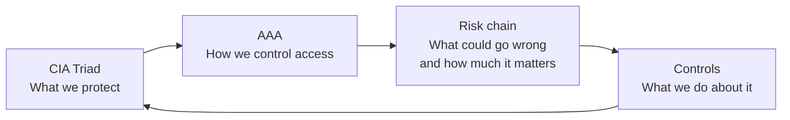
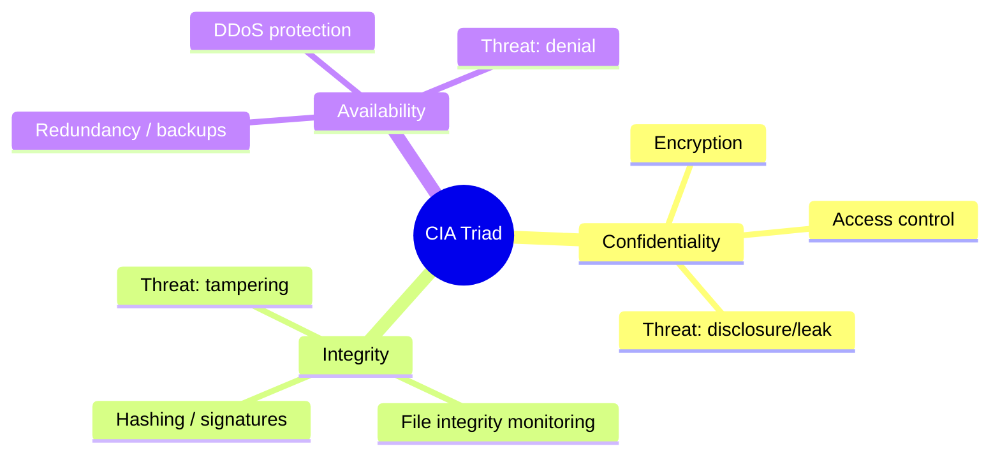
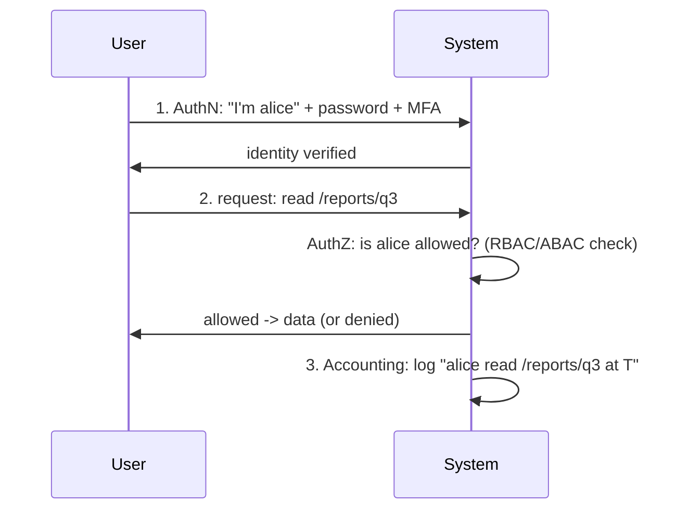
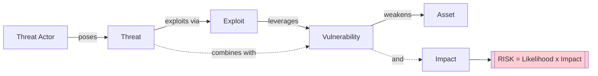
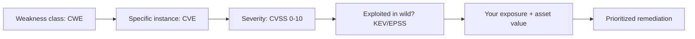
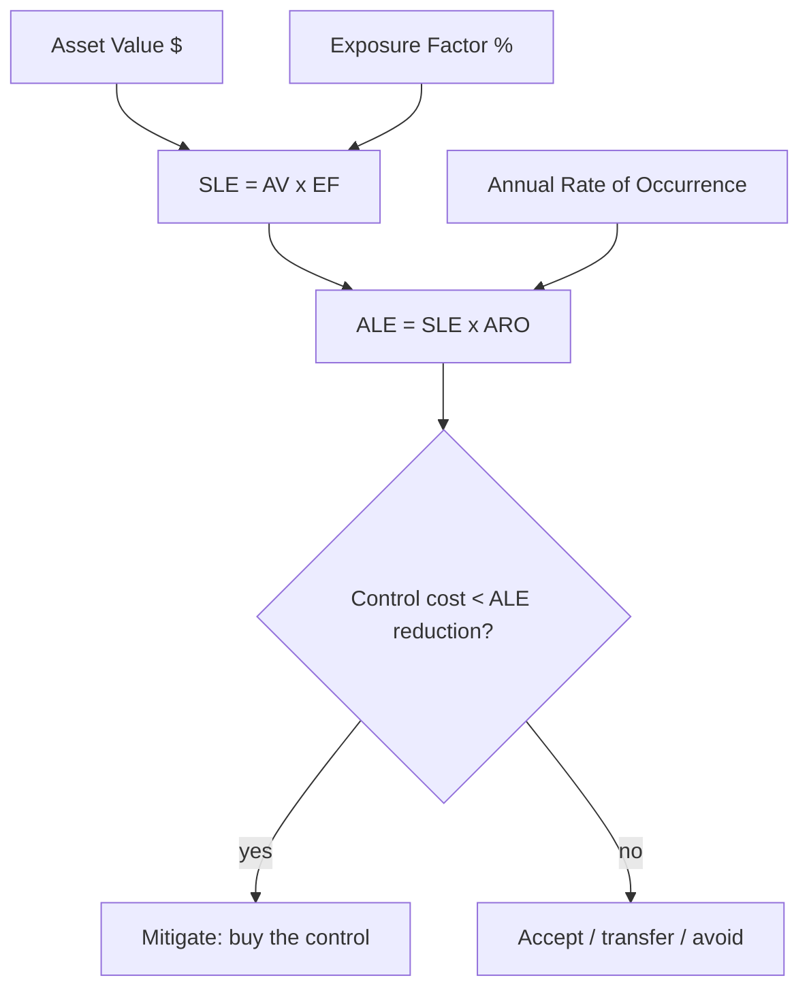
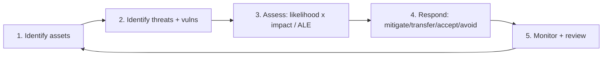
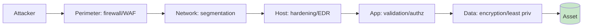
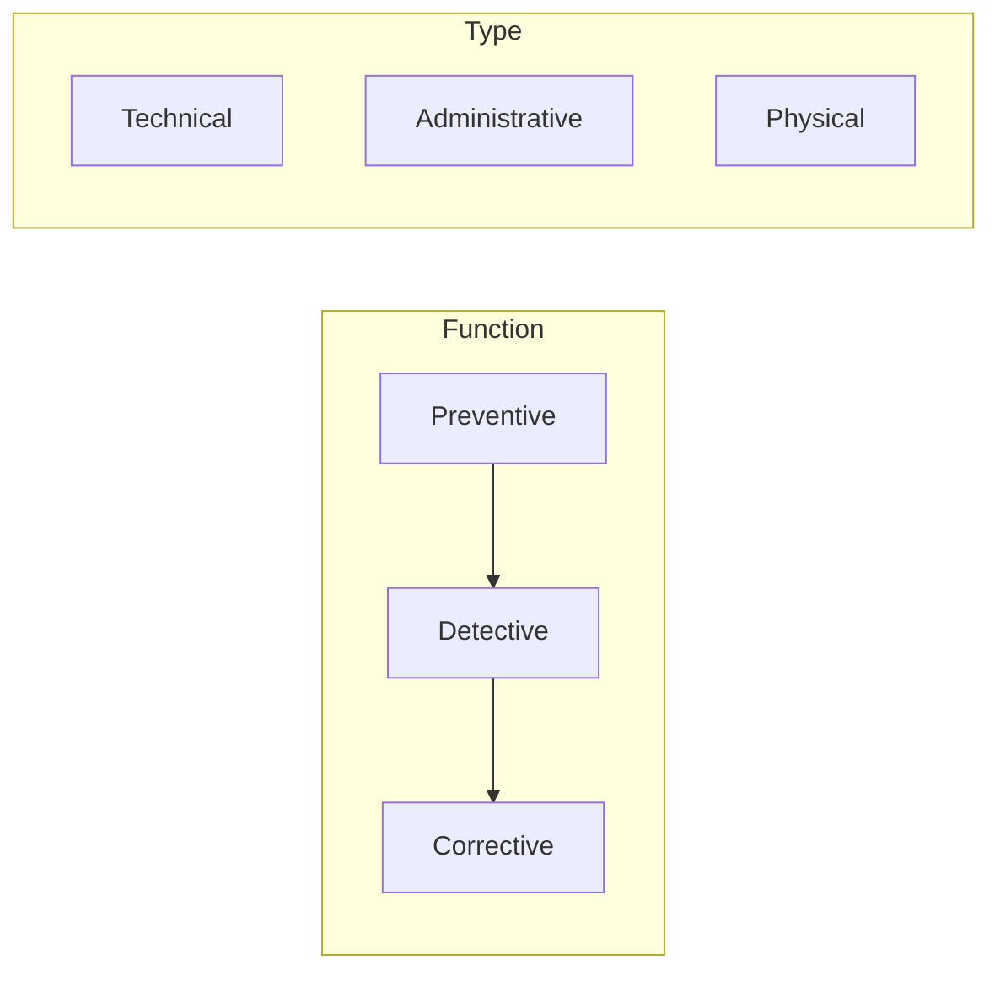
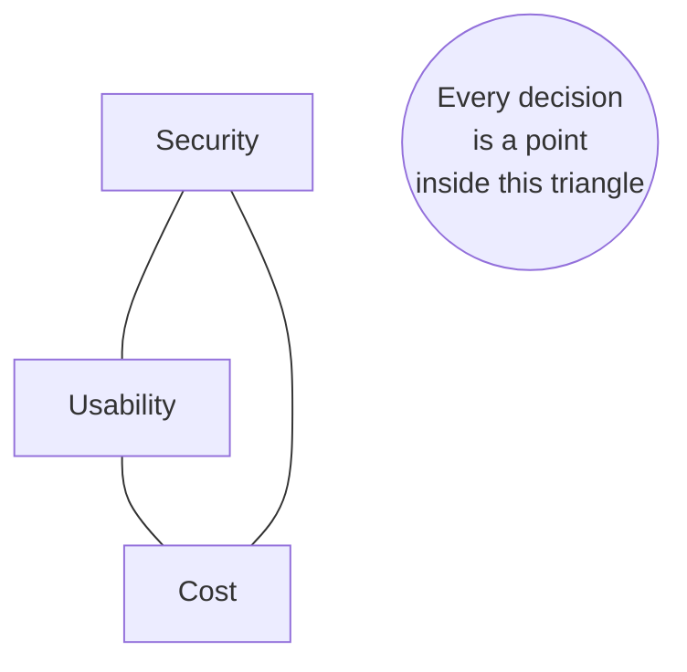

**Level:** Beginner · **Track:** Foundations · **Read time:** 175 min

This is Chapter 1 of the Security Foundations series — Notebook 8. Everything you've built so far — Linux,
networking, web, cryptography — has been *mechanism*: how things work and how they break. This notebook is
the *framework* that organizes all of it into a discipline. Before you can defend a system, break into one
lawfully, model a threat, or write a finding, you need a shared, precise vocabulary — because in security,
sloppy words cause real mistakes. "Is this a threat or a vulnerability?" "Is this an authentication or an
authorization bug?" "How risky is this, actually?" These aren't pedantry; a pentest report that confuses
threat with risk gets ignored, and a control chosen against the wrong part of the CIA triad wastes money
and leaves the real gap open.

This chapter defines the core models — the **CIA triad**, the **AAA model**, and the
**asset/threat/vulnerability/risk** chain — with the precision a professional uses them, and shows how they
combine into a risk equation you can compute. These concepts look simple, even obvious, but using them
*correctly and consistently* is what separates a professional from someone who has merely memorized terms.
By the end, every one of these words will be a tool you reach for, not a buzzword you nod at.

## Part 1: Why a Shared Vocabulary Is the First Security Control

Security is a team sport played against adversaries, and the team needs a common language. When an incident
responder says "we lost integrity but not confidentiality," a room full of engineers should instantly know
the data was *altered* but not *stolen* — a completely different response than the reverse. When a risk
analyst says "high impact, low likelihood," a budget decision follows. When a pentester writes
"authorization flaw, not authentication," the developer knows to fix the access check, not the login.

The models in this chapter are the coordinate system for that language:

- **CIA triad** — *what security properties* you're protecting (the goals).
- **AAA** — *how you control access* to enforce them (the mechanism).
- **Asset → Threat → Vulnerability → Risk** — *how you reason about what could go wrong* and prioritize
  (the analysis).



Everything else in security — a firewall rule, a bcrypt hash, a SIEM alert, a bug-bounty finding — is an
instance of protecting one CIA property, enforcing one AAA function, or reducing one risk. Learn the frame
and the rest of the field organizes itself onto it.

## Part 2: The CIA Triad — Confidentiality, Integrity, Availability

The **CIA triad** is the foundational model of information security. Every security goal reduces to
protecting one or more of these three properties. (It has nothing to do with the intelligence agency — the
name collision is unfortunate but universal.)

### Confidentiality — keep secrets secret

**Confidentiality** means information is accessible only to those authorized to see it. It's the property
you protect with **encryption** (Chapters 2–3 of Cryptography), **access controls**, and
**data classification**. A breach of confidentiality is *disclosure*: a database dump, an eavesdropped
connection, a leaked API key, shoulder-surfing a password.

- **Protected by:** encryption at rest and in transit (TLS, disk encryption), access control (permissions,
  RBAC), authentication, network segmentation, data-loss-prevention (DLP).
- **Attacked by:** sniffing (Wireshark on an open network), SQL injection dumping a table, a stolen laptop,
  a misconfigured S3 bucket, social engineering.
- **Example:** your medical records visible only to you and your doctor. If an attacker reads them, that's
  a confidentiality failure — *even if they change nothing.*

### Integrity — keep data correct and trustworthy

**Integrity** means information is accurate and has not been altered by unauthorized parties (or in
unauthorized ways). It's protected by **hashing and MACs** (Cryptography Chapter 4), **digital signatures**
(Chapter 6), version control, checksums, and access controls on *writing*. A breach of integrity is
*tampering*: a changed bank balance, a defaced website, a poisoned software update, a modified log to hide
an intrusion.

- **Protected by:** cryptographic hashes/checksums, digital signatures, MACs, file-integrity monitoring
  (FIM), write access controls, database constraints, immutable/append-only logs.
- **Attacked by:** man-in-the-middle modification, SQL injection updating records, malware altering files,
  a supply-chain implant in a build.
- **Example:** a wire transfer for $100 must not become $100,000 in flight. Integrity failures are often
  *more* damaging than confidentiality ones because they undermine trust in the data itself.

### Availability — keep it usable when needed

**Availability** means authorized users can access the information and systems when they need them. It's
protected by **redundancy**, **backups**, **DDoS protection**, capacity planning, and failover. A breach of
availability is *denial*: a ransomware lockout, a DDoS flood, a deleted database with no backup, a
data-center power loss.

- **Protected by:** redundancy (multiple servers/regions), load balancing, backups and tested restores,
  DDoS mitigation (rate limiting, CDNs, scrubbing), failover/clustering, capacity planning, disaster
  recovery plans.
- **Attacked by:** DDoS, ransomware, resource exhaustion (the login-flood DoS from Cryptography Chapter 5),
  destructive wipers, or simple accidents (fat-fingered `DROP TABLE`, expired certificate taking a service
  down).
- **Example:** a hospital's patient system must be up during an emergency. Ransomware that encrypts it is
  an availability attack (and often a confidentiality one too, if data is also exfiltrated).



### One incident, multiple properties

Real incidents rarely violate just one property — learning to decompose them is the skill. Consider a
**ransomware attack that also steals data before encrypting** (the now-standard "double extortion"):

- **Availability** falls first and most visibly — systems are encrypted and unusable.
- **Confidentiality** falls too — the attacker exfiltrated data to extort you ("pay or we leak it").
- **Integrity** may fall — you can no longer trust that files weren't altered, and restoring from backup
  means proving the backup itself is clean.

Naming *which* properties fell scopes the response: pure availability loss (a DDoS) means "restore
service"; add confidentiality loss and now you have breach-notification obligations, credential rotation,
and regulatory exposure. **This decomposition is the first thing a good incident responder does**, and
it's why the triad isn't academic — it's the triage checklist.

| Incident | C | I | A |
|---|---|---|---|
| Database dump sold online | ✔ | | |
| Website defacement | | ✔ | |
| DDoS flood | | | ✔ |
| Ransomware (double extortion) | ✔ | ✔ | ✔ |
| Tampered software update | | ✔ | (✔) |
| Stolen unlocked laptop | ✔ | ✔ | |

### The tensions and the extensions

The three properties often **conflict**, and recognizing the tradeoff is part of the skill:

- More confidentiality (heavy encryption, strict access) can *hurt availability* (a lost key means lost
  data; MFA friction slows legitimate users).
- More availability (many replicas, broad access) can *hurt confidentiality* (more copies, more exposure).
- Strong integrity controls (signing, approvals) can *slow* availability of changes.

Every security decision is a point in that space; there's no "maximize all three" — you balance them to the
asset's needs (a public blog prioritizes availability; a signing key prioritizes confidentiality and
integrity over convenience).

**Extensions** you'll meet: the **Parkerian hexad** adds **possession/control**, **authenticity**, and
**utility**; and people often bolt on **non-repudiation** (you can't deny an action — from digital
signatures) and **accountability**. You don't need to memorize the hexad, but know that CIA is the core and
authenticity + non-repudiation are the common, important additions (they're exactly what signatures and the
AAA "accounting" leg provide).

### Data states and data classification — what you're actually protecting

Confidentiality and integrity apply to data, and data exists in **three states**, each needing different
controls:

| State | Meaning | Protected by |
|---|---|---|
| **At rest** | stored on disk/DB/backup | disk/DB encryption, access control, physical security |
| **In transit** | moving across a network | TLS (Cryptography Chapter 6), VPN, mTLS |
| **In use** | loaded in memory/being processed | memory protection, enclaves (SGX), careful handling, no logging secrets |

"In use" is the hardest and newest frontier (you must decrypt to compute, so the data is briefly exposed —
confidential-computing enclaves address this). A complete data-protection story covers all three; encrypting
at rest and in transit but logging plaintext secrets "in use" is a classic gap.

**Data classification** is the practice of labeling data by sensitivity so controls match value — you can't
protect everything equally (Part 8's tradeoff), so you *tier*:

| Tier (typical) | Examples | Handling |
|---|---|---|
| Public | marketing content, published docs | no confidentiality controls needed |
| Internal | org charts, internal wikis | access limited to employees |
| Confidential | customer PII, contracts | encryption + access control + logging |
| Restricted / Secret | keys, health/financial records, regulated data | strongest controls, need-to-know, audited |

Classification drives everything downstream: encryption requirements, who may access, retention, and
breach-notification obligations. Regulations (GDPR, HIPAA, PCI-DSS) essentially *mandate* classification and
matching controls for specific data types. **Step one of protecting confidentiality is knowing which data is
sensitive** — you can't apply "encrypt confidential data" if nothing is labeled confidential.

## Part 3: The AAA Model — Authentication, Authorization, Accounting

Where CIA is *what* you protect, **AAA** is the mechanism that controls *access* so those properties hold.
The three A's are distinct and constantly confused; getting them straight is one of the highest-leverage
things in this chapter, because the most common access-control bugs are *authorization* bugs mislabeled as
authentication ones.

### Identification vs authentication — a subtlety worth naming

Before authentication there's **identification** — *claiming* an identity (typing a username, presenting a
badge number). Identification is the claim; **authentication** is the *proof* of that claim. A username is
public and unprivileged (identification); the password/token/biometric proves you own it (authentication).
This distinction matters because many systems leak *identification* (usernames are enumerable — Cryptography
Chapter 5) while still protecting *authentication*, and because good design treats the identifier as
non-secret and puts all the strength in the authenticator.

### Authentication — who are you?

**Authentication (AuthN)** is proving identity — verifying you are who you claim to be. It answers **"who
are you?"** and precedes everything else. It's built from **factors**:

| Factor type | "Something you…" | Examples |
|---|---|---|
| Knowledge | know | password, PIN, security question |
| Possession | have | phone (TOTP/push), hardware token, smart card |
| Inherence | are | fingerprint, face, iris (biometrics) |
| Location | are at | GPS, network location (contextual) |
| Behavior | do | typing rhythm, gait (rarely primary) |

**Multi-factor authentication (MFA)** combines factors from *different categories* — a password (know) plus
a phone code (have). Two passwords are *not* MFA (same category). MFA matters because it defeats credential
theft alone: a leaked password (Cryptography Chapter 5) is useless without the second factor. **Phishing-
resistant MFA** (FIDO2/WebAuthn hardware keys) also defeats real-time phishing that intercepts OTP codes.

**Single Sign-On (SSO) and federation** are how authentication scales across many systems. Rather than a
separate login per app, you authenticate *once* to an **identity provider (IdP)** and it vouches for you to
each **relying party** — via protocols like **SAML** (enterprise) or **OpenID Connect / OAuth 2.0** (web/
mobile). This is the AAA model delegated: the IdP does AuthN, issues a signed token (integrity + authenticity
from Cryptography Chapter 6), and each app trusts that token for its own AuthZ decisions. It's more usable
*and* often more secure (one well-defended login, central MFA, instant deprovisioning) — but it concentrates
risk: compromise the IdP and you compromise everything downstream, which is why IdP accounts get the
strongest protection. **Note the common confusion:** OAuth is fundamentally an *authorization* framework
(delegated access — "let this app read my calendar"); OpenID Connect is the *authentication* layer built on
top of it. Using raw OAuth for login without OIDC is a classic security mistake.

**Sessions** bridge the gap between a one-time login and many subsequent requests. After AuthN succeeds,
the server issues a **session token** (a cookie or JWT) that authenticates each later request without
re-entering credentials. That token is now equivalent to your password for its lifetime — so **session
management** (secure/HttpOnly cookies, short expiry, rotation on privilege change, invalidation on logout)
is a first-class security concern; stealing a session token (XSS, sniffing) bypasses even strong AuthN and
MFA. This is why "logout must actually invalidate the session server-side" is a real, frequently-failed
requirement.

### Authorization — what are you allowed to do?

**Authorization (AuthZ)** is determining what an *authenticated* identity is permitted to do. It answers
**"what are you allowed to do?"** and comes *after* authentication. This is where **access-control models**
live:

- **DAC (Discretionary Access Control)** — owners set permissions on their resources (classic Unix file
  perms, "share this doc with Bob"). Flexible, but prone to sprawl and mistakes.
- **MAC (Mandatory Access Control)** — a central policy/labels decide, users can't override (military
  classification levels; SELinux). Rigid, high-assurance.
- **RBAC (Role-Based Access Control)** — permissions attach to *roles*, users get roles ("admin,"
  "editor," "viewer"). The dominant enterprise model; scales well.
- **ABAC (Attribute-Based Access Control)** — decisions from *attributes* (user dept + resource
  sensitivity + time of day + location). Most flexible/expressive; powers modern cloud policy engines.

**The single most important distinction in this chapter:** *authentication ≠ authorization.* A broken
login (weak password, no MFA) is an **authentication** flaw. Being logged in as a normal user and being
able to read *another* user's data by changing an ID in the URL is an **authorization** flaw
(specifically **IDOR / broken access control**, OWASP's #1 web risk). They're fixed in completely different
places — the former at the identity layer, the latter at the per-request access check. Confusing them
sends the fix to the wrong code.

### Accounting — what did you do?

**Accounting (AuthN's quiet third sibling, aka Auditing)** is recording what identities *did* — logs, audit
trails, session records. It answers **"what did you do?"** and provides **non-repudiation** and the raw
material for detection and forensics (the blue-team work in every prior chapter). Without accounting you
can't investigate an incident, prove who did what, or detect an attack in progress. Logs must be
**tamper-evident** (integrity!) or an attacker just edits them to erase their tracks.



**Red team / bug bounty lens:** attackers probe each A separately — bypass AuthN (credential stuffing,
default creds, session hijack), then escalate via AuthZ flaws (IDOR, privilege escalation, missing function-
level checks), then defeat Accounting (clear logs, disable auditing) to stay hidden. **Blue team lens:**
you harden each A — MFA and strong auth (AuthN), least-privilege roles and per-request checks (AuthZ), and
centralized tamper-evident logging (Accounting) — and you *watch* the accounting stream for the other two
being attacked.

## Part 4: The Risk Chain — Asset, Threat, Vulnerability, Exploit, Risk

Now the analysis vocabulary — the terms people misuse most, defined precisely. These stack into a chain,
and risk only exists when the whole chain lines up.

- **Asset** — anything of value worth protecting: data (customer PII, source code, keys), systems
  (servers, databases), people, reputation, money, uptime. You can't protect what you haven't inventoried;
  asset identification is step zero of everything.
- **Threat** — a *potential* cause of harm to an asset. A threat is the *possibility* (flood, malware
  infection, insider leak). It exists whether or not you're vulnerable to it.
- **Threat actor / agent** — the *who or what* behind a threat: a cybercriminal, nation-state, hacktivist,
  insider, script kiddie, or a non-human agent like a natural disaster or hardware failure. Knowing *which*
  actor realistically targets you is what makes a threat model concrete (Chapter 2) — you defend against a
  script kiddie very differently than against a nation-state:

| Threat actor | Motivation | Sophistication | Typical targets |
|---|---|---|---|
| Script kiddie | thrill, notoriety | low (uses others' tools) | anything vulnerable, opportunistic |
| Cybercriminal / organized crime | money (ransomware, fraud, PII resale) | medium–high | payment data, PII, anyone monetizable |
| Hacktivist | ideology, protest | low–medium | high-profile brands, governments |
| Insider (malicious or negligent) | revenge, money, or accident | varies (has *access*) | whatever they can already reach |
| Nation-state / APT | espionage, sabotage, geopolitics | very high, patient, funded | governments, critical infra, IP, supply chains |
| Competitor | commercial advantage | varies | trade secrets, roadmaps |

The security industry calls the sophisticated, persistent, well-funded actors **APTs (Advanced Persistent
Threats)** — "advanced" (custom tooling, zero-days), "persistent" (long-dwell, goal-driven, comes back),
"threat" (organized human adversary, not a random worm). You rarely stop an APT at the door; you detect and
contain them, which is why *accounting* and detection (Part 10) matter so much.
- **Vulnerability** — a *weakness* that a threat could exploit: an unpatched CVE, a weak password, a
  misconfiguration, a SQL-injectable parameter, an untrained employee who clicks phishing.
- **Exploit** — the *method or tool* that actually leverages a vulnerability to cause harm (the Metasploit
  module, the SQLi payload, the phishing email that works).
- **Risk** — the *intersection*: the likelihood that a threat exploits a vulnerability, times the impact if
  it does. **Risk is the only one of these you can quantify and prioritize on.**

The crucial relationship:

> **Risk = Threat × Vulnerability × Impact**  (conceptually)

If any factor is zero, risk is zero. **A threat with no matching vulnerability is not a risk** (a flood is
a threat, but if your data center is on a hill, the flood *vulnerability* is ~zero, so flood *risk* is
low). **A vulnerability with no threat is low risk** (a weakness only reachable by someone already inside
your most-secured vault, with no such actor, is low risk). This is why you can't secure everything equally
— you find where threat, vulnerability, *and* impact all coincide, and spend there.



**The vulnerability ecosystem — the vocabulary you'll live in.** Vulnerabilities have a whole standardized
machinery around them, and you should know the acronyms:

- **CVE (Common Vulnerabilities and Exposures)** — a unique public ID for a specific known vulnerability
  (e.g. `CVE-2014-0160` = Heartbleed). It's a *catalog entry*, not a score.
- **CVSS (Common Vulnerability Scoring System)** — a 0–10 severity score for a CVE, computed from factors
  like attack vector (network vs local), complexity, privileges required, and impact on C/I/A. 9.0–10.0 =
  Critical, 7.0–8.9 = High, etc. **Note CVSS scores *technical severity*, not *your* risk** — a Critical CVE
  on a system with no exposure or valuable data is low *risk* to you. Combine CVSS with exposure and asset
  value (and threat intel like **EPSS**, the exploit-prediction score, or CISA's **KEV** known-exploited
  list) to get real prioritization.
- **Zero-day** — a vulnerability with no patch available yet (defenders have "zero days" to fix it before
  it can be exploited). The scariest kind because no preventive patch exists; you fall back on detective and
  compensating controls.
- **CWE (Common Weakness Enumeration)** — the *class* of flaw (e.g. CWE-89 = SQL Injection); a CVE is a
  specific instance of a CWE in specific software.
- **Patch / vulnerability management** — the ongoing process of scanning (Nessus/OpenVAS), prioritizing
  (CVSS + exposure + KEV), and remediating. The single highest-value security hygiene activity: most
  breaches exploit *known, patchable* vulnerabilities, not zero-days.



**Worked example to lock it in.** Asset: the customer database. Threat: a cybercriminal wanting to sell
PII. Threat actor: organized crime. Vulnerability: an unpatched SQL-injection flaw in the login form.
Exploit: an `sqlmap` run dumping the `users` table. Impact: regulatory fines + reputation + breach-
notification costs. **Risk:** *high*, because a capable actor, a real reachable vulnerability, and a large
impact all coincide. Patch the SQLi (remove the vulnerability) and the risk drops sharply even though the
threat and actor still exist. That's the whole logic of security work: you rarely eliminate threats (you
don't control criminals), so you **reduce vulnerabilities and limit impact.**

## Part 5: Quantifying Risk — From Gut Feel to Numbers

"High/medium/low" is a start, but professionals quantify where they can. Two approaches:

**Qualitative** — rank likelihood and impact on a scale (Low/Med/High or 1–5) and plot on a **risk matrix**.
Fast, communicates well to executives, but subjective.

| Likelihood ↓ / Impact → | Low | Medium | High |
|---|---|---|---|
| **High** | Medium | High | **Critical** |
| **Medium** | Low | Medium | High |
| **Low** | Low | Low | Medium |

**Quantitative** — put money on it. The classic model:

- **Asset Value (AV)** — what the asset is worth ($).
- **Exposure Factor (EF)** — the fraction of the asset lost in one incident (%).
- **Single Loss Expectancy (SLE)** = AV × EF — the cost of *one* occurrence.
- **Annual Rate of Occurrence (ARO)** — how many times per year it's expected.
- **Annualized Loss Expectancy (ALE)** = SLE × ARO — expected annual loss.

**Worked calculation.** A customer database worth **AV = $500,000**. A breach would compromise **EF = 40%**
of its value (fines, response, partial reputation). So **SLE = $500,000 × 0.40 = $200,000**. You estimate a
breach every 5 years, so **ARO = 0.2**. Then **ALE = $200,000 × 0.2 = $40,000/year**.

Now the decision: a control (WAF + patching + monitoring) costs **$15,000/year** and cuts the ARO to 0.05,
dropping ALE to **$200,000 × 0.05 = $10,000/year**. The control *saves* $40,000 − $10,000 = **$30,000/year**
for a $15,000 spend — a clear win. If a control cost $50,000/year to save $30,000, you'd (rationally) not
buy it and instead *accept* or *transfer* that risk. **This is how security budgets are actually justified**
— you don't spend $1M to protect a $40k/year risk.



**The four risk responses** (what you *do* once you know the risk):

- **Mitigate (reduce)** — apply controls to lower likelihood or impact (patch, add MFA, segment). The
  default.
- **Transfer (share)** — shift the loss to someone else, e.g. **cyber-insurance** or outsourcing to a
  provider with liability.
- **Accept** — consciously live with it when mitigation costs more than the risk. Must be a *documented,
  owned* decision, not neglect.
- **Avoid** — stop doing the risky activity entirely (don't collect the data you don't need — you can't
  lose what you never stored).

There is also **residual risk** — what's left *after* controls. You never reach zero; the goal is to get
residual risk below your **risk appetite** (how much risk the organization is willing to tolerate).

**Risk management is a continuous loop, not a one-time project.** The professional process cycles forever
because assets, threats, and vulnerabilities all change:



New assets appear (a new microservice), new vulnerabilities are disclosed daily (new CVEs), threat actors
evolve, and controls degrade (a firewall rule drifts, a cert expires). So you **re-run the loop on a
cadence** and on triggers (a major new CVE, an acquisition, a breach). A risk register is a *living*
document; the moment it's stale it's misleading. This loop is exactly what NIST's Risk Management Framework
and ISO 27005 formalize.

## Part 6: The Core Security Principles

A handful of principles guide *how* you apply controls. These recur in every later chapter, so learn them
as first-class tools.

**Defense in Depth (layered security).** Never rely on a single control; stack independent layers so that
if one fails, others still protect the asset. A web app has a WAF *and* input validation *and* parameterized
queries *and* least-privilege DB accounts *and* monitoring — an attacker must beat all of them. The
castle metaphor: moat, walls, guards, keep. The pepper-in-HSM layering from Cryptography Chapter 5 is
exactly this idea applied to password storage.



**Least Privilege.** Every user, process, and service gets the *minimum* access needed to do its job, and
no more. A web app's DB account that can only `SELECT`/`INSERT` on two tables can't `DROP` the database
even if SQL-injected. Least privilege *limits blast radius* — it doesn't stop the initial compromise, it
contains it. Its cousins: **need-to-know** (confidentiality version) and **just-in-time** access (grant
elevated rights only for the moment they're needed).

**Separation of Duties.** No single person can complete a critical, sensitive action alone — the one who
requests a payment can't also approve it. Prevents fraud and single-point abuse (and is why the Cryptography
root CA key needs multiple people to use).

**Fail Securely (fail-safe defaults).** When something breaks, default to *denied*, not *allowed*. An auth
service that's down should reject access, not wave everyone through. **Default deny** — allow only what's
explicitly permitted — is the secure default for firewalls, access lists, and authorization.

**Zero Trust.** The modern evolution of defense in depth: *never trust, always verify.* Drop the old
"trusted internal network vs hostile internet" perimeter model; instead, authenticate and authorize *every*
request regardless of where it originates, assume breach, and segment aggressively (micro-segmentation,
per-request AuthZ, continuous verification, mTLS between services from Cryptography Chapter 6). "The network
is already compromised — act like it."

**Keep It Simple / Economy of Mechanism.** Complexity is the enemy of security; simple systems have fewer
places to hide bugs. **Open design** (Kerckhoffs's principle) — security must not depend on the design being
secret, only on the *key* being secret; "security through obscurity" as your *only* defense is not security
(though obscurity as one *extra* layer is fine).

**Complete Mediation.** Check authorization on *every* access, every time — don't cache "allowed" and skip
the check later. Many broken-access-control bugs are a missing check on a secondary path (the API endpoint
behind the UI that the UI "already checked"). Every request to a protected resource re-verifies.

**Weakest Link.** A system's security is the security of its weakest component — attackers target the
easiest path, not the hardest. Perfect crypto and a phishable help desk means the help desk is your security
level. This is why security is *holistic*: hardening one layer while ignoring another just moves the attack,
it doesn't stop it (and it's why humans, the frequent weakest link, need training as a control).

**Psychological Acceptability.** Controls must be usable, or people bypass them (the sticky-note password
from Part 8). A control that's too painful is a control that gets circumvented — usability *is* a security
property, not a competing concern. The best security is the kind people will actually follow.

**Defense in Diversity.** Layers (defense in depth) are stronger when they're *different* — two firewalls
from the same vendor share the same bugs, so one exploit beats both. Diverse layers fail independently,
which is the whole point of stacking them (the same reasoning as pepper-in-HSM *plus* Argon2 *plus* salt in
Cryptography Chapter 5 — three different mechanisms an attacker must each defeat separately).

## Part 7: Security Controls — the Taxonomy of "What You Actually Do"

A **control** (or countermeasure/safeguard) is anything that reduces risk — a firewall, a policy, a lock, a
training session, a backup. Professionals classify controls two ways at once, and the vocabulary is
everywhere (Security+, audits, risk registers), so learn the grid.

**By *function* — what the control does relative to an incident:**

| Function | When it acts | Examples |
|---|---|---|
| **Preventive** | before — stops it happening | firewall, MFA, encryption, access control, patching |
| **Detective** | during/after — spots it | IDS/SIEM, log monitoring, FIM, CCTV, alarms |
| **Corrective** | after — fixes/limits damage | backups/restore, patching a breach, quarantine, failover |
| **Deterrent** | before — discourages | warning banners, visible cameras, legal notices |
| **Compensating** | substitute when the ideal control isn't feasible | extra monitoring where MFA can't be added yet |
| **Directive** | tells people what to do | policies, standards, signage |
| **Recovery** | restore to normal | DR site, rebuild-from-image, insurance payout |

**By *type* — the nature of the control:**

| Type | Examples |
|---|---|
| **Technical (logical)** | firewalls, encryption, IAM, EDR, MFA — enforced by tech |
| **Administrative (managerial)** | policies, risk assessments, training, background checks, procedures |
| **Physical** | locks, badges, guards, bollards, fences, server-cage access |

Any real control is one cell of the *function* grid and one cell of the *type* grid — a locked door is a
**physical, preventive** control; a security-awareness training is an **administrative, preventive**
(and deterrent) control; a SIEM alert is a **technical, detective** control; nightly backups are a
**technical, corrective/recovery** control.



**Why this matters practically:** a mature program has controls across *every* function — you can't only
prevent (some attacks get through, so you need detection) and you can't only detect (you need to prevent
the cheap stuff and correct the rest). When you audit a system, mapping its controls onto this grid instantly
reveals the gaps: "all preventive, no detective" means an attacker who gets in is invisible; "great
technical controls, no administrative ones" means no policy or training, so humans are the unguarded door.
**Defense in depth (Part 6) is really "controls layered across functions *and* types."**

## Part 8: The Security Tradeoff Triangle

Security never exists in a vacuum — it constantly trades against **usability** and **cost** (and
functionality/performance). This is the **CIA-vs-usability tension** made general.



- Maximum security with a 20-character password rotated daily and hardware MFA is *unusable* — people
  write passwords on sticky notes, defeating the control (a real, ironic security *failure* caused by too
  much "security"). This is exactly why Cryptography Chapter 5 argues for *passphrases + breach screening*
  over draconian complexity rules.
- Maximum usability (no password at all) is insecure.
- Maximum security regardless of cost is unaffordable and unjustifiable (Part 5's ALE math).

The professional's job is not "maximize security" — it's to find the *appropriate* point for each asset's
value and threat model. A public marketing site and a nuclear control system sit at very different points,
and correctly, so. **Over-securing a low-value asset is as much a mistake as under-securing a high-value
one** — both misallocate finite resources.

## Part 9: Hands-On Lab — Build an Asset & Risk Register

Theory becomes a skill when you *do* it. This lab has you produce the two artifacts every security program
starts with: an **asset inventory** and a **risk register**. No special tools — a spreadsheet or the CLI.

### 8.1 Inventory the assets

For a small web app, list assets with value and the CIA property that matters most for each:

| Asset | Value | Primary CIA concern | Why |
|---|---|---|---|
| Customer PII database | High | Confidentiality + Integrity | leak = fines; tamper = fraud |
| Public marketing site | Low–Med | Availability | downtime = lost leads, low secrecy need |
| Signing / API keys | Critical | Confidentiality | leak = full impersonation |
| Payment records | High | Integrity + Confidentiality | must be correct and secret |
| Audit logs | Medium | Integrity + Availability | must be tamper-evident + present for IR |

Notice how the *primary* CIA property differs per asset — that's what tells you which controls to prioritize
(encrypt the PII, make the marketing site redundant, lock the keys in an HSM, sign the payment records,
make logs append-only).

### 8.2 Build the risk register and compute ALE

```bash
# A tiny risk register as CSV you can compute on
cat > risk_register.csv <<'EOF'
asset,threat,vulnerability,AV,EF,ARO
Customer PII DB,criminal data theft,unpatched SQLi,500000,0.40,0.2
Payment records,insider tampering,no separation of duties,300000,0.25,0.1
Marketing site,DDoS,no CDN/rate limiting,50000,0.60,1.0
API keys,key leak,keys in git repo,1000000,0.80,0.15
EOF

# Compute SLE and ALE per row
python3 - <<'PY'
import csv
rows = list(csv.DictReader(open("risk_register.csv")))
print(f"{'asset':22}{'SLE':>12}{'ALE/yr':>12}")
for r in sorted(rows, key=lambda r: -(float(r['AV'])*float(r['EF'])*float(r['ARO']))):
    sle = float(r['AV'])*float(r['EF'])
    ale = sle*float(r['ARO'])
    print(f"{r['asset']:22}{sle:12,.0f}{ale:12,.0f}")
PY
```

```text
asset                          SLE      ALE/yr
API keys                   800,000     120,000     <- highest annual risk: fix FIRST
Customer PII DB            200,000      40,000
Payment records             75,000       7,500
Marketing site              30,000      30,000
```

**The lesson the numbers teach:** the API-keys-in-git risk has a *higher* ALE ($120k/yr) than the PII
database ($40k/yr), even though "database breach" sounds scarier — because the key leak is high-impact
*and* relatively likely. **This is why you quantify: it reorders your gut priorities.** You'd fix the
committed keys (rotate + secret-scanning + move to a vault) before spending on the database, and you'd note
the marketing-site DDoS ($30k/yr, high likelihood) as a cheap CDN fix. The register, sorted by ALE, *is*
your remediation roadmap.

### 8.3 Assign responses

For each row, pick a response and record residual risk:

| Asset | Response | Control | Residual |
|---|---|---|---|
| API keys | Mitigate | vault + rotate + gitleaks in CI | low |
| PII DB | Mitigate | patch SQLi, WAF, least-priv DB user, monitoring | low–med |
| Payment records | Mitigate | separation of duties + approval workflow | low |
| Marketing site | Mitigate/Transfer | CDN + rate limiting (cheap) | low |

That table — assets, risks, ALE, response, residual — *is* a professional risk register. You just did the
core analytical work of a GRC (governance, risk, compliance) function.

## Part 10: How This Maps to the Rest of Security

These foundations aren't abstract — every specialty is an application of them:

- **Pentesting / red team:** you attack the CIA properties by exploiting vulnerabilities, moving through
  AuthN → AuthZ → Accounting, and your report *quantifies risk* so the client knows what to fix first.
- **Blue team / SOC:** you protect CIA with layered controls, watch the *accounting* stream to detect
  attacks, and respond by asset priority (highest-ALE first).
- **GRC / risk management:** you run exactly the Part 5/Part 9 process at organizational scale —
  registers, matrices, ALE, and the four responses — to steer the security budget.
- **AppSec / bug bounty:** almost every web finding is a CIA breach via a specific vulnerability — XSS
  (integrity/confidentiality of the session), IDOR (authorization → confidentiality), SQLi (all three).
  You'll see OWASP explicitly rank "Broken Access Control" #1 — that's an *authorization* failure in AAA
  terms.
- **Cryptography (the prior notebook):** confidentiality (encryption), integrity (hashing/MACs/signatures),
  authenticity + non-repudiation (signatures), and availability (avoid the DoS from over-heavy KDFs) — the
  triad, implemented in math.

**Worked breach decomposition — mapping a real incident onto the whole chapter.** Take a large,
well-documented breach pattern: an attacker exploits an *unpatched web-framework vulnerability* on an
internet-facing server, gains a foothold, moves laterally to a database of consumer PII, and exfiltrates it
undetected for months. Decompose it with this chapter's tools:

| Concept | This incident |
|---|---|
| **Asset** | consumer PII database (names, SSNs, financial data) — high value, Restricted classification |
| **Threat / actor** | organized criminal (or nation-state) seeking PII to monetize |
| **Vulnerability** | a known, patchable CVE left unpatched on an exposed server (the #1 real-world cause) |
| **Exploit** | public exploit for that CVE → remote code execution |
| **CIA property violated** | Confidentiality (data stolen); Integrity/Availability largely intact |
| **AAA failure** | weak **AuthZ** (over-broad access from the web tier to the PII DB — no least privilege / segmentation) and **Accounting** (months of exfil undetected → no effective detective controls) |
| **Principles broken** | patch management, least privilege, segmentation, complete monitoring |
| **Risk math** | high AV × high EF × non-trivial ARO → very high ALE; controls (patch SLA, segmentation, egress monitoring) cost far less than the realized loss |

Every column is a lever that would have reduced the damage: patch (remove the vulnerability), segment +
least privilege (limit lateral movement and blast radius), and monitoring/egress detection (catch the
exfil early → smaller confidentiality loss). **The breach wasn't one failure; it was the whole chain
lining up — which is exactly why defense in depth across functions and types matters.** Practicing this
decomposition on any public breach (Part 15) is the fastest way to make the vocabulary reflexive.

**Frameworks that codify all this:** the **CIA triad** and **AAA** appear in every certification and
standard (CISSP, Security+, NIST CSF, ISO 27001). NIST's Risk Management Framework and ISO 27005 are the
Part-5 process formalized. You don't need them memorized yet, but know that the vocabulary here is the
*shared* language of the entire industry, not one course's jargon.

## Part 11: Detection & Defense Angle

The consolidated blue-team view of these foundations in practice:

- **Map every control to a CIA property and an AAA function** so you can see your gaps. "We have great
  confidentiality controls but no integrity monitoring" is a sentence that finds real holes. A control that
  doesn't map to a property you care about for that asset is probably misallocated spend.
- **Instrument accounting first.** You cannot detect or investigate what you don't log. Centralize logs
  (SIEM), make them **tamper-evident** (append-only, shipped off-host in real time so an attacker who owns
  the box can't edit them), and log the AAA events specifically: authentications (success *and* failure),
  authorization denials, and privilege changes. A spike in auth failures = credential stuffing; a spike in
  authZ denials = someone probing for IDOR.
- **Baseline and alert on CIA-relevant anomalies:** large data egress (confidentiality/exfil), unexpected
  file or config changes via FIM (integrity), and availability signals (latency/error spikes, resource
  exhaustion). Each ties back to a triad property under attack.
- **Prioritize detection and response by asset value / ALE** (Part 8). Your best monitoring goes on your
  highest-risk assets; you can't watch everything equally, and the register tells you where to look.
- **Threat-informed defense:** know *which* threat actors realistically target your assets (Part 4) and
  tune controls to their actual techniques rather than a generic checklist — the bridge to Chapter 3's
  MITRE ATT&CK.

**Concrete detection signals mapped to the models** — what a SOC actually watches, and what each implies:

| Signal | Likely meaning | Property/AAA at risk |
|---|---|---|
| Spike in failed logins from few IPs | credential stuffing / brute force | AuthN under attack |
| Spike in authorization *denials* | someone probing IDOR / privilege escalation | AuthZ under attack |
| Large outbound data transfer at odd hours | exfiltration | Confidentiality |
| Unexpected file/config/registry changes (FIM) | tampering / persistence | Integrity |
| Latency/error spikes, resource exhaustion | DoS / resource attack | Availability |
| Logs suddenly stop or gaps appear | attacker clearing tracks | Accounting (and cover for the rest) |
| New admin account / privilege grant off-hours | account takeover / insider | AuthZ + Accounting |
| Impossible-travel / new-geo logins | stolen session or credentials | AuthN |

The value of the framework is that each raw signal *maps to a property or an A*, which tells you both the
severity (which asset/property) and where to look for root cause (which control failed). A SIEM is really a
machine for turning these signals into "which part of CIA/AAA is under attack right now."

**IR use case:** when an incident hits, the first triage questions are pure CIA + AAA: *Which property was
violated?* (stolen = confidentiality, altered = integrity, down = availability) — that scopes the response.
*Which AAA control failed?* (bad login = AuthN, over-broad access = AuthZ, no trace = Accounting) — that
finds the root cause. *Which assets, and what's the impact/ALE?* — that drives severity and who gets woken
up. The vocabulary of this chapter *is* the incident-response triage script.

## Part 12: Final Revision / Summary

- **Vocabulary is the first control:** precise words (threat vs vulnerability vs risk, AuthN vs AuthZ)
  prevent expensive mistakes and are the industry's shared language.
- **CIA triad = the goals:** **Confidentiality** (no disclosure — encryption, access control),
  **Integrity** (no tampering — hashes, signatures, FIM), **Availability** (no denial — redundancy,
  backups, DDoS protection). They *trade off*; you balance per asset. Extensions add authenticity and
  non-repudiation.
- **AAA = the access mechanism:** **Authentication** (who are you — factors, MFA from different
  categories), **Authorization** (what may you do — DAC/MAC/RBAC/ABAC), **Accounting** (what did you do —
  tamper-evident logs, non-repudiation). **AuthN ≠ AuthZ** is the key distinction; broken access control is
  an *authorization* failure and OWASP #1.
- **Risk chain:** Asset (what's valuable) → Threat (potential harm) + Threat actor (who) → Vulnerability
  (weakness) → Exploit (method) → **Risk = Likelihood × Impact.** Risk needs *all* factors present; kill
  any one and risk drops.
- **Quantify:** SLE = AV × EF; ALE = SLE × ARO. Buy a control when its cost < ALE reduction. Respond by
  **mitigate / transfer / accept / avoid**; live with **residual risk** below your **risk appetite**.
- **Principles:** defense in depth, least privilege (limits blast radius), separation of duties, fail
  securely / default deny, zero trust (never trust, always verify), keep it simple, open design (no
  security through obscurity as sole defense).
- **Tradeoff triangle:** security vs usability vs cost — find the *right* point per asset; over-securing a
  cheap asset is also a failure.
- **It all maps:** every specialty is CIA + AAA + risk applied; cryptography *is* these properties in math.
- **Controls** classify by *function* (preventive/detective/corrective/…) and *type* (technical/
  administrative/physical); a mature program spans the whole grid. **Data** lives at rest / in transit / in
  use and is tiered by **classification**; the **CWE→CVE→CVSS→exposure** chain turns raw vulnerabilities
  into real priorities (severity ≠ risk).

## Part 13: Cheat Sheet / Quick Reference

**CIA:** Confidentiality (disclosure ↔ encryption/access control) · Integrity (tampering ↔ hashes/
signatures/FIM) · Availability (denial ↔ redundancy/backups/DDoS protection).

**AAA:** AuthN "who are you?" (factors: know/have/are; MFA = different categories) · AuthZ "what may you
do?" (DAC/MAC/RBAC/ABAC) · Accounting "what did you do?" (tamper-evident logs → non-repudiation).
**Remember: AuthN ≠ AuthZ.**

**Risk chain:** Asset · Threat · Threat actor · Vulnerability · Exploit · **Risk = Likelihood × Impact.**

**Quant:** SLE = AV × EF · ALE = SLE × ARO · buy control if cost < ALE reduction.
**Responses:** Mitigate · Transfer · Accept · Avoid. **Left over:** residual risk vs risk appetite.

**Principles:** defense in depth · least privilege · separation of duties · fail securely / default deny ·
zero trust · KISS · open design (Kerckhoffs). **Triangle:** security ↔ usability ↔ cost.

**Access models:** DAC (owner sets) · MAC (central labels) · RBAC (roles) · ABAC (attributes).

**Controls grid:** function = Preventive / Detective / Corrective / Deterrent / Compensating / Recovery ·
type = Technical / Administrative / Physical. **Data states:** at rest · in transit · in use.
**Classification:** Public · Internal · Confidential · Restricted. **Vuln ecosystem:** CWE (class) → CVE
(instance) → CVSS (severity 0–10) → KEV/EPSS (exploited?) → your exposure = real priority. **Zero-day** =
no patch yet.

## Part 14: Common Pitfalls

1. **Confusing threat and vulnerability.** A flood is a threat; being in a floodplain is the vulnerability;
   risk is where both meet an asset. Reports that swap these lose credibility.
2. **Confusing authentication and authorization.** A login bug and an access-control bug are fixed in
   different places. IDOR is *authorization*, not authentication.
3. **Calling two passwords "MFA."** MFA needs factors from *different categories* (know + have), not two of
   the same.
4. **Treating CIA as maximize-all-three.** They conflict; the skill is balancing per asset, not cranking
   every dial.
5. **Skipping the asset inventory.** You can't protect or risk-rank what you haven't listed. Step zero.
6. **Gut-only prioritization.** Quantify (ALE) — it frequently reorders your instincts (the API-key example).
7. **"Accept" as a euphemism for neglect.** Accepting risk must be a documented, owned decision, not
   forgetting about it.
8. **Security through obscurity as the *only* defense.** Fine as an extra layer; fatal as the whole plan
   (open design / Kerckhoffs).
9. **No accounting / untrusted logs.** If logs aren't there or aren't tamper-evident, you can't detect or
   investigate — and attackers erase them.
10. **Over-securing low-value assets** while under-securing crown jewels — misallocated finite budget is
    itself a security failure.
11. **Confusing CVSS severity with risk.** A Critical CVE on an unexposed, low-value host is low *risk*;
    prioritize with exposure + asset value + exploitation data, not the raw score.
12. **Only preventive controls, no detection.** Some attacks always get through; without detective and
    corrective controls, an intruder who's past the wall is invisible and unstoppable.

## Part 15: Practice Labs & Resources

- **Build your own asset + risk register (Part 9)** for a system you actually use (a home lab, a side
  project). Compute ALE for five risks and sort — see how the numbers reorder your priorities.
- **CompTIA Security+ / ISC2 Certified in Cybersecurity (free) objectives:** the CIA/AAA/risk domains are
  exactly this chapter; the CC self-paced course is a free, structured way to drill the vocabulary.
- **NIST SP 800-30 (Risk Assessment) and SP 800-37 (RMF):** skim to see the Part-5 process formalized at
  organizational scale; you'll recognize SLE/ALE and the four responses.
- **OWASP Top 10 — "Broken Access Control (#1)":** read it through the AAA lens and confirm to yourself
  why it's an *authorization* category, not authentication.
- **TryHackMe "Security Principles" / "Pentesting Fundamentals" rooms:** apply CIA, AAA, and the risk chain
  to concrete scenarios.
- **Map a recent public breach** (pick any well-documented one) onto this chapter: which CIA property fell,
  which AAA control failed, what the vulnerability and threat actor were, and what a reasonable ALE might
  have been. This single exercise cements everything.

**Practice questions / mini-labs:**

1. For each, name the CIA property primarily violated: (a) a leaked customer list, (b) a defaced homepage,
   (c) a ransomware outage, (d) a tampered software update, (e) an eavesdropped password. Then name a
   control that protects each.
2. Classify each as an authentication or an authorization flaw and justify: (a) users can log in with
   "password123," (b) a normal user reads another user's invoice by changing `?id=`, (c) there's no MFA,
   (d) an "editor" can access the admin panel. Which OWASP category is (b)/(d)?
3. An asset is worth $250,000; a compromise destroys 60% of its value and is expected once every four
   years. Compute SLE and ALE. A $10,000/yr control cuts ARO to 0.05 — should you buy it? Show the math.
4. Define, in one sentence each, threat, threat actor, vulnerability, exploit, and risk, using a single
   running example (e.g. phishing). Then explain why a vulnerability with no threat actor can still be low
   risk.
5. Pick one system and list three defense-in-depth layers protecting one asset, one least-privilege
   decision, and one place you'd apply "fail securely / default deny." Explain what each buys you.
6. Classify each control by *function* and *type*: (a) nightly encrypted backups, (b) a locked server-room
   door, (c) security-awareness training, (d) a SIEM alert on failed logins, (e) a warning banner on login.
   Which grid cells are covered, and which function is missing from this set?
7. A Critical (CVSS 9.8) CVE is announced for a library you use, but the affected component is on an
   internal host with no network exposure and no sensitive data. Is your *risk* Critical? Explain using the
   difference between CVSS severity and risk, and name two data sources (beyond CVSS) that would sharpen
   your prioritization.
8. Explain the difference between identification, authentication, and authorization using a badge-access
   building as the running example, and say which of the three a stolen-but-valid session token defeats.

If you can also place any control on the function×type grid, separate CVSS severity from real risk, and
distinguish identification/authentication/authorization on sight, you've internalized the operational
vocabulary, not just the definitions.

If you can keep threat, vulnerability, and risk distinct, separate authentication from authorization on
sight, name which CIA property any incident violated, compute an ALE and decide whether a control is worth
buying, and reach for defense-in-depth / least-privilege / zero-trust as deliberate tools — you own this
chapter, and you have the coordinate system every later topic plots onto.

---

*Also on [Praneeth's portfolio](https://ping-praneeth.vercel.app/notebook/security-foundations/01-the-cia-triad-aaa-threats-vulnerabilities-and-risk), with comments and the latest edits.*
