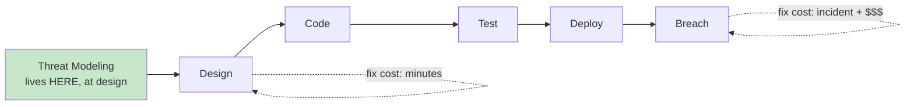
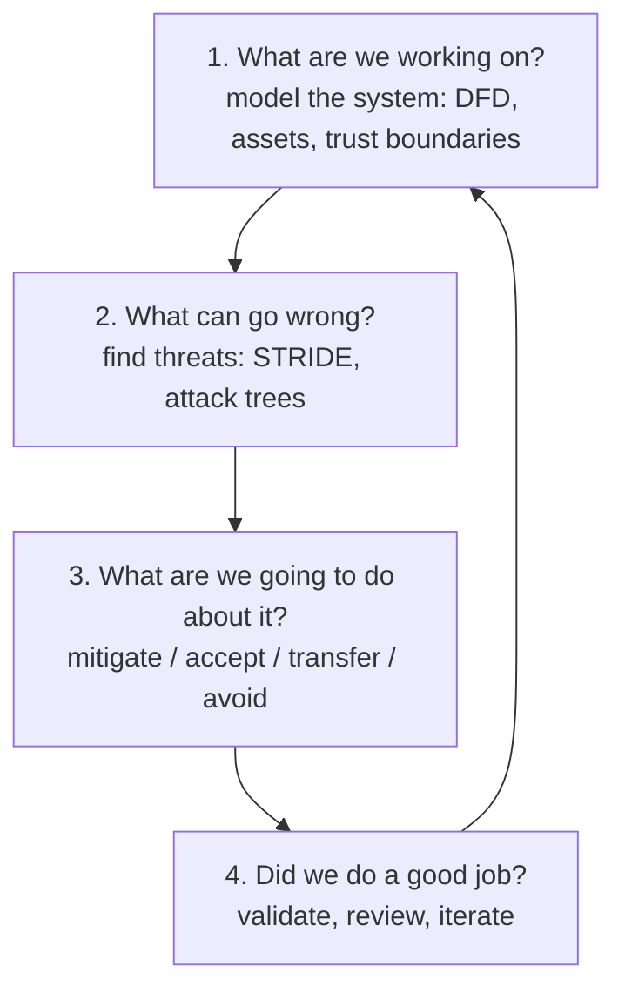
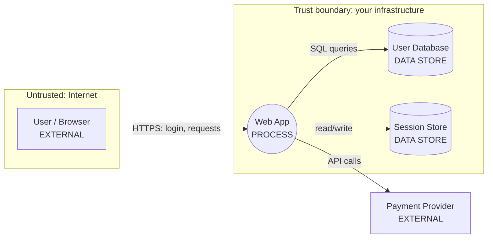
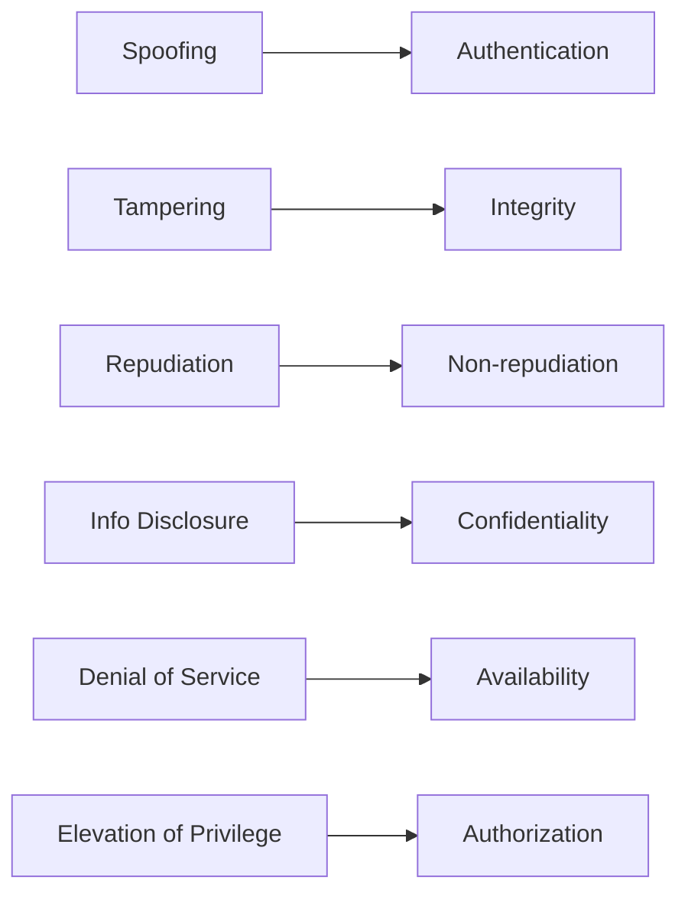
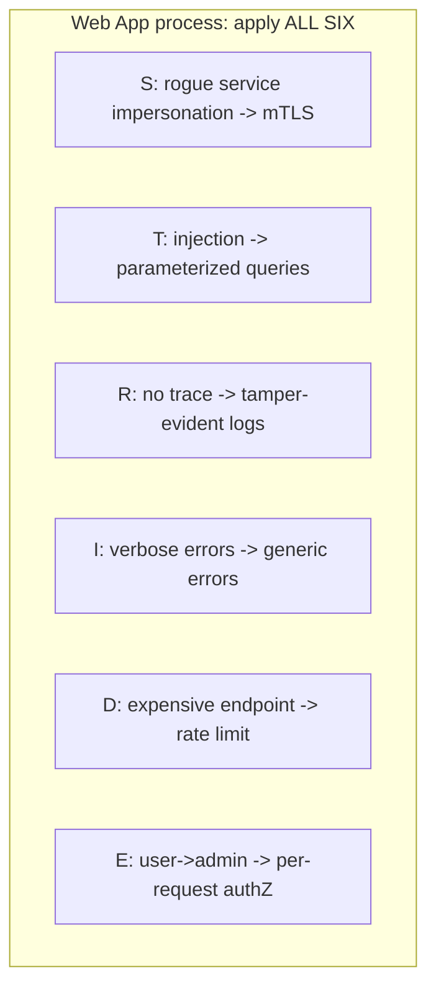
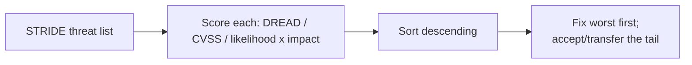
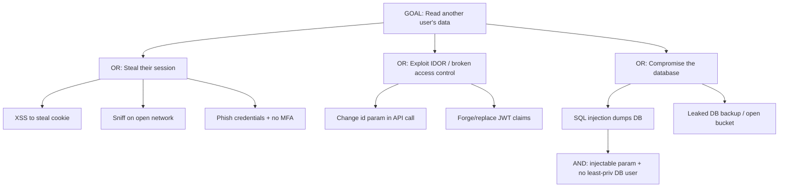
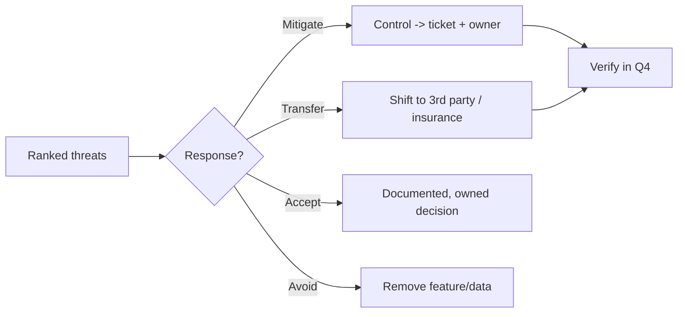
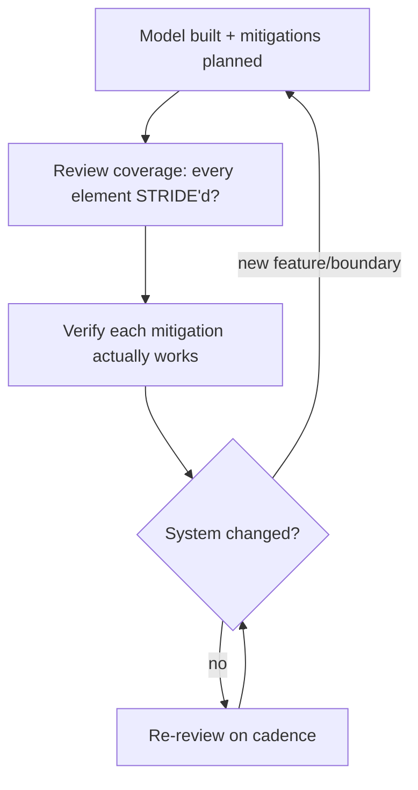

**Level:** Beginner · **Track:** Foundations · **Read time:** 180 min

This is Chapter 2 of the Security Foundations series — Notebook 8. Chapter 1 gave you the vocabulary: the
CIA triad, AAA, and the asset → threat → vulnerability → risk chain, plus how to quantify risk. That
chapter was *reactive* framing — how to describe and rank what could go wrong. This chapter is the
*proactive* discipline that finds those things systematically, on paper, before they ship:
**threat modeling.**

Threat modeling is the structured process of thinking like an attacker about your *own* system — enumerating
what could go wrong, deciding which of those matter, and doing something about them — ideally at design time
when a fix is a diagram change instead of an incident. It's the single highest-leverage security activity
because it's cheap (whiteboard + people who know the system) and catches design-level flaws that no scanner,
pentest, or code review will find. A pentest tests what you *built*; a threat model questions what you
*designed*. This chapter teaches the frameworks — the four-question method, STRIDE, DREAD, attack trees —
and, more importantly, how to actually *run* the process and turn its output into tracked, prioritized
fixes. We'll build a complete threat model of a real web application end to end so the frameworks stop being
acronyms and become a repeatable skill.

## Part 1: What Threat Modeling Is and Why It's Worth It

**Threat modeling** is a structured activity for identifying, ranking, and addressing the threats to a
system. It's *anticipatory*: you do it before (or early in) building, so that security is designed in rather
than bolted on. The core insight is economic — the **cost to fix a security flaw grows by orders of
magnitude the later you find it**: a design-review comment costs minutes; the same flaw found in production
costs an incident, a patch cycle, and possibly a breach. Threat modeling moves discovery as far left
(earlier) as possible.



It is *not* a pentest, a code review, or a vulnerability scan — those find flaws in what exists; threat
modeling reasons about the *design* and finds flaws that don't yet have code. The classic example: no
scanner will tell you "your architecture trusts the client to enforce pricing" or "these two services share
a database so a compromise of one owns the other" — those are design decisions, and only structured
reasoning about data flow and trust surfaces them.

**The kind of flaw only threat modeling catches** — a scanner runs on code and looks for known-bad patterns;
these are *design* problems with perfectly clean code:

- The mobile app enforces the withdrawal limit, and the server trusts it — so a modified client withdraws
  anything. (No trust boundary drawn between client and server.)
- Two microservices share one database with full credentials, so compromising the low-value one owns the
  high-value one's data. (No trust boundary *between* services.)
- A "public" share link uses a sequential id, so anyone can enumerate every user's files. (No threat
  considered on the guessability of the token.)
- A password-reset flow emails a token but never expires or single-uses it. (Repudiation/spoofing not
  modeled on the reset flow.)
- An internal admin endpoint has no auth because "it's only reachable internally" — until SSRF or a flat
  network makes it reachable. (Trust boundary assumed, not enforced.)

Every one of these has *clean, passing code* and would sail through SAST/DAST — and every one is obvious the
moment you draw the DFD and ask STRIDE questions at the boundaries. That gap is the entire value proposition.

**Who does it and when:** ideally the people who know the system (developers, architects) with a security
facilitator, during design and at every significant change (a new feature, a new integration, a new trust
boundary). Modern practice makes it **continuous and lightweight** — a short model per feature — rather than
a giant one-time document that goes stale (Chapter 1's "living document" point applies here too).

**The payoff:** a prioritized list of concrete threats with owned mitigations, a shared understanding of the
system's real attack surface, and a design that's been stress-tested by adversarial thinking before a real
adversary tries.

**Where it fits in the development lifecycle.** Threat modeling is the marquee *design-phase* activity in a
**Secure Development Lifecycle (SDL)** — the practice, pioneered by Microsoft and now standard, of building
security into every SDLC phase rather than testing it in at the end. The phases and their security
activities:

| SDLC phase | Security activity |
|---|---|
| Requirements | security & privacy requirements, abuse cases |
| **Design** | **threat modeling** (this chapter), secure design review |
| Implementation | secure coding standards, SAST, code review |
| Testing | DAST, pentest, fuzzing |
| Deployment | hardening, config review, secrets management |
| Operations | monitoring, IR, patch management (Chapter 1) |

The point of "**shift left**" is that each activity is cheaper and more effective the earlier it runs, and
threat modeling is the furthest-left *security-specific* activity that finds *design* flaws. In modern
**DevSecOps**, it's woven into the flow — a lightweight model per feature or per significant PR, sometimes
partially automated (threats-as-code, policy checks) — so it keeps pace with continuous delivery instead of
being an annual gate everyone dreads.

## Part 2: The Four-Question Framework

Adam Shostack's framing (from Microsoft, the canonical reference) reduces all of threat modeling to **four
questions.** Everything else — STRIDE, DREAD, attack trees — is a tool that helps answer one of them. Learn
the four questions and you always know what you're doing and why.



1. **What are we working on?** Understand and *diagram* the system — its components, data flows, and trust
   boundaries. You can't find threats to a system you can't see. (Part 3: data-flow diagrams.)
2. **What can go wrong?** Systematically enumerate threats against that model — this is where STRIDE and
   attack trees do their work. (Parts 4–7.)
3. **What are we going to do about it?** For each threat that matters, choose a response — the same four
   from Chapter 1 (mitigate/transfer/accept/avoid) — and assign an owner and a fix. (Part 8.)
4. **Did we do a good job?** Review the model for completeness, validate that mitigations landed, and
   iterate as the system changes. (Part 9.)

The loop back from 4 to 1 is deliberate: threat modeling is **iterative**, not a one-shot document. The four
questions keep an otherwise open-ended, intimidating task bounded and repeatable — when a session drifts,
ask "which question are we on?" and it re-focuses.

## Part 3: Question 1 — Model the System with Data-Flow Diagrams

You answer "what are we working on?" by drawing the system in a way that exposes attack surface. The standard
tool is the **Data-Flow Diagram (DFD)**, which has just five element types — deliberately few, so the model
stays readable:

| DFD element | Notation | Examples |
|---|---|---|
| **External entity** | rectangle | user, third-party API, browser |
| **Process** | circle | web server, microservice, function |
| **Data store** | parallel lines / cylinder | database, cache, file, queue |
| **Data flow** | arrow | HTTP request, SQL query, API call |
| **Trust boundary** | dashed line | network edge, process boundary, tenant boundary |

The **trust boundary** is the most important concept and the one beginners omit. It's any line where the
level of trust *changes* — where data crosses from a less-trusted zone to a more-trusted one (the internet
→ your server, the browser → the backend, one microservice → another, user-space → kernel). **Threats
concentrate at trust boundaries** because that's where an attacker on the untrusted side tries to influence
the trusted side. Every arrow crossing a dashed line is a place to ask "what if the untrusted side lies?"



In that diagram the dashed conceptual boundary sits between the internet (user) and your infrastructure
(web app, databases). The `User → Web App` flow crosses it — so everything from the browser is untrusted
input (validate it), the session store holds trust-bearing tokens (protect them), and the payment provider
is a *separate* external trust domain (don't trust its callbacks blindly; verify signatures). Drawing this
is already valuable: it makes the attack surface *visible*.

**How to draw a useful DFD:** start at the highest level (a context diagram — your system as one process
with its external entities), then decompose the interesting processes one level down to expose internal
flows and stores. Don't over-decompose — stop when further detail stops revealing new trust boundaries or
threats. Tools: pencil and paper is fine; **OWASP Threat Dragon** and Microsoft's **Threat Modeling Tool**
draw DFDs and can auto-suggest STRIDE threats per element.

**Decomposition levels (DFD Level 0 → 1 → 2).** Threat modeling scales the diagram to the detail you need:

- **Level 0 (context):** the whole system as a single process with its external entities and the top-level
  trust boundary. Good for a first pass and for talking to non-experts — "here's the system and who talks to
  it."
- **Level 1:** break that single process into its major sub-processes (web tier, auth service, worker,
  admin panel) and their data stores, exposing *internal* trust boundaries (e.g. web tier ↔ admin panel).
  This is where most useful threats appear.
- **Level 2+:** decompose a specific risky sub-process further (the auth service's token flow, the payment
  reconciliation). Only go here for the parts that warrant it.

The art is stopping at the right level: too shallow and you miss internal boundaries; too deep and the model
becomes an unreadable map nobody maintains. **Rule of thumb: decompose until each new level stops revealing
a new trust boundary or a new asset.**

**Alongside the DFD, catalog three lists** — they sharpen "what are we working on?" and feed directly into
threat enumeration:

- **Assets** — what's worth protecting (Chapter 1): the PII, the keys, the money, the uptime. Threats are
  *threats to assets*, so listing them tells you what the attacker is *after*.
- **Entry points (attack surface)** — every place external input enters: each API endpoint, form field,
  file upload, webhook, message-queue consumer, admin interface. Each entry point is where spoofing/
  tampering/injection start.
- **Trust levels / actors** — the distinct privilege levels (anonymous, authenticated user, admin, service
  account) and who holds them. Elevation-of-privilege threats are transitions *between* these levels.

The intersection is the model's heart: *which actor, entering through which entry point, could reach which
asset?* That single sentence is what STRIDE and attack trees then make rigorous.

**A note on identifying trust boundaries** — the highest-value and most-missed part. They appear wherever:
the network changes (internet → DMZ → internal), the process/privilege changes (user-space → kernel,
container → host, unprivileged → admin service), the tenant changes (customer A's data → customer B's), or
the ownership changes (your system → a third-party API). Mark every one, because *every arrow that crosses a
boundary is carrying data from a place you trust less into a place you trust more* — which is the definition
of attack surface.

## Part 4: Question 2 — STRIDE, the Threat Taxonomy

**STRIDE** is Microsoft's mnemonic for six threat categories, and its elegance is that each category is the
*violation of one desirable security property* — it maps one-to-one onto the CIA triad and its extensions
from Chapter 1. This is why STRIDE is the most-used enumeration method: it's a structured checklist that
guarantees you consider every *type* of thing that can go wrong, rather than brainstorming randomly and
missing a class.

| STRIDE threat | Violates property | Plain meaning | Example | Mitigation |
|---|---|---|---|---|
| **S**poofing | Authentication | pretending to be someone/something else | using stolen creds; fake email sender; ARP spoofing | strong AuthN, MFA, signatures, mutual TLS |
| **T**ampering | Integrity | modifying data or code | altering a request/DB row; poisoning an update | hashing/MACs, signatures, input validation, access control |
| **R**epudiation | Non-repudiation | denying an action, no proof it happened | "I never made that transfer" with no logs | audit logging, signed records, timestamps |
| **I**nformation Disclosure | Confidentiality | exposing data to the unauthorized | data leak, verbose errors, sniffing | encryption, access control, least data exposure |
| **D**enial of Service | Availability | making a system unusable | DDoS, resource exhaustion | rate limiting, redundancy, quotas, scaling |
| **E**levation of Privilege | Authorization | gaining rights you shouldn't have | user → admin; sandbox escape; IDOR to admin | least privilege, authZ checks, sandboxing |



Notice the mapping is exact: STRIDE is literally "the CIA triad + authentication + non-repudiation +
authorization, each negated." That's why the two chapters belong together — Chapter 1 gave you the
properties; STRIDE is the disciplined way to ask, for each part of your system, "how could each property
be broken *here*?"

**Each category, one level deeper**, because knowing the *sub-patterns* is what lets you actually find them
in a system:

- **Spoofing** — of *identity* (stolen/guessed credentials, session hijack, pass-the-hash), of a *process*
  (a rogue service pretending to be a trusted one), of a *machine* (ARP/DNS spoofing, rogue DHCP), or of an
  *origin* (forged email `From`, forged webhook source). The question to ask at each element: "how does this
  element *know* who it's really talking to?" If the answer is "it doesn't verify," that's a spoofing
  threat.
- **Tampering** — with data *in transit* (MITM modification — Cryptography Ch 6), *at rest* (altered DB
  rows, modified files), or with *code* (supply-chain implant, altered container image). Ask: "what stops
  someone changing this, and how would we know if they did?" No integrity control = tampering threat.
- **Repudiation** — a user or process performs an action and can later plausibly *deny* it because there's
  no trustworthy record. This is the one people forget because it's not about *stopping* an action but about
  *proving* it happened. Ask: "if this went to court or to an incident review, could we prove who did what?"
- **Information Disclosure** — direct (a leaked dump, an open bucket), *indirect* (verbose errors, stack
  traces, timing side channels — Cryptography Ch 7, response differences that reveal whether a username
  exists), or *metadata* (even if content is encrypted, traffic patterns leak). Ask: "what does this element
  reveal, including through its errors and its timing, that it shouldn't?"
- **Denial of Service** — *volumetric* (flood the pipe), *resource exhaustion* (expensive operation abused —
  the deliberately-slow KDF from Cryptography Ch 5, a regex that backtracks, an unbounded query), or *logic*
  (lock out accounts, fill a queue). Ask: "what's the most expensive thing an unauthenticated user can make
  this do, and how many times?"
- **Elevation of Privilege** — *vertical* (user → admin: missing authZ check, IDOR to a privileged object,
  auth bypass) or *horizontal* (user A → user B's data at the same privilege level: the classic IDOR). Also
  technical escapes (sandbox/container escape, kernel exploit). Ask: "can this actor reach anything they
  shouldn't, by changing an id, a role claim, or exploiting a check that isn't there?"

**STRIDE-per-element (the practical technique).** Rather than brainstorm threats freely, you walk your DFD
and apply STRIDE to *each element*, because different element types are susceptible to different threats:

| DFD element | Typically susceptible to (STRIDE) |
|---|---|
| External entity | Spoofing, Repudiation |
| Process | **all six** (S T R I D E) |
| Data store | Tampering, Info Disclosure, DoS, (Repudiation for logs) |
| Data flow | Tampering, Info Disclosure, DoS |

So for each process you ask all six questions; for each data store you focus on tampering, disclosure, and
DoS; and so on. This turns "find threats" from an open-ended brainstorm into a **finite, checkable grid** —
elements × applicable STRIDE letters — which is exactly what makes threat modeling repeatable and
teachable. Miss a cell and you've found your gap.

**A quick threat-prompt library** speeds the walk — canned questions to ask at each STRIDE cell so a team
new to the technique doesn't stall:

| STRIDE | Prompts to ask at each element |
|---|---|
| Spoofing | How does this element authenticate who it talks to? Can identity be forged/replayed? Default creds? |
| Tampering | What stops modification in transit/at rest/of code? Would we detect a change? Is input validated? |
| Repudiation | Is every security-relevant action logged to an authenticated identity? Are logs tamper-evident? |
| Info Disclosure | What does it reveal via data, errors, timing, metadata? Encrypted in transit/at rest? Least data? |
| DoS | What's the most expensive action an unauth user can trigger, how often? Rate limits? Quotas? |
| EoP | Can an actor exceed their rights by changing an id/role, or via a missing check? Least privilege? |

Keep this table next to the DFD during the session; for each element, run the relevant rows. It's the
difference between "um, what could go wrong here?" and a crisp, repeatable pass.

## Part 5: Worked STRIDE Analysis of Our Web App

Let's apply STRIDE-per-element to the DFD from Part 3. For each element, the concrete threats and their
mitigations — this is what a real threat model's core table looks like:

**External entity: User/Browser**

- **Spoofing:** an attacker logs in as another user (stolen/guessed credentials, session hijack). *Mitigate:*
  strong AuthN + MFA (Chapter 1), secure session tokens, rate limiting on login.
- **Repudiation:** a user denies making an action. *Mitigate:* audit logs tied to authenticated identity,
  signed receipts for high-value actions.

**Data flow: User → Web App (HTTPS request)**

- **Tampering:** attacker modifies request parameters (price, quantity, user id). *Mitigate:* server-side
  validation of *everything*, never trust client-enforced values, integrity on tokens.
- **Information Disclosure:** traffic sniffed on the network. *Mitigate:* TLS 1.2+/1.3 (Cryptography Ch 6),
  HSTS.
- **DoS:** flood of requests. *Mitigate:* rate limiting, WAF, CDN.

**Process: Web App**

- **Spoofing:** a rogue service impersonates the app to the database. *Mitigate:* mTLS / service auth.
- **Tampering:** attacker exploits an injection to change app behavior. *Mitigate:* parameterized queries,
  input validation, output encoding.
- **Repudiation:** app performs actions with no trace. *Mitigate:* comprehensive, tamper-evident logging.
- **Information Disclosure:** verbose errors/stack traces leak internals. *Mitigate:* generic error
  messages, no debug in prod.
- **DoS:** an expensive endpoint (e.g. the deliberately-slow password KDF from Cryptography Ch 5) is abused.
  *Mitigate:* rate limiting, resource caps, async work.
- **Elevation of Privilege:** a normal user reaches admin functions (missing authZ check, IDOR). *Mitigate:*
  least privilege, per-request authorization, deny by default.

**Data store: User Database**

- **Tampering:** attacker alters records via injection or stolen DB creds. *Mitigate:* least-privilege DB
  account, integrity constraints, parameterized queries.
- **Information Disclosure:** DB dump exposes PII and password hashes. *Mitigate:* encryption at rest, slow
  salted KDF for passwords (Cryptography Ch 5), network segmentation.
- **DoS:** a heavy query exhausts the DB. *Mitigate:* query limits, connection pooling, read replicas.

**Data flow: Web App → Payment Provider (external trust domain)**

- **Spoofing/Tampering:** a forged payment callback ("payment succeeded") tricks the app. *Mitigate:*
  verify provider webhook **signatures** (Cryptography Ch 6), never trust an unauthenticated callback,
  reconcile server-to-server.



The output is a table of **threat → element → mitigation**, which is the beating heart of the deliverable.
Consolidated, it looks like this — the actual artifact you hand to engineering:

| # | Element | STRIDE | Threat | Mitigation | Owner |
|---|---|---|---|---|---|
| 1 | User→App flow | T | tamper price/qty/id in request | server-side validation, never trust client values | backend |
| 2 | User→App flow | I | sniff traffic | TLS 1.3 + HSTS | platform |
| 3 | Web App | E | user reaches admin (IDOR/missing authZ) | per-request authZ, deny by default | backend |
| 4 | Web App | I | verbose errors leak internals | generic errors, no debug in prod | backend |
| 5 | Web App | D | expensive endpoint abused | rate limiting, resource caps | platform |
| 6 | User DB | I | dump exposes PII + hashes | encrypt at rest, Argon2id, segmentation | data |
| 7 | User DB | T | rows altered via injection | parameterized queries, least-priv DB user | backend |
| 8 | User/Browser | S | login as another user | MFA, secure sessions, login rate limit | backend |
| 9 | App→Payment | S/T | forged "payment success" callback | verify webhook signatures, server-to-server reconcile | payments |
| 10 | Web App | R | actions leave no trace | tamper-evident audit logging | platform |

Notice how nearly every mitigation is something from earlier chapters — TLS, signatures, KDFs, least
privilege, validation. **Threat modeling doesn't invent new controls; it tells you *which* controls you
need *where*, and — crucially — surfaces the ones you forgot.** That table, ranked (next part) and turned
into tickets, *is* the deliverable.

## Part 6: Question 2, Deeper — DREAD and Ranking

STRIDE finds threats; you can't fix all of them at once, so you **rank**. The classic (if dated) ranking
mnemonic is **DREAD**, which scores each threat 1–10 on five factors and sums (or averages) them:

| DREAD factor | Question | High score means |
|---|---|---|
| **D**amage | how bad if exploited? | severe impact |
| **R**eproducibility | how reliably can it be exploited? | works every time |
| **E**xploitability | how easy to pull off? | trivial, no skill |
| **A**ffected users | how many are impacted? | everyone |
| **D**iscoverability | how easy to find? | obvious |

**Worked ranking.** For "Elevation of Privilege via IDOR to admin" on our app: Damage 8 (admin access),
Reproducibility 9 (deterministic), Exploitability 7 (change an id), Affected 9 (all data), Discoverability 6
→ total 39/50 → **Critical, fix first.** For "DoS via expensive endpoint": Damage 5, Reproducibility 8,
Exploitability 6, Affected 7, Discoverability 5 → 31/50 → High. The IDOR outranks the DoS, so it gets fixed
first — and now the prioritization is *defensible* rather than a gut call.

**A full scored table** for several of our app's threats makes the ranking concrete and shows how the queue
falls out:

| Threat | D | R | E | A | D | Total | Priority |
|---|---|---|---|---|---|---|---|
| EoP via IDOR to admin | 8 | 9 | 7 | 9 | 6 | 39 | Critical |
| DB dump (Info Disclosure) via SQLi | 9 | 7 | 6 | 9 | 5 | 36 | Critical |
| Forged payment-success webhook | 9 | 6 | 5 | 4 | 4 | 28 | High |
| DoS via expensive endpoint | 5 | 8 | 6 | 7 | 5 | 31 | High |
| Sniffing (no TLS) | 7 | 5 | 3 | 8 | 3 | 26 | Medium |
| Verbose error disclosure | 3 | 9 | 8 | 5 | 7 | 32 | High |

Sorted by total, your fix order is IDOR (39) → SQLi dump (36) → verbose errors (32) → DoS (31) → webhook
(28) → sniffing (26). That ordering is now something you can *defend* in a planning meeting ("we're doing
IDOR before TLS because it scores 39 vs 26 — higher damage, more affected users, trivially reproducible"),
which is the entire reason to score rather than argue from gut feel.

**DREAD's honest caveats.** It's subjective (two people score differently — "Discoverability 6 or 7?") and
Microsoft itself moved away from it for that reason. Modern practice tends to use **CVSS** (Chapter 1's
standardized 0–10 severity) or a simple **likelihood × impact** matrix (also Chapter 1) instead, because
they're more consistent. But DREAD is still worth knowing: it forces you to think about the *dimensions* of
risk (not just "how bad" but "how easy" and "how many"), which a single CVSS number can hide. Whatever you
use, the goal is the same: **turn the STRIDE list into an ordered queue so the scarce fix-it budget goes to
the worst threats first** (the Chapter 1 ALE logic, applied to design threats).



## Part 7: Attack Trees — Thinking Like a Single Adversary

STRIDE is breadth-first (every threat type against every element). **Attack trees** are depth-first: pick
one **attacker goal** and decompose *how* they could achieve it into a tree of sub-goals and concrete
techniques. Where STRIDE asks "what can go wrong everywhere?", an attack tree asks "how, specifically, could
someone achieve *this one bad outcome*?" — which is exactly how a real attacker (and a pentester) thinks.

The **root** is the goal; **child nodes** are ways to achieve the parent; leaves are concrete attacks. Nodes
are **OR** (any child suffices — the attacker picks one) or **AND** (all children required together). This
OR/AND structure is the whole expressive power: it captures that some defenses only matter if *every*
alternative path is also blocked (OR — you must cut them all), while others break a whole plan by removing
*one* required step (AND — cut any single child). You annotate leaves with cost, skill, or detectability to
find the *cheapest* path — which is the path a rational attacker takes, so it's the one to cut first.

Attack trees were formalized by Bruce Schneier in the late 1990s and remain the clearest way to *reason
about and communicate* a specific attack. A few practical tips:

- **Start from the attacker's goal, not your components** — "steal customer funds," "read all messages,"
  "achieve persistence" — then ask repeatedly "how?" to grow branches. This goal-first stance is what makes
  the tree adversary-centric rather than a re-drawing of your architecture.
- **Mix technical and human branches** — "reset the victim's password" might have a technical leaf (token
  prediction) and a human leaf (social-engineer the help desk). Real attackers use whichever is cheaper, so
  your tree must include both or you'll defend only half.
- **The tree is also a test plan** — each leaf is a concrete thing a pentester (or you) can *try*, and each
  mitigation is a concrete thing to verify. That's why an attack tree bridges design (threat modeling) and
  validation (testing) so naturally.



Reading this tree top-down is the *attacker's* plan; reading it bottom-up is your *defense* plan — cut the
cheapest leaves first. The `AND` node under SQL injection is instructive: the attacker needs *both* an
injectable parameter *and* an over-privileged DB account to dump everything, so **either** parameterized
queries **or** a least-privilege DB user breaks that whole branch (defense in depth from Chapter 1 — you'd
do both). Attack trees make the value of layered controls visually obvious: a mitigation that sits above an
AND node kills an entire subtree.

**Annotating leaves to find the cheapest path.** The real power of attack trees is quantification. Tag each
leaf with attributes — cost, required skill, detectability, or simply feasible/infeasible — and propagate up
(for OR nodes the parent takes the *minimum* cost; for AND nodes the *sum*). The cheapest root-to-leaf path
is the one a rational attacker takes, so it's where your first mitigation dollar goes:

| Leaf (path to "read another user's data") | Attacker cost | Skill | Detectable? |
|---|---|---|---|
| Change id param in API call (IDOR) | trivial | low | maybe (authZ-denial logs) |
| Guess/enumerate share token | low | low | yes (rate patterns) |
| Misconfigured public bucket | trivial (if it exists) | low | hard |
| SQLi dump (AND: injectable + over-priv DB) | medium | medium | yes (WAF/anomaly) |
| Phish creds + no MFA | low–med | low | partial |
| XSS to steal cookie | medium | medium | maybe (CSP reports) |

Read down the "cost" column: the IDOR and the public bucket are near-free for the attacker, so they top the
fix list — exactly matching where the STRIDE ranking (Part 6) landed, which is a good cross-check. When two
methods (STRIDE-per-element and attack-tree cost analysis) independently point at the same finding, you can
be confident it's the priority.

**Where attack trees shine vs STRIDE:** STRIDE is great for *coverage* (don't miss a threat class); attack
trees are great for *reasoning about a specific high-value goal* and for *communicating* an attack path to
non-experts ("here's exactly how someone gets to the crown jewels"). They complement each other — use STRIDE
to enumerate, attack trees to deep-dive the scariest findings. Attack trees are also the conceptual ancestor
of the **kill chain** and **MITRE ATT&CK** (the next chapter), which are essentially standardized,
industry-wide attack trees of real adversary techniques.

## Part 8: Question 3 — From Threats to Tracked Mitigations

A threat model that produces a diagram and a threat list but no *fixes* is theater. Question 3 turns
findings into action, reusing Chapter 1's four responses per threat:

- **Mitigate** — add or strengthen a control (the default; most STRIDE threats map to a known mitigation,
  as the Part 5 table shows).
- **Transfer** — shift the risk (use a vetted payment provider so you don't store card data; buy insurance).
- **Accept** — consciously live with a low-ranked threat, documented and owned (Chapter 1's discipline: an
  accepted risk is a *decision*, not an oversight).
- **Avoid / Eliminate** — remove the feature or data that creates the threat (don't collect the PII you
  don't need — no data, no disclosure threat).

**The output artifact** is a tracked list, each row: *threat · STRIDE category · affected element · DREAD/
CVSS score · response · specific mitigation · owner · status.* Critically, **each mitigation becomes a
ticket** in your normal tracker with an owner and a due date, so threat modeling plugs into engineering
workflow instead of dying in a document. A finding without an owner is a finding that won't get fixed.



**How to actually run a threat-modeling session** (the part guides skip). It's a *meeting*, and meetings
succeed or fail on facilitation:

- **Who:** the people who know the system (2–5 developers/architects), a facilitator (ideally with security
  experience), and ideally someone from ops/security. Too many people and it stalls; too few and you miss
  knowledge.
- **Timebox:** 60–90 minutes. A feature-sized model fits; a whole-system model spans a few sessions. Don't
  try to boil the ocean in one sitting — scope to one feature or one trust boundary.
- **Flow:** draw the DFD live on a shared whiteboard (everyone must *see* it), walk STRIDE-per-element out
  loud (the facilitator drives "OK, this data store — tampering? disclosure? DoS?"), capture every threat
  without debating fixes yet (separate *finding* from *solving* — debating mitigations mid-enumeration kills
  momentum), then rank and assign at the end.
- **Culture:** it must be blameless and curious, not a gotcha session. "How could this break?" is a fun
  puzzle when it's not an accusation. The **Elevation of Privilege card game** (Part 16) exists precisely to
  make the first few sessions approachable and even enjoyable.
- **Output:** the ranked threat→mitigation→owner table, captured somewhere durable, with each mitigation
  filed as a ticket before everyone leaves the room. A session whose output isn't written down and
  ticketed didn't happen.

**Security requirements fall out for free.** Many mitigations are really *requirements* you should have
had — "all webhook callbacks must be signature-verified," "the DB account must be least-privilege,"
"all user input server-side validated." Feeding these back into the design as requirements is how threat
modeling *shifts security left* permanently: next time, they're built in, not found later.

## Part 9: Question 4 — Validate and Iterate

"Did we do a good job?" has two halves:

1. **Did we model well?** Review for coverage — did we apply STRIDE to *every* element, include *all* trust
   boundaries, and consider the realistic threat actors (Chapter 1's taxonomy)? A missed data store or an
   undrawn trust boundary is a blind spot. A second reviewer or a checklist (STRIDE-per-element grid) catches
   omissions.
2. **Did the mitigations land?** Track each to closure and *verify* it — the code review, test, or pentest
   that confirms the control actually works. A mitigation marked "done" that was never tested is a false
   sense of security.

**A concrete validation checklist** you can run against any model before calling it done:

- ☐ Is every external entity, process, and data store on the DFD?
- ☐ Is every trust boundary drawn (network, process/privilege, tenant, third-party)?
- ☐ Did we apply **all six** STRIDE letters to every process, and the applicable subset to each store/flow?
- ☐ Did we consider the realistic threat actors (Part 10), not a generic list?
- ☐ Does every high/critical threat have a chosen response (mitigate/transfer/accept/avoid)?
- ☐ Does every "mitigate" have a specific control, an owner, and a ticket?
- ☐ Were accepted risks *documented and owned*, not silently dropped?
- ☐ Has each shipped mitigation been *verified* (code review/test/pentest), not just marked done?
- ☐ Did we consider human/process paths (social engineering, help-desk resets, insiders), not only technical?
- ☐ Is the model stored somewhere it'll be found and updated, not lost in a slide deck?

Then **iterate.** Threat models decay exactly like risk registers (Chapter 1): every new feature, integration,
or trust boundary can introduce new threats, so re-model on change. Mature teams make threat modeling
**continuous and incremental** — a quick model per feature or per pull request — rather than an annual
monolith. The four-question loop is meant to spin many times over a system's life.



## Part 10: Grounding the Model in Real Threat Actors

A threat model that ignores *who* would attack you drifts into paranoia (defending against nation-states you
don't face) or complacency (ignoring the criminal who obviously does). Chapter 1's **threat-actor taxonomy**
is the input that keeps the model realistic — you ask "what can go wrong?" *in light of* who plausibly wants
to make it go wrong.

**Attacker personas** make this concrete. Sketch the realistic adversaries for *your* system and their
capability, and use them to calibrate which STRIDE threats and attack-tree leaves matter:

| Persona | Wants | Capability | Which threats they make real |
|---|---|---|---|
| Opportunistic script kiddie | easy wins, defacement | runs public tools/scanners | known CVEs, default creds, obvious IDOR |
| Organized criminal | money (PII, fraud, ransom) | buys exploits, persistent | data theft (Info Disclosure), ransomware (DoS+all) |
| Malicious insider | revenge/money | *already has access* | privilege abuse (EoP), data exfil, repudiation |
| Nation-state / APT | espionage/sabotage | zero-days, patient, funded | supply-chain tampering, long-dwell exfil |
| Hacktivist | embarrassment | medium, public-facing | defacement (Tampering), DoS, leak |

**How this changes the model:** if your realistic top threat is organized crime after PII, you weight
Information Disclosure and the data-store branches heavily and invest in exfil detection; if insiders are a
real concern (they usually are), you emphasize least privilege, separation of duties, and *repudiation*
controls (tamper-evident logs) because the insider already has legitimate access and your defense is
*detection and accountability*, not perimeter. A blog with no PII and no money simply doesn't warrant
APT-grade modeling — and saying so explicitly is a *feature*, because it directs finite effort to the
threats you actually face.

**Feeding real threat intelligence in:** mature programs pull from CTI (cyber threat intelligence) — which
actors target your industry, which techniques they use (MITRE ATT&CK, next chapter), which CVEs are being
actively exploited (CISA KEV from Chapter 1) — so the model reflects the *current* real-world threat, not a
generic checklist. This is the bridge from "structured brainstorm" to "threat-informed defense."

## Part 11: Other Methodologies You Should Recognize

STRIDE + DREAD + attack trees is the core, but you'll hear other names; know what each is *for* so you can
pick the right tool:

- **PASTA (Process for Attack Simulation and Threat Analysis)** — a seven-stage, **risk-centric** method
  that ties threats to *business* impact and simulates real attacker behavior. Heavier and more thorough;
  used when you need business alignment and executive buy-in, not a quick per-feature model.
- **LINDDUN** — the **privacy** analog of STRIDE (Linkability, Identifiability, Non-repudiation,
  Detectability, Disclosure of information, Unawareness, Non-compliance). Use it when *privacy* harms —
  tracking, re-identification, oversharing — matter as much as security (GDPR-regulated systems, anything
  handling personal data).
- **OCTAVE** — an organizational, risk-based, self-directed method focused on operational risk and asset
  prioritization at the enterprise level; less about a single system's DFD.
- **VAST** — Visual, Agile, and Simple Threat modeling; designed to *scale* across an org and integrate with
  agile/DevOps via automation.
- **Trike** — a risk-management-focused, requirements-driven approach.
- **Attack trees** (Part 7) and **kill chains / MITRE ATT&CK** (next chapter) — technique-centric models of
  *how* attacks proceed.

| Method | Best when | Flavor |
|---|---|---|
| STRIDE | you want structured per-element threat coverage | threat-centric, developer-friendly |
| DREAD / CVSS | you need to rank the threats you found | scoring |
| Attack trees | you want to deep-dive one high-value goal | attacker-centric |
| PASTA | you need business/risk alignment, thorough | risk-centric, heavy |
| LINDDUN | privacy is a first-class concern | privacy-centric |
| VAST | scaling threat modeling across many teams | agile/automation |

**The practical guidance:** for most software teams, **STRIDE-per-element for enumeration + a
likelihood×impact or CVSS ranking + attack trees for the scariest findings** is the pragmatic, sufficient
combination. Reach for PASTA when the business needs deep risk alignment, and LINDDUN when privacy is
central. Don't let methodology-shopping become procrastination — a lightweight STRIDE model done *this
sprint* beats a perfect PASTA model done never.

## Part 12: Hands-On Lab — Threat Model a System End to End

Do this yourself; the skill only sticks by doing. Model a simple system — say a **file-sharing web app**
(users upload files, share links, download). You need nothing but a whiteboard (or OWASP Threat Dragon).

**Step 1 — Q1: Draw the DFD.** Identify external entities (user, link recipient), processes (web app,
upload service, auth service), data stores (file storage, metadata DB, session store), data flows, and
**draw the trust boundaries** (internet → app, app → storage, tenant → tenant).

```text
[User] --HTTPS upload--> (Web App) --store--> [File Storage]
   |                         |
   |                         +--auth--> (Auth Service) --> [Session Store]
   |                         +--metadata--> [Metadata DB]
[Link recipient] --HTTPS download--> (Web App)
  === trust boundary: internet | your infra ===
```

**Step 2 — Q2: STRIDE-per-element.** Walk each element and fill the grid. A few you should find:

- *Data flow User→App (upload):* **Tampering** (malicious file / path traversal in filename),
  **Info Disclosure** (sniffing → TLS), **DoS** (huge file → size limits).
- *Process Web App:* **Elevation of Privilege** (access another tenant's files via IDOR on file id →
  per-request authZ + unguessable ids), **Info Disclosure** (a "public link" that's actually guessable →
  long random tokens).
- *Data store File Storage:* **Info Disclosure** (bucket misconfigured public → private + signed URLs),
  **Tampering** (overwrite another user's file → authZ on write).
- *External entity Link recipient:* **Spoofing** (anyone with the link → make links expiring +
  optionally authenticated).

**Step 3 — Q2 deep-dive: an attack tree** for the goal "download a file I'm not authorized to":

```text
GOAL: read a file I shouldn't
  OR guess/enumerate the share link token        -> long random tokens, rate limit
  OR IDOR: change file id in the download API     -> per-request authZ check
  OR misconfigured public storage bucket          -> private bucket + signed URLs
  OR steal victim's session (XSS/phish)           -> CSP, HttpOnly cookies, MFA
```

**Step 4 — Q3: Rank and assign.** Score each (DREAD or likelihood×impact), sort, and write a mitigation
table with owners. The IDOR and the public-bucket findings will almost certainly top the list — fix those
first.

**Your ranked output** should look like this — the deliverable you'd attach to the design doc:

| # | Threat | STRIDE | Element | Score | Response | Mitigation | Owner |
|---|---|---|---|---|---|---|---|
| 1 | IDOR on file id | E | Web App | Critical | Mitigate | per-request authZ, unguessable ids | backend |
| 2 | Public storage bucket | I | File Storage | Critical | Mitigate | private bucket + signed URLs | platform |
| 3 | Guessable share token | I | Web App | High | Mitigate | 128-bit random tokens, expiry, rate limit | backend |
| 4 | Malicious upload / path traversal | T | upload flow | High | Mitigate | validate name, sandbox, content scan | backend |
| 5 | Session theft via XSS | S | Web App | High | Mitigate | CSP, HttpOnly cookies, MFA | frontend |
| 6 | Huge-file DoS | D | upload flow | Medium | Mitigate | size limits, quotas | platform |
| 7 | Anyone-with-link access | S | Link recipient | Medium | Accept/Mitigate | expiring links, optional auth | product |

**Step 5 — Q4: Review and iterate.** Check you STRIDE'd every element and drew every boundary; note that
adding a "public gallery" feature later would reopen the model. A quick self-review checklist: *Did I mark
every trust boundary? Apply all six STRIDE letters to each process? Consider the realistic threat actors
(Part 10)? Give every top finding an owner and a ticket?* Congratulations — you've produced a real threat
model, the exact artifact a security engineer delivers. Now file the tickets and, when the "public gallery"
feature comes, spend fifteen minutes re-modeling just that addition.

## Part 13: Offense and Defense Lens

Threat modeling is inherently dual-use, which is its strength:

- **Red team / pentester:** you *build the attacker's tree for real* — a threat model of the target is
  literally your attack plan, and finding the cheapest leaf is finding the way in. Pentesters often
  reconstruct the client's (missing) threat model as step one, because the un-modeled trust boundary is
  where the bugs live. When you write a finding, you're filling in a STRIDE cell the defender missed.
- **Bug bounty:** the highest-value bugs (broken access control, IDOR, auth bypass — OWASP #1 from Chapter
  1) are exactly the *design* flaws threat modeling targets. Hunters instinctively map trust boundaries
  ("what crosses from me-the-attacker to the trusted backend?") and probe every id, every callback, every
  "the client already checked this" assumption — attacker-side threat modeling.
- **Blue team / defender:** threat modeling *is* proactive defense — it tells you which detections and
  controls to build *where* (put your monitoring on the high-DREAD flows, your strongest authZ at the trust
  boundaries). It also feeds detection engineering: each identified attack path suggests a detection ("alert
  on file-id enumeration," "alert on cross-tenant access attempts").
- **The synthesis:** the defender's threat model and the attacker's attack tree are the *same diagram read
  in opposite directions.* Learning to build it makes you better at both roles — you defend better because
  you think like an attacker, and you attack better because you understand the design.

**A pentester's workflow *is* threat modeling in reverse:** map the app (draw the DFD from the outside —
what endpoints, what parameters, what looks like a trust boundary), enumerate what could go wrong at each
crossing (STRIDE, but as an attack plan), build attack trees toward the crown jewels, and *execute the
cheapest leaves*. The findings you write up are literally the STRIDE cells and attack-tree leaves the
defender's model missed. So a pentest report and a threat model are the same document — one written by the
builder before, one by the breaker after — and a system with a good threat model gives pentesters far less
to find, because the un-modeled trust boundary is exactly where the bugs cluster. This is why "did you
threat model this?" is often a pentester's first question.

## Part 14: Final Revision / Summary

- **Threat modeling** = structured, *proactive* identification, ranking, and mitigation of threats, done at
  design time when fixes are cheapest. Not a pentest/scan (those test what exists); it reasons about the
  *design* and finds flaws with no code yet.
- **The four questions** frame everything: (1) *What are we working on?* (model it — DFD + trust
  boundaries), (2) *What can go wrong?* (STRIDE + attack trees), (3) *What do we do about it?* (mitigate/
  transfer/accept/avoid + owned tickets), (4) *Did we do a good job?* (review, verify, iterate). It's a
  loop.
- **DFDs** use five elements (external entity, process, data store, data flow, trust boundary); **threats
  concentrate at trust boundaries** — every arrow crossing one is a question.
- **STRIDE** = Spoofing (AuthN), Tampering (Integrity), Repudiation (Non-repudiation), Info Disclosure
  (Confidentiality), DoS (Availability), Elevation of Privilege (AuthZ) — each is the negation of a Chapter
  1 property. **STRIDE-per-element** turns enumeration into a finite, checkable grid.
- **DREAD** (Damage, Reproducibility, Exploitability, Affected users, Discoverability) ranks threats;
  subjective, so modern practice often prefers **CVSS** or **likelihood × impact**. Point: order the queue,
  fix worst first.
- **Attack trees** decompose one attacker goal into OR/AND sub-goals to concrete leaves; annotate cost to
  find the cheapest path; a mitigation above an AND node kills a whole subtree. Ancestor of the kill chain /
  MITRE ATT&CK.
- **Turn threats into tracked, owned mitigations** and security *requirements* — a model with no fixes is
  theater. **Iterate** as the system changes.
- **Other methods:** PASTA (risk/business-centric, heavy), LINDDUN (privacy), OCTAVE/VAST/Trike. Pragmatic
  default: STRIDE-per-element + CVSS/likelihood×impact + attack trees for the scary ones.
- **Dual-use:** the defender's threat model and the attacker's attack tree are the same diagram read both
  ways.
- **Fits the lifecycle:** it's the design-phase activity of a Secure Development Lifecycle / DevSecOps —
  the furthest-left security-specific step, catching design flaws (clean code, broken architecture) that no
  SAST/DAST/pentest reaches.
- **Run it as a meeting:** the right people, timeboxed, DFD drawn live, STRIDE walked out loud, findings
  separated from fixes, and every mitigation ticketed with an owner before anyone leaves.

## Part 15: Cheat Sheet / Quick Reference

**Four questions:** What are we working on? → What can go wrong? → What do we do about it? → Did we do a
good job? (loop)

**DFD elements:** external entity (rectangle) · process (circle) · data store (cylinder) · data flow
(arrow) · **trust boundary (dashed — threats live here)**.

**STRIDE ↔ property:**

```text
Spoofing            -> Authentication      (MFA, signatures, mTLS)
Tampering           -> Integrity           (hashes/MACs, validation, authZ)
Repudiation         -> Non-repudiation     (audit logs, signed records)
Info Disclosure     -> Confidentiality     (encryption, least exposure)
Denial of Service   -> Availability        (rate limit, redundancy, quotas)
Elevation of Priv   -> Authorization       (least privilege, per-request authZ)
```

**STRIDE-per-element:** external entity → S,R · process → **all 6** · data store → T,I,D(,R) · data flow →
T,I,D.

**DREAD:** Damage · Reproducibility · Exploitability · Affected users · Discoverability (score 1–10, sort).
Or use **CVSS** / **likelihood × impact**.

**Attack tree:** root = goal; OR = any child works; AND = all needed; annotate cost; cut cheapest leaf /
mitigate above an AND. **Responses:** mitigate · transfer · accept · avoid → **ticket + owner + verify**.

**Methods:** STRIDE (enumerate) · attack trees (deep-dive a goal) · DREAD/CVSS (rank) · PASTA (business
risk) · LINDDUN (privacy). **Tools:** OWASP Threat Dragon, Microsoft Threat Modeling Tool.

**Run the session:** right people · timeboxed 60–90 min · draw DFD live · walk STRIDE-per-element out loud ·
find first, fix later · rank · ticket every mitigation with an owner. **Lifecycle:** design-phase activity
of the SDL / DevSecOps — furthest-left security step; catches design flaws SAST/DAST/pentest can't.
**Ground it** in realistic threat actors + CTI, not a generic checklist.

## Part 16: Common Pitfalls

1. **No trust boundaries on the DFD.** They're where threats live; omitting them means you miss the real
   attack surface. Draw every place trust changes.
2. **Brainstorming threats instead of STRIDE-per-element.** Freeform misses categories; the grid guarantees
   coverage.
3. **A model with no mitigations or owners.** Threat modeling that ends at a diagram is theater. Every
   finding → a ticket.
4. **One giant model, done once, never updated.** It goes stale like a risk register. Model continuously,
   per feature.
5. **DREAD treated as objective.** It's subjective; be consistent, or use CVSS/likelihood×impact. Don't
   bikeshed the scores.
6. **Only STRIDE or only attack trees.** They're complementary — STRIDE for coverage, trees for depth on
   the scary goals.
7. **Modeling the diagram you wish you had, not the real system.** Include the ugly realities (that shared
   DB, that legacy service, that unauthenticated internal endpoint).
8. **Skipping validation.** A mitigation marked "done" but never tested is false assurance. Verify each.
9. **Methodology-shopping as procrastination.** A lightweight STRIDE model this sprint beats a perfect PASTA
   model never.
10. **Forgetting the human/process elements** — social engineering, help-desk resets, insider paths are
    real threat branches, not just technical ones.
11. **Modeling only the happy path.** The attacker uses the error paths, the retry logic, the "impossible"
    states. Ask "what if this step fails / is called out of order / is called twice?"
12. **Not grounding in real threat actors** — defending a no-PII blog against nation-states while ignoring
    the obvious criminal, or vice versa. Match the model to who actually targets you (Part 10).

## Part 17: Practice Labs & Resources

- **Threat model a system you use (Part 12)** — a file-sharing app, a chat app, an e-commerce checkout.
  Draw the DFD, run STRIDE-per-element, build one attack tree, rank, and write the mitigation table. This
  single exercise is worth more than any reading.
- **OWASP Threat Dragon** — free, open-source threat-modeling tool that draws DFDs and suggests STRIDE
  threats per element. Build your Part 11 model in it.
- **Microsoft Threat Modeling Tool** — the canonical STRIDE tool; auto-generates threats from your DFD.
- **Adam Shostack's *Threat Modeling: Designing for Security*** and the **OWASP Threat Modeling Cheat
  Sheet** — the definitive references for the four-question method and STRIDE.
- **Elevation of Privilege (EoP) card game** (Shostack/Microsoft, free) — a card game that teaches STRIDE by
  prompting you to find each threat type in a system; genuinely effective and fun for a team session.
- **OWASP Threat Dragon sample models + the OWASP Application Threat Modeling guide** — worked examples to
  compare your model against.
- **Re-model a known breach:** take a public incident and reconstruct the threat model that *would* have
  caught it — which STRIDE cell, which trust boundary, which attack-tree leaf was left un-mitigated.

**Practice questions / mini-labs:**

1. For each, give the STRIDE category and the security property violated: (a) forging a payment "success"
   webhook, (b) a user reading another's records via `?id=`, (c) verbose stack traces in errors, (d)
   flooding an endpoint offline, (e) denying you sent a message with no logs to prove it.
2. Draw a DFD for a login flow (browser, web app, auth service, user DB, session store). Mark every trust
   boundary and name one threat that lives at each boundary.
3. Build an attack tree for the goal "take over an admin account," with at least three OR branches and one
   AND node. Annotate the cheapest leaf and state the single mitigation that best cuts it.
4. You've found eight STRIDE threats and have budget to fix three this sprint. Describe exactly how you'd
   decide which three, naming the ranking method and why you chose it over the alternatives.
5. Explain why a trust boundary is the highest-value place to look for threats, using a concrete arrow from
   your Part 12 DFD, and give the STRIDE threats you'd expect on that specific crossing.
6. A microservice architecture has ten services sharing one database with full read/write credentials.
   Draw the missing trust boundary, name the STRIDE threat this design invites, and give the one design
   change that most reduces the blast radius.
7. Rank these with DREAD *and* explain which factor drives your ordering: (a) a self-XSS only the victim can
   trigger, (b) an unauthenticated IDOR exposing all users' invoices, (c) a DoS needing a 10 Gbps botnet.
8. You're asked to threat model a new "export all my data" feature being added to an existing app. Describe
   your lightweight, 30-minute approach: what you'd draw, which questions you'd ask, and what you'd hand
   back — without re-modeling the whole system.

If you can model any system as a DFD with honest trust boundaries, enumerate threats with STRIDE-per-element
so you miss no category, deep-dive the scariest with an attack tree, rank the results into a defensible
fix-first queue, and turn each into an owned, verified mitigation — then iterate as the system grows — you
own this chapter, and you can do the single highest-leverage proactive security activity there is.

Keep the four questions in your head as a permanent loop — *what are we building, what can go wrong, what
do we do about it, did we do a good job* — and threat modeling stops being a framework you memorize and
becomes a habit you apply to every design you touch.

---

*Also on [Praneeth's portfolio](https://ping-praneeth.vercel.app/notebook/security-foundations/02-threat-modeling-stride-dread-and-attack-trees), with comments and the latest edits.*
