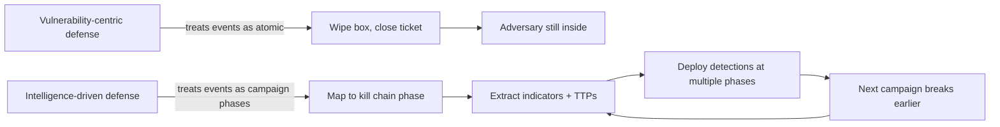
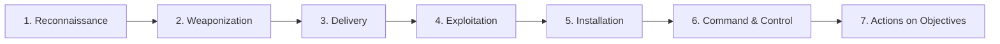
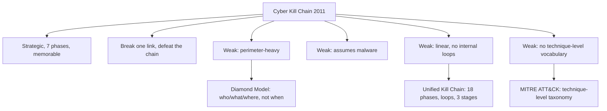
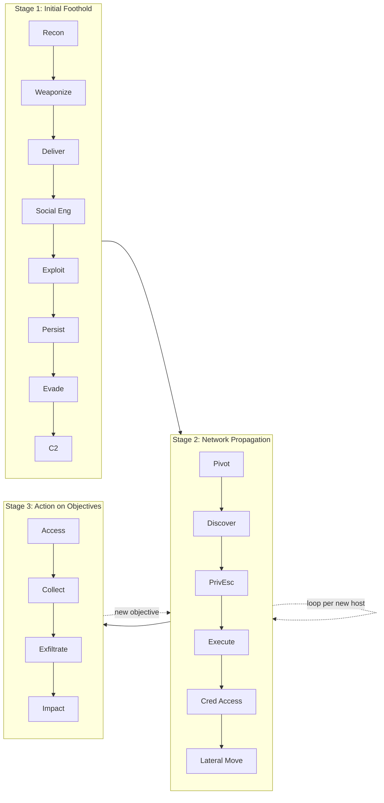
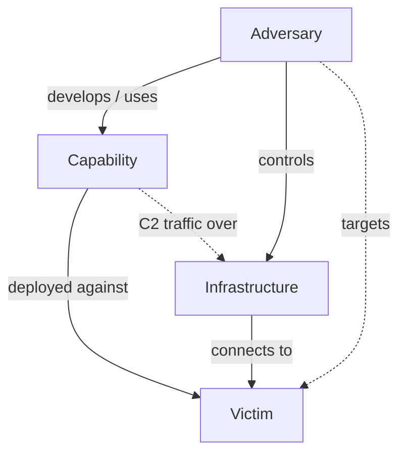
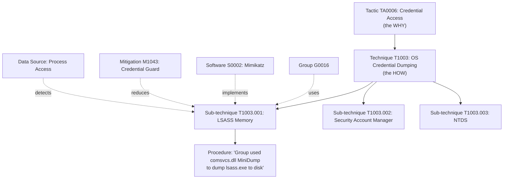
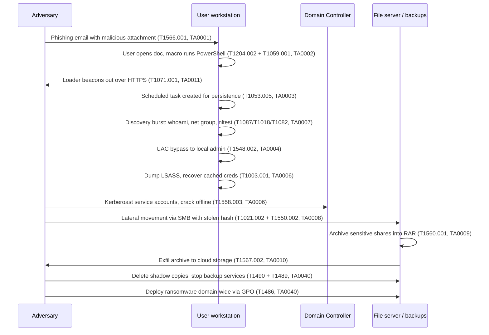
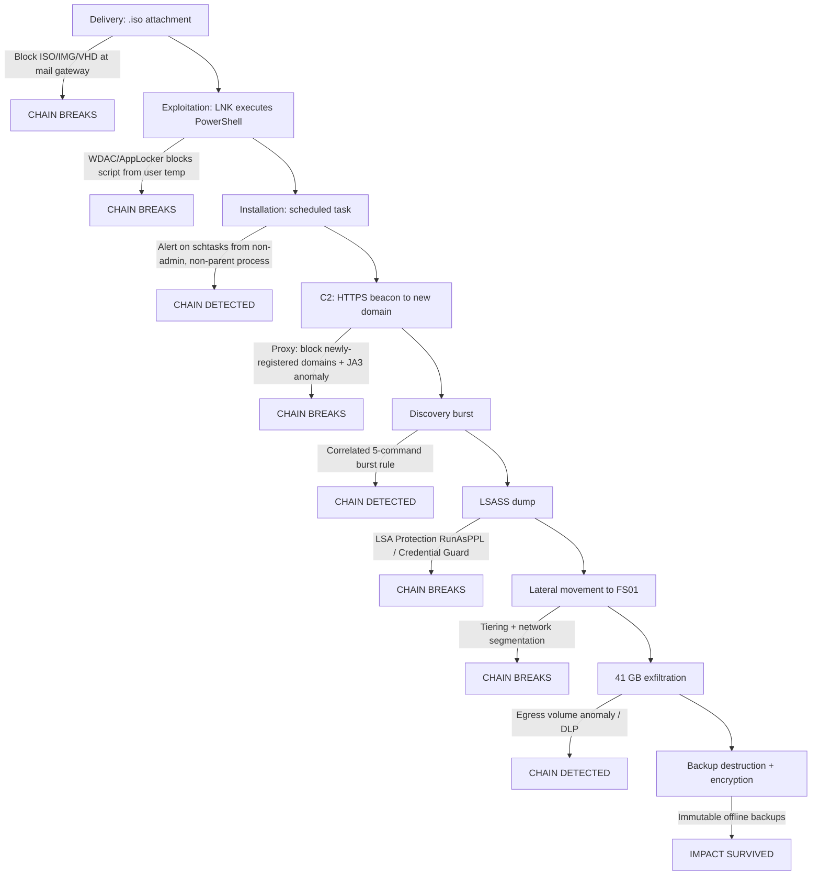
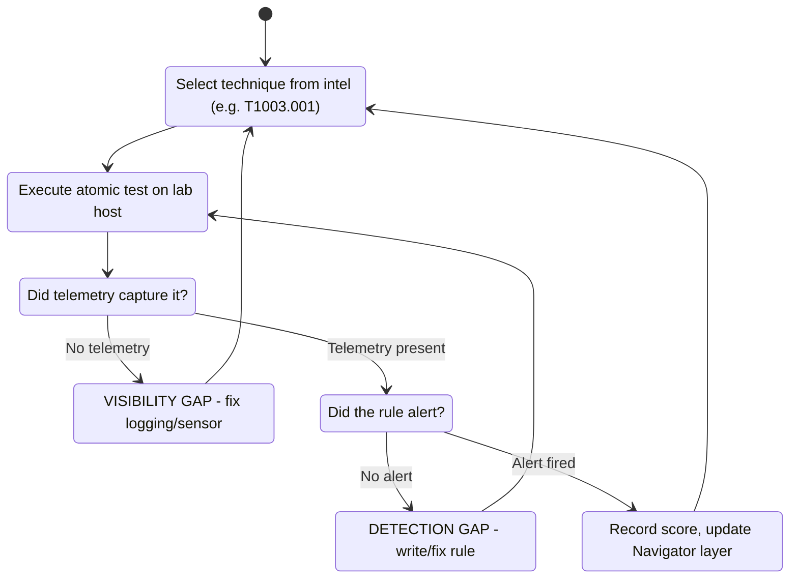
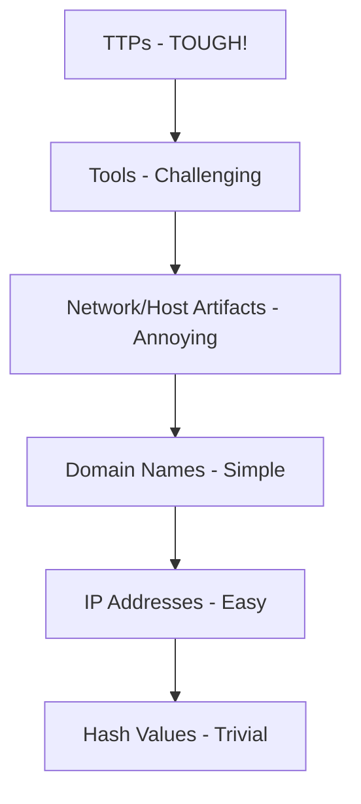

This is Chapter 3 of the Security Foundations series — Notebook 8. Chapter 2 taught you to model a system
you own and enumerate what could go wrong with it. This chapter flips the telescope around and models the
*attacker*: the ordered sequence of things an adversary must accomplish to get from "has never heard of you"
to "has your data," and the standardized vocabulary the industry uses to describe every step of it.

Two models dominate. The **Cyber Kill Chain** is the strategic one — seven phases, easy to hold in your
head, and it gives defenders a single powerful insight: the attacker has to succeed at *every* link, and you
only have to break *one*. **MITRE ATT&CK** is the tactical one — a living, evidence-based encyclopedia of
the several hundred specific techniques real adversaries have been observed using in real intrusions, each
with a stable ID, detection guidance, and a list of the groups seen using it. The kill chain tells you
*where* in a campaign you are. ATT&CK tells you *exactly what* the adversary did and *how you would have
seen it*. Learn both; they are the shared language of SOC analysts, threat intel teams, detection engineers,
red teamers, and every vendor datasheet you will ever read.

## Part 1: Why Attacker Models Exist at All

Before 2011, most enterprise defense was **vulnerability-centric**. You scanned for CVEs, patched what the
scanner found, bought a firewall and an antivirus, and treated each malware alert as an isolated event: a
box got infected, you wiped it, you closed the ticket. The mental model was a list of holes to plug.

That model fails against a *persistent, human adversary* for a specific structural reason: it treats
intrusions as independent, atomic events, when in reality a targeted intrusion is a **campaign** — a series
of dependent steps executed by a person over days, weeks, or months, in which each step exists only to
enable the next. Wiping the infected laptop and closing the ticket, without asking what the malware was
*for*, leaves the operator still inside your network with the credentials they already stole.

The insight that changed defense was borrowed from military targeting doctrine. A "kill chain" in military
usage is the sequence *find → fix → track → target → engage → assess*; the doctrinal point is that
interrupting any link defeats the whole engagement. Three analysts at Lockheed Martin — Eric Hutchins,
Michael Cloppert, and Rohan Amin — adapted it to network defense in the 2011 paper *Intelligence-Driven
Computer Network Defense Informed by Analysis of Adversary Campaigns and Intrusion Kill Chains*. That paper
is the origin of everything in this chapter, and its central claim is worth memorizing:

> The adversary must progress successfully through every stage of the chain before it can achieve its
> desired objective; just one mitigation disrupts the chain and the adversary.

This produces the asymmetry defenders desperately need. The famous line "the attacker only has to be right
once, the defender has to be right every time" is *false* under kill-chain thinking. Inside a single
intrusion the reverse is true: the attacker must be right at every phase, and the defender need only catch
one. Your job is not to be perfect at the perimeter; your job is to have enough visibility at enough phases
that the attacker cannot cross all of them unseen.

The second insight of the paper is **intelligence-driven defense**. Because campaigns repeat, the indicators
you extract from a failed intrusion — a delivery domain, a malware mutex, a lure document theme, a
credential-dumping method — become defenses against the *next* intrusion by the same actor. Each intrusion
attempt is a free intelligence donation. That reframing turns incident response from a cost center into an
intelligence pipeline, and it is why "threat intel" exists as a discipline in the shape it now has.



**Security relevance for a beginner:** the reason your SOC ticket queue asks "what stage is this?" and the
reason every EDR alert carries an ATT&CK ID is that both of these models won. You cannot read a modern
incident report, threat-intel bulletin, or detection-tuning ticket without them.

## Part 2: The Cyber Kill Chain, Phase by Phase

The Lockheed Martin chain has seven phases. Learn them in order — the order is the whole point.



### Phase 1: Reconnaissance

The adversary selects and researches a target. This is everything done *before* any packet is sent in anger,
and it splits into two halves.

**Passive reconnaissance** touches nothing the target owns: harvesting employee names and job titles from
LinkedIn (job ads leak your tech stack — "must have 5 years Citrix NetScaler experience" tells an attacker
exactly what edge device to look for), scraping email formats, reading SEC filings and press releases for
acquisitions (newly-acquired subsidiaries are the classic weak entry point), pulling certificate-transparency
logs to enumerate subdomains, querying WHOIS and passive-DNS providers, and mining code-sharing sites for
leaked credentials.

**Active reconnaissance** does touch the target: port scanning, service-version fingerprinting, directory
brute-forcing, or simply loading the site and cataloguing its technologies. It is faster and richer but
generates logs.

The critical defensive property of this phase is that **most of it is invisible to you**. You will never see
someone read your LinkedIn page. This asymmetry is why the phase was originally considered undefendable —
and why the models that came later had to change how they handled it.

**Red team usage:** this is where an engagement genuinely lives or dies. An operator who spends three days
building an accurate org chart, identifying who works in finance, and confirming that the company uses a
particular SSO portal will land a phish that a technically superior operator with no recon never will.

**Blue team usage:** you *can* defend here, just not by blocking. You can monitor certificate-transparency
logs for newly-registered lookalike domains (`c0mpany-sso.com` appearing in CT logs is a phishing campaign in
preparation), minimize what job ads reveal, run your own external attack-surface discovery so you find the
forgotten staging box before someone else does, and watch for scanning patterns at the edge.

### Phase 2: Weaponization

The adversary builds the deliverable payload: a malicious macro-enabled document, an ISO or LNK file, a
trojanized installer, an exploit bundled into a PDF, or a link to a credential-harvesting page. Nothing
touches the victim during weaponization — it happens entirely on adversary-controlled infrastructure. This
is also when the operator registers domains, stands up C2 servers, obtains or steals code-signing
certificates, and packs the payload to evade static detection.

Because this phase is entirely off your network, it is **undetectable in real time by the victim**. But it
is enormously valuable *retroactively*: the artifacts left in a weaponized file — compilation timestamps,
document metadata and author names, PDB paths embedded by the compiler, the specific packer or crypter used,
reused mutex names, C2 profile quirks — are among the most durable attribution signals in existence. Two
campaigns that look unrelated at the delivery layer often share a builder.

### Phase 3: Delivery

Transmission of the weapon to the target environment. The three delivery vectors named in the original paper
— email attachments, websites, and removable media — still dominate, though the mix has shifted. In modern
incident data, the leading initial-access vectors are roughly: phishing (attachment, link, or a link
delivered via a chat/collaboration platform), exploitation of an internet-facing service, and **valid
credentials** obtained by purchase, spraying, or an infostealer log — with the last of these growing fastest
because it involves no malware at all.

Delivery is the **first phase you can reliably observe**, and therefore the first place a control can bite:
mail gateways, attachment detonation sandboxes, web proxies, DNS filtering, USB device control.

### Phase 4: Exploitation

The payload executes and gains code execution. This can be a software exploit (a memory-corruption bug in a
document parser, a deserialization flaw in an edge appliance) or — far more commonly — **the user is the
exploit**: they enable macros, they run the "invoice.pdf.exe," they paste a PowerShell command into the Run
dialog because a fake CAPTCHA told them to, they approve the eleventh MFA push at 3 a.m.

Note the distinction between exploitation and delivery: delivery got the thing to the user; exploitation is
the moment adversary-controlled code first runs in your environment. Everything before this is preparation.

### Phase 5: Installation

The adversary establishes **persistence** — a foothold that survives reboot, user logoff, and the death of
the original process. Classic mechanisms: a registry Run key, a scheduled task, a Windows service, a WMI
event subscription, a cron job or systemd unit on Linux, a web shell on a server, a malicious OAuth
application in a cloud tenant, or an additional SSH key in `authorized_keys`.

**IR use case:** this is the phase that decides whether your incident is over. If you evict the attacker but
miss one persistence mechanism, they are back in an hour. Persistence hunting — enumerating every autostart
extensibility point on the affected hosts — is the single highest-value activity in a containment effort.

### Phase 6: Command and Control (C2)

The implant beacons out to adversary infrastructure and opens a channel for hands-on-keyboard control.
Almost universally **outbound-initiated**, because outbound is what firewalls allow. Channels ride HTTPS
(blending with normal web traffic), DNS (slow but almost never blocked), or legitimate third-party services
— a compromised host talking to a major cloud storage provider, a code repository, or a messaging platform
looks entirely normal in netflow. Modern implants add **jitter** (randomized beacon intervals), **sleep
masking**, and **domain fronting** or CDN-fronted redirectors specifically to defeat the traffic analysis
described below.

Without C2, most intrusions stall — an implant that cannot phone home is an expensive paperweight. This
makes C2 the highest-value chokepoint in the entire chain for a defender, which is exactly why the original
paper called it "the defender's last best chance to block the operation."

### Phase 7: Actions on Objectives

Only now does the adversary do the thing they came for. What that is depends entirely on who they are:

- **Espionage actors:** find, stage, compress, and exfiltrate specific data; maintain long-term quiet access.
- **Ransomware crews:** enumerate and destroy backups, exfiltrate data for double extortion, then encrypt at
  scale — usually via domain-wide deployment on a Friday evening.
- **Destructive/hacktivist actors:** wipe systems, deface, or manipulate operational-technology processes.
- **Financially-motivated fraud crews:** manipulate payment flows, redirect wire transfers, mint gift cards.

Everything between Phase 4 and Phase 7 in a real intrusion — privilege escalation, internal reconnaissance,
lateral movement, credential theft — the original paper folds into this final phase, often noting that the
adversary restarts the chain from Phase 1 against each newly-discovered internal target. Hold that thought;
it is the chain's biggest weakness and Part 4 returns to it.

### The full chain, with defender visibility

| Phase | Adversary goal | Occurs on | Defender visibility | Typical control |
|---|---|---|---|---|
| 1. Reconnaissance | Select and research target | Public internet / adversary infra | Very low (passive) to moderate (active scanning) | Attack-surface management, CT-log monitoring, edge scan detection |
| 2. Weaponization | Build the payload | Adversary infra only | None in real time; high retrospective value | Threat intel, malware analysis, YARA on builder artifacts |
| 3. Delivery | Transmit weapon to target | Boundary (mail/web/USB) | High — first real chance | Mail gateway, detonation sandbox, web proxy, DNS filter, device control |
| 4. Exploitation | Execute code on victim | Victim endpoint | High with EDR | Patching, macro policy, exploit mitigations, application control, user training |
| 5. Installation | Establish persistence | Victim endpoint | High with EDR + autoruns telemetry | Application allowlisting, autorun auditing, least privilege |
| 6. Command & Control | Open control channel | Network egress | High with egress logging | Egress filtering, proxy inspection, DNS/RDNS analytics, JA3/JA4 fingerprinting |
| 7. Actions on Objectives | Achieve the mission | Internal network / data stores | Moderate to high | DLP, segmentation, immutable backups, honeytokens, anomaly detection |

**Memory hook for the seven phases:** *"Recon Weaponizes, Delivers, Exploits, Installs, Controls, Acts."*
Or the initials **R-W-D-E-I-C-A** — read as "Red Wolves Don't Eat In Cold Alaska." Any mnemonic works; what
matters is that you can recite the order cold, because every conversation about an intrusion implicitly
places events on this timeline.

## Part 3: The Courses of Action Matrix — Turning the Chain Into Decisions

The kill chain on its own is a description. What makes it *operational* is the second half of the Lockheed
paper: the **Courses of Action (CoA) matrix**. You take the seven phases as rows, and six defensive actions
as columns, and you fill in the cells with the controls you actually have. Where the matrix is empty, you
are blind or defenceless at that phase.

The six courses of action:

- **Detect** — you become aware it happened. (You lose nothing but you learn.)
- **Deny** — you prevent the action outright. (Block the domain, patch the bug.)
- **Disrupt** — you stop it mid-execution. (AV kills the process; the proxy terminates the session.)
- **Degrade** — you make it slower, noisier, or lower-yield. (Rate-limit, throttle, bandwidth-shape.)
- **Deceive** — you feed the adversary false information. (Honeypots, honeytokens, canary credentials.)
- **Destroy** — you neutralize adversary capability or infrastructure. (Almost always a
  law-enforcement/government action; a private enterprise "hacking back" is illegal in most jurisdictions,
  and Chapter 5 of this series covers exactly why authorization is not optional.)

Here is a filled-in matrix for a typical mid-size enterprise. Building your own version of this table for
your actual environment is one of the highest-value exercises in this chapter — the empty cells are your
roadmap.

| Phase | Detect | Deny | Disrupt | Degrade | Deceive |
|---|---|---|---|---|---|
| Reconnaissance | Web/CT-log analytics, scan detection | Robots/ACLs, hide banners | — | Tarpit, rate-limit scanners | Fake subdomains, decoy job posts |
| Weaponization | Retrospective malware analysis, YARA | — | — | — | — |
| Delivery | Mail gateway logs, proxy logs | Attachment-type blocking, DNS filter | Detonation sandbox verdict | Greylisting | Spam-trap mailboxes |
| Exploitation | EDR process telemetry | Patch management, macro-block policy | Exploit mitigations (DEP/ASLR/CFG) | Least-privilege user accounts | Deliberately vulnerable-looking decoy host |
| Installation | Autoruns/service-creation alerts | Application allowlisting | EDR block-and-quarantine | Non-admin users | Canary registry keys |
| Command & Control | Netflow/DNS analytics, JA3/JA4 | Egress firewall, proxy allowlist | Sinkhole, TLS termination | Bandwidth throttling | DNS sinkhole serving fake C2 |
| Actions on Objectives | DLP, UEBA, file-access auditing | Segmentation, immutable backups | Session kill, account disable | Encryption at rest, data minimization | Honeytoken documents, canary AWS keys |

Two things to notice. First, **the matrix gets richer as you move down** — you have more options late in the
chain than early. That is not a failure; it is the point. You are not trying to win at Phase 1. Second,
**Deceive is the most underused row in real enterprises and the cheapest to fill.** A single fake AWS access
key placed in a file share, wired to alert when used, costs nothing and fires only on a true positive. Two
free, well-regarded options for this are Thinkst Canarytokens and honeypot accounts in Active Directory that
no legitimate process should ever touch.

**Blue team usage:** print this matrix, fill every cell for your own environment, and mark the empty ones.
That single document turns "we should improve security" into a ranked, defensible list of gaps — and it maps
directly onto the budget conversation, because each empty cell is a named risk at a named phase.

## Part 4: Where the Kill Chain Breaks Down

The kill chain is a great strategic model and a poor tactical one. Knowing precisely *why* is what separates
someone who has read a blog post from someone who can use these frameworks properly.

**It is too perimeter-heavy and too malware-centric.** Five of its seven phases describe getting *in* and
establishing malware. But in a modern intrusion, the overwhelming majority of adversary *effort* and *dwell
time* happens after the foothold: escalating privileges, dumping credentials, mapping Active Directory,
moving laterally across dozens of hosts, finding and killing backups. The kill chain compresses all of that
into one bucket labelled "Actions on Objectives." That is like a map of a marathon that gives street-level
detail for the first 400 metres and then draws one arrow labelled "the rest."

**It assumes malware.** A large share of modern intrusions are **living-off-the-land**: the adversary logs in with valid
credentials bought from an initial-access broker or lifted from an infostealer log, and then uses only tools
already on the system — PowerShell, WMI, `net.exe`, RDP, scheduled tasks, PsExec. There is no weaponization
phase, no exploitation phase, and nothing for antivirus to find. The chain's Phases 2, 4, and 5 are simply
skipped or unrecognizable.

**It is linear, and real intrusions are not.** A real operator loops: foothold on a workstation, recon,
escalate, dump credentials, pivot to a server, recon *that* environment, escalate again. The chain runs many
times at many depths, in parallel across many hosts, and phases interleave. Trying to assign a single
timeline position to a 40-host intrusion produces arguments, not insight.

**It has no vocabulary for insider threat or supply chain.** An insider skips phases 1 through 6 entirely and
starts at Actions on Objectives. A supply-chain compromise inverts the model: the "delivery" is your own
trusted software update pipeline, and every downstream victim receives a legitimately-signed payload.

**It is not cloud- or identity-native.** In a cloud tenant compromise there may be no endpoint, no implant,
and no network egress to inspect. The attack is: steal a session token, replay it against an API, add a
federated identity provider or a long-lived access key for persistence, enumerate storage buckets, exfil via
the provider's own API. "Installation" and "Command and Control" barely parse in that world.

**It has no shared vocabulary at the technique level.** The chain lets two analysts agree that something is
"Installation." It gives them no way to agree on *what specifically* was done, so one writes "persistence via
autostart" and the other writes "added a Run key," and neither is searchable, countable, or comparable across
reports. This last gap is precisely the one ATT&CK exists to fill.



## Part 5: The Successors — Unified Kill Chain and the Diamond Model

### The Unified Kill Chain

Paul Pols published the **Unified Kill Chain (UKC)** in 2017 as a deliberate merge of the Lockheed chain and
ATT&CK, specifically to fix the "one bucket for everything internal" problem. It defines **18 attack phases**
grouped into three stages, and — crucially — it is explicitly **non-linear and recursive**: phases can repeat,
be skipped, and run in loops as the adversary pivots.

| Stage | Phases | What it covers |
|---|---|---|
| **Initial Foothold** | Reconnaissance, Weaponization, Delivery, Social Engineering, Exploitation, Persistence, Defense Evasion, Command & Control | Getting in and staying in on the first host |
| **Network Propagation** | Pivoting, Discovery, Privilege Escalation, Execution, Credential Access, Lateral Movement | The whole internal campaign the Lockheed chain ignored |
| **Action on Objectives** | Access, Collection, Exfiltration, Impact (plus Objectives) | Doing the actual mission |



Notice how closely Stage 2's phase names track ATT&CK's tactic names. That is intentional — the UKC is
essentially the kill chain's narrative structure wearing ATT&CK's vocabulary, and it is a genuinely useful
bridge when you need to tell a *story* about an intrusion (which the kill chain does well) while retaining
*technique-level precision* (which ATT&CK does well).

### The Diamond Model of Intrusion Analysis

Published in 2013 by Sergio Caltagirone, Andrew Pendergast, and Christopher Betz, the **Diamond Model**
answers a different question. The kill chain and ATT&CK model *time and behaviour*; the Diamond Model models
*relationships*. Every intrusion event is a diamond with four connected vertices:

- **Adversary** — the operator or organization behind the activity.
- **Capability** — the tools, malware, and techniques used.
- **Infrastructure** — the C2 domains, IPs, redirectors, email accounts, and delivery hosts used.
- **Victim** — the targeted person, organization, asset, or network.



The model's operational power is **pivoting**: knowing any one vertex lets you discover the others. You see a
C2 IP (Infrastructure) in your logs → passive DNS reveals five other domains that resolved there → those
domains served a distinctive loader (Capability) → that loader has been publicly attributed to a named group
(Adversary) → that group's other known infrastructure gives you a block list and a hunting hypothesis for
your other subsidiaries (Victims). Each hop is a *pivot along an edge of the diamond*, and this is the core
analytic tradecraft of a cyber threat intelligence team.

The model also defines **meta-features** attached to each event — timestamp, phase, result, direction,
methodology, resources — and the phase meta-feature is explicitly where you plug the kill chain in. Chaining
diamonds in kill-chain order yields an **activity thread**, and grouping threads that share vertices yields
an **activity group**: the formal definition of "a campaign."

**How the three fit together — this is the take-away of Part 5:**

| Model | Question it answers | Granularity | Best used for |
|---|---|---|---|
| Cyber Kill Chain | *When* in the campaign are we? | 7 coarse phases | Executive briefings, control-gap mapping, incident narrative |
| Unified Kill Chain | *When*, allowing loops and internal movement | 18 phases, 3 stages | Full-campaign storytelling, red-team engagement structuring |
| MITRE ATT&CK | *What* exactly did they do, and how would I see it? | ~14 tactics, hundreds of techniques | Detection engineering, purple teaming, coverage assessment, CTI |
| Diamond Model | *Who*, using *what*, from *where*, against *whom*? | Per-event, relational | Threat intel pivoting, attribution, campaign clustering |

They are complementary, not competing. A mature intel report uses all four: the Diamond gives you the actors
and infrastructure, the kill chain gives the narrative arc, and ATT&CK gives the technique-by-technique
detail your detection engineers can actually act on.

## Part 6: MITRE ATT&CK — What It Actually Is

**ATT&CK** stands for **Adversarial Tactics, Techniques, and Common Knowledge**. MITRE is a US non-profit
that operates federally funded research centres; ATT&CK began internally around 2013 out of a research
project called FMX (the Fort Meade Experiment), whose question was blunt and practical: *how well do we
actually detect a post-compromise adversary inside our own network, and how would we measure that?* To answer
it, they needed a common list of the things adversaries do after they get in. That list, published publicly
in 2015, became ATT&CK.

Three properties define it and explain why it beat every competing taxonomy:

1. **It is empirical, not theoretical.** A technique gets into ATT&CK because it has been *observed in use*
   by real adversaries and there is public reporting to cite. It is not a list of everything that is
   conceivable; it is a list of what has actually happened. Every technique page carries citations.
2. **It is behaviour-level, not indicator-level.** ATT&CK does not catalogue hashes or IPs. It catalogues
   *behaviours* — "dumps credentials from LSASS memory," "uses a scheduled task for persistence" — which are
   far more durable than any indicator. (Part 12's Pyramid of Pain explains exactly why this matters.)
3. **It is a shared, stable vocabulary with IDs.** `T1003.001` means "OS Credential Dumping: LSASS Memory" to
   every vendor, analyst, and tool on earth. That is the single most valuable thing about it: it makes
   security *countable and comparable*.

### The object model

ATT&CK is a graph of typed objects. You must know these seven, and the ID prefix for each:

| Object | Prefix | What it is | Example |
|---|---|---|---|
| **Tactic** | `TA` | The adversary's *goal* — the "why" of an action | `TA0006` Credential Access |
| **Technique** | `T` | *How* the goal is achieved | `T1003` OS Credential Dumping |
| **Sub-technique** | `T....00N` | A more specific *how* under a parent technique | `T1003.001` LSASS Memory |
| **Procedure** | (in-line) | A *specific implementation* by a specific actor/tool | "Group X used `procdump -ma lsass.exe`" |
| **Group** | `G` | A named, tracked set of intrusion activity | `G0016` APT29 |
| **Software** | `S` | Malware or a legitimate tool used by adversaries | `S0002` Mimikatz, `S0154` Cobalt Strike |
| **Mitigation** | `M` | A configuration/control that reduces a technique | `M1032` Multi-factor Authentication |

Two more objects were added in later versions and you will encounter them: **Data Sources / Data Components**
(what telemetry is needed to see a technique — e.g. Process: Process Creation, Command: Command Execution)
and **Campaigns** (`C` prefix — a time-bounded set of intrusion activity against specific targets, which sits
between a single technique sighting and a long-lived Group).



### Tactic vs technique vs procedure — the distinction people get wrong

This is the most common conceptual error, so nail it now with one example:

- **Tactic (why):** the adversary wants credentials. → *Credential Access, TA0006*.
- **Technique (how):** they dump them from the OS. → *OS Credential Dumping, T1003*.
- **Sub-technique (more specific how):** specifically from LSASS process memory. → *T1003.001*.
- **Procedure (exactly what, by whom):** they ran
  `rundll32.exe C:\Windows\System32\comsvcs.dll, MiniDump 632 C:\temp\out.dmp full` — a specific
  implementation using a signed Microsoft binary, which *also* invokes `T1218.011 System Binary Proxy
  Execution: Rundll32`.

Note the last point: one real command frequently maps to **several** techniques at once. Real-world mapping
is many-to-many, not one-to-one. Anyone who tells you an intrusion is "12 techniques" has made a judgement
call, not measured a fact.

### Sub-techniques: why they exist

Until ATT&CK v7 (2020) there were no sub-techniques, and the technique list had a serious granularity
problem: `T1003 Credential Dumping` covered everything from reading `/etc/shadow` on Linux to dumping NTDS.dit
off a domain controller — wildly different actions with wildly different detections, all sharing one ID.
Meanwhile some other techniques were absurdly narrow. Sub-techniques fixed this by making the parent a
*category* and the children the *actionable units*. Practical consequence: **when writing detections or
measuring coverage, work at the sub-technique level.** "We cover T1003" is a meaningless claim; "we detect
T1003.001 and T1003.003 but have no visibility into T1003.002" is a real statement.

### The matrices

ATT&CK is not one matrix. The main technology domains are:

- **Enterprise** — the big one. Covers platforms including Windows, macOS, Linux, Cloud (IaaS, SaaS, Office
  Suite, Identity Provider), Network Devices, and Containers.
- **Mobile** — Android and iOS specific techniques.
- **ICS** — Industrial Control Systems, with its own tactics (e.g. *Impair Process Control*, *Inhibit Response
  Function*) reflecting that in OT the objective is often physical process manipulation, not data theft.

**PRE-ATT&CK** used to be a separate matrix covering pre-compromise activity; in ATT&CK v8 it was folded into
Enterprise as the two leading tactics, *Reconnaissance* and *Resource Development*. If you read older
material referring to "PRE-ATT&CK" as a separate thing, that is why.

ATT&CK ships roughly twice a year and **technique IDs, counts, and group attributions change between
versions.** Never hard-code a technique count into a report, and always cite the ATT&CK version you used —
"mapped against ATT&CK Enterprise v15" — or your coverage numbers are not reproducible. This is a real and
frequently-missed rigor issue in published threat reports.

## Part 7: The Fourteen Enterprise Tactics, Walked Through

The Enterprise matrix columns are the tactics, read left to right in roughly chronological order — though
remember from Part 4 that real intrusions loop, so this order is a convention, not a law. Here is the full
set with their IDs and the techniques you will meet most often. Learn this table; it is the backbone of every
detection conversation you will ever have.

| # | Tactic | ID | Adversary goal | High-frequency techniques |
|---|---|---|---|---|
| 1 | Reconnaissance | TA0043 | Gather information to plan the operation | `T1595` Active Scanning, `T1589` Gather Victim Identity Info, `T1596` Search Open Technical Databases |
| 2 | Resource Development | TA0042 | Build/buy/steal the resources for the operation | `T1583` Acquire Infrastructure, `T1587` Develop Capabilities, `T1588` Obtain Capabilities |
| 3 | Initial Access | TA0001 | Get into the network | `T1566` Phishing, `T1190` Exploit Public-Facing Application, `T1078` Valid Accounts, `T1133` External Remote Services |
| 4 | Execution | TA0002 | Run adversary code | `T1059` Command and Scripting Interpreter, `T1053` Scheduled Task/Job, `T1204` User Execution |
| 5 | Persistence | TA0003 | Keep access across reboots/credential changes | `T1547` Boot or Logon Autostart Execution, `T1053` Scheduled Task, `T1136` Create Account, `T1505` Server Software Component |
| 6 | Privilege Escalation | TA0004 | Gain higher permissions | `T1548` Abuse Elevation Control Mechanism, `T1068` Exploitation for Priv Esc, `T1134` Access Token Manipulation |
| 7 | Defense Evasion | TA0005 | Avoid being detected | `T1070` Indicator Removal, `T1027` Obfuscated Files or Information, `T1562` Impair Defenses, `T1218` System Binary Proxy Execution |
| 8 | Credential Access | TA0006 | Steal account names and secrets | `T1003` OS Credential Dumping, `T1110` Brute Force, `T1552` Unsecured Credentials, `T1558` Steal or Forge Kerberos Tickets |
| 9 | Discovery | TA0007 | Learn the environment | `T1087` Account Discovery, `T1018` Remote System Discovery, `T1082` System Information Discovery, `T1069` Permission Groups Discovery |
| 10 | Lateral Movement | TA0008 | Move to other systems | `T1021` Remote Services, `T1550` Use Alternate Authentication Material, `T1570` Lateral Tool Transfer |
| 11 | Collection | TA0009 | Gather data of interest | `T1005` Data from Local System, `T1213` Data from Information Repositories, `T1560` Archive Collected Data |
| 12 | Command and Control | TA0011 | Communicate with compromised systems | `T1071` Application Layer Protocol, `T1105` Ingress Tool Transfer, `T1573` Encrypted Channel, `T1090` Proxy |
| 13 | Exfiltration | TA0010 | Steal data out | `T1041` Exfiltration Over C2 Channel, `T1567` Exfiltration Over Web Service, `T1030` Data Transfer Size Limits |
| 14 | Impact | TA0040 | Manipulate, interrupt, or destroy | `T1486` Data Encrypted for Impact, `T1490` Inhibit System Recovery, `T1489` Service Stop, `T1485` Data Destruction |

A few notes that will save you confusion:

**Tactic IDs are not in tactic order.** `TA0043` (Reconnaissance) and `TA0042` (Resource Development) are the
*first* two columns but have the *highest* numbers, because they were added later when PRE-ATT&CK was merged
in. Do not try to sort by ID.

**Techniques appear under multiple tactics.** `T1053 Scheduled Task/Job` is listed under Execution,
Persistence, *and* Privilege Escalation, because creating a scheduled task can serve all three goals. This is
correct and important: the tactic is the adversary's *intent*, and the same action can carry different intent.
When you map an intrusion, choose the tactic that reflects why they did it in that moment.

**Discovery is the loudest tactic and the most under-monitored.** An operator who has just landed on a host
knows nothing about it. They will run a burst of built-in commands in the first minutes — `whoami /all`,
`net user /domain`, `net group "Domain Admins" /domain`, `nltest /dclist:`, `systeminfo`, `ipconfig /all`,
`arp -a`, `tasklist /svc`, `qwinsta` — and on Linux `id`, `uname -a`, `cat /etc/passwd`, `sudo -l`, `ss -tulpn`.
Individually each is benign and used by admins daily. **The signal is the burst**: five or more distinct
discovery commands from one process tree within a couple of minutes, especially spawned from a browser, Office
application, or a service account that has never run them before. This one behavioural detection catches an
enormous fraction of hands-on-keyboard intrusions and costs nothing but log correlation.

**Red team usage:** knowing that Discovery is where most operators get caught is exactly why mature red teams
minimize and slow it — using LDAP queries through an implant's internal API instead of spawning `net.exe`,
pulling AD data once into an offline BloodHound dataset rather than querying repeatedly, and pacing commands.
Chapter 4 of the Active Directory notebook covers those data structures; the point here is that ATT&CK gives
both sides the same map.

**CTF and lab relevance:** if you have worked through the boot-to-root style boxes on HackTheBox or
TryHackMe, you have already executed most of tactics 3 through 10 by hand without naming them. Going back and
labelling each step of a box you have solved with its ATT&CK ID is one of the fastest ways to internalize
this table — see Part 15.

### Walking one intrusion across the tactics

Abstractly, tactics are hard to feel. Concretely, a typical ransomware intrusion reads like this:



Read that diagram until every arrow makes sense. It is a complete intrusion, expressed in a vocabulary that
lets you hand any single line to a detection engineer as a work item.

## Part 8: How to Read a Technique Page Like an Analyst

Open `attack.mitre.org` and pull up any technique. Every page has the same anatomy, and using it well is a
learnable skill. Take **T1003.001 — OS Credential Dumping: LSASS Memory** as the worked example.

**1. The header block.** Gives the ID, the parent technique, the tactic(s) it belongs to, the platforms it
applies to (Windows only, here), the required permissions (Administrator or SYSTEM), and the ATT&CK version.
*Analyst use:* platforms and permissions immediately tell you scope. If a technique requires SYSTEM, then
detecting it also means an earlier privilege-escalation step exists that you may also be able to catch.

**2. The description.** Explains the mechanism. For T1003.001: the Local Security Authority Subsystem Service
(`lsass.exe`) holds credential material in memory for logged-on users — NTLM hashes, Kerberos tickets, and
in some configurations plaintext. An adversary with sufficient privilege reads that process memory.

**3. Procedure Examples.** The most valuable section and the one beginners skip. It is a table of *real
observed implementations* — which group or piece of software did this, and specifically how. For LSASS
dumping you will see entries covering Mimikatz's `sekurlsa::logonpasswords`, ProcDump with `-ma`,
`comsvcs.dll` MiniDump via rundll32, direct `MiniDumpWriteDump` calls from custom tooling, `Task Manager` →
Create dump file, and living-off-the-land options like `createdump.exe`.
*Analyst use:* **this is your detection backlog.** Each distinct procedure is a different thing you must be
able to see. A rule that only catches `mimikatz.exe` by name catches roughly none of them.

**4. Mitigations.** Configuration changes that reduce or remove the technique. For LSASS: enabling LSA
Protection (RunAsPPL), Credential Guard, restricting local administrator rights, and disabling
`WDigest` plaintext credential caching.
*Analyst use:* mitigations beat detections when available — a technique you have *removed* generates no
alerts to triage. Always read this section before writing a rule.

**5. Detection / Data Sources.** What telemetry reveals it. For LSASS: **Process Access** events (Sysmon Event
ID 10 shows one process opening a handle to another, with the granted-access mask), **Process Creation** (a
command line containing `comsvcs.dll` and `MiniDump`), and **File Creation** (a `.dmp` file appearing in a
temp directory).
*Analyst use:* this is a shopping list. If you have no Process Access telemetry, you cannot detect the most
common variants at all — a **visibility gap**, which is completely different from a *detection* gap, and Part
12 explains why conflating the two produces fake coverage numbers.

**6. References.** Public reporting citing real use. This is what makes ATT&CK empirical, and it is how you
verify a claim rather than trusting the summary.

### Practising the read

Try this three-technique drill and write the answers down:

| Technique | Read for | The insight you should extract |
|---|---|---|
| `T1059.001` PowerShell | Procedure examples + detection | Detection needs *Script Block Logging* (Event ID 4104), not just process creation — `powershell.exe -enc <base64>` hides everything from a command-line-only rule |
| `T1055` Process Injection | Sub-technique list | It has a dozen sub-techniques (DLL injection, PE injection, thread execution hijacking, APC injection, process hollowing, process doppelgänging...) — "we detect process injection" is not a claim anyone can make honestly |
| `T1486` Data Encrypted for Impact | Mitigations | The best mitigation is not on the endpoint at all — it is offline, immutable, tested backups. Detection here is nearly always too late |

**Bug bounty relevance:** ATT&CK is post-compromise-centric and mostly *not* a bug-bounty tool — the
techniques assume you already have access. The exception is the Initial Access tactic, where `T1190 Exploit
Public-Facing Application` maps directly onto the external-facing bug classes covered in the Web notebook,
and where writing an impact statement in your report as "this achieves T1190 leading to T1078 Valid Accounts"
makes a triager's job much easier and demonstrably raises the perceived severity. Do not force ATT&CK IDs
into a report where they add nothing.

## Part 9: ATT&CK Navigator — Taught From Scratch

**What it is.** ATT&CK Navigator is a free, open-source web application from MITRE for annotating the ATT&CK
matrices. You get the full matrix rendered as a grid, and you can colour cells, score them, comment on them,
filter them, and — the important part — save and combine your annotations as **layer** files (JSON). It is
the standard way to *visualize* coverage, adversary technique sets, and gaps.

**Why it exists.** Because the moment you try to answer "which techniques do we detect?" you need a way to
mark up several hundred cells, share the markup, version it, and compare two markups. A spreadsheet does this
badly; Navigator does it well and speaks the ATT&CK data model natively.

**Getting it.** Three options, easiest first:

1. **Hosted:** `mitre-attack.github.io/attack-navigator/` — no install, runs entirely client-side. Fine for
   learning and for non-sensitive layers.
2. **Docker:** the fastest self-hosted route.
3. **From source:** required if you want to pin an ATT&CK version or load an internal data source.

```bash
# Self-host from source (Node.js 18+ required)
git clone https://github.com/mitre-attack/attack-navigator.git
cd attack-navigator/nav-app

npm install            # install dependencies from package.json
npm start              # dev server, serves on http://localhost:4200

# Production build instead of dev server:
npm run build          # emits static files into dist/ — serve with any web server
```

Flag notes: `npm install` reads `package.json` and populates `node_modules/`; `npm start` runs the `start`
script (an Angular dev server with live reload — convenient, slow, not for production); `npm run build`
produces a static bundle you can drop behind nginx. If you are behind a corporate proxy, set
`npm config set proxy http://proxy:8080` first or the install will hang.

**The interface, top to bottom:**

- **Layer tabs** — each open layer is a tab; you can have many open at once.
- **Selection controls** — search techniques by name/ID, select all/none, invert selection, and the
  **multi-select** panel that lets you select every technique used by a Group, a Software, or a Mitigation in
  one click. This is the single most useful control in the tool.
- **Layer controls** — export to JSON/Excel/SVG, and the **layer-combining** operator described below.
- **Technique controls** — set **colour**, set a numeric **score**, add a **comment**, toggle
  show/hide-disabled, and enable/disable individual cells.

**The core workflow — building a coverage layer:**

1. New layer → Enterprise ATT&CK.
2. Select the techniques you have a working detection for. Score them `3`.
3. Select techniques where you have the telemetry but no rule. Score them `1`.
4. Select techniques where you have no telemetry at all. Score them `0`.
5. Set the colour gradient (Layer Controls → colour setup) from red at `0` to green at `3`.
6. Export → JSON, and commit it to a git repository.

That last step matters more than it looks. **A Navigator layer is a text file, so it belongs in version
control.** Diffing this quarter's coverage layer against last quarter's is how you demonstrate that your
detection programme actually improved, with evidence.

**Layer files, briefly.** The JSON is simple and scriptable:

```json
{
  "name": "SOC detection coverage",
  "versions": { "attack": "15", "navigator": "4.9.0", "layer": "4.5" },
  "domain": "enterprise-attack",
  "description": "Scores: 3=rule deployed and tested, 1=telemetry only, 0=blind",
  "techniques": [
    { "techniqueID": "T1003.001", "score": 3, "comment": "Sysmon EID 10 handle-access rule, tested" },
    { "techniqueID": "T1003.002", "score": 1, "comment": "Have registry telemetry, no rule written yet" },
    { "techniqueID": "T1550.002", "score": 0, "comment": "No NTLM auth logging from member servers" }
  ],
  "gradient": {
    "colors": ["#ff6666ff", "#ffe766ff", "#8ec843ff"],
    "minValue": 0,
    "maxValue": 3
  }
}
```

Because it is just JSON, you can generate layers programmatically — from your SIEM's rule inventory, from a
threat-intel feed, or from an emulation plan's results — which is how mature teams keep coverage maps honest
instead of hand-maintained and six months stale.

**Combining layers** is Navigator's killer feature. Create a new layer from *"create layer from other
layers"* and give it an expression like `a - b`, where `a` is a Group's technique set and `b` is your coverage
layer. The result highlights **exactly the techniques that adversary uses which you cannot see.** That output
is a prioritized detection backlog derived from threat intelligence rather than from vendor marketing, and
producing it takes about ten minutes.

## Part 10: Hands-On Lab — Map a Real Intrusion End to End

This lab takes a realistic intrusion, maps it to both frameworks, produces a Navigator layer, and ends with a
working detection rule. Everything here runs on a laptop; the only "attack" you execute is a single benign
Atomic test in Part 11, on a VM you own. Chapter 6 of this series covers building that lab safely, and
Chapter 5 covers why running any of this outside your own lab without written authorization is a crime, not
a technicality.

### Step 0: The evidence

You are handed the following timeline, reconstructed from EDR and Windows event logs after a ransomware
incident at a mid-size company. This is your input.

```text
T+00:00  Email delivered to finance@corp.local
         Subject: "Updated Remittance Advice — Q3"
         Attachment: Remittance_Q3.iso  (SHA256 4f2c...e91a)
         Sender domain: corp-billing[.]net  (registered 6 days earlier)

T+02:14  User mounts ISO. Explorer shows a single file "Remittance_Q3.pdf.lnk"
         User double-clicks it.

T+02:14  Process creation:
         Parent : C:\Windows\explorer.exe
         Image  : C:\Windows\System32\cmd.exe
         Cmdline: cmd.exe /c start /min powershell -w hidden -ep bypass
                  -enc JABjAGwAaQBlAG4AdAAgAD0AIABOAGUAdwAtAE8AYgBqAGUAYwB0...

T+02:15  Process creation:
         Parent : powershell.exe
         Image  : C:\Users\jsmith\AppData\Local\Temp\svchost.exe
         Cmdline: "C:\Users\jsmith\AppData\Local\Temp\svchost.exe"

T+02:15  Network connection: svchost.exe -> 185.x.x.x:443
         TLS SNI: cdn-assets-eu[.]com     JA3: 51c64c77e60f3980eea90869b68c58a8
         Beacon interval ~ 60s with 25% jitter

T+02:16  Scheduled task created:
         schtasks /create /tn "MicrosoftEdgeUpdateTaskUser" /tr
         "C:\Users\jsmith\AppData\Local\Temp\svchost.exe" /sc minute /mo 30 /f

T+02:19  Command burst from svchost.exe within 90 seconds:
         whoami /all
         net user /domain
         net group "Domain Admins" /domain
         nltest /dclist:corp
         systeminfo
         arp -a
         tasklist /svc

T+04:02  Process creation:
         Cmdline: rundll32.exe C:\Windows\System32\comsvcs.dll, MiniDump
                  664 C:\Windows\Temp\dbg.dmp full
         File created: C:\Windows\Temp\dbg.dmp  (48 MB)

T+06:40  4769 Kerberos service ticket requests for 14 SPNs, encryption type 0x17 (RC4)
         from a single workstation in under 2 minutes

T+11:20  Logon type 3 to FS01 using account svc_backup
         cmd.exe /c copy \\FS01\C$\... ; 7z.exe a -p<redacted> -mx1 arch.7z
         D:\Finance\ D:\HR\

T+13:05  Outbound HTTPS to a public cloud storage provider, 41 GB over 3 hours

T+16:50  vssadmin delete shadows /all /quiet
         wbadmin delete catalog -quiet
         net stop "Veeam Backup Service" /y
         bcdedit /set {default} recoveryenabled No

T+17:10  New GPO "SecurityUpdate2024" links to Workstations OU, runs
         \\DC01\NETLOGON\enc.exe on every host. Files encrypted, .lockd extension.
```

### Step 1: Map to the Cyber Kill Chain

Do this first, coarsely, because it produces the narrative for the executive summary.

| Kill chain phase | Evidence from the timeline |
|---|---|
| Reconnaissance | Sender knew the finance alias and used a plausible remittance lure; lookalike domain registered 6 days prior |
| Weaponization | ISO container packaging a LNK with an embedded encoded PowerShell one-liner; C2 domain and TLS profile prepared |
| Delivery | Email with `.iso` attachment to `finance@corp.local` at T+00:00 |
| Exploitation | User mounts ISO and double-clicks the LNK at T+02:14 → `cmd.exe` → encoded PowerShell. *The user was the exploit; no CVE involved.* |
| Installation | `svchost.exe` dropped to `%LOCALAPPDATA%\Temp`; scheduled task at T+02:16 |
| Command & Control | HTTPS beacon to `cdn-assets-eu[.]com`, 60 s interval, 25% jitter, from T+02:15 |
| Actions on Objectives | Everything from T+02:19 onward: discovery, credential dumping, Kerberoasting, lateral movement, collection, 41 GB exfiltration, backup destruction, mass encryption |

Look at that last row. **Fifteen hours of the intrusion and every action that actually caused harm collapses
into one phase.** That is the Part 4 criticism in concrete form, and it is exactly why you also do Step 2.

### Step 2: Map to ATT&CK

Now go technique by technique. This is the artifact your detection engineers will consume.

| T+ | Observed action | Tactic | Technique |
|---|---|---|---|
| 00:00 | Malicious `.iso` attached to email | Initial Access | `T1566.001` Phishing: Spearphishing Attachment |
| 02:14 | User double-clicks LNK inside mounted ISO | Execution | `T1204.002` User Execution: Malicious File |
| 02:14 | ISO/LNK used to bypass Mark-of-the-Web | Defense Evasion | `T1553.005` Subvert Trust Controls: Mark-of-the-Web Bypass |
| 02:14 | `powershell -enc <base64>` | Execution | `T1059.001` Command and Scripting Interpreter: PowerShell |
| 02:14 | Base64-encoded command line | Defense Evasion | `T1027` Obfuscated Files or Information |
| 02:15 | Payload named `svchost.exe` in a user temp dir | Defense Evasion | `T1036.005` Masquerading: Match Legitimate Name or Location |
| 02:15 | Beacon over HTTPS | Command & Control | `T1071.001` Application Layer Protocol: Web Protocols + `T1573.002` Encrypted Channel |
| 02:16 | `schtasks /create` for persistence | Persistence / Execution | `T1053.005` Scheduled Task/Job: Scheduled Task |
| 02:19 | `whoami /all`, `net user /domain` | Discovery | `T1033` System Owner/User Discovery, `T1087.002` Account Discovery: Domain Account |
| 02:19 | `net group "Domain Admins" /domain` | Discovery | `T1069.002` Permission Groups Discovery: Domain Groups |
| 02:19 | `nltest /dclist:` | Discovery | `T1018` Remote System Discovery |
| 02:19 | `systeminfo`, `tasklist /svc` | Discovery | `T1082` System Information Discovery, `T1057` Process Discovery |
| 04:02 | `comsvcs.dll MiniDump` against LSASS | Credential Access | `T1003.001` OS Credential Dumping: LSASS Memory |
| 04:02 | Executed via signed `rundll32.exe` | Defense Evasion | `T1218.011` System Binary Proxy Execution: Rundll32 |
| 06:40 | Bulk RC4 service-ticket requests | Credential Access | `T1558.003` Steal or Forge Kerberos Tickets: Kerberoasting |
| 11:20 | Logon type 3 to FS01 with a service account | Lateral Movement / Defense Evasion | `T1021.002` Remote Services: SMB/Windows Admin Shares, `T1078.002` Valid Accounts: Domain Accounts |
| 11:20 | Copying finance and HR shares | Collection | `T1039` Data from Network Shared Drive |
| 11:20 | `7z a -p...` password-protected archive | Collection | `T1560.001` Archive Collected Data: Archive via Utility |
| 13:05 | 41 GB to cloud storage | Exfiltration | `T1567.002` Exfiltration Over Web Service: Exfiltration to Cloud Storage |
| 16:50 | `vssadmin delete shadows`, `wbadmin`, `bcdedit` | Impact | `T1490` Inhibit System Recovery |
| 16:50 | `net stop "Veeam Backup Service"` | Impact | `T1489` Service Stop |
| 17:10 | Mass deployment via GPO | Lateral Movement / Execution | `T1484.001` Domain or Tenant Policy Modification: GPO Modification |
| 17:10 | Files encrypted, `.lockd` extension | Impact | `T1486` Data Encrypted for Impact |

Count the rows: one intrusion, ~23 technique mappings across 9 tactics. Note again that several single actions
mapped to two techniques (the `comsvcs.dll` line is both a credential-access technique and a defense-evasion
technique). That many-to-many property is normal and correct.

### Step 3: Find where you could have broken the chain

Now the payoff. Walk the mapping and ask, at each step, *what single control stops this?*



Nine independent opportunities. The organization needed **one**. That diagram, applied to your own last
tabletop exercise, is the most persuasive security artifact you will ever put in front of a budget holder.

### Step 4: Build the Navigator layer

Save the following as `incident-lockd.json` and import it into Navigator (Open Existing Layer → Upload from
local). Every technique from Step 2 is marked so the whole intrusion lights up on the matrix at once.

```json
{
  "name": "Incident: lockd ransomware",
  "versions": { "attack": "15", "navigator": "4.9.0", "layer": "4.5" },
  "domain": "enterprise-attack",
  "description": "Techniques observed in the lockd intrusion. Score 1 = observed.",
  "techniques": [
    { "techniqueID": "T1566.001", "score": 1, "comment": "ISO attachment, remittance lure" },
    { "techniqueID": "T1204.002", "score": 1 },
    { "techniqueID": "T1553.005", "score": 1, "comment": "ISO container defeats MotW" },
    { "techniqueID": "T1059.001", "score": 1, "comment": "-enc base64, -w hidden, -ep bypass" },
    { "techniqueID": "T1027",     "score": 1 },
    { "techniqueID": "T1036.005", "score": 1, "comment": "svchost.exe in %LOCALAPPDATA%\\Temp" },
    { "techniqueID": "T1071.001", "score": 1 },
    { "techniqueID": "T1573.002", "score": 1 },
    { "techniqueID": "T1053.005", "score": 1, "comment": "MicrosoftEdgeUpdateTaskUser, 30 min" },
    { "techniqueID": "T1033",     "score": 1 },
    { "techniqueID": "T1087.002", "score": 1 },
    { "techniqueID": "T1069.002", "score": 1 },
    { "techniqueID": "T1018",     "score": 1 },
    { "techniqueID": "T1082",     "score": 1 },
    { "techniqueID": "T1057",     "score": 1 },
    { "techniqueID": "T1003.001", "score": 1, "comment": "comsvcs.dll MiniDump" },
    { "techniqueID": "T1218.011", "score": 1 },
    { "techniqueID": "T1558.003", "score": 1, "comment": "14 SPNs, RC4, 2 minutes" },
    { "techniqueID": "T1021.002", "score": 1 },
    { "techniqueID": "T1078.002", "score": 1, "comment": "svc_backup" },
    { "techniqueID": "T1039",     "score": 1 },
    { "techniqueID": "T1560.001", "score": 1, "comment": "7z, password-protected" },
    { "techniqueID": "T1567.002", "score": 1, "comment": "41 GB over 3 hours" },
    { "techniqueID": "T1490",     "score": 1, "comment": "vssadmin + wbadmin + bcdedit" },
    { "techniqueID": "T1489",     "score": 1 },
    { "techniqueID": "T1484.001", "score": 1, "comment": "GPO mass deployment" },
    { "techniqueID": "T1486",     "score": 1, "comment": ".lockd extension" }
  ],
  "gradient": { "colors": ["#ffffffff", "#e60d0dff"], "minValue": 0, "maxValue": 1 }
}
```

Now open a second layer, mark the techniques your own environment can actually detect, and use **create layer
from other layers** with the expression `a - b` (incident minus coverage). What remains red is your gap list,
ranked by an adversary who has already proven they will use it against you.

### Step 5: Write a detection from the technique page

Take one technique — `T1003.001` via `comsvcs.dll` — and turn it into a rule. **Sigma** is the vendor-neutral
detection format: you write the logic once in YAML and convert it to Splunk SPL, Elastic DSL, Microsoft
Sentinel KQL, or whatever your SIEM speaks.

**Sigma from scratch:** it is a YAML schema with a `logsource` (which telemetry) and a `detection` block
containing named **selections** (field/value matches) and a `condition` combining them. Install and convert
with `sigma-cli`:

```bash
pip install sigma-cli                       # the Sigma conversion CLI
sigma plugin install splunk                 # add the Splunk backend
sigma plugin install elasticsearch          # add the Elastic backend

sigma convert -t splunk -p sysmon lsass_comsvcs.yml
#   -t / --target    the backend (splunk, elasticsearch, sentinel-kql, ...)
#   -p / --pipeline  field-mapping pipeline; 'sysmon' maps Sigma's generic
#                    field names onto Sysmon's actual event field names
```

The rule itself:

```yaml
title: LSASS Memory Dump via comsvcs.dll MiniDump
id: 9a1f4c2e-6b0d-4f7a-9c3e-1d2b8e5a7f01
status: experimental
description: >
  Detects credential dumping from LSASS using the signed Microsoft binary
  comsvcs.dll invoked through rundll32, a common living-off-the-land
  implementation of T1003.001 that evades name-based Mimikatz detections.
references:
  - https://attack.mitre.org/techniques/T1003/001/
logsource:
  category: process_creation
  product: windows
detection:
  selection_img:
    - Image|endswith: '\rundll32.exe'
    - OriginalFileName: 'RUNDLL32.EXE'
  selection_cli:
    CommandLine|contains|all:
      - 'comsvcs'
      - 'MiniDump'
  condition: selection_img and selection_cli
falsepositives:
  - Legitimate crash-dump collection by a support engineer (rare; verify the
    target PID and the parent process)
level: critical
tags:
  - attack.credential-access
  - attack.t1003.001
  - attack.defense-evasion
  - attack.t1218.011
```

Three things to internalize from this rule:

1. **The `tags` field is the ATT&CK link.** Every rule carries its technique IDs, so your SIEM can
   automatically compute a coverage layer from your rule inventory. That is how you stop maintaining coverage
   maps by hand.
2. **It matches on `OriginalFileName` as well as `Image`.** `OriginalFileName` comes from the PE version
   resource and survives renaming the binary — so an adversary who copies `rundll32.exe` to `svc.exe` is still
   caught. Preferring rename-resistant fields is basic detection hygiene.
3. **It is one procedure, not the technique.** This rule does *not* catch ProcDump, Task Manager dumps, or a
   custom `MiniDumpWriteDump` caller. You need a second rule keyed on **Sysmon Event ID 10 (ProcessAccess)**
   with `TargetImage` ending in `lsass.exe` and a `GrantedAccess` mask containing the read/query rights
   (`0x1010`, `0x1410`, `0x143a` and friends), which catches the *behaviour* rather than the *tool* — and is
   therefore much higher on the Pyramid of Pain from Part 12.

**Verification step — always do this.** A rule you have not fired is a hypothesis, not a detection. Part 11
shows how to trigger exactly this technique safely and confirm the alert.

## Part 11: Purple Teaming — Atomic Red Team and Caldera

ATT&CK's most valuable operational use is not drawing heatmaps; it is **closing the loop between offense and
defense using a shared vocabulary**. That loop is purple teaming: emulate a specific technique, check whether
the detection fired, fix whatever failed, repeat. Everything below runs only on lab systems you own — see
Chapter 6 for building that lab and Chapter 5 for the authorization rules.



### Atomic Red Team, from scratch

**What it is.** Atomic Red Team (maintained by Red Canary) is an open-source library of small, single-purpose
tests — "atomics" — each mapped to one ATT&CK technique. An atomic is deliberately tiny: it does the one
thing the technique describes, prints what it did, and provides a cleanup command. It is not a C2 framework
and not malware; it is a test harness for detections.

**Why it exists.** Before atomics, validating a detection meant either writing bespoke test code or running a
full red-team engagement. Atomics make "does my LSASS rule work?" a two-minute question.

**Install (Windows lab VM, PowerShell as Administrator):**

```powershell
# Install the execution framework and the atomics folder
IEX (IWR 'https://raw.githubusercontent.com/redcanaryco/invoke-atomicredteam/master/install-atomicredteam.ps1' -UseBasicParsing)
Install-AtomicRedTeam -getAtomics -Force
#   -getAtomics : also downloads the atomics/ test library (several hundred MB)
#   -Force      : overwrite an existing install

Import-Module invoke-atomicredteam -Force
```

**Core workflow:**

```powershell
# 1. See what tests exist for a technique, without running anything
Invoke-AtomicTest T1003.001 -ShowDetailsBrief

# Output:
# T1003.001-1 Windows Credential Editor
# T1003.001-2 Dump LSASS.exe Memory using ProcDump
# T1003.001-3 Dump LSASS.exe Memory using comsvcs.dll
# T1003.001-4 Dump LSASS.exe Memory using direct system calls and API unhooking
# ...

# 2. Read exactly what test 3 will do, and what it needs
Invoke-AtomicTest T1003.001 -TestNumbers 3 -ShowDetails

# 3. Check and satisfy prerequisites (downloads tools, creates files)
Invoke-AtomicTest T1003.001 -TestNumbers 3 -CheckPrereqs
Invoke-AtomicTest T1003.001 -TestNumbers 3 -GetPrereqs

# 4. Run it
Invoke-AtomicTest T1003.001 -TestNumbers 3

# 5. ALWAYS clean up
Invoke-AtomicTest T1003.001 -TestNumbers 3 -Cleanup
```

Flag reference for `Invoke-AtomicTest`:

| Flag | Purpose |
|---|---|
| `-ShowDetailsBrief` | List test names/numbers only — safe, executes nothing |
| `-ShowDetails` | Print the full command, prerequisites, and cleanup for each test |
| `-TestNumbers` / `-TestNames` | Select specific tests instead of all of them |
| `-CheckPrereqs` | Report whether prerequisites are met |
| `-GetPrereqs` | Fetch/create the prerequisites |
| `-Cleanup` | Run the cleanup commands — **never skip this** |
| `-TimeoutSeconds` | Kill a hanging test |
| `-LoggingModule` | Emit structured execution logs so you can correlate test time to alert time |
| `-Session` | Run against a remote host over PowerShell remoting |

**Rule 1 of atomics: read `-ShowDetails` before you run anything.** Some tests intentionally disable defenses,
create accounts, or write to sensitive locations. You are executing real adversary behaviour; do it only on a
snapshot-able VM with no production network path, and snapshot before you start.

**Verifying the Part 10 rule.** Run test 3 above (the `comsvcs.dll` MiniDump), note the timestamp, then check
your SIEM. Three possible outcomes, and each has a different fix:

- **No process-creation event at all** → *visibility gap*. Sysmon is not installed or the config excludes
  `rundll32.exe`. Fix the sensor.
- **Event present, no alert** → *detection gap*. Your rule's field mapping or logic is wrong. Fix the rule.
- **Alert fired** → score `T1003.001` as covered *for this procedure only*, then run tests 1, 2, and 4 and
  discover how much of the technique you still miss. This is the moment most people learn that their coverage
  number was fiction.

### MITRE Caldera

**What it is.** Caldera is MITRE's own open-source adversary-emulation platform. Where Atomic Red Team runs
one isolated test, Caldera runs a **chained operation**: a server issues abilities to lightweight agents, and
a planner decides what to do next based on facts it has learned (an ability that discovers usernames feeds an
ability that needs a username). It emulates a *campaign*, not a technique.

```bash
git clone https://github.com/mitre/caldera.git --recursive
cd caldera
pip3 install -r requirements.txt
python3 server.py --insecure          # --insecure uses default creds; LAB ONLY
# Web UI on http://localhost:8888
```

Concepts you need: **agents** (the implant, e.g. Sandcat, deployed to your lab host), **abilities** (a single
ATT&CK technique implementation, with commands per platform), **adversary profiles** (an ordered set of
abilities emulating a specific actor), **operations** (a profile executed against a group of agents), and
**facts/planners** (the learned data and the logic that chains abilities together).

| Tool | Scope | Best for | Not for |
|---|---|---|---|
| Atomic Red Team | One technique, one command | Fast, precise detection unit-testing | Emulating an actor's full campaign |
| Caldera | Chained, autonomous operation | Multi-step emulation, testing correlation rules | Precisely isolating one detection |
| CALDERA/ART + a C2 framework | Full engagement | Realistic operator tradecraft, evasion testing | Anything without written authorization |

**Adversary emulation plans.** The Center for Threat-Informed Defense publishes free, detailed emulation
plans for specific actors — a step-by-step script of the exact techniques and often the exact commands a
named group has been observed using. Pick the group most relevant to your sector, run the plan in a lab, and
score every step. That is a threat-informed detection programme in a single exercise, and it is dramatically
more useful than running every atomic alphabetically.

## Part 12: The Pyramid of Pain — Why Behaviour Beats Indicators

David Bianco's **Pyramid of Pain** (2013) is the concept that explains *why* ATT&CK is built the way it is.
It ranks indicator types by how much pain it causes the adversary when you deny them.



| Level | Indicator | Cost to adversary when you block it | Shelf life |
|---|---|---|---|
| Hash values | `4f2c...e91a` | Recompile or flip one byte — seconds | Single sample |
| IP addresses | `185.x.x.x` | Move to another VPS — minutes | Days |
| Domain names | `cdn-assets-eu[.]com` | Register a new one — minutes to hours | Days to weeks |
| Network/host artifacts | JA3 hash, User-Agent, mutex, registry path, named pipe | Modify the implant's profile — hours to days | Weeks to months |
| Tools | Cobalt Strike, Mimikatz, a specific loader | Find, buy, or write a replacement, then retrain — weeks | Months |
| **TTPs** | "Dumps LSASS via a signed binary and moves laterally over SMB with stolen hashes" | **Change how they operate — expensive, and often they simply cannot** | Years |

**This is the whole argument for ATT&CK in one table.** A blocklist of hashes and IPs is nearly free for the
adversary to defeat, which is why threat-intel feeds full of them produce so little defensive value. A
detection built on the *behaviour* — any process opening a handle to `lsass.exe` with dump-capable access
rights — survives the adversary changing tools, infrastructure, and payloads entirely.

The practical guidance: **still collect the bottom of the pyramid** (it is cheap and catches lazy attackers)
but **measure your programme by the top of it.** If your quarterly detection report is a count of blocked
IPs, you are measuring the wrong thing. If it is "we added tested detections for six new sub-techniques, four
of which are used by the actor most active against our sector," you are measuring the right thing.

**Where ATT&CK sits:** the framework is deliberately a TTP taxonomy. It has no field for hashes or IPs, by
design. Vendors that bolt ATT&CK IDs onto hash-based signatures are borrowing the vocabulary without the
substance.

## Part 13: Using ATT&CK for Threat Intelligence

The third major use of ATT&CK — after detection engineering and emulation — is structuring intelligence.

**Group pages.** Each `G` object lists a named actor's known techniques, associated software, aliases across
vendors (invaluable, because every vendor names the same actor differently), and the public reporting behind
each claim. In Navigator, *multi-select → Threat Groups → pick a group* instantly paints that actor's entire
technique set onto the matrix.

**The threat-informed prioritization workflow:**

1. Determine which actors realistically target your sector and geography. (Not "APT29 because it sounds
   scary" — use sector ISAC reporting, your own incident history, and the actor's documented targeting.)
2. Build a Navigator layer per actor from their group page.
3. Combine those layers with a scoring expression — e.g. `(a + b + c)` — so techniques used by *multiple*
   relevant actors score highest. That is your prioritized threat model.
4. Subtract your coverage layer. What remains is a ranked backlog.
5. Emulate the top items with Atomic Red Team; fix the gaps; rescore.

**Automating it.** ATT&CK is published as **STIX 2.1** and served over TAXII, so all of this is scriptable.
The `mitreattack-python` library wraps it:

```bash
pip install mitreattack-python
```

```python
from mitreattack.stix20 import MitreAttackData

# Download enterprise-attack.json from the mitre-attack/attack-stix-data repo first
attack = MitreAttackData("enterprise-attack.json")

# 1. Which techniques does a given group use?
groups = attack.get_groups_by_alias("APT29")
group = groups[0]
techniques = attack.get_techniques_used_by_group(group.id)
for t in techniques:
    tech = t["object"]
    attack_id = attack.get_attack_id(tech.id)
    print(f"{attack_id:12} {tech.name}")

# 2. Which groups use a technique you are worried about?
tech_stix_id = attack.get_object_by_attack_id("T1003.001", "attack-pattern").id
for g in attack.get_groups_using_technique(tech_stix_id):
    print(attack.get_attack_id(g["object"].id), g["object"].name)

# 3. What mitigations exist for it?
for m in attack.get_mitigations_mitigating_technique(tech_stix_id):
    print(m["object"].name)
```

Sample output from step 1 (abbreviated — your exact results depend on the ATT&CK version you loaded):

```text
T1003.001    OS Credential Dumping: LSASS Memory
T1021.001    Remote Services: Remote Desktop Protocol
T1059.001    Command and Scripting Interpreter: PowerShell
T1071.001    Application Layer Protocol: Web Protocols
T1078.004    Valid Accounts: Cloud Accounts
T1550.001    Use Alternate Authentication Material: Application Access Token
...
```

Feed that list straight into a Navigator layer generator and you have automated steps 2 and 3 above.

**DeTT&CT** deserves a mention here. It is an open-source companion that scores something ATT&CK does not:
the *quality* of your data sources. You record, per data source, its device coverage, data-field completeness,
timeliness, retention, and consistency; DeTT&CT then produces Navigator layers showing visibility and
detection separately. This is the honest antidote to the coverage illusion described next — a technique you
"detect" using a log source that only exists on 40% of your fleet is not covered.

**IR use case:** during an active incident, mapping observed activity to ATT&CK in real time tells you what to
*look for next*. If you have confirmed Credential Access and Discovery but no Lateral Movement yet, the
adversary's own historical behaviour (from the group page) tells you which lateral techniques to hunt for
before they use them. Frameworks are predictive, not just descriptive.

## Part 14: Detection & Defense Angle

This is the consolidated defensive section. Everything above becomes useful only if it changes what you
build, monitor, and prioritize.

### Prioritize by adversary cost, not by matrix area

The matrix has hundreds of cells and you will never cover them all. Nor should you try — the techniques are
not equally important. Three ranking heuristics, in order of usefulness:

1. **Chokepoints.** Some techniques are unavoidable for most adversaries. Nearly every hands-on intrusion
   includes Discovery (`T1087`, `T1018`, `T1082`), Credential Access (`T1003`, `T1558`), and C2 (`T1071`). A
   detection at a chokepoint catches many unrelated actors; a detection on an exotic technique catches one.
2. **Threat-informed frequency.** Public research consistently finds the same handful of techniques dominating
   real incident data — `T1059` scripting interpreters, `T1055` process injection, `T1218` signed binary proxy
   execution, `T1003` credential dumping, `T1547`/`T1053` autostart persistence. Start there. The Center for
   Threat-Informed Defense's "top techniques" methodology formalizes this ranking.
3. **Mitigate before you detect.** Every technique you can *eliminate* is a technique you never have to
   triage. Credential Guard removes a large fraction of `T1003.001`. Blocking `.iso`, `.img`, and `.vhd` at
   the mail gateway removes the entire Part 10 delivery vector. Disabling Office macros from the internet by
   policy removes `T1204.002` via macro. Removing local admin removes a long tail of privilege escalation.
   Check the Mitigations section of every technique page before writing a rule.

### Detect behaviours, not artifacts

Pulling Part 12 into practice — for each technique, write the rule against the most durable observable:

| Technique | Fragile detection (avoid) | Durable detection (prefer) |
|---|---|---|
| `T1003.001` LSASS dumping | Filename or hash of `mimikatz.exe` | Handle open to `lsass.exe` with dump-capable `GrantedAccess` (Sysmon EID 10), from a non-allowlisted process |
| `T1059.001` PowerShell | Command line contains `Invoke-Mimikatz` | Script Block Logging (4104) with de-obfuscated content + PowerShell spawned by Office/browser parent |
| `T1053.005` Scheduled task | Task name blocklist | Task registered (EID 4698 / Sysmon 1 on `schtasks.exe`) whose action path is in a user-writable directory |
| `T1071.001` C2 beacon | IP/domain blocklist | Periodicity analysis on egress netflow: low-variance intervals, consistent byte counts, long-lived low-volume sessions |
| `T1567.002` Cloud exfil | Block one provider domain | Egress volume baseline per host per destination category; alert on 10x deviation |
| `T1490` Inhibit recovery | Match `vssadmin.exe` exactly | Any of `vssadmin`/`wmic shadowcopy`/`wbadmin`/`bcdedit`/`Win32_ShadowCopy` deletion semantics, correlated |

### Instrument the data sources ATT&CK names

You cannot detect what you do not log. A minimum viable telemetry baseline for the Enterprise matrix:

| Data source | Windows implementation | Catches |
|---|---|---|
| Process creation + full command line | Sysmon EID 1, or Security 4688 with "Include command line" GPO enabled | Execution, Discovery, most LOLBins |
| Script content | PowerShell Script Block Logging (4104), transcript logging | Obfuscated PowerShell that command-line logging misses entirely |
| Process access | Sysmon EID 10 | Credential dumping, process injection |
| Image/driver load | Sysmon EID 6, 7 | DLL side-loading, vulnerable-driver abuse |
| Network connection | Sysmon EID 3, firewall/proxy/netflow logs, DNS query logs (Sysmon 22) | C2, exfiltration, lateral movement |
| Authentication | 4624/4625/4768/4769/4776, logon type field | Lateral movement, Kerberoasting, password spraying |
| File creation | Sysmon EID 11 | Dropped payloads, staged archives, dump files |
| Registry | Sysmon EID 12/13/14 | Persistence, defense-evasion config changes |
| Cloud/identity | Provider audit logs (sign-in, admin activity, storage access) | Everything in the cloud and identity techniques |

Two configuration notes that catch people out: 4688 **does not include the command line by default** — it is a
separate policy setting, and without it the event is nearly useless. And Sysmon is only as good as its
configuration file; start from a well-maintained community configuration rather than the default, which logs
either too little or an unusable flood.

### Measure honestly

Separate three numbers and never merge them:

- **Visibility** — do I have the telemetry this technique requires?
- **Detection** — do I have a rule, and has it been *tested to fire*?
- **Efficacy** — when it fires, does an analyst act correctly within an acceptable time?

A programme with 90% visibility, 40% detection, and 15% efficacy is in a completely different situation from
one with 40/40/40, and a single "coverage" percentage hides that entirely.

### Defence in depth, expressed as the chain

Finally, put Part 3's Courses of Action matrix and Part 10's break-the-chain diagram together: your goal is
not a perfect control at any one phase, but **at least one working control at as many phases as possible**,
because the adversary must cross all of them. Independent controls at seven phases, each 60% effective, are
vastly stronger than one 99% control at delivery — and far more honest about the fact that the 99% control
will eventually fail.

## Part 15: Common Pitfalls

**Heatmap theatre.** A green matrix is the most seductive lie in security. Green usually means "a vendor
mapped their product to this technique," not "we tested this and it fires." If a cell has never been proven
by emulation, it is not green. Colour untested cells differently and watch the picture change.

**Counting techniques as coverage.** "We cover 220 of 600 techniques" is meaningless. Techniques are not
equally weighted, they are not equally used, and a parent technique with 12 sub-techniques counts once. Score
sub-techniques, weight by threat relevance, and report which *chokepoints* you cover.

**Confusing visibility with detection.** Having Sysmon deployed is not detecting `T1055`. Having a rule that
has never fired in testing is not detecting it either. Only an emulated test that produced an alert is
evidence.

**Treating the kill chain as strictly sequential.** Real intrusions loop, skip, and run phases in parallel
across many hosts. Arguing about whether an event is "Installation" or "Actions on Objectives" produces zero
defensive value. Use the chain for narrative and control mapping; use ATT&CK for precision.

**Forcing every event into exactly one technique.** Mapping is many-to-many. One command can be three
techniques; one technique can appear under three tactics. Record all of them.

**Assuming ATT&CK is exhaustive.** It is empirical: it contains what has been observed *and publicly
reported*. Novel techniques exist before they are catalogued, and zero-day tradecraft by definition is not in
there yet. ATT&CK is a floor for your detection programme, not a ceiling.

**Ignoring the non-Windows matrices.** Enterprise ATT&CK is Windows-heaviest because that is where the public
reporting is, but Linux, macOS, containers, cloud, and identity techniques are all in there and are where an
increasing share of real intrusions happen. If your coverage layer is 95% Windows, that reflects your reading
habits, not your risk.

**Version drift.** Technique IDs get deprecated, split, and renumbered between releases. Always pin and cite
the ATT&CK version in any report, layer, or metric. A coverage comparison across two different ATT&CK versions
is not a comparison.

**Mapping after the fact only.** The framework is most valuable *before* an incident — for prioritization and
emulation. Teams that only touch ATT&CK when writing the post-incident report are using maybe a tenth of it.

## Part 16: Final Revision / Summary

- Defense used to be **vulnerability-centric** (patch holes, wipe boxes, close tickets). Kill-chain thinking
  made it **intelligence-driven**: intrusions are campaigns of dependent steps, and every failed attempt
  yields intelligence that strengthens you against the next one.
- The **Cyber Kill Chain** (Hutchins, Cloppert, Amin — Lockheed Martin, 2011) has seven phases:
  **Reconnaissance → Weaponization → Delivery → Exploitation → Installation → Command & Control → Actions on
  Objectives.** The adversary must complete all seven; you need to break one.
- The **Courses of Action matrix** turns the chain into decisions: phases as rows, **Detect / Deny / Disrupt /
  Degrade / Deceive / Destroy** as columns. Empty cells are your gaps. *Deceive* is the cheapest row and the
  most neglected.
- The chain's weaknesses are real: perimeter-heavy, malware-assuming, linear, blind to insider and supply-chain
  threats, awkward for cloud and identity, and it has no technique-level vocabulary. All of Actions on
  Objectives — most of the actual intrusion — is one bucket.
- The **Unified Kill Chain** (Pols, 2017) fixes the linearity problem with 18 phases in three stages: Initial
  Foothold, Network Propagation, Action on Objectives — explicitly loopable.
- The **Diamond Model** (2013) is relational, not temporal: **Adversary, Capability, Infrastructure, Victim**.
  Its power is *pivoting* — knowing one vertex leads you to the others, which is the core tradecraft of threat
  intelligence.
- **MITRE ATT&CK** is an empirical, behaviour-level, ID-stable knowledge base of observed adversary
  techniques. Its object model: **Tactic (TA, the why) → Technique (T, the how) → Sub-technique (the specific
  how) → Procedure (the exact implementation)**, plus **Groups (G)**, **Software (S)**, **Mitigations (M)**,
  **Data Sources**, and **Campaigns (C)**.
- The **14 Enterprise tactics** run Reconnaissance → Resource Development → Initial Access → Execution →
  Persistence → Privilege Escalation → Defense Evasion → Credential Access → Discovery → Lateral Movement →
  Collection → Command & Control → Exfiltration → Impact. Techniques legitimately appear under several
  tactics because the tactic encodes *intent*.
- **Work at the sub-technique level.** "We cover T1003" is not a claim; "we detect T1003.001 and T1003.003,
  are blind to T1003.002" is.
- Read technique pages for **Procedure Examples** (your detection backlog), **Mitigations** (better than
  detection — they remove the technique), and **Data Sources** (your telemetry shopping list).
- **Navigator** turns the matrix into version-controlled JSON layers. Layer arithmetic (`adversary − coverage`)
  produces a threat-informed detection backlog in minutes.
- **Atomic Red Team** unit-tests one technique; **Caldera** emulates a chained campaign; **adversary emulation
  plans** script a specific actor. The purple loop is: emulate → observe → classify the failure as a
  *visibility* gap or a *detection* gap → fix → rescore.
- The **Pyramid of Pain** explains why all of this is behaviour-based: hashes and IPs cost the adversary
  seconds to change; TTPs cost them their tradecraft. Collect the bottom, measure the top.
- Measure **visibility, detection, and efficacy separately**. A single coverage percentage is almost always
  fiction, and untested green cells are the most common lie in security reporting.

## Part 17: Cheat Sheet / Quick Reference

**Cyber Kill Chain (7):** Reconnaissance · Weaponization · Delivery · Exploitation · Installation · Command &
Control · Actions on Objectives

**Courses of Action (6):** Detect · Deny · Disrupt · Degrade · Deceive · Destroy

**Diamond Model (4 vertices):** Adversary · Capability · Infrastructure · Victim

**Unified Kill Chain (3 stages):** Initial Foothold · Network Propagation · Action on Objectives

**ATT&CK Enterprise tactics, in order:**

```text
TA0043 Reconnaissance        TA0006 Credential Access
TA0042 Resource Development  TA0007 Discovery
TA0001 Initial Access        TA0008 Lateral Movement
TA0002 Execution             TA0009 Collection
TA0003 Persistence           TA0011 Command and Control
TA0004 Privilege Escalation  TA0010 Exfiltration
TA0005 Defense Evasion       TA0040 Impact
```

**Techniques worth memorizing:**

| ID | Name | Why it matters |
|---|---|---|
| `T1566` | Phishing | Still the top initial-access vector |
| `T1190` | Exploit Public-Facing Application | Edge appliances are the other top vector |
| `T1078` | Valid Accounts | No malware, hardest to detect, fastest-growing |
| `T1059.001` | PowerShell | The universal execution technique |
| `T1053.005` | Scheduled Task | Persistence + execution + privesc in one |
| `T1547.001` | Registry Run Keys / Startup Folder | The classic persistence check |
| `T1003.001` | LSASS Memory | The credential-theft chokepoint |
| `T1558.003` | Kerberoasting | AD's signature offline-cracking path |
| `T1550.002` | Pass the Hash | Lateral movement without a password |
| `T1021.002` | SMB/Windows Admin Shares | The lateral-movement workhorse |
| `T1071.001` | Web Protocols | Most C2 hides in HTTPS |
| `T1567.002` | Exfiltration to Cloud Storage | Modern exfil rarely uses raw sockets |
| `T1490` / `T1489` | Inhibit System Recovery / Service Stop | The ransomware pre-encryption tell |
| `T1486` | Data Encrypted for Impact | The event you must never rely on detecting |

**Object ID prefixes:** `TA` tactic · `T` technique · `T####.###` sub-technique · `G` group · `S` software ·
`M` mitigation · `C` campaign · `DS` data source

**Navigator quick commands:**

```text
Multi-select → Threat Groups → [group]     paint an actor's whole technique set
Layer controls → create layer from others  layer arithmetic, e.g.  a - b
Technique controls → scoring               numeric score drives the gradient
Export → JSON                              commit to git; diff over time
```

**Atomic Red Team quick commands:**

```powershell
Invoke-AtomicTest T1059.001 -ShowDetailsBrief    # list tests, run nothing
Invoke-AtomicTest T1059.001 -TestNumbers 1 -ShowDetails
Invoke-AtomicTest T1059.001 -TestNumbers 1 -GetPrereqs
Invoke-AtomicTest T1059.001 -TestNumbers 1
Invoke-AtomicTest T1059.001 -TestNumbers 1 -Cleanup
```

**Sigma quick commands:**

```bash
sigma convert -t splunk -p sysmon rule.yml       # convert to Splunk SPL
sigma convert -t elasticsearch -p ecs_windows rule.yml
sigma check rule.yml                              # validate rule syntax
```

**Pyramid of Pain, bottom to top:** Hashes → IPs → Domains → Network/Host Artifacts → Tools → **TTPs**

**Discovery burst — the single highest-value hunt query:** five or more of
`whoami` / `net user` / `net group` / `nltest` / `systeminfo` / `ipconfig` / `arp` / `tasklist` / `qwinsta`
from one process tree inside two minutes, especially with an Office, browser, or service-account parent.

## Part 18: Practice Labs & Resources

**Read the primary sources.** These are short, readable, and better than any summary:

- *Intelligence-Driven Computer Network Defense Informed by Analysis of Adversary Campaigns and Intrusion
  Kill Chains* — Hutchins, Cloppert, Amin (Lockheed Martin, 2011). The Courses of Action matrix is in here.
- *The Diamond Model of Intrusion Analysis* — Caltagirone, Pendergast, Betz (2013).
- *The Unified Kill Chain* — Paul Pols. The thesis and the poster.
- *The Pyramid of Pain* — David Bianco's original blog post.
- **MITRE's "Getting Started with ATT&CK"** and the **ATT&CK Design and Philosophy** paper.

**Guided rooms and courses (free):**

- **TryHackMe — "Cyber Kill Chain," "Unified Kill Chain," "Diamond Model," "MITRE"** rooms. The MITRE room
  walks you through Navigator, CAR, ENGAGE, and D3FEND hands-on and is the fastest way to get comfortable
  clicking around the real tooling.
- **TryHackMe — "Summit"** and **"Threat Intelligence Tools"**: apply the Pyramid of Pain and kill-chain
  thinking to live decisions rather than flashcards.
- **MITRE ATT&CK Defender (MAD)** free training modules on ATT&CK fundamentals, CTI mapping, and adversary
  emulation.
- **MITRE Engenuity ATT&CK Evaluations** — read the published emulation-round detail for a vendor round.
  These publish the exact command sequence used per step, which is a superb, free adversary emulation plan.

**Do these, in order — they are the actual skill:**

1. **Re-map a box you have already rooted.** Take a HackTheBox or TryHackMe machine you have solved and write
   every step as a tactic + technique ID. You will be surprised how many tactics one "easy" box covers, and
   it converts memorized IDs into recognized behaviour.
2. **Map a public incident report.** Pick any detailed vendor or CISA advisory, extract every adversary
   action, and build a Navigator layer. Then compare yours against the technique list the report itself
   published — the differences are where your reading is still imprecise.
3. **Build your own coverage layer.** In your home lab (Chapter 6), install Sysmon with a good configuration,
   ship logs somewhere queryable, and honestly score twenty techniques as 0 / 1 / 3 per Part 9.
4. **Run the purple loop once, end to end.** Pick `T1003.001`, run the `comsvcs.dll` atomic, confirm whether
   the Part 10 Sigma rule fires, fix whatever failed, re-run. Doing this once teaches more than reading this
   chapter twice.
5. **Run an emulation plan.** Take a published adversary emulation plan, execute it in your lab with Caldera
   or manually, and score every step as detected / logged-only / blind.

**Practice questions:**

1. An adversary buys valid VPN credentials from an initial-access broker and logs in. Which kill-chain
   phases are skipped entirely, what does this do to a delivery-focused control stack, and which ATT&CK
   technique is the entry point?
2. Give the tactic, technique, and sub-technique IDs for: (a) dumping `lsass.exe` with ProcDump, (b)
   creating a registry Run key, (c) exfiltrating an archive to a cloud storage provider, (d) deleting volume
   shadow copies, (e) requesting service tickets for many SPNs to crack offline.
3. Explain the difference between a *tactic*, a *technique*, and a *procedure* using one concrete command,
   then name a second technique that the same command also satisfies.
4. Your SIEM has a rule tagged `attack.t1003.001` that matches the string `mimikatz`. Using the technique
   page's Procedure Examples, list three real implementations it misses and write the durable behavioural
   detection that catches all three.
5. You have Navigator layers for two actors targeting your sector and a layer of your tested detections.
   Write the exact layer expressions you would use to produce (a) a combined threat prioritization layer and
   (b) your ranked gap backlog, and explain your scoring choice.
6. Take the Part 10 timeline and identify the three cheapest controls — measured in cost and operational
   friction, not effectiveness — that would each independently have broken the chain. Justify the ranking.
7. Your executive dashboard reports "68% ATT&CK coverage." List four distinct reasons that number could be
   materially wrong, and describe the three separate metrics you would replace it with.
8. An insider with legitimate database access exfiltrates customer records to personal cloud storage. Map
   this to the Cyber Kill Chain and then to ATT&CK. Which framework describes it better, and what does that
   tell you about when to use each?

If you can take any intrusion — a report, a CTF box, an incident in your own environment — and produce both a
kill-chain narrative for the executive summary and a technique-level ATT&CK mapping for the detection
backlog, then turn that mapping into a Navigator layer, a gap list, an emulation test, and a tested rule, you
own this chapter. That pipeline *is* threat-informed defense, and it is the same pipeline whether you are on
the red side proving the gaps exist or the blue side closing them.
