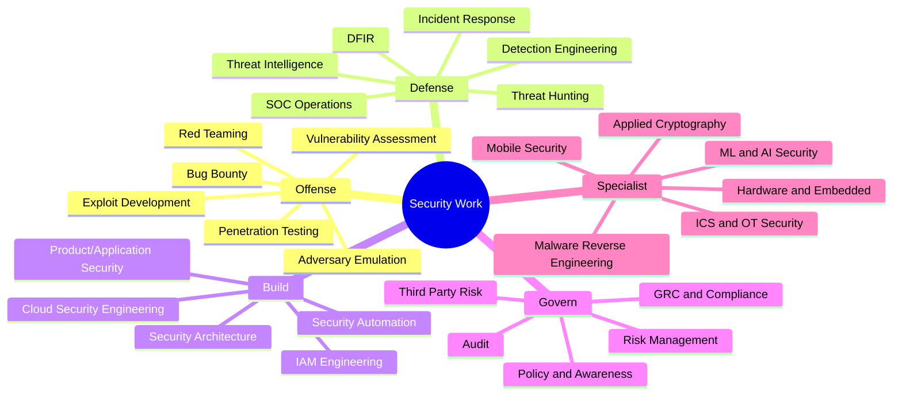
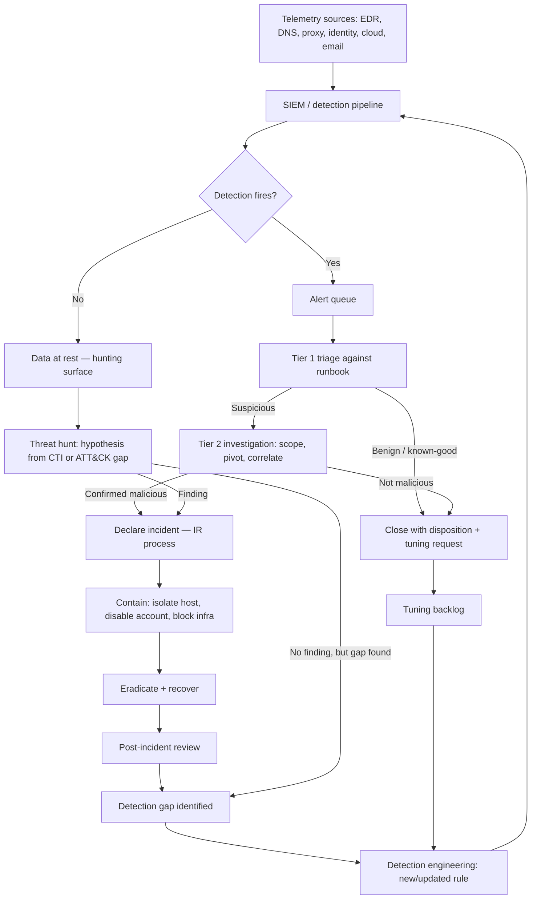
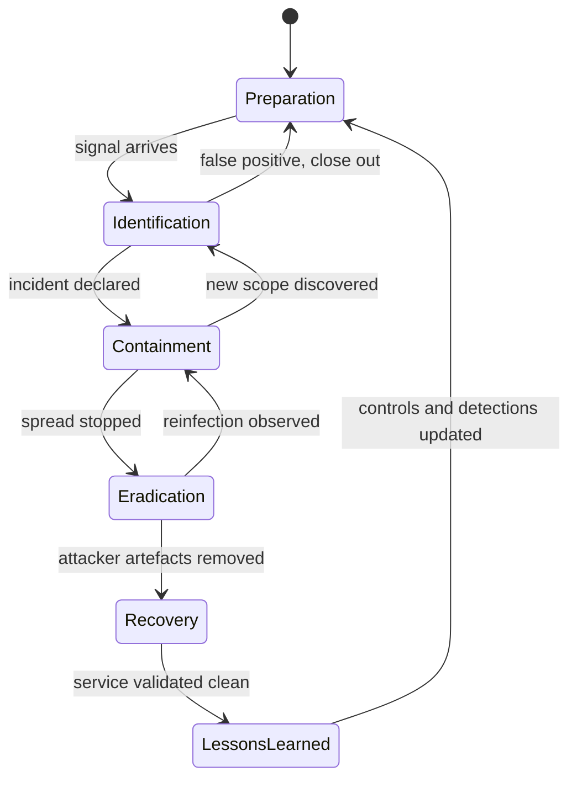
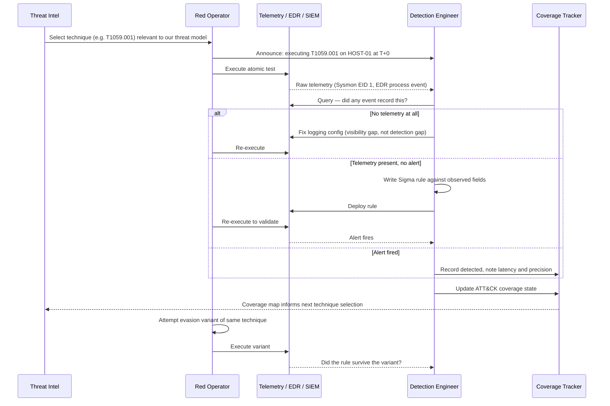
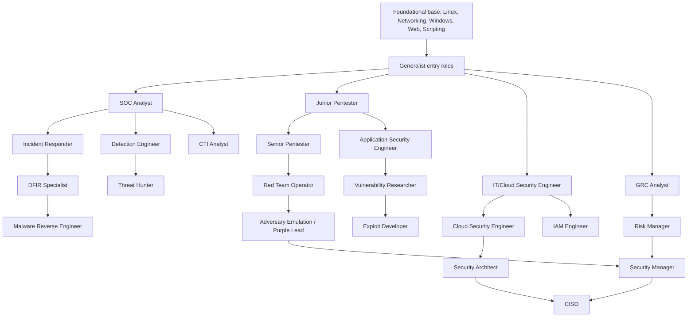
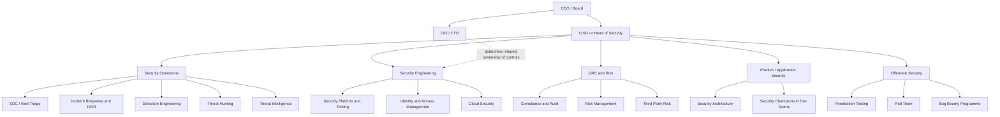

**Level:** Beginner · **Track:** Foundations · **Read time:** 185 min

This is Chapter 4 of the Security Foundations series — Notebook 8. Chapter 3 gave you the attacker's
model: the kill chain and the ATT&CK matrix that describe *what* adversaries do. This chapter answers
the question that immediately follows it — *who does something about that, and what is their actual
job?*

The security industry is not one profession. It is roughly thirty distinct professions that share a
threat model and almost nothing else. A detection engineer writing Sigma rules and a GRC analyst
mapping controls to ISO 27001 both say "I work in cyber," but their days share no tools, no rhythm,
and no success metric. Choosing between them blindly costs people years. This chapter exists so you
can choose deliberately: what each role does hour by hour, what skills it genuinely requires, how the
roles connect on a real org chart, which ones are growing, which are shrinking, and how to get from
where you are into the one you want.

It is also a working chapter, not a careers brochure. Part 11 is a full hands-on purple-team lab —
you will execute a real attacker technique, capture the telemetry it produces, write a detection for
it, validate that detection against the logs, and measure the coverage you gained. That exercise *is*
the job for several of the roles described here, and doing it once teaches more than reading ten
job descriptions.

## Part 1: The Shape of the Industry — Why Roles Exist at All

Security work splits along one primary axis and two secondary ones. Understanding the axes matters
more than memorising job titles, because titles are wildly inconsistent between companies and the
axes are not.

**The primary axis is offense versus defense** — more precisely, *finding weaknesses* versus
*preventing, detecting and responding to their exploitation*. This is the red/blue split, and it
exists because the two activities require opposite dispositions. Offense is depth-first and
adversarial: you need one path in, you can ignore ninety-nine dead ends, and you succeed by being
creative about a single specific thing. Defense is breadth-first and statistical: you must cover
every path, you cannot ignore anything, and you succeed by being systematic across thousands of
things. People who are excellent at one are frequently mediocre at the other, and that is normal.

**The first secondary axis is build versus operate.** Some security roles produce artefacts —
architecture designs, secure libraries, detection rules, hardened images, automation pipelines. Others
run a continuous process — monitoring a queue, triaging alerts, handling incidents, reviewing access
requests. Builders are measured in shipped work; operators are measured in throughput and latency. A
detection engineer is a builder inside a defensive function; a SOC analyst is an operator inside the
same function. If you are miserable in one, you may be excellent in the other with the same knowledge.

**The second secondary axis is technical versus governance.** Governance roles (GRC, risk, compliance,
policy, audit) work in the language of frameworks, evidence, controls and residual risk. Technical
roles work in the language of packets, processes, tokens and syscalls. The industry has an unhelpful
habit of treating governance as "less technical therefore less serious," which is wrong — a good risk
lead who can kill a bad architecture before it is built prevents more incidents than a great analyst
who detects it afterwards — but the two require genuinely different skill sets and it is worth being
honest about which one you want.



A useful mental check before reading on: for each branch above, ask yourself whether you would rather
spend a Tuesday afternoon (a) trying nineteen payload variants until one bypasses a filter, (b) tuning
a rule that is firing four hundred false positives a day, (c) writing a design document that stops a
team from putting an S3 bucket on the public internet, or (d) collecting evidence that thirty controls
are operating effectively. All four are real security jobs. Most people have a clear preference, and
that preference is more predictive of career satisfaction than any certification.

**A note on how titles lie.** "Security Engineer" at one company means writing Terraform modules for
guardrails; at another it means staffing a SIEM queue; at a third it means doing internal penetration
tests. "Security Analyst" ranges from tier-1 alert triage to strategic threat intelligence. Always
read the responsibilities section of a job posting and ignore the title. A quick heuristic: count the
verbs. "Monitor, triage, escalate, document" is an operator role. "Design, build, automate, integrate"
is a builder role. "Assess, test, exploit, report" is an offensive role. "Review, map, evidence,
report" is a governance role.

## Part 2: The Blue Team — Defensive Operations in Depth

Blue team is the largest employer in security by a wide margin, and the most common entry point. It
is also the most internally differentiated: "blue team" covers at least six distinct jobs that get
lumped together.

### 2.1 The Security Operations Centre and its tiers

A SOC is a function, not necessarily a room. Its job is to convert a firehose of telemetry into a
small number of confirmed incidents, quickly, without missing the ones that matter. Classic staffing
uses tiers, and while many modern SOCs have flattened them, the tier model is still the clearest way
to explain the work.

| Tier | Common titles | Core responsibility | Typical time per item | Success metric | Escalates to |
|------|---------------|---------------------|----------------------|----------------|--------------|
| Tier 1 | SOC Analyst, Alert Triage Analyst | Triage alert queue, apply runbooks, close benign, escalate suspicious | 5–20 min | Time-to-triage, queue depth, escalation accuracy | Tier 2 |
| Tier 2 | Incident Analyst, SOC Analyst II | Deeper investigation across data sources, scope the activity, contain | 1–8 hours | Time-to-contain, investigation quality, false-escalation rate | Tier 3 / IR |
| Tier 3 | Incident Responder, Senior Analyst | Full incident handling, forensics, eradication, lessons learned | 1–10 days | Time-to-eradicate, recurrence rate | CISO / legal |
| Hunt | Threat Hunter | Hypothesis-driven search for activity no alert fired on | 3 days–3 weeks | New detections created, dwell time reduction | Detection eng |
| Eng | Detection Engineer | Build, tune, test and version-control detections | Sprint-scoped | Coverage, precision, alert-to-incident ratio | — |
| CTI | Threat Intel Analyst | Produce intelligence on relevant adversaries; drive priorities | Days–weeks | Decisions influenced, priority accuracy | Leadership |

The critical thing to understand about tier 1 is that **the job is not "look at alerts." It is
"execute a documented decision procedure under time pressure, and correctly recognise when the
procedure does not apply."** Most alerts are benign. The skill being tested is disciplined
consistency plus the judgement to notice the one alert that is subtly wrong — a service account
authenticating from a normal IP but at 03:14 when it has never run outside business hours, or a
PowerShell command line that is legitimate in shape but has a base64 blob where a file path usually
sits.

Here is the escalation flow that virtually every SOC implements in some form:



Notice that the diagram is a **loop**, not a line. Every closed alert and every incident feeds the
detection engineering queue. A SOC that does not close this loop plateaus permanently: it gets faster
at triaging the same alerts and never gets better at catching new things. When you interview for a
blue-team role, asking "how does a tuning request or a post-incident finding actually become a rule
change?" is the single most informative question you can ask about the team's maturity. If the answer
is vague, the loop is broken.

**Red team relevance:** the same diagram is an operator's map of what they must avoid. Attackers
optimise against the *left* side of it — living off the land to avoid EDR detections, using
already-trusted identities to avoid identity alerts, and pacing activity to stay under volumetric
thresholds. Understanding blue-team workflow is what separates a red teamer from someone who just
runs exploits.

### 2.2 Incident response and DFIR

Incident response is a defined process, and the process is what makes the role. The two dominant
frameworks are **NIST SP 800-61** (Preparation → Detection & Analysis → Containment, Eradication &
Recovery → Post-Incident Activity) and **SANS PICERL** (Preparation, Identification, Containment,
Eradication, Recovery, Lessons Learned). They describe the same thing with different granularity.



The transitions *backwards* are the ones that define real incidents. Discovering new scope during
containment is normal, not a failure — it is why containment decisions are made under uncertainty and
why the containment strategy matters so much. The classic dilemma: isolating a host immediately stops
the damage but tips off the operator, who may burn their remaining access and pivot to persistence
you have not found yet. Watching quietly to map the full footprint preserves intelligence but risks
data leaving the building. Mature teams decide this consciously, per incident, against a documented
risk threshold — not by reflex.

**DFIR** (Digital Forensics and Incident Response) is the deep-technical end. A DFIR specialist works
with disk images, memory captures, and artefact timelines to reconstruct exactly what happened. Core
skills: filesystem forensics (MFT, USN journal, `$LogFile`, ext4 journals), memory analysis
(Volatility), Windows artefacts (Prefetch, Amcache, ShimCache, SRUM, registry hives, event logs),
log timeline correlation, and — increasingly — cloud forensics against CloudTrail, Azure Activity
logs and Kubernetes audit logs. This role has genuine forensic-soundness obligations: chain of
custody, write blockers, hashing evidence on acquisition, and defensible documentation, because the
output may end up in litigation or a regulator's hands.

**Career note:** DFIR is one of the few security roles with a real apprenticeship structure. Almost
nobody enters it directly; the standard path is SOC tier 2 → IR → DFIR, or sysadmin → IR. The reason
is that forensics is *differential* work — you cannot spot the abnormal artefact unless you have deep
intuition for the normal one, and that intuition comes from operating systems at scale.

### 2.3 Detection engineering

Detection engineering is the fastest-growing blue-team discipline and, for people with a software
background, usually the highest-leverage entry point. The job is to treat detections as **code**:
version-controlled, peer-reviewed, tested, deployed through CI, and measured.

A detection engineer's core artefact is a rule with a documented hypothesis. The industry's portable
format is **Sigma** — a YAML rule language that compiles to Splunk SPL, Elastic KQL/EQL, Microsoft
Sentinel KQL, QRadar AQL and about twenty other backends, so you write once and deploy anywhere.

Here is a real Sigma rule, of the kind you would write for the technique used in this chapter's lab:

```yaml
title: PowerShell Encoded Command Execution
id: 8f2b0d3c-9d2e-4c7a-9d1c-2f6a1b3e4c55
status: experimental
description: >
  Detects PowerShell invoked with an encoded command payload, a common
  living-off-the-land execution primitive used to obscure the actual
  command line from casual review and simple string-matching controls.
references:
  - https://attack.mitre.org/techniques/T1059/001/
author: Detection Engineering
logsource:
  category: process_creation
  product: windows
detection:
  selection_img:
    - Image|endswith:
        - '\powershell.exe'
        - '\pwsh.exe'
    - OriginalFileName:
        - 'PowerShell.EXE'
        - 'pwsh.dll'
  selection_cli:
    CommandLine|contains:
      - ' -enc '
      - ' -EncodedCommand '
      - ' -ec '
      - ' -e '
  filter_known_good:
    ParentImage|startswith:
      - 'C:\Program Files\SCCM\'
      - 'C:\Program Files\Monitoring\'
  condition: all of selection_* and not filter_known_good
falsepositives:
  - Legitimate management tooling that base64-encodes scripts for transport
  - Some software installers and MDM agents
level: high
tags:
  - attack.execution
  - attack.t1059.001
```

Every field there is doing work, and a detection engineer must be able to defend each one:

- `logsource` selects which telemetry the rule binds to. `process_creation` maps to Sysmon Event ID 1,
  Windows Security 4688 (if command-line auditing is enabled), or the EDR's process table.
- `selection_img` uses **both** `Image|endswith` and `OriginalFileName`. That is deliberate: renaming
  `powershell.exe` to `totally-not-powershell.exe` defeats an `Image`-only rule, but `OriginalFileName`
  comes from the PE version resource and survives renaming. This is a rename-evasion control, and its
  presence is a marker of a competent rule author.
- `selection_cli` enumerates the abbreviations because PowerShell accepts any unambiguous prefix of a
  parameter name — `-EncodedCommand`, `-Encoded`, `-Enc`, `-Ec`, `-E` all work. A rule matching only
  `-EncodedCommand` misses the overwhelming majority of real usage.
- `filter_known_good` is the tuning surface, and it is deliberately narrow (parent process path
  prefixes, not a bare process name) because broad filters are how detections silently die. Every
  filter is an attacker-usable blind spot: anything that can run as a child of that SCCM path is now
  invisible to this rule.
- `level` drives routing — whether this pages someone, opens a ticket, or just enriches a timeline.

**The precision problem is the whole job.** A rule that fires on every encoded command in an
enterprise with legacy management tooling generates hundreds of alerts a day and will be disabled
within a month. A rule tuned so tightly it never fires is worse — it creates the illusion of
coverage. Detection engineers therefore live by two numbers: **precision** (of the alerts this rule
raised, what fraction were true positives) and **coverage** (of the ways this technique can be
performed, what fraction does this rule see). You will compute both in the lab.

### 2.4 Threat hunting

Hunting starts where detection ends: it is the structured search for malicious activity that no alert
fired on. The defining feature is a **hypothesis**. "Let me look at the data and see what's weird" is
not hunting; it is browsing. A real hunt hypothesis is falsifiable and scoped:

> *"An adversary with an initial foothold on a developer workstation is using `rundll32.exe` to
> proxy-execute a payload from a non-standard path. If true, I will see `rundll32.exe` process
> creations whose command line references a DLL outside `C:\Windows\` and `C:\Program Files\`,
> with a parent process that is not `explorer.exe` or a known installer."*

That statement tells you the data source, the query, the expected shape of a positive, and — crucially
— what a negative result means. The three standard hypothesis sources are: **CTI-driven** (a report
says a group relevant to your sector uses technique X, do we see X?), **ATT&CK-gap-driven** (we have
no detection for T1218.011, so let us look manually), and **anomaly-driven** (statistical outliers:
rarest parent-child process pairs, first-seen binaries, lowest-frequency user agents).

**A hunt that finds nothing is still a success** if it produces either a new detection or a documented
"we now have visibility here." The output of hunting is not incidents; it is *detections and
visibility*. Teams that measure hunters on incidents found end up with hunters who inflate findings.

### 2.5 Cyber threat intelligence

CTI answers "who is likely to attack us, how, and what should we do differently because of it." The
discipline splits by consumer:

| Level | Consumer | Time horizon | Typical product | Example output |
|-------|----------|--------------|-----------------|----------------|
| Strategic | Board, CISO | Quarters–years | Written assessment, briefing | "Ransomware targeting our sector shifted to data-theft-only extortion; backup investment alone no longer caps our exposure." |
| Operational | IR leads, hunt team, detection eng | Weeks–months | Campaign report, TTP profile | "This group's initial access is consistently SEO-poisoned installers; prioritise detections on browser-child-process chains." |
| Tactical | SOC, detection engineering | Days–weeks | ATT&CK-mapped TTP list, Sigma/YARA | "Observed use of T1197 BITS jobs for persistence; here is the rule." |
| Technical | Automated controls | Hours–days | IOC feeds — hashes, IPs, domains | Blocklist entries, EDR indicator import |

The most common failure in CTI is confusing **information** with **intelligence**. A feed of ten
thousand IP addresses is information. Intelligence is that feed *filtered to your environment,
assessed for reliability, and turned into a decision*. The discipline borrows heavily from
traditional intelligence practice — source reliability grading (the Admiralty scale), analysis of
competing hypotheses, and confidence language with defined meanings ("likely" = roughly 55–80%, not a
vibe). Analytical rigour is what separates a CTI analyst from someone who reads security Twitter.

**Bug bounty relevance is indirect but real here:** disclosed reports on HackerOne and the write-ups
attached to CVEs are a genuine open-source intelligence stream. A CTI analyst tracking which
n-day vulnerabilities in your edge products have public, weaponised proof-of-concept code is doing
exactly the same reading a bounty hunter does, for the opposite purpose.

## Part 3: The Red Team — Offensive Security in Depth

"Red team" is used colloquially to mean all offensive security, which is unhelpful because the
offensive disciplines have genuinely different objectives, scopes, durations and deliverables.
Confusing them is the single most common mistake in offensive-security job hunting, and getting it
right in an interview immediately marks you as someone who has read past the marketing.

### 3.1 The five offensive disciplines, precisely distinguished

| Discipline | Question it answers | Scope | Duration | Stealth required | Primary deliverable | Success looks like |
|-----------|---------------------|-------|----------|------------------|--------------------|--------------------|
| Vulnerability Assessment | "What known weaknesses exist?" | Broad, often whole estate | Hours–days, often continuous | None | Prioritised vulnerability list | Complete, accurate, deduplicated inventory |
| Penetration Test | "Can these weaknesses be exploited, and how far?" | Defined target list | 1–3 weeks | Usually none | Findings report with proof and remediation | Maximum coverage of the scoped surface |
| Red Team Engagement | "Can a determined adversary achieve objective X without being stopped?" | Whole organisation, objective-based | 4–12 weeks | Yes, central | Attack narrative + detection timeline | Objective achieved *and* blue team learning captured |
| Adversary Emulation | "Would we detect *this specific group's* TTPs?" | TTP-driven, agreed in advance | 1–4 weeks | Varies by scenario | Per-technique detection scorecard | Honest per-technique pass/fail |
| Bug Bounty | "What can the internet find in our public surface?" | Public assets, continuous | Continuous | None | Individual vulnerability reports | Valid, novel, high-impact findings |

The distinctions that matter most in practice:

**Coverage versus objective.** A penetration test is *coverage-driven* — the client wants every issue
in the scoped surface found, so the tester runs loud, fast and thorough. A red team engagement is
*objective-driven* — the goal might be "obtain access to the payment approval system" and the tester
takes the single quietest viable path, deliberately leaving ninety percent of the estate untouched. A
red team report that says "we found 47 vulnerabilities" is a penetration test wearing a costume.

**Detection is the product of a red team engagement, not a side effect.** The deliverable includes a
timeline: at 09:14 we executed technique X on host Y; the EDR generated telemetry but no alert; at
11:40 we did Z and an alert fired but was closed as benign in 6 minutes. That timeline is worth more
to the client than the fact you got domain admin. If a "red team" vendor does not produce it, they
sold you a long pentest.

**Bug bounty is not a job for most people.** It is a legitimate skill-builder and a real income for a
small number of exceptional hunters, but the income distribution is brutally power-law. Treat it as
(a) the best available portfolio-builder for application-security roles, and (b) a way to learn on
real targets legally — which it genuinely is, better than any lab. Treat it as a primary income plan
only with clear eyes about the distribution.

### 3.2 What an offensive engagement actually looks like

```mermaid
flowchart LR
    A[Scoping and Rules of Engagement] --> B[Recon: passive OSINT, ASM]
    B --> C[Active enumeration]
    C --> D[Vulnerability identification]
    D --> E{Exploitable?}
    E -->|No| D
    E -->|Yes| F[Exploitation — foothold]
    F --> G[Post-exploitation: local enum, creds]
    G --> H[Privilege escalation]
    H --> I[Lateral movement]
    I --> J{Objective met?}
    J -->|No| G
    J -->|Yes| K[Evidence collection]
    K --> L[Cleanup and artefact removal]
    L --> M[Report and debrief]
    M --> N[Retest]
```



Two things surprise newcomers about this loop. First, **the exploitation box is the smallest part of
the job.** Recon, enumeration and reporting consume most of the calendar. A tester who is brilliant at
exploitation and poor at writing costs their firm money, because the report is the only thing the
client actually receives. Second, **the loop back from post-exploitation to privilege escalation runs
many times.** Real engagements are a long chain of small wins — a readable config file yields a
service account, which yields a share, which yields a backup, which yields a password hash.

**CTF and lab relevance:** the loop above is exactly the structure of a HackTheBox or TryHackMe box,
which is why those platforms train pentest skills so effectively. Where they diverge from real work
is scale (one host versus ten thousand), noise (labs have no legitimate traffic to hide in or sift
through), and consequence (you cannot break production in a lab). Chapter 6 of this notebook covers
building the lab environment where you practise this loop safely.

### 3.3 Rules of engagement, authorisation and the legal floor

Every offensive discipline shares one non-negotiable precondition: **written authorisation from
someone with the authority to grant it, covering the specific assets, the specific time window and
the specific techniques.** No exceptions, no verbal approvals, no "my manager said it was fine."
Testing without it is a criminal offence in most jurisdictions regardless of intent — the
Computer Fraud and Abuse Act in the US, the Computer Misuse Act in the UK, and equivalents almost
everywhere. Chapter 5 covers this in full; treat that chapter as mandatory before you point a single
tool at anything you do not own.

The practical artefact is a **Rules of Engagement** document, and a red teamer should be able to
recite its required contents from memory: in-scope targets by IP/domain/asset ID, explicit
out-of-scope carve-outs, permitted and forbidden techniques (is social engineering allowed? DoS?
physical entry? persistence?), the testing window, data-handling rules for anything sensitive
encountered, emergency stop conditions and contacts, the "get out of jail" letter for physical
engagements, and named points of contact on both sides who can be reached at 3 a.m.

### 3.4 The offensive skill stack

A working penetration tester needs, roughly in order of how often it is used:

1. **Enumeration discipline** — the single highest-value skill. Most failed tests are failed
   enumeration, not failed exploitation.
2. **Networking fluency** — everything covered in the Networking notebook: TCP behaviour, DNS,
   routing, NAT, TLS, proxies. You cannot pivot through a network you do not understand.
3. **Operating system internals** — Linux permissions/SUID/capabilities/systemd and Windows
   tokens/ACLs/services/Active Directory. Privilege escalation is applied OS internals.
4. **Web application security** — the largest single body of findings in most engagements.
5. **Active Directory** — the dominant lateral-movement surface in enterprises.
6. **Scripting** — Python, Bash and PowerShell, to automate what tooling does not cover.
7. **Writing** — reports, risk ratings, executive summaries. Genuinely a core technical skill.

Notice that six of those seven are covered by the earlier notebooks in this series, in that order.
That is not a coincidence — the curriculum is built as the dependency graph of this skill stack.

## Part 4: Purple Team — The Feedback Loop, Not the Job Title

Purple team is the most misunderstood term in the industry. It is **not** a third team sitting
between red and blue. In the original formulation it is a *function*: the deliberate, structured
collaboration that ensures offensive findings become defensive improvements. Some organisations
staff dedicated purple-team engineers; most implement it as a recurring exercise.

The distinction from a red team engagement is transparency and tempo:

| Aspect | Red team engagement | Purple team exercise |
|--------|--------------------|--------------------|
| Blue team awareness | Unaware (or only leadership aware) | Fully aware, in the room |
| Feedback timing | At the end, in the report | Immediately, per technique |
| Goal | Test the whole detection-and-response system realistically | Maximise detections built per hour |
| Failure handling | Attacker avoids the detection and continues | Both sides stop, fix the rule, re-run |
| Cadence | Once or twice a year | Monthly or per-sprint |
| Metric | Objectives achieved / detected | Techniques covered, detection precision |

Both are needed and they answer different questions. A red team engagement tells you whether your
*whole system* — people, process, tooling — works under realistic conditions. A purple exercise is a
far more efficient way to actually *build* coverage. Running only red teams gives you an annual
humiliation with no systematic improvement; running only purple gives you excellent per-technique
coverage and no idea whether your on-call process works at 2 a.m.

The purple loop, technique by technique:



The `alt` block encodes the single most important distinction in defensive work: **a visibility gap
is not a detection gap.** If the telemetry never existed, no rule could have caught it and no amount
of detection engineering will help until logging is fixed. Diagnosing which of the two you have, on
every single technique, is the core analytical skill of purple teaming. Teams that skip this step
write rules against fields their agents do not actually collect, and those rules pass code review and
never fire.

The final step — the evasion variant — is what separates a purple exercise from a checkbox. A rule
that catches the textbook version of a technique and dies to a single trivial mutation (uppercase,
a renamed binary, an alternate flag abbreviation) is worth very little. You will build and then
break exactly such a rule in the lab.

## Part 5: The Rest of the Colour Wheel — and an Honest Caveat

Beyond red, blue and purple, the industry has accumulated additional colours. They have some value as
shorthand and a lot of potential to become jargon. The commonly used set:

| Colour | Who | What they contribute |
|--------|-----|---------------------|
| Red | Offensive testers | Find and exploit weaknesses |
| Blue | Defenders | Prevent, detect, respond |
| Purple | Red + Blue together | Convert offensive findings into detections |
| Yellow | Builders — developers, architects, sysadmins | Create the systems being attacked and defended |
| Orange | Red + Yellow | Attacker knowledge taught to builders (secure coding training, threat modelling with dev teams) |
| Green | Blue + Yellow | Defensive requirements built into systems (logging by default, secure baselines, guardrails) |
| White | Governance, exercise control | Set rules, arbitrate exercises, manage risk and compliance |

**The caveat, stated plainly:** yellow, orange and green are useful teaching devices and mostly
useless job titles. No one advertises for an "orange team engineer." Where they do earn their keep is
in diagnosing an organisation's actual weakness. If your red team keeps finding the same class of
bug year after year, your problem is not red capability — it is a missing orange function, because
nothing is teaching builders why the bug keeps happening. If your SOC cannot investigate incidents in
a given system because it emits no useful logs, that is a green gap, and hiring another analyst will
not fix it. Used as a diagnostic vocabulary the wheel is genuinely helpful; used as an org chart it
is theatre.

## Part 6: The Roles With No Colour — Where Most Security Headcount Actually Sits

If you count headcount across the industry rather than conference talks, the majority of security
professionals are in roles the colour wheel barely describes. These are frequently better-paid, more
stable and easier to enter than red-team roles, and they are systematically under-marketed to
beginners.

### 6.1 GRC — Governance, Risk and Compliance

GRC ensures the organisation knows what it must do, does it, and can prove it. Sub-specialities:

- **Compliance analyst** — maps controls to a framework (ISO 27001, SOC 2, PCI DSS, HIPAA, NIST CSF,
  DORA, NIS2), collects evidence, manages audits. The daily reality is evidence collection: screenshots
  of MFA settings, exports of access reviews, tickets proving patches were applied within SLA.
- **Risk analyst** — maintains the risk register, runs assessments, quantifies exposure. The advanced
  end of this uses **FAIR** (Factor Analysis of Information Risk), which replaces "high/medium/low"
  with probability distributions of annualised loss. A risk analyst who can produce a defensible
  loss-exceedance curve is doing quantitative work that is genuinely hard.
- **Third-party / vendor risk** — assessing the security of suppliers. Vastly more important than its
  reputation: a large share of major breaches arrive through a supplier.
- **Policy and awareness** — writing the standards everyone must follow and running the training
  everyone tries to skip.

**Why technical people should not sneer at GRC:** compliance requirements are the mechanism by which
security budget exists in most organisations. The reason your company bought an EDR is very often that
an auditor's finding forced it. Also, GRC has the shortest on-ramp of any security field for career
changers from audit, law, project management or operations, and the ceiling is high — many CISOs come
from this side rather than from engineering.

**Where it goes wrong:** compliance is a floor, not a ceiling. An organisation can be fully PCI DSS
compliant and trivially breachable. The failure mode is *evidence theatre* — optimising for the
artefact an auditor accepts rather than the outcome the control was meant to produce. A good GRC
professional actively fights this; a bad one industrialises it.

### 6.2 Security architecture

Architects make design-time decisions that determine how much work everyone else has to do forever.
They produce reference architectures, evaluate proposed designs, define patterns (how services
authenticate to each other, how secrets are distributed, how network segmentation is expressed), and
say no to things. The leverage is enormous and the feedback loop is slow — you may not learn for two
years whether a decision was right.

Core competencies: threat modelling at system scale (Chapter 2 of this notebook), identity and trust
boundary design, cryptographic protocol selection (not implementation — see the Cryptography
notebook), network and cloud segmentation models, and the political skill to influence teams you do
not manage. Essentially nobody starts here; the usual entry is 5–10 years in engineering,
infrastructure or appsec.

### 6.3 Product and application security

AppSec sits with engineering and makes the software the company ships secure. The work:

- **Secure design review / threat modelling** at the start of a feature.
- **Code review** — manual review of security-sensitive code, plus running and tuning SAST.
- **Security tooling in CI** — SAST, DAST, SCA/dependency scanning, secret scanning, IaC scanning —
  and, critically, keeping their false-positive rates low enough that developers do not route around
  them.
- **Vulnerability management for the product** — triaging findings, tracking to remediation, running
  the bug bounty programme, handling coordinated disclosure and issuing CVEs.
- **Security champions programme** — embedding a trained engineer in each team, which scales the
  function far better than hiring.

**Bug bounty relevance is direct and strong:** running a bounty programme *is* an AppSec job, and
being a credible bounty hunter is the single most portable portfolio for getting one. A hunter who
can show ten valid reports with clear write-ups is a more compelling AppSec candidate than someone
with three certifications and no findings.

### 6.4 Cloud security

Cloud security is the highest-demand technical specialisation in the industry, and it is genuinely
different work from on-premise security because the primary attack surface moved from the network to
**identity and configuration**. The dominant risk is no longer an unpatched service reachable on a
port; it is an over-permissive IAM role, a public storage bucket, an exposed metadata service, or a
CI/CD pipeline with production credentials.

Core skills: deep IAM for at least one major provider (AWS IAM policy evaluation logic, Azure RBAC
and Entra ID, GCP IAM), infrastructure as code (Terraform), container and Kubernetes security (RBAC,
admission control, pod security, image supply chain), cloud logging (CloudTrail, Azure Activity,
GCP Audit Logs), and the CSPM/CNAPP tooling category. Attack paths to understand cold: SSRF into
IMDS for credential theft, IAM privilege escalation via `iam:PassRole` and policy-version
manipulation, cross-account role assumption chains, and CI/CD pipeline compromise via a poisoned
pull request.

### 6.5 Identity and access management

IAM engineering is unglamorous, enormous, and central to modern attacks. Since almost every serious
intrusion now involves credential or token abuse rather than memory-corruption exploitation, the
people who design authentication, single sign-on, MFA, conditional access, privileged access
management and joiner-mover-leaver processes are doing frontline security work. Skills: SAML, OIDC and
OAuth 2.0 flows in detail (including their abuse — token theft, consent phishing, device-code
phishing), directory services, session and token lifetime design, and lifecycle automation.

### 6.6 Security engineering and automation

The role that builds and runs the security tooling estate: SIEM pipelines, EDR deployment, SOAR
playbooks, log routing and normalisation, secrets management, and the general job of making security
capabilities exist at scale. This is a software and infrastructure engineering job with a security
domain. If you can write production code and manage infrastructure, this is often the fastest, best-paid
entry into security, and it is chronically undersupplied.

## Part 7: Specialist and Adjacent Fields

These are deep tracks. Most require a strong foundation first; several are effectively research
careers. They are listed with an honest note on prerequisites and demand.

**Malware reverse engineering.** Take a binary, determine what it does, extract indicators, write
detection signatures. Requires assembly (x86-64 at minimum, increasingly ARM64), operating system
internals, and patience. Tools: Ghidra (free, NSA-developed, the standard entry point), IDA Pro,
Binary Ninja, x64dbg, plus dynamic analysis in an isolated sandbox. Adjacent output: YARA rules,
which are to file content what Sigma is to log events. Demand is moderate and concentrated in vendors,
national CERTs and large financial institutions.

**Exploit development and vulnerability research.** Find unknown vulnerabilities in software and prove
exploitability. Requires C, assembly, memory-layout intuition (Chapter 5 of the Programming for
Security notebook is the prerequisite), and mastery of modern mitigations and their bypasses: ASLR,
DEP/NX, stack canaries, CFG/CET, PAC on ARM. Fuzzing (AFL++, libFuzzer, syzkaller) is the industrial
method. Employers: security vendors, browser and OS teams, defence contractors, a small number of
specialist boutiques. Long ramp, small market, very high ceiling.

**ICS/OT and critical infrastructure security.** Securing industrial control systems — power, water,
manufacturing, rail. The rules are inverted from IT: availability and safety dominate confidentiality,
patching windows may be annual, and systems run for thirty years. Requires learning protocols like
Modbus, DNP3, S7comm, and the Purdue model of network segmentation. Distinct ATT&CK matrix
(ATT&CK for ICS). Demand is strong and rising with regulation; the supply of people who understand
both worlds is tiny.

**Hardware and embedded security.** Firmware extraction and analysis, UART/JTAG/SWD debug interfaces,
SPI flash dumping, side-channel and fault-injection attacks, secure boot analysis. Requires
electronics comfort and physical tooling (logic analyser, bus pirate, ChipWhisperer). Overlaps heavily
with IoT and automotive security (CAN bus, UDS diagnostics, ISO 21434).

**Mobile security.** iOS and Android application and platform security: static analysis of APKs and
IPAs, runtime instrumentation with Frida and Objection, certificate pinning bypass, keychain/keystore
analysis, deep-link and IPC abuse. A strong bug-bounty surface with less competition than web.

**Applied cryptography.** Designing and reviewing protocols, implementing primitives correctly,
side-channel-resistant coding, and the transition to post-quantum algorithms. Small field, heavily
research-oriented. The Cryptography notebook in this series is the entry ramp; Chapter 7 there covers
the practical attack side that CTF crypto categories test.

**AI and machine learning security.** The newest track, and split in two. *Securing ML systems*:
prompt injection, training-data poisoning, model extraction, adversarial examples, and the security
of agentic systems with tool access. *Using ML for security*: anomaly detection, alert triage
prioritisation, malware classification. Demand is growing very fast, the body of established practice
is thin, and that combination makes it unusually accessible to people willing to do original work.



Two structural observations about that graph. First, **every path starts from the same foundational
base** — the four or five subjects covered in the earlier notebooks. There is no shortcut around it,
and attempts to skip it produce people who can run tools but cannot reason about results. Second,
**the graph has cross-links**: DFIR to malware RE, architecture to CISO, red team to management. Career
moves between branches are normal and usually happen at the senior level, where the underlying skill
(systems reasoning) transfers even though the tools do not.

## Part 8: How Security Sits Inside a Real Organisation

Knowing the org structure tells you what a role's day is actually like, because structure determines
who you argue with and what you are measured on.



**The reporting line matters enormously.** A CISO reporting to the CEO or board can escalate risk
decisions independently. A CISO reporting to the CIO is structurally conflicted, because the CIO is
usually measured on delivery speed and uptime — the very things security controls slow down. When
evaluating an employer, ask who the security lead reports to. It predicts how often you will be
overruled.

**Where you can be employed, and how it changes the work:**

| Employer type | What you do | Pace | Breadth | Best for |
|---------------|-------------|------|---------|----------|
| In-house enterprise security team | Defend one estate deeply, own outcomes long-term | Steady, incident spikes | Narrow but deep | Detection eng, IR, cloud, IAM, architecture |
| Consultancy / pentest firm | Many clients, short engagements, high variety | Fast, project-driven, billable-hours pressure | Very broad, less deep | Rapid early-career skill growth in offense |
| MSSP / MDR provider | Monitor many customers' environments at once | High volume | Broad, shallow per client | High-volume triage experience, fast tier-1 entry |
| Security product vendor | Build the tools others use; research | Product cycles | Deep in one problem | Research, detection content, malware RE, engineering |
| Government / defence / CERT | National-scale defence, intel, standards | Varies; process-heavy | Deep in specific mission | Clearance-track, ICS, high-end research |
| Startup (any sector) | Be the entire security function | Chaotic | Extremely broad | Fast learning, high autonomy, high risk |
| Freelance / bug bounty | Self-directed offensive work | Self-set | Self-selected | Proven specialists with a reputation |

A widely applicable early-career pattern: **consultancy first, in-house later.** Two or three years at
a decent consultancy exposes you to dozens of environments and forces you to write clearly, which
compresses learning enormously. Then move in-house for depth, ownership and sane hours. The reverse
order works too but tends to be slower.

## Part 9: The Skills Matrix — What Each Role Actually Requires

This is the table to be honest with yourself against. "Core" means you use it most weeks; "useful"
means it appears regularly; blank means it is not central.

| Skill | SOC Analyst | IR / DFIR | Detection Eng | Threat Hunter | Pentester | Red Team | AppSec | Cloud Sec | GRC |
|-------|:----------:|:---------:|:-------------:|:-------------:|:---------:|:--------:|:------:|:---------:|:---:|
| Networking fundamentals | Core | Core | Core | Core | Core | Core | Useful | Core | Useful |
| Linux administration | Core | Core | Core | Core | Core | Core | Useful | Core | |
| Windows / AD internals | Core | Core | Core | Core | Core | Core | | Useful | |
| Log analysis and query languages | Core | Core | Core | Core | | Useful | | Useful | |
| Scripting (Python/Bash/PowerShell) | Useful | Core | Core | Core | Core | Core | Core | Core | |
| Web application security | Useful | Useful | Useful | Useful | Core | Core | Core | Useful | |
| Cloud platforms and IAM | Useful | Core | Core | Core | Useful | Core | Useful | Core | Useful |
| Malware analysis basics | Useful | Core | Useful | Useful | | Useful | | | |
| Forensic artefacts | Useful | Core | Useful | Core | | | | Useful | |
| Exploitation and post-exploitation | | Useful | Useful | Useful | Core | Core | Useful | Useful | |
| Detection content (Sigma/YARA/KQL) | Useful | Useful | Core | Core | | Useful | | Useful | |
| Threat modelling | | | Useful | Useful | Useful | Useful | Core | Core | Useful |
| Secure coding / code review | | | Useful | | Useful | | Core | Useful | |
| Infrastructure as code | | | Useful | | | Useful | Useful | Core | |
| Frameworks (ISO/NIST/SOC 2/PCI) | Useful | Useful | | | Useful | | Useful | Useful | Core |
| Risk quantification | | | | | | | Useful | Useful | Core |
| Technical writing | Core | Core | Core | Core | Core | Core | Core | Core | Core |
| Stakeholder communication | Useful | Core | Useful | Useful | Core | Core | Core | Core | Core |

Two observations worth internalising. **Technical writing is "Core" in every single column.** It is
the only skill with that property. Every security role produces a written artefact that someone
non-technical must act on — a ticket, a report, a rule description, an assessment, an escalation. The
people who plateau in this industry are almost never blocked by technical ability; they are blocked by
an inability to make someone else act on what they found.

**Networking, Linux and scripting appear as Core in most columns.** That is why the foundational
notebooks come first and why time spent there compounds regardless of which branch you end up on.

## Part 10: Certifications, Degrees and What Actually Gets You Hired

An honest treatment, because this topic generates more wasted money than any other in the field.

**What certifications actually do:** they get a résumé past an automated filter or an HR screen, and
in some sectors (defence contracting under DoD 8570/8140, some regulated industries) they are a hard
requirement. They are a *signalling* mechanism. They are weak evidence of ability and strong evidence
of persistence. What gets you hired at a technically serious employer is demonstrated ability —
findings, write-ups, tooling you built, rules you wrote, boxes you rooted, questions you answer well
in an interview.

| Certification | Domain | Type | Realistic value | Notes |
|---------------|--------|------|-----------------|-------|
| CompTIA Security+ | Foundations | Multiple choice | HR filter, DoD 8140 baseline | Broad and shallow; fine as a first cert, not a differentiator |
| CompTIA Network+ | Networking | Multiple choice | Foundation | Skippable if you genuinely know networking |
| CompTIA CySA+ | Blue ops | Multiple choice | Moderate for SOC entry | Reasonable coverage of analyst workflow |
| Blue Team Level 1 (BTL1) | Blue ops | Hands-on | Good for SOC entry | Practical, affordable, well-regarded for juniors |
| GIAC GCIH / GCIA / GCFA | IR, detection, forensics | Exam (SANS course) | High respect, very high cost | Best-in-class training; usually employer-funded |
| eJPT | Pentest entry | Hands-on | Good entry signal | Cheap, practical, a sensible pre-OSCP step |
| OSCP | Pentest | 24h hands-on exam | The de-facto pentest baseline | Tests methodology and endurance; still widely gate-kept on |
| OSEP / OSED / OSEE | Advanced offense | Hands-on | High, niche | Evasion, exploit dev, expert-level |
| PNPT | Pentest incl. AD + report | Hands-on + report | Growing respect | The report requirement is realistic and valuable |
| CRTO / CRTP | Red team, AD | Hands-on | Strong for AD-heavy roles | CRTP is excellent value for AD fundamentals |
| Burp Suite Certified Practitioner | Web appsec | Hands-on | Strong for AppSec | Directly tests PortSwigger Academy material |
| CISSP | Management breadth | Multiple choice + endorsement | High for management roles | Requires 5 years' experience; a management signal, not technical |
| CISM / CRISC | Management, risk | Multiple choice | High in GRC/leadership | Governance track |
| ISO 27001 Lead Implementer/Auditor | Compliance | Exam | Core for GRC | Directly job-relevant in that track |
| AWS/Azure/GCP security specialties | Cloud | Multiple choice | Good, in demand | Pair with real IaC and IAM work |
| CCSP | Cloud governance | Multiple choice | Moderate | Broader and more governance-flavoured than vendor certs |

**A defensible sequencing heuristic.** Pick your branch first, then take *one* cheap credential to
clear filters, then invest the remaining money and time in demonstrable work. For offense:
eJPT → OSCP, with continuous HackTheBox/PortSwigger practice in between. For blue: Security+ or
BTL1 → build a home lab with Sysmon and a SIEM → write and publish detections. For cloud: one
provider's security specialty plus a public Terraform repo of guardrails you actually wrote. For GRC:
ISO 27001 Lead Implementer plus a mapped control matrix for a real (or realistic) system.

**On degrees:** a computer science degree is genuinely useful — not for its security content, which is
usually thin and dated, but for the systems, networks, operating systems, algorithms and mathematics
foundation that makes everything else easier. A dedicated cybersecurity degree is more variable in
quality; evaluate it by how much systems programming and networking it contains, not by how many
security-branded modules it lists. Neither is required. The industry's hiring is unusually
credential-agnostic at the technical end, and unusually credential-driven in government and finance.

**What a portfolio should contain,** in rough order of hiring impact:

1. **Public write-ups** of things you did — an analysis, a lab you built, a CTF box you solved with
   the reasoning shown, a detection you wrote and validated.
2. **Working tooling** on a public repository, with a README explaining the problem it solves.
3. **Valid bug bounty reports or CVEs** (offense/appsec).
4. **Published detection content** — Sigma rules contributed to the public SigmaHQ repository, YARA
   rules, a Splunk/Elastic dashboard (defense).
5. **A home lab documented end to end** — build, configuration, what you attacked, what you saw.
6. **CTF results** with write-ups. The write-ups matter more than the placement.

The common factor: all six are *artefacts an interviewer can read*. A claim on a résumé is not an
artefact.

## Part 11: Hands-On Lab — Run a Complete Purple-Team Cycle

This lab is the chapter's centrepiece. You will play both sides of the purple loop from Part 4:
execute a real attacker technique, confirm whether telemetry captured it, write a detection, validate
it against the actual logs, then break your own rule with an evasion variant and fix it. Doing this
once teaches you what four job descriptions mean.

**Lab requirements.** A Windows 10/11 virtual machine (the "victim"), snapshotted before you start,
with no connection to any network you do not own. A Linux VM or WSL instance for the analysis tooling.
Nothing here touches a system you do not control. If you have not built a lab yet, Chapter 6 of this
notebook walks through it; the short version is VirtualBox or VMware with a host-only network.

### Step 1 — Install the telemetry: Sysmon from scratch

**What Sysmon is.** System Monitor is a free Microsoft Sysinternals tool that installs a Windows
driver and service to log far richer events than Windows does natively — process creation with full
command line, parent process and hashes; network connections with the owning process; file creation;
registry modification; image (DLL) loads; process access (a key credential-theft signal); DNS queries;
and WMI events. Windows' built-in Security log event 4688 gives you process creation but not parent
image path, not hashes, and not command line unless you explicitly enable it. Sysmon is the single
highest-value free thing you can add to a Windows endpoint's visibility, and essentially every blue
team lab starts here.

Download Sysmon from the official Sysinternals site, and pair it with a curated configuration —
running Sysmon with no config logs almost nothing useful and running it with everything on floods the
log. The community standard baseline is the SwiftOnSecurity configuration or the Olaf Hartong
`sysmon-modular` set.

```powershell
# Run in an ELEVATED PowerShell prompt on the Windows VM.
# -Uri     : source URL
# -OutFile : where to write the download
Invoke-WebRequest -Uri "https://download.sysinternals.com/files/Sysmon.zip" -OutFile "$env:TEMP\Sysmon.zip"
Expand-Archive -Path "$env:TEMP\Sysmon.zip" -DestinationPath "C:\Tools\Sysmon" -Force

# Fetch a sane baseline configuration
Invoke-WebRequest -Uri "https://raw.githubusercontent.com/SwiftOnSecurity/sysmon-config/master/sysmonconfig-export.xml" `
                  -OutFile "C:\Tools\Sysmon\sysmonconfig.xml"

# Install the driver and service.
#  -accepteula : suppress the interactive EULA dialog (required for unattended install)
#  -i          : install, optionally taking a config file path as its argument
C:\Tools\Sysmon\Sysmon64.exe -accepteula -i C:\Tools\Sysmon\sysmonconfig.xml
```

Expected output:

```
System Monitor v15.15 - System activity monitor
Copyright (C) 2014-2024 Mark Russinovich and Thomas Garnier
Sysinternals - www.sysinternals.com

Loading configuration file with schema version 4.90
Sysmon schema version: 4.90
Configuration file validated.
Sysmon64 installed.
SysmonDrv installed.
Starting SysmonDrv.
SysmonDrv started.
Starting Sysmon64..
Sysmon64 started.
```

Confirm it is collecting. The log lives at `Microsoft-Windows-Sysmon/Operational`:

```powershell
# -LogName    : the exact channel name
# -MaxEvents  : cap results so you do not dump the whole log
Get-WinEvent -LogName "Microsoft-Windows-Sysmon/Operational" -MaxEvents 3 |
    Format-List TimeCreated, Id, Message
```

If that returns events, you have visibility. If it errors with "No events were found", the service is
not running — check with `Get-Service Sysmon64`.

**Why a purple exercise always starts here:** recall the `alt` branch in the Part 4 diagram. Before
you can say "we did not detect that," you must be able to say whether you could have. Establishing
the telemetry baseline first is what makes the rest of the exercise diagnostic rather than
guesswork.

### Step 2 — Install the red side: Atomic Red Team from scratch

**What Atomic Red Team is.** An open-source library, maintained by Red Canary, of small, single-purpose
tests — "atomics" — each mapped to a MITRE ATT&CK technique. Each atomic executes one narrowly scoped
behaviour (make an encoded PowerShell call; create a scheduled task; dump a registry hive) and ships
with a documented cleanup command. It is the standard tool for adversary emulation at the technique
level precisely because the tests are small enough to reason about: when an alert fires, you know
exactly which behaviour caused it. It is not a C2 framework and it does not chain techniques — that is
a deliberate design decision that makes it safe for purple exercises.

`Invoke-AtomicRedTeam` is the PowerShell execution framework for that library.

```powershell
# Install the execution framework and the atomics library.
# -Scope CurrentUser : no admin needed for the module itself
# -Force             : overwrite an existing copy
# -getAtomics        : also download the atomics YAML/markdown library
Install-Module -Name invoke-atomicredteam -Scope CurrentUser -Force
IEX (IWR 'https://raw.githubusercontent.com/redcanaryco/invoke-atomicredteam/master/install-atomicredteam.ps1' -UseBasicParsing)
Install-AtomicRedTeam -getAtomics -Force

Import-Module invoke-atomicredteam -Force
```

Inspect the technique before running anything. **Never execute an atomic you have not read.**

```powershell
# -AtomicTechnique : the ATT&CK technique ID
# -ShowDetails     : print the test description, inputs and commands WITHOUT executing
Invoke-AtomicTest T1059.001 -ShowDetails
```

Abridged output:

```
PathToAtomicsFolder = C:\AtomicRedTeam\atomics

[********BEGIN TEST*

## Part 11: Hands-On Lab — Run a Full Purple-Team Loop

This lab makes the abstractions above concrete. You will play *both* roles: as red, you execute a real
attacker technique; as blue, you find the telemetry it produces, write a detection, deploy it, and
validate it survives an evasion variant. Doing this once teaches the daily reality of a detection
engineer, a threat hunter and a red operator simultaneously — and it is the exact loop from Part 4.

**Ethics and scope.** Everything here runs on a Windows virtual machine *you own*, isolated from any
production network, on a host-only or NAT network. Nothing here touches a system you are not authorised
to test. This is lab-scoped by construction. Chapter 6 of this notebook walks through building this
environment from scratch; this lab assumes a Windows 10/11 VM with local admin.

### 11.0 The three tools, taught from scratch

We use three tools you may not have met. Each is introduced from zero before use.

**Sysmon (System Monitor).** Sysmon is a free Microsoft Sysinternals driver-plus-service that adds
rich, high-fidelity security telemetry to Windows far beyond the default event logs. Where default
Windows logging might record "a process started" weakly, Sysmon Event ID 1 records the full command
line, the parent process, the process and parent hashes, the user, the integrity level, and a unique
process GUID that lets you correlate everything a process later does. It is the single most valuable
free telemetry source for endpoint detection, which is why so many detection rules — including the
Sigma rule in Part 2 — target it. Install it with a good community configuration:

```powershell
# Download Sysmon from the official Sysinternals location and a well-known config
# (SwiftOnSecurity's config is the standard teaching baseline).
# Run this PowerShell session As Administrator.
Invoke-WebRequest -Uri "https://download.sysinternals.com/files/Sysmon.zip" -OutFile "$env:TEMP\Sysmon.zip"
Expand-Archive "$env:TEMP\Sysmon.zip" -DestinationPath "$env:TEMP\Sysmon" -Force
Invoke-WebRequest -Uri "https://raw.githubusercontent.com/SwiftOnSecurity/sysmon-config/master/sysmonconfig-export.xml" -OutFile "$env:TEMP\sysmonconfig.xml"

# -accepteula   auto-accepts the licence so the install is non-interactive
# -i            install the driver and service
# -c            apply the given configuration file
& "$env:TEMP\Sysmon\Sysmon64.exe" -accepteula -i "$env:TEMP\sysmonconfig.xml"
```

Expected output:

```
System Monitor v15.15 - System activity monitor
Copyright (C) 2014-2024 Mark Russinovich and Thomas Garnier
Sysinternals - www.sysinternals.com

Loading configuration file with schema version 4.90
Configuration file validated.
Sysmon64 installed.
SysmonDrv installed.
Starting SysmonDrv.
SysmonDrv started.
Starting Sysmon64..
Sysmon64 started.
```

Sysmon now writes to the event log channel
`Microsoft-Windows-Sysmon/Operational`. Confirm it is alive:

```powershell
# Get-WinEvent reads event log channels. -MaxEvents 1 grabs just the newest event
# to prove the channel exists and is being written.
Get-WinEvent -LogName "Microsoft-Windows-Sysmon/Operational" -MaxEvents 1 |
    Format-List TimeCreated, Id, Message
```

**Atomic Red Team.** Atomic Red Team is a free, open-source library of small, precise tests — "atomics"
— each of which executes a single ATT&CK technique in the simplest reproducible way. It is the standard
tool for exactly the purple-team loop we are running: it lets red safely fire one known technique so
blue can check whether they see it. It is driven from a PowerShell module called `Invoke-Atomic`.

```powershell
# Install the execution framework and the atomics library.
# -Scope CurrentUser avoids needing to touch machine-wide module paths.
Install-Module -Name invoke-atomicredteam -Scope CurrentUser -Force
Import-Module invoke-atomicredteam

# Download the atomics test definitions (the YAML library of techniques).
Install-AtomicRedTeam -getAtomics -Force
```

**Sigma + sigma-cli.** Sigma is the vendor-neutral detection rule format introduced in Part 2.
`sigma-cli` is its converter: it compiles a Sigma YAML rule into the query language of your target
backend. We will convert to PowerShell/`Get-WinEvent` filtering conceptually and validate by hand, so
you see the mechanics without needing a full SIEM stood up.

```bash
# sigma-cli is a Python package. Install it with the plugin for your target backend.
pip install --break-system-packages sigma-cli
sigma plugin install splunk    # example backend; many others exist
```

### 11.1 Red step — execute the technique

We will emulate **T1059.001 — Command and Scripting Interpreter: PowerShell**, specifically the
encoded-command variant, which is what the Part 2 Sigma rule targets. Atomic Red Team test #1 for this
technique runs an encoded command.

First, inspect the atomic before running it — never fire a test you have not read:

```powershell
# Show the test definition(s) for the technique without executing them.
Invoke-AtomicTest T1059.001 -ShowDetailsBrief
```

Expected output:

```
PathToAtomicsFolder = C:\AtomicRedTeam\atomics

T1059.001-1 Mshta executes JavaScript ...
T1059.001-2 Encoded powershell command execution
T1059.001-4 Obfuscation Tests
...
```

Now build the analogue by hand so you understand exactly what the atomic does. An encoded command is
just base64 of a UTF-16LE PowerShell string:

```powershell
# Craft a benign payload: write a marker so we can prove execution occurred.
$payload = 'Write-Output "purple-lab-marker: T1059.001 executed"'

# PowerShell -EncodedCommand expects base64 of the UTF-16LE bytes of the script.
$bytes   = [System.Text.Encoding]::Unicode.GetBytes($payload)
$encoded = [Convert]::ToBase64String($bytes)
$encoded
```

Expected output (yours will match this exactly for this payload):

```
VwByAGkAdABlAC0ATwB1AHQAcAB1AHQAIAAiAHAAdQByAHAAbABlAC0AbABhAGIALQBtAGEAcgBrAGUAcgA6ACAAVAAxADAANQA5AC4AMAAwADEAIABlAHgAZQBjAHUAdABlAGQAIgA=
```

Fire it, exactly as an attacker's loader would — a fresh `powershell.exe` with `-enc`:

```powershell
# Run in a NEW child powershell so Sysmon records a clean process-creation event.
powershell.exe -NoProfile -EncodedCommand $encoded
```

Expected output:

```
purple-lab-marker: T1059.001 executed
```

You (as red) have now performed the technique. **As blue, you were told nothing about the payload —
only that T1059.001 fired at this time.** Move to the blue seat.

### 11.2 Blue step — find the telemetry (visibility check first)

Before writing any detection, confirm the telemetry even exists. This is the visibility-versus-detection
distinction from Part 4, and skipping it is the most common junior mistake.

```powershell
# Pull the last few Sysmon process-creation events (Event ID 1) and look for our encoded run.
# -FilterHashtable is far faster than piping to Where-Object because it filters at the
# event-log layer, not after loading every event into memory.
Get-WinEvent -FilterHashtable @{
    LogName = 'Microsoft-Windows-Sysmon/Operational'
    Id      = 1
} -MaxEvents 50 |
    Where-Object { $_.Message -match 'EncodedCommand|-enc' } |
    ForEach-Object {
        $_.Message -split "`n" |
            Select-String 'Image:|CommandLine:|ParentImage:|OriginalFileName:|User:'
    }
```

Expected output (abridged):

```
Image: C:\Windows\System32\WindowsPowerShell\v1.0\powershell.exe
OriginalFileName: PowerShell.EXE
CommandLine: powershell.exe -NoProfile -EncodedCommand VwByAGkAdABlAC0ATwB1AHQAcAB1AHQAIAAiAHAAdQByAHAAbABlAC0AbABhAGIALQBtAGEAcgBrAGUAcgA6ACAAVAAxADAANQA5AC4AMAAwADEAIABlAHgAZQBjAHUAdABlAGQAIgA=
ParentImage: C:\Windows\System32\WindowsPowerShell\v1.0\powershell.exe
User: LAB\analyst
```

**Diagnosis: telemetry is present.** Sysmon EID 1 captured the full command line, including the
encoded blob, plus `OriginalFileName` (which we will use for rename resistance) and the parent process.
This is a *detection* problem, not a *visibility* problem — the data exists, nothing alerted on it. If
this query had returned nothing, the correct fix would be Sysmon configuration, not a detection rule.

### 11.3 Blue step — write and validate the detection

The Sigma rule from Part 2 is exactly the detection this observation calls for. Save it and convert it:

```bash
# Save the Part 2 rule as encoded_powershell.yml, then compile it to a backend query.
sigma convert -t splunk -p sysmon encoded_powershell.yml
```

Expected output (the compiled Splunk query — note how the abstract rule became concrete fields):

```
(Image="*\\powershell.exe" OR Image="*\\pwsh.exe" OR OriginalFileName IN ("PowerShell.EXE","pwsh.dll"))
(CommandLine="* -enc *" OR CommandLine="* -EncodedCommand *" OR CommandLine="* -ec *" OR CommandLine="* -e *")
NOT (ParentImage="C:\\Program Files\\SCCM\\*" OR ParentImage="C:\\Program Files\\Monitoring\\*")
```

Since we are validating without a full SIEM, emulate the same logic against the live event log to prove
the rule would fire on our red action:

```powershell
# Emulate the Sigma detection logic in PowerShell against real Sysmon events.
$events = Get-WinEvent -FilterHashtable @{
    LogName = 'Microsoft-Windows-Sysmon/Operational'; Id = 1
} -MaxEvents 200

$hits = $events | Where-Object {
    $m = $_.Message
    ($m -match 'Image:.*\\(powershell|pwsh)\.exe' -or $m -match 'OriginalFileName:\s*(PowerShell\.EXE|pwsh\.dll)') -and
    ($m -match 'CommandLine:.*\s-(enc|EncodedCommand|ec|e)\s') -and
    ($m -notmatch 'ParentImage:\s*C:\\Program Files\\(SCCM|Monitoring)\\')
}
"Detection hits: $($hits.Count)"
```

Expected output:

```
Detection hits: 1
```

The rule fires on the red action. **You have closed one loop of Part 4's diagram: technique executed →
telemetry confirmed → detection written → detection validated.**

### 11.4 Red step — the evasion variant (why coverage ≠ one rule)

Now play red again and attempt the trivial evasion that separates a real detection from a checkbox.
The rule keys on the `-enc`/`-EncodedCommand` flag family. But an attacker does not need `-EncodedCommand`
at all — they can pass the decoded script inline, or pipe it, defeating a flag-based rule entirely:

```powershell
# Evasion variant: same behaviour, no -enc flag. Decode and run via -Command instead.
$decoded = [System.Text.Encoding]::Unicode.GetString([Convert]::FromBase64String($encoded))
powershell.exe -NoProfile -Command $decoded
```

Re-run the detection query from 11.3. Expected output:

```
Detection hits: 1
```

Still `1`, not `2` — **the variant evaded the rule.** The second execution achieved identical impact but
produced no detection hit, because it carried no encoded-command flag. This is the coverage lesson made
physical: a rule that catches the textbook technique and misses a one-line mutation provides a *false
sense* of coverage. In a real purple exercise this is the moment blue writes a *second*, behaviour-based
detection (e.g. on suspicious parent-child chains or on PowerShell Script Block Logging Event ID 4104,
which records the decoded script regardless of how it was passed), and red keeps mutating until the
detections hold.

### 11.5 Score the exercise

Record the outcome the way a real purple team does — per technique, per variant:

| Technique | Variant | Telemetry present | Detection fired | Latency | Disposition |
|-----------|---------|:-----------------:|:---------------:|---------|-------------|
| T1059.001 | `-EncodedCommand` | Yes (Sysmon EID 1) | Yes | Immediate | Covered |
| T1059.001 | `-Command` inline | Yes (EID 1 + 4104) | No | — | **Gap — needs 4104 rule** |

That single-row-of-red gap is the entire point. You now have a concrete, evidenced backlog item —
"add Script Block Logging (4104) detection for decoded PowerShell" — which is exactly the kind of
artefact a detection engineer produces, a threat hunter validates, and a red operator re-tests. You
have just done, in miniature, the daily work of three of the roles this chapter describes.

Clean up the lab when finished:

```powershell
# Remove Sysmon if this was a throwaway VM. -u uninstalls the driver and service.
& "$env:TEMP\Sysmon\Sysmon64.exe" -u
```

## Part 12: Choosing a Path — A Scripted Self-Audit

Advice is cheap; a decision procedure is useful. Run the following honestly. It is not a personality
quiz — it maps *observed preferences* to role families, because what you actually enjoy doing on a
Tuesday predicts career satisfaction better than what sounds impressive.

Here is a small self-audit you can literally run and keep:

```python
#!/usr/bin/env python3
"""Security career self-audit. Answer 1-5 (1 = strongly dislike, 5 = love it).
Rate what you ENJOY, not what you think you 'should' pick."""

questions = {
    "break":   "Trying many variations until one bypasses a control",
    "hunt":    "Sifting large volumes of data for a subtle anomaly",
    "build":   "Designing a system so a whole class of bug can't happen",
    "respond": "Working a live, high-pressure incident to closure",
    "rules":   "Turning messy reality into evidence, controls and frameworks",
    "code":    "Writing and maintaining production-quality code/automation",
    "write":   "Explaining a complex finding so a non-expert acts on it",
    "deep":    "Going extremely deep on one narrow technical thing",
}

# Map each answer to the role families it points toward.
mapping = {
    "break":   ["Pentest", "Red Team", "AppSec", "Bug Bounty"],
    "hunt":    ["Threat Hunting", "Detection Eng", "CTI", "DFIR"],
    "build":   ["Architecture", "Cloud Security", "AppSec", "IAM"],
    "respond": ["Incident Response", "DFIR", "SOC"],
    "rules":   ["GRC", "Risk", "Compliance", "Audit"],
    "code":    ["Detection Eng", "Security Automation", "Cloud Security"],
    "write":   ["CTI", "GRC", "Consulting", "Architecture"],
    "deep":    ["Malware RE", "Exploit Dev", "Cryptography", "ICS/OT"],
}

scores = {}
for key, prompt in questions.items():
    val = int(input(f"[{key}] {prompt}: "))
    for role in mapping[key]:
        scores[role] = scores.get(role, 0) + val

print("\nYour role affinity ranking:")
for role, score in sorted(scores.items(), key=lambda kv: kv[1], reverse=True):
    print(f"  {score:>3}  {role}")
```

Run it, then sanity-check the top result against Part 9's skills matrix: does the day-to-day and the
required skill stack of your top role actually appeal to you? The tool points; you decide. The most
common useful surprise is people who assumed they wanted red team scoring highest on *build* or
*hunt* — which is worth knowing before spending two years chasing OSCP for a job you would not enjoy.

## Part 13: The First Ninety Days — What Each Role Really Feels Like

A grounded picture of the early experience in the most common entry roles, so expectations match
reality.

**SOC analyst.** Weeks 1–2 are shadowing and learning the environment's "normal" — which alerts fire
constantly and benignly, where the runbooks live, how to disposition. Weeks 3–8 you take the queue with
supervision; the skill you are building is pattern recognition for normal-versus-abnormal, and it only
comes from volume. Around week 8–12 you start noticing things the runbook does not cover, which is the
signal you are ready to grow. The hardest part is genuinely the shift work and alert fatigue; the best
part is that you see more real-world attacker behaviour, faster, than in almost any other entry role.

**Junior pentester (consultancy).** You shadow senior testers on one or two engagements, then get given
the "easy" scope on a real one. The shock is how much is enumeration and note-taking versus exploitation,
and how much of the deliverable is *writing*. Your first report will come back covered in red ink — that
is normal and is where the real learning is. By day 90 you can run a standard external or web engagement
end to end with light review.

**Detection engineer.** You inherit a backlog of noisy rules and a tuning queue. Early wins are killing
false positives (immediately loved by the SOC) and writing your first few well-scoped detections. The
mental shift is treating detections as tested, versioned software rather than one-off SIEM searches. By
day 90 you have merged rules through the team's review process and watched at least one of yours catch
something real.

**GRC analyst.** You learn a framework and the evidence-collection cadence, then own a control domain.
The early challenge is political, not technical — getting busy engineering teams to hand over evidence
on time. By day 90 you have run at least one control review cycle and can explain, to an auditor, why a
given control is operating effectively. The skill that compounds fastest is translating between the
auditor's language and the engineer's.

**Cloud security engineer.** You map the existing cloud estate, learn where the sharp edges are
(public buckets, over-broad roles, unencrypted stores), and ship your first guardrails as code. By day
90 you have prevented at least one bad configuration from reaching production and can read an IAM policy
and immediately see the escalation path. The steep part is the sheer breadth of provider services.

## Part 14: Common Misconceptions — Corrected

**"Red team is the top of the ladder; blue team is where you start until you're good enough for red."**
False, and a genuinely harmful belief. They are parallel tracks requiring different aptitudes, not
rungs. Senior detection engineers, DFIR leads and security architects are as deep, as respected and
frequently as well-paid as senior red teamers. Many excellent defenders would make mediocre attackers
and vice versa.

**"You need to be a great programmer to work in security."** Depends entirely on the role. Exploit
development and detection engineering: yes. SOC analysis and GRC: not at entry, though scripting helps
everywhere. Do not let "I can't code well yet" keep you out of a field with many roles where it is not
the bottleneck.

**"Certifications get you the job."** They get you *past a filter*. Demonstrated ability gets you the
job. Optimise for artefacts, not alphabet soup.

**"Bug bounty is a realistic career plan."** For a small number of exceptional people, yes. For most,
it is the best available *portfolio-builder and legal practice ground*. Both framings are true; only
one is a reliable income.

**"Offensive security is more technical than defensive."** A myth that survives on glamour. A senior
detection engineer reasoning about telemetry gaps across a global estate, or a DFIR analyst
reconstructing an intrusion from disk and memory artefacts, is doing work at least as technically deep
as exploitation. Defense is harder in one specific sense: the attacker must find one path; the
defender must reason about all of them.

**"AI is going to eliminate these jobs."** AI is changing the *tasks* — triage assistance, code
review augmentation, faster log summarisation — far faster than it is changing the *roles*. The
judgement calls (is this a real incident? is this risk acceptable? is this design sound?) remain human,
and the attack surface AI *itself* introduces is creating new roles faster than it retires old ones.

## Part 15: Final Revision / Summary

- Security is not one profession but roughly thirty, splitting along three axes: **offense vs defense**,
  **build vs operate**, and **technical vs governance**. Your preference on those axes predicts
  satisfaction better than any certification.
- **Blue team** is the largest employer and most common entry: SOC tiers (triage → investigation →
  IR), plus the specialist functions of **DFIR**, **detection engineering**, **threat hunting** and
  **CTI**. The defining insight is the *loop* — every closed alert and incident must feed detection
  improvement, or the team plateaus.
- **Red team** is not a synonym for all offense. **Vulnerability assessment**, **penetration testing**,
  **red teaming**, **adversary emulation** and **bug bounty** differ sharply in scope, duration,
  stealth and deliverable. Coverage-driven vs objective-driven is the key distinction; the report and
  the detection timeline are the real products.
- **Purple team** is a *feedback loop*, not a third team. Its core analytical move is distinguishing a
  **visibility gap** (no telemetry) from a **detection gap** (telemetry present, no alert). You ran
  this loop end to end in Part 11.
- **The colourless roles** — GRC, architecture, AppSec, cloud, IAM, security engineering — hold most
  of the headcount, are frequently better-paid and easier to enter, and are under-marketed to
  beginners. Cloud and IAM are where modern attacks actually live.
- **Specialist tracks** (malware RE, exploit dev, ICS/OT, hardware, mobile, crypto, ML security) are
  deep, mostly senior-entry, and each has a distinct prerequisite chain built earlier in this series.
- **Org structure matters:** who the CISO reports to predicts how often security is overruled; employer
  type (in-house, consultancy, MSSP, vendor, government, startup) shapes pace, breadth and the kind of
  learning you get.
- **Technical writing is the only skill that is Core in every role.** Networking, Linux and scripting
  are Core in most. That is why the foundational notebooks come first.
- **Certifications signal; artefacts hire.** Pick a branch, take one cheap credential to clear filters,
  invest the rest in demonstrable work: write-ups, tooling, valid reports, published detections, a
  documented lab.

## Part 16: Cheat Sheet / Quick Reference

**The three axes**

- Offense ↔ Defense · Build ↔ Operate · Technical ↔ Governance

**Blue team functions**

| Function | One-line job | Core metric |
|----------|--------------|-------------|
| SOC tier 1 | Triage the alert queue against runbooks | Time-to-triage, escalation accuracy |
| SOC tier 2 | Investigate and scope | Time-to-contain |
| IR / DFIR | Handle incidents, reconstruct from artefacts | Time-to-eradicate, recurrence |
| Detection eng | Detections as tested code | Precision × coverage |
| Threat hunting | Hypothesis-driven search, no alert needed | New detections, dwell-time reduction |
| CTI | Turn information into decisions | Decisions influenced |

**Offensive disciplines**

| Discipline | Scope | Driver | Product |
|-----------|-------|--------|---------|
| Vuln assessment | Broad | Inventory | Prioritised list |
| Pentest | Defined | Coverage | Findings report |
| Red team | Whole org | Objective | Attack + detection narrative |
| Adversary emulation | TTP set | Detection validation | Per-technique scorecard |
| Bug bounty | Public assets | Impact | Individual reports |

**Purple loop:** select technique → execute → check telemetry (**visibility gap?**) → check alert
(**detection gap?**) → write/deploy rule → re-test → mutate & re-test → score.

**Colourless roles:** GRC · Risk · Compliance · Architecture · AppSec · Cloud · IAM · Security
Engineering. Most headcount lives here.

**Certification sequencing**

- Offense: eJPT → OSCP (+ HTB/PortSwigger throughout) → CRTP/OSEP
- Blue: Security+/BTL1 → home lab + published detections → GCIH/GCFA
- Cloud: one provider security specialty + public Terraform guardrails
- GRC: ISO 27001 Lead Implementer + a real mapped control matrix

**Portfolio priority:** write-ups > tooling > valid reports/CVEs > published detections > documented
lab > CTF results. All must be artefacts an interviewer can *read*.

**Universal truth:** technical writing is Core in every single role.

## Part 17: Practice Labs & Resources

Train the specific skills in this chapter, by track:

- **Blue / detection (directly extends Part 11):**
  - *DetectionLab* (clong) or *SANS/BlueTeamLabs Splunk BOTS* datasets — stand up a full SIEM + Sysmon
    estate and hunt through real attack data.
  - *CyberDefenders* and *Blue Team Labs Online* — hands-on DFIR and SOC investigation challenges.
  - *SigmaHQ* GitHub — read real production rules, then contribute one. A merged Sigma PR is a portfolio
    artefact.
  - *Atomic Red Team* — work through the atomics for one whole ATT&CK tactic and detect each, extending
    the Part 11 loop.
- **Offense:**
  - *TryHackMe* "SOC Level 1" and "Jr Penetration Tester" paths — structured, beginner-friendly.
  - *HackTheBox* + *HTB Academy* — the pentest loop from Part 3.4 at realistic difficulty; the AD
    modules mirror the enterprise lateral-movement surface.
  - *PortSwigger Web Security Academy* — free, world-class, maps directly to AppSec and the Burp
    Certified Practitioner exam.
  - *picoCTF* / *OverTheWire Bandit* — fundamentals and CTF muscle; write up every solve.
- **Cloud:**
  - *flAWS* and *flAWS2* — browser-based AWS misconfiguration challenges.
  - *CloudGoat* (Rhino Security Labs) — deliberately vulnerable AWS you deploy with Terraform and then
    exploit; excellent for the Part 6.4 attack paths.
  - *PurplePanda* / *PMapper* — map IAM privilege-escalation paths in a real account.
- **GRC / risk:**
  - Map a real (or realistic) system to *NIST CSF* or *ISO 27001 Annex A* and produce the control
    matrix + evidence list — this *is* the entry-level artefact.
  - *FAIR* materials (Open Group) — practice quantifying one risk as a loss-exceedance range rather
    than "high/medium/low."
- **Cross-cutting:**
  - *MITRE ATT&CK Navigator* — build a coverage heatmap of your Part 11 detections (revisit Chapter 3).
  - *LetsDefend* — SOC-analyst simulation with a live-feeling alert queue.

**Practice questions to self-test:**

1. A vendor sells you a "red team engagement," and the deliverable is a list of 60 vulnerabilities with
   CVSS scores and no detection timeline. What did you actually buy, and what question did it fail to
   answer?
2. In the Part 11 lab, the first query in 11.2 returned zero events. Is that a visibility gap or a
   detection gap, and what is the correct next action — and how does it differ from the fix when the
   query returns events but nothing alerts?
3. Your SOC's mean-time-to-triage is excellent and improving, but the same categories of incident keep
   recurring quarter after quarter. Using the Part 2 loop diagram, name the broken link and the role
   responsible for repairing it.
4. You enjoy going extremely deep on one narrow technical problem, dislike time pressure, and like
   writing code. Using Part 9 and Part 12, name two role families that fit and one common entry role
   that would likely frustrate you.
5. Explain why the evasion variant in Part 11.4 evaded the rule at the level of the specific Sigma
   `detection` fields, then propose the *behavioural* data source that would catch both variants and
   say why it survives the mutation.

---

*Also on [Praneeth's portfolio](https://ping-praneeth.vercel.app/notebook/security-foundations/04-security-roles-teams-red-blue-purple-and-career), with comments and the latest edits.*
