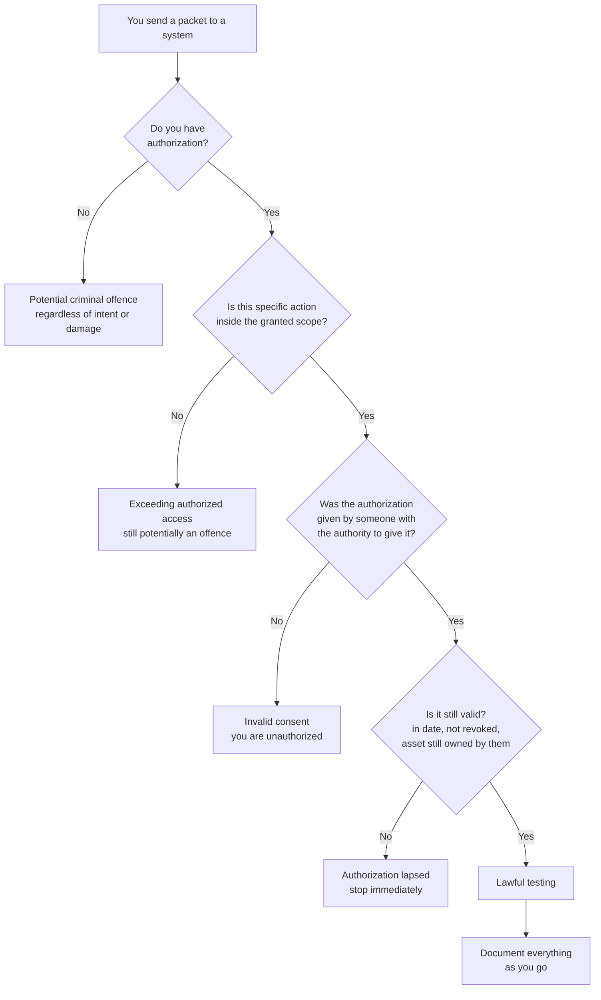
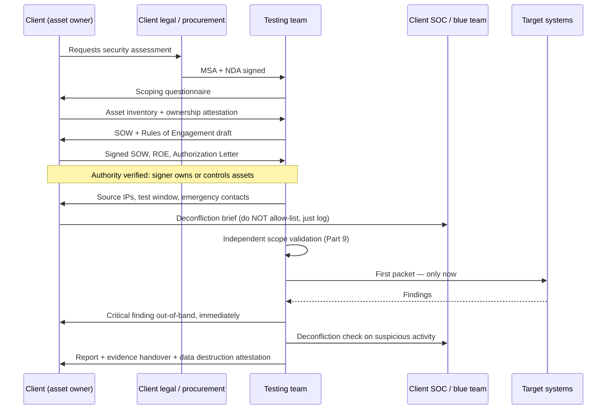
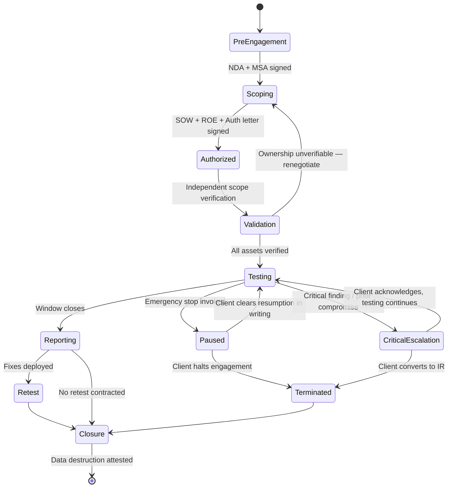
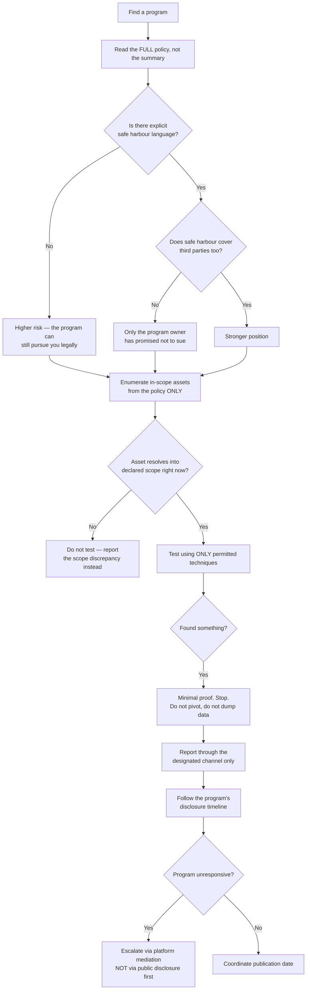
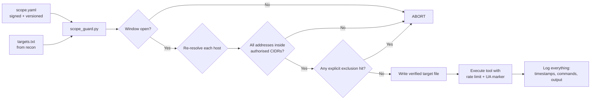
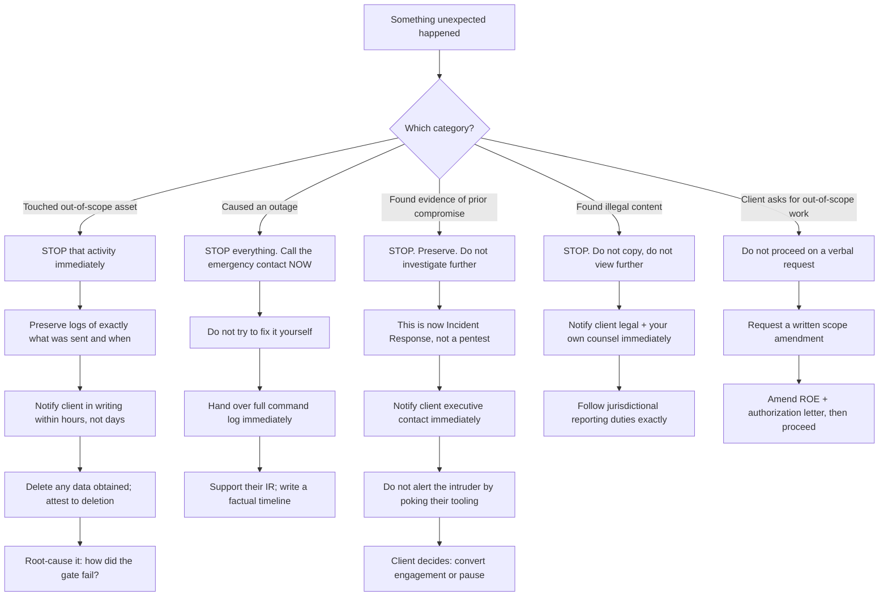
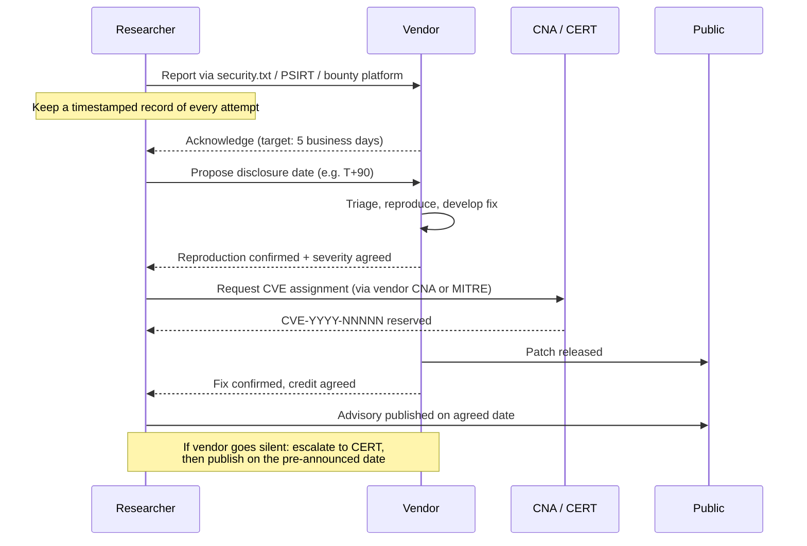
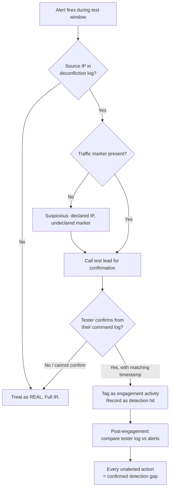

**Level:** Intermediate · **Track:** Foundations · **Read time:** 180 min

This is Chapter 5 of the Security Foundations series — Notebook 8. Chapter 4 mapped the industry as a
set of jobs. This chapter covers the thing every one of those jobs is built on: the document, the
signature and the boundary that make your work legal.

Here is the uncomfortable truth that this chapter exists to make concrete. The packets an attacker
sends and the packets a paid penetration tester sends are frequently *byte-for-byte identical*. There
is no technical property of a TCP SYN, an HTTP request, or a `sqlmap` payload that marks it as
authorized. Nothing in the protocol carries consent. The entire difference — the difference between an
invoice and an indictment — lives in a piece of paper, a scope definition, and whether the person who
signed it had the authority to sign it.

That asymmetry is why this is not a boring compliance chapter to skim. It is the highest-consequence
material in the entire notebook. A misconfigured `nmap` command against a `/16` you did not verify can
end a career. A scope line that says "*.example.com" without qualification can put you on a shared
hosting provider's infrastructure that belongs to three hundred other companies. Getting this right is
a skill with its own techniques, its own tooling, and its own hands-on practice — and that is exactly
how it is taught here.

> **A necessary disclaimer, stated once and meant throughout.** This chapter is educational material
> written by a security practitioner, not legal advice, and it is not a substitute for a lawyer. Laws
> differ by country, by state, by sector and by contract, they change, and their application depends
> on facts this chapter cannot know. Everything here is a framework for asking better questions and
> for recognising when you need counsel — not a determination that any specific activity is lawful.
> When real money, real production systems or real risk are involved, get a real lawyer.

## Part 1: The Authorization Principle — Why a Packet Has No Legality

Start with the mental model that everything else in this chapter hangs from.

Computer crime statutes around the world converge on a single conceptual core: it is an offence to
access a computer system **without authorization**, or to **exceed the authorization you were given**.
The wording varies — "without authorisation" in the UK, "without authorization or exceeding authorized
access" in the US, "without permission of the owner" in India — but the load-bearing word is always
some form of *authorization*.

Notice what is absent from that formulation. There is no requirement that you caused damage. There is
no requirement that you had malicious intent, in many jurisdictions. There is no exemption for
curiosity, for research, for "I was going to report it," or for "the system was obviously
misconfigured." Those things can matter enormously at the charging and sentencing stage, and modern
prosecutorial policy in several countries explicitly considers them — but they are mitigations, not
the definition of the offence. The offence is the unauthorized access itself.



Four gates, all of which must be open simultaneously: **authorization exists**, **the action is in
scope**, **the grantor had authority**, and **the grant is currently valid**. A failure at any one gate
puts you outside the law even if the other three are perfect. Most real-world incidents involving
well-intentioned testers are gate-three or gate-four failures — a scope signed by someone who did not
own the asset, or an engagement that ran past its authorized window.

**Why this matters even if you never do a paid pentest.** Bug bounty hunters operate under a
*unilateral* grant of authorization published by the program owner; if you step outside its terms, the
grant does not cover you. CTF players operate under the event's terms of service, and pivoting from a
CTF box to the hosting provider's infrastructure has ended more than one competitor's participation
and worse. Blue teamers who "test the detection" against a partner network are equally exposed. The
principle is universal.

### 1.1 The Two Failure Modes: No Authorization vs. Exceeded Authorization

These are legally distinct and worth separating in your head.

**No authorization at all** is the simple case: you scanned a host you have no relationship with. This
is the classic "I ran masscan against the internet to build a research dataset" scenario, and it is
also the most commonly prosecuted.

**Exceeding authorized access** is the subtle and far more dangerous case for professionals, because
it happens *inside* an engagement you were legitimately hired for. Examples that have caused real
trouble:

- Testing `10.0.0.0/8` when the scope said `10.10.0.0/16`, because of a typo in an nmap target file.
- Using credentials issued for the staging environment against production because SSO silently spanned
  both.
- Pivoting from an in-scope web server into a database host that was never listed, on the reasoning
  that "demonstrating impact requires it."
- Continuing to test after the engagement window closed because you wanted to finish a promising lead.
- Downloading a full customer database to "prove" the SQL injection, when a single row count would
  have proved it.

That last one is worth dwelling on, because it is the single most common way competent testers create
legal and contractual exposure for themselves. **Proof of vulnerability is not the same as maximum
exploitation.** The professional standard is minimum sufficient demonstration — see Part 10.

### 1.2 A Sequence That Shows Where Consent Actually Lives



The single most important line in that diagram is `T->>S: First packet — only now`. Everything above
it is the authorization. In a real engagement, that is typically two to six weeks of work before any
technical activity begins, and the mature teams treat it as engineering work with the same rigour as
the testing itself.

## Part 2: The Legal Landscape — Statutes You Should Actually Know

You do not need to be a lawyer, but you must be able to recognise which statute governs the work you
are doing and what its rough contours are. Here is the practitioner's map.

| Jurisdiction | Primary statute | Core prohibition | Notable feature for testers |
|---|---|---|---|
| United States | Computer Fraud and Abuse Act, 18 U.S.C. § 1030 | Accessing a "protected computer" without authorization or exceeding authorized access | *Van Buren v. US* (2021) narrowed "exceeds authorized access" to a gates-up-or-down test; DOJ 2022 policy declines charging good-faith security research |
| United States (state) | State computer crime statutes (e.g. California Penal Code § 502) | Broadly parallel to CFAA, sometimes broader | State charges can follow even where federal charges are declined |
| United Kingdom | Computer Misuse Act 1990, ss. 1–3A | s.1 unauthorised access; s.2 access with intent to commit further offence; s.3 unauthorised acts impairing operation; s.3A supplying "hacking tools" | s.1 has **no damage requirement** and is very broad; s.3A has long worried tool authors |
| European Union | Directive 2013/40/EU, implemented in member-state law | Illegal access, illegal system/data interference, illegal interception | Recital allows member states to exempt authorised testing; implementation varies widely |
| India | Information Technology Act 2000, ss. 43, 65, 66 | s.43 civil liability for access without permission of the owner; s.66 criminalises s.43 acts done dishonestly/fraudulently | s.43 is strict-liability civil — no intent needed for damages |
| Germany | Strafgesetzbuch § 202a–202c | Data espionage, interception, preparation of such acts | § 202c ("Hackerparagraf") criminalises preparing tools; interpreted narrowly by the Constitutional Court but still chills tooling |
| Australia | Criminal Code Act 1995, Part 10.7 | Unauthorised access/modification/impairment of data | Carriage-service element gives it broad reach |
| Singapore | Computer Misuse Act (Cap. 50A) | Unauthorised access, modification, interception | Extraterritorial reach where the computer is in Singapore |
| Canada | Criminal Code s. 342.1, s. 430(1.1) | Unauthorised use of computer; mischief in relation to computer data | "Fraudulently and without colour of right" element |
| Japan | Act on Prohibition of Unauthorised Computer Access | Unauthorised access using another's identification code, or bypassing access control | Access-control-bypass framing is unusually explicit |

Two structural observations you should carry away from that table rather than the specifics.

**First, jurisdiction is plural, not singular.** A tester in Bangalore, hired by a company registered
in Delaware, testing a web application served from AWS `eu-west-1`, with a database in Singapore, has
potentially engaged four legal systems. The contract should specify governing law, but a contract
between you and your client cannot bind a third-party prosecutor in a fourth country. When engagements
cross borders — and cloud makes almost all of them cross borders — this is a question for counsel, not
for you.

**Second, "protected computer" and equivalent terms are enormous.** Under the CFAA, a "protected
computer" includes any computer "used in or affecting interstate or foreign commerce or
communication." In practice that is any internet-connected device on earth. Do not assume small,
obscure, or personal systems fall outside these statutes.

### 2.1 Van Buren and the Gates-Up-or-Down Test

Because so much security work happens under US law or US-headquartered clients, one case deserves real
explanation.

In *Van Buren v. United States* (2021), the US Supreme Court considered a police officer who used his
legitimate access to a licence-plate database to look up a plate for an improper, non-law-enforcement
reason. The government argued this "exceeded authorized access" under the CFAA, because he had access
for some purposes but not that one.

The Court rejected that reading. It adopted what commentators call the **gates-up-or-down** test: the
CFAA covers obtaining information from areas of a computer that are **off limits to you**, not
obtaining information you are allowed to reach but for a **purpose** the owner would dislike. If the
gate is up for you, walking through it is not a CFAA violation even if your motives are bad.

Why this matters enormously for security research:

- **Terms-of-service violations alone are much weaker as a CFAA theory.** Scraping a publicly
  accessible page in violation of a robots.txt or a ToS clause is, post-*Van Buren*, far harder to
  charge as unauthorized access.
- **Technical access controls became the dividing line.** If you bypass authentication, guess an ID to
  reach another user's record (IDOR), or defeat rate limiting designed as a barrier, you are pushing
  through a gate that was down for you. That is squarely inside the statute.
- **It did not legalise research.** The Court expressly left open questions about what counts as a
  gate. And it says nothing about state statutes, contract law, or other countries.

**The practical rule for a tester:** *Van Buren* narrows one theory of liability. It does not create a
research exemption, and no competent professional relies on it as a substitute for written
authorization.

### 2.2 The DOJ Charging Policy for Good-Faith Research

In May 2022, the US Department of Justice announced a policy directing federal prosecutors **not to
charge good-faith security research** under the CFAA. It defines good-faith research roughly as
accessing a computer solely for purposes of good-faith testing, investigation, or correction of a
vulnerability, where the activity is carried out in a manner designed to avoid harm to individuals or
the public, and where the information derived is used primarily to promote security or safety.

Understand precisely what that is and is not:

- It is an **internal charging policy**, not a statute and not a court ruling. It can be revised by a
  future administration without any legislative act.
- It binds **federal prosecutors only**. State attorneys general, foreign prosecutors, and private
  civil plaintiffs are unaffected.
- It contains a large carve-out: activity is **not** good faith if it is "in pretext of good-faith
  research" — for example, discovering a flaw and then extorting the owner, or selling it to a party
  that will misuse it.
- Civil liability is untouched. A company can still sue you under contract, trade secret, or state law.

| Protection mechanism | What it actually is | Binding on prosecutors? | Binding on civil plaintiffs? | Can be revoked? |
|---|---|---|---|---|
| Signed authorization letter | Contract + consent | Strong evidence of authorization | Yes, if drafted well | Yes, by the client — get it in writing |
| Bug bounty safe harbour | Unilateral public promise / licence | Persuasive, not binding | Usually yes, if it says so | Yes, program terms change |
| DOJ 2022 charging policy | Executive branch policy | Directive to federal prosecutors | No | Yes, by policy change |
| *Van Buren* holding | Judicial interpretation of statute | Yes, courts must follow | Yes for CFAA civil claims | Only by legislation or later ruling |
| DMCA § 1201 security research exemption | Triennial Copyright Office rule | Narrow, anti-circumvention only | Partially | Yes, must be renewed every three years |

**The hierarchy is simple:** a signed contract with the actual asset owner is worth more than every
other row in that table combined. Everything else is a fallback you hope never to need.

### 2.3 Adjacent Statutes That Bite Unexpectedly

Computer crime law is not the only exposure. These come up constantly in real engagements.

- **Wiretap / interception law.** Capturing traffic that includes other people's communications can
  trigger interception statutes (US Wiretap Act, UK Investigatory Powers Act, India IT Act s.66E for
  privacy violation). Running a rogue AP or an ARP-spoofing MitM on a corporate network you are testing
  is authorized only if the ROE explicitly says so, and even then employee communications may need
  separate handling. **This is why "passive traffic capture" belongs in the ROE as an explicit,
  named-and-consented activity, not as an assumed part of network testing.**
- **Data protection law.** GDPR Article 32 requires "a process for regularly testing, assessing and
  evaluating the effectiveness" of security measures — meaning pentesting is arguably *mandated*. But
  if your testing touches personal data, you are processing it, and you need a lawful basis, a data
  processing agreement, and often a defined retention and destruction schedule. India's DPDP Act and
  similar regimes create parallel obligations.
- **Sector regulation.** PCI DSS Requirement 11 mandates internal and external penetration testing at
  defined intervals with defined methodology. HIPAA's Security Rule requires risk analysis. DORA in EU
  financial services introduced threat-led penetration testing obligations (TLPT/TIBER-EU). These
  regimes shape *what* the test must cover, and misrepresenting a test as compliant when it was not is
  its own problem.
- **Export control.** Some intrusion-software and cryptography tooling is export-controlled (Wassenaar
  Arrangement implementations, US EAR). Shipping an implant or an exploit across a border can be a
  licensing question.
- **Anti-circumvention.** DMCA § 1201 in the US criminalises circumventing technological protection
  measures. The Copyright Office grants a renewable security-research exemption, but it is narrow and
  conditional.

## Part 3: Who Can Actually Say Yes — The Authority Problem

Gate three from Part 1 is the one that fails most often and most quietly. Someone gives you
permission. They are enthusiastic, senior-sounding, and completely lacking in the authority to give it.

**Consent must come from the party with the legal right to control the asset.** That is usually the
owner, or someone with delegated authority from the owner. It is not:

- A developer who built the application but does not own the company.
- A friendly IT manager at a subsidiary, for assets owned by the parent.
- A customer of a SaaS product, for the SaaS provider's infrastructure.
- A tenant of a shared hosting provider, for the shared server.
- Anyone at all, for a third-party dependency their app happens to call.

| Scenario | Who you think can consent | Who actually must consent | Why |
|---|---|---|---|
| Company's self-hosted web app on their own VPS | CISO | CISO (+ hosting provider ToS check) | They own the app and the VM; provider still has an AUP |
| App on AWS/Azure/GCP | CISO | CISO, within the provider's published testing policy | Provider owns the underlying infrastructure |
| Salesforce/Workday/Okta tenant | Client | The SaaS vendor | Client owns data, vendor owns the system |
| Subsidiary's network, parent-company contract | Parent CISO | Parent, *if* corporate structure grants control — verify | Separate legal entities may need separate consent |
| Third-party API the app calls | Client | The API provider | Client has no authority over someone else's service |
| Payment gateway integration | Client | Gateway provider (and PCI constraints) | Out of scope by default |
| Shared hosting / cPanel | Client | Hosting provider | Other tenants share the host |
| Employee BYOD device | HR/IT | Employee + legal, per local employment law | Personal property and personal data |
| An acquired company mid-acquisition | Acquiring CISO | Depends entirely on deal close status | Pre-close, the target is still a separate entity |
| CDN / WAF in front of the app | Client | Usually the CDN vendor for the edge itself | Cloudflare, Akamai, Fastly have their own policies |

### 3.1 The Verification Habit

Do not merely ask "do you have authority?" — that question gets a yes from everyone. Instead, build the
answer from artefacts:

1. **Ask for the asset inventory in writing**, with an explicit ownership attestation clause signed by
   the client. Wording along the lines of: *"Client represents and warrants that it owns or has the
   contractual right to authorise security testing of each asset listed in Appendix A, and will
   indemnify Tester for claims arising from any asset listed in error."*
2. **Verify independently anyway.** Ownership attestations are routinely wrong — not maliciously, but
   because nobody at a 5,000-person company knows every IP. Part 9 is a full lab on doing this.
3. **Escalate the signature.** The signer should be someone whose job title plausibly carries the
   authority: CISO, CTO, General Counsel, VP Engineering. A signature from a security analyst is not
   worthless, but it is weaker if the engagement goes wrong.
4. **Re-verify at the start of each engagement**, even with a repeat client. IP ranges get returned to
   the provider, domains lapse, subsidiaries get divested. An attestation from eighteen months ago is
   not evidence about today.

> **Red team usage:** the authority problem is also an *attack surface* — an attacker who can convince
> a helpdesk they have authority gets access without exploiting anything. Social-engineering
> engagements probe exactly this. But the pretext used in an authorized social-engineering test is
> itself an activity that must be explicitly authorised in the ROE, and impersonating law enforcement
> or a government official is illegal in most jurisdictions regardless of what the ROE says. **No
> contract can authorise an act that is independently criminal against a third party.**

### 3.2 The Non-Delegable Limit

That last point generalises into a rule worth memorising: **a client can only authorise you to do
things to the client.** A signed ROE cannot make it lawful to:

- Impersonate a police officer, government agency, or court.
- Access a third party's systems, even to reach the client.
- Intercept communications of people who have not consented, where local law requires their consent.
- Violate export control by shipping tooling across a border.
- Damage property belonging to a landlord rather than the client (physical engagements).
- Test a system the client rents but does not control, without the owner's consent.

If a client asks for any of these, the correct response is to explain why it cannot be scoped and to
propose the lawful equivalent — e.g. replacing "impersonate the tax authority" with "impersonate a
generic external vendor," which tests the same human control without the criminal element.

## Part 4: Scope — The Document That Defines Your Universe

Scope is the single most consequential technical artefact in the engagement. It is also, in most
organisations, written badly.

A scope is not a paragraph. It is a structured, machine-readable-ish enumeration of exactly what may
be touched, expressed in the same terms your tooling consumes.

### 4.1 Anatomy of a Good Scope Definition

```yaml
# scope.yaml — the authoritative engagement scope
engagement:
  id: "ENG-2291"
  client: "Contoso Retail Holdings Ltd"
  authorized_by: "J. Okafor, CISO — signed authorization letter ENG-2291-AUTH-v3"
  window_start: "2026-04-06T09:00:00+01:00"
  window_end:   "2026-04-17T18:00:00+01:00"
  timezone: "Europe/London"

in_scope:
  ipv4:
    - "203.0.113.0/26"          # DMZ, client-owned, ARIN-verified
    - "198.51.100.14"           # legacy mail relay
  ipv6:
    - "2001:db8:4::/48"
  domains:
    - "shop.contoso-retail.example"
    - "api.contoso-retail.example"
  wildcards:
    - pattern: "*.stage.contoso-retail.example"
      note: "Wildcard limited to hosts resolving into 203.0.113.0/26 ONLY"
  urls:
    - "https://shop.contoso-retail.example/*"
  mobile:
    - platform: "android"
      package: "example.contoso.shop"
      version: "8.4.1"
  cloud:
    - provider: "aws"
      account_id: "111122223333"
      services: ["ec2", "alb", "s3"]
      note: "Provider policy permits; no simulated DoS, no other accounts"

out_of_scope:
  explicit:
    - "*.corp.contoso-retail.example"   # internal AD, separate engagement
    - "203.0.113.200"                   # third-party managed SIEM appliance
    - "payments.contoso-retail.example" # PSP-hosted, not client-owned
    - "Any host not resolving into the ranges above at time of test"
  activities:
    - "Denial of service, volumetric or application-layer"
    - "Physical intrusion"
    - "Social engineering of any kind"
    - "Modification or deletion of production data"
    - "Exfiltration of more than 3 records to demonstrate impact"
    - "Testing outside the declared window"
    - "Pivoting into any host not explicitly listed"

constraints:
  source_ips: ["192.0.2.44", "192.0.2.45"]
  max_request_rate: "20 req/s per host"
  user_agent_marker: "ENG-2291-PENTEST"
  credentials_provided: ["pentest_user_01", "pentest_admin_01"]
  no_test_hours: ["Fri 16:00-18:00 (weekly batch run)"]

escalation:
  critical_finding_contact: "+44 20 7946 0000 / soc@contoso-retail.example"
  emergency_stop_phrase: "HALT ENG-2291"
  deconfliction_contact: "blue-team@contoso-retail.example"
```

Every line in that file exists because its absence has caused a real problem somewhere. Walk through
the ones that matter most.

**`user_agent_marker`.** Every HTTP request the team sends carries a unique, agreed string. When the
SOC sees suspicious traffic at 03:00, they grep for `ENG-2291-PENTEST` and know in seconds whether it
is you. This one line prevents more unnecessary incident escalations than any other control. In Burp,
set it under *Settings → Sessions → Match and Replace*; in `ffuf`, `-H "User-Agent: ENG-2291-PENTEST"`;
in `nuclei`, `-H "User-Agent: ENG-2291-PENTEST"`.

**`source_ips`.** Fixed, declared egress addresses. The blue team logs them. Note the subtlety in Part
14: they should be **logged, not allow-listed**, or you are testing a fantasy environment.

**The wildcard qualification.** `*.stage.contoso-retail.example` is a trap without the resolution
constraint. DNS is not ownership. If the client has a dangling CNAME pointing `old.stage.contoso-
retail.example` at an S3 bucket now owned by someone else, an unqualified wildcard tells you to attack
a stranger's bucket. Bind wildcards to verified IP ranges.

**`max_request_rate`.** Rate limiting is not politeness, it is availability protection. A default
`sqlmap` run with `--threads 10` against a fragile legacy app is functionally a denial-of-service
attack, and DoS is out of scope.

**Exfiltration limits as a number.** "Demonstrate impact without excessive data access" is unactionable.
"Three records" is a rule you can follow and a rule an auditor can check.

### 4.2 Scope Ambiguity Patterns and Their Fixes

| Ambiguous scope text | Why it fails | Correct replacement |
|---|---|---|
| "Our external perimeter" | Undefined set; changes daily | Explicit CIDR list + resolution-time constraint |
| "*.example.com" | Includes third-party SaaS on subdomains, dangling records | Wildcard + "must resolve into listed CIDRs at test time" |
| "The web application" | Excludes/includes API? Mobile backend? Admin panel? | Enumerated URL prefixes and host list |
| "All company assets" | Includes employee laptops, personal devices, acquisitions | Enumerate; exclude BYOD and unclosed acquisitions |
| "Production is out of scope" | Staging often shares a database with production | Name the boundary at the data layer, not the label |
| "No DoS" | Everyone agrees; nobody defines the threshold | Rate limits, thread caps, forbidden tool flags |
| "Test the AWS environment" | Which accounts? Which regions? Shared services? | Account IDs, region list, service list |
| "Internal network" | RFC1918 space overlaps with VPN pools, partner links | Exact VLANs/CIDRs, plus explicit exclusions |
| "During business hours" | Whose timezone? Whose holidays? | ISO 8601 timestamps with offset |
| "Report critical issues immediately" | "Immediately" and "critical" both undefined | Severity rubric + contact + SLA in hours |

### 4.3 The Resolution-Time Problem

A subtle issue that catches experienced testers. Scope says `shop.contoso-retail.example`. You resolve
it on Monday: `203.0.113.20`, in scope. You run a long scan Wednesday night. In between, the client's
DevOps team moved the site to a new CDN, and `shop.contoso-retail.example` now resolves to an IP
belonging to a CDN vendor with a strict no-testing policy — and possibly shared with other customers.

**The fix is procedural, not clever.** Re-resolve every hostname at the start of every test run, verify
the result is inside the authorized IP ranges, and abort if it is not. The Python validator in Part 9.4
does exactly this, and it belongs in your run script, not in your head.

## Part 5: Rules of Engagement — The Operational Contract

If scope answers *what*, Rules of Engagement answer *how, when, and what happens when something goes
wrong*. It is the operational half of the authorization.



### 5.1 The ROE Parameter Reference

| ROE parameter | Question it answers | Failure mode if omitted |
|---|---|---|
| Test window (with timezone) | When may packets fly? | Testing during a change freeze or peak trading |
| Source IPs | Where does traffic come from? | Blue team cannot deconflict; you get blocked |
| Traffic marker | How is our traffic identified? | Every alert becomes a full IR investigation |
| Rate limits / thread caps | How hard may we push? | Accidental DoS, contract breach |
| Permitted techniques | What classes of attack are allowed? | Disputes over phishing, MitM, password spraying |
| Forbidden techniques | What is explicitly banned? | Ambiguity resolved in the client's favour, after the fact |
| Credential handling | What do we do with creds we find? | Cracked hashes stored insecurely; second breach |
| Data handling | How much data may we touch, where is it stored, when destroyed? | Regulatory exposure for both parties |
| Escalation path | Who do we call, how fast, for what severity? | Critical finding sits in a report for three weeks |
| Emergency stop | How does the client halt us instantly? | No way to stop a running scan during an outage |
| Deconfliction | How do we distinguish us from a real attacker? | Real intrusion attributed to the test and ignored |
| Evidence standard | What proof is required per finding? | Over-exploitation to "prove" impact |
| Retest terms | Is verification of fixes included? | Scope creep or unpaid work |
| Reporting format & delivery | Encrypted channel? Who receives it? | A pentest report emailed in plaintext |
| Third-party notification | Who tells the cloud provider / partners? | Provider AUP violation |
| Insurance | Who carries professional indemnity, at what limit? | Uninsured loss after an outage |

### 5.2 Techniques That Must Be Named Explicitly

The default assumption should be that anything intrusive is **out** unless named **in**. These are the
ones that most often cause disputes when left implicit:

- **Password spraying and credential stuffing** — can lock out real users; needs a lockout-policy
  discussion and often a "no more than N attempts per account per window" rule.
- **Phishing / vishing / smishing** — requires HR and legal sign-off, a defined target list, and a
  policy on what happens if someone enters credentials (you must not use them beyond agreed depth).
- **Man-in-the-middle / ARP spoofing / rogue AP** — intercepts third-party communications; wiretap
  exposure.
- **Exploitation of confirmed vulnerabilities** — some engagements are "identify only, do not exploit."
  Know which you are on.
- **Privilege escalation and lateral movement** — an assumed part of red teaming, often forbidden in a
  standard pentest.
- **Persistence mechanisms** — if you install an implant, the ROE must cover installation, tracking, and
  guaranteed removal, with an inventory delivered at closure.
- **Testing of third-party-managed devices** — the managed SIEM, the outsourced firewall.
- **Anything against Active Directory that writes** — adding a machine account, modifying an ACL, and
  Kerberoasting all leave artefacts; some are trivially reversible, some are not.
- **Data destruction, encryption or ransomware simulation** — almost always simulate at the file-marker
  level only, never with real encryption.

> **Blue team usage:** read the ROE from the defender's side and you get a free gap analysis. Every
> technique the ROE forbids is a technique you will therefore have **no detection telemetry for** after
> the engagement. Track the forbidden list as a known-unknown in your coverage map — it is not
> "covered," it is "untested." This is one of the most under-used artefacts a SOC receives.

### 5.3 The Emergency Stop

Every engagement needs a way for the client to stop you in under five minutes, at any hour. Concretely:

- A **phrase** (`HALT ENG-2291`) that means "stop everything now, no questions, we will discuss later."
- A **channel** that works out of hours — a phone number, not an email alias.
- A **named person on your side** who is reachable, with a documented backup.
- An agreed **acknowledgement time** (e.g. "the team will confirm cessation within 15 minutes").
- A rule that **resumption requires written client approval**, not a verbal "ok you can carry on."

And on your side: know how to actually stop. A `nuclei` run inside a `tmux` session on a jump box you
cannot reach from your phone is not stoppable. Mature teams run long jobs under a supervisor that
responds to a kill switch, and keep a documented "how to stop everything" runbook that a colleague can
execute without you.

## Part 6: The Paperwork Stack

New testers assume there is one document. There are typically five to seven, each doing a different job.

| Document | Purpose | Typically signed by | When | If missing |
|---|---|---|---|---|
| **NDA** (mutual) | Protects both parties' confidential information | Both, legal | Before scoping conversations | You cannot receive architecture docs |
| **MSA** (Master Services Agreement) | Governs the overall commercial relationship: liability caps, IP, insurance, governing law | Both, legal | Once, covering many engagements | Every engagement renegotiates liability |
| **SOW** (Statement of Work) | This specific engagement: deliverables, dates, price, team | Both, commercial | Per engagement | No agreed deliverable; payment disputes |
| **Rules of Engagement** | Operational constraints (Part 5) | Client technical owner + tester lead | Per engagement, before testing | Ambiguity resolved against you |
| **Authorization Letter** | Standalone, plain-language proof that testing is authorised | Client executive with authority | Per engagement | No portable proof of consent |
| **Scope Appendix + ownership attestation** | The asset list and the client's warranty that they own it | Client asset owner | Per engagement, re-signed if changed | You inherit the risk of their inventory errors |
| **Data Processing Agreement** | Governs personal data touched during testing | Both, privacy/legal | Where personal data is in play | GDPR/DPDP exposure for both parties |
| **Physical authorization ("get-out-of-jail letter")** | Carried on-person during physical engagements | Client executive + site owner | Physical engagements only | Detention by police is a genuine risk |

### 6.1 The Authorization Letter, Written Out

This is the document a tester should be able to draft from memory. It is short by design — it exists to
be understood by a police officer, a hosting provider's abuse desk, or a judge, none of whom will read
your 40-page MSA.

```text
                          AUTHORIZATION FOR SECURITY TESTING
                                Reference: ENG-2291-AUTH-v3

Contoso Retail Holdings Ltd ("Contoso"), a company registered in England and Wales
(No. 09876543) with registered office at [address], hereby authorises:

    Northwind Security Ltd ("Tester"), company No. 12345678
    Named personnel: A. Rahman, P. Silva, M. Chen

to perform security testing, including active vulnerability scanning and controlled
exploitation, against the systems enumerated in Appendix A ("the Authorised Systems"),
during the period:

    06 April 2026, 09:00 Europe/London  to  17 April 2026, 18:00 Europe/London

Contoso represents and warrants that it owns, or holds the contractual right to
authorise security testing of, each system listed in Appendix A.

This authorisation is subject to the Rules of Engagement document ENG-2291-ROE-v3
and the Statement of Work dated 24 March 2026, and is limited to the Authorised
Systems and the period stated above. It may be revoked at any time by written notice
to the Tester's engagement lead.

Contoso confirms that testing performed within these bounds is performed with its
knowledge and consent and does not constitute unauthorised access to its systems.

Emergency contact (24h):  Security Operations, +44 20 7946 0000
Emergency stop phrase:    HALT ENG-2291

Signed: ______________________     Date: ______________
        J. Okafor
        Chief Information Security Officer
        Contoso Retail Holdings Ltd
```

Notes on why each clause is there:

- **Named personnel.** Authorization runs to specific humans. If you add a team member mid-engagement,
  amend the letter — do not assume the company name covers them.
- **"including active vulnerability scanning and controlled exploitation."** Without this, a client can
  later argue they authorised a scan but not exploitation.
- **The warranty clause.** This is your primary protection when the client's inventory is wrong.
- **Explicit time bounds.** Authorization that never expires is authorization no lawyer will sign.
- **Revocation clause.** Its presence signals that both parties understood consent is ongoing.
- **The reference number.** Everything — the ROE, the scope file, the traffic marker, the report — uses
  the same ID, so any artefact can be tied back to the authority for it.

**Carry it.** For remote work, keep a signed PDF accessible offline. For physical engagements, carry
paper copies, and give one to the client's security guards' supervisor in advance.

## Part 7: Cloud and Third-Party Authorization

Almost every modern engagement touches infrastructure the client does not own. The client's signature
authorises testing of *their* tenancy; the provider's policy governs everything underneath it.

| Provider | General posture on customer pentesting | Prohibited without separate approval | Practical note |
|---|---|---|---|
| AWS | Permitted for a defined list of customer-operated services without prior approval | Any DoS/DDoS simulation, testing of other tenants, testing AWS-operated infrastructure (e.g. hypervisor), some managed services | Simulated-event form required for DDoS-style tests; policy is service-scoped, so check the current service list |
| Microsoft Azure | Permitted under the unified Microsoft Cloud penetration testing rules of engagement | Testing other tenants, phishing Microsoft staff, DoS | Rules cover M365 and Azure together |
| Google Cloud | Permitted without notification, subject to the Acceptable Use Policy | Anything violating the AUP; other tenants | Google explicitly says no form is needed but AUP still applies |
| Cloudflare | Edge is Cloudflare's; testing the origin through it is a customer matter | Testing Cloudflare's own edge/WAF infrastructure | Test the origin directly where possible; scanning through the CDN mostly tests Cloudflare |
| Shared hosting (cPanel-class) | Usually prohibited outright | Effectively everything intrusive | Other tenants on the same host make it untestable |
| SaaS (Salesforce, Workday, Okta, etc.) | Vendor-specific; often requires written pre-approval or is prohibited | Testing the multi-tenant platform | Client owns data, not the system |
| Managed security appliances | The MSSP owns them | Testing the appliance itself | Add to explicit out-of-scope list |

**Provider policies change.** Do not memorise the specifics from any table, including this one — check
the provider's current published testing policy at the time of scoping, save a dated copy in the
engagement file, and reference it in the ROE. That saved copy is your evidence of the policy you relied
on.

### 7.1 The Cloud Attribution Problem

Cloud makes ownership verification genuinely hard, and this is where scope validation earns its keep.

An IP in AWS's range tells you nothing about which customer it belongs to. `203.0.113.45` in `whois`
returns Amazon, not Contoso. So how do you prove an in-scope IP belongs to your client rather than to a
stranger's EC2 instance that happens to sit in the same `/16`?

Three techniques, in order of strength:

1. **Client-side proof.** Ask the client to place a unique token at a known path, or to add a DNS TXT
   record, or to show you the resource in their console. If they can put `ENG-2291-abc123` at
   `https://host/.well-known/pentest-token` and you can read it, they control that host. This is the
   strongest, cheapest check and it is under-used.
2. **Certificate transparency + control-plane correlation.** A TLS certificate issued for the client's
   domain to that IP is meaningful evidence, especially with a DNS record chain you have verified.
3. **Passive attribution.** Reverse DNS, ASN, historical DNS records. Weakest — treat as a hint, never
   as proof.

Technique 1 is the one to build a habit around: **when in doubt, make the client prove control rather
than asserting it.** It converts an ownership question into a five-minute technical check.

## Part 8: Bug Bounty and VDP — Unilateral Authorization

Bug bounty is legally different from consulting. There is no negotiated contract; there is a **public
offer** with terms, and your authorization is whatever that offer grants. You are bound by every word
of the program policy, and you had no opportunity to negotiate any of it.



### 8.1 Reading a Safe Harbour Clause

Safe harbour language varies enormously in strength. Learn to grade it.

**Weak — a promise not to sue, conditional and vague:**

> "We will not pursue legal action against researchers who act in good faith."

Problems: "good faith" is undefined and judged by them; there is no mention of criminal referral; it
does not bind third parties; it can be withdrawn.

**Moderate — the common template, materially better:**

> "If you make a good faith effort to comply with this policy during your security research, we will
> consider your research to be authorized, we will work with you to understand and resolve the issue
> quickly, and we will not recommend or pursue legal action related to your research."

Better because it uses the magic words **"we will consider your research to be authorized"** — that is
a grant of authorization, directly addressing the element of the offence, not merely a promise about
remedies.

**Strong — adds third-party and DMCA coverage:**

> "...we will consider your research authorized, will not initiate or support legal action against you,
> will waive any restrictions in our Terms of Service that would prohibit your research, and will take
> steps to make known that your activities were authorized if a third party initiates legal action
> against you. We also grant a limited exemption under DMCA § 1201 for research within this policy."

The **ToS waiver** matters because a ToS breach is a separate contract claim that safe harbour otherwise
leaves alive. The **third-party assistance** clause matters because your hosting provider or the police
are not parties to the program's promise.

| Safe harbour element | What it protects against | How often present |
|---|---|---|
| "We consider your research authorized" | The core criminal element | Common in mature programs |
| "We will not pursue legal action" | Civil suit by the program owner | Very common |
| "We waive relevant ToS restrictions" | Breach-of-contract claim | Less common, valuable |
| DMCA § 1201 exemption | Anti-circumvention claim | Uncommon, matters for hardware/DRM |
| Third-party defence assistance | Claims by hosts, partners, other vendors | Rare, the strongest signal |
| Clear scope + technique list | Ambiguity about what was authorized | Should be universal, is not |
| Named disclosure timeline | Disputes over publication | Improving |

**disclose.io** maintains standardised safe-harbour language that many programs adopt verbatim;
recognising it saves reading time and tells you the program has thought about this properly.

### 8.2 The Ways Bounty Hunters Actually Get in Trouble

These are the recurring patterns, and none of them are exotic:

- **Testing an asset that "looks like" it belongs to the target.** `contoso-cdn.example` is not
  `*.contoso.example`. Subdomains found by a tool are not scope; the policy is scope.
- **Escalating beyond minimal proof.** Finding an IDOR and then iterating the ID a hundred thousand
  times to build a "impact demonstration" dataset. That is a data breach you caused.
- **Automated scanning where the policy forbids it.** Many programs ban automated scanners outright,
  and a `nuclei` run against a live production host is trivially detectable.
- **Testing production sign-up flows at scale**, creating thousands of accounts, sending real emails to
  real users, or triggering SMS charges.
- **Going public after frustration.** A program's slow triage is aggravating; publishing before the
  agreed timeline converts a researcher into a defendant in a way nothing else does.
- **Attempting to negotiate payment after finding a flaw** in a program with no bounty, or with wording
  that reads as a demand. That crosses into extortion territory extremely fast — the DOJ policy's
  "pretext" carve-out exists precisely for this.
- **Testing an out-of-scope asset "just to check" and reporting it anyway.** The report is evidence of
  the unauthorized access.

> **Bug bounty note, stated plainly:** the winning behaviour is boring. Read the policy fully, screenshot
> the scope and the date, test only listed assets, prove minimally, report promptly through the
> designated channel, and never publish before the agreed date. Every high-earning hunter with a long
> career does exactly this.

## Part 9: Hands-On Lab — Proving You Are Allowed to Test This

This is the practical core of the chapter. Before the first scan, an experienced tester independently
verifies every asset in the scope. Here is that process end to end, with real tools, real flags and
realistic output.

**Lab objective:** given a scope file listing domains and IP ranges, produce an evidence pack proving
each asset is controlled by the client, and a validator that refuses to run tooling against anything
unverified.

**Lab environment:** Kali Linux (or any Linux with the tools below). Everything here uses passive or
minimally intrusive lookups against public registries — it is safe to run against the RFC 5737
documentation ranges used as examples, and you should substitute your own authorized targets.

### 9.1 Tooling From Zero

Four tools do most of the work. Install them first.

```bash
# Debian/Ubuntu/Kali
sudo apt update
sudo apt install -y whois dnsutils jq curl golang-go

# whois     — queries registry databases for domain and IP allocation records
# dnsutils  — provides dig, the canonical DNS query tool
# jq        — command-line JSON processor; we parse API responses with it
# curl      — HTTP client; used against the crt.sh certificate transparency API
```

**`whois`** is a client for a decades-old protocol (RFC 3912) that queries registry databases. It has
two distinct uses that beginners conflate: querying a **domain** returns registrar and registrant data;
querying an **IP address** returns the *allocation* record from a Regional Internet Registry (ARIN,
RIPE, APNIC, LACNIC, AFRINIC). Those are entirely different databases with different meanings.

**`dig`** (Domain Information Groper) is the reference DNS client. Key flags:

| Flag | Meaning | Why you want it here |
|---|---|---|
| `+short` | Print only the answer data | Scriptable output |
| `+noall +answer` | Suppress everything except the answer section | Readable but complete |
| `@8.8.8.8` | Query a specific resolver | Bypass a caching resolver that may be stale or hijacked |
| `+trace` | Walk delegation from the root | See which nameservers actually control the zone |
| `-x <ip>` | Reverse lookup (PTR) | Attribution hint for an IP |
| `+dnssec` | Request DNSSEC records | Confirms the answer chain is signed |
| `TXT` / `NS` / `CAA` | Record type | TXT for ownership tokens, NS for delegation, CAA for cert issuance policy |

**`crt.sh`** is a public search interface over Certificate Transparency logs — the append-only public
ledgers every trusted CA must log issued certificates to. It has a JSON endpoint, which makes it
scriptable.

### 9.2 Step One — Domain Ownership

```bash
whois contoso-retail.example | grep -Ei 'registrant|org|admin|name server|creation|expiry|status'
```

Realistic output:

```text
Registrant Organization:  Contoso Retail Holdings Ltd
Registrant Country:       GB
Admin Organization:       Contoso Retail Holdings Ltd
Name Server:              NS1.CONTOSO-DNS.EXAMPLE
Name Server:              NS2.CONTOSO-DNS.EXAMPLE
Creation Date:            2009-11-04T10:22:31Z
Registry Expiry Date:     2027-11-04T10:22:31Z
Domain Status:            clientTransferProhibited
```

**Reading this like a professional:**

- `Registrant Organization` matching the client's legal name on the authorization letter is your primary
  positive signal. A mismatch is not automatically fatal — companies register domains through brand
  protection agencies like MarkMonitor or CSC — but it *must* be explained and the explanation recorded.
- **Privacy redaction is now the norm**, not the exception. Post-GDPR, most registrars return
  `REDACTED FOR PRIVACY` for registrant fields on many TLDs. When that happens, whois cannot prove
  ownership and you fall back to the token method in 9.5.
- `Registry Expiry Date` is a genuine finding in itself. A domain expiring in eleven days that is
  load-bearing for authentication is a risk worth reporting before you scan anything.
- `Domain Status: clientTransferProhibited` is a good sign — the registrar lock is on. Its absence is
  worth a note in the report (domain hijacking risk).

### 9.3 Step Two — IP Range Attribution

```bash
whois 203.0.113.20 | grep -Ei 'netname|orgname|organisation|country|cidr|inetnum|netrange|abuse-mailbox'
```

Realistic output for client-owned space:

```text
NetRange:       203.0.113.0 - 203.0.113.63
CIDR:           203.0.113.0/26
NetName:        CONTOSO-DMZ-01
Organization:   Contoso Retail Holdings Ltd (CONTO-42)
Country:        GB
OrgAbuseEmail:  abuse@contoso-retail.example
```

That is a clean result: the CIDR matches the scope entry exactly, and the organisation matches the
client. Contrast with a cloud-hosted asset:

```text
NetRange:       52.94.0.0 - 52.95.255.255
CIDR:           52.94.0.0/15
NetName:        AMAZON-2011L
Organization:   Amazon Technologies Inc. (AT-88-Z)
Country:        US
OrgAbuseEmail:  abuse@amazonaws.com
```

**This proves nothing about your client.** It tells you the IP is in AWS. Millions of other customers
share that allocation. This is precisely the cloud attribution problem from Part 7.1, and it is the
moment you escalate to the token method.

For a quick ASN view across many IPs at once, Team Cymru's whois service is the efficient tool:

```bash
# Bulk ASN lookup — one line per IP, no per-query rate pain
echo -e "begin\nverbose\n203.0.113.20\n198.51.100.14\n52.94.236.248\nend" \
  | nc whois.cymru.com 43
```

```text
AS      | IP               | BGP Prefix     | CC | Registry | Allocated   | AS Name
64500   | 203.0.113.20     | 203.0.113.0/24 | GB | ripencc  | 2004-01-20  | CONTOSO-AS, GB
64501   | 198.51.100.14    | 198.51.100.0/24| GB | ripencc  | 2005-06-11  | CONTOSO-AS, GB
16509   | 52.94.236.248    | 52.94.236.0/22 | US | arin     | 2015-09-02  | AMAZON-02, US
```

Two client-owned prefixes under the client's own ASN — strong evidence. One AWS prefix — no evidence at
all. That distinction is the entire point of the exercise.

### 9.4 Step Three — Certificate Transparency

```bash
curl -s "https://crt.sh/?q=%25.contoso-retail.example&output=json" \
  | jq -r '.[] | "\(.not_before[0:10])  \(.issuer_name | split(",")[-1])  \(.name_value)"' \
  | sort -u | head -20
```

```text
2025-08-14   O=Let's Encrypt   shop.contoso-retail.example
2025-08-14   O=Let's Encrypt   www.contoso-retail.example
2025-09-02   O=Let's Encrypt   api.contoso-retail.example
2026-01-11   O=Let's Encrypt   stage.contoso-retail.example
2026-01-11   O=Let's Encrypt   *.stage.contoso-retail.example
2026-02-20   O=DigiCert Inc    vpn.contoso-retail.example
2026-03-01   O=Let's Encrypt   internal-jenkins.contoso-retail.example
```

Two things happen here, and both matter.

**As scope validation:** certificates issued for the client's domain confirm that whoever requested them
demonstrated control of that domain to a CA. That is meaningful evidence of control.

**As a scope-completeness check:** `internal-jenkins.contoso-retail.example` appears in a public log but
is not in the scope file. This is now a **scoping conversation, not a target.** The correct action is to
send the client the list and ask: is this yours, should it be in scope, and — separately — are you aware
your internal Jenkins hostname is publicly enumerable via CT logs? That last question is itself a
finding, and one of the more valuable pieces of pre-engagement output you can deliver.

> **CTF and bounty relevance:** CT log mining is the same technique used for subdomain discovery on
> bounty targets. The difference between research and trespass here is entirely about what you do with
> the list — enumerate freely from public logs, but only *send packets* to what the policy lists.

### 9.5 Step Four — The Ownership Token (the decisive check)

When registry data is redacted or the asset is cloud-hosted, ask the client to prove control. Two forms:

```bash
# Form A: HTTP path token
curl -s https://shop.contoso-retail.example/.well-known/pentest-token
# ENG-2291-8f3a1c9d4b

# Form B: DNS TXT token — works even when there is no web server
dig +short TXT _pentest-auth.contoso-retail.example
# "ENG-2291-8f3a1c9d4b"
```

Generate the token yourself, send it to the client, and require them to publish it. A token you generate
cannot be guessed, so its presence proves administrative control at the moment you checked.

```bash
# Generate a token bound to the engagement
printf 'ENG-2291-%s\n' "$(openssl rand -hex 5)"
# ENG-2291-8f3a1c9d4b
```

Record the timestamp, the token, and the raw response in the evidence pack.

### 9.6 Step Five — Re-Resolution and the Automated Gate

Now automate all of it, so that no tool ever runs against an unverified target. This script is the
deliverable of the lab.

```python
#!/usr/bin/env python3
"""
scope_guard.py — refuse to run tooling against anything outside authorised scope.

Usage:
    python3 scope_guard.py --scope scope.yaml --targets targets.txt
    python3 scope_guard.py --scope scope.yaml --targets targets.txt --exec "nuclei -l {file}"

Exit codes:
    0  all targets verified in scope
    2  one or more targets failed validation (nothing is executed)
"""

import argparse
import ipaddress
import socket
import subprocess
import sys
import tempfile
from datetime import datetime, timezone

import yaml   # pip install pyyaml

def load_scope(path):
    with open(path) as fh:
        return yaml.safe_load(fh)

def window_is_open(scope):
    """Gate 4 from Part 1: authorisation must be currently valid."""
    start = datetime.fromisoformat(scope["engagement"]["window_start"])
    end = datetime.fromisoformat(scope["engagement"]["window_end"])
    now = datetime.now(timezone.utc)
    return start <= now <= end, start, end

def allowed_networks(scope):
    nets = []
    for key in ("ipv4", "ipv6"):
        for entry in scope.get("in_scope", {}).get(key, []) or []:
            nets.append(ipaddress.ip_network(entry, strict=False))
    return nets

def excluded_hosts(scope):
    return set(scope.get("out_of_scope", {}).get("explicit", []) or [])

def resolve(target):
    """Resolve a hostname to every address it currently answers with."""
    try:
        ipaddress.ip_address(target)
        return [target]
    except ValueError:
        pass
    try:
        infos = socket.getaddrinfo(target, None)
    except socket.gaierror as exc:
        return [f"UNRESOLVED:{exc.strerror}"]
    return sorted({info[4][0] for info in infos})

def validate(target, nets, excludes):
    if target in excludes:
        return False, f"{target}: explicitly excluded by scope"
    addrs = resolve(target)
    verdicts = []
    ok = True
    for addr in addrs:
        if addr.startswith("UNRESOLVED"):
            ok = False
            verdicts.append(f"{addr} — cannot verify, refusing")
            continue
        ip = ipaddress.ip_address(addr)
        inside = any(ip in net for net in nets)
        verdicts.append(f"{addr} {'IN SCOPE' if inside else 'OUT OF SCOPE'}")
        ok = ok and inside
    return ok, f"{target}: " + "; ".join(verdicts)

def main():
    ap = argparse.ArgumentParser()
    ap.add_argument("--scope", required=True)
    ap.add_argument("--targets", required=True)
    ap.add_argument("--exec", dest="command",
                    help="command to run if all targets pass; {file} is substituted")
    args = ap.parse_args()

    scope = load_scope(args.scope)
    open_now, start, end = window_is_open(scope)
    if not open_now:
        print(f"[ABORT] Outside authorised window ({start} .. {end}). "
              f"Now: {datetime.now(timezone.utc)}")
        sys.exit(2)

    nets = allowed_networks(scope)
    excludes = excluded_hosts(scope)
    targets = [ln.strip() for ln in open(args.targets) if ln.strip()
               and not ln.startswith("#")]

    failures = []
    verified = []
    for target in targets:
        ok, detail = validate(target, nets, excludes)
        print(("[PASS] " if ok else "[FAIL] ") + detail)
        (verified if ok else failures).append(target)

    print(f"\n{len(verified)} verified, {len(failures)} rejected "
          f"(engagement {scope['engagement']['id']})")

    if failures:
        print("[ABORT] Refusing to execute. Resolve scope issues first.")
        sys.exit(2)

    if args.command:
        with tempfile.NamedTemporaryFile("w", suffix=".txt", delete=False) as tf:
            tf.write("\n".join(verified) + "\n")
            path = tf.name
        cmd = args.command.replace("{file}", path)
        print(f"[EXEC] {cmd}")
        sys.exit(subprocess.call(cmd, shell=True))

if __name__ == "__main__":
    main()
```

Run it:

```bash
$ cat targets.txt
shop.contoso-retail.example
api.contoso-retail.example
198.51.100.14
payments.contoso-retail.example
old-cdn.contoso-retail.example

$ python3 scope_guard.py --scope scope.yaml --targets targets.txt
[PASS] shop.contoso-retail.example: 203.0.113.20 IN SCOPE
[PASS] api.contoso-retail.example: 203.0.113.21 IN SCOPE
[PASS] 198.51.100.14: 198.51.100.14 IN SCOPE
[FAIL] payments.contoso-retail.example: explicitly excluded by scope
[FAIL] old-cdn.contoso-retail.example: 104.18.32.77 OUT OF SCOPE

2 verified, 2 rejected (engagement ENG-2291)
[ABORT] Refusing to execute. Resolve scope issues first.
```

Look closely at the last failure. `old-cdn.contoso-retail.example` is a subdomain of the client's own
domain — it would have sailed through a naive `*.contoso-retail.example` wildcard. It resolves to
`104.18.32.77`, which is Cloudflare space, not the client's. Scanning it would have meant attacking a
CDN provider's infrastructure under a wildcard the client had no authority to grant. **That single line
of output is the entire chapter, made operational.**

Wire it into the workflow so it cannot be skipped:

```bash
# Wrap every tool invocation
python3 scope_guard.py --scope scope.yaml --targets targets.txt \
  --exec "nuclei -l {file} -H 'User-Agent: ENG-2291-PENTEST' -rate-limit 20"

python3 scope_guard.py --scope scope.yaml --targets targets.txt \
  --exec "nmap -iL {file} -sV --max-rate 200 -oA scans/eng2291-\$(date +%s)"
```



### 9.7 Lab Checkpoint

You should now be able to answer, for any asset handed to you:

1. Who does the registry say owns the domain, and does that match the authorization letter?
2. Which ASN and allocation does the IP belong to, and is it the client's or a provider's?
3. What certificates exist for this name, and do the CT logs reveal assets missing from scope?
4. Can the client demonstrate live control via a token you generated?
5. Does the name still resolve into authorized space *right now*, at execution time?
6. Is the engagement window currently open?

If any answer is "no" or "unknown," the correct action is a conversation, not a scan.

## Part 10: Data Handling, Evidence and Minimum Sufficient Proof

Once testing starts, the legal risk shifts from *access* to *data*. You are now handling someone else's
information, potentially including personal data of people who never heard of you.

### 10.1 The Minimum Sufficient Demonstration Principle

For every finding, ask: **what is the smallest artefact that proves this to a skeptical engineer?**

| Vulnerability | Over-exploitation (wrong) | Minimum sufficient proof (right) |
|---|---|---|
| SQL injection | Dump the `users` table | `SELECT @@version` output, plus `SELECT COUNT(*) FROM users` and the column names from `information_schema` |
| IDOR | Iterate 50,000 IDs and save responses | Two requests: your own record, and one other record with the fields redacted in the report |
| SSRF | Pull IAM credentials and use them | Screenshot the metadata endpoint responding, with the credential body redacted; do not use the credentials unless the ROE says so |
| RCE | Install a reverse shell and persist | `id`, `hostname`, and a timestamped file write in `/tmp` that you then delete |
| Exposed S3 bucket | Download the bucket | `aws s3 ls` output showing object names and count |
| Password hash dump | Crack them all | Prove read access to the store; crack a small sample only if the ROE explicitly authorises password auditing |
| Stored XSS | Deploy a keylogger against real users | `alert(document.domain)` or a benign token beaconed to your own listener, targeting only your test account |
| Broken access control on admin panel | Change production settings | Screenshot the panel rendering with your low-privilege session, changing nothing |

That table is arguably the most practically important one in the chapter. Over-exploitation is how
competent testers create the incident they were hired to prevent.

### 10.2 Handling Data You Do Encounter

| Data class | Rule | Storage | Retention |
|---|---|---|---|
| Credentials found (hashes, keys, tokens) | Report existence; do not reuse beyond ROE | Encrypted vault, engagement-scoped | Destroy at closure; attest in writing |
| Personal data (PII) | Redact in reports; never copy in bulk | Encrypted volume, no cloud sync | Destroy at closure |
| Payment / cardholder data | Do not capture at all. Stop and escalate | N/A | N/A — PCI scope contamination |
| Health / special-category data | Treat as PII with stricter handling; often a hard stop | Encrypted, access-logged | Destroy immediately |
| Screenshots | Redact before they enter the report | Encrypted engagement share | Per contract, typically 90 days |
| Full packet captures | Only if ROE permits; they contain everything | Encrypted, engagement-scoped | Destroy at closure |
| Tool output / logs | Retain — this is your audit trail | Encrypted, integrity-hashed | Per contract, often longer |

**Practical hygiene that costs nothing:**

- Keep every engagement on a **dedicated encrypted volume** (LUKS, VeraCrypt, FileVault sparse bundle),
  mounted only while working, never on a synced cloud folder.
- Hash your evidence as you collect it, so its integrity is provable later:
  ```bash
  find ./evidence -type f -exec sha256sum {} \; | tee evidence/MANIFEST.sha256
  sha256sum -c evidence/MANIFEST.sha256   # verify at handover
  ```
- Log every command you run with a timestamp. `script` or a shell hook does this for free:
  ```bash
  script -f -c "bash" ~/eng-2291/logs/session-$(date -u +%Y%m%dT%H%M%SZ).log
  ```
  This log is what proves you stayed in scope. It has saved careers.
- Deliver the report over an **encrypted channel** — PGP, a client-controlled secure portal, or a
  password-protected archive with the passphrase over a separate channel. A pentest report is the single
  most attacker-valuable document a company owns; emailing it in plaintext is a self-inflicted breach.
- Issue a **written destruction attestation** at closure listing what was held and confirming secure
  deletion. Clients increasingly require it, and it closes your own liability.

## Part 11: When Things Go Wrong

They will. The professional difference is not avoiding all incidents; it is handling them correctly in
the first ten minutes.



### 11.1 The Out-of-Scope Touch

You will eventually scan something you should not have. A typo, a stale DNS record, a wildcard that
resolved somewhere new. The instinct is to say nothing, because nothing bad happened and disclosure is
embarrassing.

**Disclose it, promptly and in writing.** Reasons, in order of force:

1. It is almost always in the contract as an obligation.
2. The client's logs will show it. Being the one who reported it makes it a professional
   self-correction; being caught makes it a cover-up.
3. If the out-of-scope asset belongs to a third party, that party may complain, and your client needs to
   have known first.
4. It is the only way the root cause gets fixed.

Write it as facts, not apology: what was sent, to what, at what timestamp, what data was returned, what
you have deleted, and what control you are adding so it cannot recur.

### 11.2 Discovering a Real, Prior Compromise

This is the highest-stakes scenario in the chapter, and it happens more often than most people expect —
you scan a DMZ host and find a webshell that is not yours, with a modification date from four months
ago.

The rules:

- **Stop testing that host.** Your activity is now contaminating an incident scene.
- **Do not interact with the attacker's tooling.** Do not curl the webshell, do not run their binary,
  do not connect to their C2. You could alert them, trigger destruction, or be mistaken for them.
- **Preserve what you already have** — your logs, timestamps, the exact response that revealed it.
- **Escalate immediately to the executive contact**, not the engineer you have been working with day to
  day. This may be a reportable breach with regulatory clocks (GDPR's 72-hour notification, sector
  rules) that only an executive can start.
- **Expect the engagement to change shape.** Either it pauses, or it converts to IR under a new
  contract. Do not simply continue as if nothing happened.
- **Consider that the client may be a victim of an attack they must disclose** — and that you must not
  disclose. Your NDA still binds you.

### 11.3 The Verbal Scope Expansion

A client engineer says, mid-call: "while you're in there, can you also check the VPN concentrator?"

The answer is always some form of: "happy to — send me a one-line email confirming it is added to scope
and I will start after that." It is not bureaucracy. The engineer may not have authority (Part 3), the
asset may be third-party managed, and if anything goes wrong, a verbal request evaporates. A two-line
email that says *"Adding vpn.contoso-retail.example (203.0.113.30) to ENG-2291 scope, effective
immediately — J. Okafor, CISO"* takes ninety seconds and is a genuine authorization artefact.

## Part 12: Ethics Beyond Legality

Legality is the floor, not the ceiling. Plenty of things are legal and still wrong, and a career is
built on the difference.

**The grey zones that actually come up:**

- **The unresponsive vendor.** You reported a critical flaw; ninety days passed; they never replied.
  Publishing pressures them to fix it and warns users — and also arms attackers against users who cannot
  patch. There is no universally right answer. The defensible path is documented, repeated,
  good-faith attempts through multiple channels, a clear pre-announced timeline, a coordinated route
  through a CERT/CSIRT or CNA, and withholding weaponised exploit details even when publishing the
  advisory.
- **Findings the client wants softened.** A client asks you to downgrade a Critical to a Medium because
  a Critical triggers a board report. Your name is on the document. Downgrading a severity you do not
  believe is professional dishonesty with real downstream consequences, and it is how consultancies lose
  credibility permanently. Negotiate the *wording*, never the *facts*.
- **Scope that is deliberately designed to miss.** Sometimes a scope excludes exactly where the problems
  are, so the report can be waved at an auditor. You can decline, or you can accept and state the
  limitation prominently in the executive summary. What you cannot do is let the report imply a coverage
  it never had.
- **Exploit publication.** Publishing a working exploit for a widely deployed, unpatched system does
  arm both defenders and attackers. Reasonable practitioners disagree; the mainstream norm is to publish
  after a patch exists and a reasonable deployment window has passed, and to withhold the most
  weaponisable components.
- **Selling to brokers or offensive vendors.** Legal in many jurisdictions. It also removes any control
  over who is targeted with your work. This is a values decision, and it deserves to be made
  deliberately rather than drifted into.
- **Testing beyond consent "for the greater good."** The intuition that a serious flaw justifies
  unauthorized deeper testing is exactly the intuition the law does not share, and it is the single most
  common way researchers have been prosecuted.
- **The client with a hostile use case.** You are asked to test a system whose purpose you find
  objectionable. You are allowed to decline. Practitioners who never think about this until the day it
  arrives tend to make worse decisions than those who have.

**A working ethical test.** Before an ambiguous action, ask three questions: *Would I be comfortable
describing exactly this in the report? Would I be comfortable if the affected user could see it? Is
there a less intrusive action that achieves the same legitimate goal?* If the answer to the third is
yes, do that instead — that is what minimum sufficient proof (Part 10.1) formalises.

## Part 13: Disclosure Models and Timelines

| Model | Who is told, and when | Typical timeline | Strengths | Risks |
|---|---|---|---|---|
| **Private / non-disclosure** | Vendor only; never public | Indefinite | No attacker benefit | Users never learn; no pressure to fix |
| **Coordinated (CVD)** | Vendor first, public after fix or deadline | 90 days typical (Google Project Zero: 90 + 14 grace) | Balances pressure and safety | Requires a responsive vendor |
| **Full disclosure** | Public immediately | 0 days | Maximum pressure; users can mitigate | Arms attackers against unpatched users |
| **Coordinated through a CERT/CNA** | National CERT or CNA coordinates | 45–90 days typical | Works when the vendor is unresponsive or the flaw spans many vendors | Slower; coordination overhead |
| **Bounty platform mediated** | Platform triages and mediates | Program-defined | Structured; has an escalation path | Bound by program terms |

### 13.1 The Practical CVD Workflow



Two mechanics worth knowing concretely:

**`security.txt`** (RFC 9116) is the standardised way to find where to report. Always check it first:

```bash
curl -s https://example.com/.well-known/security.txt
```

```text
Contact: mailto:security@example.com
Expires: 2027-01-01T00:00:00.000Z
Encryption: https://example.com/pgp-key.txt
Acknowledgments: https://example.com/hall-of-fame
Preferred-Languages: en
Policy: https://example.com/security-policy
```

**CVE assignment** goes through a CNA (CVE Numbering Authority). Large vendors are their own CNA; for
everyone else, MITRE acts as CNA of last resort via its request form. A CVE is an identifier, not a
severity — CVSS scoring is separate, and vendors and researchers frequently disagree on it.

## Part 14: Detection & Defense Angle

Everything so far has been from the tester's side. Flip it, because the defender's job here is
substantial and usually done badly.

### 14.1 Deconfliction: Telling Your Testers From Real Attackers

The core defensive problem during an engagement is **attribution ambiguity**. If the SOC cannot tell
authorized testing from a real intrusion, one of two failures follows: they burn a week investigating
their own pentest, or — far worse — they dismiss a genuine intrusion as "probably the testers."

The second failure is a real and recurring pattern: an actual attacker operating during an announced
test window, whose activity is written off as expected noise.

**Controls that work, in order of value:**

1. **A deconfliction log, not an allow-list.** Record the test's source IPs, window and marker in the
   SIEM as *context*, not as a suppression rule. Alerts still fire; analysts see an enrichment field
   saying "matches ENG-2291 declared source." They still triage, but with information.
2. **A traffic marker enrichment rule.** A SIEM rule that tags events containing the agreed User-Agent
   or source IP with `engagement_id=ENG-2291`.
3. **Positive deconfliction, both directions.** When the SOC sees something ambiguous, they call the
   test lead and ask "was this you at 14:32?" — and the tester answers from their command log within
   minutes. When the tester sees something that is not theirs, they call the SOC. This requires both
   sides to keep good logs; the `script` session log from Part 10.2 is what makes the tester's half
   possible.
4. **A rule that anything not confirmed as the test is treated as real.** The default must be
   "unattributed until proven otherwise," never "assume it is the pentest."
5. **Post-engagement reconciliation.** Take the tester's full activity log and replay it against your
   detections. Every action they took that produced no alert is a detection gap with a known ground
   truth — this is the single highest-value artefact of the entire engagement for a detection engineer,
   and most SOCs never ask for it.



### 14.2 Log Evidence a Defender Should Keep

Because testing generates the same telemetry as attacks, the defender's evidence discipline mirrors the
tester's:

```bash
# Scope a Zeek/Suricata review to declared tester sources for reconciliation
zcat /var/log/zeek/conn*.log.gz \
  | zeek-cut -d ts id.orig_h id.resp_h id.resp_p proto service duration orig_bytes \
  | awk '$2=="192.0.2.44" || $2=="192.0.2.45"' \
  | head

# Find HTTP requests carrying the agreed marker
zcat /var/log/zeek/http*.log.gz \
  | zeek-cut -d ts id.orig_h host uri user_agent status_code \
  | grep 'ENG-2291-PENTEST' | wc -l
```

```text
2026-04-08T02:11:03+0100  192.0.2.44  203.0.113.20  443  tcp  ssl   0.412  1204
2026-04-08T02:11:04+0100  192.0.2.44  203.0.113.21  443  tcp  ssl   0.388  1180
2026-04-08T02:11:09+0100  192.0.2.45  203.0.113.20   22  tcp  ssh   1.004   932
14877
```

If the count of marked requests is far below the tester's own reported request count, you have a
**visibility gap** — traffic reaching the app that your sensors never saw. That is a finding about your
monitoring, produced for free by the test.

### 14.3 The Defender's Version of Authorization

Defenders need their own authorization discipline, and it is routinely overlooked:

- **Monitoring employees.** Endpoint agents, DLP and email inspection process personal data. In many
  jurisdictions this requires notice, a lawful basis, works-council consultation, or all three.
- **Threat hunting on employee endpoints.** Reading a user's browser history during a hunt has privacy
  implications; have a documented policy for what analysts may access and when.
- **Active defence / hack-back.** Scanning or accessing an attacker's infrastructure is unauthorized
  access. The attacker's illegality does not create authorization for you. In essentially every
  jurisdiction, hack-back is a crime.
- **Honeypots and canary tokens.** Generally fine on your own infrastructure. Collecting data on the
  people who touch them can still trigger privacy law.
- **Sharing IOCs and samples.** Malware samples can contain victim personal data; sharing them
  externally may need review.

## Part 15: Final Revision — The Chapter in Compressed Form

**The core principle.** Nothing in a packet makes it legal. Authorization is the entire difference, and
it is a property of paperwork, not technology.

**The four gates.** Authorization must (1) exist, (2) cover this specific action, (3) come from someone
with authority to grant it, and (4) still be valid right now. Any single failure puts you outside the
law. Gates 3 and 4 fail most often and most quietly.

**The legal landscape.** Statutes worldwide criminalise access without authorization or in excess of it.
*Van Buren* narrowed the US "exceeds authorized access" theory to a gates-up-or-down test, and the DOJ's
2022 policy directs federal prosecutors away from good-faith research — but neither is a research
exemption, neither binds states, foreign prosecutors or civil plaintiffs, and both can change. A signed
contract with the actual owner outweighs all of them.

**Authority.** Only the party with the legal right to control the asset can consent. Not the developer,
not the friendly IT manager, not the SaaS customer. Demand a written ownership attestation, then verify
it yourself anyway.

**Scope.** Write it as structured data, not prose. Enumerate CIDRs and hosts. Qualify every wildcard
with a resolution constraint. Name forbidden activities explicitly with numbers, not adjectives.
Re-resolve at execution time, because DNS changes between scoping and scanning.

**Rules of Engagement.** The operational contract: window with timezone, source IPs, traffic marker,
rate limits, permitted and forbidden techniques, credential and data handling, escalation path, an
emergency stop that works at 3 a.m., and deconfliction.

**Paperwork.** NDA, MSA, SOW, ROE, authorization letter, scope appendix with ownership warranty, DPA
where personal data is involved, and a physical letter you carry on site. The authorization letter is
short on purpose — it must be readable by someone who will never see the MSA.

**Cloud and third parties.** The client authorises their tenancy; the provider's policy governs the
infrastructure. Cloud IPs prove nothing about ownership — make the client prove control with a token
you generated.

**Bug bounty.** A unilateral public offer. You are bound by every word of a policy you did not
negotiate. Grade the safe harbour language; "we will consider your research authorized" is the phrase
that matters. Test only listed assets, prove minimally, never publish early, never let a report read as
a demand for payment.

**Proof discipline.** Minimum sufficient demonstration. `SELECT @@version`, not a table dump. Two IDOR
requests, not fifty thousand. Over-exploitation is how good testers cause the breach they were hired to
prevent.

**Data.** Encrypted engagement volume, hashed evidence manifest, full command logs, redacted reports,
encrypted delivery, written destruction attestation. The command log is what proves you stayed in scope.

**When it goes wrong.** Stop, preserve, disclose in writing, quickly, factually. On discovering a prior
compromise: stop, do not touch the attacker's tooling, escalate to an executive, expect the engagement
to change shape. Never accept a verbal scope expansion.

**Ethics above law.** Legality is the floor. Never soften a severity you believe in. Never justify
unauthorized depth by the importance of the finding. Ask whether a less intrusive action proves the same
point — it usually does.

**Defence side.** Log the test, do not allow-list it. Enrich, do not suppress. Treat anything
unconfirmed as real. Reconcile the tester's full activity log against your alerts afterwards — that
comparison is the most valuable detection artefact any engagement produces.

## Part 16: Cheat Sheet / Quick Reference

**The pre-flight checklist — every engagement, no exceptions**

```text
[ ] NDA + MSA executed
[ ] SOW signed, deliverables and dates agreed
[ ] ROE signed by client technical owner
[ ] Authorization letter signed by an executive with authority
[ ] Scope appendix signed, with ownership warranty clause
[ ] DPA in place if personal data may be touched
[ ] Cloud/third-party testing policies checked and a dated copy saved
[ ] Every asset independently verified (whois / ASN / CT / token)
[ ] Every hostname re-resolves into authorised ranges
[ ] Test window, timezone and no-test hours confirmed
[ ] Source IPs declared; traffic marker agreed
[ ] Rate limits and thread caps agreed
[ ] Emergency contact + stop phrase confirmed and tested
[ ] Deconfliction contact briefed; SOC told to log, not allow-list
[ ] Encrypted evidence volume created; command logging on
[ ] Insurance in force and adequate
```

**Scope validation commands**

```bash
# Domain registrant
whois example.com | grep -Ei 'registrant|org|name server|expiry|status'

# IP allocation
whois 203.0.113.20 | grep -Ei 'netrange|cidr|netname|orgname|country|abuse'

# Bulk ASN attribution
echo -e "begin\nverbose\n203.0.113.20\n198.51.100.14\nend" | nc whois.cymru.com 43

# Certificate transparency (also a scope-completeness check)
curl -s "https://crt.sh/?q=%25.example.com&output=json" | jq -r '.[].name_value' | sort -u

# Live resolution at execution time
dig +short shop.example.com
dig +short shop.example.com @1.1.1.1     # second opinion
dig -x 203.0.113.20 +short               # reverse hint

# Ownership token
curl -s https://host/.well-known/pentest-token
dig +short TXT _pentest-auth.example.com

# Where to report a vulnerability
curl -s https://example.com/.well-known/security.txt
```

**Evidence hygiene**

```bash
script -f -c bash ~/eng/logs/session-$(date -u +%Y%m%dT%H%M%SZ).log
find ./evidence -type f -exec sha256sum {} \; | tee evidence/MANIFEST.sha256
sha256sum -c evidence/MANIFEST.sha256
gpg --encrypt --recipient client-security@example.com report.pdf
```

**Marked, rate-limited tool invocations**

```bash
nmap -iL verified.txt -sV --max-rate 200 -oA scans/eng-$(date +%s)
ffuf -w wordlist.txt -u https://host/FUZZ -rate 20 -H "User-Agent: ENG-2291-PENTEST"
nuclei -l verified.txt -rate-limit 20 -H "User-Agent: ENG-2291-PENTEST"
sqlmap -r req.txt --threads 1 --delay 1 --level 2 --risk 1   # never default threads on prod
```

**The severity-of-mistake ladder** — what to do first, by scenario

| Situation | First action | Within one hour |
|---|---|---|
| Scanned an out-of-scope host | Stop that activity | Written notice to client with timestamps |
| Caused an outage | Stop everything | Call emergency contact; hand over command log |
| Found a prior compromise | Stop touching the host | Escalate to executive contact |
| Found illegal content | Stop; copy nothing | Contact client legal and your own counsel |
| Client verbally expands scope | Do not proceed | Request written amendment |
| Engagement window expired | Stop all tooling | Request written extension before resuming |
| Credentials found and cracked | Do not reuse beyond ROE | Confirm handling rules in writing |

**Phrases to recognise in safe harbour language**

| Phrase | What it grants |
|---|---|
| "we will consider your research authorized" | Addresses the criminal element directly — strongest |
| "we will not pursue legal action" | Civil forbearance from the program owner only |
| "we waive restrictions in our Terms of Service" | Removes the breach-of-contract theory |
| "we will make known that your activities were authorized" | Help if a third party comes after you |
| "limited exemption under DMCA §1201" | Anti-circumvention cover |
| "good faith" with no definition | Weak — they judge it, after the fact |

**Memory hooks**

- *Consent is not in the packet.* — It is in the paperwork, or it does not exist.
- *Four gates: exists, covers, authorised grantor, still valid.* — All four, every time.
- *DNS is not ownership.* — Re-resolve at execution; qualify every wildcard.
- *Version string, not table dump.* — Minimum sufficient proof.
- *Log it, don't allow-list it.* — The defender's rule for test traffic.
- *Verbal scope is no scope.* — Ninety seconds for an email is always worth it.

## Part 17: Practice Labs & Resources

Train the specific skills in this chapter — this material is practised through documents and OSINT, not
exploits, so the labs look different from other chapters.

**Scope validation and attribution (extends Part 9):**

- Pick three companies that run **public bug bounty programs on HackerOne or Bugcrowd**. For each, read
  the policy in full and build a `scope.yaml` in the Part 4.1 format purely from the published policy.
  Then run the Part 9 validation chain — `whois`, Team Cymru ASN lookup, `crt.sh` — against the listed
  assets and record which are client-owned versus provider-hosted. **Send no packets to the targets
  themselves; registry and CT lookups only.** Compare your derived scope against the policy and note
  every ambiguity you found.
- Run `scope_guard.py` against a scope file whose CIDRs you deliberately mis-specify, and confirm it
  refuses to execute. Then extend it: add CT-log cross-checking so it warns about hosts in the logs that
  are missing from scope.
- Use **crt.sh** and **Censys/Shodan search** (read-only) on a domain you own to see how much of your own
  attack surface is publicly enumerable without touching it.

**Policy and paperwork reading:**

- Read **disclose.io**'s standardised safe-harbour terms, then grade five real bug bounty policies
  against the Part 8.1 table. Write down which of the six elements each program has.
- Read the current published cloud testing policies for **AWS, Azure and Google Cloud** end to end.
  Write a one-page summary of what each permits without prior approval — this is a document you will
  reuse constantly.
- Read a real **penetration test report template** (the PTES and OSSTMM communities publish examples,
  and several consultancies publish sanitised samples) and identify where scope, ROE and limitations are
  disclosed.
- Read **RFC 9116** (`security.txt`) and publish a valid one for a domain you control.

**Methodology standards worth knowing by name:**

- **PTES** (Penetration Testing Execution Standard) — the pre-engagement section is essentially this
  chapter in standards form.
- **OWASP Web Security Testing Guide** — its scoping and reporting chapters.
- **NIST SP 800-115**, *Technical Guide to Information Security Testing and Assessment* — the rules of
  engagement guidance is the most citable reference for a client who wants an authority.
- **OSSTMM** — heavier, but its "rules of engagement" section is rigorous.
- **CREST** and **TIBER-EU / DORA TLPT** frameworks — how regulated financial-sector testing is
  authorised, useful if you go anywhere near banking.

**Disclosure practice:**

- Find a vulnerability in an **open-source project** you use (start with dependency-scanning your own
  projects), and take it through the full coordinated disclosure workflow in Part 13.1 — including
  finding the right contact via `security.txt` or `SECURITY.md`, agreeing a timeline, and requesting a
  CVE if warranted. Doing this once end to end teaches more than any amount of reading.
- Read ten **disclosed HackerOne reports** and note, for each, how much proof the researcher provided.
  Calibrate your own sense of "minimum sufficient" against what triagers actually accepted.

**Legal grounding:**

- Read the **EFF's** security research legal resources and **Van Buren v. United States** (the majority
  opinion is short and readable).
- Read the **DOJ 2022 CFAA charging policy** memo directly — it is a few pages.
- Find and read your **own jurisdiction's** computer crime statute. If you are in India, that is IT Act
  ss. 43, 65, 66; in the UK, the Computer Misuse Act 1990. Knowing the actual text of the law that
  governs you is a thirty-minute investment with a very long payoff.

**Practice questions to self-test:**

1. A client's CISO signs an authorization letter listing `*.contoso.example`. During recon you find
   `support.contoso.example` resolving to a Zendesk-owned IP. Using the four gates from Part 1 and the
   authority table in Part 3, explain precisely which gate fails, and write the exact email you would
   send the client.
2. You are mid-engagement when a finding requires you to pivot from an in-scope web server to a database
   host that is not listed, in order to demonstrate impact. Justify your decision using the minimum
   sufficient proof table in Part 10.1, and state what evidence you would deliver *instead* of the pivot.
3. A bug bounty policy says only "we will not pursue legal action against researchers acting in good
   faith." Using Part 8.1, name three specific legal exposures that language leaves open, and one
   sentence you would want added to close each.
4. During a test window, the SOC sees a Kerberoasting attempt from an IP that is *not* on the declared
   source list, but arriving three minutes after a confirmed tester action. Using the Part 14.1 decision
   flow, state the correct next action and explain why the timing correlation is not sufficient
   attribution.
5. Your scope file lists `203.0.113.0/26`. Ten days into the engagement, `shop.contoso-retail.example`
   begins resolving to `104.18.32.77`. Explain what has probably happened, what `scope_guard.py` does
   about it, and why the same failure would have been invisible if you had resolved the hostname once at
   scoping time and cached the result.

---

*Also on [Praneeth's portfolio](https://ping-praneeth.vercel.app/notebook/security-foundations/05-law-and-ethics-authorization-scope-and-rules-of), with comments and the latest edits.*
