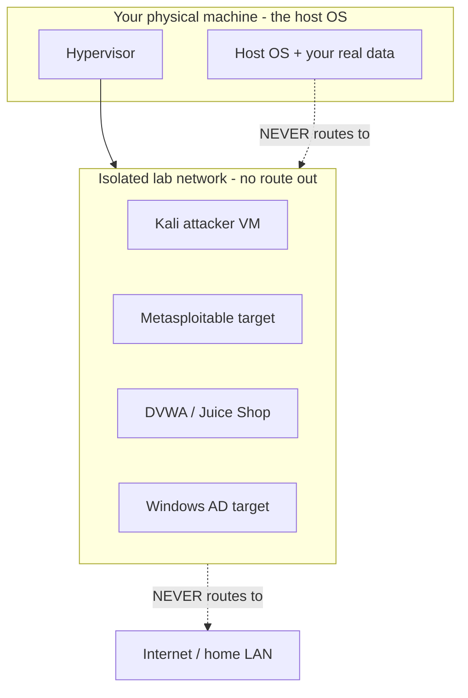
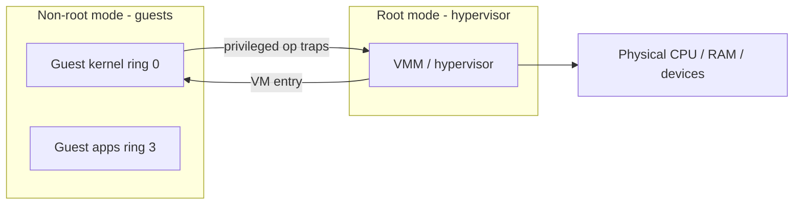
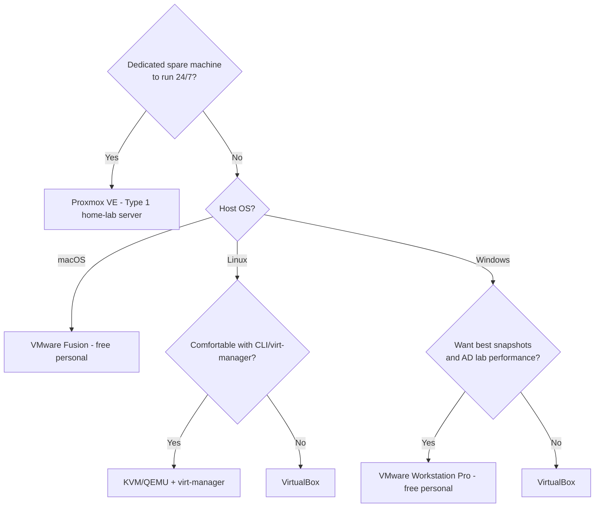
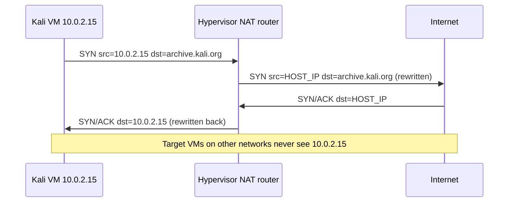
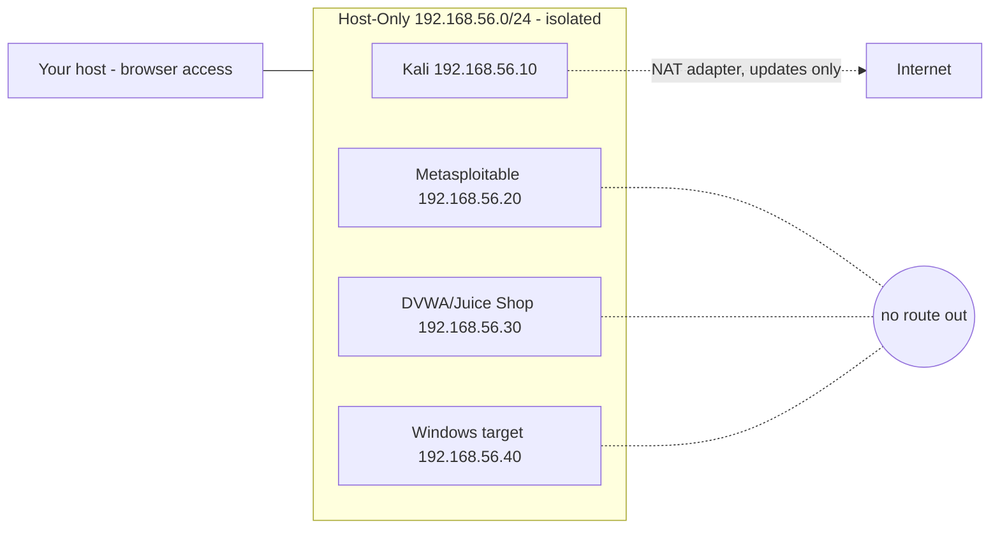
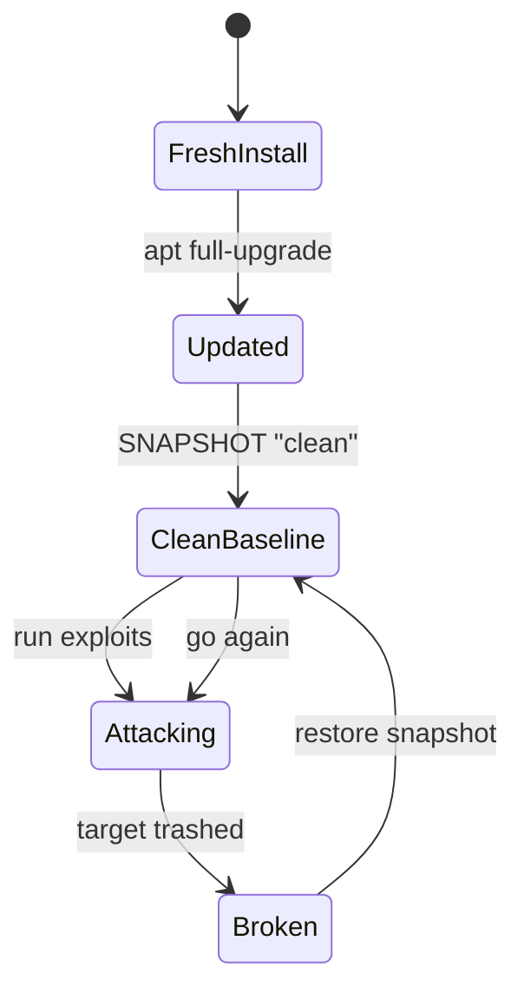
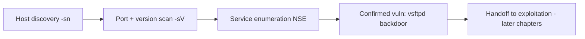
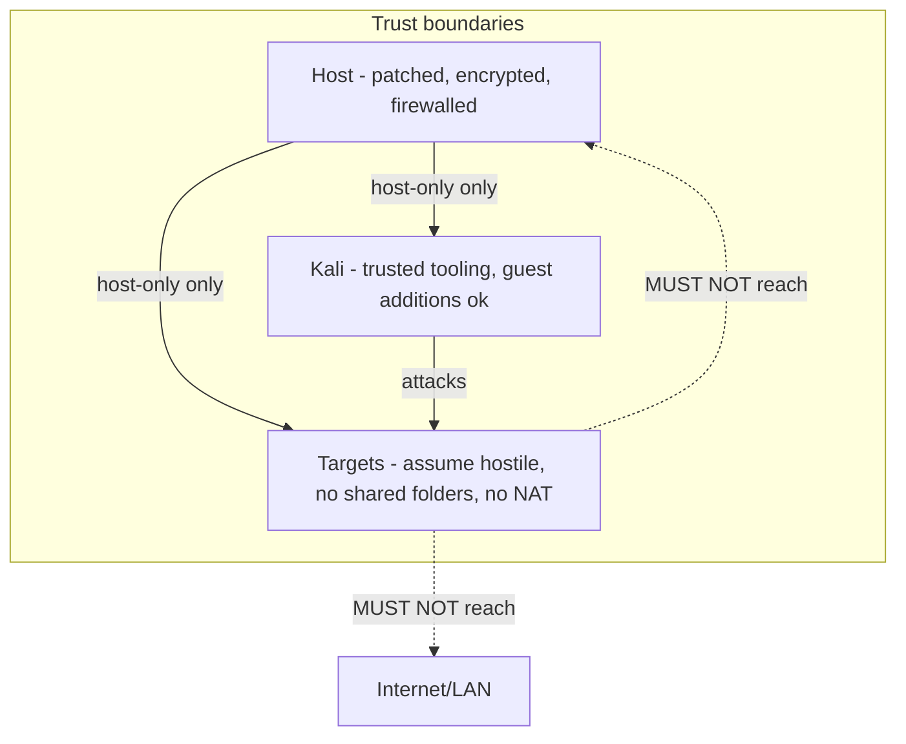

**Level:** Intermediate · **Track:** Foundations · **Read time:** 185 min

This is Chapter 6 of the Security Foundations series — Notebook 8. Chapter 5 drew the legal boundary that separates a paid engagement from a crime: authorization, scope, and rules of engagement. This chapter gives you the one place where none of that paperwork is required — a lab you own, on hardware you own, air-gapped from anything you do not. Everything you break here, you are allowed to break.

A lab is not optional. You cannot learn offensive security by reading, any more than you can learn to swim from a textbook. Every technique in every later chapter — port scanning, SQL injection, privilege escalation, Kerberoasting, buffer overflows — assumes you have a machine to attack and a machine to attack *from*, both under your control, both disposable. The single most common reason beginners stall is that they never build this, so every lesson stays abstract. By the end of this chapter you will have a working attacker VM, at least one vulnerable target, an isolated network the two share, and a snapshot workflow that lets you blow the whole thing up and rebuild it in under a minute.

We build from the absolute bottom — what a hypervisor actually is and why your CPU can run one — up through the practical choices (which hypervisor, which attacker distro, how much RAM), into networking done at the level where you understand *why* NAT hides your VM and host-only does not, and finish with real vulnerable targets, a fully worked recon lab, and the host-hardening rules that stop your practice lab from becoming a genuine liability on your home network.

---

## Part 1: Why a Lab, and the Golden Rule of Isolation

Before a single ISO is downloaded, internalise the one rule that governs everything else in this chapter: **the lab is a blast radius, and the blast radius must be contained.**

You will intentionally run software that is broken. Metasploitable is a Linux box built to be trivially exploitable. DVWA ships with SQL injection, command injection, and file upload holes wired directly to the front page. When you run these, you are placing a machine on your network whose entire purpose is to fall over when touched. If that machine can reach your home router, your NAS, your family's laptops, or the internet, you have not built a lab — you have built an incident.

There is a second, subtler risk. Vulnerable VMs downloaded from the internet are, definitionally, trust-you-shouldn't blobs. A VulnHub image is someone's disk file. Malware analysis labs run live malware on purpose. The correct mental model is: **assume every target VM is already compromised by someone smarter than you, and design the network so that assumption costs you nothing.**



**The golden rule, stated operationally:** vulnerable targets live on a network that has no path to the internet or to your host's real data. The attacker VM may occasionally need internet (to `apt update`, to pull a tool), but the targets never do, and the two capabilities are kept on separate virtual adapters so you can turn internet off with one click before you start attacking. Part 5 shows exactly how.

**Why this matters even at home.** People assume "it's just my house, who cares." Two failure modes bite regularly: (1) a worm-class exploit (EternalBlue against an unpatched Windows target) that scans and spreads to other hosts on a flat network — if your target shares a subnet with your real laptop, it will try your real laptop; (2) a target VM that phones home or gets co-opted into a botnet because you gave it NAT internet access "just to update it." Isolation removes both by construction.

---

## Part 2: How Virtualization Actually Works

You cannot make good hypervisor and networking choices without understanding what a virtual machine *is* at the hardware level. This section is the "from scratch" foundation everything else rests on.

### 2.1 The problem virtualization solves

An operating system is written assuming it owns the machine: it expects to run privileged CPU instructions (set up page tables, handle interrupts, talk to devices), and it expects to be the only one doing so. You cannot naively run two operating systems at once because both would fight over that privileged state. Virtualization is the set of tricks — mostly in hardware now — that lets one physical CPU present itself as several independent "virtual" CPUs, each convinced it owns a whole machine.

### 2.2 Rings, root mode, and the hypervisor

x86 CPUs have privilege *rings*. Ring 0 is the kernel (full privilege); ring 3 is userland (your programs). A normal OS kernel runs in ring 0. The problem: a guest OS *also* wants ring 0, but it can't be trusted with the real ring 0 or it could trample the host and other guests.

Modern CPUs solve this with hardware virtualization extensions — **Intel VT-x** and **AMD-V** (AMD SVM). They add a new dimension *orthogonal* to rings: **root mode** (the hypervisor) and **non-root mode** (guests). A guest kernel can run in its own ring 0 *inside* non-root mode, feeling fully privileged, while the CPU silently traps the handful of operations that would actually affect global machine state and hands them to the hypervisor to emulate safely. This trap-and-emulate handoff is a **VM exit** (guest → hypervisor) and **VM entry** (hypervisor → guest).



**Two more hardware pieces make this fast:**

- **EPT / NPT (Extended / Nested Page Tables):** the guest thinks it manages physical RAM, but its "physical" addresses are themselves virtual to the host. A second layer of page tables in hardware translates guest-physical → host-physical without the hypervisor trapping every memory access. Without this, memory virtualization was slow (shadow page tables); with it, it's near-native.
- **IOMMU (Intel VT-d / AMD-Vi):** lets the hypervisor safely give a guest *direct* access to a physical device (a GPU, a Wi-Fi card) with DMA remapping, so the device can't scribble over host memory. This is what makes "PCI passthrough" of a Wi-Fi adapter into Kali possible.

### 2.3 Type 1 vs Type 2 hypervisors

This is the distinction that decides which product you install.

| | Type 1 (bare-metal) | Type 2 (hosted) |
|---|---|---|
| Runs on | Directly on hardware | On top of a host OS |
| Examples | ESXi, Proxmox, Hyper-V*, KVM | VirtualBox, VMware Workstation/Fusion |
| Boot | The hypervisor *is* the OS you boot | You boot Windows/macOS/Linux, then launch it |
| Performance | Higher, less overhead | Slightly lower, shares host resources |
| Best for | Dedicated lab server, always-on targets | Laptop/desktop you also use for everything else |
| Setup effort | Higher | Install like any app |

*Hyper-V is a hybrid: even the "host" Windows becomes a privileged VM once Hyper-V is enabled, so it behaves like Type 1 underneath a Windows front-end.

**Practical takeaway for a first lab:** if this is your daily-driver laptop, use a **Type 2** hypervisor (VirtualBox is free; VMware Workstation Pro is now free for personal use too). If you have a spare machine to dedicate, **Proxmox** (Type 1, free, KVM-based, web-managed) is the professional home-lab standard.

### 2.4 Full virtualization vs paravirtualization vs containers

Three different isolation technologies you will meet:

- **Full virtualization (VMs):** the guest runs an unmodified OS kernel on virtual hardware. Strongest isolation, highest overhead. This is VirtualBox/VMware/KVM. Use for OS-level targets (Windows AD, Metasploitable, a full Kali).
- **Paravirtualization / paravirtual drivers:** the guest knows it's virtual and uses special drivers (`virtio` on KVM, VMware Tools, VirtualBox Guest Additions) to talk to the hypervisor efficiently instead of pretending to drive real hardware. You almost always install these — they give you clipboard sharing, better disk/network throughput, and dynamic resolution.
- **Containers (Docker/LXC):** *not* virtual machines. They share the host kernel and isolate only the process/filesystem namespace. Near-zero overhead, weaker isolation. Perfect for spinning up a single vulnerable *web app* (DVWA, Juice Shop) in seconds; wrong for kernel-level targets or anything you need strong isolation from. Part 9 covers these.

**Security relevance of the VM-vs-container distinction:** a container escape (bad kernel bug, misconfigured `--privileged`) drops the attacker straight onto your host kernel, whereas a VM escape requires breaking the hypervisor itself — a far rarer and harder bug. This is exactly why you never run untrusted *malware* in a bare Docker container and call it isolated.

---

## Part 3: Choosing Your Hypervisor

You have five realistic options. Pick based on your host OS and whether you want a laptop lab or a dedicated server.

### 3.1 The five options compared

| Hypervisor | Type | Cost | Host OS | Strengths | Watch-outs |
|---|---|---|---|---|---|
| **VirtualBox** | 2 | Free (GPL; Extension Pack PUEL) | Win/mac/Linux | Easiest start, cross-platform, huge docs | Slower nested/AD labs; Extension Pack licence for USB2/3 |
| **VMware Workstation Pro** | 2 | Free for personal use | Win/Linux | Best snapshots/clones, rock-solid networking, fast | Closed source |
| **VMware Fusion** | 2 | Free for personal use | macOS (incl. Apple Silicon) | Best macOS option, ARM guest support | ARM host runs ARM guests only |
| **Hyper-V** | 1/hybrid | Free (Win Pro/Ent) | Windows | Native, fast, no extra install | Not on Win Home; networking is fiddlier; conflicts with VirtualBox pre-6.0 |
| **KVM/QEMU (+virt-manager)** | 1 | Free (open source) | Linux | Native speed, scriptable, `virtio` | Linux only; steeper learning curve |
| **Proxmox VE** | 1 | Free (paid support) | Bare metal | Web UI, clustering, always-on lab, KVM+LXC | Needs dedicated hardware |

### 3.2 A decision tree



### 3.3 First thing to check: is virtualization enabled?

Nothing works until VT-x/AMD-V is on. It is frequently disabled in BIOS/UEFI from the factory.

On Linux, one command tells you if the CPU supports it:

```bash
# Count CPU cores that advertise a virtualization flag.
# vmx = Intel VT-x, svm = AMD-V. Non-zero = supported.
egrep -c '(vmx|svm)' /proc/cpuinfo
```

```console
$ egrep -c '(vmx|svm)' /proc/cpuinfo
8
```

Then confirm KVM can actually use it:

```bash
sudo apt install cpu-checker -y
sudo kvm-ok
```

```console
$ sudo kvm-ok
INFO: /dev/kvm exists
KVM acceleration can be used
```

On Windows, open **Task Manager → Performance → CPU** and look for **"Virtualization: Enabled."** If it says *Disabled*, reboot into UEFI/BIOS and enable **Intel VT-x / Intel Virtualization Technology** (and **VT-d** if present) or **SVM Mode** (AMD). If it's enabled in BIOS but Windows still says disabled, Hyper-V or Memory Integrity (Core Isolation) may be holding VT-x captive — see the pitfalls in Part 12.

**A common trap on Windows:** VirtualBox and Hyper-V historically fought over VT-x. If you enable Hyper-V (or WSL2, or Windows Sandbox, or Memory Integrity — all of which turn on the hypervisor platform), VirtualBox may drop to painfully slow software emulation or refuse to start 64-bit guests. Recent VirtualBox (7.x) can run *on top of* Hyper-V, but at reduced speed. If you're serious and on Windows, pick one stack.

---

## Part 4: Installing Your Attacker Machine — Kali & Parrot

Your attacker VM is the box you launch attacks *from*. Two distributions dominate: **Kali Linux** and **Parrot Security OS**. Both are Debian-based, both ship hundreds of pre-installed offensive tools, both are free.

### 4.1 Kali vs Parrot

| | Kali Linux | Parrot Security |
|---|---|---|
| Base | Debian testing | Debian stable |
| Maintainer | Offensive Security | Parrot Security team |
| Default desktop | Xfce | MATE |
| Footprint | Heavier | Lighter (runs on less RAM) |
| Anonymity tooling | Add-on | AnonSurf, Tor built in |
| Reputation | Industry default; most tutorials assume it | Strong, slightly less ubiquitous |
| Sandboxing | — | Firejail by default |

**Recommendation for a first lab:** use **Kali**, purely because virtually every tutorial, course, and later chapter in this series assumes Kali paths and package names. Parrot is an excellent choice once you know your way around; nothing here is Kali-exclusive.

### 4.2 The right way to get Kali onto a VM

Kali offers **pre-built VM images** (already-configured VirtualBox/VMware/Hyper-V/QEMU appliances) and a **plain ISO installer**. For a lab, the pre-built image is faster and avoids installer pitfalls; the ISO teaches you more and gives full disk-encryption control. We'll cover the pre-built path (fastest) and note the ISO differences.

**Always verify the download.** Kali images are a prime supply-chain target. Verify the SHA-256 against the value published on kali.org over HTTPS.

```bash
# Compute the hash of what you downloaded...
sha256sum kali-linux-2026.x-virtualbox-amd64.7z
# ...then compare, byte-for-byte, against the checksum on the official site.
```

```console
$ sha256sum kali-linux-2026.2-virtualbox-amd64.7z
b8f9...e21a  kali-linux-2026.2-virtualbox-amd64.7z
```

If the string does not match the site exactly, delete it and re-download — do not import it. For the ISO, Kali also signs the checksum file with a GPG key; verifying that signature (`gpg --verify`) proves the checksum itself wasn't tampered with, which is the stronger check.

**Import the pre-built VirtualBox image:**

```bash
# 7z-extract the appliance, then either double-click the .vbox
# or import from the CLI:
7z x kali-linux-2026.2-virtualbox-amd64.7z
VBoxManage registervm "$(pwd)/kali-linux-2026.2-virtualbox-amd64/kali-linux-2026.2-virtualbox-amd64.vbox"
```

Default credentials for the pre-built image are `kali` / `kali`. **Change the password immediately** (`passwd`) — a default-cred attacker box on your network is exactly the kind of thing this chapter tells you not to have.

### 4.3 Installing from the ISO (the fuller path)

If you install from ISO, the choices that matter for a lab:

- **Guided partitioning, entire disk** is fine for a disposable lab VM. Choose **encrypted LVM** if the VM will hold engagement data or client scope — full-disk encryption means a stolen laptop doesn't leak your loot.
- **Software selection:** the default `kali-linux-default` metapackage is the right middle ground. `kali-linux-everything` is enormous and mostly wasted; `kali-linux-headless` is great for a scriptable, GUI-less attacker you SSH into.
- **First boot, always update:**

```bash
sudo apt update && sudo apt full-upgrade -y
```

### 4.4 Guest Additions / VMware Tools — install them, always

The paravirtual guest tools give you shared clipboard, drag-and-drop, auto-resizing display, and much faster disk/network I/O. On Kali under VirtualBox, the tooling is packaged:

```bash
sudo apt update
sudo apt install -y virtualbox-guest-x11
sudo reboot
```

On VMware, install `open-vm-tools-desktop`:

```bash
sudo apt install -y open-vm-tools-desktop
```

**Why it matters operationally:** without guest additions, copy-pasting a payload from your host notes into Kali is a nightmare, and screen resolution is stuck at a tiny default. It's a five-minute fix that saves hours.

### 4.5 A minimal post-install tool sanity check

```bash
# These should all resolve — the core of everything in later chapters.
which nmap nikto sqlmap hydra gobuster ffuf metasploit-framework 2>/dev/null
msfconsole -v
nmap --version
```

```console
$ nmap --version
Nmap version 7.9x ( https://nmap.org )
Platform: x86_64-pc-linux-gnu
Compiled with: liblua-5.4.6 openssl-3.x ...
```

If a tool is missing (Kali trimmed some from `default`), install on demand: `sudo apt install <tool>`.

---

## Part 5: Virtual Networking — The Part Everyone Gets Wrong

This is the most important technical section in the chapter. Get networking wrong and either your lab doesn't work (attacker can't reach target) or it's dangerous (target can reach the internet). Every hypervisor offers roughly the same four modes under different names.

### 5.1 The four network modes

| Mode | VirtualBox name | VMware name | VM can reach internet? | VM can reach host? | Other VMs reach it? | Reachable from LAN? |
|---|---|---|---|---|---|---|
| **NAT** | NAT | NAT | ✅ (via host, hidden) | ⚠️ only via port-forward | ❌ | ❌ |
| **NAT Network** | NAT Network | (shared) | ✅ | ⚠️ | ✅ (same NAT net) | ❌ |
| **Bridged** | Bridged Adapter | Bridged | ✅ (own LAN IP) | ✅ | ✅ | ✅ **danger** |
| **Host-Only** | Host-only Adapter | Host-only | ❌ | ✅ | ✅ | ❌ |
| **Internal** | Internal Network | LAN segment | ❌ | ❌ | ✅ | ❌ |

Read that table until it's second nature. The two you build the lab from are **Host-Only** (or **Internal**) for the isolated attack network, and **NAT** as a *temporary, separate* adapter on the attacker only when it needs updates.

### 5.2 What NAT actually does (packet level)

In NAT mode the hypervisor runs a tiny virtual router. Your VM gets a private address like `10.0.2.15`; the hypervisor rewrites the source address of outbound packets to the host's IP (source NAT), tracks the translation, and rewrites replies back. The outside world — including your target VMs — never sees `10.0.2.15`. That's *why* a NAT'd target is invisible to your Kali box: they're on different, non-routed NAT networks.



NAT is the *safe* way to give the attacker internet: it's outbound-only, nothing on your LAN can initiate a connection back in, and it's on its own network away from targets.

### 5.3 Why Bridged is the mode you almost never want for targets

Bridged mode connects the VM's virtual NIC directly onto your physical LAN. The VM pulls a real IP from your home router (`192.168.1.x`) and is a first-class citizen on your home network — your laptop, phone, printer, and router can all reach it, and it can reach them and the internet. For a *vulnerable target*, that's catastrophic: you've put a deliberately-broken machine on the same network as your real devices. For the *attacker* it's also usually wrong — you don't want your home LAN devices in scope by accident. Use bridged only deliberately, e.g. testing a device you own that's physically on the LAN.

### 5.4 Host-Only vs Internal

- **Host-Only:** a private network shared between the VMs *and the host*. The host gets a virtual adapter on it (e.g. `192.168.56.1`). VMs can talk to each other and to the host, but there is no route to the internet or the wider LAN. Great default for a lab because you (the host) can also reach the target's web UI in your browser.
- **Internal:** like host-only but the host is *not* on the network at all — only VM-to-VM. Maximum isolation; use it when you want the target completely sealed off even from your host (e.g. live malware).

### 5.5 The recommended lab topology

The clean pattern for an attacker + targets lab:

- **Attacker (Kali):** two adapters — Adapter 1 = **Host-Only** (`192.168.56.0/24`) to reach targets and the host; Adapter 2 = **NAT** for updates, which you **disable before attacking**.
- **Targets (Metasploitable, DVWA, Windows):** one adapter only — **Host-Only** on the same `192.168.56.0/24`. No NAT, ever. They can only be reached from Kali and your host.



**To create the host-only network in VirtualBox (CLI):**

```bash
# Create a host-only network and give the host adapter an IP.
VBoxManage hostonlyif create                       # creates vboxnet0
VBoxManage hostonlyif ipconfig vboxnet0 --ip 192.168.56.1 --netmask 255.255.255.0
# Attach a VM's first NIC to it:
VBoxManage modifyvm "Kali" --nic1 hostonly --hostonlyadapter1 vboxnet0
# Give Kali a NAT NIC for updates on adapter 2:
VBoxManage modifyvm "Kali" --nic2 nat
```

**In VMware Workstation** the equivalent is Virtual Network Editor → add a *Host-only* network (VMnet1) with DHCP off, then set each VM's adapter to that VMnet. The concept is identical.

**Verify isolation before you trust it.** From a target VM, prove it cannot reach the internet:

```bash
# On Metasploitable / DVWA host — this MUST fail.
ping -c 2 8.8.8.8
```

```console
$ ping -c 2 8.8.8.8
PING 8.8.8.8 (8.8.8.8) 56(84) bytes of data.
--- 8.8.8.8 ping statistics ---
2 packets transmitted, 0 received, 100% packet loss
```

100% packet loss is the *correct, healthy* result for a target. If it replies, your target has a route out — stop and fix the adapter before doing anything else.

---

## Part 6: Snapshots, Clones & Reset Discipline

The superpower of a VM lab is time travel. A **snapshot** freezes the exact disk + memory state of a VM; you can attack a target into oblivion and restore to pristine in seconds.

### 6.1 Snapshots vs clones

- **Snapshot:** a point-in-time saved state of *one* VM, stored as a delta on top of the base disk. Cheap, fast, reversible. Take one right after install-and-update ("clean baseline") and before every risky action.
- **Full clone:** an independent copy of the entire VM. Use to hand out identical targets or keep a permanent golden image.
- **Linked clone:** a new VM that shares the parent's base disk and only stores its own changes. Space-efficient way to spin up ten identical targets from one image; the trade-off is they depend on the parent.



### 6.2 The workflow, in commands (VirtualBox)

```bash
# Take a clean baseline snapshot right after setup.
VBoxManage snapshot "Metasploitable2" take "clean-baseline" --description "Fresh, updated, pre-attack"

# List snapshots.
VBoxManage snapshot "Metasploitable2" list

# After you've wrecked the target, restore to clean (VM must be powered off).
VBoxManage controlvm "Metasploitable2" poweroff 2>/dev/null
VBoxManage snapshot "Metasploitable2" restore "clean-baseline"

# Make a full clone as a golden master.
VBoxManage clonevm "Metasploitable2" --name "Metasploitable2-golden" --register --mode all
```

**Discipline that saves you:** snapshot **before** you run an exploit, not after. The moment you realise you need a clean box is the moment it's already dirty. A one-line habit — `VBoxManage snapshot <vm> take pre-<thing>` — before each experiment turns "reinstall everything" into "restore, 3 seconds."

**Blue-team parallel worth noting:** this restore-to-known-good loop is exactly how enterprise incident response rebuilds compromised hosts from a gold image, and how malware analysts get a fresh detonation environment for each sample. You're practising a real operational pattern.

---

## Part 7: Vulnerable Targets — What to Attack

An attacker VM with nothing to attack is useless. Here are the canonical targets, grouped by what they teach.

### 7.1 The target catalogue

| Target | Type | Teaches | Difficulty | Get it from |
|---|---|---|---|---|
| **Metasploitable 2** | Linux VM | Service exploitation, weak creds, Metasploit basics | Beginner | Rapid7 / SourceForge |
| **Metasploitable 3** | Win/Linux (built via Packer/Vagrant) | Modern-ish services, AD-adjacent, patching gaps | Intermediate | Rapid7 GitHub |
| **DVWA** | PHP web app | SQLi, XSS, CSRF, command injection, file upload | Beginner | GitHub / Docker |
| **OWASP Juice Shop** | Modern JS web app | OWASP Top 10, API flaws, JWT, gamified challenges | Beginner→Adv | GitHub / Docker |
| **bWAPP / WebGoat / Mutillidae** | Web apps | Broad web-vuln coverage, lessons | Beginner | Docker / OWASP |
| **VulnHub boxes** | Full VM images | End-to-end recon→root, boot2root | Varies | vulnhub.com |
| **HackTheBox / TryHackMe** | Cloud/VPN targets | Realistic, curated, ranked | Varies | Online (VPN) |
| **GOAD (Game of Active Directory)** | Multi-VM AD lab | Kerberoasting, AD attack paths, lateral movement | Advanced | GitHub (Ludus/Vagrant) |
| **PortSwigger Web Security Academy** | Hosted labs | Every web-vuln class, free, authoritative | Beginner→Adv | Online (browser) |

### 7.2 Local VM targets vs hosted platforms

Two philosophies, both worth using:

- **Local VMs (Metasploitable, VulnHub, GOAD):** you own the network, learn the full stack from network scan to root, and there's no time limit or VPN. Best for understanding *why* things work and for practising the full kill chain. Downside: you manage them.
- **Hosted platforms (HackTheBox, TryHackMe, PortSwigger):** zero setup, curated difficulty, community write-ups, and legally sanctioned targets. Best for structured progression and for web-only practice (PortSwigger is the gold standard and entirely free). Downside: you're on their network on their terms.

Use hosted platforms to learn *technique* and local VMs to learn *infrastructure and isolation*. Later chapters lean on both.

### 7.3 Deploying Metasploitable 2

Metasploitable 2 is the classic first target — an Ubuntu box with deliberately ancient, misconfigured services (vsftpd backdoor, weak Samba, open NFS, default Tomcat creds).

```bash
# Download the official image, then unzip.
unzip metasploitable-linux-2.0.0.zip
# It ships as a VMDK. Create a VirtualBox VM around it:
VBoxManage createvm --name "Metasploitable2" --ostype Ubuntu_64 --register
VBoxManage modifyvm "Metasploitable2" --memory 512 --nic1 hostonly --hostonlyadapter1 vboxnet0
VBoxManage storagectl "Metasploitable2" --name "SATA" --add sata
VBoxManage storageattach "Metasploitable2" --storagectl "SATA" --port 0 --device 0 --type hdd \
  --medium "Metasploitable2-Linux/Metasploitable.vmdk"
VBoxManage startvm "Metasploitable2" --type headless
```

Default login is `msfadmin` / `msfadmin`. **Only ever run it host-only.** Its whole design is to be broken; on a routable network it's a hazard. Snapshot it clean immediately.

### 7.4 Deploying DVWA and Juice Shop the fast way (Docker)

For web-app targets you don't need a whole VM — a container is faster:

```bash
# DVWA — Damn Vulnerable Web Application
docker run --rm -it -p 127.0.0.1:8080:80 vulnerables/web-dvwa
# Browse to http://127.0.0.1:8080  (login admin/password, click "Create/Reset Database")

# OWASP Juice Shop
docker run --rm -p 127.0.0.1:3000:3000 bkimminich/juice-shop
# Browse to http://127.0.0.1:3000
```

**Note the `127.0.0.1:` prefix in the port mapping.** Binding to loopback means the vulnerable app is reachable *only from your host*, not from your whole LAN — a small isolation habit that matters. If you want your Kali VM to reach it, run the container on a host-only-attached VM or expose it deliberately on the host-only interface, not `0.0.0.0`.

### 7.5 A note on Active Directory targets (GOAD)

Once you reach the Windows/AD notebooks, you'll want a *realistic* domain to attack. **GOAD (Game of Active Directory)** stands up a multi-VM forest — domain controllers, member servers, misconfigurations wired for Kerberoasting, AS-REP roasting, delegation abuse, and trust attacks. It's heavy (needs ~24–32 GB RAM to run comfortably) and is best on a dedicated Proxmox/ESXi host via its Ludus/Vagrant automation. Flagged here so you know the destination; the AD-fundamentals notebook builds up to it.

---

## Part 8: Hands-On Lab — Recon Against Metasploitable

Time to actually use the lab. This is a complete, reproducible first engagement against Metasploitable 2 from Kali, purely on the host-only network. It introduces **nmap** from scratch, because it's the tool you'll reach for on literally every engagement.

> **Ethics/scope note:** every command below targets *your own* Metasploitable VM on your isolated host-only network. Running these against any host you do not own is exactly the CFAA/Computer-Misuse-Act violation Chapter 5 described. The lab exists so you never have to.

### 8.1 nmap from zero

**What it is:** nmap (Network Mapper) is the de-facto network scanner. It sends crafted packets to a host and infers, from the responses, which hosts are up, which TCP/UDP ports are open, what service and version listens on each, and often the OS. It's free, open source, and pre-installed on Kali.

**Why it exists:** before you can exploit a service you must know it's there. nmap turns "there's a box at 192.168.56.20" into "it runs vsftpd 2.3.4 on 21, OpenSSH 4.7 on 22, Apache 2.2.8 on 80…" — the map you attack from.

**Core anatomy of an invocation:** `nmap [scan type] [options] [target]`.

### 8.2 Step one — find the target

```bash
# Discover live hosts on the host-only subnet (no port scan, just host discovery).
#  -sn = "ping scan": host discovery only, skip port scan.
sudo nmap -sn 192.168.56.0/24
```

```console
$ sudo nmap -sn 192.168.56.0/24
Starting Nmap 7.9x ( https://nmap.org )
Nmap scan report for 192.168.56.1   (host)
Host is up (0.00021s latency).
Nmap scan report for 192.168.56.10  (kali - self)
Host is up.
Nmap scan report for 192.168.56.20
Host is up (0.00048s latency).
MAC Address: 08:00:27:AB:CD:EF (Oracle VirtualBox virtual NIC)
Nmap done: 256 IP addresses (3 hosts up) scanned in 2.15s
```

`192.168.56.20` is our Metasploitable target.

### 8.3 Step two — scan its ports

```bash
# Full connect + version + default scripts + OS guess on the target.
#  -sS = SYN "stealth" scan (needs root; half-open, fast).
#  -sV = probe open ports for service/version.
#  -O  = OS detection.
#  -p- = all 65535 TCP ports (default is top 1000).
#  -T4 = timing template 4 (faster; fine on a LAN).
#  -oN = save normal-format output to a file.
sudo nmap -sS -sV -O -p- -T4 -oN metasploitable_scan.txt 192.168.56.20
```

```console
$ sudo nmap -sS -sV -O -p- -T4 192.168.56.20
Nmap scan report for 192.168.56.20
Host is up (0.00045s latency).
Not shown: 65505 closed ports
PORT     STATE SERVICE     VERSION
21/tcp   open  ftp         vsftpd 2.3.4
22/tcp   open  ssh         OpenSSH 4.7p1 Debian 8ubuntu1 (protocol 2.0)
23/tcp   open  telnet      Linux telnetd
25/tcp   open  smtp        Postfix smtpd
53/tcp   open  domain      ISC BIND 9.4.2
80/tcp   open  http        Apache httpd 2.2.8 ((Ubuntu) DAV/2)
139/tcp  open  netbios-ssn Samba smbd 3.X - 4.X
445/tcp  open  netbios-ssn Samba smbd 3.X - 4.X
3306/tcp open  mysql       MySQL 5.0.51a-3ubuntu5
5432/tcp open  postgresql  PostgreSQL DB 8.3.0 - 8.3.7
6667/tcp open  irc         UnrealIRCd
8180/tcp open  http        Apache Tomcat/Coyote JSP engine 1.1
MAC Address: 08:00:27:AB:CD:EF (Oracle VirtualBox virtual NIC)
Service Info: OSs: Unix, Linux
```

Every line is an attack surface. `vsftpd 2.3.4` is the infamous backdoored FTP daemon; `UnrealIRCd` on 6667 shipped a trojaned release; Tomcat on 8180 has default manager creds.

### 8.4 Step three — targeted enumeration with a script

nmap ships the **NSE (Nmap Scripting Engine)** — Lua scripts for deeper checks. Point one at the FTP backdoor:

```bash
#  --script = run a specific NSE script.
#  -p 21    = only the FTP port.
sudo nmap --script ftp-vsftpd-backdoor -p 21 192.168.56.20
```

```console
$ sudo nmap --script ftp-vsftpd-backdoor -p 21 192.168.56.20
PORT   STATE SERVICE
21/tcp open  ftp
| ftp-vsftpd-backdoor:
|   VULNERABLE:
|   vsFTPd version 2.3.4 backdoor
|     State: VULNERABLE (Exploitable)
|     Description: vsFTPd version 2.3.4 backdoor, this was reported on 2011-07-04.
|_    Disclosure date: 2011-07-03
```

You now have a confirmed, exploitable finding — the natural handoff into the exploitation chapters. That's the whole point: the lab took you from "a box exists" to "a specific, verified vulnerability" using only your own hardware.

### 8.5 Lab checkpoint

You have proven the full early kill chain in miniature:



Restore the Metasploitable snapshot when you're done, so the next session starts clean.

### 8.6 nmap flag reference (the ones you'll actually use)

Because this is the tool you'll run in every later chapter, here is the working subset of flags, each explained — not just listed.

| Flag | Meaning | When to reach for it |
|---|---|---|
| `-sS` | TCP SYN "half-open" scan (needs root) | Default fast scan; never completes the handshake |
| `-sT` | Full TCP connect scan | When you're not root (uses the OS connect()) |
| `-sU` | UDP scan | Finding DNS/SNMP/TFTP; slow, run on a short port list |
| `-sn` | Host discovery only, no ports | Sweep a subnet to find live hosts |
| `-Pn` | Skip host discovery, assume up | Target that drops pings but is really there |
| `-sV` | Service/version detection | Turn "port 80 open" into "Apache 2.2.8" |
| `-O` | OS fingerprinting | Guess the operating system from TCP/IP quirks |
| `-p-` | All 65535 ports | Thorough; the default only scans the top 1000 |
| `-p 21,80,443` | Specific ports | Targeted follow-up |
| `-A` | Aggressive: `-sV -O` + scripts + traceroute | One-shot deep scan of a known target |
| `--script <name>` | Run an NSE script | Vuln checks, brute force, enumeration |
| `-T0..T5` | Timing template (paranoid→insane) | `-T4` on a LAN; lower to be quiet/evade IDS |
| `-oN / -oG / -oX / -oA` | Save normal/grepable/XML/all formats | Always save output for later parsing |
| `-v` / `-vv` | Increase verbosity | Watch progress on long scans |

**A quick UDP pass** (UDP services hide from a TCP-only scan — SNMP on 161 is a classic post-exploitation goldmine):

```bash
#  -sU  = UDP scan.  --top-ports 20 = the 20 most common UDP ports (full UDP is very slow).
sudo nmap -sU --top-ports 20 -T4 192.168.56.20
```

```console
PORT    STATE         SERVICE
53/udp  open          domain
69/udp  open|filtered tftp
137/udp open          netbios-ns
161/udp open          snmp
```

`161/udp snmp` is a frequent easy win — default community strings (`public`/`private`) often leak the whole device config.

---

## Part 9: Container & Cloud Labs

VMs aren't the only way to build targets. Two lighter or larger-scale patterns are worth knowing.

### 9.1 Docker — instant, disposable app targets

**What Docker is (from scratch):** Docker packages an application plus its dependencies into an *image*; a running instance is a *container*. Unlike a VM, a container shares the host kernel and isolates only namespaces (process, network, filesystem, users) and cgroups (resource limits). Result: it starts in milliseconds and uses a fraction of the RAM of a VM.

**Why it's great for a web lab:** you can stand up ten vulnerable web apps without ten operating systems. Compose them:

```yaml
# docker-compose.yml — a small web-vuln lab
services:
  dvwa:
    image: vulnerables/web-dvwa
    ports: ["127.0.0.1:8080:80"]
  juiceshop:
    image: bkimminich/juice-shop
    ports: ["127.0.0.1:3000:3000"]
  webgoat:
    image: webgoat/webgoat
    ports: ["127.0.0.1:8081:8080"]
```

```bash
docker compose up -d      # start all three, detached
docker compose ps          # see what's running
docker compose down        # tear it all down cleanly
```

**Isolation caveat, stated plainly:** containers are *not* a strong security boundary against a determined attacker who gets code execution inside them, and `--privileged` or a mounted Docker socket makes escape to the host trivial. For deliberately vulnerable *web apps* on your own box this is an acceptable trade for the convenience. For live malware or kernel exploits, use a real VM with host-only/internal networking.

### 9.2 Cloud labs — when you outgrow the laptop

For AD forests, large networks, or always-on targets, a cloud or dedicated-server lab scales better than a laptop:

- **A single cheap VPS** running Docker gives you an always-available web target reachable over a WireGuard tunnel — never expose vulnerable apps to the open internet; put them behind a VPN.
- **AWS/Azure free-tier or small instances** let you build isolated VPCs with security groups acting as your firewall — a good way to *also* learn cloud-security fundamentals while building the lab.
- **Ludus** (open-source, KVM-based) automates spinning up entire ranges (AD, GOAD, custom) from templates — the modern successor to hand-built VM labs, ideal on a dedicated Proxmox box.

**A hard rule for cloud labs:** a vulnerable box with a public IP will be found and compromised by internet-wide scanners within *minutes*. Always gate cloud targets behind a VPN (WireGuard/OpenVPN) and restrictive security-group rules that allow only your own IP. The isolation principle from Part 1 doesn't relax just because the hardware is someone else's.

---

## Part 10: Sizing, Storage & Performance

A lab that swaps to death or fills your disk is a lab you won't use. Rough sizing guidance.

### 10.1 RAM and CPU budget

| Lab scale | Host RAM | What runs |
|---|---|---|
| Minimum viable | 8 GB | Kali (2–4 GB) + one small target (512 MB–1 GB), one at a time |
| Comfortable | 16 GB | Kali + 2–3 targets simultaneously |
| Serious / AD | 32 GB+ | Kali + Windows DC + members (GOAD), multiple targets |

VMs reserve the RAM you assign while running. Assigning Kali 8 GB on a 16 GB laptop leaves little for the host and other VMs — over-provisioning causes host swapping and jerky everything. Give each VM the *minimum it needs to be pleasant*, not the maximum you can.

**CPU:** 2 vCPUs is plenty for most targets; give Kali 2–4. Never assign *all* host cores to VMs — the host OS and hypervisor need headroom.

### 10.2 Disk — dynamic vs fixed, and thin provisioning

- **Dynamically allocated (thin) disks** grow as data is written — a 40 GB Kali disk might occupy 12 GB on your host until you fill it. Space-efficient; slightly slower on heavy writes. Default choice.
- **Fixed (thick) disks** allocate the full size up front. Faster, more predictable, no fragmentation surprises. Use for I/O-heavy targets.

Snapshots grow disk usage over time (each is a delta). A long-lived VM with fifty snapshots can balloon; periodically delete stale snapshots (merging their deltas) and keep just your named baselines.

```bash
# See a VM's disk and snapshot footprint.
VBoxManage showvminfo "Kali" | grep -i -E "snapshot|state"
# Delete a stale snapshot (merges its delta down).
VBoxManage snapshot "Kali" delete "experiment-2024"
```

### 10.3 Apple Silicon and ARM note

On Apple Silicon Macs (M-series), the CPU is ARM, so you can only run **ARM64 guests** natively (via VMware Fusion, UTM/QEMU, or Parallels). Kali and Parrot both publish ARM64 images and run well. Traditional **x86-only targets** (Metasploitable 2, many VulnHub boxes) require *emulation* (slow) or are impractical — a real consideration if your only machine is an M-series Mac. Options: use x86 hosted platforms (HackTheBox/TryHackMe/PortSwigger) heavily, or run x86 targets on a cheap separate x86 machine or cloud VM.

---

## Part 11: Host Hardening — Don't Let Your Lab Attack You

The final safety layer. Your host runs the hypervisor; if the host is weak, the whole isolation model leans on nothing.

### 11.1 Rules that keep the lab a lab

- **Keep the hypervisor patched.** VM-escape bugs (rare but real — e.g. historical VirtualBox and VMware CVEs) are the one thing that breaks the VM boundary. An unpatched hypervisor is the single highest-value hole. `apt`/vendor-update it like anything else.
- **Never share host folders into an untrusted target.** Shared folders (VirtualBox `vboxsf`, VMware HGFS) punch a hole straight into your host filesystem. Fine for your trusted Kali; never for a vulnerable target or malware.
- **Default network is host-only/internal; NAT/bridged is a deliberate exception.** Make "no route out" the resting state.
- **Disable clipboard/drag-drop sharing on untrusted targets.** Bidirectional clipboard has been an escape/leak vector; keep it one-way or off for anything you don't trust.
- **Segregate lab from real data.** Ideally the lab lives on a machine (or at least a disk/user account) that holds none of your real files. On a shared laptop, at minimum keep VMs off the same volume as sensitive data and use full-disk encryption.
- **Firewall the host.** Even with host-only networks, a host firewall that drops unexpected inbound from the vboxnet/VMnet range is cheap insurance.

### 11.2 A quick host-firewall example (Linux host)

```bash
# Allow host-only subnet to reach only the services you intend (e.g. nothing inbound by default).
sudo ufw default deny incoming
sudo ufw allow out on vboxnet0
sudo ufw enable
sudo ufw status verbose
```

```console
$ sudo ufw status verbose
Status: active
Default: deny (incoming), allow (outgoing), disabled (routed)
```

### 11.3 The mental model, one diagram



**Detection & Defense Angle (for the blue-team reader):** everything you build here doubles as detection practice. A host-only network with a mirror/monitor is a controlled place to run Wireshark, Zeek, or Suricata and watch what an attack *looks like on the wire* — the exact packets a SOC analyst must recognise. Running your nmap scan from Part 8 while capturing on the target's interface, then reading the SYN flood of a `-p-` scan in Wireshark, teaches detection far better than any slide. Later blue-team chapters use this same lab to generate real telemetry: run an exploit, capture the logs, write the detection. The lab is not just an attacker's playground; it's where defenders manufacture the signal they'll later hunt for.

---

## Part 12: Common Pitfalls & Fixes

The failures that cost beginners the most hours, and how to clear them fast.

| Symptom | Likely cause | Fix |
|---|---|---|
| "VT-x is not available" / can't run 64-bit guest | Virtualization off in BIOS, or Hyper-V/WSL2/Memory Integrity holding VT-x | Enable VT-x/SVM in UEFI; on Windows disable Hyper-V/Core Isolation or switch to Hyper-V stack |
| Kali extremely slow, no 3D, tiny screen | Guest Additions/VMware Tools not installed | Install `virtualbox-guest-x11` / `open-vm-tools-desktop`, reboot |
| Attacker can't ping target | VMs on different network modes (one NAT, one host-only) | Put both on the **same** host-only/internal network |
| Target unexpectedly has internet | Target on NAT/bridged | Switch target to host-only; verify with `ping 8.8.8.8` failing |
| VirtualBox won't start after enabling WSL2 | Hyper-V platform grabbed VT-x | Disable "Virtual Machine Platform"/Hyper-V, or accept slower VBox-on-Hyper-V |
| Snapshots ate all disk | Dozens of un-merged deltas | Delete stale snapshots; keep only named baselines |
| Downloaded VM image won't import / looks off | Corrupt or tampered download | Re-verify SHA-256/GPG; re-download from official source |
| Metasploitable login fails | Wrong creds | `msfadmin` / `msfadmin`; Kali pre-built is `kali` / `kali` |
| macOS M-series: x86 target won't run | ARM host can't run x86 natively | Use ARM guests, hosted platforms, or a separate x86 box |
| Bridged VM has no IP | Bridged to wrong physical NIC / Wi-Fi bridging blocked | Bridge to the active NIC; some Wi-Fi drivers block bridging — use host-only instead |

---

## Part 13: Final Revision — The Chapter in Compressed Form

- **A lab is mandatory and must be isolated.** Vulnerable targets never get a route to the internet or your real data. Design the blast radius to be contained (Part 1).
- **Virtualization is hardware-assisted (VT-x/AMD-V).** Root/non-root mode + EPT/NPT let a guest kernel feel privileged while the CPU traps the dangerous operations to the hypervisor (Part 2).
- **Type 1 = bare-metal (Proxmox/ESXi/KVM), Type 2 = hosted (VirtualBox/VMware Workstation).** Laptop → Type 2; dedicated box → Type 1 (Part 3).
- **Attacker = Kali** (industry default). Verify downloads by hash/GPG, change default creds, install guest additions, `apt full-upgrade` (Part 4).
- **Four network modes.** NAT = safe outbound-only internet for the attacker; Bridged = danger (real LAN IP); Host-Only = isolated but host-reachable; Internal = fully sealed. Lab = targets on host-only, attacker on host-only + a disable-able NAT (Part 5).
- **Snapshot before every risky action; restore to a clean baseline in seconds.** Clones for golden masters (Part 6).
- **Targets:** Metasploitable, DVWA, Juice Shop, VulnHub, GOAD locally; HackTheBox/TryHackMe/PortSwigger hosted (Part 7).
- **You ran a real recon lab:** host discovery → version scan → NSE → confirmed vsftpd backdoor, all on your own host-only network (Part 8).
- **Docker for instant web targets; cloud/Ludus for scale — always behind a VPN** (Part 9).
- **Size RAM/CPU/disk sensibly; leave the host headroom** (Part 10).
- **Harden the host:** patch the hypervisor, no shared folders/clipboard to untrusted targets, host firewall, encryption, segregate real data (Part 11).

---

## Part 14: Cheat Sheet / Quick Reference

**Check virtualization support**

```bash
egrep -c '(vmx|svm)' /proc/cpuinfo    # Linux: non-zero = supported
sudo kvm-ok                            # Linux: KVM usable?
# Windows: Task Manager → Performance → CPU → "Virtualization: Enabled"
```

**Verify a downloaded image**

```bash
sha256sum <image>                      # compare against official site value
gpg --verify SHA256SUMS.gpg SHA256SUMS # (ISO) verify checksum signature
```

**VirtualBox networking**

```bash
VBoxManage hostonlyif create
VBoxManage hostonlyif ipconfig vboxnet0 --ip 192.168.56.1 --netmask 255.255.255.0
VBoxManage modifyvm "VM" --nic1 hostonly --hostonlyadapter1 vboxnet0
VBoxManage modifyvm "VM" --nic2 nat        # attacker updates only
```

**Snapshots & clones**

```bash
VBoxManage snapshot "VM" take "clean-baseline"
VBoxManage snapshot "VM" list
VBoxManage snapshot "VM" restore "clean-baseline"   # VM off first
VBoxManage clonevm "VM" --name "VM-golden" --register --mode all
```

**Network mode quick map**

| Need | Use |
|---|---|
| Attacker internet, no inbound | NAT |
| Attacker ↔ targets ↔ host, no internet | Host-Only |
| Fully sealed target (malware) | Internal |
| VM as real device on LAN (rare) | Bridged |

**First-attack recon (host-only only)**

```bash
sudo nmap -sn 192.168.56.0/24                 # find hosts
sudo nmap -sS -sV -O -p- -T4 -oN scan.txt <ip> # enumerate
sudo nmap --script <nse-script> -p <port> <ip> # deep check
```

**Docker web targets**

```bash
docker run --rm -p 127.0.0.1:8080:80 vulnerables/web-dvwa
docker run --rm -p 127.0.0.1:3000:3000 bkimminich/juice-shop
docker compose up -d && docker compose down
```

**Verify a target is isolated**

```bash
# On the TARGET — this MUST fail (100% packet loss).
ping -c 2 8.8.8.8
```

**Default creds to change**

| Image | Creds |
|---|---|
| Kali pre-built | `kali` / `kali` |
| Metasploitable 2 | `msfadmin` / `msfadmin` |
| DVWA | `admin` / `password` |

---

## Part 15: Practice Labs & Resources

Build these in order — each reinforces this chapter's skills:

1. **Build the core lab.** Install Kali (verify the hash), create a host-only network `192.168.56.0/24`, attach Kali (host-only + NAT) and Metasploitable 2 (host-only only). Snapshot both "clean-baseline." *Success criterion:* Kali can `ping 192.168.56.20`, and Metasploitable's `ping 8.8.8.8` fails.

2. **Reproduce the Part 8 recon.** From Kali, run the `-sn` discovery, then the full `-sS -sV -O -p-` scan, then the `ftp-vsftpd-backdoor` NSE script. Save output with `-oN`. Then restore the snapshot and confirm the box is pristine.

3. **Stand up a web-vuln stack in Docker.** Use the `docker-compose.yml` from Part 9 to run DVWA + Juice Shop + WebGoat simultaneously, each bound to loopback. Log into DVWA (`admin`/`password`) and initialise its database. *Goal:* confirm all three respond, then `docker compose down` cleanly.

4. **Break isolation on purpose, then fix it.** Temporarily switch Metasploitable to NAT, confirm `ping 8.8.8.8` now succeeds, understand *why* that's dangerous, then switch it back to host-only and re-verify the ping fails. This cements the network-mode model.

5. **Snapshot discipline drill.** Snapshot Metasploitable, exploit/trash it however you like, then restore in one command and time how long it takes. Internalise "restore beats reinstall."

**Free hosted platforms to pair with the local lab:**

- **PortSwigger Web Security Academy** — free, authoritative, every web-vuln class with labs. The best web-security training available and it needs no local setup.
- **TryHackMe** — guided rooms; "Metasploitable"-style intro rooms and full learning paths.
- **HackTheBox** — ranked boxes and Academy modules; "Starting Point" mirrors the recon→root flow you practised here.
- **OverTheWire (Bandit)** — Linux/SSH fundamentals that make everything above easier.
- **VulnHub** — downloadable boot2root VMs to drop straight onto your host-only network.

**Where to go next:** with a working attacker, isolated targets, and a snapshot workflow, Notebook 9 opens the penetration-testing methodology — the structured lifecycle (recon → scanning → exploitation → post-exploitation → reporting) that turns the ad-hoc scan you just ran into a repeatable engagement. Everything from here on assumes the lab you built in this chapter.

---

*Also on [Praneeth's portfolio](https://ping-praneeth.vercel.app/notebook/security-foundations/06-building-your-hacking-lab-kali-parrot-vms-and), with comments and the latest edits.*
