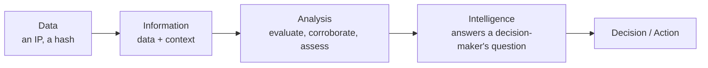
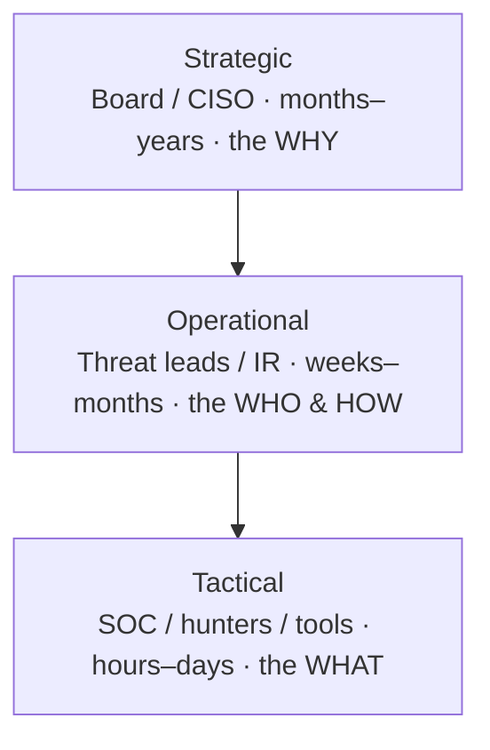
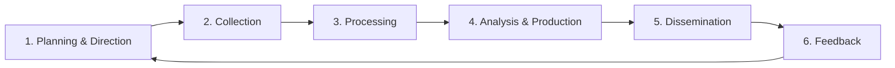
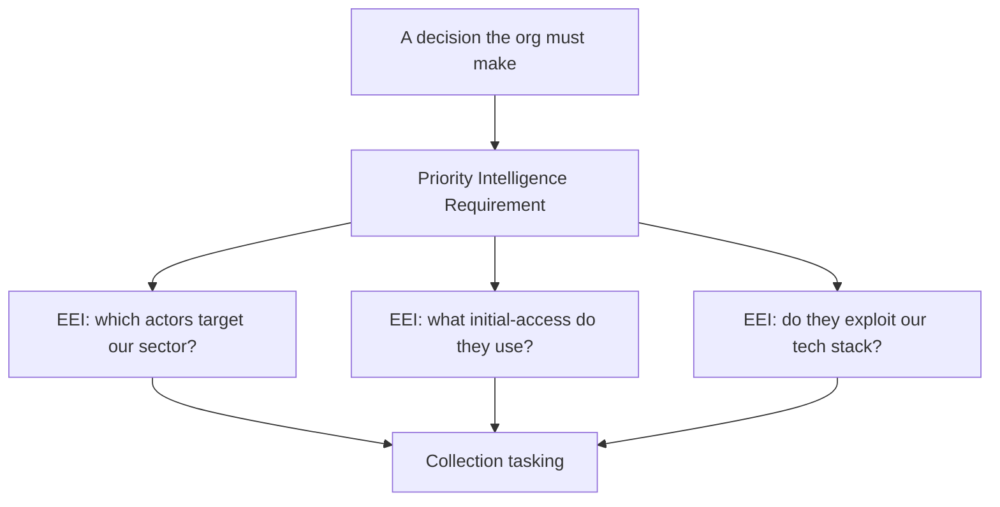
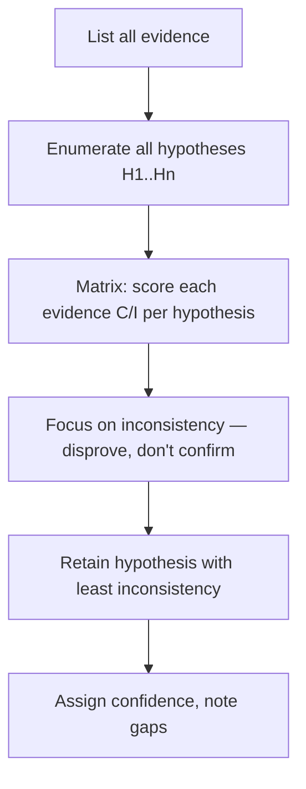
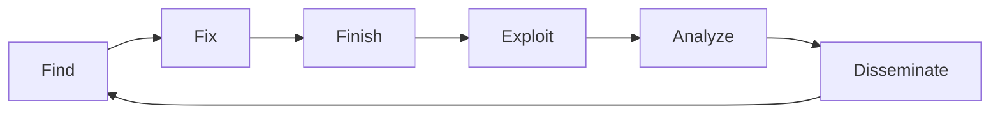
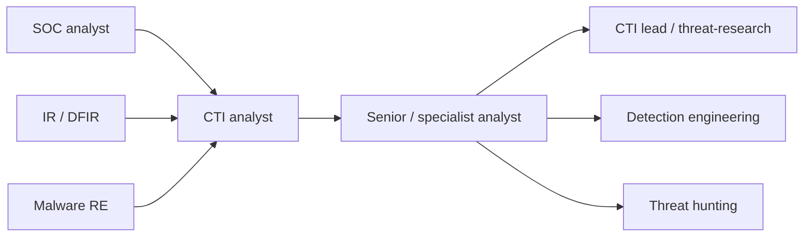

This is Chapter 1 of the Threat Intel & Hunting notebook. The DFIR
notebook taught you to investigate an intrusion *after* it happened — to
reconstruct what an attacker did. This notebook turns that around: it is
about anticipating attackers, understanding who they are and how they
operate, and feeding that understanding back into defence *before* the
next intrusion. The discipline that makes this possible is **Cyber
Threat Intelligence (CTI)**.

The word "intelligence" is thrown around loosely in security, usually to
mean "a list of bad IP addresses." That is a fundamental
misunderstanding, and it is why so many organisations spend money on
threat feeds and get almost nothing back. Real intelligence is not a
list; it is *analysed knowledge that answers a decision-maker's question
and reduces their uncertainty*. This chapter builds that idea from the
ground up — what intelligence is, the three levels it operates at, the
lifecycle that produces it, and the tradecraft that separates genuine
analysis from confident guessing.

Everything here is defensive and analytical. CTI is a lawful discipline
practised by defenders, researchers, and analysts. Where we discuss
collection from adversary sources (forums, leak sites, malware), it is
always from the perspective of a defender gathering intelligence about
threats to systems they protect — never operating against others.

---

## Part 1: Data, Information, Intelligence — The Distinction That Matters

Start with the single most important idea in the field, because
everything else depends on it. There is a hierarchy:

- **Data** is a raw, context-free fact. `185.220.101.47` is data. A hash
  `a1b2c3…` is data. On its own it means nothing and enables no
decision.
- **Information** is data with context. "`185.220.101.47` sent 40,000
  login attempts to our VPN yesterday" is information. It tells you
  something happened, but not what to do.
- **Intelligence** is information that has been collected against a
  requirement, analysed, evaluated for reliability, and packaged to
answer
  a specific question a decision-maker has. "A financially motivated
group
  is credential-stuffing our VPN as a precursor to ransomware; based on
  their pattern we assess with moderate confidence they will attempt
  access within two weeks; recommend enforcing MFA on the VPN now" —
  *that* is intelligence. It reduces uncertainty and drives a decision.



The practical consequence is blunt: **a threat feed is data, not
intelligence.** Buying a feed of "malicious IPs" and piping it into a
blocklist is automation, not intelligence, and it produces the two
classic failures of immature CTI programs — drowning in indicators
nobody has time to action, and blocking things with no idea whether they
were ever a threat to *you*. Intelligence begins the moment a human asks
"what decision am I trying to inform?" and works backwards to what to
collect. Hold onto that; it reappears in every part of this chapter.

**A second axis: intelligence vs. the thing it describes.** CTI
describes *threats* — actors, their capabilities, their intentions, and
their opportunities. A useful formula defenders borrow from risk
analysis: **Threat = Capability × Intent × Opportunity.** A script
kiddie has intent but little capability; a nation-state APT has both;
whether either is a *threat to you* depends on opportunity — your
exposed attack surface. Good CTI constantly re-evaluates all three,
because they change: a group acquires a new zero-day (capability up),
shifts targeting to your sector (intent up), or you expose a new
internet-facing service (opportunity up).

---

## Part 2: The Three Levels of Intelligence

CTI is produced and consumed at three levels, each serving a different
audience, time horizon, and decision. Confusing them is the most common
structural mistake in a CTI program — writing a highly technical IOC
report for a board, or handing an analyst a strategic geopolitical brief
when they needed a YARA rule.



**Strategic intelligence** serves executives and the board. It is about
*risk and resource allocation*, not packets. Its questions: Which threat
actors care about our sector? How is the threat landscape shifting?
Should we invest in ransomware resilience or insider-threat controls
next year? What does a new regulation or a geopolitical conflict mean
for our risk? It is written in business language, largely free of
technical jargon, with a long time horizon (months to years). A
strategic product might be a quarterly threat-landscape assessment that
shifts a security budget.

**Operational intelligence** serves those who plan and run defence —
threat-intel leads, IR managers, detection engineers, red teams. It is
about *specific adversaries and campaigns*: Who is this group, what are
their TTPs (tactics, techniques, procedures), what infrastructure and
tooling do they use, what are they likely to do next? Its time horizon
is weeks to months. An operational product might be an actor profile
that tells the SOC which ATT&CK techniques to prioritise detecting.

**Tactical intelligence** serves the hands-on defenders and their tools
— SOC analysts, hunters, and the sensors themselves. It is the
*technical detail*: the IOCs, the detection signatures, the specific
malware behaviours. Its time horizon is hours to days, and much of it is
machine-consumable (a STIX bundle feeding a SIEM). A tactical product
might be a set of Sigma rules and hashes for a newly observed loader.

| Level | Audience | Question answered | Time horizon | Example product |
|-------|----------|-------------------|--------------|-----------------|
| Strategic | Board, CISO | *Why* should we care / invest? | Months–years | Threat-landscape assessment |
| Operational | Threat leads, IR, detection eng | *Who* is targeting us and *how*? | Weeks–months | Actor/campaign profile, ATT&CK mapping |
| Tactical | SOC, hunters, sensors | *What* do I block/detect right now? | Hours–days | IOC feed, Sigma/YARA rules |

**The levels feed each other.** Tactical observations (a new IOC on the
SOC floor) roll up into operational understanding (this IOC belongs to a
campaign by group X) which informs strategic assessment (group X is
escalating against our sector). And strategic direction flows back down
(the board prioritises ransomware, so operational focuses on ransomware
crews, so tactical builds ransomware detections). A healthy program
moves fluidly in both directions; a broken one produces tactical noise
that never informs a strategic decision.

---

## Part 2b: The Threat-Actor Taxonomy

CTI is about *adversaries*, so you need a mental map of the kinds of
adversary that exist. They differ in motivation, capability, resourcing,
risk tolerance, and — crucially for you — in *which organisations they
target and why*. Getting this taxonomy wrong leads to defending against
the wrong threat.

### Nation-state / state-sponsored (APTs)

**Advanced Persistent Threats** are government-backed or
government-aligned groups. "Advanced" (well-resourced, capable of
zero-days and custom tooling), "Persistent" (long-dwell, goal-driven,
will keep coming), "Threat" (organised and intentional). Their
motivations are espionage (stealing state, military, or commercial
secrets), pre-positioning for sabotage, and strategic influence. They
are patient, well-funded, and tolerant of long timelines but *averse to
attribution*. They target governments, defence, critical infrastructure,
high-tech, and increasingly supply chains. If you're a regional
hospital, a top-tier nation-state APT is probably *not* your primary
risk — a critical distinction that mirror-imaging and availability bias
get wrong.

### Organised cybercrime

Financially motivated groups running crime as a business — ransomware
crews, banking-trojan operators, business-email-compromise rings,
carding operations. Capability ranges from moderate to very high (the
top ransomware crews rival APTs technically). They are opportunistic
*and* targeted, sensitive to cost/benefit, and will move on to easier
victims if you raise the cost. **For most commercial organisations, this
is the primary threat** — which is why the lab's hospital PIR correctly
centres here.

### Hacktivists

Ideologically or politically motivated actors seeking attention or
disruption for a cause — website defacement, DDoS, doxxing, leaking.
Capability is usually low-to-moderate but occasionally spikes. They
target organisations symbolically associated with whatever they oppose,
and timing often tracks current events. The risk is reputational and
availability-focused more than data-theft.

### Insiders

Threats from within — malicious insiders (disgruntled employees, those
recruited or bribed) and *unintentional* insiders (the user who clicked
the phish, misconfigured the bucket). Insiders bypass the perimeter by
definition and are disproportionately damaging. Detection leans on
behavioural analytics and access controls rather than external intel.

### Others

**Script kiddies** (low-skill, using others' tools — high volume, low
sophistication), **cyber-mercenaries / hack-for-hire** (capability for
rent, blurring crime and espionage), and **terrorist / extremist**
actors (currently limited capability, high intent).

| Actor type | Motivation | Typical capability | Primary targets |
|-----------|-----------|--------------------|-----------------|
| Nation-state / APT | Espionage, sabotage, influence | Very high (0-days, custom) | Gov, defence, critical infra, tech |
| Organised cybercrime | Money | Moderate–very high | Broad; anyone monetisable |
| Hacktivist | Ideology, attention | Low–moderate | Symbolic targets |
| Insider | Grievance, greed, error | Access-dependent | Their own employer |
| Script kiddie | Curiosity, notoriety | Low | Whatever's exposed |
| Hack-for-hire | Money (client's motive) | Moderate–high | Client-specified |

The taxonomy feeds directly back into requirements (Part 4): **your PIRs
should centre on the actor types with the intent *and* opportunity to
hit organisations like yours** — not the scariest-sounding actor in the
news.

---

## Part 3: The Intelligence Lifecycle

Intelligence is not gathered ad hoc; it is *produced* through a
repeatable cycle borrowed from national-security tradecraft and adapted
for cyber. The classic five (sometimes six) phases:



**1. Planning & Direction.** The cycle *starts here*, not with
collection — this is the discipline beginners skip. You define what
questions the intelligence must answer: the **intelligence
requirements**. Without them you collect everything and analyse nothing.
(Part 4 is devoted to requirements because they matter that much.)

**2. Collection.** Gather raw data against the requirements from your
sources — OSINT, commercial feeds, internal telemetry, ISAC sharing,
dark-web monitoring, malware. The key is *targeted* collection driven by
the requirements, not indiscriminate hoarding.

**3. Processing.** Turn raw collected material into a usable form:
translate foreign-language forum posts, de-obfuscate and detonate
malware, normalise feed formats, extract indicators, deduplicate. Most
raw collection is unusable until processed.

**4. Analysis & Production.** The heart of the discipline: evaluate the
processed information (is the source reliable? is the content
corroborated?), apply structured analytic techniques, form assessments
with calibrated confidence, and produce a *finished intelligence
product* that answers the requirement. Analysis is where information
becomes intelligence.

**5. Dissemination.** Deliver the product to the right consumer in the
right format at the right time. A brilliant analysis emailed to the
wrong person, or written at the wrong level for its audience, delivers
zero value. Tactical intel goes machine-to-machine; strategic intel goes
as a briefing.

**6. Feedback.** The consumer tells you whether the product answered
their question, and new questions arise, restarting the cycle.
**Feedback is what makes it a cycle rather than a conveyor belt**, and
it is the phase most often neglected — without it, the program never
learns whether it's useful.

The lifecycle is iterative and messy in practice — you loop back
constantly, and multiple requirements are in different phases at once —
but the *order of primacy* is fixed: requirements drive collection,
collection feeds analysis, analysis produces intelligence, dissemination
delivers it, feedback refines it.

---

## Part 4: Intelligence Requirements and PIRs

If you remember one operational lesson from this chapter, make it this:
**intelligence starts with a question, not a feed.** The formalisation
of that question is the **intelligence requirement**, and the
highest-priority ones are called **Priority Intelligence Requirements
(PIRs)**.

A PIR is a clear, decision-focused question that the intelligence effort
exists to answer. Good PIRs share properties:

- **Tied to a decision.** "Which ransomware groups are most likely to
  target our manufacturing sector in the next six months, and are our
  current controls adequate against their TTPs?" is a PIR — it informs a
  budget and control decision. "Tell me about ransomware" is not; it's a
  topic, not a question.
- **Specific and bounded.** It names the actor set, the sector/assets, and
  a time horizon, so you know when it's answered.
- **Answerable with available collection.** A requirement you can never
  collect against is a wish, not a requirement.

From PIRs you derive **specific/essential elements of information
(EEIs)** — the concrete facts you need to collect to answer the PIR. For
the PIR above, EEIs might be: which ransomware crews have hit
manufacturing in the last year; their initial-access methods; whether
they exploit anything in our tech stack; their typical dwell time.



**Why requirements come first, concretely.** With requirements, a feed
of 100,000 indicators becomes tractable: you filter for the ones
relevant to your PIRs and discard the rest. Without them, you either try
to action all 100,000 (impossible) or action none (waste). Requirements
are the lens that turns an ocean of data into the handful of facts that
matter to *your* organisation. **Blue team usage:** a SOC that has
translated its PIRs into detection priorities knows *which* of the
thousands of possible detections to build first — the ones covering the
TTPs of the actors its intelligence says are most likely to come.

Requirements also change with the organisation. A hospital's PIRs centre
on patient-data theft and ransomware disrupting care; a defence
contractor's centre on nation-state espionage and IP theft; a bank's on
financial fraud and wire-transfer compromise. **There is no universal
"top threats" list — the right threats are the ones targeting
organisations like yours, going after assets like yours.** This is why
generic threat feeds underdeliver and why the requirements step is
irreplaceable.

---

## Part 5: Collection Sources and Their Trade-offs

Once requirements are set, you collect against them. The mature CTI
program pulls from several source types, each with distinct strengths,
weaknesses, and reliability characteristics. Knowing the trade-offs is
what lets you weight a source appropriately during analysis.

**Open-Source Intelligence (OSINT).** Publicly available information:
security-vendor blogs, researcher tweets/posts, CERT advisories, public
malware repositories (VirusTotal, MalwareBazaar), passive DNS,
certificate transparency logs, breach-notification sites, news. Vast,
cheap, and often timely — but noisy, sometimes wrong, and adversaries
read it too (they know what's been burned). OSINT is the backbone of
most CTI programs.

**Internal telemetry.** Your own logs, alerts, EDR, and past incidents.
This is the single most *relevant* source because it's about threats
actually reaching *you* — an IOC seen in your own environment is worth
more than a thousand from a generic feed. Under-used by immature
programs that look outward for intel while ignoring the goldmine of
their own detection data.

**Commercial / closed feeds and reporting.** Paid vendors (finished
reporting, actor tracking, curated indicators). Higher signal and
analytic value than raw OSINT, with vendor tradecraft behind it — but
expensive, and quality varies. Best used for the analysis and access you
can't produce yourself (e.g. sustained tracking of a specific APT).

**ISACs / ISAOs and trust groups.** Sector-specific sharing communities
(FS-ISAC for finance, H-ISAC for health, etc.) and informal trust groups
where peers share what's hitting them. Extremely valuable because it's
*sector-relevant* and timely — your peers are hit by the same actors
before you are. Sharing is reciprocal; you get out what you put in.

**Dark-web and adversary-source monitoring.** Ransomware leak sites,
criminal forums, initial-access-broker markets, credential dumps.
High-value for early warning (your data for sale, your sector being
discussed) but operationally sensitive, legally nuanced, and requires
care — always defensive, monitoring threats to your own org, never
engaging in criminal transactions. Usually consumed via a vendor rather
than direct access.

**Government / law-enforcement sources.** National CERTs, CISA
advisories, joint advisories, and (for some) classified briefings.
Authoritative and often uniquely sourced, though sometimes less timely.

| Source | Strength | Weakness | Best for |
|--------|----------|----------|----------|
| OSINT | Cheap, broad, timely | Noisy, adversary-visible | Baseline awareness, corroboration |
| Internal telemetry | Most relevant to *you* | Limited to what reached you | Prioritisation, validation |
| Commercial feeds | High signal, vendor tradecraft | Costly, variable quality | Sustained actor tracking |
| ISAC / trust groups | Sector-relevant, reciprocal | Requires participation | Early sector warning |
| Dark web | Early warning, breach discovery | Sensitive, hard to access | Leak/credential monitoring |
| Gov / CERT | Authoritative | Sometimes slow | Baseline, validation |

**The source-reliability discipline.** Every source is rated,
classically on the **NATO Admiralty (source × information) scale**:
source reliability A (reliable) → F (cannot be judged), and information
credibility 1 (confirmed) → 6 (cannot be judged). A "B2" rating means a
usually-reliable source reporting probably-true, corroborated
information. Carrying these ratings through analysis prevents the
beginner error of treating a random forum rumour and a corroborated
vendor report as equally true.

---

## Part 6: Analytic Tradecraft and Cognitive Bias

Collection gives you material; **analysis** turns it into intelligence,
and analysis is a *skill*, not a database lookup. The core challenge is
that human analysts are subject to predictable cognitive biases that
quietly corrupt conclusions. Naming them is the first defence.

- **Confirmation bias** — seeking and over-weighting evidence that fits
  your existing hypothesis, ignoring what contradicts it. The most
  dangerous bias in CTI: once you decide "it's APT-X," every new
indicator
  looks like APT-X.
- **Anchoring** — over-relying on the first piece of information received
  (the first attribution guess, the first vendor's claim) and
  under-adjusting as new evidence arrives.
- **Mirror-imaging** — assuming the adversary thinks, values, and reasons
  as you do. A crew's "irrational" move often makes perfect sense given
  goals and constraints you haven't modelled.
- **Availability bias** — over-weighting recent, vivid, or
  heavily-reported threats (the APT everyone blogged about last week)
over
  the mundane ones (commodity malware) that are statistically more
likely
  to hit you.
- **Attribution bias / vendor pull** — the pressure to name a famous group
  because it's more satisfying and marketable than "an unattributed
  financially-motivated actor."

The counter to bias is not "try harder to be objective" — that doesn't
work — but **structured analytic techniques (SATs)** that force rigour
into the process. Two you should know by name:

**Analysis of Competing Hypotheses (ACH).** Instead of building a case
for your favourite hypothesis, you enumerate *all* plausible hypotheses,
list the evidence, and score each piece of evidence for how *consistent
or inconsistent* it is with each hypothesis. Crucially, ACH seeks to
**disprove** hypotheses rather than confirm one — the surviving
hypothesis is the one with the least inconsistent evidence, not the most
consistent. This directly counters confirmation bias.



**Key Assumptions Check.** Explicitly list every assumption your
analysis rests on, then ask of each: is it still valid? what if it's
wrong? Assumptions masquerade as facts; surfacing them prevents an
entire analysis collapsing on an unexamined premise ("we assumed the C2
IP was dedicated to this actor — but it's a shared hosting IP").

Other SATs worth knowing: **devil's advocacy** (assign someone to argue
the opposite), **red-teaming** the analysis, **what-if analysis**, and
**structured brainstorming**. The point of all of them is the same —
externalise the reasoning so bias has fewer places to hide.

---

## Part 7: Estimative Language and Confidence

Intelligence deals in uncertainty, and how you *express* that
uncertainty is part of the tradecraft. Sloppy language destroys the
value of good analysis: "the attack could be from APT-X" is useless —
*could* covers everything from 1% to 99%.

**Estimative language** is a disciplined vocabulary for probability. A
common scale:

| Expression | Rough probability |
|-----------|-------------------|
| Almost certainly / almost no chance | ~95–99% / ~1–5% |
| Highly likely / highly unlikely | ~80–90% / ~10–20% |
| Likely / unlikely | ~55–80% / ~20–45% |
| Roughly even chance | ~45–55% |

The rule: **use the words consistently and never hedge with vague
fillers** ("possibly," "may," "could"). Write "we assess it is *likely*
(55–80%) that…" so the reader knows exactly how much weight to place on
it.

Separately, state your **analytic confidence**, which is *not* the same
as probability. Confidence reflects the *quality of the sourcing and
reasoning* behind an assessment:

- **High confidence** — well-corroborated, reliable sourcing, sound logic,
  few assumptions.
- **Moderate confidence** — credible but not fully corroborated, or some
  gaps/assumptions.
- **Low confidence** — fragmentary, uncorroborated, or heavily
  assumption-dependent sourcing.

You can hold a *high-probability, low-confidence* view (you think
something is likely but your sourcing is thin) — and saying so honestly
is far more useful to a decision-maker than false precision. **The
cardinal sin of CTI writing is overstating certainty**; a report that
honestly flags "moderate confidence, single-source, key assumption X"
lets the reader weight it correctly, whereas false confidence gets
people to bet on sand. This mirrors the DFIR discipline of separating
observed facts from inferred conclusions.

---

## Part 8: F3EAD — Fusing Intelligence with Operations

The classic intelligence lifecycle (Part 3) is producer-centric. Modern
CTI, especially where it fuses with incident response and threat
hunting, often runs the **F3EAD** cycle — a targeting loop borrowed from
special-operations that tightly couples *operations* and *intelligence*:



- **Find** — identify a target (an active threat, a suspicious host, an
  actor of interest) from your requirements and leads.
- **Fix** — locate and scope it precisely (which hosts, which
  infrastructure, which accounts).
- **Finish** — take action (contain, remediate, block) — this is the
  *operations* half, often the SOC/IR team.
- **Exploit** — mine everything the operation yielded: the malware
  recovered, the C2 config, the timeline, the IOCs. (This is where a
DFIR
  investigation like the previous notebook's feeds the intel machine.)
- **Analyze** — turn that exploited material into intelligence: attribute,
  map TTPs, enrich, contextualise.
- **Disseminate** — push the finished intelligence back to defenders and
  into detections, which generates new *Find* leads, closing the loop.

The power of F3EAD is that it makes **every incident a source of
intelligence and every piece of intelligence a driver of operations.**
The Northwind ransomware case from the previous notebook is a perfect
F3EAD engine: the investigation (Find/Fix/Finish) *exploited* the beacon
config and IOCs, which *analysis* turned into an actor profile and
detections, *disseminated* to harden the estate and hunt for the same
TTPs elsewhere. A CTI program that isn't wired into IR this way leaves
its most relevant intelligence — its own incidents — on the floor.

---

## Part 9: Hands-On Lab — Producing a Finished Intelligence Product

This lab walks the full lifecycle end to end on a realistic scenario,
producing an actual finished-intelligence product. Everything uses
free/OSINT resources so you can reproduce it.

**Scenario.** You are the (sole) CTI analyst for a mid-size regional
hospital. The CISO asks: *"With ransomware crews increasingly hitting
healthcare, are we adequately prepared against the ones most likely to
target us in the next six months?"*

**Step 1 — Planning & Direction: write the PIR and EEIs.**

```
PIR: Which ransomware groups are most likely to target regional healthcare
     providers in the next 6 months, and do our current controls address
     their initial-access and impact TTPs?

EEIs:
  1. Which ransomware crews have hit healthcare in the last 12 months?
  2. What initial-access techniques do those crews use?
  3. Do any of their TTPs exploit technology in our stack (Citrix, VPN, RDP, email)?
  4. What is their typical dwell time / speed to encryption?
  5. Do they exfiltrate data (double extortion) — i.e. is patient data at risk?
```

**Step 2 — Collection.** Gather against the EEIs from free sources:

```bash
# CISA #StopRansomware advisories (authoritative TTP breakdowns by crew)
#   -> read advisories tagged healthcare / current active crews
# H-ISAC / HHS HC3 threat briefs for the healthcare sector
# The DFIR Report write-ups for real intrusion TTP chains
# Ransomware leak-site trackers (which crews are posting healthcare victims)
# MITRE ATT&CK Groups pages for the crews identified, for TTP lists
# Internal: our own EDR/SIEM — have we seen any of these TTPs already?
```

Record each source with an Admiralty reliability rating (e.g. CISA
advisory = A1, a forum rumour = D3).

**Step 3 — Processing.** Normalise findings: for each crew, extract its
ATT&CK techniques into a common table; deduplicate; translate any
non-English source material; validate that "healthcare victim" claims
are corroborated (leak-site listing + vendor report), not
single-sourced.

**Step 4 — Analysis & Production.** Apply ACH to the prioritisation
question ("which crews are most likely to target *us*"). Hypotheses: H1
= commodity-affiliate crews (opportunistic, any sector); H2 = crews
specifically focusing healthcare; H3 = we are below the size threshold
these crews bother with. Score evidence for consistency/inconsistency.
Run a key-assumptions check ("we assume our sector visibility on leak
sites is representative — is it?"). Produce assessments with estimative
language and confidence.

A fragment of the finished product:

```
BLUF (Bottom Line Up Front):
We assess it is HIGHLY LIKELY (80–90%, high confidence) that opportunistic
RaaS affiliates using phishing and exposed-RDP/VPN initial access pose the
primary ransomware risk to us over the next 6 months. We assess it is LIKELY
(55–80%, moderate confidence) that at least one crew actively listing
healthcare victims uses an initial-access technique (exposed RDP) that our
current controls do NOT fully mitigate. Patient data exfiltration is
ASSESSED HIGHLY LIKELY in any successful intrusion given universal double
extortion among active crews.

Key gaps: our external attack surface has not been validated against the
exposed-RDP finding (recommend immediate external scan). Single-source on
crew X's dwell time (low confidence on EEI 4).

Recommendations (prioritised):
  1. Enforce MFA + disable direct-exposed RDP/VPN (addresses top TTP).
  2. Validate/immutable backups + test restore (addresses impact).
  3. Deploy phishing-resistant controls + user training (addresses top vector).
```

**Step 5 — Dissemination.** Deliver in two registers (Part 2 levels): a
one-page **strategic** brief for the CISO/board (the BLUF +
recommendations + budget implication), and a **tactical** annex for the
SOC (the ATT&CK technique list to prioritise detecting, mapped to
specific Sigma rules and the crews' known IOCs).

**Step 6 — Feedback.** The CISO responds: recommendations 1 and 2
funded; new PIR generated — "validate our external RDP/VPN exposure" —
restarting the cycle. **That funded decision is the entire point:
intelligence that changed a resource allocation is intelligence that
worked.**

---

## Part 10: The CTI Team, Program Maturity and Metrics

CTI is a program, not a person or a feed subscription, and it matters to
understand how one is structured and measured.

**Where CTI sits.** In smaller orgs, one analyst (or a SOC analyst
wearing the CTI hat) does everything. In mature orgs, a CTI function
supports multiple consumers: the SOC (tactical detections), IR
(during-incident enrichment and post-incident F3EAD), detection
engineering (turning TTPs into rules), red team (emulating relevant
actors), vulnerability management (prioritising patches by active
exploitation), and leadership (strategic risk). **The best-placed CTI
teams are consumer-driven** — organised around answering their
stakeholders' PIRs, not around the feeds they happen to own.

**Program maturity** typically progresses: from *reactive* (consuming
feeds, blocking IOCs) → *active* (producing internal analysis, mapping
to ATT&CK, running the lifecycle) → *anticipatory* (threat modelling,
proactive hunting driven by intel, influencing architecture). Most
organisations overestimate their maturity because they conflate "we buy
a feed" with "we do intelligence."

**Measuring value** is notoriously hard but essential (feedback phase).
Useful metrics avoid the vanity trap of "number of indicators ingested"
(which measures noise, not value) and instead measure *decisions
influenced and threats prevented*:

| Metric | What it tells you |
|--------|-------------------|
| PIRs answered / decisions informed | Whether intel drove action (the real measure) |
| Detections created from intel & their hit rate | Tactical intel → operational defence |
| Intel-driven hunts and their findings | Proactive value |
| Time-to-relevant-warning for sector threats | Early-warning effectiveness |
| Incidents where prior intel enabled faster response | IR fusion value |
| Consumer feedback / satisfaction | Fitness for purpose |

**The maturity anti-pattern to avoid:** a program that measures itself
by throughput (feeds consumed, reports published) rather than outcomes
(decisions changed, attacks prevented). A single one-page brief that
gets MFA funded before a ransomware attack is worth more than a hundred
unread indicator reports.

---

## Part 10b: The CTI Analyst — Skills and Career Path

Because this is the opening chapter of the notebook, it's worth
grounding the discipline in the *person* who practises it. A CTI analyst
is a peculiar hybrid, and knowing the skill mix helps you develop
deliberately.

### The core skill mix

- **Analytical reasoning above all.** The defining skill is structured
thinking under uncertainty — forming hypotheses, weighing evidence,
resisting bias, and writing calibrated assessments. A brilliant
technologist who can't reason analytically makes a poor analyst; a
strong
analyst with modest technical depth can still be excellent.
- **Technical fluency.** Enough networking, OS internals, malware
behaviour, and log/telemetry literacy (the DFIR notebook) to understand
what indicators mean and to talk credibly with the SOC and IR. You don't
have to reverse-engineer malware yourself, but you must understand what
the reverse-engineer tells you.
- **Writing and communication.** Intelligence that can't be communicated
is worthless. The ability to write a tight BLUF, brief an executive in
plain language, and produce a machine-consumable tactical annex is a
career-defining skill.
- **Curiosity and adversary empathy.** Genuinely wanting to understand
*why* an adversary does what they do — modelling their goals,
constraints, and economics — is what separates rote indicator-shuffling
from real analysis, and it's the antidote to mirror-imaging.
- **Domain/geopolitical awareness** for strategic work; **tooling
fluency** (MISP, ATT&CK, STIX, the platforms of Chapter 4) for
operational/tactical work.

### The career path

Most analysts arrive at CTI from an adjacent role rather than starting
there, which is why this notebook sits after the DFIR one:



A common progression: **SOC analyst** (learn detection and telemetry) →
**CTI analyst** (learn the lifecycle, frameworks, and writing) →
**senior/specialist** (deep actor or malware expertise) → **CTI lead**,
**threat researcher**, **detection engineer**, or **threat hunter**
(Chapter 5). Certifications like GIAC's GCTI and vendor CTI courses
formalise the tradecraft, but the field rewards demonstrated analysis —
a public blog post pivoting a real campaign, a well-built MISP instance,
a good ATT&CK-mapped write-up — far more than paper alone. **The single
best way to break in is to *produce* intelligence** on public data (the
lab in this chapter) and show the reasoning.

---

## Part 11: Detection & Defense Angle

CTI is only worth producing if it changes what defenders do. This
section is how intelligence integrates into defensive operations — the
connective tissue between this notebook and the SOC.

**Intelligence-driven detection.** The point of operational intel (actor
TTPs) is to tell detection engineers *which* detections to build first —
the ones covering the techniques of the actors your PIRs say matter.
This is the antidote to the "detect everything" impossibility: a
healthcare SOC informed that exposed-RDP and phishing are the top
vectors builds those detections and hunts before chasing exotic
techniques no relevant actor uses. **Blue team usage:** map your current
detection coverage to MITRE ATT&CK, overlay the techniques of your
priority actors, and the gaps are your detection backlog, prioritised by
intelligence.

**Intelligence-driven vulnerability management.** Not all
vulnerabilities are equal; the ones being *actively exploited by actors
targeting your sector* are the ones to patch first. CTI (e.g. CISA's
Known Exploited Vulnerabilities catalogue plus actor tracking)
reprioritises a patch queue from "by CVSS score" to "by real-world
threat," which is far more defensible.

**Intelligence-driven hunting.** Operational intel generates hunt
hypotheses ("actor X uses technique Y — do we have evidence of Y in our
telemetry?"), which is the subject of Chapter 5 of this notebook. Intel
without hunting is a report nobody validated against reality; hunting
without intel is fishing.

**Feeding intelligence back (F3EAD).** Every incident, every hunt, every
detection hit is raw material for new intelligence. The mature defensive
loop treats the SOC and IR not just as *consumers* of intel but as
*sensors producing* it — the richest, most relevant source you have
(Part 5). Wire your IR process (the previous notebook) to hand its IOCs,
TTPs, and malware to the CTI function as a matter of routine.

**Sharing responsibly.** Contributing your (sanitised) findings to ISACs
and trust groups strengthens the whole sector's defence, and reciprocity
means you receive early warning in return. Frameworks like **TLP
(Traffic Light Protocol)** govern how shared intelligence may be
redistributed (TLP:RED = eyes only, TLP:CLEAR = public) — respecting TLP
is what keeps trust groups functioning.

---

## Part 12: Common Pitfalls

- **Confusing feeds with intelligence.** Buying indicator feeds and
  calling it a CTI program. Feeds are data; intelligence requires
  requirements, analysis, and dissemination to a decision-maker.
- **Skipping the requirements phase.** Collecting before defining PIRs,
  then drowning in irrelevant data. Always start with the decision
you're
  trying to inform.
- **Wrong level for the audience.** Handing the board a packet of IOCs, or
  the SOC a geopolitical essay. Match strategic/operational/tactical to
  the consumer.
- **Ignoring internal telemetry.** Looking outward for intel while your
  own logs — the most relevant source — go unmined.
- **Unmanaged cognitive bias.** Falling for confirmation bias and
  premature attribution because it feels satisfying. Use structured
  techniques (ACH, key-assumptions check).
- **Vague or overconfident language.** "Might," "could," "possibly" — or
  false certainty. Use disciplined estimative language and state
  confidence separately from probability.
- **Attribution theatre.** Naming a famous APT to look impressive when the
  evidence supports only "an unattributed actor." Caveat attribution
  heavily (next chapters go deeper).
- **Measuring throughput, not outcomes.** Reporting "indicators ingested"
  instead of "decisions influenced / attacks prevented."
- **No feedback loop.** Producing reports nobody reads and never asking
  whether they answered the question. Feedback is what makes it a cycle.

---

## Part 13: Final Revision / Summary

- **Intelligence ≠ data.** Data → (context) → information → (analysis) →
  intelligence that answers a decision-maker's question. A feed is data;
  intelligence begins with a question.
- **Threat = Capability × Intent × Opportunity** — and whether a threat
  matters to *you* depends on opportunity (your attack surface).
- **Three levels:** strategic (board, *why*/risk, months–years),
  operational (defenders, *who/how*/TTPs, weeks–months), tactical
  (SOC/sensors, *what*/IOCs, hours–days). Match level to audience; let
  them feed each other.
- **The lifecycle starts with Planning & Direction**, not collection:
  direction → collection → processing → analysis → dissemination →
  feedback → loop. Feedback makes it a cycle.
- **PIRs come first.** A good PIR is decision-tied, specific, and
  answerable; EEIs break it into collectable facts. Requirements are the
  lens that turns an ocean of indicators into the few that matter to
your
  org.
- **Know your sources and rate them** (Admiralty scale). Internal
  telemetry is the most relevant source; OSINT the backbone; ISACs give
  sector-relevant early warning; dark-web monitoring gives breach
warning.
- **Analysis is a skill threatened by bias** (confirmation, anchoring,
  mirror-imaging). Counter it with structured analytic techniques — ACH
  (disprove, don't confirm) and key-assumptions checks.
- **Express uncertainty with discipline:** estimative language for
  probability, a separate confidence level for sourcing quality.
  Overstating certainty is the cardinal sin.
- **F3EAD fuses intel with operations** — every incident becomes
  intelligence, every intelligence drives operations; wire CTI into IR
and
  hunting.
- **CTI is a consumer-driven program measured by decisions influenced and
  attacks prevented**, not indicators ingested. Its whole purpose is to
  change what defenders do.

---

## Part 14: Cheat Sheet / Quick Reference

**The hierarchy:** Data → Information → (analysis) → Intelligence →
Decision.

**Threat equation:** Threat = Capability × Intent × Opportunity.

**Three levels:**

```
Strategic   → Board/CISO   → WHY / risk       → months–years → landscape assessment
Operational → Defenders    → WHO & HOW / TTPs  → weeks–months → actor profile
Tactical    → SOC/sensors  → WHAT / IOCs       → hours–days   → feed, Sigma/YARA
```

**Lifecycle:** Planning & Direction → Collection → Processing → Analysis
& Production → Dissemination → Feedback → (loop). *Starts with
requirements.*

**F3EAD:** Find → Fix → Finish → Exploit → Analyze → Disseminate →
(loop). *Fuses ops + intel.*

**PIR test:** tied to a decision? specific/bounded? answerable with your
collection? If not, it's a topic, not a PIR.

**Sources (relevance ↑):** internal telemetry > ISAC/sector > commercial
> OSINT > raw feeds. Rate every source (Admiralty A–F / 1–6).

**Estimative language:** almost certainly · highly likely · likely ·
roughly even · unlikely · highly unlikely · almost no chance. State
**confidence** (high/moderate/low) *separately* from probability.

**Bias killers:** ACH (score inconsistency, disprove hypotheses) · Key
Assumptions Check · Devil's Advocate.

**Sharing:** TLP:RED (eyes only) · TLP:AMBER (org) · TLP:GREEN
(community) · TLP:CLEAR (public).

**Metric that matters:** decisions influenced / attacks prevented — not
indicators ingested.

---

## Part 15: Practice Labs & Resources

- **CISA #StopRansomware & KEV catalog:** read several current advisories
  and build the EEI-to-TTP table from the lab — the best free primary
  source for actor TTPs.
- **MITRE ATT&CK (Groups & Software):** pick a threat group, read its
  technique list, and practise turning it into a detection-priority
list.
  The **ATT&CK Navigator** visualises coverage vs. actor.
- **The DFIR Report:** real intrusion write-ups — excellent raw material
  for the "Exploit/Analyze" phases of F3EAD and for extracting TTPs.
- **SANS FOR578 (Cyber Threat Intelligence)** concepts and the
  **"Psychology of Intelligence Analysis"** (Richards Heuer) — the
  foundational text on cognitive bias and ACH; free PDF from CIA CSI.
- **TryHackMe:** the "Cyber Threat Intelligence" module and "Threat
  Intelligence Tools," "Yara," and "MISP" rooms give hands-on lifecycle
  and tooling practice.
- **abuse.ch (MalwareBazaar, ThreatFox, URLhaus, Feodo Tracker):** free,
  high-quality tactical intel to practise collection, enrichment, and
  pivoting.
- **Traffic Light Protocol (FIRST.org) & the Admiralty scale:**
  internalise the sharing and source-rating conventions.
- **Build the lab's finished product for real:** pick your own (or a
  fictional) org, write a genuine PIR, collect from the free sources
  above, run an ACH matrix, and write a one-page BLUF brief — the single
  best way to learn CTI is to produce one product end to end.

The next chapter drills into the tactical layer this one introduced:
IOCs and IOAs, the Pyramid of Pain, and the Diamond Model — the
frameworks for reasoning about indicators and structuring what you know
about an intrusion.
