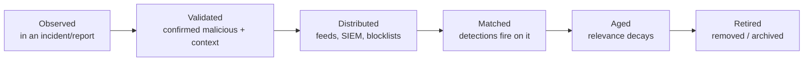
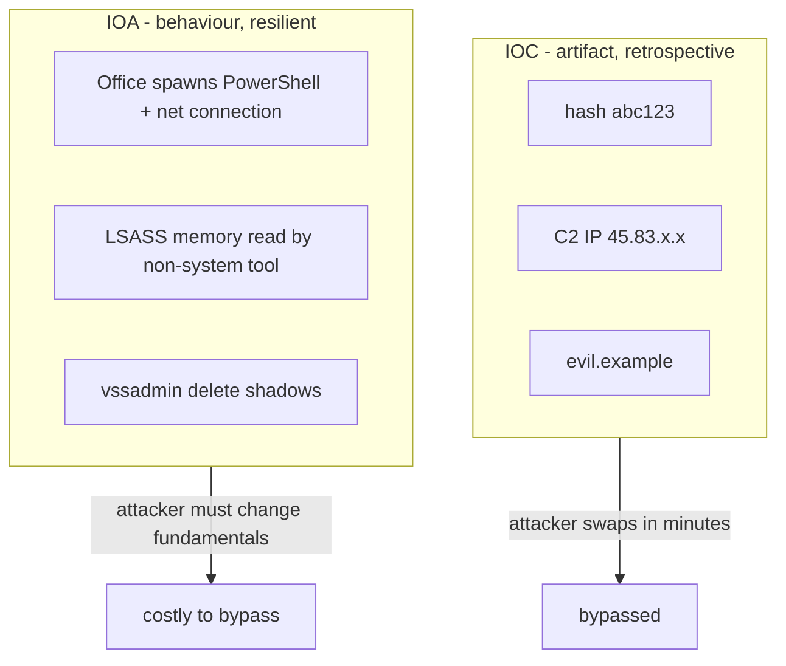
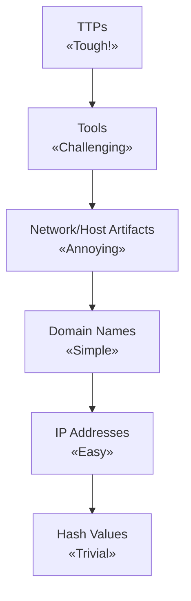
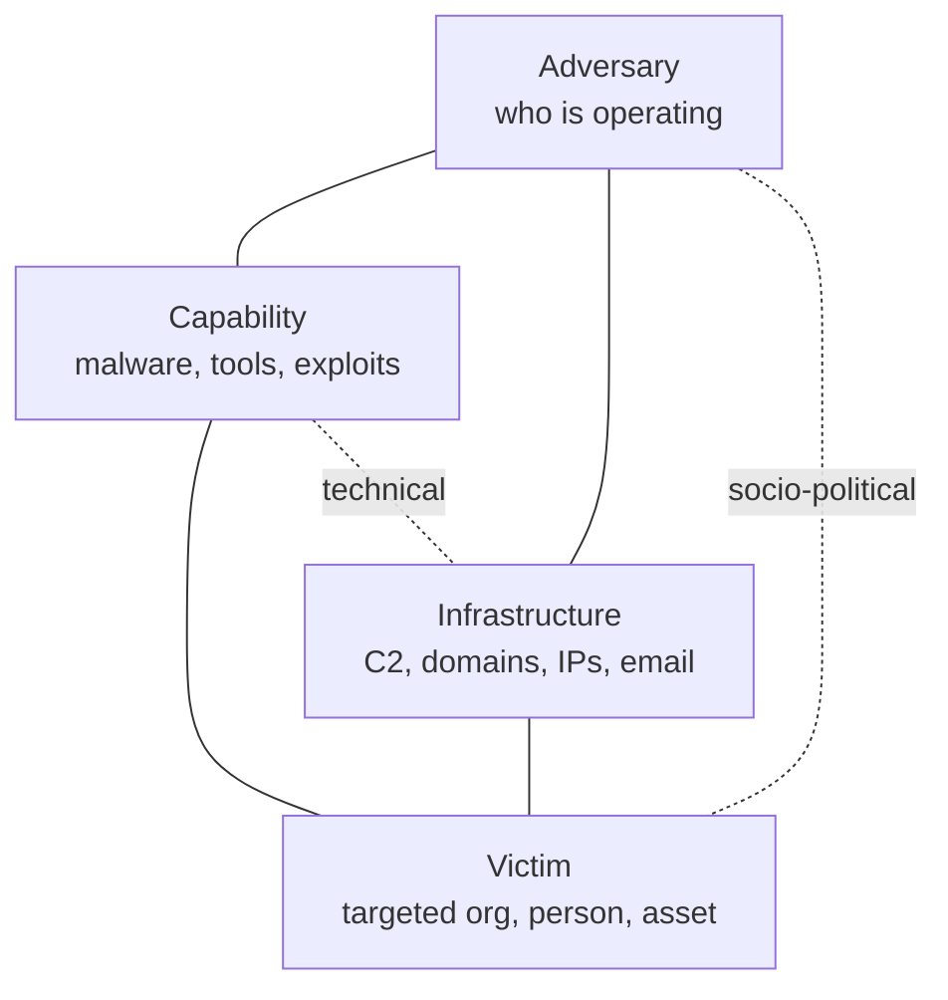
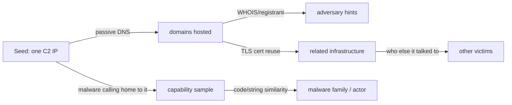
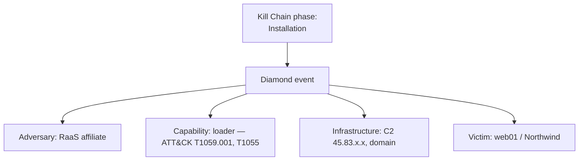
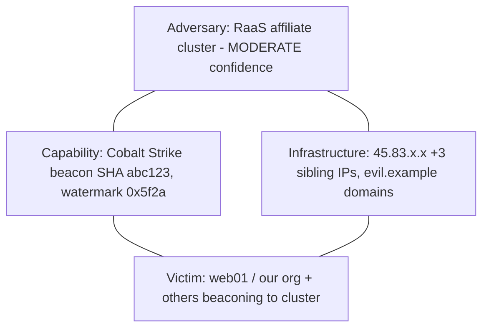

**Level:** Intermediate · **Track:** Threat Intel & Hunting · **Read time:** 255 min

This is Chapter 2 of the Threat Intel & Hunting notebook. The previous
chapter established what intelligence is and how it is produced. This
chapter gives you the conceptual toolkit for the *tactical and
operational* layers: the frameworks analysts use every day to reason
about indicators, to decide which indicators are worth chasing, and to
structure a messy pile of observations into a coherent picture of an
intrusion.

Four ideas do most of the work: the **indicator of compromise (IOC)**,
the **indicator of attack (IOA)**, the **Pyramid of Pain**, and the
**Diamond Model**. They are not academic. They directly answer the
questions that consume a defender's day: *Is this thing bad? Is it worth
blocking? What else does the attacker have? What should I detect so they
can't just swap it out?* Master these and you stop drowning in indicator
feeds and start using them the way a good analyst does.

Everything here is defensive analysis, practised on threats to systems
you protect and on lab or CTF data. Where we pivot on adversary
infrastructure, it is enrichment and analysis from public and defensive
sources — never intrusion into others' systems.

---

## Part 1: What an Indicator of Compromise Really Is

An **Indicator of Compromise (IOC)** is a piece of forensic evidence
that suggests a system has been breached or that a particular threat is
present. It is an *observable* — something you can look for in your
telemetry. The canonical examples: a file hash, an IP address, a domain,
a URL, a registry key, a mutex name, a filename, an email sender.

That definition sounds simple, and the simplicity is exactly the trap.
Beginners treat IOCs as a magic list of "bad things": if you see one,
you're owned; if you don't, you're fine. Both halves are wrong. An IOC
is a *hint*, weighted by context and confidence, not a verdict. The same
IP can be a C2 server today and a benign CDN tomorrow; the same hash can
be malware in one context and a false-positive detection in another.
**IOCs are evidence to be weighed, exactly like the log records of the
previous notebook — never trusted blindly.**

### The three classes of IOC

Indicators come in three structural types, a taxonomy worth knowing
because it governs how you match them:

- **Atomic indicators** cannot be broken down further and retain meaning:
  an IP address, a domain name, an email address. You match them
exactly.
- **Computed indicators** are derived from data: a hash (MD5/SHA-256 of a
  file), a regular expression, a statistical value. You compute the same
  function over your data and compare.
- **Behavioural indicators** are combinations of atomic and computed
  indicators plus logic that describe *what an attacker does*: "a Word
  process spawns PowerShell which makes an outbound connection to a
  newly-registered domain." These are the most powerful and shade
directly
  into IOAs (Part 2).

### The IOC lifecycle

An IOC is not eternal; it has a life:



The lifecycle matters because **indicators decay.** A C2 IP is burned
the moment it's published; the adversary rotates it. A domain gets
sinkholed. A hash is defeated by recompiling the malware with one byte
changed. An IOC that was gold last week is noise this week — which is
the whole motivation for the Pyramid of Pain (Part 3). Any IOC you store
needs a *first-seen*, *last-seen*, a *confidence*, and a *source*, so
you can age and retire it rather than blocking a now-benign CDN forever.

**Blue team usage:** the two failure modes to avoid are (1) treating
stale IOCs as live and generating false positives, and (2) blindly
ingesting a feed of a million indicators with no context, which buries
your SOC. Both are solved by carrying confidence + context + age on
every indicator, and by prioritising with the frameworks below.

---

## Part 2: IOC vs IOA — Artifacts versus Behaviour

Here is one of the most important distinctions in modern defence, and
one many people never grasp: the difference between an **Indicator of
Compromise (IOC)** and an **Indicator of Attack (IOA)**.

- An **IOC** is an *artifact left behind* — evidence that something
  happened. A hash, an IP, a dropped file. It is inherently
  **retrospective**: it describes a specific instance of a threat that
has
  already been seen and characterised. IOCs answer "have I seen *this
  specific thing*?"
- An **IOA** is a description of the *behaviour and intent* of an attack,
  independent of the specific tools used. "A process is dumping LSASS
  memory," "an Office document is spawning a shell and reaching out to
the
  internet," "credentials are being replicated from a domain controller
by
  a non-DC host." IOAs answer "is *this kind of malicious activity*
  happening?" — regardless of which malware, IP, or hash is involved
this
  time.

The distinction is decisive because **attackers change IOCs trivially
and IOAs painfully.** The adversary can recompile their malware (new
hash), rent a new server (new IP), register a new domain — cheap,
instant. But the *behaviour* — they still need to dump credentials,
still need to move laterally, still need to establish C2 — is dictated
by their objectives and is expensive to fundamentally change. Detection
built on IOAs survives the attacker swapping tools; detection built on
IOCs breaks the moment they do.



Consider the Northwind ransomware case from the previous notebook. The
IOCs (the beacon IP, the encryptor hash, the `.nwlock` extension) are
useful for *this* victim and for hunting the same crew — but the crew's
next victim gets a fresh IP and a recompiled encryptor, defeating every
IOC. The IOAs, though — Office→PowerShell→C2, LSASS dumping, DCSync from
a non-DC, `vssadmin delete shadows` — catch that crew *and the next
unrelated crew*, because those behaviours are intrinsic to how
human-operated ransomware works. **This is why mature detection programs
invest in behavioural detection (IOAs) as their backbone and use IOCs as
fast, cheap, high-confidence supplements** — not the other way round.

None of this means IOCs are worthless. They are cheap, exact, and
low-false-positive when fresh; blocking a known-live C2 IP is a
perfectly good control. The point is *hierarchy*: IOCs are the bottom of
the value pyramid (literally, as the next part shows), and behaviour is
the top.

---

## Part 3: The Pyramid of Pain

David Bianco's **Pyramid of Pain** (2013) is the single most useful
one-page model in threat intelligence. It ranks the types of indicator
you can detect and deny by *how much pain it causes the adversary* when
you do. The insight: not all indicators are equal, and you should spend
your effort where it hurts the attacker most.



From bottom (trivial for the adversary to change, so low value for you)
to top (agonising to change, so high value):

### Hash values — Trivial

A cryptographic hash identifies one exact file. Blocking it stops that
exact binary. But the adversary changes a single byte, recompiles, or
repacks, and the hash changes completely — cost to them: seconds.
Automated builders churn out a fresh hash per victim. Useful for exact
identification and sharing, but denial by hash is the least durable
control.

### IP addresses — Easy

Blocking a C2 or scanning IP is slightly more annoying, but attackers
rotate through cheap VPS, proxies, Tor, bulletproof hosting, and cloud
IPs by the thousand. Cost to change: minutes and a few dollars. Fresh
IPs are high-confidence while live but decay fast.

### Domain names — Simple

A notch harder — the adversary must register and propagate a domain
(money, and a paper trail). But domain generation algorithms (DGAs),
cheap/free registrars, and disposable domains keep the cost low.
Blocking domains hurts a little more than IPs and lasts a little longer.

### Network/Host artifacts — Annoying

Now it gets interesting. Artifacts are the *distinctive traces* a tool
leaves: a peculiar User-Agent string, a specific URI pattern, a named
pipe, a registry key the malware creates, a mutex, a distinctive HTTP
header order (JA3/JA4 TLS fingerprints live here). To change these, the
adversary has to modify their *tooling*, not just rent new
infrastructure — real effort. Detecting these makes the attacker's
current tools stop working against you.

### Tools — Challenging

Detect the *tool itself* — the malware family, the framework (Cobalt
Strike, Mimikatz), the packer — by its behaviour or signatures (YARA
rules on memory, tool-specific artifacts) regardless of hash. Now the
adversary must find, buy, or build a *new tool* and retrain on it. That
is genuinely costly and slow; you've denied a capability, not an
instance.

### TTPs — Tough

The summit: detect the adversary's *tactics, techniques, and procedures*
— how they operate, independent of any specific tool. Spearphishing with
macro docs, LSASS dumping, DCSync, pass-the-hash lateral movement,
`vssadmin` shadow deletion. To evade detection here, the adversary must
change *how they achieve their objectives* — often relearning
tradecraft, rebuilding playbooks, retraining operators. This is
maximally painful and is where behavioural detection (IOAs) lives.

| Pyramid level | Cost to attacker to change | Durability of your detection | Indicator type |
|---------------|----------------------------|------------------------------|----------------|
| TTPs | Very high (change how they operate) | Very durable | Behavioural / IOA |
| Tools | High (new tooling) | Durable | Family/framework detection, YARA |
| Network/Host artifacts | Moderate (modify tooling) | Moderate | User-agents, mutexes, JA3, URI patterns |
| Domain names | Low | Low | Domains |
| IP addresses | Very low | Very low | IPs |
| Hash values | Trivial | Very low | Hashes |

**The strategic takeaway:** every hour you invest climbing the pyramid —
building TTP/behavioural detections instead of just ingesting hashes and
IPs — buys detection that survives the adversary's evasion. IOCs at the
base are still worth using (cheap, high-confidence-while-fresh), but
they should never be the *whole* program. **This is the analytical
justification for the entire threat-hunting discipline (Chapter 5):
hunting is how you operationalise detection at the top of the pyramid.**

---

## Part 4: The Diamond Model of Intrusion Analysis

The Pyramid tells you *which indicators matter*; the **Diamond Model**
(Caltagirone, Pendergast, Betz, 2013) tells you *how to structure and
pivot* what you know about an intrusion. It is the analytical workhorse
for turning one observation into a full picture of an adversary
operation.

Every malicious event, the model says, has four core features arranged
as a diamond, connected by edges:



- **Adversary** — the actor (or actors: an *operator* who runs the
  intrusion, and a *customer* who benefits, e.g. a RaaS affiliate vs the
  RaaS operator). Often unknown early on; attribution is hard.
- **Capability** — the tools and techniques used: malware, exploits,
  stolen creds, hands-on-keyboard skills.
- **Infrastructure** — the physical/logical resources used to deliver
  capability: C2 servers, domains, IP addresses, email accounts,
  compromised third-party hosts (Type 1: adversary-owned; Type 2:
  intermediary/victim-owned relays).
- **Victim** — the target: an organisation, a person, an asset, an email
  address, a network.

The two diagonal **meta-edges** carry meaning too: the
**socio-political** edge (Adversary↔Victim) captures the *why* — the
intent and relationship that explains targeting; the **technical** edge
(Capability↔Infrastructure) captures how the tooling and infrastructure
are technically wired together.

### Pivoting — the model's superpower

The real value is **pivoting**: given a value at one vertex, you use the
edges to discover values at the others. This is exactly the four-corner
pivoting of the DFIR timeline chapter, generalised to intrusion
intelligence:

- From an **Infrastructure** IP → passive DNS reveals **domains** it
  hosted (more infrastructure) → WHOIS/registration patterns hint at the
  **adversary** → other domains by the same registrant reveal
  **capability** delivery points → certificate reuse links to other
  **victims**.
- From a **Capability** (malware sample) → its hardcoded C2 reveals
  **infrastructure** → its code similarities/reused strings link to an
  **adversary** or malware family → its targeting config reveals
intended
  **victims**.
- From a **Victim** observation (a phishing email) → the sender/links are
  **infrastructure** → the attachment is **capability** → both,
correlated
  with other reports, point at an **adversary**.



Each pivot expands the diamond, and a series of connected diamonds over
time forms an **activity thread** — a campaign. **This is how one alert
becomes an actor profile**: you seed a diamond with a single suspicious
artifact and pivot outward across its edges until you've mapped the
adversary's capability and infrastructure and can tie multiple victims
into one campaign.

**IR/analyst use case:** the Diamond Model is the connective framework
between the DFIR notebook and this one. A DFIR investigation hands you a
filled-in *Victim* and *Capability* (and some *Infrastructure*); CTI
pivoting expands that into *Adversary* and *other
Victims/Infrastructure*, which then drives detections and warnings for
the wider estate and sector.

---

## Part 5: Combining the Models — Kill Chain, ATT&CK, Diamond

No single model captures everything, and the mature analyst uses them
together. Each answers a different question about the same intrusion:

- The **Cyber Kill Chain** (Lockheed Martin) describes the *sequence* of
  an intrusion — Recon → Weaponization → Delivery → Exploitation →
  Installation → C2 → Actions on Objectives. It gives you the *phases*
and
  the idea that disrupting any early link breaks the chain.
- **MITRE ATT&CK** describes the *how* in granular, catalogued detail — a
  matrix of tactics (the adversary's goals: Initial Access, Persistence,
  Credential Access…) and techniques (the specific methods, each with an
  ID like T1003). It is the shared language for TTPs and the top of the
  Pyramid.
- The **Diamond Model** describes the *structure and relationships* of a
  single event — who, what, where, against whom — and enables pivoting.

They compose cleanly. A Diamond event sits at a Kill Chain phase, and
its Capability edge is described by ATT&CK techniques:



The practical workflow: use the **Kill Chain** to organise where in the
intrusion you are; use **ATT&CK** to precisely name each behaviour
(which also tells you what to detect and maps to the Pyramid's top); use
the **Diamond** to pivot from what you know to what you don't and to
link events into campaigns. Together they turn scattered observations
into a structured, sharable, detection-driving intelligence picture.

| Model | Answers | Best for |
|-------|---------|----------|
| Kill Chain | *When* / what phase? | Sequencing an intrusion, finding disruption points |
| ATT&CK | *How* precisely? | Naming TTPs, detection engineering, coverage mapping |
| Diamond | *Who/what/where/whom* & relationships? | Pivoting, campaign linking, attribution structuring |
| Pyramid of Pain | *Which indicators are worth it?* | Prioritising detection investment |

---

## Part 5b: Courses of Action — Turning Analysis into Defensive Options

Frameworks are only useful if they change what you *do*. The **Courses
of Action (CoA) matrix**, from Lockheed Martin's intelligence-driven
defence work, is the bridge from the Kill Chain to concrete defensive
actions. It crosses each Kill Chain phase against six defensive actions,
giving you a grid of options for disrupting an adversary at every stage.

The six actions (the "D" verbs):

- **Detect** — know the activity is happening (an alert, a hunt hit).
- **Deny** — prevent the activity outright (block, patch, disable).
- **Disrupt** — interrupt it in progress (kill a process, drop a
connection).
- **Degrade** — slow or reduce its effectiveness (rate-limit, throttle).
- **Deceive** — mislead the adversary (honeypots, honey-tokens, fake
data).
- **Destroy** — offensive response (rarely available to defenders; often
legally restricted).

A fragment of a CoA matrix for a phishing-led intrusion like Northwind:

| Kill Chain phase | Detect | Deny | Disrupt | Degrade | Deceive |
|------------------|--------|------|---------|---------|---------|
| Delivery (phish) | Email analytics, sandbox | Attachment/macro block | Strip active content | Greylisting | Honey-inbox |
| Exploitation (macro) | Sysmon parent-child | Disable macros by policy | EDR block | — | Decoy documents |
| Installation | Service/registry alerts | App allow-listing | EDR quarantine | — | — |
| C2 | DNS/NetFlow anomaly | Block C2 IP/domain | Sinkhole | Bandwidth throttle | Honey-credentials |
| Actions/Impact | `vssadmin` alert | Immutable backups | Isolate host | — | Canary files |

**The strategic value:** the matrix forces you to realise you have
*many* more options than "block the IOC," and — crucially — that the
best options cluster at the *early* phases (deny delivery, deny
exploitation) and at the *behavioural* level (the Deny/Disrupt cells
that
correspond to top-of-Pyramid TTP controls). Reading the matrix alongside
the Pyramid of Pain, the same conclusion emerges twice: **invest in the
early-phase, behaviour-level cells**, because they deny the adversary
cheaply and durably, while the late-phase IOC-block cells are stopgaps.

**Deception deserves a special note.** The Deceive column is
under-used and disproportionately valuable: honey-tokens (fake
credentials that alert when used), canary files (documents that beacon
when opened), and decoy hosts turn the adversary's own reconnaissance
against them, producing extremely high-confidence, low-false-positive
detections. A single honey-credential that no legitimate user should
ever touch is one of the cleanest tripwires in all of defence.

---

## Part 6: Indicator Confidence, Decay and False Positives

Working with indicators well is largely about managing *uncertainty* —
the same discipline as the estimative language of Chapter 1, applied to
tactical data.

### Confidence and context

Every indicator should carry a **confidence** (how sure are we it's
malicious?) and **context** (what threat, what campaign, why). A SHA-256
of a confirmed ransomware encryptor from your own incident is
high-confidence with rich context. An IP from an anonymous pastebin
labelled "bad IPs" is low-confidence with none. Treating them equally is
how SOCs drown. **The context is often more valuable than the indicator
itself** — "this domain is a known Cobalt Strike C2 for crew X targeting
healthcare" tells you what to do; the bare domain does not.

### Decay

Indicators lose value over time at different rates by type (this is the
Pyramid restated as a time function): IPs and domains decay in days to
weeks (rotation, sinkholing, reassignment); hashes are instantly
defeated by recompilation but stay *identifying* for that exact sample
forever; TTPs barely decay at all. A good indicator store models decay —
automatically lowering confidence or expiring indicators — so you stop
alerting on a C2 IP that's now a legitimate cloud tenant. Some platforms
implement literal **indicator scoring/decay** functions.

### False positives — the two-sided cost

- A **false positive** (benign flagged as malicious) wastes analyst time
  and, worse, trains the SOC to ignore alerts ("alert fatigue").
Blocking
  a shared-hosting IP because one tenant was once malicious can take
down
  a legitimate service.
- A **false negative** (malicious missed) is the breach you didn't catch.

Tuning is the perpetual balance between them, and it's why indicator
quality (confidence, context, decay) beats indicator *quantity* every
time. **A hundred curated, contextualised, aged indicators relevant to
your PIRs outperform a million raw feed entries** — the same lesson as
Chapter 1, at the tactical layer.

---

## Part 7: Representing Indicators — OpenIOC, STIX, YARA, Sigma

Indicators have to be written down in a form tools and other analysts
can consume. Four formats dominate, each at a different level of the
Pyramid — worth knowing what each is for (the next chapter's tooling,
and Chapter 4's platforms, build on these).

### STIX — the lingua franca

**STIX (Structured Threat Information eXpression)** is the standard JSON
model for representing all of threat intelligence — not just indicators
but the whole Diamond: threat actors, campaigns, malware,
infrastructure, relationships, and indicators, all as linked objects. It
is what MISP and OpenCTI (Chapter 4) speak. A STIX indicator uses a
pattern language:

```json
{
  "type": "indicator",
  "spec_version": "2.1",
  "pattern_type": "stix",
  "pattern": "[ipv4-addr:value = '45.83.x.x'] OR [domain-name:value = 'evil.example']",
  "valid_from": "2027-03-15T05:00:00Z",
  "confidence": 80,
  "labels": ["malicious-activity"]
}
```

### YARA — for files and memory (Tools level)

**YARA** describes *malware families* by content patterns — strings,
byte sequences, and conditions — so it detects the *tool* regardless of
hash (climbing the Pyramid from hashes to tools):

```yara
rule Nwlock_Encryptor {
  meta:
    description = "Detects the .nwlock ransomware encryptor family"
    author = "CTI team"
  strings:
    $ext = ".nwlock" wide ascii
    $note = "README_NWLOCK.txt" ascii
    $vss = "vssadmin delete shadows /all /quiet" ascii
  condition:
    uint16(0) == 0x5A4D and 2 of them   // MZ header + any two markers
}
```

`uint16(0) == 0x5A4D` checks for the `MZ` PE header; `2 of them`
requires any two of the family markers — resilient to a one-byte
recompile that would defeat a hash.

### Sigma — for logs (behaviour/TTP level)

**Sigma** (from the DFIR notebook) is the portable log-detection format
— the natural home for IOAs and TTP detection, the top of the Pyramid. A
Sigma rule for the LSASS-dumping *behaviour* catches the technique
regardless of which tool performs it.

### OpenIOC and others

**OpenIOC** (Mandiant) is an older XML schema for host/file indicators,
still seen in some tooling. There are also snort/suricata rules for
network detection. The point isn't to master every schema but to know
**which format lives at which Pyramid level**: hashes/IPs/domains in
STIX indicators (base), YARA for tools (middle), Sigma for TTPs (top).

---

## Part 8: Hands-On Lab — One Artifact to a Full Diamond and Behavioural Detections

This lab takes a single seed indicator and walks the complete analytical
arc of the chapter: pivot it into a full Diamond, classify everything on
the Pyramid, and produce durable behavioural detections. Everything uses
free/OSINT enrichment resources so you can reproduce the method (with a
real sample of your choosing from MalwareBazaar).

**Seed.** From an alert (or the previous notebook's Northwind case), you
have one artifact: an outbound connection to `45.83.x.x:443` flagged by
the SOC. That's it. Build outward.

**Step 1 — start the Diamond with what you have.**

```
Victim:         web01 / our org (known)
Infrastructure: 45.83.x.x:443 (known)
Capability:     unknown
Adversary:      unknown
```

**Step 2 — pivot Infrastructure → more Infrastructure (passive DNS +
TLS).**

```bash
# Passive DNS: what domains have resolved to this IP? (free: VirusTotal, etc.)
#   -> update-cdn[.]evil.example, panel[.]evil.example  (first-seen last week)
# TLS certificate on :443 (cert transparency / shodan-style lookup)
#   -> self-signed cert, CN reused on 3 other IPs  => 3 more infra nodes
```

You've expanded Infrastructure to a domain cluster and three sibling IPs
via certificate reuse — a classic pivot the adversary rarely bothers to
vary.

**Step 3 — pivot Infrastructure → Capability (which sample called home
here?).**

```bash
# Search malware repos for samples with this C2 in their config
#   MalwareBazaar / VT: samples beaconing to 45.83.x.x
#   -> one sample, SHA-256 abc123..., flagged Cobalt Strike beacon
```

Capability is now filled: a Cobalt Strike beacon (a *tool*, Pyramid
mid-level — far more durable than the IP).

**Step 4 — pivot Capability → Adversary (family + config + code
similarity).**

```bash
# Parse the beacon config (watermark, malleable C2 profile, sleep/jitter)
#   -> watermark 0x5f2a...  malleable profile mimics a common CDN
# Watermark + profile + infra pattern matches prior reporting on a RaaS affiliate
#   => Adversary: (moderate confidence) a known RaaS affiliate cluster
```

Adversary is now a *hypothesis with moderate confidence* — note the
honest confidence language from Chapter 1; a Cobalt Strike watermark is
shared and rented, so attribution stays caveated.

**Step 5 — the completed Diamond.**



**Step 6 — classify every indicator on the Pyramid and detect at the
top.** Now decide where to invest:

| Indicator | Pyramid level | Action |
|-----------|--------------|--------|
| 45.83.x.x + 3 IPs | IP (Easy) | Block now; will decay — low durability |
| evil.example domains | Domain (Simple) | Block; monitor for new siblings |
| Beacon watermark 0x5f2a, malleable profile | Host/Network artifact (Annoying) | Detect in traffic/memory — survives IP rotation |
| Cobalt Strike beacon | Tool (Challenging) | YARA on memory for CS beacons — catches any CS use |
| Office→PS→C2, LSASS dump, DCSync, vssadmin delete | TTP (Tough) | **Sigma/behavioural detections — the durable win** |

**Step 7 — write the durable (top-of-pyramid) detections.** The IP block
is a stopgap; the real deliverables are behavioural:

```yaml
title: Cobalt Strike Beacon Named-Pipe / Injection Behaviour
logsource: { product: windows, service: sysmon }
detection:
  selection:
    EventID: 8            # CreateRemoteThread
    TargetImage|endswith: ['\rundll32.exe','\svchost.exe']
  condition: selection
level: high
tags: [attack.defense-evasion, attack.t1055]
```

**Step 8 — package as intelligence.** Emit a STIX bundle (all four
Diamond vertices as linked objects with confidence + valid_from), a YARA
rule for the tool, Sigma rules for the TTPs, and a short analyst note
stating the moderate-confidence attribution and the key assumption
(shared watermark). That package — pivoted from one IP — is exactly what
feeds a MISP/OpenCTI instance (Chapter 4) and the SOC's detections.

**The lesson made concrete:** a single base-of-pyramid IP, worth little
and decaying fast, became — through Diamond pivoting — a tool
identification and a set of TTP detections at the top of the pyramid
that will catch this adversary long after every IP and hash has rotated.

---

## Part 9: Detection & Defense Angle

The frameworks in this chapter are not just for analysts writing
reports; they directly shape how a defensive program invests its finite
detection effort.

### Build detection top-down on the Pyramid

The core strategic instruction: **weight your detection engineering
toward the top of the Pyramid.** IOCs (hashes, IPs, domains) are cheap
and belong in automated blocklists/feeds, but they must not be the whole
program because they decay and are trivially bypassed. Invest analyst
time in **behavioural detections (IOAs / TTPs)** — the
Office-spawns-shell, LSASS-access, DCSync, shadow-deletion patterns —
because those survive the adversary swapping tools and infrastructure.
Map your current detections to ATT&CK, overlay your priority actors'
techniques (Chapter 1's requirements), and the coverage gaps at the top
of the pyramid are your prioritised backlog.

### Use the Diamond to drive proactive defence

When you fill in one vertex, the model *tells you where to look next*.
Filled-in Capability with empty Infrastructure? Pivot the malware config
for C2 to block. Known Adversary with partial Infrastructure? Hunt for
their known sibling infrastructure patterns in your telemetry *before*
they're used against you. The Diamond turns reactive IOC-matching into
proactive hunting (Chapter 5).

### Feed the loop and share

Every filled Diamond and every classified indicator is intelligence to
share (respecting TLP) with your ISAC and to feed back into your
platform. Behavioural detections you write from one intrusion protect
against the next, unrelated adversary who shares the TTP — the
compounding return that makes top-of-pyramid investment worthwhile.

### Watch the confidence and decay

A defensive program that blocks on stale, low-confidence IOCs generates
false positives and alert fatigue, eroding trust in the whole detection
stack. Carry confidence, context, first/last-seen on every indicator;
expire and re-score automatically. Quality over quantity is a
*defensive* imperative, not just an analytical nicety.

---

## Part 10: Common Pitfalls

- **Treating IOCs as verdicts.** An IOC is weighted evidence, not proof;
  the same IP/hash can be benign in another context. Weigh with
confidence
  and context.
- **Building detection only on IOCs.** Hashes and IPs decay and are
  trivially swapped; a program that stops there breaks the instant the
  adversary recompiles or rotates. Climb the Pyramid.
- **Ignoring indicator decay.** Blocking a C2 IP forever after it's
  reassigned to a legitimate cloud tenant creates outages and false
  positives. Age and retire indicators.
- **Confusing the models.** Kill Chain (sequence), ATT&CK (how,
  precisely), Diamond (structure/pivot), Pyramid (prioritisation) answer
  *different* questions — use them together, don't substitute one for
  another.
- **Pivoting without confidence discipline.** A Cobalt Strike watermark or
  shared hosting IP links many unrelated actors; over-pivoting produces
  false attribution. State confidence and assumptions at every hop.
- **Feed hoarding.** Ingesting a million uncontextualised indicators
  buries the SOC. Filter to your PIRs; keep context; quality beats
  quantity.
- **Skipping the top of the Pyramid because it's hard.** TTP/behavioural
  detection is more work than pasting a hash into a blocklist — and it's
  the only work that durably hurts the adversary.
- **Confident attribution from base indicators.** Naming a specific actor
  from an IP or hash alone. Attribution needs the whole Diamond and
heavy
  caveats (Chapter 3).
- **Forgetting the Courses-of-Action options.** Reflexively "blocking the
  IOC" when Detect/Deny/Disrupt/Degrade/Deceive at an earlier Kill Chain
  phase would hurt the adversary far more durably.
- **Neglecting deception.** Leaving the high-signal Deceive column
  (honey-tokens, canary files) unused when it yields some of the cleanest,
  lowest-false-positive detections available.

---

## Part 11: Final Revision / Summary

- **An IOC is weighted forensic evidence** (atomic / computed /
  behavioural), with a lifecycle and decay — carry confidence, context,
  first/last-seen, source on every one, never treat it as a verdict.
- **IOC vs IOA is the pivotal distinction:** IOCs are artifacts left
  behind (retrospective, trivially swapped); IOAs are behaviours and
  intent (resilient, costly to change). Build detection on behaviour.
- **The Pyramid of Pain ranks indicators by how much changing them hurts
  the adversary:** Hashes (trivial) → IPs (easy) → Domains (simple) →
  Network/Host artifacts (annoying) → Tools (challenging) → TTPs
(tough).
  Invest effort toward the top.
- **The Diamond Model structures an intrusion** into Adversary,
  Capability, Infrastructure, Victim, connected by socio-political and
  technical edges — and its superpower is *pivoting* from a known vertex
  to unknown ones, linking events into campaigns.
- **Use the models together:** Kill Chain for sequence, ATT&CK for precise
  TTP naming and detection, Diamond for structure/pivoting, Pyramid for
  prioritisation.
- **Manage uncertainty:** confidence + context + decay on every indicator;
  quality over quantity; balance false positives against false
negatives.
- **Represent indicators at the right Pyramid level:** STIX for the whole
  picture and base indicators, YARA for tools, Sigma for TTPs.
- **The lab arc is the job:** one decaying base-of-pyramid IP, pivoted
  through the Diamond, becomes tool identification and durable TTP
  detections at the top of the pyramid — intelligence that outlives
every
  rotated IP and recompiled hash.

---

## Part 12: Cheat Sheet / Quick Reference

**IOC vs IOA:** IOC = artifact left behind (retrospective, cheap to
change). IOA = behaviour/intent (resilient, costly to change). Prefer
IOAs.

**IOC classes:** atomic (IP, domain) · computed (hash, regex) ·
behavioural (combinations + logic).

**Pyramid of Pain (low→high value to you):**

```
Hashes (trivial) → IPs (easy) → Domains (simple)
→ Net/Host artifacts (annoying) → Tools (challenging) → TTPs (tough)
```

Invest detection effort HIGH on the pyramid; use base indicators as
cheap, decaying supplements.

**Diamond Model vertices:** Adversary · Capability · Infrastructure ·
Victim. Edges: socio-political (Adv↔Vic), technical (Cap↔Infra).
**Pivot** from any known vertex to the others.

**Pivot moves:** IP →(passive DNS)→ domains →(WHOIS/cert)→
infra/adversary; malware →(config)→ C2 infra →(code sim)→ family/actor.

**Model roles:** Kill Chain = sequence · ATT&CK = precise TTPs · Diamond
= structure/pivot · Pyramid = prioritise.

**Indicator hygiene:** confidence + context + first/last-seen + source;
model decay; expire stale IOCs.

**Formats by level:** STIX (whole picture + base indicators) · YARA
(tools) · Sigma (TTPs) · OpenIOC (host, legacy) · Suricata/Snort
(network).

---

## Part 12b: Memory Hooks

- **IOC vs IOA = footprints vs the way someone walks.** You can change
your shoes (the footprint/IOC) in a second; changing your gait
(behaviour/IOA) takes real effort and gives you away anyway.
- **The Pyramid of Pain is a "cost to the enemy" ladder.** Every rung you
climb, the adversary pays more to keep working — hashes cost them
nothing, TTPs cost them their playbook.
- **The Diamond is a dot-to-dot puzzle.** You're given one dot (an IP);
the edges are the lines that let you draw the rest of the picture
(adversary, capability, other victims).
- **Indicators are milk, not wine.** They don't improve with age — IPs
and domains sour in days. Stamp every one with a "best before" date.
- **Deny early, deny behaviour.** Both the Pyramid and the Courses-of-
Action matrix point the same way: the cheapest, most durable wins are at
the start of the intrusion and at the level of behaviour.

---

## Part 13: Practice Labs & Resources

- **David Bianco's "Pyramid of Pain" original post** and the **MITRE
  ATT&CK** site — read both directly; they're short and foundational.
- **The Diamond Model paper** (Caltagirone et al.) — the primary source;
  work through its pivoting examples.
- **TryHackMe:** "Pyramid of Pain," "Diamond Model," "Cyber Kill Chain,"
  "MITRE," and "Unified Kill Chain" rooms drill exactly these frameworks
  with scored exercises.
- **abuse.ch (MalwareBazaar, ThreatFox, URLhaus):** pull a real sample and
  its ThreatFox IOCs, then reproduce the lab's Diamond-pivot end to end
  for free.
- **VirusTotal / passive-DNS / crt.sh:** practise
  Infrastructure→Infrastructure pivoting (IP→domains→certs→siblings) on
  real (benign or known-malicious) indicators.
- **YARA & Sigma:** write a YARA rule against a MalwareBazaar sample and a
  Sigma rule for one of its TTPs; test with `yara` and Chainsaw/Hayabusa
  on EVTX-ATTACK-SAMPLES.
- **MISP training data / CIRCL feeds:** import a real event and explore
  how STIX/MISP objects encode the full Diamond (bridges into Chapter
4).
- **CyberDefenders / Blue Team Labs Online:** intel-analysis challenges
  that give you artifacts and ask you to build the Diamond and classify
  indicators.
- **MITRE ATT&CK Navigator:** build a layer for a real threat group,
  colour its techniques, and compare against another group — a visual way
  to internalise TTPs as the top of the Pyramid.
- **crt.sh + Shodan/Censys:** practise pure Infrastructure pivoting —
  take a certificate, find every host presenting it, and map the cluster,
  exactly as the lab's Step 2 does.
- **Detection-engineering drill:** take one ATT&CK technique, write both
  an IOC-based detection *and* a behavioural (IOA) detection for it, then
  reason about which the adversary defeats first — the Pyramid made
  concrete.

The next chapter builds directly on the Diamond's *Adversary* vertex:
threat-actor profiling, TTP analysis, and the hard, heavily-caveated
discipline of attribution.

---

*Also on [Praneeth's portfolio](https://ping-praneeth.vercel.app/notebook/threat-intel-hunting/02-iocs-ioas-the-pyramid-of-pain-and-the-diamond-model), with comments and the latest edits.*
