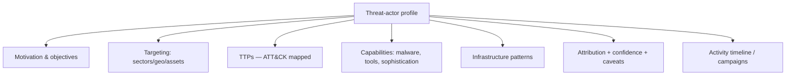
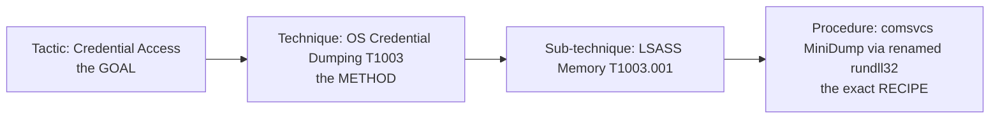
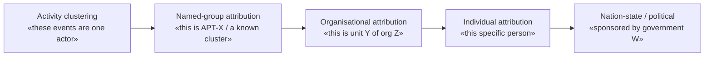
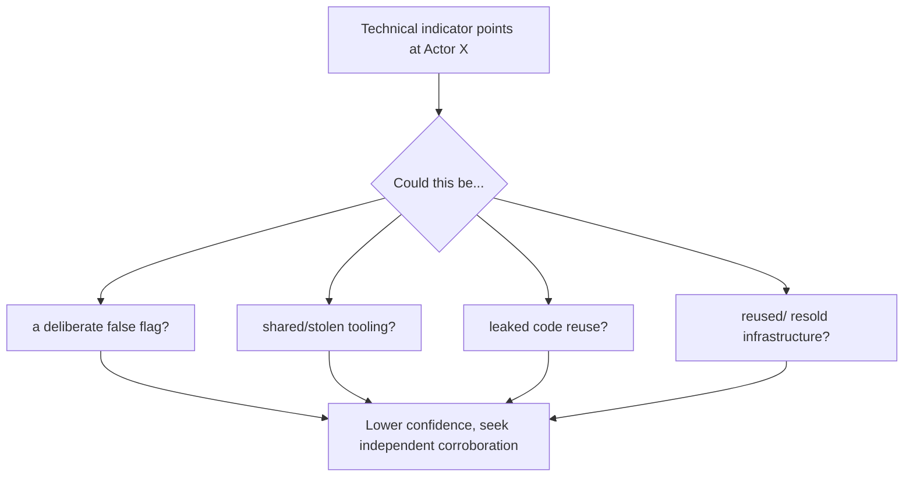
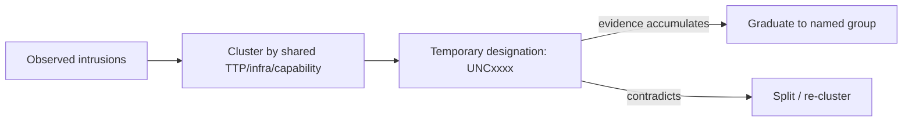

**Level:** Advanced · **Track:** Threat Intel & Hunting · **Read time:** 265 min

This is Chapter 3 of the Threat Intel & Hunting notebook. The previous
chapter ended at the Diamond Model's *Adversary* vertex — the hardest
one to fill. This chapter is about filling it responsibly: building a
**threat-actor profile**, analysing an adversary's **TTPs** as the
durable core of that profile, and confronting the genuinely difficult,
often misunderstood discipline of **attribution** — deciding *who* is
behind an intrusion, and to what level of confidence.

Attribution is the part of threat intelligence most distorted by
television and marketing. In reality it is slow, uncertain, rarely a
defender's job, and — importantly — *usually not necessary* to defend
effectively. The mature analyst treats "who did it" as a spectrum of
claims with wildly different evidentiary bars, and knows that the
operationally valuable output is almost always the *behavioural* profile
(TTPs), not the flag-planting headline. This chapter teaches both: how
to profile an actor usefully, and how to reason about attribution
without fooling yourself.

Everything here is defensive analysis on public reporting and on threats
to systems you protect. Actor profiling and adversary emulation are used
to *defend* — to prioritise detections and test controls — never to
impersonate or target others. Emulation is performed only against
systems you are authorised to test.

---

## Part 1: What a Threat-Actor Profile Actually Is

A **threat actor** is an individual or group responsible for malicious
cyber activity. A **threat-actor profile** is a structured,
evidence-based description of one such group that answers the questions
a defender or decision-maker needs: who they target, why, how, and what
to do about them.

Beginners imagine a profile as "the name of a hacker group." That is the
least useful part. A genuinely operational profile contains:

- **Motivation and objectives** — financial, espionage, hacktivism,
  sabotage (the taxonomy from Chapter 1). This shapes *whether they care
  about you* and *what they'll do if they get in*.
- **Targeting** — sectors, geographies, and asset types they go after.
  This is the single most important field for answering "are they a
threat
  to us?"
- **TTPs** — their tactics, techniques, and procedures, mapped to ATT&CK.
  This is the durable core (Part 3) and what drives detection.
- **Capabilities** — malware families, tools, exploits, and level of
  sophistication (do they burn zero-days, or reuse commodity tooling?).
- **Infrastructure patterns** — how they build and rotate C2, registration
  habits, hosting preferences (the Diamond's Infrastructure vertex).
- **Attribution and confidence** — who they're assessed to be, at what
  confidence, and the caveats.
- **Activity timeline** — known campaigns, first-seen, notable operations,
  and trends.



**The operational test of a good profile:** does it change what a
defender does? A profile that says "APT-Whatever is a sophisticated
actor that uses advanced techniques" is useless — it could describe
anyone. A profile that says "this crew gains access via exposed RDP and
phishing, escalates with LSASS dumping and DCSync, moves via PsExec, and
encrypts within 48 hours; they target mid-size manufacturing in your
region" is actionable — it tells the SOC exactly which detections to
prioritise and the CISO exactly which controls to fund. **Aim every
profile at driving a decision, not at sounding impressive** — the same
lesson as Chapter 1.

---

## Part 2: The Naming Chaos

Before going deeper, confront a practical mess that confuses everyone
new to the field: **threat actors have many names, and they don't line
up.** The same group might be called, by different vendors:

- A **numbered "APT"** (Mandiant's APTn scheme, e.g. APT29).
- A **themed cryptonym** (CrowdStrike's animal-by-nation scheme — Bears
  for Russia, Pandas for China, Kittens for Iran, Chollimas for North
  Korea, Spiders for cybercrime).
- A **Microsoft weather/name scheme** (e.g. "Midnight Blizzard," where the
  two-word name encodes a category).
- A **Recorded Future / Palo Alto / Secureworks** internal designation.
- A **self-chosen brand** (common for ransomware/hacktivist groups who
  *want* the notoriety).

So APT29 ≈ Cozy Bear ≈ Midnight Blizzard ≈ The Dukes — *approximately*,
because different vendors draw the boundaries of "the group" slightly
differently based on their own visibility. **This is not pedantry; it
has real consequences:** two reports using two names may describe
overlapping-but-not-identical activity, and treating them as identical
imports one vendor's attribution assumptions into your analysis
silently.

**How to cope:**

- Use **MITRE ATT&CK's "Groups"** pages as a cross-reference — each group
  entry lists the associated names from major vendors, so you can map
  between them.
- Track by **behaviour (TTPs)**, not by name, wherever possible —
  behaviour is stable while names proliferate.
- When you must use a name, **cite the source and its definition**, and
  treat cross-vendor name equivalences as approximate, not exact.
- For activity you can't confidently tie to a named group, use a
  **temporary/uncertainty designation** (Part 8) rather than forcing a
  premature label.

| Vendor scheme | Style | Example |
|---------------|-------|---------|
| Mandiant | APT + number / FIN + number / UNC + number | APT29, FIN7, UNC2452 |
| CrowdStrike | Adjective + animal (animal = nation/type) | Cozy Bear, Fancy Bear |
| Microsoft | Adjective + weather (weather = category) | Midnight Blizzard |
| Secureworks | Metal/element + name | Iron Hemlock |
| Self-branded | Group's own name | LockBit, Anonymous |

---

## Part 3: TTPs — The Durable Core of a Profile

The single most valuable, most durable content of an actor profile is
its **TTPs** — Tactics, Techniques, and Procedures. Recall the Pyramid
of Pain: TTPs sit at the summit because they are what the adversary
finds hardest to change. A profile built on TTPs survives the actor
rotating every IP, domain, and hash; a profile built on IOCs is obsolete
in weeks.

### Tactics vs Techniques vs Procedures

The three words are a hierarchy of abstraction, and precision matters:

- **Tactic** — the adversary's *goal* at a phase: "Credential Access,"
  "Lateral Movement," "Exfiltration." The *why* of a step. In ATT&CK
these
  are the matrix columns.
- **Technique** — the general *method* to achieve the tactic: "OS
  Credential Dumping" (T1003), "Remote Services" (T1021). The *how*, in
  general terms. (ATT&CK also has **sub-techniques**, e.g. T1003.001
LSASS
  Memory.)
- **Procedure** — the *specific implementation* a given actor uses: "dumps
  LSASS with `comsvcs.dll` MiniDump via a renamed rundll32, then
  exfiltrates the dump over an existing beacon." The exact recipe.
  Procedures are the most specific and often the most identifying.



**Why the distinction matters for tracking:** two actors may share a
*technique* (everyone dumps LSASS) but differ in *procedure* (which
tool, which flags, which evasion), and it's the procedure that often
distinguishes them. Conversely, tracking at the technique level catches
an actor even when they swap the specific tool. Good profiling captures
both: the technique for durable detection, the procedure for precise
attribution and hunting.

### TTPs as the identity of an actor

Because TTPs reflect an actor's training, tooling investment, and
operational habits, they function almost like a behavioural fingerprint.
A group that always phishes with a particular lure style, always uses a
specific loader, always escalates the same way, and always exfiltrates
via the same method is *recognisable* across campaigns even with
entirely fresh infrastructure. This is the basis of TTP-based tracking
and clustering (Part 8) — and the reason the Pyramid says denying TTPs
is what truly hurts.

---

## Part 4: MITRE ATT&CK — The Shared Language

You cannot do modern actor profiling without **MITRE ATT&CK**, the
framework that has become the universal vocabulary for TTPs. Teach it
properly, because it underpins everything that follows.

### What ATT&CK is

ATT&CK (Adversarial Tactics, Techniques, and Common Knowledge) is a
free, curated knowledge base of real-world adversary behaviour,
maintained by MITRE. Its structure:

- **Tactics** — the adversary's tactical goals, as columns:
  Reconnaissance, Resource Development, Initial Access, Execution,
  Persistence, Privilege Escalation, Defense Evasion, Credential Access,
  Discovery, Lateral Movement, Collection, Command and Control,
  Exfiltration, Impact.
- **Techniques and sub-techniques** — the methods under each tactic, each
  with a stable ID (Txxxx / Txxxx.yyy), a description, examples of
  actors/software that use it, detection guidance, and mitigations.
- **Groups** — profiles of tracked threat actors, each mapped to the
  techniques and software they're known to use (with the cross-vendor
name
  mapping from Part 2).
- **Software** — malware and tools, mapped to the techniques they
  implement.
- **Mitigations & Data Sources** — what defends against each technique and
  what telemetry detects it.

There are **matrices** for Enterprise
(Windows/Linux/macOS/cloud/network/containers), Mobile, and ICS. The
Enterprise matrix is your daily driver.

### Why it changed the field

Before ATT&CK, everyone described attacker behaviour in their own words,
making sharing and comparison nearly impossible. ATT&CK gives a *common,
granular, testable* vocabulary. Now a profile, a detection, a red-team
plan, and a coverage assessment can all speak the same technique IDs, so
they compose. When a report says an actor uses "T1566.001 → T1059.001 →
T1003.001 → T1021.002," any defender instantly knows exactly what that
means and can check their coverage. **This shared language is what makes
intelligence-driven detection (Chapters 1–2) actually work in
practice.**

### ATT&CK Groups and Software as profiling shortcuts

For a known actor, ATT&CK's Groups page is a ready-made TTP skeleton —
start there, then enrich with fresher reporting. For an unknown actor,
you build the mapping yourself from primary reporting (the lab in Part
7). Either way, the deliverable is an **ATT&CK layer**: the actor's
techniques highlighted on the matrix.

| ATT&CK object | Contains | Use in profiling |
|---------------|----------|------------------|
| Tactic | The adversary goal (matrix column) | Organises the profile by phase |
| Technique / sub-technique | Method + detection + mitigation | The TTP entries of the profile |
| Group | Actor ↔ techniques/software + aliases | Ready-made skeleton + name mapping |
| Software | Malware/tool ↔ techniques | Capability vertex of the Diamond |
| Mitigation / Data Source | Defences + telemetry per technique | Turns the profile into a defence plan |

---

## Part 5: The Attribution Spectrum

Now the hard part. **Attribution** is the process of determining who is
responsible for malicious activity — but "who" is not one question. It
is a spectrum of increasingly specific and increasingly difficult
claims:



- **Activity clustering** — the easiest and most useful: "these separate
  intrusions share enough TTPs/infrastructure/capability to be one
actor,"
  without naming them. This is achievable with technical evidence and
  directly drives defence.
- **Named-group attribution** — "this is the actor others call APT-X."
  Requires matching your cluster to established reporting; imports that
  reporting's assumptions.
- **Organisational attribution** — "this is a specific unit/contractor."
  Requires deep, often non-technical sourcing.
- **Individual attribution** — naming a person. Extremely hard; usually
  needs law-enforcement/intelligence resources (OPSEC failures,
  informants, legal process).
- **Nation-state / political attribution** — "government W directed this."
  A political and strategic judgment as much as a technical one,
typically
  made by governments, not defenders.

**The crucial insight: the level of attribution you need depends
entirely on the decision it serves — and for most defenders, the useful
level is the *lowest* one.** To defend, you need to *cluster* activity
and know its *TTPs*; you rarely need the name, almost never need the
organisation, and virtually never need the individual. Naming a
nation-state changes a government's diplomatic posture; it does not
change which detections your SOC should deploy. **Chasing high-level
attribution is usually a distraction from defence** — a point marketing
and headlines obscure.

---

## Part 6: Attribution Evidence, Pitfalls and the False-Flag Problem

When attribution *is* attempted, it rests on layered evidence and is
riddled with traps that fool the unwary. Understanding the evidence
types and the pitfalls is what separates honest attribution from
confident guessing.

### The evidence layers

Attribution assessments draw on multiple, corroborating evidence types —
the more independent layers agree, the higher the confidence:

- **Technical evidence** — malware code, infrastructure, TTPs, timestamps,
  language artifacts (code comments, keyboard layouts, PDB paths). The
  most accessible to defenders, and the most spoofable.
- **Operational evidence** — patterns of behaviour: working hours
  (timezone inference), target selection, operational tempo, tooling
  preferences over time.
- **Strategic/contextual evidence** — geopolitical context, who benefits
  (cui bono?), alignment with known state objectives or criminal
  economics.
- **All-source** — the highest-confidence attributions fuse technical with
  human, signals, and open-source intelligence that defenders typically
  don't have — which is *why* strong attribution is usually a government
  or top-tier-vendor product.

### The pitfalls — why technical evidence lies

Every technical indicator that seems to point at an actor can be faked
or misread:

- **False flags** — sophisticated actors *deliberately plant* evidence
  pointing at someone else: foreign-language strings, another group's
  tooling, misleading infrastructure. Real, documented operations have
  done exactly this to misdirect attribution.
- **Shared and stolen tooling** — many actors use the *same* commodity
  tools (Cobalt Strike, Mimikatz, public exploits), so tool presence
  attributes nothing. Cobalt Strike watermarks are shared/cracked; a
match
  is a weak signal, not proof.
- **Code reuse and leaks** — when malware source leaks (as major families
  have), unrelated actors adopt it, and "same malware" no longer means
  "same actor."
- **Infrastructure reuse and resale** — bulletproof hosting and IABs are
  shared across actors; two groups can operate from the same provider or
  even the same box.
- **Timestamp and language spoofing** — compile timestamps are trivially
  altered; language artifacts are deliberately manipulable;
working-hours
  analysis is defeatable by shifting schedules.
- **Mirror-imaging and confirmation bias** (Chapter 1) — assuming an actor
  thinks like you, or fitting every new indicator to your favourite
  suspect.



**The discipline:** never attribute on a single indicator; demand
*multiple independent layers* that agree; explicitly consider the
false-flag hypothesis (an ACH-style competing hypothesis, Chapter 1);
and state confidence honestly with the caveats. A high-confidence
attribution is one where technical, operational, and strategic evidence
converge and the alternative hypotheses (including deception) have been
actively tested and found less consistent. Anything less is a
hypothesis, and should be labelled as one.

### "Good enough for whom?"

Attribution confidence must be calibrated to the *consumer and the
stakes*. The bar to justify a diplomatic sanction, a press attribution,
a legal indictment, or an insurance decision is far higher than the bar
to justify "cluster these three incidents and prioritise these
detections." Always ask: *what decision rests on this attribution, and
what confidence does that decision require?* — the same
requirements-first thinking as Chapter 1.

---

## Part 6b: A Worked Attribution Mini-Case (Competing Hypotheses)

Attribution reasoning is best learned by watching it done. Here is a
compact, realistic example run through the ACH discipline of Chapter 1 —
the way an honest analyst actually thinks.

**The situation.** An intrusion at a European energy firm uses a loader
containing Cyrillic strings in its debug output, beacons to
infrastructure registered through a registrar popular with a
Russia-attributed group, and occurs during Moscow business hours. The
tempting conclusion: "Russia-attributed APT-R did this." Resist it and
enumerate hypotheses.

**Hypotheses:**

- **H1** — APT-R (the obvious Russia-attributed espionage group).
- **H2** — A different, financially motivated crew using leaked/shared
tooling and hosting.
- **H3** — A third actor running a **false-flag** operation designed to
look like APT-R.

**Evidence and consistency scoring (the ACH move — look for
*inconsistency*):**

| Evidence | H1 (APT-R) | H2 (crime) | H3 (false flag) |
|----------|-----------|-----------|-----------------|
| Cyrillic debug strings | Consistent | Inconsistent-ish | Consistent (easy to plant) |
| Registrar favoured by APT-R | Consistent | Neutral (shared) | Consistent (mimicry) |
| Moscow working hours | Consistent | Neutral | Consistent (schedulable) |
| Targeting: energy/espionage value | Consistent | **Inconsistent** (no clear payday) | Consistent |
| No data monetisation / extortion | Consistent | **Inconsistent** | Consistent |
| Tooling is *publicly leaked* variant | **Mildly inconsistent** (APT-R uses bespoke) | Consistent | Consistent |

**Reasoning.** Every "Russia" signal (strings, registrar, hours) is
*plantable*, so it cannot discriminate H1 from H3 — it is weak evidence
despite feeling strong (confirmation bias bait). The *espionage
targeting with no monetisation* is the strongest discriminator: it makes
H2 (crime) inconsistent, favouring an espionage actor (H1 or H3). But
the
*leaked/public tooling* is mildly inconsistent with H1, which
historically
fields bespoke malware — nudging toward H3.

**Assessment (honest).** "We assess it is **likely** the actor is a
state-aligned espionage group (targeting favours espionage); we assess
with only **low-to-moderate confidence** which one, because every
Russia-pointing indicator is trivially plantable and the tooling is
publicly available — a **false-flag hypothesis cannot be excluded**. For
our defensive purposes we cluster this as **UNC-Energy-1** and
prioritise
the observed TTPs; a named/national attribution is neither reached nor
required." That paragraph — probabilistic, confidence-calibrated,
deception-aware, decision-scoped — is what good attribution writing
looks
like, and it stands in deliberate contrast to the headline "Russia did
it."

---

## Part 7: Hands-On Lab — Profiling an Actor from Public Reporting

This lab builds a real, usable actor profile from public sources — the
core CTI craft — culminating in an ATT&CK layer and an emulation plan.
Use any well-documented group (an ATT&CK Groups entry plus a couple of
vendor reports and a DFIR Report write-up); the method is identical for
any actor.

**Objective (tie to a requirement, Chapter 1):** "Profile ransomware
crew *X* that is active against our sector, map its TTPs to ATT&CK, and
produce (a) a detection-priority list and (b) an emulation plan to test
our controls."

**Step 1 — collect primary reporting.**

```
- MITRE ATT&CK Groups page for X  -> baseline TTP + software list + aliases
- 2–3 vendor incident reports on X -> fresh procedures, infrastructure habits
- The DFIR Report / CISA advisory on X -> a full, timelined intrusion chain
- MalwareBazaar/VT for X's known samples -> capability confirmation
Rate each source (Admiralty); note the name mapping across vendors (Part 2).
```

**Step 2 — extract and normalise TTPs to ATT&CK.** Read each report and
pull out every behaviour, tagging it with a technique ID and the
*procedure* detail:

```
Initial Access  : T1566.001 phishing w/ ISO→LNK lure (procedure: password-protected ISO)
Execution       : T1059.001 PowerShell loader; T1204.002 user runs LNK
Defense Evasion : T1218.011 rundll32; T1055 injection into signed process
Cred Access     : T1003.001 LSASS via comsvcs MiniDump; T1003.006 DCSync
Discovery       : T1087.002, T1018 (AdFind procedure)
Lateral Movement: T1021.002 SMB/PsExec; T1021.001 RDP
Collection/Exfil: T1560.001 7-Zip; T1567.002 Rclone→MEGA
Impact          : T1490 vssadmin delete shadows; T1486 encrypt
```

**Step 3 — build the ATT&CK layer.** Encode the technique list as an
ATT&CK Navigator layer (JSON) and colour the actor's techniques. This
visual is the profile's centrepiece and directly overlays onto your
detection-coverage map:

```json
{
  "name": "Actor X TTPs",
  "domain": "enterprise-attack",
  "techniques": [
    {"techniqueID": "T1566.001", "score": 100, "comment": "ISO→LNK phish"},
    {"techniqueID": "T1003.001", "score": 100, "comment": "comsvcs MiniDump"},
    {"techniqueID": "T1003.006", "score": 100, "comment": "DCSync"},
    {"techniqueID": "T1021.002", "score": 100, "comment": "PsExec"},
    {"techniqueID": "T1490",     "score": 100, "comment": "vssadmin delete"},
    {"techniqueID": "T1486",     "score": 100, "comment": "encrypt"}
  ]
}
```

**Step 4 — assemble the full profile** (the fields from Part 1):
motivation (financial), targeting (your sector confirmed via leak-site
listings), the TTP layer above, capabilities (named loader + Cobalt
Strike + Rclone), infrastructure habits (fresh domains via a specific
registrar pattern, sibling IPs via cert reuse — the Diamond pivoting of
Chapter 2), and an **attribution statement with honest confidence**:

```
Attribution: Activity is CLUSTERED with high confidence as crew X based on
consistent procedures (ISO→LNK lure, AdFind, Rclone→MEGA) and leak-site
branding. Named-group attribution to [vendor names] is MODERATE confidence
(consistent TTPs, but Cobalt Strike watermark and shared tooling limit
certainty). No claim is made about individuals or sponsorship — unnecessary
for our defensive decision.
```

**Step 5 — derive the two deliverables.**

- **Detection-priority list:** overlay the actor's ATT&CK layer on your
  current detection coverage; the uncovered techniques (especially
  high-Pyramid ones like DCSync, LSASS dumping, shadow deletion) are
your
  prioritised backlog.
- **Emulation plan:** a step-by-step sequence reproducing the actor's TTP
  chain safely in a lab (Part 8's adversary emulation), so you can
  *verify* each detection fires.

**The output is exactly what Chapter 1 called finished intelligence:**
requirement-driven, evidence-based, honestly caveated, and it changes
what defenders do — detections get built and controls get tested against
a *real* adversary's behaviour, not a generic checklist.

---

## Part 8: Campaign Analysis, Clustering, and Adversary Emulation

### Clustering and temporary designations

Often you observe activity that is clearly *one actor* but that you
cannot (or should not yet) tie to a named group. The professional move
is to create a **cluster with a temporary designation** — Mandiant's
**UNC** ("uncategorized") numbers are the canonical example — and track
it by its shared TTPs, infrastructure, and capability. Over time, as
evidence accumulates, a cluster may be *graduated* to a named group (or
merged, or split). This discipline avoids the twin errors of premature
naming (false attribution) and of failing to track related activity
because it lacks a name.



A **campaign** is a set of related intrusions unified by a common goal,
actor, and timeframe — a series of Diamond events forming an activity
thread (Chapter 2). Campaign analysis links individual incidents into a
story of an actor's operation over time, which is what elevates tactical
observations into operational intelligence (Chapter 1's levels).

### Adversary emulation — the defensive payoff of profiling

The ultimate use of an actor profile is **adversary emulation**: safely
reproducing a specific actor's TTP chain against your own environment to
test whether your detections and controls actually work against *that*
adversary. This is distinct from generic penetration testing — it's
*threat-informed*, replaying a real actor's playbook.

- **Atomic Red Team** provides small, per-technique tests (one ATT&CK
  technique at a time) — ideal for validating individual detections from
  your priority list.
- **MITRE Caldera** and **adversary-emulation plans** (MITRE publishes
  full plans for several major actors) chain techniques into a realistic
  operation.
- **Purple teaming** runs the emulation collaboratively with the defenders
  watching, confirming each step is detected and tuning what isn't —
  closing the loop from profile → detection → validation.

**Blue team usage:** the emulation plan from the lab, run as a
purple-team exercise, turns your actor profile into *proven* detection
coverage. Every technique the actor uses that you can now detect is an
intrusion by that actor you'll catch early. This is the concrete,
defensive endpoint of the entire profiling exercise — and the reason
profiling is worth doing even when attribution is impossible: **you
don't need to know the actor's name to emulate and detect their
behaviour.**

---

## Part 8b: Diamond-Model-Driven Profiling and Sophistication Assessment

Chapter 2's Diamond Model is the scaffold on which a profile is
assembled: each vertex becomes a section of the profile, and *pivoting*
across edges is how you enrich a thin profile into a rich one.

### Mapping the Diamond onto the profile

- **Adversary** → the profile's *attribution + motivation* fields
(hardest, most caveated).
- **Capability** → the *capabilities* field: malware families, tools,
exploits — enriched by pivoting from samples to code-similarity
clusters.
- **Infrastructure** → the *infrastructure-patterns* field: registration
and hosting habits, rotation cadence — enriched by pivoting
IP→domain→cert
→sibling.
- **Victim** → the *targeting* field: sectors, geographies, assets —
enriched by pivoting from one victim to others sharing the actor's infra
or TTPs.

Across many intrusions, connected diamonds form the *activity timeline /
campaign* field. So the profile *is* a longitudinal, multi-event Diamond
— which is why the two models are taught back to back.

### Assessing sophistication

Profiles should include an honest **sophistication assessment**, because
it shapes defensive expectations (a commodity crew is stopped by
hygiene;
a top-tier APT may burn a zero-day). A workable rubric:

| Level | Hallmarks | Defensive implication |
|-------|-----------|----------------------|
| Low | Public tools, known exploits, noisy, opportunistic | Basic hygiene + patching stops most |
| Moderate | Some custom tooling, decent OPSEC, targeted | Behavioural detection + segmentation needed |
| High | Bespoke malware, good OPSEC, patient, n-day fast | Mature detection, tier-0 isolation, hunting |
| Top-tier | Zero-days, supply-chain, custom implants, excellent OPSEC | Assume breach; defence-in-depth + intel-led hunting |

**Beware the sophistication-inflation bias:** vendors and victims alike
are tempted to call every actor "sophisticated" (it excuses the breach
and sells reports). Rate sophistication against *evidence* — did they
actually use a zero-day, or just an unpatched n-day and a phish? Most
breaches, including damaging ones, are moderate-sophistication actors
exploiting basic gaps. Honest sophistication rating keeps defensive
priorities sane.

---

## Part 9: Detection & Defense Angle

Actor profiling exists to make defence sharper. This section
consolidates how the chapter's outputs feed the defensive program.

### Prioritise detection by real adversary behaviour

The profile's ATT&CK layer, overlaid on your coverage map, converts
"detect everything" (impossible) into "detect *these* techniques first"
(tractable) — prioritised by the actors your requirements say matter.
This is intelligence-driven detection engineering: the actors'
high-Pyramid TTPs (credential dumping, DCSync, lateral movement, shadow
deletion) become your top detection backlog because they're both durable
and high-impact. **Blue team usage:** maintain a living overlay of your
priority actors' techniques against your detection coverage; the gaps
are your roadmap.

### Validate, don't assume, with emulation

A detection you've never tested is a hope, not a control. Adversary
emulation (Atomic Red Team / Caldera / purple teaming) *proves* the
detections fire against the actual TTP chain. The
profiling→emulation→validation loop is the difference between "we have a
rule for LSASS dumping" and "we confirmed we detect this actor's
specific LSASS procedure."

### Use TTP-level tracking to stay ahead of infrastructure churn

Because you profile and detect at the *TTP* level (top of the Pyramid),
your defences survive the actor rotating infrastructure and recompiling
malware. IOC feeds still help (cheap, fast), but the profile's
durability comes from behaviour. **This is why the profile's TTP
section, not its IOC list, is the part you invest in.**

### Keep attribution in its lane

Defensively, resist the pull to over-attribute. Cluster activity, map
TTPs, build detections, emulate — none of which requires naming a
nation-state. Reserve named/organisational/political attribution for the
rare decisions that genuinely need it, source it to those equipped to do
it (governments, top-tier vendors), and always caveat. Over-claimed
attribution in a report is a liability, not a flex — it can misdirect
response, embarrass the org, and (with false flags in play) be exactly
what the adversary wanted.

### Share the profile (respecting TLP)

A well-built, ATT&CK-mapped actor profile is high-value sharing material
for your ISAC/trust group — your peers face the same actors. Reciprocity
means you receive others' profiles of actors before they reach you.
Respect TLP on anything shared (Chapter 1).

---

## Part 10: Common Pitfalls

- **Profiles that don't drive decisions.** "Sophisticated APT using
  advanced techniques" describes nobody. Make every field actionable —
  targeting and TTPs above all.
- **Name confusion.** Treating cross-vendor names as exact equivalents and
  importing one vendor's attribution assumptions silently. Track by
  behaviour; map names via ATT&CK; cite definitions.
- **Building profiles on IOCs.** Infrastructure and hashes rotate; a
  profile centred on them is stale in weeks. Centre it on TTPs (top of
the
  Pyramid).
- **Confusing technique and procedure.** Detecting "LSASS dumping in
  general" vs "this actor's specific procedure" are different jobs;
  capture both, and don't over-attribute a shared technique.
- **Single-indicator attribution.** Naming an actor from one string, tool,
  or IP. Demand multiple independent, converging evidence layers.
- **Ignoring false flags and shared tooling.** Taking planted language
  artifacts or Cobalt Strike watermarks at face value. Explicitly test
the
  deception hypothesis (ACH).
- **Over-attributing as a defender.** Chasing nation-state/individual
  attribution that no defensive decision needs, at the expense of
  clustering + detection.
- **Premature naming instead of clustering.** Forcing a named label on
  activity that should be a UNC-style cluster until evidence justifies
  graduation.
- **Untested detections.** Building rules from a profile and never
  emulating the actor to confirm they fire. Close the loop with purple
  teaming.
- **Sophistication inflation.** Labelling every actor "advanced/
  sophisticated" (it excuses the breach and sells reports) when the
  evidence shows a moderate actor exploiting a basic gap. Rate
  sophistication against what they actually did.

---

## Part 11: Final Revision / Summary

- **A threat-actor profile** captures motivation, targeting, TTPs,
  capabilities, infrastructure patterns, attribution+confidence, and
  activity timeline — and its worth is measured by whether it changes
what
  a defender does.
- **Naming is chaotic:** the same actor has many non-identical vendor
  names. Track by behaviour, map names via ATT&CK Groups, and never
import
  attribution assumptions silently.
- **TTPs are the durable core** (top of the Pyramid). Distinguish tactic
  (goal) → technique (method) → procedure (exact recipe); capture
  technique for durable detection and procedure for precise tracking.
- **MITRE ATT&CK is the shared language** — tactics,
  techniques/sub-techniques, Groups, Software, mitigations, data sources
—
  that lets profiles, detections, and emulation compose. The deliverable
  is an ATT&CK layer.
- **Attribution is a spectrum:** clustering → named group → organisation →
  individual → nation-state, each far harder than the last. The level
you
  need is set by the decision — and defenders usually need only
clustering
  + TTPs.
- **Attribution evidence is layered** (technical, operational, strategic,
  all-source) and technical evidence lies: false flags,
  shared/stolen/leaked tooling, reused infrastructure, spoofed
  timestamps/language. Never attribute on one indicator; test the
  deception hypothesis; state honest confidence.
- **"Good enough for whom?"** — calibrate attribution confidence to the
  stakes of the decision it serves.
- **Cluster with temporary designations** (UNC-style) rather than naming
  prematurely; link intrusions into campaigns/activity threads.
- **Adversary emulation is the payoff:** replay the profiled actor's TTP
  chain (Atomic Red Team, Caldera, purple teaming) to *prove* your
  detections work — no attribution required to defend against behaviour.
- **Keep attribution in its lane;** invest in TTP-level profiling,
  detection, and emulation, which survive infrastructure churn and
  directly harden the estate.

---

## Part 11b: Memory Hooks

- **A profile is a scouting report, not a wanted poster.** The valuable
part is *how the opponent plays* (TTPs), not the mugshot (the name).
- **TTPs are handwriting.** An actor can change the pen (tools) and the
paper (infrastructure), but the way they form letters (procedures) gives
them away across documents.
- **Attribution is an onion with a political core.** Clustering is the
easy outer layer; naming a nation-state is the innermost, and you rarely
need to peel that far to defend.
- **Every "flag" can be a false flag.** Anything an analyst can read, an
adversary can plant — strings, timestamps, tools, hours. Weigh plantable
evidence lightly.
- **Emulate the play, not the player.** You don't need to know who wrote
the playbook to run it against your own defences and see what you catch.

---

## Part 12: Cheat Sheet / Quick Reference

**Profile contents:** motivation · targeting (sector/geo/asset) · TTPs
(ATT&CK) · capabilities (malware/tools) · infrastructure patterns ·
attribution+confidence · activity timeline. *Test: does it drive a
decision?*

**Naming:** APTn (Mandiant) ≈ Adjective+Animal (CrowdStrike) ≈
Adjective+Weather (Microsoft) — *approximately*. Cross-reference via
ATT&CK Groups; track by TTP.

**TTP hierarchy:** Tactic (goal) → Technique Txxxx (method) →
Sub-technique Txxxx.yyy → Procedure (exact recipe).

**ATT&CK objects:** Tactics (columns) · Techniques/sub-techniques ·
Groups (actor↔TTP+aliases) · Software (malware↔TTP) · Mitigations · Data
Sources. Deliverable = **ATT&CK Navigator layer**.

**Attribution spectrum (easy→hard):** cluster activity → named group →
organisation → individual → nation-state. *Defenders usually need only
the first two.*

**Attribution evidence:** technical · operational · strategic ·
all-source. **Pitfalls:** false flags · shared/stolen/leaked tooling ·
reused infra · spoofed timestamps/language · mirror-imaging. Never
attribute on one indicator.

**Clustering:** UNC-style temporary designation → graduate to named
group as evidence accrues.

**Emulation:** Atomic Red Team (per technique) · MITRE Caldera /
emulation plans (chains) · purple teaming (validate detections). *You
don't need the actor's name to emulate their behaviour.*

**Sophistication rubric:** Low (public tools) · Moderate (some custom,
targeted) · High (bespoke, good OPSEC) · Top-tier (zero-days,
supply-chain). *Rate against evidence — beware inflation.*

---

## Part 13: Practice Labs & Resources

- **MITRE ATT&CK Groups & Software** and the **ATT&CK Navigator:** pick a
  group, build its layer, and overlay it on a blank coverage map — the
  core exercise of this chapter.
- **MITRE Adversary Emulation Library (CTID):** full, published emulation
  plans for major actors — read one and map it back to the group's
ATT&CK
  layer.
- **Atomic Red Team:** run individual technique tests in a lab and confirm
  your detections fire — the validation half of profiling.
- **MITRE Caldera:** chain techniques into an emulated operation against a
  lab environment.
- **The DFIR Report / CISA #StopRansomware / vendor threat reports:**
  primary sourcing for the lab — practise extracting TTPs and
normalising
  to ATT&CK.
- **TryHackMe:** "MITRE," "Threat Intelligence Tools," "Diamond Model,"
  and adversary-emulation rooms; **APTLabs / red-team paths** for
hands-on
  TTP chains.
- **Mandiant's "APT1" report and the "UNC" methodology posts:** classic
  reading on how professional attribution and clustering are actually
done
  — including their caveats.
- **"Attribution is hard" case studies:** read analyses of documented
  false-flag operations to internalise why single-source attribution
  fails.
- **Build a real profile:** pick an actor with rich public reporting,
  run the Part 7 workflow end to end, and produce an ATT&CK layer plus a
  one-page profile with an honestly-caveated attribution statement — the
  single best way to learn the craft.
- **Run an ACH matrix on a real disputed attribution:** take a
  well-documented incident where attribution was contested, enumerate
the
  hypotheses, and score the evidence yourself before reading the
experts'
  conclusion.
- **Purple-team an emulation plan:** pick one published MITRE emulation
  plan, run a few of its techniques in a lab with logging on, and
confirm
  which you detect — profiling turned into proven coverage.

The next chapter turns from the analysis to the machinery: the platforms
and standards that store, share, and operationalise everything you've
profiled — MISP, OpenCTI, and STIX/TAXII.

---

*Also on [Praneeth's portfolio](https://ping-praneeth.vercel.app/notebook/threat-intel-hunting/03-threat-actor-profiling-ttps-and-attribution), with comments and the latest edits.*
