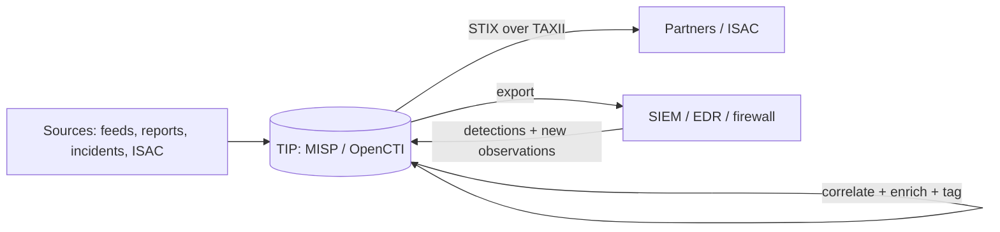
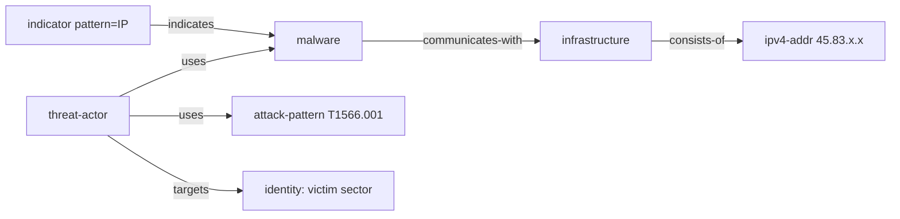
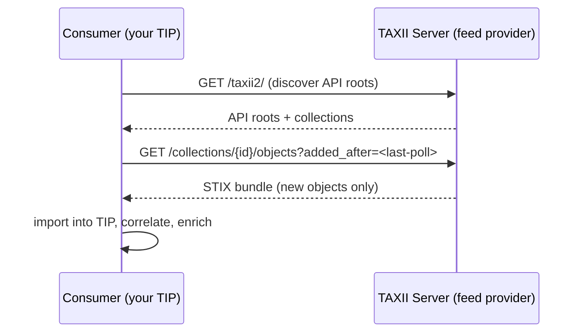
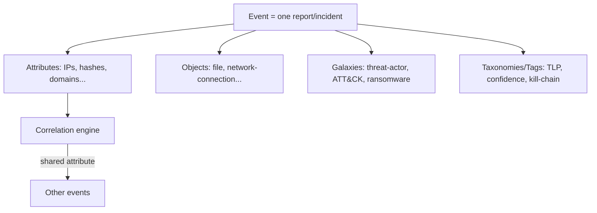
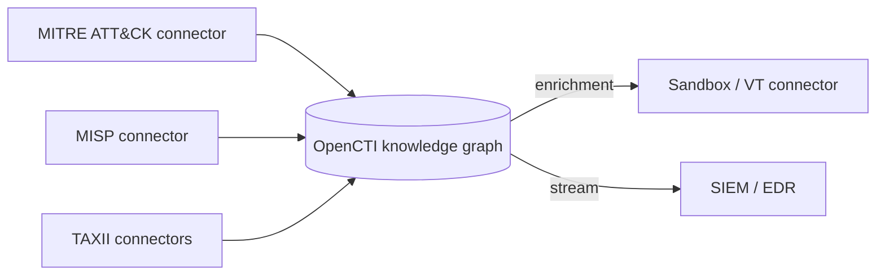
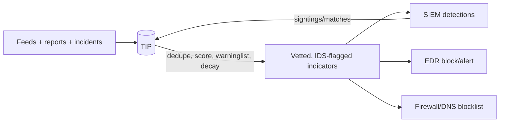
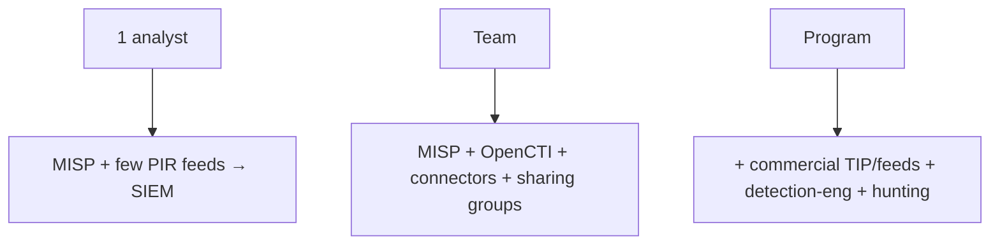

**Level:** Advanced · **Track:** Threat Intel & Hunting · **Read time:** 270 min

This is Chapter 4 of the Threat Intel & Hunting notebook, and it is the
tool-primer of the series. The first three chapters were about
*thinking*: what intelligence is, how to reason about indicators, how to
profile actors. This chapter is about the *machinery* that stores,
shares, and operationalises all of that at scale — because a
threat-intel program that lives in analysts' heads and spreadsheets
collapses the moment it grows beyond a handful of indicators.

Two things make this machinery work: **standards** that let intelligence
move between organisations and tools without being re-typed (STIX and
TAXII), and **platforms** that let a team collect, correlate, enrich,
and disseminate intelligence (MISP and OpenCTI, the two dominant
open-source Threat Intelligence Platforms, or TIPs). We teach all four
from zero, then wire them into detection.

Everything here is defensive: standing up your own TIP, consuming feeds,
and sharing (respecting TLP) with your own communities. Where we handle
indicators derived from adversary activity, it is to defend systems
you're responsible for — never to operate against others. Practise the
labs on your own instances and on public/test data.

---

## Part 1: Why Standards and Platforms Exist

Start with the problem they solve. Imagine a mid-size SOC a decade ago:
an analyst reads a vendor PDF, copies twelve IP addresses into a text
file, pastes them into the firewall, emails the file to a peer, and
forgets about it. Multiply that by dozens of reports a week and you get
the pathologies of immature CTI: indicators lost in inboxes, no memory
of *why* something was blocked, no way to see that today's phishing
domain relates to last month's incident, no machine-to-machine sharing,
and no path from "we know this is bad" to "the SIEM now alerts on it."

Standards and platforms fix each pathology:

- **A common data model (STIX)** means an indicator, an actor, a piece of
  malware, and their *relationships* have one agreed representation, so
  tools and organisations exchange intelligence without lossy re-typing.
- **A transport protocol (TAXII)** means that intelligence moves
  automatically between a producer and consumers over a defined API,
  rather than by email.
- **A platform (a TIP — MISP or OpenCTI)** gives a team one place to store
  intelligence, *correlate* it (surface that two events share an
  indicator), enrich it, control who it's shared with, and push it out
to
  enforcement points.



The loop closes: the TIP consumes intelligence, makes it richer and
connected, shares it with peers, and feeds it to the sensors that
enforce and detect — and the sensors' observations flow back in. This is
the F3EAD/lifecycle of Chapter 1 rendered as infrastructure.

---

## Part 2: STIX 2.1 From Scratch — the Data Model

**STIX (Structured Threat Information eXpression)** is the standard
language for representing threat intelligence. STIX 2.1 (the current
version) is expressed as **JSON**, which makes it human-readable and
easy for tools to parse. Teach the object model, because everything else
in the chapter is built on it.

STIX has three kinds of object:

### STIX Domain Objects (SDOs) — the "nouns" of intelligence

SDOs are the high-level concepts. The ones you use constantly:

| SDO | Represents | Diamond vertex |
|-----|-----------|----------------|
| `threat-actor` | An adversary/group | Adversary |
| `intrusion-set` | A set of activity attributed to one actor | Adversary |
| `campaign` | A set of related intrusions with a goal | Adversary (thread) |
| `malware` | A malicious tool/family | Capability |
| `tool` | A legitimate tool used maliciously | Capability |
| `attack-pattern` | A TTP (maps to an ATT&CK technique) | Capability |
| `indicator` | A detection pattern (with a STIX pattern) | — (detection) |
| `infrastructure` | C2/hosting resources | Infrastructure |
| `identity` | A victim or an org | Victim |
| `vulnerability` | A CVE | — |
| `observed-data` | Something actually seen in telemetry | — |
| `course-of-action` | A response/mitigation | — |
| `report` | A curated collection referencing other objects | — |

### STIX Cyber-observable Objects (SCOs) — the "facts"

SCOs are the raw observables themselves: `ipv4-addr`, `domain-name`,
`url`, `file` (with hashes), `email-addr`, `windows-registry-key`,
`process`, `network-traffic`, and so on. An SCO is the *thing*
(`45.83.x.x`); an `indicator` SDO is the *statement that seeing it is
malicious*.

### STIX Relationship Objects (SROs) — the "verbs"

SROs connect objects, and they are what make STIX a *graph* rather than
a list. The two SROs:

- `relationship` — a typed link: `threat-actor --uses--> malware`,
  `indicator --indicates--> malware`, `campaign --attributed-to-->
  intrusion-set`, `intrusion-set --uses--> attack-pattern`.
- `sighting` — a record that an indicator/actor was *seen* (by whom, when,
  how often) — the feedback signal.



**This is the Diamond Model as data.** Adversary
(`threat-actor`/`intrusion-set`), Capability
(`malware`/`attack-pattern`), Infrastructure (`infrastructure`/SCOs),
Victim (`identity`), all linked by SROs — exactly the structure of
Chapter 2, now machine-readable. When you "share intelligence in STIX,"
you are shipping a filled-in, linked Diamond.

### STIX patterns and bundles

An `indicator` carries a **STIX pattern** — a small query language for
describing what to match:

```json
{
  "type": "indicator", "spec_version": "2.1",
  "id": "indicator--<uuid>",
  "pattern_type": "stix",
  "pattern": "[file:hashes.'SHA-256' = 'abc123…'] OR [ipv4-addr:value = '45.83.x.x']",
  "valid_from": "2027-03-15T05:00:00Z",
  "indicator_types": ["malicious-activity"],
  "confidence": 80
}
```

A **bundle** is a JSON container holding many objects and their
relationships — the unit you export/import. Note the fields that echo
earlier chapters: `valid_from` (indicator decay, Chapter 2),
`confidence` (estimative discipline, Chapter 1). STIX bakes the analytic
hygiene into the format.

---

## Part 2b: A Complete STIX Bundle, Annotated

Reading a real bundle end to end is the fastest way to make the object
model concrete. Below is a minimal-but-complete STIX 2.1 bundle
representing the Northwind intrusion as a linked Diamond — the exact
kind
of object MISP/OpenCTI import and export.

```json
{
  "type": "bundle",
  "id": "bundle--11111111-1111-1111-1111-111111111111",
  "objects": [
    {
      "type": "threat-actor", "spec_version": "2.1",
      "id": "threat-actor--aaaa...",
      "name": "Crew X",
      "threat_actor_types": ["crime-syndicate"],
      "confidence": 70
    },
    {
      "type": "malware", "spec_version": "2.1",
      "id": "malware--bbbb...",
      "name": "NWLock encryptor",
      "malware_types": ["ransomware"], "is_family": true
    },
    {
      "type": "attack-pattern", "spec_version": "2.1",
      "id": "attack-pattern--cccc...",
      "name": "Spearphishing Attachment",
      "external_references": [
        {"source_name": "mitre-attack", "external_id": "T1566.001"}
      ]
    },
    {
      "type": "infrastructure", "spec_version": "2.1",
      "id": "infrastructure--dddd...",
      "name": "Crew X C2", "infrastructure_types": ["command-and-control"]
    },
    {
      "type": "ipv4-addr", "spec_version": "2.1",
      "id": "ipv4-addr--eeee...", "value": "45.83.0.0"
    },
    {
      "type": "identity", "spec_version": "2.1",
      "id": "identity--ffff...",
      "name": "Northwind Logistics", "identity_class": "organization",
      "sectors": ["transportation"]
    },
    {
      "type": "indicator", "spec_version": "2.1",
      "id": "indicator--0000...",
      "pattern_type": "stix",
      "pattern": "[ipv4-addr:value = '45.83.0.0']",
      "valid_from": "2027-03-15T05:00:00Z",
      "indicator_types": ["malicious-activity"], "confidence": 80
    },
    {
      "type": "relationship", "spec_version": "2.1",
      "id": "relationship--r1...",
      "relationship_type": "uses",
      "source_ref": "threat-actor--aaaa...", "target_ref": "malware--bbbb..."
    },
    {
      "type": "relationship", "spec_version": "2.1",
      "id": "relationship--r2...",
      "relationship_type": "uses",
      "source_ref": "threat-actor--aaaa...",
      "target_ref": "attack-pattern--cccc..."
    },
    {
      "type": "relationship", "spec_version": "2.1",
      "id": "relationship--r3...",
      "relationship_type": "indicates",
      "source_ref": "indicator--0000...", "target_ref": "malware--bbbb..."
    },
    {
      "type": "relationship", "spec_version": "2.1",
      "id": "relationship--r4...",
      "relationship_type": "targets",
      "source_ref": "threat-actor--aaaa...", "target_ref": "identity--ffff..."
    }
  ]
}
```

Read it as a Diamond: the `threat-actor` (Adversary) **uses** the
`malware` and the `attack-pattern` (Capability), **targets** the
`identity` (Victim), the `indicator` **indicates** the malware and its
pattern points at the `ipv4-addr` SCO living inside the `infrastructure`
(Infrastructure). Every analytic field from earlier chapters is present:
`confidence` (Chapter 1), `valid_from` (decay, Chapter 2), the ATT&CK
`external_id` (Chapter 3). A parser walks the `objects` array, indexes
by
`id`, and follows `source_ref`/`target_ref` to reconstruct the graph —
which is precisely what a TIP does on import. **Once you can read this
bundle, you understand STIX.**

---

## Part 3: TAXII 2.1 — the Transport

STIX is the *content*; **TAXII (Trusted Automated eXchange of
Intelligence Information)** is the *transport* — the HTTPS API over
which STIX bundles move between producers and consumers. You don't email
STIX; you serve it over TAXII and let consumers pull it automatically.

TAXII 2.1 concepts:

- An **API Root** — a base URL grouping a set of collections/channels (an
  org may run several).
- A **Collection** — a logical container of STIX objects that clients can
  **read from** (poll/pull) or **write to** (push), subject to
  permissions. This is the request-response model most feeds use.
- A **Channel** — a publish-subscribe model (producer pushes to
  subscribers). (Defined in the spec; collections are far more common in
  practice.)
- **Filtering** — clients can request only objects added since a
  timestamp, of a certain type, etc., so a consumer polls incrementally.



**The practical picture:** an ISAC or vendor runs a TAXII server
exposing a collection; your MISP/OpenCTI is configured with that
collection's URL and credentials and polls it on a schedule, pulling new
STIX objects into your platform automatically. When *you* share, you can
expose your own TAXII collection for partners to pull. TAXII is what
turns "intelligence sharing" from a manual chore into infrastructure.

---

## Part 4: MISP From Scratch

**MISP (Malware Information Sharing Platform)** is the most widely
deployed open-source TIP, especially in Europe and across ISACs/CERTs.
It began as a malware-indicator sharing tool and grew into a full
platform. Teach it from zero.

### What MISP is and how it's structured

MISP is a PHP/MySQL web application (usually run from the official
Docker image or VM) built around a simple, powerful model:

- **Event** — the central unit: a container for everything about one
  incident, report, or campaign. Think "one report" or "one intrusion."
An
  event has metadata (date, threat level, analysis stage, distribution).
- **Attribute** — an individual indicator or data point inside an event:
  an IP, a hash, a domain, a filename, each with a *type* and a
*category*
  (e.g. category "Network activity", type "ip-dst"). Attributes have an
  **IDS flag** (should this be pushed to detection?) and a comment.
- **Object** — a structured group of attributes describing one thing
  coherently (e.g. a "file" object bundling filename + MD5 + SHA-256 +
  size), based on templates. Objects are how MISP represents richer
  entities than a single attribute.
- **Galaxy** — a knowledge library attached to events/attributes: threat
  actors, ATT&CK techniques, ransomware families, tools, sectors.
Galaxies
  are how you tag an event with "APT-X" or "T1566.001" from curated,
  shared vocabularies.
- **Taxonomy** — a set of machine-readable tags (TLP, PAP, confidence,
  kill-chain phase, etc.) for classification. TLP:AMBER,
  `admiralty-scale:source-reliability="b"`, etc.
- **Tag** — any label (from a taxonomy/galaxy or freeform) applied to
  events/attributes for filtering and sharing logic.



### Correlation — MISP's superpower

When you add an attribute, MISP automatically **correlates** it against
every other attribute in the database and surfaces matches. Add an IP
that appeared in a colleague's event three months ago, and MISP
instantly links the two events. This turns a pile of independent reports
into a connected graph — the platform *finds the relationships you'd
never spot by hand*, which is exactly the pivoting of Chapter 2,
automated across your whole intel corpus.

### Distribution and sharing

MISP has fine-grained **distribution** controls at event and attribute
level: "Your organisation only," "This community," "Connected
communities," "All communities," or a specific **Sharing Group** (a
named set of orgs). Combined with TLP taxonomy tags, this is how MISP
enforces who sees what — the technical implementation of the sharing
discipline from Chapter 1. MISP instances **synchronise** with each
other (push/pull) so a community shares automatically.

### Feeds

MISP ingests **feeds** — external sources of indicators (other MISP
instances, CSV/free-text feeds, or the many built-in community feeds
like the CIRCL OSINT feed, abuse.ch, etc.). Feeds populate your instance
with indicators you can correlate against and enforce.

### The PyMISP API

Everything MISP does via the web UI is available over a REST API,
wrapped by the official **PyMISP** Python library — essential for
automation:

```python
from pymisp import PyMISP, MISPEvent, MISPAttribute

misp = PyMISP('https://misp.local', '<API_KEY>', ssl=True)

# Create an event
ev = MISPEvent()
ev.info = 'Crew X phishing campaign against manufacturing'
ev.distribution = 1          # this community
ev.threat_level_id = 2       # medium
ev.analysis = 1              # ongoing
event = misp.add_event(ev)

# Add an indicator attribute, flagged for detection (IDS)
misp.add_attribute(event, {'type': 'ip-dst', 'value': '45.83.x.x',
                           'category': 'Network activity',
                           'to_ids': True, 'comment': 'Cobalt Strike C2'})

# Pull all attributes with the IDS flag for the last 7 days (feed the SIEM)
attrs = misp.search(controller='attributes', to_ids=True,
                    timestamp='7d', type_attribute=['ip-dst','domain'])
```

`to_ids=True` is the pivotal flag — it marks an attribute as
*detection-worthy*, so exports to the SIEM/EDR include only vetted
indicators, not every scrap in the database. This is how MISP keeps
enforcement clean (Chapter 2's quality-over-quantity, mechanised).

---

## Part 5: OpenCTI From Scratch

**OpenCTI** is the other dominant open-source TIP, newer than MISP and
built on a different philosophy. Where MISP is event/indicator-centric
and sharing-first, OpenCTI is **knowledge-graph-centric** and
analysis-first.

### What OpenCTI is

OpenCTI is a platform (Python/GraphQL backend, React frontend, backed by
Elasticsearch, Redis, RabbitMQ, MinIO) that models *all* threat
knowledge as a **graph of entities and relationships** conforming
closely to STIX 2.1. Its entities are the STIX SDOs — threat actors,
intrusion sets, campaigns, malware, attack patterns, indicators,
observables, identities, vulnerabilities, reports — and its
relationships are STIX SROs. You navigate it like a knowledge base: open
a threat actor, see its linked malware, campaigns, techniques, victims,
and reports.

### Connectors — how data gets in and out

OpenCTI's extensibility comes from **connectors**, containerised modules
in four types:

- **External-import connectors** — pull data in (MITRE ATT&CK, MISP,
  AlienVault OTX, abuse.ch, CVE feeds, TAXII servers). Running the
ATT&CK
  connector, for instance, populates OpenCTI with the entire ATT&CK
  knowledge base as native entities.
- **Internal-enrichment connectors** — enrich existing entities (e.g. look
  up a hash on a sandbox, geolocate an IP).
- **Internal-import-file connectors** — parse uploaded files (STIX
  bundles, reports, PDFs) into entities.
- **Stream/export connectors** — push data out to a SIEM/EDR or expose a
  live stream.



### MISP vs OpenCTI — when to use which

They are complementary more than competing, and many mature programs run
both (with a connector syncing between them):

| Dimension | MISP | OpenCTI |
|-----------|------|---------|
| Core model | Events + attributes (indicator-centric) | Knowledge graph (STIX-native entity/relationship) |
| Strength | Fast indicator sharing, correlation, ISAC ecosystem | Structured analysis, actor/campaign knowledge, relationships |
| Sharing | First-class (sync, sharing groups, huge community) | Via connectors; less sharing-centric |
| Best for | Tactical indicator exchange, community sharing | Operational/strategic knowledge management, analysis |
| Typical user | ISACs, CERTs, SOC tactical feeds | Threat-intel teams doing deep analysis |

A common architecture: **MISP for tactical indicator
ingest/sharing/enforcement, OpenCTI as the analytical knowledge base**,
connected so indicators and context flow between them. Choose based on
your program's centre of gravity — sharing and enforcement (MISP) vs
analysis and knowledge (OpenCTI).

---

## Part 6: The TIP in the Bigger Picture — Feeds, Quality, and Enforcement

A TIP is only as useful as what you put in and what you do with the
output. Two disciplines matter: **feed management** (input quality) and
**enforcement** (output to sensors).

### Feed management and quality

The temptation is to enable every free feed and drown (Chapter 1's
anti-pattern, at platform scale). Discipline:

- **Select feeds against your requirements (PIRs).** A healthcare SOC
  values H-ISAC and healthcare-relevant feeds over generic ones.
- **Track feed quality** — measure each feed's *hit rate* (how often its
  indicators actually match your telemetry) and *false-positive rate*.
  Drop feeds that only add noise. A feed that never matches anything
  relevant to you is costing storage and attention for nothing.
- **Deduplicate and score.** The same indicator arrives from many feeds;
  the TIP dedupes and can *score* it (more corroborating sources +
  higher-reliability sources = higher confidence). MISP's correlation
and
  OpenCTI's scoring handle this.
- **Carry decay** (Chapter 2) — age and expire indicators so stale IOCs
  don't reach enforcement.

### Enforcement — closing to the SIEM/EDR

The payoff is pushing *vetted* indicators (MISP's `to_ids`-flagged, or
OpenCTI's stream) into the sensors that block and detect:

```bash
# Pull IDS-flagged indicators from MISP as a SIEM-ingestible feed
curl -s -H "Authorization: <KEY>" -H "Accept: application/json" \
  https://misp.local/attributes/restSearch \
  -d '{"returnFormat":"csv","to_ids":1,"type":["ip-dst","domain","sha256"],
       "last":"7d","enforceWarninglist":1}' > enforce.csv
# -> ingested by Splunk/Elastic as a lookup / by firewall as a blocklist
```

Two flags encode the whole quality discipline: `to_ids:1` (only
detection-vetted indicators) and `enforceWarninglist:1` — MISP
**warninglists** are curated lists of known-good values (RFC1918 ranges,
top-1M domains, cloud provider IPs, your own assets) that prevent you
from ever pushing a benign indicator (like `8.8.8.8` or your own domain)
to a blocklist. **Warninglists are the single most important
false-positive guardrail in a TIP** and a direct answer to Chapter 2's
decay/false-positive problem.



---

## Part 7: Hands-On Lab — Stand Up MISP, Ingest, Correlate, Export, Enforce

This lab walks the full TIP workflow on a MISP instance you control.
It's reproducible on a lab VM (the official MISP Docker image) with
public feeds and test data.

**Step 1 — stand up MISP.**

```bash
# Official docker image (lab use)
git clone https://github.com/MISP/misp-docker && cd misp-docker
cp template.env .env        # set base URL, admin creds
docker compose up -d
# Browse https://localhost, log in, change the default admin password immediately
```

**Step 2 — enable and pull a feed.** In *Sync Actions → Feeds*, enable
the **CIRCL OSINT feed** and **abuse.ch** feeds, then *Fetch and store
all feed data*. MISP downloads their events and indicators. Verify:

```
Administration -> Feeds -> [feed] -> Preview  (see incoming events)
Global Actions -> List Events  (feed events now present)
```

**Step 3 — create your own event from an incident.** Model the Northwind
case (Chapter/notebook prior) as a MISP event:

```
Add Event:
  Info: "Crew X ransomware intrusion — Northwind"
  Distribution: This community only
  Threat level: High   Analysis: Completed
Add Attributes (with to_ids where they're detection-worthy):
  ip-dst        45.83.x.x         (Network activity, IDS on)  "Cobalt Strike C2"
  sha256        <encryptor hash>  (Payload delivery, IDS on)
  domain        evil.example      (Network activity, IDS on)
  filename      README_NWLOCK.txt (Artifacts dropped, IDS off) "ransom note"
Add Object: "file" template -> bundle name+md5+sha256 of the loader
```

**Step 4 — watch correlation fire.** If `45.83.x.x` (or the hash) also
appears in the CIRCL/abuse.ch feed you pulled, MISP shows a
**correlation** on the attribute linking your event to the feed event —
you've just discovered your intrusion overlaps known crew-X
infrastructure *automatically*. This is the platform doing Chapter 2's
pivoting for you.

**Step 5 — enrich with galaxies and taxonomies (ATT&CK + actor + TLP).**

```
Galaxies -> add "Attack Pattern" -> T1566.001, T1003.001, T1021.002, T1486
Galaxies -> add "Threat Actor"/"Ransomware" -> Crew X
Tags -> tlp:amber, admiralty-scale:source-reliability="b",
        estimative-language:confidence-in-analytic-judgment="moderate"
```

Now the event carries its TTPs (ATT&CK), its actor, and its
sharing/confidence classification — a fully structured intelligence
object.

**Step 6 — export as STIX and share.**

```bash
# Export the event as a STIX 2.1 bundle (the linked Diamond, machine-readable)
curl -s -H "Authorization: <KEY>" -H "Accept: application/json" \
  https://localhost/events/restSearch \
  -d '{"returnFormat":"stix2","eventid":<ID>}' > northwind.stix.json
# Inspect: threat-actor, malware, attack-pattern, indicator, infrastructure + SROs
```

For real sharing you'd set distribution to a Sharing Group and let MISP
sync push it to partner instances, or expose it over TAXII.

**Step 7 — enforce to the SIEM.** Pull the vetted, warninglist-filtered
indicators as a feed the SIEM ingests (the `restSearch` with `to_ids:1,
enforceWarninglist:1` from Part 6). Configure a SIEM lookup/correlation
search that alerts when any live telemetry matches. Add a **sighting**
back in MISP whenever it fires, so the platform records that the
indicator was actually seen — feeding the confidence/decay loop.

**The result:** in one workflow you consumed external intelligence,
recorded your own, let the platform correlate them, structured it with
ATT&CK/actor/TLP, exported shareable STIX, and pushed vetted indicators
to detection with false-positive guardrails — the entire Chapter 1
lifecycle running on infrastructure.

---

## Part 7b: The Platform Landscape and Program Fit

MISP and OpenCTI are the open-source pillars, but knowing the wider
landscape helps you place them.

- **Commercial TIPs** (Anomali, ThreatConnect, EclecticIQ, Recorded
Future, and others) bundle a platform with curated intelligence feeds
and
often add case management, dashboards, and vendor analyst support. They
trade cost for convenience and support; the underlying model is the same
STIX/TAXII world. Many mature programs run a commercial platform *and*
MISP (for community sharing) *and* OpenCTI (for analysis), stitched
together.
- **SIEM/EDR-native intel modules** (Sentinel threat intelligence, Elastic
Threat Intel, Splunk Enterprise Security's threat framework) let you
ingest STIX/TAXII directly into the detection stack. Useful, but they
are
*consumers*, not full TIPs — they lack the correlation/knowledge/sharing
depth of a dedicated platform.
- **DIY** — small teams sometimes start with a spreadsheet or a git repo
of IOCs. This works only at tiny scale; the pathologies of Part 1
reappear quickly, which is why even small SOCs benefit from a MISP
instance.

**Sizing to the program.** A one-analyst shop is well served by a single
MISP instance consuming a few PIR-aligned feeds and pushing `to_ids`
indicators to the SIEM. A larger team adds OpenCTI for analysis, more
connectors, and formal sharing-group participation. A big program layers
in a commercial feed/platform and dedicated detection-engineering and
hunting functions fed by the TIP. **The platform should match the
program's maturity (Chapter 1), not exceed it** — an enterprise TIP with
no analysts or requirements is the expensive-spreadsheet anti-pattern
writ large.



---

## Part 8: Detection & Defense Angle

The TIP is where intelligence becomes *operational defence*, so its
defensive value is direct and worth making explicit.

### The TIP is the memory and nervous system of the program

Without a TIP, intelligence is amnesiac — every report is analysed in
isolation and forgotten. The TIP gives the program **memory** (every
indicator and its context, forever, with decay), **correlation**
(automatic discovery that today's alert relates to last quarter's
incident), and a **nervous system** (feeds in from sources, out to
sensors). Standing one up is often the single highest-leverage maturity
step a CTI program can take.

### Feed the sensors with vetted intelligence, not raw feeds

The recurring lesson of the whole notebook lands here concretely:
**never wire a raw feed straight to a blocklist.** Route everything
through the TIP so it's deduplicated, scored, decayed, and
warninglist-filtered before it reaches enforcement. The `to_ids` flag
and warninglists are the mechanisms that stop you blocking `8.8.8.8` or
your own CDN — the false-positive discipline of Chapter 2 made into
infrastructure. A TIP that pushes bad indicators to the SOC erodes trust
in the entire detection stack.

### Correlation drives hunting

MISP correlation and OpenCTI's graph don't just link records — they
generate **hunt leads**. An attribute correlating your environment with
a known actor's infrastructure is a hypothesis to hunt (Chapter 5): "if
this crew's C2 shows up in our feed, is there activity in our telemetry
we missed?" The TIP is where tactical intelligence and proactive hunting
meet.

### Sightings and sharing strengthen the commons

Recording **sightings** (that an indicator was actually seen) turns your
enforcement into a *sensor* that improves everyone's intelligence — and
sharing your vetted events (respecting TLP) means your ISAC catches the
actor faster. The TIP is the technical enabler of the reciprocity that
makes sector defence work. **Blue team usage:** an ISAC of TIPs
synchronising is a shared immune system — one member's incident becomes
everyone's detection within minutes.

### Operationalise ATT&CK coverage

Because galaxies/OpenCTI carry ATT&CK, the TIP can report *which
techniques your intelligence covers*, feeding the coverage-vs-actor
overlay from Chapter 3. The platform thus links intelligence, detection
engineering, and hunting into one measurable program.

---

## Part 9: Common Pitfalls

- **Wiring raw feeds to enforcement.** Blocking straight from a feed with
  no dedup/scoring/warninglist produces outages and false positives.
Route
  through the TIP; use `to_ids` + warninglists.
- **Feed hoarding.** Enabling every feed and drowning in un-actioned
  indicators. Select against PIRs; measure hit rate; drop noisy feeds.
- **No decay.** Indicators live forever and stale IOCs reach sensors.
  Model decay/expiry; carry valid-from/last-seen.
- **Confusing SCO and indicator.** An observable (the IP) is not the same
  as the statement that seeing it is malicious (the indicator). Keep the
  distinction, or you enrich/score the wrong object.
- **Ignoring TLP/distribution.** Over-sharing a TLP:RED report or
  mis-setting event distribution leaks intelligence and breaks trust.
Set
  distribution and TLP deliberately on every event.
- **Treating the TIP as a database, not a program.** A TIP with no
  analysts, no requirements, and no feedback is a very expensive
  spreadsheet. The platform amplifies a program; it doesn't replace one.
- **MISP-vs-OpenCTI as either/or.** They serve different centres of
  gravity (sharing/enforcement vs analysis/knowledge) and often run
  together. Choose by need, not hype.
- **No sightings.** Enforcing indicators but never recording matches, so
  confidence/decay never learn from reality. Wire sightings back from
the
  SIEM.
- **Neglecting warninglists.** The one guardrail that prevents blocking
  your own/known-good infrastructure — enable and maintain it.

---

## Part 10: Final Revision / Summary

- **Standards and platforms exist to cure the pathologies of manual CTI:**
  lost indicators, no memory, no correlation, no machine sharing, no
path
  to enforcement.
- **STIX 2.1 is the data model** — SDOs (nouns: threat-actor, malware,
  attack-pattern, indicator, infrastructure, identity…), SCOs
  (observables), SROs (relationship, sighting). It *is* the Diamond
Model
  as machine-readable, linked JSON; bundles are the unit of exchange;
  patterns describe what to match.
- **TAXII 2.1 is the transport** — an HTTPS API of API roots and
  collections that consumers poll for new STIX; it turns sharing into
  infrastructure.
- **MISP** is event/attribute-centric, sharing-first: events contain
  attributes/objects, enriched by galaxies (actors, ATT&CK) and
taxonomies
  (TLP, confidence); its **correlation engine** auto-links events
sharing
  an indicator; distribution + sharing groups + sync enable community
  sharing; PyMISP automates it; the `to_ids` flag gates enforcement.
- **OpenCTI** is knowledge-graph-centric, analysis-first: STIX-native
  entities and relationships, populated and pushed via **connectors**
  (ATT&CK, MISP, TAXII, enrichment, stream). Use MISP for tactical
  sharing/enforcement, OpenCTI for analytical knowledge; often run both.
- **Feed quality and enforcement are the disciplines that matter:** select
  feeds by PIRs, measure hit rate, dedupe/score, decay, and — above all
—
  **warninglist-filter** before pushing *vetted* (`to_ids`) indicators
to
  SIEM/EDR/firewall. Never wire a raw feed to a blocklist.
- **The TIP is the program's memory and nervous system:** it remembers,
  correlates (generating hunt leads), enforces with guardrails, records
  sightings, and shares (respecting TLP) — running the Chapter 1
lifecycle
  as infrastructure.

---

## Part 10b: Memory Hooks

- **STIX is LEGO for intelligence.** SDOs are the shaped bricks (actor,
malware, indicator), SCOs are the raw studs (an IP, a hash), and SROs
are
the connectors that snap them into a model — a Diamond you can post to a
friend.
- **TAXII is the postal service.** STIX is the letter; TAXII is the
delivery route with mailboxes (collections) your peers pick up from on a
schedule.
- **MISP is a shared bulletin board with a memory.** Pin a report, and it
automatically draws string between your pin and every other pin that
mentions the same thing (correlation).
- **`to_ids` is the "safe to shoot" flag.** Only indicators wearing it get
sent to the guns (SIEM/EDR); warninglists are the "don't shoot our own
people" rule on top.
- **OpenCTI is an encyclopaedia; MISP is a newswire.** One is for deep,
linked knowledge you study; the other is for fast facts you share and
act
on. Big programs read both.

---

## Part 11: Cheat Sheet / Quick Reference

**STIX 2.1 objects:** SDOs (threat-actor, intrusion-set, campaign,
malware, tool, attack-pattern, indicator, infrastructure, identity,
vulnerability, report) · SCOs (ipv4-addr, domain-name, file, url,
email-addr…) · SROs (`relationship`, `sighting`). Bundle = container.
Pattern = match language.

**Diamond → STIX:** Adversary=threat-actor/intrusion-set ·
Capability=malware/attack-pattern · Infrastructure=infrastructure/SCO ·
Victim=identity · linked by SROs.

**TAXII 2.1:** API Root → Collections (poll/push) / Channels (pub-sub).
Consumer polls `objects?added_after=<t>`.

**MISP model:** Event → Attributes (type+category, `to_ids` flag) +
Objects (templates) + Galaxies (actors, ATT&CK) + Taxonomies (TLP,
confidence). Correlation auto-links. Distribution: org / community /
connected / all / sharing-group.

```python
misp = PyMISP(url, key, ssl=True)
misp.add_event(ev); misp.add_attribute(event, {...,'to_ids':True})
misp.search(controller='attributes', to_ids=True, timestamp='7d')
```

**Enforcement:** export `to_ids:1` + `enforceWarninglist:1` →
SIEM/EDR/firewall. **Warninglists** = known-good guardrail (don't block
8.8.8.8 / your own assets).

**OpenCTI:** STIX knowledge graph; **connectors** = external-import
(ATT&CK, MISP, TAXII) · enrichment · file-import · stream/export.

**Choose:** MISP = tactical sharing + enforcement · OpenCTI = analysis +
knowledge. Often both, connected.

---

## Part 12: Practice Labs & Resources

- **MISP training:** the official **MISP training materials** and the
  **misp-docker** image — stand up an instance and reproduce the Part 7
  lab end to end.
- **CIRCL MISP feeds & the MISP "Feeds" list:** enable public OSINT feeds
  and watch correlation fire against real indicators.
- **OpenCTI demo/sandbox:** the official OpenCTI docker-compose plus the
  **MITRE ATT&CK connector** — populate the graph and explore
  actor→malware→technique→victim relationships.
- **OASIS STIX/TAXII 2.1 specs and the `stix2` Python library:** build and
  parse a bundle by hand to internalise SDO/SCO/SRO; run a local TAXII
  server (e.g. `medallion`) and poll it.
- **TryHackMe:** "MISP," "OpenCTI," "Threat Intelligence Tools," and
  "TAXII/STIX"-related rooms give guided, scored practice.
- **abuse.ch (ThreatFox/MalwareBazaar) APIs + PyMISP:** script the
  ingestion of a real feed into MISP and the export of vetted indicators
  to a mock SIEM lookup.
- **Warninglist practice:** deliberately try to add a known-good IP as an
  IDS indicator and watch the warninglist flag it — internalise the
  false-positive guardrail.
- **Build the enforcement bridge:** wire MISP `restSearch` output into a
  Splunk lookup or an Elastic index and write a correlation search — the
  full intelligence-to-detection path.

The final chapter of this notebook brings everything together into
proactive defence: threat-hunting methodology and hypothesis-driven
hunting — using the intelligence, indicators, profiles, and platforms of
the previous chapters to find the adversary *before* they trip an alert.

---

*Also on [Praneeth's portfolio](https://ping-praneeth.vercel.app/notebook/threat-intel-hunting/04-threat-intel-platforms-and-feeds-misp-opencti-and-stix-taxii), with comments and the latest edits.*
