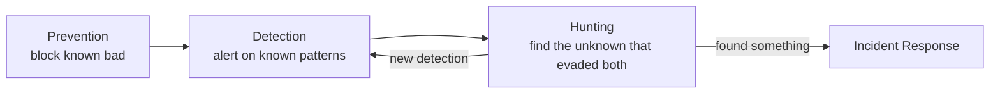
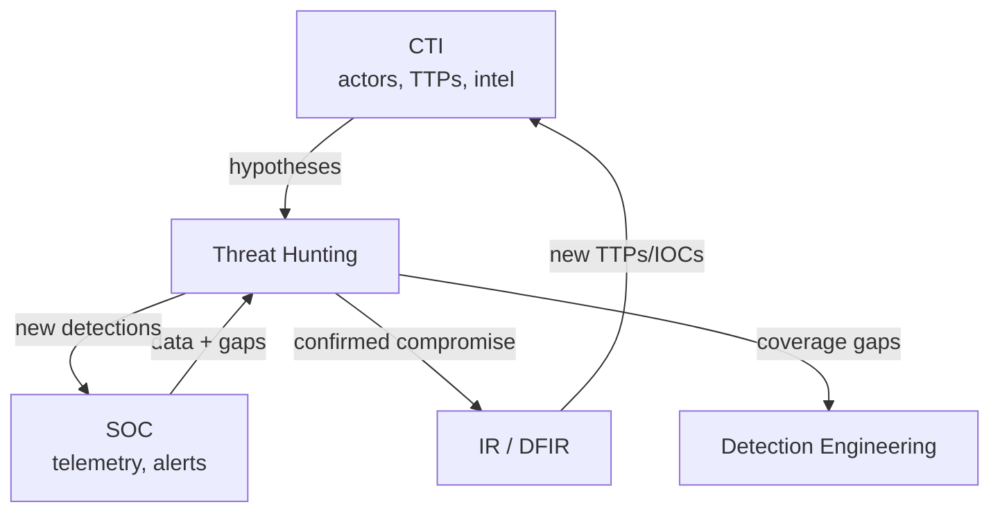
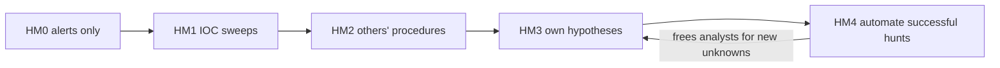
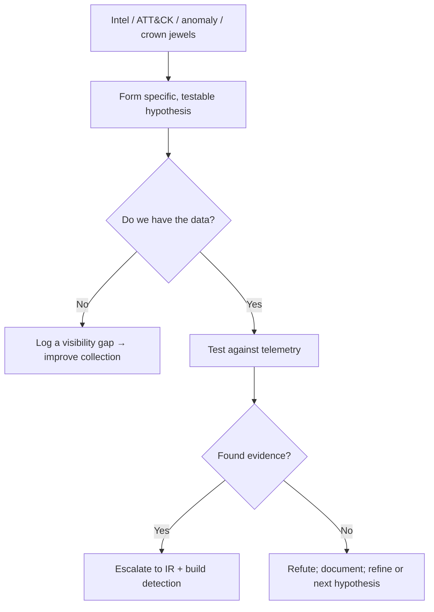
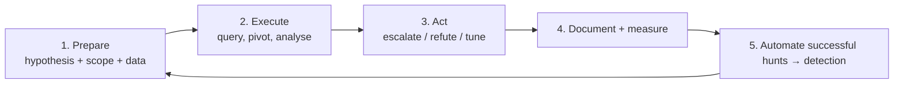
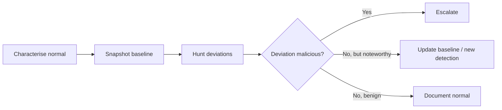
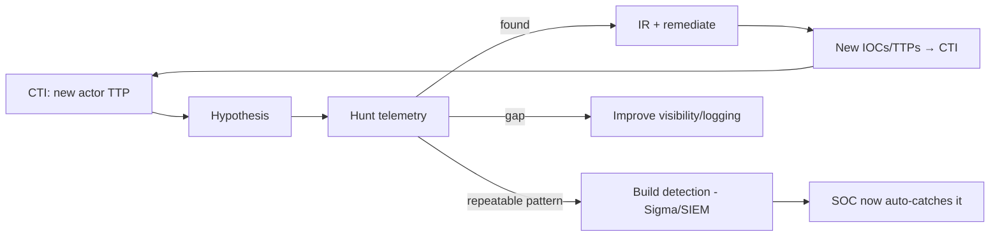

**Level:** Expert · **Track:** Threat Intel & Hunting · **Read time:** 275 min

This is Chapter 5, the final chapter of the Threat Intel & Hunting
notebook, and it is the capstone that puts every prior chapter to work.
The DFIR notebook taught you to investigate an intrusion after an alert.
The CTI chapters taught you to understand adversaries and structure what
you know. **Threat hunting** is the discipline that closes the gap
between them: proactively searching your environment for adversaries who
are *already inside* but who have **not tripped any alert**.

That last clause is the whole point. Every detection you have is a
hypothesis someone wrote down in advance about how an attack would look.
Real adversaries — especially the human-operated, TTP-savvy ones from
the previous chapters — deliberately operate in the seams your
detections don't cover. Hunting is the human-led, hypothesis-driven
activity that finds them anyway, and then *converts what it finds into
new detections* so the machine catches it next time. It is where
intelligence, telemetry, and analytic skill converge into proactive
defence.

Everything here is defensive, performed on systems and telemetry you are
authorised to examine. Hunting queries touch sensitive data; run them
under proper authorisation, with an eye to privacy and scope, on your
own or your client's environment.

---

## Part 1: What Threat Hunting Is — and Is Not

**Threat hunting is the proactive, hypothesis-driven, human-led search
through telemetry for signs of malicious activity that evaded automated
detection.** Unpack every word, because each excludes a common
misconception:

- **Proactive** — you go looking *before* an alert fires, on the
  assumption that something may already be wrong. This is the opposite
of
  the reactive SOC, which waits for an alert.
- **Hypothesis-driven** — a hunt starts with a specific, testable idea
  ("if actor X is here, I'd see LSASS access from non-standard
  processes"), not with aimlessly staring at dashboards.
- **Human-led** — hunting is an analyst applying judgment, creativity, and
  adversary knowledge. Tools assist; they don't hunt. (Automatable hunts
  *become detections* — see the flywheel.)
- **Evaded automated detection** — you hunt in the space your alerts
  *don't* cover. If a detection already catches it, that's not hunting,
  that's alerting.

**The assume-breach premise.** Hunting rests on a mindset shift: instead
of asking "are we breached?" you *assume* an adversary has already
bypassed your preventive and detective controls, and you go find them.
This premise is realistic — dwell times of weeks (Chapter/notebook
prior) mean that at any moment, a mature org may have an undetected
intruder — and it is productive, because it drives active searching
rather than passive waiting.

### What hunting is NOT

- It is **not** running a vulnerability scan (that finds weaknesses, not
  intruders).
- It is **not** monitoring dashboards or triaging the alert queue (that's
  SOC operations).
- It is **not** incident response (that's what you do *after* a hunt finds
  something, or an alert fires).
- It is **not** pure automation — though its *output* is often automation.
- It is **not** "buying a threat-hunting tool." Hunting is a practice, not
  a product; tools enable it.



Hunting sits *beyond* prevention and detection in the defensive stack,
and its distinctive contribution is finding what those layers missed —
then feeding improvements back into detection (the flywheel of Part 9).

---

## Part 2: Why Detections Aren't Enough

If you have good detections, why hunt? Because detection has structural
limits that hunting exists to cover:

- **Detections encode known behaviour.** A rule fires on a pattern someone
  anticipated. Novel TTPs, new tooling, and living-off-the-land
techniques
  that look like normal admin activity slip through by design.
- **Adversaries test against your defences.** Sophisticated actors
  validate their tooling against common EDR/AV before deploying it,
  specifically to avoid your detections. They operate in your blind
spots
  on purpose.
- **The base of the Pyramid of Pain decays** (Chapter 2). IOC-based
  detections are trivially bypassed; behavioural detections are better
but
  still finite. Hunting operates at the top of the pyramid, where
evasion
  is expensive, and finds the behaviours you haven't yet written a rule
  for.
- **Alert fatigue tunes detections down.** To keep false positives
  manageable, SOCs raise thresholds and suppress noisy rules — creating
  gaps a careful adversary lives in. Hunting deliberately looks *below*
  the alerting threshold.
- **Misconfiguration and coverage gaps.** Sensors fail, logs get dropped,
  new assets appear uninstrumented. Hunting surfaces the "we weren't
even
  watching there" problem.

**The strategic framing:** prevention and detection are necessary but
bounded; hunting is the human layer that compensates for their bounds
and continuously *expands* them (every hunt that finds something new
becomes a detection). A program with only prevention and detection is
betting that adversaries only do things it already anticipated — a bet
the dwell-time statistics say it loses.

---

## Part 3: Where Hunting Sits — SOC, IR, DFIR, CTI

Hunting is not a silo; it's the connective activity between the
disciplines of both notebooks. Knowing the relationships prevents role
confusion.



- **CTI feeds hunting** — actor profiles and TTPs (Chapters 1–4) are the
  richest source of hunt hypotheses ("actor X targeting our sector uses
  technique Y — are we seeing Y?"). This is F3EAD's *Find* driven by
  intelligence.
- **The SOC provides the data and the gaps** — hunting runs on the same
  telemetry the SOC monitors, and often targets exactly the space below
  the SOC's alert thresholds.
- **Hunting hands off to IR/DFIR** — when a hunt *confirms* malicious
  activity, it becomes an incident and the DFIR skills of the previous
  notebook take over (timeline, scope, contain).
- **DFIR feeds back to CTI** — the incident's TTPs and IOCs become new
  intelligence, generating new hunt hypotheses. The loop is continuous.
- **Hunting feeds detection engineering** — every repeatable hunt becomes
  a Sigma rule / detection, permanently expanding coverage.

**The key insight:** hunting is where the two notebooks meet. It
consumes CTI (this notebook) and produces IR triggers and detections;
when it finds something, DFIR (previous notebook) investigates; the
result becomes new CTI. Threat hunting is the flywheel's hub.

---

## Part 4: The Hunting Maturity Model

David Bianco's **Hunting Maturity Model (HMM)** describes how a
program's hunting capability matures, and it's a useful self-assessment:

| Level | Name | Characteristics |
|-------|------|-----------------|
| HM0 | Initial | Relies entirely on automated alerting; no hunting. Minimal data collection. |
| HM1 | Minimal | Follows threat-intel indicators; some historical data search. Reactive IOC sweeps. |
| HM2 | Procedural | Applies hunting procedures created by others; good data collection. |
| HM3 | Innovative | Creates *new* hunting procedures; analysts drive hypotheses; strong analytics. |
| HM4 | Leading | Automates the successful hunts (they become detections); continuous improvement. |

The trajectory that matters is **HM3→HM4: a mature program doesn't just
hunt — it *automates* every successful hunt into a detection**, so
analysts' scarce time always moves to the next unknown rather than
re-running yesterday's hunt. This automation step *is* the flywheel and
the difference between a program that scales and one that burns out its
hunters repeating themselves. Two prerequisites gate the whole model:
**data** (you can't hunt what you don't collect — HMM levels track
data-collection maturity) and **skilled analysts** (HM3+ requires people
who can form novel hypotheses).



---

## Part 5: Hypothesis-Driven Hunting — Forming the Hypothesis

The heart of the discipline is the **hypothesis** — a specific, testable
statement about adversary activity that might be present, which you then
confirm or refute with data. A hunt with no hypothesis is aimless
dashboard-staring; a hunt with a *bad* hypothesis wastes effort.
Learning to form good hypotheses is the core skill.

### Sources of good hypotheses

- **Intelligence-driven** (the most common and valuable) — from CTI:
  "Actor X, active against our sector, uses `T1003.001` LSASS dumping
via
  `comsvcs.dll`. Hypothesis: there is evidence of `comsvcs.dll` MiniDump
  activity in our endpoint telemetry." This directly operationalises
  Chapters 1–4.
- **ATT&CK-driven** — walk the matrix and hunt techniques you can't
  currently detect: "We have no coverage for `T1547.001` Run-key
  persistence. Hypothesis: there are anomalous Run-key entries pointing
to
  user-writable paths."
- **Anomaly/baseline-driven** — from knowing normal: "Hypothesis: some
  host is beaconing — showing regular, low-jitter outbound connections
to
  a rare external destination."
- **Crown-jewel-driven** — start from what matters most: "If an adversary
  were after our source-code repo / patient database / payment system,
  they'd need to reach it. Hypothesis: there is anomalous access to
[crown
  jewel] from unexpected accounts/hosts."
- **Situational** — from a new CVE, a peer's incident, an M&A event, or an
  environmental change that expands attack surface.

### What makes a hypothesis *good*

A good hunting hypothesis is:

- **Specific** — names the behaviour/technique and the expected evidence,
  not "look for bad stuff."
- **Testable with available data** — you must have (or be able to get) the
  telemetry to confirm/refute it. An untestable hypothesis is a wish.
- **Falsifiable** — there's a clear "no, it's not here" outcome, not just
  an open-ended search.
- **Scoped** — bounded to a data set, time window, and asset set so it
  finishes.
- **Relevant** — tied to a real threat to *your* environment (Chapter 1's
  requirements), not a generic curiosity.



**Note the "no data" branch:** discovering you *can't* test a hypothesis
because you don't collect the telemetry is itself a valuable hunt
outcome — it's a documented visibility gap that drives instrumentation.
A hunt that ends in "we couldn't see" is not a failure; it's a finding.

---

## Part 6: The Hunt Loop — TaHiTI, PEAK, and the ABLE Method

Hunting is disciplined, not ad hoc, and several published methodologies
formalise the loop. They agree on the shape; know the shape.

### The loop



- **TaHiTI (Targeted Hunting integrating Threat Intelligence)** — a
  three-phase model: **Initiate** (hypothesis from a trigger, often
  intel), **Hunt** (define, refine, execute across iterations),
  **Finalize** (document, and feed results to detection/IR/CTI). Its
  defining feature is tight integration with threat intelligence —
exactly
  the intel-driven hypotheses of Part 5.
- **PEAK (Prepare, Execute, Act with Knowledge)** — a modern framework
  (from Splunk) structuring hunts into three types (hypothesis-driven,
  baseline, and model-assisted/ML), each with the Prepare→Execute→Act
  phases, and emphasising the **Knowledge** output: every hunt must
  produce documented, reusable knowledge (a detection, a baseline, a
gap).
- **The ABLE mindset** — a useful checklist for a hunt's ingredients:
  **A**ctor behaviour (the TTP), **B**ehaviour's observable,
**L**ocation
  (where in telemetry), **E**vidence (what would confirm it). Framing a
  hypothesis through ABLE forces it to be concrete and testable.

### The phases in practice

1. **Prepare** — write the hypothesis (Part 5), identify the data sources
   and time window, define what "found" and "not found" look like, and
   decide how you'll pivot.
2. **Execute** — run the queries, and *pivot* (the four-corner technique
   from the DFIR notebook, applied to hunting) — every interesting
result
   becomes the seed of the next query. Analyse anomalies, chase leads,
   refute sub-hypotheses.
3. **Act** — one of three outcomes: **escalate** to IR (found malicious
   activity), **refute** (no evidence — document it), or **tune** (found
   benign-but-noisy activity worth a baseline or a detection exception).
   Always **document**.
4. **Document & measure** — record the hypothesis, data, queries, findings,
   and time spent, so hunts are repeatable and the program is measurable
   (Part 10).
5. **Automate** — turn any repeatable, valuable hunt into a scheduled
   detection (Sigma/SIEM rule), advancing the maturity model and freeing
   you for the next unknown.

**The non-negotiable:** *every* hunt produces an output even when it
finds no adversary — a detection, a baseline, a documented gap, or a
refuted hypothesis. A hunt that produces nothing reusable was run wrong.
This is what separates hunting from wandering.

---

## Part 7: Hunting Techniques Across the Telemetry

Hypotheses have to be tested against real data with real analytic
techniques. Here are the workhorses, with queries, organised by
telemetry domain — the same sources as the log-timeline chapter, now
searched proactively.

### Stack counting (frequency analysis) — the fundamental technique

The single most useful hunting technique is **stack counting** (a.k.a.
**frequency of least occurrence** / **long-tail analysis**): aggregate a
field across the environment and look at the *rare* values, because
malicious activity is usually rare relative to the vast normal baseline.
Legitimate things are common; the attacker's tool, path, or
parent-process is uncommon.

```sql
-- Splunk: rarest parent-child process pairs (hunt anomalous execution)
index=sysmon EventCode=1
| stats count by ParentImage, Image
| sort count            -- the LEAST frequent rows are the interesting ones
| head 50
```

The insight: a `winword.exe → powershell.exe` pair appears a handful of
times across 10,000 hosts, while `explorer.exe → chrome.exe` appears
millions of times. Sorting *ascending* surfaces the rare, suspicious
combinations. **This one technique — look at the long tail — underlies
most endpoint hunting.**

### Endpoint hunting (Sysmon / EDR)

```sql
-- LSASS access by non-standard processes (T1003.001) — intel-driven hunt
index=sysmon EventCode=10 TargetImage="*lsass.exe"
| search NOT SourceImage IN ("*\\wininit.exe","*\\services.exe","*\\csrss.exe")
| stats count values(SourceImage) by Computer
-- comsvcs.dll MiniDump procedure specifically:
index=sysmon EventCode=1 CommandLine="*comsvcs*MiniDump*"
```

```sql
-- Rare autostart / persistence: Run-key writes to user-writable paths (T1547.001)
index=sysmon EventCode=13 TargetObject="*\\CurrentVersion\\Run\\*"
| where match(Details, "(?i)\\\\users\\\\|\\\\temp\\\\|\\\\programdata\\\\")
```

### Network hunting (Zeek / NetFlow / DNS)

**Beacon hunting** is the classic network hunt — C2 implants call home
on a regular interval, producing telltale periodicity even when the
destination is unknown:

```sql
-- Beaconing: regular, low-variance intervals to a rare external dest
index=zeek sourcetype=conn
| bin _time span=1m
| stats count by src_ip, dest_ip, _time
| ... compute inter-arrival deltas per (src,dest) ...
| where stdev(delta) < 5 AND count > 20 AND dest_is_external=1
-- low jitter + many connections + rare external dest = beacon candidate
```

```bash
# DNS: high-entropy / long subdomains → tunnelling or DGA (Zeek dns.log)
cat dns.log | zeek-cut query \
  | awk '{ if (length($1) > 50) print }' | sort | uniq -c | sort -nr
```

### Identity hunting

```sql
-- Impossible travel / anomalous auth (from the log chapter, run proactively)
index=auth EventCode=4624 LogonType IN (3,10)
| iplocation IpAddress
| stats dc(Country) as countries values(Country) by user
| where countries > 1     -- one account, multiple countries in the window
-- also: service accounts logging on interactively (should never happen)
index=auth EventCode=4624 LogonType=10 user IN (svc_*)
```

### Cloud hunting

```bash
# CloudTrail: rare API calls per principal (stack-count the long tail)
jq -r '.Records[] | [.userIdentity.arn, .eventName] | @tsv' ct.json \
  | sort | uniq -c | sort -n | head -40   # rarest principal→action pairs
# e.g. a role that calls CreateUser/AttachUserPolicy once == suspicious
```

| Domain | Prime hunt techniques | Key telemetry |
|--------|----------------------|---------------|
| Endpoint | Stack-count parent/child, image loads; LSASS/persistence hunts | Sysmon, EDR |
| Network | Beacon detection, DNS tunnelling, rare-destination, JA3 anomalies | Zeek, NetFlow, DNS, proxy |
| Identity | Impossible travel, anomalous logon types, dormant-account use | Auth logs, Entra/AD |
| Cloud | Rare API calls, new principals, cross-region anomalies | CloudTrail, Entra, GCP audit |

**The connecting principle across all domains is the same:** know
normal, then hunt the deviation — usually by stack-counting a field and
inspecting the long tail, enriched with the intel and TTP knowledge of
the prior chapters.

---

## Part 8: Data-Driven and Baseline Hunting

Not every hunt starts with a hypothesis about a specific actor.
**Baseline (data-driven) hunting** starts from the data itself:
establish what "normal" looks like for a system, then hunt the
deviations. This is the PEAK "baseline" hunt type, and it complements
hypothesis-driven hunting.

The method:

1. **Characterise normal** for a scoped behaviour — e.g. "which processes
   normally make outbound network connections on our web servers,"
"which
   admin accounts normally log on to the DCs, from where, at what
hours."
2. **Snapshot the baseline** — capture it as a reference (a list, a
   statistical profile).
3. **Hunt the delta** — anything outside the baseline is a lead: a new
   process talking to the internet, an admin logon from a never-seen
host,
   a service account behaving interactively.

Baseline hunting is powerful because it finds the *unknown unknowns* —
activity you had no specific hypothesis for, but which stands out
against a well-understood normal. It's also how you find the "we didn't
know that was normal until now" surprises that improve both security and
operations.

**Model-assisted hunting** (PEAK's third type) extends this with
statistics/ML — clustering, outlier detection, and models that flag
anomalies at a scale humans can't stack-count by hand. The caution:
models produce *leads*, not verdicts, and are prone to false positives;
the human still forms the hypothesis and validates. ML in hunting is a
force-multiplier for the analyst, not a replacement — the same
"human-led" principle as Part 1.



---

## Part 8b: Hunting Living-off-the-Land and the Unknown

The hardest — and most important — hunts target **living-off-the-land
(LOLBin/LOLBAS)** activity: adversaries using legitimate, signed,
pre-installed tools (`powershell`, `wmic`, `certutil`, `rundll32`,
`regsvr32`, `bitsadmin`, `mshta`, `psexec`, `wevtutil`) to blend into
normal administration. There is no malware hash to catch, no C2 IP yet —
the binary is trusted. This is precisely where detection struggles and
hunting earns its keep.

The technique is *context, not signature*: the tool is legitimate, so
you
hunt anomalous **usage** of it.

```sql
-- certutil used to download (a classic LOLBin abuse, T1105) — rare, suspicious
index=sysmon EventCode=1 Image="*\\certutil.exe"
  (CommandLine="*-urlcache*" OR CommandLine="*-f*http*")
| table _time, Computer, User, CommandLine

-- regsvr32 loading a remote scriptlet (Squiblydoo, T1218.010)
index=sysmon EventCode=1 Image="*\\regsvr32.exe" CommandLine="*scrobj*"

-- rundll32 with no arguments, or launching from a user path (proxied exec)
index=sysmon EventCode=1 Image="*\\rundll32.exe"
| where NOT match(CommandLine, "(?i)\\.dll")   -- rundll32 without a DLL = odd
```

The reference resource is the **LOLBAS project** (a catalogued list of
living-off-the-land binaries and their abusable functions), which
doubles
as a hunt backlog: for each LOLBin, hunt the anomalous invocation
pattern.
**The mindset for hunting the unknown:** you cannot enumerate every
future
malicious command, so you hunt *deviations from how these trusted tools
are normally used in your environment* — baseline (Part 8) plus intent.
This is the top-of-the-Pyramid, behaviour-over-artifact hunting that no
IOC feed can ever provide, and it's why skilled human hunters remain
irreplaceable against capable adversaries.

---

## Part 9: The Hunt-to-Detection Flywheel

The defining feature of a mature hunting program (HM4) is that hunting
and detection *feed each other in a loop* — the flywheel that makes the
whole investment compound.



Each turn of the flywheel:

- Intelligence generates a hypothesis; the hunt tests it.
- If the hunt finds malicious activity → IR investigates and remediates,
  and the incident produces new intel (Chapter 1's F3EAD
Exploit/Analyze).
- If the hunt finds a *repeatable* malicious-or-suspicious pattern → it
  becomes a **detection**, so the SOC catches it automatically forever
  after (HM3→HM4).
- If the hunt finds a *visibility gap* → collection is improved, expanding
  what future hunts can see.
- The new intel/detections/visibility make the *next* hunt better.

**The compounding return:** a program that runs this flywheel gets
permanently better with every hunt — detection coverage grows,
visibility grows, intelligence grows — while a program that only alerts
stays static. This is the strongest argument for investing in hunting:
it's not just "find this intrusion," it's "systematically and
permanently expand what your automated defences can catch." **Blue team
usage:** track "detections created from hunts" as a headline metric — it
measures the flywheel turning.

---

## Part 10: Documenting and Measuring Hunts

Hunting must be documented and measured, or it can't improve, can't be
repeated, and can't justify its cost.

### Documentation

Every hunt gets a record (many teams use a template or a tool like a
hunt-tracking wiki or the open-source options): the **hypothesis**, its
**source/trigger**, the **data sources and time window**, the **queries
run**, the **findings** (including refutations and gaps), the
**outcome** (escalation / detection created / baseline / gap logged),
and **time spent**. This makes hunts *repeatable* (re-run the same hunt
next quarter), *reviewable* (a peer can check the logic), and
*cumulative* (the hunt library grows into an asset).

### Metrics

As with CTI (Chapter 1), avoid vanity metrics ("hunts run") and measure
*value*:

| Metric | What it tells you |
|--------|-------------------|
| Detections created from hunts | The flywheel turning (the headline metric) |
| Visibility gaps found & closed | Coverage improvement |
| Confirmed compromises found | Direct value (rare but decisive) |
| Dwell-time reduction over time | Program effectiveness |
| ATT&CK technique coverage hunted | Breadth against the threat model |
| Hunts converted to automation (HM4) | Maturity progression |

**The most important metric is detections-created-from-hunts**, because
it captures hunting's unique contribution: permanently expanding
automated coverage. A hunt program measured only by "did we find an
active breach today?" will look unproductive most days (most hunts
refute), which is exactly why you measure the *durable outputs* —
detections, closed gaps, baselines — that every hunt produces
regardless.

---

## Part 11: Hands-On Lab — An Intel-Driven Hunt End to End

This lab runs a complete hypothesis-driven hunt from an intel trigger to
a tuned detection — the full flywheel turn. It uses the telemetry and
tools of both notebooks; reproduce it on a SIEM with Sysmon/EDR data (a
lab range or a CyberDefenders/BOTS dataset works).

**Step 1 — Initiate (trigger + hypothesis).** CTI (Chapter 4's TIP)
surfaces a report: crew X, active against your sector, dumps LSASS using
the `comsvcs.dll` MiniDump procedure via a renamed `rundll32`, then
exfiltrates over an existing beacon.

```
Hypothesis (ABLE):
  Actor behaviour  : T1003.001 LSASS dump via comsvcs.dll MiniDump
  Behaviour observable: rundll32 (or renamed) invoking comsvcs #+MiniDump,
                        and/or non-standard process opening lsass with
                        PROCESS_VM_READ
  Location         : Sysmon EID 1 (cmdline) + EID 10 (ProcessAccess), EDR
  Evidence         : a process accessing lsass that isn't wininit/services/etc,
                     or a comsvcs MiniDump command line
Scope: all Windows endpoints, last 30 days.
```

**Step 2 — Prepare (confirm data + define outcomes).** Verify you
collect Sysmon EID 1 and EID 10 (if not → visibility gap finding).
Define: *found* = a non-baseline process accessing LSASS or a comsvcs
MiniDump cmdline; *not found* = none, hypothesis refuted for the window.

**Step 3 — Execute (query + pivot).**

```sql
-- (a) the specific procedure — command line
index=sysmon EventCode=1 (CommandLine="*comsvcs*" AND CommandLine="*MiniDump*")
| table _time, Computer, User, ParentImage, Image, CommandLine

-- (b) the broader technique — LSASS access by non-standard processes (stack count)
index=sysmon EventCode=10 TargetImage="*\\lsass.exe"
| stats count values(GrantedAccess) by SourceImage, Computer
| search NOT SourceImage IN ("*\\wininit.exe","*\\services.exe",
        "*\\csrss.exe","*\\lsass.exe","*\\MsMpEng.exe")
| sort count      -- long tail = candidates
```

Suppose (b) returns a rare `C:\Windows\Temp\ru.exe` accessing LSASS on
one host. **Pivot** (four corners): what is `ru.exe` (hash, parent, when
created)? what else did that host/user do around that time? did it
beacon afterward?

```sql
-- pivot: everything ru.exe did + network from that host in the window
index=sysmon Image="*\\ru.exe" | table _time, EventCode, CommandLine, DestinationIp
index=sysmon EventCode=3 Computer="WKS-42" | stats count by DestinationIp
```

**Step 4 — Act (outcome).** Two branches:

- If `ru.exe` is a renamed `rundll32` running the comsvcs MiniDump and the
  host then beaconed to a rare external IP → **escalate to IR**: you've
  found an active crew-X-style compromise the alerts missed. The DFIR
  notebook takes over (timeline, scope, contain).
- If everything resolves to benign admin/AV activity → **refute** for this
  window, document it, and still produce the durable output below.

**Step 5 — Automate (build the detection).** Regardless of outcome,
convert the successful *technique* query into a Sigma detection so the
SOC catches it automatically next time:

```yaml
title: LSASS Access via comsvcs MiniDump / Non-Standard Process
logsource: { product: windows, service: sysmon }
detection:
  cmd:
    EventID: 1
    CommandLine|contains|all: ['comsvcs', 'MiniDump']
  access:
    EventID: 10
    TargetImage|endswith: '\lsass.exe'
    GrantedAccess: '0x1010'      # PROCESS_VM_READ | QUERY_INFORMATION
  filter:
    SourceImage|endswith: ['\wininit.exe','\services.exe','\csrss.exe','\MsMpEng.exe']
  condition: cmd or (access and not filter)
level: high
tags: [attack.credential-access, attack.t1003.001]
```

Tune the `filter` against your baseline (Part 8) to kill false
positives, then deploy it to the SIEM/EDR.

**Step 6 — Document & measure.** Record the hunt: hypothesis, source
(crew-X report), data (Sysmon EID 1/10, 30 days), queries, finding
(compromise found *or* refuted), output (1 detection created; visibility
confirmed), time spent. Update the metric "detections created from
hunts."

**The flywheel turned once:** intel → hypothesis → hunt → (IR if found)
→ detection → SOC now auto-catches it → the finding feeds CTI. Whether
or not you caught an active intruder today, your automated defences are
permanently better, and the next hunt starts from higher ground.

---

## Part 12: Detection & Defense Angle

Hunting *is* a defensive discipline, so this section consolidates how it
strengthens the whole program rather than introducing separate defences.

### Hunting expands detection coverage systematically

The single most important defensive contribution of hunting is the
**flywheel**: every successful hunt becomes a detection, permanently
growing the SOC's automated coverage toward the top of the Pyramid of
Pain. Over time this shifts the org from "catches what someone
anticipated" to "continuously discovers and encodes new adversary
behaviour." **Track detections-created-from-hunts as the headline
program metric.**

### Hunting finds and closes visibility gaps

Hunts routinely fail not because the adversary isn't there but because
*you can't see*. Each such failure is a documented instrumentation
requirement — deploy Sysmon here, enable this cloud audit log, extend
that retention. Hunting is therefore a driver of telemetry maturity,
which benefits detection and IR alike (the log-timeline chapter's "you
can't timeline what you didn't log," discovered proactively).

### Hunting validates and reduces dwell time

Assume-breach hunting is the control that catches the human-operated
intruder *during* their weeks-long dwell, before the encryptor or the
exfil. A program that hunts the CTI-derived TTPs of its priority actors
(Chapters 1–4) is looking exactly where those actors operate,
compressing dwell time from weeks to days or hours — the single biggest
lever on ransomware/breach impact.

### Hunting is threat-informed defence in action

Everything in this notebook converges here: CTI supplies the actors and
TTPs, the Diamond/Pyramid/ATT&CK frameworks structure the hypotheses,
the TIP supplies the intel and stores the results, and hunting
operationalises it all against live telemetry, feeding detections back.
**Blue team usage:** run your priority actors' ATT&CK techniques as a
hunt backlog; each technique hunted and turned into a detection is a
permanent, threat-informed coverage gain. This is the mature end-state
of a defensive program.

---

## Part 13: Common Pitfalls

- **Hunting without a hypothesis.** Staring at dashboards hoping something
  jumps out. Always start from a specific, testable, intel- or
  ATT&CK-derived hypothesis.
- **Hunting what you already detect.** If an alert already catches it,
  that's alerting, not hunting. Hunt the gaps below the alert threshold.
- **No output when nothing's found.** Treating a refuted hunt as wasted.
  Every hunt must yield a detection, a baseline, a closed gap, or a
  documented refutation.
- **Never automating.** Re-running the same manual hunt forever (stuck at
  HM2/HM3). Turn repeatable successful hunts into detections (HM4) to
free
  analysts for new unknowns.
- **Hunting without the data.** Forming hypotheses you can't test because
  the telemetry isn't collected — fine as a *gap finding*, but recognise
  it and fix collection.
- **Boiling the ocean.** Unscoped hunts that never finish. Bound every
  hunt to a data set, time window, and asset scope.
- **Ignoring the baseline.** Chasing "anomalies" without knowing normal,
  drowning in benign rarities. Characterise normal first (baseline
  hunting).
- **Confusing tools with hunting.** Buying a "hunting platform" and
  assuming you now hunt. Hunting is a human practice; tools only enable
  it.
- **Not feeding CTI/IR/detection.** Hunting in a silo, so findings don't
  become intel, incidents, or detections. Wire the flywheel to the other
  functions.
- **Vanity metrics.** Measuring "hunts run" instead of detections created,
  gaps closed, and dwell-time reduction.

---

## Part 14: Final Revision / Summary

- **Threat hunting is proactive, hypothesis-driven, human-led search for
  adversaries that evaded automated detection**, on an assume-breach
  premise. It is not scanning, dashboard-watching, IR, or a product.
- **Detections aren't enough** — they encode known behaviour, adversaries
  test against them, IOCs decay, and alert fatigue creates gaps. Hunting
  covers and continuously expands those bounds.
- **Hunting is the hub of the flywheel** connecting CTI (hypotheses), SOC
  (data/gaps), IR/DFIR (escalation), and detection engineering (new
rules)
  — where both notebooks meet.
- **The Hunting Maturity Model** runs HM0→HM4; the decisive step is
  HM3→HM4: *automate every successful hunt into a detection.* Data and
  skilled analysts gate the whole model.
- **A good hypothesis is specific, testable, falsifiable, scoped, and
  relevant**, sourced from intelligence, ATT&CK, anomalies, or
crown-jewel
  analysis. "Can't test — no data" is a valid, valuable outcome (a
  visibility gap).
- **The hunt loop** (TaHiTI/PEAK/ABLE): Prepare → Execute (query + pivot)
  → Act (escalate/refute/tune) → Document & measure → Automate. Every
hunt
  produces a reusable output.
- **Stack counting / least-frequency-of-occurrence is the fundamental
  technique** — aggregate a field, inspect the rare long tail — applied
  across endpoint, network, identity, and cloud telemetry, enriched with
  intel.
- **Baseline (data-driven) and model-assisted hunting** find the unknown
  unknowns by characterising normal and hunting deviations; ML produces
  leads, not verdicts.
- **The flywheel compounds:** intel → hypothesis → hunt →
  IR/detection/visibility → better intel/coverage → better next hunt.
The
  headline metric is *detections created from hunts*.
- **Hunting is threat-informed defence in action** — the mature end-state
  where CTI, frameworks, TIP, and telemetry converge to compress dwell
  time and permanently grow automated coverage.

---

## Part 14b: Memory Hooks

- **Hunting is fishing where the alarms don't ring.** The nets
(detections) catch known fish; you go to the quiet water and cast a
specific line (hypothesis) for the fish that learned to avoid nets.
- **Assume the burglar is already inside.** You're not checking whether
the locks work — you're walking the house looking for muddy footprints
on
the assumption someone got past them.
- **The long tail is where evil hides.** In a haystack of a billion normal
events, the malicious one is *rare* — sort by frequency, look at the
bottom.
- **Every hunt must leave a receipt.** Even a hunt that finds nothing pays
for itself with a new detection, a closed blind spot, or a written "not
here, and here's how we know."
- **Automate yesterday's hunt so you can hunt tomorrow's unknown.** The
flywheel: turn the win into a detection, and spend the freed time on the
next thing the machine can't yet see.

---

## Part 15: Cheat Sheet / Quick Reference

**Definition:** proactive · hypothesis-driven · human-led search for
what evaded detection. Assume breach.

**Hypothesis sources:** intel/TTP (best) · ATT&CK gaps ·
anomaly/baseline · crown jewels · situational (CVE, peer incident).
**Good hypothesis:** specific · testable-with-data · falsifiable ·
scoped · relevant. (ABLE: Actor behaviour, Behaviour observable,
Location, Evidence.)

**Hunt loop:** Prepare → Execute (query+pivot) → Act (escalate / refute
/ tune) → Document+measure → **Automate → detection**. Every hunt yields
an output.

**Maturity (HMM):** HM0 alerts → HM1 IOC sweep → HM2 others' procedures
→ HM3 own hypotheses → **HM4 automate successful hunts**.

**Fundamental technique — stack counting (least frequency of
occurrence):**

```
| stats count by <field> | sort count | head    # rare = suspicious (long tail)
```

**Domain hunts:** endpoint (parent/child stack, LSASS/persistence) ·
network (beacon periodicity, DNS entropy, rare dest) · identity
(impossible travel, svc-acct interactive) · cloud (rare API per
principal).

**Flywheel:** CTI → hypothesis → hunt → IR/detection/visibility → CTI.
**Headline metric: detections created from hunts.**

**Methodologies:** TaHiTI (intel-integrated), PEAK (Prepare/Execute/Act
+ Knowledge; hypothesis/baseline/model types).

---

## Part 16: Practice Labs & Resources

- **TryHackMe:** "Threat Hunting" module, "Hunt Me" scenario rooms,
  "Threat Intelligence," and the SOC Level 2 path drill
hypothesis-driven
  hunting on real datasets.
- **Splunk Boss of the SOC (BOTS)** datasets and **PEAK framework**
  materials — hunt realistic multi-source telemetry with a scored answer
  key; PEAK docs teach the methodology.
- **CyberDefenders / Blue Team Labs Online:** endpoint and network hunt
  challenges with Sysmon/Zeek data — practise stack counting and beacon
  hunting.
- **Mordor / Security Datasets (OTRF)** and **Atomic Red Team:** generate
  labelled attack telemetry in a lab, then hunt it — the safest way to
  practise against real TTPs.
- **David Bianco's Hunting Maturity Model and "Pyramid of Pain" posts;**
  **The ThreatHunting Project** and **Sigma/Chainsaw** for turning hunts
  into detections.
- **TaHiTI methodology paper** and **MITRE ATT&CK** — build a hunt backlog
  from your priority actors' techniques.
- **RITA / AC-Hunter (beacon analysis)** and **Zeek** — hands-on network
  beacon and C2 hunting.
- **Build the flywheel for real:** take one CTI report, run the Part 11
  hunt end to end on a lab dataset, and produce a deployed Sigma
detection
  — the single best way to learn hunting is to turn one hunt into one
  detection.

This completes the Threat Intel & Hunting notebook — and, with the DFIR
notebook, the arc from investigating intrusions after the fact to
anticipating and proactively hunting adversaries before they trip an
alert. The next notebook builds on the malware and capability threads
touched throughout: malware analysis and reverse engineering.

---

*Also on [Praneeth's portfolio](https://ping-praneeth.vercel.app/notebook/threat-intel-hunting/05-threat-hunting-methodology-and-hypothesis-driven-hunting), with comments and the latest edits.*
