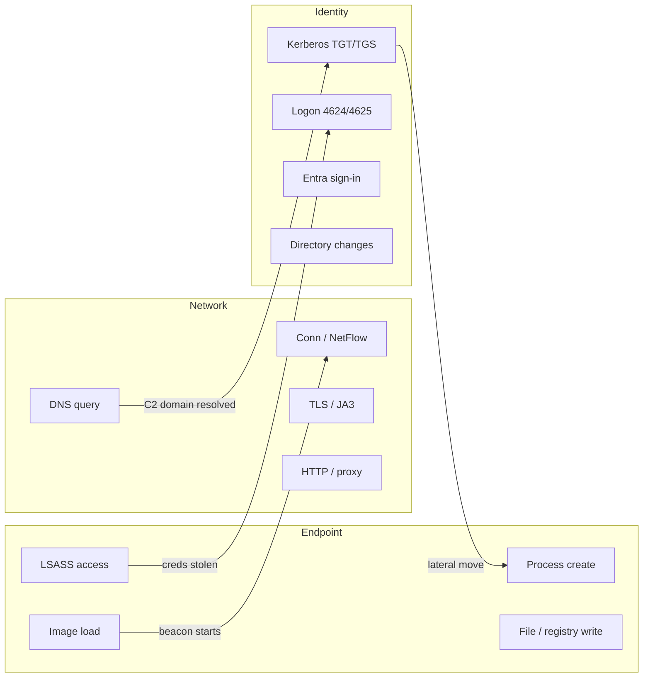
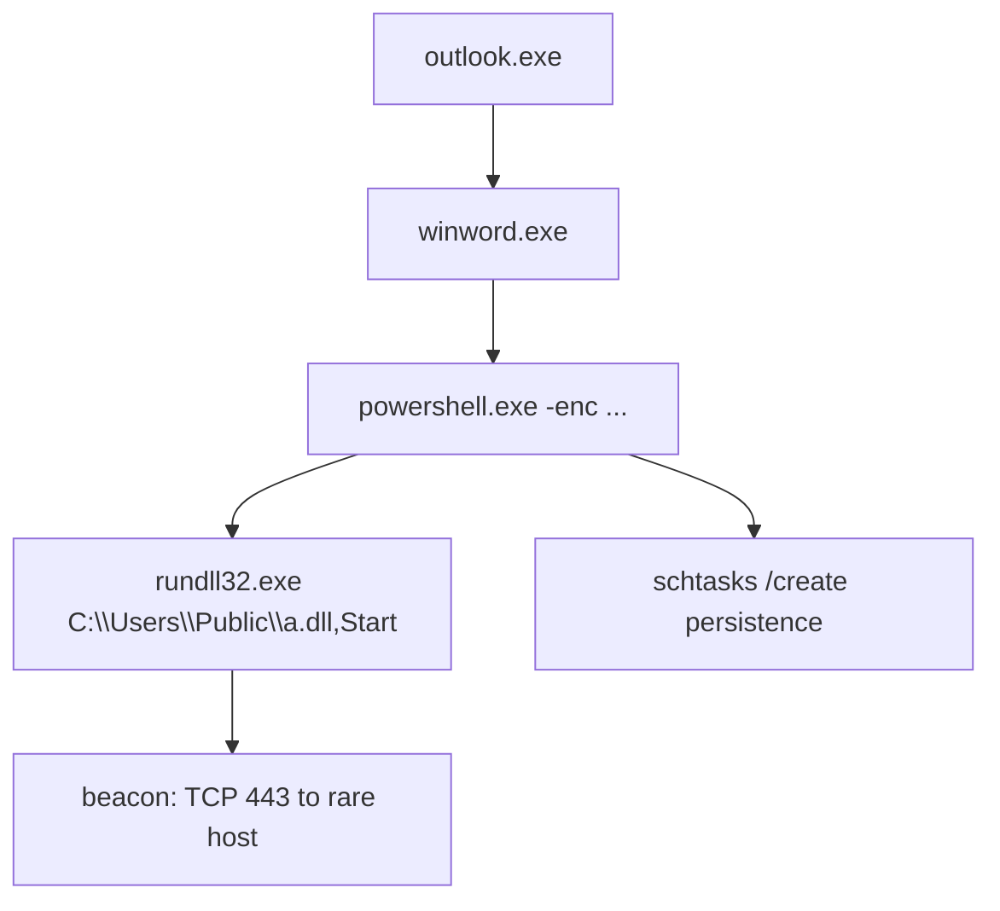
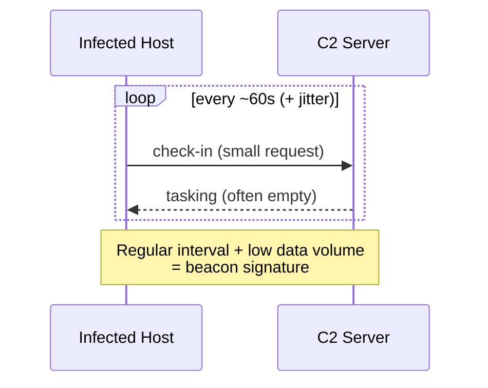
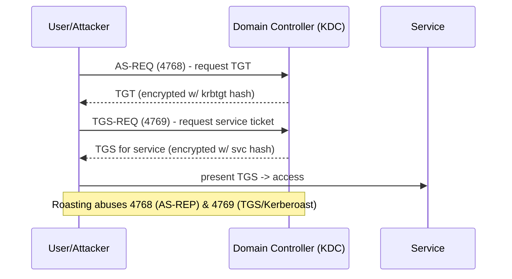
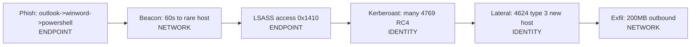
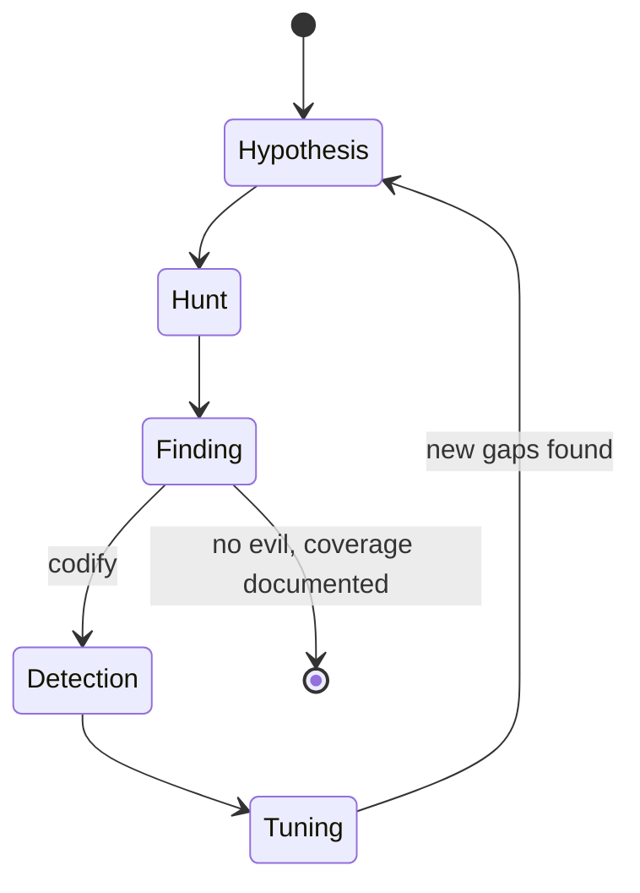

**Level:** Expert · **Track:** Threat Intel & Hunting · **Read time:** 290 min

This is Chapter 6 of the Threat Intel & Hunting notebook. The previous
chapter taught the *methodology* of hunting — how to form a testable
hypothesis, scope the data, run the PEAK/TaHiTI loop, and turn a finding
into a detection. It surveyed the telemetry domains at altitude. This
chapter comes down to ground level and stays there: it is the domain-by-domain
craft of actually finding an adversary in **endpoint**, **network**, and
**identity** telemetry — the three pillars through which nearly every modern
intrusion must pass.

The reason these three pillars matter so much is structural. An attacker who
lands on a host executes code (**endpoint** telemetry sees it), talks to
infrastructure they control (**network** telemetry sees it), and must
eventually authenticate to reach the data they came for (**identity**
telemetry sees it). A skilled adversary can be quiet in any one pillar, but
being simultaneously invisible across all three is extraordinarily hard. The
hunter's edge is *pivoting between pillars*: a faint anomaly in one becomes a
high-confidence finding when corroborated in another. That cross-domain
correlation is the through-line of this entire chapter.

Everything here is defensive and is performed on telemetry you are authorised
to examine. Hunt queries touch sensitive data — user activity, source IPs,
authentication records — so run them under proper authorisation, mindful of
privacy, retention policy, and scope, on your own or your client's
environment.

---

## Part 1: The Three Pillars and Why We Pivot Between Them

Before diving into queries, fix the mental model. Every hunt in this chapter
lives inside one of three telemetry domains, and the highest-value hunts cross
the boundaries between them.



The diagram encodes a truth worth internalising: an implant that loads a
malicious DLL (endpoint) begins beaconing (network); a resolved C2 domain
(network) precedes credential use (identity); stolen credentials from LSASS
(endpoint) show up as anomalous logons (identity), which in turn spawn new
processes on a new host (endpoint). **Hunting is the act of following that
chain in whichever direction the evidence points.**

### The single unifying technique: know normal, hunt the deviation

Across all three pillars, one analytic technique does most of the work:
**stack counting**, also called *frequency of least occurrence* or *long-tail
analysis*. You aggregate a field across the whole environment and inspect the
*rare* values, because malicious activity is almost always rare relative to
the enormous normal baseline. Legitimate `explorer.exe → chrome.exe` appears
millions of times; malicious `winword.exe → powershell.exe` appears a
handful. Sorting ascending surfaces the handful.

The methodology chapter introduced stack counting at a high level. Here we
apply it relentlessly, in every domain, with the exact field to aggregate and
the exact reason the long tail is suspicious. Keep the pattern in mind as a
refrain: **`stats count by <field> | sort count` and look at the top of the
list (the rarest).**

### What "telemetry" concretely means per pillar

| Pillar | Primary sources | Key event IDs / logs | What it proves |
|--------|-----------------|----------------------|----------------|
| Endpoint | Sysmon, EDR (Defender/CrowdStrike/SentinelOne), Windows Security | Sysmon 1/3/7/8/10/11/13, Security 4688 | Code executed, injected, persisted |
| Network | Zeek, Suricata, NetFlow/IPFIX, firewall, proxy, DNS resolver | conn.log, dns.log, ssl.log, http.log | Host talked to infrastructure |
| Identity | Windows Security (DCs), Kerberos, Entra ID / Okta sign-in logs | 4624/4625/4768/4769/4776/4662, AAD SigninLogs | Principal authenticated / escalated |

A hunter fluent in all three columns can pick up a thread anywhere and trace
it end to end. The rest of this chapter builds that fluency one pillar at a
time, then fuses them.

---

## Part 2: Setting Up the Hunting Data Plane

You cannot hunt data you do not collect. Before technique comes coverage, so
this section establishes the minimum viable telemetry and the tools that read
it — taught from scratch, because later parts assume them.

### Sysmon — the endpoint hunter's microscope (from zero)

**What it is:** System Monitor (Sysmon) is a free Microsoft Sysinternals
driver + service that logs high-fidelity endpoint events to the Windows event
log under `Microsoft-Windows-Sysmon/Operational`. Native Windows auditing is
coarse; Sysmon adds process command lines, hashes, parent process, network
connections, image loads, and more — the raw material of endpoint hunting.

**Why it exists:** default Windows logging does not record full command lines
reliably, does not hash binaries, and does not capture image loads or process
access. Sysmon fills those gaps with a configurable, low-overhead sensor.

**Install on a Windows host (or lab):**

```powershell
# Download Sysmon from Sysinternals, then install with a config
# (SwiftOnSecurity or Olaf Hartong's modular config are the community standards)
Invoke-WebRequest -Uri https://download.sysinternals.com/files/Sysmon.zip -OutFile Sysmon.zip
Expand-Archive Sysmon.zip -DestinationPath C:\Sysmon
# Install as admin with a curated config (filters noise, keeps signal)
C:\Sysmon\Sysmon64.exe -accepteula -i C:\Sysmon\sysmonconfig-export.xml
# Verify the service and driver are running
Get-Service Sysmon64
```

The `-accepteula` flag suppresses the licence prompt (required for unattended
install); `-i <config>` installs the service and applies a configuration file;
without a config Sysmon logs almost everything and drowns you in noise. Update
a running config with `Sysmon64.exe -c newconfig.xml`.

**The Sysmon event IDs a hunter lives in:**

| Event ID | Meaning | Prime hunting use |
|----------|---------|-------------------|
| 1 | Process creation | Parent/child anomalies, command lines, hashes |
| 3 | Network connection | Process-to-destination mapping |
| 7 | Image (DLL) loaded | Unsigned/rare DLLs, DLL side-loading |
| 8 | CreateRemoteThread | Classic process injection |
| 10 | ProcessAccess | LSASS access (credential theft) |
| 11 | File create | Dropped payloads, staging |
| 12/13/14 | Registry events | Persistence (Run keys, services) |
| 15 | FileCreateStreamHash | Alternate data streams, mark-of-the-web |
| 22 | DNS query | Per-process DNS (tunnelling, C2 resolution) |
| 25 | Process tampering | Process hollowing / herpaderping |

**Blue team usage:** these IDs are the vocabulary of every endpoint hunt in
this chapter — memorise 1, 3, 7, 8, 10, 11, 13, 22. **Red team usage:** an
operator planning OPSEC studies the *same* table to know which of their
actions are logged and where to be quiet (e.g. preferring direct syscalls to
avoid noisy image loads, or `comsvcs.dll` MiniDump vs. touching LSASS in a way
that trips Event 10).

### Zeek — the network hunter's flight recorder (from zero)

**What it is:** Zeek (formerly Bro) is an open-source network analysis
framework that turns raw packets into rich, structured, tab-separated logs —
one per protocol (`conn.log`, `dns.log`, `ssl.log`, `http.log`, `x509.log`,
`files.log`). It is not an IDS that only fires on signatures; it records
*everything* it sees as connection metadata, which is exactly what hunting
needs.

**Why it exists:** full packet capture is enormous and rarely retained for
long; signature IDS misses novel attacks. Zeek's protocol-aware connection
records are compact, retainable for months, and searchable — the sweet spot
for retrospective hunting.

**Install on Linux (lab sensor):**

```bash
# Debian/Ubuntu via the official OpenSUSE-hosted packages
echo 'deb http://download.opensuse.org/repositories/security:/zeek/xUbuntu_22.04/ /' \
  | sudo tee /etc/apt/sources.list.d/zeek.list
sudo apt update && sudo apt install -y zeek
# Point Zeek at an interface (or read a pcap offline)
sudo /opt/zeek/bin/zeek -i eth0        # live capture on eth0
/opt/zeek/bin/zeek -r capture.pcap     # offline processing of a pcap
```

`-i eth0` selects a live interface (needs privileges/monitor access); `-r
capture.pcap` reads a saved capture offline — invaluable for hunting over an
incident's packet dump. Zeek writes `*.log` files into the working directory;
`zeek-cut` extracts named columns:

```bash
# Extract just the fields you care about from conn.log
cat conn.log | zeek-cut id.orig_h id.resp_h id.resp_p proto duration orig_bytes resp_bytes
```

`zeek-cut <fields...>` prints only the named columns from a Zeek TSV, skipping
the header comments — the fastest way to slice logs on the command line.

### Getting it into a SIEM: Splunk, Sentinel/KQL, Elastic/EQL

Hunting at scale means querying a SIEM, not grepping files. This chapter uses
three query languages, so here is the one-line orientation for each:

- **Splunk SPL** — `index=... | stats ... | where ...`. Pipeline of commands.
- **Microsoft Sentinel KQL** — `Table | where ... | summarize ... by ...`.
  Also the language for Microsoft 365 Defender advanced hunting.
- **Elastic EQL** — event-sequence language: `sequence by host.id [process
  where ...] [network where ...]`, purpose-built for correlated hunts.

You do not need to master all three; pick your shop's stack. Queries below are
given in whichever language expresses the idea most clearly, with the
technique explained so you can port it.

---

## Part 3: Endpoint Hunting — Process Execution and Trees

Endpoint hunting starts with **process creation** (Sysmon Event 1 / Security
4688), because code execution is the beachhead of almost every attack. The
richest single artefact is the **parent/child relationship**: what launched
what. Normalcy is highly structured — `services.exe` launches services,
`explorer.exe` launches user apps — so deviations stand out.

### Anomalous parent/child pairs (stack counting in action)

```sql
-- Splunk: rarest parent -> child process pairs across the fleet
index=sysmon EventCode=1
| stats count dc(Computer) as hosts values(CommandLine) as cmds
    by ParentImage, Image
| sort count
| head 40
```

`stats count dc(Computer) as hosts ... by ParentImage, Image` aggregates every
parent→child pair, counting occurrences and the number of distinct hosts;
`sort count` (ascending) floats the rarest pairs to the top; `head 40`
inspects the long tail. **Rare pairs on few hosts are your candidates.** The
canonical red flags:

| Parent | Child | Why suspicious |
|--------|-------|----------------|
| `winword.exe` / `excel.exe` | `powershell.exe`, `cmd.exe`, `wscript.exe` | Macro / phishing execution |
| `w3wp.exe` (IIS) | `cmd.exe`, `powershell.exe` | Web shell command execution |
| `services.exe` | `cmd.exe` from odd path | Malicious service |
| `sqlservr.exe` | `cmd.exe` | `xp_cmdshell` abuse |
| `explorer.exe` | binary in `\Users\Public\`, `\Temp\` | User-run dropper |
| any Office app | `mshta.exe`, `regsvr32.exe`, `rundll32.exe` | LOLBIN proxy execution |

The same idea in **KQL** for Microsoft 365 Defender:

```kusto
DeviceProcessEvents
| where InitiatingProcessFileName in~ ("winword.exe","excel.exe","outlook.exe")
| where FileName in~ ("powershell.exe","cmd.exe","wscript.exe","cscript.exe","mshta.exe")
| project Timestamp, DeviceName, InitiatingProcessFileName, FileName, ProcessCommandLine
| order by Timestamp desc
```

`in~` is KQL's case-insensitive membership test; `project` selects columns;
`order by ... desc` sorts newest first. This single query catches the majority
of commodity phishing-to-execution chains.

### Command-line hunting — the intent is in the arguments

The *command line* often reveals intent that the binary name hides. Hunt for
the tell-tale flags of encoded/obfuscated PowerShell, download cradles, and
LOLBIN abuse:

```sql
-- Splunk: encoded / suspicious PowerShell invocations
index=sysmon EventCode=1 Image="*\\powershell.exe"
| regex CommandLine="(?i)(-enc|-encodedcommand|-e[nc]* |frombase64string|iex|invoke-expression|downloadstring|-nop|-w hidden|-windowstyle hidden)"
| table _time Computer ParentImage CommandLine
```

`regex CommandLine="..."` keeps only events whose command line matches the
pattern; the alternation covers Base64 execution (`-enc`), in-memory download
cradles (`DownloadString`, `IEX`), and evasion flags (`-nop`, `-w hidden`).
**Red team usage:** operators know these strings are hunted, so they obfuscate
— which is itself huntable (see LOLBIN and entropy hunts below). **CTF angle:**
blue-team CTFs and the Splunk *Boss of the SOC* (BOTS) datasets are built
almost entirely around exactly these `EventCode=1` command-line hunts.

### Reconstructing the full process tree

When a candidate surfaces, expand it into its full ancestry and descendants —
the tree tells the story:



```sql
-- Splunk: pull the whole tree around a suspicious PID/GUID
index=sysmon EventCode=1 (ProcessGuid="{GUID}" OR ParentProcessGuid="{GUID}")
| eval node=Image." <- ".ParentImage
| table _time Computer ProcessId ParentProcessId node CommandLine
| sort _time
```

Using `ProcessGuid`/`ParentProcessGuid` (globally unique, unlike reusable
PIDs) lets you stitch parents to children reliably even across PID reuse. This
is the pivot from "one weird process" to "the entire intrusion on this host."

---

## Part 4: Endpoint Hunting — Injection, LSASS, and Persistence

Execution is step one. Adversaries then **inject into other processes** (to
hide and to access memory), **steal credentials** (usually from LSASS), and
**establish persistence**. Each leaves distinctive endpoint telemetry.

### Process injection and remote threads (Sysmon 8, 10, 25)

```sql
-- CreateRemoteThread into a sensitive/host process (classic injection)
index=sysmon EventCode=8
| search TargetImage IN ("*\\lsass.exe","*\\explorer.exe","*\\svchost.exe","*\\rundll32.exe")
| stats count by SourceImage, TargetImage, Computer
| sort count
```

Event 8 (`CreateRemoteThread`) firing from an unusual `SourceImage` into a
system process is a strong injection signal. Event 25 (process tampering)
flags hollowing/herpaderping. **The long tail rule applies:** legitimate
remote-thread creation is rare and comes from a small known set (e.g. some AV);
everything else deserves a look.

### LSASS access — the credential-theft chokepoint (Sysmon 10)

Nearly every credential-dumping technique (Mimikatz `sekurlsa::logonpasswords`,
`comsvcs.dll` MiniDump, `procdump -ma lsass.exe`, direct `MiniDumpWriteDump`)
must open a handle to **LSASS**. That makes Sysmon Event 10 (ProcessAccess with
`TargetImage=lsass.exe`) one of the most valuable single hunts in existence:

```sql
-- LSASS access by non-standard processes (MITRE T1003.001)
index=sysmon EventCode=10 TargetImage="*\\lsass.exe"
| search NOT SourceImage IN ("*\\wininit.exe","*\\services.exe","*\\csrss.exe","*\\lsass.exe","*\\MsMpEng.exe")
| eval susp_access=if(match(GrantedAccess,"0x1010|0x1410|0x1438|0x143a|0x1fffff"),"YES","no")
| table _time Computer SourceImage GrantedAccess CallTrace susp_access
```

The `GrantedAccess` mask matters: `0x1010`/`0x1410`/`0x1438` include
`PROCESS_VM_READ` + `PROCESS_QUERY_INFORMATION`, the combination
credential-dumpers request. The `CallTrace` field often reveals the offending
module (e.g. a call originating from an unbacked/unknown memory region rather
than a signed DLL). Also hunt the specific LOLBIN dump:

```sql
-- comsvcs.dll MiniDump one-liner (living-off-the-land LSASS dump)
index=sysmon EventCode=1 CommandLine="*comsvcs.dll*" CommandLine="*MiniDump*"
```

**IR use case:** a single hit here during an investigation frequently pins the
exact moment of credential theft, which then explains later identity anomalies
(Part 8) — the endpoint→identity pivot in action.

### Persistence hunting (Sysmon 11/12/13, services, tasks)

Persistence is where attackers trade stealth for durability, so it is fertile
hunting ground. Hunt autoruns landing in user-writable paths, new services,
and scheduled tasks:

```sql
-- Run-key persistence writing to user-writable paths (T1547.001)
index=sysmon EventCode=13 TargetObject="*\\CurrentVersion\\Run\\*"
| where match(Details,"(?i)\\\\users\\\\|\\\\temp\\\\|\\\\programdata\\\\|\\\\appdata\\\\")
| table _time Computer TargetObject Details
```

```kusto
// KQL: newly registered services or scheduled tasks
DeviceProcessEvents
| where FileName in~ ("sc.exe","schtasks.exe")
| where ProcessCommandLine has_any ("create","/create","/sc")
| project Timestamp, DeviceName, AccountName, ProcessCommandLine
```

`match()`/`has_any` filter for the suspicious substrings; user-writable target
paths are the signal because legitimate autostart entries live in
program-managed locations. Cross-reference new persistence against your change
management — unexplained new autoruns are high-value findings.

| Persistence class | Telemetry to hunt | Rare-is-bad signal |
|-------------------|-------------------|--------------------|
| Run/RunOnce keys | Sysmon 13 registry set | Target path in user-writable dir |
| Services | Sysmon 13 / Security 7045 | Binary in Temp, unsigned |
| Scheduled tasks | Security 4698 / schtasks cmd | Odd trigger, base64 action |
| WMI event subs | Sysmon 19/20/21 | Any — rare in most environments |
| Startup folder | Sysmon 11 file create | Executable dropped to Startup |

---

## Part 5: Endpoint Hunting — Living-off-the-Land (LOLBins)

Advanced adversaries avoid dropping obvious malware; they abuse **signed,
built-in Windows binaries** — *living-off-the-land binaries*, or **LOLBins** —
to download, execute, and proxy. Because the binaries are legitimate and
signed, signature detection fails; hunting shifts to *anomalous usage* of
normal tools.

### The LOLBin hunt list

```sql
-- Splunk: high-value LOLBin execution with network or download behaviour
index=sysmon EventCode=1
    Image IN ("*\\mshta.exe","*\\regsvr32.exe","*\\rundll32.exe","*\\certutil.exe",
              "*\\bitsadmin.exe","*\\wmic.exe","*\\msbuild.exe","*\\installutil.exe",
              "*\\regasm.exe","*\\cmstp.exe")
| regex CommandLine="(?i)(http|https|ftp|/i:|scrobj|javascript:|-decode|-urlcache|transfer)"
| stats count by Computer Image CommandLine
| sort count
```

Each binary has a known abuse: `certutil -urlcache -f http://... file`
downloads payloads; `regsvr32 /s /n /u /i:http://...scrobj.dll` (the
"Squiblydoo" technique) executes remote scriptlets; `mshta http://...` runs
remote HTA; `bitsadmin /transfer` downloads via the BITS service. The `regex`
clause keys on the download/remote-exec argument patterns.

| LOLBin | Abuse technique | Hunt signature |
|--------|-----------------|----------------|
| `certutil.exe` | Download / base64 decode | `-urlcache`, `-decode`, URL in cmdline |
| `regsvr32.exe` | Squiblydoo remote scriptlet | `/i:http`, `scrobj.dll`, `/u /s` |
| `mshta.exe` | Remote HTA / vbscript | URL or `javascript:`/`vbscript:` |
| `rundll32.exe` | Proxy DLL / JS execution | `javascript:`, no DLL export, odd path |
| `bitsadmin.exe` | Background download | `/transfer`, `/download` |
| `wmic.exe` | Remote exec / recon | `process call create`, `/node:` |
| `msbuild.exe` | Inline C# task exec | `.csproj`/`.xml` from user path |

**Red team usage:** operators pick LOLBins precisely to blend in, so the hunt
is not "did `certutil` run" (it runs legitimately) but "did `certutil` run
*with a URL argument on a workstation that never uses it*" — again, stack
counting the argument patterns per host role. **Bug bounty angle** is thin
here (this is post-exploitation on internal hosts), so we skip forcing one.

### Entropy and obfuscation hunting

When command lines are obfuscated, hunt the *obfuscation itself*. High Shannon
entropy in a command line, excessive length, or high ratios of special
characters signal encoding:

```kusto
// KQL: unusually long / high-special-char PowerShell command lines
DeviceProcessEvents
| where FileName =~ "powershell.exe"
| extend cmdLen = strlen(ProcessCommandLine)
| extend specials = countof(ProcessCommandLine, @"[^a-zA-Z0-9 ]") // approx
| where cmdLen > 1000 or (specials * 1.0 / cmdLen) > 0.35
| project Timestamp, DeviceName, cmdLen, ProcessCommandLine
```

Length and special-character density are cheap proxies for "someone is trying
to hide the payload." Pair with parent-process context (Office parent + long
encoded PowerShell = high confidence).

---

## Part 6: Network Hunting — Beaconing and C2

Once an implant is running, it phones home. **Beaconing** — regular check-ins
to a command-and-control server — is the network hunter's flagship target,
because the *periodicity* is detectable even when the destination is unknown
and the traffic is encrypted.

### The anatomy of a beacon



A beacon produces many connections to the same destination at a roughly fixed
interval (the *sleep* time), typically with small, similar payload sizes. Even
with **jitter** (randomised sleep, e.g. 60s ±20%), the distribution of
inter-arrival times stays tight compared with human browsing.

### Interval / jitter analysis in the SIEM

```sql
-- Splunk: candidate beacons via low-variance inter-arrival times
index=zeek sourcetype=conn dest_is_external=1
| sort 0 src_ip dest_ip _time
| streamstats current=f last(_time) as prev_time by src_ip, dest_ip
| eval delta=_time-prev_time
| stats count avg(delta) as avg_int stdev(delta) as jitter
        avg(orig_bytes) as avg_bytes by src_ip, dest_ip
| where count > 20 AND jitter < (avg_int*0.15) AND avg_int > 10
| sort jitter
```

`streamstats last(_time)` grabs the previous connection time per src/dest pair;
`delta` is the inter-arrival gap; low `stdev` (`jitter`) relative to the mean
interval is the beacon signature; `count > 20` requires enough check-ins to be
confident. The coefficient of variation (`jitter/avg_int < 0.15`) is the key
threshold — tune it to your environment. **This is stack counting's cousin:
instead of rare values, you hunt *regular* ones, which are equally
unnatural for human traffic.**

Real tools formalise this: **RITA** (Real Intelligence Threat Analytics) and
its successor **AC-Hunter** compute a beacon score from interval consistency,
data-size consistency, and connection count over Zeek logs:

```bash
# RITA: import Zeek logs and show beacon analysis (open-source, from zero)
rita import /opt/zeek/logs/2024-01-01/ mydataset
rita show-beacons mydataset | head -20
# Output columns: Score  Source  Destination  Connections  AvgBytes  Interval
```

`rita import <zeek-logs> <db>` loads a day of Zeek logs into a dataset;
`rita show-beacons <db>` ranks src→dest pairs by beacon score (0–1, higher =
more beacon-like). A score above ~0.8 to a rare external destination is a
strong lead.

### Long connections and rare destinations

Not all C2 beacons; some hold a single long-lived connection (interactive
shells, some tunnels). Hunt both extremes plus rare destinations:

```sql
-- Long-lived single connections (possible interactive C2 / tunnel)
index=zeek sourcetype=conn | where duration > 3600 AND dest_is_external=1
| table src_ip dest_ip dest_port duration orig_bytes resp_bytes

-- Rare external destinations by connection count (stack count)
index=zeek sourcetype=conn dest_is_external=1
| stats count dc(src_ip) as hosts by dest_ip
| where count < 5   -- destinations almost nobody talks to
| sort count
```

Rare destinations touched by only one or two internal hosts are classic C2
candidates — legitimate services are used broadly, C2 narrowly.

---

## Part 7: Network Hunting — DNS, TLS, and Exfiltration

DNS and TLS carry the majority of modern C2 and exfil traffic, and each has
distinctive hunts.

### DNS tunnelling and DGA

DNS is a superb covert channel: it is rarely blocked, and data can be smuggled
in subdomain labels. Hunt for the symptoms — long/high-entropy names, high
query volume to one domain, and unusual record types:

```bash
# Zeek dns.log: overlong query names (tunnelling smuggles data in labels)
cat dns.log | zeek-cut query | awk '{ if (length($1) > 52) print length($1), $1 }' \
  | sort -nr | head -20

# High query volume to a single second-level domain (tunnel / DGA)
cat dns.log | zeek-cut query \
  | awk -F. '{ if (NF>=2) print $(NF-1)"."$NF }' \
  | sort | uniq -c | sort -nr | head -20
```

```kusto
// KQL (Sentinel): high-entropy DNS names via character distribution
DnsEvents
| where isnotempty(Name)
| extend nlen = strlen(Name)
| where nlen > 45
| summarize q=count() by Name, ClientIP
| where q > 50
| order by q desc
```

**DGA** (domain generation algorithms) produce many random-looking domains
(e.g. `kq3v9z7bd1.com`); hunt hosts resolving many *distinct* second-level
domains with high failure (NXDOMAIN) rates:

```sql
-- Splunk: hosts with many NXDOMAIN responses (DGA beaconing to find live C2)
index=zeek sourcetype=dns rcode_name=NXDOMAIN
| stats dc(query) as distinct_nx by src_ip
| where distinct_nx > 50
| sort - distinct_nx
```

High distinct-NXDOMAIN counts per host are the DGA fingerprint: the malware
tries many algorithmically generated domains, most unregistered, until one
resolves. **Detection/defense note:** feeding these findings into a blocklist
and a Sigma rule closes the loop (Part 10).

### TLS/JA3 fingerprinting and certificate anomalies

Encrypted C2 hides payloads but not the TLS *handshake*. **JA3** hashes the
client's TLS ClientHello (cipher suites, extensions, curves) into a fingerprint;
malware families often have distinctive, reusable JA3 values. **JA3S** does the
same for the server hello.

```sql
-- Rare JA3 client fingerprints (stack count) — malware often has a fixed JA3
index=zeek sourcetype=ssl
| stats count dc(src_ip) as hosts values(server_name) as sni by ja3
| where hosts < 5
| sort count
```

Also hunt certificate red flags: self-signed certs on non-standard ports,
extremely short validity, mismatched/absent SNI, and the classic **JA3 known
to Cobalt Strike/Metasploit** values from threat-intel feeds.

| Network hunt | Signal | Telemetry |
|--------------|--------|-----------|
| Beaconing | Low-jitter regular interval | conn.log / NetFlow |
| Long connection | Duration >> normal | conn.log |
| Rare destination | Few internal hosts talk to it | conn.log / proxy |
| DNS tunnelling | Long/high-entropy names, volume | dns.log |
| DGA | Many distinct NXDOMAIN per host | dns.log |
| JA3 anomaly | Rare/known-bad TLS fingerprint | ssl.log |
| Exfil | Large `orig_bytes` outbound, off-hours | conn.log / NetFlow |

### Data exfiltration hunts

```sql
-- Outbound data volume anomalies (exfil): more sent than a client should
index=zeek sourcetype=conn dest_is_external=1
| stats sum(orig_bytes) as sent_out sum(resp_bytes) as recv_in by src_ip, dest_ip
| where sent_out > 50000000 AND sent_out > (recv_in*3)   -- >50MB, mostly outbound
| sort - sent_out
```

Clients normally *receive* far more than they send; a host sending far more
than it receives to an external destination is an exfil candidate. Correlate
timing with off-hours (`date_hour`) for extra signal.

---

## Part 8: Identity Hunting — Kerberos and Windows Authentication

Identity is where intrusions turn into breaches, because reaching data requires
authentication. On-prem, the richest identity telemetry is **Windows Security
logs on domain controllers** and **Kerberos** events.

### The Kerberos event vocabulary



| Event ID | Meaning | Roasting/attack relevance |
|----------|---------|---------------------------|
| 4768 | Kerberos TGT requested (AS-REQ) | AS-REP roasting; enc-type downgrade |
| 4769 | Kerberos service ticket (TGS) | Kerberoasting (RC4 tickets for SPNs) |
| 4776 | NTLM credential validation | Password spraying, pass-the-hash |
| 4624/4625 | Logon success/failure | Spray, brute force, lateral movement |
| 4662 | Directory object access | DCSync (replication rights abuse) |
| 4738/4728 | Account/group change | Privilege escalation, persistence |

### Kerberoasting and AS-REP roasting

**Kerberoasting** requests service tickets (4769) for accounts with SPNs, then
cracks the RC4-encrypted ticket offline. The hunt: many 4769 events for
distinct SPNs from one account, especially with weak encryption type `0x17`
(RC4):

```sql
-- Splunk: Kerberoasting — many RC4 service tickets from one principal
index=wineventlog EventCode=4769 Ticket_Encryption_Type=0x17
    Service_Name!="krbtgt" Service_Name!="*$"
| stats dc(Service_Name) as distinct_spns values(Service_Name) as spns
    by Account_Name, Client_Address
| where distinct_spns > 5
| sort - distinct_spns
```

`Ticket_Encryption_Type=0x17` is RC4-HMAC — modern environments should use AES
(`0x12`/`0x11`), so RC4 requests are a downgrade signal; one account requesting
tickets for *many* distinct SPNs in a short window is the roasting pattern.

**AS-REP roasting** targets accounts with "do not require Kerberos
preauthentication" set — hunt 4768 with preauth type 0 / enc type RC4:

```sql
-- AS-REP roasting: TGT requests without pre-auth (huntable pre-condition)
index=wineventlog EventCode=4768 Pre_Authentication_Type=0
| stats count by Account_Name, Client_Address
```

**Red team usage:** these are staple AD escalation techniques (HTB/THM AD boxes
lean on them heavily); **blue team usage:** the queries above are among the
highest-ROI identity hunts because the attacks are noisy in exactly this way.

### DCSync, Golden Tickets, and domain dominance

**DCSync** abuses replication rights to pull password hashes as if it were a
DC. Hunt 4662 for the replication GUIDs from non-DC accounts:

```sql
-- DCSync: replication access (GetChanges) from a non-DC principal
index=wineventlog EventCode=4662
    Properties="*1131f6aa-9c07-11d1-f79f-00c04fc2dcd2*"  /* DS-Replication-Get-Changes */
| search NOT Account_Name IN ("*$")   -- machine accounts (DCs) are expected
| table _time Account_Name Object_Name Client_Address
```

The GUID `1131f6aa-...` is the `DS-Replication-Get-Changes` extended right;
legitimate replication comes from DC machine accounts (`*$`), so a *user*
account triggering it is DCSync. **Golden/Silver tickets** are harder to see
directly (forged TGTs skip the AS-REQ), so hunt the *side effects*: TGS
requests (4769) with no preceding TGT request (4768) for the same user, tickets
with anomalously long lifetimes, or logons for accounts that never legitimately
authenticate.

### Password spraying and brute force

```sql
-- Password spraying: one/few passwords across MANY accounts (low-and-slow)
index=wineventlog EventCode=4625
| bin _time span=30m
| stats dc(Account_Name) as targeted_accounts count as failures
    by Client_Address, _time
| where targeted_accounts > 15 AND failures > 15
| sort - targeted_accounts
```

Spraying inverts brute force: instead of many passwords against one account
(lockout-prone), it tries one password against many accounts. The hunt keys on
**one source hitting many distinct accounts** with failures in a window —
`dc(Account_Name)` high, per source IP. Follow any subsequent 4624 *success*
from the same source as a probable compromise.

---

## Part 9: Identity Hunting — Cloud and Federated Identity

Modern estates authenticate through **Entra ID (Azure AD)**, Okta, or similar,
and the attacks shift accordingly: token theft, illicit OAuth consent,
impossible travel, and MFA fatigue. The telemetry is the **sign-in logs** and
**audit logs**.

### Impossible travel and anomalous sign-ins

```kusto
// KQL (Sentinel): impossible travel — same user, distant locations, short gap
SigninLogs
| where ResultType == 0   // successful sign-ins only
| project TimeGenerated, UserPrincipalName, IPAddress,
          City = tostring(LocationDetails.city),
          Country = tostring(LocationDetails.countryOrRegion)
| order by UserPrincipalName asc, TimeGenerated asc
| serialize
| extend prevCountry = prev(Country), prevTime = prev(TimeGenerated),
         prevUser = prev(UserPrincipalName)
| where UserPrincipalName == prevUser and Country != prevCountry
| extend gapMin = datetime_diff('minute', TimeGenerated, prevTime)
| where gapMin < 120        // two countries within 2 hours = impossible
| project TimeGenerated, UserPrincipalName, prevCountry, Country, gapMin, IPAddress
```

`serialize` + `prev()` compares each sign-in to the previous row for the same
user; two distinct countries within an impossible travel window is the signal.
Cross-check with known VPN/egress IPs to cut false positives.

### OAuth consent abuse and token theft

Illicit **application consent** grants a malicious app long-lived access to
mailboxes/files, bypassing MFA entirely. Hunt the audit log for risky consent
grants:

```kusto
// Suspicious OAuth app consent grants
AuditLogs
| where OperationName has "Consent to application"
| extend app = tostring(TargetResources[0].displayName)
| mv-expand ModifiedProperties = TargetResources[0].modifiedProperties
| where ModifiedProperties.displayName == "ConsentAction.Permissions"
| where tostring(ModifiedProperties.newValue) has_any ("Mail.Read","Mail.ReadWrite","Files.ReadWrite.All","offline_access")
| project TimeGenerated, InitiatedBy, app, ConsentedPermissions = ModifiedProperties.newValue
```

High-privilege scopes (`Mail.Read`, `Files.ReadWrite.All`, `offline_access`)
granted to an unfamiliar app is a classic cloud persistence/exfil vector
(the pattern behind many real business-email-compromise cases).

### MFA fatigue and legacy-auth hunts

```kusto
// MFA fatigue / bombing: many MFA challenges then a success
SigninLogs
| where ResultType in ("50074","500121","0")  // MFA required / denied / success
| summarize challenges=countif(ResultType != "0"),
            successes=countif(ResultType == "0") by UserPrincipalName, bin(TimeGenerated, 1h)
| where challenges > 8 and successes > 0
```

```kusto
// Legacy authentication (bypasses modern MFA/Conditional Access)
SigninLogs
| where ClientAppUsed in ("Other clients","IMAP4","POP3","SMTP","Exchange ActiveSync")
| summarize count() by UserPrincipalName, ClientAppUsed, IPAddress
```

Legacy protocols do not support modern MFA, so attackers deliberately use them
for spraying; any successful legacy-auth sign-in warrants a look. **Detection/
defense angle:** these hunts frequently graduate straight into Conditional
Access policies (block legacy auth) and Sentinel analytics rules.

---

## Part 10: Correlating the Kill Chain Across All Three Pillars

Individual-pillar hunts find *candidates*; correlation across pillars turns a
candidate into a confirmed intrusion. This is the chapter's central skill.



The correlation is *temporal and entity-based*: the same host and user thread
the events together. In practice you build this by pivoting on a shared key —
hostname, source IP, or user — across indexes:

```sql
-- Splunk: stitch endpoint + network + identity around one host in a window
(index=sysmon Computer="WKSTN-042") OR
(index=zeek src_ip="10.0.4.42") OR
(index=wineventlog Computer="WKSTN-042" OR Account_Name="jdoe")
| eval pillar=case(index=="sysmon","endpoint", index=="zeek","network", 1==1,"identity")
| sort _time
| table _time pillar EventCode Image dest_ip Account_Name CommandLine
```

Reading the unified timeline, the story assembles itself: Office spawns
PowerShell (endpoint) → a new low-jitter beacon to a rare host appears
(network) → LSASS is accessed (endpoint) → the stolen account starts
Kerberoasting and then logs on to a second host (identity) → a large outbound
transfer follows (network). Any single event might be benign; the *sequence*
is not.

**Elastic EQL** expresses cross-pillar sequences natively:

```sql
sequence by host.id with maxspan=1h
  [ process where process.parent.name in ("winword.exe","excel.exe")
      and process.name == "powershell.exe" ]
  [ network where destination.ip != null and network.direction == "egress" ]
  [ process where process.name == "lsass.exe" and event.action == "process_access" ]
```

`sequence by host.id with maxspan=1h` requires the bracketed events to occur
*in order on the same host within an hour* — encoding the kill chain as a
single detection. This is the natural end state of a mature hunt: the ad-hoc
correlation becomes a durable, ordered rule.

---

## Part 11: Hands-On Lab — A Full Multi-Domain Hunt

This lab runs one intel-driven hypothesis end to end across all three pillars,
with real commands and realistic output. **Scenario:** CTI reports that a
commodity loader is landing via macro-enabled documents, beaconing over HTTPS
with ~60s jittered sleep, dumping LSASS via `comsvcs.dll`, then Kerberoasting.
Hypothesis: *if this actor is in our environment, we will see an Office→
PowerShell chain, a low-jitter beacon, LSASS access, and a burst of RC4 TGS
requests — on the same host/user thread.*

### Step 1 — Endpoint: find the initial execution

```sql
index=sysmon EventCode=1 ParentImage IN ("*\\winword.exe","*\\excel.exe")
    Image IN ("*\\powershell.exe","*\\cmd.exe","*\\wscript.exe")
| table _time Computer User ParentImage Image CommandLine
```

Realistic output:

```
_time                Computer    User   ParentImage       Image             CommandLine
2024-01-15 09:14:02  WKSTN-042   jdoe   ...\winword.exe   ...\powershell.exe  powershell -nop -w hidden -enc SQBFAFgAKA...
```

One hit on `WKSTN-042`, user `jdoe`, encoded PowerShell spawned by Word — our
Patient Zero. Pivot on this host and user for every subsequent step.

### Step 2 — Network: confirm the beacon

```sql
index=zeek sourcetype=conn src_ip="10.0.4.42" dest_is_external=1
| sort 0 dest_ip _time
| streamstats current=f last(_time) as prev by dest_ip
| eval delta=_time-prev
| stats count avg(delta) as interval stdev(delta) as jitter avg(orig_bytes) as bytes by dest_ip
| where count>20 AND jitter < interval*0.15
```

Realistic output:

```
dest_ip          count  interval  jitter  bytes
185.203.116.44   58     60.4      6.1     412
```

58 check-ins, ~60s interval, ~6s jitter (10%), tiny 412-byte requests to a
single rare external IP: a textbook beacon. Enrich `185.203.116.44` against
threat intel — flagged as a known C2 by the same report.

### Step 3 — Endpoint: catch the credential theft

```sql
index=sysmon (EventCode=10 TargetImage="*\\lsass.exe" Computer="WKSTN-042")
    OR (EventCode=1 Computer="WKSTN-042" CommandLine="*comsvcs*MiniDump*")
| table _time Computer SourceImage GrantedAccess CommandLine
```

Realistic output:

```
_time                Computer    SourceImage        GrantedAccess  CommandLine
2024-01-15 09:22:41  WKSTN-042   ...\rundll32.exe   0x1410         rundll32 C:\Windows\System32\comsvcs.dll MiniDump 660 C:\Users\Public\l.bin full
```

`comsvcs.dll MiniDump` against PID 660 (LSASS), `GrantedAccess 0x1410`,
output staged to `C:\Users\Public\l.bin`. Credential theft confirmed at
09:22:41.

### Step 4 — Identity: catch the Kerberoasting

```sql
index=wineventlog EventCode=4769 Ticket_Encryption_Type=0x17
    Client_Address="10.0.4.42" Service_Name!="krbtgt"
| stats dc(Service_Name) as spns values(Service_Name) by Account_Name
```

Realistic output:

```
Account_Name   spns  values(Service_Name)
jdoe           11    MSSQLSvc/sql01, HTTP/web01, CIFS/fs01, ...
```

Account `jdoe`, from the same host IP, requested RC4 tickets for 11 distinct
SPNs at 09:24 — Kerberoasting, minutes after the LSASS dump.

### Step 5 — Assemble the timeline and scope

```sql
(index=sysmon Computer="WKSTN-042") OR (index=zeek src_ip="10.0.4.42")
    OR (index=wineventlog (Computer="WKSTN-042" OR Account_Name="jdoe"))
| sort _time | table _time index EventCode Image dest_ip Account_Name
```

```
09:14:02  sysmon      1     powershell.exe    -              jdoe
09:15:08  zeek        -     -                 185.203.116.44 -
09:22:41  sysmon      10    rundll32.exe      -              -
09:24:10  wineventlog 4769  -                 -              jdoe
09:31:55  wineventlog 4624  -                 -              jdoe (logon to FS01, type 3)
```

The full chain — execution → beacon → credential theft → roasting → lateral
movement — on one host/user thread. Scope by hunting the beacon IP and the
`comsvcs MiniDump` pattern across *all* hosts to find other victims, then hand
to IR with a clean timeline.

### Step 6 — Findings summary

| Time | Pillar | Finding | ATT&CK |
|------|--------|---------|--------|
| 09:14 | Endpoint | Word → encoded PowerShell | T1566/T1059.001 |
| 09:15 | Network | 60s beacon to 185.203.116.44 | T1071.001 |
| 09:22 | Endpoint | comsvcs LSASS dump | T1003.001 |
| 09:24 | Identity | Kerberoast (11 RC4 SPNs) | T1558.003 |
| 09:31 | Identity | Lateral logon to FS01 | T1021.002 |

Every row becomes a detection in the next section.

---

## Part 12: From Findings to Detections (the Hunt-to-Detection Flywheel)

A hunt that finds evil but produces no lasting detection has done only half its
job. Each confirmed finding should graduate into an automated rule so the
machine catches the next occurrence. This closes the flywheel introduced in
the methodology chapter.



Convert the lab's beacon finding into a portable **Sigma** rule:

```yaml
title: LSASS Dump via comsvcs.dll MiniDump
id: 9a1f2c34-7b0e-4d2a-9c11-comsvcslsass01
status: stable
logsource:
  product: windows
  category: process_creation
detection:
  selection:
    Image|endswith: '\rundll32.exe'
    CommandLine|contains|all:
      - 'comsvcs'
      - 'MiniDump'
  condition: selection
level: high
tags:
  - attack.credential_access
  - attack.t1003.001
```

Sigma is a vendor-neutral detection format; `sigmac`/`sigma-cli` converts it to
Splunk SPL, KQL, or Elastic. The Kerberoast finding becomes a scheduled Splunk
alert (the Part 8 query with a threshold), and the beacon becomes either a RITA
job or a Sentinel scheduled analytics rule. **The discipline: every hunt closes
with either a new detection or documented coverage of why none is needed.**

| Finding | Detection artefact | Where it lives |
|---------|-------------------|----------------|
| comsvcs LSASS dump | Sigma → SPL/KQL rule | SIEM analytics |
| 60s beacon | RITA job + intel blocklist | NSM + firewall |
| Kerberoast RC4 burst | Scheduled SIEM alert | SIEM analytics |
| Impossible travel | Sentinel analytics rule | Cloud SIEM |
| Legacy auth success | Conditional Access block | Entra ID |

---

## Part 13: Detection & Defense Angle

Pulling the defensive thread together, hunting across these pillars both finds
intrusions and *hardens the telemetry itself*. Consolidated guidance:

- **Instrument before you hunt.** No Sysmon config, no endpoint hunt; no Zeek/
  NetFlow, no network hunt; no DC audit policy for 4769/4662, no identity hunt.
  Deploy a curated Sysmon config, enable Kerberos and directory-access
  auditing, and ship Entra sign-in/audit logs to your SIEM. Coverage is the
  precondition for every query above.
- **Baseline per role.** "Rare" only means something against a baseline.
  Workstation, server, and DC baselines differ enormously — a `certutil` URL
  fetch is odd on a workstation, routine on a build server. Stack-count within
  role groups.
- **Tune to reduce false positives, not signal.** Vulnerability scanners cause
  impossible-travel and spray-like patterns; admin jump boxes look like lateral
  movement. Maintain allowlists of known-benign sources rather than raising
  thresholds blindly.
- **Feed intelligence both ways.** CTI seeds hypotheses (a reported JA3, C2 IP,
  or TTP); findings enrich CTI (new IOCs, a local TTP variant). This is the CTI
  ↔ hunting loop from earlier chapters made concrete.
- **Prioritise the chokepoints.** LSASS access (Event 10), 4769 RC4 bursts,
  4662 replication from users, and low-jitter beacons are disproportionately
  high-value because almost every intrusion must pass through them. If you can
  only watch a few things, watch these.
- **Detection engineering closes the loop.** Every hunt finding becomes a
  Sigma rule, a scheduled alert, or a Conditional Access policy (Part 12).
  Hunting without detection output is entertainment, not defence.

**MITRE ATT&CK is the shared map** across all three pillars — tag every finding
and every detection with technique IDs (T1003.001, T1558.003, T1071.001, …) so
coverage can be measured against the matrix and gaps become the next
hypotheses.

---

## Part 14: Common Pitfalls

- **Hunting without a baseline.** Sorting by "rare" is meaningless if you don't
  know what normal looks like for that host role. Build baselines first.
- **Alerting on the technique instead of the anomaly.** `certutil.exe`,
  `powershell.exe`, and 4769 events fire constantly and legitimately. Hunt the
  *anomalous usage* (URL argument, encoded payload, RC4 burst), not the binary
  or event alone, or you drown in false positives.
- **Single-pillar tunnel vision.** A weak endpoint signal dismissed in
  isolation is often a confirmed intrusion once network and identity are
  checked. Always attempt the cross-pillar pivot before closing a lead.
- **Ignoring PID reuse.** PIDs are recycled; correlate process events by
  `ProcessGuid`, not PID, or you will stitch unrelated processes together.
- **Threshold brittleness.** Hard-coded thresholds (`>15 accounts`,
  `jitter<0.15`) drift as the environment changes. Prefer relative/statistical
  baselines and review thresholds periodically.
- **Time-zone and clock skew.** Cross-pillar correlation depends on aligned
  timestamps. Normalise everything to UTC at ingest; skewed clocks scramble
  kill-chain ordering.
- **Data gaps mistaken for absence of evil.** "No hits" can mean "not
  collected." Confirm the telemetry exists and is complete for the window
  before concluding a host is clean.
- **Forgetting to close the loop.** A finding that produces no detection means
  the same attack succeeds again next week. Always graduate findings to rules.

---

## Part 15: Final Revision / Summary

- **Three pillars, one principle.** Endpoint (code executed), network (talked
  to infrastructure), identity (authenticated). Every intrusion crosses all
  three; the hunter's edge is *pivoting between them*.
- **Stack counting is the master technique.** Aggregate a field, inspect the
  long tail (or, for beacons, the too-regular middle). `stats count by <field>
  | sort count`.
- **Endpoint:** hunt parent/child anomalies (Office→PowerShell), encoded
  command lines, injection (Sysmon 8/25), LSASS access (Sysmon 10, GrantedAccess
  masks), persistence (Sysmon 13, services, tasks), and LOLBins (`certutil`,
  `regsvr32`, `mshta`, `rundll32`).
- **Network:** hunt beaconing (low jitter, RITA scores), long connections, rare
  destinations, DNS tunnelling/DGA (long names, NXDOMAIN bursts), JA3
  anomalies, and outbound-heavy exfil.
- **Identity:** hunt Kerberoasting (4769 RC4 bursts), AS-REP roasting (4768
  preauth 0), DCSync (4662 replication GUID from users), spraying (4625 across
  many accounts), impossible travel, OAuth consent abuse, MFA fatigue, and
  legacy auth.
- **Correlation is the payoff.** Thread events by host/user/IP into one
  timeline (Splunk multi-index, or Elastic EQL `sequence`); a benign single
  event is a confirmed kill chain in sequence.
- **Close the flywheel.** Every finding → a Sigma rule, scheduled alert, or
  Conditional Access policy, tagged with ATT&CK.

**Memory hooks:** *"Executed, talked, authenticated"* (the three pillars).
*"Rare on endpoint, regular on network, roasted on identity."* *"Know normal,
hunt the deviation."* *"A hunt ends in a detection or it didn't end."*

---

## Part 16: Cheat Sheet / Quick Reference

**Endpoint (Sysmon/EDR):**

```sql
# Anomalous parent/child (stack count)
index=sysmon EventCode=1 | stats count by ParentImage, Image | sort count
# Encoded PowerShell
index=sysmon EventCode=1 Image=*powershell.exe | regex CommandLine="(?i)-enc|frombase64string|iex|downloadstring|-w hidden"
# LSASS access
index=sysmon EventCode=10 TargetImage=*lsass.exe SourceImage!=*services.exe SourceImage!=*wininit.exe
# comsvcs LSASS dump
index=sysmon EventCode=1 CommandLine=*comsvcs*MiniDump*
# Run-key persistence to user path
index=sysmon EventCode=13 TargetObject=*CurrentVersion\Run\* Details=*\users\*
```

**Network (Zeek/NetFlow/DNS):**

```sql
# Beacon (low jitter)
... streamstats last(_time)... | where jitter < interval*0.15 AND count>20
# Long DNS names (tunnelling)
cat dns.log | zeek-cut query | awk '{if(length($1)>52)print}'
# DGA (NXDOMAIN burst)
index=zeek sourcetype=dns rcode_name=NXDOMAIN | stats dc(query) by src_ip | where dc>50
# Rare destination
index=zeek sourcetype=conn dest_is_external=1 | stats count dc(src_ip) by dest_ip | where count<5
# Rare JA3
index=zeek sourcetype=ssl | stats count dc(src_ip) by ja3 | where dc<5
# Exfil
index=zeek sourcetype=conn | stats sum(orig_bytes) sum(resp_bytes) by src_ip dest_ip | where orig>50MB
```

**Identity (Windows/Kerberos/Entra):**

```sql
# Kerberoasting (RC4 bursts)
index=wineventlog EventCode=4769 Ticket_Encryption_Type=0x17 | stats dc(Service_Name) by Account_Name | where dc>5
# AS-REP roast
index=wineventlog EventCode=4768 Pre_Authentication_Type=0
# DCSync
index=wineventlog EventCode=4662 Properties=*1131f6aa-9c07-11d1-f79f-00c04fc2dcd2*  Account_Name!=*$
# Password spray
index=wineventlog EventCode=4625 | stats dc(Account_Name) by Client_Address | where dc>15
# Impossible travel (KQL)
SigninLogs | ... prev(Country) != Country within 2h ...
# Legacy auth (KQL)
SigninLogs | where ClientAppUsed in ("IMAP4","POP3","SMTP","Other clients")
```

**Key event IDs:** Sysmon 1(proc) 3(net) 7(dll) 8(remote thread) 10(lsass)
11(file) 13(registry) 22(dns) 25(tamper). Security 4624/4625(logon)
4662(dir access) 4688(proc) 4698(task) 4768/4769(kerberos) 4776(ntlm)
7045(service).

**ATT&CK quick map:** T1059.001 (PowerShell), T1218 (LOLBins/signed proxy),
T1055 (injection), T1003.001 (LSASS), T1547.001 (Run keys), T1071.001 (web C2),
T1071.004 (DNS C2), T1048 (exfil), T1558.003 (Kerberoast), T1208/T1558.004
(AS-REP), T1003.006 (DCSync), T1110.003 (spray), T1078.004 (cloud accounts).

---

## Part 17: Practice Labs & Resources

Train each pillar on datasets and ranges built for exactly these hunts:

- **Splunk Boss of the SOC (BOTS) v1–v3** — free datasets purpose-built for
  endpoint/identity hunting; the canonical way to practise `EventCode=1`,
  `4769`, and web-shell hunts in real SPL.
- **Mordecai / Security Datasets (OTRF Mordor / Security-Datasets project)** —
  pre-recorded ATT&CK-technique telemetry (Sysmon + Security + Zeek) you can
  load and hunt offline, mapped to technique IDs.
- **DetectionLab / Splunk Attack Range / Microsoft Sentinel-Training-Lab** —
  build a full endpoint+identity+SIEM range, run atomic attacks, and hunt your
  own telemetry end to end.
- **Atomic Red Team** — execute individual ATT&CK techniques (T1003.001,
  T1558.003, T1071) safely in a lab and confirm your hunts fire; the fastest
  way to test detection coverage.
- **RITA sample datasets / Active Countermeasures "Cyber Threat Hunting"
  labs** — free Zeek datasets and walkthroughs specifically for beacon and
  C2 hunting.
- **Malware-Traffic-Analysis.net** — real pcaps of live infections; run them
  through Zeek and practise beacon/DNS/JA3 hunts on genuine C2 traffic.
- **TryHackMe: "Threat Hunting" / "Hunt Me" / "Benign" rooms** and **HackTheBox
  Sherlocks** — guided blue-team investigations across endpoint, network, and
  identity telemetry.
- **Microsoft 365 Defender / Sentinel KQL hunting** — the official advanced-
  hunting sample queries (GitHub `Azure/Azure-Sentinel`,
  `microsoft/Microsoft-365-Defender-Hunting-Queries`) are a ready-made library
  of identity and endpoint hunts to study and adapt.

Work one hypothesis per pillar to completion — form it, hunt it, correlate
across pillars, and graduate the finding into a Sigma rule — and you will have
exercised the entire loop this chapter teaches. The next notebook moves from
finding intrusions to the broader program that surrounds hunting.

---

*Also on [Praneeth's portfolio](https://ping-praneeth.vercel.app/notebook/threat-intel-hunting/06-hunting-across-endpoint-network-and-identity-telemetry), with comments and the latest edits.*
